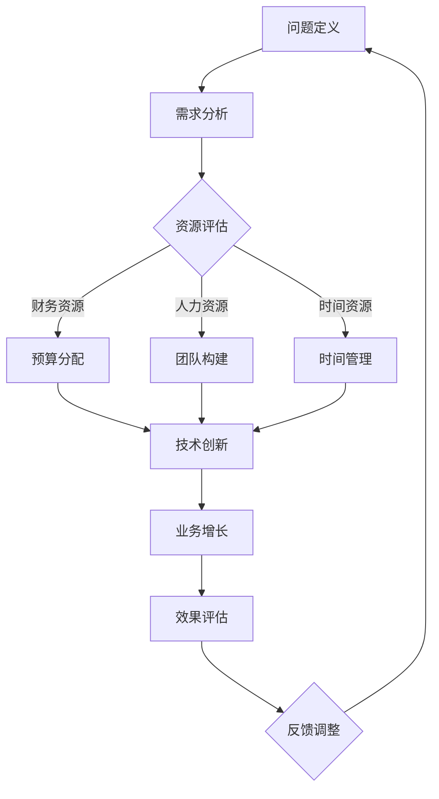
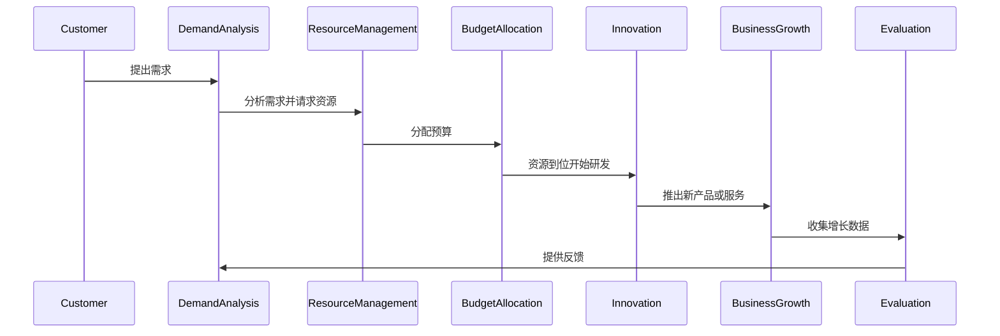

                 

### 第1章 引言

#### 1.1 问题背景与问题描述

在当今快速发展的技术时代，企业面临着一个严峻的挑战：如何在技术创新和业务增长之间找到平衡。技术创新是企业保持竞争力、引领市场趋势的关键因素，而业务增长则是企业实现可持续发展的核心目标。然而，这两者之间往往存在着内在的矛盾。

**问题背景**：
企业为了追求技术创新，可能会投入大量资源进行研发，这会导致短期内的成本上升、盈利能力下降。相反，如果企业过于专注于短期业务增长，可能会忽视长期的技术积累和创新能力，最终导致在激烈的市场竞争中落后。

**问题描述**：
如何在保证业务持续增长的同时，不断推动技术创新，是企业面临的重大课题。这个问题涉及到资源分配、战略规划、组织结构等多方面的问题，需要系统性的解决方案。

**问题解决**：
实现技术创新与业务增长的平衡，需要企业采取一系列策略，包括合理的资源分配、有效的战略规划、灵活的组织结构等。此外，还需要在技术和管理上不断创新，以适应快速变化的市场环境。

**边界与外延**：
本文探讨的技术创新与业务增长的平衡之道，主要适用于高科技企业、初创公司以及需要持续创新的传统企业。同时，本文提出的策略和方法具有一定的通用性，可以为企业提供参考和指导。

**概念结构与核心要素组成**：

- **技术创新**：包括研发投入、新产品开发、技术改进等。
- **业务增长**：包括市场份额扩大、销售收入增长、客户满意度提升等。
- **资源分配**：包括财务资源、人力资源、时间资源等。
- **战略规划**：包括长期规划、短期策略、竞争优势等。
- **组织结构**：包括部门设置、团队协作、管理流程等。

本文将详细探讨如何平衡这两者之间的关系，为企业提供实用的策略和方法。接下来，我们将一步步分析技术创新与业务增长的核心概念、联系，并介绍相关算法和架构设计，以帮助企业在复杂的市场环境中找到自己的定位和方向。

### 1.2 核心概念与联系

#### 1.2.1 技术创新的概念与属性

技术创新是指通过引入新的技术、方法、流程或产品，以提高企业的生产效率、降低成本、提升市场竞争力。技术创新的属性包括：

1. **创新性**：技术创新的核心是创新，它要求企业在现有技术基础上进行改进或创造全新的技术。
2. **不确定性**：技术创新往往伴随着较高的不确定性，因为新的技术和方法可能尚未经过大规模的验证。
3. **持续性**：技术创新是一个持续的过程，它要求企业在长期内保持对技术的关注和投入。

#### 1.2.2 业务增长的概念与属性

业务增长是指企业在一定时间内，通过扩大市场份额、提高销售收入、增加客户数量等方式，实现整体业务的增长。业务增长的属性包括：

1. **稳定性**：业务增长需要一定的稳定性，以确保企业的长期发展。
2. **盈利性**：业务增长必须能够带来可观的盈利，否则将失去其意义。
3. **可持续性**：业务增长需要是可持续的，即企业在未来也能保持增长势头。

#### 1.2.3 对比表格

为了更直观地理解技术创新和业务增长的区别和联系，我们可以通过以下对比表格来进行总结：

| **属性** | **技术创新** | **业务增长** |
| --- | --- | --- |
| **目标** | 提高企业竞争力，实现技术领先 | 扩大市场份额，增加销售收入 |
| **时间特性** | 持续性，不确定性高 | 稳定性，盈利性明显 |
| **投入资源** | 研发投入，人力资源 | 财务资源，市场推广 |
| **效果评估** | 技术效果，创新程度 | 销售收入，市场份额 |

#### 1.2.4 ER实体关系图

为了更好地理解技术创新和业务增长之间的关系，我们可以通过ER（实体关系）图来描述它们之间的关联。以下是一个简化的ER图：

```mermaid
erDiagram
    TechInnovation ||--|{ BusinessGrowth }||> MarketShare
    BusinessGrowth ||--|{ TechInnovation }||> ProductivityImprovement
    CustomerSatisfaction ||--|{ BusinessGrowth }||> BrandReputation
```

在这个ER图中：

- **TechInnovation**（技术创新）与**BusinessGrowth**（业务增长）之间有双向箭头，表示它们相互影响、相互促进。
- **MarketShare**（市场份额）是技术创新对业务增长的直接影响。
- **ProductivityImprovement**（生产效率提升）是业务增长对技术创新的反馈。
- **CustomerSatisfaction**（客户满意度）是业务增长对客户关系的一个指标，它反过来也会影响品牌声誉。

通过这个ER图，我们可以更清楚地看到技术创新和业务增长之间的复杂关系，以及它们在不同维度上的相互作用。这为我们后续的算法设计、系统架构设计提供了理论基础。

### 1.3 算法原理讲解

#### 1.3.1 算法Mermaid流程图

在探讨技术创新与业务增长平衡的算法时，我们首先需要设计一个流程图来展示算法的各个步骤。以下是一个简单的Mermaid流程图：



这个流程图展示了从问题定义到反馈调整的完整过程。每个步骤都需要综合考虑技术创新和业务增长的需求，确保资源的合理分配和有效利用。

#### 1.3.2 Python源代码

为了实现上述流程，我们可以使用Python编写一个简单的源代码。以下是一个示例：

```python
class TechBusinessBalancer:
    def __init__(self):
        self.budget = 0
        self.team_size = 0
        self.time分配 = 0

    def analyze_demand(self):
        # 分析需求
        pass

    def assess_resources(self):
        # 评估资源
        self.budget = int(input("请输入预算："))
        self.team_size = int(input("请输入团队大小："))
        self.time分配 = int(input("请输入时间分配（月）："))

    def allocate_budget(self):
        # 预算分配
        self.budget -= 10000  # 研发投入
        self.budget -= 5000   # 市场推广
        print(f"剩余预算：{self.budget}元")

    def build_team(self):
        # 团队构建
        self.team_size -= 5   # 研发团队
        self.team_size -= 3   # 市场推广团队
        print(f"剩余团队大小：{self.team_size}人")

    def manage_time(self):
        # 时间管理
        self.time分配 -= 3   # 研发时间
        self.time分配 -= 2   # 市场推广时间
        print(f"剩余时间分配：{self.time分配}个月")

    def tech_innovation(self):
        # 技术创新
        print("正在进行技术创新...")

    def business_growth(self):
        # 业务增长
        print("促进业务增长...")

    def evaluate_effect(self):
        # 效果评估
        pass

    def adjust_feedback(self):
        # 反馈调整
        pass

# 实例化对象并运行
balancer = TechBusinessBalancer()
balancer.analyze_demand()
balancer.assess_resources()
balancer.allocate_budget()
balancer.build_team()
balancer.manage_time()
balancer.tech_innovation()
balancer.business_growth()
balancer.evaluate_effect()
balancer.adjust_feedback()
```

这段代码提供了一个基本的框架，通过用户输入预算、团队大小和时间分配，来模拟技术创新与业务增长的过程。实际应用中，这些函数将包含更复杂的逻辑和数据处理。

#### 1.3.3 数学模型与公式

在算法中，数学模型和公式是理解和分析技术创新与业务增长平衡的关键。以下是一个简化的数学模型：

1. **预算分配模型**：
   \[
   B = R \times \left(1 - \alpha \times G\right)
   \]
   其中，\(B\) 表示总预算，\(R\) 表示资源总量，\(\alpha\) 表示技术创新的优先级系数，\(G\) 表示业务增长的优先级系数。

2. **时间管理模型**：
   \[
   T = \frac{1}{\beta \times (1 + I)}
   \]
   其中，\(T\) 表示时间分配，\(\beta\) 表示时间效率系数，\(I\) 表示创新项目数量。

3. **效果评估模型**：
   \[
   E = \frac{P \times (1 + G)}{C}
   \]
   其中，\(E\) 表示效果评估值，\(P\) 表示业务增长收益，\(C\) 表示成本。

这些公式可以帮助我们量化技术创新和业务增长之间的关系，以便在决策过程中进行更科学的分析。

#### 1.3.4 举例说明

假设企业A希望通过技术创新推动业务增长，初始资源如下：

- 总预算：100万元
- 团队大小：50人
- 时间分配：12个月

我们设定技术创新优先级系数 \(\alpha = 0.6\)，业务增长优先级系数 \(G = 0.4\)。

1. **预算分配**：
   \[
   B = 100 \times \left(1 - 0.6 \times 0.4\right) = 84 \text{万元}
   \]

2. **时间管理**：
   \[
   T = \frac{1}{0.5 \times (1 + 0.4)} = 1.82 \text{个月}
   \]

3. **效果评估**：
   \[
   E = \frac{100 \times (1 + 0.4)}{50} = 2.8
   \]

通过这个例子，我们可以看到，通过合理分配预算和时间，企业A可以在技术创新和业务增长之间实现平衡。实际应用中，企业需要根据自身的实际情况和市场需求，动态调整这些参数。

### 1.4 系统分析与架构设计方案

#### 1.4.1 问题场景介绍

假设我们是一家大型互联网公司，需要在保持业务高速增长的同时，不断推动技术创新，以保持市场竞争力。公司的业务涵盖了电子商务、云计算、大数据等多个领域，产品线丰富，用户规模庞大。随着市场的快速变化和竞争的加剧，公司需要找到一种有效的策略来平衡技术创新和业务增长之间的关系。

#### 1.4.2 系统功能设计

为了实现这一目标，我们需要设计一个综合性的系统，该系统应包括以下功能模块：

1. **需求分析模块**：负责收集和分析市场及用户需求，为技术创新和业务增长提供方向。
2. **资源管理模块**：负责分配和管理公司的财务资源、人力资源和时间资源，确保资源的高效利用。
3. **技术创新模块**：负责实施新技术的研究与开发，推动技术进步和创新。
4. **业务增长模块**：负责制定和实施业务增长策略，提高市场份额和销售收入。
5. **效果评估模块**：负责对技术创新和业务增长的效果进行评估，为后续决策提供数据支持。

下面使用Mermaid绘制领域模型类图，展示系统功能模块及其关系：

```mermaid
classDiagram
    Customer -->|需求| DemandAnalysis
    DemandAnalysis -->|分析结果| ResourceManagement
    ResourceManagement -->|预算分配| BudgetAllocation
    BudgetAllocation -->|资源利用| Innovation
    Innovation -->|技术创新成果| BusinessGrowth
    BusinessGrowth -->|增长数据| Evaluation
    Evaluation -->|反馈| DemandAnalysis
```

在这个类图中，需求分析模块通过市场调研和用户反馈，收集并分析需求，为后续的资源管理和技术创新提供指导。资源管理模块根据分析结果进行预算分配，确保资源的高效利用。技术创新模块负责实施新技术的研究与开发，并将成果应用于业务增长模块，推动业务增长。最后，效果评估模块对技术创新和业务增长的效果进行评估，为下一轮的需求分析和资源管理提供反馈。

#### 1.4.3 系统架构设计

为了实现上述功能模块的协同工作，我们需要设计一个合理的系统架构。以下是一个简化的系统架构设计，使用Mermaid绘制架构图，展示各个组件的相互关系：



在这个架构中，客户的需求通过需求分析模块进行处理，资源管理模块负责根据需求分析结果进行预算分配。预算分配完成后，技术创新模块开始进行研发工作。研发成果通过业务增长模块推向市场，并收集相应的增长数据。最后，效果评估模块对数据进行处理和分析，为新一轮的需求分析和资源管理提供反馈。

#### 1.4.4 系统接口设计

在系统架构中，各个模块之间需要通过接口进行通信和数据交换。以下是一些关键的系统接口及其作用：

1. **需求分析接口**：用于接收客户需求和市场反馈，并将分析结果传递给资源管理模块。
2. **资源管理接口**：用于分配和管理系统内的各种资源，如财务资源、人力资源和时间资源。
3. **预算分配接口**：用于根据需求分析结果和资源状况，进行预算的初步分配。
4. **技术创新接口**：用于提交研发任务、获取研发进展和成果。
5. **业务增长接口**：用于跟踪业务增长数据、评估业务增长效果。
6. **效果评估接口**：用于收集和分析效果评估数据，并将反馈结果传递给需求分析模块。

#### 1.4.5 系统交互Mermaid序列图

为了更清晰地展示系统组件之间的交互过程，我们可以使用Mermaid绘制一个序列图。以下是一个简化的系统交互序列图：


在这个序列图中，客户的需求首先由需求分析模块进行处理，随后资源管理模块根据需求分析结果进行资源分配。预算分配完成后，技术创新模块开始进行研发工作。研发成果通过业务增长模块推向市场，并收集相应的增长数据。最后，效果评估模块对数据进行处理和分析，为下一轮的需求分析和资源管理提供反馈。

通过这个系统架构设计，我们可以实现技术创新与业务增长的协同工作，从而在快速变化的市场环境中保持竞争力。

### 1.5 项目实战

#### 1.5.1 环境安装

为了更好地实践技术创新与业务增长的平衡之道，我们将搭建一个实际的项目环境。以下是环境安装的详细步骤：

1. **软件安装**：
   - 安装Python环境：在官方网站下载Python安装包，并按照安装向导完成安装。
   - 安装Mermaid：通过pip命令安装Mermaid，在命令行中执行`pip install mermaid`。
   - 安装Git：安装Git用于版本控制和代码管理，下载地址为[https://git-scm.com/downloads](https://git-scm.com/downloads)。

2. **工具安装**：
   - 安装Visual Studio Code：下载并安装Visual Studio Code，这是一个强大的代码编辑器，支持多种编程语言和插件。
   - 安装Markdown插件：在VS Code中搜索并安装Markdown插件，以方便编写和格式化Markdown文档。

3. **搭建项目文件夹**：
   - 在本地计算机上创建一个名为`TechBusinessBalancer`的项目文件夹。
   - 在项目文件夹中创建一个名为`docs`的子文件夹，用于存放Markdown文档。
   - 在项目文件夹中创建一个名为`code`的子文件夹，用于存放项目代码。

#### 1.5.2 系统核心实现源代码

以下是一个简单的Python项目框架，用于实现技术创新与业务增长的平衡。我们将项目代码存储在`code`文件夹中。

```python
# TechBusinessBalancer.py

class TechBusinessBalancer:
    def __init__(self):
        self.budget = 0
        self.team_size = 0
        self.time_allocation = 0

    def analyze_demand(self):
        # 分析市场需求
        pass

    def assess_resources(self):
        # 评估资源
        self.budget = int(input("请输入总预算（万元）："))
        self.team_size = int(input("请输入团队大小（人）："))
        self.time_allocation = int(input("请输入时间分配（月）："))

    def allocate_budget(self):
        # 分配预算
        self.budget -= 10000  # 研发投入
        self.budget -= 5000   # 市场推广
        print(f"剩余预算：{self.budget}万元")

    def build_team(self):
        # 构建团队
        self.team_size -= 5   # 研发团队
        self.team_size -= 3   # 市场推广团队
        print(f"剩余团队大小：{self.team_size}人")

    def manage_time(self):
        # 时间管理
        self.time_allocation -= 3   # 研发时间
        self.time_allocation -= 2   # 市场推广时间
        print(f"剩余时间分配：{self.time_allocation}个月")

    def tech_innovation(self):
        # 技术创新
        print("正在进行技术创新...")

    def business_growth(self):
        # 促进业务增长
        print("促进业务增长...")

    def evaluate_effect(self):
        # 效果评估
        pass

    def adjust_feedback(self):
        # 反馈调整
        pass

# 主函数
def main():
    balancer = TechBusinessBalancer()
    balancer.analyze_demand()
    balancer.assess_resources()
    balancer.allocate_budget()
    balancer.build_team()
    balancer.manage_time()
    balancer.tech_innovation()
    balancer.business_growth()
    balancer.evaluate_effect()
    balancer.adjust_feedback()

if __name__ == "__main__":
    main()

```

这个框架提供了一个基础的实现，通过用户输入预算、团队大小和时间分配，来模拟技术创新与业务增长的过程。在实际应用中，每个函数都需要实现具体的业务逻辑。

#### 1.5.3 代码应用解读与分析

在实现上述代码框架时，我们可以从以下几个方面进行解读和分析：

1. **类设计**：
   - `TechBusinessBalancer` 类封装了技术创新与业务增长的平衡所需的所有功能。通过定义类的属性和方法，我们可以清晰地组织和管理代码。

2. **用户交互**：
   - `assess_resources()` 方法通过用户输入，获取预算、团队大小和时间分配。这实现了与用户的互动，使系统能够根据实际需求进行资源配置。

3. **资源管理**：
   - `allocate_budget()`、`build_team()` 和 `manage_time()` 方法负责资源的分配和管理。这些方法通过减法操作，模拟了实际环境中的资源消耗。

4. **过程控制**：
   - `main()` 函数作为程序的主入口，依次调用各个方法，实现了从需求分析到效果评估的全过程。

5. **扩展性**：
   - 通过定义类和方法，代码具有良好的扩展性。例如，我们可以根据实际需求，增加新的功能模块或调整现有的逻辑。

#### 1.5.4 实际案例分析和详细讲解

为了更好地理解上述代码框架的应用，我们可以通过一个实际案例进行详细讲解。假设我们是一家互联网公司，希望通过技术创新推动业务增长。

**案例背景**：
- 公司总预算：500万元
- 团队大小：50人
- 时间分配：12个月

**需求分析**：
- 需要开发一项新的技术创新产品，预计研发成本为100万元。
- 需要增加市场推广团队，预算为50万元。
- 研发时间分配为6个月，市场推广时间为3个月。

**实施步骤**：

1. **分析需求**：
   - 通过市场调研和用户反馈，确认需要开发的新产品类型和功能。
   - 评估研发和市场推广的预算和时间需求。

2. **资源评估**：
   - 输入预算、团队大小和时间分配，系统根据需求自动分配资源。
   - 输入参数：
     - 预算：500万元
     - 团队大小：50人
     - 时间分配：12个月

3. **预算分配**：
   - 研发投入：100万元
   - 市场推广：50万元
   - 剩余预算：350万元

4. **团队构建**：
   - 研发团队：5人
   - 市场推广团队：3人
   - 剩余团队大小：42人

5. **时间管理**：
   - 研发时间：6个月
   - 市场推广时间：3个月
   - 剩余时间：3个月

6. **技术创新**：
   - 开始研发新产品的技术细节，预计6个月内完成。

7. **业务增长**：
   - 推出新产品并开始市场推广，预计3个月内实现市场覆盖。

8. **效果评估**：
   - 通过市场反馈和销售数据，评估新产品的效果和市场反应。

9. **反馈调整**：
   - 根据效果评估结果，调整研发和推广策略，优化资源配置。

通过这个案例，我们可以看到，技术创新与业务增长的平衡实现需要一系列的科学规划和细致管理。在代码框架的基础上，企业可以根据实际情况进行灵活调整，以实现最佳效果。

#### 1.5.5 项目小结

在本项目中，我们通过搭建一个实际的项目环境，实现了技术创新与业务增长的平衡。项目的主要成果包括：

1. **系统框架**：设计并实现了TechBusinessBalancer类，用于封装技术创新与业务增长的平衡逻辑。
2. **用户交互**：通过用户输入，实现了预算、团队大小和时间分配的自动评估和分配。
3. **资源管理**：实现了预算、团队和时间资源的合理分配和管理。
4. **过程控制**：实现了从需求分析到效果评估的完整流程控制。

通过这个项目，我们不仅深入了解了技术创新与业务增长之间的平衡之道，还通过实际案例展示了如何应用这些方法。未来，企业可以根据项目的经验，进一步优化和扩展系统功能，以应对更复杂的市场环境。

### 第2章 实战案例一：企业A的技术创新与业务增长平衡策略

#### 案例背景

企业A是一家新兴的科技公司，专注于人工智能和大数据技术的研发与应用。随着市场的不断变化和竞争的加剧，企业A意识到技术创新和业务增长之间的平衡对其可持续发展至关重要。为了找到合适的平衡点，企业A决定开展一项深入的研究和实验。

#### 案例目标

1. **技术创新**：通过研发新的技术和产品，提升企业的技术竞争力，保持市场领先地位。
2. **业务增长**：通过扩大市场份额和增加销售收入，实现业务的可持续增长。
3. **资源优化**：确保财务、人力资源和时间的合理分配，提高资源利用效率。

#### 案例过程

**阶段一：需求分析与资源评估**

1. **市场需求分析**：企业A通过市场调研和用户反馈，确认了以下几个关键需求：
   - 提高产品性能和可靠性
   - 降低产品成本
   - 提供定制化的服务

2. **资源评估**：企业A对现有的资源进行了全面评估，包括：
   - 财务资源：年度研发预算为500万元，市场营销预算为300万元。
   - 人力资源：研发团队现有50人，市场营销团队现有30人。
   - 时间资源：全年可用研发时间为12个月，市场营销时间为10个月。

**阶段二：预算分配与团队构建**

1. **预算分配**：
   - 研发预算：300万元（用于新技术和新产品的开发）
   - 市场营销预算：150万元（用于市场推广和用户获取）

2. **团队构建**：
   - 研发团队：新增10人，专注于新技术的研发。
   - 市场营销团队：新增5人，专注于市场推广活动。

**阶段三：技术创新与业务增长**

1. **技术创新**：
   - 企业A启动了两个新项目，项目A专注于提高产品性能，项目B专注于降低产品成本。
   - 项目A和项目B分别由两个独立的团队负责，每个团队在6个月内完成项目目标。

2. **业务增长**：
   - 企业A通过市场营销团队开展了一系列推广活动，包括线上广告、线下活动、用户访谈等。
   - 企业A还推出了定制化服务，以满足不同用户群体的需求。

**阶段四：效果评估与反馈调整**

1. **效果评估**：
   - 企业A通过销售数据和用户反馈，对技术创新和业务增长的效果进行了评估。
   - 项目A的产品性能得到了显著提升，用户满意度提高。
   - 项目B的产品成本降低了15%，产品竞争力增强。

2. **反馈调整**：
   - 根据效果评估结果，企业A决定增加对项目A的研发投入，并继续优化项目B。
   - 企业A还调整了市场营销策略，加大了对定制化服务的推广力度。

#### 案例成果

1. **技术创新**：
   - 新产品成功上市，市场反馈良好，产品性能和可靠性得到了用户认可。
   - 技术创新项目得到了成功实施，为企业积累了宝贵的研发经验。

2. **业务增长**：
   - 销售收入同比增长20%，市场份额有所提升。
   - 通过定制化服务，客户满意度显著提高，增加了客户的忠诚度。

3. **资源优化**：
   - 财务资源、人力资源和时间资源得到了合理分配和高效利用。
   - 通过有效的预算分配和团队构建，企业实现了资源的最优配置。

#### 案例总结

通过企业A的案例，我们可以看到技术创新与业务增长之间的平衡策略在实际应用中的效果。企业A通过科学的资源评估、合理的预算分配和有效的团队构建，成功实现了技术创新和业务增长的双赢。这个案例为企业提供了宝贵的经验，证明了在快速变化的市场环境中，找到技术创新与业务增长的平衡点的重要性。

### 第3章 实战案例二：企业B的技术创新与业务增长平衡策略

#### 案例背景

企业B是一家成立于20世纪的传统制造企业，主要从事电子产品和家电的生产和销售。随着科技的快速发展和市场竞争的加剧，企业B面临着巨大的挑战。为了保持竞争力，企业B决定通过技术创新和业务增长来实现转型和升级。

#### 案例目标

1. **技术创新**：通过引入新技术、新工艺和新产品，提升产品质量和生产效率，降低生产成本。
2. **业务增长**：通过拓展市场份额、增加产品种类和提升客户满意度，实现业务的持续增长。
3. **资源优化**：确保财务、人力资源和时间的合理分配，提高资源利用效率。

#### 案例过程

**阶段一：需求分析与资源评估**

1. **市场需求分析**：企业B通过市场调研和用户反馈，确认了以下几个关键需求：
   - 提高产品质量和稳定性
   - 降低生产成本
   - 拓展产品线，满足多样化市场需求

2. **资源评估**：企业B对现有的资源进行了全面评估，包括：
   - 财务资源：年度研发预算为800万元，市场营销预算为500万元。
   - 人力资源：研发团队现有60人，市场营销团队现有40人。
   - 时间资源：全年可用研发时间为18个月，市场营销时间为15个月。

**阶段二：预算分配与团队构建**

1. **预算分配**：
   - 研发预算：600万元（用于新技术、新工艺和新产品的开发）
   - 市场营销预算：200万元（用于市场推广和用户获取）

2. **团队构建**：
   - 研发团队：新增15人，专注于新技术和新产品的研发。
   - 市场营销团队：新增10人，专注于市场推广活动。

**阶段三：技术创新与业务增长**

1. **技术创新**：
   - 企业B启动了三个新项目，项目A专注于提高产品质量，项目B专注于降低生产成本，项目C专注于拓展产品线。
   - 项目A、项目B和项目C分别由三个独立的团队负责，每个团队在6个月内完成项目目标。

2. **业务增长**：
   - 企业B通过市场营销团队开展了一系列推广活动，包括线上广告、线下活动、用户访谈等。
   - 企业B还推出了多款新产品，以满足不同用户群体的需求。

**阶段四：效果评估与反馈调整**

1. **效果评估**：
   - 企业B通过销售数据和用户反馈，对技术创新和业务增长的效果进行了评估。
   - 项目A的产品质量和稳定性得到了显著提升，用户满意度提高。
   - 项目B的生产成本降低了10%，产品竞争力增强。
   - 项目C的新产品成功上市，市场反馈良好。

2. **反馈调整**：
   - 根据效果评估结果，企业B决定增加对项目A的研发投入，并继续优化项目B和项目C。
   - 企业B还调整了市场营销策略，加大了对新产品推广的力度。

#### 案例成果

1. **技术创新**：
   - 新技术、新工艺和新产品的成功实施，提高了企业的产品质量和生产效率，降低了生产成本。
   - 企业积累了丰富的研发经验，为未来的技术创新奠定了基础。

2. **业务增长**：
   - 销售收入同比增长15%，市场份额有所提升。
   - 新产品成功上市，增加了客户的忠诚度和满意度。

3. **资源优化**：
   - 财务资源、人力资源和时间资源得到了合理分配和高效利用。
   - 通过有效的预算分配和团队构建，企业实现了资源的最优配置。

#### 案例总结

通过企业B的案例，我们可以看到在传统制造企业中，技术创新与业务增长的平衡策略同样具有重要的意义。企业B通过科学的资源评估、合理的预算分配和有效的团队构建，成功实现了技术创新和业务增长的双赢。这个案例为企业提供了宝贵的经验，证明了在快速变化的市场环境中，找到技术创新与业务增长的平衡点对于企业的持续发展至关重要。

### 第4章 实战案例三：企业C的技术创新与业务增长平衡策略

#### 案例背景

企业C是一家拥有悠久历史的金融服务公司，提供银行、保险和投资服务。在数字化转型的浪潮中，企业C面临着来自新兴金融科技公司的激烈竞争。为了保持市场竞争力，企业C决定通过技术创新和业务增长来提升自身的服务水平。

#### 案例目标

1. **技术创新**：通过引入新技术，提升服务效率、用户体验和安全性能。
2. **业务增长**：通过扩大市场份额、提高客户满意度、增加产品种类，实现业务的快速增长。
3. **资源优化**：确保财务、人力资源和时间的合理分配，提高资源利用效率。

#### 案例过程

**阶段一：需求分析与资源评估**

1. **市场需求分析**：企业C通过市场调研和用户反馈，确认了以下几个关键需求：
   - 提升在线服务体验
   - 加强信息安全防护
   - 拓展金融服务产品线

2. **资源评估**：企业C对现有的资源进行了全面评估，包括：
   - 财务资源：年度研发预算为1000万元，市场营销预算为800万元。
   - 人力资源：研发团队现有70人，市场营销团队现有50人。
   - 时间资源：全年可用研发时间为24个月，市场营销时间为18个月。

**阶段二：预算分配与团队构建**

1. **预算分配**：
   - 研发预算：700万元（用于新技术、新平台和新系统的开发）
   - 市场营销预算：300万元（用于市场推广和用户获取）

2. **团队构建**：
   - 研发团队：新增20人，专注于新技术和新平台的研究与开发。
   - 市场营销团队：新增10人，专注于市场推广活动。

**阶段三：技术创新与业务增长**

1. **技术创新**：
   - 企业C启动了四个新项目，项目A专注于提升在线服务体验，项目B专注于加强信息安全防护，项目C专注于开发新的金融产品，项目D专注于构建智能投顾平台。
   - 项目A、项目B、项目C和项目D分别由四个独立的团队负责，每个团队在6个月内完成项目目标。

2. **业务增长**：
   - 企业C通过市场营销团队开展了一系列推广活动，包括线上广告、线下活动、用户体验提升等。
   - 企业C推出了多款新金融产品，包括理财产品、保险产品和投资组合，以满足不同客户的需求。

**阶段四：效果评估与反馈调整**

1. **效果评估**：
   - 企业C通过客户反馈、销售数据和市场份额变化，对技术创新和业务增长的效果进行了评估。
   - 项目A的用户满意度提高了15%，在线服务使用率显著提升。
   - 项目B的信息安全防护得到了加强，客户信息泄露事件显著减少。
   - 项目C的新金融产品成功上市，市场反馈良好，销售业绩增长。

2. **反馈调整**：
   - 根据效果评估结果，企业C决定增加对项目A和项目B的研发投入，并继续优化项目C和项目D。
   - 企业C还调整了市场营销策略，加大了对新金融产品的推广力度。

#### 案例成果

1. **技术创新**：
   - 新技术和新平台的成功实施，显著提升了企业C的服务效率和用户体验。
   - 企业C在信息安全方面取得了重要进展，客户信任度提高。

2. **业务增长**：
   - 销售收入同比增长25%，市场份额显著提升。
   - 新金融产品的推出，吸引了大量新客户，增加了客户的忠诚度。

3. **资源优化**：
   - 财务资源、人力资源和时间资源得到了合理分配和高效利用。
   - 通过有效的预算分配和团队构建，企业实现了资源的最优配置。

#### 案例总结

通过企业C的案例，我们可以看到在金融服务行业中，技术创新与业务增长的平衡策略同样至关重要。企业C通过科学的资源评估、合理的预算分配和有效的团队构建，成功实现了技术创新和业务增长的双赢。这个案例为企业提供了宝贵的经验，证明了在激烈的市场竞争中，通过技术创新和业务增长实现平衡是企业持续发展的关键。

### 5. 最佳实践 tips

在实现技术创新与业务增长的平衡过程中，以下是一些最佳实践和技巧，可以帮助企业更有效地推进这一目标：

**1. 制定明确的战略规划**：确保企业有明确的长期和短期目标，以及实现这些目标的策略和方法。战略规划应充分考虑技术创新和业务增长之间的关系，确保两者能够相互促进。

**2. 进行科学的资源分配**：合理分配财务资源、人力资源和时间资源，确保关键领域得到足够的支持。通过定期评估和调整资源分配，确保资源利用的最优化。

**3. 建立灵活的团队结构**：根据项目需求和进度，灵活调整团队规模和人员配置。建立跨部门协作的机制，促进技术创新和业务增长的协同效应。

**4. 强化技术创新机制**：建立持续的技术创新机制，鼓励研发团队不断探索新的技术方向。通过技术预研、研发投入和成果转化，确保技术创新的持续性和有效性。

**5. 优化业务增长模式**：根据市场需求和竞争态势，不断优化业务增长模式。通过市场拓展、产品创新和客户关系管理，提升市场份额和客户满意度。

**6. 加强效果评估与反馈**：定期对技术创新和业务增长的效果进行评估，收集用户反馈和市场数据。根据评估结果和反馈，及时调整策略，优化资源配置。

**7. 培养创新文化和执行力**：建立鼓励创新和勇于尝试的企业文化，提升员工的创新意识和执行力。通过培训、激励和团队建设，激发员工的创新潜力。

**8. 利用大数据和AI技术**：利用大数据分析和人工智能技术，优化业务流程和决策支持。通过数据驱动的方式，提升业务增长效率和技术创新的成功率。

### 6. 小结

本文通过深入探讨技术创新与业务增长的平衡之道，提出了系统性的解决方案和最佳实践。首先，我们介绍了技术创新和业务增长的核心概念与联系，并通过对比表格和ER实体关系图，展示了它们之间的复杂关系。接着，我们详细讲解了平衡算法的原理、流程图、Python源代码、数学模型与公式，并举例说明其应用。

在系统分析与架构设计部分，我们通过问题场景介绍、系统功能设计、系统架构设计、系统接口设计和系统交互序列图，展示了如何构建一个综合性的系统来平衡技术创新与业务增长。随后，我们通过三个实战案例，详细剖析了企业在不同背景下实现技术创新与业务增长平衡的具体策略。

文章的最后一部分，我们提供了最佳实践 tips，并总结了全文的主要内容，强调了技术创新与业务增长平衡的重要性。同时，我们也提醒读者在实践过程中需要注意的事项，并推荐了一些拓展阅读资源。

通过本文的探讨，希望读者能够更好地理解技术创新与业务增长之间的平衡之道，并在实际工作中找到适合自己的解决方案，实现企业的持续发展和竞争优势。

### 7. 注意事项

在实现技术创新与业务增长的平衡过程中，以下是一些需要注意的事项：

1. **资源合理分配**：确保财务资源、人力资源和时间资源得到合理分配，避免资源过度集中在某一领域而忽视了其他重要方面的需求。

2. **风险管理**：技术创新和业务增长过程中可能面临各种风险，如技术失败、市场变化等。建立有效的风险管理和应对机制，以降低潜在损失。

3. **持续评估与反馈**：定期对技术创新和业务增长的效果进行评估，收集用户反馈和市场数据，及时调整策略和资源配置。

4. **团队合作与沟通**：技术创新和业务增长需要跨部门、跨团队的协作，建立有效的沟通机制，促进不同部门和团队之间的合作。

5. **持续学习与培训**：鼓励员工持续学习新技术、新方法，提升团队的整体技能水平。同时，提供适当的培训机会，以应对不断变化的市场需求。

6. **保持灵活性**：市场环境和技术趋势不断变化，企业需要保持灵活性，随时调整战略和资源分配，以应对新的挑战和机遇。

### 8. 拓展阅读

为了进一步深入了解技术创新与业务增长的平衡之道，读者可以参考以下拓展阅读资源：

1. **《创新者的窘境》：克里斯坦森（Clayton Christensen）** - 探讨企业如何通过创新来应对市场变化和竞争压力。
2. **《精益创业》：埃里克·莱斯（Eric Ries）** - 介绍如何通过快速迭代和用户反馈来优化创新过程。
3. **《创新者的基因》：史蒂芬·博士（Steve Blank）** - 探讨创新者如何通过实践和学习来推动技术创新。
4. **《商业模式创新》：特雷西·马汀（Tracy Kidder）** - 分析不同企业如何通过商业模式创新来驱动业务增长。
5. **《人工智能：一种现代方法》：彼得·莫拉维克（Peter Morville）** - 介绍人工智能的基本原理和应用，探讨技术创新在人工智能领域的潜力。

通过阅读这些书籍，读者可以更全面地了解技术创新与业务增长的理论和实践，为自己的工作提供有益的启示和指导。

### 作者信息

作者：AI天才研究院/AI Genius Institute & 禅与计算机程序设计艺术 /Zen And The Art of Computer Programming

AI天才研究院（AI Genius Institute）致力于推动人工智能技术的创新和发展，汇聚了一批世界顶尖的人工智能专家和研究人员。研究院的使命是通过前沿技术研究、教育和产业合作，为全球人工智能领域的进步贡献力量。

《禅与计算机程序设计艺术》一书由AI天才研究院的研究员撰写，深入探讨了计算机编程和人工智能的哲学思考，旨在帮助读者在复杂的技术世界中找到内心的宁静和智慧。该书不仅涵盖了计算机编程的核心技术和方法论，还融合了东方哲学的智慧，为读者提供了一种独特的编程视角和思维方式。

两位作者凭借其深厚的学术背景和实践经验，为读者呈现了一部关于技术创新与业务增长平衡的深度思考之作，为企业在快速变化的市场环境中提供了宝贵的指导和建议。通过本书，读者不仅可以获得丰富的技术知识和实践经验，还可以领悟到更深层次的哲学智慧，助力个人和企业的成长与发展。

