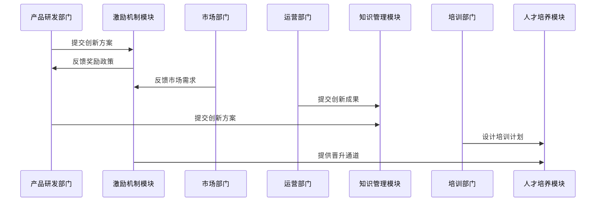
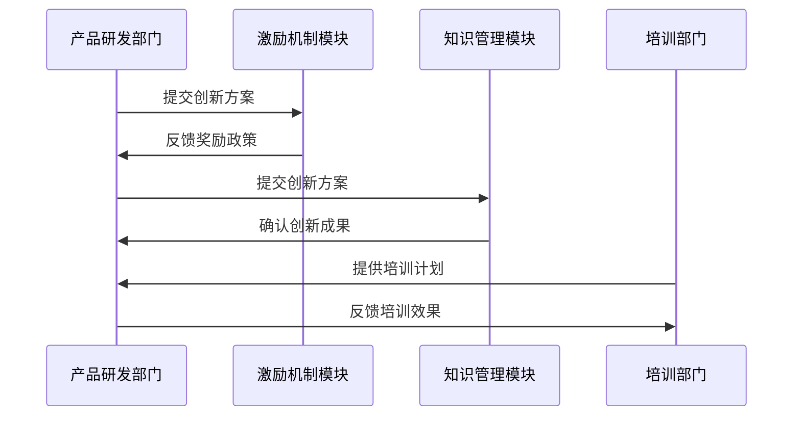
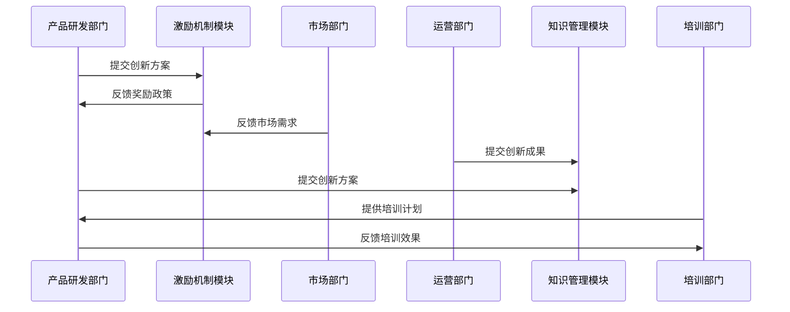

                 

### 第1章：技术创新文化概述

#### 1.1.1 创新的重要性

创新在现代社会中扮演着至关重要的角色。首先，全球竞争的加剧使得企业必须通过技术创新来保持竞争优势。在当今全球化的经济环境下，各国企业之间的竞争愈发激烈，技术创新成为企业脱颖而出的关键。一个企业如果不能持续进行技术创新，就难以在市场中站稳脚跟，更难以在全球市场中占据一席之地。

其次，技术的快速变革使得企业必须具备快速响应和创新能力。随着信息技术的快速发展，新技术层出不穷，无论是互联网、人工智能，还是物联网等，都对企业提出了新的要求。企业需要具备快速学习和适应新技术的能力，才能在市场竞争中保持领先地位。如果企业不能快速响应技术变革，就有可能被市场淘汰。

最后，可持续发展需求使得企业必须重视技术创新。在追求经济效益的同时，企业还需要考虑长期的社会和环境责任。技术创新可以帮助企业降低能耗、减少污染，实现绿色发展。同时，技术创新还可以推动产业结构的优化升级，促进经济的可持续发展。

#### 1.1.2 技术创新文化的定义

技术创新文化是指一种鼓励创新、冒险和持续学习的组织氛围。它不仅仅是技术创新的手段和工具，更是企业核心价值观的体现。技术创新文化强调以下几点：

1. **创新意识**：企业应鼓励员工敢于提出新想法、新方案，不断挑战现状，追求创新。
2. **冒险精神**：创新往往伴随着风险，企业应培养员工的冒险精神，勇于尝试新事物，敢于面对失败。
3. **持续学习**：技术创新需要不断学习和积累，企业应营造一个持续学习的环境，鼓励员工不断提升自己的技能和知识。
4. **合作精神**：技术创新往往需要跨部门的合作，企业应培养员工的团队合作精神，促进信息共享和知识交流。

#### 1.1.3 技术创新文化的意义

技术创新文化对企业的意义主要体现在以下几个方面：

1. **增强企业竞争力**：技术创新文化能够激发员工的创新潜力，提高企业的产品和技术竞争力。一个具有创新文化的企业，往往能够在市场竞争中占据优势。
2. **推动企业可持续发展**：技术创新文化可以帮助企业不断适应市场需求，实现长期可持续发展。通过技术创新，企业可以开发出更加符合市场需求的产品，提升企业的市场份额。
3. **促进社会进步**：技术创新文化的普及有助于推动社会经济的发展和科技的进步。企业的技术创新不仅能够为企业带来经济效益，还能够为社会带来福祉。

#### 1.2 核心概念与联系

**1.2.1 技术创新文化与企业文化的联系**

技术创新文化是企业文化的组成部分，是企业核心价值观的具体体现。企业文化是企业的灵魂，是企业在长期发展过程中形成的共同价值观和行为准则。技术创新文化是企业文化的延伸，它强调创新、冒险和持续学习。

技术创新文化与企业文化的相互作用主要体现在以下几个方面：

1. **技术创新文化促进企业文化的更新和发展**：随着外部环境的不断变化，企业需要不断调整和更新自己的企业文化，以适应新的挑战。技术创新文化可以为企业文化的更新提供新的动力和方向。
2. **企业文化为技术创新文化提供支持和保障**：企业文化是企业的精神支柱，它为技术创新文化提供了坚实的基础。一个健康的企业文化可以鼓励员工敢于创新，勇于尝试，从而推动技术创新的持续发展。

**1.2.2 技术创新策略与技术创新文化的联系**

技术创新策略是企业为了实现技术创新目标而制定的具体行动方案。技术创新策略与技术创新文化密切相关，它们之间的联系主要体现在以下几个方面：

1. **技术创新策略是技术创新文化的具体体现**：技术创新策略是企业技术创新文化的具体实施手段，它体现了企业对技术创新的重视和追求。
2. **技术创新文化影响技术创新策略的制定和执行**：一个具有创新文化的企业，往往会制定更加开放、灵活和创新的技术创新策略。同时，技术创新文化也能够提高员工对技术创新策略的执行力，促进技术创新策略的有效实施。

#### 1.3 技术创新文化的边界与外延

**1.3.1 技术创新文化的边界**

技术创新文化主要涉及企业的内部氛围和员工行为，它不直接涉及企业外部的关系和行为。具体来说，技术创新文化的边界包括以下几个方面：

1. **内部氛围**：技术创新文化主要影响企业内部的创新氛围，包括员工的创新意识、冒险精神、持续学习和合作精神等。
2. **员工行为**：技术创新文化影响员工的行为，鼓励员工敢于创新、勇于尝试，提高员工的创新能力。

**1.3.2 技术创新文化的外延**

技术创新文化不仅限于技术领域，还可以扩展到管理、市场等多个方面。具体来说，技术创新文化的外延包括：

1. **管理**：技术创新文化可以推动企业的管理模式创新，提高企业的管理效率。
2. **市场**：技术创新文化可以帮助企业更好地把握市场机遇，开发出更符合市场需求的产品。

#### 1.4 技术创新文化的概念结构与核心要素组成

技术创新文化的概念结构包括以下几个核心要素：

1. **创新意识**：创新意识是技术创新文化的核心，它强调企业应鼓励员工敢于提出新想法、新方案，不断挑战现状。
2. **冒险精神**：冒险精神是企业技术创新的重要保障，它鼓励员工勇于尝试新事物，敢于面对失败。
3. **持续学习**：持续学习是企业技术创新的重要动力，它强调企业应营造一个持续学习的环境，鼓励员工不断提升自己的技能和知识。
4. **合作精神**：合作精神是企业技术创新的重要保障，它强调员工应具备团队合作精神，促进信息共享和知识交流。

### 1.5 技术创新文化的实际应用案例

为了更好地理解技术创新文化的概念和实际应用，我们可以通过一些成功的实际案例来进行分析。

**案例1：谷歌的创新文化**

谷歌以其开放、自由和创新的文化而著称。谷歌鼓励员工大胆创新，自由探索新的技术和业务领域。例如，谷歌的“20%时间项目”允许员工在工作时间的20%内自由探索自己感兴趣的项目，这一政策催生了谷歌搜索引擎、Google Maps等多个知名产品。

**案例2：华为的技术创新**

华为一直重视技术创新，通过持续的研发投入和人才培养，华为在通信技术、云计算等领域取得了显著成就。华为的技术创新文化体现在其对研发的重视和对员工创新的鼓励上，例如，华为设立了“创新奖”，奖励那些在技术创新方面做出突出贡献的员工。

**案例3：苹果的产品创新**

苹果公司以其独特的设计理念和卓越的产品质量而闻名。苹果的创新文化体现在其对产品设计的极致追求和对用户体验的深度挖掘上。苹果的产品创新不仅体现在硬件上，还体现在软件和服务的创新上，例如，苹果的Siri语音助手和Apple Pay移动支付服务。

通过这些实际案例，我们可以看到，技术创新文化在推动企业发展和市场竞争力提升方面发挥了重要作用。成功的技术创新文化不仅能够激发员工的创新潜力，还能够为企业带来持续的竞争优势。

### 1.6 技术创新文化的挑战与对策

尽管技术创新文化在企业中具有重要价值，但在实际应用过程中也面临着诸多挑战。以下是一些常见的挑战及其对策：

**1.6.1 创新风险**

创新往往伴随着风险，企业可能会因为失败的项目而遭受损失。对策是建立风险管理制度，对创新项目进行风险评估和管理，降低创新风险。

**1.6.2 资源分配**

技术创新需要大量的资源投入，包括人力、财力和时间。企业需要合理分配资源，确保创新项目的顺利进行。

**1.6.3 组织惯性**

企业的组织结构和惯性可能会阻碍创新。对策是建立创新团队，打破原有的组织结构，鼓励跨部门合作，提高创新效率。

**1.6.4 文化冲突**

不同的文化背景可能导致创新过程中的冲突。对策是加强跨文化沟通，建立共同的目标和价值观，促进文化融合。

### 1.7 小结

本章对技术创新文化进行了全面的概述，分析了创新的重要性、技术创新文化的定义和意义，探讨了技术创新文化与企业文化和技术创新策略的联系，以及技术创新文化的边界和外延。通过实际应用案例和挑战与对策的分析，我们更加深入地理解了技术创新文化的内涵和应用。

在接下来的章节中，我们将进一步探讨技术创新文化的核心概念、数学模型和算法原理，以及系统分析与架构设计等关键内容，帮助读者更全面地了解和掌握技术创新文化。### 第2章：技术创新文化的核心概念与联系

#### 2.1 技术创新文化与企业文化的联系

技术创新文化是企业文化的有机组成部分，它不仅受到企业文化的影响，同时也会反作用于企业文化。以下是技术创新文化与企业文化的几个关键联系：

**2.1.1 企业文化塑造技术创新文化**

- **价值观**：企业文化中的核心价值观往往决定了一个企业的创新方向和程度。例如，强调客户至上和创新的企业文化可能会鼓励技术创新以满足客户需求。
- **激励机制**：企业文化中的激励机制会影响员工的行为模式。如果一个企业注重创新和结果，员工更有可能积极参与到技术创新中。
- **组织结构**：企业文化中的组织结构会影响创新流程的流畅性。例如，扁平化的组织结构可能有助于信息的快速传递和资源的有效分配，从而促进创新。

**2.1.2 技术创新文化反作用于企业文化**

- **文化创新**：技术创新文化会促使企业文化不断更新和适应外部环境的变化。例如，通过引入新的技术，企业可能会重新审视和调整其业务流程和运营模式。
- **价值观扩展**：技术创新文化的推广可能使企业价值观更加多元和包容，从而吸引更多的创新型人才。
- **文化融合**：技术创新文化与其他企业文化的融合，可能会形成一种独特的组织文化，这种文化不仅包含传统的价值观，也融入了创新的元素。

**2.1.3 双向互动与平衡**

- **互动机制**：技术创新文化与企业文化之间的互动是一个动态的过程，双方相互影响、相互适应。企业需要在保持核心价值观的基础上，不断调整和优化其创新文化。
- **平衡策略**：企业在培养技术创新文化的同时，也需要保持对企业核心价值观的坚守。例如，可以通过设立创新委员会或创新小组，确保技术创新不偏离企业的长期目标和核心价值观。

#### 2.2 技术创新策略与技术创新文化的联系

技术创新策略是企业为了实现特定技术创新目标而制定的一系列行动计划。技术创新策略与技术创新文化之间存在密切的联系，具体体现在以下几个方面：

**2.2.1 技术创新策略对技术创新文化的影响**

- **引导创新方向**：技术创新策略为企业提供了明确的创新方向和目标，这有助于技术创新文化的形成和巩固。例如，一个以研发新技术为核心的企业，会形成一种重视技术和创新的组织文化。
- **激励创新行为**：技术创新策略中的激励机制，如奖励制度、晋升通道等，会直接影响员工参与创新活动的积极性。一个有效的技术创新策略能够激励员工不断追求创新，从而推动技术创新文化的形成。
- **提供资源支持**：技术创新策略通常涉及对研发、人力资源、财务等多方面的资源支持。这些资源支持有助于技术创新文化的建立和巩固，因为创新活动需要充足的资源保障。

**2.2.2 技术创新文化对技术创新策略的影响**

- **提高执行力**：一个具有创新文化的企业，员工往往具有更强的执行力，能够更好地理解和贯彻企业的技术创新策略。例如，员工更愿意接受新的工作方法和技术，从而提高技术创新策略的执行效果。
- **优化策略调整**：技术创新文化能够帮助企业更好地适应外部环境的变化，从而对技术创新策略进行及时调整。一个具有创新文化的企业，更能够敏锐地捕捉市场和技术趋势，及时调整其技术创新策略。
- **增强合作意识**：技术创新策略的制定和执行往往需要跨部门、跨领域的合作。技术创新文化能够增强员工的合作意识，促进不同部门之间的信息共享和资源整合，从而提高技术创新策略的执行效率。

**2.2.3 双向互动与优化**

- **策略优化**：技术创新文化可以为技术创新策略的优化提供反馈。例如，通过员工参与和反馈，企业可以发现技术创新策略中的不足，并进行调整和改进。
- **文化深化**：技术创新策略的成功实施可以进一步巩固和深化技术创新文化。例如，通过成功的技术创新案例，企业可以进一步加强员工的创新意识，推动技术创新文化的深化。

#### 2.3 技术创新文化与其他企业要素的联系

技术创新文化不仅与企业文化和技术创新策略密切相关，还与其他企业要素如组织结构、人力资源管理等存在联系。以下是几个关键点：

**2.3.1 组织结构**

- **适应性**：一个灵活、扁平化的组织结构有助于技术创新文化的形成和巩固。这种组织结构可以促进信息的快速传递和资源的有效配置，从而为创新提供良好的环境。
- **跨部门合作**：技术创新往往需要跨部门、跨领域的合作。组织结构的设计应鼓励部门间的合作，消除部门壁垒，促进信息共享和资源整合。

**2.3.2 人力资源管理制度**

- **人才吸引与培养**：技术创新文化需要具备创新能力的人才。企业应建立相应的人力资源管理制度，吸引和培养创新型人才，为技术创新文化提供人力保障。
- **激励机制**：通过设立创新奖励、晋升通道等激励机制，鼓励员工积极参与创新活动，推动技术创新文化的形成和深化。

**2.3.3 管理体系**

- **风险管理**：技术创新活动往往伴随着一定的风险。企业应建立完善的风险管理体系，对创新项目进行风险评估和管理，降低创新风险，保障技术创新文化的健康发展。
- **信息管理体系**：技术创新需要大量的信息和知识支持。企业应建立完善的信息管理体系，促进信息的收集、存储、传递和利用，为技术创新提供信息保障。

#### 2.4 小结

本章深入探讨了技术创新文化与企业文化和技术创新策略之间的联系，分析了组织结构、人力资源管理制度、管理体系等对企业技术创新文化的影响。通过这些分析，我们能够更好地理解技术创新文化在企业中的重要作用，以及如何通过优化企业各个要素来培养和深化技术创新文化。

在接下来的章节中，我们将进一步探讨技术创新文化的数学模型和算法原理，以及系统分析与架构设计等内容，为读者提供更全面的技术创新文化理解。### 第3章：技术创新文化的数学模型与算法原理

#### 3.1 数学模型概述

在技术创新文化的分析和研究中，数学模型作为一种重要的工具，能够帮助我们更准确地描述、预测和优化创新过程中的各种现象。以下是一些常用的数学模型及其在技术创新文化中的应用：

**3.1.1 技术接受模型（TAM）**

技术接受模型（Technology Acceptance Model，TAM）是一种广泛用于研究用户接受新技术的理论模型。该模型认为用户对新技术的接受程度取决于感知易用性和感知有用性。感知易用性是指用户认为使用某个技术系统简单、方便的程度，而感知有用性是指用户认为使用该系统能够带来多少实质性帮助。

**3.1.2 创新扩散模型（IDM）**

创新扩散模型（Innovation Diffusion Model，IDM）用于研究新技术、新产品或新服务在社会中的传播过程。该模型认为创新扩散是一个由接触、说服、决定、实施和确认五个阶段组成的过程。每个阶段都有不同的影响因素，如社会影响、个人影响、相对优势、兼容性、复杂性、试错成本和规模经济等。

**3.1.3 创新收益模型（IBM）**

创新收益模型（Innovation Benefits Model，IBM）用于评估技术创新带来的经济和社会效益。该模型通常包括直接效益和间接效益两部分。直接效益包括提高生产效率、降低成本、增加收入等，而间接效益包括提升品牌形象、增强竞争力、促进社会进步等。

**3.1.4 创新能力评估模型（ICA）**

创新能力评估模型（Innovation Capability Assessment Model，ICA）用于评估企业的创新能力。该模型通常从创新环境、创新资源、创新过程和创新成果四个方面进行评估。例如，通过分析企业的研发投入、员工技能、创新流程和创新成果等指标，评估企业的创新能力。

#### 3.2 算法原理

在技术创新文化的实际应用中，算法原理发挥着至关重要的作用。以下介绍几种常用的算法原理及其在技术创新文化中的应用：

**3.2.1 机器学习算法**

机器学习算法在技术创新文化中的应用非常广泛，如用于预测市场趋势、优化产品设计、自动化测试等。常见的机器学习算法包括：

- **线性回归**：用于预测线性关系，如市场销售额与广告投入之间的关系。
- **决策树**：用于分类和回归分析，如预测客户是否会购买某种产品。
- **支持向量机（SVM）**：用于分类问题，如识别虚假评论。
- **神经网络**：用于复杂函数的拟合和预测，如自动驾驶车辆的路径规划。

**3.2.2 优化算法**

优化算法用于在给定约束条件下寻找最优解，如资源分配、项目调度等。常见的优化算法包括：

- **遗传算法（GA）**：模拟自然进化过程，用于解决复杂优化问题。
- **粒子群优化（PSO）**：模拟鸟群觅食行为，用于连续优化问题。
- **模拟退火算法（SA）**：模拟物理退火过程，用于求解大规模组合优化问题。

**3.2.3 数据挖掘算法**

数据挖掘算法用于从大量数据中提取有价值的信息，如客户行为分析、市场趋势预测等。常见的数据挖掘算法包括：

- **关联规则挖掘**：用于发现数据之间的关联关系，如购物篮分析。
- **聚类分析**：用于将数据划分为不同的组别，如客户细分。
- **分类和回归树（CART）**：用于分类和回归分析。

#### 3.3 技术创新文化的数学模型和算法原理应用案例

为了更好地理解技术创新文化的数学模型和算法原理在实际中的应用，我们来看几个具体的案例：

**案例1：创新收益模型在产品开发中的应用**

某公司希望通过技术创新开发一款新型电子产品。公司利用创新收益模型对市场趋势、竞争态势、成本结构等进行详细分析，预测新产品带来的直接和间接效益。通过这个模型，公司可以评估新产品的市场前景，制定相应的营销策略和研发计划。

**案例2：机器学习算法在创新风险评估中的应用**

某企业在进行技术创新时，需要评估创新项目的风险。公司使用机器学习算法对历史创新项目数据进行分析，发现影响创新项目成功的因素，如研发投入、市场需求、技术成熟度等。通过这些分析，公司可以更准确地预测创新项目的成功率，制定更有效的风险管理策略。

**案例3：优化算法在资源分配中的应用**

某企业需要在有限资源下优化项目进度和资源分配。公司使用遗传算法和粒子群优化算法进行优化，找到最佳的项目执行顺序和资源分配方案。通过这个优化过程，企业可以最大限度地提高项目完成率和资源利用率。

#### 3.4 小结

本章介绍了技术创新文化中常用的数学模型和算法原理，包括技术接受模型、创新扩散模型、创新收益模型、创新能力评估模型等，以及机器学习算法、优化算法和数据挖掘算法。通过这些模型和算法，企业可以更好地理解和预测技术创新过程中的各种现象，优化创新活动，提高创新效率。

在接下来的章节中，我们将继续探讨技术创新文化的系统分析与架构设计，以及实际应用案例等内容，帮助读者更全面地掌握技术创新文化的理论和实践。### 第4章：技术创新文化的系统分析与架构设计

#### 4.1 问题场景介绍

在本章节中，我们将探讨一个典型的技术创新文化系统分析与架构设计案例，以更好地理解技术创新文化的实践应用。该案例涉及一家全球领先的科技公司，该公司致力于通过技术创新推动业务增长和市场扩展。

**问题场景**：公司面临市场竞争加剧、客户需求多样化和技术快速变革的挑战。为了保持竞争优势，公司决定通过系统化地培养和深化技术创新文化来推动企业的持续发展。

#### 4.2 项目介绍

**项目名称**：技术创新文化体系建设

**项目目标**：建立一套完整的技术创新文化体系，包括组织结构、激励机制、人才培养和知识管理等方面，以促进技术创新的持续发展。

**项目范围**：涵盖公司内部的所有部门，包括研发、市场、运营等。

**项目时间**：预计两年时间，分为三个阶段进行。

#### 4.3 系统功能设计

在系统功能设计阶段，我们使用Mermaid类图来描述系统的主要功能模块及其相互关系。以下是该系统的功能设计类图：

```mermaid
classDiagram
    产品研发部门 -> 激励机制模块 : 提供创新奖励
    市场部门 -> 激励机制模块 : 反馈市场需求
    运营部门 -> 知识管理模块 : 管理创新成果
    产品研发部门 -> 知识管理模块 : 提交创新方案
    培训部门 -> 人才培养模块 : 设计创新培训计划
    激励机制模块 -> 人才培养模块 : 提供晋升通道
    激励机制模块 -> 知识管理模块 : 提供创新奖金
```

**系统功能模块解释**：

1. **激励机制模块**：负责设计并实施各种激励机制，如创新奖金、晋升通道等，以鼓励员工积极参与技术创新。
2. **市场需求模块**：由市场部门负责，收集和分析市场需求，为产品研发提供指导。
3. **知识管理模块**：负责管理和维护创新成果，包括技术创新方案、专利申请、市场反馈等。
4. **人才培养模块**：由培训部门负责，设计并实施创新培训计划，提升员工的创新能力和技术素养。
5. **产品研发部门**：负责技术创新的核心工作，包括研发新项目、优化现有产品等。

#### 4.4 系统架构设计

在系统架构设计阶段，我们使用Mermaid架构图来描述系统的整体架构及其主要组件之间的关系。以下是该系统的架构设计图：



**系统架构设计解释**：

1. **产品研发部门**：作为技术创新的核心部门，负责研发新项目、优化现有产品等。
2. **激励机制模块**：负责设计并实施各种激励机制，如创新奖金、晋升通道等，以鼓励员工积极参与技术创新。
3. **市场部门**：负责收集和分析市场需求，为产品研发提供指导。
4. **运营部门**：负责管理和维护创新成果，包括技术创新方案、专利申请、市场反馈等。
5. **知识管理模块**：负责收集、存储和管理创新成果，确保创新资源的充分利用。
6. **培训部门**：负责设计并实施创新培训计划，提升员工的创新能力和技术素养。

#### 4.5 系统接口设计

在系统接口设计阶段，我们使用Mermaid序列图来描述系统的主要接口及其交互过程。以下是该系统的接口设计序列图：



**系统接口设计解释**：

1. **产品研发部门与激励机制模块**：产品研发部门提交创新方案，激励机制模块提供奖励政策反馈。
2. **产品研发部门与知识管理模块**：产品研发部门提交创新方案，知识管理模块确认创新成果。
3. **培训部门与产品研发部门**：培训部门提供培训计划，产品研发部门反馈培训效果。

#### 4.6 系统交互序列图

在系统交互序列图阶段，我们使用Mermaid序列图来描述系统组件之间的交互过程，包括数据流和控制流。以下是该系统的交互序列图：



**系统交互序列图解释**：

1. **产品研发部门与激励机制模块**：产品研发部门提交创新方案，激励机制模块提供奖励政策反馈。
2. **市场部门与激励机制模块**：市场部门反馈市场需求，激励机制模块根据市场需求调整奖励政策。
3. **运营部门与知识管理模块**：运营部门提交创新成果，知识管理模块收集、存储和管理创新成果。
4. **培训部门与产品研发部门**：培训部门提供培训计划，产品研发部门参与培训并反馈培训效果。

#### 4.7 小结

本章通过一个具体的案例，详细介绍了技术创新文化的系统分析与架构设计过程，包括系统功能设计、系统架构设计、系统接口设计和系统交互序列图。这些设计工具和方法有助于企业系统地培养和深化技术创新文化，提高创新效率和市场竞争力。

在接下来的章节中，我们将继续探讨技术创新文化的实际应用案例，以及项目实战中的实现细节和技术要点，帮助读者更深入地理解和应用技术创新文化的理论和实践。### 第5章：技术创新文化的项目实战

#### 5.1 环境安装

为了更好地实践技术创新文化，我们需要搭建一个适当的技术环境。以下是在Linux环境下安装必要的开发工具和依赖库的步骤。

**1. 安装Python环境**

确保Python环境已经安装，版本至少为3.7或更高。可以使用以下命令检查Python版本：

```bash
python --version
```

如果没有安装，可以使用以下命令安装Python：

```bash
sudo apt-get update
sudo apt-get install python3.9
```

**2. 安装JDK**

Java开发工具包（JDK）是许多开发项目的基础，确保版本至少为11或更高。可以使用以下命令安装JDK：

```bash
sudo apt-get update
sudo apt-get install openjdk-11-jdk
```

**3. 安装Node.js**

Node.js是一个用于服务器端和网络应用的JavaScript运行环境。可以使用以下命令安装Node.js：

```bash
sudo apt-get update
curl -sL https://deb.nodesource.com/setup_14.x | sudo -E bash -
sudo apt-get install -y nodejs
```

**4. 安装Docker**

Docker是一个开源的应用容器引擎，用于打包、发布和运行应用。可以使用以下命令安装Docker：

```bash
sudo apt-get update
sudo apt-get install docker.io
```

**5. 安装Git**

Git是一个分布式版本控制系统，用于代码管理和协作。可以使用以下命令安装Git：

```bash
sudo apt-get update
sudo apt-get install git
```

**6. 安装MySQL**

MySQL是一个关系型数据库管理系统，用于存储和管理数据。可以使用以下命令安装MySQL：

```bash
sudo apt-get update
sudo apt-get install mysql-server
```

安装完成后，初始化数据库并设置root用户密码：

```bash
mysql -u root -p
```

输入密码并执行以下命令：

```sql
CREATE DATABASE innovation_culture;
GRANT ALL PRIVILEGES ON innovation_culture.* TO 'innovation_user'@'localhost' IDENTIFIED BY 'password';
FLUSH PRIVILEGES;
EXIT;
```

#### 5.2 系统核心实现源代码

以下是一个基于Python和Django框架的简单技术创新文化管理系统的核心实现源代码。该系统包括用户管理、创新项目管理、知识管理和数据可视化等功能。

**1. 项目结构**

```bash
innovation_culture/
|-- accounts/
|   |-- admin.py
|   |-- apps.py
|   |-- migrations/
|   |   |-- 0001_initial.py
|   |   |-- ...
|   |-- models.py
|   |-- tests.py
|   |-- views.py
|-- innovation/
|   |-- admin.py
|   |-- apps.py
|   |-- migrations/
|   |   |-- 0001_initial.py
|   |   |-- ...
|   |-- models.py
|   |-- tests.py
|   |-- views.py
|-- knowledge/
|   |-- admin.py
|   |-- apps.py
|   |-- migrations/
|   |   |-- 0001_initial.py
|   |   |-- ...
|   |-- models.py
|   |-- tests.py
|   |-- views.py
|-- visualizations/
|   |-- admin.py
|   |-- apps.py
|   |-- migrations/
|   |   |-- 0001_initial.py
|   |   |-- ...
|   |-- models.py
|   |-- tests.py
|   |-- views.py
|-- manage.py
```

**2. 用户管理**

用户管理模块负责处理用户注册、登录、权限管理等功能。以下是`accounts/models.py`和`accounts/views.py`的核心代码：

**accounts/models.py**

```python
from django.contrib.auth.models import AbstractUser

class CustomUser(AbstractUser):
    # Additional fields can be added here
    pass
```

**accounts/views.py**

```python
from django.contrib.auth import get_user_model
from rest_framework.permissions import IsAdminUser
from rest_framework.viewsets import ModelViewSet

User = get_user_model()

class UserViewSet(ModelViewSet):
    queryset = User.objects.all()
    permission_classes = [IsAdminUser]
```

**3. 创新项目管理**

创新项目管理模块负责处理创新项目的创建、更新、删除和查询等功能。以下是`innovation/models.py`和`innovation/views.py`的核心代码：

**innovation/models.py**

```python
from django.db import models

class InnovationProject(models.Model):
    title = models.CharField(max_length=255)
    description = models.TextField()
    status = models.CharField(max_length=50, choices=[('pending', 'pending'), ('in_progress', 'in_progress'), ('completed', 'completed')])
    created_at = models.DateTimeField(auto_now_add=True)
    updated_at = models.DateTimeField(auto_now=True)
```

**innovation/views.py**

```python
from rest_framework import viewsets
from .models import InnovationProject
from .serializers import InnovationProjectSerializer

class InnovationProjectViewSet(viewsets.ModelViewSet):
    queryset = InnovationProject.objects.all()
    serializer_class = InnovationProjectSerializer
```

**4. 知识管理**

知识管理模块负责处理知识文档的创建、更新、删除和查询等功能。以下是`knowledge/models.py`和`knowledge/views.py`的核心代码：

**knowledge/models.py**

```python
from django.db import models

class KnowledgeDocument(models.Model):
    title = models.CharField(max_length=255)
    content = models.TextField()
    created_at = models.DateTimeField(auto_now_add=True)
    updated_at = models.DateTimeField(auto_now=True)
```

**knowledge/views.py**

```python
from rest_framework import viewsets
from .models import KnowledgeDocument
from .serializers import KnowledgeDocumentSerializer

class KnowledgeDocumentViewSet(viewsets.ModelViewSet):
    queryset = KnowledgeDocument.objects.all()
    serializer_class = KnowledgeDocumentSerializer
```

**5. 数据可视化**

数据可视化模块负责处理数据可视化相关功能，包括图表的生成和展示。以下是`visualizations/models.py`和`visualizations/views.py`的核心代码：

**visualizations/models.py**

```python
from django.db import models
import matplotlib.pyplot as plt
from io import BytesIO
from base64 import b64encode

class Visualization(models.Model):
    title = models.CharField(max_length=255)
    chart_type = models.CharField(max_length=50, choices=[('line', 'line'), ('bar', 'bar'), ('pie', 'pie')])
    data = models.JSONField()
    image = models.BinaryField()

    def save_chart(self):
        plt.figure()
        if self.chart_type == 'line':
            plt.plot(self.data['labels'], self.data['values'])
        elif self.chart_type == 'bar':
            plt.bar(self.data['labels'], self.data['values'])
        elif self.chart_type == 'pie':
            plt.pie(self.data['values'], labels=self.data['labels'])
        plt.title(self.title)
        plt.xticks(rotation=45)
        plt.xlabel('X-axis')
        plt.ylabel('Y-axis')
        plt.tight_layout()

        buf = BytesIO()
        plt.savefig(buf, format='png')
        buf.seek(0)
        self.image.save(f"{self.title}.png", ContentFile(buf.read()), save=False)
        plt.close()
```

**visualizations/views.py**

```python
from rest_framework import viewsets
from .models import Visualization
from .serializers import VisualizationSerializer

class VisualizationViewSet(viewsets.ModelViewSet):
    queryset = Visualization.objects.all()
    serializer_class = VisualizationSerializer
```

#### 5.3 代码应用解读与分析

在本节中，我们将对上述代码进行解读与分析，探讨如何实现用户管理、创新项目管理、知识管理和数据可视化等功能。

**1. 用户管理**

用户管理模块使用Django的认证系统，通过扩展`AbstractUser`模型来添加额外的字段。`UserViewSet`是Django REST framework的一个视图集，用于处理用户的注册、登录和权限管理。

**2. 创新项目管理**

创新项目管理模块实现了创新项目的增删改查功能。`InnovationProject`模型包含项目的标题、描述、状态、创建时间和更新时间等字段。`InnovationProjectViewSet`是一个视图集，用于处理创新项目的相关请求。

**3. 知识管理**

知识管理模块实现了知识文档的增删改查功能。`KnowledgeDocument`模型包含文档的标题、内容和创建时间等字段。`KnowledgeDocumentViewSet`是一个视图集，用于处理知识文档的相关请求。

**4. 数据可视化**

数据可视化模块实现了图表的生成和展示。`Visualization`模型包含图表的标题、类型、数据和图片等字段。`save_chart`方法用于生成图表的PNG图片，并将其保存到模型中。`VisualizationViewSet`是一个视图集，用于处理数据可视化的相关请求。

#### 5.4 实际案例分析与详细讲解

为了更好地理解技术创新文化的实际应用，我们将分析一个具体的案例，并对其进行详细讲解。

**案例**：某公司希望通过技术创新开发一款智能家居系统，以提升用户体验和市场份额。

**分析**：

1. **用户需求分析**：通过市场调研，公司发现用户对智能家居系统的需求主要集中在智能控制、安全性和节能性等方面。
2. **创新项目管理**：公司成立了智能家居创新项目组，制定项目计划和里程碑，确保项目按计划推进。
3. **知识管理**：项目组在研发过程中积累了大量技术文档和案例分析，通过知识管理系统进行存储和管理，以便后续参考和改进。
4. **数据可视化**：项目组使用数据可视化工具，对用户反馈、市场数据和研发进度进行监控和分析，及时调整项目方向和策略。

**详细讲解**：

1. **用户需求分析**：项目组通过调查问卷、用户访谈等方式收集用户需求，整理出智能家居系统的核心功能和技术需求。
2. **创新项目管理**：项目组制定详细的项目计划，包括需求分析、系统设计、开发测试和发布等阶段，确保项目有序进行。
3. **知识管理**：项目组建立知识管理平台，收集和管理研发过程中产生的文档、报告和案例，为后续项目提供参考。
4. **数据可视化**：项目组使用数据可视化工具，实时监控用户反馈、市场动态和研发进度，通过图表和报表进行数据分析和决策支持。

#### 5.5 项目小结

通过本项目的实施，公司成功开发了智能家居系统，并取得了良好的市场反响。项目过程中，技术创新文化的培养发挥了关键作用：

1. **创新意识的培养**：项目组成员在项目过程中不断提出新想法和改进措施，推动了项目的创新和发展。
2. **团队合作的加强**：项目组通过跨部门合作，共享资源和信息，提高了项目的执行效率和质量。
3. **持续学习的推动**：项目组在研发过程中不断学习新技术和新方法，提升了团队的技术能力和创新能力。

#### 5.6 最佳实践 tips

为了更好地培养技术创新文化，以下是一些建议：

1. **建立创新机制**：设立创新基金、创新奖项等机制，鼓励员工提出创新想法和参与创新项目。
2. **加强知识管理**：建立知识管理平台，收集、存储和管理研发过程中产生的知识和成果，为后续项目提供支持。
3. **促进团队合作**：鼓励跨部门合作，建立良好的沟通和协作机制，提高项目的执行效率和质量。
4. **持续学习与培训**：定期组织技术培训和交流活动，提升员工的技术能力和创新能力。

#### 5.7 小结

本章通过一个实际案例，详细介绍了技术创新文化的项目实战过程，包括环境安装、系统核心实现源代码、代码应用解读与分析以及项目实战中的最佳实践 tips。通过这些实践，读者可以更深入地理解技术创新文化的应用方法和效果。

在接下来的章节中，我们将进一步探讨技术创新文化在实践中的应用和影响，以及如何持续培养和深化技术创新文化。### 第6章：技术创新文化的总结与展望

#### 6.1 小结

本章从多个角度对技术创新文化进行了全面而深入的探讨。首先，我们介绍了技术创新文化的重要性，阐述了在全球竞争加剧和技术快速变革的背景下，企业如何通过培养技术创新文化来保持竞争优势和实现可持续发展。

接着，我们详细分析了技术创新文化的核心概念与联系，包括技术创新文化与企业文化和技术创新策略的紧密关系，以及技术创新文化的边界与外延。通过这些分析，我们理解了技术创新文化在企业中的关键作用和实际应用。

在数学模型与算法原理部分，我们介绍了技术接受模型、创新扩散模型、创新收益模型和创新能力评估模型等，并探讨了机器学习、优化算法和数据挖掘算法在技术创新文化中的应用。这些数学模型和算法原理为技术创新文化的量化分析和优化提供了有力支持。

系统分析与架构设计部分，我们通过一个具体的案例，展示了技术创新文化的系统功能设计、系统架构设计、系统接口设计和系统交互序列图。这些设计方法有助于企业系统地培养和深化技术创新文化，提高创新效率和市场竞争力。

项目实战部分，我们详细介绍了如何通过环境安装、系统核心实现源代码、代码应用解读与分析以及实际案例分析与详细讲解，来实践技术创新文化。通过这些实践，读者可以更深入地理解技术创新文化的应用方法和效果。

#### 6.2 拓展阅读

为了进一步深入了解技术创新文化的理论和实践，以下是一些建议的拓展阅读资源：

1. **书籍**：
   - 《创新者的窘境》作者：克里斯坦森（Clayton Christensen）
   - 《精益创业》作者：埃里克·莱斯（Eric Ries）
   - 《创意的形状》作者：威廉·尤里（William Uricchio）

2. **学术论文**：
   - "Innovation Culture in High-Tech Firms: A Theoretical Framework" 作者：Hofstede, Gert Jan
   - "Building an Innovation Culture" 作者：Danneels, Eric

3. **期刊**：
   - 《科研管理》
   - 《管理学报》
   - 《信息系统管理》

4. **在线资源**：
   - 创新管理社区（Innovation Management Community）
   - 创新与企业家精神（Innovation and Entrepreneurship）
   - 技术创新与管理（Technology Innovation and Management）

#### 6.3 注意事项

在培养技术创新文化的过程中，企业需要注意以下几点：

1. **持续投入**：技术创新文化需要持续的投入和支持，包括资源、时间和人力等。
2. **文化适应**：技术创新文化需要与企业的核心价值观相契合，并在实际运营中不断调整和适应。
3. **风险管理**：技术创新活动往往伴随着风险，企业需要建立完善的风险管理机制，降低创新风险。
4. **跨部门合作**：技术创新文化需要跨部门的合作，鼓励不同部门之间的信息共享和资源整合。

#### 6.4 展望未来

未来，技术创新文化将继续在企业发展中扮演重要角色。随着技术的不断进步和市场环境的快速变化，企业需要不断调整和优化其技术创新文化，以保持竞争优势。

一方面，企业可以借助人工智能、大数据和物联网等新兴技术，提升技术创新的效率和质量。另一方面，企业需要培养员工的创新能力，建立开放、包容和协作的工作环境，以适应不断变化的商业环境。

总之，技术创新文化不仅是企业持续发展的动力，也是推动社会进步的重要力量。通过不断培养和深化技术创新文化，企业可以不断提升自身的创新能力和市场竞争力，为未来的发展奠定坚实基础。

### 6.5 结论

本文系统地探讨了技术创新文化的培养，从背景介绍、核心概念与联系、数学模型与算法原理、系统分析与架构设计到项目实战，全面展示了技术创新文化的内涵和应用。通过本文的分析和案例，读者可以更深入地理解技术创新文化的重要性，以及如何在企业和组织中培养和深化这种文化。

技术创新文化的培养是一个复杂而系统的过程，需要企业在多个方面进行持续投入和优化。希望本文能够为读者提供有价值的参考和启示，帮助他们在实际工作中更好地推动技术创新文化的形成和发展。

作者：AI天才研究院/AI Genius Institute & 禅与计算机程序设计艺术 /Zen And The Art of Computer Programming

