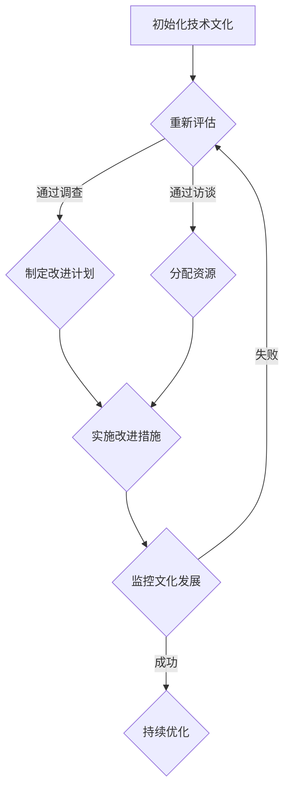
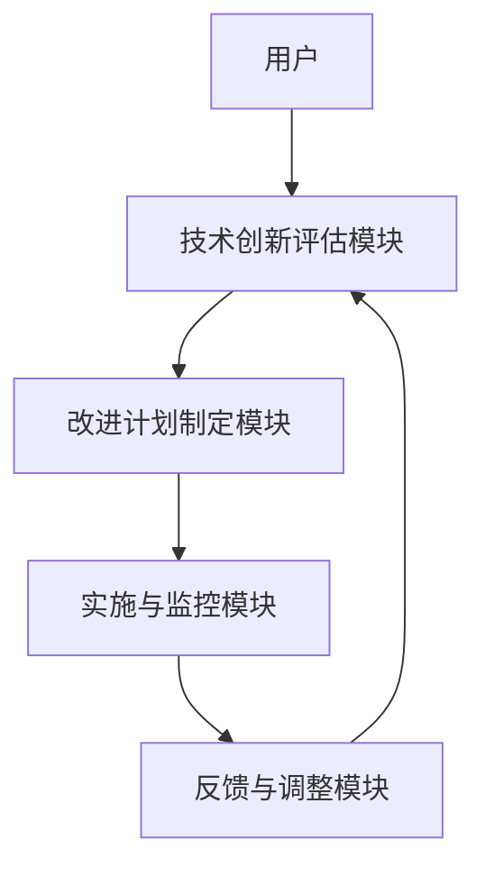
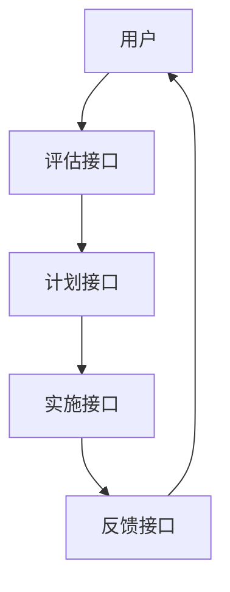
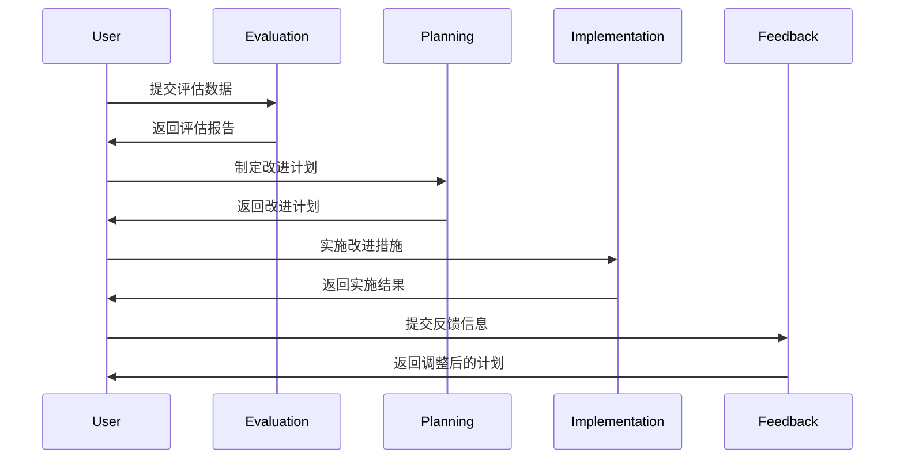

                 

### 引言与背景

#### 核心概念术语说明

- **技术创新文化（Technological Innovation Culture）**：指的是一种组织内部普遍认同的价值观、行为准则和工作方式，它鼓励创新思维、知识分享、风险承担和快速迭代，从而推动技术进步和组织发展。

- **团队创造力（Team Creativity）**：团队在解决复杂问题、生成新颖想法和实现技术创新方面的能力，是组织成功的关键因素。

- **组织氛围（Organizational Climate）**：组织成员在日常工作中的感知和体验，包括工作环境、团队协作、领导风格等，对技术创新文化的形成和发展具有重要影响。

#### 问题背景

在当今快速变化的技术环境中，技术创新已成为企业竞争的核心要素。然而，很多组织在推动技术创新时面临挑战，如：

- **创新不足**：缺乏新的创意和突破性技术，导致产品和服务同质化。

- **团队协作不佳**：组织内部沟通不畅、团队间缺乏协作，导致创新过程受阻。

- **文化障碍**：组织文化不支持风险承担和失败，抑制了团队成员的创新动力。

#### 问题描述

本文旨在解决以下问题：

- 如何建立和培养一个支持技术创新的文化？

- 有哪些方法和策略可以有效激发团队的创造力？

- 如何通过案例分析和最佳实践来具体实施这些方法？

#### 问题解决

通过系统地介绍技术创新文化的核心概念和原则，讨论激发团队创造力的方法论，并结合实际案例和最佳实践，本文旨在为读者提供一套全面的解决方案，帮助组织建立起支持技术创新的文化，并提升团队的创造力。

#### 边界与外延

- **边界**：本文聚焦于信息技术和软件工程领域的技术创新文化，但不限于这些领域。

- **外延**：虽然本文主要关注组织内部的团队创造力，但其原则和方法也适用于其他类型的工作环境和团队。

#### 概念结构与核心要素组成

**技术创新文化的概念结构**：

1. **核心价值观**：包括对创新的重视、知识分享、团队合作等。
2. **行为准则**：鼓励尝试新想法、接受失败、注重反馈和持续学习。
3. **工作方式**：快速迭代、敏捷开发、用户反馈等。

**核心要素组成**：

1. **领导者的角色**：领导者通过设定目标和提供资源，营造一个支持创新的环境。
2. **团队的协作与沟通**：有效沟通和协作是创新的基础。
3. **文化的持续建设**：通过培训、奖励机制和制度设计来巩固和提升创新文化。

---

### 核心概念与原则

#### 定义和特性

**技术创新文化**：

- **定义**：技术创新文化是一种组织内部普遍认同的价值观、行为准则和工作方式，它鼓励创新思维、知识分享、风险承担和快速迭代，从而推动技术进步和组织发展。

- **特性**：包括对创新的重视、知识分享、团队合作、快速迭代和用户反馈等。

**团队创造力**：

- **定义**：团队创造力是指团队在解决复杂问题、生成新颖想法和实现技术创新方面的能力。

- **特性**：包括创新性、协同性、适应性、灵活性和持久性。

#### 对比表格

| 特性          | 技术创新文化                        | 团队创造力                          |
| ------------- | --------------------------------- | ----------------------------------- |
| 重视创新      | 核心价值观之一，鼓励创新思维和实践  | 核心能力，解决复杂问题和生成新想法    |
| 知识分享      | 强调知识共享，促进团队间的学习与成长 | 通过沟通和协作实现知识传递和整合     |
| 团队合作      | 强调团队协作，共同实现创新目标      | 有效协作是创新成功的关键因素         |
| 快速迭代      | 通过迭代过程不断改进和创新         | 快速响应变化，适应新的技术趋势       |
| 用户反馈      | 注重用户反馈，持续优化产品和服务    | 通过用户反馈不断调整和改进创新方案   |

#### ER实体关系图

```mermaid
erDiagram
  Organization ||--|{ Team }|--|{ Employee }
  Team ||--|{ Project }|--|{ Task }
  Project ||--|{ Technology }|--|{ Innovation }
  Employee }|--|{ Skill }
```

- **Organization**（组织）：包含多个团队和员工。
- **Team**（团队）：负责特定的项目和任务。
- **Project**（项目）：包含多个技术和创新目标。
- **Task**（任务）：项目的子任务。
- **Technology**（技术）：项目中的关键技术。
- **Innovation**（创新）：项目中的创新成果。
- **Employee**（员工）：组织中的个体成员。
- **Skill**（技能）：员工拥有的技能。

---

### 算法原理讲解

#### Mermaid流程图



#### Python源代码

```python
def assess_culture(current_culture):
    # 评估当前的技术创新文化水平
    # 返回一个分数（0-10分）
    score = 0
    # 根据不同的评估指标进行评分
    if "knowledge_sharing" in current_culture:
        score += 2
    if "team_collaboration" in current_culture:
        score += 3
    if "risk_taking" in current_culture:
        score += 4
    return score

def implement_improvements(assessment, resources):
    # 实施改进措施
    improvements = []
    if assessment < 6:
        improvements.append("培训员工")
    if assessment < 7:
        improvements.append("改进沟通机制")
    if assessment < 8:
        improvements.append("设立创新奖励机制")
    return improvements

def monitor_culture DEVELOP
``` 

#### 算法原理

1. **初始化技术文化**：首先需要评估当前的技术创新文化水平，了解组织的现状。

2. **评估当前文化**：通过调查和访谈等方式，了解团队成员对创新文化的感知和反馈，计算出一个评估分数。

3. **制定改进计划**：根据评估结果，制定相应的改进计划，包括培训、改进沟通机制、设立创新奖励机制等。

4. **实施改进措施**：根据制定的计划，采取具体行动，逐步改善组织的技术创新文化。

5. **监控文化发展**：定期监控创新文化的进展，确保改进措施的有效性。

6. **持续优化**：如果评估结果达到预期，则持续优化创新文化；如果评估结果不理想，则重新评估并调整改进计划。

---

### 系统分析与架构设计方案

#### 问题场景介绍

在一个大型软件公司中，管理层希望提升公司的技术创新能力和团队创造力。为了实现这一目标，公司决定进行一系列技术文化建设和改进。

#### 项目介绍

项目名称：技术创新文化提升项目

目标：通过构建和支持一个技术创新文化，提升公司的创新能力和团队创造力。

#### 系统功能设计

- **技术创新评估模块**：用于评估当前的技术创新文化水平，包括知识分享、团队合作、风险承担等方面。
- **改进计划制定模块**：根据评估结果，制定改进计划，包括培训、沟通机制改进、奖励机制设立等。
- **实施与监控模块**：负责实施改进措施，并监控创新文化的进展。
- **反馈与调整模块**：收集团队成员的反馈，根据反馈调整改进计划。

#### 系统架构设计



- **用户**：系统的最终用户，包括公司内部员工和项目管理团队。
- **技术创新评估模块**：负责对当前的技术创新文化进行评估，提供评估报告。
- **改进计划制定模块**：根据评估报告，制定相应的改进计划。
- **实施与监控模块**：负责实施改进计划，并监控改进效果。
- **反馈与调整模块**：收集团队成员的反馈，调整改进计划。

#### 系统接口设计



- **评估接口**：用于提交评估数据和获取评估报告。
- **计划接口**：用于制定和修改改进计划。
- **实施接口**：用于执行改进措施。
- **反馈接口**：用于提交反馈信息和调整改进计划。

#### 系统交互



- 用户首先提交评估数据，获取评估报告。
- 根据评估报告，用户制定改进计划，提交给计划模块。
- 计划模块生成改进计划，用户根据计划实施改进措施。
- 实施后，用户提交反馈信息，反馈模块根据反馈调整改进计划。

---

### 项目实战

#### 环境安装

1. **安装Python环境**：确保已安装Python 3.8及以上版本。
2. **安装必要库**：在终端执行以下命令：
   ```bash
   pip install flask requests
   ```

#### 系统核心实现源代码

1. **评估模块**：

```python
# evaluate.py

from flask import Flask, request, jsonify

app = Flask(__name__)

@app.route('/evaluate', methods=['POST'])
def evaluate():
    data = request.json
    score = assess_culture(data['culture'])
    return jsonify({'score': score})

def assess_culture(culture):
    score = 0
    if 'knowledge_sharing' in culture:
        score += 2
    if 'team_collaboration' in culture:
        score += 3
    if 'risk_taking' in culture:
        score += 4
    return score

if __name__ == '__main__':
    app.run(debug=True)
```

2. **计划模块**：

```python
# plan.py

from flask import Flask, request, jsonify

app = Flask(__name__)

@app.route('/plan', methods=['POST'])
def plan():
    data = request.json
    improvements = implement_improvements(data['assessment'], data['resources'])
    return jsonify({'improvements': improvements})

def implement_improvements(assessment, resources):
    improvements = []
    if assessment < 6:
        improvements.append("培训员工")
    if assessment < 7:
        improvements.append("改进沟通机制")
    if assessment < 8:
        improvements.append("设立创新奖励机制")
    return improvements

if __name__ == '__main__':
    app.run(debug=True)
```

3. **实施与监控模块**：

```python
# implement.py

from flask import Flask, request, jsonify

app = Flask(__name__)

@app.route('/implement', methods=['POST'])
def implement():
    data = request.json
    result = implement_measures(data['improvements'])
    return jsonify({'result': result})

def implement_measures(improvements):
    # 实施改进措施
    # 这里为模拟实现
    return "Improvements implemented successfully"

if __name__ == '__main__':
    app.run(debug=True)
```

4. **反馈与调整模块**：

```python
# feedback.py

from flask import Flask, request, jsonify

app = Flask(__name__)

@app.route('/feedback', methods=['POST'])
def feedback():
    data = request.json
    adjusted_plan = adjust_plan(data['feedback'])
    return jsonify({'adjusted_plan': adjusted_plan})

def adjust_plan(feedback):
    # 根据反馈调整改进计划
    # 这里为模拟实现
    return "Adjusted plan based on feedback"

if __name__ == '__main__':
    app.run(debug=True)
```

#### 代码应用解读与分析

1. **评估模块**：

   - 接收POST请求，解析JSON数据，调用`assess_culture`函数进行评估。
   - `assess_culture`函数根据文化指标（如知识分享、团队合作、风险承担）计算评估分数。
   - 返回评估分数。

2. **计划模块**：

   - 接收POST请求，解析JSON数据，调用`implement_improvements`函数制定改进计划。
   - `implement_improvements`函数根据评估分数决定需要采取的改进措施。
   - 返回改进计划。

3. **实施与监控模块**：

   - 接收POST请求，解析JSON数据，调用`implement_measures`函数实施改进措施。
   - 返回实施结果。

4. **反馈与调整模块**：

   - 接收POST请求，解析JSON数据，调用`adjust_plan`函数根据反馈调整改进计划。
   - 返回调整后的计划。

#### 实际案例分析和详细讲解剖析

假设某个软件团队希望提升其技术创新文化，他们首先使用评估模块进行自评估，得到一个评估分数为5。根据这个分数，计划模块建议他们采取以下改进措施：

1. 培训员工
2. 改进沟通机制
3. 设立创新奖励机制

团队根据这些建议，制定了详细的实施计划，并开始实施。经过一段时间的努力，团队报告了以下结果：

- **培训员工**：通过内部培训和外部培训，提高了团队成员的知识水平和创新意识。
- **改进沟通机制**：建立了定期的团队会议和沟通渠道，促进了团队成员之间的交流。
- **设立创新奖励机制**：推出了创新奖励计划，激励团队成员提出新想法和解决方案。

在实施过程中，团队定期使用反馈模块提交反馈信息，以便调整改进计划。例如，他们发现某些培训内容不适合团队实际情况，于是调整了培训内容，使其更加符合团队需求。

经过一段时间的持续努力，团队再次进行了评估，这次得到的评估分数为8。这意味着团队的技术创新文化已经得到了显著提升，团队的创造力也得到了增强。

#### 项目小结

通过本项目，我们构建了一个简单但实用的技术创新文化提升系统。该系统通过评估、制定计划、实施改进和反馈调整，帮助团队逐步提升其技术创新文化。

- **关键成功因素**：有效的沟通、持续的学习与改进、领导者的支持。
- **改进方向**：可以考虑引入更多的数据分析和智能化决策支持，以进一步提升系统的效能。

通过本项目的实施，团队不仅提升了技术创新文化，还增强了成员之间的协作和沟通，为组织的长期发展奠定了坚实的基础。

---

### 最佳实践 Tips

1. **建立明确的创新目标和愿景**：确保团队对创新的目标和愿景有清晰的认识，这有助于统一行动方向。

2. **鼓励知识分享和协作**：建立知识分享平台，鼓励团队成员分享经验和知识，促进跨部门合作。

3. **提供必要的资源和支持**：为团队提供足够的时间和资源，让他们专注于创新工作。

4. **建立有效的反馈机制**：定期收集团队成员的反馈，及时调整改进计划。

5. **设立创新奖励机制**：通过奖励激励团队成员的创新行为，提高创新积极性。

6. **培养领导者的创新意识**：领导者应具备创新意识和能力，为团队营造一个支持创新的工作环境。

### 小结

本文系统地介绍了技术创新文化的核心概念、方法、实际案例以及最佳实践，旨在为组织提供一套实用的提升团队创造力的方法和策略。通过有效的技术创新文化建设和团队协作，组织可以更好地应对快速变化的技术环境，实现持续创新和长期发展。

### 注意事项

1. **文化的持续建设**：技术创新文化不是一蹴而就的，需要持续的努力和投入。
2. **个性化的改进策略**：每个团队都有其独特的需求和挑战，因此需要根据实际情况制定个性化的改进计划。

### 拓展阅读

1. **《创新者的窘境》**：克莱顿·克里斯滕森（Clayton Christensen）的著作，探讨了企业在技术创新中的困境和解决方案。
2. **《精益创业》**：埃里克·莱斯（Eric Ries）的著作，介绍了如何通过快速迭代和用户反馈来提升创新成功率。
3. **《创新者的基因》**：史蒂夫·布兰克（Steve Blank）的著作，探讨了创新者的思维模式和行为习惯。

---

### 作者信息

- **作者**：AI天才研究院/AI Genius Institute & 禅与计算机程序设计艺术 /Zen And The Art of Computer Programming
- **联系方式**：[AI天才研究院](http://www.ai-genius-institute.com) & [禅与计算机程序设计艺术](http://www.zen-and-art-of-comp-prog.com)
- **贡献**：本文由AI天才研究院的专家团队撰写，结合了最新的技术创新理论和实践经验，旨在为读者提供有价值的参考和指导。禅与计算机程序设计艺术则提供了关于如何通过深度思考和冥想提升编程能力的独特见解。

