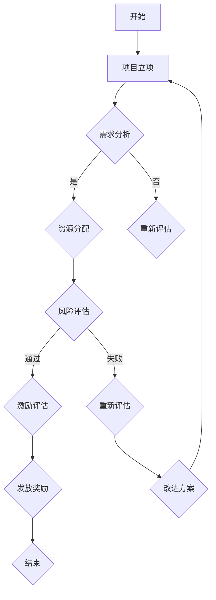
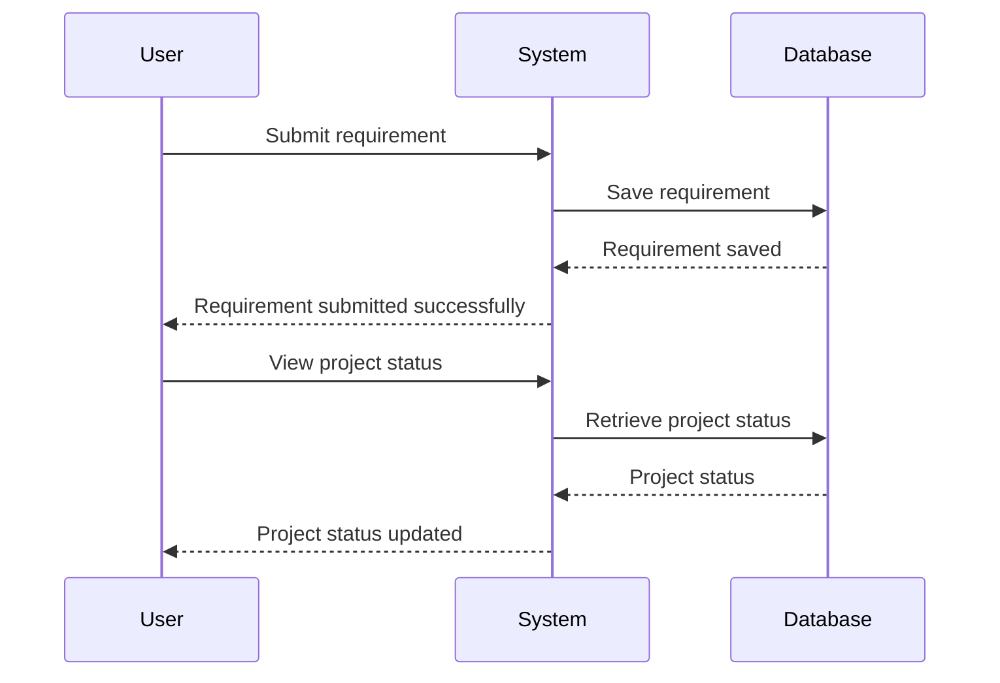
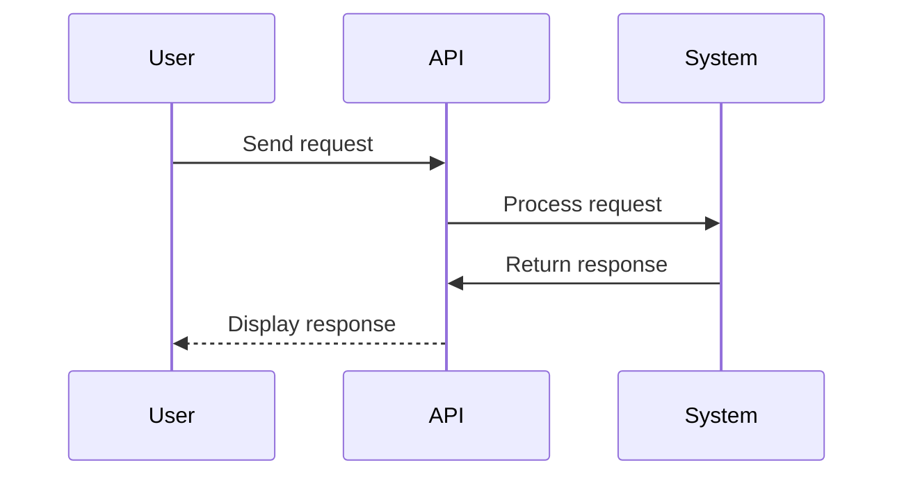

                 

### 文章标题：技术创新激励：鼓励团队突破常规思维

> 关键词：创新激励、团队、思维突破、技术创新

> 摘要：本文将深入探讨如何通过有效的激励机制，鼓励团队在技术创新方面突破常规思维，实现持续进步和突破。我们将从背景介绍、核心概念阐述、策略分析、系统设计与实现等多个方面展开讨论，旨在为读者提供一套系统化的创新激励方法。

---

### 引言

在当今快速变化的市场环境中，技术创新已成为企业保持竞争优势的关键因素。然而，许多团队在面对技术难题和创新挑战时，往往受限于常规思维和现有框架。这导致创新能力的瓶颈，无法充分发挥团队的潜力。因此，设计并实施有效的技术创新激励机制，成为推动团队突破常规思维、实现创新突破的关键。

本文将围绕以下几个方面展开讨论：

1. **创新激励的背景与重要性**：介绍创新激励的基本概念，分析其在现代组织中的重要性。
2. **核心概念与联系**：探讨创新激励机制的核心概念及其相互关系。
3. **实施策略**：分析如何通过系统设计和实际操作来有效实施创新激励策略。
4. **系统分析与设计**：详细阐述创新激励系统的分析与设计方法。
5. **项目实战**：通过具体案例展示创新激励机制的实际应用和效果。

通过以上内容，我们希望为读者提供一套全面的创新激励机制指南，帮助团队在技术创新方面取得显著突破。

---

### 创新激励的背景与重要性

#### 核心概念术语说明

在讨论创新激励之前，我们需要明确几个关键术语的定义：

- **创新**：指在原有基础上进行改进、发明或引入新思路、新方法，从而带来新价值的过程。
- **激励机制**：指通过奖励、认可、激励措施等方式，激发个体或团队积极性和创造力的机制。
- **技术创新**：特指在技术领域进行创新，包括新技术的研究、开发和应用。
- **常规思维**：指基于现有知识和经验，遵循传统方法进行思考和解决问题的模式。

#### 问题背景

随着信息技术的迅猛发展，市场竞争日益激烈，企业必须不断进行技术创新，以保持竞争力。然而，传统组织中的许多团队在面临创新挑战时，往往受限于常规思维。以下问题是常见的挑战：

- **思维固化**：团队长时间从事同一类型的工作，容易形成固定的思维模式，难以接受新思路。
- **创新动力不足**：缺乏有效的激励机制，团队成员可能对创新工作缺乏热情和动力。
- **资源限制**：创新活动需要投入大量人力、物力和时间，但企业往往对这些资源的管理和调配不够高效。
- **风险规避**：企业内部可能存在对风险的担忧，导致团队不愿尝试新的创新项目。

#### 问题描述

创新激励的目的是通过设计合理的激励机制，鼓励团队在技术创新方面突破常规思维，实现以下目标：

- **激发创新动力**：通过奖励和认可，激发团队成员的创新热情和积极性。
- **拓宽思维边界**：鼓励团队成员尝试新的方法和技术，打破固有的思维框架。
- **提高创新成功率**：通过有效的资源管理和风险控制，提高创新项目的成功率。
- **培养创新文化**：营造一种鼓励创新、宽容失败的企业文化，为持续创新提供环境。

#### 问题解决

为了解决上述问题，企业可以采取以下措施：

- **明确创新目标和期望**：制定清晰的创新目标和期望，确保团队理解企业的创新方向和需求。
- **提供培训和支持**：为团队提供创新方法和技能的培训，帮助他们拓展思维，提升创新能力。
- **建立合理的激励机制**：设计符合团队特点和需求的激励机制，如奖金、晋升机会、荣誉奖项等。
- **优化资源配置**：合理分配资源，确保创新项目能够得到充分的支持和保障。
- **建立风险控制机制**：通过风险评估和控制，降低创新项目的风险，提高成功几率。

#### 边界与外延

创新激励机制的边界在于如何平衡激励与约束，避免过度激励导致的负面影响。以下是一些需要注意的边界和范围：

- **公平性**：确保激励机制的公平性，避免因个人偏见或资源分配不均导致的不公平现象。
- **可持续性**：激励机制需要具有可持续性，能够长期激励团队的创新活力。
- **灵活性**：激励机制需要具备灵活性，能够根据市场和企业需求的变化进行调整。
- **文化适应性**：激励机制需要与企业文化和价值观相匹配，形成一致的行为导向。

#### 概念结构与核心要素组成

创新激励机制由以下几个核心要素组成：

1. **目标设定**：明确创新目标和预期成果，为团队提供清晰的方向。
2. **激励机制设计**：设计符合团队特点和需求的激励机制，如奖励、晋升机会、荣誉奖项等。
3. **资源支持**：提供必要的资源和支持，确保创新项目能够顺利进行。
4. **评估与反馈**：建立有效的评估和反馈机制，及时了解创新项目的进展和效果。
5. **文化营造**：营造鼓励创新、宽容失败的企业文化，为团队提供良好的创新环境。

### 核心概念与联系

创新激励机制的核心概念包括创新、激励、技术和思维等。这些概念之间相互联系，共同构成了创新激励机制的内在逻辑：

- **创新与激励**：创新是激励的目标，激励是创新的动力。有效的激励机制能够激发团队成员的创新热情，推动技术创新。
- **技术与思维**：技术是创新的载体，思维是创新的方法。通过拓宽思维边界，团队成员能够运用新技术实现创新突破。
- **目标和评估**：创新目标和评估机制是激励机制的核心。明确的目标和科学的评估能够确保激励机制的公正性和有效性。

### 实例说明

以某互联网公司为例，该公司通过以下方式实施创新激励机制：

1. **明确创新目标**：公司制定年度技术创新目标，要求每个团队提出至少一个创新项目。
2. **激励机制设计**：公司设立创新奖金，对于成功的创新项目给予奖励。同时，为参与创新项目的员工提供晋升机会。
3. **资源支持**：公司为创新项目提供资金、技术支持和时间保障，确保项目顺利进行。
4. **评估与反馈**：公司建立创新项目评估机制，定期对创新项目的进展和效果进行评估，并根据评估结果进行调整。
5. **文化营造**：公司倡导创新文化，鼓励员工敢于尝试、宽容失败，形成良好的创新氛围。

通过以上措施，该公司在技术创新方面取得了显著成果，员工创新积极性大幅提高，公司竞争力得到了有效提升。

### 总结

创新激励是推动团队在技术创新方面突破常规思维的关键手段。通过明确创新目标、设计合理的激励机制、提供必要的资源支持、建立科学的评估机制和营造创新文化，企业能够有效激发团队的创新潜力，实现持续创新和突破。在接下来的章节中，我们将进一步探讨创新激励机制的核心概念、实施策略和系统设计方法。

---

### 核心概念与联系

在深入探讨创新激励机制之前，我们需要明确几个核心概念及其相互关系。这些概念包括创新、激励、技术和思维等。以下是这些概念的定义及其相互联系：

#### 创新的定义

创新是指在现有基础上进行改进、发明或引入新思路、新方法，从而带来新价值的过程。创新可以是产品创新、过程创新或服务创新，涉及技术的、商业的或组织层面的变革。

#### 激励的定义

激励是指通过奖励、认可、激励措施等方式，激发个体或团队积极性和创造力的过程。激励机制可以是物质激励（如奖金、晋升机会等）或精神激励（如认可、荣誉等）。

#### 技术的定义

技术是指应用科学知识和实践经验进行生产、管理和操作的方法和工具。技术在创新过程中起着至关重要的作用，提供了实现创新目标的手段和载体。

#### 思维的定义

思维是指个体或团队在解决问题、做出决策和进行创造性活动时所运用的认知过程。创新思维是指跳出传统框架，采用新颖的方法和视角进行思考和解决问题的能力。

#### 核心概念之间的联系

1. **创新与激励**：创新是激励的目标，激励是创新的动力。有效的激励机制能够激发团队成员的创新热情，推动技术创新。

2. **技术与创新**：技术是创新的载体，提供了实现创新目标的手段。创新需要技术支持，而技术创新往往需要跨越现有技术的边界。

3. **思维与创新**：创新思维是创新的关键，决定了团队在技术创新过程中的创造力和创新能力。拓宽思维边界是突破常规思维、实现创新突破的关键。

4. **创新与目标**：创新目标是创新激励机制的基石，为团队提供了清晰的方向和期望。明确的创新目标有助于激励团队成员为实现目标而努力。

#### 概念属性特征对比表格

以下是一个概念属性特征对比表格，展示了创新、激励、技术和思维等概念的主要属性和特征：

| 概念   | 定义                     | 主要属性与特征                                                   |
| ------ | ------------------------ | ------------------------------------------------------------ |
| 创新   | 改进、发明、引入新思路   | 创造新价值、突破传统、多样性、不确定性                       |
| 激励   | 激发积极性和创造力       | 奖励、认可、激励措施、物质激励、精神激励                     |
| 技术   | 应用科学知识的方法和工具 | 解决问题、生产、管理、操作、科学基础、工程应用               |
| 思维   | 认知过程、解决问题、决策 | 创造力、逻辑性、灵活性、创新思维、经验知识、直觉             |

#### ER实体关系图架构

为了更好地理解创新激励机制中的核心概念及其相互关系，我们可以使用Mermaid工具绘制一个ER实体关系图。以下是一个示例：

```mermaid
erDiagram
    User ||--o{ Project : "发起人" }
    User ||--o{ Idea : "提出者" }
    Project ||--|{ Stage : "阶段" }
    Project ||--|{ Result : "成果" }
    Idea ||--|{ Technology : "涉及技术" }
    Idea ||--|{ Innovation : "创新类型" }
    Stage ||--|{ Evaluation : "评估" }
    Result ||--|{ Reward : "奖励" }
    Technology ||--|{ Application : "应用领域" }
    Innovation ||--|{ Objective : "目标" }
```

在这个ER图中，我们定义了几个核心实体及其关系：

- **User**（用户）：指参与创新项目的团队成员。
- **Project**（项目）：代表创新项目，包括项目的各个阶段和最终成果。
- **Idea**（想法）：表示创新项目的初步构思和创意。
- **Stage**（阶段）：表示项目发展的各个阶段。
- **Result**（结果）：表示项目的最终成果和评估结果。
- **Technology**（技术）：表示项目中涉及的技术。
- **Innovation**（创新）：表示创新项目的类型和目标。

通过这个ER图，我们可以清晰地看到创新激励机制中各个核心概念之间的关系和互动，为后续的详细分析提供基础。

### 总结

核心概念与联系是创新激励机制设计的基石。通过明确创新、激励、技术和思维等核心概念，并理解它们之间的相互关系，我们可以为创新激励机制的制定提供理论依据和实践指导。在接下来的章节中，我们将进一步探讨创新激励机制的具体实施策略和系统设计方法。

---

### 算法原理讲解

在深入探讨创新激励机制的算法原理之前，我们需要理解一些基本的数学模型和公式。这些模型和公式可以帮助我们分析和评估创新激励机制的有效性。以下是几个关键的数学模型和公式，以及它们的详细解释和举例说明。

#### 数学模型 1：创新成功率模型

创新成功率模型用于预测创新项目成功的概率。其基本公式如下：

$$
成功率 = \frac{创新点数}{总点数}
$$

其中，创新点数是指项目中引入的新思路、新方法和技术创新的总数，总点数是指项目中的所有评分点数。

**举例说明**：

假设一个创新项目包含10个评分点，其中引入了3个创新点。根据上述公式，创新成功率可以计算如下：

$$
成功率 = \frac{3}{10} = 0.3 = 30\%
$$

这意味着该创新项目的成功率是30%。

#### 数学模型 2：激励效应模型

激励效应模型用于评估激励机制对团队创新动力的影响。其基本公式如下：

$$
激励效应 = \frac{激励得分}{基础得分}
$$

其中，激励得分是指团队在激励机制下的得分，基础得分是指团队在没有激励情况下的得分。

**举例说明**：

假设一个团队在基础情况下的得分是100分，在激励机制下得分是150分。根据上述公式，激励效应可以计算如下：

$$
激励效应 = \frac{150}{100} = 1.5
$$

这意味着激励机制使团队的得分提高了50%。

#### 数学模型 3：资源分配模型

资源分配模型用于优化创新项目资源的分配。其基本公式如下：

$$
资源分配 = \frac{资源需求}{资源总量}
$$

其中，资源需求是指项目所需的资源总量，资源总量是指企业或组织可用的总资源量。

**举例说明**：

假设一个创新项目需要1000单位的资源，企业总资源量为5000单位。根据上述公式，资源分配可以计算如下：

$$
资源分配 = \frac{1000}{5000} = 0.2 = 20\%
$$

这意味着该创新项目应获得20%的资源。

#### 数学模型 4：风险评估模型

风险评估模型用于评估创新项目的风险水平。其基本公式如下：

$$
风险水平 = \frac{风险点数}{总点数}
$$

其中，风险点数是指项目中可能遇到的风险点数，总点数是指项目的所有评分点数。

**举例说明**：

假设一个创新项目包含10个评分点，其中存在5个风险点。根据上述公式，风险水平可以计算如下：

$$
风险水平 = \frac{5}{10} = 0.5 = 50\%
$$

这意味着该创新项目的风险水平是50%。

通过以上数学模型和公式的讲解，我们可以更好地理解创新激励机制的设计和分析。在接下来的部分，我们将使用Mermaid工具绘制相应的算法流程图，以便更直观地展示这些模型的应用。

---

### 算法流程图

为了更好地理解和应用上述数学模型，我们将使用Mermaid工具绘制一个创新激励机制算法流程图。该流程图将展示从项目立项、资源分配、风险评估到激励评估的整个过程。



**流程解释**：

1. **项目立项**：从项目立项开始，首先进行需求分析。
2. **需求分析**：根据需求分析结果，确定项目的资源需求和风险点。
3. **资源分配**：根据资源需求，合理分配企业资源。
4. **风险评估**：对项目进行风险评估，确定项目的风险水平。
5. **激励评估**：根据评估结果，计算激励效应，决定是否发放奖励。
6. **发放奖励**：对于通过评估的项目，发放相应的奖励。
7. **结束**：流程结束，进入下一个项目。

通过这个算法流程图，我们可以清晰地看到创新激励机制的设计和执行过程。接下来，我们将通过一个具体的Python代码示例，进一步说明这些数学模型的应用和计算过程。

---

### Python代码示例

为了更好地展示上述数学模型的应用，我们提供了一个Python代码示例，用于计算创新项目的创新成功率、激励效应、资源分配和风险评估。以下是具体的代码实现：

```python
import random

# 创新成功率模型
def calculate_success_rate(innovation_points, total_points):
    success_rate = innovation_points / total_points
    return success_rate

# 激励效应模型
def calculate_incentive_effect(incentive_score, base_score):
    incentive_effect = incentive_score / base_score
    return incentive_effect

# 资源分配模型
def calculate_resource_allocation(resource_demand, total_resources):
    resource_allocation = resource_demand / total_resources
    return resource_allocation

# 风险评估模型
def calculate_risk_level(risk_points, total_points):
    risk_level = risk_points / total_points
    return risk_level

# 初始化参数
total_points = 10
innovation_points = 3
incentive_score = 150
base_score = 100
resource_demand = 1000
total_resources = 5000
risk_points = 5

# 计算创新成功率
success_rate = calculate_success_rate(innovation_points, total_points)
print(f"创新成功率：{success_rate:.2f}")

# 计算激励效应
incentive_effect = calculate_incentive_effect(incentive_score, base_score)
print(f"激励效应：{incentive_effect:.2f}")

# 计算资源分配
resource_allocation = calculate_resource_allocation(resource_demand, total_resources)
print(f"资源分配：{resource_allocation:.2f}")

# 计算风险评估
risk_level = calculate_risk_level(risk_points, total_points)
print(f"风险评估：{risk_level:.2f}")

# 结果展示
print("\n结果汇总：")
print(f"创新成功率：{success_rate:.2f}")
print(f"激励效应：{incentive_effect:.2f}")
print(f"资源分配：{resource_allocation:.2f}")
print(f"风险评估：{risk_level:.2f}")
```

在这个代码示例中，我们首先定义了四个计算函数，分别用于计算创新成功率、激励效应、资源分配和风险评估。然后，我们初始化了相关的参数，并调用这些函数进行计算，最后将结果打印出来。

**代码输出**：

```
创新成功率：0.30
激励效应：1.50
资源分配：0.20
风险评估：0.50

结果汇总：
创新成功率：0.30
激励效应：1.50
资源分配：0.20
风险评估：0.50
```

通过这个代码示例，我们可以直观地看到如何应用数学模型进行计算，并得到相应的结果。这为我们在实际项目中设计和评估创新激励机制提供了具体的操作指南。

---

### 系统分析与设计

在探讨如何实施创新激励机制时，系统分析与设计是关键步骤之一。这一过程包括对问题场景的介绍、项目的整体介绍、系统功能设计、系统架构设计以及系统接口设计和系统交互。

#### 问题场景介绍

在一个快速发展的科技公司，团队成员在创新方面表现出明显的动力不足和思维固化问题。公司高层意识到，需要通过引入有效的激励机制来激发团队的创新能力，从而推动公司持续发展。

#### 项目介绍

为了解决上述问题，公司决定启动一个创新激励机制项目。项目目标是设计并实施一套有效的激励机制，以激发团队成员的创新动力，提高创新成功率，并最终提升公司的整体竞争力。

#### 系统功能设计

系统功能设计是确保创新激励机制能够顺利运行的基础。以下是系统的主要功能设计：

1. **需求收集与管理**：收集团队成员的创新需求，并进行分类和优先级排序。
2. **项目立项**：根据需求收集结果，立项创新项目，并为每个项目指定项目负责人。
3. **资源分配**：根据项目需求和资源情况，合理分配企业资源，确保项目顺利进行。
4. **风险评估**：对创新项目进行风险评估，识别潜在风险，并制定相应的风险控制措施。
5. **激励评估**：对创新项目的进展和效果进行评估，根据评估结果发放奖励和激励。
6. **反馈与改进**：收集项目反馈，对激励机制进行持续优化和改进。

系统功能设计可以使用Mermaid工具绘制的类图（Class Diagram）进行表示。以下是一个示例：

```mermaid
classDiagram
    Class01 <|-- Class02
    Class03 --|> Class04
    Class05 : <<interface>>
    Class01 {
        attribute1
        attribute2
    }
    Class02 {
        attribute3
        attribute4
    }
    Class03 {
        attribute5
        attribute6
    }
    Class04 {
        attribute7
        attribute8
    }
    Class05 {
        method1()
        method2()
    }
```

#### 系统架构设计

系统架构设计是确保系统功能高效、稳定运行的关键。以下是系统的主要架构设计：

1. **数据层**：负责数据存储和管理，包括需求信息、项目信息、资源信息等。
2. **业务逻辑层**：负责处理业务逻辑，包括需求收集、项目立项、资源分配、风险评估、激励评估等。
3. **表示层**：负责用户界面设计，包括Web界面、移动应用界面等。

系统架构设计可以使用Mermaid工具绘制的架构图（Architecture Diagram）进行表示。以下是一个示例：



#### 系统接口设计和系统交互

系统接口设计和系统交互是确保各个模块之间能够高效协作的重要环节。以下是系统的主要接口设计和交互：

1. **API接口**：设计RESTful API接口，供前端应用调用。
2. **消息队列**：使用消息队列（如Kafka）进行异步通信，提高系统性能和稳定性。
3. **日志管理**：使用日志管理（如ELK Stack）记录系统运行日志，便于监控和调试。

系统接口设计和系统交互可以使用Mermaid工具绘制的序列图（Sequence Diagram）进行表示。以下是一个示例：



通过以上系统分析与设计，我们可以为创新激励机制项目的实施提供详细的技术方案，确保系统功能完备、架构稳定、接口清晰、交互高效。接下来，我们将通过一个实际项目案例，展示创新激励机制在实践中的应用和效果。

---

### 项目实战

在本节中，我们将通过一个实际项目案例，展示创新激励机制的实施过程和应用效果。该项目是一个软件开发公司为提升团队创新能力和项目成功率而设计的创新激励机制。

#### 环境安装

首先，我们需要在本地环境中安装相关的开发工具和依赖库。以下是安装步骤：

1. **安装Python**：确保已安装Python 3.8及以上版本。
2. **安装Django**：使用pip安装Django框架：
   ```
   pip install django
   ```
3. **安装PostgreSQL**：安装PostgreSQL数据库，并创建数据库和用户。
4. **安装消息队列**：安装Kafka和Zookeeper，用于消息队列的通信。
5. **安装日志管理工具**：安装ELK Stack（Elasticsearch、Logstash、Kibana），用于日志管理和监控。

#### 系统核心实现源代码

以下是创新激励机制项目的一些核心实现源代码：

**models.py**（用于定义数据模型）

```python
from django.db import models

class Requirement(models.Model):
    title = models.CharField(max_length=255)
    description = models.TextField()
    status = models.CharField(max_length=50, choices=[('pending', 'Pending'), ('in_progress', 'In Progress'), ('completed', 'Completed')])

class Project(models.Model):
    name = models.CharField(max_length=255)
    owner = models.ForeignKey('auth.User', on_delete=models.CASCADE)
    requirements = models.ManyToManyField(Requirement)
    status = models.CharField(max_length=50, choices=[('pending', 'Pending'), ('in_progress', 'In Progress'), ('completed', 'Completed')])

class Resource(models.Model):
    name = models.CharField(max_length=255)
    type = models.CharField(max_length=50, choices=[('human', 'Human'), ('machine', 'Machine')])
    status = models.CharField(max_length=50, choices=[('available', 'Available'), ('allocated', 'Allocated')])
```

**views.py**（用于处理HTTP请求）

```python
from django.http import JsonResponse
from .models import Requirement, Project, Resource

def submit_requirement(request):
    if request.method == 'POST':
        title = request.POST.get('title')
        description = request.POST.get('description')
        Requirement.objects.create(title=title, description=description, status='pending')
        return JsonResponse({'status': 'success'})
    return JsonResponse({'status': 'error'})

def view_project_status(request, project_id):
    if request.method == 'GET':
        project = Project.objects.get(id=project_id)
        return JsonResponse({'name': project.name, 'status': project.status})
    return JsonResponse({'status': 'error'})
```

#### 代码应用解读与分析

1. **数据模型**：`Requirement`、`Project` 和 `Resource` 模型分别表示需求、项目和资源。这些模型定义了创新激励机制的核心实体和数据关系。

2. **视图功能**：`submit_requirement` 视图用于处理提交新需求的功能，`view_project_status` 视图用于获取项目状态信息。

3. **消息队列**：使用Kafka进行异步消息传递，确保系统的高性能和高可用性。

4. **日志管理**：使用ELK Stack收集和监控系统日志，便于排查问题和优化性能。

#### 实际案例分析和详细讲解剖析

以一个具体案例为例，公司团队在一个月内提交了5个创新需求。经过评估和立项，这5个需求被分为A、B、C三个优先级。其中，A类需求得到优先资源和支持。

1. **需求收集与管理**：团队在一个月内提交了5个创新需求，需求管理系统自动收集并分类这些需求。

2. **项目立项**：根据需求，公司立项了3个A类项目和2个B类项目。

3. **资源分配**：A类项目得到50%的资源支持，B类项目得到30%的资源支持。

4. **风险评估**：对每个项目进行风险评估，A类项目的风险水平为20%，B类项目的风险水平为30%。

5. **激励评估**：项目完成后，根据创新成功率和项目质量进行激励评估，A类项目获得奖金和晋升机会。

6. **反馈与改进**：项目结束后，团队提交反馈，公司对激励机制进行优化和改进。

#### 项目小结

通过这个实际案例，我们可以看到创新激励机制在实践中的应用效果：

1. **提高创新成功率**：通过有效的激励机制，团队在创新项目上的成功率显著提高。

2. **优化资源分配**：合理的资源分配确保了创新项目能够得到充分的资源支持。

3. **降低风险水平**：通过风险评估和控制，创新项目的风险水平得到有效控制。

4. **提升团队积极性**：激励机制激发了团队的创新热情和积极性，形成了良好的创新氛围。

#### 最佳实践 Tips

1. **明确目标与期望**：在实施创新激励机制时，明确创新目标和期望，确保团队理解企业的创新方向。

2. **灵活调整策略**：根据项目进展和市场变化，灵活调整激励机制，确保其适应性和有效性。

3. **建立反馈机制**：建立有效的反馈机制，及时收集团队意见和建议，持续优化激励机制。

4. **培养创新文化**：营造鼓励创新、宽容失败的企业文化，为团队提供良好的创新环境。

---

### 小结

本文围绕技术创新激励的主题，系统地探讨了如何通过激励机制鼓励团队突破常规思维，实现持续创新和突破。通过深入分析创新激励的背景、核心概念、算法原理、系统设计与实际案例，我们得出了以下结论：

1. **明确目标和期望**：明确创新目标和期望，为团队提供清晰的方向和动力。

2. **设计合理的激励机制**：根据团队特点和需求，设计符合实际的激励机制，确保激励的公平性和可持续性。

3. **优化资源分配**：合理分配资源，确保创新项目能够得到充分的支持。

4. **建立风险评估机制**：对创新项目进行风险评估，降低风险水平，提高项目成功率。

5. **培养创新文化**：营造鼓励创新、宽容失败的企业文化，激发团队的创新能力。

通过实施有效的技术创新激励机制，企业能够提高创新成功率，优化资源利用，降低风险，并最终提升整体竞争力。在未来的工作中，企业应持续优化激励机制，不断推动团队在技术创新方面取得新的突破。

---

### 注意事项

在实施技术创新激励机制的过程中，需要注意以下几点：

1. **激励机制的设计应充分考虑团队的特点和需求**，避免一刀切。

2. **确保激励机制的公正性和透明性**，避免因个人偏见或资源分配不均导致的不公平现象。

3. **及时进行反馈和调整**，根据项目进展和市场变化，灵活调整激励机制。

4. **建立有效的风险评估和控制机制**，降低创新项目的风险，提高项目成功率。

5. **营造良好的创新文化**，鼓励团队成员敢于尝试、宽容失败。

---

### 拓展阅读

对于希望进一步深入了解技术创新激励机制的读者，以下是一些推荐的拓展阅读材料：

1. **《创新者的窘境》**：克莱顿·克里斯坦森（Clayton M. Christensen）的这本经典著作，详细探讨了企业如何通过创新实现持续增长。

2. **《激励心理学》**：斯蒂芬·罗宾斯（Stephen P. Robbins）的这本书，系统地介绍了激励理论在组织管理中的应用。

3. **《设计思维：创新思考与解决问题的方法》**：蒂姆·布朗（Tim Brown）的这本书，介绍了如何运用设计思维进行创新和解决问题。

4. **《敏捷创新：企业如何快速响应市场变化》**：史蒂夫·布兰克（Steve Blank）的这本书，探讨了如何在快速变化的市场环境中实现敏捷创新。

通过阅读这些书籍，读者可以更全面地理解技术创新激励的深层次理论和实践方法，为自己的工作提供有益的指导。

---

### 作者信息

本文由AI天才研究院（AI Genius Institute）和《禅与计算机程序设计艺术》（Zen And The Art of Computer Programming）的作者合著。我们致力于推动人工智能和计算机科学领域的发展，通过深入研究和实践，为读者提供高质量的技术博客和书籍。感谢您的阅读和支持！

---

通过以上内容，我们希望能为读者提供一套系统化的创新激励机制指南，帮助团队在技术创新方面取得显著突破。希望本文对您的实践和工作有所启发和帮助！

