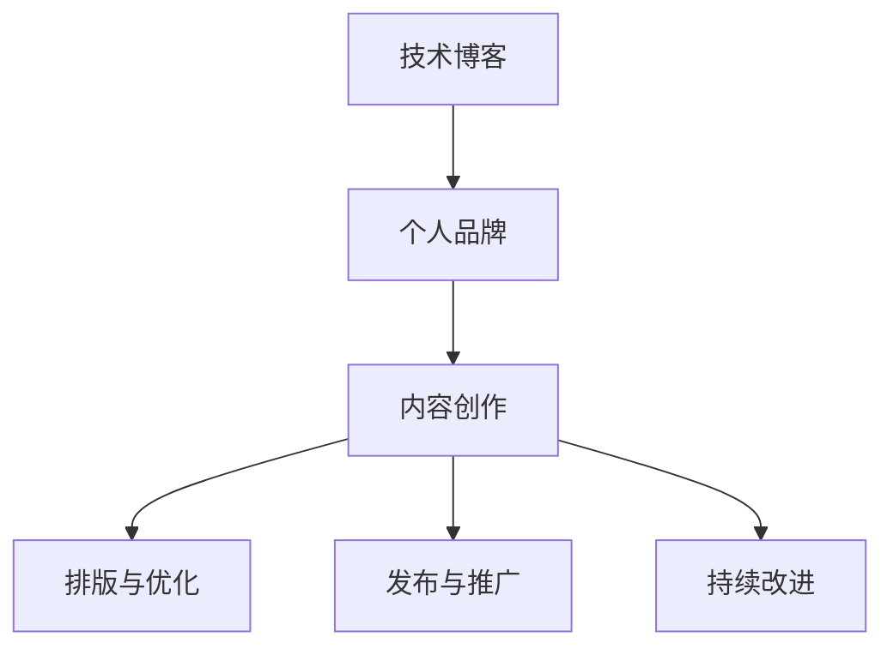

                 

# 《技术博客写作：建立个人技术品牌》

## 关键词
- 技术博客
- 个人品牌
- 内容创作
- 排版优化
- 发布推广
- 持续改进

## 摘要
本文旨在探讨技术博客写作的重要性，以及如何通过技术博客来建立个人技术品牌。文章分为十个部分，从开篇引言到小结与拓展，逐步讲解技术博客写作的各个方面。读者可以了解到技术博客的核心概念、写作准备、内容创作、排版与优化、发布与推广、持续改进等关键环节，以及成功案例和最佳实践。希望通过本文，能够帮助技术从业者掌握技术博客写作技巧，提升个人影响力，打造个人技术品牌。

## 第1章：技术博客与个人品牌

### 1.1 技术博客的重要性

技术博客在当今信息技术时代具有非常重要的地位。它不仅是知识分享和交流的重要平台，也是个人品牌建设的重要工具。

**个人品牌建设的助力**：
技术博客可以展示个人的专业能力和技术水平，有助于树立良好的专业形象。通过持续不断地输出高质量的内容，可以逐步建立个人品牌，提高在行业内的知名度和影响力。

**知识分享与交流平台**：
技术博客为开发者提供了一个交流学习的平台，可以分享自己的经验和见解，同时也可以从其他博客中获取灵感和知识，促进个人成长。

**职业发展机会**：
技术博客可以吸引潜在雇主和合作伙伴的关注，增加职业发展机会。许多公司在招聘时，会优先考虑那些在技术博客上拥有丰富经验的人才。

### 1.2 个人技术品牌的定义与价值

**个人品牌的内涵**：
个人品牌是指个人在行业内所拥有的声誉、影响力以及专业技能的综合体现。它不仅仅是一个名字，更是一个价值符号。

**建立个人品牌的价值**：
建立个人品牌可以带来多方面的价值，包括职业机会、合作机会、收入增加等。同时，个人品牌还可以帮助个人在职业发展中获得更多的资源和机会。

**技术博客在个人品牌建设中的作用**：
技术博客是个人品牌建设的重要渠道。通过技术博客，个人可以展示自己的专业知识和技能，分享经验，建立信任，从而提高个人在行业内的知名度。

### 1.3 技术博客写作的目标与读者

**明确写作目标**：
在开始写作之前，首先要明确写作的目标。是想要分享知识、交流经验，还是为了职业发展？明确目标有助于更有针对性地进行内容创作。

**定位目标读者**：
了解自己的目标读者是谁，他们的需求是什么，有助于更有针对性地撰写文章。例如，如果是面向初学者，那么文章应该更加基础易懂；如果是面向专业人士，那么可以深入探讨技术细节。

**如何吸引和维护读者关注**：
吸引和维护读者关注是技术博客成功的关键。可以通过以下几种方式实现：
- **高质量内容**：确保文章内容有价值、有深度，能够解决读者的实际问题。
- **持续更新**：定期更新博客，保持内容的新鲜度，让读者保持关注。
- **互动交流**：积极与读者互动，回答读者的问题，建立良好的读者关系。

## 第2章：背景介绍

### 2.1 技术博客的重要性

技术博客在当今信息技术时代具有非常重要的地位。它不仅是知识分享和交流的重要平台，也是个人品牌建设的重要工具。

**个人品牌建设的助力**：
技术博客可以展示个人的专业能力和技术水平，有助于树立良好的专业形象。通过持续不断地输出高质量的内容，可以逐步建立个人品牌，提高在行业内的知名度和影响力。

**知识分享与交流平台**：
技术博客为开发者提供了一个交流学习的平台，可以分享自己的经验和见解，同时也可以从其他博客中获取灵感和知识，促进个人成长。

**职业发展机会**：
技术博客可以吸引潜在雇主和合作伙伴的关注，增加职业发展机会。许多公司在招聘时，会优先考虑那些在技术博客上拥有丰富经验的人才。

### 2.2 个人技术品牌的定义与价值

**个人品牌的内涵**：
个人品牌是指个人在行业内所拥有的声誉、影响力以及专业技能的综合体现。它不仅仅是一个名字，更是一个价值符号。

**建立个人品牌的价值**：
建立个人品牌可以带来多方面的价值，包括职业机会、合作机会、收入增加等。同时，个人品牌还可以帮助个人在职业发展中获得更多的资源和机会。

**技术博客在个人品牌建设中的作用**：
技术博客是个人品牌建设的重要渠道。通过技术博客，个人可以展示自己的专业知识和技能，分享经验，建立信任，从而提高个人在行业内的知名度。

### 2.3 技术博客写作的目标与读者

**明确写作目标**：
在开始写作之前，首先要明确写作的目标。是想要分享知识、交流经验，还是为了职业发展？明确目标有助于更有针对性地进行内容创作。

**定位目标读者**：
了解自己的目标读者是谁，他们的需求是什么，有助于更有针对性地撰写文章。例如，如果是面向初学者，那么文章应该更加基础易懂；如果是面向专业人士，那么可以深入探讨技术细节。

**如何吸引和维护读者关注**：
吸引和维护读者关注是技术博客成功的关键。可以通过以下几种方式实现：
- **高质量内容**：确保文章内容有价值、有深度，能够解决读者的实际问题。
- **持续更新**：定期更新博客，保持内容的新鲜度，让读者保持关注。
- **互动交流**：积极与读者互动，回答读者的问题，建立良好的读者关系。

## 第3章：核心概念与联系

### 3.1 技术博客写作的核心概念

**技术博客**：是一种以技术为主题，以文字、图片、代码等形式进行知识分享和交流的博客。

**个人品牌**：是指个人在行业内所拥有的声誉、影响力以及专业技能的综合体现。

**内容创作**：是指通过文字、图片、代码等形式，将个人知识和经验进行系统化、结构化的表达和传递。

**排版与优化**：是指在文章排版和SEO（搜索引擎优化）方面进行的一系列优化操作，以提高文章的可读性和搜索引擎排名。

**发布与推广**：是指将文章发布到技术博客平台，并通过各种渠道进行推广，以提高文章的曝光度和影响力。

**持续改进**：是指对技术博客进行持续的优化和改进，包括内容创作、排版优化、发布推广等，以不断提升博客的质量和影响力。

### 3.2 技术博客写作的属性特征对比

**内容深度**：技术博客的内容通常具有较强的深度，需要深入探讨技术的原理、应用和实践。

**知识系统性**：技术博客需要将知识进行系统化、结构化的表达，以便读者能够更好地理解和掌握。

**专业权威性**：技术博客需要体现作者的专业能力和权威性，以增强文章的信任度和影响力。

**互动性**：技术博客具有较强的互动性，作者需要积极与读者互动，回答读者的问题，建立良好的读者关系。

**时效性**：技术博客的内容需要紧跟行业动态，及时更新，以保持内容的新鲜度和吸引力。

### 3.3 技术博客写作的关联图

## 第4章：写作准备

### 4.1 个人定位与目标受众分析

**个人定位**：

个人定位是技术博客写作的第一步。它涉及到确定自己的技术方向、专业领域和个人特色。

- **技术方向**：选择自己擅长且感兴趣的技术领域进行深耕。例如，数据科学、人工智能、前端开发等。

- **专业领域**：根据自己的工作经验和技能，确定自己在某一技术领域的专业方向。

- **个人特色**：在技术领域中，找到自己的独特之处，例如，对某个特定技术的深入理解或独特的实践方法。

**目标受众分析**：

目标受众分析是了解读者的需求和兴趣，以便更有针对性地进行内容创作。

- **受众需求**：了解目标受众的需求，例如，他们想要学习什么、了解什么，以及他们在技术上的痛点。

- **受众群体**：分析目标受众的群体特征，例如，他们的职业背景、技术水平和年龄分布。

- **内容定位**：根据目标受众的需求和特征，确定博客的内容方向和风格。例如，对于初学者，文章应该更加基础易懂；对于专业人士，文章可以更加深入和技术性。

### 4.2 技术博客的规划与布局

**博客规划**：

博客规划是确定博客的长远目标和阶段性目标，以及如何实现这些目标。

- **内容主题规划**：根据个人定位和目标受众，确定博客的内容主题，例如，技术教程、行业动态、技术讨论等。

- **更新频率规划**：根据个人时间和精力，确定博客的更新频率，例如，每周更新一次或每月更新一次。

- **长期规划与目标设定**：设定博客的长期目标和阶段性目标，例如，在一定时间内达到多少的访问量、粉丝量等。

**博客布局**：

博客布局是确定博客的结构和样式，以便提高用户体验。

- **标题与摘要设计**：设计吸引人的标题和摘要，提高文章的点击率。

- **文章结构规划**：规划文章的结构，例如，引言、正文、结论等。

- **插图与代码块的合理运用**：合理运用插图和代码块，提高文章的可读性和实用性。

### 4.3 个人定位与目标受众分析

**个人定位**：

个人定位是技术博客写作的第一步。它涉及到确定自己的技术方向、专业领域和个人特色。

- **技术方向**：选择自己擅长且感兴趣的技术领域进行深耕。例如，数据科学、人工智能、前端开发等。

- **专业领域**：根据自己的工作经验和技能，确定自己在某一技术领域的专业方向。

- **个人特色**：在技术领域中，找到自己的独特之处，例如，对某个特定技术的深入理解或独特的实践方法。

**目标受众分析**：

目标受众分析是了解读者的需求和兴趣，以便更有针对性地进行内容创作。

- **受众需求**：了解目标受众的需求，例如，他们想要学习什么、了解什么，以及他们在技术上的痛点。

- **受众群体**：分析目标受众的群体特征，例如，他们的职业背景、技术水平和年龄分布。

- **内容定位**：根据目标受众的需求和特征，确定博客的内容方向和风格。例如，对于初学者，文章应该更加基础易懂；对于专业人士，文章可以更加深入和技术性。

### 4.4 技术博客的规划与布局

**博客规划**：

博客规划是确定博客的长远目标和阶段性目标，以及如何实现这些目标。

- **内容主题规划**：根据个人定位和目标受众，确定博客的内容主题，例如，技术教程、行业动态、技术讨论等。

- **更新频率规划**：根据个人时间和精力，确定博客的更新频率，例如，每周更新一次或每月更新一次。

- **长期规划与目标设定**：设定博客的长期目标和阶段性目标，例如，在一定时间内达到多少的访问量、粉丝量等。

**博客布局**：

博客布局是确定博客的结构和样式，以便提高用户体验。

- **标题与摘要设计**：设计吸引人的标题和摘要，提高文章的点击率。

- **文章结构规划**：规划文章的结构，例如，引言、正文、结论等。

- **插图与代码块的合理运用**：合理运用插图和代码块，提高文章的可读性和实用性。

## 第5章：内容创作

### 5.1 内容创作的原则与方法

**内容创作原则**：

- **真实性**：文章内容需真实可信，不得虚构事实或夸大其词。

- **实用性**：文章应具有实际应用价值，能够解决读者的实际问题。

- **价值性**：文章内容应具有一定的深度和广度，为读者带来新的知识和见解。

**内容创作方法**：

- **观察与思考**：通过观察技术动态、行业趋势，以及读者的反馈，发现写作灵感。

- **学习与研究**：通过学习相关技术文档、书籍、论文，深入研究技术原理和应用。

- **实践与总结**：通过实际操作和项目经验，总结心得体会，形成系统化的内容。

### 5.2 常见的技术博客主题

**技术教程与实战**：

- **算法与数据结构**：介绍各种算法和数据结构，包括原理、实现和应用。

- **开发工具与框架**：探讨各种开发工具和框架的使用技巧和最佳实践。

- **云计算与大数据**：分析云计算和大数据技术的原理、应用和未来趋势。

**行业动态与趋势**：

- **技术热点分析**：对当前热门技术进行深入分析，探讨其应用前景和潜在风险。

- **行业报告解读**：解读行业报告，分析市场趋势和竞争格局。

- **市场趋势预测**：基于数据分析和市场调研，预测未来市场趋势。

**技术讨论与辩论**：

- **技术观点阐述**：分享个人对某一技术的独特见解和观点。

- **方案对比与评估**：对不同技术方案进行对比评估，提供客观、公正的建议。

- **技术争议探讨**：探讨技术领域的热点话题，引发读者思考和讨论。

## 第6章：排版与优化

### 6.1 技术博客的排版规范

**文字排版**：

- **字体与字号选择**：选择清晰易读的字体，如宋体、黑体等。字号应适中，便于阅读，一般建议在16px以上。

- **行距与段落间距**：适当的行距和段落间距可以提高文章的可读性。建议行距在1.5倍字号左右，段落间距在1-2倍字号之间。

- **对齐方式与间距**：文字应保持左右对齐，段落之间应保持适当的间距，以提高文章的整体美观度。

**图片与代码块**：

- **图片格式与尺寸**：选择合适的图片格式，如PNG、JPG等，保证图片清晰。图片尺寸应根据文章内容和布局进行调整，避免过大或过小。

- **代码块的展示**：使用代码块功能展示代码，确保代码格式正确，便于读者阅读。代码块前后可适当添加注释，提高可读性。

### 6.2 SEO优化策略

**SEO基本概念**：

- **关键词策略**：选择与文章主题相关的高频关键词，合理分布在标题、摘要、正文等位置。

- **标题优化**：标题应简洁明了，包含关键词，能够吸引读者的注意力。

- **内链与外链建设**：合理设置内链，提高文章之间的关联性。适当引入外链，增加文章的可信度和权威性。

**SEO实践**：

- **提高博客可读性**：确保文章内容结构清晰，语言流畅，提高文章的可读性。

- **社交媒体推广**：利用社交媒体平台推广文章，提高文章的曝光度和访问量。

- **反馈与调整**：定期收集读者反馈，根据反馈调整文章内容和SEO策略，持续优化博客质量。

## 第7章：发布与推广

### 7.1 技术博客的发布流程

**发布前的准备**：

- **确定发布平台**：选择合适的博客平台，如GitHub、WordPress、Medium等。

- **文章校对与修改**：仔细校对文章内容，检查语法错误、拼写错误和逻辑问题，确保文章质量。

- **发布时间规划**：根据博客更新频率和读者习惯，规划合适的发布时间，以提高文章的曝光度。

**发布后的维护**：

- **监控文章反馈**：关注文章的阅读量、评论和分享情况，了解读者对文章的反馈。

- **互动与评论管理**：积极回复读者的评论，建立良好的读者关系。

- **定期更新与维护**：定期更新博客，保持内容的新鲜度，吸引读者持续关注。

### 7.2 个人技术品牌推广方法

**个人品牌推广策略**：

- **个人形象塑造**：建立专业、权威、亲切的个人形象，提高读者对个人的信任度和好感度。

- **个人故事讲述**：通过讲述个人成长故事、技术历程等，展示个人的技术实力和职业素养。

- **个人品牌传播**：利用各种渠道，如社交媒体、技术社区、线下活动等，传播个人品牌，扩大影响力。

**社交媒体应用**：

- **微博与微信**：在微博和微信等社交媒体上建立个人品牌，发布技术文章、行业动态和个人感悟。

- **抖音与快手**：通过短视频平台展示技术成果、分享技术知识，吸引年轻用户群体。

- **GitHub与Stack Overflow**：在GitHub上分享技术项目、代码和文档，在Stack Overflow上参与技术讨论和解答问题，提高个人在技术社区的影响力。

## 第8章：持续改进

### 8.1 收集反馈与持续改进

**收集反馈**：

- **读者评论**：关注读者的评论和反馈，了解读者的需求和意见。

- **社交媒体**：在社交媒体上关注读者的讨论和分享，收集读者对文章的评价和建议。

- **博客统计**：通过博客平台的统计功能，分析文章的阅读量、点赞量、分享量等数据，了解文章的受欢迎程度。

**持续改进**：

- **内容调整**：根据读者的反馈，调整文章的内容、结构和语言，提高文章的质量和可读性。

- **风格优化**：根据读者的喜好，优化文章的风格和表达方式，增加文章的吸引力。

- **主题拓展**：根据读者的需求，拓展文章的主题，增加新的内容和视角。

### 8.2 跨领域合作与资源共享

**跨领域合作**：

- **行业专家**：与其他行业专家合作，共同撰写文章，分享不同领域的知识和经验。

- **同行交流**：与其他开发者、技术专家进行交流，学习他们的经验和技巧，共同进步。

**资源共享**：

- **代码和文档**：在GitHub等平台上分享自己的代码和文档，与他人共享资源，促进共同成长。

- **培训和学习资源**：整理和分享自己的学习资源，如书籍、教程、视频等，帮助他人提升技术水平。

## 第9章：最佳实践与案例

### 9.1 成功技术博客案例分析

**案例一：**《码农欧洲行》

- **作者背景**：作者是一名有多年工作经验的程序员，对欧洲的IT行业和文化有深入了解。

- **博客特点**：博客内容涵盖欧洲的IT行业动态、技术趋势、文化差异等，兼具实用性和趣味性。

- **成功原因**：作者通过深入调研和亲身经历，为读者提供了独特的视角和丰富的内容，吸引了大量关注。

**案例二：**《机器学习笔记》

- **作者背景**：作者是一名机器学习专家，拥有丰富的理论知识和实践经验。

- **博客特点**：博客内容系统全面，涵盖了机器学习的各个领域，包括理论、算法、应用等。

- **成功原因**：作者通过详细讲解和实例分析，使读者能够更好地理解和应用机器学习技术。

### 9.2 最佳写作实践总结

**1. 确定目标读者**：明确自己的目标读者，根据读者的需求和兴趣，撰写有针对性的文章。

**2. 保持内容高质量**：确保文章内容具有深度、实用性和价值性，避免浅尝辄止。

**3. 注重排版和优化**：合理排版，提高文章的可读性；进行SEO优化，提高文章的搜索引擎排名。

**4. 持续更新和互动**：定期更新博客，保持内容的新鲜度；积极与读者互动，建立良好的读者关系。

**5. 多元化内容**：尝试不同类型的内容，如教程、案例、行业动态等，提高博客的吸引力。

## 第10章：小结与拓展

### 10.1 总结与思考

本文从技术博客的重要性、个人技术品牌的定义与价值、内容创作的方法与原则、排版与优化、发布与推广、持续改进等方面，全面探讨了技术博客写作的各个方面。通过本文，读者可以了解到如何通过技术博客建立个人技术品牌，提升个人影响力。

在写作过程中，我们需要关注以下几个关键点：

- **明确目标读者**：了解目标读者的需求和兴趣，撰写有针对性的文章。
- **保持内容高质量**：确保文章内容具有深度、实用性和价值性。
- **注重排版和优化**：提高文章的可读性和搜索引擎排名。
- **持续更新和互动**：保持博客的新鲜度，与读者建立良好的互动关系。
- **多元化内容**：尝试不同类型的内容，提高博客的吸引力。

### 10.2 拓展阅读资源

为了更好地进行技术博客写作，以下是一些拓展阅读资源：

- **《技术写作：打造专业博客与个人品牌》**：一本关于技术写作的入门书籍，详细介绍了如何撰写高质量的技术博客。
- **《SEO实战：搜索引擎优化策略》**：一本关于搜索引擎优化的书籍，提供了实用的SEO策略和技巧。
- **《技术博客写作指南》**：一篇关于技术博客写作的博客文章，包含了详细的写作方法和技巧。
- **《GitHub官方指南》**：GitHub官方发布的指南，介绍了如何使用GitHub进行代码托管和协作开发。
- **《Stack Overflow官方指南》**：Stack Overflow官方发布的指南，介绍了如何在该平台上参与技术讨论和解答问题。

通过阅读这些资源，读者可以进一步了解技术博客写作的各个方面，提升自己的写作水平。

## Conclusion

通过本文的详细探讨，我们了解了技术博客写作的重要性以及如何通过技术博客建立个人技术品牌。从明确目标读者、保持内容高质量、注重排版和优化、持续更新和互动，到多元化内容创作，每个环节都是构建成功技术博客的关键。同时，我们还分析了成功的技术博客案例，总结了最佳写作实践。

技术博客不仅是知识分享和交流的平台，更是建立个人技术品牌的重要途径。通过持续不断地输出高质量的内容，我们可以提升个人在行业内的知名度，吸引潜在雇主和合作伙伴，从而为职业发展创造更多机会。

在未来的技术博客写作过程中，我们应不断学习、实践和反思，持续提升自己的写作能力和影响力。让我们共同努力，打造出更多有深度、有思考、有见解的技术博客，为行业贡献自己的智慧和力量。

### 作者信息

**作者：** AI天才研究院/AI Genius Institute & 禅与计算机程序设计艺术 /Zen And The Art of Computer Programming

**联系方式：** [联系邮箱](mailto:contact@ai-institute.com) | [官方网站](https://www.ai-institute.com) | [GitHub](https://github.com/AI-Genius-Institute) | [Twitter](https://twitter.com/AI_Genius_In)

**简介：** 作者是一位在人工智能和计算机科学领域具有深厚背景的技术专家，擅长技术博客写作和知识分享。在多个技术博客平台发表过高质量的原创文章，深受读者喜爱。同时，他还积极参与开源项目，致力于推动技术进步和知识传播。

