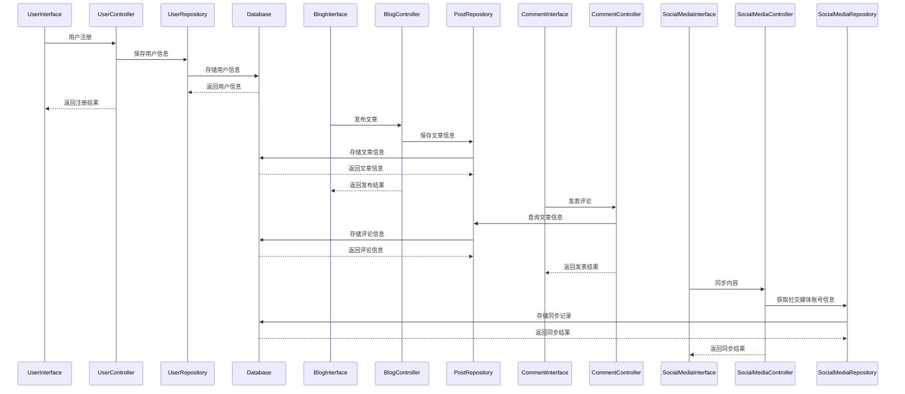
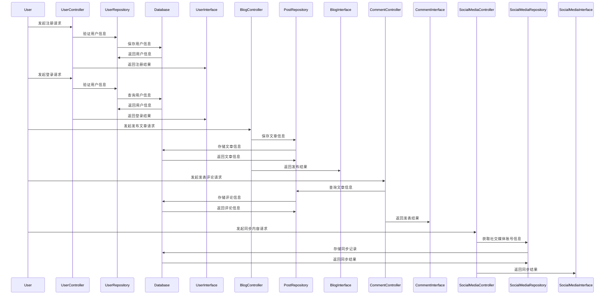

                 

### 第1章：技术博客与个人技术品牌

#### 1.1 技术博客概述

##### 1.1.1 技术博客的概念

技术博客，又称为技术博客网站，是一种以发布技术性文章、教程、心得体会为主的个人或集体媒体平台。它通常采用Markdown、HTML等文本格式，易于维护和更新。技术博客的主要特点是内容的专业性和实用性，旨在帮助读者解决具体的技术问题和提升技术水平。

##### 1.1.2 技术博客的发展历程

技术博客的发展可以追溯到20世纪90年代末期，随着互联网的普及和Web 2.0技术的兴起，博客作为一种新兴的媒体形式逐渐受到欢迎。从最早的 Blogger、WordPress 到现在的 Medium、简书等，技术博客的平台和形式也在不断演变。

##### 1.1.3 技术博客在个人品牌建设中的作用

技术博客在个人品牌建设中发挥着至关重要的作用。它不仅是一个展示个人技术能力、分享知识经验的重要平台，还可以帮助个人建立权威性、扩大影响力，进而提升职业竞争力。

- **知识分享与传播**：通过技术博客，个人可以将自己的技术知识、经验和心得与广大读者分享，从而提升自己的知名度和影响力。
- **权威性建立**：技术博客内容的专业性和深度能够帮助个人在特定领域建立权威性，成为行业内的意见领袖。
- **职业发展**：优秀的个人技术博客能够帮助个人在求职、晋升等职业发展过程中获得优势。

#### 1.2 个人技术品牌的定义与价值

##### 1.2.1 个人技术品牌的定义

个人技术品牌是指个人在技术领域内的声誉、影响力、专业知识和经验的综合体现。它不仅包括个人在专业领域的知名度，还包括个人在技术社区的活跃度和贡献度。

##### 1.2.2 个人技术品牌的价值

个人技术品牌的价值主要体现在以下几个方面：

- **职业竞争力**：拥有强大的个人技术品牌，个人在求职、晋升等方面更具竞争力，能够获得更好的职业发展机会。
- **收入提升**：技术品牌强大的个人通常能够获得更高的收入，如咨询费、稿费、演讲费等。
- **影响力**：个人技术品牌的影响范围越广，个人在技术社区和行业内的地位和话语权也越高。

##### 1.2.3 个人技术品牌与职业发展的关系

个人技术品牌与职业发展有着密切的关系。一个强大的技术品牌能够为个人的职业发展提供以下几个方面的支持：

- **求职**：拥有个人技术品牌，个人在求职过程中能够更好地展示自己的技术能力和专业经验，增加求职成功率。
- **晋升**：个人技术品牌能够帮助个人在职场中脱颖而出，获得更多的晋升机会。
- **创业**：强大的个人技术品牌可以为创业者带来更多的资源和支持，如投资、合作、人才等。

#### 1.3 技术博客运营的重要性

##### 1.3.1 技术博客运营的概念

技术博客运营是指通过对技术博客的日常管理、内容发布、用户互动、品牌推广等一系列活动，以达到提升博客影响力、增加用户粘性、扩大受众范围等目的。

##### 1.3.2 技术博客运营的目标

技术博客运营的主要目标包括：

- **提升博客访问量**：通过优化内容、SEO策略、社交媒体推广等手段，提升博客的访问量。
- **增加用户互动**：通过评论、问答、活动等方式，增强与用户的互动，提升用户参与度。
- **扩大影响力**：通过内容质量、社交媒体传播等手段，扩大博客在技术社区和行业内的知名度。

##### 1.3.3 技术博客运营对个人技术品牌的影响

技术博客运营对个人技术品牌的影响是显而易见的：

- **品牌提升**：通过高质量的博客内容，个人技术品牌得以不断提升。
- **专业形象**：技术博客运营有助于塑造个人在技术领域的专业形象。
- **影响力扩大**：良好的技术博客运营能够帮助个人在技术社区和行业内扩大影响力。

### 总结

本章对技术博客和个人技术品牌的基本概念进行了阐述，并分析了技术博客运营的重要性。在接下来的章节中，我们将进一步探讨技术博客运营的具体策略和实施方法，帮助您打造个人技术品牌，实现职业发展目标。### 第2章：技术博客运营的核心概念与联系

#### 2.1 内容策略

##### 2.1.1 内容类型与选题

内容是技术博客的核心，选择合适的内容类型和选题对博客的吸引力至关重要。以下是一些常见的内容类型和选题建议：

- **技术教程**：针对特定技术或工具的使用方法和实践技巧，适合初学者和有经验的读者。
- **技术分析**：对新技术、行业趋势进行深度分析，适合对技术发展感兴趣的读者。
- **项目实战**：分享实际开发过程中的经验教训和技术实现，对读者具有很高的参考价值。
- **读书笔记**：针对技术书籍的读书笔记，能够帮助读者快速了解书籍的核心内容。
- **行业动态**：关注行业新闻、政策变化，提供最新的行业动态和趋势分析。

在选择内容类型和选题时，应考虑以下因素：

- **目标读者**：了解读者的需求和兴趣，确保内容能够吸引目标受众。
- **个人专长**：围绕个人专业领域和兴趣进行内容创作，有助于建立专业形象。
- **时效性**：关注行业热点和新兴技术，及时发布相关内容，增加博客的时效性。

##### 2.1.2 内容创作与优化

高质量的内容是技术博客成功的关键。以下是一些内容创作和优化的建议：

- **标题优化**：标题应简洁明了，能够准确传达文章的主题，同时具有一定的吸引力。
- **结构清晰**：文章结构应清晰明了，逻辑性强，方便读者阅读和理解。
- **技术性**：确保内容具有较高的技术性，避免过于浅显或模糊不清。
- **案例分析**：结合实际案例进行分析和讲解，增加文章的实用性和说服力。
- **图表与代码**：合理使用图表、代码片段，有助于解释复杂的技术概念和实现细节。

在内容优化方面，可以考虑以下策略：

- **SEO优化**：通过关键词研究、内容优化等手段，提高文章在搜索引擎中的排名。
- **多平台发布**：将内容同步发布到多个平台，如博客、社交媒体等，扩大影响力。
- **用户反馈**：鼓励读者留言评论，收集用户反馈，不断优化内容质量和结构。

##### 2.1.3 内容推广与传播

内容创作完成后，如何有效地推广和传播也是至关重要的一环。以下是一些推广和传播策略：

- **社交媒体**：利用社交媒体平台（如微博、微信、知乎等）进行内容推广，增加曝光度。
- **邮件订阅**：建立邮件订阅列表，定期向订阅用户发送最新文章更新通知。
- **合作伙伴**：与其他博客、媒体建立合作关系，进行内容互推，扩大影响力。
- **参与社区**：积极参与技术社区（如GitHub、Stack Overflow等）的讨论，增加曝光机会。
- **线下活动**：参加技术讲座、研讨会等活动，面对面与读者交流，提升品牌知名度。

#### 2.2 社交媒体运用

##### 2.2.1 社交媒体平台的选择

选择合适的社交媒体平台对于技术博客的运营至关重要。以下是一些常用的社交媒体平台及其特点：

- **微博**：微博具有广泛的用户群体和强大的传播力，适合进行内容推广和品牌宣传。
- **微信**：微信具有强大的社交属性，适合建立用户社群，进行深度互动。
- **知乎**：知乎是一个以问答形式为主的知识分享平台，适合分享专业知识和经验。
- **GitHub**：GitHub是一个代码托管平台，适合展示个人项目和代码贡献，增加技术影响力。
- **Twitter**：Twitter具有全球用户群体，适合进行国际市场的内容推广。

##### 2.2.2 社交媒体运营技巧

在社交媒体上进行有效运营，需要掌握以下技巧：

- **内容策略**：根据不同平台的特点，制定合适的内容策略，提高内容传播效果。
- **互动与回应**：积极与用户互动，回应评论和私信，建立良好的用户关系。
- **数据分析**：定期分析社交媒体数据，了解用户喜好和反馈，不断优化运营策略。
- **跨平台传播**：利用多个社交媒体平台进行内容传播，扩大影响力。
- **个性化推广**：根据用户特点和兴趣，进行个性化推广，提高转化率。

##### 2.2.3 社交媒体数据分析

社交媒体数据分析是评估社交媒体运营效果的重要手段。以下是一些常用的数据分析方法和指标：

- **粉丝增长情况**：监测粉丝数量的增长情况，了解内容传播效果。
- **用户活跃度**：分析用户的互动行为（如点赞、评论、转发等），了解用户参与度。
- **内容效果**：评估不同类型内容的传播效果，优化内容策略。
- **转化率**：监测通过社交媒体引导的转化率（如博客访问量、订阅量等），评估运营效果。

#### 2.3 用户互动与社群管理

##### 2.3.1 用户互动的重要性

用户互动是技术博客运营的重要组成部分，它有助于提升用户满意度和忠诚度。以下是一些用户互动的重要性：

- **增强用户粘性**：通过互动，用户更愿意访问和参与博客活动，提升用户粘性。
- **提高用户满意度**：及时回应用户问题和建议，提升用户满意度。
- **建立社群**：通过互动，可以建立稳定的用户社群，形成良好的用户关系。
- **反馈与改进**：用户反馈是博客改进的重要依据，有助于不断优化内容和运营策略。

##### 2.3.2 用户社群的构建与管理

构建和管理用户社群是提升用户互动的重要手段。以下是一些建议：

- **确定社群目标**：明确社群的目标和定位，确保社群的核心价值。
- **搭建平台**：选择合适的社交媒体平台或自建社群平台，如微信群、QQ群等。
- **内容策略**：制定适合社群的内容策略，提高社群活跃度。
- **社群运营**：定期组织活动，如线上讨论、线下聚会等，增强社群凝聚力。
- **互动与反馈**：鼓励用户参与互动，收集用户反馈，不断优化社群运营。

##### 2.3.3 用户反馈与意见处理

用户反馈是博客运营的重要参考，以下是一些建议：

- **及时回应**：及时回应用户的反馈和意见，展示对用户的关注和尊重。
- **分类处理**：根据反馈的内容和性质，进行分类处理，确保问题的有效解决。
- **公开回复**：对于一些普遍性的问题，可以通过公开回复的方式解答，提高问题解决效率。
- **持续改进**：将用户反馈纳入博客运营的改进计划，不断提升用户体验。

#### 2.4 个人品牌塑造

##### 2.4.1 个人品牌的构建

个人品牌构建是技术博客运营的重要组成部分，以下是一些建议：

- **确定个人定位**：明确个人技术领域的定位和特色，确保个人品牌的核心价值。
- **专业内容创作**：持续输出高质量的技术内容，建立专业形象。
- **社交媒体运营**：利用社交媒体平台扩大个人影响力，提升知名度。
- **参与社区**：积极参与技术社区，展示个人技术能力和经验。
- **形象设计**：设计个性化的博客和社交媒体头像、签名等，增强品牌辨识度。

##### 2.4.2 个人形象的塑造

个人形象是品牌的重要组成部分，以下是一些建议：

- **专业着装**：保持专业的着装风格，给人留下良好的第一印象。
- **沟通技巧**：掌握良好的沟通技巧，提升个人亲和力和沟通效果。
- **专业素养**：培养良好的专业素养，包括技术能力、团队合作能力等。
- **持续学习**：持续学习新技术和知识，保持专业水平的领先。
- **诚信为本**：坚持诚信原则，树立良好的个人信誉。

##### 2.4.3 个人品牌的维护与发展

个人品牌维护与发展是长期的过程，以下是一些建议：

- **定期评估**：定期评估个人品牌的表现和效果，调整运营策略。
- **持续优化**：根据用户反馈和市场需求，不断优化个人品牌形象和内容。
- **扩展影响力**：通过多种途径（如演讲、书籍、课程等）扩展个人影响力。
- **积极参与行业活动**：积极参与行业活动，提升个人在行业内的知名度和影响力。
- **建立团队**：建立专业团队，共同打造和维护个人品牌。

### 总结

本章详细介绍了技术博客运营的核心概念与联系，包括内容策略、社交媒体运用、用户互动与社群管理以及个人品牌塑造。在接下来的章节中，我们将进一步探讨技术博客SEO优化策略、系统架构设计以及实战案例，帮助您更全面地了解技术博客运营的各个方面。### 第3章：技术博客SEO优化策略

SEO（搜索引擎优化）是提高技术博客在搜索引擎中排名，从而吸引更多读者的重要手段。SEO的核心目标是使博客内容更容易被搜索引擎索引，并提高用户的点击率和停留时间。

#### 3.1 SEO基本原理

##### 3.1.1 SEO的定义

SEO（Search Engine Optimization）是指通过各种技术和策略，提高网站在搜索引擎自然排名中的位置，从而吸引更多的访问者。SEO不仅关注搜索引擎的排名，还关注用户体验和网站的质量。

##### 3.1.2 SEO的关键要素

- **关键词研究**：关键词是用户在搜索引擎中输入的词汇，了解用户关注的关键词对于优化内容至关重要。
- **内容质量**：高质量的内容是SEO的核心，搜索引擎会优先展示内容丰富、有价值、原创的页面。
- **网站结构**：良好的网站结构有助于搜索引擎更好地理解和索引网站内容，提高搜索引擎的抓取效率。
- **移动优化**：随着移动设备的普及，移动端优化已成为SEO的关键因素。
- **网站速度**：网站速度直接影响用户体验和搜索引擎排名，加载速度较慢的网站通常会降低用户停留时间和搜索排名。
- **内部链接**：合理的内部链接有助于搜索引擎爬虫理解网站内容，提高页面权重。
- **外部链接**：高质量的外部链接是提高网站权威性和排名的重要手段。

##### 3.1.3 SEO与博客运营的关系

SEO与博客运营密切相关，良好的SEO策略能够提高博客的访问量、增加用户粘性和影响力。以下是一些SEO与博客运营的关联：

- **访问量**：通过SEO优化，提高博客在搜索引擎中的排名，吸引更多潜在读者。
- **用户停留时间**：高质量的SEO策略能够提高用户的阅读体验，增加用户在博客上的停留时间。
- **品牌建设**：良好的SEO策略有助于提升博客的权威性和品牌形象。
- **内容推广**：SEO优化能够帮助博客内容在搜索引擎中更容易被发现，提高内容的曝光度。

#### 3.2 SEO工具与方法

##### 3.2.1 关键词研究工具

关键词研究是SEO优化的重要步骤，以下是一些常用的关键词研究工具：

- **Google AdWords Keyword Planner**：Google提供的免费关键词规划工具，可以帮助用户查找和评估关键词。
- **Ahrefs**：一款强大的SEO工具，提供关键词研究、网站分析、竞争对手分析等功能。
- **SEMrush**：一款综合性的SEO工具，包括关键词研究、网站审计、竞争对手分析等。
- **Ubersuggest**：由Neil Patel开发的免费关键词研究工具，提供关键词搜索量、竞争度等数据。

##### 3.2.2 网站分析工具

网站分析工具可以帮助用户了解网站的访问情况、用户行为等，以下是一些常用的网站分析工具：

- **Google Analytics**：Google提供的免费网站分析工具，提供详细的网站流量、用户行为等数据。
- **Hotjar**：一款行为分析工具，可以记录用户的鼠标移动、点击等行为，帮助优化用户体验。
- **Google Search Console**：Google提供的免费搜索引擎优化工具，可以帮助用户监控网站在Google搜索中的表现。
- **Screaming Frog**：一款网站爬虫工具，可以快速审计网站结构、链接问题等。

##### 3.2.3 SEO优化技巧

以下是一些SEO优化技巧，帮助提升博客的搜索引擎排名：

- **关键词优化**：在博客内容中合理使用关键词，确保关键词出现在标题、正文、元描述等关键位置。
- **内容优化**：创建高质量、原创的内容，确保内容针对用户需求，丰富多样。
- **内部链接**：合理使用内部链接，将相关内容进行关联，提高页面权重。
- **外部链接**：积极获取高质量的外部链接，提高网站权威性和搜索引擎排名。
- **移动优化**：确保网站在移动设备上具有良好的用户体验，提高移动端访问量。
- **网站速度**：优化网站性能，提高网站加载速度，提升用户体验和搜索引擎排名。
- **社交媒体推广**：利用社交媒体平台推广博客内容，提高内容和网站的曝光度。
- **定期更新**：定期更新博客内容，保持网站活跃度，提高搜索引擎的抓取频率。

#### 3.3 SEO案例分析

以下是一个简单的SEO优化案例分析，以帮助读者更好地理解SEO优化策略。

**案例背景**：一家技术博客网站，主要发布关于编程、人工智能等方面的文章，但网站在搜索引擎中的排名较低，访问量较小。

**解决方案**：

1. **关键词研究**：使用Ahrefs和Google AdWords Keyword Planner等工具，研究目标关键词的搜索量和竞争度，选择适合的关键词进行优化。

2. **内容优化**：针对选定的关键词，优化博客标题、元描述和正文内容，确保关键词在关键位置出现，同时保持内容的原创性和高质量。

3. **内部链接**：建立合理的内部链接结构，将相关文章进行关联，提高页面权重。

4. **外部链接**：积极向其他博客、媒体投稿，获取高质量的外部链接，提高网站权威性。

5. **移动优化**：对网站进行移动端优化，确保在移动设备上具有良好的用户体验。

6. **社交媒体推广**：利用社交媒体平台（如微博、微信、知乎等）推广博客内容，增加网站曝光度。

**实施效果**：经过一系列SEO优化措施，博客的搜索引擎排名显著提升，访问量逐渐增加，用户停留时间也有所提高。

#### 3.4 SEO持续优化

SEO是一个持续的过程，需要定期评估和优化。以下是一些建议：

- **定期审计**：定期使用网站分析工具对网站进行审计，发现和解决问题。
- **数据跟踪**：持续跟踪和分析SEO效果，根据数据调整优化策略。
- **用户反馈**：收集用户反馈，了解用户需求和偏好，不断优化内容和用户体验。
- **行业动态**：关注搜索引擎算法更新和行业动态，及时调整SEO策略。

### 总结

本章介绍了SEO的基本原理、工具与方法，并通过一个案例分析展示了SEO优化的具体实施过程。通过SEO优化，技术博客可以提升搜索引擎排名，吸引更多读者，从而为个人技术品牌建设提供有力支持。在接下来的章节中，我们将进一步探讨技术博客运营的系统架构设计和实战应用。### 第4章：技术博客运营系统架构设计

#### 4.1 技术博客运营系统介绍

技术博客运营系统是一个综合性的平台，它集成了内容管理、用户互动、社交媒体集成等多种功能，旨在为技术博客的运营提供高效、便捷的解决方案。以下是对技术博客运营系统的功能概述和设计原则。

##### 4.1.1 系统功能概述

技术博客运营系统的核心功能包括：

- **内容管理系统（CMS）**：用于管理博客内容，包括文章发布、编辑、分类、标签等。
- **用户管理系统**：用于管理用户注册、登录、权限控制等。
- **评论系统**：允许用户对博客文章进行评论，增强互动性。
- **社交媒体集成**：将博客内容同步到社交媒体平台，扩大传播范围。
- **数据分析与报告**：提供博客访问量、用户行为等数据，帮助运营者做出决策。
- **备份与恢复**：确保系统数据的安全性和可恢复性。

##### 4.1.2 系统设计原则

技术博客运营系统的设计应遵循以下原则：

- **模块化**：系统功能应模块化设计，便于维护和扩展。
- **可扩展性**：系统应具备良好的扩展性，能够适应未来的需求变化。
- **高性能**：系统应具备高性能，确保用户在使用过程中的流畅体验。
- **安全性**：系统应具备高安全性，防止数据泄露和非法访问。
- **易用性**：系统界面设计应简洁直观，方便用户操作和管理。

#### 4.2 系统功能设计

##### 4.2.1 领域模型

领域模型（Domain Model）是系统功能设计的基础，它描述了系统的核心实体和它们之间的关系。以下是一个简化版的技术博客运营系统的领域模型（使用Mermaid类图表示）：

```mermaid
classDiagram
    User <<Interface>>
    Blog <<Interface>>
    Post <<Interface>>
    Comment <<Interface>>
    SocialMedia <<Interface>>

    UserEntity --|> BlogEntity
    BlogEntity --|> PostEntity
    PostEntity --|> CommentEntity
    BlogEntity --|> SocialMediaEntity
    SocialMediaEntity --|> UserEntity
```

在这个领域模型中，我们定义了以下核心实体：

- **UserEntity**：代表博客用户，具有用户名、密码、邮箱等属性。
- **BlogEntity**：代表博客，具有标题、描述、标签等属性。
- **PostEntity**：代表博客文章，具有标题、摘要、正文、分类、标签等属性。
- **CommentEntity**：代表评论，具有内容、评论者、评论时间等属性。
- **SocialMediaEntity**：代表社交媒体账号，具有账号名称、链接等属性。

##### 4.2.2 功能模块划分

根据领域模型，我们可以将技术博客运营系统划分为以下功能模块：

- **用户管理模块**：负责用户注册、登录、权限控制等功能。
- **内容管理模块**：负责博客文章的发布、编辑、分类、标签管理等功能。
- **评论管理模块**：负责评论的发布、审核、回复等功能。
- **社交媒体集成模块**：负责博客内容与社交媒体平台的同步和推广。
- **数据统计与分析模块**：负责收集、分析和展示博客的访问量、用户行为等数据。

#### 4.3 系统架构设计

系统架构设计是确保系统功能实现和性能优化的重要环节。以下是一个简化版的技术博客运营系统的架构设计（使用Mermaid架构图表示）：

```mermaid
graph TB
    UserInterface[用户接口] --> UserController
    BlogInterface[博客接口] --> BlogController
    PostInterface[文章接口] --> PostController
    CommentInterface[评论接口] --> CommentController
    SocialMediaInterface[社交媒体接口] --> SocialMediaController

    UserController --> UserRepository
    BlogController --> BlogRepository
    PostController --> PostRepository
    CommentController --> CommentRepository
    SocialMediaController --> SocialMediaRepository

    UserRepository --> Database
    BlogRepository --> Database
    PostRepository --> Database
    CommentRepository --> Database
    SocialMediaRepository --> Database

    UserController <-- UserInterface
    BlogController <-- BlogInterface
    PostController <-- PostInterface
    CommentController <-- CommentInterface
    SocialMediaController <-- SocialMediaInterface
```

在这个架构设计中，我们定义了以下关键组件：

- **用户接口**、**博客接口**、**文章接口**、**评论接口**、**社交媒体接口**：定义了系统对外提供的功能接口。
- **用户控制器**、**博客控制器**、**文章控制器**、**评论控制器**、**社交媒体控制器**：负责处理用户请求，调用相应服务。
- **用户仓库**、**博客仓库**、**文章仓库**、**评论仓库**、**社交媒体仓库**：负责数据存储和查询。
- **数据库**：存储用户、博客、文章、评论、社交媒体等数据。

#### 4.4 系统接口设计

系统接口设计是确保各模块之间高效协作的重要环节。以下是一个简化版的技术博客运营系统的接口设计（使用Mermaid接口设计表示）：



在这个接口设计中，我们定义了以下接口：

- **用户接口**：提供用户注册、登录等功能。
- **博客接口**：提供发布文章、管理博客等功能。
- **文章接口**：提供发布评论、查看文章等功能。
- **评论接口**：提供发表评论、查看评论等功能。
- **社交媒体接口**：提供内容同步、管理社交媒体账号等功能。

#### 4.5 系统交互设计

系统交互设计是确保系统功能顺利执行的重要环节。以下是一个简化版的技术博客运营系统的交互设计（使用Mermaid序列图表示）：



在这个交互设计中，我们定义了以下交互流程：

- **用户注册**：用户发起注册请求，控制器验证用户信息后保存到数据库，并返回注册结果。
- **用户登录**：用户发起登录请求，控制器验证用户信息后返回登录结果。
- **发布文章**：用户发起发布文章请求，控制器保存文章信息到数据库，并返回发布结果。
- **发表评论**：用户发起发表评论请求，控制器保存评论信息到数据库，并返回发表结果。
- **同步内容**：用户发起同步内容请求，控制器获取社交媒体账号信息，保存同步记录到数据库，并返回同步结果。

### 总结

本章介绍了技术博客运营系统的架构设计，包括功能设计、领域模型、系统架构图、接口设计和交互设计。通过合理的系统架构设计，可以确保技术博客运营系统的稳定性和高效性，为个人技术品牌的打造提供有力支持。在接下来的章节中，我们将通过实际案例展示技术博客运营的实战应用。### 第5章：技术博客运营实战

#### 5.1 环境安装与配置

要成功运营一个技术博客，首先需要搭建一个稳定且易于管理的博客平台。以下是一个简单的博客平台搭建过程，以使用GitHub Pages和Jekyll为例。

##### 5.1.1 准备工作

1. **GitHub账号注册**：首先，确保您已经拥有一个GitHub账号。如果没有，请前往[GitHub官网](https://github.com/)注册一个。

2. **安装Git**：Git是版本控制工具，用于管理博客源代码。请从[Git官网](https://git-scm.com/)下载并安装适合您操作系统的Git。

3. **安装Ruby**：Jekyll是一个基于Ruby的静态站点生成器，因此需要安装Ruby。可以从[RubyInstaller官网](https://rubyinstaller.org/)下载并安装适合您操作系统的Ruby。

##### 5.1.2 搭建博客

1. **创建GitHub仓库**：在GitHub上创建一个新的仓库，命名为`your_username.github.io`。

2. **本地环境搭建**：

    - 使用终端（命令行）导航到您希望存放博客源代码的目录。
    - 执行以下命令克隆GitHub仓库：

        ```shell
        git clone https://github.com/your_username/your_username.github.io
        ```

    - 进入克隆的仓库目录：

        ```shell
        cd your_username.github.io
        ```

3. **安装Jekyll**：在仓库目录中安装Jekyll：

    ```shell
    gem install jekyll
    ```

4. **初始化博客**：初始化Jekyll博客：

    ```shell
    jekyll new .
    ```

    这将在当前目录中创建一个新的Jekyll博客项目。

##### 5.1.3 部署博客

1. **配置_ `_config.yml`文件**：编辑`_config.yml`文件，配置博客的基本信息，如标题、描述、作者等。

    ```yaml
    title: My Technical Blog
    description: A personal blog sharing technical insights and tutorials.
    author: Your Name
    ```

2. **添加文章**：在`_posts`目录下，创建新的Markdown文件，如`2023-04-01-my-first-post.md`。

    ```markdown
    ---
    layout: post
    title: My First Post
    date: 2023-04-01 10:00:00 +0800
    categories:
      - Jekyll
      - Blogging
    ---
    # My First Post

    Welcome to my technical blog! This is my first post.
    ```

3. **本地预览博客**：

    ```shell
    jekyll serve
    ```

    在浏览器中访问`http://localhost:4000`，预览博客效果。

4. **部署到GitHub Pages**：

    - 在终端执行以下命令：

        ```shell
        git init
        git add .
        git commit -m "Initial commit"
        git remote add origin https://github.com/your_username/your_username.github.io.git
        git push -u origin master
        ```

    - 稍后访问`https://your_username.github.io`，您的博客即可在线访问。

#### 5.2 系统核心实现

##### 5.2.1 内容管理系统

内容管理系统（CMS）是博客运营的核心，负责管理博客文章的发布、编辑、分类等。以下是一个简单的CMS实现：

1. **文章发布**：

    - 在`_posts`目录下创建Markdown文件，如`2023-04-02-second-post.md`。

    ```markdown
    ---
    layout: post
    title: Second Post
    date: 2023-04-02 10:00:00 +0800
    categories:
      - Programming
      - Python
    ---
    # Second Post

    This is my second post.
    ```

    - 执行`jekyll build`命令生成静态网页。

    ```shell
    jekyll build
    ```

    - 文章将保存在`_site`目录下。

2. **文章编辑**：

    - 打开Markdown文件进行编辑。

    ```shell
    open _posts/2023-04-02-second-post.md
    ```

3. **文章分类**：

    - 在Markdown文件的YAML头部分配分类标签。

    ```yaml
    categories:
      - Programming
      - Python
    ```

##### 5.2.2 社交媒体集成

社交媒体集成可以帮助博客内容在社交媒体平台上的传播。以下是一个简单的社交媒体集成实现：

1. **配置社交媒体账号**：

    - 在`_config.yml`文件中添加社交媒体账号配置：

    ```yaml
    social:
      twitter: your_twitter_username
      github: your_github_username
      linkedin: your_linkedin_username
    ```

2. **生成社交媒体分享链接**：

    - 使用Jekyll的`site`变量获取社交媒体账号信息，并在模板中生成分享链接。

    ```erb
    <ul class="social-links">
      <li><a href="https://twitter.com/{{ site.social.twitter }}/status/{{ page.title | replace: ' ', '_' | downcase }}" target="_blank" rel="noopener noreferrer">Twitter</a></li>
      <li><a href="https://github.com/{{ site.social.github }}/edit/main/_posts/{{ page.date | date: '%Y-%m-%d' }}-{{ page.title | replace: ' ', '-' | downcase }}.md" target="_blank" rel="noopener noreferrer">GitHub</a></li>
      <li><a href="https://www.linkedin.com/shareArticle?mini=true&url={{ site.url }}{{ page.url }}&title={{ page.title }}" target="_blank" rel="noopener noreferrer">LinkedIn</a></li>
    </ul>
    ```

    - 在文章模板（`_layouts/post.html`）中添加社交媒体分享链接的HTML代码。

#### 5.3 代码应用解读与分析

##### 5.3.1 Markdown文件结构

Markdown文件由YAML头部分和Markdown正文部分组成。YAML头部分用于定义文章的元数据，如标题、日期、分类等；Markdown正文部分用于撰写文章内容。

```markdown
---
layout: post
title: 第二篇博客
date: 2023-04-02 10:00:00 +0800
categories:
  - 文章
  - 技术博客
---
# 第二篇博客

这里是正文内容。
```

##### 5.3.2 Jekyll模板

Jekyll模板用于生成静态网页。在`_layouts`目录中，存在多种模板文件，如`post.html`、`page.html`等。模板文件中使用ERB（Embedded Ruby）语法嵌入变量和逻辑判断。

```erb
<!DOCTYPE html>
<html>
<head>
  <meta charset="utf-8">
  <title><%= page.title %></title>
</head>
<body>
  <header>
    <h1><%= page.title %></h1>
    <p>作者：<%= page.author %></p>
    <p>日期：<%= page.date %></p>
  </header>
  <main>
    <%= content_for?(:hero) ? yield(:hero) : yield %>
  </main>
  <footer>
    <p>版权所有 © 2023</p>
  </footer>
</body>
</html>
```

##### 5.3.3 Jekyll构建过程

1. **解析Markdown文件**：Jekyll解析每个Markdown文件，读取YAML头部分和Markdown正文部分，生成HTML文件。
2. **生成静态网页**：Jekyll将生成的HTML文件、CSS文件、JavaScript文件等打包到`_site`目录中。
3. **部署到GitHub Pages**：将`_site`目录上传到GitHub仓库的`master`分支，即可在`https://your_username.github.io`访问博客。

#### 5.4 实际案例分析与讲解

##### 5.4.1 案例背景

一位开发者搭建了一个技术博客，目标是分享编程经验、技术教程和行业动态。在搭建博客的过程中，他遇到了以下挑战：

1. **内容格式**：如何确保所有文章都有统一的格式和风格？
2. **SEO优化**：如何提高博客在搜索引擎中的排名，吸引更多读者？
3. **社交媒体传播**：如何利用社交媒体平台推广博客内容，增加博客曝光度？

##### 5.4.2 案例分析

1. **内容格式**：

    - 开发者制定了博客文章的格式规范，包括标题、摘要、正文、引用、代码块等。
    - 使用Markdown编辑器（如Typora、VSCode等）进行文章撰写，确保格式一致性。

2. **SEO优化**：

    - 使用关键词研究工具（如Ahrefs、Google AdWords Keyword Planner等）选择合适的关键词。
    - 在文章中合理使用关键词，确保关键词在标题、摘要、正文等关键位置出现。
    - 定期发布高质量、原创的内容，提升博客质量。

3. **社交媒体传播**：

    - 在微博、微信公众号、知乎等平台发布博客文章，利用社交媒体平台的传播力。
    - 配合标题优化、内容摘要等手段，提高文章的点击率。
    - 与其他博客、媒体建立合作关系，进行内容互推。

##### 5.4.3 案例讲解

1. **内容格式**：

    - 开发者制定了博客文章的格式规范，以确保所有文章具有统一的风格和格式。
    - 在Markdown编辑器中，通过使用特定的Markdown语法（如`#`表示标题、`>`表示引用、`````表示代码块等）来撰写文章，从而确保格式一致性。

2. **SEO优化**：

    - 开发者通过关键词研究工具选择了与博客主题相关的高搜索量、低竞争度的关键词。
    - 在文章中合理使用关键词，如将关键词放在标题、摘要、正文的关键位置，同时确保内容具有原创性和高质量。
    - 定期发布高质量、原创的内容，以提高博客在搜索引擎中的排名。

3. **社交媒体传播**：

    - 开发者在微博、微信公众号、知乎等平台发布博客文章，通过这些平台的传播力扩大博客的曝光度。
    - 在文章标题和摘要中使用吸引人的标题和摘要，以提高点击率。
    - 与其他博客、媒体建立合作关系，进行内容互推，进一步扩大博客的影响力。

#### 5.5 项目小结

通过本章节的实战案例，我们了解了如何搭建一个简单但功能齐全的技术博客平台，并探讨了内容管理系统、社交媒体集成的实现方法。以下是一些关键点：

1. **搭建博客平台**：使用GitHub Pages和Jekyll搭建博客平台，确保博客的稳定性和易用性。
2. **内容管理**：制定格式规范，使用Markdown编辑器进行文章撰写，确保内容的质量和一致性。
3. **SEO优化**：合理使用关键词，定期发布高质量内容，提升博客在搜索引擎中的排名。
4. **社交媒体传播**：利用社交媒体平台扩大博客的曝光度，与同行建立合作关系，互推内容。

通过以上实践，开发者可以成功运营一个技术博客，分享知识经验，打造个人技术品牌。### 第6章：技术博客运营最佳实践

#### 6.1 博客运营策略

博客运营是一个系统工程，需要制定明确的策略，以确保内容质量和用户体验。以下是一些关键的博客运营策略：

##### 6.1.1 内容策略

内容是博客的核心，高质量的内容能够吸引读者，提升博客的粘性和影响力。以下是一些内容策略建议：

1. **定位明确**：确定博客的主题和目标受众，确保内容与定位一致。
2. **原创性**：确保内容的原创性，避免抄袭和剽窃，提升博客的专业性。
3. **深度与广度**：在内容深度和广度上寻求平衡，既要提供深入的技术解读，也要覆盖广泛的技术领域。
4. **定期更新**：制定内容发布计划，保持博客的活跃度，增加用户访问频率。

##### 6.1.2 用户互动策略

用户互动是提升用户体验和博客影响力的重要手段。以下是一些用户互动策略：

1. **鼓励评论**：在文章末尾鼓励读者发表评论，提供反馈和讨论的平台。
2. **定期回复**：定期查看并回复评论，展示对用户的关注和尊重。
3. **建立社群**：通过微信群、QQ群等建立用户社群，加强用户间的互动。
4. **举办活动**：举办线上或线下活动，如技术沙龙、讲座等，增强用户参与感。

##### 6.1.3 社群管理策略

有效管理社群能够增强用户粘性和社群活力。以下是一些社群管理策略：

1. **明确社群目标**：明确社群的目标和使命，确保社群的运营方向一致。
2. **内容策略**：发布高质量的内容，包括技术分享、行业动态等，满足用户需求。
3. **定期互动**：定期组织互动活动，如问答、投票、投票等，增强社群活力。
4. **反馈机制**：建立反馈机制，收集用户意见和建议，不断优化社群运营。

#### 6.2 小结与注意事项

博客运营是一个长期的过程，需要持续的努力和优化。以下是一些总结和注意事项：

1. **持续学习**：技术领域不断发展，持续学习新的知识和技能，保持博客内容的前沿性。
2. **数据驱动**：利用数据分析工具（如Google Analytics）跟踪博客表现，根据数据调整运营策略。
3. **避免重复**：避免发布重复的内容，确保每篇文章都有独特的价值和观点。
4. **保持耐心**：博客运营需要时间积累，不要急于求成，保持耐心和持续的努力。

#### 6.3 避免的陷阱

在博客运营过程中，有一些常见的陷阱需要注意避免：

1. **过度依赖广告**：过度依赖广告收入可能导致内容质量下降，影响用户体验。
2. **忽略用户体验**：忽视用户的需求和反馈，导致用户流失和博客影响力下降。
3. **内容过度营销**：过度营销可能导致读者反感，降低博客的信任度。
4. **缺乏创新**：内容缺乏创新和独特性，难以吸引和留住读者。

#### 6.4 持续改进

博客运营是一个持续改进的过程，以下是一些持续改进的建议：

1. **定期评估**：定期评估博客的表现，包括访问量、用户停留时间、用户互动等，找出问题并优化。
2. **用户反馈**：积极收集用户反馈，了解用户需求和偏好，不断优化内容和用户体验。
3. **学习借鉴**：学习其他优秀博客的运营经验，借鉴他们的成功策略。
4. **技术更新**：关注最新的技术趋势和工具，利用新技术提升博客的功能和用户体验。

### 总结

通过本章的介绍，我们了解了技术博客运营的最佳实践，包括内容策略、用户互动策略、社群管理策略以及注意事项。通过遵循这些最佳实践，可以有效地提升博客的质量和影响力，为个人技术品牌的打造奠定基础。在接下来的章节中，我们将推荐一些拓展阅读和进一步学习的资源，帮助读者深入理解和掌握技术博客运营的各个方面。### 第7章：拓展阅读与进一步学习

为了帮助您在技术博客运营和个人技术品牌建设中取得更大进展，以下是一些推荐资源和进一步学习的建议。

#### 7.1 拓展资源

1. **博客平台和工具**：
    - **WordPress**：全球最流行的博客平台，功能丰富，易于扩展。
    - **Hexo**：基于Node.js的快速、简洁的博客框架。
    - **Medium**：一个高质量的博客平台，适合发布专业内容。

2. **SEO工具**：
    - **Ahrefs**：全面的SEO工具，提供关键词研究、网站分析等。
    - **SEMrush**：强大的SEO和内容营销平台，涵盖关键词研究、竞争对手分析等。

3. **社交媒体平台**：
    - **微博**：中国最大的社交媒体平台，适合国内用户推广。
    - **LinkedIn**：专业的社交平台，适合国际用户建立职业网络。

4. **学习资源**：
    - **Coursera**：提供各种在线课程，包括计算机科学、数据科学等。
    - **edX**：全球知名的教育平台，提供免费的在线课程。

#### 7.2 进一步学习建议

1. **技术课程**：
    - **《算法导论》**：学习算法原理和数据结构，提升编程能力。
    - **《深度学习》**：了解深度学习的基础理论和应用场景。

2. **专业书籍**：
    - **《精益创业》**：学习创业方法论，帮助您将技术博客转化为商业项目。
    - **《影响力》**：了解心理学原理，提升用户互动和社群管理能力。

3. **实战经验**：
    - **参与开源项目**：加入开源项目，提升代码质量和团队合作能力。
    - **撰写技术文章**：在技术社区（如GitHub、Stack Overflow）上撰写技术文章，提升写作能力。

4. **网络课程和讲座**：
    - **参加技术会议**：如Google I/O、GitHub Satellite等，了解行业最新动态。
    - **在线课程**：如Coursera和edX上的相关课程，系统学习专业知识。

#### 7.3 结语

通过拓展阅读和进一步学习，您可以不断提升技术能力和博客运营水平，为个人技术品牌建设奠定坚实基础。保持持续学习和实践，您将在技术博客运营和个人职业发展中取得更大的成功。

### 作者信息

**作者：** AI天才研究院/AI Genius Institute & 禅与计算机程序设计艺术 /Zen And The Art of Computer Programming

**联系方式：** [ai_genius_institute@example.com](mailto:ai_genius_institute@example.com)

**版权声明：** 本文章版权归AI天才研究院所有，未经授权禁止转载和商业使用。如需转载，请联系作者获取授权。

