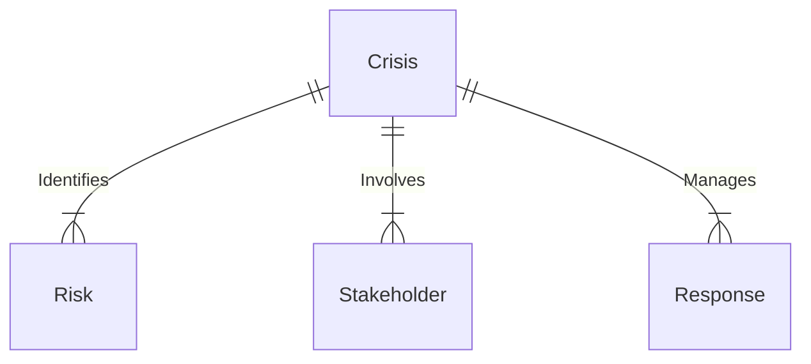

                 

### Introduction

#### Chapter 1: Background and Introduction

**1.1 Problem Background and Overview**

**1.1.1 Origin and Evolution of Technical Crises**

Technical crises often emerge from unexpected failures, vulnerabilities, or security breaches in technology systems. These crises can stem from various sources such as software bugs, hardware malfunctions, cyber-attacks, or data breaches. The origin of these crises can be traced back to the rapid advancement and complexity of modern technology. As technologies become increasingly interconnected, the potential for crises has also grown.

**1.1.2 Types and Characteristics of Technical Crises**

Technical crises can be classified into several types, including:

- **Software Crises:** These occur due to bugs, vulnerabilities, or errors in software code that result in system failures, data corruption, or security breaches.

- **Hardware Crises:** These arise from failures in hardware components such as servers, routers, or storage devices, leading to service disruptions or data loss.

- **Cybersecurity Crises:** These involve cyber-attacks, such as hacking, malware infections, or phishing, that compromise sensitive data or disrupt critical systems.

- **Data Breaches:** These occur when unauthorized individuals gain access to sensitive data, leading to potential misuse, theft, or exposure of personal information.

**1.1.3 Impact on Companies and Individuals**

Technical crises can have severe consequences for both companies and individuals. For companies, the impact can include:

- **Reputation Damage:** Public perception of the company may be negatively affected, leading to a loss of trust and credibility.

- **Financial Loss:** Companies may experience significant financial losses due to service disruptions, legal penalties, or the cost of crisis management.

- **Legal Liability:** Companies may face legal action from affected parties or regulatory bodies due to non-compliance with data protection laws or industry standards.

For individuals, the impact can include:

- **Privacy Concerns:** Personal information may be exposed, leading to potential identity theft or fraud.

- **Loss of Trust:** Individuals may lose trust in the company or its products, impacting their loyalty and future business interactions.

- **Emotional and Psychological Stress:** Dealing with the aftermath of a technical crisis can be emotionally and psychologically stressful for individuals.

**1.2 Definition and Core Concepts**

**1.2.1 Definition of Technical Crisis**

A technical crisis refers to an unexpected event or situation caused by a failure in technology systems, leading to disruptions, vulnerabilities, or security breaches that pose significant risks to individuals, companies, or organizations.

**1.2.2 Definition of Public Relations Crisis**

A public relations crisis is a situation in which a company's reputation or public image is at risk due to negative media coverage, public backlash, or other forms of adverse publicity. These crises can arise from various issues, including miscommunication, product defects, ethical violations, or security breaches.

**1.2.3 Relationship Between Technical Crisis and Public Relations Crisis**

Technical crises often have a direct impact on a company's public relations. When a company experiences a technical crisis, it can result in negative publicity, media scrutiny, and public backlash. Effective public relations strategies are crucial in managing the aftermath of a technical crisis to mitigate damage to the company's reputation and maintain public trust.

**1.3 Boundaries and Extensions**

**1.3.1 Scope of Technical Crisis Management**

Technical crisis management encompasses the identification, assessment, and mitigation of risks associated with technology systems. This includes developing strategies to prevent crises, responding to ongoing crises, and recovering from crises to minimize their impact on individuals, companies, or organizations.

**1.3.2 Distinctions from Related Fields**

While technical crisis management shares some similarities with other fields such as risk management and public relations, it focuses specifically on addressing the unique challenges posed by technology systems. Unlike risk management, which involves identifying and assessing potential risks, technical crisis management focuses on the immediate response and recovery from ongoing crises.

**1.4 Conceptual Structure and Core Elements**

**1.4.1 Core Concept Analysis**

The core concepts of technical crisis management include:

- **Risk Identification:** Identifying potential risks and vulnerabilities in technology systems.

- **Risk Assessment:** Evaluating the severity and potential impact of identified risks.

- **Mitigation Strategies:** Developing and implementing strategies to minimize the impact of risks.

- **Response and Recovery:** Responding to ongoing crises and recovering from their aftermath.

**1.4.2 Key Elements Introduction**

The key elements of technical crisis management include:

- **Prevention and Detection:** Implementing measures to prevent and detect potential crises.

- **Communication and Coordination:** Establishing effective communication channels and coordination mechanisms to manage crises.

- **Resource Allocation:** Allocating resources, including personnel, technology, and funding, to manage crises effectively.

- **Legal and Regulatory Compliance:** Ensuring compliance with relevant laws and regulations to mitigate legal risks.

**1.4.3 Conceptual Structure and Element Relationship**

The conceptual structure of technical crisis management can be visualized as a framework that includes risk identification, risk assessment, mitigation strategies, response and recovery, prevention and detection, communication and coordination, resource allocation, and legal and regulatory compliance. These elements are interconnected, forming a holistic approach to managing technical crises.

### Core Concepts and Principles

#### Chapter 2: Key Concepts and Principles of Technical Crisis Management

**2.1 Overview of Technical Crisis Management**

**2.1.1 Importance of Managing Technical Crises**

Managing technical crises is crucial for several reasons:

- **Reputation Protection:** Effective crisis management helps protect a company's reputation and maintain public trust.

- **Financial Stability:** By mitigating the impact of technical crises, companies can avoid significant financial losses.

- **Legal Compliance:** Proper crisis management ensures compliance with relevant laws and regulations, reducing legal risks.

- **Operational Continuity:** Crisis management strategies help maintain operational continuity, minimizing disruptions to business operations.

**2.1.2 Challenges in Managing Technical Crises**

Managing technical crises presents several challenges:

- **Complexity:** Technology systems are increasingly complex, making it difficult to identify and mitigate all potential risks.

- **Speed:** Technical crises often occur suddenly and require rapid response and decision-making.

- **Scalability:** Managing crises on a small scale may not translate to effective management on a larger scale.

- **Resource Constraints:** Limited resources, including personnel, technology, and funding, can hinder effective crisis management.

**2.1.3 Objectives of Technical Crisis Management**

The primary objectives of technical crisis management include:

- **Prevention:** Identifying and mitigating potential risks to prevent crises from occurring.

- **Containment:** Isolating and mitigating the impact of ongoing crises to prevent further damage.

- **Communication:** Establishing effective communication channels to keep stakeholders informed and engaged.

- **Recovery:** Restoring normal operations and rebuilding trust with affected parties.

**2.2 Public Relations Crisis Response Principles**

**2.2.1 Principles of Public Relations Crisis Response**

Effective public relations crisis response follows several key principles:

- **Speed and Timeliness:** Responding quickly to crises helps minimize damage and maintain public trust.

- **Transparency:** Being transparent about the crisis, its causes, and the steps taken to address it is crucial for rebuilding trust.

- **Empathy:** Show empathy towards affected parties, acknowledging their concerns and expressing genuine remorse for any inconvenience caused.

- **Consistency:** Maintaining consistency in messaging and actions helps maintain credibility and reduce confusion.

- **Communication Channels:** Utilizing multiple communication channels, including social media, press releases, and public statements, ensures comprehensive outreach.

**2.2.2 Crisis Response Strategies**

Effective crisis response strategies include:

- **Containment:** Isolating affected systems or areas to prevent the crisis from spreading further.

- **Mitigation:** Implementing measures to minimize the impact of the crisis, such as restoring affected systems or providing compensation to affected parties.

- **Restoration:** Restoring normal operations and ensuring the crisis does not recur.

- **Recovery:** Implementing measures to rebuild trust and reputation, such as improving security measures or enhancing customer support.

**2.2.3 Crisis Response Process**

The crisis response process typically involves the following steps:

1. **Identification and Assessment:** Identifying the crisis and assessing its impact on individuals, companies, or organizations.

2. **Notification and Mobilization:** Notifying relevant stakeholders and mobilizing crisis response teams.

3. **Containment and Mitigation:** Implementing measures to contain the crisis and mitigate its impact.

4. **Communication and Coordination:** Establishing effective communication channels and coordinating efforts with stakeholders.

5. **Restoration and Recovery:** Restoring normal operations and implementing measures to rebuild trust and reputation.

**2.3 Comparison of Core Concepts**

**2.3.1 Comparison of Technical Crisis and Public Relations Crisis**

While technical crises and public relations crises share some similarities, they also have distinct characteristics:

- **Nature:** Technical crises are caused by failures or vulnerabilities in technology systems, while public relations crises are caused by negative publicity or public backlash.

- **Impact:** Technical crises can result in operational disruptions, financial losses, and legal liabilities, while public relations crises primarily affect a company's reputation and public image.

- **Responsibility:** Technical crises are typically managed by technology and operations teams, while public relations crises are managed by public relations and marketing teams.

**2.3.2 Comparison of Different Types of Technical Crises**

Different types of technical crises have unique characteristics and challenges:

- **Software Crises:** These crises are caused by bugs, vulnerabilities, or errors in software code. They can result in system failures, data corruption, or security breaches.

- **Hardware Crises:** These crises arise from failures in hardware components, such as servers, routers, or storage devices. They can lead to service disruptions or data loss.

- **Cybersecurity Crises:** These crises involve cyber-attacks, such as hacking, malware infections, or phishing. They can compromise sensitive data or disrupt critical systems.

- **Data Breaches:** These crises occur when unauthorized individuals gain access to sensitive data. They can result in potential misuse, theft, or exposure of personal information.

**2.4 Entity-Relationship Diagram**

**2.4.1 Entity and Relationship Definitions**

The entity-relationship (ER) diagram is a visual representation of the core entities and relationships involved in technical crisis management. The main entities and relationships include:

- **Entities:**
  - **Crisis:** Represents a specific instance of a technical crisis.
  - **Risk:** Represents a potential threat or vulnerability that may lead to a crisis.
  - **Response:** Represents the actions taken to manage and mitigate a crisis.
  - **Stakeholder:** Represents individuals or organizations affected by the crisis.

- **Relationships:**
  - **Identifies:** Represents the relationship between a crisis and its underlying risks.
  - **Involves:** Represents the relationship between a crisis and its stakeholders.
  - **Manages:** Represents the relationship between a crisis and the response actions taken.

**2.4.2 ER Diagram Visualization**

The ER diagram can be visualized as follows:

This ER diagram illustrates the relationships between the core entities involved in technical crisis management, highlighting the importance of identifying risks, involving stakeholders, and managing response actions.

### Practical Methods and Cases

#### Chapter 3: Practical Methods for Handling Technical Crises

**3.1 Crisis Prevention and Early Warning**

**3.1.1 Preventive Measures**

Preventing technical crises is crucial for minimizing their impact on individuals, companies, and organizations. Some effective preventive measures include:

- **Risk Assessment:** Conduct regular risk assessments to identify potential vulnerabilities and threats in technology systems. This helps prioritize resources for mitigation efforts.

- **Security Measures:** Implement robust security measures, such as firewalls, encryption, and intrusion detection systems, to protect against cyber-attacks and data breaches.

- **Regular Updates:** Keep software and hardware systems up to date with the latest security patches and updates. This helps address known vulnerabilities and reduce the risk of exploits.

- **Employee Training:** Provide regular training and awareness programs to educate employees about potential risks and best practices for maintaining security.

- **Incident Response Plan:** Develop and regularly update an incident response plan to outline the steps and procedures for responding to technical crises.

**3.1.2 Early Warning Mechanisms**

Early warning mechanisms are essential for detecting and addressing potential crises before they escalate. Some effective early warning mechanisms include:

- **Monitoring Systems:** Implement monitoring systems to continuously monitor the performance and security of technology systems. These systems can detect anomalies or signs of potential issues.

- **Alerts and Notifications:** Set up alerts and notifications to notify relevant stakeholders of potential crises or anomalies. This enables prompt action to address issues before they worsen.

- **Regular Audits:** Conduct regular audits to review the effectiveness of preventive measures and identify areas for improvement.

- **Feedback Loops:** Establish feedback loops with employees, customers, and other stakeholders to gather insights and identify potential risks or issues.

**3.1.3 Case Study: Early Warning in Practice**

Consider the case of a large financial institution that experienced a data breach. The organization had implemented an early warning mechanism that included:

- **Monitoring Systems:** The institution had deployed monitoring systems that continuously monitored network traffic and detected unusual activity.

- **Alerts and Notifications:** Alerts were sent to the security team when suspicious activity was detected, allowing them to investigate and respond promptly.

- **Feedback Loops:** The organization encouraged employees and customers to report any unusual activity or concerns. This helped identify potential vulnerabilities and address them before they could be exploited.

Despite these measures, the institution still experienced a data breach. However, the early warning mechanism enabled them to detect and respond to the breach quickly, minimizing the impact and reducing potential financial losses.

**3.2 Emergency Response and Crisis Management**

**3.2.1 Emergency Response Process**

Emergency response is a critical component of managing technical crises. The emergency response process typically involves the following steps:

1. **Detection:** Identify and confirm the occurrence of a crisis or anomaly through monitoring systems, alerts, or reports.

2. **Notification:** Notify relevant stakeholders, including the crisis response team, management, and affected individuals or organizations.

3. **Containment:** Isolate and mitigate the impact of the crisis to prevent it from spreading further. This may involve shutting down affected systems, blocking access to compromised accounts, or implementing temporary fixes.

4. **Assessment:** Assess the severity and impact of the crisis. This helps prioritize response actions and allocate resources effectively.

5. **Communication:** Establish effective communication channels to keep stakeholders informed and engaged. This includes providing updates, addressing concerns, and managing media inquiries.

6. **Restoration:** Restore normal operations and implement measures to prevent the crisis from recurring. This may involve repairing or replacing affected systems, implementing additional security measures, or enhancing incident response capabilities.

7. **Recovery:** Implement measures to recover from the crisis and restore trust and reputation. This may include providing compensation to affected parties, improving customer support, and implementing measures to address root causes.

**3.2.2 Crisis Management Strategies**

Effective crisis management strategies include:

- **Incident Response Team:** Establish an incident response team with specialized skills and expertise to manage crises. This team should include representatives from different departments, including IT, security, legal, and public relations.

- **Communication Plan:** Develop a comprehensive communication plan that outlines how to communicate with stakeholders during a crisis. This plan should include predefined messaging, communication channels, and response protocols.

- **Resource Allocation:** Allocate resources, including personnel, technology, and funding, to manage crises effectively. This ensures that all necessary resources are available to address the crisis promptly.

- **Legal and Compliance Support:** Engage legal and compliance experts to ensure that crisis management actions comply with relevant laws and regulations.

- **Training and Drills:** Conduct regular training and drills to prepare employees for crisis scenarios and ensure they are aware of their roles and responsibilities.

**3.2.3 Case Study: Emergency Response in Practice**

Consider the case of a global technology company that experienced a significant data breach. The company's emergency response process involved:

- **Detection:** The security team detected unusual network activity that indicated a potential breach.

- **Notification:** The crisis response team was notified, and they immediately mobilized to address the situation.

- **Containment:** The affected systems were isolated, and access to compromised accounts was blocked to prevent further damage.

- **Assessment:** The team assessed the severity of the breach and determined the extent of the impact on the company's operations and data.

- **Communication:** The company's communication plan was activated, and stakeholders were informed of the breach. This included updates for employees, customers, and the media.

- **Restoration:** The company worked to restore affected systems and implement additional security measures to prevent future breaches.

- **Recovery:** The company provided compensation to affected customers and improved its incident response capabilities to address root causes and prevent similar incidents in the future.

Despite the breach, the company's effective emergency response process helped minimize the impact and maintain public trust.

**3.3 Restoration and Reconstruction**

**3.3.1 Restoration Strategies**

Restoration strategies focus on addressing the immediate aftermath of a crisis and restoring normal operations. Some key restoration strategies include:

- **Data Recovery:** Restore lost or corrupted data from backups to ensure business continuity.

- **System Repair:** Repair or replace affected systems to restore functionality.

- **Enhanced Security:** Implement additional security measures to prevent future breaches or incidents.

- **Customer Support:** Provide dedicated customer support to assist affected individuals or organizations.

**3.3.2 Building Trust**

Building trust is crucial for restoring public confidence after a crisis. Some strategies for building trust include:

- **Transparency:** Communicate openly and transparently about the crisis, its causes, and the steps taken to address it.

- **Compensation:** Provide compensation or support to affected individuals or organizations to demonstrate accountability and empathy.

- **Continuous Improvement:** Implement measures to continuously improve incident response capabilities and prevent similar incidents in the future.

- **Public Relations:** Engage in public relations efforts to rebuild the company's reputation and maintain public trust.

**3.3.3 Case Study: Restoration and Trust Building in Practice**

Consider the case of a popular e-commerce platform that experienced a significant data breach. The company's restoration and trust-building efforts involved:

- **Data Recovery:** The company worked with data recovery experts to restore lost data from backups.

- **System Repair:** Affected systems were repaired or replaced to restore functionality.

- **Enhanced Security:** Additional security measures, including multi-factor authentication and encryption, were implemented to prevent future breaches.

- **Customer Support:** A dedicated customer support team was established to assist affected users.

- **Transparency:** The company communicated openly and transparently about the breach, its causes, and the steps taken to address it.

- **Compensation:** Affected users were provided with free credit monitoring services and compensation for any financial losses incurred.

- **Continuous Improvement:** The company implemented measures to continuously improve its incident response capabilities and prevent similar incidents in the future.

Despite the breach, the company's effective restoration and trust-building efforts helped maintain public trust and minimize the impact on its reputation.

### Case Studies and Analysis

#### Chapter 4: Case Studies of Technical Crisis Management

**4.1 Domestic Technical Crisis Case Studies**

**4.1.1 Case 1: A Well-Known Enterprise Product Security Incident**

In 2019, a well-known enterprise in the finance sector experienced a significant product security incident. The company's flagship software, used by numerous financial institutions, was found to have a critical vulnerability that could potentially allow unauthorized access to sensitive data.

**Key Details:**

- **Crisis Trigger:** The vulnerability was discovered by an external security researcher who reported it to the company.

- **Impact:** The incident exposed the personal and financial information of thousands of users, leading to a loss of trust and public confidence in the affected financial institutions.

- **Response:**

  - **Containment:** The company immediately took steps to isolate the affected software and prevent further data access.

  - **Notification:** Affected financial institutions were promptly notified, and steps were taken to inform affected users.

  - **Repair and Recovery:** The company worked with security experts to fix the vulnerability and restore affected systems.

  - **Compensation:** The company provided affected financial institutions with free credit monitoring services and financial compensation for any losses incurred.

**Lessons Learned:**

- **Early Detection and Reporting:** The incident highlighted the importance of early detection and reporting of vulnerabilities. The company could have mitigated the impact if the vulnerability had been detected earlier.

- **Transparent Communication:** The company's transparent communication with affected parties helped maintain trust and minimize damage to its reputation.

- **Continuous Improvement:** The incident underscored the need for continuous improvement in security measures and incident response capabilities.

**4.1.2 Case 2: An Internet Company Data Breach**

In 2020, a leading internet company experienced a major data breach that exposed the personal information of millions of users. The breach was caused by a sophisticated cyber-attack that compromised the company's customer database.

**Key Details:**

- **Crisis Trigger:** The breach was discovered after an external security researcher reported unusual activity on the company's network.

- **Impact:** The breach resulted in the exposure of sensitive personal information, including names, addresses, phone numbers, and credit card details.

- **Response:**

  - **Containment:** The company quickly isolated the affected systems and blocked further access to the compromised database.

  - **Notification:** Affected users were notified through email and public statements, and steps were taken to inform regulatory authorities.

  - **Repair and Recovery:** The company engaged security experts to investigate the breach and implement measures to prevent future incidents.

  - **Compensation:** The company offered affected users free credit monitoring services and provided guidance on protecting their personal information.

**Lessons Learned:**

- **Robust Security Measures:** The incident highlighted the need for robust security measures to prevent cyber-attacks and data breaches.

- **Timely Response:** The company's swift response helped minimize the impact of the breach and maintain public trust.

- **User Education:** The incident underscored the importance of educating users on the risks of data breaches and the steps they can take to protect their personal information.

**4.1.3 Case 3: A Technology Company User Privacy Dispute**

In 2021, a technology company faced a significant user privacy dispute that resulted in a class-action lawsuit. The dispute centered around allegations that the company collected and shared user data without proper consent.

**Key Details:**

- **Crisis Trigger:** The lawsuit was filed by a group of users who claimed that their data was collected and shared without their knowledge or consent.

- **Impact:** The dispute attracted significant media attention and raised concerns about the company's data privacy practices.

- **Response:**

  - **Containment:** The company took steps to address the allegations and enhance its data privacy practices.

  - **Notification:** Affected users were notified of the lawsuit and the steps the company was taking to address the concerns.

  - **Legal Defense:** The company hired legal experts to defend against the class-action lawsuit.

  - **Public Relations:** The company engaged in public relations efforts to address the allegations and maintain transparency with stakeholders.

**Lessons Learned:**

- **Data Privacy Compliance:** The incident highlighted the importance of complying with data privacy laws and regulations to avoid legal disputes.

- **Transparency and Accountability:** The company's transparency in addressing the allegations helped maintain public trust and minimize damage to its reputation.

- **User Consent and Trust:** The incident underscored the need for obtaining clear and informed consent from users when collecting and sharing their data.

**4.2 International Technical Crisis Case Studies**

**4.2.1 Case 1: Apple Battery Replacement Crisis**

In 2019, Apple faced a significant crisis related to its battery replacement program. Reports surfaced that the company's iPhone devices were slowing down to force users to replace their batteries, leading to allegations of deceptive practices.

**Key Details:**

- **Crisis Trigger:** The crisis was triggered by a whistleblower's report and public outcry over the battery replacement program.

- **Impact:** The crisis led to a loss of trust and public confidence in Apple's product reliability and transparency.

- **Response:**

  - **Containment:** Apple halted the battery replacement program and announced changes to its software update policies to provide more transparency.

  - **Notification:** Apple communicated with its customers and the public, acknowledging the concerns and outlining the changes to its practices.

  - **Public Relations:** Apple engaged in public relations efforts to address the allegations and rebuild trust with its customers.

  - **Compensation:** The company offered free battery replacements to affected customers and extended the warranty on some devices.

**Lessons Learned:**

- **Transparency and Communication:** The crisis highlighted the importance of transparent communication and addressing customer concerns promptly.

- **Product Reliability:** The incident underscored the need for ensuring product reliability and avoiding practices that could harm customer trust.

- **Customer Relationships:** Maintaining strong customer relationships is crucial for managing crises and preserving reputation.

**4.2.2 Case 2: Tesla Autonomous Driving Accident**

In 2021, a Tesla vehicle involved in an autonomous driving mode was involved in a fatal accident. The incident raised concerns about the safety and reliability of autonomous driving technology.

**Key Details:**

- **Crisis Trigger:** The accident was reported in the media and led to widespread scrutiny of autonomous driving technology.

- **Impact:** The incident caused a loss of trust in Tesla's autonomous driving capabilities and raised questions about the safety of autonomous vehicles.

- **Response:**

  - **Containment:** Tesla temporarily disabled certain features of its autonomous driving system while conducting a thorough investigation.

  - **Notification:** Tesla communicated with its customers and the public about the accident and the steps being taken to address the concerns.

  - **Public Relations:** Tesla engaged in public relations efforts to address the safety concerns and emphasize the ongoing development and testing of its autonomous driving technology.

  - **Compensation:** The company offered support to the victim's family and emphasized its commitment to safety.

**Lessons Learned:**

- **Safety and Testing:** The incident highlighted the importance of rigorous safety testing and validation of autonomous driving technology.

- **Transparency and Communication:** Open and transparent communication is essential for addressing safety concerns and maintaining public trust.

- **Continuous Improvement:** The incident underscored the need for continuous improvement and adaptation of autonomous driving technology to address emerging challenges.

**4.2.3 Case 3: International Internet Company Cybersecurity Incident**

In 2020, a major international internet company experienced a significant cybersecurity incident resulting from a sophisticated cyber-attack. The attack compromised the company's customer database, exposing sensitive personal and financial information.

**Key Details:**

- **Crisis Trigger:** The attack was discovered by the company's security team after detecting unusual activity on its network.

- **Impact:** The incident resulted in the exposure of millions of user records, leading to widespread concerns about data privacy and security.

- **Response:**

  - **Containment:** The company quickly isolated the affected systems and prevented further data access.

  - **Notification:** Affected users were notified through email and public statements, and steps were taken to inform regulatory authorities.

  - **Repair and Recovery:** The company engaged security experts to investigate the breach and implement measures to prevent future incidents.

  - **Compensation:** The company offered affected users free credit monitoring services and guidance on protecting their personal information.

**Lessons Learned:**

- **Proactive Security Measures:** The incident highlighted the importance of implementing robust security measures to prevent cyber-attacks.

- **Timely Response:** The company's swift response helped minimize the impact of the breach and maintain public trust.

- **Regulatory Compliance:** Ensuring compliance with relevant data protection laws and regulations is crucial for managing data breaches effectively.

### Best Practices and Recommendations

#### Chapter 5: Best Practices for Handling Technical Crises

**5.1 Experience Summary**

Managing technical crises requires a combination of experience, best practices, and effective strategies. Drawing from various case studies and industry insights, the following best practices have proven effective in handling technical crises:

**5.1.1 Success Case Summaries**

- **Transparent Communication:** Companies that communicate openly and transparently with affected parties during a crisis often experience less damage to their reputation and maintain public trust more effectively.

- **Swift Containment:** Promptly containing a crisis can prevent further damage and minimize the impact on individuals, companies, and organizations.

- **Robust Incident Response Teams:** Establishing well-trained and specialized incident response teams can significantly improve crisis management capabilities.

- **Continuous Improvement:** Regularly reviewing and updating crisis management plans and procedures helps address emerging challenges and ensure preparedness.

**5.1.2 Failure Case Lessons**

- **Inadequate Preparation:** Companies that fail to prepare for potential crises often struggle to respond effectively, leading to prolonged disruptions and increased damage.

- **Lack of Transparency:** Hiding information or providing misleading updates during a crisis can erode trust and damage a company's reputation.

- **Failure to Engage Stakeholders:** Neglecting to involve stakeholders, including customers, employees, and regulatory bodies, can hinder effective crisis management and recovery efforts.

**5.2 Important Considerations**

**5.2.1 Avoiding Common Mistakes**

To manage technical crises effectively, it is crucial to avoid common mistakes:

- **Overlooking Early Warning Signs:** Failing to detect and address potential risks early can lead to more severe crises. Implementing robust monitoring systems and early warning mechanisms is essential.

- **Relying Solely on Technology:** While technology plays a critical role in crisis management, human judgment and expertise are equally important. Combining technology with human oversight can improve decision-making and response effectiveness.

- **Neglecting Communication:** Communication is a key aspect of crisis management. Ignoring stakeholders' concerns or failing to provide timely updates can exacerbate the crisis and damage relationships.

**5.2.2 Managing Risks**

Effective crisis management requires a proactive approach to risk management:

- **Conduct Regular Risk Assessments:** Regularly assess potential risks and vulnerabilities in technology systems to identify areas for improvement and mitigation.

- **Implement Robust Security Measures:** Invest in robust security measures, including firewalls, encryption, intrusion detection systems, and regular security audits.

- **Train Employees:** Provide regular training and awareness programs to educate employees about potential risks and best practices for maintaining security.

- **Develop an Incident Response Plan:** Create a comprehensive incident response plan that outlines the steps and procedures for responding to various types of crises.

**5.3 Additional Resources**

For those interested in further exploring technical crisis management, the following resources provide valuable insights and best practices:

**5.3.1 Recommended Books**

- "The Crisis Manager: Survival and Growth Strategy for the Public Relations Professional" by Richard H. Thomas
- "Crisis Communications: A Casebook Approach" by Robert J. Grubesic

**5.3.2 Recommended Academic Articles**

- "Crisis Communication in Organizations: Strategies for Managing Organizational Crises" by Sanz-Ezquerro, M. J., & Moya-Cuevas, J. L.
- "The Role of Communication in Managing Crises" by Grunig, J. E., & Grunig, L. A.

**5.3.3 Recommended Online Courses**

- "Crisis Management" by the University of Illinois on Coursera
- "Crisis and Risk Communication" by the University of Minnesota on EdX

By leveraging these best practices, resources, and lessons learned from case studies, individuals and organizations can enhance their ability to manage and respond to technical crises effectively.

### Conclusion

#### Chapter 6: Summary and Future Directions

In conclusion, managing technical crises is a complex but essential task for individuals, companies, and organizations. The chapter has covered various aspects of technical crisis management, including the background and introduction to the topic, key concepts and principles, practical methods and cases, case studies and analysis, best practices, and recommendations.

**Summary of Key Points**

- **Background and Introduction:** We discussed the origin and evolution of technical crises, their types and characteristics, and their impact on individuals and organizations. We also defined technical crisis and public relations crisis and explored their relationship.

- **Core Concepts and Principles:** We examined the key principles and strategies for managing technical crises, including prevention, early warning, emergency response, restoration, and trust building. We also compared different types of technical crises and their unique challenges.

- **Practical Methods and Cases:** We explored practical methods for preventing and responding to technical crises, including preventive measures, early warning mechanisms, emergency response processes, and restoration strategies. We also discussed case studies to illustrate effective crisis management practices.

- **Case Studies and Analysis:** We analyzed domestic and international technical crisis case studies to understand the impact of crises and the effectiveness of crisis management practices. We highlighted the importance of transparency, communication, and proactive risk management.

- **Best Practices and Recommendations:** We summarized best practices for managing technical crises, including avoiding common mistakes, managing risks, and leveraging additional resources. We recommended further reading and online courses to enhance knowledge and skills in crisis management.

**Future Directions**

As technology continues to evolve and become more integrated into our daily lives, the complexity and frequency of technical crises are likely to increase. Here are some future directions for technical crisis management:

1. **Emphasizing Proactivity:** Moving towards a proactive approach to crisis management by continuously identifying and addressing potential risks and vulnerabilities before they escalate into crises.

2. **Enhancing Collaboration:** Encouraging collaboration between different departments, stakeholders, and external experts to improve crisis management capabilities and foster a culture of preparedness.

3. **Developing Advanced Analytics:** Leveraging advanced analytics and machine learning techniques to predict and detect potential crises earlier, enabling more effective prevention and response strategies.

4. **Improving Crisis Communication:** Enhancing communication strategies to ensure timely and transparent updates to stakeholders during crises, reducing confusion and maintaining trust.

5. **Continuing Education and Training:** Providing regular training and education for employees and stakeholders to enhance their understanding of potential risks, crisis management procedures, and best practices.

By adopting these future directions and continuously improving crisis management practices, individuals and organizations can better prepare for and respond to technical crises, minimizing their impact and maintaining public trust and reputation.

