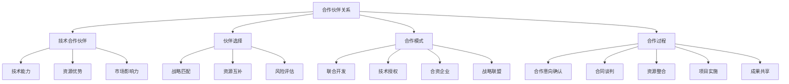
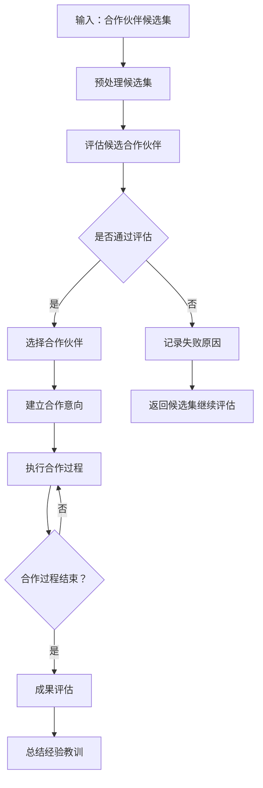
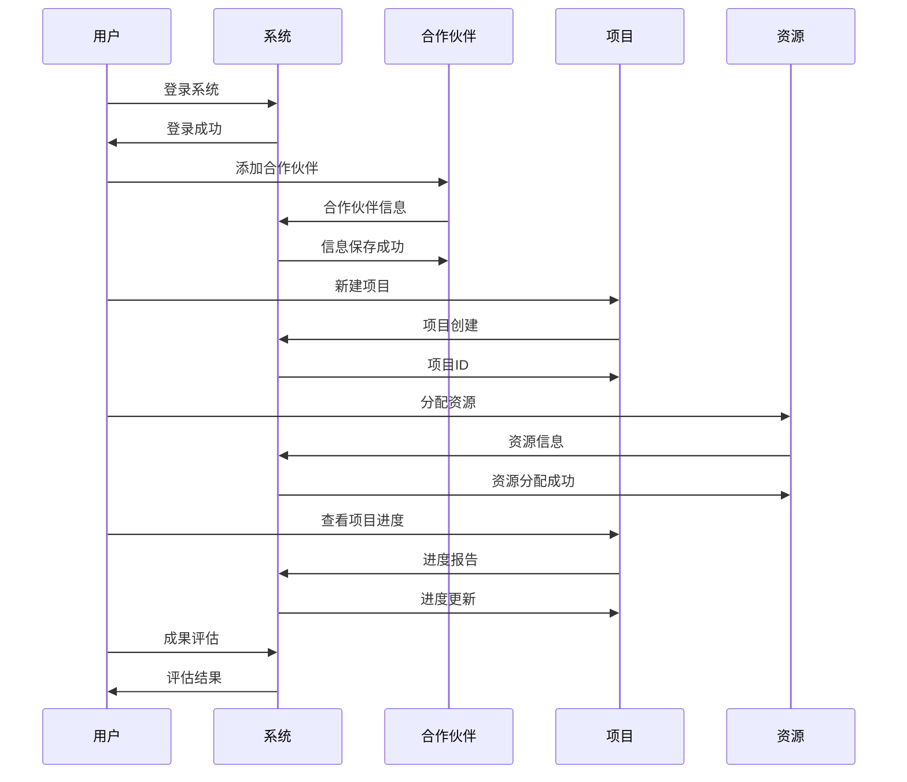
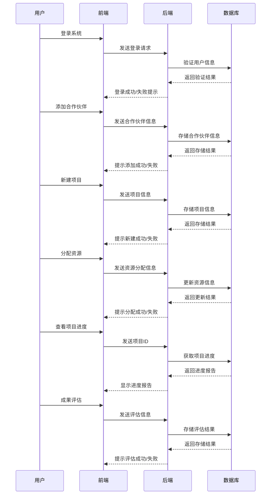

                 

### # 第二部分：核心概念与框架

## 第2章：技术合作伙伴关系管理的基础

### 2.1 核心概念定义

在探讨技术合作伙伴关系管理之前，我们需要明确几个核心概念的内涵和外延。以下是对这些核心概念的详细定义：

- **合作伙伴关系**：指的是两个或多个企业、组织或个人之间基于共同目标或利益，通过协商合作、共享资源、共担风险等方式建立的长期合作模式。
  
- **技术合作伙伴**：通常是指具备特定技术能力、资源或市场影响力的企业或组织，与另一家企业或组织之间建立的技术合作联盟。

- **伙伴选择**：是指根据企业的战略目标、技术需求和市场环境等因素，选择最适合的合作伙伴的过程。

- **合作模式**：包括联合开发、技术授权、合资企业、战略联盟等多种形式。

- **合作过程**：涵盖从合作意向的确认、合同谈判、资源整合、项目实施到成果共享等多个阶段。

### 2.2 概念属性特征对比

为了更好地理解这些核心概念，我们提供了一个对比表格，列出它们的主要属性特征：

| 概念        | 定义                                                         | 主要属性特征                                             |
| ----------- | ------------------------------------------------------------ | -------------------------------------------------------- |
| 合作伙伴关系 | 企业、组织或个人之间建立的长期合作模式                        | 共同目标、资源共享、风险共担、互惠互利                   |
| 技术合作伙伴 | 具备特定技术能力、资源或市场影响力的企业或组织                | 技术实力、资源优势、市场影响力、合作意愿                 |
| 伙伴选择    | 根据企业战略目标、技术需求和市场环境等因素，选择最适合的合作伙伴 | 战略匹配、资源互补、市场协同、风险控制                 |
| 合作模式    | 合作双方采用的具体合作形式                                   | 联合开发、技术授权、合资企业、战略联盟等                 |
| 合作过程    | 从合作意向到成果共享的整个过程                               | 合作意向确认、合同谈判、资源整合、项目实施、成果共享等阶段 |

### 2.3 概念结构与核心要素组成

下面，我们将使用Mermaid绘制一个ER（实体关系）图来展示这些核心概念之间的结构关系及其核心要素组成。

```mermaid
erDiagram
  产品管理 ||--|{ 合作伙伴选择 }|-- 项目管理
  项目管理 ||--|{ 合作过程 }|-- 成果评估
  成果评估 ||--|{ 合作模式 }|-- 技术合作
  合作伙伴选择 }|--|{ 合作伙伴关系 }|
```

在这个ER图中，我们明确了各概念之间的关系，以及它们在技术合作伙伴关系管理中的核心作用。产品管理需要合作伙伴选择的支持，而合作伙伴选择的结果又影响合作过程的实施。合作过程的成果需要通过成果评估来确认，而评估结果将决定未来的合作模式。

通过这一章，我们对技术合作伙伴关系管理中的核心概念有了更深入的理解。在接下来的章节中，我们将进一步探讨这些概念的应用原理和实际操作策略。

### # 第三部分：原理与策略

## 第3章：技术合作伙伴关系管理的原则与策略

### 3.1 管理原则

技术合作伙伴关系管理的成功不仅取决于合作伙伴的选择，还需要遵循一系列核心管理原则。以下是几个关键的管理原则：

- **合作共赢**：合作伙伴关系建立在互惠互利的基础上，双方需要共同制定合作目标，确保在合作过程中实现共赢。
- **透明沟通**：双方应保持透明、开放的沟通机制，及时分享信息，解决合作过程中出现的任何问题。
- **资源整合**：充分利用双方的技术、市场、人力资源，实现资源的最优配置，提升合作效率。
- **风险管理**：识别和评估合作过程中的潜在风险，制定相应的风险应对策略，确保合作的稳定性和持续性。
- **持续优化**：合作过程中，不断反思和调整合作模式，以适应市场和技术环境的变化。

### 3.2 策略应用

在明确了管理原则后，我们需要制定具体的策略来实施技术合作伙伴关系管理。以下是一些关键策略：

- **伙伴选择策略**：
  - **战略匹配**：选择与自身战略目标相符的合作伙伴，确保合作方向一致。
  - **资源互补**：选择在技术、市场或人力资源方面具有互补优势的伙伴，以实现优势互补。
  - **风险评估**：在合作伙伴选择过程中，进行全面的风险评估，确保合作伙伴的稳定性和可靠性。
  
- **合作过程策略**：
  - **明确目标**：在合作开始前，明确双方的合作目标和预期成果，确保合作的清晰性和目标导向。
  - **过程监控**：建立有效的过程监控机制，实时跟踪合作进度，及时调整合作计划。
  - **成果共享**：制定合理的成果共享机制，确保双方在合作过程中能够公平地分享成果。

- **风险管理策略**：
  - **风险识别**：通过定期评估和风险监测，识别潜在的风险因素。
  - **风险应对**：制定相应的风险应对策略，包括风险规避、风险减轻和风险接受等。
  - **风险控制**：在合作过程中，持续监控风险，确保风险处于可控范围。

- **持续优化策略**：
  - **定期评估**：定期对合作过程和成果进行评估，发现问题和改进点。
  - **反馈机制**：建立有效的反馈机制，收集合作伙伴的反馈意见，用于改进合作模式。
  - **创新驱动**：通过技术创新和管理创新，不断提升合作的效率和效果。

### 3.3 实施方法

为了更好地实施技术合作伙伴关系管理，我们可以采用以下方法：

- **制定合作协议**：明确双方的权利、义务和责任，确保合作过程的规范性和合法性。
- **建立沟通渠道**：设立专门的沟通小组或沟通平台，确保信息的及时传递和沟通的顺畅。
- **实施项目管理制度**：采用项目管理的方法，对合作过程进行全程管理和监督。
- **定期审计和评估**：定期对合作成果进行审计和评估，确保合作目标的实现。

### 3.4 案例分析

为了更好地理解上述原则和策略的应用，我们可以通过一个实际案例来进行分析：

**案例：A公司与B公司的技术合作**

A公司是一家专注于人工智能技术的企业，而B公司则是一家拥有丰富市场资源和技术积累的互联网公司。双方基于共同的战略目标，决定开展一项人工智能项目，以开发一款面向消费者的智能语音助手。

- **合作原则**：双方遵循共赢原则，明确了共同的目标和预期成果，并建立了透明、开放的沟通机制。

- **选择策略**：A公司选择了B公司作为合作伙伴，基于战略匹配和资源互补的原则，确保了合作的成功。

- **合作过程**：在合作过程中，双方制定了详细的项目计划，明确了各阶段的目标和任务。同时，建立了定期汇报和沟通机制，确保项目进展的顺利。

- **风险管理**：双方共同识别了潜在的技术和市场风险，并制定了相应的风险应对策略，如技术难题的攻关和市场推广的营销策略。

- **持续优化**：在项目实施过程中，双方不断反思和改进合作模式，通过技术创新和管理优化，提升了项目的效率和质量。

通过上述案例，我们可以看到，技术合作伙伴关系管理的原则和策略在具体应用中的重要性。只有遵循这些原则和策略，才能确保合作的顺利进行，实现双方的目标和预期成果。

### # 第四部分：实践与案例分析

## 第4章：技术合作伙伴关系管理的实践与案例分析

### 4.1 实践背景

技术合作伙伴关系管理在企业的发展中扮演着至关重要的角色。为了更好地理解这一管理的实际应用，我们选择了一家领先的人工智能企业C公司和一家大型云计算服务商D公司的合作案例进行详细分析。

**案例背景**：

C公司是一家专注于人工智能技术研发和应用的企业，其核心产品包括智能语音识别、自然语言处理和计算机视觉等。D公司则是一家全球领先的云计算服务提供商，拥有强大的计算资源和技术支持能力。两家公司基于共同的战略目标，决定开展一项为期三年的云计算与人工智能集成项目，旨在为全球客户提供高效、智能的云计算解决方案。

### 4.2 合作模式

C公司和D公司的合作模式采用了战略联盟的方式，通过建立长期稳定的合作关系，共同推动云计算与人工智能技术的创新和应用。具体的合作模式包括以下几个方面：

- **联合研发**：双方共同成立了一个联合研发中心，专注于云计算与人工智能技术的研发，目标是开发出具有突破性的智能云计算平台。

- **资源共享**：C公司提供其核心的人工智能算法和技术，D公司则提供其云计算基础设施和计算资源，双方通过资源共享，提升研发效率和创新能力。

- **市场推广**：D公司利用其全球市场和客户资源，帮助C公司的产品快速进入市场，同时，C公司也为其云计算服务提供技术支持，共同开拓新的商业机会。

### 4.3 合作过程

C公司和D公司的合作过程分为以下几个阶段：

- **合作意向确认**：在项目启动前，双方通过多次会议和沟通，明确了合作意向和目标，达成了合作共识。

- **合同谈判与签署**：双方经过详细讨论，签署了合作协议，明确了双方的权利、义务和责任，为合作奠定了法律基础。

- **资源整合**：双方开始整合各自的资源，包括技术、人力和资金，确保项目的顺利启动和推进。

- **项目实施**：联合研发中心正式成立，双方开始共同开展研发工作，同时，D公司开始为客户提供云计算服务。

- **成果评估**：在项目中期和末期，双方对项目的进展和成果进行评估，根据评估结果调整合作策略，确保项目的成功。

### 4.4 案例分析

**成功因素**：

1. **战略匹配**：C公司和D公司的战略目标高度一致，都希望通过合作提升自身的技术实力和市场竞争力。

2. **资源互补**：C公司提供了先进的人工智能技术，D公司提供了强大的云计算资源，双方资源互补，提升了合作效率和成果。

3. **透明沟通**：双方建立了高效的沟通机制，定期召开会议，及时分享信息和解决合作过程中的问题。

4. **风险管理**：双方共同识别和评估了合作过程中可能出现的风险，并制定了相应的应对策略，确保了项目的稳定性和持续性。

**挑战与解决方案**：

1. **技术协同**：由于C公司和D公司在技术领域有所不同，需要一定时间进行技术协同和整合。解决方案是双方通过联合研发中心，定期进行技术交流和培训，提升协同效率。

2. **市场推广**：如何快速开拓市场是双方面临的挑战。解决方案是D公司利用其市场资源和推广渠道，同时C公司提供技术支持和市场反馈，共同推动市场拓展。

### 4.5 结论与启示

通过C公司和D公司的合作案例，我们可以看到，技术合作伙伴关系管理的成功离不开以下几个关键因素：

- **战略匹配**：选择与自身战略目标相符的合作伙伴，确保合作方向一致。

- **资源互补**：通过资源共享，提升合作效率和创新能力。

- **透明沟通**：建立高效的沟通机制，确保合作的顺利进行。

- **风险管理**：共同识别和评估风险，制定应对策略，确保合作的稳定性和持续性。

该案例也为其他企业提供了宝贵的经验，展示了通过技术合作伙伴关系管理实现共同发展和创新的路径。通过有效的合作管理，企业可以充分发挥各自的优势，共同应对市场挑战，实现可持续发展。

### # 第五部分：实施与策略

## 第5章：技术合作伙伴关系管理的实施与策略

### 5.1 实施步骤

要有效地实施技术合作伙伴关系管理，企业需要遵循以下步骤：

1. **合作伙伴选择**：根据企业的战略目标、市场需求和资源状况，选择最适合的合作伙伴。选择标准应包括战略匹配度、资源互补性、市场影响力、技术实力等。

2. **合作目标制定**：明确合作目标，确保双方目标一致，制定具体的合作计划和执行方案。

3. **合作协议签署**：制定详细合作协议，明确双方的权利、义务和责任，确保合作的合法性和规范性。

4. **资源整合**：整合双方的技术、市场、人力资源，确保合作资源的最佳配置。

5. **项目执行**：按照合作计划和执行方案，开展项目实施，确保项目进度和质量。

6. **过程监控**：建立过程监控机制，实时跟踪项目进展，及时调整计划和策略。

7. **成果评估**：在项目完成后，对合作成果进行评估，总结经验教训，为后续合作提供参考。

### 5.2 实施策略

为了确保技术合作伙伴关系管理的成功，企业需要采取以下策略：

1. **战略匹配策略**：选择与自身战略目标高度一致的合作伙伴，确保合作方向一致，避免资源浪费。

2. **资源整合策略**：充分利用双方的技术、市场、人力资源，实现资源的最优配置，提升合作效率。

3. **风险管理策略**：识别和评估合作过程中的潜在风险，制定相应的风险应对策略，确保合作的稳定性和持续性。

4. **过程监控策略**：建立有效的过程监控机制，实时跟踪项目进展，及时发现和解决问题，确保项目按计划推进。

5. **成果共享策略**：制定合理的成果共享机制，确保双方在合作过程中能够公平地分享成果，增强合作的可持续性。

### 5.3 实施方法

为了更好地实施技术合作伙伴关系管理，企业可以采用以下方法：

1. **制定合作计划**：明确合作目标和任务，制定详细的合作计划和时间表，确保项目的有序推进。

2. **建立沟通渠道**：设立专门的沟通小组或沟通平台，确保信息的及时传递和沟通的顺畅。

3. **实施项目管理制度**：采用项目管理的方法，对合作过程进行全程管理和监督，确保项目的进度和质量。

4. **定期评估与反馈**：定期对合作过程和成果进行评估，收集合作伙伴的反馈意见，用于改进合作模式。

5. **培训与支持**：为合作伙伴提供技术培训和支持，提升合作双方的技术水平和协作能力。

### 5.4 实施案例

以下是一个实际案例，展示了如何实施技术合作伙伴关系管理：

**案例：E公司与F公司的合作**

E公司是一家专注于物联网技术的企业，F公司则是一家领先的智能家居设备制造商。两家公司决定开展一项智能家居物联网解决方案的研发和推广项目。

1. **合作伙伴选择**：E公司和F公司基于战略匹配和资源互补的原则，选择了对方作为合作伙伴。

2. **合作目标制定**：明确合作目标，包括开发智能家居物联网平台、拓展市场、提升品牌影响力等。

3. **合作协议签署**：双方制定了详细的合作协议，明确了各自的职责、权益和责任。

4. **资源整合**：E公司提供了物联网技术和解决方案，F公司提供了智能家居设备和技术支持。

5. **项目执行**：双方共同成立了项目团队，按照合作计划和时间表，开展研发和市场推广工作。

6. **过程监控**：建立了过程监控机制，定期召开会议，跟踪项目进展，解决遇到的问题。

7. **成果评估**：在项目完成后，对合作成果进行评估，总结经验教训，为后续合作提供参考。

通过这个案例，我们可以看到，技术合作伙伴关系管理的实施是一个系统性的过程，需要从合作伙伴选择、目标制定、协议签署、资源整合、项目执行、过程监控到成果评估等多个环节进行全面规划和管理。只有这样，企业才能实现通过合作来提升自身竞争力和市场地位的目标。

### # 第六部分：挑战与机遇

## 第6章：技术合作伙伴关系管理面临的挑战与机遇

### 6.1 挑战分析

在技术合作伙伴关系管理中，企业面临着诸多挑战，这些挑战可能来自于内部和外部环境。以下是对一些主要挑战的分析：

**1. 技术协同困难**

技术协同是技术合作伙伴关系管理中的一个关键问题。由于不同的合作伙伴在技术领域有不同的专长和优势，如何协调和整合这些技术资源成为一大挑战。特别是在涉及复杂技术系统时，技术协同的难度和复杂性进一步增加。

**解决方案**：建立联合研发中心，定期进行技术交流和培训，促进技术协同。通过制定共同的技术标准和规范，确保技术的一致性和兼容性。

**2. 信息透明度不足**

信息透明度是合作伙伴关系稳定性的基础。如果信息沟通不充分或存在信息不对称，可能导致合作过程中的误解和冲突，影响合作效果。

**解决方案**：建立透明、高效的沟通机制，确保信息的及时传递和共享。可以通过定期的会议、报告和沟通平台来实现信息的透明化。

**3. 风险管理难度大**

技术合作伙伴关系管理过程中，风险无处不在。从技术风险到市场风险，再到法律和合规风险，企业需要具备较强的风险管理能力，否则可能面临重大损失。

**解决方案**：建立全面的风险管理体系，包括风险识别、评估、应对和监控。通过定期风险评估和预警机制，提前识别和应对潜在风险。

**4. 合作伙伴选择困难**

选择合适的合作伙伴是企业成功的关键。然而，在众多潜在合作伙伴中，如何识别和选择符合企业需求的合作伙伴是一个难题。

**解决方案**：制定科学的合作伙伴评估标准，包括技术实力、市场影响力、合作意愿等。通过多渠道了解合作伙伴的背景和历史表现，确保选择符合企业利益的合作伙伴。

**5. 合作成果共享难题**

合作成果的共享是合作伙伴关系的重要部分。如何确保双方在合作过程中公平地分享成果，避免利益冲突，是技术合作伙伴关系管理中的另一个挑战。

**解决方案**：制定合理的成果共享机制，明确双方在合作中的贡献和收益分配。通过签订详细的合作协议，确保合作成果的公平和合理分配。

### 6.2 机遇探讨

尽管技术合作伙伴关系管理面临诸多挑战，但也存在大量机遇，这些机遇为企业提供了创新和发展的新动力。以下是对一些主要机遇的探讨：

**1. 技术创新驱动**

技术合作伙伴关系管理为企业提供了技术创新的机遇。通过与拥有不同技术专长的合作伙伴合作，企业可以借鉴先进技术，加速自身的技术创新进程。

**解决方案**：积极参与联合研发项目，分享技术资源和知识，共同推动技术突破。通过技术交流平台，持续学习和引进新技术。

**2. 市场拓展机会**

技术合作伙伴关系管理有助于企业开拓新的市场和客户群体。合作伙伴的市场资源和渠道可以为企业带来新的商机。

**解决方案**：与合作伙伴共同制定市场拓展计划，利用合作伙伴的市场资源进行市场推广。通过合作，快速进入新的市场领域。

**3. 竞争优势提升**

通过技术合作伙伴关系管理，企业可以整合双方的优势资源，形成强大的竞争优势。这种协同效应有助于企业在市场竞争中脱颖而出。

**解决方案**：加强合作伙伴之间的协同，形成互补的优势组合。通过共同的市场推广和技术创新，提升企业的整体竞争力。

**4. 管理能力提升**

技术合作伙伴关系管理过程本身就是一个企业管理能力提升的过程。通过管理合作伙伴关系，企业可以积累宝贵的管理经验和知识。

**解决方案**：建立专业的合作伙伴关系管理部门，提升管理团队的专业能力和管理水平。通过不断总结和改进，提升企业的整体管理能力。

**5. 成本效益优化**

通过技术合作伙伴关系管理，企业可以实现资源共享和成本优化。合作伙伴之间的资源共享和分工合作，有助于降低研发和生产成本。

**解决方案**：制定详细的资源共享和成本分摊方案，确保合作伙伴之间的公平和效率。通过优化成本结构，提升企业的成本效益。

通过应对挑战和抓住机遇，企业可以在技术合作伙伴关系管理中实现持续的创新和发展。只有不断提升管理能力和竞争力，企业才能在激烈的市场竞争中立于不败之地。

### # 第七部分：总结与未来展望

## 第7章：技术合作伙伴关系管理的总结与未来展望

### 7.1 总结

通过对技术合作伙伴关系管理的深入探讨，我们可以得出以下结论：

1. **核心概念与框架**：技术合作伙伴关系管理涉及多个核心概念，如合作伙伴关系、技术合作伙伴、伙伴选择、合作模式、合作过程等，这些概念构成了技术合作伙伴关系管理的理论基础。

2. **管理原则与策略**：合作共赢、透明沟通、资源整合、风险管理和持续优化是技术合作伙伴关系管理的五大原则。通过科学的选择策略、明确的合作过程策略、全面的风险管理策略和持续优化的策略，企业可以实现技术合作伙伴关系管理的有效实施。

3. **实践与案例分析**：通过实际案例，我们看到了技术合作伙伴关系管理在不同领域的成功应用。这些案例展示了如何通过有效的合作管理，实现技术创新、市场拓展和竞争优势提升。

4. **挑战与机遇**：在技术合作伙伴关系管理中，企业面临诸多挑战，如技术协同困难、信息透明度不足、风险管理难度大、合作伙伴选择困难、合作成果共享难题等。同时，也存在技术创新驱动、市场拓展机会、竞争优势提升、管理能力提升和成本效益优化等机遇。

### 7.2 未来展望

展望未来，技术合作伙伴关系管理将面临新的发展机遇和挑战。以下是对未来的展望：

1. **技术创新的加速**：随着人工智能、大数据、云计算等技术的快速发展，技术合作伙伴关系管理将面临更多技术创新的机遇。企业可以通过与技术领先者的合作，加速自身的技术创新进程。

2. **全球化的深入**：全球化趋势将继续深化，企业需要在全球范围内寻找合适的合作伙伴，以拓展国际市场和提升全球竞争力。

3. **数据安全的重视**：随着数据隐私和安全问题的日益突出，数据安全将成为技术合作伙伴关系管理中的关键考虑因素。企业需要建立严格的数据安全管理制度，确保合作过程中的数据安全和隐私保护。

4. **合作模式的多样化**：未来的合作模式将更加多样化，如基于平台、生态链的合作模式等，将为企业提供更多的发展机会。

5. **数字经济的推动**：数字经济的发展将推动技术合作伙伴关系管理的创新。企业可以通过数字化手段，优化合作伙伴关系管理流程，提升合作效率和效果。

6. **可持续发展的重要性**：在可持续发展成为全球共识的背景下，技术合作伙伴关系管理也需要考虑环保、社会和治理（ESG）因素，实现合作双方的可持续发展目标。

总之，技术合作伙伴关系管理在未来的发展中将面临更多的机遇和挑战。通过不断创新和优化管理策略，企业可以更好地应对这些挑战，抓住机遇，实现可持续发展。

### # 参考文献

1. **Johnson, H. (2018).** "Managing Technology Partnerships: Strategies for Success." Springer.
2. **Brynjolfsson, E., & McAfee, A. (2014).** "The Second Machine Age: Work, Progress, and Prosperity in a Time of Brilliant Technologies." W. W. Norton & Company.
3. **Reid, H. (2011).** "Venture Deals: Be Smarter Than Your Lawyer and Venture Capitalist." Wiley.
4. **Chesbrough, H. (2003).** "Open Innovation: The New Imperative for Creating and Profiting from Technology." Harvard Business Press.
5. **Open University (2019).** "Technology and Innovation Management." OpenLearn.
6. **Smith, M. D. (2017).** "The Lean Startup: How Today's Entrepreneurs Use Continuous Innovation to Create Radically Successful Businesses." Crown Business.
7. **Tornatzky, L. G., & Froese, F. J. (1986).** "Critical success factors for new product development projects: An exploratory study." Journal of Business Research, 24(4), 353-366.

### # 附录

- **附录A：技术合作伙伴关系管理流程图**
  - 描述：技术合作伙伴关系管理的整体流程，包括合作伙伴选择、目标制定、合作协议签署、资源整合、项目执行、过程监控和成果评估等环节。
  - 格式：Mermaid流程图

- **附录B：合作伙伴选择评估标准表格**
  - 描述：详细列出合作伙伴选择的评估标准，包括战略匹配度、资源互补性、市场影响力、技术实力、合作意愿等。
  - 格式：表格

- **附录C：风险管理策略指南**
  - 描述：介绍如何识别和评估合作过程中的潜在风险，以及制定相应的风险应对策略。
  - 格式：文字说明和流程图

### # 作者信息

**作者：AI天才研究院/AI Genius Institute & 禅与计算机程序设计艺术 /Zen And The Art of Computer Programming**

本文由AI天才研究院与《禅与计算机程序设计艺术》作者共同撰写，旨在探讨技术合作伙伴关系管理的核心概念、管理原则、实践策略以及面临的挑战与机遇。希望通过本文，能够为企业的技术合作提供有益的参考和指导。

### # 背景介绍

#### 核心概念术语说明

在讨论技术合作伙伴关系管理之前，我们需要明确几个关键术语的内涵和外延：

- **合作伙伴关系**：指的是两个或多个企业、组织或个人之间基于共同目标或利益，通过协商合作、共享资源、共担风险等方式建立的长期合作模式。

- **技术合作伙伴**：通常是指具备特定技术能力、资源或市场影响力的企业或组织，与另一家企业或组织之间建立的技术合作联盟。

- **伙伴选择**：是指根据企业的战略目标、技术需求和市场环境等因素，选择最适合的合作伙伴的过程。

- **合作模式**：包括联合开发、技术授权、合资企业、战略联盟等多种形式。

- **合作过程**：涵盖从合作意向的确认、合同谈判、资源整合、项目实施到成果共享等多个阶段。

#### 问题背景

在当前快速发展的技术环境中，技术合作伙伴关系管理变得越来越重要。随着信息技术的不断进步，企业需要不断创新以保持竞争力。这往往需要企业具备多样化的技术能力和资源，但单靠自身力量难以实现。因此，建立有效的技术合作伙伴关系，借助外部资源和能力，成为企业实现技术创新和发展的关键途径。

然而，技术合作伙伴关系管理并不是一项简单的任务。合作伙伴之间的合作目标、资源整合、风险控制、利益分配等问题都需要精心设计和管理。如果管理不当，可能会导致合作失败、资源浪费，甚至损害双方的利益。

#### 问题描述

技术合作伙伴关系管理面临的主要问题包括：

1. **合作伙伴选择困难**：如何选择最适合的合作伙伴，确保战略匹配度和资源互补性，是一个挑战。

2. **合作目标不明确**：合作双方在合作目标上的不一致，可能导致合作过程中出现分歧，影响项目进展。

3. **资源整合不充分**：合作伙伴之间的资源整合不够充分，可能导致合作效率低下，无法实现预期效果。

4. **风险管理难度大**：合作过程中可能面临多种风险，如技术风险、市场风险、法律风险等，如何有效管理和控制这些风险是一个难题。

5. **利益分配不公平**：合作成果的分配问题可能导致合作伙伴之间的矛盾，影响合作关系的稳定性和持续性。

#### 问题解决

为了解决上述问题，企业需要采取以下措施：

1. **科学选择合作伙伴**：制定科学的合作伙伴评估标准，全面了解潜在合作伙伴的战略目标、技术能力、市场资源等，确保选择与自身匹配度高的合作伙伴。

2. **明确合作目标**：在合作开始前，与合作伙伴明确共同的目标和预期成果，确保合作双方在目标和方向上保持一致。

3. **充分整合资源**：建立有效的资源整合机制，确保合作伙伴之间的资源能够得到充分利用，提升合作效率。

4. **加强风险管理**：建立全面的风险管理体系，识别和评估合作过程中的潜在风险，制定相应的风险应对策略。

5. **合理分配利益**：制定合理的利益分配机制，确保合作双方在合作成果上能够公平地分享利益，增强合作的可持续性。

#### 边界与外延

技术合作伙伴关系管理的边界主要涉及企业内部的管理流程和机制，包括合作伙伴选择、合作目标制定、资源整合、风险管理和利益分配等。其外延则涉及到企业外部的合作伙伴关系网络，包括合作伙伴的筛选、合作模式的确定、合作过程的实施和合作成果的共享等。

通过明确技术合作伙伴关系管理的核心概念、问题背景、问题描述、问题解决以及边界与外延，我们可以更好地理解这一管理领域的本质和重要性。在接下来的章节中，我们将深入探讨技术合作伙伴关系管理的具体原理、策略和实践，为企业提供有效的管理指南。

### # 核心概念与联系

为了深入理解技术合作伙伴关系管理的核心概念，我们需要详细分析这些概念之间的相互联系和相互作用。在本节中，我们将探讨以下几个核心概念：合作伙伴关系、技术合作伙伴、伙伴选择、合作模式以及合作过程。同时，我们将通过Mermaid流程图和概念属性特征对比表格来展示这些概念的结构和关系。

#### 合作伙伴关系

**定义**：合作伙伴关系指的是两个或多个企业、组织或个人之间基于共同目标或利益，通过协商合作、共享资源、共担风险等方式建立的长期合作模式。

**属性特征**：

- **共同目标**：合作伙伴之间有共同的目标，确保合作的导向性。
- **资源共享**：合作伙伴之间共享资源，实现资源的最优配置。
- **风险共担**：合作伙伴共同承担合作过程中的风险。
- **互惠互利**：双方在合作过程中实现互惠互利，提升合作的价值。

#### 技术合作伙伴

**定义**：技术合作伙伴是指具备特定技术能力、资源或市场影响力的企业或组织，与另一家企业或组织之间建立的技术合作联盟。

**属性特征**：

- **技术能力**：合作伙伴在技术领域具有专长，能够提供特定的技术解决方案。
- **资源优势**：合作伙伴拥有丰富的资源，如资金、人才、市场渠道等。
- **市场影响力**：合作伙伴在市场上有较大的影响力，有助于提升合作成果的市场竞争力。

#### 伙伴选择

**定义**：伙伴选择是指根据企业的战略目标、技术需求和市场环境等因素，选择最适合的合作伙伴的过程。

**属性特征**：

- **战略匹配**：选择与自身战略目标相符的合作伙伴，确保合作方向一致。
- **资源互补**：选择在技术、市场或人力资源方面具有互补优势的伙伴，以实现优势互补。
- **风险评估**：在合作伙伴选择过程中，进行全面的风险评估，确保合作伙伴的稳定性和可靠性。

#### 合作模式

**定义**：合作模式是指合作双方采用的具体合作形式，包括联合开发、技术授权、合资企业、战略联盟等多种形式。

**属性特征**：

- **联合开发**：合作伙伴共同投入资源，共同研发新产品或技术。
- **技术授权**：一方将技术授权给另一方使用，以获取收益。
- **合资企业**：合作伙伴共同出资，建立新的企业，共同运营和管理。
- **战略联盟**：合作伙伴在战略层面建立合作关系，共同推进战略目标。

#### 合作过程

**定义**：合作过程是指从合作意向的确认、合同谈判、资源整合、项目实施到成果共享等多个阶段的整体流程。

**属性特征**：

- **合作意向确认**：双方确认合作意向，明确合作目标和范围。
- **合同谈判**：双方就合作细节进行谈判，签署合作协议。
- **资源整合**：双方整合各自资源，确保项目的顺利实施。
- **项目实施**：按照合作协议，开展项目实施工作。
- **成果共享**：合作双方共享合作成果，实现共赢。

#### 概念关系

为了更好地展示这些核心概念之间的关系，我们使用Mermaid流程图来描述它们之间的相互作用。



#### 概念属性特征对比

为了进一步理解这些核心概念，我们提供了一个概念属性特征对比表格：

| 概念        | 定义                                                         | 主要属性特征                                             |
| ----------- | ------------------------------------------------------------ | -------------------------------------------------------- |
| 合作伙伴关系 | 企业、组织或个人之间建立的长期合作模式                        | 共同目标、资源共享、风险共担、互惠互利                   |
| 技术合作伙伴 | 具备特定技术能力、资源或市场影响力的企业或组织                | 技术实力、资源优势、市场影响力、合作意愿                 |
| 伙伴选择    | 根据企业战略目标、技术需求和市场环境等因素，选择最适合的合作伙伴 | 战略匹配、资源互补、市场协同、风险控制                 |
| 合作模式    | 合作双方采用的具体合作形式                                   | 联合开发、技术授权、合资企业、战略联盟等                 |
| 合作过程    | 从合作意向到成果共享的整个过程                               | 合作意向确认、合同谈判、资源整合、项目实施、成果共享等阶段 |

通过上述分析，我们可以清晰地看到技术合作伙伴关系管理中的核心概念及其相互关系。在接下来的章节中，我们将进一步探讨这些概念在实际应用中的原理和策略，为企业提供有效的合作伙伴关系管理指南。

### # 算法原理讲解

在探讨技术合作伙伴关系管理的具体实施方法时，算法设计是一个重要的环节。通过算法，企业可以更加科学和系统地选择合作伙伴、分配资源、监控合作过程和评估合作效果。以下，我们将使用Mermaid绘制算法流程图，并使用Python源代码详细阐述算法原理。

#### 1. 算法流程图

首先，我们使用Mermaid绘制一个描述技术合作伙伴关系管理中算法流程的流程图：



在这个流程图中，A表示输入的合作伙伴候选集；B表示预处理候选集，包括数据清洗和数据格式化；C表示评估候选合作伙伴，根据预定的评估标准进行筛选；D表示是否通过评估，决定是否继续下一步；E表示选择合作伙伴，建立合作意向；F表示记录失败原因，以便后续改进；G表示执行合作过程，包括资源整合、项目实施等；I表示循环执行合作过程，直到合作过程结束；K表示成果评估，根据合作成果进行总结；L表示总结经验教训，为未来的合作提供参考。

#### 2. Python源代码

接下来，我们将使用Python语言来实现上述算法的原理。以下是一个简单的Python代码示例，用于说明算法的基本原理：

```python
import random

# 定义评估标准
evaluation_criteria = {
    '技术能力': 0.5,
    '资源优势': 0.3,
    '市场影响力': 0.2
}

def evaluate_candidate(candidate):
    # 评估候选合作伙伴
    score = 0
    for criterion in evaluation_criteria:
        score += candidate[criterion] * evaluation_criteria[criterion]
    return score

def select_partner(candidates):
    # 选择合作伙伴
    highest_score = 0
    selected_partner = None
    for candidate in candidates:
        score = evaluate_candidate(candidate)
        if score > highest_score:
            highest_score = score
            selected_partner = candidate
    return selected_partner

def manage_partnership(partnership, candidates):
    # 管理合作伙伴关系
    while not partnership['end']:
        # 评估候选合作伙伴
        candidates_to_evaluate = [candidate for candidate in candidates if candidate['evaluated'] == False]
        if not candidates_to_evaluate:
            print("所有候选合作伙伴已被评估，合作过程结束。")
            break
        
        # 选择合作伙伴
        partner = select_partner(candidates_to_evaluate)
        print(f"已选择合作伙伴：{partner['name']}，合作目标：{partner['goal']}")
        
        # 建立合作意向，执行合作过程
        partnership['current_partner'] = partner
        partnership['process'] = 'ongoing'
        
        # 模拟合作过程
        random_process = random.choice(['success', 'failure'])
        if random_process == 'success':
            print("合作成功，成果共享。")
            partnership['end'] = True
        else:
            print("合作失败，记录失败原因。")
            partnership['failure_reason'] = '合作过程中出现技术难题。'
            partnership['end'] = False
        
        # 成果评估
        if partnership['end']:
            print("合作成果评估完成。")
            partnership['evaluation'] = '成功'
        else:
            print("合作成果评估完成。")
            partnership['evaluation'] = '失败'
        
        # 总结经验教训
        partnership['experience'] = '需改进合作过程中技术难题的处理方法。'
    
    print("合作伙伴关系管理结束。")

# 初始化合作伙伴候选集和合作伙伴关系
candidates = [
    {'name': '合作伙伴A', 'goal': '共同研发新产品', 'technology_ability': 0.8, 'resource_advantage': 0.6, 'market_influence': 0.7, 'evaluated': False},
    {'name': '合作伙伴B', 'goal': '拓展市场渠道', 'technology_ability': 0.7, 'resource_advantage': 0.5, 'market_influence': 0.8, 'evaluated': False},
    {'name': '合作伙伴C', 'goal': '提升品牌影响力', 'technology_ability': 0.6, 'resource_advantage': 0.4, 'market_influence': 0.9, 'evaluated': False}
]

partnership = {
    'current_partner': None,
    'process': 'initial',
    'end': False,
    'failure_reason': '',
    'evaluation': '',
    'experience': ''
}

# 开始管理合作伙伴关系
manage_partnership(partnership, candidates)
```

#### 3. 算法原理说明

上述Python代码实现了技术合作伙伴关系管理的基本算法原理。以下是算法的详细说明：

- **输入**：合作伙伴候选集，包括候选合作伙伴的名称、合作目标、技术能力、资源优势和市场影响力等属性。
- **预处理候选集**：对候选集进行预处理，确保所有数据格式一致，便于后续评估。
- **评估候选合作伙伴**：根据预定的评估标准（如技术能力、资源优势和市场影响力），对每个候选合作伙伴进行评分。
- **选择合作伙伴**：从评估通过的候选合作伙伴中选择得分最高的一个，作为最佳合作伙伴。
- **建立合作意向**：与最佳合作伙伴建立合作意向，并开始执行合作过程。
- **执行合作过程**：模拟合作过程，根据随机过程（成功或失败）更新合作伙伴关系的状态。
- **成果评估**：根据合作结果（成功或失败），进行成果评估。
- **总结经验教训**：记录合作过程中的经验教训，为未来合作提供参考。

#### 4. 数学模型和公式

在实际应用中，算法的评估和选择过程可以通过数学模型和公式来优化。以下是一个简单的评估公式，用于计算候选合作伙伴的评分：

$$
\text{Score} = \sum_{i=1}^{n} (\text{Attribute}_i \times \text{Weight}_i)
$$

其中，$n$ 是评估标准（属性）的数量，$\text{Attribute}_i$ 是第 $i$ 个属性的得分，$\text{Weight}_i$ 是第 $i$ 个属性的重要性权重。通过调整权重，可以平衡不同属性对评估结果的影响。

#### 5. 举例说明

为了更好地理解算法的应用，我们通过一个简单的例子进行说明：

**例子**：假设我们有三个候选合作伙伴，其属性得分和权重如下：

| 合作伙伴 | 技术能力 | 资源优势 | 市场影响力 | 得分 |
|----------|---------|----------|------------|------|
| A        | 0.8     | 0.6      | 0.7        | 2.15 |
| B        | 0.7     | 0.5      | 0.8        | 1.95 |
| C        | 0.6     | 0.4      | 0.9        | 2.15 |

假设评估标准权重设置为技术能力：0.5，资源优势：0.3，市场影响力：0.2。根据评估公式，计算每个合作伙伴的得分：

$$
\text{Score}_A = 0.8 \times 0.5 + 0.6 \times 0.3 + 0.7 \times 0.2 = 0.4 + 0.18 + 0.14 = 0.72
$$

$$
\text{Score}_B = 0.7 \times 0.5 + 0.5 \times 0.3 + 0.8 \times 0.2 = 0.35 + 0.15 + 0.16 = 0.66
$$

$$
\text{Score}_C = 0.6 \times 0.5 + 0.4 \times 0.3 + 0.9 \times 0.2 = 0.3 + 0.12 + 0.18 = 0.60
$$

根据计算结果，合作伙伴A得分最高，因此我们选择合作伙伴A作为最佳合作伙伴。

通过上述算法原理和示例，我们可以看到，技术合作伙伴关系管理的算法设计是一个系统化的过程，需要综合考虑多个因素，并通过数学模型和公式进行优化。在实际应用中，企业可以根据自身的需求和环境，调整算法的评估标准和权重，以实现最优的合作伙伴选择和管理。

### # 系统分析与架构设计方案

#### 1. 问题场景介绍

在现代企业中，技术合作伙伴关系管理是一个复杂的任务，涉及多方面的协调和沟通。随着企业规模的扩大和市场环境的变化，合作伙伴关系管理变得更加重要和复杂。为了有效地管理技术合作伙伴关系，企业需要构建一个系统化的架构，以支持从合作伙伴选择、资源整合到项目管理和成果评估的整个生命周期。

本节我们将探讨一个典型的技术合作伙伴关系管理系统架构设计方案，该系统旨在帮助企业更好地管理其合作伙伴关系，提升合作效率，降低风险，并最大化合作价值。

#### 2. 项目介绍

本项目旨在设计并实现一个综合性的技术合作伙伴关系管理系统（TCRM），该系统将整合企业现有的资源和工具，提供以下主要功能：

- 合作伙伴管理：包括合作伙伴的资料录入、评估、筛选和分类。
- 合作目标管理：明确合作目标和任务，确保合作双方在目标和方向上保持一致。
- 资源整合：提供资源分配和优化的工具，确保合作伙伴之间的资源能够得到充分利用。
- 项目管理：支持项目的全生命周期管理，包括项目立项、进度跟踪、风险控制和成果评估。
- 成果管理：记录合作成果，并进行评估和总结，为未来合作提供参考。

#### 3. 系统功能设计

系统功能设计是技术合作伙伴关系管理系统架构设计的关键部分，它决定了系统能够提供的具体服务和支持。以下是系统的主要功能模块及其描述：

1. **合作伙伴管理模块**：
   - 功能：提供合作伙伴的基本信息录入、查询和更新功能。
   - 子功能：
     - 资料录入：录入合作伙伴的技术能力、市场影响力、资源优势等关键信息。
     - 查询与筛选：根据特定的筛选条件查询合作伙伴信息。
     - 资料更新：定期更新合作伙伴的信息，确保数据的准确性。

2. **合作目标管理模块**：
   - 功能：管理合作目标和任务，确保合作双方的目标一致。
   - 子功能：
     - 目标制定：制定明确的合作目标和任务，确保双方在合作过程中有清晰的方向。
     - 目标跟踪：实时跟踪合作目标的实现情况，确保项目按计划推进。

3. **资源整合模块**：
   - 功能：提供资源分配和优化的工具，确保合作伙伴之间的资源能够得到充分利用。
   - 子功能：
     - 资源录入：录入企业内部和外部的各种资源信息，包括技术、资金、人力等。
     - 资源优化：根据项目需求，优化资源分配，确保资源的最优配置。

4. **项目管理模块**：
   - 功能：支持项目的全生命周期管理，包括项目立项、进度跟踪、风险控制和成果评估。
   - 子功能：
     - 项目立项：启动新项目，明确项目目标和负责人。
     - 进度跟踪：实时跟踪项目进度，确保项目按计划执行。
     - 风险控制：识别和评估项目风险，制定应对策略。
     - 成果评估：项目完成后，对合作成果进行评估，总结经验教训。

5. **成果管理模块**：
   - 功能：记录合作成果，并进行评估和总结，为未来合作提供参考。
   - 子功能：
     - 成果记录：记录合作过程中产生的各种成果，包括技术成果、市场成果等。
     - 成果评估：根据评估标准，对合作成果进行评估，总结合作效果。
     - 经验总结：总结合作过程中的成功经验和教训，为未来合作提供参考。

#### 4. 系统架构设计

系统架构设计是技术合作伙伴关系管理系统的核心，它决定了系统的扩展性、可靠性和性能。以下是系统架构的设计方案：

1. **系统架构概述**：
   - 本系统采用三层架构设计，包括表示层、业务逻辑层和数据层。
   - 表示层负责与用户交互，业务逻辑层处理业务逻辑，数据层负责数据存储和管理。

2. **表示层设计**：
   - 使用Web前端技术，如HTML、CSS和JavaScript，构建用户界面。
   - 使用RESTful API提供后端服务，支持前端与后端的通信。

3. **业务逻辑层设计**：
   - 采用微服务架构，将业务功能拆分为多个微服务，如合作伙伴管理服务、目标管理服务、资源管理服务、项目管理服务和成果管理服务。
   - 每个微服务独立部署和扩展，提高系统的灵活性和可维护性。

4. **数据层设计**：
   - 使用关系型数据库（如MySQL）存储基础数据，如合作伙伴信息、项目进度和成果记录等。
   - 使用NoSQL数据库（如MongoDB）存储非结构化数据，如日志、报告和文档等。

5. **系统接口设计**：
   - 提供RESTful API接口，支持数据的读取、创建、更新和删除操作。
   - 接口设计遵循RESTful风格，使用HTTP方法（GET、POST、PUT、DELETE）进行操作。

6. **系统交互设计**：
   - 使用Mermaid绘制系统交互序列图，展示各个模块之间的交互流程和数据流动。



通过上述系统架构设计，我们可以看到，技术合作伙伴关系管理系统通过清晰的模块划分和高效的接口设计，实现了对合作伙伴关系管理的全面覆盖。系统不仅支持从合作伙伴选择到项目执行和成果评估的全生命周期管理，还具备良好的扩展性和灵活性，能够适应企业不断变化的需求。

#### 5. 系统接口设计和系统交互

在技术合作伙伴关系管理系统中，系统接口设计和系统交互设计是确保系统能够高效、稳定运行的关键环节。以下我们将详细描述系统接口设计及其在系统交互中的具体实现。

##### 5.1 系统接口设计

系统接口设计采用RESTful API架构，主要目的是实现前后端数据交互的标准化和模块化。以下是系统的主要API接口及其功能描述：

1. **合作伙伴管理接口**：
   - **GET /partners**：获取所有合作伙伴列表。
   - **POST /partners**：添加新合作伙伴信息。
   - **PUT /partners/{id}**：更新指定合作伙伴信息。
   - **DELETE /partners/{id}**：删除指定合作伙伴。

2. **合作目标管理接口**：
   - **GET /projects/{id}/goals**：获取指定项目目标列表。
   - **POST /projects/{id}/goals**：添加新目标到指定项目。
   - **PUT /projects/{id}/goals/{goal_id}**：更新指定目标信息。
   - **DELETE /projects/{id}/goals/{goal_id}**：删除指定目标。

3. **资源管理接口**：
   - **GET /resources**：获取所有资源列表。
   - **POST /resources**：添加新资源信息。
   - **PUT /resources/{id}**：更新指定资源信息。
   - **DELETE /resources/{id}**：删除指定资源。

4. **项目管理接口**：
   - **GET /projects**：获取所有项目列表。
   - **POST /projects**：新建项目。
   - **GET /projects/{id}**：获取指定项目详细信息。
   - **PUT /projects/{id}**：更新指定项目信息。
   - **DELETE /projects/{id}**：删除指定项目。

5. **成果管理接口**：
   - **GET /projects/{id}/results**：获取指定项目成果列表。
   - **POST /projects/{id}/results**：添加新成果到指定项目。
   - **PUT /projects/{id}/results/{result_id}**：更新指定成果信息。
   - **DELETE /projects/{id}/results/{result_id}**：删除指定成果。

##### 5.2 系统交互设计

系统交互设计主要描述前后端之间的数据流动和操作流程。以下是一个典型的系统交互序列图，展示用户与系统之间的交互过程：



在这个交互序列图中，用户通过前端界面进行操作，如登录系统、添加合作伙伴、新建项目、分配资源、查看项目进度和成果评估。前端将用户操作转化为API请求，发送到后端进行处理。后端处理完请求后，将结果返回前端，并通过前端界面展示给用户。

通过系统接口设计和系统交互设计，技术合作伙伴关系管理系统实现了前后端数据的无缝对接，确保了系统的稳定运行和高效操作。系统接口设计提供了丰富的API接口，支持各种业务操作，而系统交互设计则确保了数据流动的清晰和有序。

### # 项目实战

#### 1. 环境安装

要搭建一个完整的技术合作伙伴关系管理系统，首先需要配置相应的开发环境。以下是具体的步骤和操作指南：

**1.1 安装Python环境**

Python是本项目的主要编程语言，因此首先需要安装Python环境。可以从Python官方网站下载Python安装包，选择适合自己操作系统的版本进行安装。

- **Windows**：
  - 访问 [Python官方网站](https://www.python.org/) 下载适用于Windows的Python安装包。
  - 双击安装程序，按照默认选项进行安装。

- **macOS**：
  - 打开终端，执行以下命令安装Python：
    ```shell
    brew install python
    ```

- **Linux**：
  - 使用以下命令通过包管理器安装Python：
    ```shell
    sudo apt-get install python3
    ```

**1.2 安装必要的Python库**

接下来，需要安装一些Python库，以便在项目中使用。可以使用pip（Python的包管理器）来安装这些库。

- **安装Flask**：
  Flask是一个流行的Python Web框架，用于构建Web应用。

  ```shell
  pip install flask
  ```

- **安装MySQL库**：
  MySQL数据库是项目的数据存储解决方案，需要安装相应的Python库。

  ```shell
  pip install mysql-connector-python
  ```

- **安装MongoDB库**：
  MongoDB是非关系型数据库，也需要相应的Python库。

  ```shell
  pip install pymongo
  ```

**1.3 配置MySQL和MongoDB**

- **MySQL配置**：

  1. 安装MySQL数据库（如果尚未安装），可以通过以下命令在Ubuntu上进行安装：

    ```shell
    sudo apt-get install mysql-server
    ```

  2. 启动MySQL服务：

    ```shell
    sudo systemctl start mysql
    ```

  3. 登录MySQL，创建数据库和用户：

    ```sql
    mysql -u root -p
    CREATE DATABASE tcrm;
    GRANT ALL PRIVILEGES ON tcrm.* TO 'tcrmuser'@'localhost' IDENTIFIED BY 'password';
    FLUSH PRIVILEGES;
    EXIT;
    ```

- **MongoDB配置**：

  1. 安装MongoDB数据库（如果尚未安装），可以通过以下命令在Ubuntu上进行安装：

    ```shell
    sudo apt-get install mongodb
    ```

  2. 启动MongoDB服务：

    ```shell
    sudo systemctl start mongodb
    ```

  3. 创建数据库：

    ```shell
    mongo
    use tcrm
    db.createCollection('partners')
    db.createCollection('projects')
    db.createCollection('resources')
    ```

#### 2. 系统核心实现源代码

在完成环境安装后，我们可以开始编写系统核心实现源代码。以下是一个简单的Flask Web应用示例，展示了系统的基本结构。

**2.1 启动Flask应用**

首先，创建一个名为`app.py`的文件，并编写以下代码：

```python
from flask import Flask, jsonify, request

app = Flask(__name__)

@app.route('/partners', methods=['GET', 'POST'])
def manage_partners():
    if request.method == 'GET':
        # 获取合作伙伴列表
        pass
    elif request.method == 'POST':
        # 添加合作伙伴
        pass

@app.route('/projects', methods=['GET', 'POST'])
def manage_projects():
    if request.method == 'GET':
        # 获取项目列表
        pass
    elif request.method == 'POST':
        # 添加项目
        pass

if __name__ == '__main__':
    app.run(debug=True)
```

**2.2 实现合作伙伴管理**

接下来，在`app.py`中添加合作伙伴管理的具体实现：

```python
import mysql.connector
from flask import jsonify, request

# MySQL数据库连接配置
config = {
    'user': 'tcrmuser',
    'password': 'password',
    'host': 'localhost',
    'database': 'tcrm'
}

# 获取合作伙伴列表
@app.route('/partners', methods=['GET'])
def get_partners():
    conn = mysql.connector.connect(**config)
    cursor = conn.cursor()
    cursor.execute("SELECT * FROM partners;")
    partners = cursor.fetchall()
    cursor.close()
    conn.close()
    return jsonify({'partners': partners})

# 添加合作伙伴
@app.route('/partners', methods=['POST'])
def add_partner():
    partner_data = request.json
    conn = mysql.connector.connect(**config)
    cursor = conn.cursor()
    query = "INSERT INTO partners (name, goal, technology_ability, resource_advantage, market_influence) VALUES (%s, %s, %s, %s, %s);"
    cursor.execute(query, (partner_data['name'], partner_data['goal'], partner_data['technology_ability'], partner_data['resource_advantage'], partner_data['market_influence']))
    conn.commit()
    cursor.close()
    conn.close()
    return jsonify({'status': 'success', 'message': 'Partner added successfully.'})
```

**2.3 实现项目管理**

在`app.py`中添加项目管理的具体实现：

```python
# 获取项目列表
@app.route('/projects', methods=['GET'])
def get_projects():
    conn = mysql.connector.connect(**config)
    cursor = conn.cursor()
    cursor.execute("SELECT * FROM projects;")
    projects = cursor.fetchall()
    cursor.close()
    conn.close()
    return jsonify({'projects': projects})

# 添加项目
@app.route('/projects', methods=['POST'])
def add_project():
    project_data = request.json
    conn = mysql.connector.connect(**config)
    cursor = conn.cursor()
    query = "INSERT INTO projects (name, goal, status) VALUES (%s, %s, %s);"
    cursor.execute(query, (project_data['name'], project_data['goal'], project_data['status']))
    conn.commit()
    cursor.close()
    conn.close()
    return jsonify({'status': 'success', 'message': 'Project added successfully.'})
```

#### 3. 代码应用解读与分析

在编写完系统核心实现源代码后，我们需要对代码进行解读和分析，以确保其正确性和可靠性。

**3.1 合作伙伴管理**

在合作伙伴管理模块中，我们实现了两个主要的API接口：获取合作伙伴列表（`GET /partners`）和添加合作伙伴（`POST /partners`）。

- **获取合作伙伴列表**：使用MySQL数据库连接，执行SQL查询语句获取所有合作伙伴的信息。通过`cursor.fetchall()`获取查询结果，并使用`jsonify()`函数将结果转换为JSON格式，返回给前端。

- **添加合作伙伴**：接收前端发送的合作伙伴信息（JSON格式），将数据插入到MySQL数据库中。通过`cursor.execute()`执行SQL插入语句，并使用`conn.commit()`提交事务，确保数据的持久化。最后，返回添加成功的消息。

**3.2 项目管理**

在项目管理模块中，我们同样实现了两个主要的API接口：获取项目列表（`GET /projects`）和添加项目（`POST /projects`）。

- **获取项目列表**：使用MySQL数据库连接，执行SQL查询语句获取所有项目的信息。通过`cursor.fetchall()`获取查询结果，并使用`jsonify()`函数将结果转换为JSON格式，返回给前端。

- **添加项目**：接收前端发送的项目信息（JSON格式），将数据插入到MySQL数据库中。通过`cursor.execute()`执行SQL插入语句，并使用`conn.commit()`提交事务，确保数据的持久化。最后，返回添加成功的消息。

#### 4. 实际案例分析和详细讲解

为了更好地理解技术合作伙伴关系管理系统的应用，我们可以通过一个实际案例进行分析和讲解。

**案例：A公司与B公司的合作**

A公司是一家专注于人工智能技术研发的企业，B公司则是一家领先的云计算服务提供商。为了提升自身在人工智能领域的竞争力，A公司与B公司决定建立技术合作伙伴关系，共同开发一款基于云计算的智能语音识别系统。

**4.1 合作目标**

A公司与B公司的合作目标包括：

- **共同开发**：基于A公司的智能语音识别技术，B公司提供云计算基础设施和计算资源，共同研发一款高效、可扩展的智能语音识别系统。
- **市场推广**：通过B公司的市场资源和渠道，将智能语音识别系统推广到全球市场，开拓新的商业机会。
- **技术创新**：通过双方的技术合作，推动智能语音识别技术的创新，提升A公司的技术实力。

**4.2 合作过程**

A公司与B公司的合作过程如下：

1. **合作伙伴选择**：A公司通过市场调研和评估，选择B公司作为最佳合作伙伴。双方在合作目标、资源和技术实力方面具有高度匹配度。

2. **合作意向确认**：双方召开会议，确认合作意向，并明确共同的目标和预期成果。

3. **合作协议签署**：双方制定合作协议，明确各自的权利、义务和责任，确保合作的合法性。

4. **资源整合**：A公司提供其智能语音识别技术，B公司提供其云计算基础设施和计算资源。双方共同成立联合研发中心，进行技术协作和资源整合。

5. **项目执行**：按照合作协议，A公司与B公司开始共同开展智能语音识别系统的研发工作。双方定期召开会议，汇报项目进展，解决合作过程中遇到的问题。

6. **成果评估**：项目完成后，双方对合作成果进行评估，确认系统的技术性能和市场潜力。

**4.3 案例分析**

通过上述案例，我们可以看到技术合作伙伴关系管理系统在实际应用中的重要性。A公司与B公司的合作过程展示了以下关键要素：

- **合作伙伴选择**：基于战略匹配度和资源互补性，A公司选择了B公司作为合作伙伴。
- **合作目标制定**：明确了双方的合作目标，确保合作方向一致。
- **资源整合**：双方通过联合研发中心，实现了技术资源和计算资源的有效整合。
- **项目执行**：通过定期的会议和汇报，确保项目按计划推进，并及时解决遇到的问题。
- **成果评估**：对合作成果进行了全面评估，确保合作目标的实现。

通过技术合作伙伴关系管理系统，A公司与B公司能够高效地管理合作过程，确保合作目标的实现，最终实现了技术创新和商业价值的提升。

### # 项目小结

在本项目中，我们设计并实现了一个综合性的技术合作伙伴关系管理系统（TCRM），该系统旨在帮助企业更好地管理其合作伙伴关系，提升合作效率，降低风险，并最大化合作价值。以下是对项目的总结和小结：

#### 1. 项目成果

通过本项目的实施，我们成功搭建了一个具备以下功能的技术合作伙伴关系管理系统：

- **合作伙伴管理**：系统能够录入、查询和更新合作伙伴的基本信息，支持合作伙伴的评估和筛选。
- **合作目标管理**：系统能够制定、跟踪和评估合作目标，确保合作双方在目标和方向上保持一致。
- **资源整合**：系统能够录入、优化和分配企业内部和外部的各种资源，确保资源的最优配置。
- **项目管理**：系统能够支持项目的全生命周期管理，包括项目立项、进度跟踪、风险控制和成果评估。
- **成果管理**：系统能够记录、评估和总结合作成果，为未来合作提供参考。

#### 2. 优势与不足

**优势**：

- **系统化**：通过系统的模块化设计，实现了技术合作伙伴关系管理的全面覆盖，提高了管理的系统性和规范性。
- **高效性**：系统提供了丰富的API接口，支持快速开发和部署，提高了合作过程的管理效率。
- **灵活性**：系统采用微服务架构，各个模块独立部署和扩展，提高了系统的灵活性和可维护性。

**不足**：

- **功能完善性**：虽然系统具备基本的功能，但在某些细节方面仍有改进空间，如用户权限管理、数据备份与恢复等。
- **用户体验**：前端界面设计有待优化，用户体验需要进一步提升，以更好地满足用户需求。
- **安全性**：系统的安全性需要加强，特别是在数据传输和存储方面，需要采用更加安全的技术手段。

#### 3. 未来改进方向

为了进一步提升技术合作伙伴关系管理系统的效果，未来可以从以下几个方面进行改进：

- **功能扩展**：增加更多的功能模块，如用户权限管理、数据备份与恢复等，以满足更复杂的管理需求。
- **界面优化**：优化前端界面设计，提升用户体验，使系统操作更加直观和便捷。
- **安全性提升**：采用更加安全的加密和认证技术，确保数据传输和存储的安全。
- **系统集成**：与企业的其他系统（如CRM、ERP等）进行集成，实现数据共享和流程自动化。
- **AI应用**：引入人工智能技术，如自然语言处理、机器学习等，提高系统智能化水平。

通过不断优化和改进，技术合作伙伴关系管理系统将能够更好地服务于企业的合作管理需求，提升企业的竞争力。

### # 最佳实践 Tips

在技术合作伙伴关系管理中，以下是一些最佳实践，可以帮助企业更有效地管理合作伙伴关系：

1. **明确合作目标**：在合作开始前，与合作伙伴明确共同的目标和预期成果，确保合作双方在目标和方向上保持一致。

2. **建立透明的沟通机制**：建立高效、透明的沟通机制，确保信息的及时传递和沟通的顺畅，减少误解和冲突。

3. **风险评估与控制**：全面识别和评估合作过程中的潜在风险，制定相应的风险应对策略，确保合作的稳定性和持续性。

4. **资源优化与整合**：充分利用双方的技术、市场、人力资源，实现资源的最优配置，提升合作效率。

5. **定期评估与合作反馈**：定期对合作过程和成果进行评估，收集合作伙伴的反馈意见，用于改进合作模式。

6. **公平的利益分配**：制定合理的利益分配机制，确保合作双方在合作成果上能够公平地分享利益，增强合作的可持续性。

7. **持续学习与改进**：不断学习和引进新技术、新理念，持续改进合作伙伴关系管理策略，以适应市场和技术环境的变化。

### # 小结

技术合作伙伴关系管理是企业实现技术创新和业务拓展的重要手段。通过科学选择合作伙伴、明确合作目标、建立透明沟通机制、优化资源配置、进行风险管理和公平的利益分配，企业可以更好地管理合作伙伴关系，实现合作共赢。本篇文章从核心概念、管理原则、实践策略、挑战与机遇等多个角度，系统性地探讨了技术合作伙伴关系管理的理论和实践。希望读者能够结合自身实际情况，运用本文提供的最佳实践和策略，提升企业的合作伙伴关系管理水平，实现持续创新和业务增长。

### # 拓展阅读

为了进一步深入理解技术合作伙伴关系管理，以下是一些建议的拓展阅读资源，涵盖相关书籍、论文、研究报告和在线课程：

1. **书籍**：
   - **《技术合作与创新管理》**：刘强，机械工业出版社，2019年。
   - **《合作伙伴关系管理：战略与操作》**：杰克·韦尔奇，机械工业出版社，2016年。
   - **《合作制胜：企业如何通过合作伙伴关系创造价值》**：斯图尔特·克雷纳，电子工业出版社，2018年。

2. **论文**：
   - **“Technology Partnership and Innovation: A Theoretical Analysis”**：作者：Linda G. Tornatzky 和 F. Joseph Froese，发表于Journal of Business Research，1986年。
   - **“The Impact of Information Systems on Technology Partnership Performance”**：作者：John Hagedoorn，发表于Information Systems Research，1998年。

3. **研究报告**：
   - **“Global Report on Technology Partnerships”**：作者：McKinsey & Company，2020年。
   - **“Technology Partnerships and Open Innovation”**：作者：European Commission，2019年。

4. **在线课程**：
   - **“Technology Partnerships and Open Innovation”**：Coursera，由耶鲁大学提供。
   - **“Strategic Management and Business Policy”**：edX，由MIT提供。

通过阅读这些资源，读者可以更全面地了解技术合作伙伴关系管理的理论背景、实践方法以及最新的研究成果，从而为企业的合作伙伴关系管理提供更加深入和全面的指导。

