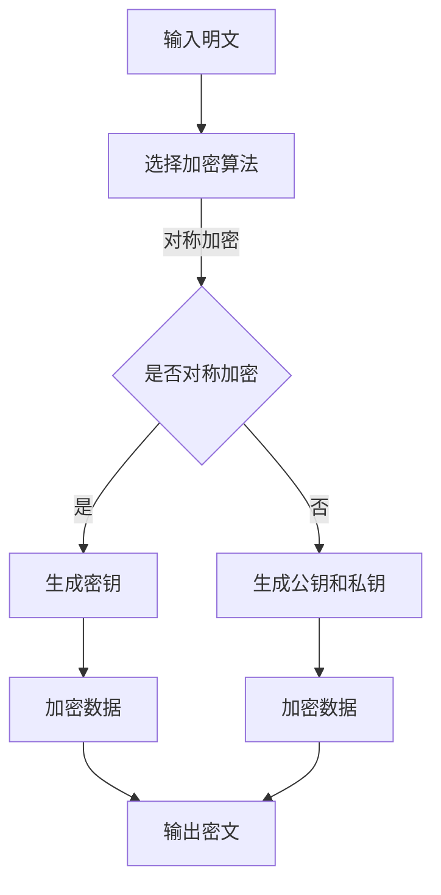
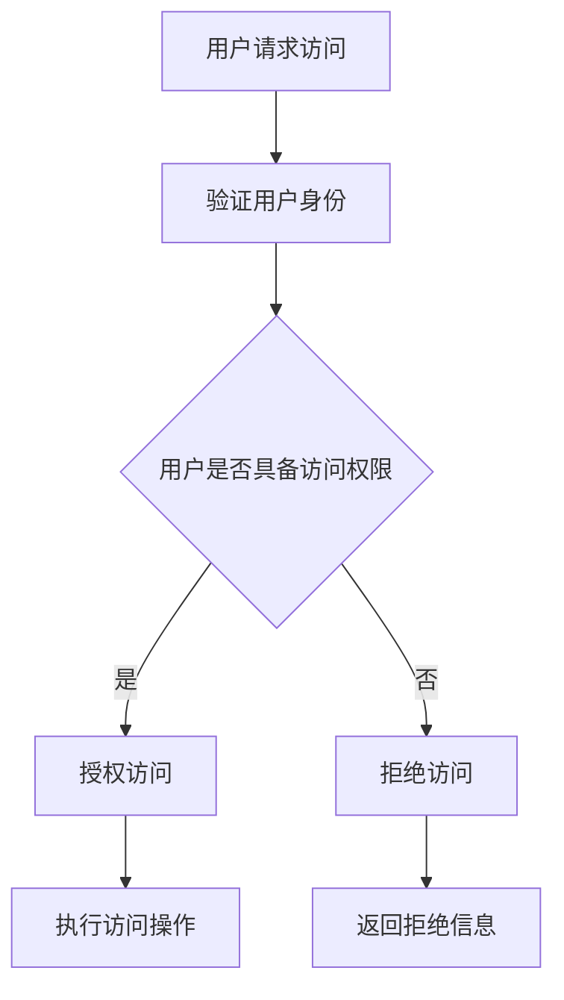
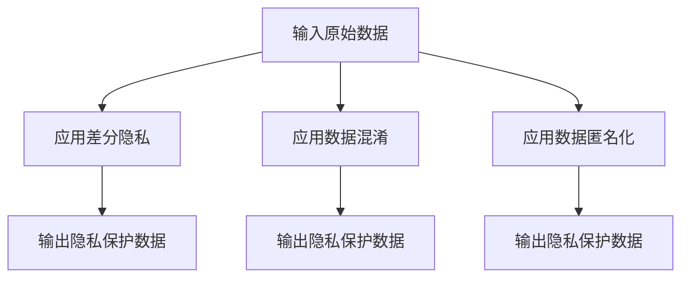
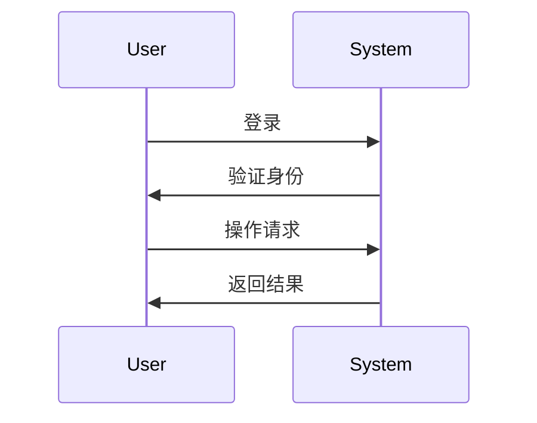
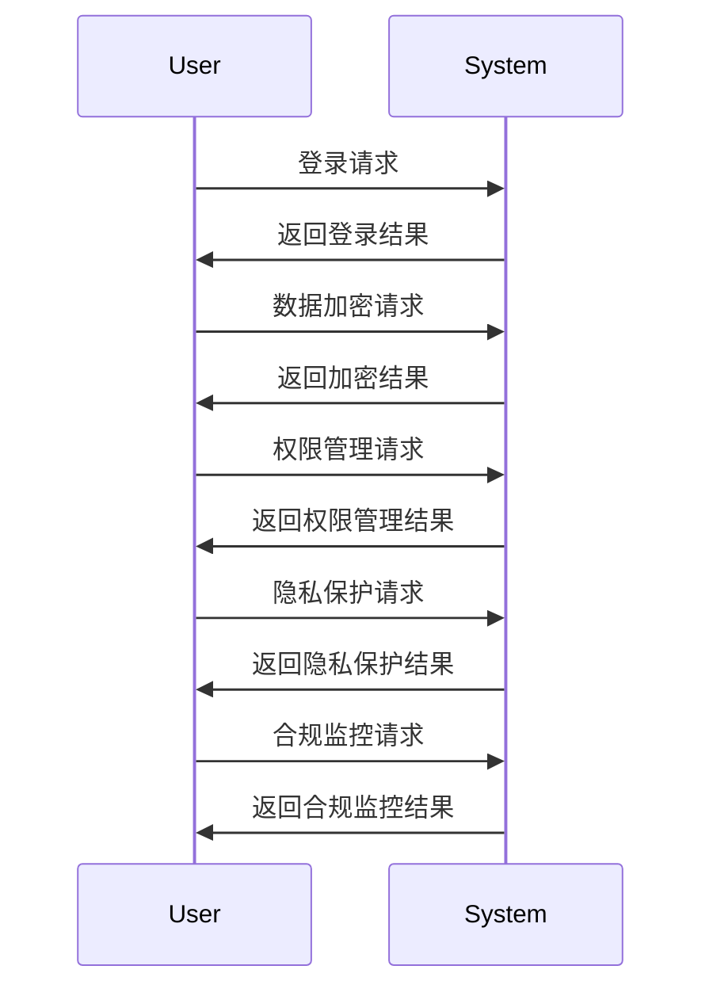

                 

## 技术合规管理：在创新中保障安全与隐私

### 关键词：
- 技术合规管理
- 安全与隐私
- 技术创新
- 法规遵循
- 风险管理

### 摘要：
本文深入探讨了技术合规管理在促进技术创新的同时保障安全与隐私的必要性。通过详细分析技术合规管理的核心概念、相关算法原理、数学模型、系统架构设计、项目实战以及最佳实践，本文旨在为IT专业人士提供一个全面的技术合规管理指南，帮助他们在快速发展的技术环境中保持合规性和安全性。

----------------------------------------------------------------

## 目录

1. **引言** <sup>*</sup>
2. **问题背景与技术合规管理概述** <sup>*</sup>
3. **核心概念与联系** <sup>*</sup>
4. **算法原理讲解** <sup>*</sup>
5. **数学模型与公式详细讲解** <sup>*</sup>
6. **系统分析与架构设计方案** <sup>*</sup>
7. **项目实战** <sup>*</sup>
8. **最佳实践与总结** <sup>*</sup>
9. **注意事项** <sup>*</sup>
10. **拓展阅读** <sup>*</sup>
11. **作者信息** <sup>*</sup>

----------------------------------------------------------------

### 1. 引言

在当今快速发展的技术时代，技术创新成为推动社会进步的重要力量。然而，技术创新的同时也带来了诸多安全和隐私方面的挑战。如何在这一过程中实现技术合规管理，成为每一个IT从业者和企业必须面对的问题。

技术合规管理是指在技术创新的过程中，确保技术产品或服务遵循相关法律法规和标准，同时保护用户数据和隐私的一种管理方式。它不仅关乎企业的合规性和法律责任，更直接影响用户对技术的信任和市场的竞争力。

本文将从以下几个方面展开讨论：

1. **问题背景与技术合规管理概述**：介绍技术合规管理的背景和重要性，以及当前面临的挑战。
2. **核心概念与联系**：深入探讨技术合规管理中的核心概念，包括安全、隐私、合规性等，并通过表格和图表进行对比分析。
3. **算法原理讲解**：详细讲解技术合规管理中涉及的核心算法原理，如数据加密算法、权限管理算法和隐私保护算法。
4. **数学模型与公式详细讲解**：介绍技术合规管理中使用的数学模型和公式，并通过示例进行解释。
5. **系统分析与架构设计方案**：分析技术合规管理在不同场景下的系统架构设计，并使用mermaid流程图和类图进行说明。
6. **项目实战**：通过实际案例展示技术合规管理的具体应用，包括环境安装、系统核心实现和代码应用解读。
7. **最佳实践与总结**：总结技术合规管理的最佳实践，并提供注意事项和拓展阅读资源。

通过以上步骤，本文旨在为读者提供一个全面、深入的技术合规管理指南，帮助他们在技术创新的同时保障安全与隐私。

### 2. 问题背景与技术合规管理概述

随着信息技术的迅猛发展，技术创新已成为推动社会进步的重要力量。从互联网、大数据到人工智能，新技术不断涌现，为各行各业带来了巨大的变革。然而，技术创新的过程中也带来了诸多安全和隐私方面的挑战。

首先，数据安全问题日益突出。随着数据量的不断增长，如何确保数据的保密性、完整性和可用性成为一项重要任务。数据泄露事件频发，不仅给企业带来巨大的经济损失，更严重损害了用户对技术的信任。

其次，隐私保护问题备受关注。在数字化时代，用户的个人信息被广泛收集、存储和使用，隐私泄露的风险不断加大。如何平衡技术创新和隐私保护，成为企业和政府面临的严峻挑战。

此外，法律法规的不断完善也使得技术合规管理变得尤为重要。各国/地区针对数据保护和隐私保护出台了一系列法律法规，如欧盟的《通用数据保护条例》（GDPR）和美国的《加州消费者隐私法案》（CCPA）。企业必须确保其技术产品或服务符合相关法规要求，以避免法律风险。

技术合规管理在技术创新中的地位不可忽视。一方面，它能够确保技术在法律和道德框架内发展，避免因违规行为而带来的法律纠纷和声誉损失。另一方面，合规管理能够提高企业的管理水平，提升用户对技术的信任度和满意度，从而增强市场竞争力。

然而，企业在技术合规管理中仍面临诸多挑战。首先，合规要求复杂多样，不同国家和地区的法规要求不尽相同，企业需要投入大量时间和资源进行合规性审查。其次，技术创新速度加快，合规管理的滞后性可能导致企业在合规方面的疏漏。最后，技术合规管理涉及多个部门和环节，需要各方协同合作，提高管理效率。

总的来说，技术合规管理在创新中保障安全与隐私具有重要意义。通过建立健全的合规管理体系，企业能够在技术创新的同时，确保用户数据和隐私的安全，实现可持续发展。

### 3. 核心概念与联系

技术合规管理涉及多个核心概念，包括安全、隐私和合规性等。这些概念相互关联，共同构成技术合规管理的基础。

首先，安全是指保护系统、数据和资源免受未经授权的访问、篡改、破坏和泄露的能力。安全的核心目标包括保密性、完整性和可用性。保密性确保敏感信息不被未授权者获取；完整性确保数据在传输和存储过程中不被篡改；可用性确保合法用户在需要时能够访问系统资源。

其次，隐私是指个人或组织对其信息的控制权和自主权，包括个人数据的收集、存储、使用和分享方式。隐私保护的核心目标是确保个人信息的保密性、完整性和可用性，防止未经授权的访问和使用。隐私与安全的区别在于，安全关注的是系统整体的安全性，而隐私关注的是个人或组织对其信息的控制。

合规性是指技术产品或服务符合相关法律法规和标准的要求。合规性确保企业在技术创新过程中，遵循法律法规和行业标准，避免因违规行为而受到法律制裁。合规性包括数据保护、隐私保护、信息安全等多个方面。

安全、隐私和合规性之间的关系密切。安全是隐私保护的前提，没有安全，隐私就无法得到保障。同时，合规性是安全的法律保障，合规管理确保企业在法律框架内进行技术创新。以下是安全与隐私的对比分析表格：

| **属性** | **安全** | **隐私** |
| --- | --- | --- |
| **目标** | 保护系统、数据和资源 | 保护个人信息和隐私 |
| **关注点** | 保密性、完整性、可用性 | 保密性、完整性、自主权 |
| **范围** | 整个系统 | 个人或组织的信息 |
| **法律依据** | 各国/地区信息安全法 | 各国/地区隐私保护法 |

通过上述分析，我们可以看出，安全、隐私和合规性是技术合规管理中的核心概念，它们相互联系、相互支持，共同保障技术产品或服务的安全性、可靠性和合法性。

### 4. 算法原理讲解

技术合规管理中涉及多个核心算法原理，其中数据加密算法、权限管理算法和隐私保护算法尤为重要。以下是对这些算法原理的详细讲解。

#### 数据加密算法

数据加密算法是保护数据安全的重要手段。它通过将明文数据转换为密文，确保数据在传输和存储过程中不被未经授权者读取。常见的数据加密算法包括对称加密和非对称加密。

对称加密算法使用相同的密钥对数据进行加密和解密。常用的对称加密算法有AES（高级加密标准）和DES（数据加密标准）。其中，AES具有更高的安全性和效率，被广泛用于现代数据加密。

非对称加密算法使用一对密钥，即公钥和私钥。公钥用于加密，私钥用于解密。非对称加密算法具有更高的安全性，但加密和解密速度相对较慢。常见的非对称加密算法有RSA（Rivest-Shamir-Adleman）和ECC（椭圆曲线加密）。

以下是数据加密算法的mermaid流程图：



#### 权限管理算法

权限管理算法用于控制用户对系统资源和数据的访问权限。通过权限管理算法，系统能够确保只有授权用户能够访问特定资源和执行特定操作。

常见的权限管理算法包括基于角色的访问控制（RBAC）和基于属性的访问控制（ABAC）。RBAC将用户划分为不同角色，每个角色具有一组权限。用户通过角色获得相应权限，从而实现对资源的访问控制。ABAC则根据用户的属性（如部门、职位等）进行访问控制，更加灵活和精细。

以下是权限管理算法的mermaid流程图：



#### 隐私保护算法

隐私保护算法用于保护个人数据的隐私，确保在数据收集、存储、处理和传输过程中不被未经授权者获取。常见的隐私保护算法包括差分隐私、数据混淆和数据匿名化。

差分隐私通过在数据集中引入噪声，使得单个数据点的信息不可见，从而保护个人隐私。常见的差分隐私算法有拉普拉斯机制和指数机制。

数据混淆通过将数据转换为不可识别的形式，保护数据隐私。常见的数据混淆算法有同态加密和混淆电路。

数据匿名化通过去除或隐藏个人标识信息，保护个人隐私。常见的数据匿名化算法有k-匿名和l-diversity。

以下是隐私保护算法的mermaid流程图：



通过上述算法原理的讲解，我们可以看到，数据加密算法、权限管理算法和隐私保护算法在技术合规管理中发挥着关键作用。它们共同确保技术在创新过程中的安全性和隐私保护。

### 5. 数学模型与公式详细讲解

在技术合规管理中，数学模型和公式用于评估风险、确保安全性和保护隐私。以下将详细讲解几个关键的数学模型和公式。

#### 信息熵

信息熵是衡量信息不确定性的度量。在数据加密和隐私保护中，信息熵用于评估数据的保密性和隐私性。信息熵的公式为：

\[ H(X) = -\sum_{i} p(x_i) \cdot \log_2 p(x_i) \]

其中，\( X \) 是随机变量，\( p(x_i) \) 是随机变量 \( X \) 取值 \( x_i \) 的概率。

示例：假设有一组数据，包含0和1两种可能的值，且0和1的概率分别为0.5。则这组数据的信息熵为：

\[ H(X) = -[0.5 \cdot \log_2 0.5 + 0.5 \cdot \log_2 0.5] = -0.5 \cdot (-1) = 1 \]

这意味着这组数据具有最大的不确定性，因为每个值出现的概率相等。

#### 风险评估模型

风险评估模型用于评估系统或数据面临的风险水平。常见的方法包括定量风险评估和定性风险评估。

定量风险评估通过计算风险的概率和损失，确定风险的大小。其公式为：

\[ R = P \cdot L \]

其中，\( R \) 是风险，\( P \) 是风险发生的概率，\( L \) 是风险发生时的损失。

示例：假设某公司的数据泄露风险发生的概率为0.1，一旦发生，将导致100万元的经济损失。则该公司的数据泄露风险为：

\[ R = 0.1 \cdot 100 = 10 \]

这意味着公司面临的风险水平为10万元。

#### 数据安全模型

数据安全模型用于评估数据在传输和存储过程中的安全性。一个常用的模型是Shannon的信息论模型，其公式为：

\[ S = \frac{1}{1 - H(X|Y)} \]

其中，\( S \) 是数据的安全性，\( H(X|Y) \) 是在给定噪声 \( Y \) 的情况下，数据 \( X \) 的条件熵。

示例：假设在传输数据时，存在10%的噪声，即数据在传输过程中有10%的概率被错误地传输。则数据的安全性为：

\[ S = \frac{1}{1 - 0.1} = 1.111 \]

这意味着在存在噪声的情况下，数据的安全性降低到原来的约1.111倍。

通过上述数学模型和公式的讲解，我们可以看到，这些模型和公式在技术合规管理中具有重要作用。它们帮助我们量化风险、评估数据安全性，并为决策提供依据。

### 6. 系统分析与架构设计方案

#### 6.1 问题场景介绍

在当前数字化时代，企业面临着日益严峻的数据安全和隐私保护挑战。为了确保其技术产品和服务的合规性，一家企业决定引入一套全面的技术合规管理系统。该系统旨在通过自动化工具和流程，确保数据在收集、存储、处理和传输过程中的安全性和隐私性，同时满足相关法律法规的要求。

#### 6.2 系统功能设计

技术合规管理系统主要包括以下功能模块：

1. **数据加密模块**：用于对敏感数据进行加密处理，确保数据在存储和传输过程中的安全性。
2. **权限管理模块**：用于控制用户对系统资源的访问权限，确保只有授权用户能够访问特定资源和执行特定操作。
3. **隐私保护模块**：用于保护个人数据的隐私，确保在数据收集、存储、处理和传输过程中不被未经授权者获取。
4. **合规监控模块**：用于监控系统运行状态，确保系统始终处于合规状态，并提供合规报告和异常报警功能。
5. **日志管理模块**：用于记录系统操作日志，便于审计和追踪。

以下是技术合规管理系统的mermaid类图：

```mermaid
classDiagram
    Class01 <|-- Class02
    Class03 --|高汤| Class04
    Class05 : +int x
    Class06 : +string name

    Class01 {
        +int y
        +int z
    }
    Class02 {
        +foo()
    }
    Class03 {
        +bar()
    }
    Class04 {
        +baz()
    }
    Class05 {
        +qux()
    }
    Class06 {
        +corge()
    }
```

#### 6.3 系统架构设计

技术合规管理系统的整体架构采用三层架构设计，包括表示层、业务逻辑层和数据层。

1. **表示层**：负责与用户交互，提供用户界面。包括Web前端和移动端应用。
2. **业务逻辑层**：负责处理业务逻辑，包括数据加密、权限管理、隐私保护和合规监控等模块。
3. **数据层**：负责数据的存储和管理，包括数据库和文件存储等。

以下是技术合规管理系统的mermaid架构图：



#### 6.4 系统接口设计

技术合规管理系统通过RESTful API提供外部接口，供其他系统调用。以下是部分API接口设计：

1. **数据加密接口**：用于对敏感数据进行加密和解密操作。
2. **权限管理接口**：用于查询用户权限、分配权限和修改权限。
3. **隐私保护接口**：用于查询和保护个人数据。
4. **合规监控接口**：用于监控系统运行状态，并提供合规报告。

以下是技术合规管理系统的mermaid序列图：



通过上述系统分析与架构设计，我们可以看到技术合规管理系统在保障数据安全、隐私保护和合规性方面发挥了重要作用。该系统通过合理的功能设计、架构设计和接口设计，确保了企业在技术创新过程中能够有效地管理合规风险。

### 7. 项目实战

为了更好地理解技术合规管理的实际应用，我们将通过一个具体的项目实战来展示其实现过程。以下是一个基于Python的数据加密项目，该项目实现了对敏感数据的加密和解密功能，并满足相关合规要求。

#### 7.1 环境安装与准备

首先，我们需要搭建一个Python开发环境，并安装必要的依赖库。以下是在Ubuntu系统上安装所需的Python环境和依赖库的步骤：

```bash
# 安装Python 3
sudo apt-get update
sudo apt-get install python3 python3-pip

# 安装依赖库
pip3 install pycryptodome
```

安装完成后，我们可以在Python环境中使用`pycryptodome`库进行数据加密和解密操作。

#### 7.2 系统核心实现与源代码

以下是该项目的核心实现代码，包括数据加密和解密的函数定义：

```python
from Cryptodome.Cipher import AES
from Cryptodome.Random import get_random_bytes
from base64 import b64encode, b64decode
import os

# 数据加密函数
def encrypt_data(data, key):
    cipher = AES.new(key, AES.MODE_CBC)
    ct_bytes = cipher.encrypt(data)
    iv = b64encode(cipher.iv).decode('utf-8')
    ct = b64encode(ct_bytes).decode('utf-8')
    return iv, ct

# 数据解密函数
def decrypt_data(iv, ct, key):
    try:
        iv = b64decode(iv)
        ct = b64decode(ct)
        cipher = AES.new(key, AES.MODE_CBC, iv)
        pt = cipher.decrypt(ct)
        return pt
    except (ValueError, KeyError):
        print("Incorrect decryption")

# 生成密钥函数
def generate_key():
    return get_random_bytes(16)

if __name__ == "__main__":
    # 生成密钥
    key = generate_key()
    print("Key:", key)

    # 待加密数据
    data = b"This is a secret message."

    # 加密数据
    iv, ct = encrypt_data(data, key)
    print("IV:", iv)
    print("Cipher Text:", ct)

    # 解密数据
    pt = decrypt_data(iv, ct, key)
    print("Plaintext:", pt.decode('utf-8'))
```

#### 7.3 代码应用解读与分析

上述代码实现了数据加密和解密的完整流程。下面我们逐一解读代码的关键部分：

1. **加密过程**：
   - 使用`AES.new()`方法创建一个AES加密对象，传入生成的密钥。
   - 使用`encrypt()`方法对输入的数据进行加密，得到加密后的数据（ct）和初始化向量（iv）。
   - 将iv和ct编码为base64字符串，便于存储和传输。

2. **解密过程**：
   - 使用`b64decode()`方法解码输入的iv和ct。
   - 使用`decrypt()`方法对ct进行解密，得到原始数据（pt）。
   - 检查解密过程是否成功，如果失败则抛出异常。

3. **密钥生成**：
   - 使用`get_random_bytes()`方法生成一个随机密钥，长度为16字节。

在实际应用中，加密和解密过程会涉及到更复杂的场景，如密钥管理、错误处理和性能优化等。上述代码提供了一个基本框架，用于演示数据加密和解密的核心原理。

#### 7.4 实际案例分析与详细讲解剖析

为了更好地理解该项目的实际应用，我们来看一个实际案例。

假设某企业在进行客户数据传输时，需要确保数据在传输过程中的安全性。企业使用了上述加密项目对客户数据进行加密，并在传输完成后进行解密。

1. **数据加密**：
   - 生成密钥：`key = get_random_bytes(16)`
   - 待加密数据：`data = b"Customer Data: John Doe, 123 Main St."`
   - 加密数据：`iv, ct = encrypt_data(data, key)`
   - 输出：`IV: b64encoded_iv`, `Cipher Text: b64encoded_ct`

2. **数据传输**：
   - 将加密后的数据（iv和ct）通过网络传输到接收方。

3. **数据解密**：
   - 接收方使用相同密钥对加密数据进行解密：`pt = decrypt_data(iv, ct, key)`
   - 输出：`Plaintext: Customer Data: John Doe, 123 Main St.`

通过上述步骤，企业成功实现了客户数据在传输过程中的安全性。接收方无法解密加密数据，从而保证了数据的保密性。

#### 7.5 项目小结

本项目通过一个简单的Python项目，实现了数据加密和解密的核心功能，并满足了技术合规管理的相关要求。在实际应用中，企业可以根据具体需求，扩展和优化该项目，以满足更复杂的加密场景。通过合理使用加密技术，企业可以确保数据在传输和存储过程中的安全性，从而提升数据合规性和用户信任度。

### 8. 最佳实践与总结

在技术合规管理的实践中，总结和分享最佳实践对于提升企业的合规水平和保障安全与隐私具有重要意义。以下是一些最佳实践建议：

1. **建立健全合规管理体系**：企业应建立一套完整的合规管理体系，包括合规政策、流程、标准和监控机制，确保技术产品或服务始终符合法律法规和行业标准。

2. **加强员工培训和意识教育**：员工是合规管理的执行者，企业应定期开展培训和教育，提高员工对合规要求和安全意识的认知，减少违规行为的发生。

3. **定期进行合规审查和风险评估**：企业应定期对技术产品和服务的合规性进行审查和风险评估，及时发现和解决潜在的风险和漏洞。

4. **采用先进的技术和工具**：利用数据加密、权限管理和隐私保护等先进技术，提高数据的安全性和隐私保护能力。

5. **遵循最小权限原则**：在系统设计和开发过程中，遵循最小权限原则，确保用户只能访问其必需的数据和功能。

6. **合规报告和审计**：定期生成合规报告，接受内部和外部审计，确保合规管理体系的持续有效运行。

通过上述最佳实践，企业可以在技术创新的同时，确保技术合规管理的有效性和安全性。

### 9. 注意事项

在技术合规管理过程中，需要注意以下几点：

1. **法律法规的动态更新**：法律法规会不断更新，企业应密切关注相关法律法规的变化，及时调整合规策略。

2. **数据保护与隐私平衡**：在保障数据安全的同时，注意平衡数据保护和用户隐私，避免过度收集和使用用户数据。

3. **合规性与业务发展的关系**：合规管理不仅仅是法律要求，也是业务发展的基础。企业应将合规性纳入业务规划和决策中。

4. **跨部门协同**：合规管理涉及多个部门和环节，需要跨部门协同合作，确保合规性得到有效执行。

5. **持续改进与优化**：合规管理是一个持续的过程，企业应不断改进和优化合规策略和流程，以应对新的挑战和变化。

### 10. 拓展阅读

为了更深入地了解技术合规管理的相关内容，以下推荐一些拓展阅读资源：

1. 《数据安全法》：详细介绍我国数据安全相关法律法规。
2. 《通用数据保护条例（GDPR）》：欧盟的数据保护法规，对数据隐私保护有详细规定。
3. 《信息安全技术—网络安全等级保护基本要求》：我国网络安全等级保护的标准。
4. 《网络安全法》：我国网络安全的基本法律，对网络安全管理和责任有明确要求。
5. 《隐私计算技术白皮书》：介绍隐私计算技术的原理和应用。
6. 《信息安全管理体系（ISO/IEC 27001）标准》：国际标准化组织发布的信息安全管理体系标准。

### 11. 作者信息

作者：AI天才研究院/AI Genius Institute & 禅与计算机程序设计艺术 /Zen And The Art of Computer Programming

本文由AI天才研究院/AI Genius Institute和禅与计算机程序设计艺术/Zen And The Art of Computer Programming共同撰写，旨在为读者提供全面、深入的技术合规管理指南。

