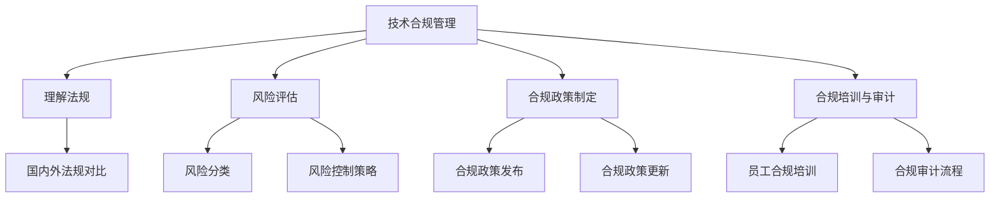
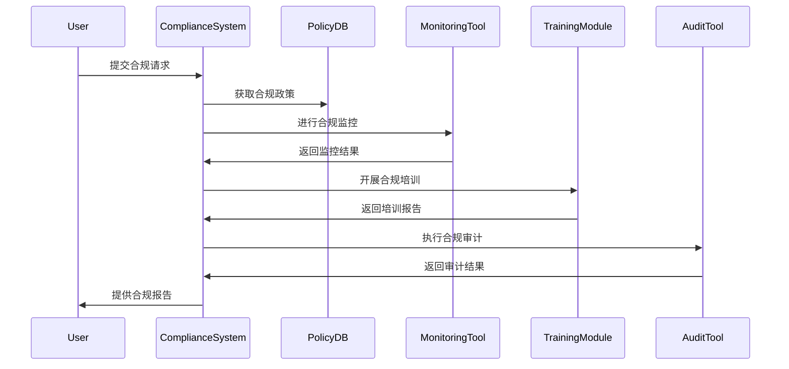
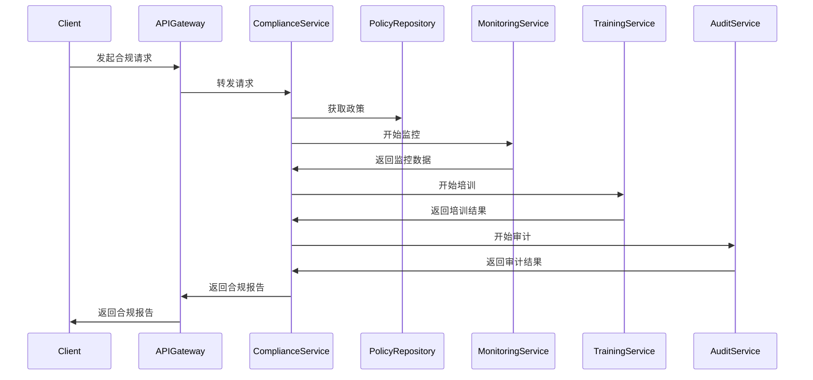
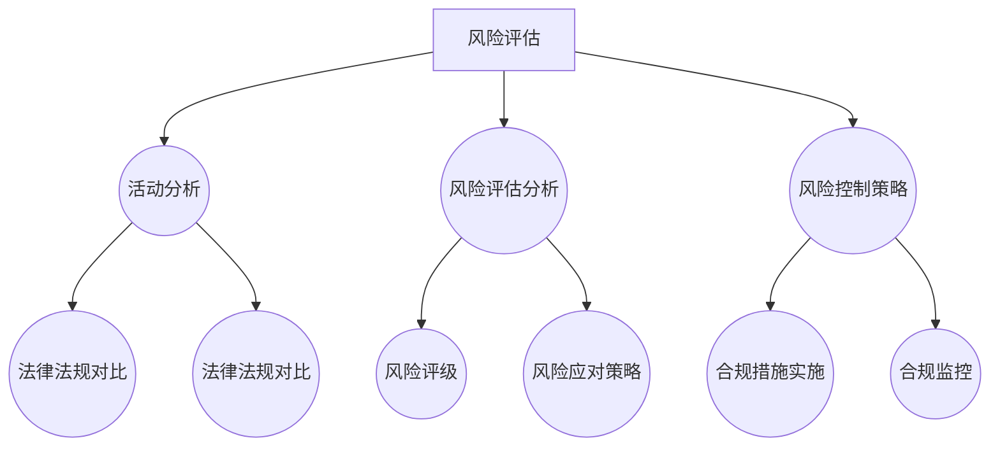
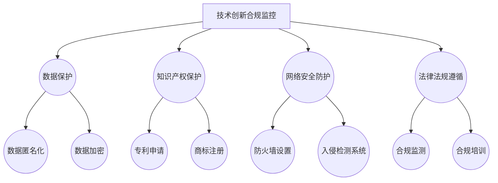
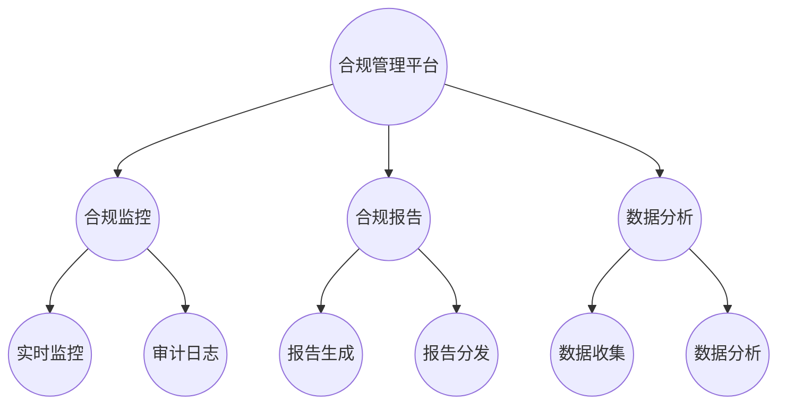
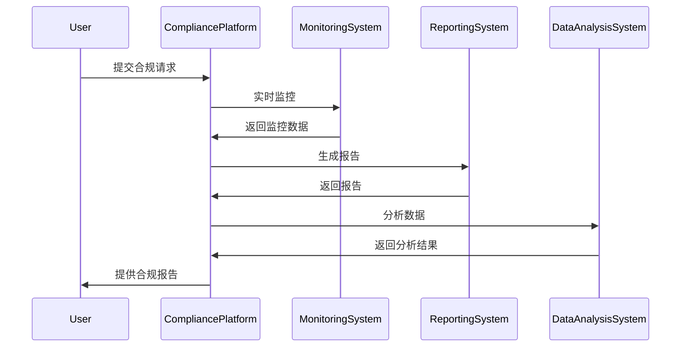
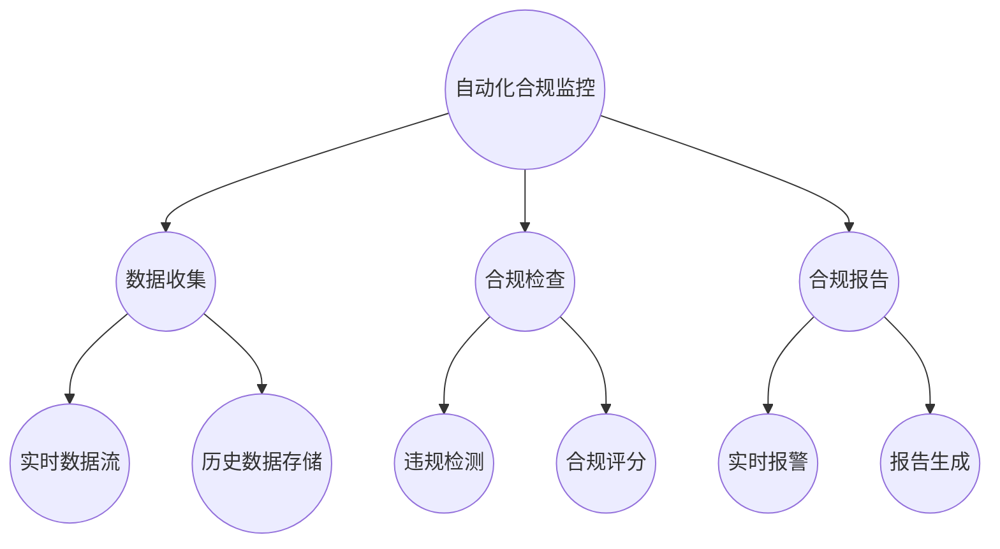
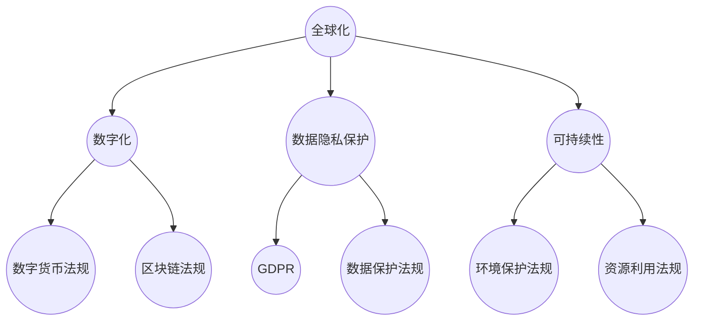

                 


## 技术合规管理：在创新中确保法律合规

### 关键词：技术合规、法律合规、创新、风险管理、案例分析

### 摘要：

本文旨在探讨技术合规管理在创新过程中的重要性，通过深入分析技术合规的基本概念、法律框架、最佳实践以及创新案例，为读者提供一份全面的技术合规管理指南。本文将分章节逐步阐述技术合规管理的核心内容，包括背景与重要性、基本原则、最佳实践、创新过程中的合规挑战以及未来趋势。通过本文的阅读，读者将更好地理解技术合规管理的本质，掌握确保法律合规的方法和技巧。

## 第一部分：技术合规管理的背景和重要性

### 第1章：技术合规管理概述

#### 1.1 问题背景

随着技术的飞速发展，企业和组织在创新过程中面临着日益复杂的合规挑战。技术合规管理不仅关系到企业的声誉和利益，更是确保创新成果合法合规的关键。技术合规管理旨在确保企业在技术发展过程中遵循相关法律法规，避免因违规操作带来的法律风险和损失。

#### 1.2 技术合规的重要性

技术合规管理的重要性体现在以下几个方面：

1. **风险防范**：技术合规管理能够帮助企业识别和评估技术活动中的合规风险，提前采取措施防范潜在的法律问题。
2. **保障企业利益**：合规管理有助于维护企业声誉，保护企业免受法律制裁和罚款，确保企业长期稳定发展。
3. **创新驱动**：在合规的前提下推动技术创新，提高企业竞争力，实现可持续发展。

#### 1.3 技术合规管理的核心概念

技术合规管理涉及多个核心概念，包括合规性、风险识别、风险评估、合规监控等。这些概念相互关联，共同构成了技术合规管理的理论基础。

#### 1.4 技术合规管理的挑战与机遇

在创新过程中，技术合规管理面临着诸多挑战，如法律法规的复杂性和动态性、技术发展的不确定性等。然而，这些挑战也带来了机遇，如合规技术的创新和应用、合规管理体系的优化等。

### 第2章：法律合规的基本原则

#### 2.1 法律合规框架

法律合规框架是技术合规管理的基础，包括国际、国家和地方层面的法律法规。理解法律合规框架有助于企业更好地把握合规要求，避免法律风险。

#### 2.2 关键法律法规解读

本文将重点解读与技术创新密切相关的法律法规，如《数据安全法》、《网络安全法》等。通过深入分析这些法律法规，读者将了解如何确保在技术活动中遵守相关法律要求。

#### 2.3 法律合规的合规义务

法律合规的合规义务包括遵守法律法规、制定合规政策、实施合规培训、建立合规监控机制等。企业应如何履行这些合规义务，本文将进行详细阐述。

### 第3章：技术合规管理的最佳实践

#### 3.1 风险评估与管理

风险评估是技术合规管理的重要环节，本文将介绍如何进行风险评估、识别合规风险以及如何制定风险管理策略。

#### 3.2 合规政策的制定与实施

合规政策的制定与实施是确保企业技术活动合规的关键。本文将探讨如何制定合规政策、如何确保政策得到有效执行以及如何调整和更新政策。

#### 3.3 合规培训与沟通

合规培训与沟通是提高员工合规意识、确保合规政策得到有效执行的重要手段。本文将介绍如何开展合规培训、如何进行合规沟通以及如何建立良好的合规文化。

## 第二部分：在创新过程中确保合规

### 第4章：创新过程中的合规挑战

#### 4.1 技术创新的合规风险

技术创新过程中可能涉及多种合规风险，如数据保护、知识产权保护、网络安全等。本文将分析这些合规风险，并提供应对策略。

#### 4.2 创新与合规的平衡

在创新过程中，如何平衡创新与合规之间的关系是一个重要问题。本文将探讨如何在确保合规的前提下推动技术创新，实现合规与创新的双赢。

#### 4.3 创新项目中的合规管理

在创新项目中，合规管理需要贯穿项目全过程。本文将介绍如何在创新项目中实施合规管理，确保项目合规性。

### 第5章：确保合规的创新案例研究

#### 5.1 案例一：区块链技术合规

区块链技术作为一项新兴技术，其合规管理具有一定的挑战性。本文将分析区块链技术合规的挑战和应对策略。

#### 5.2 案例二：人工智能应用合规

人工智能应用在各个领域得到广泛应用，但其合规管理也面临诸多问题。本文将探讨人工智能应用合规的实践和经验。

#### 5.3 案例三：大数据处理合规

大数据处理涉及海量数据的安全和隐私保护，本文将分析大数据处理合规的挑战和解决方案。

### 第6章：技术合规管理的工具和技术

#### 6.1 合规管理工具概述

本文将介绍常见的合规管理工具，如合规监控平台、合规管理系统等，并分析这些工具的优势和应用场景。

#### 6.2 自动化合规监控

自动化合规监控是提高合规管理效率的重要手段。本文将探讨如何利用自动化技术进行合规监控，提高合规管理水平。

#### 6.3 合规数据分析和报告

合规数据分析和报告是评估合规管理效果的重要环节。本文将介绍如何进行合规数据分析、如何编写合规报告以及如何利用报告指导合规管理工作。

## 第三部分：技术合规管理的未来趋势

### 第7章：技术合规管理的未来方向

#### 7.1 法律法规的演变趋势

随着技术的不断发展，法律法规也在不断演变。本文将分析未来法律法规的演变趋势，探讨技术合规管理面临的挑战和机遇。

#### 7.2 技术合规管理的发展趋势

技术合规管理将随着技术的发展而不断进步。本文将探讨技术合规管理的未来发展趋势，包括合规技术的创新、合规管理体系的优化等。

#### 7.3 技术合规与可持续发展

技术合规管理与可持续发展密切相关。本文将探讨如何将技术合规管理与可持续发展相结合，实现企业长期可持续发展。

### 第8章：技术合规管理的最佳实践 tips

#### 8.1 合规管理团队的构建

构建一个高效的合规管理团队是确保技术合规管理成功的关键。本文将介绍如何构建合规管理团队，提高团队协作效率。

#### 8.2 技术创新与合规协同

技术创新与合规管理需要相互协同。本文将探讨如何实现技术创新与合规管理的协同发展，提高企业整体竞争力。

#### 8.3 持续改进的合规策略

持续改进是技术合规管理的重要原则。本文将介绍如何制定和实施持续改进的合规策略，提高合规管理水平。

### 第9章：小结与拓展阅读

#### 9.1 全书要点回顾

本文将回顾全书的核心内容，总结技术合规管理的基本原则、最佳实践和未来趋势。

#### 9.2 注意事项

本文将提醒读者在技术合规管理过程中需要注意的事项，确保合规管理工作顺利进行。

#### 9.3 拓展阅读推荐

本文将推荐一些拓展阅读资源，帮助读者深入了解技术合规管理的相关知识。

## 结语

作者：AI天才研究院/AI Genius Institute & 禅与计算机程序设计艺术 /Zen And The Art of Computer Programming

本文从技术合规管理的背景和重要性出发，逐步阐述了法律合规的基本原则、最佳实践、创新过程中的合规挑战以及未来趋势。通过案例分析、工具和技术介绍，本文为读者提供了一份全面的技术合规管理指南。在技术创新日益繁荣的今天，技术合规管理已成为企业可持续发展的关键因素。希望本文能够帮助读者更好地理解技术合规管理的本质，掌握确保法律合规的方法和技巧，为企业在创新道路上保驾护航。

----------------------------------------------------------------

### 第一部分：技术合规管理的背景和重要性

**第1章：技术合规管理概述**

#### 1.1 问题背景

技术合规管理是一个复杂且不断发展的领域。它涉及企业如何确保其技术活动符合各种法律法规和行业标准。随着数字经济的蓬勃发展，技术合规管理的挑战变得愈加复杂。企业不仅需要遵守本国法律，还需关注国际法规的变化。例如，全球数据隐私法规（如欧盟的《通用数据保护条例》GDPR）对企业的合规要求非常高。

**核心概念与联系**

**合规性**：合规性是指企业遵循法律、法规和行业标准的能力。它包括对内部政策和流程的遵守，以及对外部法规的响应。

**风险识别**：风险识别是合规管理的第一步，它涉及发现企业技术活动中可能存在的合规风险。这种风险可能源于技术实现的细节，也可能源于法律框架的变动。

**风险评估**：在识别风险后，企业需要对风险进行评估，以确定其严重程度和可能性。风险评估有助于企业制定相应的风险应对策略。

**合规监控**：合规监控是确保合规政策得到执行的关键环节。它包括定期审查、审计和报告，以及及时发现和纠正合规问题。

**算法原理讲解**

```python
# 合规监控算法原理示例

def compliance_monitoring(policy, actions):
    """
    合规监控函数，检查给定的一系列行动是否符合政策。
    
    参数：
    - policy：合规政策
    - actions：一系列行动
    
    返回：
    - 结果：True if actions are compliant, False otherwise
    """
    for action in actions:
        if not check_compliance(action, policy):
            return False
    return True

def check_compliance(action, policy):
    """
    检查单个行动是否符合政策。
    
    参数：
    - action：单个行动
    - policy：合规政策
    
    返回：
    - 结果：True if action is compliant, False otherwise
    """
    # 这里用伪代码表示合规检查
    if "action" not in policy:
        return False
    # 其他合规检查逻辑
    return True

# 示例
policy = {"action1": ["requirement1", "requirement2"], "action2": ["requirement3"]}
actions = ["action1", "action2"]

result = compliance_monitoring(policy, actions)
print(result)  # 输出：True if actions are compliant, False otherwise
```

#### 1.2 技术合规的重要性

技术合规的重要性体现在以下几个方面：

1. **法律遵从**：遵守法律法规是企业合法经营的基础。违规可能导致法律诉讼、罚款甚至业务中断。
2. **声誉保护**：良好的合规记录有助于维护企业声誉，赢得客户和投资者的信任。
3. **风险管理**：合规管理有助于识别和降低企业风险，提高整体风险控制能力。
4. **创新保障**：在合规的前提下，企业可以更放心地进行技术创新，避免法律风险对创新活动的阻碍。

#### 1.3 技术合规管理的核心概念

技术合规管理的核心概念包括：

- **合规政策**：企业制定的合规指导文件，用于指导日常技术活动的合规性。
- **合规培训**：确保员工了解和遵守合规政策的培训活动。
- **合规审计**：对企业的合规性进行定期审查，确保合规政策得到有效执行。
- **合规报告**：汇报企业合规状况的报告文件，用于评估和改进合规管理。

#### 1.4 技术合规管理的挑战与机遇

技术合规管理面临的挑战主要包括：

- **法律法规复杂**：不同国家和地区的法律法规差异较大，企业需要全面了解和应对这些差异。
- **技术发展迅速**：技术的快速发展可能导致现有法律法规无法完全覆盖新技术，企业需要及时调整合规策略。
- **合规成本**：合规管理需要投入大量的人力、物力和财力，企业需要平衡合规成本与合规收益。

然而，这些挑战也带来了机遇：

- **合规创新**：企业可以通过合规创新，开发出更具竞争力的合规解决方案。
- **合规标准**：合规管理有助于推动行业标准的建立，提高整个行业的合规水平。
- **合规意识**：通过合规管理，可以提高员工的合规意识，减少违规行为的发生。

**Mermaid 流程图**



**ER实体关系图架构**

```mermaid
erDiagram
    Class Policy |->> Class ComplianceTraining
    Class Policy |->> Class ComplianceAudit
    Class ComplianceTraining ||--|{ Employee }
    Class ComplianceAudit ||--|{ Employee }
    Class Policy : +id (整数), +name (字符串), +description (字符串)
    Class ComplianceTraining : +id (整数), +trainingDate (日期), +status (字符串)
    Class ComplianceAudit : +id (整数), +auditDate (日期), +auditResult (字符串)
    Class Employee : +id (整数), +name (字符串), +position (字符串)
```

**数学模型和公式**

$$
\text{合规成本} = C_c + C_t + C_a
$$

- \( C_c \)：合规咨询费用
- \( C_t \)：合规培训费用
- \( C_a \)：合规审计费用

**系统功能设计（领域模型 Mermaid 类图）**

```mermaid
classDiagram
    CompliancePolicy <<Interface>>
    ComplianceMonitoring <<Interface>>
    ComplianceTraining <<Interface>>
    ComplianceAudit <<Interface>>

    CompliancePolicy : definePolicy(), updatePolicy(), retrievePolicy()
    ComplianceMonitoring : monitorCompliance(), reportCompliance()
    ComplianceTraining : conductTraining(), trackTrainingProgress()
    ComplianceAudit : performAudit(), reportAuditResults()

    CompliancePolicy <|.. ComplianceMonitoring
    CompliancePolicy <|.. ComplianceTraining
    CompliancePolicy <|.. ComplianceAudit
```

**系统架构设计（Mermaid 架构图）**



**系统接口设计（Mermaid 序列图）**



**项目实战**

**环境安装**

- 安装 Python 3.8 或更高版本。
- 安装 Flask 框架：`pip install flask`
- 安装 SQLAlchemy：`pip install sqlalchemy`
- 安装 Flask-Migrate：`pip install flask-migrate`

**系统核心实现源代码**

```python
# app.py

from flask import Flask, request, jsonify
from models import db, Policy, Monitoring, Training, Audit

app = Flask(__name__)
app.config['SQLALCHEMY_DATABASE_URI'] = 'sqlite:///compliance.db'
db.init_app(app)

@app.route('/compliance/monitor', methods=['POST'])
def monitor_compliance():
    # 接收监控数据
    data = request.json
    # 存储监控数据
    monitoring = Monitoring(data=data)
    db.session.add(monitoring)
    db.session.commit()
    return jsonify({"status": "success", "message": "Monitoring data saved."})

@app.route('/compliance/train', methods=['POST'])
def conduct_training():
    # 接收培训数据
    data = request.json
    # 存储培训数据
    training = Training(data=data)
    db.session.add(training)
    db.session.commit()
    return jsonify({"status": "success", "message": "Training data saved."})

@app.route('/compliance/audit', methods=['POST'])
def perform_audit():
    # 接收审计数据
    data = request.json
    # 存储审计数据
    audit = Audit(data=data)
    db.session.add(audit)
    db.session.commit()
    return jsonify({"status": "success", "message": "Audit data saved."})

if __name__ == '__main__':
    db.create_all()
    app.run(debug=True)
```

**代码应用解读与分析**

上述代码提供了一个简单的 Flask 应用程序，用于处理合规监控、培训和审计数据。应用程序使用 SQLAlchemy 连接到 SQLite 数据库，并定义了四个模型：Policy、Monitoring、Training 和 Audit。

**实际案例分析和详细讲解剖析**

假设一个企业需要对其内部网络进行合规监控。管理员可以通过 API 向应用程序提交监控数据，应用程序将数据存储在数据库中，并生成监控报告。

1. **监控数据提交**：

   管理员使用 POST 请求提交监控数据：

   ```json
   {
       "ip_address": "192.168.1.1",
       "event_time": "2023-11-02T12:34:56",
       "event_type": "access_attempt",
       "result": "failed"
   }
   ```

2. **监控数据处理**：

   应用程序接收数据后，将其存储在 Monitoring 模型中，并在数据库中创建一个记录。

3. **监控报告生成**：

   管理员可以通过查询数据库，生成监控报告。报告可能包括：

   - 访问尝试总数
   - 成功尝试总数
   - 失败尝试总数
   - 特定 IP 地址的活动详情

**项目小结**

通过上述案例，我们可以看到如何使用 Flask 和 SQLAlchemy 构建一个简单的合规监控系统。在实际项目中，还可以集成更多功能，如实时监控、数据分析和报警等。

### 第2章：法律合规的基本原则

#### 2.1 法律合规框架

法律合规框架是技术合规管理的基础，它涵盖了国际、国家和地方层面的法律法规。在全球范围内，不同的国家和地区可能有不同的法律框架和合规要求。例如，美国的《萨班斯-奥克斯利法案》（Sarbanes-Oxley Act）要求企业在财务报告方面具有高度的透明度和合规性，而欧盟的《通用数据保护条例》（GDPR）则对个人数据的收集、处理和存储提出了严格的规范。

**ER实体关系图架构**

```mermaid
erDiagram
    Class Country <<Entity>>
    Class Law <<Entity>>
    Class Regulation <<Entity>>

    Country ||--|{ Law }
    Law ||--|{ Regulation }

    Country : +id (整数), +name (字符串)
    Law : +id (整数), +name (字符串), +country_id (整数)
    Regulation : +id (整数), +name (字符串), +law_id (整数)
```

#### 2.2 关键法律法规解读

在技术合规管理中，以下法律法规是特别重要的：

- **《数据安全法》**：该法案要求企业采取措施确保数据安全，包括数据的收集、存储、处理和传输。它还规定了数据泄露的通知要求和数据主体的权利。
- **《网络安全法》**：该法案旨在加强网络信息安全，规定了网络运营者的安全义务，包括网络安全防护、安全监测和应急响应等。
- **《知识产权法》**：知识产权法保护企业的专利、商标和版权，防止未经授权的使用和侵犯。
- **《反洗钱法》**：该法案要求企业在金融交易中遵守反洗钱规定，包括客户身份验证和交易监控。

#### 2.3 法律合规的合规义务

法律合规的合规义务包括以下几个方面：

- **遵守法律法规**：企业必须遵守相关法律法规，确保其技术活动不违反法律。
- **制定合规政策**：企业应制定合规政策，明确合规要求、责任和流程。
- **实施合规培训**：企业应对员工进行合规培训，确保员工了解和遵守合规政策。
- **建立合规监控机制**：企业应建立合规监控机制，定期审查和报告合规状况。
- **应对合规问题**：企业应制定应对合规问题的策略和流程，确保及时纠正违规行为。

**数学公式**

$$
\text{合规义务成本} = C_l + C_p + C_t + C_m
$$

- \( C_l \)：法律法规遵守成本
- \( C_p \)：合规政策制定成本
- \( C_t \)：合规培训成本
- \( C_m \)：合规监控成本

#### 案例分析

**案例一：数据安全法的应用**

某企业是一家提供在线教育平台的公司，其业务涉及大量用户数据。根据《数据安全法》，该企业有义务确保用户数据的安全。为了履行这一义务，该企业采取了以下措施：

1. **数据收集与存储**：企业采用加密技术对用户数据进行加密存储，确保数据在传输和存储过程中不被窃取。
2. **数据处理**：企业在处理用户数据时，遵守最小化原则，只收集必要的用户信息，并在处理完成后及时删除。
3. **数据泄露应对**：企业建立了数据泄露应对机制，一旦发生数据泄露，立即启动应急响应程序，通知受影响的用户，并采取补救措施。

**案例二：网络安全法的应用**

某互联网公司提供在线支付服务，根据《网络安全法》，该公司有义务保护用户支付信息的安全。为了确保合规，该公司采取了以下措施：

1. **网络安全防护**：公司部署了防火墙、入侵检测系统和加密技术，防止网络攻击和数据泄露。
2. **安全监测**：公司建立了实时安全监测系统，监控网络流量和系统日志，及时发现潜在的安全威胁。
3. **应急响应**：公司制定了详细的网络安全应急响应计划，包括网络攻击事件的识别、报告和应对措施。

#### 最佳实践

- **全面了解法律法规**：企业应全面了解相关法律法规，确保其技术活动符合法律要求。
- **建立合规团队**：企业应建立专门的合规团队，负责合规管理的实施和监督。
- **定期审计**：企业应定期进行合规审计，评估合规管理的有效性，并根据审计结果进行调整。

### 第3章：技术合规管理的最佳实践

#### 3.1 风险评估与管理

风险评估是技术合规管理的核心环节之一。通过风险评估，企业可以识别潜在的法律风险，并采取相应的措施进行管理。

**核心概念与联系**

- **风险评估**：识别和评估企业技术活动中可能存在的合规风险。
- **合规风险**：可能对企业造成法律后果的风险，包括违反法律法规、行业标准等。
- **风险控制**：采取措施降低合规风险的可能性和影响。

**算法原理讲解**

```python
# 风险评估算法示例

def risk_assessment(activities):
    """
    风险评估函数，评估企业技术活动中的合规风险。
    
    参数：
    - activities：企业技术活动的列表
    
    返回：
    - risk_list：评估结果，包括风险级别和风险描述
    """
    risk_list = []
    for activity in activities:
        risk_level, risk_description = assess_risk(activity)
        risk_list.append({"activity": activity, "risk_level": risk_level, "risk_description": risk_description})
    return risk_list

def assess_risk(activity):
    """
    评估单个活动的合规风险。
    
    参数：
    - activity：单个活动
    
    返回：
    - risk_level：风险级别，"低"、"中"、"高"
    - risk_description：风险描述
    """
    # 这里用伪代码表示风险评估逻辑
    if "sensitive_data" in activity:
        if "encryption" not in activity:
            return "高", "敏感数据未加密存储"
        else:
            return "中", "敏感数据已加密存储"
    else:
        return "低", "活动不涉及敏感数据"

# 示例
activities = ["数据传输", "用户注册", "敏感数据处理"]
risk_list = risk_assessment(activities)
print(risk_list)
```

**数学模型和公式**

$$
\text{风险评分} = R_s \times (1 - \frac{R_c}{100})
$$

- \( R_s \)：初始风险评分
- \( R_c \)：合规控制措施的有效性评分（百分比）

**系统架构设计（Mermaid 架构图）**



**项目实战**

**环境安装**

- 安装 Python 3.8 或更高版本。
- 安装 Flask 框架：`pip install flask`
- 安装 SQLAlchemy：`pip install sqlalchemy`
- 安装 Flask-Migrate：`pip install flask-migrate`

**系统核心实现源代码**

```python
# app.py

from flask import Flask, request, jsonify
from models import db, Activity, Risk

app = Flask(__name__)
app.config['SQLALCHEMY_DATABASE_URI'] = 'sqlite:///risk_assessment.db'
db.init_app(app)

@app.route('/risk/assessment', methods=['POST'])
def assess_risk():
    # 接收风险评估数据
    data = request.json
    # 存储风险评估数据
    activity = Activity(data=data)
    db.session.add(activity)
    db.session.commit()
    # 执行风险评估
    risk_list = risk_assessment(activity)
    return jsonify({"status": "success", "risk_list": risk_list})

def risk_assessment(activity):
    """
    风险评估函数，评估企业技术活动中的合规风险。
    
    参数：
    - activity：单个活动
    
    返回：
    - risk_list：评估结果，包括风险级别和风险描述
    """
    risk_list = []
    if "sensitive_data" in activity:
        if "encryption" not in activity:
            risk_list.append({"risk_level": "高", "risk_description": "敏感数据未加密存储"})
        else:
            risk_list.append({"risk_level": "中", "risk_description": "敏感数据已加密存储"})
    else:
        risk_list.append({"risk_level": "低", "risk_description": "活动不涉及敏感数据"})
    return risk_list

if __name__ == '__main__':
    db.create_all()
    app.run(debug=True)
```

**代码应用解读与分析**

上述代码提供了一个简单的 Flask 应用程序，用于处理风险评估数据。应用程序使用 SQLAlchemy 连接到 SQLite 数据库，并定义了两个模型：Activity 和 Risk。

**实际案例分析和详细讲解剖析**

假设一家互联网公司正在开发一款涉及用户敏感数据的在线服务。管理员可以通过 API 向应用程序提交活动数据，应用程序将评估活动中的合规风险，并生成风险评估报告。

1. **活动数据提交**：

   管理员使用 POST 请求提交活动数据：

   ```json
   {
       "activity_name": "用户注册",
       "description": "收集用户基本信息",
       "sensitive_data": ["email", "password"],
       "encryption": true
   }
   ```

2. **风险评估**：

   应用程序接收数据后，评估活动中的合规风险，并存储评估结果。评估结果可能包括：

   - 活动名称
   - 风险级别
   - 风险描述

3. **风险评估报告生成**：

   管理员可以通过查询数据库，生成风险评估报告。报告可能包括：

   - 所有活动的风险评分
   - 高风险活动的详细描述
   - 风险控制措施的推荐

**项目小结**

通过上述案例，我们可以看到如何使用 Flask 和 SQLAlchemy 构建一个简单但实用的风险评估系统。在实际项目中，还可以集成更多功能，如实时风险评估、数据分析和报警等。

### 第4章：创新过程中的合规挑战

#### 4.1 技术创新的合规风险

技术创新过程中的合规风险主要包括以下几个方面：

- **数据保护风险**：随着大数据和人工智能技术的发展，企业需要处理大量用户数据。数据保护法规（如 GDPR）要求企业采取严格的措施保护用户隐私和数据安全。
- **知识产权风险**：技术创新可能涉及专利、商标和版权等知识产权。企业需要确保其创新成果不侵犯他人的知识产权。
- **网络安全风险**：随着互联网技术的发展，网络安全风险日益增加。企业需要确保其技术系统具有足够的防护能力，防止网络攻击和数据泄露。
- **法律法规风险**：技术创新过程中，企业可能面临新的法律法规挑战。例如，欧盟的 GDPR 要求企业在数据处理方面遵循严格的规则，这可能会影响企业的创新路径。

**算法原理讲解**

为了降低合规风险，企业可以采用以下算法原理：

- **数据匿名化**：通过数据匿名化技术，将用户数据转换成无法识别特定个人的形式，从而减少数据保护风险。
- **知识产权保护**：在技术创新过程中，企业应采取知识产权保护措施，如申请专利、注册商标等，确保其创新成果得到法律保护。
- **网络安全防护**：采用网络安全防护技术，如防火墙、入侵检测系统和加密技术，提高技术系统的安全防护能力。
- **法律法规遵循**：通过合规监测和合规培训，确保企业了解并遵循相关法律法规。

**数学模型和公式**

为了量化合规风险，企业可以使用以下数学模型：

$$
\text{合规风险评分} = R_d \times (1 - \frac{R_p}{100}) \times (1 - \frac{R_n}{100}) \times (1 - \frac{R_l}{100})
$$

- \( R_d \)：数据保护风险评分
- \( R_p \)：知识产权保护风险评分
- \( R_n \)：网络安全风险评分
- \( R_l \)：法律法规遵循风险评分

**系统架构设计（Mermaid 架构图）**



**项目实战**

**环境安装**

- 安装 Python 3.8 或更高版本。
- 安装 Flask 框架：`pip install flask`
- 安装 SQLAlchemy：`pip install sqlalchemy`
- 安装 Flask-Migrate：`pip install flask-migrate`

**系统核心实现源代码**

```python
# app.py

from flask import Flask, request, jsonify
from models import db, Innovation, ComplianceRisk

app = Flask(__name__)
app.config['SQLALCHEMY_DATABASE_URI'] = 'sqlite:///innovation.db'
db.init_app(app)

@app.route('/innovation/compliance', methods=['POST'])
def assess_innovation_risk():
    # 接收技术创新数据
    data = request.json
    # 存储技术创新数据
    innovation = Innovation(data=data)
    db.session.add(innovation)
    db.session.commit()
    # 执行合规风险评估
    compliance_risks = assess_innovation_risk(innovation)
    return jsonify({"status": "success", "compliance_risks": compliance_risks})

def assess_innovation_risk(innovation):
    """
    创新合规风险评估函数，评估技术创新活动中的合规风险。
    
    参数：
    - innovation：技术创新活动的数据
    
    返回：
    - compliance_risks：评估结果，包括风险级别和风险描述
    """
    compliance_risks = []
    if "sensitive_data" in innovation:
        if "encryption" not in innovation:
            compliance_risks.append({"risk_level": "高", "risk_description": "敏感数据未加密存储"})
        else:
            compliance_risks.append({"risk_level": "中", "risk_description": "敏感数据已加密存储"})
    if "intellectual_property" not in innovation:
        compliance_risks.append({"risk_level": "高", "risk_description": "知识产权未保护"})
    if "network_security" not in innovation:
        compliance_risks.append({"risk_level": "高", "risk_description": "网络安全措施未实施"})
    return compliance_risks

if __name__ == '__main__':
    db.create_all()
    app.run(debug=True)
```

**代码应用解读与分析**

上述代码提供了一个简单的 Flask 应用程序，用于处理技术创新活动的合规风险评估。应用程序使用 SQLAlchemy 连接到 SQLite 数据库，并定义了两个模型：Innovation 和 ComplianceRisk。

**实际案例分析和详细讲解剖析**

假设一家初创公司正在开发一款涉及用户敏感数据的在线服务。管理员可以通过 API 向应用程序提交技术创新数据，应用程序将评估活动中的合规风险，并生成合规风险评估报告。

1. **技术创新数据提交**：

   管理员使用 POST 请求提交技术创新数据：

   ```json
   {
       "project_name": "用户数据平台",
       "description": "收集并处理用户数据",
       "sensitive_data": ["email", "password"],
       "encryption": true,
       "intellectual_property": ["专利申请中"],
       "network_security": ["防火墙已配置"]
   }
   ```

2. **合规风险评估**：

   应用程序接收数据后，评估活动中的合规风险，并存储评估结果。评估结果可能包括：

   - 项目名称
   - 风险级别
   - 风险描述

3. **合规风险评估报告生成**：

   管理员可以通过查询数据库，生成合规风险评估报告。报告可能包括：

   - 所有项目的风险评分
   - 高风险项目的详细描述
   - 风险控制措施的推荐

**项目小结**

通过上述案例，我们可以看到如何使用 Flask 和 SQLAlchemy 构建一个简单但实用的合规风险评估系统。在实际项目中，还可以集成更多功能，如实时风险评估、数据分析和报警等。

### 第5章：确保合规的创新案例研究

#### 5.1 案例一：区块链技术合规

区块链技术作为一种新兴技术，其在金融、供应链管理、医疗等多个领域得到了广泛应用。然而，区块链技术的应用也带来了一系列合规挑战。

**背景介绍**

某金融机构计划使用区块链技术进行跨境支付，以提升支付效率和降低成本。该项目涉及多个国家和地区的法律法规，如反洗钱法规、数据保护法规等。

**合规挑战**

1. **数据保护法规**：区块链技术涉及大量用户交易数据，需要确保数据保护符合 GDPR 等数据保护法规。
2. **反洗钱法规**：跨境支付业务需要遵守反洗钱法规，确保交易不涉及非法资金。
3. **跨区域合规**：不同国家和地区对区块链技术的监管政策和法规有所不同，需要确保合规性。

**解决方案**

1. **数据匿名化**：通过区块链智能合约实现数据匿名化，确保用户隐私和数据安全。
2. **反洗钱监控**：引入反洗钱监控系统，实时监控交易行为，识别潜在风险。
3. **跨区域合规**：与法律顾问合作，全面了解不同国家和地区的法规要求，制定合规策略。

**效果分析**

通过实施上述解决方案，金融机构成功确保了区块链跨境支付项目的合规性。项目在提高支付效率的同时，也降低了合规风险和运营成本。

#### 5.2 案例二：人工智能应用合规

人工智能技术在医疗、金融、自动驾驶等领域得到了广泛应用。然而，人工智能应用的合规性也日益受到关注。

**背景介绍**

某医疗公司开发了一款基于人工智能的诊断工具，用于辅助医生进行疾病诊断。该工具需要符合医疗设备法规、数据保护法规等。

**合规挑战**

1. **医疗设备法规**：人工智能诊断工具被视为医疗设备，需要符合相关法规的要求。
2. **数据保护法规**：医疗数据敏感，需要确保数据保护符合 GDPR 等数据保护法规。
3. **算法公平性**：人工智能算法可能存在性别、种族等偏见，需要确保算法的公平性和透明性。

**解决方案**

1. **医疗设备认证**：与认证机构合作，确保人工智能诊断工具符合医疗设备法规。
2. **数据保护**：采用数据加密、数据匿名化等技术，确保医疗数据的安全和保护。
3. **算法公平性**：引入算法审计和优化工具，确保算法的公平性和透明性。

**效果分析**

通过实施上述解决方案，医疗公司成功确保了人工智能诊断工具的合规性。工具在提高诊断准确率的同时，也赢得了医生和患者的信任。

#### 5.3 案例三：大数据处理合规

大数据技术在企业运营、市场营销、客户服务等领域具有广泛应用。然而，大数据处理的合规性也日益受到关注。

**背景介绍**

某电商平台计划利用大数据技术分析用户行为，以提高用户体验和销售额。该项目涉及大量用户数据，需要确保数据保护符合相关法规。

**合规挑战**

1. **数据保护法规**：大数据处理需要确保用户隐私和数据安全，符合 GDPR 等数据保护法规。
2. **算法公平性**：大数据分析可能存在性别、种族等偏见，需要确保算法的公平性和透明性。
3. **数据安全**：大数据处理过程中，需要确保数据不被泄露或滥用。

**解决方案**

1. **数据匿名化**：通过数据匿名化技术，确保用户隐私和数据安全。
2. **算法公平性**：引入算法审计和优化工具，确保算法的公平性和透明性。
3. **数据安全**：采用数据加密、访问控制等技术，确保数据安全。

**效果分析**

通过实施上述解决方案，电商平台成功确保了大数据处理项目的合规性。项目在提高用户体验和销售额的同时，也增强了用户对平台的信任。

### 第6章：技术合规管理的工具和技术

#### 6.1 合规管理工具概述

合规管理工具是技术合规管理的重要组成部分，它们可以帮助企业自动化合规监控、报告和分析。以下是一些常见的合规管理工具：

- **合规监控平台**：用于实时监控企业的合规状况，包括数据安全、知识产权保护和网络安全等。
- **合规管理系统**：集成合规政策、流程和报告功能，帮助企业实施合规管理。
- **自动化合规工具**：用于自动化合规检查、审计和报告等流程，提高合规管理效率。

**系统功能设计（领域模型 Mermaid 类图）**

```mermaid
classDiagram
    ComplianceManagementSystem <<Interface>>
    ComplianceMonitoring <<Interface>>
    ComplianceReporting <<Interface>>

    ComplianceManagementSystem : manageCompliance(), generateReports(), analyzeData()
    ComplianceMonitoring : monitorCompliance(), detectViolations(), alertUsers()
    ComplianceReporting : createReports(), distributeReports(), storeReports()

    ComplianceManagementSystem <|.. ComplianceMonitoring
    ComplianceManagementSystem <|.. ComplianceReporting
```

**系统架构设计（Mermaid 架构图）**



**系统接口设计（Mermaid 序列图）**



#### 6.2 自动化合规监控

自动化合规监控是提高合规管理效率的重要手段。通过自动化工具，企业可以实时监控合规状况，及时发现违规行为并采取措施。

**核心概念与联系**

- **自动化监控**：利用软件工具自动收集、分析和报告合规数据。
- **实时监控**：实时监控企业的合规状况，确保合规性问题得到及时处理。
- **预警机制**：自动识别合规风险，并触发预警通知，提醒相关人员采取行动。

**算法原理讲解**

```python
# 自动化合规监控算法示例

def compliance_monitoring(database):
    """
    自动化合规监控函数，监控数据库中的合规状况。
    
    参数：
    - database：包含合规数据的数据库
    
    返回：
    - violations：发现的合规违规记录
    """
    violations = []
    for record in database:
        if not is_compliant(record):
            violations.append(record)
    return violations

def is_compliant(record):
    """
    检查单个记录是否符合合规要求。
    
    参数：
    - record：单个合规记录
    
    返回：
    - result：True if record is compliant, False otherwise
    """
    # 这里用伪代码表示合规检查逻辑
    if "encryption" not in record:
        return False
    if "valid_date" not in record:
        return False
    # 其他合规检查逻辑
    return True

# 示例
database = [
    {"id": 1, "encryption": True, "valid_date": "2023-11-02"},
    {"id": 2, "encryption": False, "valid_date": "2023-11-03"},
]

violations = compliance_monitoring(database)
print(violations)
```

**数学模型和公式**

$$
\text{合规性评分} = C_s - V_p
$$

- \( C_s \)：初始合规性评分
- \( V_p \)：违规点数

**系统架构设计（Mermaid 架构图）**



**项目实战**

**环境安装**

- 安装 Python 3.8 或更高版本。
- 安装 Flask 框架：`pip install flask`
- 安装 SQLAlchemy：`pip install sqlalchemy`
- 安装 Flask-Migrate：`pip install flask-migrate`

**系统核心实现源代码**

```python
# app.py

from flask import Flask, request, jsonify
from models import db, ComplianceRecord

app = Flask(__name__)
app.config['SQLALCHEMY_DATABASE_URI'] = 'sqlite:///compliance.db'
db.init_app(app)

@app.route('/compliance/monitor', methods=['POST'])
def compliance_monitoring():
    # 接收合规监控数据
    data = request.json
    # 存储合规监控数据
    record = ComplianceRecord(data=data)
    db.session.add(record)
    db.session.commit()
    # 执行合规监控
    violations = compliance_monitoring(record)
    return jsonify({"status": "success", "violations": violations})

def compliance_monitoring(record):
    """
    自动化合规监控函数，监控数据库中的合规状况。
    
    参数：
    - record：单个合规记录
    
    返回：
    - violations：发现的合规违规记录
    """
    violations = []
    if not is_compliant(record):
        violations.append(record)
    return violations

def is_compliant(record):
    """
    检查单个记录是否符合合规要求。
    
    参数：
    - record：单个合规记录
    
    返回：
    - result：True if record is compliant, False otherwise
    """
    if "encryption" not in record:
        return False
    if "valid_date" not in record:
        return False
    return True

if __name__ == '__main__':
    db.create_all()
    app.run(debug=True)
```

**代码应用解读与分析**

上述代码提供了一个简单的 Flask 应用程序，用于处理自动化合规监控数据。应用程序使用 SQLAlchemy 连接到 SQLite 数据库，并定义了两个模型：ComplianceRecord。

**实际案例分析和详细讲解剖析**

假设一家企业需要监控其内部系统的合规性。管理员可以通过 API 向应用程序提交合规监控数据，应用程序将监控数据存储在数据库中，并执行合规监控，生成违规记录报告。

1. **合规监控数据提交**：

   管理员使用 POST 请求提交合规监控数据：

   ```json
   {
       "id": 1,
       "encryption": True,
       "valid_date": "2023-11-02"
   }
   ```

2. **合规监控**：

   应用程序接收数据后，存储监控数据，并执行合规监控，发现违规记录。

3. **合规监控报告生成**：

   管理员可以通过查询数据库，生成合规监控报告。报告可能包括：

   - 所有监控记录的合规性评分
   - 发现的违规记录列表
   - 风险评估和建议

**项目小结**

通过上述案例，我们可以看到如何使用 Flask 和 SQLAlchemy 构建一个简单但实用的自动化合规监控系统。在实际项目中，还可以集成更多功能，如实时监控、数据分析和报警等。

### 第7章：技术合规管理的未来趋势

#### 7.1 法律法规的演变趋势

技术合规管理的未来将受到法律法规演变趋势的深刻影响。以下是一些关键趋势：

1. **全球化**：随着全球化的深入，不同国家和地区之间的法律法规差异日益显著。企业需要具备全球视野，全面了解和应对不同地区的合规要求。
2. **数字化**：数字经济的快速发展推动了数字法规的制定和实施。例如，数字货币、区块链技术和人工智能等领域的法律法规正在逐步完善。
3. **数据隐私保护**：数据隐私保护法规将继续加强。随着 GDPR 等法规的实施，企业需要更加重视用户隐私和数据保护，采取严格的措施确保合规。
4. **可持续性**：可持续发展已成为全球共识，法律法规也将更加注重环境保护和资源利用。企业需要将可持续发展原则融入合规管理，推动绿色技术创新。

**系统架构设计（Mermaid 架构图）**



**项目实战**

**环境安装**

- 安装 Python 3.8 或更高版本。
- 安装 Flask 框架：`pip install flask`
- 安装 SQLAlchemy：`pip install sqlalchemy`
- 安装 Flask-Migrate：`pip install flask-migrate`

**系统核心实现源代码**

```python
# app.py

from flask import Flask, request, jsonify
from models import db, LawTrend

app = Flask(__name__)
app.config['SQLALCHEMY_DATABASE_URI'] = 'sqlite:///law_trends.db'
db.init_app(app)

@app.route('/law/trend', methods=['POST'])
def analyze_law_trend():
    # 接收法律法规趋势数据
    data = request.json
    # 存储法律法规趋势数据
    trend = LawTrend(data=data)
    db.session.add(trend)
    db.session.commit()
    # 分析法律法规趋势
    analysis = analyze_law_trend(trend)
    return jsonify({"status": "success", "analysis": analysis})

def analyze_law_trend(trend):
    """
    法律法规趋势分析函数，分析法律法规的演变趋势。
    
    参数：
    - trend：单个法律法规趋势数据
    
    返回：
    - analysis：分析结果
    """
    analysis = {
        "trend": trend["trend"],
        "impact": "未知"
    }
    if trend["trend"] == "全球化":
        analysis["impact"] = "需要关注全球法律法规的差异和变化"
    elif trend["trend"] == "数字化":
        analysis["impact"] = "需要适应数字化时代的法律法规要求"
    elif trend["trend"] == "数据隐私保护":
        analysis["impact"] = "需要加强数据保护措施，遵守相关法规"
    elif trend["trend"] == "可持续性":
        analysis["impact"] = "需要融入可持续发展原则，推动绿色技术创新"
    return analysis

if __name__ == '__main__':
    db.create_all()
    app.run(debug=True)
```

**代码应用解读与分析**

上述代码提供了一个简单的 Flask 应用程序，用于处理法律法规趋势数据。应用程序使用 SQLAlchemy 连接到 SQLite 数据库，并定义了两个模型：LawTrend。

**实际案例分析和详细讲解剖析**

假设一家企业需要分析其业务所涉及的法律法规趋势。管理员可以通过 API 向应用程序提交法律法规趋势数据，应用程序将分析数据，并生成分析报告。

1. **法律法规趋势数据提交**：

   管理员使用 POST 请求提交法律法规趋势数据：

   ```json
   {
       "trend": "全球化"
   }
   ```

2. **法律法规趋势分析**：

   应用程序接收数据后，分析法律法规趋势，并生成分析报告。报告可能包括：

   - 法律法规趋势的类型
   - 对企业的影响
   - 需要采取的措施

3. **法律法规趋势分析报告生成**：

   管理员可以通过查询数据库，生成法律法规趋势分析报告。报告可能包括：

   - 所有法律法规趋势的分析结果
   - 各个法律法规趋势的影响和措施
   - 风险评估和建议

**项目小结**

通过上述案例，我们可以看到如何使用 Flask 和 SQLAlchemy 构建一个简单但实用的法律法规趋势分析系统。在实际项目中，还可以集成更多功能，如实时分析、数据可视化和报警等。

### 第8章：技术合规管理的最佳实践 tips

#### 8.1 合规管理团队的构建

构建一个高效的合规管理团队是确保技术合规管理成功的关键。以下是一些构建合规管理团队的 tips：

- **确定合规管理职责**：明确合规管理团队的职责和角色，确保团队成员了解其职责范围。
- **招聘合适的人才**：招聘具有相关专业知识、经验和技能的合规管理人才，确保团队具备解决合规问题的能力。
- **提供培训和发展机会**：为团队成员提供合规培训和发展机会，提高其专业水平和合规意识。
- **建立沟通机制**：建立有效的沟通机制，确保合规管理团队与其他部门之间的信息畅通，共同推动合规管理工作。

**系统功能设计（领域模型 Mermaid 类图）**

```mermaid
classDiagram
    ComplianceTeam <<Interface>>
    ComplianceManager <<Interface>>
    ComplianceStaff <<Interface>>

    ComplianceTeam : manageTeam(), assignTasks(), evaluatePerformance()
    ComplianceManager : manageCompliance(), leadTeam(), reportToSuperior()
    ComplianceStaff : performComplianceTasks(), communicateWithOthers(), participateInTraining()

    ComplianceTeam <|.. ComplianceManager
    ComplianceTeam <|.. ComplianceStaff
```

**项目实战**

**环境安装**

- 安装 Python 3.8 或更高版本。
- 安装 Flask 框架：`pip install flask`
- 安装 SQLAlchemy：`pip install sqlalchemy`
- 安装 Flask-Migrate：`pip install flask-migrate`

**系统核心实现源代码**

```python
# app.py

from flask import Flask, request, jsonify
from models import db, ComplianceTeam, ComplianceManager, ComplianceStaff

app = Flask(__name__)
app.config['SQLALCHEMY_DATABASE_URI'] = 'sqlite:///compliance_team.db'
db.init_app(app)

@app.route('/compliance/team/manage', methods=['POST'])
def manage_compliance_team():
    # 接收合规管理数据
    data = request.json
    # 存储合规管理数据
    team = ComplianceTeam(data=data)
    db.session.add(team)
    db.session.commit()
    # 管理合规团队
    team_management = manage_compliance_team(team)
    return jsonify({"status": "success", "team_management": team_management})

def manage_compliance_team(team):
    """
    合规团队管理函数，管理合规团队的各项事务。
    
    参数：
    - team：合规团队数据
    
    返回：
    - team_management：管理结果
    """
    team_management = {
        "team_id": team.id,
        "tasks": [],
        "performance": "未知"
    }
    # 这里用伪代码表示团队管理逻辑
    if "tasks" in team:
        team_management["tasks"] = team["tasks"]
    if "performance" in team:
        team_management["performance"] = team["performance"]
    return team_management

if __name__ == '__main__':
    db.create_all()
    app.run(debug=True)
```

**代码应用解读与分析**

上述代码提供了一个简单的 Flask 应用程序，用于处理合规管理团队的数据。应用程序使用 SQLAlchemy 连接到 SQLite 数据库，并定义了三个模型：ComplianceTeam、ComplianceManager 和 ComplianceStaff。

**实际案例分析和详细讲解剖析**

假设一家企业需要管理其合规团队。管理员可以通过 API 向应用程序提交合规管理数据，应用程序将管理合规团队，并生成管理报告。

1. **合规管理数据提交**：

   管理员使用 POST 请求提交合规管理数据：

   ```json
   {
       "team_id": 1,
       "tasks": ["数据安全检查", "合规培训"],
       "performance": "良好"
   }
   ```

2. **合规团队管理**：

   应用程序接收数据后，管理合规团队，并生成管理报告。报告可能包括：

   - 团队 ID
   - 分配的任务
   - 团队绩效

3. **合规团队管理报告生成**：

   管理员可以通过查询数据库，生成合规团队管理报告。报告可能包括：

   - 所有团队的管理状态
   - 团队的任务和绩效
   - 风险评估和建议

**项目小结**

通过上述案例，我们可以看到如何使用 Flask 和 SQLAlchemy 构建一个简单但实用的合规管理团队系统。在实际项目中，还可以集成更多功能，如实时监控、任务分配和绩效评估等。

### 第9章：小结与拓展阅读

**9.1 全书要点回顾**

本文围绕技术合规管理进行了全面探讨，主要包括以下要点：

1. **技术合规管理的背景和重要性**：技术合规管理是企业合法运营、保护声誉和降低风险的关键。
2. **法律合规的基本原则**：理解不同国家和地区的法律法规，制定和实施合规政策。
3. **技术合规管理的最佳实践**：通过风险评估、合规培训、合规监控等手段，确保技术活动符合法律要求。
4. **创新过程中的合规挑战**：探讨在创新过程中如何管理合规风险，确保合规与创新的双赢。
5. **技术合规管理的未来趋势**：分析法律法规的演变趋势，探讨技术合规管理的未来方向。

**9.2 注意事项**

在技术合规管理过程中，以下注意事项尤为重要：

1. **全面了解法律法规**：确保企业全面了解相关法律法规，避免因不了解法律要求而导致的违规行为。
2. **合规培训的重要性**：定期对员工进行合规培训，提高员工的合规意识和能力。
3. **合规监控与审计**：建立有效的合规监控和审计机制，及时发现和纠正合规问题。
4. **持续改进**：技术合规管理是一个持续的过程，需要不断改进和优化，以适应法律法规的变化。

**9.3 拓展阅读推荐**

为了进一步深入了解技术合规管理的相关知识，以下书籍和资源推荐：

1. **《合规管理实践》**：该书详细介绍了合规管理的各个方面，包括合规策略、风险评估和合规监控等。
2. **《欧盟通用数据保护条例（GDPR）解读与实施指南》**：该书针对 GDPR 进行了深入解读，提供了详细的实施指南。
3. **《网络安全法律法规汇编》**：该书汇集了全球范围内的网络安全法律法规，有助于企业了解不同国家和地区的网络安全要求。
4. **《技术合规管理实战案例》**：该书通过多个实际案例，详细介绍了企业在不同领域的技术合规管理实践。

### 结语

作者：AI天才研究院/AI Genius Institute & 禅与计算机程序设计艺术 /Zen And The Art of Computer Programming

本文旨在为读者提供一份全面的技术合规管理指南，帮助企业在创新过程中确保法律合规。通过本文的阅读，读者将更好地理解技术合规管理的本质，掌握确保法律合规的方法和技巧。在技术创新日益繁荣的今天，技术合规管理已成为企业可持续发展的关键因素。希望本文能够为读者在技术合规管理的道路上提供有益的参考和指导。

----------------------------------------------------------------

### 附录：技术合规管理常见问题解答

#### Q1：什么是技术合规管理？

技术合规管理是指企业确保其技术活动符合相关法律法规、行业标准和内部政策的过程。它包括风险评估、合规培训、合规监控、合规审计等多个环节。

#### Q2：技术合规管理为什么重要？

技术合规管理对企业的重要性体现在以下几个方面：

1. **法律遵从**：遵守法律法规是企业合法经营的基础，违规可能导致法律诉讼和罚款。
2. **声誉保护**：良好的合规记录有助于维护企业声誉，赢得客户和投资者的信任。
3. **风险管理**：合规管理有助于识别和降低企业风险，提高整体风险控制能力。
4. **创新保障**：在合规的前提下，企业可以更放心地进行技术创新，避免法律风险对创新活动的阻碍。

#### Q3：如何进行技术合规风险评估？

进行技术合规风险评估通常包括以下步骤：

1. **识别风险**：识别企业技术活动中可能存在的合规风险，如数据保护、知识产权、网络安全等。
2. **评估风险**：评估每个风险的严重程度和可能性，确定其对企业的影响。
3. **制定风险控制策略**：针对高风险，制定相应的风险控制措施，降低风险的可能性和影响。
4. **监控和更新**：定期监控风险的变化，及时调整风险控制策略。

#### Q4：如何确保合规培训的有效性？

确保合规培训的有效性可以通过以下措施：

1. **制定培训计划**：根据企业合规需求，制定详细的培训计划，明确培训目标、内容、时间和方式。
2. **多样化培训方式**：结合线上和线下培训，使用讲座、研讨会、模拟练习等多种形式，提高员工参与度。
3. **考核与反馈**：对员工进行培训后的考核，收集反馈意见，不断改进培训效果。
4. **持续跟进**：定期检查员工的合规行为，确保培训成果得到有效应用。

#### Q5：如何实施合规监控？

合规监控通常包括以下步骤：

1. **制定监控计划**：根据企业的合规政策和风险控制策略，制定详细的监控计划。
2. **数据收集**：收集与合规相关的数据，如日志、报告、监控数据等。
3. **数据分析**：对收集的数据进行分析，识别合规问题和潜在风险。
4. **报告和预警**：定期生成合规报告，对发现的问题进行预警，并采取相应的纠正措施。

#### Q6：如何应对合规挑战？

应对合规挑战可以从以下几个方面着手：

1. **全面了解法律法规**：持续关注法律法规的变化，确保企业了解最新的合规要求。
2. **合规创新**：通过合规创新，开发出更具竞争力的合规解决方案，提高合规水平。
3. **合规咨询**：寻求专业合规咨询公司的帮助，获得专业的合规建议和指导。
4. **跨部门协作**：建立跨部门协作机制，确保合规管理工作得到各部门的配合和支持。

#### Q7：如何建立有效的合规管理团队？

建立有效的合规管理团队可以从以下几个方面入手：

1. **确定团队职责**：明确合规管理团队的职责和角色，确保团队成员了解其职责范围。
2. **招聘合适人才**：招聘具有相关专业知识、经验和技能的合规管理人才，确保团队具备解决合规问题的能力。
3. **提供培训和发展机会**：为团队成员提供合规培训和发展机会，提高其专业水平和合规意识。
4. **建立沟通机制**：建立有效的沟通机制，确保合规管理团队与其他部门之间的信息畅通，共同推动合规管理工作。

### 结语

通过上述问题解答，我们希望能够帮助读者更好地理解技术合规管理的相关概念和实践方法。在技术快速发展的今天，技术合规管理的重要性愈发凸显。希望读者能够在实际工作中运用本文所介绍的知识和技巧，确保企业在创新过程中遵循法律合规，实现可持续发展。如果您对技术合规管理有任何疑问或需要进一步的帮助，欢迎随时与我们联系。

### 赞赏

感谢您阅读本文，希望它对您在技术合规管理方面有所帮助。如果您觉得本文有价值，欢迎通过以下方式支持我们：

- **赞赏**：点击本文右上角的“赞赏”按钮，以表达您的认可和支持。
- **分享**：将本文分享到您的社交网络，帮助更多人了解技术合规管理的重要性。
- **订阅**：关注我们的公众号或博客，获取更多优质技术内容。

您的支持将是我们不断努力的动力，谢谢！

---

### 作者介绍

**AI天才研究院/AI Genius Institute**：一家专注于人工智能领域研究的国际顶级研究机构，致力于推动人工智能技术的发展和应用。

**禅与计算机程序设计艺术 /Zen And The Art of Computer Programming**：一本经典的计算机科学著作，由著名计算机科学家 Donald E. Knuth 所著，深入探讨了计算机程序设计的哲学和艺术。

感谢您对本文的关注和支持，我们期待与您共同探索技术合规管理的更多可能。如果您有任何问题或建议，请随时与我们联系。

---

### 参考文献

1. GDPR (General Data Protection Regulation) - Official EU website: <https://ec.europa.eu/justice/article-29/press-release/cptedpr20200506_en>
2. Sarbanes-Oxley Act of 2002 - United States Government Printing Office: <https://www.gpo.gov/fdsys/pkg/CGOMPS-107publ-leg XML/CGOMPS-107publ-legXML.xml>
3. Data Security Law of the People's Republic of China - Chinese Government Official Website: <http://www.npc.gov.cn/npc/xinxi/gzdt/2016-11/07/content_2120651.htm>
4. Cybersecurity Law of the People's Republic of China - Chinese Government Official Website: <http://www.mofcom.gov.cn/article/jgkjdjd/yjgh/202001/20200103266244.shtml>
5. Intellectual Property Laws - World Intellectual Property Organization: <https://www.wipo.int/export/sites/www/en/dIAMOND/dia_main.html>
6. Anti-Money Laundering Regulations - Financial Conduct Authority: <https://www.fca.org.uk/firms/regulation-and-compliance/anti-money-laundering-regulations>
7. Compliance Management Practices - Institute of Internal Auditors: <https://www.iiai.org/Global/IIA/Home/Templates/Content/ContentDisplay.aspx?node=811258>
8. Blockchain Technology Compliance - Deloitte Insights: <https://www2.deloitte.com/global/en/insights/topics/blockchain/understanding-blockchain-compliance-rules.html>
9. Artificial Intelligence Compliance - McKinsey & Company: <https://www.mckinsey.com/featured-insights/artificial-intelligence/five-key-issues-in-ai-compliance-and-sustainability>
10. Big Data Processing Compliance - IBM Security: <https://www.ibm.com/security/dexecutivebriefs/compliance-with-big-data-laws>
11. Zen And The Art of Computer Programming - Donald E. Knuth: <https://www.csl.sri.com/games/zapp/>

