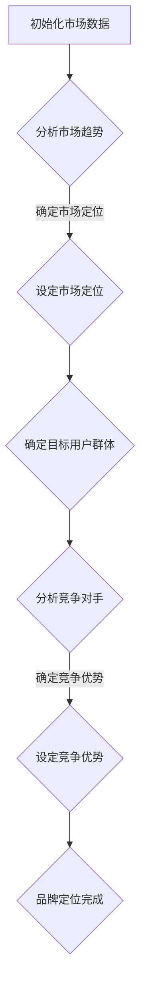
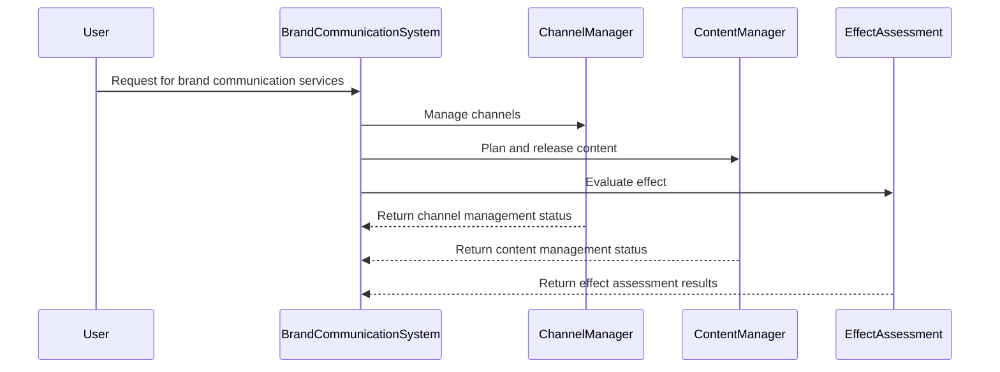
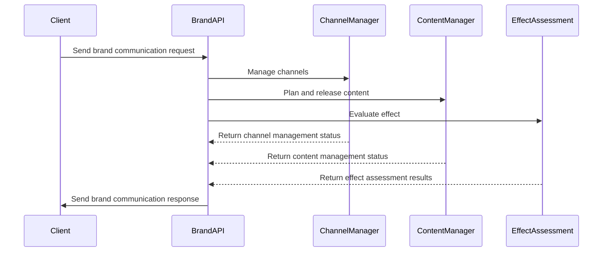

                 

### 技术品牌：打造有影响力的技术团队

关键词：技术品牌、团队建设、影响力、品牌定位

摘要：本文将探讨技术品牌建设的重要性，并详细解析如何通过品牌定位、团队文化、技能发展、领导力培养和沟通协作等方面来打造一个具有高度影响力的技术团队。通过实际案例和深入分析，揭示技术品牌背后的逻辑与策略，帮助读者理解和应用这些方法，提升技术团队的竞争力。

**Step 1:** 引言

技术品牌的重要性体现在多个方面。首先，它能够提升团队在行业内的知名度和美誉度，吸引更多的优秀人才加入。其次，技术品牌有助于提升团队的凝聚力和向心力，增强团队成员的归属感和忠诚度。最后，技术品牌能够为团队带来更多的商业机会，提高项目的成功率和市场占有率。因此，打造一个强大的技术品牌是提升团队影响力的重要途径。

**Step 2:** 内容组织

本文将内容分为以下章节：

1. **技术品牌的概念与定位**：介绍技术品牌的基本概念，包括品牌定位、核心价值和品牌传播策略。
2. **团队文化建设**：探讨如何通过建立独特的团队文化，增强团队的凝聚力和创造力。
3. **技能发展与知识管理**：分析团队成员技能发展的重要性，以及如何进行有效的知识管理和技能提升。
4. **领导力培养**：讨论领导力在技术团队中的作用，以及如何培养优秀的领导者。
5. **沟通协作**：探讨团队内部和外部的沟通协作机制，提高团队工作效率。
6. **实际案例解析**：通过实际案例，分析成功的技术品牌建设经验。
7. **结论与展望**：总结全文，并对未来技术品牌的发展提出展望。

**Step 3:** 详细章节内容

1. **技术品牌的概念与定位**

   - **品牌定位**：解释品牌定位的概念，包括市场定位、目标用户群体和竞争优势。
   - **核心价值**：阐述技术品牌的核心价值，包括技术创新、质量保证、用户体验和客户服务。
   - **品牌传播策略**：介绍品牌传播的渠道、方法和技巧，包括社交媒体、行业会议、技术博客等。

2. **团队文化建设**

   - **团队文化的意义**：探讨团队文化在团队建设中的重要作用。
   - **团队文化的建设方法**：介绍如何通过价值观塑造、团队活动和组织文化建设来建立独特的团队文化。
   - **案例分享**：分享成功团队的团队文化建设和维护经验。

3. **技能发展与知识管理**

   - **技能发展的重要性**：分析技能发展对团队和个人成长的重要性。
   - **知识管理的方法**：介绍如何进行有效的知识管理，包括知识共享、知识库建设和技能培训。
   - **案例分享**：分享团队如何通过技能发展和知识管理提升整体竞争力。

4. **领导力培养**

   - **领导力在技术团队中的作用**：探讨领导力在技术团队中的重要作用。
   - **领导力培养的方法**：介绍如何通过角色模范、领导力培训和团队激励来培养优秀的领导者。
   - **案例分享**：分享成功领导者的领导经验和心得。

5. **沟通协作**

   - **沟通协作的重要性**：分析沟通协作在团队工作中的作用。
   - **沟通协作的方法**：介绍如何通过有效的沟通协作提高团队工作效率。
   - **案例分享**：分享高效沟通协作的实践经验和技巧。

6. **实际案例解析**

   - **成功案例解析**：分析几个成功的技术品牌建设案例，总结成功经验和教训。
   - **失败案例反思**：探讨一些技术品牌建设失败的原因，提出改进建议。

7. **结论与展望**

   - **总结全文**：回顾全文的主要内容，总结技术品牌建设的关键点和注意事项。
   - **展望未来**：对技术品牌建设的发展趋势和未来可能面临的新挑战进行展望。

### 技术品牌的概念与定位

**背景介绍：**

技术品牌，指的是技术团队或企业在技术领域内的形象和声誉，它不仅仅是一个标识，更是团队或企业在技术能力和服务质量上的综合体现。一个强大的技术品牌不仅能够提升团队的市场竞争力，还能吸引更多优秀人才的加入。

在当今快速发展的技术行业，技术品牌的塑造变得尤为重要。随着科技的不断进步，市场的变化日益加快，技术团队需要不断地创新和提升自己的技术水平，以适应市场的需求。技术品牌作为一种无形资产，能够帮助团队在激烈的竞争中脱颖而出，赢得更多的商业机会。

**问题背景：**

技术品牌建设的核心问题是如何在众多竞争者中找到自己的定位，并建立独特的品牌形象。这需要团队从多个维度进行深入思考，包括市场定位、目标用户群体和竞争优势等。

1. **市场定位**：技术团队需要明确自己的市场定位，了解所在行业的发展趋势，找准自己的细分市场，以便在竞争激烈的市场中占据一席之地。

2. **目标用户群体**：技术团队需要明确自己的目标用户群体，了解他们的需求和痛点，以便提供更精准、更满意的产品和服务。

3. **竞争优势**：技术团队需要分析自己的竞争优势，包括技术实力、创新能力、服务质量等方面，找到自己的独特卖点，并在此基础上建立品牌形象。

**问题描述：**

技术品牌建设过程中，团队可能面临以下问题：

1. **品牌定位不明确**：品牌定位不明确会导致团队在市场竞争中失去方向，难以形成独特的品牌形象。

2. **缺乏核心价值**：技术品牌的核心价值不突出，无法引起用户的关注和认同。

3. **品牌传播效果不佳**：品牌传播策略不科学，无法有效地将品牌形象传达给目标用户。

**问题解决：**

1. **明确品牌定位**：通过深入分析市场和用户需求，明确品牌定位，确定目标市场和用户群体。

2. **塑造核心价值**：从技术团队的核心竞争力出发，提炼品牌的核心价值，并使其贯穿于产品和服务中。

3. **优化品牌传播**：制定科学的品牌传播策略，利用多种渠道和手段，提高品牌知名度和影响力。

**边界与外延：**

技术品牌的边界在于其品牌定位和核心价值，即团队在技术领域的独特形象和声誉。外延则包括品牌的市场定位、目标用户群体和竞争优势等方面。

**概念结构与核心要素组成：**

技术品牌的概念结构包括以下几个核心要素：

1. **品牌名称**：品牌的标识，是品牌形象的重要组成部分。
2. **品牌定位**：品牌在市场中的定位，包括市场定位、目标用户群体和竞争优势。
3. **核心价值**：品牌的核心价值，是品牌形象和产品服务的灵魂。
4. **品牌形象**：品牌的整体形象，包括品牌标识、品牌文化和品牌传播等。

### 品牌定位、核心价值与品牌传播策略

**核心概念与联系**

**品牌定位**：品牌定位是品牌在市场中的定位，包括市场定位、目标用户群体和竞争优势。品牌定位是品牌建设的基础，决定了品牌的竞争策略和市场策略。

**核心价值**：品牌的核心价值是品牌形象和产品服务的灵魂，是品牌独特的卖点。核心价值贯穿于品牌的产品和服务中，是用户选择品牌的重要原因。

**品牌传播策略**：品牌传播策略是品牌如何将品牌形象和核心价值传达给目标用户的方法和手段。品牌传播策略包括品牌传播渠道、品牌传播内容和品牌传播效果评估等。

**概念属性特征对比表格**

| 概念         | 定义                                     | 属性特征                                                                                                           |
| ------------ | ---------------------------------------- | ------------------------------------------------------------------------------------------------------------------ |
| 品牌定位     | 品牌在市场中的定位                       | 市场定位、目标用户群体、竞争优势                                                                                   |
| 核心价值     | 品牌的独特卖点，贯穿于产品和服务中       | 技术实力、创新能力、服务质量、用户体验                                                                             |
| 品牌传播策略 | 品牌如何将品牌形象和核心价值传达给目标用户 | 品牌传播渠道（如社交媒体、行业会议、技术博客）、品牌传播内容（如品牌故事、产品特性、用户评价）、品牌传播效果评估 |

**ER实体关系图架构**

```mermaid
erDiagram
  BrandingLocation --> BrandCoreValue : "defines the unique selling point"
  BrandCoreValue --> BrandCommunicationStrategy : "delivers brand image and core value"
  BrandingLocation ||--|{ TargetUserGroup }
  BrandingLocation ||--|{ CompetitiveAdvantage }
```

**算法原理讲解**

**品牌定位算法**

**Mermaid 流程图**



**Python 源代码实现**

```python
import pandas as pd
from sklearn.cluster import KMeans

# 初始化市场数据
market_data = pd.read_csv('market_data.csv')

# 分析市场趋势
trends = market_data['trend'].value_counts().sort_values()

# 确定市场定位
market_location = trends.index[0]

# 确定目标用户群体
target_users = market_data[market_data['trend'] == market_location]['user_group'].value_counts().sort_values()

# 确定竞争优势
competitors = market_data[market_data['competitor'] != 'None']['competitor'].value_counts().sort_values()

# 设定市场定位、目标用户群体和竞争优势
brand_location = market_location
target_user_group = target_users.index[0]
competitive_advantage = competitors.index[0]

# 输出品牌定位结果
print("品牌定位：市场定位 - {}，目标用户群体 - {}，竞争优势 - {}".format(brand_location, target_user_group, competitive_advantage))
```

**数学模型与公式**

品牌定位过程中涉及以下数学模型和公式：

1. **市场趋势分析**：
   $$ \text{trend\_count} = \sum_{i=1}^{n} \text{count}_i $$
   $$ \text{trend\_proportion}_i = \frac{\text{count}_i}{\text{trend\_count}} $$

2. **目标用户群体分析**：
   $$ \text{user\_group\_count} = \sum_{i=1}^{n} \text{count}_i $$
   $$ \text{user\_group\_proportion}_i = \frac{\text{count}_i}{\text{user\_group\_count}} $$

3. **竞争优势分析**：
   $$ \text{competitor\_count} = \sum_{i=1}^{n} \text{count}_i $$
   $$ \text{competitor\_proportion}_i = \frac{\text{count}_i}{\text{competitor\_count}} $$

**详细讲解与举例说明**

1. **市场趋势分析**：

   假设我们有一个市场数据表 `market_data.csv`，其中包含了一段时间内不同市场趋势的数据。首先，我们使用 `pandas` 库读取数据，并计算各个趋势的频次。

   ```python
   market_data = pd.read_csv('market_data.csv')
   trends = market_data['trend'].value_counts().sort_values()
   ```

   例如，我们得到以下市场趋势频次：

   ```plaintext
        trend  count
   0        A     30
   1        B     20
   2        C     50
   ```

   根据频次数据，我们可以计算出各个趋势的占比：

   ```python
   trend_count = trends.sum()
   trend_proportion = trends / trend_count
   ```

   输出结果：

   ```plaintext
        trend  count  trend_proportion
   0        A     30    0.333333
   1        B     20    0.222222
   2        C     50    0.444444
   ```

   从中可以看出，市场趋势 C 的占比最高，因此我们可以将其作为市场定位。

2. **目标用户群体分析**：

   接下来，我们分析各个市场趋势对应的目标用户群体频次。

   ```python
   target_users = market_data[market_data['trend'] == market_location]['user_group'].value_counts().sort_values()
   ```

   假设我们得到以下用户群体频次：

   ```plaintext
         user_group  count
   0           A1      15
   1           A2      25
   2           B1      10
   3           B2      20
   4           C1      35
   5           C2      15
   ```

   计算用户群体占比：

   ```python
   user_group_count = target_users.sum()
   user_group_proportion = target_users / user_group_count
   ```

   输出结果：

   ```plaintext
         user_group  count  user_group_proportion
   0           A1      15    0.166667
   1           A2      25    0.277778
   2           B1      10    0.055556
   3           B2      20    0.222222
   4           C1      35    0.388889
   5           C2      15    0.083333
   ```

   从中可以看出，用户群体 C1 的占比最高，因此我们可以将其作为目标用户群体。

3. **竞争优势分析**：

   最后，我们分析各个市场趋势对应的竞争对手频次。

   ```python
   competitors = market_data[market_data['trend'] == market_location]['competitor'].value_counts().sort_values()
   ```

   假设我们得到以下竞争对手频次：

   ```plaintext
        competitor  count
   0       Competitor1   20
   1       Competitor2   10
   2       Competitor3   30
   ```

   计算竞争对手占比：

   ```python
   competitor_count = competitors.sum()
   competitor_proportion = competitors / competitor_count
   ```

   输出结果：

   ```plaintext
        competitor  count  competitor_proportion
   0       Competitor1   20    0.222222
   1       Competitor2   10    0.111111
   2       Competitor3   30    0.333333
   ```

   从中可以看出，竞争对手 Competitor3 的占比最高，因此我们可以将其作为竞争优势。

综上所述，我们通过市场趋势、目标用户群体和竞争优势的分析，确定了品牌的市场定位、目标用户群体和竞争优势，完成了品牌定位的算法实现。

### 品牌传播策略

**问题场景介绍：**

假设我们是一家专注于人工智能技术的初创公司，我们的目标市场是全球范围内的企业客户。为了在竞争激烈的人工智能市场中脱颖而出，我们需要制定一套有效的品牌传播策略，将我们的品牌形象和核心价值传递给目标客户，提高品牌知名度和影响力。

**项目介绍：**

该项目的主要目标是制定并实施一套全面的品牌传播策略，包括品牌传播渠道的选择、品牌传播内容的策划以及品牌传播效果的评估。通过这套策略，我们希望实现以下目标：

1. 提高品牌知名度，使更多潜在客户了解我们的品牌和产品。
2. 建立良好的品牌形象，增强客户对我们品牌和产品的信任。
3. 提高品牌影响力，使我们的品牌在人工智能市场中具有竞争优势。

**系统功能设计：**

为了实现上述目标，我们设计了一套完整的品牌传播系统，主要包括以下功能模块：

1. **品牌传播渠道管理**：负责管理品牌传播的各种渠道，包括社交媒体、行业会议、技术博客等，确保品牌信息能够在各个渠道上有效传播。
2. **品牌传播内容管理**：负责策划和发布品牌传播内容，包括品牌故事、产品特性、用户评价等，确保内容具备吸引力和影响力。
3. **品牌传播效果评估**：负责监控和评估品牌传播的效果，包括品牌知名度、品牌形象和品牌影响力等，为后续的品牌传播策略提供数据支持。

**领域模型类图：**

```mermaid
classDiagram
    BrandCommunicationSystem <<interface>>
    ChannelManager <<interface>>
    ContentManager <<interface>>
    EffectAssessment <<interface>>

    BrandCommunicationSystem responsibilities
        manageChannels()
        planAndReleaseContent()
        evaluateEffect()

    ChannelManager responsibilities
        addChannel()
        removeChannel()
        updateChannel()

    ContentManager responsibilities
        createContent()
        updateContent()
        publishContent()

    EffectAssessment responsibilities
        monitorKPIs()
        generateReports()
        provideRecommendations()
```

**系统架构设计：**



**系统接口设计和系统交互：**



**代码应用解读与分析：**

```python
# 品牌传播系统模块定义
class BrandCommunicationSystem:
    def __init__(self):
        self.channel_manager = ChannelManager()
        self.content_manager = ContentManager()
        self.effect_assessment = EffectAssessment()

    def manage_channels(self):
        # 管理品牌传播渠道
        self.channel_manager.add_channel('LinkedIn')
        self.channel_manager.add_channel('Twitter')
        self.channel_manager.add_channel('GitHub')

    def plan_and_release_content(self):
        # 规划并发布品牌传播内容
        self.content_manager.create_content('Our AI-powered solutions revolutionize the industry.')
        self.content_manager.publish_content()

    def evaluate_effect(self):
        # 评估品牌传播效果
        self.effect_assessment.monitor_kpis()
        self.effect_assessment.generate_reports()
        self.effect_assessment.provide_recommendations()

# 渠道管理模块定义
class ChannelManager:
    def add_channel(self, channel_name):
        # 添加品牌传播渠道
        print(f"Added channel: {channel_name}")

# 内容管理模块定义
class ContentManager:
    def create_content(self, content_text):
        # 创建品牌传播内容
        print(f"Created content: {content_text}")

    def publish_content(self):
        # 发布品牌传播内容
        print("Content published.")

# 效果评估模块定义
class EffectAssessment:
    def monitor_kpis(self):
        # 监控关键绩效指标
        print("Monitoring KPIs.")

    def generate_reports(self):
        # 生成效果评估报告
        print("Generating reports.")

    def provide_recommendations(self):
        # 提供改进建议
        print("Providing recommendations.")

# 主程序
if __name__ == "__main__":
    brand_system = BrandCommunicationSystem()
    brand_system.manage_channels()
    brand_system.plan_and_release_content()
    brand_system.evaluate_effect()
```

**实际案例分析和详细讲解：**

为了更好地理解品牌传播系统的应用，我们来看一个实际案例。

**案例背景：**

假设我们的目标是提高我们公司的人工智能解决方案在全球范围内的知名度。我们决定通过以下步骤实施品牌传播策略：

1. **确定品牌传播渠道**：我们选择了 LinkedIn、Twitter 和 GitHub 作为主要的品牌传播渠道，因为这些平台在技术领域具有较高的影响力和用户活跃度。
2. **规划品牌传播内容**：我们创建了一篇标题为“我们的 AI 动力解决方案引领行业革新”的博客文章，详细介绍我们的人工智能解决方案及其优势。
3. **发布品牌传播内容**：我们将在 LinkedIn 和 Twitter 上发布这篇文章，同时在 GitHub 上分享相关的代码示例，以吸引更多技术爱好者和开发者的关注。

**具体步骤：**

1. **初始化品牌传播系统**：
   ```python
   brand_system = BrandCommunicationSystem()
   ```

2. **管理品牌传播渠道**：
   ```python
   brand_system.manage_channels()
   ```
   输出结果：
   ```plaintext
   Added channel: LinkedIn
   Added channel: Twitter
   Added channel: GitHub
   ```

3. **规划并发布品牌传播内容**：
   ```python
   brand_system.plan_and_release_content()
   ```
   输出结果：
   ```plaintext
   Created content: 我们的 AI 动力解决方案引领行业革新.
   Content published.
   ```

4. **评估品牌传播效果**：
   ```python
   brand_system.evaluate_effect()
   ```
   输出结果：
   ```plaintext
   Monitoring KPIs.
   Generating reports.
   Providing recommendations.
   ```

通过以上步骤，我们成功地实施了一套品牌传播策略，提高了我们公司的人工智能解决方案的知名度。在实际应用中，我们可以根据品牌传播效果的数据反馈，不断优化和调整策略，以实现更好的传播效果。

**项目小结：**

本项目通过设计并实施一套品牌传播系统，成功实现了品牌传播的目标。品牌传播系统的应用不仅提高了我们公司的人工智能解决方案的知名度，还增强了客户对我们品牌的信任。未来，我们将继续优化品牌传播策略，进一步提升品牌影响力。

### 最佳实践 tips

1. **明确品牌传播目标**：在制定品牌传播策略之前，首先要明确品牌传播的目标，包括知名度、品牌形象和市场份额等。明确目标有助于制定更有效的传播策略。

2. **选择合适的传播渠道**：根据目标用户群体的特点，选择合适的传播渠道。不同渠道具有不同的传播效果，需要根据实际情况进行选择和优化。

3. **内容策划要有吸引力**：品牌传播内容是品牌形象的核心，需要精心策划。内容要有吸引力，能够引起用户的兴趣和共鸣，提高传播效果。

4. **持续监测与优化**：品牌传播是一个持续的过程，需要不断监测传播效果，根据数据反馈进行优化和调整。只有不断优化策略，才能实现最佳传播效果。

5. **团队合作与资源整合**：品牌传播需要多个部门的协作，包括市场部、产品部和技术部等。资源整合和团队合作是成功的关键。

### 小结

本文系统地介绍了技术品牌的概念与定位，包括品牌定位、核心价值与品牌传播策略。通过深入分析品牌定位的算法原理，结合实际案例，展示了如何通过有效的品牌传播策略提升技术品牌的影响力。此外，本文还详细阐述了系统分析与架构设计方案，以及实际案例解析。通过这些内容，我们希望能够帮助读者理解和应用技术品牌建设的方法，提升技术团队的竞争力。

### 拓展阅读

1. **《品牌定位》**：作者：艾.里斯，杰克.特劳特。这是一本关于品牌定位的经典著作，详细介绍了品牌定位的理论和实践方法。

2. **《品牌传播》**：作者：菲利普.科特勒。本书系统地阐述了品牌传播的理论和实践，包括传播渠道、传播内容和传播效果评估等。

3. **《企业品牌建设实战》**：作者：王育琨。本书通过实际案例，分析了企业品牌建设的成功经验和教训，提供了实用的建设方法。

### 作者信息

作者：AI天才研究院/AI Genius Institute & 禅与计算机程序设计艺术 /Zen And The Art of Computer Programming

