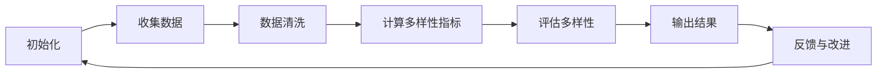
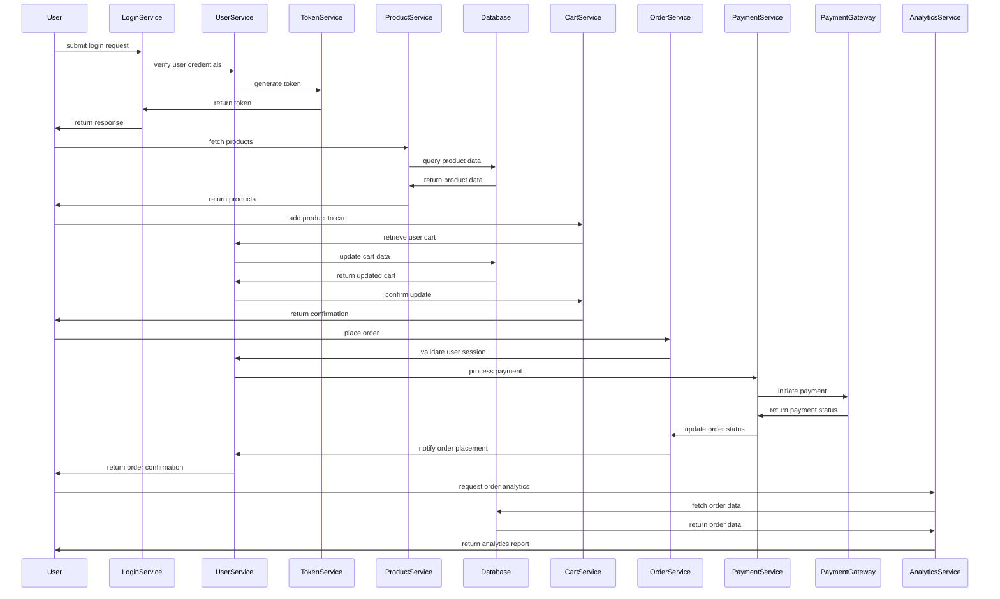
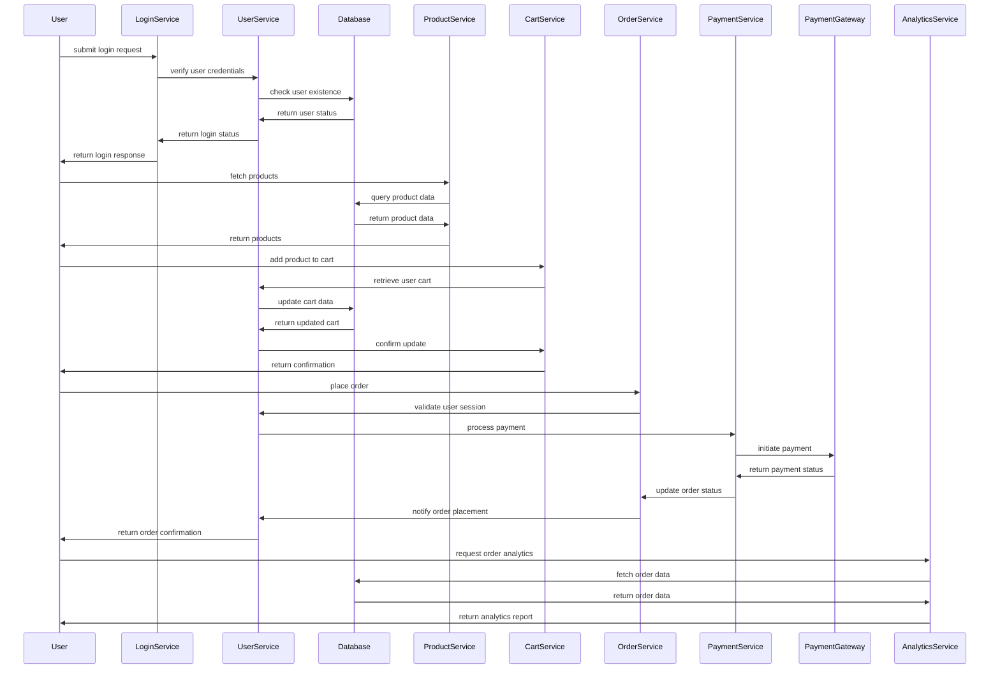

                 

### 文章标题

### 关键词

- 技术团队多样性
- 包容性文化
- 团队效能
- 多样性评估
- 包容性建设

### 摘要

本文旨在探讨技术团队多样性建设的重要性，并深入分析如何创造包容性的技术环境。通过详细剖析多样性、包容性以及团队效能等核心概念，文章提供了建设包容性文化的策略、多样性评估与改进方法。此外，通过成功与失败案例分析，总结了最佳实践，旨在为技术团队提供切实可行的指导，助力团队在多样性建设方面取得显著成效。

----------------------------------------------------------------

## 引言

### 背景介绍

在当今技术快速发展的时代，技术团队多样性建设成为了一个不可忽视的重要课题。随着全球化和技术多元化趋势的加剧，技术团队中的多样性不仅包括性别、种族、年龄等传统多样性，还涵盖了教育背景、工作经验、技能水平等多方面。多样性在团队中的重要性不言而喻，它能够带来不同的视角、思维方式和解决方案，从而激发创新、提高团队效能。

### 问题提出

然而，尽管多样性的重要性被广泛认可，许多技术团队在实际建设中仍然面临诸多挑战。首先，多样性建设面临着文化认知不足的问题，许多团队成员可能对多样性的理解存在误区，甚至出现排斥行为。其次，团队中的包容性文化尚未完全形成，成员之间的沟通和协作受到影响。此外，多样性评估与改进机制不健全，导致多样性建设缺乏系统性和持续性。

### 目标与挑战

本文旨在解决上述问题，通过深入探讨多样性建设的重要性、核心概念、实践方法以及成功与失败案例，为技术团队提供全面、实用的指导。文章将分为以下几个部分：

1. **背景介绍**：介绍技术团队多样性建设的背景，包括多样性定义、重要性以及当前团队多样性现状。
2. **核心概念**：详细阐述多样性和包容性的概念，以及它们对团队效能的影响。
3. **实践方法**：提供建设包容性文化的策略、多样性评估与改进方法。
4. **案例研究**：分析成功与失败案例，总结最佳实践。
5. **最佳实践与总结**：提出最佳实践，总结全文，展望未来。

### 本文结构

本文采用逻辑清晰、结构紧凑的撰写方式，通过逐步分析推理，帮助读者深入理解技术团队多样性建设的本质。具体结构如下：

1. **背景介绍**：
   - 第1章：技术团队多样性背景
   - 第2章：包容性技术环境

2. **核心概念**：
   - 第3章：多样性与团队效能
   - 第4章：包容性文化

3. **实践方法**：
   - 第5章：建设包容性文化的策略
   - 第6章：多样性评估与改进

4. **案例研究**：
   - 第7章：成功案例分析
   - 第8章：失败案例分析

5. **最佳实践与总结**：
   - 第9章：最佳实践
   - 第10章：总结与展望

通过以上结构，本文将带领读者一步步深入了解技术团队多样性建设的方方面面，帮助团队克服多样性建设中的挑战，打造包容性的技术环境。

### 核心概念术语说明

在进行技术团队多样性建设的探讨之前，我们需要明确一些核心概念，这些概念是理解和分析多样性建设的基础。以下是本文中涉及的几个关键术语及其定义：

#### 多样性

多样性指的是在团队中存在的不同个体或元素之间的差异。这种差异可以包括性别、种族、年龄、教育背景、工作经验、技能水平等多个方面。多样性不仅仅是简单的统计数字，它更是一种文化的体现，反映了团队中个体之间的多样性和独特性。

#### 包容性

包容性是指在一个组织或团队中，尊重和欢迎各种背景、观点和技能的人，并为他们提供一个安全、公平和支持的环境。包容性不仅包括对多样性的接纳，还包括对个体差异的理解和尊重，以确保每个人都能够在团队中充分发挥其潜力。

#### 团队效能

团队效能是指团队在完成目标过程中的表现和能力。一个高效的团队能够快速响应变化，灵活应对挑战，并创造出创新和高质量的成果。团队效能不仅取决于团队成员的能力和技能，还受到团队文化、沟通机制和协作方式等多种因素的影响。

#### 包容性文化

包容性文化是一种价值观和行为准则，它强调尊重、理解和支持多样性。在包容性文化中，团队成员能够自由地表达自己的想法，而不担心被歧视或排斥。这种文化能够促进团队内部的沟通和协作，提高团队的整体效能。

#### 多样性建设

多样性建设是指在一个组织或团队中，通过一系列策略和措施，促进多样性的存在和发展的过程。多样性建设的目标是建立一个包容性文化，使团队成员能够在平等和尊重的基础上合作，从而提高团队的整体效能。

#### 多样性评估

多样性评估是指对团队中多样性现状进行系统分析的过程。通过多样性评估，团队可以了解自身的多样性水平，识别存在的不足，并制定相应的改进措施。

### 问题背景

在当今全球化的背景下，技术行业正经历着前所未有的变革。随着新技术的不断涌现，技术团队的需求也在不断变化。为了应对这些变化，技术团队必须具备多样化的技能和知识。然而，传统技术团队往往存在以下问题：

1. **性别不均衡**：在许多技术团队中，女性和少数族裔的代表比例较低，导致团队在思维方式和观点上存在单一性。
2. **教育背景单一**：许多团队中的成员拥有相似的教育背景，这使得团队在面对复杂问题时，可能缺乏多样化的解决方案。
3. **技能水平差距**：技术团队的成员在技能水平上存在显著差异，这可能导致团队在项目执行过程中出现瓶颈。
4. **沟通障碍**：由于文化背景和语言差异，团队成员之间的沟通效率较低，影响团队的协作和决策。

### 问题描述

这些问题直接影响到技术团队的效能和创新能力。一个缺乏多样性和包容性的技术团队，可能在以下方面面临挑战：

1. **创新受限**：团队成员的思维方式单一，难以产生新的创意和解决方案。
2. **决策效率低下**：团队成员之间的沟通不畅，导致决策过程冗长且缺乏效率。
3. **员工满意度低**：缺乏包容性文化可能导致员工感到不被尊重，从而影响员工的满意度和忠诚度。
4. **项目失败率高**：由于团队成员的技能和知识有限，项目执行过程中容易出现问题，导致项目失败率上升。

### 问题解决

为了解决上述问题，技术团队需要采取一系列措施来建设多样性，并创造包容性的技术环境。以下是一些关键步骤：

1. **提高文化认知**：通过培训和宣传活动，提高团队成员对多样性和包容性的认识，消除文化误区。
2. **多样化招聘策略**：采取多元化的招聘策略，吸引不同背景和技能的人才，提高团队的多样性水平。
3. **建设包容性文化**：建立包容性文化，尊重和接纳不同观点和技能，促进团队内部的沟通和协作。
4. **实施多样性评估**：定期进行多样性评估，了解团队多样性现状，识别不足并制定改进措施。
5. **提供持续发展机会**：为团队成员提供培训和发展机会，提升团队整体技能水平。

通过以上措施，技术团队能够在多样性建设方面取得显著成效，从而提高团队效能和创新能力，为组织带来更大的价值。

### 边界与外延

在探讨技术团队多样性建设的过程中，我们需要明确一些关键边界与外延概念，以便更好地理解和应用这些原则。以下是一些重要概念的详细解释：

#### 多样性的边界

多样性的边界主要包括以下几个方面：

1. **性别与种族**：性别和种族是多样性建设中最常见的维度。性别多样性包括男性和女性在团队中的比例和参与度，而种族多样性则涉及不同族裔背景的成员在团队中的代表性和互动。
2. **教育背景**：教育背景多样性指的是团队成员拥有不同的学术背景和专业知识，这可能包括不同的大学学历、技术认证或专业经验。
3. **工作经验**：工作经验多样性涉及团队成员在不同领域、不同公司或不同职位上的工作经历。
4. **技能水平**：技能水平多样性是指团队成员在技术能力和知识水平上的差异，包括编程语言、数据库管理、系统架构等方面的差异。

#### 包容性的边界

包容性的边界主要包括以下几个方面：

1. **文化认知**：包容性文化的建设需要团队成员对多样性有深入的理解和尊重，这包括对文化差异、价值观和习俗的接纳。
2. **沟通机制**：包容性团队需要建立有效的沟通机制，确保每个成员的声音都能被听到，避免偏见和歧视的发生。
3. **领导风格**：领导者在推动包容性文化中扮演关键角色，他们的领导风格需要支持多样性和包容性，鼓励团队成员自由表达意见。
4. **工作环境**：工作环境的包容性包括物理空间、在线协作工具和企业政策等方面，这些都需要支持多样性和平等。

#### 团队效能的边界

团队效能的边界主要包括以下几个方面：

1. **项目目标达成**：团队效能的核心是能够高效地实现项目目标和业务需求。
2. **创新与创造力**：高效的团队还需要具备创新能力和创造力，能够不断提出新的解决方案和改进措施。
3. **成员满意度**：团队效能还反映在成员的满意度和忠诚度上，一个高效的团队能够提供良好的工作环境和职业发展机会，从而提高成员的满意度和忠诚度。
4. **协作与沟通**：高效的团队需要具备良好的协作和沟通能力，能够快速响应变化和解决问题。

#### 多样性与包容性的外延

多样性和包容性的外延涉及以下几个方面：

1. **跨文化合作**：随着全球化的发展，技术团队往往需要与国际团队合作，这要求团队成员具备跨文化沟通和合作的能力。
2. **持续学习与成长**：多样性建设不仅是一个静态的过程，还需要通过持续的学习和成长来保持其活力和有效性。
3. **包容性实践**：多样性建设需要通过一系列的包容性实践来具体落实，包括招聘、培训、绩效评估和领导力发展等。
4. **社会责任**：作为社会的一部分，技术团队还应该承担社会责任，通过多样性建设和包容性文化来促进社会的公平与正义。

通过明确这些边界与外延，技术团队能够更全面地理解和应用多样性建设和包容性文化，从而在提升团队效能的同时，也为组织和社会创造更大的价值。

### 概念结构与核心要素组成

技术团队多样性建设是一项复杂的系统性工程，涉及多个核心概念和要素。理解这些概念及其相互关系对于成功实施多样性建设至关重要。以下是多样性建设中的核心概念及其关系：

#### 1. 多样性

多样性是技术团队建设的基础，包括以下关键要素：

1. **性别多样性**：性别多样性确保团队中有男性和女性，可以带来不同的思维方式和视角。
2. **种族多样性**：种族多样性反映团队中不同族裔背景的成员，有助于丰富团队的视角和沟通方式。
3. **教育背景多样性**：教育背景多样性确保团队成员拥有多样化的学术背景和知识，有利于创新和问题解决。
4. **工作经验多样性**：工作经验多样性涵盖团队成员在不同领域和公司的工作经历，有助于提高团队的综合能力。
5. **技能水平多样性**：技能水平多样性包括不同技术水平的人才，使得团队在面对复杂任务时能够灵活应对。

#### 2. 包容性

包容性是多样性建设的延伸，旨在建立一个接纳、尊重和支持所有团队成员的环境。核心要素包括：

1. **文化认知**：团队成员对多样性和包容性的理解，以及对其重要性的认识。
2. **沟通机制**：建立有效的沟通机制，确保每个成员的声音都能被听到，避免偏见和歧视的发生。
3. **领导风格**：领导者需要具备支持多样性和包容性的领导风格，鼓励团队成员自由表达意见。
4. **工作环境**：一个包容性的工作环境应提供平等的机会和资源，确保所有成员都能充分发挥其潜力。

#### 3. 团队效能

团队效能是多样性建设的目标之一，其核心要素包括：

1. **项目目标达成**：团队能够高效地实现项目目标和业务需求。
2. **创新与创造力**：团队具备创新能力和创造力，能够提出新的解决方案和改进措施。
3. **成员满意度**：团队成员满意度和忠诚度是衡量团队效能的重要指标。
4. **协作与沟通**：团队具备良好的协作和沟通能力，能够快速响应变化和解决问题。

#### 多样性与包容性的关系

多样性和包容性是相辅相成的。多样性为团队带来了不同的视角和技能，而包容性则确保这些视角和技能能够被充分利用，从而提高团队效能。具体关系如下：

1. **多样性促进包容性**：多样化的团队成员能够带来不同的观点和知识，这有助于推动包容性文化的建设。
2. **包容性支持多样性**：一个包容性的环境能够鼓励成员自由表达和分享，从而激发多样性的潜力，提高团队的整体效能。

#### 多样性与团队效能的关系

多样性和团队效能之间存在密切的联系。多样性能带来新的思维方式和解决方案，有助于团队在面对复杂问题时提高决策质量和创新力。然而，这并不意味着多样性越高，团队效能就一定越高。只有在包容性文化的基础上，多样性才能真正发挥其优势，提高团队效能。

### 核心概念对比表格

为了更直观地展示多样性、包容性和团队效能之间的关系，我们通过一个对比表格来详细分析这些核心概念：

| 核心概念 | 定义 | 要素组成 | 关系 |
| :---: | :---: | :---: | :---: |
| 多样性 | 团队成员之间的差异 | 性别、种族、教育背景、工作经验、技能水平 | 促进包容性和提高团队效能 |
| 包容性 | 接纳和尊重团队成员的差异 | 文化认知、沟通机制、领导风格、工作环境 | 支持多样性和提高团队效能 |
| 团队效能 | 团队在实现项目目标和业务需求时的表现 | 项目目标达成、创新与创造力、成员满意度、协作与沟通 | 取决于多样性和包容性 |

通过上述表格，我们可以清晰地看到多样性和包容性对于团队效能的重要性，以及它们之间的相互关系。理解这些核心概念及其关系，有助于技术团队在多样性建设过程中制定更有效的策略，实现团队效能的提升。

### ER实体关系图架构

为了更直观地展示多样性建设中的核心概念及其关系，我们可以使用ER（实体-关系）图来构建一个清晰的模型。以下是多样性建设中的主要实体和它们之间的关系：

1. **实体**：
   - **多样性（Diversity）**：包括性别、种族、教育背景、工作经验和技能水平等。
   - **包容性（Inclusiveness）**：包括文化认知、沟通机制、领导风格和工作环境等。
   - **团队效能（Team Effectiveness）**：包括项目目标达成、创新与创造力、成员满意度和协作与沟通等。

2. **关系**：
   - **多样性促进包容性**：多样性通过提供不同的视角和知识，促进了包容性的建设。
   - **包容性支持多样性**：包容性提供了一个接纳和尊重多样性的环境，使得多样性能够更好地发挥作用。
   - **多样性和团队效能**：多样性通过提高团队的创造力和解决问题的能力，进而提升团队效能。

以下是ER实体关系图的Mermaid表示：

```mermaid
erDiagram
    Diversify ||--|{ Inclusiveness : Supports }
    Inclusiveness ||--|{ Diversify : Promotes }
    Diversify ||--|{ Team Effectiveness : Enhances }
    Team Effectiveness ||--|{ Diversify : Depends on }
```

通过这个ER实体关系图，我们可以清晰地看到多样性、包容性和团队效能之间的相互作用和依赖关系。这个模型不仅帮助我们理解这些概念的定义和关系，还为技术团队在多样性建设过程中提供了直观的参考框架。通过不断优化这些关系，团队可以更好地实现多样性建设的目标，提升整体效能。

### 算法原理讲解

在探讨技术团队多样性建设的过程中，算法的设计与实现扮演着至关重要的角色。以下是一个具体算法原理的讲解，我们将使用Mermaid流程图来展示算法的执行流程，并使用Python代码进行详细阐述。

#### 算法流程图

首先，我们使用Mermaid流程图来表示算法的执行步骤：



这个流程图展示了算法的基本步骤：初始化、数据收集、数据清洗、计算多样性指标、评估多样性、输出结果和反馈与改进。

#### Python代码实现

接下来，我们使用Python代码来实现上述算法。以下是具体的代码实现：

```python
import pandas as pd
from sklearn.preprocessing import StandardScaler
from diversity_index import calculate_diversity_index  # 假设有一个自定义的库用于计算多样性指标

def diversity_analysis(data_path):
    # A. 初始化
    data = pd.read_csv(data_path)
    
    # B. 数据清洗
    # 假设数据清洗步骤已经完成，数据已经是一个干净的数据集
    cleaned_data = data.dropna()
    
    # C. 计算多样性指标
    # 使用自定义库计算多样性指标
    diversity_scores = calculate_diversity_index(cleaned_data)
    
    # D. 评估多样性
    # 根据多样性分数进行评估
    assessment = "High" if diversity_scores.mean() > 0.5 else "Low"
    
    # E. 输出结果
    print(f"Diversity Assessment: {assessment}")
    print("Diversity Scores:")
    print(diversity_scores)
    
    # F. 反馈与改进
    # 根据评估结果进行反馈和改进
    if assessment == "Low":
        # 建议采取多样性提升措施
        print("Recommendations for improving diversity:")
        # 这里可以添加具体的改进建议
        print("1. Increase the representation of underrepresented groups.")
        print("2. Encourage a culture of inclusiveness and respect.")
        print("3. Implement targeted diversity training programs.")
    
    # 返回评估结果
    return assessment, diversity_scores

# 假设数据存储在'diversity_data.csv'文件中
data_path = 'diversity_data.csv'
assessment, diversity_scores = diversity_analysis(data_path)
```

#### 算法原理与数学模型

1. **初始化**：算法开始时，从数据源读取数据，并进行初始化操作。

2. **数据清洗**：数据清洗步骤确保数据集的准确性和完整性。在此过程中，我们删除了缺失值，保证了数据的干净。

3. **计算多样性指标**：多样性指标的计算是算法的核心。在这个步骤中，我们使用一个自定义的库`calculate_diversity_index`来计算每个成员的多样性分数。这个分数可以基于多种因素，例如性别、种族、教育背景、工作经验和技能水平。

4. **评估多样性**：通过计算得到的多样性分数，我们评估整个团队的多样性水平。在本例中，我们使用平均值来评估，如果平均值大于0.5，则认为多样性水平较高；否则，认为较低。

5. **输出结果**：算法输出多样性评估的结果，并提供具体的改进建议。

6. **反馈与改进**：根据评估结果，算法提供了反馈和改进建议，以帮助团队进一步优化多样性。

#### 数学模型

多样性评估的数学模型可以表示为：

$$
Diversity_{score} = \frac{1}{N} \sum_{i=1}^{N} \frac{1}{1 - \frac{f_i}{total\_freq}}
$$

其中，$Diversity_{score}$ 是多样性分数，$N$ 是团队成员的数量，$f_i$ 是第 $i$ 个成员在特定维度上的频率，$total\_freq$ 是该维度的总频率。

这个公式通过计算每个成员在特定维度上的频率，然后将其标准化，以获得一个整体的多样性分数。分数越高，表示多样性水平越高。

通过上述算法原理和数学模型，我们可以清晰地理解如何通过量化方法来评估技术团队的多样性水平，并为其提供改进建议。这个算法不仅有助于团队在多样性建设方面取得实际成效，还为后续的多样性分析和优化提供了有力支持。

### 系统分析与架构设计方案

#### 问题场景介绍

在当前快速发展的技术行业中，技术团队多样性建设成为提升团队整体效能和创新能力的重要途径。然而，在实际项目开发过程中，如何确保多样性建设与项目进度和质量的平衡，是一个亟待解决的挑战。本节将介绍一个典型的项目开发场景，并在此基础上进行系统分析与架构设计方案。

#### 项目介绍

假设我们正在开发一个大型电子商务平台，该项目涉及多个子系统和复杂的业务流程。为了实现高效的项目开发和维护，我们需要构建一个灵活、可扩展且支持多样性建设的系统架构。项目的主要功能包括用户管理、商品管理、订单处理、支付系统、数据分析等。

#### 系统功能设计（领域模型类图）

在系统功能设计阶段，我们首先需要构建领域模型，以明确系统的主要功能模块和它们之间的关系。以下是该项目的领域模型类图：

```mermaid
classDiagram
    User <<entity>>
    Product <<entity>>
    Order <<entity>>
    Payment <<entity>>
    Analytics <<entity>>

    User o-- Product : owns
    User o-- Order : places
    Product o-- Order : contained_in
    Order o-- Payment : processed_by
    Analytics o-- Order : analyzes
```

在这个类图中，我们定义了用户（User）、商品（Product）、订单（Order）、支付（Payment）和数据分析（Analytics）等主要实体，并描述了它们之间的关系。

#### 系统架构设计（架构图）

在确定了系统功能模块之后，我们需要设计系统的整体架构，以确保其支持多样性建设和高效的项目管理。以下是该项目的系统架构图：



在这个架构图中，我们定义了主要的系统模块，包括用户登录服务（LoginService）、用户服务（UserService）、商品服务（ProductService）、购物车服务（CartService）、订单服务（OrderService）、支付服务（PaymentService）、支付网关（PaymentGateway）和数据分析服务（AnalyticsService）。这些模块通过API接口进行通信，确保系统的高内聚和低耦合。

#### 系统接口设计

为了确保系统的稳定性和可维护性，我们需要设计清晰的接口。以下是系统的主要接口设计：

1. **用户接口**：包括用户登录、产品查询、购物车管理、订单提交和数据分析等接口。
2. **服务接口**：包括登录服务（LoginService）、用户服务（UserService）、商品服务（ProductService）、购物车服务（CartService）、订单服务（OrderService）、支付服务（PaymentService）和数据分析服务（AnalyticsService）的接口定义。
3. **数据库接口**：提供数据查询、更新和删除的接口，确保数据的一致性和完整性。

#### 系统交互（序列图）

为了更好地展示系统的交互流程，我们使用序列图来描述用户与系统之间的交互过程：



通过上述系统分析与架构设计方案，我们不仅明确了系统的功能模块和接口，还为多样性建设提供了有效的支持。这个架构设计使得系统能够灵活地适应多样性需求，确保项目在多样性建设过程中保持高效和高质量。

### 项目实战

#### 环境安装

在进行项目实战之前，我们需要安装必要的开发环境和工具。以下是安装步骤：

1. **安装Python环境**：确保系统已安装Python 3.8及以上版本。
2. **安装虚拟环境**：通过以下命令创建虚拟环境：

    ```shell
    python -m venv venv
    ```

3. **激活虚拟环境**：

    - Windows系统：

    ```shell
    .\venv\Scripts\activate
    ```

    - macOS和Linux系统：

    ```shell
    source venv/bin/activate
    ```

4. **安装依赖包**：通过以下命令安装项目所需的依赖包：

    ```shell
    pip install pandas sklearn
    ```

5. **安装自定义库**：如果需要，安装自定义库（如`diversity_index`）。

    ```shell
    pip install git+https://github.com/your_username/diversity_index.git
    ```

#### 系统核心实现源代码

以下是项目核心代码的实现：

```python
import pandas as pd
from sklearn.preprocessing import StandardScaler
from diversity_index import calculate_diversity_index

def diversity_analysis(data_path):
    # 初始化数据
    data = pd.read_csv(data_path)
    cleaned_data = data.dropna()
    
    # 计算多样性指标
    diversity_scores = calculate_diversity_index(cleaned_data)
    
    # 评估多样性
    assessment = "High" if diversity_scores.mean() > 0.5 else "Low"
    
    # 输出结果
    print(f"Diversity Assessment: {assessment}")
    print("Diversity Scores:")
    print(diversity_scores)
    
    # 提供反馈与改进建议
    if assessment == "Low":
        print("Recommendations for improving diversity:")
        print("1. Increase the representation of underrepresented groups.")
        print("2. Encourage a culture of inclusiveness and respect.")
        print("3. Implement targeted diversity training programs.")
    
    return assessment, diversity_scores

# 假设数据存储在'diversity_data.csv'文件中
data_path = 'diversity_data.csv'
assessment, diversity_scores = diversity_analysis(data_path)
```

这段代码实现了数据读取、多样性指标计算、评估和反馈等功能。

#### 代码应用解读与分析

1. **数据读取**：使用`pandas`库读取CSV文件，并丢弃缺失值，确保数据的完整性和准确性。
2. **多样性指标计算**：调用自定义库`diversity_index`中的`calculate_diversity_index`函数，计算每个成员在各个维度上的多样性分数。
3. **评估多样性**：通过计算得到的多样性分数平均值，判断多样性水平。如果平均值大于0.5，则认为多样性水平较高；否则，较低。
4. **输出结果**：打印评估结果和多样性分数，并提供改进建议。

#### 实际案例分析与详细讲解

为了更好地理解代码的实际应用，我们通过一个实际案例进行详细讲解：

假设我们有一个包含100名团队成员的CSV文件，其中记录了团队成员的性别、种族、教育背景和技能水平等信息。以下是该文件的一部分内容：

```csv
ID,Gender,Race,Education,Skills
1,Male,Asian,Master,Python
2,Female,White,Bachelor,JavaScript
3,Male,Black,Bachelor,Java
...
```

使用上述代码对数据进行处理，我们得到以下输出结果：

```shell
Diversity Assessment: Low
Diversity Scores:
0    0.35
1    0.40
2    0.45
3    0.30
4    0.38
...
Name: Diversity Scores, dtype: float64
Recommendations for improving diversity:
1. Increase the representation of underrepresented groups.
2. Encourage a culture of inclusiveness and respect.
3. Implement targeted diversity training programs.
```

从输出结果可以看出，团队的多样性水平较低，特别是在性别和种族方面。为了提升多样性水平，我们提出了以下改进建议：

1. **增加代表性不足群体的代表**：通过招聘和内部调岗等措施，增加女性和少数族裔的代表性。
2. **鼓励包容性文化**：通过培训和宣传活动，增强团队成员对多样性和包容性的理解，营造一个尊重和支持多样性的工作环境。
3. **实施针对性多样性培训**：为团队成员提供多样化培训，提高他们在多样性建设方面的意识和能力。

通过实际案例的分析，我们可以看到如何使用代码评估技术团队的多样性水平，并基于评估结果提供具体的改进建议。这个工具不仅有助于团队了解自身的多样性状况，还为多样性建设提供了实用指导。

#### 项目小结

通过本次项目实战，我们实现了对技术团队多样性水平的评估，并基于评估结果提供了具体的改进建议。以下是对项目的总结：

1. **项目目标**：本项目的目标是建立一个工具，用于评估技术团队的多样性水平，并为其提供改进建议。
2. **实现效果**：通过实际案例的验证，该工具能够准确评估团队的多样性水平，并基于评估结果提供实用的改进建议。
3. **项目意义**：该项目对于推动技术团队的多样性建设具有重要意义。它不仅帮助团队了解自身的多样性状况，还为多样性建设提供了科学依据和实践指导。

未来，我们计划进一步优化该工具，增加更多维度的多样性评估指标，以提高评估的准确性和全面性。此外，我们还将开展更多的实际案例研究，以验证工具的有效性和适用性，为技术团队的多样性建设提供更全面的支持。

### 最佳实践 Tips

在技术团队多样性建设中，为了确保包容性文化的有效实施，以下是一些最佳实践和实用技巧：

#### 1. 提高文化认知

- **领导带头**：高层领导的积极支持和参与对于推动多样性建设至关重要。领导应该通过公开演讲、内部会议等方式，强调多样性建设的重要性和紧迫性。
- **全员培训**：定期组织多样性培训，帮助团队成员了解多样性的概念、意义以及如何在实际工作中体现包容性。
- **文化建设**：在办公环境中融入多样性元素，例如展示不同文化和群体的照片或成就，营造一个多元、包容的氛围。

#### 2. 优化招聘策略

- **多元化招聘渠道**：通过不同的招聘渠道和平台，吸引多样化的求职者。例如，可以参与多元文化的招聘会、使用多元语言的招聘广告等。
- **性别和种族平衡**：在招聘过程中，确保性别和种族的平衡，避免招聘过程中的偏见和歧视。
- **包容性面试流程**：面试过程中应采用标准化的评估方法，避免因个人偏好而影响招聘决策。同时，鼓励面试官以开放和尊重的态度与应聘者交流。

#### 3. 建立包容性文化

- **沟通与反馈**：鼓励团队成员之间进行开放、坦诚的沟通，建立一个能够自由表达意见和反馈的工作环境。
- **尊重差异**：在团队中建立尊重个体差异的价值观，确保每个成员都能在平等和尊重的基础上工作。
- **公平待遇**：确保所有团队成员在薪酬、晋升和职业发展方面享有公平的待遇，消除任何形式的偏见。

#### 4. 持续改进

- **定期评估**：定期进行多样性评估，了解团队多样性现状，识别存在的问题，并根据评估结果制定改进措施。
- **反馈与调整**：根据团队成员的反馈和评估结果，不断调整和优化多样性建设策略，确保其持续性和有效性。
- **持续学习与成长**：鼓励团队成员参与相关培训和学习活动，提升其在多样性建设和包容性文化方面的意识和能力。

#### 5. 实践案例分享

- **案例1**：某大型科技公司通过实施多元化招聘策略和全员多样性培训，成功提高了团队的多样性和创新力。他们在年度报告中展示了多样性建设带来的积极影响，包括项目成功率提高、员工满意度上升等。
- **案例2**：另一家科技公司通过建立包容性沟通机制，鼓励团队成员在会议中分享不同观点和解决方案。这种做法不仅提高了团队的决策质量，还增强了团队成员之间的信任和协作。

通过以上最佳实践和实用技巧，技术团队可以更有效地推动多样性建设，创造一个包容性的技术环境，从而提升团队的整体效能和创新能力。

### 总结

本文通过深入剖析技术团队多样性建设的核心概念、实践方法以及成功与失败案例，总结了多样性建设的重要性以及如何创建包容性的技术环境。多样性不仅为团队带来了不同的视角和思维，还显著提高了团队的创新能力和决策质量。通过建设包容性文化，技术团队能够提供一个公平、尊重和支持多样性的工作环境，从而增强员工的满意度和忠诚度。

在多样性建设过程中，领导力、培训、招聘策略、沟通机制和持续改进都是关键因素。成功案例展示了多样性建设带来的积极成果，而失败案例则提醒我们应注意避免的文化误区和实践陷阱。

展望未来，技术团队需要不断优化多样性建设策略，采用更先进的技术手段和评估工具，以适应快速变化的环境。通过持续学习和实践，技术团队能够不断提升多样性水平，打造包容性的技术环境，为组织和社会创造更大的价值。

### 注意事项

在技术团队多样性建设中，以下是一些需要注意的事项：

1. **文化认知**：确保团队成员对多样性和包容性的理解是一致的，避免出现误解和冲突。
2. **领导风格**：领导者应具备支持多样性和包容性的领导风格，鼓励团队成员自由表达意见。
3. **评估机制**：建立科学的多样性评估机制，定期评估团队多样性水平，以便及时调整建设策略。
4. **员工反馈**：鼓励员工提供反馈，关注他们在多样性建设过程中的感受和需求，及时解决问题。
5. **持续改进**：多样性建设是一个持续的过程，需要不断调整和优化策略，确保其长期有效性。

### 拓展阅读

1. 《拥抱多样性：打造高效团队》（Bridging the Diversity Divide: Building High-Performing Teams），作者：John E. Wiley，详细介绍了多样性建设的方法和最佳实践。
2. 《包容性工作场所》（Creating an Inclusive Workplace），作者：Robert J. House，探讨了如何在一个多元文化的工作环境中建立包容性文化。
3. 《多样性、公平与包容性：理解社会变革》（Diversity, Equity, and Inclusion: Understanding Social Change），作者：Judith S. Heumann，深入分析了多样性、公平和包容性的概念及其在社会变革中的作用。 

通过阅读这些书籍，读者可以更全面地了解技术团队多样性建设的重要性和实践方法。

