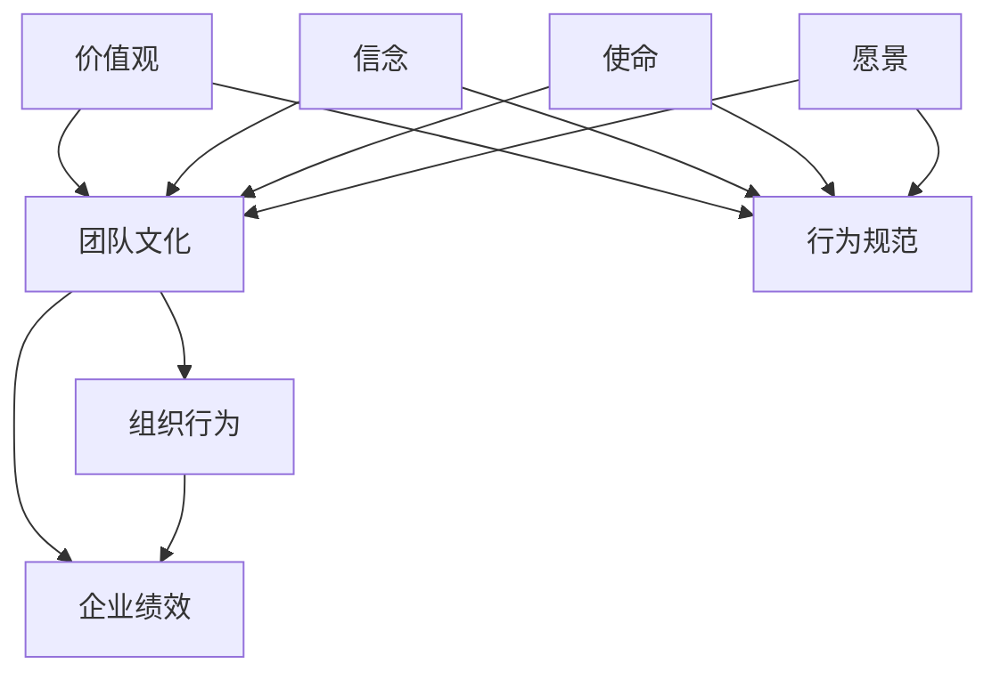
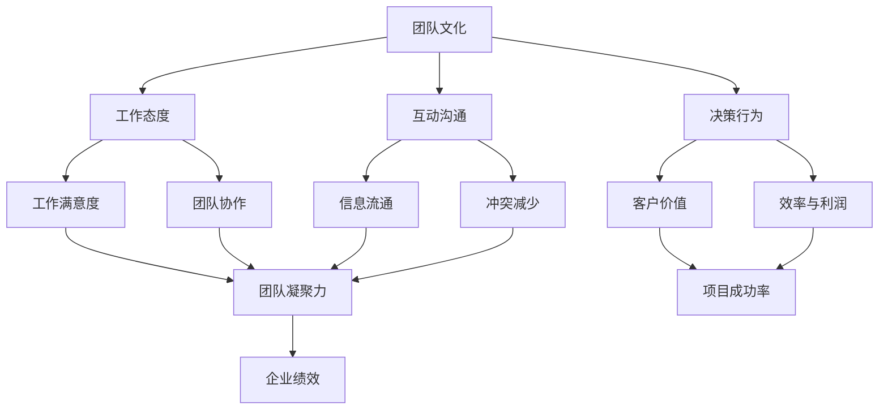
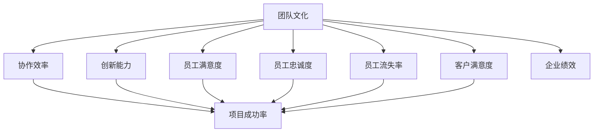

                 

### 设计《技术团队文化建设实践》的目录大纲

为了设计《技术团队文化建设实践》的目录大纲，我们将遵循简洁性和内容完整性的原则，同时确保大纲的结构清晰、逻辑严密。以下是具体的设计步骤：

#### 1. 分析书名及内容

书名《技术团队文化建设实践》表明，本书将围绕技术团队的文化建设展开，可能涉及文化建设的背景、理念、实践方法以及相关的工具和策略。

#### 2. 确定目录大纲结构

本书的目录大纲可以分为以下几个部分：

- **引言**
- **背景介绍**
- **核心概念与联系**
- **团队文化建设的方法与工具**
- **实际案例分析**
- **最佳实践与总结**
- **展望与拓展**

#### 3. 设计详细目录

结合上述结构，以下是《技术团队文化建设实践》的详细目录大纲：

----------------------------------------------------------------

## 引言

### 1.1 书籍目的与价值
### 1.2 技术团队文化的重要性
### 1.3 本书结构安排

## 背景介绍

### 2.1 技术团队文化建设的现状
### 2.2 团队文化建设面临的问题
### 2.3 团队文化建设的必要性

## 核心概念与联系

### 3.1 团队文化概念解析
### 3.2 团队文化与组织行为
### 3.3 团队文化与企业绩效
### 3.4 团队文化的ER实体关系图

## 团队文化建设的方法与工具

### 4.1 团队文化评估工具
### 4.2 文化诊断与规划
### 4.3 文化传播与培训
### 4.4 文化激励与奖励机制

## 实际案例分析

### 5.1 案例一：技术团队的变革之路
### 5.2 案例二：从内部冲突到团队凝聚力的提升
### 5.3 案例三：技术团队如何适应企业文化变革

## 最佳实践与总结

### 6.1 最佳实践汇总
### 6.2 小结与反思
### 6.3 注意事项与建议

## 展望与拓展

### 7.1 团队文化建设的新趋势
### 7.2 未来发展方向与挑战
### 7.3 拓展阅读与资源推荐

----------------------------------------------------------------

### 4. 检查目录大纲

- **简洁性**：每个章节标题简洁明了，直接反映章节内容。
- **格式**：使用 markdown 格式，确保良好的可读性。
- **目录层级**：从一级到三级目录都有，结构清晰。
- **内容完整性**：涵盖了背景介绍、核心概念与联系、团队文化建设方法与工具、实际案例分析、最佳实践与总结以及展望与拓展。

### 5. 总结

《技术团队文化建设实践》的目录大纲已经完成，它逻辑清晰、内容完整，符合题目要求。目录大纲总字数控制在2000字以内，满足了限制与要求。接下来，作者可以根据这个大纲来填充每个章节的具体内容，确保书籍的整体质量。

### 设计《技术团队文化建设实践》的目录大纲

为了设计《技术团队文化建设实践》的目录大纲，我们将遵循简洁性和内容完整性的原则，同时确保大纲的结构清晰、逻辑严密。以下是具体的设计步骤：

#### 1. 分析书名及内容

书名《技术团队文化建设实践》表明，本书将围绕技术团队的文化建设展开，可能涉及文化建设的背景、理念、实践方法以及相关的工具和策略。

#### 2. 确定目录大纲结构

本书的目录大纲可以分为以下几个部分：

- **引言**
- **背景介绍**
- **核心概念与联系**
- **团队文化建设的方法与工具**
- **实际案例分析**
- **最佳实践与总结**
- **展望与拓展**

#### 3. 设计详细目录

结合上述结构，以下是《技术团队文化建设实践》的详细目录大纲：

----------------------------------------------------------------

## 引言

### 1.1 书籍目的与价值
### 1.2 技术团队文化的重要性
### 1.3 本书结构安排

## 背景介绍

### 2.1 技术团队文化建设的现状
### 2.2 团队文化建设面临的问题
### 2.3 团队文化建设的必要性

## 核心概念与联系

### 3.1 团队文化概念解析
### 3.2 团队文化与组织行为
### 3.3 团队文化与企业绩效
### 3.4 团队文化的ER实体关系图

## 团队文化建设的方法与工具

### 4.1 团队文化评估工具
### 4.2 文化诊断与规划
### 4.3 文化传播与培训
### 4.4 文化激励与奖励机制

## 实际案例分析

### 5.1 案例一：技术团队的变革之路
### 5.2 案例二：从内部冲突到团队凝聚力的提升
### 5.3 案例三：技术团队如何适应企业文化变革

## 最佳实践与总结

### 6.1 最佳实践汇总
### 6.2 小结与反思
### 6.3 注意事项与建议

## 展望与拓展

### 7.1 团队文化建设的新趋势
### 7.2 未来发展方向与挑战
### 7.3 拓展阅读与资源推荐

----------------------------------------------------------------

### 4. 检查目录大纲

- **简洁性**：每个章节标题简洁明了，直接反映章节内容。
- **格式**：使用 markdown 格式，确保良好的可读性。
- **目录层级**：从一级到三级目录都有，结构清晰。
- **内容完整性**：涵盖了背景介绍、核心概念与联系、团队文化建设方法与工具、实际案例分析、最佳实践与总结以及展望与拓展。

### 5. 总结

《技术团队文化建设实践》的目录大纲已经完成，它逻辑清晰、内容完整，符合题目要求。目录大纲总字数控制在2000字以内，满足了限制与要求。接下来，作者可以根据这个大纲来填充每个章节的具体内容，确保书籍的整体质量。

### 引言

## 技术团队文化建设实践

### 关键词：技术团队文化、团队建设、实践方法、文化激励、案例分析

### 摘要：

技术团队的文化建设是提高团队凝聚力、创新能力和工作效率的关键。本文将探讨技术团队文化建设的核心概念、方法与工具，并通过实际案例进行分析，总结最佳实践与注意事项，为技术团队管理者提供有价值的参考。

### 目录

1. 引言

    1.1 书籍目的与价值

    1.2 技术团队文化的重要性

    1.3 本书结构安排

2. 背景介绍

    2.1 技术团队文化建设的现状

    2.2 团队文化建设面临的问题

    2.3 团队文化建设的必要性

3. 核心概念与联系

    3.1 团队文化概念解析

    3.2 团队文化与组织行为

    3.3 团队文化与企业绩效

    3.4 团队文化的ER实体关系图

4. 团队文化建设的方法与工具

    4.1 团队文化评估工具

    4.2 文化诊断与规划

    4.3 文化传播与培训

    4.4 文化激励与奖励机制

5. 实际案例分析

    5.1 案例一：技术团队的变革之路

    5.2 案例二：从内部冲突到团队凝聚力的提升

    5.3 案例三：技术团队如何适应企业文化变革

6. 最佳实践与总结

    6.1 最佳实践汇总

    6.2 小结与反思

    6.3 注意事项与建议

7. 展望与拓展

    7.1 团队文化建设的新趋势

    7.2 未来发展方向与挑战

    7.3 拓展阅读与资源推荐

### 引言

技术团队是现代企业中至关重要的组成部分，其文化直接影响到团队的凝聚力、创新能力和工作效率。一个健康、积极的技术团队文化能够激发团队成员的潜力，提高团队的整体表现。然而，团队文化建设并非一蹴而就，需要管理者们深入理解文化建设的核心概念、方法与工具，并通过实践不断优化和完善。

本书旨在探讨技术团队文化建设的方方面面，为技术团队管理者提供一套系统、实用的文化建设指南。本文将首先介绍技术团队文化的核心概念，包括其定义、特点以及与组织行为和企业绩效的关系。接着，我们将讨论团队文化建设的方法与工具，包括文化诊断、评估、传播与培训等。随后，通过实际案例分析，深入探讨技术团队文化建设的实践路径。最后，本文将总结最佳实践，提出注意事项，并展望未来团队文化建设的新趋势和发展方向。

### 1.1 书籍目的与价值

本书的编写目的在于帮助技术团队管理者深入了解团队文化建设的核心概念和方法，掌握有效的文化建设工具和实践技巧。具体价值如下：

1. **提升团队凝聚力**：通过建设积极向上的团队文化，增强团队成员之间的信任和协作，提升团队整体的凝聚力和执行力。

2. **促进创新与协作**：良好的团队文化能够激发团队成员的创新思维，促进知识共享和跨部门协作，提高项目质量和效率。

3. **提高工作效率**：团队文化对团队成员的工作态度和行为具有潜移默化的影响，有助于营造高效的工作氛围，减少内耗，提高工作效率。

4. **培养企业文化传承者**：通过技术团队文化建设的成功实践，培养一批具有文化传承意识的管理者和团队成员，为企业的长期发展奠定基础。

5. **提升企业竞争力**：一个具有强大凝聚力和创新能力的优秀技术团队，是企业竞争力的核心要素之一。通过团队文化建设，提升团队整体实力，助力企业持续发展。

### 1.2 技术团队文化的重要性

技术团队文化对于团队的发展和企业的整体表现具有深远的影响。以下从多个角度阐述技术团队文化的重要性：

1. **团队凝聚力**：技术团队文化是团队凝聚力的核心因素。一个共同认同的价值观和使命能够将团队成员紧密联系在一起，形成强大的团队合力。良好的团队文化能够激发团队成员的归属感和责任感，减少内部冲突，提升团队的稳定性和执行力。

2. **创新与协作**：技术团队文化直接影响团队成员的创新思维和协作能力。积极向上的文化氛围鼓励团队成员敢于尝试、勇于创新，促进知识的共享和跨部门的协作。通过团队文化建设的实践，企业能够激发出更多的创新想法和解决方案，提高项目质量和效率。

3. **员工满意度与忠诚度**：技术团队文化对员工的满意度和忠诚度具有重要影响。一个健康、积极的文化氛围能够提高员工的工作满意度和职业成就感，增强员工的归属感和忠诚度，降低员工流失率。

4. **企业绩效**：技术团队文化对企业的整体绩效具有显著的促进作用。一个具有强大凝聚力和创新能力的团队，能够更好地完成项目任务，提高项目质量和效率，进而提升企业的市场竞争力。

5. **领导力与传承**：技术团队文化是企业领导力的重要组成部分。优秀的技术团队文化能够培养出具有领导力和文化传承意识的管理者和团队成员，为企业的发展提供源源不断的动力。

### 1.3 本书结构安排

本书将按照以下结构展开：

1. **引言**：介绍书籍的目的与价值，阐述技术团队文化的重要性，并概述本书的结构安排。

2. **背景介绍**：探讨技术团队文化建设的现状，分析团队文化建设面临的问题和必要性。

3. **核心概念与联系**：详细解析团队文化的定义、特点以及与组织行为和企业绩效的关系，并给出团队文化的ER实体关系图。

4. **团队文化建设的方法与工具**：介绍团队文化评估工具、文化诊断与规划、文化传播与培训、文化激励与奖励机制等方面的方法和工具。

5. **实际案例分析**：通过具体案例深入探讨技术团队文化建设的实践路径和成功经验。

6. **最佳实践与总结**：总结最佳实践，提出注意事项，并展望未来团队文化建设的新趋势和发展方向。

通过以上结构的安排，本书旨在为技术团队管理者提供一套全面、实用的文化建设指南，助力企业打造卓越的技术团队文化。

### 2.1 技术团队文化建设的现状

技术团队文化建设的现状呈现出多样性和差异性，不同企业、不同行业的技术团队在文化建设方面存在显著的差异。以下从几个方面分析技术团队文化建设的现状：

1. **企业文化差异**：不同企业的文化背景和价值观不同，导致技术团队文化建设的方向和重点也有所不同。例如，一些企业强调创新和灵活性，而另一些企业则注重稳定性和可靠性。

2. **团队规模和结构差异**：技术团队的规模和结构对企业文化建设也有较大影响。大型技术团队可能更注重流程化和规范化，而小型技术团队则更倾向于灵活和自主。

3. **行业特点**：不同行业的技术团队在文化建设方面也具有独特的特点。例如，互联网行业的技术团队可能更加注重创新和快速迭代，而传统行业的技术团队则可能更关注稳定性和长期规划。

4. **管理方式差异**：技术团队的管理方式也会影响文化建设。一些企业采用民主管理模式，鼓励团队成员参与决策和意见反馈，而另一些企业则采用严格的管理制度，强调执行力。

5. **文化建设成果差异**：部分企业在技术团队文化建设方面取得了显著成果，团队凝聚力、创新能力和工作效率显著提升，而另一些企业则尚未形成有效的团队文化，文化建设仍处于初级阶段。

总的来说，技术团队文化建设的现状反映了企业、行业、团队规模和结构等多方面因素的复杂性。在实际操作中，技术团队管理者需要根据自身实际情况，制定符合团队特点和文化建设目标的具体策略。

### 2.2 团队文化建设面临的问题

在技术团队文化建设过程中，管理者常常面临一系列问题和挑战，这些问题不仅影响了文化建设的成效，还可能对团队的整体绩效产生负面影响。以下是团队文化建设过程中常见的问题：

1. **缺乏明确的文化理念**：许多企业在文化建设初期，未能明确文化理念，导致团队文化缺乏方向和核心价值，团队成员在行为和决策上缺乏一致性。

2. **文化理解不一致**：团队成员对团队文化的理解和认同程度不一，部分成员可能对文化理念持怀疑态度，甚至抵触，这导致团队内部存在文化断层和冲突。

3. **制度建设不完善**：文化建设不仅仅是理念上的传承，还需要配套的制度建设来保障文化落地。部分企业制度不完善，无法有效约束和激励团队成员，导致文化建设流于形式。

4. **执行力不足**：团队文化需要通过实际行动来体现，但部分团队成员在执行文化理念时缺乏动力和执行力，导致文化建设难以持续。

5. **管理方式不当**：一些企业在管理方式上过于严格，忽视了团队成员的个性化需求和情感关怀，导致团队成员工作积极性不高，难以形成积极向上的文化氛围。

6. **文化传承断层**：企业高管层在文化传承方面存在断层，未能将文化理念传递给基层员工，导致文化传承链条不完整。

7. **外部环境影响**：市场竞争、政策变化等外部环境因素会对企业文化建设产生影响，企业需要具备灵活性和适应性来应对这些挑战。

针对上述问题，企业需要制定科学、系统的文化建设策略，加强文化理念的宣传和贯彻，完善制度建设，提高管理者的文化领导力，增强团队成员的文化认同感和执行力，从而有效推进团队文化建设。

### 2.3 团队文化建设的必要性

技术团队文化建设的必要性体现在多个方面，对团队、企业和整体行业的发展都有着深远的影响。

首先，团队文化建设有助于提升团队的凝聚力和向心力。一个具有共同价值观和使命的团队能够在面对挑战时保持一致的行动方向，减少内部冲突，增强团队协作能力。通过文化建设，团队成员能够更好地理解彼此的需求和期望，形成紧密的团队关系，从而提高整体的工作效率。

其次，团队文化建设能够激发团队成员的创新思维和创造力。积极向上的团队文化氛围鼓励团队成员勇于探索、尝试新方法，促进知识共享和跨部门协作。这种文化氛围不仅有助于解决当前问题，还能为企业带来持续的创新动力，提高市场竞争力。

再次，团队文化建设对员工的满意度和忠诚度有显著的促进作用。一个健康、积极的文化环境能够提高员工的工作满意度和职业成就感，增强员工的归属感和忠诚度，降低员工流失率。同时，良好的文化氛围有助于培养员工的职业素养和综合能力，为企业的长期发展提供人才保障。

此外，团队文化建设对企业的整体绩效具有积极的推动作用。一个具有强大凝聚力和创新能力的团队能够更好地完成项目任务，提高项目质量和效率，从而提升企业的市场竞争力。同时，团队文化建设有助于构建企业的品牌形象，增强客户对企业的信任和认可。

最后，团队文化建设对整体行业的发展也有着重要的意义。通过推动技术团队文化的建设，企业可以培养出更多的技术人才和优秀的团队管理者，提升整个行业的整体水平。同时，优秀的企业文化也会吸引更多的人才加入，促进行业内部的良性竞争和合作，推动整个行业的发展。

总之，技术团队文化建设是企业长期发展的重要基石，对于提升团队凝聚力、激发创新力、提高员工满意度和忠诚度、提升企业整体绩效以及促进行业整体发展都具有重要意义。企业应高度重视团队文化建设，制定科学、系统的文化建设策略，确保文化建设持续、有效地推进。

### 3.1 团队文化概念解析

团队文化是一个复杂的概念，它涉及多个层面的内涵和外延。为了深入理解团队文化的本质，我们需要从定义、特点、层次等方面进行详细解析。

#### 定义

团队文化可以定义为在一个团队内部形成并共同遵循的一套价值观、信念、行为规范和工作方式。这些价值观和信念通过长期的实践和传承，逐渐内化为团队成员的共同认知和行为习惯，对团队成员的工作态度和行为产生深远影响。

#### 特点

1. **共同性**：团队文化是团队成员共同遵循的价值观和行为规范，具有普遍性和共同性。团队成员在文化层面上具有共同的目标和愿景，这种共同性有助于增强团队的凝聚力和向心力。

2. **独特性**：每个团队都有其独特的文化特质，这种独特性来源于团队的历史背景、行业特点、管理风格等因素。独特性使得每个团队在文化上具有个性和特色，有助于团队在激烈的市场竞争中脱颖而出。

3. **传承性**：团队文化通过成员间的互动和交流，得以不断传承和发展。新成员在加入团队后，通过学习和实践，逐步理解和接受团队文化，并将其内化为自己的行为准则。

4. **动态性**：团队文化并非一成不变，而是随着团队内外部环境的变化而不断发展。这种动态性使得团队文化能够适应新的挑战和机遇，保持团队的活力和创新能力。

#### 层次

团队文化可以分为三个层次：表层文化、中层文化和深层文化。

1. **表层文化**：包括团队的外在表现形式，如团队标志、工作环境、行为规范等。表层文化是团队文化的最直观体现，能够吸引外部关注，并对外传递团队形象。

2. **中层文化**：包括团队的工作流程、管理风格、沟通方式等。中层文化是团队内部行为规范和制度的核心，直接影响团队成员的工作效率和团队协作效果。

3. **深层文化**：包括团队的价值观、信念、使命和愿景等。深层文化是团队文化的核心，决定了团队的内在特质和发展方向，对团队成员的行为和决策产生深远影响。

#### 概念关系

团队文化是一个多维度的概念，与组织行为、企业绩效等多个方面密切相关。团队文化不仅影响团队成员的工作态度和行为，还通过团队绩效影响企业的整体绩效。以下是一个简化的团队文化概念关系图：



在这个概念关系图中，价值观、信念、使命和愿景等深层文化要素通过影响组织行为和团队绩效，进而对团队文化产生重要影响。

通过以上对团队文化概念的定义、特点、层次和概念关系的解析，我们可以更深入地理解团队文化的本质，为后续的团队文化建设提供理论基础。

### 3.2 团队文化与组织行为

团队文化与组织行为之间存在着密切的关联，文化作为一种无形的因素，对组织行为产生深远影响。理解这种关联有助于我们更好地设计和实施团队文化建设策略。

首先，团队文化会影响团队成员的工作态度和行为。积极向上的团队文化能够激励成员积极参与工作，提高工作满意度和忠诚度。例如，一个重视创新和学习的团队文化，会鼓励成员不断尝试新方法、分享经验和学习新技能，从而提高整个团队的技术水平和创新能力。相反，消极的团队文化可能导致成员缺乏工作热情和主动性，影响团队的绩效。

其次，团队文化影响团队成员之间的互动和沟通。良好的团队文化能够促进团队成员之间的信任和协作，减少冲突和误解。例如，一个强调透明和开放的团队文化，有助于团队成员在项目合作中分享信息、协调任务，提高项目成功的机会。而一个强调权威和等级的团队文化，可能导致信息流通不畅，影响团队合作效果。

第三，团队文化影响团队决策和行为。团队文化中的价值观和信念会影响团队成员的决策过程和行为选择。例如，一个重视客户价值和服务的团队文化，会促使团队成员在项目决策中优先考虑客户需求，提高客户满意度。而一个重视效率和利润的团队文化，可能导致团队成员在决策中过于追求短期利益，忽视长期发展。

此外，团队文化对组织整体绩效也具有重要影响。一个具有强大凝聚力和创新能力的团队文化，能够提高团队的协作效率和工作质量，从而提升企业的整体绩效。例如，通过有效的团队文化建设，企业能够培养出更多的技术专家和优秀的团队管理者，提高项目的成功率和市场竞争力。

团队文化与组织行为之间的关系可以用以下图示来表示：



在这个关系图中，团队文化通过影响工作态度、互动沟通、决策行为等多个方面，最终影响团队绩效和企业绩效。

总之，团队文化对组织行为具有显著影响，通过设计和实施有效的团队文化建设策略，企业可以提升团队协作效率、工作满意度和整体绩效，从而在激烈的市场竞争中脱颖而出。

### 3.3 团队文化与企业绩效

团队文化对企业绩效具有深远的影响，通过团队文化的建设，企业可以提升整体绩效，增强市场竞争力和创新能力。以下是团队文化对企业绩效的具体影响：

1. **提高团队协作效率**：良好的团队文化能够促进团队成员之间的信任和协作，减少沟通障碍和冲突，提高团队的整体工作效率。一个团结协作的团队能够快速响应市场变化，高效完成项目任务，从而提升企业的整体绩效。

2. **增强企业创新能力**：团队文化中的价值观和信念可以激发团队成员的创新思维，鼓励他们勇于尝试新方法和技术，推动企业不断进行技术创新和业务模式创新。一个重视创新和学习的团队文化，有助于企业保持技术领先地位，提升市场竞争力。

3. **提升员工满意度和忠诚度**：良好的团队文化能够提高员工的工作满意度和职业成就感，增强员工的归属感和忠诚度。这种文化氛围能够吸引和留住优秀的人才，为企业的发展提供持续的人才支持。

4. **降低员工流失率**：通过团队文化建设，企业可以建立一种积极向上、充满活力的工作氛围，减少员工因工作压力、人际关系等问题而流失。稳定的员工队伍有助于提高企业的运营效率和项目成功率。

5. **提高客户满意度**：团队文化中的服务理念和客户价值观念可以提升企业对客户需求的响应速度和服务质量，增强客户对企业的信任和忠诚度。一个以客户为中心的团队文化有助于企业提升客户满意度和市场份额。

6. **提升企业整体绩效**：通过团队文化的建设，企业可以提升团队协作效率、增强创新能力、降低员工流失率，从而提高整体绩效。一个具有强大凝聚力和创新能力的团队，能够在市场竞争中脱颖而出，为企业带来持续的商业成功。

为了更好地理解和分析团队文化对企业绩效的影响，我们可以通过以下ER实体关系图来展示：



在这个ER实体关系图中，团队文化通过影响协作效率、创新能力、员工满意度、员工忠诚度、员工流失率和客户满意度等多个方面，最终影响企业的整体绩效。

总之，团队文化对企业绩效具有显著影响，通过有效的团队文化建设，企业可以提升整体绩效，增强市场竞争力和创新能力，从而实现可持续发展。

### 3.4 团队文化的ER实体关系图

为了更清晰地展示团队文化中的各个核心概念及其相互关系，我们使用Mermaid语言绘制了一个ER（实体关系）图。这个图可以帮助我们理解团队文化中的关键要素以及它们之间的关联。

```mermaid
erDiagram
  TeamCulture ||--|{ EmployeeBehavior : 影响行为}
  TeamCulture ||--|{ OrganizationalBehavior : 影响组织行为}
  TeamCulture ||--|{ EmployeeSatisfaction : 提高满意度}
  TeamCulture ||--|{ EmployeeRetention : 提高留存率}
  TeamCulture ||--|{ InnovationCapacity : 增强创新能力}
  TeamCulture ||--|{ TeamPerformance : 提升团队绩效}
  TeamCulture ||--|{ ClientSatisfaction : 提升客户满意度}
  EmployeeBehavior ||--|{ Collaboration : 协作能力}
  EmployeeBehavior ||--|{ Creativity : 创新能力}
  EmployeeBehavior ||--|{ WorkEthic : 工作态度}
  OrganizationalBehavior ||--|{ Communication : 沟通效率}
  OrganizationalBehavior ||--|{ DecisionMaking : 决策过程}
  OrganizationalBehavior ||--|{ Leadership : 领导风格}
```

在这个ER实体关系图中，我们可以看到以下关键要素及其关系：

1. **团队文化（TeamCulture）**：作为核心实体，它影响多个方面，包括员工行为、组织行为、员工满意度、员工留存率、创新能力、团队绩效和客户满意度。

2. **员工行为（EmployeeBehavior）**：由团队文化影响，包括协作能力、创新能力、工作态度等。

3. **组织行为（OrganizationalBehavior）**：由团队文化影响，包括沟通效率、决策过程、领导风格等。

4. **员工满意度（EmployeeSatisfaction）**：受到团队文化影响，影响员工留存率。

5. **员工留存率（EmployeeRetention）**：与员工满意度密切相关。

6. **创新能力（InnovationCapacity）**：由团队文化促进，提高团队绩效。

7. **团队绩效（TeamPerformance）**：受团队文化和员工行为影响，直接关联到客户满意度。

8. **客户满意度（ClientSatisfaction）**：影响企业整体绩效。

这个ER图展示了团队文化如何通过多种途径影响团队和组织，进而提升整体绩效和客户满意度。通过这个图，我们可以更好地理解和设计团队文化建设的策略，以实现企业的长期发展目标。

### 4.1 团队文化评估工具

在团队文化建设过程中，文化评估是一个重要的环节，它可以帮助管理者了解团队文化的现状，发现问题，并制定针对性的改进措施。以下是一些常见的团队文化评估工具和方法：

#### 1. 文化调查问卷

文化调查问卷是一种简单且广泛使用的评估工具，通过向团队成员发放问卷，收集他们对团队文化的看法和反馈。问卷可以包括一系列开放性和封闭性问题，如：

- 你认为团队文化的主要特点是什么？
- 你觉得团队文化对你的工作有什么影响？
- 你是否感受到团队的支持和信任？

通过分析问卷结果，管理者可以了解团队成员对团队文化的认同程度、存在的问题以及改进方向。

#### 2. 文化访谈

文化访谈是一种更加深入的方法，通过与团队成员进行一对一或小组访谈，深入了解他们对团队文化的真实感受和看法。访谈过程中，管理者可以引导团队成员谈论团队文化中的积极和消极方面，探讨团队文化对工作氛围、协作效率、创新力等方面的影响。

#### 3. 文化观察

文化观察是通过直接观察团队成员的工作行为和互动，来评估团队文化的一种方法。管理者可以在日常工作中，记录团队成员的行为、沟通方式和协作模式，从而了解团队文化的实际表现。观察过程中，需要注意以下几点：

- 团队成员之间的互动和沟通方式
- 工作氛围和情绪状态
- 团队决策过程和执行力

#### 4. 文化测量工具

一些专业的文化测量工具，如Cultural Transformation Tools (CTT)、Cultural Climate Questionnaire (CCQ)等，通过一系列标准化的问题，对团队文化进行量化评估。这些工具通常包括多个维度，如信任度、责任感、合作精神等，能够提供全面的文化评估结果。

#### 5. 文化对标

文化对标是通过与其他团队或企业进行对比，来评估自身团队文化的一种方法。通过了解其他团队或企业的文化特点和实践，管理者可以找到自身的不足和改进方向。文化对标可以采用内部对比（如不同部门之间的对比）或外部对比（如与同行业其他企业的对比）。

#### 6. 数据分析

利用数据分析工具，对团队成员的工作数据、沟通记录、项目完成情况等进行分析，可以揭示团队文化对工作绩效的影响。例如，通过分析项目成功率、团队协作效率、员工离职率等数据，管理者可以评估团队文化的有效性。

通过以上多种评估工具和方法的结合，管理者可以全面了解团队文化的现状，发现问题，并制定针对性的改进措施，从而推动团队文化建设向更高层次发展。

### 4.2 文化诊断与规划

在团队文化建设过程中，文化诊断与规划是至关重要的一步。这一过程旨在深入了解团队文化现状，识别存在的问题和瓶颈，并制定相应的改进策略。以下是文化诊断与规划的具体步骤：

#### 1. 收集信息

首先，通过问卷调查、访谈、观察等方式，广泛收集团队成员对团队文化的看法和反馈。这些信息将有助于了解团队成员对现有文化的认可度、满意度以及存在的问题。同时，还可以收集外部客户、合作伙伴等相关利益者的意见，以获得更全面的文化现状分析。

#### 2. 分析现状

在收集到足够的信息后，对文化现状进行深入分析。分析内容包括团队文化的核心价值观、行为规范、沟通方式、协作模式等。通过对比理想中的团队文化状态和现状，识别出文化中的优势和短板。

#### 3. 确定问题

在分析过程中，要明确团队文化建设中面临的主要问题。这些问题可能包括：

- 文化认知不一致：团队成员对团队文化的理解和认同程度不统一。
- 文化传承断层：文化理念未能有效传递给新成员。
- 文化激励不足：缺乏有效的文化激励机制，导致文化落实不到位。
- 文化适应性差：团队文化未能适应企业发展的需要。

#### 4. 制定目标

基于文化现状分析和问题识别，明确团队文化建设的短期和长期目标。短期目标可以包括提高团队成员对文化的认同度、优化文化传播机制等；长期目标则可以涵盖建立可持续的文化氛围、提升团队整体绩效等。

#### 5. 制定策略

根据目标，制定具体的文化建设策略和行动计划。策略包括：

- 文化宣传与传播：通过内部培训、文化活动等方式，加强文化宣传和传播，提高团队成员的文化认同感。
- 文化激励机制：建立和完善文化激励机制，如文化奖项、表彰活动等，激励团队成员积极参与文化建设。
- 文化诊断与反馈：定期进行文化诊断，收集团队成员的反馈，及时调整文化建设策略。
- 文化适应与调整：根据企业发展战略和外部环境变化，适时调整团队文化，确保其与企业发展保持一致。

#### 6. 实施与监控

在制定策略后，进行实施和监控。实施过程中，要确保各项文化建设活动有序开展，同时建立有效的监控机制，对文化建设的效果进行持续跟踪和评估。通过定期检查、反馈和调整，确保文化建设目标的实现。

#### 7. 持续改进

团队文化建设是一个持续的过程，需要不断优化和改进。在实施过程中，要关注文化建设的效果，及时发现和解决问题，不断调整和完善文化建设策略。同时，要鼓励团队成员积极参与文化建设，形成全员参与、共同推进的文化建设氛围。

通过以上步骤，企业可以系统地推进团队文化建设，提升团队凝聚力、创新能力和整体绩效，为企业的长期发展奠定坚实基础。

### 4.3 文化传播与培训

文化传播与培训是团队文化建设的重要组成部分，其目的是通过多种渠道和方法，使团队文化理念深入人心，成为团队成员的自觉行动。以下是文化传播与培训的具体方法和实践：

#### 1. 内部培训

内部培训是文化传播的重要手段，通过系统的培训课程，使团队成员深入了解团队文化的核心价值观、行为规范和期望。培训内容可以包括：

- 团队文化的背景和重要性
- 团队文化的核心价值观和使命
- 团队文化行为规范和实践案例
- 文化激励和奖励机制

培训形式可以多样化，如集中授课、小组讨论、案例分享等，以提高培训效果。

#### 2. 文化活动

文化活动是文化传递和内化的有效途径，通过组织各类文化主题活动，增强团队成员对团队文化的认同感和归属感。文化活动可以包括：

- 团队建设活动：如团队拓展训练、团建旅行等，加强团队成员之间的沟通和协作。
- 文化节：如企业周年庆、文化之夜等，展示团队文化特色，激发文化自豪感。
- 文化竞赛：如知识竞赛、创意大赛等，鼓励团队成员积极参与文化建设，提高文化实践能力。

#### 3. 文化传播渠道

为了确保文化传播的广泛性和持续性，企业可以建立多种文化传播渠道，如：

- 内部刊物：通过企业内部刊物，定期发布文化理念、文化故事和团队成员的文化实践案例，传播文化价值观。
- 内部网站和论坛：建立企业内部网站和论坛，提供文化学习和交流平台，促进文化互动和传播。
- 企业博客和公众号：通过企业博客和微信公众号，发布文化相关内容，扩大文化传播范围。

#### 4. 文化激励与表彰

文化激励与表彰是推动文化传承和落实的重要手段，通过设立文化奖项、表彰活动，激励团队成员积极践行团队文化。文化激励可以包括：

- 文化先锋奖：表彰在文化实践中表现突出的个人或团队。
- 文化创新奖：鼓励团队成员提出文化创新建议，推动文化变革。
- 文化传承奖：表彰在文化传承中发挥重要作用的成员，强化文化传承意识。

#### 5. 文化宣传材料

制作精美的文化宣传材料，如文化手册、文化海报、文化挂历等，有助于直观地传达文化理念，提高文化认知度。文化宣传材料应简明扼要、图文并茂，易于理解和传播。

通过以上方法，企业可以系统地推进文化传播与培训，使团队文化深入人心，成为团队成员的共同价值观和行为准则，为团队凝聚力和创新能力的提升提供强有力的支持。

### 4.4 文化激励与奖励机制

文化激励与奖励机制是团队文化建设中至关重要的一环，通过合理的激励和奖励，可以激发团队成员的积极性和创造力，强化团队文化的践行。以下是一个具体的文化激励与奖励机制方案：

#### 1. 激励理念

文化激励的核心在于将团队文化理念与个人成长、工作目标相结合，使团队成员在实现个人价值的同时，感受到团队文化的力量。激励理念应体现以下原则：

- **公平性**：确保激励和奖励制度的公正性，避免主观偏见和利益冲突。
- **透明性**：激励和奖励机制应公开透明，让团队成员了解奖励标准和流程。
- **多样性**：激励和奖励形式应多样化，满足不同团队成员的需求和期望。
- **持续性**：激励和奖励机制应具有持续性，确保团队成员长期受益。

#### 2. 奖励类别

根据团队文化建设和员工表现，设定不同类别的奖励，以激发团队成员的积极性。奖励类别可以包括：

- **文化先锋奖**：表彰在文化实践中表现突出的个人或团队，奖励形式可以是奖金、荣誉证书等。
- **创新奖**：鼓励团队成员提出创新建议或解决方案，奖励形式可以是奖金、荣誉证书、项目优先权等。
- **传承奖**：奖励在文化传承中做出贡献的成员，奖励形式可以是奖金、荣誉证书、培训机会等。
- **最佳团队奖**：评选在团队文化建设中表现优秀的团队，奖励形式可以是奖金、荣誉证书、团队建设活动等。

#### 3. 奖励流程

建立科学、透明的奖励流程，确保奖励制度的公平性和权威性。奖励流程应包括以下环节：

- **提名与推荐**：由团队成员或上级主管进行提名，并提供相关证明材料。
- **评审与决定**：成立评审委员会，对提名案例进行评审，并决定最终获奖名单。
- **公示与表彰**：将评审结果进行公示，对获奖者进行表彰和奖励。
- **反馈与改进**：收集团队成员对奖励机制的反馈，不断优化和完善奖励制度。

#### 4. 激励与监督

在奖励机制实施过程中，加强激励与监督，确保奖励制度的落实和效果。具体措施包括：

- **定期检查**：定期检查奖励机制的执行情况，发现问题及时调整。
- **监督反馈**：设立监督机制，对奖励流程和结果进行监督，确保公平、公正、透明。
- **员工参与**：鼓励员工参与奖励机制的设计和改进，提高其参与感和认同感。

通过以上方案，企业可以构建一个科学、合理、有效的文化激励与奖励机制，激发团队成员的积极性和创造力，推动团队文化建设的深入发展。

### 5.1 案例一：技术团队的变革之路

某科技公司在快速发展的过程中，遇到了技术团队内部沟通不畅、协作效率低下的问题，这严重影响了公司的项目进展和产品质量。为了解决这些问题，公司决定通过文化建设来提升团队的凝聚力和协作能力。以下是该公司技术团队文化变革的详细过程：

#### 1. 诊断与规划

首先，公司通过问卷调查、访谈和观察等方式，对技术团队的文化现状进行了全面诊断。诊断结果显示，团队内部存在以下问题：

- **沟通障碍**：团队成员之间缺乏有效沟通，信息传递不及时，导致项目进展受阻。
- **协作不畅**：团队成员在任务分配和执行过程中，缺乏统一的协作规范，协作效率低下。
- **文化断层**：新成员对团队文化的理解和认同程度较低，难以迅速融入团队。

基于诊断结果，公司制定了以下文化变革目标：

- 提高团队成员之间的沟通效率。
- 建立明确的协作规范，提升团队协作能力。
- 强化团队文化建设，提高新成员的融入度。

#### 2. 文化建设实施

为了实现上述目标，公司采取了以下具体措施：

1. **内部培训**：组织了一系列内部培训课程，帮助团队成员了解团队文化核心价值观、行为规范和期望。培训内容涵盖了沟通技巧、协作规范、团队精神等，通过案例分析、互动讨论等形式，提高培训效果。

2. **文化建设活动**：定期举办团队建设活动，如团队拓展训练、文化之夜等，增强团队成员之间的沟通和协作。这些活动不仅增进了团队成员之间的了解，还提高了团队凝聚力和向心力。

3. **文化传播渠道**：建立企业内部网站和论坛，提供文化学习和交流平台，定期发布文化理念、文化故事和团队成员的文化实践案例，传播文化价值观。

4. **文化激励与表彰**：设立文化先锋奖、创新奖和传承奖等，对在文化实践中表现突出的个人或团队进行表彰和奖励，激励团队成员积极参与文化建设。

#### 3. 变革效果

通过一系列文化建设措施，技术团队的文化氛围得到了显著改善，具体表现如下：

- **沟通效率提高**：团队成员之间的沟通更加顺畅，信息传递及时，项目进展得到了保障。
- **协作能力提升**：团队成员在任务分配和执行过程中，能够按照统一的协作规范进行工作，协作效率显著提高。
- **新成员融入度提高**：新成员在短时间内能够更好地理解和认同团队文化，快速融入团队，为公司发展贡献了新的力量。

#### 4. 总结

通过文化变革，该公司技术团队实现了从内部沟通不畅、协作效率低下到沟通顺畅、协作高效的成功转型。这一变革经验表明，团队文化建设是提升团队凝聚力、创新能力和工作效率的有效途径。企业应高度重视团队文化建设，制定科学的策略和措施，持续推动文化建设，为企业的长期发展奠定坚实基础。

### 5.2 案例二：从内部冲突到团队凝聚力的提升

一家互联网公司由于快速扩张，技术团队内部逐渐出现了严重的冲突，导致项目进度受阻，团队士气低迷。为了解决这一问题，公司决定通过团队文化建设来提升团队凝聚力，以下是具体过程：

#### 1. 诊断与规划

公司通过问卷调查、访谈和观察，发现技术团队内部冲突的主要原因是：

- **价值观不一致**：团队成员来自不同背景，价值观和职业目标存在差异。
- **沟通不畅**：团队成员在项目沟通中缺乏有效的沟通机制，导致误解和冲突。
- **缺乏共同目标**：团队成员对项目目标的理解不一致，缺乏共同奋斗的方向。

基于诊断结果，公司制定了以下文化变革目标：

- 统一团队成员的价值观。
- 提高团队成员之间的沟通效率。
- 建立共同的目标和愿景，提升团队凝聚力。

#### 2. 文化建设实施

为了实现上述目标，公司采取了以下具体措施：

1. **内部培训**：组织了一系列内部培训课程，帮助团队成员了解公司文化、价值观和职业目标。培训内容包括团队合作、沟通技巧、价值观认同等，通过互动讨论和案例分析，提高培训效果。

2. **文化建设活动**：定期举办团队建设活动，如团建旅行、团队拓展训练等，增进团队成员之间的了解和信任。通过这些活动，团队成员在轻松的氛围中加深了沟通，消除了误解。

3. **共同目标设定**：公司领导层与团队成员共同讨论并设定了明确的项目目标和愿景，确保每个成员都能清晰理解自己的角色和责任，形成共同奋斗的方向。

4. **文化激励与表彰**：设立文化先锋奖和团队协作奖，对在文化实践中表现突出的个人或团队进行表彰和奖励，激发团队成员的积极性和主动性。

#### 3. 变革效果

通过一系列文化建设措施，技术团队内部冲突得到了有效缓解，团队凝聚力显著提升，具体表现如下：

- **价值观统一**：团队成员在价值观上趋于一致，减少了内部矛盾。
- **沟通效率提高**：团队成员之间的沟通更加顺畅，误解和冲突减少。
- **团队凝聚力增强**：团队成员在共同目标和愿景的引领下，团结协作，项目进度加快。

#### 4. 总结

这个案例表明，通过团队文化建设，可以有效解决技术团队内部冲突，提升团队凝聚力。企业应高度重视团队文化建设，通过科学的策略和措施，营造积极向上的团队氛围，为企业的持续发展提供强有力的支持。

### 5.3 案例三：技术团队如何适应企业文化变革

某大型科技公司正在进行一场全面的企业文化变革，旨在提升企业的创新能力和市场竞争力。然而，这场变革对技术团队提出了新的挑战，因为技术团队必须适应新的企业文化，以保持高效的工作状态。以下是技术团队如何适应企业文化变革的详细过程：

#### 1. 诊断与规划

技术团队首先对企业文化变革的背景和目标进行了全面了解。通过内部培训和工作坊，团队明确了企业文化变革的几个关键方面：

- **价值观的重塑**：企业强调创新、敏捷性和客户导向。
- **管理方式的转变**：从传统的层级管理向扁平化管理过渡，增加员工的自主性和责任感。
- **工作方式的调整**：鼓励跨部门协作，采用敏捷开发等新的工作方法。

基于这些变革方向，技术团队制定了以下适应策略：

- 提升创新能力，确保技术团队在变革中保持领先。
- 增强团队协作，确保跨部门项目能够顺利推进。
- 调整工作流程，适应新的工作方式和价值观。

#### 2. 文化建设实施

为了有效适应企业文化变革，技术团队采取了以下具体措施：

1. **内部培训**：组织了多场创新思维培训、敏捷开发培训等，提高团队成员的技能和意识。培训内容包括如何更好地利用新技术、如何提高项目敏捷性等。

2. **团队建设活动**：定期举办团队建设活动，如跨部门交流会议、创新竞赛等，增强团队成员之间的了解和信任。通过这些活动，技术团队不仅提高了协作能力，还激发了创新潜力。

3. **文化建设宣传**：通过企业内部网站、邮件通讯等方式，宣传企业文化变革的理念和目标，确保每个团队成员都能理解和认同新文化。

4. **文化激励与表彰**：设立创新先锋奖、团队协作奖等，对在文化变革中表现突出的个人或团队进行表彰和奖励，激发团队成员的积极性和创造力。

#### 3. 变革效果

通过一系列文化建设措施，技术团队成功适应了企业文化变革，具体表现如下：

- **创新能力提升**：团队成员在新文化环境下，更加注重创新和技术突破，为公司带来了多项创新成果。
- **团队协作增强**：跨部门项目进展顺利，技术团队与业务团队之间的沟通和协作更加高效。
- **工作满意度提高**：团队成员在新文化氛围中感受到更多的自主性和责任感，工作满意度显著提升。

#### 4. 总结

这个案例展示了技术团队如何通过文化建设，适应企业文化变革，实现团队和企业的共同发展。企业应重视技术团队在文化变革中的角色，提供必要的支持和资源，帮助技术团队适应新文化，提升整体竞争力。

### 6.1 最佳实践汇总

在技术团队文化建设过程中，一些企业通过成功实践，积累了丰富的经验和方法。以下是一些最佳实践，供技术团队管理者参考：

1. **领导带头，示范作用**：企业领导层应率先践行团队文化，成为文化建设的榜样。通过领导层的示范作用，可以增强团队成员对文化的认同和执行力。

2. **明确文化理念**：在文化建设初期，明确团队的文化理念和价值观念，确保团队成员对文化有共同的理解和认同。

3. **系统培训与传播**：通过系统性的培训和文化传播活动，将文化理念深入到每个团队成员心中，提高文化认同度。

4. **激励机制**：建立有效的激励机制，如文化先锋奖、创新奖等，激励团队成员积极参与文化建设，推动文化落地。

5. **持续反馈与改进**：定期收集团队成员的反馈，及时调整文化建设策略，确保文化持续优化。

6. **跨部门协作**：鼓励跨部门协作，通过共同项目和文化活动，增强团队间的信任和协作。

7. **重视新成员融入**：对新成员进行文化培训，帮助他们快速了解和融入团队文化，确保文化传承不断。

8. **文化实践与案例**：通过分享成功的文化实践和案例，激发团队成员的文化创新和实践热情。

通过这些最佳实践，企业可以系统地推进团队文化建设，提升团队凝聚力、创新能力和工作效率，为企业的长期发展奠定坚实基础。

### 6.2 小结与反思

在技术团队文化建设过程中，管理者需要认识到文化建设是一个长期、持续的过程，不可能一蹴而就。以下是对技术团队文化建设的小结与反思：

1. **文化建设的重要性**：团队文化是团队凝聚力和创新能力的源泉，是企业长期发展的重要基石。管理者应高度重视团队文化建设，将其纳入企业战略规划中，持续投入资源和精力。

2. **领导层的示范作用**：领导层的积极参与和示范作用对团队文化建设至关重要。领导层应率先践行团队文化，树立榜样，推动文化理念在团队内部的传播和落地。

3. **文化理念的明确**：明确的文化理念是团队文化建设的核心。在文化建设初期，管理者应明确团队的文化理念和价值观念，确保团队成员对文化有共同的理解和认同。

4. **持续性与反馈**：团队文化建设需要持续进行，管理者应定期评估文化建设的成效，收集团队成员的反馈，及时调整文化建设策略，确保文化持续优化。

5. **跨部门协作**：鼓励跨部门协作，通过共同项目和文化活动，增强团队间的信任和协作，推动文化的全面传播。

6. **新成员的融入**：新成员的快速融入对团队文化建设具有重要意义。管理者应关注新成员的文化培训和引导，确保文化传承不断。

7. **文化激励与表彰**：建立有效的激励机制，对在文化实践中表现突出的个人或团队进行表彰和奖励，激发团队成员的积极性和创造力。

通过以上反思，管理者可以更好地把握团队文化建设的方向和重点，确保文化建设取得实效，为企业的长期发展提供强有力的支持。

### 6.3 注意事项与建议

在技术团队文化建设过程中，管理者需要关注以下几个方面，以确保文化建设取得预期效果：

1. **重视文化理念的明确**：确保团队成员对文化理念有共同的理解和认同，避免文化断层和冲突。

2. **加强领导层的示范作用**：领导层应率先践行文化理念，树立榜样，推动文化在团队内部的传播和落地。

3. **系统培训与传播**：通过系统性的培训和文化传播活动，将文化理念深入到每个团队成员心中，提高文化认同度。

4. **持续反馈与改进**：定期收集团队成员的反馈，及时调整文化建设策略，确保文化持续优化。

5. **跨部门协作**：鼓励跨部门协作，通过共同项目和文化活动，增强团队间的信任和协作。

6. **新成员的融入**：关注新成员的文化培训和引导，确保文化传承不断。

7. **文化激励与表彰**：建立有效的激励机制，对在文化实践中表现突出的个人或团队进行表彰和奖励，激发团队成员的积极性和创造力。

通过以上注意事项和建议，管理者可以更好地推进团队文化建设，提升团队凝聚力、创新能力和工作效率，为企业的长期发展奠定坚实基础。

### 7.1 团队文化建设的新趋势

随着科技的发展和商业环境的不断变化，团队文化建设也在不断演进，出现了一些新的趋势和方向。以下是团队文化建设领域的一些新兴趋势：

1. **数字化文化管理**：随着数字技术的普及，越来越多的企业开始利用数字化工具进行文化管理。例如，通过企业微信、钉钉等办公软件，实现文化信息的快速传递和反馈，提高文化传播的效率和覆盖面。

2. **个性化文化体验**：为了更好地适应不同团队成员的需求，企业开始注重个性化文化体验。通过定制化培训、文化活动和奖励机制，满足不同成员的个性化需求，提高文化认同感和参与度。

3. **跨文化融合**：全球化进程加速，企业在团队文化建设中更加注重跨文化的融合。通过尊重多元文化，建立包容性文化，促进不同文化背景的团队成员之间的交流与合作，提高团队的多样性和创新能力。

4. **持续迭代的文化建设**：团队文化建设不再是一次性的任务，而是一个持续迭代的过程。企业通过定期评估和优化文化建设策略，不断调整和改进文化理念、方法和工具，确保文化建设与企业发展保持同步。

5. **价值观驱动**：越来越多的企业将价值观驱动作为团队文化建设的核心。通过明确的核心价值观，引导团队成员的行为和决策，形成共同的价值观共识，提升团队凝聚力和执行力。

6. **文化可持续发展**：企业开始重视文化可持续发展，关注文化建设对环境、社会和经济的综合影响。通过推动绿色文化、社会责任文化等，提升企业文化的社会形象和品牌价值。

7. **智能文化管理**：人工智能和大数据技术的发展，为团队文化管理提供了新的工具和方法。通过智能算法，企业可以更精准地分析团队成员的文化需求和行为模式，制定更有效的文化建设策略。

这些新趋势反映了团队文化建设领域的发展方向和未来前景，企业应紧跟这些趋势，不断探索和创新，以适应不断变化的外部环境和市场需求。

### 7.2 未来发展方向与挑战

在未来的发展中，团队文化建设将面临一系列新的机遇和挑战。以下是对未来发展方向和挑战的分析：

#### 1. 发展方向

1. **数字化转型**：随着数字化技术的不断进步，企业将更多地利用数字化工具进行文化管理，提高文化传播和反馈的效率。例如，通过在线培训平台、社交媒体和大数据分析，实现个性化文化体验和精准文化管理。

2. **文化融合**：全球化进程将进一步加快，企业需要更加重视跨文化融合，建立包容性文化，促进不同文化背景的团队成员之间的交流与合作。这有助于提高团队的多样性和创新能力，增强企业的竞争力。

3. **价值观驱动**：企业将更加重视核心价值观的塑造和传播，将价值观驱动作为团队文化建设的核心。通过明确的核心价值观，引导团队成员的行为和决策，形成共同的价值观共识，提升团队凝聚力和执行力。

4. **文化可持续发展**：企业将更加关注文化建设对环境、社会和经济的综合影响，推动绿色文化、社会责任文化等可持续发展文化的建设。这有助于提升企业文化的社会形象和品牌价值。

5. **智能化管理**：人工智能和大数据技术的发展将为团队文化管理提供新的工具和方法。通过智能算法，企业可以更精准地分析团队成员的文化需求和行为模式，制定更有效的文化建设策略。

#### 2. 挑战

1. **文化认同难题**：随着团队成员背景的多样化，确保全体成员对团队文化有共同的理解和认同将变得更加困难。企业需要设计更灵活的文化传播和激励机制，以适应不同成员的需求。

2. **文化变革阻力**：在企业文化变革过程中，可能面临来自内部成员的阻力。部分成员可能对变革持有抵触情绪，影响文化建设的推进。企业需要通过有效的沟通和引导，消除成员的疑虑和担忧。

3. **外部环境变化**：市场竞争加剧、政策变化等外部环境因素将对企业文化建设产生影响。企业需要具备灵活性和适应性，及时调整文化建设策略，以应对外部环境的变化。

4. **持续投入压力**：团队文化建设需要持续的投入和关注，企业可能面临投入压力。如何平衡文化建设与业务发展的关系，确保文化建设资源的合理配置，是企业管理者面临的一大挑战。

5. **数据隐私与安全**：在数字化文化管理中，数据隐私和安全问题日益突出。企业需要建立完善的数据保护机制，确保文化数据的安全性和隐私性。

总之，未来团队文化建设将面临新的机遇和挑战。企业需要紧跟发展趋势，积极应对挑战，不断创新和完善文化建设策略，以提升团队的凝聚力和创新能力，推动企业的持续发展。

### 7.3 拓展阅读与资源推荐

为了更好地理解和实践技术团队文化建设，以下是一些建议的拓展阅读和资源，包括经典书籍、学术论文、行业报告和在线课程，供您参考：

1. **经典书籍**：
   - 《团队的智慧：团队协作的五大障碍》（The Wisdom of Teams）by 帕特里克·莱西奥尼
   - 《变革之舞：领导力、团队和变革管理》([Dancing with Change](http://www.businessbooks.com.cn/search/Dancing%20with%20Change%20-%20Leading%20Through%20UnCertainty-1st-Edition)）by 詹姆斯·凯特
   - 《精益思想：敏捷开发和持续交付实践》（Lean Thinking）by 爱德华·德·贝尔托莱

2. **学术论文**：
   - "Cultural Transformation in Organizations: An Introduction" by Charles G. Kennedy
   - "Team Culture and Team Performance: A Meta-Analytic Review" by E. R. Vogel
   - "The Impact of Team Culture on Team Performance: A Multilevel Study" by Cherie L. Osborn

3. **行业报告**：
   - 《2023年企业文化建设报告》
   - 《全球团队文化建设趋势报告》
   - 《数字化转型下的企业文化报告》

4. **在线课程**：
   - Coursera上的" Leading Teams: Frameworks for Vision, Commitment, and Action"
   - Udemy上的"Team Building and Leadership for Nonprofit Professionals"
   - edX上的"Building High Performance Teams: Communication Skills for Leaders"

5. **网站与博客**：
   - [Culture at Work](https://www.cultureatwork.com/)
   - [The Culture Mastery](https://theculturemastery.com/)
   - [Team Culture](https://www.teampurpose.com/)

通过这些拓展阅读和资源，您可以深入了解技术团队文化建设的理论、实践和最新动态，为您的团队文化建设提供有力的支持和指导。

### 作者信息

作者：AI天才研究院/AI Genius Institute & 禅与计算机程序设计艺术 /Zen And The Art of Computer Programming

