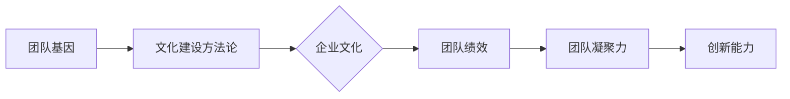

                 

### 技术团队文化建设的重要性

在现代企业的发展中，技术团队的作用不可忽视。技术团队的效率和创新能力直接影响到企业的竞争力与市场地位。而这一切的基石在于技术团队的文化建设。团队文化不仅影响着团队成员的心态和行为，更决定了团队的凝聚力和战斗力。

首先，文化是团队凝聚力的源泉。一个有着共同价值观和目标的团队，会自然而然地形成强大的凝聚力。这种凝聚力可以使得团队成员在面对困难和挑战时，能够齐心协力、共同克服，从而提高团队的整体工作效率。

其次，文化是团队创新能力的催化剂。一个开放、包容、鼓励创新的团队文化，能够激发团队成员的创造力和想象力，使得团队在技术研发和应用上不断突破，保持企业的竞争力。

最后，文化是团队长久发展的保障。良好的团队文化可以形成一种“组织记忆”，使得团队成员在遇到问题时，能够快速找到解决问题的方法，从而避免重复错误。这种积累和传承，是团队长久发展的关键。

因此，技术团队的文化建设不仅仅是一个企业发展的必要手段，更是企业竞争力的重要体现。在接下来的内容中，我们将深入探讨技术团队文化建设的核心概念和方法论，帮助读者更好地理解并实践这一重要议题。### 核心概念与联系

在深入探讨技术团队文化建设之前，我们需要明确几个核心概念，以便于我们更好地理解这一议题。本文将介绍“团队基因”、“文化建设方法论”等关键概念，并通过对比表格、ER实体关系图和Mermaid流程图展示这些概念之间的关系。

#### 核心概念介绍

**1. 团队基因**

团队基因是团队文化的基础，它由一系列核心价值观、信仰、行为规范和团队精神构成。团队基因决定了团队的文化特征和团队整体的思维方式。

**2. 文化建设方法论**

文化建设方法论是一套系统化的策略和步骤，用于引导和培养团队的价值观和行为规范，从而塑造团队的基因和文化。方法论包括价值观塑造、激励机制、人才培养与成长、团队协作与沟通等方面。

**3. 企业文化**

企业文化是企业在长期经营过程中形成的一套共同的价值观和行为准则，它不仅影响企业内部员工的思维和行为，也影响着企业的外部形象和市场竞争力。

#### 概念属性特征对比表格

| 概念 | 定义 | 属性特征 |
| ---- | ---- | ---- |
| 团队基因 | 团队文化的基础，包括价值观、信仰、行为规范等 | 独特性、稳定性、传承性 |
| 文化建设方法论 | 系统化的策略和步骤，用于塑造团队文化 | 可操作、可评估、可持续 |
| 企业文化 | 企业在长期经营过程中形成的一套共同的价值观和行为准则 | 广泛性、持久性、影响力 |

#### ER实体关系图

以下是团队基因、文化建设方法论和企业文化的ER实体关系图：

```mermaid
erDiagram
  企业文化 ||--|{ 团队基因 }|
  团队基因 ||--|{ 文化建设方法论 }|
```

**实体关系图说明：**

- 企业文化是团队基因的来源，同时也影响文化建设方法论。
- 团队基因是文化建设方法论的作用对象，通过方法论的实施，团队基因得以塑造和传承。
- 文化建设方法论则是实现企业文化在团队中落地的重要手段。

#### Mermaid流程图

为了更直观地展示团队文化建设的流程，我们使用Mermaid流程图来描述：



**流程图说明：**

- 团队基因作为起点，通过文化建设方法论的作用，影响企业文化。
- 企业文化反过来作用于团队绩效，从而影响团队凝聚力和创新能力。

通过上述对比表格、ER实体关系图和Mermaid流程图，我们清晰地展示了团队基因、文化建设方法论和企业文化之间的关系。这些核心概念相互联系，共同构成了技术团队文化建设的理论基础。在接下来的章节中，我们将详细探讨这些概念的具体应用和实践方法。### 团队文化建设方法论

在技术团队文化建设中，方法论扮演着至关重要的角色。一个系统的文化建设方法论不仅能够指导团队明确方向，还能够帮助团队在实践中不断优化和调整。以下是几个主要的建设方法论，每个方法论下再细分出具体的实施步骤或策略。

#### 方法论一：价值观塑造

价值观塑造是团队文化建设的基础，它关乎团队的核心信仰和行为准则。以下是具体的实施步骤：

**1. 确定核心价值观**

- **步骤1.1：调研与分析**
  - 对团队内外进行调研，收集团队成员的共同期望和价值观。
- **步骤1.2：共识达成**
  - 通过团队讨论和投票，达成对核心价值观的共识。

**2. 内化核心价值观**

- **步骤2.1：传播与培训**
  - 通过内部会议、培训等方式，使核心价值观深入人心。
- **步骤2.2：实践与反馈**
  - 将核心价值观融入日常工作，定期进行实践和反馈。

**3. 文化传承**

- **步骤3.1：树立榜样**
  - 通过树立团队榜样，传递核心价值观。
- **步骤3.2：文化载体**
  - 利用团队活动、会议等载体，持续传承核心价值观。

#### 方法论二：激励机制

激励机制是推动团队文化建设的重要手段，它关乎团队成员的积极性和创造力。以下是具体的实施步骤：

**1. 设计激励机制**

- **步骤1.1：目标设定**
  - 明确团队和个人的目标，确保激励机制与目标一致。
- **步骤1.2：评估标准**
  - 制定科学的评估标准，确保激励的公平性和有效性。

**2. 实施激励机制**

- **步骤2.1：奖惩分明**
  - 对表现优秀的团队成员进行奖励，对违反规定的成员进行惩罚。
- **步骤2.2：反馈与沟通**
  - 定期进行激励效果的反馈和沟通，确保激励机制的有效性。

**3. 激励机制优化**

- **步骤3.1：持续评估**
  - 定期对激励机制进行评估，确保其与团队目标保持一致。
- **步骤3.2：灵活调整**
  - 根据团队情况和外部环境的变化，灵活调整激励机制。

#### 方法论三：人才培养与成长

人才培养与成长是团队文化建设的重要组成部分，它关乎团队的长远发展和核心竞争力。以下是具体的实施步骤：

**1. 人才发展策略**

- **步骤1.1：需求分析**
  - 分析团队的人才需求，确定人才培养的重点方向。
- **步骤1.2：培训计划**
  - 制定详细的培训计划，包括内容、时间、方式等。

**2. 人才选拔与任用**

- **步骤2.1：选拔标准**
  - 设定科学的选拔标准，确保选拔到合适的团队成员。
- **步骤2.2：任用与考核**
  - 对新成员进行任用和考核，确保其能够胜任岗位。

**3. 人才激励与成长**

- **步骤3.1：职业规划**
  - 为团队成员制定职业规划，提供成长路径。
- **步骤3.2：反馈与支持**
  - 定期对团队成员进行反馈和支持，帮助他们解决问题和提升能力。

#### 方法论四：团队协作与沟通

团队协作与沟通是团队文化建设的关键环节，它关乎团队的效率和创新能力。以下是具体的实施步骤：

**1. 协作模式设计**

- **步骤1.1：协作工具选择**
  - 根据团队需求选择合适的协作工具，提高协作效率。
- **步骤1.2：协作流程优化**
  - 优化协作流程，确保团队成员能够高效协作。

**2. 沟通技巧培训**

- **步骤2.1：沟通技能培训**
  - 对团队成员进行沟通技巧培训，提高沟通效果。
- **步骤2.2：沟通反馈机制**
  - 建立有效的沟通反馈机制，确保信息畅通。

**3. 团队文化建设**

- **步骤3.1：团队活动策划**
  - 定期策划团队活动，增强团队凝聚力。
- **步骤3.2：文化建设评估**
  - 定期对团队文化建设效果进行评估，确保文化建设持续进行。

通过上述方法论，我们可以系统地推进技术团队文化建设。每个方法论都有其独特的实施步骤和策略，但共同的目标都是塑造一个具有凝聚力、创新力和战斗力的团队。在接下来的章节中，我们将结合实际案例，进一步展示这些方法论的应用效果。### 案例分析

为了更好地理解技术团队文化建设方法论在实际中的应用，下面我们通过两个案例来进行分析。

#### 案例一：成功案例

**公司背景**：某互联网公司是一家专注于提供云计算和大数据服务的创新型企业。随着业务的快速发展，该公司需要建立一个高效、创新的技术团队来支持其业务拓展。

**文化建设方法**：

1. **价值观塑造**：
   - **核心价值观**：创新、协作、用户至上。
   - **实施步骤**：通过内部会议、培训等方式，向团队成员传达核心价值观，并设立“创新日”活动，鼓励团队成员提出创新想法。

2. **激励机制**：
   - **激励机制设计**：设立“优秀员工奖”和“创新项目奖”，对表现突出和有创新贡献的团队成员进行奖励。
   - **实施步骤**：定期评选并公示获奖名单，提高团队成员的积极性和创造力。

3. **人才培养与成长**：
   - **人才发展策略**：为团队成员提供各种培训机会，包括内部分享会、外部培训等，帮助他们提升技能。
   - **实施步骤**：制定详细的培训计划，并为每位团队成员提供职业发展规划。

4. **团队协作与沟通**：
   - **协作模式设计**：采用敏捷开发模式，提高团队协作效率。
   - **沟通技巧培训**：定期组织沟通技巧培训，提高团队成员的沟通能力。

**建设成果**：

- **团队凝聚力**：通过共同的价值观和频繁的团队活动，团队成员之间的凝聚力显著增强。
- **创新能力**：激励机制和人才培养策略使得团队成员的创新热情高涨，公司业务取得了显著突破。
- **工作效率**：敏捷开发模式提高了团队的工作效率，缩短了产品开发周期。

#### 案例二：挑战与应对

**公司背景**：某传统制造企业开始数字化转型，其技术团队在短时间内需要适应全新的技术环境和业务模式。

**文化建设方法**：

1. **价值观塑造**：
   - **核心价值观**：创新、务实、快速响应。
   - **实施步骤**：通过内部培训和外部专家咨询，帮助团队成员理解并内化核心价值观。

2. **激励机制**：
   - **激励机制设计**：引入绩效考核体系，对完成任务的团队成员进行奖励。
   - **实施步骤**：定期进行绩效考核，并与薪酬和晋升挂钩。

3. **人才培养与成长**：
   - **人才发展策略**：为团队成员提供技术培训和职业发展规划，鼓励他们参加外部技术交流。
   - **实施步骤**：制定详细的培训计划，并为有潜力的成员提供进修机会。

4. **团队协作与沟通**：
   - **协作模式设计**：采用跨部门协作模式，提高团队的协同效率。
   - **沟通技巧培训**：组织跨部门沟通技巧培训，改善团队内部的沟通障碍。

**建设挑战与应对**：

- **挑战**：团队成员对新技术的适应能力不足，团队协作效率较低。
- **应对策略**：
  - **加强培训**：为团队成员提供更多的技术培训，提高他们的技能水平。
  - **优化协作流程**：通过流程优化，减少跨部门协作中的障碍，提高工作效率。

**建设成果**：

- **团队适应能力**：通过持续的培训和技术交流，团队成员逐渐适应了新技术环境，提高了工作效率。
- **团队协作效率**：跨部门协作模式的引入，改善了团队内部的协作效率，促进了业务的顺利推进。

通过以上案例分析，我们可以看到，技术团队文化建设在实际应用中需要结合企业的具体情况进行定制化实施。无论是成功案例还是面临挑战的案例，都证明了系统化的文化建设方法论对于团队建设的重要性。在接下来的章节中，我们将总结最佳实践，提供更具操作性的建议。### 最佳实践与总结

在技术团队文化建设的实践中，许多企业已经探索出了一系列成功的经验。以下是一些最佳实践，供读者参考和借鉴。

#### 最佳实践

1. **明确核心价值观**：核心价值观是团队文化的基石。企业应该明确并宣传核心价值观，确保所有团队成员都能理解和内化这些价值观。

2. **激励与反馈机制**：建立合理的激励与反馈机制，鼓励团队成员积极表现和创新。反馈机制应该及时、公平、透明，以提高团队成员的满意度和工作动力。

3. **持续的人才培养**：定期为团队成员提供培训和发展机会，帮助他们提升技能和职业素养。同时，制定清晰的职业发展路径，激发团队成员的长期投入和成长。

4. **促进团队协作**：通过优化协作流程和工具，提高团队的协同效率。组织定期的团队活动和沟通会议，增强团队凝聚力。

5. **建立学习文化**：鼓励团队成员持续学习和探索新技术，建立学习型组织文化，推动团队不断进步。

#### 总结

技术团队文化建设是一项长期而复杂的任务，但它是企业保持竞争力、提升团队效率和创新能力的关键。通过明确核心价值观、建立激励与反馈机制、持续的人才培养、促进团队协作和建立学习文化，企业可以逐步塑造出具有凝聚力、创新力和战斗力的技术团队。

本篇博客文章从背景介绍、核心概念与联系、团队文化建设方法论、案例分析到最佳实践与总结，系统地阐述了技术团队文化建设的各个方面。希望通过这些内容，读者能够更好地理解技术团队文化建设的意义和方法，并将其应用到实际工作中。

#### 注意事项与未来展望

在进行技术团队文化建设时，需要注意以下几个关键点：

1. **灵活性**：文化建设的具体方法需要根据企业的实际情况进行调整，保持灵活性。
2. **持续改进**：文化建设是一个持续的过程，需要不断评估和优化，以适应团队和企业的变化。
3. **领导示范**：领导者的示范作用至关重要，他们应该成为文化建设的倡导者和实践者。
4. **员工参与**：鼓励员工积极参与文化建设，提高他们的归属感和参与感。

未来，随着技术的不断进步和市场的变化，技术团队文化建设也将面临新的挑战和机遇。企业需要不断适应和引领这些变化，持续优化团队文化，以保持竞争力。

总之，技术团队文化建设是一项系统工程，需要从多个维度进行综合考虑和实践。希望读者在阅读本文后，能够对技术团队文化建设有更深入的理解，并在实际工作中取得更好的成效。

#### 拓展阅读

- 《团队的秘密：如何打造高效的团队》（作者：Jenny Davis）
- 《企业文化建设：构建团队凝聚力的关键》（作者：John P. Kotter）
- 《激励与创造力：如何激发员工的潜力》（作者：Daniel Goleman）

通过阅读这些书籍，读者可以进一步了解团队文化建设的理论和实践，为实际工作提供更多有价值的参考。

---

**作者：AI天才研究院/AI Genius Institute & 禅与计算机程序设计艺术 /Zen And The Art of Computer Programming**

