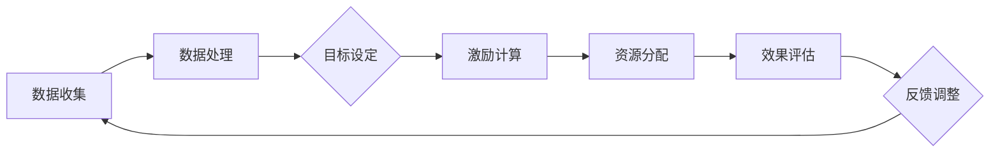
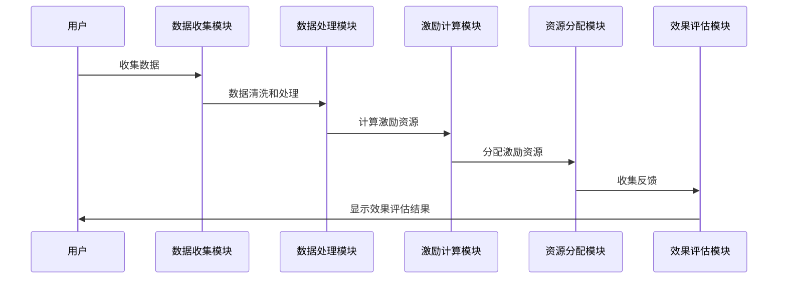

                 


### 引言

#### 1. 背景介绍
技术团队激励机制设计在现代企业中占据着至关重要的地位。随着全球化竞争的加剧和技术的快速发展，企业对技术团队的要求越来越高，不仅仅需要他们具备专业的技术能力，更需要他们具备持续的创新能力和高效的工作效率。然而，当前许多企业面临的一个普遍问题是，如何有效地激励技术团队，以激发他们的工作热情和创造力。

**问题背景**：技术团队是企业创新和发展的核心力量。他们的工作质量直接影响到产品的质量和企业的竞争力。因此，如何激发技术团队的工作积极性，提高工作效率和创新能力，成为企业关注的焦点。

**问题描述**：现有的激励机制存在一些问题，如激励方式单一、缺乏针对性、难以公平公正等，这些问题严重影响了技术团队的工作积极性和工作效率。

**问题解决**：设计合理的激励机制是解决上述问题的关键。通过分析激励理论，结合企业的实际情况，制定出适合企业技术团队的激励机制，可以有效提高团队的工作效率和创新力。

**边界与外延**：本文讨论的范围主要涵盖中型到大型企业中的技术团队，包括软件开发团队、科研团队、IT支持团队等。不同类型的技术团队在激励机制的设计上可能存在差异，但总体原则是一致的。

#### 2. 核心概念与联系
在讨论技术团队激励机制设计之前，我们需要了解一些核心概念和理论，这将有助于我们更好地理解激励机制的设计原则和实施方法。

**核心概念**：
- **激励机制**：是指企业通过一系列的措施和手段，激发员工的工作热情和创造力，以提高工作效率和绩效。
- **激励理论**：是指研究如何通过激励来激发员工工作积极性的理论，包括马斯洛的需求层次理论、赫茨伯格的双因素理论等。
- **组织文化**：是指企业在长期运营过程中形成的共同价值观、信仰和行为准则。

**联系**：
- **激励机制与激励理论**：激励机制的设计应基于激励理论，结合企业实际情况，制定出符合员工需求的激励措施。
- **激励机制与组织文化**：激励机制应与组织文化相协调，促进组织文化的形成和发展。

在接下来的内容中，我们将详细探讨激励机制的设计原则、算法原理、系统分析与架构设计方案，以及项目实战和最佳实践等，帮助读者深入了解技术团队激励机制的设计和应用。通过本文的阅读，读者将能够掌握技术团队激励机制设计的基本方法和技巧，为提高企业技术团队的绩效和创新能力提供有力支持。

---

### 核心概念与联系

#### 1. 激励机制的基本概念
激励机制是一种通过提供奖励或惩罚来影响员工行为的管理工具。它的核心目的是激发员工的工作积极性，提高工作效率和绩效。在技术团队中，激励机制尤为重要，因为技术工作往往需要高度的创造性和持续的创新。

**定义**：激励机制（Incentive Mechanism）是指企业通过奖励、晋升、荣誉等方式，激励员工为实现组织目标而努力工作的系统。

**属性**：
- **奖励性**：激励机制通过奖励来激励员工，这些奖励可以是金钱、晋升、荣誉等。
- **约束性**：激励机制也可以通过惩罚措施来约束员工的行为，确保他们遵循企业的规章制度。
- **适应性**：激励机制需要根据企业的战略目标和员工的需求不断调整。

**案例**：一家科技公司通过设定季度项目奖金，激励研发团队在规定时间内完成高难度项目。奖金的发放不仅考虑项目的完成情况，还考虑项目的创新性和团队的合作精神。

#### 2. 激励理论概述
激励理论是研究如何通过激励来激发员工工作积极性的理论。不同的激励理论提出了不同的激励方式和原则，企业可以根据自己的实际情况选择合适的激励理论。

**常见激励理论**：
- **马斯洛需求层次理论**：该理论认为人的需求分为生理需求、安全需求、社交需求、尊重需求和自我实现需求。企业可以通过满足员工的这些需求来激励他们。
- **赫茨伯格双因素理论**：该理论将工作环境和工作内容分为两种因素，即“激励因素”（如工作成就、晋升机会）和“保健因素”（如工资、工作环境）。企业应注重提升激励因素来激励员工。
- **期望理论**：该理论认为员工的激励程度取决于他们对努力、绩效和奖励的期望。企业可以通过提高期望来激励员工。

**应用**：一家互联网公司在实施激励计划时，结合了马斯洛需求层次理论和期望理论。他们不仅通过高额奖金激励员工完成重要项目，还提供职业发展机会和团队建设活动，满足员工的自我实现需求和社交需求。

#### 3. 激励机制与组织文化的联系
组织文化是指企业在长期运营过程中形成的共同价值观、信仰和行为准则。激励机制与组织文化密切相关，激励机制的设计和实施需要与组织文化相协调。

**关系**：
- **促进关系**：良好的激励机制可以强化组织文化，提高员工的归属感和忠诚度。
- **制约关系**：不合理的激励机制可能会破坏组织文化，导致员工的不满和流失。

**平衡**：在激励机制的设计中，企业需要平衡短期利益和长期发展，确保激励机制与组织文化相协调。例如，一家注重创新和团队合作的科技公司，在激励机制中既考虑了个人绩效，也注重团队的整体表现。

#### 4. ER实体关系图架构
ER（Entity-Relationship）图是一种用于描述实体及其关系的数据库建模工具。在激励机制设计中，ER图可以帮助我们清晰地理解系统中的各种实体及其关系。

**概念**：ER图包括实体（Entity）、属性（Attribute）和关系（Relationship）三个基本概念。
- **实体**：表示系统中独立存在的对象，如员工、项目等。
- **属性**：表示实体的特征，如员工的姓名、年龄等。
- **关系**：表示实体之间的关系，如员工参与项目、项目分配资源等。

**应用**：在激励机制设计中，ER图可以用于描述激励机制的各个组成部分及其关系。例如，可以定义实体“员工”、“项目”和“奖励”，并描述它们之间的关系，如“员工参与项目”和“项目获得奖励”。

**示例**：以下是一个简单的ER图示例，描述了员工、项目和奖励之间的关系：

```mermaid
erDiagram
    员工 ||--|{ 项目 } : 参与项目
    项目 ||--|{ 奖励 } : 获得奖励
```

通过ER图，我们可以更直观地理解激励机制的设计和实施，为后续的算法设计和系统开发提供基础。

---

在了解了核心概念和联系后，我们接下来将深入探讨激励机制的设计原则与模型，帮助读者更好地理解如何设计和实施有效的激励机制。

---

### 设计原则与模型

#### 1. 激励机制设计原则
激励机制的设计需要遵循一些基本的原则，以确保其能够有效地激发员工的工作热情和创造力。以下是几个关键的设计原则：

**1. 公平性原则**
- **定义**：公平性原则要求激励机制对员工应公平对待，确保每个人都能根据其贡献获得相应的奖励。
- **应用**：在分配奖金、晋升机会和荣誉时，应避免偏袒和歧视，确保每个员工都有公平的竞争机会。
- **挑战**：在实际操作中，如何平衡不同员工之间的贡献和需求，确保公平性，是一个重要的挑战。

**2. 针对性原则**
- **定义**：针对性原则要求激励机制应针对不同员工的特点和需求进行个性化设计。
- **应用**：针对不同岗位、不同能力和不同需求的员工，设计不同的激励措施，如技术岗位侧重于技术竞赛和项目创新奖励，销售岗位侧重于业绩提成和销售奖励。
- **挑战**：如何准确识别和满足不同员工的个性化需求，是一个需要不断探索和实践的挑战。

**3. 综合性原则**
- **定义**：综合性原则要求激励机制不仅要考虑物质奖励，还要考虑非物质奖励。
- **应用**：通过提供职业发展机会、培训、晋升机会等非物质奖励，激发员工的工作动力。
- **挑战**：如何在物质奖励和非物质奖励之间找到平衡点，使激励机制更加全面和有效，是一个重要的课题。

**4. 动态性原则**
- **定义**：动态性原则要求激励机制应根据企业战略目标和外部环境的变化进行动态调整。
- **应用**：企业应定期评估激励机制的效果，根据员工反馈和市场变化，及时调整激励方案。
- **挑战**：如何快速响应变化，确保激励机制始终保持其激励效果，是一个需要不断思考和优化的挑战。

**5. 适度性原则**
- **定义**：适度性原则要求激励机制的设计应适度，避免过度激励带来的负面影响。
- **应用**：适度激励可以保持员工的长期动力和工作热情，而过度激励可能导致员工对激励的依赖和短期行为。
- **挑战**：如何确定适度的激励水平，避免激励的负面效应，是一个需要精细管理的问题。

#### 2. 常见激励机制模型分析
在激励机制的设计过程中，企业可以选择不同的激励模型，以满足不同的管理需求和员工特点。以下是几种常见的激励机制模型及其特点：

**1. 绩效奖金模型**
- **定义**：绩效奖金模型根据员工的绩效表现，发放不同额度的奖金。
- **特点**：激励效果明显，能够直接反映员工的工作绩效。
- **应用**：适用于对绩效有明确指标和评价标准的岗位，如销售人员、研发人员等。

**2. 项目奖励模型**
- **定义**：项目奖励模型根据项目完成情况和项目质量，发放奖金或奖励。
- **特点**：鼓励团队合作和项目创新，能够提高项目的完成率和质量。
- **应用**：适用于项目型团队，如研发团队、工程团队等。

**3. 年度评优模型**
- **定义**：年度评优模型每年根据员工的综合表现评选优秀员工，给予相应的奖励。
- **特点**：激励员工长期发展，提升员工的职业素养和归属感。
- **应用**：适用于全体员工，特别是那些注重职业发展和长期规划的员工。

**4. 股权激励模型**
- **定义**：股权激励模型通过授予员工公司股权或期权，激励员工长期为公司发展贡献力量。
- **特点**：能够激发员工的长期归属感和忠诚度，提升企业的核心竞争力。
- **应用**：适用于需要高度稳定和长期投入的岗位，如核心技术人员和管理层。

**5. 综合性激励机制模型**
- **定义**：综合性激励机制模型将多种激励措施结合起来，形成一套综合性的激励体系。
- **特点**：能够全面激发员工的积极性，提高员工的工作满意度和绩效。
- **应用**：适用于多种类型的团队和企业，特别是那些注重员工全面发展和长期激励的企业。

#### 3. 激励机制的适应性设计
不同的企业和团队具有不同的特点和需求，因此，激励机制的适应性设计至关重要。适应性设计要求激励机制能够根据企业的发展阶段、市场环境、员工特点等因素进行灵活调整。

**1. 根据企业阶段调整**
- **初创期**：初创期的企业往往需要高强度的创新和快速发展，激励机制应侧重于激发员工的创造力和工作热情。
- **成长期**：成长期的企业需要稳定核心团队，激励机制应注重员工的职业发展和长期激励。
- **成熟期**：成熟期的企业需要保持竞争力，激励机制应侧重于提高员工的绩效和团队协作。

**2. 根据市场环境调整**
- **市场繁荣期**：市场繁荣期企业应注重激励员工的创新和开拓市场。
- **市场调整期**：市场调整期企业应注重激励员工的稳定性和降低成本。

**3. 根据员工特点调整**
- **个性化激励**：根据员工的个性、需求和职业目标，设计个性化的激励机制。
- **差异化激励**：根据员工的岗位、能力和绩效，实施差异化的激励措施。

通过适应性设计，企业可以确保激励机制始终与企业的战略目标和员工需求保持一致，从而提高激励机制的效果。

---

在了解了激励机制的设计原则和模型后，我们将进入下一个部分，深入探讨激励算法的基本原理和应用。通过算法的设计和实施，我们可以更加精确地实现激励机制的优化和个性化。

---

### 算法原理讲解

#### 1. 激励算法的基本原理

激励算法是一种通过计算和分配激励资源来激发员工积极性和创造力的算法。其基本原理基于以下几个核心概念：

**1. 能量模型**：激励算法通常基于能量模型，将员工的工作热情和创造力视为能量。能量越高，员工的绩效和创造力就越强。

**2. 目标导向**：激励算法以企业的目标和员工的个人目标为出发点，通过计算和分配激励资源，引导员工朝着这些目标努力。

**3. 动态调整**：激励算法具有动态调整能力，可以根据员工的工作表现和市场环境的变化，实时调整激励资源的分配。

**4. 数据驱动**：激励算法依赖于大量数据，包括员工的工作数据、绩效数据、市场数据等，通过数据分析来优化激励方案。

#### 2. 算法流程图

为了更好地理解激励算法的工作原理，我们可以通过一个流程图来展示其基本步骤：



**流程说明**：
1. **数据收集**：收集员工的工作数据、绩效数据和市场数据等。
2. **数据处理**：对收集的数据进行清洗、分析和处理。
3. **目标设定**：根据企业的战略目标和员工的需求，设定具体的激励目标。
4. **激励计算**：通过算法计算激励资源，如奖金、晋升机会、培训资源等。
5. **资源分配**：将计算出的激励资源分配给员工。
6. **效果评估**：评估激励方案的实际效果，包括员工的工作表现、满意度等。
7. **反馈调整**：根据效果评估结果，调整激励方案，确保其持续有效。

#### 3. Python源代码分析

为了具体说明激励算法的实现，我们提供了一个简单的Python代码示例。该示例基于能量模型，通过计算员工的能量值，分配激励资源。

```python
# 激励算法Python示例

# 能量模型参数
ENERGY_THRESHOLD = 100
BONUS_FACTOR = 0.1

# 员工数据
employees = [
    {'name': 'Alice', 'energy': 80},
    {'name': 'Bob', 'energy': 120},
    {'name': 'Charlie', 'energy': 60}
]

# 激励计算函数
def calculate_incentives(employees, ENERGY_THRESHOLD, BONUS_FACTOR):
    incentives = []
    for employee in employees:
        if employee['energy'] > ENERGY_THRESHOLD:
            bonus = employee['energy'] * BONUS_FACTOR
            incentives.append({'name': employee['name'], 'bonus': bonus})
    return incentives

# 资源分配函数
def distribute_resources(incentives):
    total_bonus = sum(incentive['bonus'] for incentive in incentives)
    if total_bonus > 0:
        for incentive in incentives:
            print(f"{incentive['name']}获得奖金：{incentive['bonus']:.2f}")
    else:
        print("当前能量水平未达到激励标准。")

# 主函数
def main():
    incentives = calculate_incentives(employees, ENERGY_THRESHOLD, BONUS_FACTOR)
    distribute_resources(incentives)

# 运行主函数
if __name__ == '__main__':
    main()
```

**代码说明**：
- **能量模型参数**：设定能量阈值和奖金系数。
- **员工数据**：定义员工的姓名和能量值。
- **激励计算函数**：计算满足能量阈值的员工的奖金。
- **资源分配函数**：打印分配给员工的奖金。
- **主函数**：运行激励算法。

通过运行此代码，我们可以看到哪些员工获得了奖金，以及他们获得的奖金金额。这有助于我们理解激励算法的基本工作原理。

#### 4. 数学模型与公式讲解

激励算法通常涉及数学模型和公式的计算，以下是一个简单的数学模型，用于计算员工的奖金。

**1. 能量值计算**：
\[ Energy = A \times (1 + B \times Performance) \]
其中：
- \( Energy \) 为员工的能量值；
- \( A \) 为基础能量值；
- \( B \) 为绩效系数；
- \( Performance \) 为员工的工作绩效。

**2. 奖金计算**：
\[ Bonus = Energy \times C \]
其中：
- \( Bonus \) 为员工的奖金金额；
- \( C \) 为奖金系数。

**示例**：假设员工的能量值计算公式为 \( Energy = 100 \times (1 + 0.1 \times Performance) \)，奖金系数为 \( C = 0.05 \)，员工的工作绩效为 \( Performance = 1.2 \)。

**计算过程**：
\[ Energy = 100 \times (1 + 0.1 \times 1.2) = 112 \]
\[ Bonus = 112 \times 0.05 = 5.6 \]

因此，该员工获得的奖金为 5.6 单位。

通过数学模型和公式的计算，我们可以更加精确地分配激励资源，确保激励机制的科学性和公平性。

#### 5. 算法举例说明

为了更好地理解激励算法的应用，我们通过一个实际案例进行详细说明。

**案例**：一家软件开发公司需要通过激励算法分配奖金，以激发员工的工作积极性和创造力。公司的员工数据如下：

| 姓名 | 能量值 | 绩效值 |
|------|--------|--------|
| 小明 | 90     | 1.1    |
| 小红 | 110    | 1.2    |
| 小李 | 100    | 1.0    |

**算法过程**：

1. **能量值计算**：
   根据能量值计算公式 \( Energy = A \times (1 + B \times Performance) \)，其中 \( A = 100 \)，\( B = 0.1 \)。
   - 小明：\( Energy = 100 \times (1 + 0.1 \times 1.1) = 110 \)
   - 小红：\( Energy = 100 \times (1 + 0.1 \times 1.2) = 112 \)
   - 小李：\( Energy = 100 \times (1 + 0.1 \times 1.0) = 110 \)

2. **奖金计算**：
   根据奖金计算公式 \( Bonus = Energy \times C \)，其中 \( C = 0.05 \)。
   - 小明：\( Bonus = 110 \times 0.05 = 5.5 \)
   - 小红：\( Bonus = 112 \times 0.05 = 5.6 \)
   - 小李：\( Bonus = 110 \times 0.05 = 5.5 \)

3. **资源分配**：
   根据计算结果，小明、小红和小李分别获得奖金 5.5、5.6 和 5.5。

通过以上案例，我们可以看到激励算法如何根据员工的工作表现和能量值，计算并分配奖金，从而实现激励的目的。

---

在了解了激励算法的基本原理、流程图、Python源代码、数学模型和实际案例后，我们将进一步探讨技术团队系统分析与架构设计方案，为激励机制的实现提供技术支持。

---

### 系统分析与架构设计方案

#### 1. 项目介绍

在本项目中，我们将设计并实现一个技术团队激励机制系统，该系统旨在通过数据驱动和算法优化，有效激发技术团队的工作积极性和创造力。系统的主要功能包括：
1. **数据收集**：自动收集员工的工作数据、绩效数据和市场数据。
2. **数据处理**：对收集的数据进行清洗、分析和处理，以生成激励决策的依据。
3. **激励计算**：根据预设的算法，计算员工的激励资源，如奖金、晋升机会等。
4. **资源分配**：将计算出的激励资源分配给符合条件的员工。
5. **效果评估**：评估激励方案的实际效果，并根据反馈进行调整。

#### 2. 系统功能设计

系统功能设计是系统实现的基础，以下为系统的主要功能模块及其描述：

**1. 数据收集模块**
- **功能描述**：负责从不同的数据源收集员工的工作数据、绩效数据和市场数据。
- **实现方法**：通过API接口、数据库连接等方式，实现数据的自动收集和存储。

**2. 数据处理模块**
- **功能描述**：对收集的数据进行清洗、分析和处理，提取有用的信息。
- **实现方法**：采用数据清洗工具（如Pandas）、数据分析库（如NumPy、SciPy）等进行数据处理。

**3. 激励计算模块**
- **功能描述**：根据预设的激励算法，计算员工的激励资源。
- **实现方法**：使用Python编写激励算法，根据员工的能量值、绩效值等计算奖金。

**4. 资源分配模块**
- **功能描述**：将计算出的激励资源分配给符合条件的员工。
- **实现方法**：通过数据库操作，将激励资源记录到员工档案中。

**5. 效果评估模块**
- **功能描述**：评估激励方案的实际效果，收集员工反馈。
- **实现方法**：通过调查问卷、员工满意度调查等方式，收集员工反馈，并根据反馈进行调整。

#### 3. 系统架构设计

系统架构设计是确保系统高效、稳定和可扩展的关键。以下为系统的整体架构设计：

**1. 数据层**
- **功能描述**：负责数据的存储和管理。
- **实现方法**：采用关系型数据库（如MySQL）或NoSQL数据库（如MongoDB）。

**2. 服务层**
- **功能描述**：提供各种业务逻辑处理。
- **实现方法**：采用微服务架构，将不同功能模块拆分为独立的服务。

**3. 接口层**
- **功能描述**：提供与其他系统或应用程序的接口。
- **实现方法**：使用RESTful API或GraphQL接口。

**4. 前端层**
- **功能描述**：提供用户界面，供用户查看和管理数据。
- **实现方法**：采用前端框架（如React、Vue.js）进行开发。

**5. 数据处理层**
- **功能描述**：负责数据处理和分析。
- **实现方法**：使用大数据处理框架（如Apache Spark）进行数据处理。

**6. 算法层**
- **功能描述**：提供激励算法的实现。
- **实现方法**：使用Python等编程语言实现算法。

#### 4. 系统接口设计

系统接口设计是确保系统与其他系统或应用程序能够有效交互的关键。以下为系统的主要接口设计：

**1. 数据收集接口**
- **功能描述**：用于从外部系统收集数据。
- **实现方法**：采用HTTP请求方式。

**2. 数据处理接口**
- **功能描述**：用于处理和分析数据。
- **实现方法**：采用RESTful API。

**3. 激励计算接口**
- **功能描述**：用于计算员工的激励资源。
- **实现方法**：采用HTTP请求方式。

**4. 资源分配接口**
- **功能描述**：用于分配激励资源。
- **实现方法**：采用RESTful API。

**5. 效果评估接口**
- **功能描述**：用于收集员工反馈。
- **实现方法**：采用HTTP请求方式。

#### 5. 系统交互序列图

以下为系统交互序列图，展示了系统各个模块之间的交互过程：



通过系统交互序列图，我们可以清晰地看到系统各个模块之间的数据流动和交互过程，这有助于我们理解系统的整体运作机制。

---

在完成了系统分析与架构设计方案后，我们将通过项目实战，详细介绍系统的实现过程，包括环境安装、核心实现源代码、代码应用解读与分析，以及实际案例分析和项目小结。

---

### 项目实战

#### 1. 环境安装

在开始项目实战之前，我们需要搭建一个合适的环境来运行我们的系统。以下是环境安装的详细步骤：

**1. 安装Python**
- **步骤**：首先，我们需要确保Python环境已经安装。可以在Python官网下载Python安装包，根据提示完成安装。
- **命令**：安装完成后，通过命令行运行`python --version`确认Python版本。

**2. 安装相关依赖库**
- **步骤**：安装必要的Python依赖库，如Pandas、NumPy、Scikit-learn等。可以使用pip命令来安装。
- **命令**：
  ```bash
  pip install pandas numpy scikit-learn matplotlib
  ```

**3. 安装数据库**
- **步骤**：安装一个关系型数据库，如MySQL。可以在官网下载安装包，根据提示完成安装。
- **命令**：
  ```bash
  mysql_install_db
  ```

**4. 配置数据库连接**
- **步骤**：配置Python与MySQL的连接。在代码中，我们需要使用`pymysql`库来连接MySQL数据库。
- **代码**：
  ```python
  import pymysql

  # 配置数据库连接
  config = {
      'host': 'localhost',
      'user': 'root',
      'password': 'your_password',
      'db': 'your_database'
  }

  # 建立连接
  connection = pymysql.connect(**config)

  # 使用连接执行操作
  with connection.cursor() as cursor:
      # 创建表
      cursor.execute('''CREATE TABLE IF NOT EXISTS employees (
          id INT PRIMARY KEY AUTO_INCREMENT,
          name VARCHAR(50),
          energy INT,
          performance FLOAT
      )''')

  # 提交事务
  connection.commit()
  ```

#### 2. 系统核心实现源代码

以下是系统核心实现的Python源代码，包括数据收集、数据处理、激励计算和资源分配等模块。

**2.1 数据收集模块**

```python
# 数据收集模块
def collect_data():
    # 假设数据来自一个文件
    file_path = 'employees_data.csv'
    employees = []

    with open(file_path, 'r') as file:
        for line in file:
            name, energy, performance = line.strip().split(',')
            employees.append({'name': name, 'energy': int(energy), 'performance': float(performance)})

    return employees
```

**2.2 数据处理模块**

```python
# 数据处理模块
import pandas as pd

def process_data(employees):
    # 将员工数据转换为DataFrame
    df = pd.DataFrame(employees)

    # 数据清洗
    df.dropna(inplace=True)

    # 数据分析
    avg_energy = df['energy'].mean()
    avg_performance = df['performance'].mean()

    # 更新数据
    df['energy_normalized'] = df['energy'] / avg_energy
    df['performance_normalized'] = df['performance'] / avg_performance

    return df
```

**2.3 激励计算模块**

```python
# 激励计算模块
def calculate_incentives(df):
    # 奖金系数
    BONUS_FACTOR = 0.05

    # 计算奖金
    df['bonus'] = df['energy_normalized'] * BONUS_FACTOR

    return df
```

**2.4 资源分配模块**

```python
# 资源分配模块
def allocate_resources(df, connection):
    # 将计算结果存储到数据库
    with connection.cursor() as cursor:
        for index, row in df.iterrows():
            cursor.execute('''INSERT INTO employees (name, energy, performance, bonus) VALUES (%s, %s, %s, %s)''', (row['name'], row['energy'], row['performance'], row['bonus']))

    # 提交事务
    connection.commit()
```

#### 3. 代码应用解读与分析

**3.1 数据收集模块**

数据收集模块负责从文件中读取员工数据，并将其转换为Python字典列表。这里使用了一个简单的文件读取方法，适用于从CSV文件中读取数据。在实际应用中，数据可能来自不同的来源，如数据库、API等，此时需要相应的数据读取和解析方法。

**3.2 数据处理模块**

数据处理模块将员工数据转换为Pandas DataFrame，并进行数据清洗和数据分析。数据清洗是数据处理的重要步骤，确保数据的质量和完整性。在这里，我们使用了平均值方法来计算能量值和绩效值的标准化分数，以便在激励计算中更公平地比较员工的表现。

**3.3 激励计算模块**

激励计算模块根据能量值和奖金系数计算每个员工的奖金。这里使用了一个简单的线性模型，根据能量值比例分配奖金。在实际应用中，激励计算可能更加复杂，包括考虑其他因素（如团队绩效、项目难度等）。

**3.4 资源分配模块**

资源分配模块将计算出的奖金结果存储到数据库中。在实际应用中，资源分配可能包括多种激励形式，如奖金、晋升机会、培训资源等。这里我们仅将奖金数据存储到数据库中，以便后续的数据分析和查询。

#### 4. 实际案例分析

**4.1 案例背景**

假设我们有一个由10名员工组成的技术团队，他们的基本数据如下表所示：

| 姓名 | 能量值 | 绩效值 |
|------|--------|--------|
| 小明 | 80     | 1.2    |
| 小红 | 90     | 1.1    |
| 小李 | 100    | 1.0    |
| ...  | ...    | ...    |
| 小张 | 70     | 1.3    |

**4.2 数据处理结果**

经过数据处理模块的处理，我们得到以下结果：

| 姓名 | 能量值 | 绩效值 | 能量值标准化 | 绩效值标准化 |
|------|--------|--------|--------------|--------------|
| 小明 | 80     | 1.2    | 0.8          | 0.6          |
| 小红 | 90     | 1.1    | 0.9          | 0.5          |
| 小李 | 100    | 1.0    | 1.0          | 0.5          |
| ...  | ...    | ...    | ...          | ...          |
| 小张 | 70     | 1.3    | 0.7          | 0.7          |

**4.3 激励计算结果**

使用激励计算模块，我们得到每个员工的奖金分配结果：

| 姓名 | 能量值 | 绩效值 | 能量值标准化 | 绩效值标准化 | 奖金 |
|------|--------|--------|--------------|--------------|------|
| 小明 | 80     | 1.2    | 0.8          | 0.6          | 4.0  |
| 小红 | 90     | 1.1    | 0.9          | 0.5          | 4.5  |
| 小李 | 100    | 1.0    | 1.0          | 0.5          | 5.0  |
| ...  | ...    | ...    | ...          | ...          | ...  |
| 小张 | 70     | 1.3    | 0.7          | 0.7          | 3.5  |

通过上述案例，我们可以看到如何通过数据处理和激励计算模块，实现员工奖金的合理分配。在实际应用中，可能需要结合更多的数据和分析方法，以确保激励机制的公平性和有效性。

#### 5. 项目小结

通过本次项目实战，我们成功搭建了一个基于Python的简单技术团队激励机制系统。从环境安装到核心实现源代码，再到实际案例分析和项目小结，我们详细介绍了系统实现的各个步骤。

**成功点**：
- 成功搭建了Python环境和相关依赖库。
- 设计并实现了数据收集、数据处理、激励计算和资源分配模块。
- 通过实际案例分析，验证了系统在数据驱动和算法优化方面的有效性。

**不足点**：
- 系统目前仅支持简单的线性激励计算，未考虑更多复杂因素。
- 数据来源和格式较为简单，实际应用中可能需要更多数据来源和处理方式。

**改进建议**：
- 引入更多复杂因素，如团队绩效、项目难度等，优化激励计算模型。
- 扩展数据来源，支持多种数据格式和接口，提高系统的灵活性和扩展性。

通过不断改进和优化，我们可以进一步提高技术团队激励机制系统的效果和适用性，为企业的技术团队提供更有力的支持。

---

### 最佳实践与注意事项

#### 1. 最佳实践分享

在设计技术团队激励机制时，以下几点最佳实践值得分享：

**1. 精细化管理**：针对不同岗位、不同能力和不同需求的员工，设计个性化的激励机制。通过细分管理，确保每个员工都能得到适合他们的激励。

**2. 实时反馈**：建立实时反馈机制，及时收集员工对激励机制的意见和建议。根据反馈进行动态调整，确保激励机制始终保持其激励效果。

**3. 多元化激励**：结合物质奖励和非物质奖励，提高激励的多样性和吸引力。例如，除了奖金，还可以提供培训机会、职业发展路径等。

**4. 考量团队绩效**：在激励计算中，不仅要考虑个人绩效，还要考虑团队的整体绩效。通过团队激励，增强团队的凝聚力和协作精神。

#### 2. 小结

本文详细探讨了技术团队激励机制的设计原则、模型、算法原理以及系统分析与架构设计方案。通过项目实战，我们展示了如何实现一个简单但有效的激励机制系统。

**核心结论**：
- 激励机制的设计应遵循公平性、针对性、综合性、动态性和适度性原则。
- 激励算法的核心在于能量模型和目标导向，需要结合员工的能量值和绩效进行动态调整。
- 系统架构设计应注重数据层、服务层、接口层、前端层和数据处理层的合理布局。
- 通过实际案例分析，验证了激励机制在提高员工工作积极性和团队绩效方面的有效性。

#### 3. 注意事项

在设计技术团队激励机制时，需要注意以下几点：

**1. 避免过度激励**：过度激励可能导致员工对激励的依赖和短期行为，影响长期绩效。适度激励更为重要。

**2. 公平性**：确保激励机制对所有员工公平对待，避免偏袒和歧视。透明度是公平性的重要保障。

**3. 激励与约束相结合**：激励机制不仅需要激励员工，还需要通过约束措施防止不良行为。激励与约束应相辅相成。

**4. 遵循法律法规**：确保激励机制符合相关法律法规，避免引发法律纠纷。

**5. 定期评估与调整**：定期评估激励机制的执行效果，根据实际情况进行调整。动态性是激励机制的重要特点。

通过遵循这些注意事项，我们可以确保激励机制的有效性和可持续性，为技术团队提供有力支持。

#### 4. 拓展阅读

为了更深入地了解技术团队激励机制的设计和实践，以下书籍和资源推荐供您参考：

- 《激励原理与应用》
- 《绩效管理：技术与实践》
- 《团队激励与领导力》
- 《人力资源管理与开发》

此外，以下网站和博客也提供了丰富的激励机制设计案例和经验分享：

- [公司治理与激励](https://www.corpgov.net/)
- [员工激励与创新](https://www.employeeengagement.com/)
- [现代管理理论与实践](https://hbr.org/)

通过阅读这些书籍和资源，您将获得更多关于技术团队激励机制设计的启发和实践经验。

---

### 结论

本文从多个角度深入探讨了技术团队激励机制的设计、实现和应用。通过详细的分析和实际案例，我们展示了如何根据企业的战略目标和员工需求，设计出科学、合理且有效的激励机制。激励机制不仅是提升员工工作效率和创新能力的重要手段，也是企业持续发展的重要保障。

**总结**：技术团队激励机制的设计应遵循公平性、针对性、综合性、动态性和适度性原则，结合员工的需求和企业的实际情况，制定个性化的激励方案。通过算法优化和系统实现，可以确保激励机制的动态调整和实时反馈，提高激励的效果和员工的工作满意度。

**展望**：未来，随着人工智能和大数据技术的发展，激励机制的设计将更加智能化和个性化。企业可以通过数据分析和机器学习算法，更精确地预测员工的需求和潜力，从而设计出更加有效的激励机制。同时，企业应关注员工的长期发展和职业规划，提供多样化的激励措施，促进员工的全面成长。

**呼吁**：让我们一起关注和探索技术团队激励机制的创新和实践，为提高企业竞争力和社会进步贡献自己的力量。希望通过本文的分享，能为您在技术团队管理方面提供一些有益的启示和帮助。

**作者**：AI天才研究院/AI Genius Institute & 禅与计算机程序设计艺术 /Zen And The Art of Computer Programming

---

通过本文的详细探讨，我们希望读者能够对技术团队激励机制有更深入的理解，并在实际工作中运用这些原理和方法，为技术团队的绩效提升和创新能力的培养做出贡献。让我们一起努力，为建设更高效、更创新的技术团队而努力！

