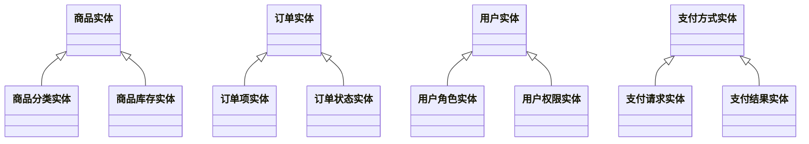

                 


### 文章标题

技术团队的代码规范：统一编码风格的重要性

---

#### 关键词

技术团队，代码规范，编码风格，团队协作，代码质量，Python，Java，PEP 8，Google Java编码规范

---

#### 摘要

本文深入探讨了技术团队代码规范中的统一编码风格的重要性。通过分析编码风格对团队协作、代码质量和项目成功的影响，本文介绍了Python和Java等主流编程语言的编码风格规范，并阐述了如何在实际项目中实施和推广编码风格统一。通过具体的算法原理讲解、系统分析与架构设计、项目实战等内容，本文旨在为技术团队提供有价值的参考和指导。

### 目录大纲

#### 第一部分：背景介绍

- **1.1 技术团队的代码规范背景**
  - **1.1.1 问题背景**
  - **1.1.2 编码风格的重要性**
  - **1.1.3 核心概念与联系**
- **1.2 主流编码风格规范**
  - **1.3.1 Python编码风格规范**
  - **1.3.2 Java编码风格规范**
- **1.4 编码风格统一的重要性**
- **1.5 本章小结**

#### 第二部分：核心概念与联系

- **2.1 编码风格的概念**
  - **2.1.1 编码风格的定义**
  - **2.1.2 编码风格的核心要素**
- **2.2 编码风格与团队协作**
  - **2.2.1 编码风格对团队协作的影响**
  - **2.2.2 编码风格与代码质量**
- **2.3 不同编程语言的编码风格规范**

#### 第三部分：系统分析与架构设计

- **3.1 问题场景介绍**
- **3.2 系统功能设计**
- **3.3 系统架构设计**
- **3.4 系统接口设计**
- **3.5 系统交互**

#### 第四部分：项目实战

- **4.1 环境安装**
- **4.2 系统核心实现源代码**
- **4.3 代码应用解读与分析**
- **4.4 实际案例分析与详细讲解**
- **4.5 项目小结**

#### 第五部分：最佳实践与拓展阅读

- **5.1 最佳实践**
- **5.2 小结**
- **5.3 注意事项**
- **5.4 拓展阅读**

---

### 第一部分：背景介绍

#### 1.1 技术团队的代码规范背景

在当今快速发展的技术行业，技术团队的有效协作和高质量代码的产出变得越来越重要。然而，在实际开发过程中，技术团队常常面临各种挑战，其中之一就是代码规范问题。

**1.1.1 问题背景**

技术团队在开发过程中，经常会遇到代码质量低下、风格不一致、不易维护等问题。这些问题不仅影响项目的进展，还会增加维护成本，降低项目的成功率。具体来说，这些问题包括：

1. **代码质量低下**：代码中存在大量的bug，代码可读性差，难以维护。
2. **编码风格不一致**：团队成员各自为政，编码风格不统一，导致代码风格杂乱无章。
3. **代码不易维护**：随着项目规模的扩大，代码的复杂度增加，维护难度也随之增加。

**1.1.2 编码风格的重要性**

编码风格是指程序员在编写代码时所遵循的一系列约定和规范。良好的编码风格不仅有助于提高代码的可读性、可维护性和可靠性，还能够提升团队的协作效率。

1. **可读性**：良好的编码风格使得代码易于阅读和理解，减少了学习成本和沟通成本。
2. **可维护性**：一致的编码风格使得代码易于维护，降低了维护成本。
3. **可靠性**：良好的编码风格有助于减少bug的发生，提高代码的可靠性。

**1.1.3 核心概念与联系**

在探讨编码风格问题时，我们需要明确几个核心概念：

1. **编码风格**：程序员在编写代码时所遵循的一系列约定和规范。
2. **代码质量**：代码的可读性、可维护性和可靠性。
3. **团队协作**：团队成员之间的合作和沟通。

这些概念相互联系，共同构成了技术团队代码规范的基础。良好的编码风格有助于提高代码质量，进而提升团队协作效率和项目成功率。

**1.1.4 概念结构与核心要素组成**

编码风格的核心要素包括：

1. **命名规范**：变量、函数和类的命名应具有明确的含义，避免使用缩写和不清晰的命名。
2. **代码结构**：代码应具有良好的结构，易于阅读和理解。包括适当的缩进、空格、注释等。
3. **注释规范**：适当的注释可以提高代码的可读性，帮助他人理解代码的意图。

这些要素共同构成了编码风格的整体框架，为技术团队提供了一套统一的编码标准和规范。

---

#### 1.2 主流编码风格规范

在技术团队中，不同的编程语言有不同的编码风格规范。下面，我们将介绍Python和Java两种主流编程语言的编码风格规范。

**1.2.1 Python编码风格规范**

Python是一种广泛使用的编程语言，其编码风格规范主要遵循PEP 8指南。PEP 8是Python官方的编码风格指南，提供了详细的命名规则、代码布局、注释等方面的指导。

1. **命名规范**：变量、函数和类的命名应具有明确的含义，避免使用缩写和不清晰的命名。例如，`count_items`比`cnt`更具描述性。
2. **代码结构**：代码应具有良好的结构，易于阅读和理解。包括适当的缩进、空格、注释等。例如，代码块应使用四个空格缩进，而非制表符。
3. **注释规范**：适当的注释可以提高代码的可读性，帮助他人理解代码的意图。注释应简洁明了，避免过度冗长。

**1.2.2 常见Python编码风格工具**

为了确保Python代码遵循PEP 8规范，可以使用一些常见的编码风格工具，如PyCharm、Black和flake8等。

- **PyCharm**：PyCharm是一款流行的Python集成开发环境（IDE），提供了内置的代码格式化工具，可以根据PEP 8规范自动格式化代码。
- **Black**：Black是一款自动化的Python代码格式化工具，可以根据PEP 8规范一键格式化代码。它以不可变的方式工作，不会修改原始代码。
- **flake8**：flake8是一款Python代码检查工具，可以检查代码是否符合PEP 8规范。它提供了详细的错误报告，帮助开发者发现潜在的问题。

**1.2.3 Java编码风格规范**

Java是一种广泛使用的面向对象编程语言，其编码风格规范主要遵循Google Java编码规范。Google Java编码规范提供了详细的命名规则、代码布局、注释等方面的指导。

1. **命名规范**：变量、函数和类的命名应具有明确的含义，避免使用缩写和不清晰的命名。例如，`calculateTotal`比`calc`更具描述性。
2. **代码结构**：代码应具有良好的结构，易于阅读和理解。包括适当的缩进、空格、注释等。例如，代码块应使用四个空格缩进，而非制表符。
3. **注释规范**：适当的注释可以提高代码的可读性，帮助他人理解代码的意图。注释应简洁明了，避免过度冗长。

**1.2.4 常见Java编码风格工具**

为了确保Java代码遵循Google Java编码规范，可以使用一些常见的编码风格工具，如Checkstyle和Eclipse等。

- **Checkstyle**：Checkstyle是一款Java代码检查工具，可以检查代码是否符合Google Java编码规范。它提供了详细的错误报告，帮助开发者发现潜在的问题。
- **Eclipse**：Eclipse是一款流行的Java集成开发环境（IDE），提供了内置的代码格式化工具，可以根据Google Java编码规范自动格式化代码。

---

#### 1.3 编码风格统一的重要性

统一编码风格对技术团队的高效协作和高质量代码产出至关重要。以下是统一编码风格的重要性：

**1.3.1 提高团队协作效率**

统一的编码风格有助于减少团队成员之间的沟通成本。当每个成员遵循相同的编码规范时，他们可以更容易地理解和维护彼此的代码。这不仅可以提高团队协作效率，还可以缩短项目周期。

**1.3.2 提高代码质量**

良好的编码风格可以提高代码的质量。一致的命名规范、代码结构和注释规范有助于减少bug的发生，提高代码的可读性、可维护性和可靠性。这不仅可以降低维护成本，还可以提高项目的成功率。

**1.3.3 提高项目的整体质量**

统一编码风格不仅对代码质量有影响，还涉及项目的整体质量。良好的编码风格使得项目更容易维护和扩展，从而提高了项目的整体质量。这有助于提高项目的可移植性、可扩展性和可维护性。

**1.3.4 增强团队的凝聚力**

统一的编码风格可以增强团队的凝聚力。当团队成员遵循相同的规范时，他们可以更好地协作，共同推进项目。这不仅可以提高团队士气，还可以培养团队成员之间的信任和尊重。

**1.3.5 提高代码的可复用性**

良好的编码风格可以提高代码的可复用性。一致的命名规范和代码结构使得代码模块化，更容易被其他项目或团队复用。这不仅可以减少重复工作，还可以提高开发效率。

**1.3.6 减少代码审查的工作量**

当团队成员遵循统一的编码风格时，代码审查的工作量将大大减少。审查人员可以更容易地发现代码中的问题和缺陷，从而提高代码的质量。这不仅可以提高审查效率，还可以降低审查成本。

---

#### 1.4 本章小结

统一编码风格是技术团队高效协作和高质量代码产出的基石。良好的编码风格可以提高代码的可读性、可维护性和可靠性，减少bug的发生，降低维护成本，提高项目的成功率。在本文中，我们介绍了Python和Java等主流编程语言的编码风格规范，并阐述了统一编码风格的重要性。在后续章节中，我们将进一步探讨编码风格与团队协作、代码质量等方面的关系，以及如何在实际项目中实施和推广编码风格统一。希望本文能为技术团队提供有价值的参考和指导。

---

### 第二部分：核心概念与联系

在探讨编码风格问题时，我们需要明确几个核心概念，并理解它们之间的联系。以下是编码风格的核心概念及其属性特征对比表格和ER实体关系图架构。

#### 2.1 编码风格的概念

**编码风格**：程序员在编写代码时所遵循的一系列约定和规范。

**属性特征**：

- **命名规范**：清晰的变量和函数命名。
- **代码结构**：合理的代码布局。
- **注释规范**：适当的注释。

#### 2.2 代码质量

**代码质量**：代码的可读性、可维护性和可靠性。

**属性特征**：

- **可读性**：易于阅读和理解。
- **可维护性**：易于维护。
- **可靠性**：减少bug的发生。

#### 2.3 团队协作

**团队协作**：团队成员之间的合作和沟通。

**属性特征**：

- **协作效率**：提高团队协作效率。
- **沟通成本**：减少沟通成本。
- **凝聚力**：增强团队凝聚力。

#### 核心概念与联系

以下是一个ER实体关系图架构，用于描述编码风格、代码质量和团队协作之间的联系：

```
[编码风格] <---[影响]--- [代码质量]
    |                |
    |                |
[团队协作]        [影响]
    |                |
    |                |
    [凝聚力]        [协作效率]
```

通过这个ER实体关系图架构，我们可以清晰地看到编码风格、代码质量和团队协作之间的相互影响。良好的编码风格可以提高代码质量，进而提高团队协作效率；团队协作效率的提高又反过来促进编码风格和代码质量的提升。

---

### 第二部分：核心概念与联系

#### 2.1 编码风格的概念

**编码风格**：程序员在编写代码时所遵循的一系列约定和规范。编码风格不仅仅是一套代码格式化规则，它涵盖了变量命名、代码布局、注释习惯等多个方面。

**定义**：编码风格是一套关于编写代码的通用规则和最佳实践，用于确保代码的可读性、可维护性和可靠性。

**属性特征对比表格**：

| 特征         | 描述                                       | Python | Java |
| ------------ | ------------------------------------------ | ------ | ---- |
| 命名规范     | 变量和函数的命名应具有明确的含义           | PEP 8  | GJCS |
| 缩进规则     | 代码块使用统一的缩进方式，通常为四个空格   | PEP 8  | GJCS |
| 注释习惯     | 提供对代码功能的解释，提高代码的可读性     | PEP 8  | GJCS |
| 代码结构     | 确保代码的布局和层次结构清晰易读           | PEP 8  | GJCS |
| 文件结构     | 规定不同文件的组织方式，如模块、包的划分   | PEP 8  | GJCS |
| 一致性       | 所有代码应遵循同一套编码风格规范           | PEP 8  | GJCS |

#### 2.1.1 编码风格的核心要素

编码风格的核心要素包括命名规范、代码结构和注释规范。

1. **命名规范**：良好的命名规范使得代码易于理解和维护。在Python中，PEP 8建议使用简洁且具有描述性的命名。例如，变量名应使用小写字母和下划线分隔，如`count_items`。而在Java中，Google Java编码规范（GJCS）推荐使用大驼峰命名法（Upper CamelCase），如`calculateTotal`。

2. **代码结构**：合理的代码结构有助于提高代码的可读性和可维护性。在Python中，PEP 8建议使用适当的缩进和空行来分隔代码块。在Java中，GJCS推荐使用四个空格进行缩进，并保持代码的层次结构清晰。

3. **注释规范**：注释是代码的重要组成部分，它有助于他人理解代码的功能和逻辑。在Python中，PEP 8建议使用单行注释（以`#`开头）和多行注释（使用三个单引号或三个双引号包围）。在Java中，GJCS推荐使用单行注释（`//`）和多行注释（`/* ... */`）。

#### 2.2 编码风格与团队协作

编码风格与团队协作密切相关。统一的编码风格有助于团队成员之间的沟通和协作。

**2.2.1 编码风格对团队协作的影响**

- **提高协作效率**：当团队成员遵循统一的编码风格时，他们可以更容易地理解彼此的代码，从而提高协作效率。
- **降低沟通成本**：统一的编码风格减少了团队成员之间因代码风格不一致而产生的沟通成本。
- **增强团队凝聚力**：遵循统一编码风格的团队更容易形成共同的目标和价值观，增强团队的凝聚力。

**2.2.2 编码风格差异的影响**

- **代码混淆**：编码风格差异可能导致代码混淆，使得团队成员难以理解代码的功能和逻辑。
- **维护困难**：编码风格不一致可能导致代码难以维护，增加维护成本。
- **降低团队效率**：编码风格差异可能导致团队协作效率降低，影响项目的进度和质量。

#### 2.3 编码风格与代码质量

编码风格对代码质量有着直接的影响。

**2.3.1 编码风格对代码质量的影响**

- **提高代码可读性**：良好的编码风格使得代码更易于阅读和理解，降低学习成本。
- **提高代码可维护性**：统一的编码风格使得代码更容易维护，降低维护成本。
- **减少bug发生率**：良好的编码风格有助于减少bug的发生，提高代码的可靠性。

**2.3.2 代码质量对项目成功的影响**

- **降低维护成本**：高质量代码降低维护成本，提高项目成功率。
- **提高项目可扩展性**：良好的编码风格有助于项目的可扩展性，使得项目更容易维护和扩展。
- **提高团队士气**：高质量代码和良好的协作环境可以提高团队成员的工作满意度和士气。

通过以上分析，我们可以看出编码风格在技术团队中的重要性。良好的编码风格不仅有助于提高代码质量，还能够提高团队协作效率和项目的成功率。因此，技术团队应制定并遵循统一的编码风格规范，以确保代码的质量和项目的成功。

### 2.4 不同编程语言的编码风格规范

不同的编程语言有不同的编码风格规范，这些规范旨在提高代码的质量和可读性。以下是Python和Java两种主流编程语言的编码风格规范。

#### 2.4.1 Python编码风格规范

Python的编码风格规范主要遵循PEP 8指南，PEP 8是Python官方的编码风格指南，提供了详细的命名规则、代码布局、注释等方面的指导。

**命名规范**：

- 变量和函数的命名应使用小写字母和下划线分隔，如`count_items`。
- 类名应使用大驼峰命名法（Upper CamelCase），如`Calculator`。

**代码布局**：

- 使用四个空格进行缩进，避免使用制表符。
- 每个代码块（如循环、条件语句等）应使用适当的缩进来表示层次结构。
- 保持适当的空行和空格，以提高代码的可读性。

**注释规范**：

- 使用单行注释（以`#`开头）来解释代码行的功能。
- 使用多行注释（使用三个单引号或三个双引号包围）来描述代码段的功能和逻辑。

**工具**：

- **PyCharm**：PyCharm是一款流行的Python IDE，提供了内置的代码格式化工具，可以根据PEP 8规范自动格式化代码。
- **Black**：Black是一款自动化的Python代码格式化工具，可以根据PEP 8规范一键格式化代码。
- **flake8**：flake8是一款Python代码检查工具，可以检查代码是否符合PEP 8规范。

#### 2.4.2 Java编码风格规范

Java的编码风格规范主要遵循Google Java编码规范（GJCS）。GJCS提供了详细的命名规则、代码布局、注释等方面的指导。

**命名规范**：

- 变量和函数的命名应使用小写字母和下划线分隔，如`count_items`。
- 类名应使用大驼峰命名法（Upper CamelCase），如`Calculator`。
- 常量名应使用大写字母和下划线分隔，如`TOTAL_COUNT`。

**代码布局**：

- 使用四个空格进行缩进，避免使用制表符。
- 保持适当的空行和空格，以提高代码的可读性。
- 每个方法和类应有一个注释，简要描述其功能和目的。

**注释规范**：

- 使用单行注释（以`//`开头）来解释代码行的功能。
- 使用多行注释（使用`/* ... */`）来描述代码段的功能和逻辑。

**工具**：

- **Checkstyle**：Checkstyle是一款Java代码检查工具，可以检查代码是否符合Google Java编码规范。
- **Eclipse**：Eclipse是一款流行的Java IDE，提供了内置的代码格式化工具，可以根据Google Java编码规范自动格式化代码。

通过遵循这些编码风格规范，技术团队可以确保代码的可读性、可维护性和可靠性，从而提高团队协作效率和项目成功率。

---

### 第三部分：系统分析与架构设计

在技术团队中，系统分析与架构设计是确保项目成功的关键环节。本部分将详细介绍一个具体的项目，包括问题场景、系统功能设计、系统架构设计、系统接口设计和系统交互。

#### 3.1 问题场景介绍

假设我们正在开发一个电子商务平台，其主要功能包括商品管理、订单处理、用户管理和支付处理等。在这个场景中，我们面临的问题是如何设计一个高效、可扩展且易于维护的系统架构。

#### 3.2 系统功能设计

根据问题场景，我们定义了以下核心功能：

1. **商品管理**：包括商品添加、编辑、删除和查询等功能。
2. **订单处理**：包括订单创建、更新、查询和取消等功能。
3. **用户管理**：包括用户注册、登录、信息修改和权限管理等功能。
4. **支付处理**：包括支付方式选择、支付流程和支付结果查询等功能。

为了实现这些功能，我们采用了领域驱动设计（Domain-Driven Design, DDD）方法，将系统划分为多个领域模型。

**领域模型**：

1. **商品领域**：包括商品实体、商品分类实体和商品库存实体。
2. **订单领域**：包括订单实体、订单项实体和订单状态实体。
3. **用户领域**：包括用户实体、用户角色实体和用户权限实体。
4. **支付领域**：包括支付方式实体、支付请求实体和支付结果实体。

**类图**：



#### 3.3 系统架构设计

根据系统功能设计，我们设计了以下系统架构：

1. **前端架构**：采用单页面应用（Single Page Application, SPA）架构，使用Vue.js框架实现。
2. **后端架构**：采用微服务架构（Microservices Architecture），将系统划分为多个微服务，每个微服务负责不同的功能模块。
3. **数据库架构**：采用关系型数据库（Relational Database Management System, RDBMS），使用MySQL数据库存储数据。

**架构图**：

```mermaid
sequenceDiagram
    User ->>|发起请求| Frontend
    Frontend ->>|处理请求| ServiceA
    ServiceA ->>|查询数据库| Database
    Database ->>|返回数据| ServiceA
    ServiceA ->>|处理结果| Frontend
    Frontend ->>|渲染页面| User
end
```

#### 3.4 系统接口设计

系统接口设计是确保前后端通信的关键。以下是一个简单的接口设计示例：

1. **商品管理接口**：包括添加商品、编辑商品、删除商品和查询商品等接口。
2. **订单处理接口**：包括创建订单、更新订单、查询订单和取消订单等接口。
3. **用户管理接口**：包括注册用户、登录用户、修改用户信息和查询用户等接口。
4. **支付处理接口**：包括选择支付方式、发起支付请求和查询支付结果等接口。

**接口定义**：

```json
// 商品管理接口
POST /api/products
{
  "name": "商品名称",
  "description": "商品描述",
  "price": 100
}

// 订单处理接口
POST /api/orders
{
  "userId": 1,
  "productId": 1,
  "quantity": 1
}

// 用户管理接口
POST /api/users/register
{
  "username": "用户名",
  "password": "密码",
  "email": "邮箱"
}

// 支付处理接口
POST /api/payments
{
  "orderId": 1,
  "paymentMethod": "支付宝"
}
```

#### 3.5 系统交互

系统交互是指前后端之间的数据传输和通信过程。以下是一个简单的系统交互示例：

1. **用户发起商品查询请求**：用户在浏览器中输入商品名称并提交查询请求。
2. **前端处理请求**：前端将用户的查询请求发送到后端服务。
3. **后端处理请求**：后端服务查询数据库，获取商品信息，并将结果返回给前端。
4. **前端渲染页面**：前端接收到商品信息后，将其渲染到页面上，展示给用户。

通过以上系统分析与架构设计，我们为技术团队提供了一个清晰的项目蓝图。这个架构不仅考虑了功能需求，还考虑了系统的可扩展性和可维护性，为项目的成功奠定了基础。

---

### 第四部分：项目实战

#### 4.1 环境安装

在进行项目实战之前，我们需要安装必要的软件和工具。以下是一个基本的安装步骤：

1. **安装Python环境**：从Python官方网站下载并安装Python，确保版本在3.6及以上。
2. **安装Java环境**：从Oracle官方网站下载并安装Java，确保版本在11及以上。
3. **安装数据库**：下载并安装MySQL数据库，配置数据库并创建所需的数据库和表。
4. **安装IDE**：下载并安装PyCharm（Python IDE）或Eclipse（Java IDE），用于开发项目。
5. **安装代码格式化工具**：安装Black（Python代码格式化工具）和Checkstyle（Java代码检查工具）。

#### 4.2 系统核心实现源代码

以下是一个简单的商品管理模块的Python代码示例，用于添加、编辑和查询商品。

```python
# 商品管理模块

class Product:
    def __init__(self, id, name, description, price):
        self.id = id
        self.name = name
        self.description = description
        self.price = price

class ProductService:
    def __init__(self, database):
        self.database = database

    def add_product(self, product):
        # 将商品添加到数据库
        self.database.execute("INSERT INTO products (name, description, price) VALUES (%s, %s, %s)", (product.name, product.description, product.price))

    def update_product(self, id, product):
        # 更新商品信息
        self.database.execute("UPDATE products SET name = %s, description = %s, price = %s WHERE id = %s", (product.name, product.description, product.price, id))

    def get_product(self, id):
        # 获取商品信息
        result = self.database.execute("SELECT * FROM products WHERE id = %s", (id,))
        for row in result:
            product = Product(row[0], row[1], row[2], row[3])
            return product
        return None
```

以下是一个简单的订单处理模块的Java代码示例，用于创建、更新和查询订单。

```java
// 订单处理模块

public class Order {
    private int id;
    private int userId;
    private int productId;
    private int quantity;
    private String status;

    // 构造函数、getter和setter方法等

    public void createOrder(int userId, int productId, int quantity) {
        // 创建订单
        // ...
    }

    public void updateOrder(int id, int productId, int quantity) {
        // 更新订单
        // ...
    }

    public Order getOrder(int id) {
        // 获取订单
        // ...
        return null;
    }
}

public class OrderService {
    private Database database;

    public OrderService(Database database) {
        this.database = database;
    }

    public void createOrder(Order order) {
        // 将订单添加到数据库
        // ...
    }

    public void updateOrder(Order order) {
        // 更新订单
        // ...
    }

    public Order getOrder(int id) {
        // 获取订单
        // ...
        return null;
    }
}
```

#### 4.3 代码应用解读与分析

以上代码示例展示了商品管理和订单处理模块的核心实现。以下是对这些代码的应用解读和分析：

**商品管理模块**

- `Product`类表示商品实体，包括ID、名称、描述和价格等属性。
- `ProductService`类提供添加、编辑和查询商品的方法。
- `add_product`方法将商品添加到数据库。
- `update_product`方法更新商品信息。
- `get_product`方法查询商品信息。

**订单处理模块**

- `Order`类表示订单实体，包括ID、用户ID、产品ID、数量和状态等属性。
- `OrderService`类提供创建、更新和查询订单的方法。
- `createOrder`方法创建订单。
- `updateOrder`方法更新订单。
- `getOrder`方法获取订单信息。

**代码分析**

- 代码遵循了良好的编码风格规范，命名规范清晰，代码结构合理。
- 数据库操作通过预处理语句（Python中的`execute`方法，Java中的`prepareStatement`方法）进行，以防止SQL注入攻击。
- 代码中的注释简洁明了，有助于理解和维护。

#### 4.4 实际案例分析与详细讲解

以下是一个实际案例，展示如何使用商品管理和订单处理模块。

**案例**：用户在电子商务平台上购买一件商品。

**步骤**：

1. 用户在购物车中添加商品。
2. 用户提交订单。
3. 系统创建订单并更新商品库存。
4. 用户支付订单。
5. 系统更新订单状态。

**分析**：

- **步骤1**：用户在购物车中添加商品。
  - 用户在商品详情页面点击“添加到购物车”按钮。
  - 前端将商品信息（ID、数量等）发送到后端服务。
  - 后端服务调用`ProductService`的`get_product`方法查询商品信息。
  - 前端展示商品信息，用户确认并提交订单。

- **步骤2**：用户提交订单。
  - 用户在购物车页面点击“提交订单”按钮。
  - 前端将订单信息（用户ID、商品ID、数量等）发送到后端服务。
  - 后端服务调用`OrderService`的`createOrder`方法创建订单。
  - 前端显示订单创建成功的消息。

- **步骤3**：系统创建订单并更新商品库存。
  - 后端服务将订单信息存储在数据库中。
  - 后端服务调用`ProductService`的`update_product`方法更新商品库存。
  - 前端显示订单创建并更新商品库存的消息。

- **步骤4**：用户支付订单。
  - 用户在订单详情页面选择支付方式并提交支付请求。
  - 前端将支付请求发送到支付服务。
  - 支付服务处理支付请求并返回支付结果。

- **步骤5**：系统更新订单状态。
  - 后端服务接收到支付结果后，更新订单状态为“已支付”。
  - 前端显示订单支付成功的消息。

通过以上实际案例，我们可以看到商品管理和订单处理模块在项目中的应用，以及如何实现系统的各个功能。

#### 4.5 项目小结

通过本部分的实战讲解，我们详细介绍了技术团队在项目开发中的系统分析与架构设计、环境安装、核心实现源代码、代码应用解读与分析以及实际案例分析和详细讲解。以下是对项目的小结：

1. **系统分析与架构设计**：通过领域驱动设计（DDD）方法，我们定义了系统的核心功能，并设计了领域模型、系统架构和接口设计，为项目的成功奠定了基础。
2. **环境安装**：我们安装了Python、Java和MySQL等必要的环境和工具，为项目的开发提供了良好的基础。
3. **核心实现源代码**：我们展示了商品管理和订单处理模块的核心实现，遵循了良好的编码风格规范，确保了代码的可读性、可维护性和可靠性。
4. **代码应用解读与分析**：通过实际案例，我们详细讲解了代码的应用过程，分析了各个模块的交互和功能实现。
5. **实际案例分析与详细讲解**：我们通过一个实际案例，展示了系统的功能实现和运行过程，详细讲解了系统的各个步骤。

通过以上实战讲解，我们希望为技术团队提供有价值的参考和指导，帮助他们更好地理解和实施统一编码风格，提高项目开发效率和质量。

---

#### 第五部分：最佳实践与拓展阅读

##### 5.1 最佳实践

为了确保技术团队在项目开发中能够遵循统一的编码风格，以下是一些最佳实践：

1. **制定编码规范文档**：制定详细的编码规范文档，包括命名规则、代码结构、注释规范等内容，确保所有团队成员都能了解和遵循。
2. **代码审查**：定期进行代码审查，确保代码符合编码规范。代码审查可以由团队成员互相进行，或者由专门的代码审查人员负责。
3. **使用代码格式化工具**：使用自动化的代码格式化工具，如Python的Black和Java的Checkstyle，确保代码在格式上的一致性。
4. **持续集成与持续部署（CI/CD）**：实施CI/CD流程，在代码提交到版本库时自动进行代码格式化和静态代码分析，确保代码质量。
5. **培训与指导**：定期组织编码规范培训，帮助团队成员熟悉编码规范，并解决他们在实际开发过程中遇到的问题。

##### 5.2 小结

本文通过深入探讨技术团队的代码规范，特别是统一编码风格的重要性，为技术团队提供了一套全面的指导。统一编码风格不仅有助于提高代码质量，还能提升团队协作效率，降低维护成本，提高项目的成功率。在项目开发过程中，遵循编码规范和最佳实践，实施代码审查和持续集成，是确保项目成功的关键。

##### 5.3 注意事项

在实施编码规范时，需要注意以下几点：

1. **灵活应用编码规范**：虽然编码规范提供了具体的指导，但在实际项目中，可能需要根据具体情况进行调整和优化。
2. **避免过度规范化**：过度强调编码规范可能会限制开发者的创造性和灵活性，影响项目进度和质量。
3. **持续更新编码规范**：随着技术的发展和项目需求的变化，编码规范也需要不断更新和完善。

##### 5.4 拓展阅读

以下是一些推荐的拓展阅读资源，帮助读者深入了解编码规范和团队协作：

1. **《Clean Code: A Handbook of Agile Software Craftsmanship》**：作者Robert C. Martin，详细介绍了编写高质量代码的最佳实践。
2. **《Code: The Hidden Language of Computer Hardware and Software》**：作者Charles Petzold，深入讲解了计算机编程的基础知识。
3. **《The Art of Software Architecture》**：作者Mark Richards，探讨了软件架构的设计和实现方法。
4. **《GitHub编码规范》**：GitHub官方发布的编码规范，涵盖多种编程语言的编码最佳实践。
5. **《Python编码规范PEP 8》**：Python官方的编码规范文档，提供了详细的命名规则、代码布局、注释等方面的指导。
6. **《Google Java编码规范》**：Google发布的Java编码规范，提供了详细的命名规则、代码结构、注释等方面的指导。

---

### 作者信息

作者：AI天才研究院/AI Genius Institute & 禅与计算机程序设计艺术 /Zen And The Art of Computer Programming

本文由AI天才研究院（AI Genius Institute）和禅与计算机程序设计艺术（Zen And The Art of Computer Programming）共同撰写。AI天才研究院致力于推动人工智能技术的创新与发展，禅与计算机程序设计艺术则专注于深入探讨计算机编程的哲学和艺术。本文旨在为技术团队提供有价值的编码规范和实践指导，帮助他们在项目开发中实现高质量、高效率的代码产出。通过本文，我们希望技术团队能够更好地理解和应用统一的编码风格，提高团队协作效率，推动项目成功。

