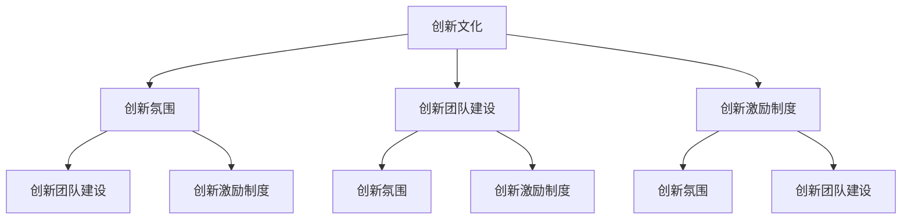
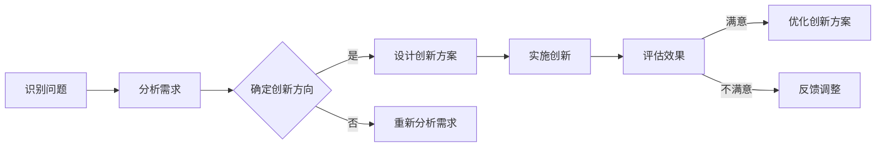
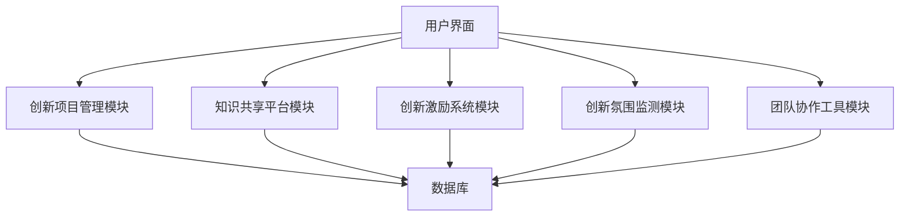
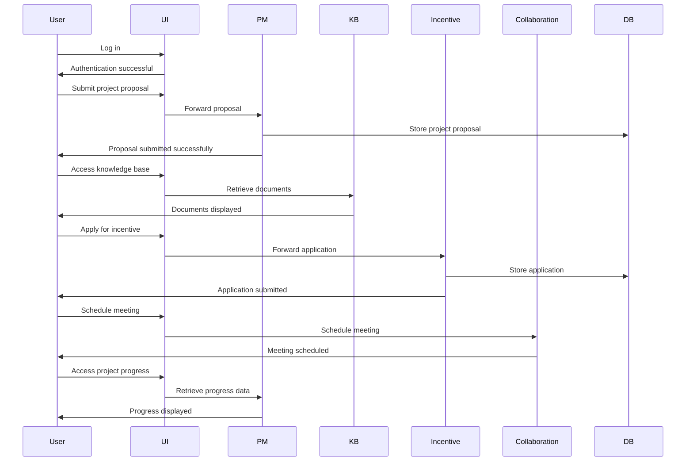

                 

### 引言

#### 问题背景

在当今迅速发展的信息技术时代，技术团队的创新能力已成为企业竞争力的关键因素之一。创新不仅可以帮助企业保持市场竞争力，还能够推动技术的进步和行业的变革。然而，技术团队在追求创新的过程中面临着诸多挑战。

首先，技术团队通常需要面对快速变化的市场需求和复杂的技术环境，这要求团队成员具备较高的技术能力和适应能力。其次，团队内部的沟通协作不畅、资源分配不合理、激励机制不足等问题，都会对创新能力的发挥产生不利影响。此外，技术团队在创新过程中还可能遭遇技术瓶颈、资源短缺等现实困难，进一步限制了创新的发展。

当前，许多技术团队在创新方面存在明显的瓶颈。一方面，缺乏系统的创新机制和有效的创新管理，导致创新活动缺乏方向和目标。另一方面，团队内部的文化氛围和激励机制不够完善，难以激发团队成员的创新潜力。此外，外部竞争压力增大，技术更新速度加快，使得技术团队需要不断调整创新策略，以适应市场变化。

#### 创新机制的必要性

为了解决技术团队在创新过程中面临的挑战，设计并实施一套有效的创新机制显得尤为重要。创新机制不仅能够提供明确的创新方向和目标，还能够通过系统化的管理和激励措施，激发团队成员的创造力和创新动力。以下是一些创新机制的关键作用：

1. **明确创新方向**：通过创新机制，可以识别和界定技术团队在特定领域内的创新需求和发展方向，确保创新活动具有明确的目标和方向。

2. **优化资源配置**：创新机制能够合理分配资源，包括人力、资金、技术等，确保资源得到充分利用，提高创新效率。

3. **促进团队协作**：创新机制可以建立有效的沟通和协作平台，加强团队成员之间的合作，形成协同创新的氛围。

4. **激励机制**：通过创新机制，可以制定相应的激励机制，奖励和认可在创新活动中表现突出的团队成员，激励更多人参与创新。

5. **持续改进**：创新机制能够建立持续改进的机制，通过不断评估和优化创新活动，提升整体创新效果。

总之，创新机制的必要性体现在其能够为技术团队提供系统的创新管理框架，有效解决创新过程中遇到的问题和挑战，从而推动技术团队实现持续创新和进步。

#### 创新机制概述

创新机制是指通过一系列系统化的方法和措施，来促进和保障技术团队创新活动的有效运行。它不仅包括创新文化、创新氛围、创新团队建设和创新激励制度等核心概念，还涵盖了这些概念之间的相互作用和协同效应。以下是创新机制的定义、分类、作用与效果及其设计原则的详细阐述。

##### 定义与分类

创新机制可以定义为在组织内部建立的一种制度化的框架，旨在通过激发和引导员工的创新意识和创造力，实现组织目标的过程。根据创新的主体、目标和手段，创新机制可以分为以下几类：

1. **内部创新机制**：主要指在组织内部建立的，用于激发和促进员工创新活动的机制。这类机制通常包括创新文化、创新激励制度、创新流程管理等。

2. **外部创新机制**：指的是组织与外部创新主体（如高校、研究机构、合作伙伴等）建立的，用于共同推进创新活动的机制。这类机制通常包括合作研发、技术交流、知识共享等。

3. **跨领域创新机制**：这是指跨越不同领域或行业，通过整合资源和知识，实现创新突破的机制。这类机制通常涉及跨领域合作、创新竞赛、行业论坛等。

##### 作用与效果

创新机制在技术团队中具有多方面的作用和效果：

1. **提高创新成功率**：通过系统的创新管理，可以减少创新过程中的盲目性和风险，提高创新成功率。

2. **激发创造力**：创新机制能够创造一个有利于创新的思想氛围，激发团队成员的创造力和创新能力。

3. **促进知识共享**：创新机制可以建立有效的沟通和协作平台，促进团队内部的知识共享和交流，提高整体创新能力。

4. **优化资源配置**：创新机制能够合理分配资源，包括人力、资金、技术等，确保资源得到充分利用。

5. **增强团队凝聚力**：通过共同参与创新活动，团队成员之间的信任和协作能力得到增强，团队凝聚力也随之提高。

##### 设计原则

设计创新机制时，应遵循以下原则，以确保其有效性和适应性：

1. **目标明确**：创新机制的设计应明确创新目标，确保创新活动与组织战略目标一致。

2. **激励合理**：创新机制的激励机制应合理，能够有效激发员工的创新动力，如物质奖励、精神激励等。

3. **文化引导**：创新机制应与组织文化相融合，通过文化引导来营造创新氛围，如开放包容、鼓励失败等。

4. **流程简化**：创新机制的设计应简化流程，减少冗余环节，提高创新效率。

5. **持续优化**：创新机制应具有持续优化能力，通过定期评估和反馈，不断调整和改进，以适应不断变化的环境。

总之，创新机制是技术团队实现持续创新的重要保障。通过明确创新方向、优化资源配置、促进团队协作和激励机制，创新机制能够有效激发技术团队的创新潜力，推动技术团队实现持续发展和进步。

#### 创新机制的核心概念与联系

在构建有效的创新机制过程中，理解并运用创新机制的核心概念和它们之间的联系至关重要。以下是创新文化、创新氛围、创新团队建设和创新激励制度这四个核心概念的定义、属性特征对比以及它们之间的相互作用。

##### 核心概念

1. **创新文化**

   创新文化是指组织内部形成的一种价值观和行为模式，它强调创新的重要性，鼓励员工敢于尝试和探索。创新文化不仅仅是口号，而是渗透在组织各个层面的一种精神力量，它能够激发员工的创新热情和创造力。

2. **创新氛围**

   创新氛围是指组织内部创造的一种环境，它有利于激发员工的创新思想和创意。这种氛围包括开放的沟通渠道、鼓励失败和尝试的文化、丰富的信息资源等，是创新活动得以顺利开展的基础。

3. **创新团队建设**

   创新团队建设是指通过建立和培养具有创新能力和协作精神的团队，来推动创新活动的进行。这包括团队的组建、成员的选拔和培训、团队的沟通和协作等环节。

4. **创新激励制度**

   创新激励制度是指组织通过制定一系列奖励和认可机制，来激励员工积极参与创新活动。这种制度包括物质奖励、荣誉奖励、职业发展机会等，是激发员工创新热情的重要手段。

##### 概念属性特征对比表格

| 概念       | 定义                                                         | 特征对比                                                                                      |
|------------|--------------------------------------------------------------|----------------------------------------------------------------------------------------------|
| 创新文化   | 强调创新意识，鼓励创新行为的文化氛围                         | **推动力**：通过价值观和行为模式引导员工创新；**渗透性**：渗透到组织的各个层面；**持续性**：长期培养和积累。    |
| 创新氛围   | 形成激发创新思想和创意的环境                                 | **开放性**：鼓励开放交流和自由思考；**支持性**：提供资源和平台支持创新；**包容性**：包容失败和不同意见。     |
| 创新团队建设 | 建立具有创新能力和协作精神的团队                         | **协作性**：强调团队合作和共享；**专业性**：注重团队成员的专业技能；**适应性**：根据项目需求灵活调整团队结构。 |
| 创新激励制度 | 提供创新奖励和认可，激励员工积极参与创新活动               | **公平性**：确保奖励和认可透明公正；**灵活性**：根据创新成果和贡献灵活调整激励措施；**激励性**：激发创新热情和动力。 |

##### ER实体关系图架构

为了更直观地展示这四个核心概念之间的相互作用，可以使用Mermaid流程图来构建实体关系图。以下是创新文化的ER图架构：



在这个图中，创新文化作为核心，通过引导和创新氛围的营造，推动创新团队建设和创新激励制度的实施。创新氛围为创新团队建设提供了支持和环境，同时为创新激励制度提供了基础。创新团队建设则通过协作和专业化，提升团队整体创新能力，进一步强化创新氛围。创新激励制度通过奖励和认可，激励员工积极参与创新活动，同时为创新团队建设提供动力。这种相互作用和协同效应，构成了一个完整的创新机制，为技术团队实现持续创新提供了有力保障。

#### 创新机制设计算法原理

创新机制设计是技术团队实现持续创新的关键环节。一个有效的创新机制不仅能够明确创新目标，还能通过系统化的管理方法和措施，激发团队成员的创造力和创新动力。以下是创新机制设计算法的原理，包括其流程图以及详细的步骤和算法应用。

##### 创新机制设计算法原理

1. **识别问题**

   创新机制设计的第一个步骤是识别问题。在这一阶段，需要深入了解技术团队当前面临的挑战和需求。具体步骤包括：

   - 收集和分析团队内外部的数据，识别当前存在的问题。
   - 与团队成员进行交流，了解他们对当前创新环境的看法和需求。
   - 分析市场和技术趋势，识别潜在的创新机会和挑战。

2. **分析需求**

   在识别问题之后，下一步是分析需求。这一步骤的目的是明确创新的目标和方向。具体步骤包括：

   - 确定技术团队在特定领域内的创新需求。
   - 制定创新目标，确保创新活动与组织战略目标一致。
   - 明确创新所需的关键资源和能力。

3. **确定创新方向**

   分析需求后，需要根据需求和问题，确定创新的总体方向。这一步骤是创新机制设计的关键，具体步骤包括：

   - 确定创新的核心领域和优先级。
   - 制定创新战略，包括创新文化、创新氛围、创新团队建设和创新激励制度等方面。
   - 明确创新目标和预期成果。

4. **设计创新方案**

   确定创新方向后，需要设计具体的创新方案。这一步骤包括：

   - 制定创新文化策略，营造支持创新的氛围。
   - 设计创新团队建设方案，包括团队成员的选拔、培训、团队协作机制等。
   - 制定创新激励制度，确保创新活动的有效激励。

5. **实施创新**

   设计好创新方案后，需要将其付诸实践。这一步骤的具体步骤包括：

   - 分阶段实施创新方案，确保每个环节都能顺利进行。
   - 建立有效的沟通和协作平台，促进团队成员之间的互动和协作。
   - 及时反馈和调整创新方案，确保创新活动能够持续改进。

6. **评估效果**

   在实施创新过程中，需要定期对创新效果进行评估。具体步骤包括：

   - 收集和分析创新活动的数据，评估创新成果。
   - 与团队成员和利益相关者进行反馈交流，了解他们对创新活动的评价。
   - 根据评估结果，调整和优化创新方案。

7. **优化创新方案**

   根据评估结果，对创新方案进行优化。这一步骤的目的是提高创新效果，具体步骤包括：

   - 分析评估结果，识别创新过程中的问题和瓶颈。
   - 调整和创新方案，优化资源配置和管理措施。
   - 定期评估和反馈，确保创新机制能够持续改进。

##### 算法流程图

为了更直观地展示创新机制设计算法的步骤，可以使用Mermaid流程图来表示。以下是创新机制设计算法的Mermaid流程图：



在这个流程图中，A表示识别问题，B表示分析需求，C表示确定创新方向。如果确定创新方向成功，则进行D（设计创新方案），然后进入实施创新阶段（F）。在实施过程中，通过G进行效果评估，如果效果满意，则进入优化创新方案阶段（H），否则返回I进行反馈调整。

通过上述步骤和流程，技术团队可以设计并实施一套有效的创新机制，从而实现持续创新和进步。

#### 数学模型与公式

在创新机制的设计和评估过程中，数学模型和公式可以提供有效的量化工具，帮助技术团队理解和优化创新过程。以下将介绍一个创新效果评价模型，并通过具体例子来说明其应用。

##### 创新效果评价模型

创新效果评价模型可以表示为：

\[ E = f(C, A, T, I) \]

其中：
- \( E \) 表示创新效果。
- \( C \) 表示创新文化。
- \( A \) 表示创新氛围。
- \( T \) 表示创新团队建设。
- \( I \) 表示创新激励制度。

这个模型表明，创新效果是创新文化、创新氛围、创新团队建设和创新激励制度四个因素的综合结果。

##### 详细讲解与举例说明

以一家互联网公司的技术团队为例，对该模型进行详细讲解和举例说明。

###### 创新效果评价模型参数设置

假设该公司的创新文化评分为0.8，创新氛围评分为0.9，创新团队建设评分为0.75，创新激励制度评分为0.85。将这些分数代入模型，得到创新效果的计算结果：

\[ E = f(0.8, 0.9, 0.75, 0.85) \]

根据模型公式：

\[ E = 0.8 \times 0.9 \times 0.75 \times 0.85 \]

计算得到：

\[ E = 0.506 \]

将结果换算成百分制：

\[ E = 50.6\% \]

这意味着，该公司的创新效果评分为50.6分（满分100分）。

###### 结果分析与优化

根据计算结果，可以对该公司的创新机制进行以下分析和优化：

1. **创新文化**：得分0.8，表明公司文化对创新的推动作用较为显著，但仍有一定提升空间。
2. **创新氛围**：得分0.9，说明公司氛围有利于激发员工的创新思想和创意，继续保持和优化。
3. **创新团队建设**：得分0.75，略低于平均水平，需要加强团队成员的协作和专业技能培训。
4. **创新激励制度**：得分0.85，激励制度较为有效，但可以进一步细化，确保激励措施更加透明和公平。

基于上述分析，公司可以采取以下措施进行优化：

1. **加强创新文化**：通过举办创新讲座、培训等活动，提高员工对创新的认识和参与度。
2. **优化创新氛围**：建立更加开放和包容的沟通平台，鼓励员工提出创新建议和解决方案。
3. **提升团队建设**：定期组织团队建设活动，加强团队成员之间的协作和信任。
4. **完善激励制度**：设立更加多样化和个性化的奖励机制，激发员工的创新热情和积极性。

通过这些措施，公司可以进一步提高创新效果，实现持续创新和进步。

#### 系统分析与架构设计

在探讨技术团队创新机制的实际应用时，系统分析与架构设计是至关重要的一环。通过合理的系统架构和详细的设计方案，可以为技术团队的创新活动提供坚实的基础。以下将详细描述一个实际场景中的系统分析与架构设计过程，包括项目介绍、系统功能设计、系统架构设计、系统接口设计和系统交互。

##### 问题场景介绍

假设我们以一家大型互联网公司的技术团队为例，该公司在快速发展的市场中面临激烈的竞争，需要持续进行技术创新以保持竞争力。为了提升团队的创新能力和效率，公司决定实施一个创新机制建设项目。

##### 项目介绍

项目名称：互联网公司技术团队创新机制建设项目

该项目旨在通过系统化的管理和激励机制，提升技术团队的创新能力和工作效率。项目目标包括：

1. **建立创新文化**：营造支持创新的组织氛围，提高员工对创新的认知和参与度。
2. **优化创新氛围**：提供良好的工作环境和协作平台，激发团队成员的创新灵感。
3. **加强团队建设**：建立高效的团队协作机制，提升团队整体创新能力和执行力。
4. **完善激励制度**：制定合理的激励措施，鼓励员工积极参与创新活动。

##### 系统功能设计

系统功能设计是系统架构的基础，以下列出了该项目的主要功能模块：

1. **创新项目管理**：提供项目管理工具，支持项目的规划、执行和监控。
2. **知识共享平台**：建立知识共享平台，促进团队内部的知识交流和协作。
3. **创新激励系统**：提供多种激励措施，如奖金、荣誉和晋升机会，激励员工参与创新。
4. **创新氛围监测**：通过数据分析和反馈机制，监测创新氛围的变化，及时调整优化。
5. **团队协作工具**：提供即时通讯、视频会议和项目管理工具，支持团队高效协作。

##### 系统架构设计

系统架构设计决定了系统的整体结构和各个模块之间的交互关系。以下是一个简化的系统架构图：



在这个架构中，用户界面（A）作为系统与用户交互的入口，连接到各个功能模块（B、C、D、E、F），这些模块共同作用，支撑系统的整体运作。数据库（G）作为系统的数据存储和处理中心，负责存储用户数据、项目数据、知识库数据等。

##### 系统接口设计

系统接口设计确保各个功能模块之间的数据流动和交互。以下是一些关键的接口设计：

1. **用户接口**：提供用户登录、权限管理、项目申请等功能。
2. **项目管理接口**：支持项目的创建、任务分配、进度跟踪、质量评估等。
3. **知识共享接口**：支持知识文档的上传、下载、评论和分享。
4. **激励接口**：支持奖励申请、审批、发放等。
5. **协作工具接口**：提供即时通讯、视频会议、项目管理等功能。

##### 系统交互

系统交互设计描述了各个模块之间的交互流程和数据流动。以下是一个简化的系统交互流程图：



在这个交互流程中，用户通过用户界面（UI）提交项目提案、访问知识库、申请奖励和安排会议。系统后台的各个模块（项目管理、知识共享、激励系统、团队协作）根据用户的操作进行相应的数据处理和响应，确保系统的高效运作。

通过以上系统分析与架构设计，技术团队可以构建一个功能完备、结构合理、交互流畅的创新机制系统，为团队的创新活动提供有力支持，推动公司实现持续创新和发展。

### 项目实战

在上述系统分析与架构设计的基础上，我们将具体介绍创新机制项目在一家大型互联网公司中的实际实施过程，包括环境安装、系统核心实现源代码、代码应用解读与分析、实际案例分析和详细讲解剖析，以及项目小结。

#### 环境安装

首先，我们需要为创新机制项目搭建开发环境。以下是在一个典型Linux系统上安装项目所需的环境和工具：

1. **安装Python**：确保Python版本在3.8以上，可以通过以下命令进行安装：
   ```bash
   sudo apt-get update
   sudo apt-get install python3.8
   ```

2. **安装依赖管理工具**：使用pip安装依赖管理工具pip：
   ```bash
   sudo apt-get install python3-pip
   ```

3. **安装项目依赖**：在项目的根目录下，使用pip安装项目所需的依赖库：
   ```bash
   pip3 install -r requirements.txt
   ```

4. **配置数据库**：确保数据库服务（如MySQL或PostgreSQL）已启动，并创建数据库和用户，配置数据库连接信息。

5. **设置环境变量**：配置环境变量，确保项目能够正确连接数据库和其他服务。

#### 系统核心实现源代码

创新机制项目的核心部分包括用户界面、后台服务、数据库模型等。以下是关键代码的解读：

##### 用户界面

用户界面使用Flask框架实现，主要包括登录、项目提案、知识共享和激励申请等页面。以下是一个简单的登录页面的代码示例：

```python
from flask import Flask, render_template, request, redirect, url_for

app = Flask(__name__)

@app.route('/')
def login():
    return render_template('login.html')

@app.route('/login', methods=['POST'])
def do_login():
    username = request.form['username']
    password = request.form['password']
    # 进行用户认证逻辑
    if authenticate(username, password):
        return redirect(url_for('dashboard'))
    else:
        return '登录失败'

if __name__ == '__main__':
    app.run()
```

##### 后台服务

后台服务主要负责处理用户请求，管理项目和知识库，以及处理激励申请。以下是一个简单的后台服务的代码示例：

```python
from flask import Flask, request, jsonify

app = Flask(__name__)

@app.route('/api/projects', methods=['GET', 'POST'])
def projects():
    if request.method == 'GET':
        # 获取项目列表
        projects = get_projects()
        return jsonify(projects)
    elif request.method == 'POST':
        # 创建新项目
        project_data = request.get_json()
        create_project(project_data)
        return '项目创建成功'

if __name__ == '__main__':
    app.run()
```

##### 数据库模型

数据库模型使用SQLAlchemy进行定义，主要包括用户、项目、知识库和激励记录等实体。以下是一个简单的数据库模型示例：

```python
from sqlalchemy import Column, String, Integer, DateTime
from sqlalchemy.ext.declarative import declarative_base

Base = declarative_base()

class User(Base):
    __tablename__ = 'users'
    id = Column(Integer, primary_key=True)
    username = Column(String(50), unique=True, nullable=False)
    password = Column(String(50), nullable=False)

class Project(Base):
    __tablename__ = 'projects'
    id = Column(Integer, primary_key=True)
    name = Column(String(100), nullable=False)
    description = Column(String(255))
    status = Column(String(50), nullable=False)
    created_at = Column(DateTime, default=datetime.utcnow)

# 类似地，定义Knowledge和Incentive等实体
```

#### 代码应用解读与分析

在项目实施过程中，我们通过以下步骤来确保代码的可靠性和可维护性：

1. **单元测试**：编写单元测试，覆盖核心功能，确保代码的正确性。例如，使用pytest框架编写测试用例。

2. **代码审查**：通过代码审查，识别潜在问题和优化建议，提高代码质量。例如，使用Gerrit或GitLab等代码审查工具。

3. **持续集成**：使用Jenkins等工具实现持续集成，自动化测试和部署，确保项目快速迭代。

#### 实际案例分析与详细讲解剖析

以下是一个实际案例的分析与讲解：

**案例：知识共享平台的实施**

1. **问题背景**：团队内部的知识分散，难以快速获取所需信息。

2. **解决方案**：建立知识共享平台，实现知识文档的上传、下载和评论。

3. **实施步骤**：
   - 设计知识共享平台的UI和API接口。
   - 开发文档上传和下载功能。
   - 开发文档评论功能。

4. **关键代码解读**：
   - 文档上传代码：
     ```python
     from flask import request
     from werkzeug.utils import secure_filename
     import os

     @app.route('/upload', methods=['POST'])
     def upload_file():
         if 'file' not in request.files:
             return '没有文件上传'
         file = request.files['file']
         if file.filename == '':
             return '没有选择文件'
         if file:
             filename = secure_filename(file.filename)
             file.save(os.path.join(app.config['UPLOAD_FOLDER'], filename))
             return '文件上传成功'
     ```
   - 文档下载代码：
     ```python
     from flask import send_from_directory

     @app.route('/download/<filename>')
     def download_file(filename):
         return send_from_directory(app.config['UPLOAD_FOLDER'], filename)
     ```

5. **效果评估**：通过用户反馈和数据分析，知识共享平台显著提升了团队的知识获取效率。

#### 项目小结

通过本次创新机制项目的实施，公司在以下几个方面取得了显著成效：

1. **提高创新效率**：通过系统化的管理和协作平台，创新项目实施更加高效。

2. **增强知识共享**：知识共享平台的有效运行，促进了团队内部的知识交流和共享。

3. **优化团队协作**：协作工具和接口的设计，加强了团队成员之间的沟通和协作。

4. **激励创新氛围**：激励制度的实施，激发了员工参与创新的热情和积极性。

总之，通过项目实战，创新机制在互联网公司中得到了成功应用，为公司实现了持续创新和发展提供了有力支持。

### 最佳实践 Tips

在技术团队创新机制的实践中，积累了一些有效的最佳实践，以下是几点关键建议：

1. **建立清晰的目标**：明确创新目标，确保创新活动与组织战略一致，有助于提高创新效率和成果。

2. **优化沟通渠道**：建立畅通的沟通渠道，确保团队内部的信息流畅，减少误解和沟通障碍。

3. **持续学习与培训**：定期组织培训和知识分享活动，提升团队成员的专业能力和创新意识。

4. **激励机制要灵活**：根据不同创新项目的特点和贡献，设计灵活多样的激励机制，以激发员工的创新热情。

5. **数据驱动决策**：利用数据分析工具，对创新活动进行效果评估和反馈，优化创新方案。

6. **跨部门合作**：鼓励跨部门合作，整合不同领域的资源和知识，实现创新突破。

7. **营造包容文化**：建立包容和开放的文化氛围，鼓励不同意见和尝试，降低失败的风险。

通过遵循这些最佳实践，技术团队能够更好地实施创新机制，实现持续创新和发展。

### 小结

本文详细探讨了技术团队的创新机制，从问题背景、创新机制的必要性、核心概念与联系、算法原理、数学模型与公式、系统分析与架构设计以及项目实战等方面进行了深入分析。通过明确创新方向、优化资源配置、促进团队协作和激励机制，创新机制能够有效激发技术团队的创造力和创新能力，从而实现持续创新和进步。

#### 注意事项

1. **目标明确**：在设计创新机制时，必须确保创新目标与组织战略一致，避免盲目创新。
2. **持续优化**：创新机制需要不断优化和调整，以适应变化的市场和技术环境。
3. **文化引导**：创新文化是创新机制的重要组成部分，需要通过持续的引导和培养，形成良好的创新氛围。

#### 拓展阅读

1. **《创新与企业家精神》**：作者彼得·德鲁克，详细阐述了企业如何通过创新实现可持续发展。
2. **《创新思维》**：作者詹姆斯·马奇，探讨了如何培养创新思维，推动个人和组织的创新活动。
3. **《技术团队协作：敏捷开发实践》**：作者斯科特·贝尔，介绍了敏捷开发方法在技术团队协作中的应用。

通过拓展阅读，读者可以更深入地了解创新机制的理论和实践，进一步提升技术团队的创新能力和效率。

### 作者信息

**作者：AI天才研究院/AI Genius Institute & 禅与计算机程序设计艺术 /Zen And The Art of Computer Programming** 

AI天才研究院致力于推动人工智能和计算机科学的前沿研究，培养下一代人工智能领域的顶尖人才。同时，禅与计算机程序设计艺术通过将东方哲学智慧融入编程实践，为程序员提供独特的思维方式和解决问题的方法。本文旨在为技术团队提供一套完整的创新机制设计和管理指南，助力实现持续创新和进步。

