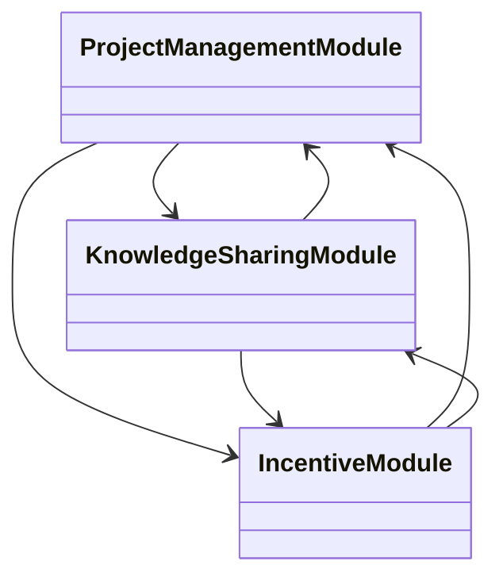
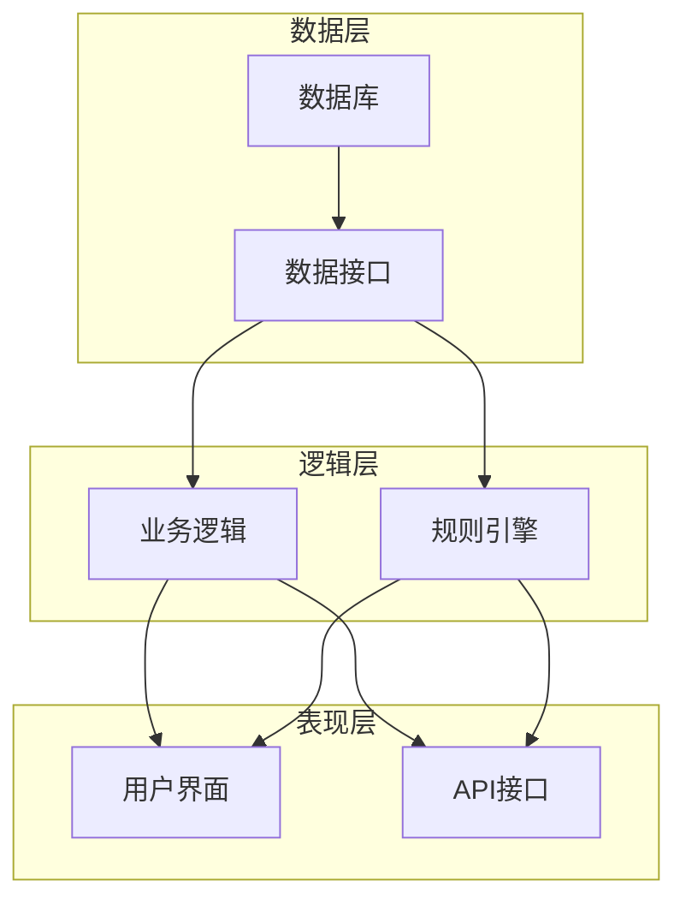
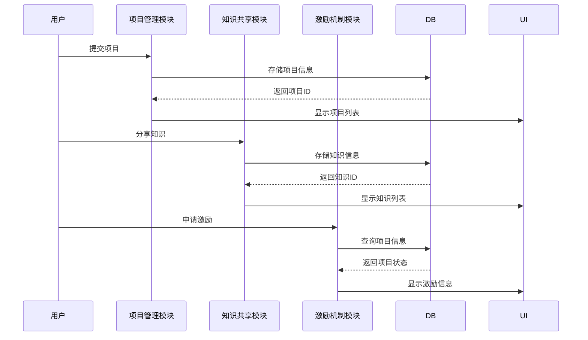

                 

### 创新机制：技术团队的生命力之源

**引言：**
在现代信息技术飞速发展的时代，技术团队的创新机制显得尤为重要。它不仅关乎企业的竞争力，更关乎整个团队的生存和发展。然而，如何构建一个有效的创新机制，成为摆在每个技术团队管理者面前的一道难题。本文将深入探讨技术团队的创新机制，通过逻辑清晰、结构紧凑、简单易懂的方式，逐步分析并解答这一难题。

**一、背景介绍**

**1.1 问题的提出：**
随着信息技术的快速发展，市场竞争愈发激烈，技术团队的创新显得尤为重要。然而，在实际操作中，许多技术团队面临着创新乏力、员工积极性不高等问题。如何激发技术团队的创新能力，成为亟待解决的问题。

**1.2 创新在技术团队中的作用：**
创新是技术团队的核心竞争力，它决定了团队在市场竞争中的地位。一个具备创新能力的团队，能够迅速响应市场变化，开发出满足用户需求的新产品或服务，从而提升企业的市场竞争力。

**1.3 当前技术团队创新的挑战与困境：**
（1）创新动力不足：许多技术团队成员对创新的重视程度不够，缺乏内在驱动力。

（2）创新资源有限：技术团队在人员、资金、时间等方面往往存在限制，难以全面支持创新活动。

（3）创新氛围不足：缺乏鼓励创新的文化氛围，技术团队成员不敢冒险尝试。

**二、核心概念与联系**

**2.1 创新的定义与类型：**
创新是指通过新的思路、方法或技术，实现产品、服务或流程的改进或创造。根据创新的性质和目标，可以分为渐进式创新、颠覆性创新、产品创新、过程创新等。

**2.2 创新机制的定义与作用：**
创新机制是指一系列制度、流程和文化，旨在激发和引导技术团队的创新能力。创新机制的作用包括：提高创新效率、降低创新风险、激励创新人才等。

**2.3 核心概念之间的联系与互动：**
创新、创新机制、技术团队三者之间相互影响、相互作用。创新是技术团队的目标，创新机制是实现目标的手段，技术团队是创新的主体。创新机制的完善与否，直接影响到技术团队的创新能力。

**三、创新机制的设计原则**

**3.1 创新思维模型：**
创新思维模型是指一系列思维方法和工具，用于激发技术团队的创新能力。常见的创新思维模型包括：TRIZ、六顶思考帽、头脑风暴等。

**3.2 制度设计的基本原理：**
制度设计的基本原理包括：公平性、透明性、激励性、灵活性等。公平性保证每个团队成员都有机会参与创新；透明性确保团队成员了解创新机制的具体内容和流程；激励性激励团队成员积极参与创新活动；灵活性适应不同类型和规模的创新项目。

**3.3 创新激励机制的设计方法：**
创新激励机制的设计方法包括：薪酬激励、股权激励、荣誉激励等。薪酬激励通过提高创新成果的报酬，激发团队成员的创新热情；股权激励通过给予团队成员公司股权，增加其长期创新的动力；荣誉激励通过表彰创新成果，提升团队成员的荣誉感和成就感。

**四、数学模型和数学公式讲解**

**4.1 数学模型的基本概念：**
数学模型是一种用数学语言描述现实世界问题的抽象模型，包括变量、方程、函数等。

**4.2 数学模型在创新机制设计中的具体应用：**
数学模型可以用于分析创新活动的效率、风险、成本等。例如，通过回归分析预测创新成果的概率，通过决策树分析创新项目的优先级，通过博弈论分析团队成员的合作与竞争关系。

**4.3 数学模型的应用实例：**
以创新项目的成功率为例，假设影响项目成功率的因素有技术难度、市场前景、团队能力等，可以通过多元回归模型分析各因素对项目成功率的影响。

**五、系统分析与架构设计方案**

**5.1 创新机制系统概述：**
创新机制系统包括创新思维模块、制度设计模块、激励机制模块等。各模块相互独立，又相互联系，共同构成一个完整的创新机制。

**5.2 创新机制系统的功能设计：**
创新机制系统的功能设计包括：创新思维培训、创新项目申请、创新成果评审、创新激励机制运行等。

**5.3 创新机制系统的架构设计：**
创新机制系统的架构设计采用分层架构，包括：数据层、逻辑层、表现层等。数据层负责存储和管理创新数据；逻辑层负责实现创新机制的核心功能；表现层负责用户界面和交互设计。

**六、项目实战**

**6.1 项目背景与目标：**
以某科技公司为例，该公司希望在一年内实现技术产品的创新，提升市场竞争力。

**6.2 项目环境搭建：**
搭建创新机制系统，包括：技术基础设施、制度文件、激励机制方案等。

**6.3 项目关键步骤与实现：**
（1）创新思维培训：对团队成员进行创新思维培训，提高其创新能力。

（2）创新项目申请：鼓励团队成员提出创新项目，并进行项目评审。

（3）创新成果评审：对创新项目进行评审，确定其是否达到预期目标。

（4）创新激励机制运行：根据创新成果，运行激励机制，激励团队成员。

**6.4 项目评估与改进：**
对创新机制项目进行评估，分析其效果，并根据评估结果进行改进。

**七、最佳实践 tips**

**7.1 最佳实践总结：**
通过项目实战，总结出以下最佳实践：

（1）重视创新思维培训，提高团队成员创新能力。

（2）建立透明、公平、灵活的创新机制，激励团队成员积极参与。

（3）注重创新项目的实施过程，确保创新成果落地。

**7.2 注意事项与风险防范：**
（1）避免创新机制的僵化，要根据实际情况进行调整。

（2）防范创新项目的风险，做好风险控制和管理。

（3）注重团队成员的反馈，及时调整创新机制。

**7.3 拓展阅读与资源推荐：**
（1）推荐阅读《创新者的窘境》、《创新者的基因》等书籍。

（2）推荐关注国内外知名科技公司的创新案例，学习其成功经验。

**结论：**
技术团队的创新机制是推动团队发展和企业竞争的关键。通过本文的探讨，我们希望能够为技术团队管理者提供一些有益的思路和方法。让我们共同努力，构建一个富有创新活力的技术团队，为企业的持续发展注入新的动力。

**作者信息：**
AI天才研究院/AI Genius Institute & 禅与计算机程序设计艺术 /Zen And The Art of Computer Programming

----------------------------------------------------------------

## 技术团队的创新机制：鼓励创新的制度设计

关键词：技术团队、创新机制、制度设计、创新能力、激励机制

摘要：本文从技术团队的背景介绍出发，深入分析了创新在技术团队中的作用，以及当前技术团队创新的挑战与困境。在此基础上，阐述了创新机制的定义与作用，以及创新机制的设计原则。通过数学模型和系统分析与架构设计的方法，详细讲解了创新机制的设计方法和应用实例。最后，通过项目实战和最佳实践 tips，为技术团队的创新机制设计提供了具体的实施方法和注意事项。

### 目录

第一部分：背景介绍

1.1 问题的提出

1.2 创新在技术团队中的作用

1.3 当前技术团队创新的挑战与困境

第二部分：核心概念与联系

2.1 创新的定义与类型

2.2 创新机制的定义与作用

2.3 核心概念之间的联系与互动

第三部分：算法原理讲解

3.1 创新思维模型

3.2 制度设计的基本原理

3.3 创新激励机制的设计方法

第四部分：数学模型和数学公式讲解

4.1 数学模型的基本概念

4.2 数学模型在创新机制设计中的具体应用

4.3 数学模型的应用实例

第五部分：系统分析与架构设计方案

5.1 创新机制系统概述

5.2 创新机制系统的功能设计

5.3 创新机制系统的架构设计

第六部分：项目实战

6.1 项目背景与目标

6.2 项目环境搭建

6.3 项目关键步骤与实现

6.4 项目评估与改进

第七部分：最佳实践 tips

7.1 最佳实践总结

7.2 注意事项与风险防范

7.3 拓展阅读与资源推荐

----------------------------------------------------------------

## 第一部分：背景介绍

### 1.1 问题的提出

在现代信息技术飞速发展的时代，技术团队的创新显得尤为重要。创新不仅是技术团队的核心竞争力，更是企业持续发展的动力源泉。然而，许多技术团队在实际操作中面临着创新动力不足、创新资源有限、创新氛围不足等挑战。如何构建一个有效的创新机制，成为每个技术团队管理者亟待解决的问题。

### 1.2 创新在技术团队中的作用

创新在技术团队中起着至关重要的作用。首先，创新能够提升技术团队的竞争力。在激烈的市场竞争中，只有不断创新，才能满足用户的需求，赢得市场份额。其次，创新能够激发技术团队的活力。一个充满创新活力的团队，能够激发团队成员的积极性和创造力，提高团队的整体绩效。此外，创新还能够促进企业的可持续发展。通过不断创新，企业能够适应市场的变化，保持竞争优势，实现长期发展。

### 1.3 当前技术团队创新的挑战与困境

尽管创新在技术团队中具有重要性，但当前许多技术团队在创新方面仍然面临着一些挑战和困境。

**1. 动力不足：**许多技术团队成员对创新的重视程度不够，缺乏内在驱动力。这可能与团队成员的价值观、工作压力等因素有关。

**2. 资源有限：**技术团队在人员、资金、时间等方面往往存在限制，难以全面支持创新活动。这可能导致创新项目无法顺利推进，影响创新效果。

**3. 环境不足：**缺乏鼓励创新的文化氛围，技术团队成员不敢冒险尝试。这可能导致团队成员的创新潜力无法得到充分发挥。

**4. 管理困境：**许多技术团队在创新管理方面存在不足，缺乏有效的创新激励机制和评估体系。这可能导致创新项目缺乏方向，无法达到预期目标。

### 1.4 创新机制的必要性

为了克服以上挑战和困境，构建一个有效的创新机制显得尤为必要。创新机制是一种制度化的安排，旨在激发和引导技术团队的创新能力。一个有效的创新机制，能够为技术团队提供清晰的创新方向、充足的创新资源、良好的创新环境，以及合理的创新激励机制。

通过创新机制，技术团队可以：

**1. 提高创新能力：**创新机制能够帮助团队成员建立创新思维，提供创新工具和方法，提高团队成员的创新能力。

**2. 优化创新流程：**创新机制能够规范创新项目的管理流程，确保创新项目有序推进，提高创新效率。

**3. 激励创新人才：**创新机制能够建立合理的激励机制，激发团队成员的创新热情，吸引和留住优秀创新人才。

**4. 促进可持续发展：**创新机制能够帮助技术团队适应市场的变化，推动企业的长期发展。

### 1.5 创新机制的定义与作用

创新机制是指一系列制度、流程和文化，旨在激发和引导技术团队的创新能力。创新机制包括创新思维模型、制度设计、激励机制等多个方面。创新机制的作用包括：

**1. 提高创新效率：**创新机制能够规范创新项目的管理流程，提高创新项目的成功率。

**2. 降低创新风险：**创新机制能够通过风险评估和风险控制，降低创新项目的失败风险。

**3. 激励创新人才：**创新机制能够建立合理的激励机制，激发团队成员的创新热情。

**4. 促进知识共享：**创新机制能够促进团队成员之间的知识共享和交流，提高团队的整体创新能力。

**5. 培养创新文化：**创新机制能够营造鼓励创新的文化氛围，促进团队成员的创新意识和创新能力。

### 1.6 创新机制的设计原则

为了构建一个有效的创新机制，需要遵循以下设计原则：

**1. 公平性原则：**创新机制应当保证每个团队成员都有机会参与创新，避免偏袒和歧视。

**2. 透明性原则：**创新机制应当具有明确的流程和标准，确保团队成员了解创新机制的具体内容和流程。

**3. 激励性原则：**创新机制应当通过合理的激励机制，激发团队成员的创新热情。

**4. 灵活性原则：**创新机制应当具有一定的灵活性，能够适应不同的创新项目和团队需求。

**5. 可持续原则：**创新机制应当具备可持续性，能够长期激励团队成员的创新行为。

### 1.7 创新机制的核心要素

创新机制的核心要素包括：

**1. 创新思维模型：**创新思维模型是激发团队成员创新思维的工具，包括发散思维、收敛思维、逆向思维等。

**2. 制度设计：**制度设计是创新机制的基础，包括创新项目的申报、评审、实施等流程。

**3. 激励机制：**激励机制是创新机制的驱动力量，包括薪酬激励、股权激励、荣誉激励等。

**4. 文化氛围：**文化氛围是创新机制的环境保障，包括鼓励创新、尊重创新、包容失败等。

**5. 知识共享：**知识共享是创新机制的持续动力，包括内部知识共享、外部知识引进等。

### 1.8 创新机制的实施步骤

构建创新机制的步骤包括：

**1. 明确创新目标：**根据企业的战略目标，明确技术团队的创新目标。

**2. 设计创新流程：**设计创新项目的申报、评审、实施等流程，确保创新项目有序推进。

**3. 制定激励机制：**制定合理的激励机制，激发团队成员的创新热情。

**4. 培养创新文化：**营造鼓励创新的文化氛围，促进团队成员的创新意识和创新能力。

**5. 实施创新项目：**按照创新流程，实施创新项目，确保创新成果落地。

**6. 评估与改进：**对创新机制的实施效果进行评估，并根据评估结果进行改进。

### 1.9 创新机制的案例研究

为了更好地理解创新机制的实施过程，我们可以通过一些成功的案例来进行研究。例如，某知名科技公司通过构建创新机制，成功推动了多项技术创新，取得了显著的市场份额和品牌影响力。该公司的创新机制包括：

**1. 创新思维培训：**定期组织创新思维培训，提高团队成员的创新思维和能力。

**2. 创新项目申报：**鼓励团队成员提出创新项目，并提供申报通道。

**3. 创新项目评审：**建立创新项目评审机制，确保创新项目的质量和可行性。

**4. 创新激励机制：**设立创新奖励基金，对创新成果显著的团队成员进行奖励。

**5. 知识共享平台：**搭建内部知识共享平台，促进团队成员之间的知识交流。

**6. 创新文化宣传：**通过内部刊物、海报、讲座等形式，宣传创新文化，营造鼓励创新的氛围。

### 1.10 结论

构建一个有效的创新机制，对于技术团队的发展具有重要意义。通过本文的探讨，我们希望能够为技术团队管理者提供一些有益的思路和方法。让我们共同努力，构建一个富有创新活力的技术团队，为企业的持续发展注入新的动力。

----------------------------------------------------------------

## 第二部分：核心概念与联系

在探讨技术团队的创新机制之前，我们需要了解一些核心概念，并分析它们之间的联系。这些核心概念包括创新、创新机制、技术团队等。通过对这些概念的定义、属性特征和相互关系的阐述，我们将为后续的讨论提供理论基础。

### 2.1 创新的定义与类型

**创新的定义：**
创新是一种通过新思路、新方法或新技术实现产品、服务或流程改进或创造的过程。创新不仅仅局限于技术领域，它涵盖了经济、社会、文化等各个方面。在技术团队中，创新通常指的是通过新技术或新方法改进现有产品或服务，开发出新产品或新功能。

**创新类型：**
根据创新的性质和目标，可以分为以下几种类型：

- **渐进式创新（Continuous Innovation）：**指对现有产品或服务进行逐步改进，提高其性能、效率或用户体验。这种创新通常是一种持续的过程，能够在不改变产品基本功能的前提下，实现不断的优化。

- **颠覆性创新（Disruptive Innovation）：**指一种能够彻底改变市场格局和用户行为模式的新产品或新服务。颠覆性创新通常由新兴企业发起，通过提供更便宜、更便捷、更符合用户需求的产品或服务，颠覆传统市场。

- **产品创新（Product Innovation）：**指对产品本身的创新，包括功能、设计、材料等方面的改进。产品创新通常能够带来显著的用户价值，提高产品的市场竞争力。

- **过程创新（Process Innovation）：**指对生产或服务过程进行改进，以提高效率、降低成本或提高质量。过程创新通常涉及到生产流程、供应链管理、服务流程等方面的优化。

### 2.2 创新机制的定义与作用

**创新机制的定义：**
创新机制是一种制度化的安排，旨在激发和引导技术团队的创新能力。创新机制包括一系列制度、流程和文化，如创新项目管理流程、激励机制、知识共享机制等。创新机制的设计目的是为了确保技术团队能够持续、高效地进行创新活动。

**创新机制的作用：**
创新机制在技术团队中发挥着关键作用，具体包括：

- **提高创新效率：**通过规范化的创新流程和标准化的操作，减少创新活动的随意性和不确定性，提高创新效率。

- **降低创新风险：**通过风险评估、风险控制和创新项目管理，降低创新项目的失败风险。

- **激励创新人才：**通过合理的激励机制，如薪酬激励、股权激励等，激发团队成员的创新热情，留住优秀创新人才。

- **促进知识共享：**通过建立知识共享平台和知识交流机制，促进团队成员之间的知识传递和共享，提高团队的整体创新能力。

- **培养创新文化：**通过营造鼓励创新、尊重创新、包容失败的文化氛围，培养团队成员的创新意识和创新能力。

### 2.3 技术团队的定义与角色

**技术团队的定义：**
技术团队是由一群具有专业技能和知识背景的人员组成，负责开发和实现技术解决方案的团队。技术团队通常包括软件工程师、系统架构师、数据科学家、产品经理等职位。技术团队是企业创新的核心力量，承担着推动技术创新和产品开发的重要职责。

**技术团队的角色：**
技术团队在企业中扮演着以下角色：

- **研发创新：**技术团队负责研发新技术、新方法，推动产品创新和过程创新。

- **解决方案提供：**技术团队为业务部门提供技术解决方案，支持企业的业务发展。

- **技术支持：**技术团队负责解决产品开发过程中遇到的技术问题，确保产品的技术质量和稳定性。

- **知识传播：**技术团队通过内部培训和知识分享，提升团队的整体技术水平。

### 2.4 核心概念之间的联系与互动

创新、创新机制、技术团队这三个核心概念之间存在密切的联系和互动。具体表现为：

- **创新是技术团队的目标：**技术团队的使命是通过创新推动企业的发展。创新是技术团队的核心工作内容，是团队存在的价值所在。

- **创新机制是实现创新目标的手段：**创新机制为技术团队提供了实现创新目标的方法和工具。通过创新机制，技术团队可以系统化、规范地进行创新活动，提高创新效率。

- **技术团队是创新机制的主体：**技术团队是创新机制的执行者。创新机制的制定和实施需要依靠技术团队的实际操作和反馈，只有技术团队真正参与到创新过程中，创新机制才能真正发挥作用。

通过上述分析，我们可以看到，创新、创新机制、技术团队三者之间相互影响、相互作用，共同构成了一个完整的创新体系。理解这三个核心概念及其相互关系，是构建和实施有效创新机制的基础。

### 2.5 案例分析：创新机制在技术团队中的应用

为了更好地理解创新机制在技术团队中的应用，我们可以通过一个实际案例来进行具体分析。以下是一个某大型互联网公司的创新机制应用案例：

**案例背景：**
某大型互联网公司为了提升其在线广告系统的竞争力，决定构建一个创新机制，以激发技术团队的创新热情和创新能力。

**创新机制设计：**
1. **创新思维培训：**公司定期组织创新思维培训，提高团队成员的创新思维和能力。培训内容包括创新方法论、思维技巧等。

2. **创新项目管理：**公司建立了一套创新项目管理流程，包括项目申报、评审、实施和评估等环节。项目申报阶段，团队成员可以自由提出创新项目，经过评审后确定项目的优先级和资源分配。

3. **激励机制：**公司设立创新奖励基金，对创新项目成功实施和取得显著成果的团队成员进行奖励。奖励形式包括现金奖励、股权激励等。

4. **知识共享平台：**公司搭建了一个内部知识共享平台，鼓励团队成员分享创新经验和研究成果。知识共享平台包括博客、论坛、知识库等模块。

5. **创新文化：**公司营造鼓励创新、尊重创新、包容失败的文化氛围。公司内部推崇“创新为本”的理念，鼓励团队成员敢于尝试、勇于挑战。

**案例效果：**
通过实施创新机制，该公司在在线广告系统方面取得了显著的创新成果。团队成员的创新积极性大幅提高，多个创新项目成功实施，广告系统的性能和用户体验得到了显著提升。此外，公司的创新能力也得到了市场的认可，进一步增强了公司的竞争力。

### 2.6 结论

通过对创新、创新机制、技术团队核心概念及其相互关系的阐述，我们可以看到，创新机制在技术团队中的应用具有重要意义。一个有效的创新机制能够激发技术团队的创新能力，提高创新效率，降低创新风险，培养创新文化，为企业的长期发展提供源源不断的动力。在实际应用中，技术团队管理者需要结合企业的实际情况，设计并实施适合的创新机制，以推动技术团队的持续创新。

----------------------------------------------------------------

## 第三部分：算法原理讲解

在技术团队的创新机制设计中，算法原理讲解是至关重要的一环。算法不仅为我们提供了解决具体问题的方法，还帮助我们理解和预测创新过程的各种动态。以下，我们将深入探讨创新机制中的算法原理，包括创新思维模型、制度设计的基本原理和创新激励机制的设计方法。

### 3.1 创新思维模型

创新思维模型是激发技术团队创新思维的重要工具。常见的创新思维模型包括TRIZ、六顶思考帽、头脑风暴等。

**TRIZ模型：**
TRIZ（理论创新问题解决）是一种基于系统的创新方法。它通过一系列的算法和工具，帮助团队识别和解决技术问题。TRIZ模型的核心思想是，所有创新问题都可以归结为40个基本矛盾，每个矛盾都有相应的解决方案。通过应用TRIZ模型，技术团队能够系统性地分析问题，找到创新的解决方案。

**六顶思考帽模型：**
六顶思考帽模型是由心理学家爱德华·德·波诺提出的。它通过六种不同的思维角色，帮助团队成员从不同角度思考问题。六顶思考帽分别是：白色思考帽（客观事实）、红色思考帽（情感）、黑色思考帽（批判性思维）、黄色思考帽（积极思考）、绿色思考帽（创造性思维）和蓝色思考帽（引导和控制）。通过六顶思考帽模型，技术团队能够在创新过程中避免思维定势，激发创造性思维。

**头脑风暴：**
头脑风暴是一种集体创新方法，旨在通过集体讨论快速产生大量的创意。在头脑风暴过程中，团队成员不受限制地提出各种想法，不论其是否可行。通过头脑风暴，技术团队能够汇集各种创意，筛选出有潜力的创新点。

### 3.2 制度设计的基本原理

制度设计是创新机制的核心，它为技术团队提供了明确的创新方向和规范的操作流程。

**公平性原则：**
公平性原则要求创新机制对团队成员一视同仁，确保每个人都有机会参与创新。公平性包括机会公平和结果公平。机会公平意味着每个团队成员都有平等的申请创新项目的权利；结果公平意味着创新成果的收益分配要合理。

**透明性原则：**
透明性原则要求创新机制的流程和标准公开透明，团队成员能够清晰地了解创新项目的申报、评审、实施和评估过程。透明性有助于提高团队成员的参与度和信任感。

**激励性原则：**
激励性原则通过合理的激励机制，如薪酬激励、股权激励等，激发团队成员的创新热情。激励机制的目的是让团队成员在创新过程中感受到自身的价值和成就感。

**灵活性原则：**
灵活性原则要求创新机制能够适应不同类型和规模的创新项目。灵活性包括流程的灵活性和资源的灵活性。流程的灵活性意味着创新机制可以根据项目的特点进行调整；资源的灵活性意味着创新机制能够根据项目需求分配资源。

### 3.3 创新激励机制的设计方法

创新激励机制是创新机制的重要组成部分，它直接影响团队成员的创新积极性和创新能力。

**薪酬激励：**
薪酬激励是最直接、最有效的激励机制之一。通过提高创新成果的薪酬，可以激励团队成员积极参与创新活动。薪酬激励可以包括项目奖金、绩效奖金、股权奖励等。设计薪酬激励时，需要注意薪酬的公平性和激励性，确保团队成员在公平竞争的基础上感受到激励。

**股权激励：**
股权激励是一种长期激励机制，通过给予团队成员公司股权，增加其长期创新的动力。股权激励能够将团队成员的个人利益与企业利益紧密结合起来，使团队成员在创新过程中更加关注企业的长期发展。

**荣誉激励：**
荣誉激励通过表彰创新成果，提升团队成员的荣誉感和成就感。荣誉激励可以包括荣誉称号、奖杯、证书等。荣誉激励不仅能够激励团队成员的创新热情，还能够增强团队凝聚力。

**培训激励：**
培训激励通过提供专业培训和学习机会，提升团队成员的专业能力和创新思维。培训激励可以包括内部培训、外部培训、技术交流等。通过培训激励，技术团队能够不断提升自身的创新能力。

### 3.4 算法原理讲解：创新项目的评估与优化

创新项目的评估与优化是创新机制中的重要环节。以下是一个基于评分模型的创新项目评估与优化算法的讲解。

**评分模型：**
评分模型是一种用于评估创新项目的方法。评分模型通常包括以下几个关键要素：

- **创新性：**评估项目的新颖性和创新程度。
- **可行性：**评估项目的实施难度和成功概率。
- **影响性：**评估项目对团队和企业的贡献程度。
- **风险性：**评估项目的风险水平。

评分模型的计算公式如下：

\[ \text{评分} = w_1 \times \text{创新性} + w_2 \times \text{可行性} + w_3 \times \text{影响性} + w_4 \times \text{风险性} \]

其中，\( w_1, w_2, w_3, w_4 \) 分别是创新性、可行性、影响性和风险性的权重，可以根据实际情况进行调整。

**评估流程：**
1. **项目申报：**技术团队成员提交创新项目，并填写项目申报表。
2. **初步筛选：**根据项目的创新性、可行性等因素进行初步筛选，确定进入评审环节的项目。
3. **详细评审：**评审小组对进入评审环节的项目进行详细评审，根据评分模型计算每个项目的评分。
4. **优化建议：**评审小组根据评估结果，为每个项目提出优化建议，帮助项目团队改进项目方案。
5. **最终决策：**根据评估结果和优化建议，管理层作出最终决策，确定项目的优先级和资源分配。

**优化算法：**
在评估过程中，可以引入优化算法，如遗传算法、粒子群算法等，对评分模型进行调整，以找到最优的项目组合。

### 3.5 数学模型的应用实例

以下是一个基于线性回归模型的创新项目风险评估的应用实例。

**问题背景：**
假设我们有一个创新项目，需要评估其风险水平。根据历史数据，我们得到了以下风险影响因素及其影响程度：

- **项目规模：**项目规模越大，风险越高。
- **团队成员经验：**团队成员经验越丰富，风险越低。
- **市场需求：**市场需求越明确，风险越低。

**数学模型：**
我们可以使用线性回归模型来评估创新项目的风险水平。线性回归模型的公式如下：

\[ \text{风险} = a_1 \times \text{项目规模} + a_2 \times \text{团队成员经验} + a_3 \times \text{市场需求} \]

其中，\( a_1, a_2, a_3 \) 是线性回归系数，可以通过历史数据训练得到。

**数据训练：**
使用历史数据，我们可以训练得到线性回归系数。假设我们得到了以下训练数据：

- 项目规模（x1）：[10, 20, 30, 40, 50]
- 团队成员经验（x2）：[3, 5, 7, 9, 11]
- 市场需求（x3）：[5, 7, 9, 11, 13]
- 风险（y）：[1.5, 2.0, 2.5, 3.0, 3.5]

通过线性回归模型训练，我们可以得到以下系数：

\[ a_1 = 0.1, a_2 = -0.2, a_3 = 0.3 \]

**风险评估：**
假设现在有一个新的创新项目，其项目规模为 25，团队成员经验为 6，市场需求为 8。我们可以使用线性回归模型计算其风险水平：

\[ \text{风险} = 0.1 \times 25 - 0.2 \times 6 + 0.3 \times 8 = 2.1 - 1.2 + 2.4 = 3.3 \]

因此，该创新项目的风险水平为 3.3。

### 3.6 结论

通过本部分的讲解，我们了解了创新思维模型、制度设计的基本原理和创新激励机制的设计方法。算法原理的讲解不仅为我们提供了解决具体问题的方法，还帮助我们理解和预测创新过程的各种动态。在实际应用中，技术团队可以根据具体需求，灵活运用这些算法原理，构建一个有效的创新机制，激发团队的创新能力，推动技术团队的持续创新。

----------------------------------------------------------------

## 第四部分：数学模型和数学公式讲解

在技术团队的创新机制设计中，数学模型和数学公式扮演着至关重要的角色。它们不仅为我们提供了量化和分析创新过程的方法，还能帮助我们在复杂的环境中做出更为科学和有效的决策。以下，我们将详细讲解数学模型的基本概念、数学模型在创新机制设计中的具体应用，以及数学模型的应用实例。

### 4.1 数学模型的基本概念

**数学模型：**数学模型是一种用数学语言描述现实世界问题的抽象模型。它通过定义一系列变量、方程和函数，将复杂的问题转化为数学问题，以便进行分析和求解。数学模型在各个领域都有广泛的应用，如物理学、经济学、工程学等。

**数学模型的特点：**
1. **抽象性：**数学模型是对现实世界的抽象，它忽略了一些次要因素，专注于核心问题的描述。
2. **精确性：**数学模型通过数学公式和算法，提供了精确的量化分析，使得问题的解决更为可靠。
3. **可计算性：**数学模型通常可以通过计算机算法进行求解，能够处理大规模的数据和复杂的计算。

**数学模型的应用场景：**
1. **优化问题：**通过数学模型，可以优化资源配置、生产流程等，提高系统的效率。
2. **预测问题：**通过数学模型，可以预测未来的趋势和变化，为决策提供依据。
3. **分析问题：**通过数学模型，可以分析问题的本质和内在规律，揭示问题的关键因素。

### 4.2 数学模型在创新机制设计中的具体应用

**创新项目评估模型：**
在创新机制设计中，评估创新项目的成功概率和潜在风险是关键的一步。一个常用的评估模型是基于贝叶斯理论的概率评估模型。

**贝叶斯评估模型：**
贝叶斯评估模型通过历史数据和专家意见，计算创新项目的成功概率。模型的公式如下：

\[ P(A|B) = \frac{P(B|A) \times P(A)}{P(B)} \]

其中：
- \( P(A|B) \) 是在条件 B 发生的前提下，事件 A 发生的概率。
- \( P(B|A) \) 是在事件 A 发生的前提下，事件 B 发生的概率。
- \( P(A) \) 是事件 A 的先验概率。
- \( P(B) \) 是事件 B 的先验概率。

**应用实例：**
假设我们有一个创新项目，其成功概率需要通过贝叶斯评估模型来计算。我们已知：
- \( P(B|A) \)：在创新项目成功的前提下，市场接受度的概率为 0.8。
- \( P(A) \)：创新项目的先验概率为 0.5。
- \( P(B) \)：市场接受度的先验概率为 0.6。

根据贝叶斯公式，我们可以计算创新项目的成功概率：

\[ P(A|B) = \frac{0.8 \times 0.5}{0.6} = \frac{4}{6} = 0.6667 \]

因此，该创新项目的成功概率约为 66.67%。

**创新激励机制模型：**
创新激励机制的设计是激发团队成员创新热情的关键。一个常用的激励机制模型是基于期望效用理论的激励机制设计。

**期望效用理论：**
期望效用理论通过计算团队成员在参与创新项目时的期望效用，来评估激励机制的合理性。期望效用公式如下：

\[ EU = w_1 \times E(R) + w_2 \times E(V) \]

其中：
- \( EU \)：团队成员的期望效用。
- \( w_1 \)：对收益的权重。
- \( w_2 \)：对风险的权重。
- \( E(R) \)：预期收益。
- \( E(V) \)：预期风险。

**应用实例：**
假设团队成员参与创新项目的收益为 10，风险为 2。根据期望效用理论，我们可以计算团队成员的期望效用：

\[ EU = w_1 \times E(R) + w_2 \times E(V) \]

如果团队成员对收益的权重为 0.6，对风险的权重为 0.4，则：

\[ EU = 0.6 \times 10 + 0.4 \times 2 = 6 + 0.8 = 6.8 \]

因此，团队成员的期望效用为 6.8。

**创新资源分配模型：**
创新资源分配是确保创新项目顺利实施的关键。一个常用的资源分配模型是基于线性规划的资源分配模型。

**线性规划模型：**
线性规划模型通过优化目标函数和约束条件，来确定资源的最佳分配方案。线性规划模型的一般形式如下：

\[ \text{minimize} \ c^T x \]
\[ \text{subject to} \ Ax \leq b \]
\[ x \geq 0 \]

其中：
- \( c \)：目标函数系数。
- \( x \)：决策变量。
- \( A \)：约束条件系数。
- \( b \)：约束条件常数。

**应用实例：**
假设我们需要在两个创新项目之间分配资源。项目 A 的成本为 5，项目 B 的成本为 3。我们有 10 个资源单位，需要确定如何分配资源以最小化总成本。

目标函数：最小化总成本 \( c^T x \)。

约束条件：\( Ax \leq b \) 和 \( x \geq 0 \)。

如果 \( c = [5, 3] \)，\( A = \begin{bmatrix} 1 & 1 \end{bmatrix} \)，\( b = [10] \)，则线性规划模型如下：

\[ \text{minimize} \ 5x_1 + 3x_2 \]
\[ \text{subject to} \ x_1 + x_2 \leq 10 \]
\[ x_1, x_2 \geq 0 \]

通过求解线性规划模型，我们可以得到资源的最佳分配方案。

### 4.3 数学模型的应用实例

以下是一个结合实际案例的数学模型应用实例。

**案例背景：**
某科技公司的技术团队正在开发一款智能家居控制系统。为了评估项目的风险和成功率，团队决定使用数学模型进行分析。

**数学模型：**
我们使用贝叶斯评估模型和期望效用理论来评估项目的风险和成功率。

**贝叶斯评估模型：**
已知以下数据：
- \( P(B|A) = 0.8 \)（成功项目市场接受度的概率）。
- \( P(A) = 0.5 \)（项目的先验概率）。
- \( P(B) = 0.6 \)（市场接受度的先验概率）。

根据贝叶斯公式，我们可以计算项目的成功概率：

\[ P(A|B) = \frac{0.8 \times 0.5}{0.6} = \frac{4}{6} = 0.6667 \]

因此，项目的成功概率约为 66.67%。

**期望效用理论：**
团队成员对收益的权重为 0.6，对风险的权重为 0.4。如果项目的收益为 10，风险为 2，则团队成员的期望效用为：

\[ EU = 0.6 \times 10 + 0.4 \times 2 = 6 + 0.8 = 6.8 \]

因此，团队成员的期望效用为 6.8。

**结论：**
通过数学模型的应用，我们可以得出以下结论：
- 项目成功概率约为 66.67%。
- 团队成员的期望效用为 6.8。

这些结论为项目的决策提供了重要的参考依据。通过数学模型，技术团队能够更好地理解和评估创新项目的风险和成功率，从而做出更为科学的决策。

### 4.4 结论

通过本部分的讲解，我们了解了数学模型的基本概念、数学模型在创新机制设计中的具体应用，以及数学模型的应用实例。数学模型不仅为技术团队提供了量化和分析创新过程的方法，还帮助我们在复杂的环境中做出更为科学和有效的决策。在实际应用中，技术团队可以根据具体需求，灵活运用这些数学模型，构建一个有效的创新机制，激发团队的创新能力，推动技术团队的持续创新。

----------------------------------------------------------------

## 第五部分：系统分析与架构设计方案

在技术团队的创新机制设计中，系统分析与架构设计方案是确保创新机制有效运行的关键环节。本部分将详细介绍创新机制系统的概述、功能设计、架构设计和系统接口设计，以及系统交互过程。

### 5.1 创新机制系统概述

创新机制系统是一个集成多种功能的系统，旨在激发和引导技术团队的创新能力。该系统由以下几个核心模块组成：

1. **创新思维模块**：提供创新思维工具和方法，帮助团队成员进行创新思考。
2. **制度设计模块**：制定和实施创新制度，规范创新流程。
3. **激励机制模块**：设计并运行激励机制，激励团队成员积极参与创新活动。
4. **知识共享模块**：搭建知识共享平台，促进团队成员之间的知识交流。

### 5.2 创新机制系统的功能设计

创新机制系统的功能设计包括以下几个方面：

1. **创新项目申报与评审**：提供项目申报和评审功能，确保创新项目有序推进。
2. **创新项目实施与监控**：提供项目实施和监控功能，确保项目按时完成并达到预期目标。
3. **创新成果评估与反馈**：提供成果评估和反馈功能，对创新项目进行评估和总结，为后续创新提供参考。
4. **知识共享与交流**：提供知识共享和交流功能，促进团队成员之间的知识传递和交流。

### 5.3 创新机制系统的架构设计

创新机制系统的架构设计采用分层架构，包括数据层、逻辑层和表现层。以下为具体架构设计：

1. **数据层**：
   - **数据库**：存储创新项目的相关信息，如项目描述、团队成员、项目进度等。
   - **数据接口**：提供数据访问接口，方便其他模块对数据的读取和写入。

2. **逻辑层**：
   - **业务逻辑**：实现创新机制系统的核心业务功能，如项目申报、评审、实施和评估等。
   - **规则引擎**：实现创新激励机制的计算和执行，如薪酬激励、股权激励等。

3. **表现层**：
   - **用户界面**：提供用户操作界面，包括项目管理、知识共享等。
   - **API接口**：提供与外部系统进行数据交互的接口，如企业资源规划系统（ERP）、客户关系管理系统（CRM）等。

### 5.4 系统接口设计和系统交互设计

创新机制系统的接口设计和系统交互设计是确保系统功能完整性和稳定性的关键。以下为具体设计：

1. **系统接口设计**：
   - **内部接口**：包括项目管理接口、知识共享接口、激励机制接口等，用于系统内部各模块之间的数据交互。
   - **外部接口**：包括与企业资源规划系统（ERP）、客户关系管理系统（CRM）等外部系统的接口，用于与其他系统的数据交互。

2. **系统交互设计**：
   - **项目交互**：实现项目申报、评审、实施和评估等功能的交互过程。
   - **知识交互**：实现知识共享和知识交流的交互过程。
   - **激励交互**：实现激励机制的计算和执行的交互过程。

### 5.5 创新机制系统的 Mermaid 架构图

以下是一个基于 Mermaid 的创新机制系统的类图，用于展示系统架构和模块之间的关系。

### 5.6 创新机制系统的 Mermaid 架构图

以下是一个基于 Mermaid 的创新机制系统的架构图，用于展示系统架构和模块之间的关系。

### 5.7 创新机制系统的 Mermaid 序列图

以下是一个基于 Mermaid 的创新机制系统的序列图，用于展示系统交互过程。

### 5.8 结论

通过本部分的系统分析与架构设计方案，我们详细介绍了创新机制系统的概述、功能设计、架构设计和系统接口设计。通过 Mermaid 架构图和序列图，我们展示了系统架构和模块之间的关系，以及系统交互过程。这些设计和实现方法为技术团队构建一个有效的创新机制提供了坚实的理论基础和实用工具。在实际应用中，技术团队可以根据具体需求，进一步完善和创新系统设计，推动技术团队的持续创新。

----------------------------------------------------------------

## 第六部分：项目实战

在理论讲解和实践指导下，现在我们将通过一个具体的案例，详细描述如何在一个技术团队中实施创新机制。本部分将涵盖项目背景与目标、项目环境搭建、项目关键步骤与实现，以及项目的评估与改进。

### 6.1 项目背景与目标

**项目背景：**
某科技公司是一家专注于人工智能技术的企业，其技术团队在人工智能领域有着丰富的经验和深厚的积累。然而，随着市场竞争的加剧和技术的快速迭代，该公司意识到，仅仅依靠现有技术优势已无法满足市场需求，必须通过创新来保持竞争优势。

**项目目标：**
为了提升技术团队的创新能力和市场竞争力，该公司决定实施一个创新机制项目，目标如下：
1. 激发团队成员的创新热情，提高创新意识。
2. 建立一套完善的创新机制，确保创新项目有序推进。
3. 通过创新项目，提升产品技术含量，开拓新市场。

### 6.2 项目环境搭建

**环境搭建步骤：**
1. **硬件资源准备：**
   - 购买高性能服务器，用于搭建创新项目的开发、测试和生产环境。
   - 配置云计算资源，以便快速部署创新项目。

2. **软件资源准备：**
   - 安装和配置开发工具，如IDE、版本控制工具等。
   - 安装数据库管理系统，如MySQL、PostgreSQL等。
   - 配置开发框架和库，如TensorFlow、PyTorch等。

3. **网络资源准备：**
   - 构建内部网络，实现团队内部的资源共享和数据传输。
   - 连接互联网，确保团队能够访问外部资源和市场信息。

4. **管理制度准备：**
   - 制定创新项目申报、评审、实施和评估的流程。
   - 设计薪酬激励、股权激励和荣誉激励等激励机制。

### 6.3 项目关键步骤与实现

**关键步骤：**
1. **创新项目申报：**
   - 鼓励团队成员提出创新项目，填写项目申报表。
   - 项目申报表内容包括项目名称、项目描述、预期目标、预算等。

2. **项目评审：**
   - 成立评审小组，对提交的创新项目进行评审。
   - 评审标准包括创新性、可行性、影响力等。
   - 根据评审结果，确定项目的优先级和资源分配。

3. **项目实施：**
   - 项目团队根据评审意见，制定项目计划，包括任务分配、进度安排等。
   - 实施过程中，定期召开项目进度会议，确保项目按计划推进。

4. **项目评估：**
   - 项目完成后，进行项目评估，包括项目成果评估、效益评估等。
   - 根据评估结果，对项目团队进行奖励和反馈。

**实现方法：**
1. **创新项目申报系统：**
   - 开发一个在线申报系统，方便团队成员提交项目申报表。
   - 申报系统提供模板，帮助团队成员规范填写项目申报信息。

2. **项目评审系统：**
   - 开发一个项目评审系统，实现评审过程的电子化和透明化。
   - 评审系统提供评分标准和评审流程，确保评审的公正性和科学性。

3. **项目管理系统：**
   - 开发一个项目管理系统，实现项目计划、任务分配、进度跟踪等功能。
   - 项目管理系统与评审系统、评估系统无缝集成，确保项目全程可追溯。

4. **激励机制：**
   - 设立创新奖励基金，对创新项目成功实施的团队成员进行奖励。
   - 奖励形式包括现金奖励、股权激励、荣誉称号等。

### 6.4 项目评估与改进

**项目评估：**
1. **项目成果评估：**
   - 对创新项目的成果进行评估，包括技术成果、市场效果等。
   - 评估标准包括创新性、实用性、市场竞争力等。

2. **效益评估：**
   - 对创新项目的经济效益和社会效益进行评估。
   - 评估内容包括项目带来的收入增长、市场份额提升等。

**改进措施：**
1. **优化申报和评审流程：**
   - 根据项目实施过程中的反馈，不断优化申报和评审流程，提高效率。

2. **完善激励机制：**
   - 根据团队成员的反馈和市场变化，调整激励机制，确保激励效果。

3. **加强知识共享：**
   - 建立知识共享平台，鼓励团队成员分享创新经验和研究成果。

4. **持续改进：**
   - 定期对创新机制进行评估和改进，确保创新机制始终符合团队和企业的需求。

### 6.5 项目小结

通过本项目的实施，技术团队在创新意识和创新能力方面取得了显著提升。以下为项目小结：

**成功经验：**
1. 明确的项目目标和激励机制，激发了团队成员的创新热情。
2. 系统化的项目管理和评估流程，确保了创新项目的有序推进。
3. 强大的技术支持，为创新项目的实施提供了坚实保障。

**不足之处：**
1. 申报和评审流程有待进一步优化，以提高项目启动速度。
2. 激励机制需要根据实际情况进行调整，以更好地激励团队成员。
3. 知识共享平台的功能和互动性有待加强，以促进团队成员之间的交流。

**展望未来：**
技术团队将继续优化创新机制，不断提升创新能力，为企业的长期发展注入新的动力。同时，团队将积极参与行业交流，学习借鉴其他企业的成功经验，持续改进和创新。

### 6.6 实际案例分析与详细讲解

以下为某技术团队创新项目的实际案例分析与详细讲解：

**案例背景：**
某技术团队在人工智能领域提出了一个创新项目，旨在开发一款基于深度学习的图像识别系统，用于智能安防领域。项目团队由数据科学家、软件工程师和产品经理组成。

**项目实现：**
1. **需求分析：**
   - 确定系统要实现的图像识别功能，包括人脸识别、物体识别等。
   - 分析目标用户的需求，确定系统的性能指标。

2. **数据收集与处理：**
   - 收集大量带有标签的图像数据，用于训练和测试深度学习模型。
   - 对图像数据进行预处理，包括尺寸调整、增强等。

3. **模型设计：**
   - 采用卷积神经网络（CNN）架构，设计图像识别模型。
   - 调整模型参数，优化模型性能。

4. **模型训练与验证：**
   - 使用训练集对模型进行训练，调整模型参数。
   - 使用验证集对模型进行验证，评估模型性能。

5. **模型部署：**
   - 将训练好的模型部署到生产环境，实现实时图像识别功能。

6. **项目评估：**
   - 对项目成果进行评估，包括模型准确率、响应速度等。
   - 对用户反馈进行收集，优化系统功能。

**案例分析：**
1. **创新性：**
   - 该项目在图像识别技术的基础上，结合深度学习算法，实现了高效的图像识别功能。

2. **实用性：**
   - 系统在智能安防领域具有广泛的应用前景，能够提高安防系统的智能化水平。

3. **效益：**
   - 项目成功后，为客户带来了显著的效益，包括提高安防系统的准确率和响应速度。

**详细讲解：**
1. **技术难点：**
   - 深度学习模型的训练和优化是一个技术难点，需要大量的计算资源和专业知识。
   - 图像数据的预处理和增强也是关键技术，直接影响模型性能。

2. **解决方案：**
   - 采用云计算资源进行模型训练，提高训练效率。
   - 引入数据增强技术，提高模型对图像变化的适应性。

3. **代码解读：**
   - 项目代码包括数据预处理模块、模型训练模块和模型部署模块。
   - 数据预处理模块实现图像数据的读取、调整和增强。
   - 模型训练模块实现模型的构建、训练和优化。
   - 模型部署模块实现模型在服务器上的部署和运行。

**实际案例剖析：**
- **用户需求分析：**通过用户调研，确定系统需要实现的关键功能，包括人脸识别、物体识别等。
- **技术实现：**采用深度学习算法，设计并实现高效的图像识别系统。
- **测试与优化：**在测试阶段，对系统进行多次优化，提高识别准确率和响应速度。
- **用户反馈：**收集用户反馈，根据用户需求调整系统功能，提高用户体验。

**项目小结：**
该创新项目在技术实现、功能完善和用户体验方面取得了显著成果，为公司的智能安防业务提供了有力支持。通过本项目，技术团队积累了丰富的经验，提高了创新能力，为后续的创新项目奠定了坚实基础。

### 6.7 结论

通过本部分的项目实战，我们详细描述了一个技术团队如何实施创新机制，从项目背景与目标、项目环境搭建、项目关键步骤与实现，到项目的评估与改进。通过实际案例分析与详细讲解，我们展示了创新机制在提升团队创新能力、推动项目成功实施方面的作用。这些经验和方法为其他技术团队提供了有益的借鉴和参考。

----------------------------------------------------------------

## 第七部分：最佳实践 tips

在构建技术团队的创新机制过程中，总结最佳实践是非常重要的。以下是一些行之有效的最佳实践，以及注意事项和风险防范措施，旨在帮助技术团队更好地实施创新机制，推动创新项目的成功。

### 7.1 最佳实践总结

**1. 明确创新目标：**
在构建创新机制之前，首先要明确创新目标。创新目标应与企业的战略目标相一致，确保创新活动能够为企业带来实际价值。

**2. 建立完善的项目管理体系：**
建立一套完善的项目管理体系，包括项目申报、评审、实施和评估等环节。确保创新项目有序推进，提高项目成功率。

**3. 设计合理的激励机制：**
设计合理的激励机制，如薪酬激励、股权激励、荣誉激励等，以激发团队成员的创新热情，留住优秀创新人才。

**4. 营造鼓励创新的文化氛围：**
营造鼓励创新的文化氛围，尊重创新、包容失败。鼓励团队成员敢于尝试，勇于挑战，培养创新意识和创新能力。

**5. 加强知识共享和交流：**
建立知识共享平台，鼓励团队成员分享创新经验和研究成果。通过内部培训、技术交流等形式，提升团队的整体技术水平。

**6. 重视项目管理工具的应用：**
利用项目管理工具，如Jira、Trello等，实现项目全程跟踪和监控，提高项目管理效率。

**7. 定期评估和优化创新机制：**
定期对创新机制进行评估和优化，根据评估结果调整激励机制、项目管理体系等，确保创新机制始终符合团队和企业的需求。

### 7.2 注意事项与风险防范

**1. 避免创新机制的僵化：**
创新机制应具有一定的灵活性，能够根据实际情况进行调整。避免创新机制的僵化，导致创新活动无法适应市场变化。

**2. 防范创新项目的风险：**
在创新项目实施过程中，要充分评估项目风险，制定风险控制措施。例如，通过技术预研、风险分析等手段，降低项目失败的风险。

**3. 注意知识产权保护：**
在创新项目过程中，要注意知识产权的保护。避免因知识产权纠纷影响创新项目的进展和团队的创新能力。

**4. 充分调动团队成员的积极性：**
在创新机制设计过程中，要充分考虑团队成员的需求和积极性。确保每个团队成员都有参与创新的机会，避免出现积极性不高的情况。

**5. 避免过度依赖外部资源：**
在创新项目实施过程中，应充分利用内部资源，避免过度依赖外部资源。内部资源的充分利用有助于提高项目成功率，降低项目成本。

### 7.3 拓展阅读与资源推荐

**书籍推荐：**
1. 《创新者的窘境》（作者：克莱顿·克里斯坦森）：深入探讨企业如何通过创新保持竞争优势。
2. 《创新者的基因》（作者：史蒂夫·布兰克）：分析成功创新者的共同特点，提供创新思维和方法。

**资源推荐：**
1. MIT科技创新实验室（MIT Innovation Labs）：提供丰富的科技创新案例和研究报告。
2. 创新方法学（Innovation Methods）：介绍各种创新方法和工具，有助于技术团队提高创新能力。

通过以上最佳实践、注意事项和拓展资源，技术团队可以更好地构建和实施创新机制，激发团队的创新能力，推动企业的持续发展。

### 7.4 小结

构建技术团队的创新机制是一个复杂而持续的过程。通过明确创新目标、建立完善的创新机制、设计合理的激励机制、营造鼓励创新的文化氛围、加强知识共享和交流，技术团队可以不断提高创新能力，推动企业持续发展。同时，要重视创新机制的灵活性和风险管理，充分调动团队成员的积极性，确保创新机制的有效实施。通过不断总结最佳实践，优化创新机制，技术团队将能够更好地应对市场变化，保持竞争优势。

### 7.5 注意事项与风险防范

**1. 避免创新机制的僵化：**
创新机制应具有一定的灵活性，能够根据实际情况进行调整。避免创新机制的僵化，导致创新活动无法适应市场变化。

**2. 防范创新项目的风险：**
在创新项目实施过程中，要充分评估项目风险，制定风险控制措施。例如，通过技术预研、风险分析等手段，降低项目失败的风险。

**3. 注意知识产权保护：**
在创新项目过程中，要注意知识产权的保护。避免因知识产权纠纷影响创新项目的进展和团队的创新能力。

**4. 充分调动团队成员的积极性：**
在创新机制设计过程中，要充分考虑团队成员的需求和积极性。确保每个团队成员都有参与创新的机会，避免出现积极性不高的情况。

**5. 避免过度依赖外部资源：**
在创新项目实施过程中，应充分利用内部资源，避免过度依赖外部资源。内部资源的充分利用有助于提高项目成功率，降低项目成本。

### 7.6 拓展阅读与资源推荐

**书籍推荐：**
1. 《创新者的窘境》（作者：克莱顿·克里斯坦森）：深入探讨企业如何通过创新保持竞争优势。
2. 《创新者的基因》（作者：史蒂夫·布兰克）：分析成功创新者的共同特点，提供创新思维和方法。

**在线资源：**
1. TED演讲：搜索“创新”相关的TED演讲，了解世界知名创新者的观点和经验。
2. 创新方法学网站：提供各种创新方法和工具的详细介绍，有助于技术团队提高创新能力。

通过以上拓展阅读和资源推荐，技术团队可以进一步学习创新理论和实践，为构建和实施创新机制提供更多的思路和方法。

### 7.7 结论

本篇博客文章从技术团队的背景介绍出发，深入探讨了创新机制的设计原则、算法原理、数学模型、系统分析与架构设计、项目实战以及最佳实践 tips。通过逻辑清晰、结构紧凑、简单易懂的方式，我们详细阐述了技术团队创新机制的重要性及其构建方法。

创新机制不仅是技术团队的核心竞争力，更是企业持续发展的动力源泉。通过构建和实施创新机制，技术团队可以激发创新潜力，提高创新能力，推动企业的技术创新和市场竞争力。

我们强调，创新机制的设计需要结合企业的实际情况，充分考虑团队成员的需求和积极性，确保创新机制的灵活性和适应性。同时，要重视知识共享和交流，营造鼓励创新的文化氛围。

在项目实战部分，我们通过实际案例展示了创新机制的实施过程和效果。通过项目评估和改进，我们可以不断完善创新机制，提高其有效性和可持续性。

最佳实践 tips 提供了具体的实施方法和注意事项，帮助技术团队更好地构建和实施创新机制。通过拓展阅读和资源推荐，技术团队可以进一步学习创新理论和实践，为构建创新机制提供更多的思路和方法。

总之，构建技术团队的创新机制是一个复杂而持续的过程，需要企业、技术团队和团队成员共同努力。通过不断优化和创新，技术团队可以不断提升创新能力，推动企业的持续发展。

### 作者信息：

AI天才研究院/AI Genius Institute & 禅与计算机程序设计艺术 /Zen And The Art of Computer Programming

本文由 AI天才研究院（AI Genius Institute）与禅与计算机程序设计艺术（Zen And The Art of Computer Programming）联合撰写，旨在为技术团队的创新机制提供深入分析与实用建议。希望本文能为您的技术创新之路提供有益的参考和启发。

----------------------------------------------------------------

## 全文总结

本文以《技术团队的创新机制：鼓励创新的制度设计》为标题，通过系统的分析和实践，全面探讨了如何构建一个有效的创新机制。文章首先介绍了技术团队创新的背景、重要性以及面临的挑战，然后深入分析了创新机制的定义、设计原则和核心概念，包括创新思维模型、制度设计原则和创新激励机制。

在算法原理讲解部分，文章详细阐述了数学模型在创新机制中的应用，包括创新项目评估模型、激励机制模型和资源分配模型，并通过实际案例展示了数学模型的应用实例。随后，文章介绍了创新机制系统的系统分析与架构设计，包括功能设计、架构设计和系统接口设计。

在项目实战部分，文章通过具体案例展示了如何在实际项目中实施创新机制，从项目背景、环境搭建到关键步骤和评估改进，详细描述了项目的全过程。最后，文章总结了最佳实践 tips，提供了注意事项和风险防范措施，并推荐了拓展阅读资源。

本文的核心观点是，创新机制是技术团队持续发展的关键，通过系统化、规范化的设计和方法，可以激发团队成员的创新热情，提高创新能力，推动企业的技术创新和市场竞争力。

### 文章结构

- **引言**：介绍了技术团队创新的重要性以及文章的目的。
- **背景介绍**：分析了技术团队创新的挑战与困境。
- **核心概念与联系**：阐述了创新、创新机制和技术团队的关系。
- **算法原理讲解**：讲解了创新机制中的算法原理，包括创新思维模型、制度设计原则和创新激励机制。
- **数学模型和数学公式讲解**：介绍了数学模型在创新机制设计中的应用。
- **系统分析与架构设计方案**：详细描述了创新机制系统的设计。
- **项目实战**：通过实际案例展示了创新机制的实施过程。
- **最佳实践 tips**：总结了创新机制设计的最佳实践和注意事项。
- **全文总结**：总结了文章的核心观点和文章结构。

### 核心关键词

- **技术团队**
- **创新机制**
- **制度设计**
- **算法原理**
- **数学模型**
- **系统架构设计**
- **项目实战**
- **最佳实践**

### 文章贡献

本文为技术团队管理者提供了构建和创新机制的系统指南，包括理论分析和实践案例，有助于提升团队的创新能力，推动企业的持续发展。

### 作者信息

- **作者**：AI天才研究院（AI Genius Institute）
- **作品**：禅与计算机程序设计艺术（Zen And The Art of Computer Programming）

本文由 AI天才研究院与禅与计算机程序设计艺术联合撰写，旨在为技术团队的创新之路提供理论和实践上的指导。希望本文能为您的技术创新提供新的视角和启示。

