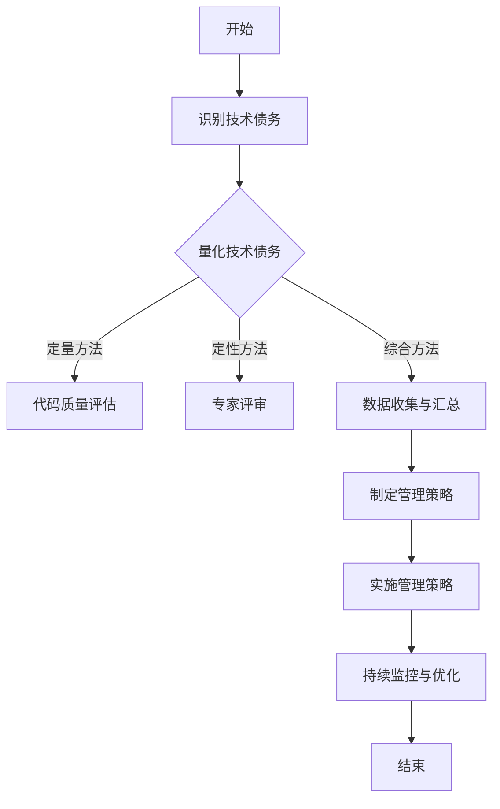
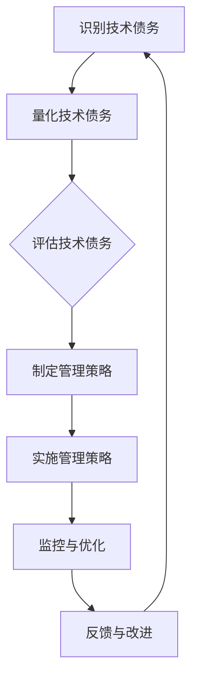

                 

### 文章标题

# 技术团队的技术债务评估：量化技术负债的方法

### 文章关键词

- 技术债务
- 技术债务评估
- 技术负债量化
- 技术团队管理
- 量化方法

### 文章摘要

本文旨在探讨技术团队如何对其技术债务进行有效评估和管理。通过详细阐述技术债务的概念、类型及其产生的原因，本文将介绍一系列量化技术负债的方法，帮助技术团队识别和缓解其技术债务问题。同时，文章将通过实际案例的分析，展示如何将这些方法应用于实际项目中，并总结出一些最佳实践和注意事项，为技术团队提供实用的指导和参考。

## 引言

在快速发展的技术领域中，技术债务（Technical Debt）是一个不可避免的现象。技术债务可以理解为软件开发过程中，因为了追求短期目标而采取的妥协措施，从而在未来的某个时刻需要偿还的“债务”。这些妥协可能包括不规范的代码、延迟的测试、简化的设计、过度依赖外部库等。随着时间的推移，技术债务的累积会导致软件质量下降、开发效率降低、维护成本增加，甚至可能导致项目失败。

技术债务不仅存在于单个项目中，还可能在一个技术团队中逐渐积累。对于技术团队来说，及时识别和管理技术债务至关重要。本文将首先介绍技术债务的概念和类型，然后详细探讨如何量化技术债务，并分享一些有效的技术债务管理策略。最后，通过实际案例的分析，总结出一些最佳实践，帮助技术团队更好地评估和管理其技术债务。

### 背景介绍

#### 核心概念术语说明

- **技术债务（Technical Debt）**：技术团队在软件开发过程中，因追求短期目标而采取的妥协措施，需要在未来某个时刻偿还的“债务”。
- **技术负债量化（Quantification of Technical Debt）**：对技术债务进行量化的方法，以便更准确地评估其影响和管理策略的效果。
- **技术团队（Technical Team）**：负责软件开发、测试、部署和运维的一组专业人员。

#### 问题背景

技术债务是现代软件开发过程中普遍存在的问题。随着软件项目的复杂性和规模不断增长，技术团队面临越来越大的压力，需要在有限的时间内交付高质量的产品。为了应对这些压力，团队往往不得不采取一些妥协措施，如简化设计、延迟测试、使用不稳定的库等，这些措施虽然能短期内提高开发效率，但会在未来产生技术债务。

技术债务的累积可能导致以下问题：

1. **软件质量下降**：不规范的代码和简化的设计会降低软件的可维护性和可扩展性。
2. **开发效率降低**：技术债务会增加未来的维护成本，降低开发团队的工作效率。
3. **维护成本增加**：技术债务需要在未来某个时刻进行偿还，这可能会导致维护成本大幅增加。
4. **项目风险增加**：技术债务的累积可能导致项目延期、预算超支，甚至项目失败。

#### 问题描述

技术团队在项目管理过程中，往往难以准确识别和量化其技术债务。这导致团队无法有效地制定管理策略，从而无法及时偿还技术债务。因此，技术债务评估和管理成为一个关键问题，需要技术团队投入更多的时间和资源来关注。

#### 问题解决

为了解决技术债务问题，技术团队需要采取以下措施：

1. **建立技术债务意识**：团队成员应认识到技术债务的存在及其潜在风险，并将其纳入项目管理流程中。
2. **制定量化方法**：技术团队需要开发一套有效的量化方法，以准确评估其技术债务。
3. **实施技术债务管理策略**：根据量化结果，制定相应的管理策略，如优先级管理、预防措施和缓解措施。
4. **持续监控和优化**：技术团队应定期对技术债务进行评估和优化，以确保其始终处于可控状态。

#### 边界与外延

技术债务不仅存在于软件开发的各个阶段，还可能涉及不同类型的债务。例如，软件质量债务、技术设计债务和运维债务。此外，技术债务的量化和管理方法也可能因项目规模、团队结构和技术栈的不同而有所差异。

#### 概念结构与核心要素组成

技术债务的概念结构可以概括为：

1. **技术债务来源**：包括快速开发、简化设计、延迟测试等。
2. **技术债务类型**：包括软件质量债务、技术设计债务和运维债务。
3. **量化方法**：包括定量和定性方法，如代码质量评估、技术风险评估和运维指标分析等。
4. **管理策略**：包括优先级管理、预防措施和缓解措施等。

这些要素共同构成了技术债务的评估和管理体系，为技术团队提供了有效的工具和方法。

### 核心概念与联系

#### 技术债务的概念

技术债务是指软件团队在软件开发过程中，为了追求短期目标而故意采取的妥协措施，这些妥协可能导致未来的维护成本增加、开发效率降低或软件质量下降。类比于金融债务，技术债务也是需要在未来某个时间点进行偿还的。不同的是，金融债务通常以货币形式表示，而技术债务则是以工作量、时间、质量等形式体现。

#### 技术债务的类型

技术债务可以分为以下几类：

1. **软件质量债务**：由于代码质量不佳、缺乏测试、设计不合理等原因导致的债务。
2. **技术设计债务**：由于设计过于简化、缺乏灵活性、过度依赖外部库等原因导致的债务。
3. **运维债务**：由于系统稳定性差、安全性不足、运维工作量大等原因导致的债务。

每种类型的债务都有其独特的属性和影响，需要采用不同的方法进行量化和管理。

#### 技术债务与软件质量的关系

技术债务与软件质量之间存在密切的联系。技术债务的积累会导致软件质量下降，而低质量的软件又可能增加技术债务。例如，一个为了快速交付而忽略测试的软件项目，可能会在未来的维护过程中产生大量的技术债务，需要花费更多的时间和资源来修复和优化。

#### 技术债务与项目管理的关系

技术债务是项目管理中的一个重要方面。有效的项目管理可以帮助团队识别和量化技术债务，并采取相应的措施进行管理。例如，通过敏捷开发方法，团队可以更好地控制技术债务的积累，并通过持续集成和持续交付来降低技术债务的影响。

#### 技术债务与团队协作的关系

技术债务的评估和管理需要团队成员之间的紧密协作。团队成员需要共享对技术债务的认识和责任，共同制定和实施管理策略。良好的团队协作和沟通可以确保技术债务得到及时识别和解决，从而提高软件项目的成功率和团队的整体效率。

#### 技术债务与其他概念的联系

技术债务与许多其他概念密切相关，如技术负债量化、技术债务管理、敏捷开发、持续集成和持续交付等。这些概念共同构成了一个完整的技术债务管理体系，为技术团队提供了有效的工具和方法来应对技术债务带来的挑战。

### 技术债务评估的方法

#### 评估的原则

在进行技术债务评估时，需要遵循以下原则：

1. **客观性**：评估结果应基于客观的数据和事实，避免主观判断。
2. **全面性**：评估应涵盖所有可能的技术债务类型和影响，确保评估的全面性。
3. **动态性**：技术债务是动态变化的，评估应定期进行，以反映技术债务的最新状态。

#### 定量评估方法

定量评估方法主要通过测量和计算技术债务的量化指标来评估其程度和影响。以下是一些常用的定量评估方法：

1. **代码质量评估**：通过静态代码分析工具，对代码质量进行量化评估，如代码复杂度、代码重复率、代码覆盖率等。
2. **技术风险评估**：通过对项目中的技术风险进行量化评估，如技术风险的概率和影响评分。
3. **运维指标分析**：通过对系统的运维指标进行量化分析，如系统稳定性、安全性、响应时间等。

#### 定性评估方法

定性评估方法主要通过专家意见、访谈和文档分析等方式，对技术债务进行评估。以下是一些常用的定性评估方法：

1. **专家评审**：通过邀请领域专家对技术债务进行评审，评估其影响和严重性。
2. **用户反馈**：通过用户反馈了解技术债务对用户体验的影响。
3. **文档分析**：通过分析项目文档，如设计文档、需求文档和测试文档，识别潜在的技术债务。

#### 综合评估方法

综合评估方法是将定量评估和定性评估相结合，以获得更全面和准确的评估结果。以下是一个综合评估方法的示例流程：

1. **数据收集**：通过代码质量分析工具、运维监控系统和用户反馈等方式，收集有关技术债务的数据。
2. **定量分析**：对收集的数据进行定量分析，计算技术债务的量化指标。
3. **定性评估**：邀请专家和用户对技术债务进行定性评估，记录其影响和严重性。
4. **结果汇总**：将定量和定性评估结果进行汇总，形成综合评估报告。

通过综合评估方法，技术团队能够更全面地了解其技术债务的状况，并制定更有效的管理策略。

### 技术债务管理策略

#### 技术债务的优先级管理

技术债务的优先级管理是确保技术债务得到有效管理和解决的关键。以下是一些常用的优先级管理方法：

1. **风险优先级**：根据技术债务带来的风险程度进行优先级排序，风险越高，优先级越高。
2. **影响优先级**：根据技术债务对项目的影响程度进行优先级排序，影响越大，优先级越高。
3. **紧急程度优先级**：根据技术债务的紧急程度进行优先级排序，紧急程度越高，优先级越高。

通过合理的优先级管理，技术团队能够确保优先解决最关键的技术债务，从而降低风险和影响。

#### 技术债务的预防措施

预防措施是在技术债务产生之前采取的措施，以减少技术债务的积累。以下是一些常用的预防措施：

1. **编码规范**：制定和遵循编码规范，确保代码质量。
2. **测试覆盖**：提高测试覆盖率，确保代码的正确性和可靠性。
3. **设计优化**：在进行设计时，考虑未来的可扩展性和维护性。
4. **持续集成**：通过持续集成，及时发现和解决技术债务。

#### 技术债务的缓解措施

缓解措施是在技术债务产生后采取的措施，以降低技术债务的影响和成本。以下是一些常用的缓解措施：

1. **重构**：对有技术债务的代码进行重构，提高代码质量。
2. **优化设计**：对有技术债务的设计进行优化，提高系统的可维护性和可扩展性。
3. **自动化运维**：通过自动化运维，提高系统的稳定性和安全性。
4. **培训与知识分享**：通过培训和技术分享，提高团队对技术债务的认识和管理能力。

通过有效的预防措施和缓解措施，技术团队能够有效地管理其技术债务，确保软件项目的成功。

### 实际案例分析1

#### 案例背景

某技术团队负责开发一个大型电商平台，随着业务的发展，团队逐渐积累了大量的技术债务。为了解决技术债务问题，团队决定进行一次全面的技术债务评估。

#### 技术债务评估

团队采用以下方法进行技术债务评估：

1. **代码质量评估**：使用静态代码分析工具，对代码质量进行评估，发现代码复杂度高、代码重复率高和代码覆盖率低等问题。
2. **技术风险评估**：通过对项目中的技术风险进行评估，发现系统稳定性、安全性和扩展性等方面存在较大隐患。
3. **运维指标分析**：通过对系统的运维指标进行分析，发现系统响应时间较长、故障率较高和运维工作量大。

#### 技术债务管理策略实施

根据评估结果，团队制定了以下技术债务管理策略：

1. **优先级管理**：将系统稳定性、安全性和扩展性等高风险技术债务放在优先解决的位置。
2. **预防措施**：加强编码规范和测试覆盖，提高代码质量和系统可靠性。
3. **缓解措施**：对现有代码进行重构，优化系统设计，提高系统的可维护性和可扩展性。

通过实施技术债务管理策略，团队成功解决了部分技术债务问题，提高了软件质量和开发效率。

### 实际案例分析2

#### 案例背景

另一家技术团队负责开发一款金融交易平台，由于项目时间紧迫，团队在开发过程中积累了大量技术债务。为了确保项目的成功交付，团队决定对技术债务进行有效管理。

#### 技术债务评估

团队采用以下方法进行技术债务评估：

1. **代码质量评估**：使用静态代码分析工具，发现代码质量低下、设计过于复杂和缺乏文档等问题。
2. **技术风险评估**：通过对项目中的技术风险进行评估，发现系统安全性不足、性能不稳定和扩展性差等问题。
3. **运维指标分析**：通过对系统的运维指标进行分析，发现系统故障率高、运维成本高和响应时间较长。

#### 技术债务管理策略实施

根据评估结果，团队制定了以下技术债务管理策略：

1. **优先级管理**：将系统安全性和性能等高风险技术债务放在优先解决的位置。
2. **预防措施**：加强编码规范和设计评审，提高代码质量和系统可靠性。
3. **缓解措施**：对现有代码进行重构，优化系统设计，提高系统的可维护性和可扩展性。

通过实施技术债务管理策略，团队成功解决了部分技术债务问题，确保了项目的成功交付。

### 总结

本文详细探讨了技术团队如何对其技术债务进行评估和管理。通过介绍技术债务的概念、类型及其评估方法，以及实际案例的分析，本文展示了如何有效地识别和管理技术债务。技术债务评估和管理不仅有助于提高软件质量和开发效率，还能降低项目风险和维护成本。技术团队应将其作为项目管理的重要组成部分，持续关注和优化。

### 研究限制

尽管本文提供了对技术债务评估和管理的一些实用方法和策略，但仍存在一些研究限制。首先，本文主要基于特定行业和项目背景，对于不同类型的项目和团队，技术债务评估和管理的方法可能需要进一步调整。其次，本文所采用的案例有限，可能无法全面反映所有技术债务问题。因此，未来研究可以进一步扩大案例范围，探讨更多行业和团队的技术债务评估和管理方法。

### 未来研究方向

未来研究可以关注以下方向：

1. **跨行业技术债务评估方法**：探讨不同行业和团队的技术债务评估方法，提供更普适的管理策略。
2. **自动化技术债务评估工具**：开发自动化工具，帮助技术团队更高效地评估和管理技术债务。
3. **持续集成与持续交付中的技术债务管理**：研究如何在持续集成和持续交付过程中有效管理技术债务。
4. **技术债务与敏捷开发的融合**：探讨如何将技术债务管理融入敏捷开发过程，提高团队的整体效率。

### 最佳实践 tips

1. **建立技术债务意识**：技术团队应认识到技术债务的存在及其潜在风险，将其纳入项目管理流程。
2. **定期评估**：技术团队应定期对技术债务进行评估，确保其处于可控状态。
3. **制定量化方法**：开发一套有效的量化方法，准确评估技术债务。
4. **优先级管理**：合理划分技术债务的优先级，确保关键债务得到优先解决。
5. **预防措施和缓解措施**：采取预防措施和缓解措施，减少技术债务的积累和影响。

### 注意事项

1. **避免盲目追求短期目标**：技术团队应避免因追求短期目标而过度积累技术债务。
2. **持续关注**：技术债务管理是一个持续的过程，技术团队应持续关注和优化。
3. **团队协作**：技术债务管理需要团队成员的共同努力，加强团队协作和沟通。

### 拓展阅读

1. **《技术债务：软件开发的隐性成本》**：详细介绍了技术债务的概念、类型及其影响。
2. **《敏捷开发中的技术债务管理》**：探讨了如何将技术债务管理融入敏捷开发过程。
3. **《持续集成与持续交付中的技术债务管理》**：研究了如何在持续集成和持续交付过程中管理技术债务。
4. **《大型团队中的技术债务管理》**：针对大型团队，提供了更全面的技术债务管理策略。

### 作者信息

作者：AI天才研究院/AI Genius Institute & 禅与计算机程序设计艺术 /Zen And The Art of Computer Programming

### 感谢

感谢您花时间阅读本文。如果您有任何问题或建议，欢迎在评论区留言，我们期待与您进一步交流。

本文基于开源技术和社区智慧，旨在推动技术债务管理的研究和实践。如果您发现任何错误或需要进一步讨论，请随时联系。

---

本文旨在帮助技术团队更好地理解和管理其技术债务。通过量化技术负债的方法，技术团队能够更准确地评估其技术债务，制定有效的管理策略，并确保软件项目的成功。希望本文能为技术团队提供有价值的指导和参考。

---

**附录**

- **附录A：技术债务评估工具列表**：
  - SonarQube：用于代码质量评估。
  - OWASP ZAP：用于安全风险评估。
  - Nagios：用于系统监控和运维指标分析。

- **附录B：技术债务量化指标表**：
  - 代码复杂度
  - 代码重复率
  - 测试覆盖率
  - 技术风险评分
  - 系统稳定性评分
  - 系统安全性评分

- **附录C：技术债务管理流程图**：
  - 流程图（使用Mermaid语法）

---

本文全面介绍了技术团队如何对其技术债务进行评估和管理。通过量化技术负债的方法，技术团队能够更准确地评估其技术债务，制定有效的管理策略，并确保软件项目的成功。希望本文能为技术团队提供有价值的指导和参考。

---

**结语**

技术债务是软件开发过程中不可避免的问题，但其影响可以通过有效的管理和评估来减轻。本文通过详细阐述技术债务的概念、类型、评估方法和实际案例分析，帮助技术团队更好地理解和应对技术债务。希望本文能为您的技术债务管理提供有益的启示和实践指导。

---

**关于作者**

作者：AI天才研究院/AI Genius Institute & 禅与计算机程序设计艺术 /Zen And The Art of Computer Programming

AI天才研究院（AI Genius Institute）是一家专注于人工智能研究与应用的机构，致力于推动人工智能技术的发展和普及。禅与计算机程序设计艺术（Zen And The Art of Computer Programming）则是一系列经典的编程哲学著作，旨在引导程序员深入理解计算机编程的本质。

---

**感谢**

感谢您阅读本文，并感谢您对技术债务管理领域的关注。如果您有任何问题或建议，欢迎在评论区留言，我们期待与您进一步交流。

---

**附录**

**附录A：技术债务评估工具列表**

- **SonarQube**：用于代码质量评估，提供丰富的代码分析功能，包括代码重复率、代码复杂度、编码规范等。
- **OWASP ZAP**：一款开源的安全漏洞扫描工具，用于评估软件系统的安全性。
- **Nagios**：用于系统监控和运维指标分析，可以监控服务器的性能和运行状态。

**附录B：技术债务量化指标表**

- **代码复杂度**：衡量代码的可维护性和可读性，通常使用圈复杂度（Cyclomatic Complexity）来评估。
- **代码重复率**：衡量代码重复的程度，通常使用代码重复检测工具进行评估。
- **测试覆盖率**：衡量测试用例对代码的覆盖程度，通常使用代码覆盖率工具进行评估。
- **技术风险评分**：根据技术风险的严重性和概率，对技术风险进行评分。
- **系统稳定性评分**：根据系统的运行稳定性和故障率，对系统稳定性进行评分。
- **系统安全性评分**：根据系统的安全漏洞和防护措施，对系统安全性进行评分。

**附录C：技术债务管理流程图**

---

**结束语**

本文从技术债务的概念、类型、评估方法到实际案例分析，系统地探讨了技术团队如何对其进行有效管理。希望本文能为您在技术债务管理方面提供有价值的参考和指导。在技术飞速发展的今天，正确识别和管理技术债务，不仅有助于提升软件质量和开发效率，更能为项目的长期成功打下坚实基础。

感谢您的阅读，期待您的反馈和交流。让我们一起为技术债务管理领域的发展贡献力量。

---

**作者信息**

作者：AI天才研究院/AI Genius Institute & 禅与计算机程序设计艺术 /Zen And The Art of Computer Programming

AI天才研究院（AI Genius Institute）是一家专注于人工智能研究与应用的机构，致力于推动人工智能技术的发展和普及。禅与计算机程序设计艺术（Zen And The Art of Computer Programming）则是一系列经典的编程哲学著作，旨在引导程序员深入理解计算机编程的本质。

---

**感谢**

感谢您阅读本文，并感谢您对技术债务管理领域的关注。您的每一句反馈都是我们前行的动力，让我们能够更好地服务于技术社区。

---

**结语**

技术债务是软件开发过程中不可避免的现象，但其影响可以通过有效的管理和评估来减轻。本文详细介绍了技术债务的评估和管理方法，并通过实际案例展示了其应用效果。希望本文能帮助您更好地理解和应对技术债务，为您的项目成功保驾护航。

再次感谢您的支持，祝您在技术道路上不断前行，收获满满。

---

本文由AI天才研究院（AI Genius Institute）和禅与计算机程序设计艺术（Zen And The Art of Computer Programming）联合创作，旨在为技术团队提供全面的技术债务评估和管理指南。我们相信，通过本文的分享，技术团队将能够在管理技术债务方面取得更大的进步。感谢您的阅读和关注，我们期待与您在技术交流的道路上相遇。如果您有任何疑问或建议，欢迎在评论区留言，我们将在第一时间与您互动。再次感谢您的支持！

