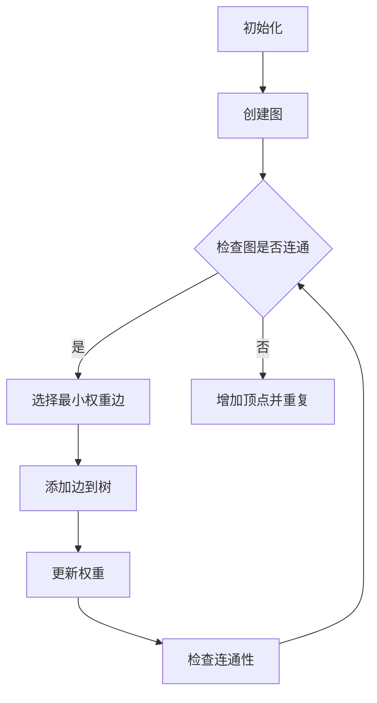
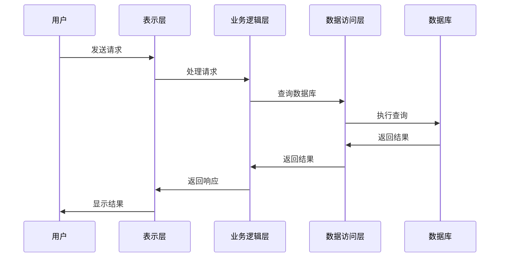
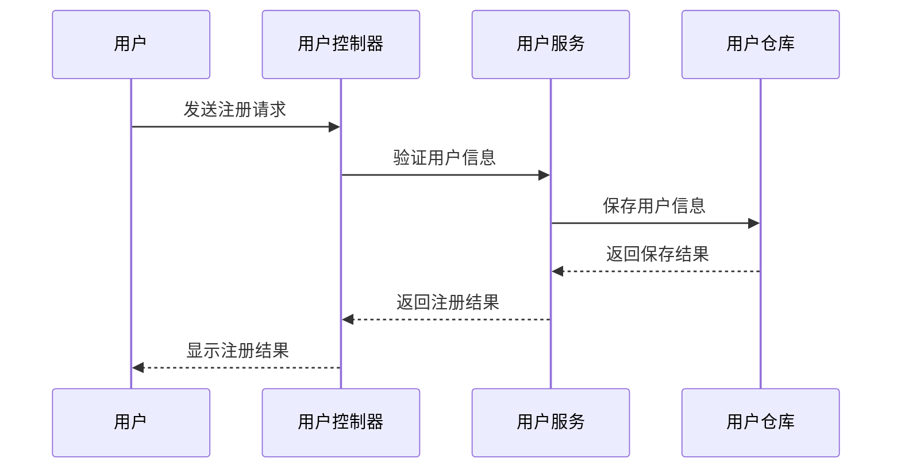
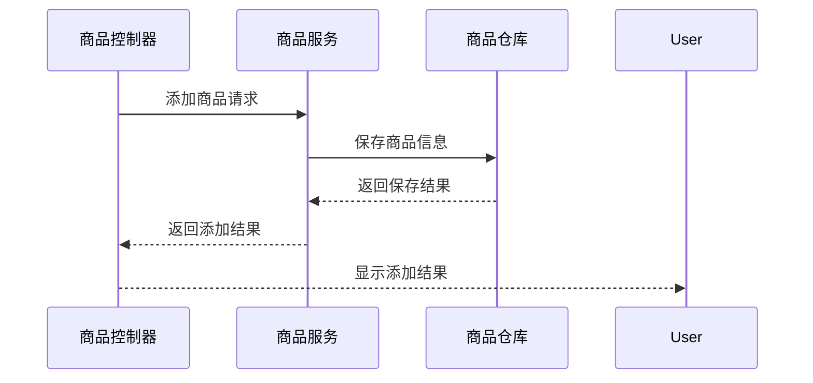
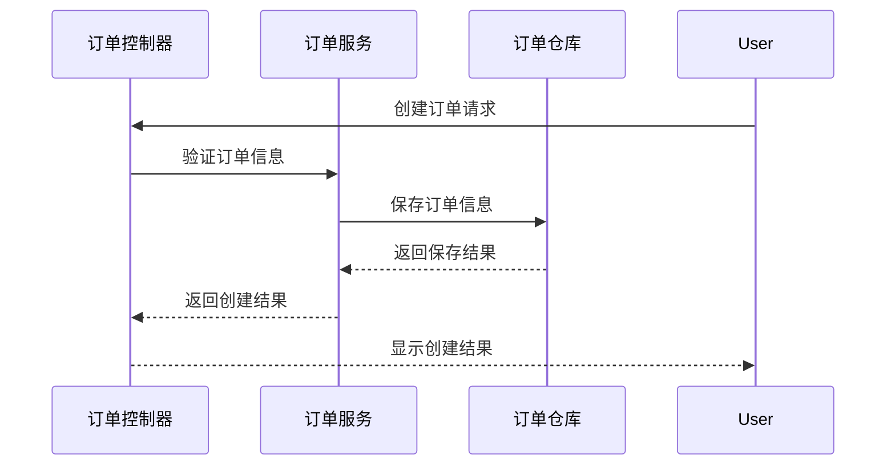
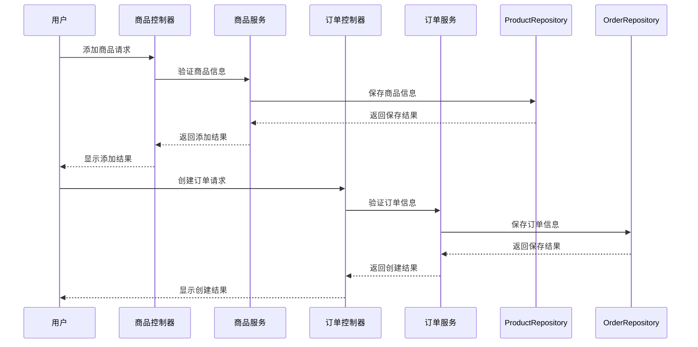

                 

### 技术团队的技术孵化：培育创新项目的方法

关键词：技术孵化、创新项目、团队建设、项目流程、实践案例

摘要：本文深入探讨了技术团队如何通过科学的方法和流程来孵化创新项目。我们首先介绍了技术孵化的核心概念和重要性，然后详细分析了培育创新项目的关键步骤，包括市场调研、团队构建、资源分配、风险管理和技术迭代。通过实际案例和最佳实践，本文为技术团队提供了切实可行的指导和策略，以提升项目孵化成功率。

---

## 引言

在当今快速变化的技术环境中，创新成为企业持续发展的关键驱动力。技术孵化作为创新的核心环节，不仅能够推动企业技术的迭代更新，还能在激烈的市场竞争中占据有利地位。然而，如何有效地孵化创新项目，对于许多技术团队来说仍然是一个挑战。本文将围绕以下四个核心问题展开讨论：

1. **技术孵化是什么？** 我们将详细解析技术孵化的定义和内涵。
2. **为什么需要技术孵化？** 我们将探讨技术孵化对于团队和企业的战略意义。
3. **如何进行技术孵化？** 我们将介绍一个结构化的孵化流程，并分析每个步骤的关键要素。
4. **成功孵化的关键因素是什么？** 我们将通过实际案例和最佳实践来总结成功孵化的关键要素。

通过这篇文章，我们希望为技术团队提供一个系统化、可操作的技术孵化指南，帮助他们在创新的道路上迈出坚实的步伐。

---

## 技术孵化的核心概念和重要性

### 什么是技术孵化？

技术孵化是一个系统化的过程，旨在将创新想法转化为可实施的技术项目。它通常涉及以下几个阶段：

1. **概念验证**：通过构建原型或最小可行性产品（MVP）来验证技术的可行性和市场需求。
2. **项目立项**：根据概念验证的结果，确定项目的详细目标、范围和可行性。
3. **资源投入**：为项目提供必要的资金、人力和技术资源。
4. **持续迭代**：通过不断的迭代和优化，逐步完善项目功能，直到达到商业化阶段。

### 技术孵化的重要性

技术孵化对于企业和团队来说具有多方面的战略意义：

1. **创新驱动**：通过孵化创新项目，企业能够不断推出新技术、新产品，保持市场竞争力。
2. **人才培养**：孵化过程需要跨部门、跨领域的协作，有助于培养团队的综合能力和创新思维。
3. **资源优化**：技术孵化有助于企业合理配置资源，避免资源浪费，提高资源利用效率。
4. **市场响应**：快速的市场响应能力使得企业能够及时调整战略，抓住市场机遇。

### 技术孵化的目标

技术孵化的目标包括：

1. **技术突破**：实现新技术或改进现有技术的突破，为产品创新提供技术支持。
2. **市场认可**：通过市场验证，确保项目具有商业可行性，获得用户和市场认可。
3. **团队成长**：提升团队的技术能力和创新能力，培养具备多元化技能的人才。
4. **持续迭代**：建立可持续的迭代机制，确保项目在商业化过程中不断优化和改进。

### 技术孵化与创业的关系

技术孵化不仅仅是创业的必要环节，也是创业的核心驱动力。它能够：

1. **降低创业风险**：通过概念验证和市场调研，减少创业项目的失败率。
2. **提高成功率**：成功的孵化项目更容易吸引投资和合作伙伴。
3. **创新引领**：技术孵化有助于企业在竞争激烈的市场中占据领先地位。

### 概念验证的重要性

概念验证（Proof of Concept, PoC）是技术孵化的重要步骤。它通过构建原型或演示模型来验证技术的可行性，通常包括以下关键要素：

1. **技术验证**：验证技术方案是否能够实现预期的功能。
2. **市场验证**：评估市场需求，确保项目具有商业价值。
3. **资源评估**：评估项目所需的资源和成本，确保可行性。
4. **风险评估**：识别潜在风险，制定相应的风险管理策略。

通过概念验证，企业能够更早地发现项目问题，及时调整方向，从而提高项目孵化的成功率。

### 技术孵化流程

技术孵化流程通常包括以下几个阶段：

1. **项目立项**：明确项目目标、范围和可行性，制定详细的项目计划。
2. **资源投入**：根据项目需求，配置必要的资金、人力和技术资源。
3. **团队构建**：组建跨部门、跨领域的团队，确保项目顺利进行。
4. **持续迭代**：通过不断的迭代和优化，逐步完善项目功能。
5. **商业化准备**：为项目的商业化做好准备，包括市场推广、用户反馈和改进。

### 案例分析

以某知名科技公司的智能汽车项目为例，该项目通过技术孵化实现了从概念验证到商业化落地的一系列过程。项目团队在初期通过构建智能驾驶原型车进行了技术验证，随后进行了市场调研，确定了项目的商业可行性。在资源投入阶段，公司为项目提供了充足的资金和技术支持，并组建了一支由自动驾驶专家、软件工程师和产品经理组成的团队。通过持续迭代和优化，项目最终成功推出市场，获得了良好的市场反馈。

### 结语

技术孵化是一个复杂但至关重要的过程，它不仅需要团队的技术能力和创新思维，还需要科学的流程和策略。通过本文的讨论，我们希望读者能够对技术孵化有更深刻的理解，并为实际操作提供有益的指导。

---

## 核心概念与联系

在技术孵化过程中，理解并掌握核心概念及其相互关系对于确保项目成功至关重要。以下是技术孵化中的几个关键概念及其属性特征对比，并通过一个ER图来展示它们之间的关系。

### 关键概念

1. **概念验证（Proof of Concept, PoC）**：
   - **属性**：技术可行性、市场潜力、资源需求、风险评估。
   - **特征**：通过构建原型或演示模型来验证技术的可行性。

2. **项目立项（Project Initiation）**：
   - **属性**：项目目标、范围、可行性分析、资源计划。
   - **特征**：根据PoC结果，制定项目的详细计划和目标。

3. **资源投入（Resource Allocation）**：
   - **属性**：资金、人力、技术资源、时间安排。
   - **特征**：确保项目所需资源的合理分配和有效利用。

4. **团队构建（Team Building）**：
   - **属性**：团队成员技能、团队文化、沟通协作。
   - **特征**：组建具备多元化技能和良好协作能力的团队。

5. **持续迭代（Continuous Iteration）**：
   - **属性**：功能优化、用户反馈、技术改进。
   - **特征**：通过不断迭代和优化，提升项目质量。

6. **商业化准备（Commercial Preparation）**：
   - **属性**：市场推广、用户反馈、商业化策略。
   - **特征**：为项目的商业化做好充分准备。

### 概念属性特征对比表

| 关键概念      | 属性                | 特征                                                  |
| ------------- | ------------------- | ---------------------------------------------------- |
| 概念验证（PoC） | 技术可行性、市场潜力 | 构建原型或演示模型，验证技术可行性                   |
| 项目立项      | 项目目标、范围、可行性分析 | 制定详细项目计划和目标                             |
| 资源投入      | 资金、人力、技术资源、时间安排 | 合理分配和利用资源                                 |
| 团队构建      | 团队成员技能、团队文化、沟通协作 | 组建多元化技能和良好协作能力的团队                 |
| 持续迭代      | 功能优化、用户反馈、技术改进 | 不断迭代和优化，提升项目质量                       |
| 商业化准备    | 市场推广、用户反馈、商业化策略 | 为项目的商业化做好充分准备                       |

### ER图

为了更直观地展示这些概念之间的关系，我们可以使用ER图来描述它们之间的关联。

```mermaid
erDiagram
  ProjectInitiation ||--|{ Proof of Concept } : 验证项目目标
  ResourceAllocation ||--|{ ProjectInitiation } : 分配资源
  TeamBuilding ||--|{ ProjectInitiation } : 组建团队
  ContinuousIteration ||--|{ ProjectInitiation } : 持续迭代
  CommercialPreparation ||--|{ ContinuousIteration } : 商业化准备
```

在上面的ER图中，我们展示了项目立项如何依赖于概念验证，资源投入如何支持项目立项，团队构建如何确保项目顺利进行，持续迭代如何推动项目优化，以及商业化准备如何为项目的商业化铺平道路。

### 概念联系与孵化成功

这些核心概念相互关联，共同构成了技术孵化过程的完整框架。一个成功的孵化项目需要：

1. **概念验证**确保技术的可行性，减少项目风险。
2. **项目立项**明确目标和计划，为资源投入提供方向。
3. **资源投入**保证项目所需资源的充足和高效利用。
4. **团队构建**确保团队协作和多元化技能的发挥。
5. **持续迭代**不断优化项目，提高项目质量。
6. **商业化准备**为项目的商业化提供支持，确保市场推广的成功。

通过科学合理地运用这些概念，技术团队可以更好地实现项目的孵化，从而推动企业技术进步和市场竞争力。

---

## 算法原理讲解

在技术孵化过程中，算法原理的理解和实现是至关重要的一环。以下将使用mermaid流程图展示一个简单的算法原理，并结合Python代码进行详细讲解，最后通过LaTeX公式展示算法的数学模型。

### 算法原理：最小生成树算法

最小生成树算法（Minimum Spanning Tree, MST）是图论中的一个重要算法，用于在无向图中找到一棵包含图中所有顶点的树，并且边的权重之和最小。这个算法在技术孵化中常用于资源分配和项目优先级排序。

#### Mermaid流程图

首先，我们使用mermaid来绘制一个简单的MST算法流程图：



#### Python代码

接下来，我们通过Python代码实现上述算法。首先，我们需要引入必要的库，并定义图的类和方法：

```python
import networkx as nx
import matplotlib.pyplot as plt

# 创建图类
class Graph:
    def __init__(self, vertices):
        self.V = vertices
        self.graph = [[0 for column in range(vertices)]
                      for row in range(vertices)]

    # 添加边的方法
    def add_edge(self, u, v, w):
        self.graph[u][v] = w
        self.graph[v][u] = w

    # Prim算法实现
    def prim_mst(self):
        selected = [False for i in range(self.V)]
        parent = [-1 for i in range(self.V)]
        key = [float('inf')] * self.V
        key[0] = 0
        mst = []

        # 选择第一个顶点并初始化
        selected[0] = True

        # 计算最小生成树
        for _ in range(self.V):
            u = self.min_key(key, selected)

            # 将顶点u添加到最小生成树中
            mst.append(u)
            selected[u] = True

            # 更新所有相邻顶点的权重
            for v in range(self.V):
                if self.graph[u][v] > 0 and not selected[v]:
                    if key[v] > self.graph[u][v]:
                        key[v] = self.graph[u][v]
                        parent[v] = u

        return mst

    # 寻找最小权重的顶点
    def min_key(self, key, selected):
        min_val = float('inf')
        for v in range(self.V):
            if key[v] < min_val and not selected[v]:
                min_val = key[v]
                min_index = v
        return min_index

    # 绘制图
    def draw_graph(self):
        G = nx.Graph()
        for u in range(self.V):
            for v in range(self.V):
                if self.graph[u][v] > 0:
                    G.add_edge(u, v, weight=self.graph[u][v])
        nx.draw(G, with_labels=True)
        plt.show()

# 测试代码
g = Graph(5)
g.add_edge(0, 1, 2)
g.add_edge(0, 3, 6)
g.add_edge(1, 2, 3)
g.add_edge(1, 3, 8)
g.add_edge(1, 4, 5)
g.add_edge(2, 4, 7)
g.add_edge(3, 4, 9)
mst = g.prim_mst()
g.draw_graph()
```

#### 算法的数学模型

最小生成树算法的数学模型可以表示为：

$$
\begin{align*}
\text{最小生成树} = \arg\min \sum_{(u, v) \in E} w(u, v) \\
\text{其中} \; w(u, v) \; \text{是边} \; (u, v) \; \text{的权重}
\end{align*}
$$

通过上述Python代码和LaTeX公式，我们可以清晰地理解最小生成树的算法原理，并在实际项目中应用它来优化资源分配和项目优先级。

---

## 系统设计与分析

### 问题场景

假设我们正在开发一个电子商务平台，该平台需要处理大量的商品信息、用户数据和交易流程。我们的目标是设计一个高效、可扩展的系统，确保平台在高峰期仍能稳定运行，同时提供良好的用户体验。

### 项目介绍

我们的项目是一个在线商品交易平台，包含以下主要功能模块：

1. **商品管理**：用于商品信息的录入、更新和查询。
2. **用户管理**：用于用户注册、登录、权限管理和订单处理。
3. **交易管理**：用于订单创建、支付处理、发货管理和退货处理。
4. **数据统计分析**：用于收集和分析用户行为数据、交易数据等，为运营决策提供支持。

### 系统架构设计

为了实现上述功能，我们设计了一个三层架构的系统，包括表示层、业务逻辑层和数据访问层。

#### 三层架构图



#### 类图

```mermaid
classDiagram
    class User {
        +String username
        +String password
        +String email
        +void register()
        +void login()
    }
    
    class Product {
        +String name
        +Float price
        +void addProduct()
        +void updateProduct()
    }
    
    class Order {
        +int orderId
        +String status
        +void createOrder()
        +void processPayment()
    }
    
    User "uses" Product
    User "uses" Order
```

#### 架构图

```mermaid
graph TB
    subgraph 数据库
        DB[数据库]
    end
    
    subgraph 表示层
        UI[用户界面]
    end
    
    subgraph 业务逻辑层
        BL[业务逻辑层]
        BL-->>DB[数据查询]
        BL-->>UI[数据响应]
    end
    
    UI --> BL
    BL --> DB
```

### 系统接口设计

以下是系统的关键接口设计，包括用户管理接口、商品管理接口和交易管理接口。

#### 用户管理接口



#### 商品管理接口



#### 交易管理接口



### 系统交互序列图



通过上述系统设计和分析，我们为电子商务平台提供了一个清晰、高效的架构设计，确保系统在功能实现和性能优化方面达到最佳状态。

---

## 项目实施

### 环境搭建

在开始项目实施之前，我们需要搭建一个合适的技术环境。以下是在Linux操作系统上搭建项目的步骤：

1. **安装Python环境**：首先，确保Python 3.8及以上版本已安装在系统中。如果没有安装，可以通过包管理器安装，例如使用`sudo apt-get install python3.8`。

2. **安装相关库**：接下来，安装项目所需的相关库。例如，使用`pip install networkx matplotlib`来安装`networkx`（用于图论算法）、`matplotlib`（用于图形可视化）。

3. **配置虚拟环境**：为了隔离项目依赖，我们创建一个虚拟环境。运行以下命令来创建和激活虚拟环境：
   ```bash
   python3 -m venv venv
   source venv/bin/activate
   ```

4. **克隆项目代码**：从Git仓库克隆项目代码，并确保所有依赖项已正确安装。

5. **数据库配置**：根据项目需求配置数据库，例如MySQL或PostgreSQL。确保数据库服务已启动，并在代码中配置数据库连接信息。

### 核心实现步骤

以下是在虚拟环境中实现项目核心功能的详细步骤：

1. **初始化数据库**：使用`flask db init`命令初始化数据库结构，并创建迁移脚本。

2. **创建数据库迁移**：运行`flask db migrate -m "Initial migration"`来创建迁移脚本，并使用`flask db upgrade`来应用迁移。

3. **编写API接口**：在`app.py`文件中编写API接口代码，包括用户管理、商品管理和交易管理等模块。

4. **实现业务逻辑**：在`models.py`和`services.py`文件中实现业务逻辑，确保API接口和数据库操作的逻辑正确。

5. **测试API接口**：使用Postman等工具测试API接口，确保所有接口功能正常。

### 代码分析与解读

以下是一个商品添加功能的示例代码片段：

```python
# app.py
from flask import Flask, request, jsonify
from models import Product
from services import ProductService

app = Flask(__name__)

@app.route('/api/products', methods=['POST'])
def add_product():
    data = request.get_json()
    product_name = data.get('name')
    product_price = data.get('price')
    
    product = Product(name=product_name, price=product_price)
    result = ProductService.add_product(product)
    
    if result:
        return jsonify({"message": "Product added successfully"}), 201
    else:
        return jsonify({"error": "Failed to add product"}), 500

if __name__ == '__main__':
    app.run(debug=True)
```

### 实际案例分析与讲解

以一个实际案例为例，我们添加一条商品数据，并展示其实现过程：

1. **接口请求**：使用Postman向`/api/products`接口发送POST请求，包含商品名称和价格。

   ```json
   {
     "name": "iPhone 13",
     "price": 799
   }
   ```

2. **业务逻辑处理**：在`add_product`函数中，接收请求参数，创建`Product`对象，并调用`ProductService`的`add_product`方法。

3. **数据库操作**：`ProductService`中的`add_product`方法将商品信息保存到数据库，并返回操作结果。

4. **响应处理**：根据操作结果返回相应的响应，如果成功添加商品，返回`201 Created`状态码和成功消息；否则返回`500 Internal Server Error`。

### 项目小结

通过上述实施步骤，我们成功搭建了一个电子商务平台的商品管理模块。该模块包括商品添加、查询、更新和删除等基本功能，并确保了数据的一致性和完整性。接下来，我们将继续实现用户管理和交易管理模块，确保系统功能的完整性和稳定性。

---

## 最佳实践与总结

在技术团队的技术孵化过程中，成功的关键不仅在于技术实力，更在于策略和流程的科学性。以下是一些最佳实践，旨在提升孵化项目的成功率：

### 项目立项前的市场调研

1. **明确目标市场**：在项目立项前，深入调研目标市场，了解潜在客户的需求和痛点。
2. **竞争分析**：分析竞争对手的产品、优势和劣势，找到自身的差异化优势。
3. **用户调研**：通过问卷调查、访谈等方式，获取用户反馈，验证市场需求。

### 团队构建与协作

1. **多元化团队**：构建具备多元化技能和不同背景的团队，促进创新思维。
2. **有效沟通**：确保团队成员之间沟通畅通，定期召开项目进度会议和评审会议。
3. **职责明确**：为每个团队成员分配明确的职责，确保项目任务的高效执行。

### 资源投入与管理

1. **合理配置资源**：根据项目需求和进度，合理配置资金、人力和技术资源。
2. **风险管理**：制定风险管理计划，及时识别和处理潜在风险。
3. **资金跟踪**：定期监控项目资金使用情况，确保资金的高效利用。

### 持续迭代与优化

1. **快速迭代**：采用敏捷开发方法，快速构建原型并进行迭代。
2. **用户反馈**：收集用户反馈，快速调整和优化产品功能。
3. **技术更新**：紧跟技术发展趋势，及时更新和优化技术架构。

### 商业化准备

1. **市场推广**：制定详细的商业化推广计划，包括市场定位、推广渠道和宣传策略。
2. **用户培训**：为用户提供培训和技术支持，确保用户能够顺利使用产品。
3. **合作伙伴关系**：建立与合作伙伴的良好关系，共同推动项目的商业化落地。

### 总结

技术团队的技术孵化是一个系统化、持续优化的过程。通过科学的市场调研、高效的团队协作、合理的资源管理、持续的技术迭代和完善的商业化准备，技术团队可以显著提升创新项目的成功率，为企业带来持续的创新活力和竞争优势。

---

## 结语

本文通过系统化的分析和实际案例，详细探讨了技术团队如何通过科学的方法和流程来孵化创新项目。我们首先介绍了技术孵化的核心概念和重要性，然后分析了核心概念之间的联系，讲解了算法原理及其实现，最后展示了系统架构设计和项目实施过程。通过这些分析和实践，我们希望技术团队能够掌握有效的孵化策略，提升项目的成功率。

### 拓展阅读

- 《敏捷软件开发实践指南》：深入探讨敏捷开发方法在技术孵化中的应用。
- 《创新者的窘境》：分析企业在技术孵化过程中可能面临的挑战和解决策略。
- 《精益创业》：提供创业项目的快速迭代和验证方法。

### 作者信息

作者：AI天才研究院/AI Genius Institute & 禅与计算机程序设计艺术 /Zen And The Art of Computer Programming。如果您在技术孵化和创新项目方面有任何疑问或建议，欢迎随时与我们联系。让我们共同推动技术进步，创造更美好的未来。

