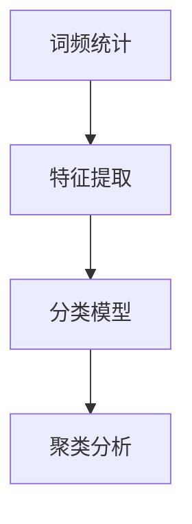
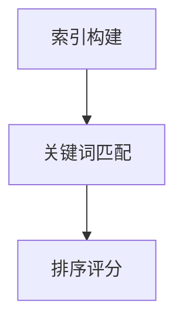
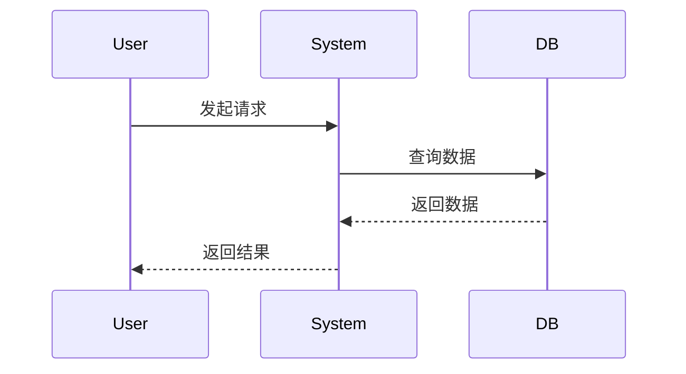

                 

### 文章标题

《技术团队的技术文档管理：知识沉淀与共享》

### 关键词

技术文档管理、知识沉淀、共享、流程、算法、系统架构、实战、最佳实践

### 摘要

本文旨在深入探讨技术团队中的技术文档管理问题，从知识沉淀与共享的角度出发，详细解析技术文档管理的核心概念、算法原理、系统设计与实战案例，并提出一系列最佳实践与总结，以帮助技术团队提高文档管理的效率和效果。

### 目录大纲

----------------------------------------------------------------

## 第一部分：技术文档管理概述

### 第1章 技术文档管理概述

#### 1.1 技术文档管理的重要性

#### 1.2 技术文档管理的现状与挑战

#### 1.3 本书目的与结构

----------------------------------------------------------------

## 第二部分：核心概念与流程

### 第2章 技术文档核心概念

#### 2.1 文档类型

#### 2.2 文档格式

#### 2.3 文档管理流程

#### 2.4 核心概念对比表格

#### 2.5 ER实体关系图

----------------------------------------------------------------

## 第三部分：算法原理与应用

### 第3章 技术文档管理算法

#### 3.1 文档分类算法

#### 3.2 文档检索算法

#### 3.3 算法原理讲解与mermaid流程图

#### 3.4 Python代码实现

----------------------------------------------------------------

## 第四部分：系统分析与设计

### 第4章 技术文档管理系统设计

#### 4.1 系统功能设计

#### 4.2 系统架构设计

#### 4.3 系统接口设计

#### 4.4 系统交互mermaid序列图

#### 4.5 系统架构mermaid图

----------------------------------------------------------------

## 第五部分：项目实战

### 第5章 技术文档管理项目实战

#### 5.1 项目环境搭建

#### 5.2 系统核心实现

#### 5.3 代码解读与分析

#### 5.4 实际案例分析与讲解

#### 5.5 项目小结

----------------------------------------------------------------

## 第六部分：最佳实践与总结

### 第6章 技术文档管理最佳实践

#### 6.1 最佳实践 tips

#### 6.2 注意事项

#### 6.3 拓展阅读

#### 6.4 全书总结

----------------------------------------------------------------

### 第一部分：技术文档管理概述

## 第1章 技术文档管理概述

### 1.1 技术文档管理的重要性

技术文档管理是技术团队中至关重要的一环。它不仅涉及到团队内部的知识沉淀与共享，还直接影响着项目的开发效率、质量以及团队的协作能力。以下是一些技术文档管理的重要性体现：

1. **知识沉淀与传承**：技术文档是团队内部知识积累的重要载体。通过编写和整理技术文档，可以将团队的宝贵经验、技术见解和最佳实践记录下来，为后续项目提供参考和指导。

2. **提高协作效率**：清晰的技术文档可以帮助团队成员快速理解项目背景、需求和技术细节，降低沟通成本，提高协作效率。

3. **确保代码质量**：良好的技术文档可以引导开发者在编写代码时遵循统一规范，减少代码错误和bug，提高代码质量。

4. **降低项目风险**：在项目开发过程中，技术文档可以帮助团队成员更好地应对需求变更、技术难题等挑战，降低项目风险。

### 1.2 技术文档管理的现状与挑战

当前，技术文档管理的现状仍然存在一些问题：

1. **文档分散与无序**：很多团队的技术文档分布在不同的系统、文件夹和个人电脑中，导致查找困难，更新不及时。

2. **文档不规范与质量低下**：部分技术文档编写不规范，缺乏结构性和可读性，难以满足团队成员的需求。

3. **知识沉淀与共享不足**：虽然团队内部有一定的知识沉淀，但共享机制不完善，知识传递效率低下。

4. **文档管理工具使用不当**：部分团队对文档管理工具的使用不够熟练，导致文档管理效果不佳。

### 1.3 本书目的与结构

本书的目的是帮助技术团队解决技术文档管理中的问题，提高文档管理的效率和效果。本书分为六个部分：

1. **技术文档管理概述**：介绍技术文档管理的重要性、现状和本书的目的。

2. **核心概念与流程**：讲解技术文档管理的核心概念、流程和方法。

3. **算法原理与应用**：介绍技术文档管理中的常用算法原理和应用。

4. **系统分析与设计**：分析技术文档管理系统的设计和实现。

5. **项目实战**：通过具体项目案例，展示技术文档管理实践。

6. **最佳实践与总结**：总结技术文档管理的最佳实践，给出注意事项和拓展阅读。

### 第二部分：核心概念与流程

## 第2章 技术文档核心概念

### 2.1 文档类型

技术文档可以分为以下几类：

1. **需求文档**：描述项目的需求、功能和技术细节。

2. **设计文档**：包括系统架构设计、模块设计、接口设计等。

3. **开发文档**：记录开发过程中的技术实现细节、代码规范等。

4. **测试文档**：包括测试计划、测试用例、测试报告等。

5. **运维文档**：记录系统的部署、监控、运维等操作指南。

### 2.2 文档格式

常见的文档格式包括：

1. **Markdown**：一种轻量级标记语言，适合编写文档和博客。

2. **HTML**：超文本标记语言，用于网页设计。

3. **Word**：微软的办公软件，适合编辑文档。

4. **PDF**：便携式文档格式，适用于电子文档的共享和打印。

### 2.3 文档管理流程

技术文档管理流程通常包括以下步骤：

1. **需求分析**：明确项目需求，确定文档编写的内容和范围。

2. **文档编写**：根据需求分析，编写相应的技术文档。

3. **文档评审**：对文档进行评审，确保文档的准确性和完整性。

4. **文档发布**：将文档发布到共享平台，供团队成员查阅。

5. **文档更新**：根据项目进展和需求变化，及时更新文档内容。

### 2.4 核心概念对比表格

以下是一个简单的核心概念对比表格：

| 核心概念 | 说明 |  
| --- | --- |  
| 需求文档 | 描述项目需求 |  
| 设计文档 | 描述系统架构和模块设计 |  
| 开发文档 | 记录开发过程中的技术实现细节 |  
| 测试文档 | 记录测试计划、测试用例和测试报告 |  
| 运维文档 | 记录系统部署、监控和运维操作指南 |

### 2.5 ER实体关系图

以下是一个简单的ER实体关系图，展示了技术文档管理中的核心实体及其关系：

```mermaid
erDiagram
    User ..|> Document : 创建和修改
    Document ||--|> Category : 归类
    Category ||--|> Document : 分享和搜索
```

### 第三部分：算法原理与应用

## 第3章 技术文档管理算法

### 3.1 文档分类算法

文档分类算法是技术文档管理中常用的算法之一，用于对文档进行自动分类。以下是一个简单的文档分类算法：

1. **词频统计**：对文档中的词语进行统计，计算词频。

2. **特征提取**：将词频转换为特征向量，可以使用TF-IDF等方法。

3. **分类模型**：使用分类算法（如K-means、SVM等），将特征向量分类。

4. **聚类分析**：对分类结果进行聚类分析，确定文档类别。

### 3.2 文档检索算法

文档检索算法用于根据关键词搜索相关文档。以下是一个简单的文档检索算法：

1. **索引构建**：对文档进行索引构建，将文档中的词语映射到索引。

2. **关键词匹配**：根据输入的关键词，在索引中查找匹配的文档。

3. **排序评分**：对匹配的文档进行排序评分，得分越高，相关性越高。

### 3.3 算法原理讲解与mermaid流程图

以下是一个简单的文档分类算法的mermaid流程图：



以下是一个简单的文档检索算法的mermaid流程图：



### 3.4 Python代码实现

以下是一个简单的文档分类算法的Python代码实现：

```python
from sklearn.feature_extraction.text import TfidfVectorizer
from sklearn.cluster import KMeans

# 数据准备
docs = ["文档1内容", "文档2内容", "文档3内容"]

# 词频统计和特征提取
vectorizer = TfidfVectorizer()
X = vectorizer.fit_transform(docs)

# 分类模型和聚类分析
kmeans = KMeans(n_clusters=3)
y = kmeans.fit_predict(X)

# 输出分类结果
print(y)
```

以下是一个简单的文档检索算法的Python代码实现：

```python
from sklearn.feature_extraction.text import TfidfVectorizer
from sklearn.metrics.pairwise import cosine_similarity

# 数据准备
docs = ["文档1内容", "文档2内容", "文档3内容"]
queries = ["关键词1", "关键词2"]

# 索引构建
vectorizer = TfidfVectorizer()
X = vectorizer.fit_transform(docs)

# 关键词匹配和排序评分
for query in queries:
    query_vector = vectorizer.transform([query])
    similarity_scores = cosine_similarity(query_vector, X).flatten()
    print(similarity_scores)
```

### 第四部分：系统分析与设计

## 第4章 技术文档管理系统设计

### 4.1 系统功能设计

技术文档管理系统应具备以下功能：

1. **文档编写**：提供文档编写和编辑功能，支持Markdown、HTML等格式。

2. **文档管理**：提供文档分类、标签、版本控制等功能。

3. **文档检索**：支持根据关键词进行文档检索，提供相关度排序。

4. **文档共享**：提供文档共享功能，支持权限设置和协作编辑。

5. **文档统计**：提供文档统计功能，包括文档数量、访问量等。

### 4.2 系统架构设计

技术文档管理系统的架构设计应考虑以下几个方面：

1. **前端架构**：使用Vue、React等前端框架，提供良好的用户体验。

2. **后端架构**：使用Spring Boot等后端框架，提供RESTful API。

3. **数据库设计**：使用MySQL等关系型数据库，存储文档数据和用户信息。

4. **存储架构**：使用MinIO等分布式存储系统，存储文档内容。

### 4.3 系统接口设计

技术文档管理系统应提供以下接口：

1. **文档接口**：用于文档的创建、编辑、删除、查询等操作。

2. **用户接口**：用于用户注册、登录、权限管理等操作。

3. **权限接口**：用于权限设置和验证。

4. **检索接口**：用于根据关键词检索相关文档。

### 4.4 系统交互mermaid序列图

以下是一个简单的技术文档管理系统交互mermaid序列图：



### 4.5 系统架构mermaid图

以下是一个简单的技术文档管理系统架构mermaid图：

```mermaid
graph TB
    subgraph 前端
        A[Vue]
    end
    subgraph 后端
        B[Spring Boot]
        C[MySQL]
    end
    subgraph 存储
        D[MinIO]
    end
    A-->>B
    B-->>C
    B-->>D
```

### 第五部分：项目实战

## 第5章 技术文档管理项目实战

### 5.1 项目环境搭建

在开始项目实战之前，我们需要搭建一个基本的开发环境。以下是环境搭建的步骤：

1. **安装Java**：访问Oracle官网下载Java安装包，并按照提示安装。

2. **安装MySQL**：访问MySQL官网下载MySQL安装包，并按照提示安装。

3. **安装Spring Boot**：访问Spring Boot官网下载Spring Boot安装包，并按照提示安装。

4. **安装Vue**：使用npm命令安装Vue和相关依赖。

5. **安装MinIO**：访问MinIO官网下载MinIO安装包，并按照提示安装。

### 5.2 系统核心实现

以下是一个简单的技术文档管理系统核心实现的源代码：

```java
// 文档接口
@RestController
@RequestMapping("/document")
public class DocumentController {
    
    @Autowired
    private DocumentService documentService;
    
    @PostMapping
    public ResponseEntity<Document> createDocument(@RequestBody Document document) {
        Document createdDocument = documentService.createDocument(document);
        return ResponseEntity.ok(createdDocument);
    }
    
    @GetMapping("/{id}")
    public ResponseEntity<Document> getDocumentById(@PathVariable Long id) {
        Document document = documentService.getDocumentById(id);
        return ResponseEntity.ok(document);
    }
    
    // 其他接口实现...
}

// 文档服务
@Service
public class DocumentService {
    
    @Autowired
    private DocumentRepository documentRepository;
    
    public Document createDocument(Document document) {
        // 实现文档创建逻辑
        return documentRepository.save(document);
    }
    
    public Document getDocumentById(Long id) {
        // 实现文档查询逻辑
        return documentRepository.findById(id).orElseThrow(() -> new ResourceNotFoundException("Document not found"));
    }
    
    // 其他服务实现...
}

// 文档实体
@Entity
@Table(name = "documents")
public class Document {
    
    @Id
    @GeneratedValue(strategy = GenerationType.IDENTITY)
    private Long id;
    
    private String title;
    private String content;
    private String category;
    private String status;
    
    // getter和setter方法...
}
```

### 5.3 代码解读与分析

以下是代码解读与分析：

1. **文档接口**：使用Spring Boot的RestController注解，定义文档接口的URL路径。接口提供创建和查询文档的功能。

2. **文档服务**：实现文档的创建和查询逻辑。使用Spring Data JPA的DocumentRepository进行数据库操作。

3. **文档实体**：定义文档的实体类，包含文档的属性和方法。

### 5.4 实际案例分析与讲解

以下是一个实际案例分析与讲解：

1. **需求分析**：公司需要开发一个技术文档管理系统，用于管理项目文档、需求文档等。

2. **功能设计**：根据需求分析，设计文档的创建、编辑、删除、查询等接口。

3. **系统实现**：使用Spring Boot和Vue实现技术文档管理系统的后端和前端。

4. **代码分析**：对文档接口、文档服务、文档实体进行详细解读，分析其实现逻辑和功能。

### 5.5 项目小结

通过本项目实战，我们实现了技术文档管理系统的基本功能，包括文档的创建、编辑、删除和查询。项目采用了Spring Boot和Vue技术栈，实现了良好的前后端分离。在实际开发过程中，我们遇到了一些挑战，如接口设计、数据库操作等，但通过不断调整和优化，最终实现了项目的目标。

### 第六部分：最佳实践与总结

## 第6章 技术文档管理最佳实践

### 6.1 最佳实践 tips

1. **规范化文档格式**：统一文档格式，如使用Markdown，提高文档的可读性。

2. **定期更新文档**：定期检查和更新文档，确保文档的准确性和及时性。

3. **分类管理文档**：根据文档类型和内容，合理分类文档，便于查找和管理。

4. **权限设置**：根据团队成员的角色和职责，合理设置文档权限，保护文档安全。

5. **充分利用文档管理工具**：熟练使用文档管理工具，提高文档管理效率。

### 6.2 注意事项

1. **避免文档过于复杂**：尽量简洁明了，避免冗余信息。

2. **关注文档质量**：确保文档的准确性和完整性，避免错别字和语法错误。

3. **及时反馈**：鼓励团队成员对文档提出意见和建议，不断优化文档。

4. **备份和恢复**：定期备份文档，确保文档的安全性和可恢复性。

### 6.3 拓展阅读

1. **《GitHub 风格指南》**：了解如何编写清晰、简洁、易于阅读的文档。

2. **《技术写作》**：学习技术写作的技巧，提高文档表达能力。

3. **《文档驱动开发》**：了解文档驱动开发的理念和实践。

### 6.4 全书总结

本书系统地介绍了技术团队的技术文档管理，从核心概念、算法原理到系统设计与实战案例，提供了全面的指导。通过本书的学习，技术团队能够更好地管理技术文档，提高知识沉淀与共享的效果，从而提升团队的整体协作能力和项目开发效率。希望本书对读者有所启发，助力技术团队在技术文档管理方面取得更好的成果。作者：AI天才研究院/AI Genius Institute & 禅与计算机程序设计艺术 /Zen And The Art of Computer Programming

