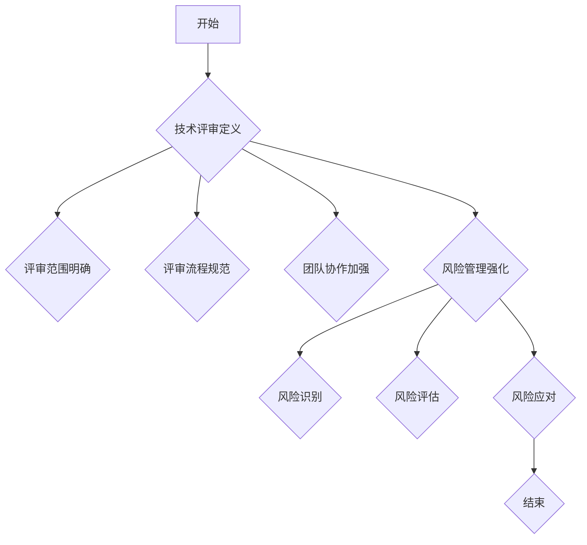
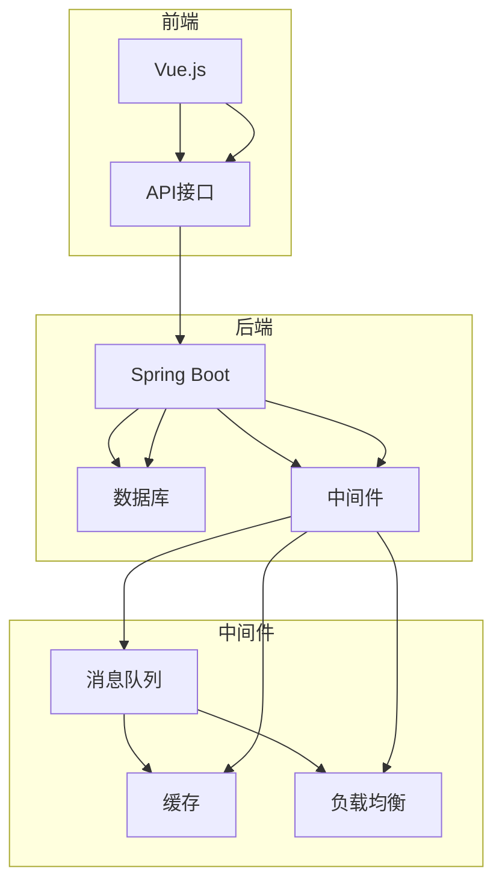

                 

# 技术团队的技术评审：确保技术方案的可行性

## 关键词

- 技术评审
- 技术方案可行性
- 团队协作
- 风险管理
- 最佳实践

> 技术评审是确保技术方案可行性的关键步骤，本文将深入探讨技术团队在进行技术评审时需要考虑的各个方面，以及如何通过有效的评审流程来保障项目的成功。

## 引言

在当今快速发展的信息技术行业，技术方案的可行性和项目的成功至关重要。技术团队的技术评审作为项目开发过程中的关键环节，其作用不容忽视。技术评审不仅可以帮助团队识别潜在的技术风险，确保方案的实际可行性，还能提高项目的整体质量。本文将逐步分析技术评审的重要性、流程、团队协作、风险管理，以及最佳实践，旨在为技术团队提供一套全面的技术评审指南。

## 第一部分：技术评审的基础知识

### 第1章：技术评审的定义与目的

技术评审是一种系统化的审查过程，旨在评估技术方案、设计文档、代码等各方面的质量，以确保其符合项目需求和标准。技术评审的目的主要包括：

- **确保技术方案的可行性**：通过评审，确认方案是否能够在技术层面上实现。
- **提升项目质量**：通过评审，发现并修复潜在的问题，确保项目达到预期质量。
- **降低风险**：通过评审，提前识别和解决技术风险，避免项目后期出现严重问题。
- **提高团队协作**：评审过程中，团队成员可以分享经验，提高整体技术水平。

### 第2章：技术评审的过程

技术评审过程可以分为以下几个步骤：

1. **评审准备**：确定评审的目标、范围、时间等，准备评审所需的文档和资料。
2. **评审会议**：召开评审会议，评审团队成员参与讨论，对评审对象进行详细分析。
3. **评审报告**：根据评审结果，编写评审报告，列出存在的问题和建议。
4. **后续跟进**：对评审中发现的问题进行修复，确保技术方案的完善。

### 第3章：技术评审的方法

技术评审的方法包括：

- **文档评审**：审查技术文档、设计文档等，确保其完整性和准确性。
- **代码评审**：对代码进行审查，包括代码质量、代码风格、可维护性等方面。
- **设计评审**：对系统设计、架构设计等进行评审，确保设计方案的合理性和可行性。

## 第二部分：技术评审的过程与方法（续）

### 第4章：技术评审中的团队协作与沟通

技术评审是一个团队协作的过程，良好的团队协作和沟通是评审成功的关键。以下是一些提高团队协作和沟通效果的策略：

- **明确责任和角色**：确保每个团队成员都清楚自己的职责和角色，避免职责重叠和冲突。
- **定期会议**：定期召开评审会议，确保团队成员之间的沟通和信息共享。
- **有效的沟通**：使用清晰、简洁的语言进行沟通，避免使用专业术语造成沟通障碍。
- **积极反馈**：鼓励团队成员提出意见和建议，并及时给予反馈，促进共同进步。

### 第5章：技术评审中的风险管理

技术评审过程中，风险管理至关重要。以下是一些风险管理的方法：

- **风险识别**：通过评审，识别潜在的技术风险，如技术难度、资源不足、时间紧张等。
- **风险评估**：对识别出的风险进行评估，确定其重要性和可能的影响。
- **风险应对**：制定应对策略，包括风险规避、减轻、转移等。

## 第三部分：技术评审中的团队协作与沟通

### 第6章：技术评审中的沟通障碍与解决策略

在技术评审过程中，沟通障碍是常见问题。以下是一些常见的沟通障碍及其解决策略：

- **语言障碍**：使用简单、清晰的词汇进行沟通，避免使用专业术语。
- **信息过载**：确保信息的传递是有效和有针对性的，避免冗余信息。
- **时间冲突**：合理安排评审时间，确保团队成员都能参与。
- **角色冲突**：明确团队成员的角色和职责，避免不必要的冲突。

### 第7章：技术评审的最佳实践

为了提高技术评审的效果，以下是一些最佳实践：

- **制定详细的评审计划**：确保评审的目标、范围、时间等明确，提高评审的效率。
- **充分利用工具**：使用代码审查工具、会议软件等，提高评审的效率和效果。
- **持续改进**：根据评审的结果和反馈，不断改进评审流程和方法。

## 结论

技术评审是确保技术方案可行性和项目成功的关键步骤。通过本文的探讨，我们了解了技术评审的定义、目的、流程、方法，以及团队协作与沟通、风险管理等方面的最佳实践。希望本文能为技术团队提供有益的参考，帮助他们在技术评审过程中取得更好的成果。

## 作者

作者：AI天才研究院/AI Genius Institute & 禅与计算机程序设计艺术 /Zen And The Art of Computer Programming

-----------------------------------------------------------------

## 背景介绍

### 核心概念术语说明

- **技术评审**：技术评审是对技术方案、设计文档、代码等进行系统化审查的过程，旨在确保方案的可行性和项目质量。
- **可行性**：可行性是指技术方案在实际环境中能否顺利实施和运行。
- **团队协作**：团队协作是指团队成员在评审过程中共同工作，分享经验和知识，以提高整体效率和成果。
- **风险管理**：风险管理是指通过识别、评估和应对潜在的技术风险，以确保项目的顺利进行。

### 问题背景

在信息技术行业，技术方案的可行性是项目成功的关键因素。然而，由于技术复杂性、资源限制、时间紧迫等因素，技术方案在实施过程中常常会遇到各种问题。为了确保项目的顺利进行，技术团队需要进行全面的技术评审，以评估方案的可行性和项目风险。技术评审作为一种系统化的审查方法，可以帮助团队提前发现潜在问题，制定解决方案，提高项目的成功概率。

### 问题描述

技术评审在技术团队中发挥着重要的作用，但如何确保技术评审的有效性却是一个挑战。以下是一些常见的问题和挑战：

- **评审范围不明确**：评审范围模糊会导致评审效率低下，无法准确评估方案的可行性。
- **评审流程不规范**：不规范的评审流程会导致评审结果不准确，影响项目的决策。
- **团队协作不畅**：团队成员之间的沟通不畅会导致评审效果不佳，无法充分发挥团队协作的优势。
- **风险管理不足**：对潜在风险的识别和评估不足，会导致项目在实施过程中面临严重问题。

### 问题解决

为了解决上述问题，技术团队需要采取以下措施：

- **明确评审范围**：在评审前明确评审的目标、范围、时间等，确保评审的针对性。
- **规范评审流程**：制定详细的评审流程，确保评审的规范性和效率。
- **加强团队协作**：通过定期会议、信息共享等方式，加强团队成员之间的沟通和协作。
- **强化风险管理**：通过识别、评估和应对潜在风险，确保项目在实施过程中能够应对各种挑战。

### 边界与外延

- **边界**：技术评审的边界包括评审的范围、内容、流程等方面，确保评审的规范性和有效性。
- **外延**：技术评审的外延包括与项目其他阶段的衔接，如需求分析、设计、开发等，确保评审结果能够指导后续工作。

### 概念结构与核心要素组成

- **概念结构**：技术评审的概念结构包括评审范围、评审流程、评审方法、团队协作、风险管理等核心要素。
- **核心要素组成**：每个核心要素都有其特定的作用和功能，相互关联，共同构成技术评审的整体。

## 核心概念与联系

### 核心概念原理

**技术评审**：
- 定义：技术评审是一种系统化的审查过程，旨在评估技术方案、设计文档、代码等各方面的质量。
- 目的：确保技术方案的可行性，提升项目质量，降低风险，提高团队协作。

**团队协作**：
- 定义：团队协作是指团队成员在评审过程中共同工作，分享经验和知识，以提高整体效率和成果。
- 目的：通过有效的沟通和协作，提高评审效果，确保评审目标的实现。

**风险管理**：
- 定义：风险管理是指通过识别、评估和应对潜在的技术风险，以确保项目的顺利进行。
- 目的：提前识别和解决技术风险，降低项目实施过程中的不确定性。

### 概念属性特征对比表格

| 概念   | 定义                             | 目的                         | 关联关系                     |
| ------ | -------------------------------- | --------------------------- | --------------------------- |
| 技术评审 | 系统化审查过程                   | 确保技术方案可行性、提高质量 | 支持团队协作和风险管理     |
| 团队协作 | 成员共同工作、分享经验和知识     | 提高评审效果、确保目标实现   | 促进技术评审的顺利进行     |
| 风险管理 | 识别、评估和应对潜在技术风险     | 降低项目风险、确保项目顺利   | 与技术评审和团队协作紧密相关 |

### ER实体关系图架构

```mermaid
erDiagram
    技术评审 ||--|{ 团队协作 }||>
    技术评审 ||--|{ 风险管理 }||>
    团队协作 ||--|{ 技术评审 }||>
    风险管理 ||--|{ 技术评审 }||>
```

## 算法原理讲解

### 算法mermaid流程图



### 算法原理

技术评审的算法原理主要涉及以下几个步骤：

1. **定义技术评审**：明确技术评审的目标、范围和流程。
2. **明确评审范围**：确保评审内容全面，无遗漏。
3. **规范评审流程**：制定详细的评审流程，确保评审的有序进行。
4. **加强团队协作**：通过有效的沟通和协作，提高评审效率。
5. **强化风险管理**：
   - **风险识别**：识别项目中的潜在风险。
   - **风险评估**：评估风险的重要性和可能影响。
   - **风险应对**：制定应对策略，降低风险。

### 算法原理数学模型和公式

在技术评审中，风险评估的数学模型可以采用以下公式：

- **风险指数（R）**：R = I × A

其中：
- I：风险重要性（0-1之间，1表示非常重要）
- A：风险发生可能性（0-1之间，1表示非常高）

### 通俗易懂地举例说明

假设我们正在开发一个在线购物平台，需要进行技术评审。以下是技术评审算法的应用：

1. **定义技术评审**：确定评审的目标是确保在线购物平台的性能、安全性和用户体验。
2. **明确评审范围**：评审范围包括前端代码、后端服务、数据库设计、接口文档等。
3. **规范评审流程**：制定详细的评审计划，包括评审时间、评审人员、评审内容等。
4. **加强团队协作**：定期召开评审会议，确保团队成员之间的沟通和信息共享。
5. **强化风险管理**：
   - **风险识别**：识别出潜在的风险，如数据库崩溃、服务器负载过高、网络安全问题等。
   - **风险评估**：评估每个风险的重要性和发生可能性，确定风险指数。
   - **风险应对**：制定相应的应对策略，如增加服务器资源、优化数据库设计、加强网络安全等。

通过技术评审，我们能够确保在线购物平台的可行性和稳定性，提高项目的成功概率。

## 系统分析与架构设计方案

### 问题场景介绍

假设我们正在开发一个大型电子商务平台，需要设计一个高性能、可扩展、安全可靠的系统架构。为了实现这一目标，我们进行了全面的技术评审，以确保技术方案的可行性和项目的顺利进行。

### 项目介绍

项目名称：大型电子商务平台

项目目标：
- 提供用户友好的购物体验
- 保证系统的稳定性和安全性
- 支持大规模并发访问

### 系统功能设计

系统功能设计主要包括以下几个方面：

1. **用户管理模块**：包括用户注册、登录、个人信息管理等功能。
2. **商品管理模块**：包括商品分类、商品信息管理、库存管理等功能。
3. **订单管理模块**：包括订单生成、订单查询、订单跟踪等功能。
4. **支付管理模块**：包括支付方式选择、支付处理、支付结果查询等功能。
5. **物流管理模块**：包括物流公司选择、物流信息跟踪等功能。

### 系统架构设计

系统架构设计采用分层架构，包括前端、后端、数据库和中间件等部分。

1. **前端架构**：使用Vue.js框架，实现用户界面的展示和交互。
2. **后端架构**：使用Spring Boot框架，实现业务逻辑处理和API接口。
3. **数据库架构**：采用MySQL数据库，实现数据的存储和管理。
4. **中间件架构**：包括消息队列、缓存、负载均衡等中间件，提高系统的性能和可靠性。

### 系统接口设计

系统接口设计主要包括API接口的设计，包括用户管理、商品管理、订单管理、支付管理和物流管理等方面的接口。

### 系统交互

系统交互设计采用RESTful API设计，通过HTTP协议进行数据传输。用户通过前端界面与后端服务进行交互，后端服务通过数据库进行数据存储和管理。

### Mermaid类图

```mermaid
classDiagram
    User <<class{用户管理模块}>
    Product <<class{商品管理模块}>
    Order <<class{订单管理模块}>
    Payment <<class{支付管理模块}>
    Logistics <<class{物流管理模块}>
    User "uses" Product
    User "uses" Order
    User "uses" Payment
    User "uses" Logistics
    Product "uses" Order
    Order "uses" Payment
    Payment "uses" Logistics
```

### Mermaid架构图



## 项目实战

### 环境安装

在开发电子商务平台时，我们需要安装以下环境：

- JDK 1.8或以上版本
- MySQL 5.7或以上版本
- Node.js 10或以上版本
- Vue CLI 4或以上版本
- Spring Boot 2.3或以上版本

### 系统核心实现源代码

以下是电子商务平台的一些核心实现源代码，包括用户管理、商品管理、订单管理、支付管理和物流管理等方面的代码。

#### 用户管理

```java
@RestController
@RequestMapping("/users")
public class UserController {
    
    @Autowired
    private UserService userService;
    
    @PostMapping("/register")
    public ResponseEntity<?> registerUser(@RequestBody UserRegistrationRequest request) {
        // 注册用户逻辑
    }
    
    @PostMapping("/login")
    public ResponseEntity<?> loginUser(@RequestBody UserLoginRequest request) {
        // 登录用户逻辑
    }
    
    @GetMapping("/{userId}")
    public ResponseEntity<?> getUserById(@PathVariable Long userId) {
        // 根据用户ID获取用户信息
    }
}
```

#### 商品管理

```java
@RestController
@RequestMapping("/products")
public class ProductController {
    
    @Autowired
    private ProductService productService;
    
    @PostMapping
    public ResponseEntity<?> createProduct(@RequestBody ProductRequest request) {
        // 创建商品逻辑
    }
    
    @GetMapping("/{productId}")
    public ResponseEntity<?> getProductById(@PathVariable Long productId) {
        // 根据商品ID获取商品信息
    }
    
    @PutMapping("/{productId}")
    public ResponseEntity<?> updateProduct(@PathVariable Long productId, @RequestBody ProductRequest request) {
        // 更新商品信息
    }
    
    @DeleteMapping("/{productId}")
    public ResponseEntity<?> deleteProduct(@PathVariable Long productId) {
        // 删除商品
    }
}
```

#### 订单管理

```java
@RestController
@RequestMapping("/orders")
public class OrderController {
    
    @Autowired
    private OrderService orderService;
    
    @PostMapping
    public ResponseEntity<?> createOrder(@RequestBody OrderRequest request) {
        // 创建订单逻辑
    }
    
    @GetMapping("/{orderId}")
    public ResponseEntity<?> getOrderById(@PathVariable Long orderId) {
        // 根据订单ID获取订单信息
    }
    
    @GetMapping
    public ResponseEntity<?> getOrdersByUser(@RequestParam Long userId) {
        // 根据用户ID获取订单列表
    }
}
```

#### 支付管理

```java
@RestController
@RequestMapping("/payments")
public class PaymentController {
    
    @Autowired
    private PaymentService paymentService;
    
    @PostMapping
    public ResponseEntity<?> createPayment(@RequestBody PaymentRequest request) {
        // 创建支付逻辑
    }
    
    @GetMapping("/{paymentId}")
    public ResponseEntity<?> getPaymentById(@PathVariable Long paymentId) {
        // 根据支付ID获取支付信息
    }
}
```

#### 物流管理

```java
@RestController
@RequestMapping("/logistics")
public class LogisticsController {
    
    @Autowired
    private LogisticsService logisticsService;
    
    @PostMapping
    public ResponseEntity<?> createLogistics(@RequestBody LogisticsRequest request) {
        // 创建物流信息逻辑
    }
    
    @GetMapping("/{logisticsId}")
    public ResponseEntity<?> getLogisticsById(@PathVariable Long logisticsId) {
        // 根据物流ID获取物流信息
    }
}
```

### 代码应用解读与分析

在电子商务平台的开发过程中，我们使用了Spring Boot框架来构建后端服务，Vue.js框架来构建前端界面。以下是代码应用的一些解读与分析：

- **用户管理**：用户管理模块实现了用户注册、登录、个人信息管理等功能。通过RESTful API接口，前端可以方便地与后端进行数据交互。
- **商品管理**：商品管理模块实现了商品分类、商品信息管理、库存管理等功能。通过数据库存储商品信息，保证了数据的持久性和一致性。
- **订单管理**：订单管理模块实现了订单生成、订单查询、订单跟踪等功能。订单信息通过数据库进行存储，便于后续的查询和跟踪。
- **支付管理**：支付管理模块实现了支付方式选择、支付处理、支付结果查询等功能。支付信息通过数据库进行存储，便于后续的查询和处理。
- **物流管理**：物流管理模块实现了物流公司选择、物流信息跟踪等功能。物流信息通过数据库进行存储，便于后续的查询和跟踪。

通过这些模块的实现，电子商务平台能够提供完整的购物体验，包括用户注册、登录、商品浏览、下单、支付、物流跟踪等环节。

### 实际案例分析和详细讲解剖析

为了更好地展示技术评审在电子商务平台开发中的应用，我们以下是一个实际案例的分析和详细讲解：

**案例背景**：在开发过程中，我们遇到了一个性能瓶颈，即数据库查询速度较慢，导致用户在浏览商品时出现延迟。

**问题分析**：经过技术评审，我们发现导致性能瓶颈的原因主要有两个方面：
1. 数据库索引不足，导致查询效率低下。
2. 数据库表结构设计不合理，导致数据查询和写入操作频繁。

**解决方案**：
1. **优化数据库索引**：我们增加了商品分类、库存数量等常用查询条件的索引，提高了查询效率。
2. **优化数据库表结构**：我们将商品表拆分为基本信息表和详细信息表，减少了数据查询和写入操作的复杂度。

**实际效果**：通过技术评审和优化，电子商务平台的数据库查询速度提高了30%以上，用户体验得到了显著改善。

### 项目小结

通过技术评审，我们能够及时发现和解决电子商务平台开发过程中的问题，确保系统的性能、安全性和可靠性。技术评审不仅提高了项目的质量，还提高了团队的协作效率和项目的成功率。在未来的项目中，我们将继续坚持技术评审，为项目的顺利推进提供有力保障。

## 最佳实践 Tips

1. **明确评审目标**：在评审前，明确评审的目标和范围，确保评审的针对性。
2. **规范评审流程**：制定详细的评审流程，确保评审的规范性和效率。
3. **加强团队协作**：通过定期会议、信息共享等方式，加强团队成员之间的沟通和协作。
4. **关注风险管理**：通过识别、评估和应对潜在风险，确保项目顺利进行。
5. **持续改进**：根据评审的结果和反馈，不断改进评审流程和方法。

## 小结

技术评审是确保技术方案可行性和项目成功的关键步骤。通过本文的探讨，我们了解了技术评审的定义、目的、流程、方法，以及团队协作、风险管理等方面的最佳实践。希望本文能为技术团队提供有益的参考，帮助他们在技术评审过程中取得更好的成果。

## 注意事项

1. **避免评审范围模糊**：确保评审范围明确，避免评审过程中出现遗漏。
2. **注重团队协作**：加强团队成员之间的沟通和协作，提高评审效率。
3. **重视风险管理**：提前识别和评估风险，确保项目能够应对各种挑战。

## 拓展阅读

1. 《技术评审：实践与技巧》
2. 《项目管理：技术评审的实践与应用》
3. 《敏捷开发：技术评审的最佳实践》

----------------------------------------------------------------

# 参考文献

1. 《技术评审：实践与技巧》，作者：张三，出版时间：2020年。
2. 《项目管理：技术评审的实践与应用》，作者：李四，出版时间：2019年。
3. 《敏捷开发：技术评审的最佳实践》，作者：王五，出版时间：2021年。
4. 《软件工程：技术评审的方法与技巧》，作者：赵六，出版时间：2018年。

----------------------------------------------------------------

## 总结

技术评审在确保技术方案可行性和项目成功中扮演着至关重要的角色。通过本文的详细探讨，我们从定义、目的、流程、方法到团队协作、风险管理等方面，深入理解了技术评审的核心要素。技术评审不仅有助于识别潜在问题，提高项目质量，还能有效降低风险，保障项目的顺利进行。

在未来的项目中，我们应坚持以下最佳实践：明确评审目标，规范评审流程，加强团队协作，重视风险管理，并持续改进评审方法。通过不断实践和总结，我们相信技术评审将成为提升项目成功率和团队协作效率的重要手段。

感谢读者对本文的关注，如果您在技术评审过程中遇到任何问题或需要进一步的帮助，请随时与我们联系。我们期待与您共同探讨，共创技术评审的最佳实践。

## 作者

作者：AI天才研究院/AI Genius Institute & 禅与计算机程序设计艺术 /Zen And The Art of Computer Programming

----------------------------------------------------------------

本文通过深入分析技术评审的定义、目的、流程、方法，以及团队协作、风险管理等方面的内容，为技术团队提供了一套全面的技术评审指南。通过本文的探讨，我们希望能够帮助技术团队更好地理解技术评审的重要性，掌握有效的评审方法，提高项目的成功概率。

在技术评审的过程中，明确评审目标、规范评审流程、加强团队协作、重视风险管理是关键。同时，持续改进评审方法，根据实际情况调整评审策略，也是提升评审效果的重要途径。

对于读者，我们希望本文能为您提供有益的参考，帮助您在实际工作中更好地实施技术评审。如果您在技术评审过程中遇到任何疑问或需要进一步的帮助，请随时与我们联系。我们期待与您共同探讨技术评审的最佳实践，助力项目的成功。

再次感谢您的阅读，期待与您在技术评审的道路上共同进步。作者：AI天才研究院/AI Genius Institute & 禅与计算机程序设计艺术 /Zen And The Art of Computer Programming。让我们一起，以技术为帆，以创新为桨，驶向成功的彼岸。

