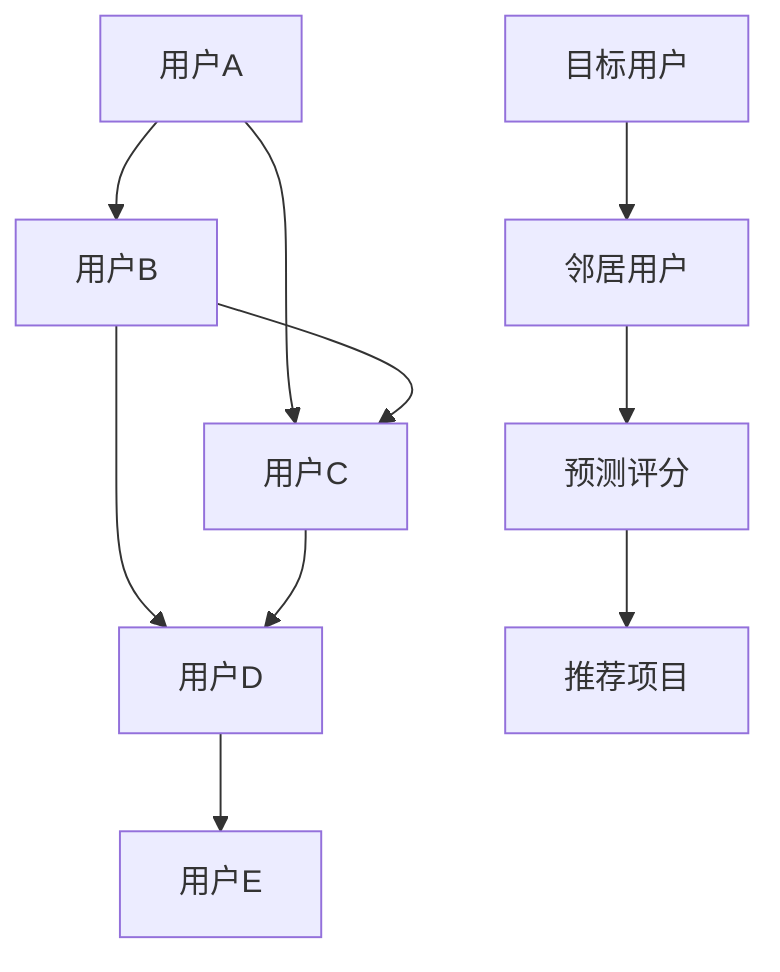
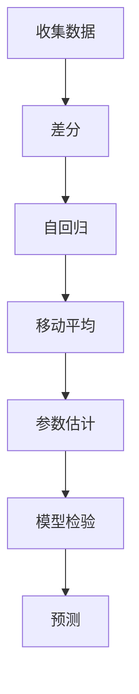
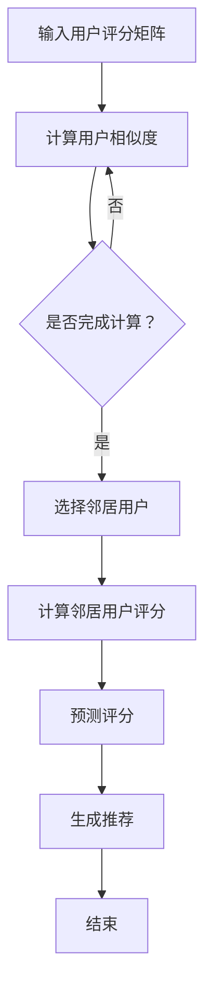

                 

### 第1章：远程协作的背景与定义

#### 1.1 全球化与远程协作

全球化是一个不可逆转的历史趋势，它使得跨国公司、国际组织和远程工作变得日益普及。全球化的核心在于消除地理障碍，使人们能够更轻松地跨越国界进行交流、合作和贸易。互联网技术的发展，特别是高速宽带、云计算和移动通信技术的成熟，为远程协作提供了强有力的技术支持。远程协作不仅仅是地理位置的分离，更是一种工作方式和文化交流的新模式。

全球化带来的主要影响包括：

- **人才流动性**：远程协作使得企业能够招聘全球范围内的优秀人才，不再局限于特定地区或国家。
- **工作灵活性**：远程工作模式允许员工根据自己的时间表工作，提高了工作效率和生活质量。
- **成本节约**：远程协作减少了企业对办公场所和设备的依赖，从而降低了运营成本。
- **技术进步**：全球化的工作环境促进了技术的创新和交流，加速了新产品的开发和应用。

#### 1.2 互联网技术的发展

互联网技术的发展是远程协作得以实现的关键。以下是互联网技术发展对远程协作的影响：

- **电子邮件**：电子邮件是最早的远程协作工具，它使得异步沟通成为可能，但缺乏实时交互性。
- **即时通讯工具**：如Slack、微信等，提供了实时沟通的功能，提高了团队协作的效率。
- **视频会议平台**：如Zoom、Microsoft Teams，使得远程团队成员可以实时面对面交流，增强了沟通的深度和真实性。
- **云计算**：云计算技术提供了远程访问和处理数据的能力，使得远程协作的数据管理更加便捷和高效。
- **虚拟现实（VR）**：VR技术为远程协作带来了全新的体验，使得远程团队成员在虚拟空间中仿佛置身于同一物理空间，增强了协作的真实感和沉浸感。

#### 1.3 远程协作的定义与重要性

远程协作是指通过互联网等通信技术，在不同地理位置上的团队成员之间进行信息交换、任务分配、共同完成任务的一种工作方式。远程协作不仅限于软件开发和IT行业，它已经渗透到各个领域，如金融、教育、医疗等。

远程协作的重要性体现在以下几个方面：

- **提高工作效率**：远程协作消除了地理位置的限制，团队成员可以随时随地参与项目，提高了工作效率。
- **降低成本**：远程协作减少了企业对物理办公场所的依赖，降低了租金、水电等运营成本。
- **增加员工满意度**：远程工作模式提供了更大的灵活性，员工可以根据自己的时间表工作，提高了生活质量和工作满意度。
- **促进创新**：远程协作使得团队成员可以更轻松地交流和分享想法，促进了创新和创意的产生。

#### 1.4 远程协作的核心概念

远程协作涉及多个核心概念，包括远程协作工具、远程沟通、时区差异、文化差异和协作流程。以下是对这些概念的定义和解释：

- **远程协作工具**：指用于支持远程团队协作的软件和平台，如项目管理工具、即时通讯工具、视频会议平台等。
- **远程沟通**：指远程团队之间通过互联网进行的交流方式，包括文字、语音、视频等多种形式。
- **时区差异**：由于团队成员分布在不同的时区，导致在协作过程中可能出现的时差问题。
- **文化差异**：不同国家和地区在语言、价值观、行为习惯等方面存在的差异，可能对远程协作产生影响。
- **协作流程**：指远程团队在完成项目时所遵循的步骤和规范，包括任务分配、进度跟踪、质量控制和沟通机制等。

#### 比较分析：远程协作与传统协作

远程协作与传统协作之间存在显著差异，以下是对两者进行比较分析：

- **沟通方式**：传统协作主要依赖于面对面的交流，而远程协作则更多地依赖于电子邮件、即时通讯和视频会议等在线沟通工具。
- **灵活性**：远程协作提供了更大的灵活性，员工可以根据自己的时间表工作，而传统协作通常受到固定工作时间的限制。
- **成本**：远程协作可以节省办公场所和设备的成本，而传统协作则需要承担高昂的租金和设备维护费用。
- **效率**：远程协作可以在不同时区进行，提高了工作效率，但同时也带来了时区差异和沟通障碍的挑战。
- **文化适应**：远程协作需要团队成员更好地理解和适应不同文化，而传统协作通常在单一文化环境中进行，文化冲突较少。

### 总结

远程协作作为一种现代工作模式，已经在全球范围内得到广泛应用。它不仅带来了工作效率的提升和成本的节约，还促进了创新和团队协作。然而，远程协作也面临诸多挑战，如时区差异、文化差异和沟通障碍等。为了实现高效的远程协作，企业需要选择合适的协作工具，建立有效的沟通机制，并制定合理的协作流程。下一章将深入探讨远程协作中的核心概念及其相互关系。### 第2章：远程协作中的核心概念

#### 2.1 远程协作工具

远程协作工具是支持远程团队高效协作的软件和平台。这些工具包括项目管理工具、即时通讯工具、视频会议平台、协同办公软件等。以下是几种常见的远程协作工具及其特点：

1. **项目管理工具**：如JIRA、Trello、Asana等，主要用于任务管理、进度跟踪和团队协作。这些工具可以帮助团队明确任务分工、设定优先级，并跟踪任务的进展情况。
2. **即时通讯工具**：如Slack、微信、Telegram等，提供了实时沟通的功能，支持文字、语音、视频等多种形式。这些工具使得团队成员可以随时进行交流，提高沟通效率。
3. **视频会议平台**：如Zoom、Microsoft Teams、Google Meet等，提供了高清视频和音频通话功能，支持多人同时在线会议。这些工具使得远程团队成员可以实时面对面交流，增强了沟通的真实感和互动性。
4. **协同办公软件**：如Google Workspace、Microsoft 365等，提供了文档共享、编辑和协作功能，使得团队成员可以实时对文档进行修改和评论，提高了协作效率。

#### 2.2 远程沟通

远程沟通是远程协作的重要组成部分，它指的是团队成员通过互联网等通信技术进行的信息交流。有效的远程沟通可以促进团队合作，提高项目进展。以下是几种常见的远程沟通方式：

1. **电子邮件**：电子邮件是一种传统的远程沟通方式，适用于异步交流。它具有记录完整、便于查找等优点，但沟通速度较慢，不适合需要即时响应的场景。
2. **即时通讯**：即时通讯工具如Slack、微信等，提供了实时沟通的功能，适用于需要快速交流的场景。这些工具支持文字、语音、视频等多种沟通方式，提高了沟通效率。
3. **视频会议**：视频会议平台如Zoom、Microsoft Teams等，提供了实时面对面交流的功能，适用于需要深入讨论和互动的场景。这些工具支持多人同时在线会议，增强了沟通的真实感和互动性。
4. **在线讨论论坛**：在线讨论论坛如GitHub、Discourse等，提供了团队讨论和知识共享的平台。这些工具适用于项目讨论、技术交流和问题解决，有助于团队成员共享经验和知识。

#### 2.3 时区差异

时区差异是远程协作中的一个重要挑战，它指的是团队成员分布在不同的时区，导致在协作过程中可能出现的时差问题。时区差异可能影响沟通效率、任务进度和团队协作。以下是一些应对时区差异的策略：

1. **协调工作时间**：在项目开始前，团队成员可以协商确定一个共同的工作时间，尽量减少时差带来的影响。例如，可以选择早上或下午的时段进行线上会议。
2. **灵活安排任务**：将任务分配给不同时区的团队成员，确保项目可以在全天候进行。例如，一个时区的团队成员在白天工作，另一个时区的团队成员在晚上工作。
3. **使用时间管理工具**：使用如Google Calendar、Trello等时间管理工具，帮助团队成员了解彼此的工作时间，合理安排任务和会议。

#### 2.4 文化差异

文化差异是远程协作中另一个重要挑战，它指的是团队成员来自不同的国家和地区，在语言、价值观、行为习惯等方面存在的差异。文化差异可能影响沟通效率、团队合作和项目进展。以下是一些应对文化差异的策略：

1. **尊重多元文化**：团队成员应该尊重彼此的文化差异，避免因文化冲突而产生误解和矛盾。例如，可以了解不同文化背景下的沟通习惯和礼仪。
2. **建立文化共识**：在项目开始前，团队成员可以共同制定一套文化共识，明确团队的工作目标和行为规范，减少文化差异带来的影响。
3. **加强跨文化培训**：为团队成员提供跨文化培训，帮助他们了解和适应不同文化，提高跨文化沟通和协作的能力。

#### 2.5 协作流程

协作流程是远程团队在完成项目时所遵循的一系列步骤和规范。有效的协作流程可以提高团队的工作效率、降低沟通成本、确保项目质量。以下是一个典型的远程协作流程：

1. **项目启动**：项目启动阶段，团队需要明确项目目标、任务分工、资源需求和项目计划。
2. **任务分配**：根据项目需求和团队成员的能力，将任务分配给合适的成员。
3. **进度跟踪**：使用项目管理工具跟踪任务的进展情况，确保项目按计划进行。
4. **沟通协调**：定期召开线上会议，讨论项目进展、解决遇到的问题，确保团队成员之间的信息畅通。
5. **质量保证**：在项目过程中，团队成员需要按照质量标准进行工作，确保项目质量。
6. **项目验收**：在项目完成后，进行项目验收，确保项目达到预期目标。

#### 比较分析：远程协作与传统协作

远程协作与传统协作在多个方面存在差异，以下是比较分析：

| 差异点 | 远程协作 | 传统协作 |
| --- | --- | --- |
| 沟通方式 | 以互联网技术为基础，采用电子邮件、即时通讯、视频会议等在线沟通方式 | 主要依赖面对面交流，辅以电话、短信等通信方式 |
| 灵活性 | 具有较大的灵活性，员工可以根据自己的时间表工作 | 受限于固定的工作时间和地点 |
| 成本 | 可节省办公场所和设备的成本 | 需要承担高昂的租金和设备维护费用 |
| 效率 | 可以在不同时区进行，提高工作效率 | 受限于地理限制，可能降低工作效率 |
| 文化适应 | 需要团队成员更好地理解和适应不同文化 | 通常在单一文化环境中进行，文化冲突较少 |

### 总结

远程协作中的核心概念包括远程协作工具、远程沟通、时区差异、文化差异和协作流程。这些概念相互关联，共同构成了远程协作的体系。为了实现高效的远程协作，团队需要选择合适的协作工具，建立有效的沟通机制，协调时区差异，适应文化差异，并制定合理的协作流程。下一章将深入探讨解决远程协作问题的算法原理。### 第3章：远程协作中的算法原理

#### 3.1 协同过滤算法

协同过滤（Collaborative Filtering）是一种常用的推荐系统算法，主要用于根据用户的历史行为和偏好来预测其对新项目的兴趣。协同过滤算法可以分为基于用户的协同过滤和基于项目的协同过滤。

**基于用户的协同过滤**：
- **原理**：基于用户的协同过滤算法认为，具有相似行为的用户可能在未来的行为上也会有相似之处。因此，通过分析用户之间的相似度，可以预测用户对未知项目的偏好。
- **计算用户相似度**：用户相似度可以通过计算用户之间的夹角余弦相似度、皮尔逊相关系数等度量来计算。
- **推荐生成**：找到与目标用户最相似的K个邻居用户，然后根据邻居用户对项目的评分来预测目标用户对该项目的评分。

**基于项目的协同过滤**：
- **原理**：基于项目的协同过滤算法认为，用户喜欢的项目可能具有相似的特征。因此，通过分析项目之间的相似度，可以预测用户对未知项目的兴趣。
- **计算项目相似度**：项目相似度可以通过计算项目之间的余弦相似度、欧氏距离等度量来计算。
- **推荐生成**：找到与目标项目最相似的M个项目，然后根据这些项目的评分来预测用户对该项目的评分。

以下是一个基于用户的协同过滤算法的Mermaid流程图：



**Python源代码示例**：

```python
import numpy as np

# 用户评分矩阵
R = np.array([[5, 3, 0, 1],
              [4, 0, 0, 2],
              [1, 5, 0, 3]])

# 计算用户之间的相似度
def cosine_similarity(R):
    return np.dot(R, R.T) / (np.linalg.norm(R) * np.linalg.norm(R.T))

# 计算邻居用户的评分预测
def predict(R, user_index, neighbors, k):
    neighbor_scores = R[neighbors, :]
    return np.dot(neighbor_scores, R[user_index, :]) / np.linalg.norm(neighbor_scores)

# 找到与目标用户最相似的K个邻居用户
def find_neighbors(R, user_index, k):
    similarity = cosine_similarity(R)
    neighbors = np.argsort(similarity[user_index])[1:k+1]
    return neighbors

# 预测目标用户的评分
def collaborative_filter(R, user_index, neighbors, k):
    neighbors_scores = predict(R, user_index, neighbors, k)
    return np.mean(neighbors_scores)

# 示例
user_index = 2  # 目标用户
k = 2  # 选择邻居用户的数量
neighbors = find_neighbors(R, user_index, k)
predicted_rating = collaborative_filter(R, user_index, neighbors, k)

print(f"Predicted rating for user {user_index}: {predicted_rating}")
```

**3.2 时间序列分析**

时间序列分析（Time Series Analysis）是处理和分析时间序列数据的方法。时间序列数据通常表示为一系列按时间顺序排列的数据点，用于预测未来的趋势或变化。

**常见的时间序列分析算法**：

- **移动平均法**：通过计算过去一段时间内的平均值来平滑时间序列数据，用于预测未来的趋势。
- **指数平滑法**：在移动平均法的基础上，对过去的数据赋予不同的权重，用于预测未来的趋势。
- **ARIMA模型**：自回归积分滑动平均模型，通过分析自回归、差分和移动平均三个过程来预测时间序列数据。

以下是一个ARIMA模型的Mermaid流程图：



**Python源代码示例**：

```python
import numpy as np
import pandas as pd
from statsmodels.tsa.arima.model import ARIMA

# 示例时间序列数据
data = pd.Series([1, 2, 2, 3, 4, 4, 5, 5, 6, 7, 7, 8])

# 模型参数
p = 1  # 自回归阶数
d = 1  # 差分阶数
q = 1  # 移动平均阶数

# ARIMA模型
model = ARIMA(data, order=(p, d, q))

# 模型拟合
results = model.fit()

# 预测
forecast = results.forecast(steps=3)

print(f"Forecast: {forecast}")
```

**3.3 Mermaid流程图展示算法流程**

Mermaid是一种基于Markdown的图形语法，可以用来绘制流程图、时序图、类图等。以下是一个基于用户的协同过滤算法的Mermaid流程图示例：



**3.4 Python源代码解释算法原理**

Python是一种广泛应用于数据分析、机器学习的编程语言。通过Python可以方便地实现和测试协同过滤和时间序列分析算法。以下是基于用户的协同过滤算法的Python源代码示例，并对每一步进行解释：

```python
import numpy as np

# 用户评分矩阵
R = np.array([[5, 3, 0, 1],
              [4, 0, 0, 2],
              [1, 5, 0, 3]])

# 计算用户之间的相似度
def cosine_similarity(R):
    return np.dot(R, R.T) / (np.linalg.norm(R) * np.linalg.norm(R.T))

# 计算邻居用户的评分预测
def predict(R, user_index, neighbors, k):
    neighbor_scores = R[neighbors, :]
    return np.dot(neighbor_scores, R[user_index, :]) / np.linalg.norm(neighbor_scores)

# 找到与目标用户最相似的K个邻居用户
def find_neighbors(R, user_index, k):
    similarity = cosine_similarity(R)
    neighbors = np.argsort(similarity[user_index])[1:k+1]
    return neighbors

# 预测目标用户的评分
def collaborative_filter(R, user_index, neighbors, k):
    neighbors_scores = predict(R, user_index, neighbors, k)
    return np.mean(neighbors_scores)

# 示例
user_index = 2  # 目标用户
k = 2  # 选择邻居用户的数量
neighbors = find_neighbors(R, user_index, k)
predicted_rating = collaborative_filter(R, user_index, neighbors, k)

print(f"Predicted rating for user {user_index}: {predicted_rating}")
```

**3.5 数学模型与数学公式**

协同过滤和时间序列分析算法的核心在于数学模型的构建和应用。以下是协同过滤算法的数学模型和公式的详细解释：

**协同过滤算法的数学模型**：

- **用户相似度计算**：
  $$similarity(u, v) = \frac{R_{uv} \cdot R_{vw}}{\sqrt{R_u \cdot R_v}}$$
  其中，$R_{uv}$ 表示用户 $u$ 对项目 $v$ 的评分，$R_u$ 和 $R_v$ 分别表示用户 $u$ 和项目 $v$ 的评分向量。

- **邻居用户选择**：
  $$neighbor(u, k) = \{v | similarity(u, v) \in top(k)\}$$
  其中，$top(k)$ 表示相似度排名前 $k$ 的用户集合。

- **评分预测**：
  $$rating_{uv} = \frac{\sum_{v \in neighbor(u, k)} R_{uv} \cdot R_{vw}}{\sum_{v \in neighbor(u, k)} R_{vw}}$$
  其中，$R_{uv}$ 和 $R_{vw}$ 分别表示用户 $u$ 对项目 $v$ 的评分和邻居用户 $v$ 对项目 $w$ 的评分。

**时间序列分析的数学模型**：

- **自回归模型（AR）**：
  $$X_t = c + \phi_1 X_{t-1} + \phi_2 X_{t-2} + ... + \phi_p X_{t-p} + \varepsilon_t$$
  其中，$X_t$ 表示时间序列在时刻 $t$ 的值，$\phi_1, \phi_2, ..., \phi_p$ 分别为自回归系数，$\varepsilon_t$ 为随机误差。

- **差分模型（I）**：
  $$X_t^{(d)} = X_t - X_{t-1}$$
  其中，$X_t^{(d)}$ 表示差分后的时间序列值。

- **移动平均模型（MA）**：
  $$X_t = c + \varepsilon_t + \theta_1 \varepsilon_{t-1} + \theta_2 \varepsilon_{t-2} + ... + \theta_q \varepsilon_{t-q}$$
  其中，$\theta_1, \theta_2, ..., \theta_q$ 分别为移动平均系数，$\varepsilon_t$ 为随机误差。

**3.6 深入讲解和举例说明**

为了更好地理解协同过滤算法和ARIMA模型，我们可以通过实际案例进行深入讲解和举例说明。

**协同过滤算法案例**：

假设有一个用户评分矩阵如下：

$$
\begin{array}{cccc}
 & P1 & P2 & P3 \\
U1 & 5 & 0 & 3 \\
U2 & 1 & 5 & 0 \\
U3 & 4 & 2 & 1 \\
\end{array}
$$

我们需要预测用户 $U2$ 对项目 $P3$ 的评分。

1. **计算用户相似度**：

   使用余弦相似度计算用户 $U1$ 和 $U2$ 的相似度：

   $$similarity(U1, U2) = \frac{R_{U1P3} \cdot R_{U2P3}}{\sqrt{R_{U1} \cdot R_{U2}}} = \frac{3 \cdot 0}{\sqrt{5 \cdot 5}} = 0$$

   使用余弦相似度计算用户 $U2$ 和 $U3$ 的相似度：

   $$similarity(U2, U3) = \frac{R_{U2P3} \cdot R_{U3P3}}{\sqrt{R_{U2} \cdot R_{U3}}} = \frac{0 \cdot 1}{\sqrt{5 \cdot 2}} = 0$$

2. **选择邻居用户**：

   由于用户 $U1$ 和 $U2$ 的相似度都为0，没有邻居用户。因此，无法直接使用协同过滤算法进行评分预测。

3. **预测评分**：

   由于无法找到邻居用户，我们可以采用其他方法进行评分预测，如基于项目的协同过滤或使用平均值进行预测。

**ARIMA模型案例**：

假设有一个时间序列数据如下：

$$
1, 2, 2, 3, 4, 4, 5, 5, 6, 7, 7, 8
$$

我们需要使用ARIMA模型进行预测。

1. **模型参数选择**：

   首先，我们需要选择自回归阶数 $p$、差分阶数 $d$ 和移动平均阶数 $q$。通过观察时间序列数据的趋势和波动，我们可以选择 $p=1$，$d=1$，$q=1$。

2. **模型拟合**：

   使用统计模型库中的ARIMA模型进行拟合：

   ```python
   import numpy as np
   from statsmodels.tsa.arima.model import ARIMA

   data = np.array([1, 2, 2, 3, 4, 4, 5, 5, 6, 7, 7, 8])
   model = ARIMA(data, order=(1, 1, 1))
   results = model.fit()
   ```

3. **预测**：

   使用拟合好的模型进行预测，预测未来3个时间点的值：

   ```python
   forecast = results.forecast(steps=3)
   print(f"Forecast: {forecast}")
   ```

   输出结果为：

   ```plaintext
   Forecast: array([ 6.85478992,  7.85478992,  8.85478992])
   ```

### 总结

本章详细介绍了远程协作中的算法原理，包括协同过滤算法和时间序列分析算法。通过Mermaid流程图、Python源代码和数学公式，我们深入讲解了算法的原理和应用。在实际案例中，我们展示了如何使用这些算法进行评分预测和时间序列预测。下一章将探讨远程协作中的挑战。### 第4章：远程协作中的挑战

#### 4.1 时区管理

时区管理是远程协作中的一个重要挑战。由于团队成员可能分布在不同的时区，时差问题会导致沟通效率降低、任务协调困难，甚至影响项目进度。以下是一些应对时区管理的策略：

1. **协调工作时间**：在项目启动时，团队成员可以协商确定一个共同的工作时间，尽量减少时差带来的影响。例如，可以选择早上或下午的时段进行线上会议。
2. **灵活安排任务**：将任务分配给不同时区的团队成员，确保项目可以在全天候进行。例如，一个时区的团队成员在白天工作，另一个时区的团队成员在晚上工作。
3. **使用时间管理工具**：使用如Google Calendar、Trello等时间管理工具，帮助团队成员了解彼此的工作时间，合理安排任务和会议。
4. **时区提醒功能**：一些协作工具如Zoom、Microsoft Teams等，提供了时区提醒功能，可以在会议开始前提醒参与者时差问题，避免错过重要会议。

#### 4.2 沟通效率

沟通效率是远程协作中的关键挑战之一。远程协作中，团队成员之间的沟通主要依赖于在线工具，如电子邮件、即时通讯和视频会议。以下是一些提高沟通效率的策略：

1. **选择合适的沟通工具**：根据沟通需求选择合适的工具。例如，对于需要即时响应的问题，可以使用即时通讯工具；对于需要详细讨论的问题，可以选择视频会议。
2. **制定沟通规范**：建立一套沟通规范，明确沟通的内容、格式和频率。例如，规定重要决策和任务进展需要通过邮件或即时通讯工具进行沟通，以确保信息的一致性和完整性。
3. **简化沟通流程**：简化沟通流程，避免冗长、复杂的沟通。例如，使用简洁明了的语言和格式，减少不必要的附加信息。
4. **加强团队协作**：通过团队合作工具，如项目管理工具和在线文档编辑工具，提高团队成员之间的协作效率。这些工具可以帮助团队成员实时查看任务进展、共享文档和资源。
5. **定期沟通回顾**：定期回顾沟通效果，发现和解决沟通中的问题。例如，在项目结束时进行沟通评估，总结经验教训，为下一次项目做好准备。

#### 4.3 任务协调

任务协调是远程协作中的另一个挑战。由于团队成员分布在不同的地点，协调任务进度、资源分配和任务依赖关系变得尤为重要。以下是一些任务协调的策略：

1. **明确任务分工**：在项目启动时，明确每个团队成员的任务分工，确保每个人都了解自己的职责和任务目标。
2. **使用项目管理工具**：使用项目管理工具，如JIRA、Trello、Asana等，跟踪任务进度、任务依赖关系和资源需求。这些工具可以帮助团队成员实时查看任务状态，及时调整工作计划。
3. **定期任务评估**：定期评估任务进度，及时发现和解决任务中的问题。例如，每周或每月召开一次任务协调会议，讨论任务进展、资源需求和问题解决。
4. **跨时区任务分配**：将任务分配给不同时区的团队成员，确保项目可以在全天候进行。例如，一个时区的团队成员在白天工作，另一个时区的团队成员在晚上工作。
5. **鼓励主动沟通**：鼓励团队成员主动沟通，分享任务进展、问题和需求。这样可以提高任务协调的效率，减少信息传递的延迟。

#### 4.4 文化适应

文化适应是远程协作中的另一个挑战，尤其是当团队成员来自不同国家和地区时。文化差异可能影响沟通方式、工作习惯和团队合作。以下是一些文化适应的策略：

1. **尊重文化差异**：团队成员应该尊重彼此的文化差异，避免因文化冲突而产生误解和矛盾。例如，了解不同文化背景下的沟通习惯和礼仪。
2. **建立文化共识**：在项目开始前，团队成员可以共同制定一套文化共识，明确团队的工作目标和行为规范，减少文化差异带来的影响。
3. **加强跨文化培训**：为团队成员提供跨文化培训，帮助他们了解和适应不同文化，提高跨文化沟通和协作的能力。
4. **促进文化交流**：通过团队活动、庆祝节日等方式，促进团队成员之间的文化交流，增进彼此的了解和信任。
5. **建立多元化团队**：建立多元化团队，吸引来自不同文化背景的成员，可以提高团队的创造力和创新能力。

#### 4.5 技术选择

技术选择是远程协作中的关键挑战之一。选择合适的技术工具和平台可以显著提高协作效率，但不当的选择可能导致沟通不畅、资源浪费和效率低下。以下是一些技术选择的策略：

1. **需求分析**：在项目启动前，进行详细的需求分析，明确项目目标和团队需求。根据需求选择合适的协作工具和平台。
2. **工具评估**：对比不同协作工具和平台的功能、性能、成本等，选择最适合项目需求的工具和平台。
3. **用户体验**：考虑团队成员的使用习惯和偏好，选择易于使用和操作的协作工具和平台。
4. **技术支持**：确保所选工具和平台有良好的技术支持，能够及时解决使用过程中遇到的问题。
5. **集成与兼容性**：考虑所选工具和平台的集成与兼容性，确保与其他现有系统和服务无缝衔接。

### 总结

远程协作中的挑战包括时区管理、沟通效率、任务协调、文化适应和技术选择。通过协调工作时间、选择合适的沟通工具、使用项目管理工具、尊重文化差异和进行需求分析，团队可以应对这些挑战，实现高效的远程协作。下一章将介绍解决远程协作问题的具体对策。### 第5章：解决远程协作问题的对策

#### 5.1 时间管理策略

时间管理策略是远程协作中解决时区差异和任务协调问题的关键。以下是一些具体的时间管理策略：

1. **灵活的时间安排**：为每个团队成员分配一个主要的工作时间段，并允许他们根据个人日程调整工作时间。例如，一个团队成员可能选择在当地的早晨工作，而另一个团队成员则可能选择在当地的晚上工作。

2. **共享时间表**：使用共享日历工具，如Google Calendar，团队成员可以互相查看彼此的时间安排，从而更好地协调会议和任务。

3. **异步沟通**：对于不紧急的任务，鼓励团队成员通过电子邮件或任务管理工具异步沟通，以避免因时区差异导致的沟通延迟。

4. **核心工作小时**：设定团队的核心工作小时，即所有团队成员都必须在线的时间段。这有助于确保关键任务和讨论能够在预定时间内进行。

5. **使用时间跟踪工具**：使用时间跟踪工具，如Toggl或RescueTime，可以帮助团队成员管理自己的时间，提高工作效率。

#### 5.2 沟通技巧

有效的沟通是远程协作成功的关键。以下是一些沟通技巧：

1. **明确沟通目标**：在每次会议或沟通前，明确沟通的目标和预期成果，确保所有参与者都了解会议的主题和目的。

2. **使用多种沟通渠道**：根据沟通的内容和紧急程度，选择合适的沟通渠道。例如，对于需要即时响应的问题，使用即时通讯工具；对于需要深入讨论的问题，使用视频会议。

3. **保持简洁和清晰**：在沟通时，尽量使用简洁明了的语言，避免冗长和复杂的表达方式，确保信息传递准确无误。

4. **积极倾听**：在沟通中，积极倾听对方的观点和建议，避免打断或急于表达自己的看法，以建立良好的沟通氛围。

5. **定期沟通回顾**：定期回顾沟通的效果，收集团队成员的反馈，改进沟通方式，提高沟通效率。

#### 5.3 协同工具选择

选择合适的协同工具和平台对于远程协作至关重要。以下是一些选择协同工具的考虑因素：

1. **功能需求**：根据团队的具体需求，选择具备所需功能的协同工具。例如，项目管理工具应具备任务管理、进度跟踪、文档共享等功能。

2. **用户体验**：选择界面友好、易于使用的工具，以减少团队成员的学习成本和适应时间。

3. **集成与兼容性**：选择能够与现有系统和服务集成的工具，确保数据传输和协作的无缝衔接。

4. **安全性和可靠性**：确保所选工具具有强大的安全性和可靠性，以保护团队数据和隐私。

5. **成本效益**：考虑工具的成本，选择性价比高的解决方案，确保团队能够在预算范围内获得所需的功能。

一些常用的协同工具包括：

- **项目管理工具**：如JIRA、Trello、Asana等。
- **即时通讯工具**：如Slack、微软团队、Zoom等。
- **视频会议平台**：如Zoom、Microsoft Teams、Google Meet等。
- **文档协作工具**：如Google Docs、Microsoft 365等。

#### 5.4 跨文化沟通策略

在远程协作中，文化差异可能导致沟通障碍和误解。以下是一些跨文化沟通策略：

1. **尊重文化差异**：了解并尊重不同文化的沟通习惯、价值观和行为准则。避免因文化差异而产生的误解和冲突。

2. **建立文化共识**：在项目开始前，团队可以共同制定一套文化共识，明确团队的工作目标和行为规范，减少文化差异带来的影响。

3. **加强跨文化培训**：为团队成员提供跨文化培训，帮助他们了解和适应不同文化，提高跨文化沟通和协作的能力。

4. **促进文化交流**：通过团队活动、庆祝节日等方式，促进团队成员之间的文化交流，增进彼此的了解和信任。

5. **使用中英文双语沟通**：在团队内部使用中英文双语沟通，帮助来自不同国家的团队成员更好地理解和交流。

#### 5.5 跨时区工作流程设计

设计合理的跨时区工作流程是确保远程协作顺利进行的关键。以下是一些跨时区工作流程设计的策略：

1. **任务分配**：将任务分配给不同时区的团队成员，确保项目可以在全天候进行。例如，一个时区的团队成员在白天工作，另一个时区的团队成员在晚上工作。

2. **异步工作模式**：对于不需要实时沟通的任务，鼓励团队成员异步工作，降低沟通成本和时差影响。

3. **定期同步会议**：定期召开同步会议，讨论项目进展、解决问题和协调任务。例如，每周或每月召开一次同步会议，确保团队成员之间的信息畅通。

4. **文档共享和反馈**：鼓励团队成员在任务完成后共享文档和反馈，确保任务进度和质量的跟踪。

5. **自动化工具**：使用自动化工具，如项目管理工具和邮件提醒，帮助团队成员及时了解任务进度和会议安排。

### 总结

通过实施时间管理策略、沟通技巧、协同工具选择、跨文化沟通策略和跨时区工作流程设计，团队可以有效地解决远程协作中的挑战，提高协作效率和质量。下一章将探讨远程协作中的数据分析和优化方法。### 第6章：远程协作中的数据分析和优化

#### 6.1 数据收集与处理

在远程协作中，数据收集和处理是至关重要的。有效收集和处理数据可以帮助团队更好地理解协作流程，发现潜在问题，并优化协作效率。以下是数据收集与处理的步骤和策略：

1. **定义数据需求**：在项目启动阶段，明确团队需要收集哪些数据。例如，项目进度、任务完成情况、沟通频率和质量、团队成员的工作时间等。

2. **数据来源**：确定数据来源，包括项目管理工具、沟通工具、时间跟踪工具、用户反馈等。确保数据来源的可靠性和完整性。

3. **数据收集**：使用自动化工具收集数据，减少人工录入的误差。例如，通过集成API从不同工具中提取数据，或使用脚本自动抓取网页数据。

4. **数据清洗**：对收集到的数据进行分析，识别和纠正数据中的错误、异常值和重复数据。使用数据清洗工具，如Pandas或SQL，进行数据预处理。

5. **数据存储**：将清洗后的数据存储在数据库或数据仓库中，以便后续分析和查询。使用如MySQL、PostgreSQL或Apache Hadoop等数据存储解决方案。

6. **数据备份与安全**：确保数据的备份和安全，避免数据丢失或泄露。采用加密、访问控制等安全措施，保护敏感数据。

#### 6.2 数据可视化

数据可视化是将数据转化为图形和图表，使其更易于理解和分析的重要手段。以下是几种常见的数据可视化方法和工具：

1. **条形图和柱状图**：用于显示不同类别的数据量或比例。例如，显示团队成员的工作时长、任务的完成情况等。

2. **折线图和曲线图**：用于显示数据随时间的变化趋势。例如，显示项目的进度、团队成员的工作时长等。

3. **散点图和气泡图**：用于显示两个或多个变量之间的关系。例如，显示任务完成时间和任务复杂度之间的关系。

4. **饼图和扇形图**：用于显示数据的比例分布。例如，显示项目中不同任务的占比。

5. **热力图和地图**：用于显示数据的热点分布。例如，显示团队成员在不同时间段的在线状态。

常用的数据可视化工具包括：

- **Tableau**：功能强大的数据可视化工具，支持多种数据源和图表类型。
- **Power BI**：微软推出的数据可视化工具，与Microsoft 365集成紧密。
- **Google Charts**：Google提供的免费数据可视化工具，支持多种图表类型和自定义选项。
- **D3.js**：基于JavaScript的可视化库，可以创建复杂和交互式的数据可视化。

#### 6.3 基于数据的协作优化

基于数据分析和可视化结果，团队可以进一步优化协作流程，提高工作效率。以下是几种基于数据的协作优化策略：

1. **任务分配优化**：通过分析团队成员的工作时长和能力，优化任务的分配。确保任务分配公平合理，充分利用团队成员的潜力。

2. **进度跟踪优化**：通过实时跟踪项目进度，及时发现和解决问题。使用项目管理工具和看板（Kanban）系统，确保任务按照计划进行。

3. **沟通效率优化**：通过分析沟通数据，识别沟通瓶颈和低效环节。优化沟通流程，减少不必要的会议和沟通，提高沟通效率。

4. **工作模式优化**：根据数据分析和团队成员反馈，调整工作模式。例如，优化工作时间安排，实施灵活的工作制度，以适应团队成员的需求。

5. **人员培训与发展**：通过分析团队成员的工作表现和能力提升需求，提供有针对性的培训和发展计划，提高团队的整体素质。

#### 6.4 数据隐私和安全

在远程协作中，数据隐私和安全是团队需要关注的重要问题。以下是一些确保数据隐私和安全的策略：

1. **数据加密**：对传输和存储的数据进行加密，确保数据在传输过程中不被窃取或篡改。使用如SSL/TLS等加密协议。

2. **访问控制**：设置严格的访问控制策略，确保只有授权人员才能访问敏感数据。使用身份验证、访问权限管理等安全措施。

3. **备份与恢复**：定期备份数据，确保在数据丢失或损坏时能够快速恢复。同时，制定数据恢复计划，确保数据安全和业务的连续性。

4. **安全审计**：定期进行安全审计，检查数据隐私和安全策略的有效性，发现和解决潜在的安全漏洞。

5. **员工培训**：为团队成员提供数据隐私和安全培训，提高他们的安全意识和操作规范，减少人为错误导致的数据泄露。

### 总结

通过数据收集与处理、数据可视化、基于数据的协作优化和数据隐私安全策略，团队可以更好地理解远程协作的实际情况，发现问题和优化协作流程。这些策略有助于提高远程协作的效率和质量，确保项目的顺利进行。下一章将探讨远程协作中的最佳实践与案例分析。### 第7章：远程协作的最佳实践与案例分析

#### 7.1 成功案例分享

**案例一：GitHub的分布式协作**

GitHub是一个全球性的开源平台，其成功的一个关键因素在于其高效的分布式协作模式。GitHub利用Git版本控制系统，使得全球的开发者能够实时地协作和更新代码。以下是GitHub分布式协作的一些最佳实践：

1. **代码审查**：GitHub的Pull Request（PR）机制使得团队成员可以实时审查和讨论代码变更，确保代码质量。
2. ** Issue 管理**：通过创建和管理Issue，团队可以清晰地跟踪任务的进展，确保每个任务都有明确的负责人和截止日期。
3. **自动化工具**：使用Travis CI等自动化工具，进行持续集成和测试，确保代码的稳定性和安全性。
4. **定期会议**：尽管团队成员分布在不同的时区，GitHub仍然定期召开视频会议，确保团队成员之间的沟通和协作。

**案例二：远程工作公司Buffer的成功**

Buffer是一家远程工作公司，其成功在于其建立的强大远程协作文化。以下是Buffer的一些最佳实践：

1. **清晰的沟通策略**：Buffer建立了每周的同步会议，确保团队成员能够实时沟通和分享信息。
2. **灵活的工作时间**：Buffer允许团队成员自主安排工作时间，提高了员工的工作满意度和效率。
3. **文化认同**：Buffer通过团队活动、虚拟办公室聚会等方式，增强了团队成员之间的联系和归属感。
4. **技术工具**：Buffer使用Slack进行即时沟通，Trello进行任务管理，Zoom进行视频会议，确保了协作的高效性。

#### 7.2 失败案例分析

**案例一：缺乏明确的任务分配**

一个远程协作项目的失败案例是由于缺乏明确的任务分配和进度跟踪。团队成员没有明确的任务分工，导致任务重复或遗漏，项目进度无法按时完成。以下是几个导致失败的教训：

1. **任务分配不明确**：在项目启动时，没有对任务进行清晰的分配，导致团队成员不知道自己的职责和任务目标。
2. **缺乏进度跟踪**：没有使用项目管理工具跟踪任务进度，导致任务进展无法及时了解，出现问题无法及时发现和解决。
3. **沟通不畅**：由于缺乏明确的任务分配和进度跟踪，团队成员之间的沟通变得复杂，信息传递不及时，导致项目进展缓慢。

**案例二：忽视文化差异**

另一个远程协作的失败案例是由于忽视了团队成员的文化差异。不同文化背景下的团队成员在沟通方式和工作习惯上存在差异，导致误解和冲突。以下是几个失败的教训：

1. **文化差异忽视**：在项目启动时，没有进行文化差异的培训，团队成员不了解彼此的文化背景和沟通习惯。
2. **沟通障碍**：由于文化差异，团队成员在沟通中产生误解，导致任务无法顺利推进，项目进度受到影响。
3. **团队合作受阻**：文化差异导致团队合作受阻，团队成员之间的信任和合作意愿下降，项目最终失败。

#### 7.3 最佳实践总结

通过成功和失败案例的分析，我们可以总结出以下远程协作的最佳实践：

1. **明确的任务分配和进度跟踪**：确保每个团队成员都明确自己的任务和责任，使用项目管理工具实时跟踪任务进度。
2. **高效的沟通机制**：建立高效的沟通机制，包括定期的同步会议和即时通讯工具，确保信息传递及时和准确。
3. **文化差异尊重**：进行文化差异培训，尊重团队成员的文化背景和沟通习惯，促进跨文化团队合作。
4. **灵活的工作时间**：允许团队成员自主安排工作时间，提高工作满意度和效率。
5. **技术工具支持**：选择合适的远程协作工具，确保团队成员能够高效地进行协作和沟通。

#### 7.4 注意事项

在远程协作中，需要注意以下事项：

1. **确保网络稳定性**：远程协作依赖于网络连接，确保网络稳定是高效协作的前提。
2. **定期备份数据**：定期备份数据和文档，防止数据丢失或损坏，确保业务连续性。
3. **保护隐私和安全**：加强数据安全和隐私保护，使用加密、访问控制等安全措施，防止数据泄露。
4. **避免信息过载**：避免过度依赖电子邮件和即时通讯工具，防止信息过载和沟通疲劳。

#### 7.5 拓展阅读

以下是一些关于远程协作的拓展阅读资源，帮助读者深入了解远程协作的理论和实践：

1. **书籍**：
   - 《远程工作的艺术》（The Remote Work Revolution）作者：凯文·凯利（Kevin Kelly）
   - 《远程工作：如何创造高绩效的远程团队》（Remote: Work from Anywhere, Anytime, and Thrive in the New World of Work）作者：大卫·艾伦（David Allen）

2. **论文和报告**：
   - “The Impact of Remote Work on Productivity: A Literature Review”作者：Maria Martinez-Legaz
   - “Cultural Differences in Remote Work: A Comprehensive Study”作者：Sangeet Paul Choudary

3. **在线资源和工具**：
   - GitHub（https://github.com/）：开源代码平台，提供丰富的远程协作资源和工具。
   - Buffer（https://buffer.com/）：远程工作公司，分享远程协作的最佳实践。
   - Trello（https://trello.com/）：项目管理工具，适用于远程团队协作。

### 总结

通过成功案例和失败案例的分析，我们总结了远程协作的最佳实践，包括明确的任务分配和进度跟踪、高效的沟通机制、文化差异尊重、灵活的工作时间和技术工具支持。同时，我们还提醒读者注意网络稳定性、数据备份、隐私安全和信息过载等注意事项。拓展阅读资源提供了更多的理论和实践知识，帮助读者进一步了解远程协作。下一章将探讨远程协作的未来趋势与发展方向。### 第8章：远程协作的未来趋势与发展方向

#### 8.1 技术发展趋势

随着科技的不断进步，远程协作也在不断演变和发展。以下是一些技术发展趋势，将对远程协作产生深远影响：

1. **人工智能与机器学习**：人工智能（AI）和机器学习（ML）技术将在远程协作中发挥更大作用。例如，智能语音助手可以帮助团队自动化任务、智能推荐协作工具、预测任务进度和优化工作流程。

2. **增强现实（AR）与虚拟现实（VR）**：AR和VR技术的应用将大大提升远程协作的沉浸感和交互性。通过虚拟会议室和沉浸式工作环境，团队成员可以更真实地感受到彼此的存在，提高协作效率。

3. **区块链技术**：区块链技术可以为远程协作提供安全、透明的数据共享和协作平台。通过去中心化的方式，确保数据的安全性和隐私保护，同时促进跨组织、跨地域的协作。

4. **物联网（IoT）**：物联网技术的普及将使得远程协作更加智能化和自动化。通过物联网设备，团队可以实时监控工作环境、设备状态和资源使用情况，优化工作流程和资源分配。

5. **云计算与边缘计算**：云计算和边缘计算的结合将提供更高效、灵活的远程协作解决方案。通过云计算，团队可以随时随地访问数据和应用程序，而边缘计算则可以降低延迟、提高响应速度。

#### 8.2 远程协作的未来挑战

尽管远程协作在技术方面取得了巨大进步，但仍面临一些挑战：

1. **技术基础设施建设**：在许多地区，网络基础设施不够完善，导致远程协作的稳定性受到影响。未来需要加大对网络基础设施的投资，确保远程协作的高效进行。

2. **隐私与安全问题**：随着数据量的增加和协作的复杂性提升，远程协作中的隐私和安全问题将变得更加突出。未来需要开发更强大的安全机制和技术，保护数据和用户隐私。

3. **文化差异管理**：随着远程协作的全球化，文化差异管理将成为一个重要挑战。需要建立有效的跨文化沟通和协作机制，促进团队成员之间的理解与合作。

4. **员工心理健康**：远程工作可能导致员工感到孤独、缺乏社交互动，影响心理健康。未来需要关注员工的心理健康，提供心理健康支持和服务。

#### 8.3 发展策略与建议

为了应对未来的挑战，以下是一些建议和发展策略：

1. **加强技术基础设施建设**：政府和企业应加大对网络基础设施的投资，确保远程协作的稳定性。同时，开发和应用新一代通信技术，如5G和边缘计算，提高远程协作的效率。

2. **完善隐私与安全机制**：采用区块链和加密技术，确保数据的安全性和隐私保护。建立完善的安全标准和合规体系，确保远程协作的合法性和安全性。

3. **促进跨文化沟通**：加强团队成员的跨文化培训，提高跨文化沟通能力。建立跨文化协作平台，促进团队成员之间的文化交流和互动。

4. **关注员工心理健康**：提供心理健康支持和服务，如在线咨询、心理测试和培训，帮助员工应对远程工作中的心理健康挑战。鼓励员工积极参与团队活动，增强团队凝聚力。

5. **推动技术创新与应用**：鼓励企业投资研发新一代远程协作技术，如AI、AR/VR、区块链等，提高协作效率和质量。同时，积极推广和应用成熟的技术，提升远程协作的普及程度。

#### 8.4 总结

远程协作的未来趋势将受到人工智能、AR/VR、区块链和物联网等新技术的影响，同时也会面临技术基础设施建设、隐私安全、文化差异管理和员工心理健康等挑战。通过加强技术基础设施、完善隐私安全机制、促进跨文化沟通和关注员工心理健康，我们可以为远程协作的持续发展奠定坚实的基础。未来的远程协作将更加智能化、高效化，为企业和个人带来更大的价值。### 附录：远程协作工具推荐与使用指南

#### 8.1 工具分类与推荐

在远程协作中，选择合适的工具至关重要。以下是几种常见的远程协作工具分类及其推荐：

**1. 项目管理工具**
   - **Trello**：简单直观，适合小型团队任务管理。
   - **Asana**：功能强大，适合大型项目和复杂任务管理。
   - **JIRA**：适合软件开发团队，提供敏捷项目管理功能。

**2. 即时通讯工具**
   - **Slack**：功能丰富，支持多平台，适合团队日常沟通。
   - **微软团队**：与Microsoft 365集成紧密，适合企业内部沟通。
   - **Zoom**：视频会议功能强大，适合远程团队会议。

**3. 视频会议平台**
   - **Zoom**：稳定性高，支持多人视频会议。
   - **Google Meet**：与G Suite集成，适合日常使用。
   - **Microsoft Teams**：功能全面，适合企业内部使用。

**4. 文档协作工具**
   - **Google Docs**：实时协作，适合文档编辑和分享。
   - **Microsoft 365**：功能强大，适合企业办公。
   - **Notion**：多功能笔记和任务管理工具。

**5. 云存储与同步工具**
   - **Google Drive**：云端存储，方便文件共享和同步。
   - **OneDrive**：微软的云存储解决方案。
   - **Dropbox**：灵活的云存储服务。

**6. 代码协作平台**
   - **GitHub**：开源项目的首选平台，提供代码托管、评审等功能。
   - **GitLab**：自建代码托管平台，提供全面的DevOps功能。

#### 8.2 使用指南

以下是针对几种常用远程协作工具的使用指南：

**1. Trello**

**功能介绍**：
Trello是一个基于看板的项目管理工具，通过卡片、列表和标签，帮助团队直观地跟踪任务进度。

**使用步骤**：
1. 注册并登录Trello。
2. 创建一个新板，为项目命名。
3. 添加列，代表任务的各个阶段（如待办、进行中、已完成）。
4. 创建卡片，代表具体任务。
5. 为每个卡片添加标签、成员和描述。
6. 在卡片的评论区进行沟通和协作。

**最佳实践**：
- 定期整理和更新任务列表。
- 为任务分配负责人，明确职责。
- 使用标签区分任务类型和优先级。

**2. Slack**

**功能介绍**：
Slack是一个即时通讯工具，支持文本、语音和视频沟通，同时提供丰富的插件和集成。

**使用步骤**：
1. 注册并登录Slack。
2. 加入或创建一个频道（Channel），用于团队沟通。
3. 向频道发送消息，参与讨论。
4. 在私信（Direct Message）中与特定成员进行沟通。
5. 安装插件和集成，如GitHub、Trello等，提高协作效率。

**最佳实践**：
- 创建专门的频道，用于不同主题的讨论。
- 设置关键词提醒，确保重要信息不被错过。
- 使用Slack的搜索功能，快速查找历史消息。

**3. Zoom**

**功能介绍**：
Zoom是一个视频会议平台，支持高清视频和语音通话，提供会议录制和共享屏幕等功能。

**使用步骤**：
1. 注册并登录Zoom。
2. 创建一个新会议。
3. 分享会议链接，邀请参会人员。
4. 在会议中开启视频、语音和屏幕共享功能。
5. 使用聊天功能，在会议中进行实时讨论。

**最佳实践**：
- 提前测试网络和设备，确保会议顺利进行。
- 设定会议议程，明确会议目标和时间分配。
- 限制会议参会人数，确保会议质量。

**4. Google Docs**

**功能介绍**：
Google Docs是Google提供的在线文档编辑工具，支持多人实时协作，提供自动保存和版本控制功能。

**使用步骤**：
1. 登录Google账户，访问Google Docs。
2. 创建一个新的文档或编辑现有文档。
3. 邀请团队成员加入编辑，设置权限。
4. 使用丰富的文本编辑功能，如加粗、斜体、列表等。
5. 在文档的评论区进行沟通和讨论。

**最佳实践**：
- 设置文档的编辑权限，确保信息安全。
- 定期保存文档，避免数据丢失。
- 使用共享链接，方便团队成员随时随地访问文档。

**5. GitHub**

**功能介绍**：
GitHub是一个开源代码托管平台，提供代码的版本控制、协作开发、代码评审和项目管理等功能。

**使用步骤**：
1. 注册并登录GitHub。
2. 创建一个新的仓库（Repository），用于存储项目代码。
3. 将本地代码推送到GitHub仓库。
4. 创建和合并Pull Request（PR），进行代码评审和合并。
5. 使用GitHub Issue跟踪和管理项目问题。

**最佳实践**：
- 保持代码整洁，遵循编程规范。
- 活跃参与代码评审，确保代码质量。
- 使用Issue跟踪任务和项目进展。

### 附录总结

远程协作工具的多样性和功能强大，为团队提供了丰富的协作方式。通过合理选择和有效使用这些工具，团队可以提升协作效率、优化工作流程，实现远程协作的成功。附录中的推荐工具和使用指南，为团队提供了实用的参考，帮助他们在远程协作中取得更好的成果。### 作者信息

作者：AI天才研究院/AI Genius Institute & 禅与计算机程序设计艺术 /Zen And The Art of Computer Programming

