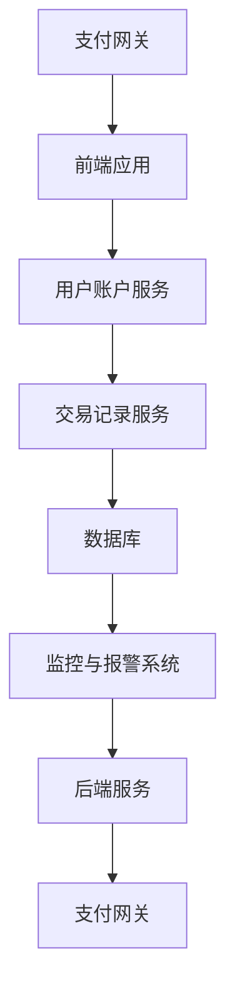
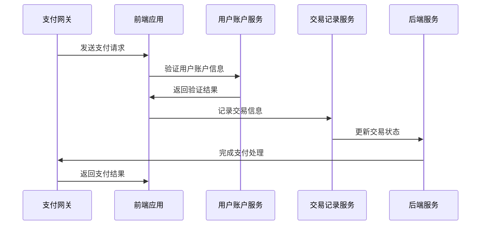
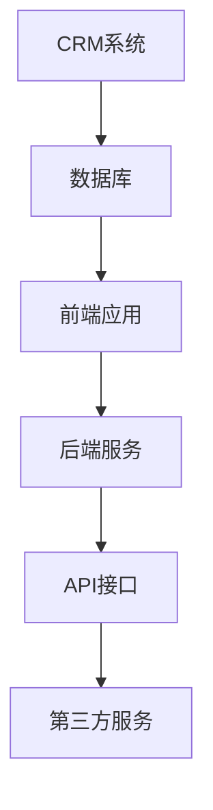

                 


# 技术外包管理：有效利用外部资源

关键词：外包管理、外部资源、成本效益、风险控制、团队合作、合同管理

摘要：
在当今快速发展的信息技术时代，企业面临着不断变化的市场需求和竞争压力。为了保持竞争力，越来越多的企业选择将部分技术任务外包给专业的合作伙伴。本文将系统地探讨技术外包管理的核心问题，包括外包策略与规划、外包过程管理、外包团队协作、外包风险控制、外包成本管理和外包合同管理。通过一步步的分析和思考，我们希望为读者提供实用的指导和建议，帮助企业更好地利用外部资源，提升业务效率。

## 第1章：引言

### 1.1 问题背景与外包管理概述

在当今全球化的商业环境中，企业面临的挑战日益复杂。为了应对这些挑战，企业需要迅速响应市场变化，提高产品和服务质量，同时降低运营成本。然而，企业内部资源有限，难以满足所有技术需求。因此，外包成为一种常见的选择。

外包管理是指企业通过选择合适的外部合作伙伴，将部分技术任务或服务委托给外部组织来完成。外包管理涉及多个方面，包括外包策略的制定、外包过程的监控、外包团队的管理、外包风险的评估和控制、外包成本的核算以及外包合同的管理。

外包管理的目的是通过优化资源配置，提高业务效率和降低成本，从而增强企业的核心竞争力。外包管理的重要性体现在以下几个方面：

1. **成本效益**：外包可以降低人力、物力和时间的投入，帮助企业节省成本。
2. **技术能力**：通过外包，企业可以获取外部专业团队的技术能力，提升自身的技术水平。
3. **灵活性**：外包使企业能够更灵活地调整业务策略，快速响应市场需求。
4. **专注于核心业务**：外包非核心任务可以让企业集中资源于核心竞争力的发展。

### 1.2 外包管理的重要性

外包管理在企业发展中扮演着至关重要的角色。以下是外包管理的重要性的详细分析：

1. **资源优化**：通过外包，企业可以将有限的资源集中在核心业务上，提高资源利用率。
2. **专业知识**：外包可以让企业借助外部专业团队的知识和技能，提高项目的质量和效率。
3. **风险分散**：外包可以将项目风险分散给多个合作伙伴，降低企业承担的风险。
4. **快速响应**：外包团队通常更加专注于特定领域，能够更快地响应市场需求和技术变化。
5. **创新能力**：与外部团队的合作可以带来新的思维和想法，激发企业的创新能力。

### 1.3 书籍结构与目标

本书旨在为读者提供全面的外包管理指导，帮助企业在技术外包方面取得成功。本书的结构如下：

- **第1章**：引言，介绍外包管理的背景和重要性。
- **第2章**：外包策略与规划，讨论外包决策因素和策略制定方法。
- **第3章**：外包过程管理，介绍外包项目的计划与管理、质量监控和进度控制。
- **第4章**：外包团队协作，探讨外包团队的组建、沟通和协作策略。
- **第5章**：外包风险控制，分析外包风险的识别、评估和应对策略。
- **第6章**：外包成本管理，讨论外包成本的核算和成本控制策略。
- **第7章**：外包合同管理，介绍外包合同的起草、履行和纠纷解决。
- **第8章**：外包案例分析，通过实际案例分析和启示，提供实用指导。

通过本书，读者将了解外包管理的核心概念、方法和实践，掌握有效的外包管理技能，从而在竞争激烈的市场中取得优势。

## 第2章：外包策略与规划

### 2.1 外包决策因素分析

外包决策是企业战略规划的重要组成部分，影响企业的长期发展。在外包决策过程中，企业需要综合考虑多个因素，以确保外包能够带来预期的效益。以下是主要的外包决策因素及其分析：

#### 2.1.1 成本效益分析

成本效益分析是外包决策的首要考虑因素。企业需要评估外包与内部执行的成本差异，并计算潜在的节省金额。以下是成本效益分析的关键点：

1. **人力成本**：外包可以减少企业直接雇佣人员的成本，包括工资、福利和培训费用。
2. **运营成本**：外包服务通常包括设备、技术和基础设施的提供，企业无需自行投资。
3. **间接成本**：外包可以减少内部管理成本，如项目管理、质量控制和技术支持等。

**公式示例**：
$$
\text{成本节省} = (\text{外包成本}) - (\text{内部执行成本})
$$

#### 2.1.2 技术能力匹配

技术能力匹配是决定外包成功与否的关键因素。企业需要评估外包合作伙伴的技术能力和项目需求的匹配程度。以下是技术能力匹配的评估方法：

1. **技术熟练度**：合作伙伴的技术团队需要具备项目所需的技术能力和经验。
2. **技术资质**：合作伙伴的资质认证、技术专利和行业声誉是评估其技术能力的依据。
3. **技术适配性**：合作伙伴的技术框架、工具和流程需要与企业现有系统兼容。

#### 2.1.3 资源可用性

资源可用性是外包决策的重要考虑因素。企业需要评估外包合作伙伴的资源分配情况，以确保项目能够按时交付。以下是资源可用性的评估方法：

1. **人力资源**：合作伙伴需要拥有足够的人力资源来承担项目任务。
2. **技术资源**：合作伙伴需要具备必要的技术资源，如开发工具、软件和硬件。
3. **时间资源**：合作伙伴的时间安排需要与企业项目计划相匹配，确保项目按时交付。

### 2.2 外包策略制定方法

制定有效的外包策略是企业成功外包的关键。以下是几种常见的外包策略制定方法：

#### 2.2.1 资源集中化与分散化策略

资源集中化策略是将外包任务集中到一个或几个合作伙伴手中，以实现资源整合和管理效率。这种方法适用于以下情况：

1. **项目规模较大**：大型项目需要集中资源和专业能力来确保质量。
2. **长期合作**：长期合作可以建立稳定的合作关系，降低管理成本。

资源分散化策略是将外包任务分散到多个合作伙伴，以降低风险和获取更多选择。这种方法适用于以下情况：

1. **项目规模较小**：小型项目适合分散化外包，以降低成本。
2. **短期合作**：短期项目适合分散化外包，以快速响应市场需求。

#### 2.2.2 长期与短期外包策略

长期外包策略是指与企业建立长期合作关系，共同开发和维护项目。长期外包的优势包括：

1. **稳定性**：长期合作可以减少不确定性，降低项目风险。
2. **集成度**：长期合作有助于合作伙伴深入理解企业的需求，提高项目质量。

短期外包策略是指与企业建立短期合作关系，完成特定的项目任务。短期外包的优势包括：

1. **灵活性**：短期合作可以快速响应市场需求，提高业务灵活性。
2. **成本控制**：短期合作可以降低项目成本，提高投资回报率。

#### 2.2.3 内部与外部资源协同策略

内部与外部资源协同策略是将内部资源和外部资源相结合，共同完成项目任务。这种方法适用于以下情况：

1. **技术互补**：内部资源和外部资源互补，可以提高项目的技术能力。
2. **资源共享**：内部和外部资源可以共享技术和知识，提高资源利用率。

通过以上策略制定方法，企业可以灵活选择最适合自身需求的外包方式，实现资源优化和业务目标。

### 2.3 外包合作伙伴选择

选择合适的外包合作伙伴是外包成功的关键步骤。以下是选择外包合作伙伴的几个关键因素：

#### 2.3.1 合作伙伴评估指标

1. **技术能力**：合作伙伴需要具备项目所需的技术能力和专业知识。
2. **项目经验**：合作伙伴需要有类似项目的成功经验，以证明其项目执行能力。
3. **资质认证**：合作伙伴的资质认证和行业声誉是评估其专业能力的依据。
4. **成本效益**：合作伙伴的价格水平需要符合企业的预算和成本控制要求。

#### 2.3.2 选择流程与方法

1. **需求分析**：明确项目需求和预期目标，为合作伙伴选择提供依据。
2. **招标与投标**：发布招标公告，邀请潜在合作伙伴参与投标。
3. **评估与筛选**：对投标合作伙伴进行评估，筛选出符合要求的企业。
4. **谈判与合同**：与选定的合作伙伴进行谈判，签订外包合同。

#### 2.3.3 资信审查与评估

1. **财务状况**：审查合作伙伴的财务报表，了解其财务稳定性。
2. **业务背景**：了解合作伙伴的成立时间、业务规模和市场份额。
3. **信用记录**：查询合作伙伴的信用记录，了解其诚信度。

通过以上评估和审查，企业可以确保选择到的外包合作伙伴具备良好的技术能力和信誉，从而提高外包项目的成功率和质量。

## 第3章：外包过程管理

### 3.1 外包项目计划与管理

外包项目计划与管理是确保项目按时、按质、按预算完成的关键环节。以下是如何进行外包项目计划与管理的详细步骤：

#### 3.1.1 项目计划制定

项目计划是项目管理的起点，它需要详细描述项目的目标、范围、任务、时间表和资源分配。以下是项目计划制定的关键步骤：

1. **项目目标**：明确项目的具体目标，确保所有团队成员都理解项目的最终成果。
2. **项目范围**：定义项目的范围，明确项目需要完成的任务和交付物。
3. **任务分解**：将项目任务分解为可管理的子任务，确保每个任务都有明确的负责人和截止日期。
4. **时间表**：制定项目的时间表，确定每个任务的开始和结束时间，确保项目按时完成。
5. **资源分配**：确定项目所需的资源，包括人力、物力和财力，并确保资源合理分配。

#### 3.1.2 项目管理工具与技术

有效的项目管理工具和技术可以帮助团队更好地管理外包项目。以下是一些常用的项目管理工具和技术：

1. **项目管理软件**：如Jira、Trello、Asana等，用于任务分配、进度跟踪和团队协作。
2. **敏捷开发方法**：如Scrum和Kanban，用于快速响应变化和持续迭代。
3. **风险管理**：通过识别、评估和应对项目风险，确保项目顺利推进。
4. **沟通工具**：如Slack、Microsoft Teams等，用于团队成员之间的实时沟通和协作。

#### 3.1.3 项目进度与风险监控

项目进度和风险监控是确保项目按计划推进的关键环节。以下是监控项目进度和风险的方法：

1. **定期会议**：定期召开项目会议，检查项目进度和问题，确保项目按计划进行。
2. **进度报告**：定期生成项目进度报告，向项目相关方通报项目进展情况。
3. **风险管理**：定期评估项目风险，制定风险应对策略，确保项目风险得到有效控制。
4. **问题追踪**：建立问题追踪系统，记录和解决项目中出现的问题，确保项目问题得到及时解决。

通过以上步骤和工具，企业可以有效地管理外包项目，确保项目按时、按质、按预算完成。

### 3.2 外包质量监控

外包质量监控是确保外包项目满足既定质量标准的关键环节。以下是如何进行外包质量监控的详细步骤：

#### 3.2.1 质量标准与规范

制定明确的质量标准和规范是外包质量监控的基础。以下是制定质量标准和规范的关键步骤：

1. **质量目标**：明确项目的质量目标，确保所有团队成员都理解项目的质量要求。
2. **标准制定**：根据项目的特点和需求，制定符合行业标准和最佳实践的质量标准。
3. **规范文档**：编写详细的规范文档，包括开发标准、测试标准、交付标准等，确保所有团队成员都按照规范执行。

#### 3.2.2 质量控制流程

建立有效的质量控制流程是确保外包项目质量的关键。以下是质量控制流程的关键步骤：

1. **需求确认**：在项目开始前，与外包合作伙伴确认项目需求，确保所有需求都得到明确和详细的记录。
2. **过程控制**：在项目执行过程中，定期检查外包合作伙伴的工作进度和质量，确保项目按照规范执行。
3. **评审与反馈**：定期进行项目评审，评估外包项目的质量，提供反馈和建议，确保项目质量持续改进。
4. **交付验收**：在项目交付时，进行全面的验收测试，确保项目满足质量要求。

#### 3.2.3 质量改进策略

质量改进是外包项目管理的持续过程。以下是一些质量改进策略：

1. **持续监控**：建立持续的质量监控机制，定期收集质量数据，分析质量趋势，发现潜在问题。
2. **质量培训**：为外包团队提供质量培训，提高团队成员的质量意识和技能。
3. **质量评审**：定期进行质量评审，识别和解决项目中存在的问题，持续改进质量。
4. **客户反馈**：积极收集客户反馈，了解客户对项目质量的评价，根据反馈进行调整和改进。

通过以上步骤和策略，企业可以确保外包项目的质量达到预期，提高客户满意度和企业声誉。

### 3.3 外包进度控制

外包进度控制是确保外包项目按时完成的关键环节。以下是如何进行外包进度控制的详细步骤：

#### 3.3.1 进度评估方法

进行有效的进度评估是外包进度控制的基础。以下是一些常用的进度评估方法：

1. **关键路径法**：通过确定项目任务的关键路径，评估项目的最晚完成时间，确保项目按时完成。
2. **工作量估算**：根据任务的工作量和团队成员的工作效率，估算项目的完成时间，确保任务分配合理。
3. **进度报告**：定期生成项目进度报告，向项目相关方通报项目进展情况，确保项目进度透明。

#### 3.3.2 进度调整策略

在项目执行过程中，进度可能会因各种原因发生变化，需要及时调整。以下是一些进度调整策略：

1. **资源调配**：根据项目进度，调整团队成员和资源的分配，确保关键任务得到足够资源支持。
2. **任务优先级调整**：根据项目进度和重要性，调整任务的优先级，确保关键任务优先完成。
3. **延期处理**：如果项目延期不可避免，制定延期处理方案，确保项目能够按时交付，减少延期对客户的影响。

#### 3.3.3 沟通与协调机制

有效的沟通与协调机制是确保外包进度控制的关键。以下是一些沟通与协调机制：

1. **定期会议**：定期召开项目进度会议，检查项目进展，解决项目中的问题，确保项目按计划进行。
2. **进度报告**：定期生成项目进度报告，向项目相关方通报项目进展，确保项目进度透明。
3. **问题反馈机制**：建立问题反馈机制，及时收集和解决项目中的问题，确保项目进度不受影响。
4. **变更管理**：建立变更管理流程，确保项目变更得到有效控制，减少变更对项目进度的影响。

通过以上步骤和策略，企业可以有效地控制外包项目的进度，确保项目按时完成。

## 第4章：外包团队协作

### 4.1 外包团队组织结构

外包团队的组织结构是外包项目成功的关键因素之一。合理的组织结构可以确保团队成员之间的高效协作，提高项目效率。以下是如何设计和构建外包团队组织结构的详细步骤：

#### 4.1.1 团队角色与职责

明确团队角色和职责是构建外包团队的第一步。以下是常见的外包团队角色和职责：

1. **项目经理**：负责整体项目的规划、执行和监控，确保项目按计划进行。
2. **业务分析师**：负责与客户沟通，理解业务需求，将需求转化为技术任务。
3. **开发人员**：负责实际开发工作，实现项目功能。
4. **测试工程师**：负责测试项目，确保项目质量。
5. **质量保证人员**：负责项目质量管理，确保项目符合质量标准。
6. **客户支持人员**：负责与客户沟通，解决客户问题和反馈。

#### 4.1.2 团队沟通与协作机制

有效的沟通和协作机制是外包团队高效运作的关键。以下是一些常见的沟通和协作机制：

1. **定期会议**：定期召开团队会议，检查项目进展，解决项目中出现的问题，确保项目按计划进行。
2. **工作日报**：团队成员定期提交工作日报，总结工作进展和遇到的问题，确保团队成员之间的信息共享。
3. **即时通讯工具**：使用即时通讯工具，如Slack、Microsoft Teams等，方便团队成员之间的实时沟通和协作。
4. **文档管理工具**：使用文档管理工具，如Confluence、Google Docs等，方便团队成员共享文档和协作编辑。
5. **项目管理工具**：使用项目管理工具，如Jira、Trello、Asana等，方便团队成员跟踪项目进度和任务。

#### 4.1.3 团队文化建设

团队文化建设是外包团队长期稳定发展的基础。以下是如何建设团队文化的建议：

1. **建立共同目标**：明确团队目标，确保所有团队成员都朝着共同的目标努力。
2. **鼓励创新和反馈**：鼓励团队成员提出创新的想法和反馈，建立开放、包容的团队氛围。
3. **培养团队合作精神**：通过团队活动、培训等方式，培养团队成员的团队合作精神。
4. **尊重个人差异**：尊重团队成员的个人差异，发挥每个人的特长和优势。
5. **提供职业发展机会**：为团队成员提供职业发展机会，激励团队成员不断提升自己。

通过以上步骤和策略，企业可以构建一个高效、协作的外包团队，确保项目顺利推进。

### 4.2 外包沟通机制

有效的沟通机制是外包项目成功的关键。以下是如何建立和优化外包沟通机制的详细步骤：

#### 4.2.1 沟通工具与平台

选择合适的沟通工具和平台是建立有效沟通机制的基础。以下是一些常用的沟通工具和平台：

1. **即时通讯工具**：如Slack、Microsoft Teams、WhatsApp等，用于实时沟通和协作。
2. **邮件系统**：如Gmail、Outlook等，用于正式沟通和文件传输。
3. **项目管理工具**：如Jira、Trello、Asana等，用于任务分配、进度跟踪和团队协作。
4. **视频会议工具**：如Zoom、Microsoft Teams、Skype等，用于远程会议和实时沟通。

#### 4.2.2 沟通策略与技巧

有效的沟通策略和技巧可以帮助团队成员更好地理解和协作。以下是一些建议：

1. **明确沟通目标**：每次沟通前明确沟通的目标和期望结果，确保沟通具有针对性。
2. **使用简洁明了的语言**：避免使用过于复杂的术语和语言，确保所有团队成员都能理解。
3. **积极倾听**：倾听对方的意见和需求，确保沟通是双向的，避免误解和冲突。
4. **及时反馈**：在沟通过程中及时提供反馈，确保双方都了解对方的立场和想法。
5. **建立信任**：通过有效的沟通建立信任，确保团队成员之间的协作更加顺畅。

#### 4.2.3 沟通障碍与解决方法

在沟通过程中，可能会遇到各种障碍。以下是一些常见的沟通障碍和解决方法：

1. **文化差异**：文化差异可能导致沟通障碍，解决方法包括提供跨文化培训、鼓励文化交流和尊重差异。
2. **语言障碍**：语言障碍可能导致沟通不畅，解决方法包括提供语言培训、使用翻译工具或聘请专业的翻译人员。
3. **信息过载**：信息过载可能导致团队成员无法有效处理信息，解决方法包括简化信息传递、使用摘要和重点突出信息。
4. **沟通渠道不畅**：沟通渠道不畅可能导致信息传递不及时，解决方法包括建立多渠道沟通机制、确保沟通渠道畅通。

通过以上策略和解决方法，企业可以建立有效的沟通机制，确保外包项目顺利进行。

### 4.3 外包团队管理策略

外包团队管理策略是确保外包项目成功的关键。以下是如何制定和实施外包团队管理策略的详细步骤：

#### 4.3.1 团队绩效评估

团队绩效评估是团队管理的重要环节，以下是一些关键步骤：

1. **设定绩效目标**：根据项目需求和团队角色，设定明确的绩效目标，确保团队成员都有清晰的工作方向。
2. **定期评估**：定期对团队成员的绩效进行评估，确保团队成员的工作质量和效率。
3. **反馈与改进**：根据评估结果，提供反馈和改进建议，帮助团队成员提升工作表现。
4. **激励措施**：建立激励措施，如奖金、晋升机会等，激励团队成员发挥潜力，提高工作积极性。

#### 4.3.2 团队激励措施

有效的激励措施可以提高团队成员的工作动力和创造力。以下是一些团队激励措施：

1. **绩效奖金**：根据团队和个人的绩效表现，发放绩效奖金，激励团队成员努力工作。
2. **晋升机会**：提供晋升机会，让团队成员看到职业发展的前景，提高工作积极性。
3. **培训与发展**：提供培训和职业发展机会，帮助团队成员提升技能，提高工作效率。
4. **团队活动**：定期组织团队活动，增强团队成员之间的凝聚力和团队合作精神。

#### 4.3.3 团队培训与发展

团队培训与发展是提升团队整体素质和竞争力的关键。以下是一些团队培训与发展策略：

1. **技能培训**：根据项目需求和团队角色，提供相关的技能培训，提升团队成员的专业技能。
2. **领导力培训**：提供领导力培训，提升团队领导者的管理能力和领导力。
3. **跨部门交流**：鼓励跨部门交流和合作，促进团队成员的多元化思维和团队合作。
4. **职业规划**：为团队成员提供职业规划咨询，帮助其制定职业发展计划，提升职业素质。

通过以上策略和措施，企业可以有效地管理外包团队，提升团队整体绩效和项目成功率。

## 第5章：外包风险控制

### 5.1 外包风险的识别与评估

外包风险的识别与评估是外包风险管理的基础。以下是识别和评估外包风险的详细步骤：

#### 5.1.1 风险识别

风险识别是识别可能影响外包项目成功的潜在风险。以下是风险识别的步骤：

1. **收集信息**：收集与外包项目相关的信息，包括项目需求、合作伙伴资质、项目计划等。
2. **访谈与调研**：与项目团队成员、合作伙伴和利益相关者进行访谈，了解潜在风险。
3. **历史数据**：分析过去类似项目的风险记录，识别潜在风险。
4. **风险清单**：列出所有识别到的风险，并记录其潜在影响和可能发生的概率。

#### 5.1.2 风险评估

风险评估是评估识别到的风险对项目的潜在影响。以下是风险评估的步骤：

1. **风险分类**：根据风险的性质和影响，将风险分类，如技术风险、财务风险、运营风险等。
2. **风险优先级排序**：根据风险发生的概率和潜在影响，对风险进行优先级排序，确保资源优先用于处理高优先级风险。
3. **定量分析**：使用定量方法，如风险矩阵、概率-影响评估等，对风险进行定量分析，评估风险的概率和影响。
4. **定性分析**：结合专家意见和经验，对风险进行定性分析，评估风险的可接受程度。

#### 5.1.3 风险应对策略

制定有效的风险应对策略是降低外包风险的关键。以下是几种常见的风险应对策略：

1. **风险规避**：通过调整项目计划或任务分配，避免风险发生。
2. **风险减轻**：通过改进过程、增加资源投入或采取预防措施，降低风险发生的概率或影响。
3. **风险转移**：通过保险、外包合同等方式，将风险转移给合作伙伴或其他利益相关者。
4. **风险接受**：在评估风险的概率和影响后，如果风险在可接受范围内，可以选择接受风险。

### 5.2 外包风险应对策略

外包风险应对策略是针对识别和评估的风险制定具体的应对措施。以下是几种常见的外包风险应对策略：

#### 5.2.1 风险规避策略

风险规避是通过调整项目计划或任务分配，避免风险发生。以下是风险规避策略的实施步骤：

1. **重新规划项目**：重新规划项目任务和时间表，避免高风险任务集中在一个时间窗口内。
2. **任务分解**：将高风险任务分解为更小的子任务，分阶段执行，降低风险集中爆发的可能性。
3. **优化合作伙伴选择**：重新评估合作伙伴的选择标准，选择风险更低、信誉更好的合作伙伴。

#### 5.2.2 风险减轻策略

风险减轻是通过改进过程、增加资源投入或采取预防措施，降低风险发生的概率或影响。以下是风险减轻策略的实施步骤：

1. **过程改进**：优化项目管理和沟通流程，确保项目风险得到及时识别和响应。
2. **资源投入**：增加必要的资源投入，如人力、技术和资金，确保项目能够顺利推进。
3. **预防措施**：采取预防措施，如定期备份、数据加密等，降低风险发生的可能性。

#### 5.2.3 风险转移策略

风险转移是通过保险、外包合同等方式，将风险转移给合作伙伴或其他利益相关者。以下是风险转移策略的实施步骤：

1. **合同条款**：在外包合同中明确风险转移的条款，确保合作伙伴承担相应的风险责任。
2. **保险安排**：为项目购买保险，将项目风险转移给保险公司。
3. **合作机制**：建立合作伙伴之间的风险共担机制，共同应对项目风险。

#### 5.2.4 风险接受策略

风险接受是评估风险的概率和影响后，如果风险在可接受范围内，可以选择接受风险。以下是风险接受策略的实施步骤：

1. **风险评估报告**：制定风险评估报告，明确风险的概率、影响和可接受程度。
2. **风险监控**：建立风险监控机制，定期评估风险的变化，确保风险在可控范围内。
3. **应急预案**：制定应急预案，确保在风险发生时能够迅速响应和应对。

通过以上风险应对策略，企业可以有效地降低外包项目的风险，确保项目成功实施。

### 5.3 外包风险管理流程

有效的外包风险管理流程是确保外包项目顺利实施的关键。以下是如何建立和实施外包风险管理流程的详细步骤：

#### 5.3.1 风险管理计划

制定风险管理计划是外包风险管理的第一步。以下是风险管理计划的制定步骤：

1. **确定风险管理目标**：明确风险管理的目标，如降低项目风险、确保项目按时完成等。
2. **风险管理策略**：根据项目特点和风险识别结果，制定相应的风险管理策略。
3. **风险管理组织**：确定风险管理组织结构，明确风险管理团队的职责和权限。
4. **风险管理资源**：确定风险管理所需的人力、技术和资金资源。
5. **风险管理流程**：制定风险管理流程，包括风险识别、评估、应对和监控等步骤。

#### 5.3.2 风险识别

风险识别是识别可能影响外包项目成功的潜在风险。以下是风险识别的步骤：

1. **收集信息**：收集与外包项目相关的信息，包括项目需求、合作伙伴资质、项目计划等。
2. **访谈与调研**：与项目团队成员、合作伙伴和利益相关者进行访谈，了解潜在风险。
3. **历史数据**：分析过去类似项目的风险记录，识别潜在风险。
4. **风险清单**：列出所有识别到的风险，并记录其潜在影响和可能发生的概率。

#### 5.3.3 风险评估

风险评估是评估识别到的风险对项目的潜在影响。以下是风险评估的步骤：

1. **风险分类**：根据风险的性质和影响，将风险分类，如技术风险、财务风险、运营风险等。
2. **风险优先级排序**：根据风险发生的概率和潜在影响，对风险进行优先级排序，确保资源优先用于处理高优先级风险。
3. **定量分析**：使用定量方法，如风险矩阵、概率-影响评估等，对风险进行定量分析，评估风险的概率和影响。
4. **定性分析**：结合专家意见和经验，对风险进行定性分析，评估风险的可接受程度。

#### 5.3.4 风险应对

风险应对是制定具体的应对措施，降低风险发生的概率或影响。以下是风险应对的步骤：

1. **风险规避**：通过调整项目计划或任务分配，避免风险发生。
2. **风险减轻**：通过改进过程、增加资源投入或采取预防措施，降低风险发生的概率或影响。
3. **风险转移**：通过保险、外包合同等方式，将风险转移给合作伙伴或其他利益相关者。
4. **风险接受**：在评估风险的概率和影响后，如果风险在可接受范围内，可以选择接受风险。

#### 5.3.5 风险监控

风险监控是确保风险管理流程有效实施的关键。以下是风险监控的步骤：

1. **定期评估**：定期评估项目风险的变化，确保风险在可控范围内。
2. **风险报告**：定期生成风险报告，向项目相关方通报项目风险状况。
3. **风险预警**：建立风险预警机制，确保在风险发生时能够及时响应和应对。
4. **风险管理改进**：根据风险监控结果，不断改进风险管理流程和策略。

通过以上步骤和策略，企业可以建立和实施有效的外包风险管理流程，确保外包项目成功实施。

## 第6章：外包成本管理

### 6.1 外包成本核算方法

外包成本核算是外包管理的重要组成部分，它确保企业对外包项目的成本有清晰的了解和有效的控制。以下是如何进行外包成本核算的详细步骤：

#### 6.1.1 成本分类

为了准确核算外包成本，首先需要对外包成本进行分类。以下是一些常见的成本分类：

1. **直接成本**：与外包项目直接相关的成本，如人力成本、外包服务费用、硬件和软件采购费用等。
2. **间接成本**：与外包项目间接相关的成本，如项目管理费用、质量保证费用、培训费用等。
3. **固定成本**：在项目生命周期内不变的成本，如项目策划和合同谈判费用。
4. **可变成本**：随着项目进度和需求变化而变化的成本，如额外的人力资源费用。

#### 6.1.2 成本核算流程

以下是一个典型的外包成本核算流程：

1. **项目立项**：在项目立项阶段，明确项目的目标、范围和预算，为成本核算提供基础。
2. **需求分析**：在需求分析阶段，详细记录项目的需求，为成本估算提供依据。
3. **成本估算**：根据项目需求和成本分类，对项目的直接成本和间接成本进行估算。
4. **成本审批**：将成本估算结果提交给相关管理部门进行审批，确保成本的合理性。
5. **成本监控**：在项目执行过程中，定期监控项目成本，确保实际成本与预算保持一致。
6. **成本分析**：在项目结束时，对项目成本进行分析，评估成本控制效果，为未来项目提供参考。

#### 6.1.3 成本核算工具

为了提高成本核算的效率和准确性，可以借助一些成本核算工具：

1. **成本管理软件**：如Microsoft Excel、SAP、Oracle等，用于成本记录、分析和监控。
2. **项目管理软件**：如Jira、Trello、Asana等，用于任务分配、进度跟踪和成本管理。
3. **预算编制工具**：如Google Sheets、Zoho Budget等，用于预算编制和审批。

通过以上步骤和工具，企业可以有效地进行外包成本核算，确保项目成本在预算范围内，提高成本管理的效率和准确性。

### 6.2 成本控制策略

有效的成本控制策略是确保外包项目在预算范围内完成的关键。以下是如何制定和实施成本控制策略的详细步骤：

#### 6.2.1 预算编制

预算编制是成本控制的第一步，以下是如何制定预算的步骤：

1. **需求分析**：详细分析项目需求，确定项目所需的资源、时间和成本。
2. **成本估算**：根据需求分析结果，对项目的直接成本和间接成本进行估算。
3. **预算审批**：将成本估算结果提交给相关管理部门进行审批，确保预算的合理性和可行性。
4. **预算调整**：根据审批结果，对预算进行调整，确保预算与项目需求和实际情况相符。

#### 6.2.2 成本监控

成本监控是确保项目成本在预算范围内的重要手段，以下是如何进行成本监控的步骤：

1. **建立监控机制**：制定成本监控流程和制度，明确监控职责和权限。
2. **定期报告**：定期生成项目成本报告，向项目相关方通报项目成本状况。
3. **成本分析**：定期分析项目成本数据，识别成本异常和潜在问题。
4. **预警机制**：建立成本预警机制，及时发现和解决成本超支问题。

#### 6.2.3 成本优化

成本优化是提高项目效益的重要策略，以下是如何进行成本优化的步骤：

1. **资源优化**：通过优化资源分配，提高资源利用率，降低项目成本。
2. **过程改进**：优化项目流程和管理过程，提高工作效率，降低间接成本。
3. **供应商管理**：通过与供应商建立良好的合作关系，获取更有竞争力的价格和服务。
4. **技术选型**：选择成本效益更高的技术方案，降低项目成本。

通过以上策略，企业可以有效地控制外包项目的成本，确保项目在预算范围内高质量完成。

### 6.3 外包成本效益分析

外包成本效益分析是评估外包项目经济效益的重要手段。以下是如何进行外包成本效益分析的详细步骤：

#### 6.3.1 成本效益指标

为了评估外包项目的成本效益，需要制定一些关键的成本效益指标。以下是一些常见的成本效益指标：

1. **成本节省率**：通过外包节省的成本与内部执行成本的比率，用于衡量外包带来的成本节省效果。
2. **投资回报率（ROI）**：外包项目的收益与投入成本的比率，用于衡量项目的经济效益。
3. **项目持续时间**：项目实际完成时间与计划完成时间的差异，用于评估项目进度和外包效率。
4. **质量指标**：外包项目交付物的质量指标，如缺陷率、客户满意度等，用于衡量外包项目质量。

#### 6.3.2 数据收集

为了进行有效的成本效益分析，需要收集以下数据：

1. **外包成本**：外包服务的费用、人力成本、间接成本等。
2. **内部成本**：内部执行项目的成本，包括人员工资、培训费用、设备费用等。
3. **项目收益**：项目交付后的收益，如销售收入、成本节省等。
4. **项目进度**：项目实际完成时间和计划完成时间的比较。
5. **质量数据**：项目交付物的质量指标，如缺陷率、客户反馈等。

#### 6.3.3 分析方法

以下是一些常用的成本效益分析方法：

1. **成本比较分析**：比较外包成本和内部执行成本，分析成本差异和节省效果。
2. **ROI计算**：计算投资回报率，评估外包项目的经济效益。
3. **敏感性分析**：分析成本和收益的变化对成本效益的影响，评估项目风险。
4. **比较案例研究**：分析成功和失败的外包案例，总结经验教训，为未来项目提供参考。

通过以上步骤和方法，企业可以全面评估外包项目的成本效益，为决策提供科学依据。

## 第7章：外包合同管理

### 7.1 外包合同起草与审核

外包合同是外包管理的重要组成部分，它是保障外包项目顺利实施和双方权益的重要法律文件。以下是外包合同起草与审核的详细步骤：

#### 7.1.1 合同起草

起草外包合同是合同管理的第一步。以下是起草外包合同的关键步骤：

1. **明确项目需求**：在起草合同前，双方需要明确项目需求、目标、范围和预期成果。
2. **准备合同模板**：根据项目特点和双方需求，选择合适的合同模板，如固定价格合同、时间与材料合同等。
3. **撰写合同条款**：合同条款应包括项目描述、服务范围、交付标准、进度安排、费用和支付方式、保密协议、违约责任等。
4. **审核合同草案**：双方对合同草案进行审核，确保合同内容符合双方利益和法律法规要求。
5. **征求意见**：在合同起草过程中，可征求法律顾问和专业人士的意见，确保合同合法性和有效性。

#### 7.1.2 审核合同

合同审核是确保合同内容合法、合理和完整的必要步骤。以下是审核合同的关键步骤：

1. **法律审核**：由法律顾问对合同进行法律审核，确保合同符合法律法规要求，如合同格式、条款合法性、纠纷解决机制等。
2. **财务审核**：财务部门对合同中的费用和支付方式进行审核，确保合同成本合理，避免财务风险。
3. **技术审核**：技术部门对合同中的技术要求和交付标准进行审核，确保合同中的技术要求符合项目需求。
4. **管理层审核**：项目管理层对合同进行审核，确保合同内容符合项目目标和公司战略。
5. **修改与完善**：根据审核意见，对合同进行修改和完善，确保合同内容完整、合法、合理。

### 7.2 合同履行与变更管理

合同履行与变更管理是确保外包项目按合同约定进行的重要环节。以下是如何进行合同履行与变更管理的详细步骤：

#### 7.2.1 合同履行

合同履行是指双方按照合同约定完成各自的任务。以下是合同履行的关键步骤：

1. **任务分配**：明确合同双方的任务和职责，确保任务分配合理、明确。
2. **进度跟踪**：定期跟踪项目进度，确保项目按合同约定进行。
3. **质量保证**：确保项目交付物符合合同中的质量标准和要求。
4. **文档管理**：及时记录项目进展、变更和问题，确保项目文档的完整性和可追溯性。
5. **费用支付**：按照合同约定的支付方式和时间，及时支付相关费用。

#### 7.2.2 变更管理

在项目执行过程中，可能会出现各种变更需求，变更管理是确保项目变更顺利进行的关键。以下是变更管理的关键步骤：

1. **变更申请**：当项目需求发生变化时，相关方需提出变更申请，详细说明变更的原因和影响。
2. **评估变更**：对变更申请进行评估，分析变更对项目进度、成本、质量等方面的影响。
3. **变更审批**：根据评估结果，对变更申请进行审批，确保变更符合项目目标和公司战略。
4. **更新合同**：将审批通过的变更内容纳入合同，确保变更后的合同内容合法、合理。
5. **执行变更**：根据更新后的合同，执行项目变更，确保项目按变更后的计划和目标进行。

通过以上步骤，企业可以确保外包合同的履行和变更管理的有效进行，确保项目顺利进行。

### 7.3 合同纠纷解决

合同纠纷解决是外包合同管理中不可避免的一部分。以下是如何进行合同纠纷解决的详细步骤：

#### 7.3.1 纠纷处理原则

在处理合同纠纷时，应遵循以下原则：

1. **公平公正**：确保纠纷处理过程公平公正，避免偏袒任何一方。
2. **合法合规**：依据法律法规和合同条款进行纠纷处理，确保处理结果合法合规。
3. **及时解决**：及时处理合同纠纷，避免纠纷对项目进展和双方合作关系造成长期影响。
4. **和解为主**：鼓励双方通过协商、调解等方式解决纠纷，避免法律诉讼带来的时间和成本。

#### 7.3.2 纠纷解决方式

以下是一些常见的合同纠纷解决方式：

1. **协商解决**：双方直接协商，寻求达成一致意见，是解决纠纷的最快、最经济的方式。
2. **调解解决**：通过第三方调解机构进行调解，帮助双方达成和解。
3. **仲裁解决**：将纠纷提交给仲裁机构进行仲裁，仲裁结果具有法律效力。
4. **诉讼解决**：当其他解决方式无法达成一致时，可依法向法院提起诉讼。

#### 7.3.3 纠纷处理流程

以下是合同纠纷处理的基本流程：

1. **纠纷报告**：发现合同纠纷时，相关人员应立即报告给管理层和合同管理部门。
2. **初步调查**：对纠纷情况进行初步调查，了解纠纷的具体情况和原因。
3. **协商调解**：尝试通过协商或调解解决纠纷，争取双方达成和解。
4. **法律咨询**：在无法协商调解时，寻求法律顾问的意见，制定应对策略。
5. **仲裁或诉讼**：在协商无果时，依法选择仲裁或诉讼解决纠纷。
6. **执行裁决**：根据裁决结果，执行判决或仲裁决定，确保纠纷得到最终解决。

通过以上流程和方式，企业可以有效地解决合同纠纷，维护合同双方的合法权益，确保项目顺利进行。

## 第8章：外包案例分析

### 8.1 案例一：成功外包案例解析

**背景介绍**：
某大型互联网公司在2018年决定将其在线支付系统的开发外包给一家专业的软件公司。该支付系统需要处理海量交易，具备高并发、高可用性和安全性。该项目预算为500万美元，预计开发周期为18个月。

**项目介绍**：
项目的主要目标是开发一个高效、安全、可扩展的在线支付系统，支持多种支付方式和货币。项目涉及多个技术组件，包括前端应用、后端服务、数据库和支付网关。

**系统功能设计**：
系统功能设计包括支付流程管理、账户管理、交易记录、支付网关集成和安全控制等。其中，支付网关集成是项目的关键部分，需要与多家银行和支付提供商合作。

**系统架构设计**：
系统采用微服务架构，各个功能模块独立部署和运行。系统架构图如下：



**系统接口设计和系统交互**：
系统接口设计包括RESTful API和WebSocket。系统交互图如下：



**环境安装**：
项目在Linux环境中进行开发，使用Docker进行容器化部署。主要依赖项包括Python 3.7、Flask框架、PostgreSQL数据库和Redis缓存。

**系统核心实现源代码**：

```python
# 支付网关实现示例
from flask import Flask, request, jsonify
import requests

app = Flask(__name__)

@app.route('/process_payment', methods=['POST'])
def process_payment():
    payment_data = request.get_json()
    # 验证支付请求
    if validate_payment_request(payment_data):
        # 调用后端服务处理支付
        response = requests.post('http://backend_service/process_payment', json=payment_data)
        return jsonify(response.json())
    else:
        return jsonify({'error': 'Invalid payment request'}), 400

def validate_payment_request(payment_data):
    # 验证支付请求的参数
    # ...
    return True

if __name__ == '__main__':
    app.run(host='0.0.0.0', port=5000)
```

**代码应用解读与分析**：
以上代码是支付网关的核心实现，用于处理前端应用的支付请求。支付网关首先验证支付请求的有效性，然后调用后端服务进行处理，最后将支付结果返回给前端应用。

**实际案例分析和详细讲解剖析**：
该项目成功的关键因素包括：

1. **明确的需求和目标**：项目开始前，双方明确了项目需求和目标，确保项目方向一致。
2. **专业的合作伙伴**：选择了一家具有丰富经验的软件公司作为合作伙伴，确保技术能力和项目执行能力。
3. **合理的系统架构**：采用微服务架构，提高了系统的可扩展性和维护性。
4. **有效的沟通和协作**：双方建立了良好的沟通和协作机制，确保项目顺利进行。

**项目小结**：
该项目成功完成了在线支付系统的开发，满足了业务需求，提高了业务效率。项目的成功经验表明，明确的需求、专业的合作伙伴和有效的沟通是外包项目成功的关键。

### 8.2 案例二：失败外包案例剖析

**背景介绍**：
某中小型企业在2019年决定将其客户关系管理系统（CRM）外包给一家新兴的软件公司。该企业希望借助外包来降低成本和提高效率。项目预算为200万元，预计开发周期为12个月。

**项目介绍**：
项目的主要目标是开发一个功能全面、易于使用的CRM系统，支持客户管理、销售管理、市场管理和客户服务等功能。

**系统功能设计**：
系统功能设计包括客户信息管理、销售机会管理、市场营销管理、客户服务管理、报表统计等。

**系统架构设计**：
系统采用单体架构，所有功能模块集成在一个应用程序中。系统架构图如下：



**系统接口设计和系统交互**：
系统接口设计主要包括RESTful API，系统交互相对简单。但由于架构不合理，系统性能和可扩展性较差。

**环境安装**：
项目在Windows环境中进行开发，使用SQL Server数据库。主要依赖项包括Java 8、Spring Boot框架。

**系统核心实现源代码**：

```java
// 后端服务实现示例
@RestController
@RequestMapping("/api")
public class CustomerController {

    @Autowired
    private CustomerService customerService;

    @GetMapping("/customers")
    public ResponseEntity<List<Customer>> getAllCustomers() {
        List<Customer> customers = customerService.getAllCustomers();
        return ResponseEntity.ok(customers);
    }

    @PostMapping("/customers")
    public ResponseEntity<Customer> createCustomer(@RequestBody Customer customer) {
        Customer savedCustomer = customerService.createCustomer(customer);
        return new ResponseEntity<>(savedCustomer, HttpStatus.CREATED);
    }
}
```

**代码应用解读与分析**：
以上代码是CRM系统的后端服务实现，用于处理客户端的请求。虽然代码结构简单，但系统整体性能和可扩展性较差，难以满足业务需求。

**实际案例分析和详细讲解剖析**：
该项目失败的主要原因包括：

1. **需求不明确**：项目开始前，双方对项目需求和目标理解不一致，导致项目方向偏差。
2. **合作伙伴选择不当**：选择的软件公司缺乏经验，技术实力不足，无法满足项目需求。
3. **系统架构不合理**：采用单体架构，系统性能和可扩展性较差，难以满足业务增长需求。
4. **沟通不畅**：双方沟通不畅，导致问题无法及时解决，影响项目进度和质量。

**项目小结**：
该项目由于多种原因导致失败，给企业带来了经济损失和业务影响。项目的失败经验表明，明确的需求、专业的合作伙伴和有效的沟通是外包项目成功的关键。

### 8.3 案例启示与建议

通过以上两个案例，我们可以得出以下启示和建议：

1. **明确需求**：在项目开始前，明确项目需求和目标，确保双方对项目有共同的理解。
2. **选择合适的合作伙伴**：选择具有丰富经验和专业技术能力的合作伙伴，确保项目成功实施。
3. **合理的系统架构**：选择合适的系统架构，提高系统的性能和可扩展性，满足业务增长需求。
4. **有效的沟通与协作**：建立有效的沟通和协作机制，确保项目问题能够及时解决。
5. **合同管理**：制定详细的合同，明确双方的权利和义务，避免合同纠纷。
6. **风险管理**：建立风险管理机制，识别和应对潜在风险，确保项目顺利进行。

通过遵循以上建议，企业可以更好地利用外部资源，实现外包项目的成功。

## 总结

本文系统地探讨了技术外包管理的核心问题，包括外包策略与规划、外包过程管理、外包团队协作、外包风险控制、外包成本管理和外包合同管理。通过逐步分析和思考，我们为读者提供了实用的指导和建议，帮助企业更好地利用外部资源，提升业务效率。

在技术外包管理中，明确的需求、专业的合作伙伴、合理的系统架构、有效的沟通与协作以及严格的风险管理和合同管理是确保外包项目成功的关键。通过遵循这些原则和策略，企业可以充分利用外部资源，实现成本效益和业务目标。

让我们再次回顾本文的核心观点：

1. **明确需求**：确保项目目标和需求清晰明确，避免项目方向偏差。
2. **选择合适的合作伙伴**：选择具备丰富经验和专业技术能力的合作伙伴，确保项目顺利实施。
3. **合理的系统架构**：选择适合项目需求的系统架构，提高系统的性能和可扩展性。
4. **有效的沟通与协作**：建立良好的沟通和协作机制，确保项目问题能够及时解决。
5. **严格的风险管理**：建立全面的风险管理机制，识别和应对潜在风险。
6. **完善的合同管理**：制定详细的合同，明确双方的权利和义务，避免合同纠纷。

通过遵循这些原则，企业可以在技术外包管理中取得成功，实现资源优化和业务目标。

未来，随着技术的不断发展和市场环境的不断变化，外包管理将面临新的挑战和机遇。我们期待在未来的实践中，继续探索和应用新的外包管理方法，帮助企业更好地应对变化，实现可持续发展。

**作者信息**：

作者：AI天才研究院/AI Genius Institute & 禅与计算机程序设计艺术 /Zen And The Art of Computer Programming

感谢您的阅读，希望本文对您的技术外包管理实践有所启发。让我们共同探索和实现更高效、更智能的外包管理模式，为企业创造更多价值。**完**。

