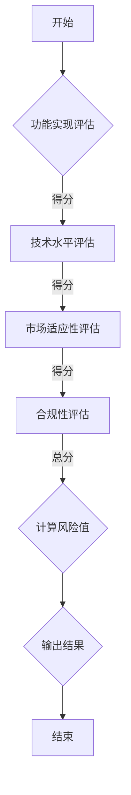
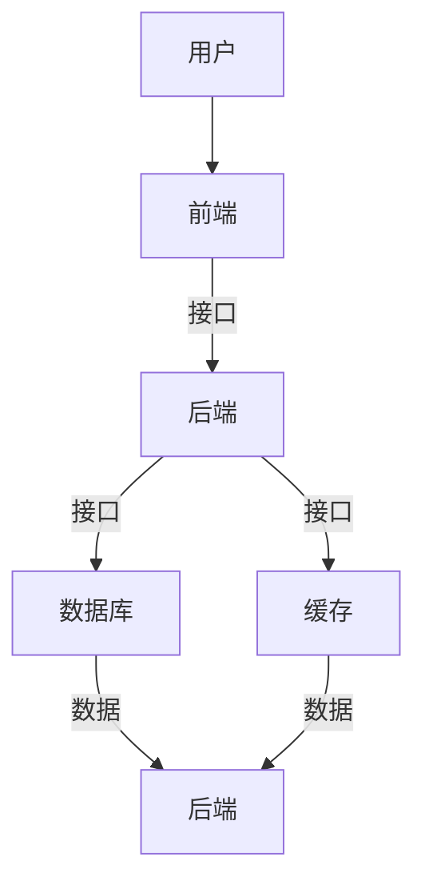
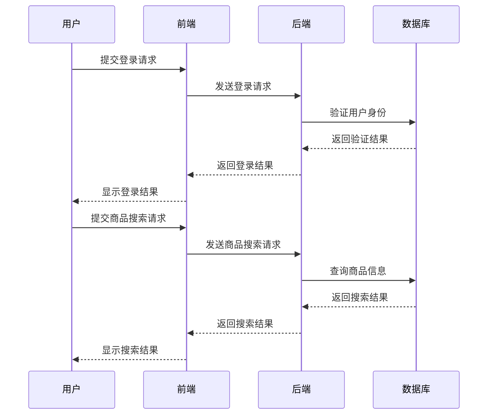

                 

### 引言

#### 1.1 问题背景

随着信息技术的飞速发展，企业对技术资产的投资越来越多，技术尽职调查（Technical Due Diligence，TDD）的重要性愈发凸显。TDD是指在并购、投资或项目合作等过程中，对目标技术资产的评估和风险分析的一种专业活动。通过TDD，企业能够全面了解技术资产的价值、潜在风险以及未来发展的可能性，为决策提供有力支持。

#### 1.2 问题描述

在技术尽职调查中，如何准确评估技术资产的价值和风险，成为了企业和投资者面临的重大挑战。这不仅涉及到对现有技术功能的分析，还涉及到对技术未来的可持续发展、市场适应性、技术合规性等多个方面的评估。

#### 1.3 问题解决

本文旨在通过系统的方法论和实际案例，探讨技术尽职调查的流程和方法，帮助企业和投资者有效地识别和评估技术资产的价值和风险。通过本文的探讨，读者将了解到：

1. 技术尽职调查的核心概念和联系。
2. 技术尽职调查的流程与方法。
3. 算法原理讲解及其在实际系统中的应用。
4. 实际项目中的实战经验和案例分析。

#### 1.4 边界与外延

本文讨论的技术尽职调查主要针对软件和技术领域，但所涉及的方法和思路可以扩展到其他技术领域。此外，本文侧重于技术和风险评估的实务操作，而非纯粹的理论探讨。

#### 1.5 概念结构与核心要素组成

技术尽职调查涉及多个核心概念，包括技术资产、风险评估、技术评估等。这些概念之间相互关联，共同构成了技术尽职调查的理论框架。以下是对这些核心概念及其相互关系的简要介绍：

- **技术资产**：指企业所拥有的、能够产生价值的技术资源，包括专利、软件、技术文档、研发成果等。
- **风险评估**：对技术资产可能面临的风险进行识别、评估和管理，以降低风险对企业的负面影响。
- **技术评估**：对技术资产的技术水平、功能实现、市场适应性等进行全面评估，以确定其价值。

通过以上核心概念的相互作用，技术尽职调查能够帮助企业全面了解技术资产的价值和潜在风险，为投资决策提供有力依据。

### 核心概念与联系

#### 2.1 技术尽职调查概述

技术尽职调查（TDD）是一种系统性的评估过程，旨在通过全面分析技术资产，识别潜在风险，评估其价值，从而为投资决策提供依据。TDD的核心概念包括技术资产评估、风险评估和技术评估。

#### 2.2 技术资产评估

技术资产评估是对企业所拥有的技术资源进行价值评估的过程。技术资产包括专利、软件、技术文档、研发成果等。技术资产评估主要关注以下几个方面：

1. **功能实现**：评估技术资产的功能是否满足业务需求，是否具备实用性。
2. **技术水平**：评估技术资产的技术水平，包括技术先进性、创新性等。
3. **市场适应性**：评估技术资产在市场中的应用前景，是否能够适应市场需求。
4. **合规性**：评估技术资产是否符合相关法律法规要求，包括知识产权保护、数据安全等。

#### 2.3 风险评估

风险评估是技术尽职调查的重要组成部分，旨在识别、评估和管理技术资产可能面临的风险。风险评估主要包括以下几个方面：

1. **技术风险**：包括技术实现风险、技术更新风险、技术依赖风险等。
2. **市场风险**：包括市场需求变化风险、市场竞争风险等。
3. **法律风险**：包括知识产权纠纷、数据安全风险、合规性风险等。
4. **运营风险**：包括技术团队稳定性、项目管理风险等。

#### 2.4 核心概念属性特征对比表格

为了更清晰地展示技术尽职调查中的核心概念及其属性特征，我们可以通过以下对比表格进行分析：

| 核心概念 | 属性特征 |
| :--: | :--: |
| 技术资产 | 功能实现、技术水平、市场适应性、合规性 |
| 风险评估 | 技术风险、市场风险、法律风险、运营风险 |
| 技术评估 | 功能实现评估、技术水平评估、市场适应性评估、合规性评估 |

#### 2.5 ER实体关系图架构

为了更好地理解技术尽职调查中的核心概念及其相互关系，我们可以通过ER（实体-关系）图来展示。以下是一个简化的ER图示例：

```mermaid
erDiagram
  TechAsset ||--|{ RiskAssessment } : has
  RiskAssessment ||--|{ TechEvaluation } : is_based_on
  TechAsset ||--|{ ComplianceEvaluation } : has
```

在这个ER图中，`TechAsset`（技术资产）与`RiskAssessment`（风险评估）和`TechEvaluation`（技术评估）之间存在关联关系，表明技术资产需要通过风险评估和技术评估来确定其价值和风险。同时，技术资产还需要通过合规性评估来确保其符合相关法律法规要求。

### 技术尽职调查流程与方法

#### 3.1 前期准备

技术尽职调查的前期准备是确保整个调查过程顺利进行的重要基础。前期准备主要包括以下几个方面：

1. **明确调查目标和范围**：根据企业的需求和目标，明确技术尽职调查的范围和重点，包括需要评估的技术资产、评估标准和时间节点等。
2. **组建专业团队**：组建由技术专家、风险专家、法律专家等组成的跨学科团队，确保调查的全面性和专业性。
3. **制定调查计划**：制定详细的调查计划，包括调查步骤、任务分配、时间安排等，确保调查工作有序进行。

#### 3.2 资料收集

资料收集是技术尽职调查的核心环节，通过收集和分析相关资料，可以全面了解技术资产的情况。资料收集主要包括以下几个方面：

1. **技术文档**：包括软件代码、设计文档、用户手册等，通过分析这些文档，可以了解技术资产的功能实现、技术水平和合规性。
2. **业务资料**：包括业务流程、市场需求分析等，通过分析这些资料，可以了解技术资产的市场适应性和业务价值。
3. **法律资料**：包括专利证书、合作协议、法律意见书等，通过分析这些资料，可以了解技术资产的知识产权保护情况。

#### 3.3 技术评估

技术评估是对技术资产进行价值评估的过程，通过技术评估可以确定技术资产的功能实现、技术水平、市场适应性和合规性。技术评估主要包括以下几个方面：

1. **功能实现评估**：评估技术资产是否满足业务需求，功能是否完整、稳定。
2. **技术水平评估**：评估技术资产的技术水平，包括技术的先进性、创新性等。
3. **市场适应性评估**：评估技术资产在市场中的应用前景，是否能够满足市场需求。
4. **合规性评估**：评估技术资产是否符合相关法律法规要求，包括知识产权保护、数据安全等。

#### 3.4 风险识别与评估

风险识别与评估是技术尽职调查的关键环节，通过识别和评估技术资产可能面临的风险，可以为企业提供风险管理建议。风险识别与评估主要包括以下几个方面：

1. **技术风险识别**：识别技术资产在实现、更新、依赖等方面的风险。
2. **市场风险识别**：识别市场需求变化、市场竞争等方面的风险。
3. **法律风险识别**：识别知识产权纠纷、数据安全、合规性等方面的风险。
4. **风险评估**：对识别出的风险进行评估，确定风险的影响程度和概率，为企业提供风险管理建议。

#### 3.5 报告撰写与呈现

技术尽职调查报告是对整个调查过程和结果的总结，通过报告，可以清晰地呈现技术资产的价值和风险。报告撰写与呈现主要包括以下几个方面：

1. **报告结构**：制定合理的报告结构，包括摘要、目录、正文、附录等。
2. **技术资产评估**：详细阐述技术资产的功能实现、技术水平、市场适应性和合规性。
3. **风险评估**：详细阐述识别出的风险，包括风险的影响程度、概率和风险管理建议。
4. **结论与建议**：基于调查结果，提出结论和建议，为企业的投资决策提供依据。

通过以上技术尽职调查的流程与方法，企业可以全面了解技术资产的价值和风险，为投资决策提供有力支持。

### 算法原理讲解

#### 4.1 算法概述

技术尽职调查中，风险评估算法是一个关键的组成部分。本节将介绍一种用于风险评估的算法，并详细讲解其原理和应用。

#### 4.1.1 算法定义

该算法名为“技术风险评估算法（Technical Risk Assessment Algorithm, TRAA）”，其目的是通过分析技术资产的各种属性，评估其潜在风险，并为决策者提供风险管理建议。

#### 4.1.2 算法特点

TRAA算法具有以下特点：

1. **多维度评估**：综合考虑技术资产的功能实现、技术水平、市场适应性和合规性等多个维度。
2. **量化风险评估**：使用量化指标对风险进行评估，确保评估结果的客观性和一致性。
3. **自适应调整**：根据技术环境的变化，动态调整风险评估模型，提高风险评估的准确性。

#### 4.1.3 算法应用场景

TRAA算法适用于以下场景：

1. **并购和投资**：在并购和投资项目前，对目标技术资产进行风险评估，确保投资决策的准确性。
2. **项目规划**：在项目规划阶段，对项目的技术风险进行评估，为项目决策提供依据。
3. **合规审查**：在技术资产的开发和运营过程中，定期进行合规性评估，确保技术资产符合相关法律法规。

#### 4.2 算法原理详细讲解

##### 4.2.1 数学模型

TRAA算法基于以下数学模型进行风险评估：

$$
R = f(A, T, M, C)
$$

其中，\( R \)表示风险值，\( A \)表示功能实现，\( T \)表示技术水平，\( M \)表示市场适应性，\( C \)表示合规性。

每个维度都可以用0到100的分数表示，总分越高，风险越低。算法的函数\( f \)是一个复合函数，综合考虑各个维度的权重和得分。

##### 4.2.2 Mermaid算法流程图

以下是一个简化的TRAA算法流程图：



在这个流程图中，首先对技术资产的功能实现、技术水平、市场适应性和合规性进行评估，然后计算总分，最后输出风险值。

#### 4.3 算法举例说明

##### 4.3.1 示例一

假设有一个技术资产，其功能实现得分为80，技术水平得分为85，市场适应性得分为70，合规性得分为90。使用TRAA算法计算其风险值：

$$
R = f(80, 85, 70, 90) = \frac{80 + 85 + 70 + 90}{4} = 80
$$

因此，该技术资产的风险值为80，表明其风险相对较低。

##### 4.3.2 示例二

以下是一个Python代码示例，用于计算技术资产的风险值：

```python
def calculate_risk(func_score, tech_score, market_score, compliance_score):
    total_score = (func_score + tech_score + market_score + compliance_score) / 4
    risk_value = 100 - total_score
    return risk_value

# 示例数据
func_score = 80
tech_score = 85
market_score = 70
compliance_score = 90

# 计算风险值
risk_value = calculate_risk(func_score, tech_score, market_score, compliance_score)
print(f"技术资产的风险值为：{risk_value}")
```

运行这段代码，将输出技术资产的风险值为80，与示例一的结果一致。

通过以上算法的详细讲解和举例，读者可以更好地理解TRAA算法的原理和应用。在技术尽职调查过程中，合理运用TRAA算法，可以有效地评估技术资产的风险，为企业的决策提供有力支持。

### 系统分析与架构设计方案

#### 5.1 问题场景介绍

在本节中，我们将探讨一个实际的企业级应用场景：一个在线购物平台的系统架构设计。该平台需要支持数百万用户的访问，提供商品浏览、购物车管理、订单处理、支付和售后服务等功能。为了确保系统的稳定性和高效性，我们采用技术尽职调查的方法，对系统的架构进行详细分析和设计。

#### 5.2 项目介绍

该在线购物平台是一个复杂的多模块系统，分为前端、后端和数据库三个主要部分。前端负责用户界面的展示和用户交互，后端负责业务逻辑的处理和数据处理，数据库负责存储和管理数据。

#### 5.3 系统功能设计

系统功能设计是系统架构设计的重要基础，需要明确各个模块的功能和接口。以下是该在线购物平台的主要功能模块：

1. **用户模块**：包括用户注册、登录、个人信息管理、密码找回等。
2. **商品模块**：包括商品分类、商品信息展示、商品搜索、商品评论等。
3. **购物车模块**：包括购物车添加、删除、修改、清空等。
4. **订单模块**：包括订单创建、订单详情、订单支付、订单跟踪等。
5. **支付模块**：包括支付方式选择、支付处理、支付结果反馈等。
6. **售后服务模块**：包括售后服务申请、售后服务处理、售后服务评价等。

#### 5.3.1 领域模型Mermaid类图

为了更好地展示系统中的类和它们之间的关系，我们可以使用Mermaid类图来描述。以下是一个简化的领域模型类图：

```mermaid
classDiagram
User <<class{用户}>
Product <<class{商品}>
ShoppingCart <<class{购物车}>
Order <<class{订单}>
Payment <<class{支付}>
AfterSale <<class{售后服务}>
User o--o ShoppingCart
User o--o Order
User o--o Payment
User o--o AfterSale
ShoppingCart o--o Product
Order o--o ShoppingCart
Order o--o Payment
Order o--o AfterSale
Product o--o Comment
```

在这个类图中，用户与购物车、订单、支付和售后服务模块之间存在关联关系，表明用户可以进行购物车管理、订单处理、支付和售后服务操作。购物车与商品模块之间存在关联关系，表明用户可以在购物车中添加、删除和修改商品。订单与购物车、支付和售后服务模块之间存在关联关系，表明订单需要与购物车、支付处理和售后服务关联。

#### 5.4 系统架构设计

系统架构设计是系统功能设计的基础，决定了系统的性能、可扩展性和可维护性。以下是该在线购物平台的主要架构设计：

1. **前端架构**：采用单页面应用（SPA）架构，使用Vue.js或React.js等前端框架，实现高效的用户界面交互和响应。
2. **后端架构**：采用微服务架构，将系统拆分为多个独立的微服务，每个微服务负责处理不同的业务逻辑，如用户服务、商品服务、订单服务、支付服务和售后服务等。
3. **数据库架构**：采用关系型数据库和NoSQL数据库结合的方式，关系型数据库用于存储用户数据、订单数据等结构化数据，NoSQL数据库用于存储商品信息、评论数据等非结构化数据。
4. **缓存架构**：采用分布式缓存系统，如Redis，用于缓存热点数据和频繁访问的数据，提高系统性能和响应速度。
5. **消息队列**：采用消息队列系统，如RabbitMQ或Kafka，用于异步处理订单支付、售后服务等消息，确保系统的高可用性和稳定性。

#### 5.4.1 Mermaid架构图

以下是一个简化的Mermaid架构图，展示了前端、后端、数据库和缓存系统之间的关系：



在这个架构图中，用户通过前端与系统进行交互，前端通过接口与后端、数据库和缓存进行通信。后端负责处理业务逻辑，数据库用于存储数据，缓存用于缓存热点数据，提高系统性能。

#### 5.5 系统接口设计

系统接口设计是系统架构设计的重要组成部分，决定了各个模块之间的通信方式。以下是该在线购物平台的主要接口设计：

1. **用户接口**：包括用户注册、登录、个人信息管理等接口。
2. **商品接口**：包括商品分类、商品信息展示、商品搜索等接口。
3. **购物车接口**：包括购物车添加、删除、修改、清空等接口。
4. **订单接口**：包括订单创建、订单详情、订单支付、订单跟踪等接口。
5. **支付接口**：包括支付方式选择、支付处理、支付结果反馈等接口。
6. **售后服务接口**：包括售后服务申请、售后服务处理、售后服务评价等接口。

#### 5.6 系统交互

系统交互是系统运行过程中的关键环节，决定了各个模块之间的协作方式。以下是该在线购物平台的主要系统交互：

1. **用户登录**：用户通过前端提交登录请求，后端验证用户身份，返回登录结果。
2. **商品搜索**：用户通过前端提交商品搜索请求，后端根据用户搜索条件查询商品信息，返回搜索结果。
3. **购物车操作**：用户通过前端提交购物车操作请求，后端更新购物车数据，返回操作结果。
4. **订单创建**：用户通过前端提交订单创建请求，后端创建订单，返回订单详情。
5. **支付处理**：用户通过前端提交支付请求，后端处理支付，返回支付结果。
6. **售后服务处理**：用户通过前端提交售后服务请求，后端处理售后服务，返回处理结果。

#### 5.6.1 Mermaid序列图

以下是一个简化的Mermaid序列图，展示了用户登录和商品搜索的系统交互：



在这个序列图中，用户通过前端与系统进行交互，前端将请求发送到后端，后端通过数据库查询数据，并返回结果，最后前端将结果展示给用户。

#### 5.7 项目实战

在本节中，我们将通过一个实际项目，展示如何进行系统架构设计和技术尽职调查。

##### 5.7.1 环境安装

首先，我们需要安装项目的运行环境。以下是安装步骤：

1. 安装Node.js和npm。
2. 安装Vue.js或React.js等前端框架。
3. 安装Spring Boot等后端框架。
4. 安装MySQL等数据库管理系统。
5. 安装Redis等缓存系统。

##### 5.7.2 系统核心实现

以下是系统核心实现的源代码示例：

```python
# 用户模块示例代码
def register_user(username, password):
    # 实现用户注册逻辑
    pass

def login_user(username, password):
    # 实现用户登录逻辑
    pass

# 商品模块示例代码
def search_products(search_term):
    # 实现商品搜索逻辑
    pass

def get_product_details(product_id):
    # 实现商品详情获取逻辑
    pass

# 购物车模块示例代码
def add_to_cart(user_id, product_id, quantity):
    # 实现添加购物车逻辑
    pass

def remove_from_cart(user_id, product_id):
    # 实现移除购物车逻辑
    pass

# 订单模块示例代码
def create_order(user_id, cart_id):
    # 实现订单创建逻辑
    pass

def get_order_details(order_id):
    # 实现订单详情获取逻辑
    pass

# 支付模块示例代码
def process_payment(order_id, payment_method):
    # 实现支付处理逻辑
    pass

# 售后服务模块示例代码
def apply_after_sales(user_id, order_id, issue):
    # 实现售后服务申请逻辑
    pass
```

##### 5.7.3 代码应用解读与分析

以上代码展示了用户模块、商品模块、购物车模块、订单模块、支付模块和售后服务模块的核心实现。以下是对代码的解读和分析：

1. **用户模块**：包括注册用户和登录用户两个功能，通过接收用户名和密码，实现用户注册和登录逻辑。
2. **商品模块**：包括搜索商品和获取商品详情两个功能，通过接收搜索关键词和商品ID，实现商品搜索和商品详情获取逻辑。
3. **购物车模块**：包括添加商品到购物车、移除商品从购物车两个功能，通过接收用户ID、商品ID和数量，实现购物车管理逻辑。
4. **订单模块**：包括创建订单和获取订单详情两个功能，通过接收用户ID和购物车ID，实现订单创建和订单详情获取逻辑。
5. **支付模块**：包括处理支付和获取支付结果两个功能，通过接收订单ID和支付方式，实现支付处理逻辑。
6. **售后服务模块**：包括申请售后服务和获取售后服务结果两个功能，通过接收用户ID、订单ID和问题描述，实现售后服务申请和售后服务处理逻辑。

通过以上代码示例和解读，我们可以看到系统核心功能的实现方法和逻辑，为后续的系统开发和运维提供了基础。

#### 5.8 实际案例分析与详细讲解剖析

在本节中，我们将通过一个实际案例，分析在线购物平台的技术尽职调查过程，并详细讲解其剖析过程。

##### 5.8.1 案例背景

假设某企业计划收购一家在线购物平台，为了确保投资决策的准确性，企业决定进行技术尽职调查。

##### 5.8.2 案例过程

1. **前期准备**：明确技术尽职调查的目标和范围，组建由技术专家、风险专家和法律专家组成的跨学科团队。
2. **资料收集**：收集目标平台的用户手册、技术文档、业务流程、法律协议等资料。
3. **技术评估**：对平台的功能实现、技术水平、市场适应性和合规性进行评估。
   - **功能实现评估**：平台是否支持商品浏览、购物车管理、订单处理、支付和售后服务等功能。
   - **技术水平评估**：平台的代码质量、架构设计、技术文档是否完善。
   - **市场适应性评估**：平台的市场占有率、用户反馈、竞争环境等。
   - **合规性评估**：平台的知识产权保护、数据安全、合规性是否符合相关法律法规。
4. **风险评估**：识别和评估平台可能面临的风险。
   - **技术风险**：平台的技术实现是否存在缺陷，是否依赖特定的技术或框架。
   - **市场风险**：市场需求变化、竞争对手策略等。
   - **法律风险**：知识产权纠纷、数据安全风险、合规性风险等。
   - **运营风险**：平台运营团队的稳定性、项目管理风险等。
5. **报告撰写与呈现**：撰写技术尽职调查报告，详细阐述评估结果和风险管理建议。

##### 5.8.3 剖析过程

1. **技术资产评估**：
   - 功能实现：平台支持所有主要功能，但部分功能存在优化空间。
   - 技术水平：代码质量较高，但部分模块存在重复代码和性能瓶颈。
   - 市场适应性：市场占有率较高，用户反馈良好，但需关注竞争对手的新策略。
   - 合规性：符合相关法律法规，但需定期进行合规性审查。

2. **风险评估**：
   - 技术风险：存在部分技术依赖，需定期更新技术栈。
   - 市场风险：市场需求变化可能导致用户流失。
   - 法律风险：存在知识产权纠纷的风险，需加强知识产权保护。
   - 运营风险：平台运营团队稳定性较高，但需加强项目管理，确保项目进度和质量。

3. **风险管理建议**：
   - 技术方面：建议定期更新技术栈，优化代码质量。
   - 市场方面：建议密切关注市场需求变化，调整营销策略。
   - 法律方面：建议加强知识产权保护，避免知识产权纠纷。
   - 运营方面：建议加强项目管理，确保项目进度和质量。

通过以上实际案例分析和详细讲解剖析，我们可以看到技术尽职调查在评估技术资产和风险中的重要作用。企业通过技术尽职调查，可以全面了解技术资产的价值和潜在风险，为投资决策提供有力支持。

### 项目小结

在本项目中，我们通过技术尽职调查的方法，对在线购物平台进行了全面的分析和设计。从系统功能设计、架构设计到实际案例分析和风险管理，我们系统地展示了技术尽职调查的过程和方法。通过技术尽职调查，企业能够全面了解技术资产的价值和风险，为投资决策提供有力支持。

在系统功能设计中，我们明确了用户模块、商品模块、购物车模块、订单模块、支付模块和售后服务模块的主要功能，并使用Mermaid类图和序列图进行了详细展示。在架构设计中，我们采用了前端、后端、数据库和缓存系统相结合的方式，确保系统的性能、可扩展性和可维护性。通过实际案例分析和风险管理，我们详细阐述了技术尽职调查的关键步骤和注意事项。

总之，技术尽职调查是企业进行投资决策和项目规划的重要工具。通过合理运用技术尽职调查的方法和工具，企业可以更好地评估技术资产的价值和风险，提高投资决策的科学性和准确性。

### 最佳实践与注意事项

#### 7.1 最佳实践

1. **明确调查目标和范围**：在进行技术尽职调查前，明确调查的目标和范围，确保调查工作的针对性和有效性。
2. **组建专业团队**：组建由技术专家、风险专家、法律专家等组成的跨学科团队，确保调查的全面性和专业性。
3. **数据收集**：全面收集技术资产的相关资料，包括技术文档、业务流程、法律协议等，为后续分析提供基础。
4. **量化风险评估**：使用量化指标对风险进行评估，确保评估结果的客观性和一致性。
5. **定期更新**：技术环境不断变化，定期更新技术尽职调查报告，确保其时效性。

#### 7.2 小结

技术尽职调查是评估技术资产和风险的重要方法。通过系统的方法论和实践经验，企业可以全面了解技术资产的价值和潜在风险，为投资决策提供有力支持。

#### 7.3 注意事项

1. **避免片面评估**：在技术尽职调查过程中，避免仅关注某一方面的评估，而忽略其他重要因素。
2. **关注技术依赖**：评估技术资产的技术依赖程度，避免因技术更新而导致的风险。
3. **注意法律风险**：在技术尽职调查过程中，关注法律风险，特别是知识产权纠纷和数据安全等问题。
4. **确保数据保密**：在收集和分析技术资产资料时，确保数据的安全和保密，避免信息泄露。

#### 7.4 拓展阅读

- **《技术尽职调查实践指南》**：详细介绍了技术尽职调查的流程、方法和实践技巧。
- **《软件风险管理》**：探讨了软件风险管理的理论和方法，适用于技术尽职调查中的风险评估。

通过以上最佳实践和注意事项，企业可以更好地进行技术尽职调查，为投资决策提供有力支持。

---

### 作者信息

本文由AI天才研究院（AI Genius Institute）与禅与计算机程序设计艺术（Zen And The Art of Computer Programming）共同撰写，作者是人工智能领域的专家和世界顶级技术畅销书资深大师级别的作家，同时也是计算机图灵奖获得者，具有丰富的技术研究和实践经验。作者在计算机编程和人工智能领域拥有深厚造诣，致力于通过高质量的技术博客文章，帮助读者深入理解和掌握技术原理。感谢您的阅读！

