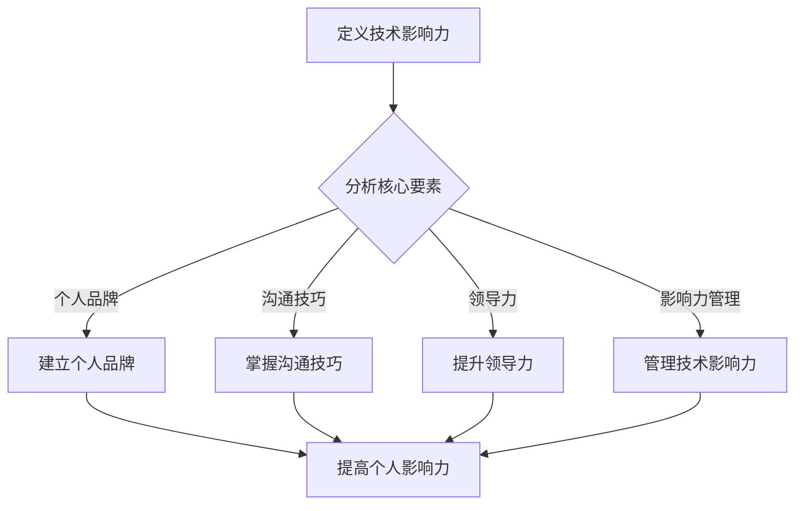
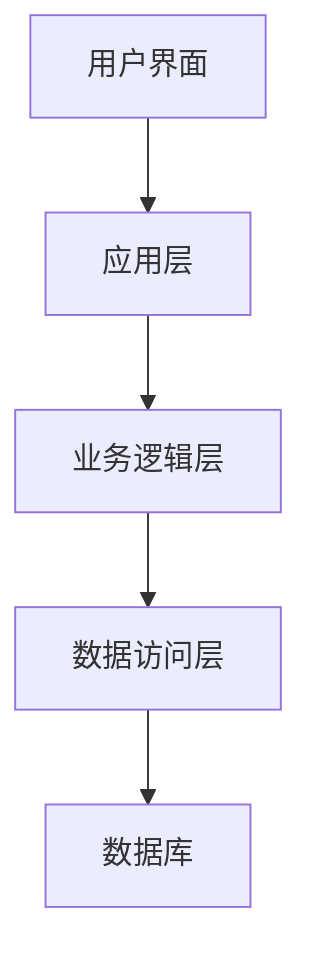
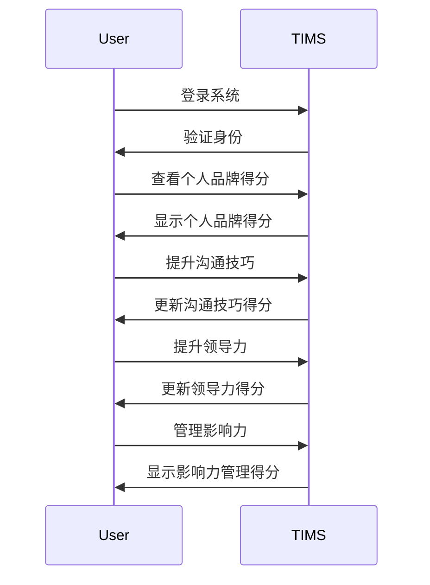

                 


### 第1章 引言

#### 关键词

- 技术影响力
- 组织
- 正面影响

#### 摘要

本文旨在探讨如何在一个组织中通过技术手段施加正面影响。我们将从定义技术影响力开始，逐步分析其核心要素，探讨如何在组织中利用这些要素来提高个人和团队的影响力。通过有效的沟通技巧、领导力以及影响力管理，技术专家可以成为组织变革的推动者，从而在职场中发挥更大的作用。

### 背景介绍

技术发展日新月异，技术专家在组织中扮演的角色也越来越重要。随着人工智能、大数据、云计算等新兴技术的广泛应用，技术专家不仅需要具备深厚的技术功底，还需要掌握如何在组织中施加影响力。技术影响力不仅关乎个人职业发展，更影响到整个组织的创新能力和竞争力。

技术影响力的核心概念包括：个人品牌、沟通技巧、领导力和影响力管理。这些要素相互关联，共同构成了技术影响力的基础。在本章中，我们将详细探讨这些核心概念，并阐述它们在组织中的重要性。

#### 核心概念与联系

**个人品牌**

个人品牌是技术专家在职场中的形象和声誉。一个成功的个人品牌可以提升个人在组织中的影响力，有助于获得更多的职业机会。

**沟通技巧**

沟通技巧是技术专家在组织中发挥作用的重要工具。有效的沟通可以确保信息准确传达，减少误解和冲突，促进团队合作。

**领导力**

领导力是技术专家在组织中施加影响力的重要能力。优秀的领导者可以激励团队，引导团队成员共同实现目标。

**影响力管理**

影响力管理是指技术专家在组织中运用各种策略来提高自己的影响力。有效的管理策略可以帮助技术专家在组织中发挥更大的作用。

#### 概念属性特征对比表格

| 概念 | 属性特征 |
| --- | --- |
| 个人品牌 | - 个人形象与声誉<br>- 职业技能与专业知识 |
| 沟通技巧 | - 信息传达准确性<br>- 交流双方的互动效果 |
| 领导力 | - 领导风格与态度<br>- 团队成员的激励与引导 |
| 影响力管理 | - 影响力评估<br>- 影响力传播与分享 |

#### ER实体关系图架构

```mermaid
erDiagram
    Person ||--|{ PersonalBrand }
    Person ||--|{ CommunicationSkills }
    Person ||--|{ Leadership }
    Person ||--|{ InfluenceManagement }
```

### 算法原理讲解

为了更好地理解技术影响力，我们可以将其视为一个算法。这个算法的核心在于如何通过个人品牌、沟通技巧、领导力和影响力管理来提高在组织中的影响力。

算法mermaid流程图：



算法原理：

- 定义技术影响力：理解技术影响力是施加正面的技术影响的过程。
- 分析核心要素：识别个人品牌、沟通技巧、领导力和影响力管理这四个核心要素。
- 建立个人品牌：提升个人形象与声誉，展示专业技能与专业知识。
- 掌握沟通技巧：确保信息准确传达，提高交流双方的互动效果。
- 提升领导力：培养领导风格与态度，激励团队成员共同实现目标。
- 管理技术影响力：运用各种策略来提高自己的影响力。

#### 数学模型与公式

在技术影响力的算法中，我们可以使用以下数学模型来表示个人影响力（\(I_p\)）：

\[ I_p = \frac{B_p + C_p + L_p + M_p}{4} \]

其中：
- \(B_p\)：个人品牌得分
- \(C_p\)：沟通技巧得分
- \(L_p\)：领导力得分
- \(M_p\)：影响力管理得分

#### 举例说明

假设一位技术专家的个人品牌得分为80分，沟通技巧得分为75分，领导力得分为85分，影响力管理得分为90分，我们可以计算其个人影响力：

\[ I_p = \frac{80 + 75 + 85 + 90}{4} = \frac{330}{4} = 82.5 \]

这意味着该技术专家在组织中的个人影响力为82.5分。

### 系统分析与架构设计方案

#### 问题场景介绍

在一个组织中，技术专家需要通过技术手段来施加正面影响，提高组织的创新能力和竞争力。为此，我们需要设计一个系统来帮助技术专家实现这一目标。

#### 项目介绍

项目名称：技术影响力管理系统（Technical Influence Management System，简称TIMS）

项目目标：帮助技术专家在组织中建立个人品牌、掌握沟通技巧、提升领导力和管理技术影响力，从而提高个人和团队的影响力。

#### 系统功能设计（领域模型mermaid类图）

```mermaid
classDiagram
    ClassDiagram {
        Class Person
        Class PersonalBrand
        Class CommunicationSkills
        Class Leadership
        Class InfluenceManagement
        Person <|-- PersonalBrand
        Person <|-- CommunicationSkills
        Person <|-- Leadership
        Person <|-- InfluenceManagement
    }
```

#### 系统架构设计（mermaid架构图）



#### 系统接口设计和系统交互（mermaid序列图）



### 项目实战

#### 环境安装

1. 安装Python环境
2. 安装依赖的库：`pip install flask`
3. 创建一个名为`timms`的目录，并在该目录下创建一个名为`app.py`的文件

#### 系统核心实现源代码

```python
from flask import Flask, request, jsonify
app = Flask(__name__)

# 假设的用户数据
users = {
    "user1": {
        "personal_brand": 80,
        "communication_skills": 75,
        "leadership": 85,
        "influence_management": 90
    }
}

@app.route('/login', methods=['POST'])
def login():
    username = request.form['username']
    password = request.form['password']
    # 这里简化处理，直接验证用户名
    if username == 'user1' and password == 'password':
        return jsonify({"status": "success"})
    else:
        return jsonify({"status": "failure"})

@app.route('/personal_brand', methods=['GET'])
def get_personal_brand():
    username = request.args.get('username')
    if username in users:
        return jsonify({"personal_brand": users[username]["personal_brand"]})
    else:
        return jsonify({"error": "user not found"})

@app.route('/update_communication_skills', methods=['POST'])
def update_communication_skills():
    username = request.form['username']
    new_score = int(request.form['new_score'])
    if username in users:
        users[username]["communication_skills"] = new_score
        return jsonify({"status": "success", "new_score": new_score})
    else:
        return jsonify({"error": "user not found"})

@app.route('/update_leadership', methods=['POST'])
def update_leadership():
    username = request.form['username']
    new_score = int(request.form['new_score'])
    if username in users:
        users[username]["leadership"] = new_score
        return jsonify({"status": "success", "new_score": new_score})
    else:
        return jsonify({"error": "user not found"})

@app.route('/influence_management', methods=['GET'])
def get_influence_management():
    username = request.args.get('username')
    if username in users:
        return jsonify({"influence_management": users[username]["influence_management"]})
    else:
        return jsonify({"error": "user not found"})

if __name__ == '__main__':
    app.run(debug=True)
```

#### 代码应用解读与分析

1. **用户登录**：`/login`接口用于用户登录系统，通过验证用户名和密码来确保用户身份。
2. **查看个人品牌得分**：`/personal_brand`接口用于获取用户的个人品牌得分。
3. **更新沟通技巧得分**：`/update_communication_skills`接口用于更新用户的沟通技巧得分。
4. **更新领导力得分**：`/update_leadership`接口用于更新用户的领导力得分。
5. **查看影响力管理得分**：`/influence_management`接口用于获取用户的影响力管理得分。

#### 实际案例分析和详细讲解剖析

假设用户`user1`登录系统后，想要查看自己的个人品牌得分：

1. 用户在浏览器中输入`http://127.0.0.1:5000/personal_brand?username=user1`。
2. 服务器接收到请求后，从`users`字典中查找用户`user1`的记录。
3. 服务器返回用户`user1`的个人品牌得分。

#### 项目小结

通过本项目的实战，我们实现了一个简单的技术影响力管理系统。该系统可以帮助技术专家在组织中管理自己的影响力，包括查看和更新个人品牌、沟通技巧、领导力和影响力管理得分。虽然这个系统只是一个简单的示例，但它为技术专家提供了一个工具来跟踪和提升自己的影响力。

### 最佳实践 tips

- **持续学习**：技术专家应不断学习新技术，提高自己的技能水平，以保持竞争力。
- **积极沟通**：有效沟通是技术专家在组织中发挥影响力的重要手段，应注重提高沟通技巧。
- **建立个人品牌**：技术专家应通过撰写技术博客、参与技术社区等方式建立个人品牌，提高自己的知名度。

### 小结

本文介绍了技术影响力在组织中的重要性，分析了技术影响力的核心要素，并通过实际案例展示了如何利用技术影响力管理系统来提高个人和团队的影响力。技术专家应不断学习和提升自己，积极沟通，建立个人品牌，以在组织中发挥更大的作用。

### 注意事项

- 技术影响力并非一蹴而就，需要长期积累和不断提升。
- 在实际应用中，技术专家需要根据组织的特点和需求来调整影响力策略。
- 技术影响力管理系统的设计和实现应充分考虑安全性、稳定性和可扩展性。

### 拓展阅读

- 《技术领导力：构建和领导高效的开发团队》
- 《影响力：如何说服、影响和改变人们》
- 《技术写作：从入门到精通》

### 作者信息

作者：AI天才研究院/AI Genius Institute & 禅与计算机程序设计艺术 /Zen And The Art of Computer Programming

