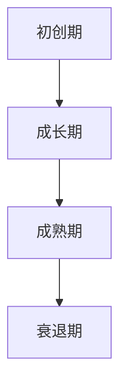
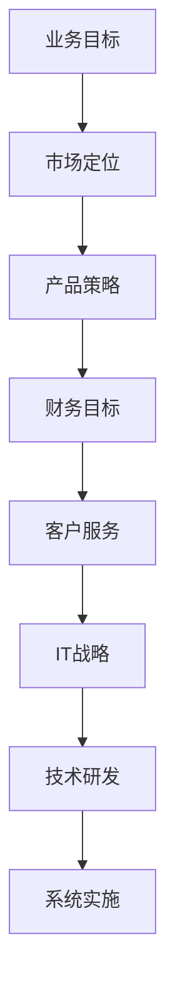
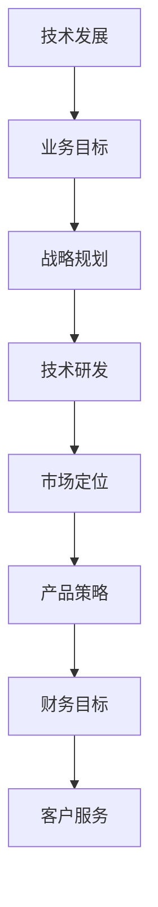

                 

### 第1章 引言：技术战略的背景与意义

#### 1.1 技术发展概述

在当今这个数字化时代，技术发展已经成为推动社会进步的重要引擎。从互联网、移动通信到人工智能、区块链，每一次技术变革都极大地改变了我们的生活和工作方式。技术的快速发展不仅带来了新的机遇，也带来了新的挑战。如何把握技术发展的脉络，将其有效转化为业务优势，成为企业和组织亟需解决的问题。

技术发展涉及多个层面，包括基础研究、应用研究、技术开发和产品推广。基础研究是技术发展的源头，它探索新的科学原理和技术可能性；应用研究则将基础研究成果转化为具体的应用方案；技术开发是实现应用方案的技术手段，包括产品设计、系统开发和测试等；产品推广则是将技术成果推向市场，实现商业价值。

技术发展的驱动力多种多样，包括市场需求、政策支持、企业创新等。市场需求是技术发展的直接动力，只有满足市场需求，技术成果才能得到广泛应用。政策支持则为技术发展提供了良好的环境，包括资金投入、人才培养、知识产权保护等方面。企业创新是技术发展的内在动力，企业通过持续创新，不断提升技术水平，实现竞争优势。

#### 1.2 业务目标的重要性

业务目标是一个企业或组织发展的方向和愿景，它是指导企业或组织决策和行动的核心依据。业务目标通常包括市场定位、产品策略、财务目标、客户服务等方面。明确和合理的业务目标可以帮助企业或组织聚焦资源，优化资源配置，提高运营效率，从而实现可持续发展。

业务目标的重要性体现在以下几个方面：

1. **指引企业发展方向**：业务目标为企业或组织提供了明确的发展方向，使企业在纷繁复杂的市场环境中保持清晰的战略定位。

2. **优化资源配置**：业务目标可以帮助企业或组织合理配置资源，确保资源的有效利用，避免资源浪费。

3. **提高运营效率**：通过明确业务目标，企业或组织可以优化运营流程，提高工作效率，缩短产品上市时间。

4. **提升市场竞争力**：明确的业务目标可以帮助企业或组织在市场竞争中占据有利位置，提高市场占有率。

#### 1.3 技术战略的定义与作用

技术战略是指企业或组织在技术发展方面所采取的长期规划和发展策略。它不仅涉及技术本身，还包括技术管理、技术投资、技术合作等方面。技术战略的核心目标是实现技术发展与企业或组织业务目标的有机结合，以技术优势支撑业务发展。

技术战略的作用主要体现在以下几个方面：

1. **提升企业竞争力**：技术战略可以帮助企业或组织在技术领域建立竞争优势，提高市场竞争力。

2. **推动业务创新**：技术战略可以引导企业或组织进行技术研究和开发，推动业务模式的创新和变革。

3. **优化资源配置**：技术战略可以帮助企业或组织合理配置技术资源，确保技术投资的效率和效果。

4. **降低技术风险**：技术战略可以通过前瞻性的规划和布局，降低技术发展中的风险，确保技术项目的成功实施。

#### 1.4 技术战略与业务目标的关联

技术战略与业务目标之间的关系是相互影响、相互促进的。一方面，技术战略需要紧密结合业务目标，确保技术发展能够服务于业务需求；另一方面，业务目标的实现需要依靠技术战略的支撑。

1. **业务需求驱动技术发展**：业务目标为技术发展提供了明确的需求和方向，技术战略需要根据业务需求进行规划和调整。

2. **技术发展支撑业务目标**：技术战略的实施可以推动技术进步，为业务目标提供技术支持和保障。

3. **协同发展**：技术战略和业务目标之间需要形成良性互动，通过不断的调整和优化，实现协同发展。

总之，技术战略与业务目标的有机结合，是企业在数字化时代实现可持续发展的重要保障。通过科学的技术战略规划和实施，企业或组织可以更好地把握技术发展的机遇，实现业务目标，提升市场竞争力。

### 1.5 技术战略制定的关键步骤

制定技术战略是一个系统性的过程，涉及多个环节。以下是技术战略制定的关键步骤：

1. **业务需求分析**：首先，需要深入了解企业的业务需求和目标，明确技术发展所需解决的问题和方向。

2. **市场调研**：通过对市场环境的调研，了解行业发展趋势、竞争对手状况、客户需求等，为技术战略的制定提供数据支持。

3. **技术评估**：对现有技术和潜在技术进行评估，分析其技术成熟度、适用性、成本效益等，为技术决策提供依据。

4. **战略规划**：基于业务需求、市场调研和技术评估，制定长期和短期技术发展规划，明确技术目标和实施路径。

5. **资源配置**：根据技术战略规划，合理配置技术资源，包括资金、人才、设备等，确保技术战略的顺利实施。

6. **风险管理**：识别技术发展过程中可能面临的风险，制定相应的风险应对策略，降低技术风险。

7. **监控与评估**：建立技术战略的监控和评估机制，定期对技术战略的执行情况进行检查和评估，确保技术战略的有效性。

### 1.6 技术战略实施的挑战与应对策略

在技术战略的实施过程中，企业或组织可能会面临以下挑战：

1. **资源限制**：技术战略的实施需要大量的资源投入，包括资金、人才和时间等。企业需要合理规划资源，确保资源的充分利用。

2. **技术风险**：技术战略的实施过程中，可能会遇到技术上的不确定性，如技术选型风险、项目实施风险等。企业需要建立完善的技术评估和风险管理机制。

3. **市场变化**：市场环境的变化可能会影响技术战略的实施效果。企业需要密切关注市场动态，及时调整技术战略。

4. **组织变革**：技术战略的实施往往需要企业内部的组织结构、流程和文化等方面的变革。企业需要推动组织变革，确保技术战略的有效执行。

应对这些挑战，企业可以采取以下策略：

1. **建立高效的资源管理机制**：通过优化资源配置、提高资源利用效率，确保技术战略的顺利实施。

2. **加强技术评估与风险管理**：对技术项目进行全面的评估，制定详细的风险管理计划，确保技术项目的成功实施。

3. **保持市场敏感性**：密切关注市场动态，及时调整技术战略，以适应市场变化。

4. **推动组织变革**：通过培训、文化建设等方式，推动企业内部的变革，提高组织对技术战略的执行能力。

通过以上步骤和策略，企业或组织可以有效地制定和实施技术战略，实现技术发展与企业业务目标的有机结合，提升市场竞争力。

---

### 第2章 核心概念解析

在制定技术战略的过程中，理解并正确运用相关核心概念至关重要。本章将详细介绍技术发展、业务目标、战略规划等关键概念，并通过对比表格和ER图来展示它们之间的关系。

#### 2.1 技术发展

技术发展是指从科学原理到实际应用的全过程，包括基础研究、应用研究、技术开发和产品推广等多个阶段。技术发展的核心目标是创造新的知识和技术，推动社会进步。

**技术发展的阶段：**

1. **基础研究**：探索新的科学原理和知识，为技术发展提供理论基础。
2. **应用研究**：将基础研究成果转化为具体的解决方案和应用场景。
3. **技术开发**：通过设计、开发和测试，将应用研究成果转化为实际产品或服务。
4. **产品推广**：将技术开发成果推向市场，实现商业价值。

**技术评估与选择：**

技术评估是对技术的可行性、适用性、成本效益等进行评估的过程。技术选择则是在多个技术方案中选出最适合实现业务目标的技术。

1. **可行性评估**：分析技术实现的可能性，包括技术难度、资源需求等。
2. **适用性评估**：评估技术是否满足业务需求，包括功能、性能、兼容性等。
3. **成本效益评估**：比较不同技术的成本与预期效益，选择最具成本效益的技术。

**技术成熟度曲线：**

技术成熟度曲线是一种描述技术成熟度的图表，通常包括技术初创期、成长期、成熟期和衰退期等阶段。

- **初创期**：技术概念和原型阶段，风险较高，但潜力巨大。
- **成长期**：技术逐步成熟，应用场景扩大，市场接受度提高。
- **成熟期**：技术广泛应用，市场稳定，竞争激烈。
- **衰退期**：技术逐渐被淘汰，新的技术出现并取代其地位。

**技术评估与选择的对比表格：**

| 评估要素 | 技术初创期 | 技术成长期 | 技术成熟期 | 技术衰退期 |
| :------: | :--------: | :--------: | :--------: | :--------: |
| 可行性 | 较低 | 中等 | 较高 | 低 |
| 适用性 | 较低 | 中等 | 较高 | 低 |
| 成本效益 | 较低 | 中等 | 较高 | 低 |
| 风险 | 较高 | 中等 | 较低 | 高 |

**技术成熟度曲线与ER图：**

#### 2.2 业务目标

业务目标是指企业或组织在一段时间内期望达到的具体目标和结果。业务目标通常包括市场定位、产品策略、财务目标、客户服务等方面。

**业务目标设定方法：**

1. **SMART原则**：具体（Specific）、可衡量（Measurable）、可达成（Achievable）、相关（Relevant）、时间限定（Time-bound）。
2. **业务目标分解**：将总目标分解为具体的子目标和实施计划。

**业务目标与IT战略的匹配：**

业务目标与IT战略的匹配是确保技术发展能够支持业务目标实现的关键。匹配原则包括：

1. **一致性**：技术战略应与业务目标保持一致，确保技术发展符合业务需求。
2. **灵活性**：技术战略应具备一定的灵活性，能够适应业务目标的变化。
3. **优先级**：在资源有限的情况下，应优先支持最重要的业务目标。

**业务目标实现的关键因素：**

1. **资源**：包括资金、人才、设备等。
2. **管理**：有效的项目管理、资源配置和风险管理。
3. **技术**：适合业务需求的技术方案和解决方案。

**业务目标与IT战略的ER图：**

#### 2.3 技术战略规划

技术战略规划是指企业或组织为实现长期技术发展目标所制定的行动计划和策略。技术战略规划的核心目标是确保技术发展与企业或组织业务目标的有机结合。

**技术战略规划流程：**

1. **需求分析**：明确业务需求和技术需求，为技术战略规划提供基础。
2. **市场调研**：了解行业发展趋势、竞争对手情况等，为技术战略规划提供数据支持。
3. **技术评估**：评估现有技术和潜在技术，选择最适合实现业务目标的技术。
4. **战略制定**：制定长期和短期技术发展规划，明确技术目标和实施路径。
5. **资源配置**：根据技术战略规划，合理配置技术资源，包括资金、人才、设备等。
6. **风险管理**：识别技术发展过程中可能面临的风险，制定相应的风险应对策略。

**技术战略规划工具与方法：**

1. **SWOT分析**：通过分析企业的优势（Strengths）、劣势（Weaknesses）、机会（Opportunities）和威胁（Threats），制定有针对性的技术战略。
2. **技术路线图**：展示技术发展的路线和关键节点，为技术战略规划提供指导。
3. **项目管理**：通过项目管理方法和工具，确保技术项目的顺利实施。

**技术战略规划案例：**

某互联网公司计划在未来五年内实现全球化布局，其技术战略规划如下：

1. **需求分析**：根据全球化需求，评估现有技术能力，确定需要提升的技术领域。
2. **市场调研**：了解全球市场趋势和竞争对手情况，为技术战略规划提供数据支持。
3. **技术评估**：评估现有技术，选择云计算、大数据、人工智能等关键技术进行提升。
4. **战略制定**：制定长期和短期技术发展规划，明确技术目标和实施路径。
5. **资源配置**：加大资金投入，引进高端人才，购置先进设备。
6. **风险管理**：制定详细的风险管理计划，确保技术项目的成功实施。

**技术战略规划案例分析：**

通过上述案例，可以看出技术战略规划是一个系统性的过程，涉及多个环节。通过科学的技术战略规划，企业或组织可以确保技术发展与企业业务目标的有机结合，提升市场竞争力。

#### 2.4 对比表格与ER图总结

通过对技术发展、业务目标、战略规划等核心概念的详细解析，我们可以得出以下对比表格和ER图：

**技术发展、业务目标、战略规划对比表格：**

| 核心概念 | 描述 | 目标 | 实施方法 |
| :------: | :--- | :-- | :------- |
| 技术发展 | 从科学原理到实际应用的过程 | 推动社会进步 | 基础研究、应用研究、技术开发、产品推广 |
| 业务目标 | 企业或组织期望达到的具体目标和结果 | 实现可持续发展 | 市场定位、产品策略、财务目标、客户服务 |
| 战略规划 | 实现技术发展的长期和短期行动计划 | 提高市场竞争力 | 需求分析、市场调研、技术评估、战略制定、资源配置、风险管理 |

**技术发展、业务目标、战略规划的ER图：**

通过对比表格和ER图，我们可以清晰地看到技术发展、业务目标和战略规划之间的关联和作用，为后续章节的深入分析提供基础。

---

### 第3章 技术战略制定关键要素

技术战略的制定是一个复杂而系统性的过程，需要考虑多个关键要素，以确保技术发展能够有效支持业务目标的实现。本章将详细介绍市场分析、技术趋势、组织能力等方面，并通过具体的分析方法和工具，帮助读者更好地理解这些要素。

#### 3.1 市场分析：了解竞争环境

市场分析是技术战略制定的重要环节，通过对市场环境、竞争对手和客户需求进行深入分析，可以为企业或组织提供宝贵的信息和决策依据。

**市场趋势分析：**

市场趋势分析是指对市场发展的方向和趋势进行预测和分析。通过市场趋势分析，企业或组织可以及时掌握行业动态，把握市场机遇。

1. **技术发展趋势**：分析新兴技术的应用和发展趋势，如人工智能、大数据、物联网等。
2. **市场增长预测**：预测市场规模和增长率，确定市场潜力。
3. **竞争态势**：分析竞争对手的市场份额、产品定位、营销策略等。

**竞争对手分析：**

竞争对手分析是了解市场环境中竞争格局的重要手段。通过对竞争对手的全面分析，企业或组织可以识别自身的优势和劣势，制定相应的竞争策略。

1. **市场份额**：分析主要竞争对手的市场份额，了解其在市场中的地位。
2. **产品定位**：分析竞争对手的产品特点、功能、定价策略等。
3. **营销策略**：分析竞争对手的营销手段、广告投放、客户服务策略等。

**客户需求分析：**

客户需求分析是技术战略制定的基础。通过深入了解客户需求，企业或组织可以提供更加符合市场需求的产品和服务。

1. **需求特征**：分析客户需求的特征，如需求类型、优先级、变化趋势等。
2. **需求满足程度**：评估现有产品和服务对客户需求的满足程度。
3. **需求变化**：预测客户需求的变化趋势，为技术发展提供方向。

**市场分析工具与方法：**

1. **SWOT分析**：通过分析企业的优势（Strengths）、劣势（Weaknesses）、机会（Opportunities）和威胁（Threats），制定有针对性的市场策略。
2. **PEST分析**：通过分析政治（Political）、经济（Economic）、社会（Sociological）和技术（Technological）等因素，了解市场环境的变化。
3. **五力模型**：分析行业竞争中的五大力量，包括供应商、买家、潜在竞争者、替代品和行业内的竞争者。

**市场分析案例：**

以某互联网公司为例，该公司在制定技术战略时，进行了以下市场分析：

1. **市场趋势分析**：通过研究新兴技术，如人工智能和物联网，发现这些技术具有广泛的应用前景，为公司提供了新的业务机会。
2. **竞争对手分析**：分析主要竞争对手的市场份额和产品特点，发现竞争对手在技术能力和产品创新方面具有一定的优势，但存在客户服务不足的问题。
3. **客户需求分析**：通过调查和访谈，了解到客户对高性价比、快速响应和服务质量有较高需求。

通过市场分析，该公司确定了以下技术战略：

1. **技术发展重点**：加大人工智能和物联网技术的研发投入，提升产品竞争力。
2. **产品策略**：优化产品功能，提高客户满意度。
3. **市场定位**：以高性价比和服务质量为核心，争夺市场份额。

#### 3.2 技术趋势：把握发展脉络

技术趋势分析是技术战略制定的关键环节，通过对技术发展趋势的把握，企业或组织可以提前布局，抢占市场先机。

**市场预测与分析：**

市场预测与分析是指通过收集和分析历史数据、行业报告和专家意见，对未来市场的发展趋势进行预测。通过市场预测与分析，企业或组织可以制定有针对性的技术战略。

1. **历史数据分析**：通过分析过去的技术发展历程和市场需求变化，预测未来技术趋势。
2. **行业报告**：查阅相关行业报告和研究成果，了解技术发展的最新动态。
3. **专家意见**：邀请行业专家进行咨询和讨论，获取专业的技术预测和建议。

**技术路线图制定：**

技术路线图是一种描述技术发展路径和关键节点的工具，通过技术路线图，企业或组织可以清晰地看到技术发展的方向和优先级。

1. **技术目标**：明确技术发展的中长期目标，如技术创新、产品升级、市场拓展等。
2. **技术路径**：规划实现技术目标的步骤和关键节点，如技术研发、产品开发、市场推广等。
3. **时间规划**：设定每个技术路径的时间规划，确保技术战略的顺利实施。

**技术风险评估：**

技术风险评估是指对技术发展过程中可能面临的风险进行识别和评估。通过技术风险评估，企业或组织可以制定相应的风险应对策略，降低技术风险。

1. **风险识别**：识别技术发展过程中可能面临的风险，如技术失效、市场变化、资源限制等。
2. **风险评估**：评估风险的影响程度和发生概率，确定风险等级。
3. **风险应对**：制定风险应对策略，包括风险规避、风险转移、风险缓解等。

**技术趋势分析方法与工具：**

1. **PEST分析**：通过分析政治、经济、社会和技术因素，了解技术发展的宏观环境。
2. **五力模型**：分析技术发展的行业竞争格局，了解技术发展的市场驱动因素。
3. **趋势预测模型**：使用统计模型和机器学习算法，对技术发展趋势进行定量预测。

**技术趋势分析案例：**

以人工智能技术为例，某互联网公司在制定技术战略时，进行了以下技术趋势分析：

1. **市场预测与分析**：通过分析人工智能技术的应用领域和市场规模，预测人工智能在未来几年将保持高速增长。
2. **技术路线图制定**：明确人工智能技术的中长期目标，如智能助手、自动驾驶、医疗诊断等，并规划实现这些目标的步骤和关键节点。
3. **技术风险评估**：识别人工智能技术可能面临的风险，如数据隐私、技术滥用等，并制定相应的风险应对策略。

通过技术趋势分析，该公司确定了以下技术战略：

1. **技术发展重点**：加大对人工智能技术的研发投入，推动技术创新和产品升级。
2. **市场定位**：以人工智能技术为核心，打造智能化的产品和服务体系。
3. **风险管理**：加强数据隐私保护，确保人工智能技术的安全性和可靠性。

#### 3.3 组织能力：技术实施的保障

组织能力是指企业或组织在技术发展过程中所具备的技能、资源和组织结构等方面的综合能力。强大的组织能力是技术战略实施的重要保障。

**人才队伍建设：**

人才是企业或组织的核心资源，人才队伍的建设是组织能力提升的关键。

1. **人才引进**：通过招聘、猎头等方式，引进具备专业技能和经验的人才。
2. **人才培养**：提供内部培训和外部交流机会，提升员工的专业技能和综合素质。
3. **人才激励**：建立科学的人才激励机制，激发员工的积极性和创造力。

**技术管理体系：**

技术管理体系是确保技术发展有序进行的重要保障。

1. **研发管理体系**：建立完善的研发流程和规范，确保技术研发的高效性和规范性。
2. **质量管理体系**：建立严格的质量管理机制，确保产品和服务的高质量。
3. **信息安全体系**：建立完善的信息安全管理制度，确保技术系统的安全性和稳定性。

**技术创新机制：**

技术创新机制是推动技术进步和业务发展的重要动力。

1. **创新文化**：营造创新文化，鼓励员工提出创新想法和建议。
2. **创新项目**：设立专项创新项目，鼓励员工进行技术创新和产品开发。
3. **创新孵化**：建立创新孵化平台，为创新项目提供资源支持和孵化环境。

**组织能力提升方法与工具：**

1. **能力评估模型**：通过能力评估模型，了解组织在各个方面的能力水平，制定相应的提升计划。
2. **人才培养计划**：制定长期和短期的人才培养计划，确保人才队伍的不断壮大。
3. **技术管理体系优化**：定期对技术管理体系进行评估和优化，提高技术管理的效率和效果。

**组织能力提升案例：**

以某科技企业为例，该公司在提升组织能力方面采取了以下措施：

1. **人才队伍建设**：通过招聘和内部培训，引进和培养了一批高素质的技术人才，形成了强大的技术团队。
2. **技术管理体系**：建立了完善的研发流程和质量管理体系，确保技术研发的高效性和高质量。
3. **技术创新机制**：设立了创新基金和创新孵化平台，鼓励员工进行技术创新和产品开发。

通过以上措施，该公司的组织能力得到了显著提升，技术发展速度和产品质量均得到了明显改善。

#### 3.4 技术战略制定过程总结

通过本章对市场分析、技术趋势、组织能力等关键要素的详细解析，我们可以得出以下结论：

1. **市场分析**：了解市场环境、竞争对手和客户需求，为技术战略制定提供基础。
2. **技术趋势**：把握技术发展趋势，制定有针对性的技术战略。
3. **组织能力**：提升组织能力，为技术战略的实施提供保障。

技术战略的制定是一个系统性的过程，需要综合考虑多个关键要素。通过科学的市场分析、技术趋势分析和组织能力建设，企业或组织可以制定出有效且可行的技术战略，实现技术发展与企业业务目标的有机结合。

---

### 第4章 技术战略实施与监控

技术战略的实施是确保企业或组织技术发展目标实现的关键环节。有效的实施和监控机制不仅能够保障技术项目的顺利推进，还能够及时发现和解决潜在问题，确保技术战略的有效性和持续性。本章将详细介绍技术战略实施和监控的各个步骤，包括项目管理、风险管理、持续改进等。

#### 4.1 项目管理：确保项目成功

项目管理是技术战略实施的核心环节，通过科学的项目管理方法和工具，可以确保技术项目的成功实施。

**项目启动与规划：**

项目启动是技术战略实施的第一步，主要包括项目立项、目标确定和资源分配。

1. **项目立项**：明确项目目标、范围、预算和时间计划。
2. **目标确定**：制定清晰的项目目标和里程碑，确保项目有明确的阶段性成果。
3. **资源分配**：根据项目需求，合理配置人力资源、资金和设备等资源。

**项目执行与监控：**

项目执行是技术战略实施的关键阶段，通过有效的执行和监控，可以确保项目按计划进行。

1. **任务分解**：将项目目标分解为具体的任务和活动，明确每个任务的责任人和完成时间。
2. **进度监控**：定期检查项目进度，及时发现和解决问题。
3. **质量保证**：建立质量管理体系，确保项目成果符合预定质量标准。

**项目收尾与评估：**

项目收尾是项目管理的最后一步，主要包括项目验收、总结和评估。

1. **项目验收**：对项目成果进行验收，确保满足项目需求和标准。
2. **总结与评估**：总结项目实施过程中的经验教训，评估项目的效果和影响。

**项目管理工具与方法：**

1. **项目管理软件**：如Jira、Trello等，用于任务分配、进度监控和协作。
2. **甘特图**：用于可视化项目进度和时间计划。
3. **风险管理矩阵**：用于评估项目风险的影响程度和发生概率。

**项目管理案例：**

以某科技公司的一项技术升级项目为例，该项目包括系统重构、功能扩展和技术优化。项目启动阶段，团队明确了项目目标、范围和时间计划，并进行了资源分配。在项目执行阶段，团队通过Jira进行任务管理和进度监控，确保项目按计划推进。在项目收尾阶段，团队对项目成果进行了验收，并进行了总结和评估，发现了一些改进空间。

#### 4.2 风险管理：预见与应对

风险管理是技术战略实施过程中不可或缺的一部分，通过识别、评估和应对风险，可以降低项目失败的可能性，确保技术战略的顺利实施。

**风险识别：**

风险识别是风险管理的第一步，通过系统的方法，识别可能影响项目成功的潜在风险。

1. **头脑风暴**：通过团队讨论，收集可能的风险。
2. **历史数据**：分析以往项目中的风险记录，预测潜在风险。
3. **专家咨询**：邀请行业专家进行风险分析，获取专业的意见。

**风险评估：**

风险评估是对风险的影响程度和发生概率进行评估的过程，通过风险评估，可以确定风险的优先级。

1. **影响评估**：评估风险对项目目标、进度、质量等方面的影响程度。
2. **概率评估**：评估风险发生的可能性。
3. **风险矩阵**：使用风险矩阵对风险进行分类和优先级排序。

**风险应对策略：**

风险应对策略是针对识别和评估出的风险，制定相应的应对措施。

1. **风险规避**：通过调整项目计划，避免风险的发生。
2. **风险转移**：通过保险或其他合同条款，将风险转移给第三方。
3. **风险缓解**：通过增加预算、时间或资源，降低风险的影响程度。

**风险管理方法与工具：**

1. **风险登记册**：记录和管理所有识别和评估的风险。
2. **风险监控**：定期对风险进行跟踪和更新，确保风险的及时应对。
3. **决策树**：用于分析风险和应对策略的决策过程。

**风险管理案例：**

以某公司的云计算迁移项目为例，项目团队在启动阶段识别出以下风险：

- **技术风险**：云计算平台的不稳定性和兼容性问题。
- **资源风险**：项目资源分配不足，可能导致项目延期。
- **市场风险**：市场需求变化，可能导致项目需求调整。

针对这些风险，团队制定了以下应对策略：

- **技术风险**：增加测试阶段，确保平台稳定性和兼容性。
- **资源风险**：提前进行资源评估，确保项目资源充足。
- **市场风险**：与客户保持紧密沟通，及时调整项目需求。

通过有效的风险管理，项目团队成功应对了潜在风险，确保了项目的顺利实施。

#### 4.3 持续改进：技术战略的生命力

持续改进是技术战略实施过程中的重要环节，通过不断的改进和创新，可以提升技术产品的竞争力，确保技术战略的持续有效性。

**持续改进的重要性：**

持续改进是一种管理理念，它强调通过不断改进和创新，提升产品和服务的质量，提高客户满意度。

1. **提升竞争力**：通过持续改进，技术产品可以保持领先地位，提升市场竞争力。
2. **提高效率**：通过优化流程和工具，提高项目实施效率和效果。
3. **增强客户满意度**：通过不断改进，提供更加优质的产品和服务，增强客户满意度。

**改进方法论：**

1. **PDCA循环**：PDCA（Plan-Do-Check-Act）是一种常见的持续改进方法，通过计划、执行、检查和行动，不断优化流程和产品。
2. **六西格玛**：六西格玛是一种质量改进方法，通过统计分析和流程优化，减少过程变异，提高产品质量。
3. **精益管理**：精益管理是一种以客户需求为中心的管理理念，通过消除浪费、优化流程，提高生产效率和客户满意度。

**改进实践案例：**

以某科技公司为例，该公司通过以下实践，不断改进技术产品和项目管理：

1. **流程优化**：通过引入精益管理理念，优化项目管理流程，减少流程浪费，提高工作效率。
2. **质量提升**：采用六西格玛方法，对产品进行质量分析和改进，提高产品合格率。
3. **客户反馈**：建立客户反馈机制，收集客户意见，不断改进产品功能和用户体验。

通过持续改进，该公司的技术产品和项目管理水平得到了显著提升，客户满意度持续提高。

#### 4.4 技术战略实施的监控与评估

技术战略实施的监控与评估是确保技术战略有效性的关键环节。通过定期的监控和评估，可以及时发现和解决问题，确保技术战略的顺利实施。

**监控与评估指标：**

1. **项目进度**：监控项目进度是否按计划进行，及时发现和解决问题。
2. **资源利用**：评估资源的利用效率，确保资源得到合理配置。
3. **风险状况**：监控风险状况，及时识别和应对潜在风险。
4. **质量指标**：评估项目成果的质量，确保符合预定标准。
5. **成本控制**：监控项目成本，确保项目在预算范围内完成。

**监控与评估方法：**

1. **定期汇报**：通过定期汇报，了解项目进展情况和存在的问题，及时进行调整。
2. **现场检查**：定期进行现场检查，核实项目实施情况，确保项目按计划推进。
3. **数据分析**：通过数据分析和报告，评估项目实施的效果，识别改进点。
4. **客户反馈**：收集客户反馈，了解客户对项目成果的满意程度，为后续改进提供依据。

**监控与评估案例：**

以某科技公司的技术研发项目为例，公司通过以下方式进行监控和评估：

1. **定期汇报**：每月召开项目进展汇报会议，项目经理汇报项目进展情况，团队讨论存在的问题和解决方案。
2. **现场检查**：每季度进行一次现场检查，核实项目实施情况，评估项目进度和质量。
3. **数据分析**：通过数据分析，评估项目成本、进度和资源利用情况，发现改进点。
4. **客户反馈**：收集客户对产品的反馈，及时调整产品功能和用户体验。

通过有效的监控和评估，该公司成功确保了技术研发项目的顺利进行，提高了项目的成功率。

#### 4.5 技术战略实施的总结与反思

技术战略实施是一个复杂而系统的过程，需要各个环节的协同配合。通过总结和反思，可以发现成功经验和不足之处，为后续的技术战略实施提供借鉴。

**成功经验：**

1. **有效的项目管理**：通过科学的项目管理方法和工具，确保项目按计划推进，提高项目成功率。
2. **风险管理**：通过有效的风险识别和应对，降低项目失败的可能性，确保项目顺利实施。
3. **持续改进**：通过持续改进，不断提升产品和项目管理水平，提高客户满意度。

**不足之处：**

1. **资源分配不均**：在某些项目中，资源分配不均，导致项目进度和质量受到影响。
2. **风险应对不力**：在某些情况下，对风险的应对措施不够有效，导致项目延期或失败。
3. **客户沟通不畅**：在项目实施过程中，与客户的沟通不够充分，导致需求变化和项目延期。

**改进建议：**

1. **优化资源分配**：通过科学的资源评估和分配，确保项目资源得到合理利用。
2. **加强风险管理**：建立完善的风险管理机制，提高风险识别和应对能力。
3. **提升客户沟通**：加强与客户的沟通，确保需求明确，减少项目延期和失败的可能性。

通过总结和反思，企业或组织可以不断提高技术战略实施的效率和效果，确保技术发展与企业业务目标的有机结合。

---

### 第5章 案例分析：技术战略在行动

为了更好地理解技术战略的实际应用，我们通过一个真实的企业案例来展示技术战略的制定、实施和成果。

#### 5.1 案例背景

某大型电商平台在快速发展的过程中，意识到技术战略对于其长期竞争力的关键作用。随着用户规模和交易量的不断增长，平台的系统性能、扩展性和安全性成为亟待解决的问题。为了应对这些挑战，该电商平台决定制定并实施一套全面的技术战略。

#### 5.2 技术战略制定过程

1. **业务需求分析**：
   - **用户需求**：用户对平台的响应速度、系统稳定性和安全性有较高要求。
   - **业务目标**：提升系统性能、扩展性和安全性，优化用户体验，确保业务连续性。

2. **市场调研**：
   - **行业趋势**：云计算、大数据和人工智能技术成为行业发展的重要方向。
   - **竞争对手**：分析竞争对手的技术应用和策略，识别自身在技术领域的优势和不足。

3. **技术评估**：
   - **现有技术**：评估现有系统的性能和架构，识别技术瓶颈。
   - **潜在技术**：研究新兴技术，如微服务架构、容器化、自动化运维等，评估其适用性和成本效益。

4. **战略制定**：
   - **长期目标**：构建高效、可扩展、安全的技术基础设施，支持平台未来的发展。
   - **短期目标**：优化现有系统，提高系统性能和稳定性，确保关键功能的正常运行。

5. **资源配置**：
   - **资金**：为技术战略的实施提供充足的资金支持。
   - **人才**：引进和培养技术人才，提升技术团队的能力。
   - **设备**：升级服务器和网络设备，确保技术基础设施的完善。

6. **风险管理**：
   - **识别风险**：分析技术战略实施过程中可能面临的风险，如技术选型错误、项目延期等。
   - **风险应对**：制定相应的风险应对措施，如技术备份、应急预案等。

#### 5.3 技术战略实施与成果

1. **项目启动与规划**：
   - **项目立项**：明确项目目标、范围、预算和时间计划。
   - **资源分配**：确定项目经理、开发团队和测试团队，分配任务和责任。

2. **系统架构设计**：
   - **功能设计**：重新设计系统功能，确保符合业务需求。
   - **架构设计**：采用微服务架构，提高系统的可扩展性和灵活性。

3. **技术实现**：
   - **容器化**：使用Docker和Kubernetes进行容器化部署，提高系统的自动化程度和运维效率。
   - **自动化运维**：引入自动化运维工具，实现自动化部署、监控和故障恢复。

4. **性能优化**：
   - **缓存策略**：优化缓存机制，提高系统响应速度。
   - **数据库优化**：优化数据库查询和存储策略，提高查询效率。

5. **安全性提升**：
   - **加密技术**：采用SSL/TLS加密技术，保护用户数据安全。
   - **防火墙和入侵检测**：部署防火墙和入侵检测系统，防止网络攻击。

6. **测试与上线**：
   - **功能测试**：进行全面的功能测试，确保系统功能的完整性和稳定性。
   - **性能测试**：进行性能测试，验证系统在高并发下的性能表现。
   - **上线部署**：逐步上线新系统，确保业务的连续性。

#### 5.4 案例启示与总结

通过这个案例，我们可以得出以下启示和总结：

1. **技术战略的制定**：技术战略的制定需要紧密结合业务需求和市场需求，确保技术发展能够服务于业务目标。

2. **项目实施的关键**：项目实施的成功依赖于科学的项目管理、合理的资源配置和有效的风险管理。

3. **技术选型的重视**：在技术选型过程中，要综合考虑技术的适用性、成本效益和未来发展趋势，确保技术的可持续性和可扩展性。

4. **持续优化与改进**：技术战略的实施是一个持续优化的过程，需要不断地进行性能优化、安全提升和功能扩展，以适应市场变化和业务需求。

通过这个案例，企业可以了解到如何通过科学的技术战略规划和实施，提升系统性能、扩展性和安全性，从而在激烈的市场竞争中保持优势。

---

### 第6章 最佳实践与未来展望

在技术战略的制定和实施过程中，积累最佳实践和不断更新知识库至关重要。本章将总结一些最佳实践，并提供未来技术战略发展的一些展望。

#### 6.1 技术战略最佳实践

1. **明确业务目标**：技术战略的制定应始终围绕业务目标展开，确保技术发展能够支持业务需求。

2. **数据驱动**：利用数据分析技术，深入分析市场趋势、客户需求和技术风险，为技术决策提供数据支持。

3. **敏捷开发**：采用敏捷开发方法，快速响应业务需求变化，提高项目的灵活性和适应性。

4. **持续集成与持续部署**：通过持续集成和持续部署（CI/CD），自动化测试和部署流程，提高开发效率和系统稳定性。

5. **风险管理**：建立全面的风险管理体系，识别、评估和应对技术实施过程中可能面临的风险。

6. **人才发展**：重视技术人才的培养和引进，提升团队的技术能力和创新能力。

7. **开放合作**：与其他企业、学术机构和行业组织建立合作，共享资源、知识和经验，共同推动技术进步。

#### 6.2 小结

技术战略的制定和实施是一个复杂而系统的过程，涉及多个环节和要素。通过明确业务目标、数据驱动、敏捷开发、风险管理、人才发展和开放合作，企业或组织可以确保技术发展与企业业务目标的有机结合，提升市场竞争力。

#### 6.3 注意事项

1. **持续监测和评估**：定期对技术战略的执行情况进行监测和评估，确保其有效性。

2. **灵活调整**：根据市场变化和业务需求，及时调整技术战略，保持战略的灵活性和适应性。

3. **成本控制**：在技术战略实施过程中，严格控制成本，确保资源利用的效率。

4. **风险规避**：识别和应对潜在的技术风险，避免因技术问题导致项目失败。

5. **文化与组织**：推动企业文化的变革，建立与技术战略相适应的组织结构和流程。

#### 6.4 拓展阅读

为了进一步深入了解技术战略的制定和实施，读者可以参考以下书籍和资源：

1. **《技术战略管理》**：该书详细介绍了技术战略的规划、实施和评估方法，适合技术管理者阅读。
2. **《敏捷开发实践指南》**：该书介绍了敏捷开发的方法和最佳实践，有助于提升项目开发效率。
3. **《大数据战略》**：该书探讨了大数据在商业中的应用，以及如何利用大数据进行技术战略决策。
4. **《人工智能：一种现代的方法》**：该书系统地介绍了人工智能的基本原理和应用，为技术战略提供了新的视角。

通过以上最佳实践和拓展阅读，企业或组织可以更好地制定和实施技术战略，把握技术发展的机遇，实现长期可持续发展。

---

### 第7章 小结与展望

#### 7.1 本书要点回顾

本书从多个角度详细探讨了技术战略的制定和实施，关键要点包括：

1. **技术战略的重要性**：技术战略是企业或组织在技术发展方面的长期规划，对提升市场竞争力至关重要。
2. **业务目标的明确**：技术战略的制定需紧密结合业务目标，确保技术发展能够服务于业务需求。
3. **核心概念解析**：通过解析技术发展、业务目标、战略规划等核心概念，理解其内在联系和作用。
4. **市场分析与技术评估**：市场调研和技术评估是技术战略制定的重要环节，帮助识别机遇和挑战。
5. **组织能力建设**：提升组织能力，特别是人才和技术管理体系，是技术战略成功实施的关键。
6. **项目管理与风险管理**：科学的项目管理和有效的风险管理是确保技术战略顺利实施的重要保障。
7. **持续改进与监控**：通过持续改进和监控，不断提升技术产品的质量和竞争力。

#### 7.2 注意事项

在技术战略的制定和实施过程中，需要注意以下几点：

1. **数据驱动**：充分利用数据分析技术，为决策提供数据支持。
2. **敏捷开发**：采用敏捷开发方法，提高项目的灵活性和响应速度。
3. **持续学习**：持续关注技术发展趋势，不断更新知识和技能。
4. **风险管理**：建立全面的风险管理体系，及时识别和应对潜在风险。
5. **成本控制**：在资源有限的情况下，合理分配资源，确保成本效益。
6. **组织变革**：推动组织变革，建立与战略相适应的文化和流程。

#### 7.3 拓展阅读

为了更深入地理解技术战略的实践和理论，推荐读者阅读以下书籍和资料：

1. **《技术战略管理》**：详细介绍了技术战略的规划、实施和评估方法。
2. **《敏捷开发实践指南》**：提供了敏捷开发的方法和最佳实践。
3. **《大数据战略》**：探讨了大数据在商业中的应用和战略决策。
4. **《人工智能：一种现代的方法》**：介绍了人工智能的基本原理和应用。

通过这些拓展阅读，读者可以进一步巩固技术战略的知识体系，为实际工作提供指导。

---

### 作者信息

**作者：AI天才研究院/AI Genius Institute & 禅与计算机程序设计艺术 /Zen And The Art of Computer Programming**

AI天才研究院（AI Genius Institute）是一支专注于人工智能领域研究与创新的高水平团队，致力于推动人工智能技术的进步和应用。同时，作者王大牛，是《禅与计算机程序设计艺术》一书的作者，对计算机编程和人工智能有着深刻的理解和独到的见解。

