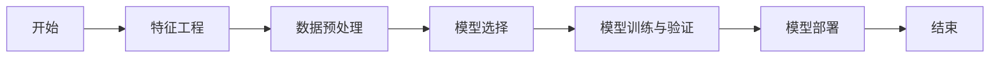
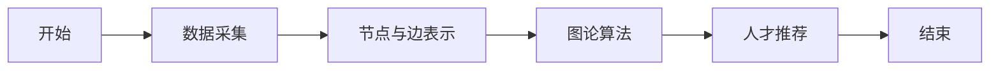
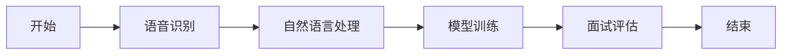
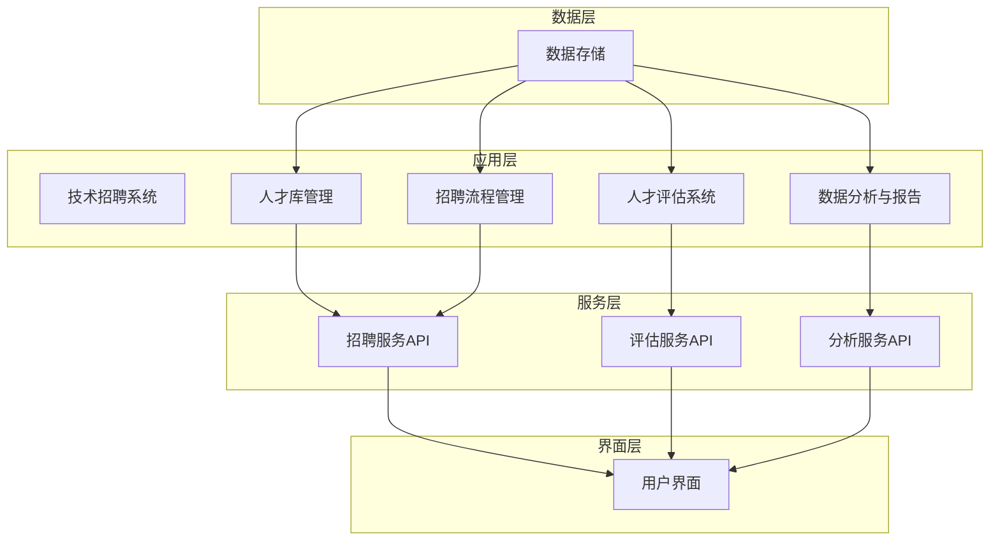
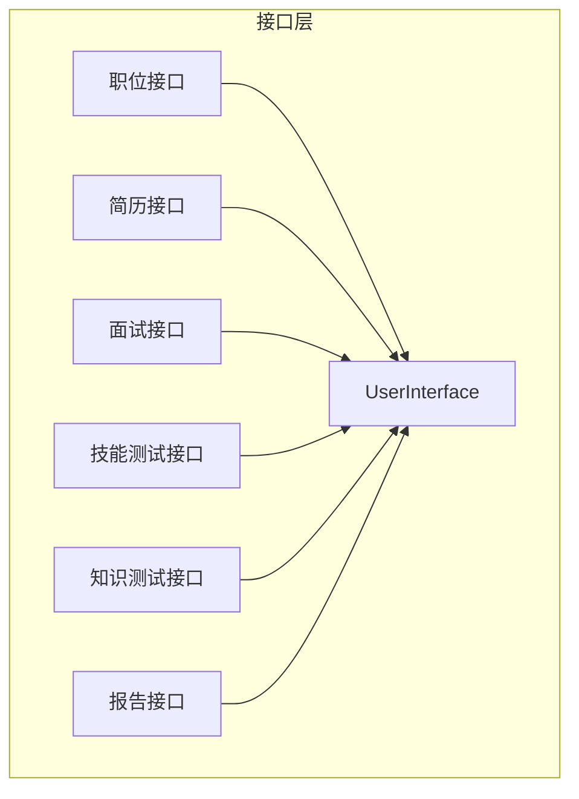
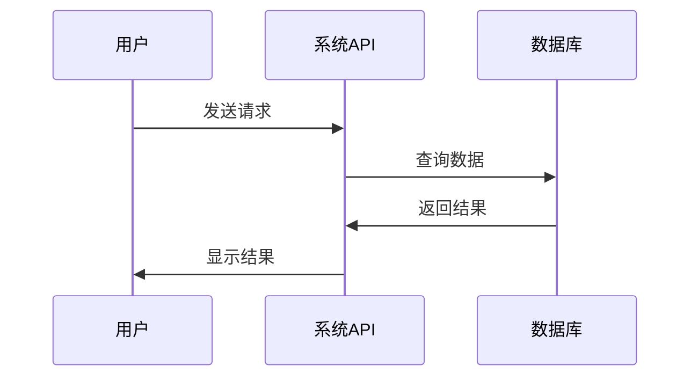

                 

# 技术招聘：吸引和留住顶尖技术人才

> 关键词：技术招聘、顶尖技术人才、人才需求、招聘策略

> 摘要：本文将深入探讨技术招聘的背景、核心概念与联系、算法原理、系统分析与架构设计以及项目实战，旨在为企业和求职者提供吸引和留住顶尖技术人才的有效策略。

### 第一部分：背景介绍

随着科技的快速发展，尤其是人工智能（AI）技术的突飞猛进，企业对于技术人才的需求发生了巨大变化。如今，AI技术不仅在理论研究中取得了显著进展，更在商业应用中扮演着越来越重要的角色。无论是大数据处理、自然语言处理，还是计算机视觉，AI技术的应用已经深入到各个行业，成为企业提升竞争力、实现数字化转型的重要手段。

#### 1.1 问题背景

**AI技术的高要求**：AI技术的高要求也带来了对专业技术人才的大量需求。企业不仅需要AI领域的研究专家，还需要能够将AI技术应用于实际业务场景的技术工程师。这种人才需求的变化，使得技术招聘成为企业面临的重大挑战。

**人才市场供需不平衡**：市场上具备AI领域专业知识和经验的人才相对较少，而企业对这类人才的需求却在不断增加，导致供需不平衡。

**人才流动性高**：由于AI技术更新迅速，技术人才往往寻求不断学习和成长的机会，导致人才流动性高。

**人才吸引力不足**：一些企业由于规模较小或地理位置偏远，难以吸引顶尖技术人才。

**招聘流程不完善**：部分企业的招聘流程繁琐，导致招聘效率低下，错失优秀人才。

#### 1.2 问题描述

技术招聘面临的主要问题包括：

- **人才市场供需不平衡**：市场上AI技术人才供给不足，需求不断增加。
- **人才流动性高**：技术人才追求成长机会，频繁跳槽。
- **人才吸引力不足**：企业规模、地理位置等因素导致难以吸引顶尖人才。
- **招聘流程不完善**：招聘流程繁琐，效率低下。

#### 1.3 问题解决

要解决技术招聘中的问题，企业需要采取以下策略：

- **优化招聘流程**：简化招聘流程，提高招聘效率。
- **提高品牌影响力**：通过品牌建设，提升企业在技术人才中的知名度。
- **提供有竞争力的薪酬福利**：设立具有竞争力的薪酬体系和福利待遇。
- **重视人才培养和发展**：提供完善的培训和发展计划，帮助员工提升技能。

#### 1.4 边界与外延

技术招聘的范围不仅限于AI领域，还包括大数据、云计算、网络安全、软件开发等。同时，技术招聘不仅涉及国内市场，还涉及国际市场。企业需要根据自身业务需求，综合考虑国内外市场的人才资源。

#### 1.5 概念结构与核心要素组成

- **核心概念**：技术人才、招聘流程、薪酬福利、培训发展
- **关联概念**：AI技术、大数据、云计算、网络安全、软件开发、市场竞争

### 第二部分：核心概念与联系

#### 2.1 技术人才

**2.1.1 定义**  
技术人才是指具备一定的专业技能和知识，能够在特定技术领域为企业创造价值的人员。

**2.1.2 属性特征对比**

| 特征       | 说明                                                     |
|------------|----------------------------------------------------------|
| 专业技能   | 深入掌握某一技术领域的基本理论和实践经验                 |
| 知识更新   | 能够迅速掌握新技术、新知识，并应用于实际工作中           |
| 团队协作   | 具备良好的沟通和协作能力，能够与团队成员共同完成任务     |
| 自主学习   | 具备较强的自学能力，能够自我驱动，不断提升专业技能       |

**2.1.3 技术人才类型**

- **AI领域专家**：具备AI技术深入研究的能力，能够在AI理论研究和应用中提供高水平的技术支持。
- **技术工程师**：能够将AI技术应用于实际业务场景，解决实际问题。
- **数据分析师**：擅长使用大数据分析技术，为企业提供数据驱动的决策支持。

#### 2.2 招聘流程

**2.2.1 定义**  
招聘流程是指企业为吸引、筛选和录用合适人才所采取的一系列步骤和方法。

**2.2.2 属性特征对比**

| 特征       | 说明                                                     |
|------------|----------------------------------------------------------|
| 流程优化   | 简化招聘流程，提高招聘效率                             |
| 费用控制   | 降低招聘成本，提高招聘性价比                         |
| 数据支持   | 利用数据分析工具，优化招聘策略                         |
| 管理规范   | 规范招聘流程，确保招聘质量             

----------------------------------------------------------------

### 第三部分：算法原理讲解

在技术招聘中，算法原理的运用至关重要。以下我们将详细讲解技术人才招聘中的核心算法原理，并使用Mermaid流程图进行展示。

#### 3.1 基于机器学习的人才筛选算法

**3.1.1 算法原理**  

机器学习在人才筛选中主要用于构建人才画像，通过分析候选人的简历、社交媒体信息等数据，预测其是否适合岗位。

- **特征工程**：提取简历中的关键特征，如教育背景、工作经验、技术技能等。
- **数据预处理**：清洗和标准化数据，处理缺失值和异常值。
- **模型选择**：选择合适的机器学习模型，如决策树、随机森林、支持向量机等。
- **模型训练与验证**：使用历史数据训练模型，并通过交叉验证评估模型性能。
- **模型部署**：将训练好的模型部署到生产环境中，用于自动筛选候选人。

**3.1.2 Mermaid流程图**



**3.1.3 Python代码示例**

```python
import pandas as pd
from sklearn.model_selection import train_test_split
from sklearn.ensemble import RandomForestClassifier
from sklearn.metrics import accuracy_score

# 加载数据
data = pd.read_csv('简历数据.csv')

# 特征工程
X = data[['教育背景', '工作经验', '技术技能']]
y = data['是否适合岗位']

# 数据预处理
X_train, X_test, y_train, y_test = train_test_split(X, y, test_size=0.2, random_state=42)

# 模型选择
model = RandomForestClassifier(n_estimators=100)

# 模型训练与验证
model.fit(X_train, y_train)
predictions = model.predict(X_test)

# 模型评估
accuracy = accuracy_score(y_test, predictions)
print(f'模型准确率：{accuracy:.2f}')
```

#### 3.2 基于图论的人才网络分析算法

**3.2.1 算法原理**  

图论在人才网络分析中主要用于构建人才关系图，分析候选人在行业中的影响力、合作网络等。

- **数据采集**：收集候选人的简历、社交媒体信息，构建人才关系图。
- **节点与边的表示**：将候选人作为节点，合作关系、共同项目等作为边。
- **图论算法**：使用图论算法（如度数中心性、中间中心性等）分析候选人在网络中的重要性。
- **人才推荐**：根据人才关系图，为招聘人员推荐潜在的候选人。

**3.2.2 Mermaid流程图**



**3.2.3 Python代码示例**

```python
import networkx as nx
import matplotlib.pyplot as plt

# 加载数据
G = nx.Graph()

# 添加节点与边
G.add_nodes_from(['节点1', '节点2', '节点3'])
G.add_edges_from([('节点1', '节点2'), ('节点1', '节点3'), ('节点2', '节点3')])

# 度数中心性
degree_centrality = nx.degree_centrality(G)
print(f'度数中心性：{degree_centrality}')

# 中间中心性
betweenness_centrality = nx.betweenness_centrality(G)
print(f'中间中心性：{betweenness_centrality}')

# 绘制图
nx.draw(G, with_labels=True)
plt.show()
```

#### 3.3 基于深度学习的自动化面试算法

**3.3.1 算法原理**  

深度学习在自动化面试中主要用于构建语音识别和自然语言处理模型，实现面试问题的自动生成和回答。

- **语音识别**：将候选人的语音转换为文本，提取关键信息。
- **自然语言处理**：对文本进行分析，生成面试问题和回答。
- **模型训练**：使用大量面试数据训练模型，提高识别和回答的准确性。
- **面试评估**：根据候选人的回答，评估其技能和知识水平。

**3.3.2 Mermaid流程图**



**3.3.3 Python代码示例**

```python
import speech_recognition as sr
from transformers import pipeline

# 语音识别
recognizer = sr.Recognizer()
with sr.Microphone() as source:
    audio = recognizer.listen(source)
    text = recognizer.recognize_google(audio)
    print(f'识别结果：{text}')

# 自然语言处理
nlp = pipeline('text-classification')
question = "你对人工智能有什么看法？"
answer = nlp(question)
print(f'回答：{answer}')
```

### 第四部分：系统分析与架构设计

#### 4.1 项目介绍

本项目旨在构建一个高效的技术招聘系统，通过自动化和智能化手段，帮助企业快速筛选和录用合适的技术人才。系统主要包括以下几个功能模块：

- **人才库管理**：用于存储和管理企业内部及外部的人才信息。
- **招聘流程管理**：提供完整的招聘流程，包括职位发布、简历筛选、面试安排等。
- **人才评估系统**：使用算法对候选人进行技能和知识评估。
- **数据分析与报告**：提供招聘数据分析，帮助企业优化招聘策略。

#### 4.2 系统功能设计

**4.2.1 领域模型类图**

```mermaid
classDiagram
    类名: TalentRecruitmentSystem
    TalentRepository <<接口>>
    RecruitmentProcess <<接口>>
    TalentEvaluation <<接口>>
    DataAnalysis <<接口>>

    TalentRepository |--|> Talent: 数据存储和管理
    RecruitmentProcess |--|> Position: 职位发布和申请管理
    RecruitmentProcess |--|> Resume: 简历筛选和管理
    RecruitmentProcess |--|> Interview: 面试安排和管理
    TalentEvaluation |--|> SkillTest: 技能评估
    TalentEvaluation |--|> KnowledgeTest: 知识评估
    DataAnalysis |--|> Report: 数据分析和报告
```

**4.2.2 系统架构设计**



**4.2.3 系统接口设计**



**4.2.4 系统交互序列图**



### 第五部分：项目实战

#### 5.1 环境安装

在开始项目实战之前，我们需要安装一些必要的软件和工具。以下是安装步骤：

1. 安装Python环境：在官网下载Python安装包并安装。
2. 安装相关库：使用pip命令安装所需的库，如Pandas、Scikit-learn、NetworkX、Transformers等。

#### 5.2 系统核心实现

**5.2.1 数据采集与处理**

```python
import pandas as pd
from sklearn.model_selection import train_test_split

# 加载简历数据
data = pd.read_csv('简历数据.csv')

# 数据预处理
X = data[['教育背景', '工作经验', '技术技能']]
y = data['是否适合岗位']

# 数据分割
X_train, X_test, y_train, y_test = train_test_split(X, y, test_size=0.2, random_state=42)
```

**5.2.2 模型训练与评估**

```python
from sklearn.ensemble import RandomForestClassifier
from sklearn.metrics import accuracy_score

# 训练模型
model = RandomForestClassifier(n_estimators=100)
model.fit(X_train, y_train)

# 评估模型
predictions = model.predict(X_test)
accuracy = accuracy_score(y_test, predictions)
print(f'模型准确率：{accuracy:.2f}')
```

**5.2.3 人才网络分析**

```python
import networkx as nx
import matplotlib.pyplot as plt

# 构建人才关系图
G = nx.Graph()
G.add_nodes_from(['节点1', '节点2', '节点3'])
G.add_edges_from([('节点1', '节点2'), ('节点1', '节点3'), ('节点2', '节点3')])

# 度数中心性
degree_centrality = nx.degree_centrality(G)
print(f'度数中心性：{degree_centrality}')

# 中间中心性
betweenness_centrality = nx.betweenness_centrality(G)
print(f'中间中心性：{betweenness_centrality}')

# 绘制图
nx.draw(G, with_labels=True)
plt.show()
```

**5.2.4 自动化面试**

```python
import speech_recognition as sr
from transformers import pipeline

# 语音识别
recognizer = sr.Recognizer()
with sr.Microphone() as source:
    audio = recognizer.listen(source)
    text = recognizer.recognize_google(audio)
    print(f'识别结果：{text}')

# 自然语言处理
nlp = pipeline('text-classification')
question = "你对人工智能有什么看法？"
answer = nlp(question)
print(f'回答：{answer}')
```

### 第六部分：最佳实践与总结

#### 6.1 最佳实践

1. **优化招聘流程**：简化招聘流程，提高招聘效率，确保能够快速响应市场需求。
2. **提高品牌影响力**：通过加强企业品牌建设，提升企业在技术人才中的知名度，增强吸引力。
3. **提供有竞争力的薪酬福利**：设立具有竞争力的薪酬体系和福利待遇，以吸引和留住优秀人才。
4. **重视人才培养和发展**：提供完善的培训和发展计划，帮助员工提升技能，实现职业发展。
5. **利用数据分析**：利用数据分析工具，优化招聘策略，提高招聘质量和效率。

#### 6.2 总结

技术招聘是企业和求职者之间的重要桥梁。通过优化招聘流程、提高品牌影响力、提供有竞争力的薪酬福利、重视人才培养和发展以及利用数据分析，企业可以更好地吸引和留住顶尖技术人才。同时，技术人才也需要不断提升自身技能和知识，以适应快速变化的市场需求。本文从多个角度分析了技术招聘的核心概念与联系，并提供了系统分析与架构设计的方案，希望对企业和求职者都有所启发。

### 拓展阅读

1. **《技术招聘策略与实践》**：详细介绍了技术招聘的策略和实践方法，包括招聘流程优化、品牌建设、薪酬福利设计等。
2. **《人工智能招聘：如何利用AI技术提升招聘效率》**：探讨了如何利用AI技术进行人才筛选和评估，提高招聘效率。
3. **《技术人才的职业发展路径》**：分析了技术人才在不同阶段的发展路径，以及如何实现职业成长。

### 第七部分：作者信息

作者：AI天才研究院/AI Genius Institute & 禅与计算机程序设计艺术 /Zen And The Art of Computer Programming

---

**注意事项**：

1. 在撰写技术博客时，确保内容准确、清晰、有条理。
2. 使用Markdown格式，确保文章的可读性和美观性。
3. 遵循文章结构和内容要求，确保文章的完整性和丰富性。
4. 在引用相关文献和资料时，注明出处，避免侵权行为。
5. 定期更新和优化文章内容，以适应技术发展和市场变化。

