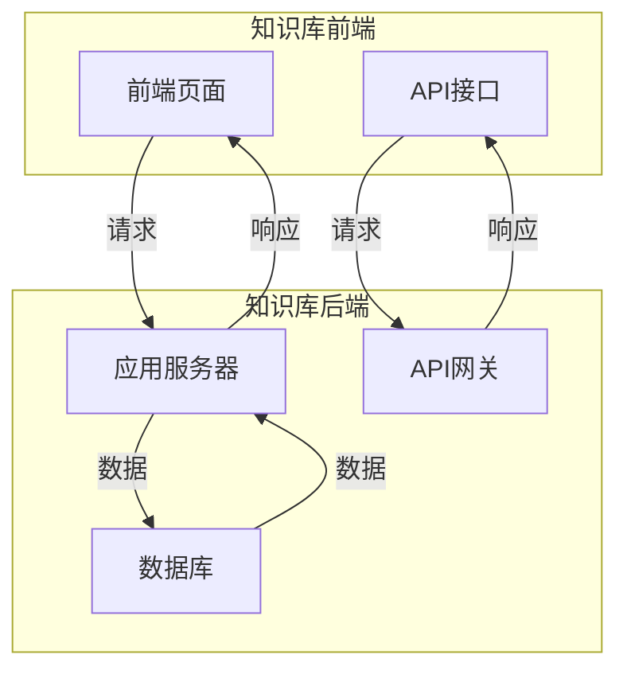
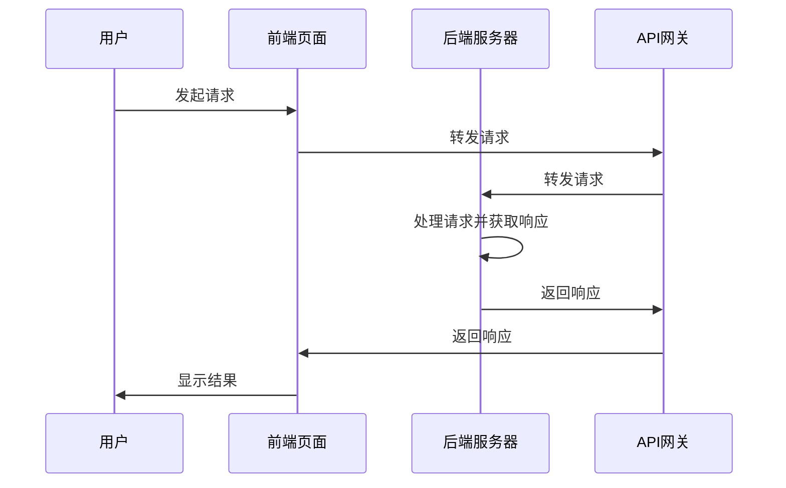

                 

# 技术文档管理与知识沉淀

## 关键词

- 技术文档管理
- 知识沉淀
- 版本控制
- 文档格式规范
- 知识库构建
- 团队协作

## 摘要

本文将深入探讨技术文档管理与知识沉淀的重要性，阐述其在现代IT行业中的核心作用。我们将逐步分析技术文档管理与知识沉淀的基本原则、方法与工具，并探讨面临的挑战与应对策略。通过具体实例和实践，本文将帮助读者掌握技术文档管理与知识沉淀的实践技巧，提升团队协作效率，实现知识的高效传承与应用。

### 第一部分：技术文档管理与知识沉淀概述

#### 第1章 技术文档管理与知识沉淀：问题背景与核心概念

##### 1.1 技术文档管理与知识沉淀的必要性

在快速发展的技术行业中，技术文档和知识沉淀成为团队协作、项目管理和知识传承的重要基础。随着项目规模和复杂度的增加，技术文档和知识沉淀的重要性日益凸显。

- **问题描述**：在快速发展的技术行业中，技术文档和知识沉淀成为团队协作、项目管理和知识传承的重要基础。然而，如何高效管理技术文档和实现知识沉淀仍然面临诸多挑战。
  - **文档繁多**：项目过程中产生的文档种类繁多，包括设计文档、开发文档、测试文档等。
  - **版本控制**：如何有效管理文档的版本，避免冲突和混乱。
  - **知识共享**：如何实现团队成员之间的知识共享，提高工作效率。

- **问题解决**：通过建立一套完善的技术文档管理体系和知识沉淀机制，可以提升团队的工作效率，确保技术知识的有效传承和应用。
  - **文档分类**：根据不同的项目和团队需求，对文档进行分类管理。
  - **文档模板**：制定统一的文档模板，确保文档格式的一致性。
  - **版本控制**：使用版本控制系统管理文档的更新和版本。
  - **知识库**：建立知识库，实现知识的积累和共享。

- **边界与外延**：技术文档管理与知识沉淀不仅涉及文档的编写、存储和分享，还包括文档的版本控制、更新和维护，以及知识库的构建和利用。
  - **技术文档**：技术文档是关于项目的技术细节描述，包括设计文档、开发文档、测试文档等。
  - **知识沉淀**：知识沉淀是将技术经验、最佳实践和解决方案等转化为可共享的知识资产。
  - **知识库**：知识库是一个集中存储和管理知识的系统，用于支持团队的协作和学习。

- **核心要素组成**：
  - **文档分类**：根据不同的项目和团队需求，对文档进行分类管理。
    - **设计文档**：包括需求文档、架构设计文档、UI设计文档等。
    - **开发文档**：包括代码注释、API文档、技术方案文档等。
    - **测试文档**：包括测试计划、测试用例、测试报告等。

  - **文档模板**：制定统一的文档模板，确保文档格式的一致性。
    - **模板设计**：设计符合团队需求的文档模板，包括标题、摘要、目录、正文等部分。
    - **模板应用**：使用模板编写文档，确保文档的格式和结构一致。

  - **版本控制**：使用版本控制系统管理文档的更新和版本。
    - **版本控制工具**：如Git、SVN等。
    - **版本管理策略**：制定版本管理策略，包括版本命名、分支管理、合并策略等。

  - **知识库**：建立知识库，实现知识的积累和共享。
    - **知识库构建**：使用工具如GraphDB、Elasticsearch等构建知识库。
    - **知识共享**：通过知识库实现团队成员之间的知识共享和协作。

##### 1.2 技术文档管理的基本原则

- **文档的准确性**：文档内容要准确无误，避免误导和误解。
  - **内容验证**：在编写文档前进行内容验证，确保准确性和完整性。
  - **定期审核**：定期对文档进行审核，确保文档的准确性。

- **文档的可读性**：文档要简洁明了，易于理解和检索。
  - **格式规范**：使用统一的格式规范，如字体、段落、标题等。
  - **简洁表达**：使用简洁明了的语言，避免复杂的术语和冗长的句子。

- **文档的时效性**：文档要及时更新，反映最新的技术动态和项目进展。
  - **更新策略**：制定文档更新策略，确保文档的及时性和有效性。
  - **版本迭代**：随着项目进展和技术的更新，定期更新文档。

- **文档的安全性**：确保文档的安全存储和访问权限。
  - **权限管理**：对文档的访问权限进行管理，确保只有授权人员可以访问。
  - **备份策略**：制定备份策略，确保文档的安全存储和备份。

##### 1.3 知识沉淀的方法与工具

- **文档编写工具**：使用Markdown、LaTeX等工具进行文档编写。
  - **Markdown**：Markdown是一种轻量级的标记语言，适合快速编写和格式化文档。
  - **LaTeX**：LaTeX是一种高质量的排版系统，适合编写学术文档和专业报告。

- **文档存储与管理**：利用Git、Confluence等工具进行文档的存储和管理。
  - **Git**：Git是一种分布式版本控制系统，适合对文档进行版本控制和协作管理。
  - **Confluence**：Confluence是一款团队协作和知识管理的工具，支持多种文档格式和插件。

- **知识库构建**：使用GraphDB、Elasticsearch等工具构建知识库。
  - **GraphDB**：GraphDB是一个图数据库，适合存储和管理复杂的知识结构和关系。
  - **Elasticsearch**：Elasticsearch是一个开源搜索引擎，适合对知识库进行全文搜索和检索。

##### 1.4 技术文档管理与知识沉淀的挑战与应对策略

- **挑战**：
  - **文档更新与维护**：如何确保文档的及时更新和有效维护。
    - **自动化工具**：使用自动化工具（如CI/CD流水线）自动更新文档。
    - **定期检查**：定期检查文档的更新情况，确保及时更新。

  - **知识共享与协作**：如何促进团队成员之间的知识共享和协作。
    - **知识共享平台**：建立知识共享平台，鼓励团队成员分享知识和经验。
    - **团队文化**：建立良好的团队文化，鼓励知识共享和协作。

- **应对策略**：
  - **建立规范的文档流程**：制定明确的文档编写、审核和发布流程，确保文档的质量和一致性。
  - **推动知识共享文化**：鼓励团队成员积极参与知识分享和协作，建立知识共享的激励机制。
  - **利用自动化工具**：使用自动化工具提高文档管理的效率和准确性，降低人工错误的风险。

##### 1.5 本章小结

通过本章的介绍，读者可以初步了解技术文档管理与知识沉淀的重要性、基本原则、方法和工具，以及面临的挑战和应对策略。这些知识将为后续章节的深入讨论提供基础。

### 第二部分：技术文档管理实践

#### 第2章 技术文档的编写与格式规范

##### 2.1 技术文档的编写原则

技术文档的编写是技术文档管理的重要环节，遵循以下编写原则，可以确保文档的质量和可读性。

- **明确目的**：在编写文档之前，要明确文档的目的和受众。明确文档要传达的信息，以及受众的需求和期望。
  - **目的明确**：确保文档有明确的目的，如指导开发、测试、部署等。
  - **受众明确**：根据受众的特点和需求，编写适合的文档内容。

- **结构清晰**：技术文档要有清晰的结构，便于阅读和理解。良好的结构可以提高文档的可读性和易用性。
  - **模块化**：将文档内容划分为模块，每个模块处理一个特定的主题。
  - **逻辑顺序**：按照逻辑顺序组织文档内容，确保读者可以顺畅地阅读和理解。

- **内容准确**：确保文档内容准确无误，避免误导和误解。准确的内容是技术文档的基本要求。
  - **事实检查**：在编写文档之前，对相关事实和数据进行验证，确保准确性。
  - **引用和引用**：在文档中引用相关的参考资料和文档，确保引用的准确性和完整性。

##### 2.2 技术文档的格式规范

技术文档的格式规范对于提高文档的可读性和一致性至关重要。以下是一些常用的格式规范：

- **文档标题**：使用简洁明了的标题，反映文档的主要内容。标题要简洁、有针对性，避免使用过于复杂的术语和短语。
  - **简洁明了**：避免使用冗长的标题，确保标题简洁明了，容易理解。
  - **关键词突出**：在标题中使用关键词，帮助读者快速了解文档的主要内容。

- **段落格式**：使用段落分隔符，确保文档的整洁性。每个段落要有一个明确的主题，保持段落的简洁和连贯性。
  - **分段**：在适当的时机使用段落分隔符，确保文档的整洁性。
  - **主题统一**：每个段落要围绕一个主题展开，保持主题的统一性。

- **代码格式**：使用代码块或高亮显示代码，提高代码的可读性。代码格式规范可以增强文档的可读性和易用性。
  - **代码块**：使用代码块将代码片段封装起来，确保代码的高亮显示和可复制性。
  - **注释**：在代码中添加必要的注释，解释代码的功能和实现细节。

- **图表使用**：合理使用图表，辅助说明技术概念和算法原理。图表可以提高文档的可读性和直观性。
  - **图表类型**：根据需求选择合适的图表类型，如流程图、类图、网络图等。
  - **图表说明**：在每个图表旁边添加说明，解释图表的含义和用途。

##### 2.3 常用文档编写工具介绍

在技术文档的编写过程中，选择合适的工具可以提高效率和质量。以下介绍几种常用的文档编写工具：

- **Markdown**：Markdown是一种轻量级的标记语言，适合快速编写和格式化文档。Markdown具有简单易用、兼容性强等优点，广泛应用于技术文档的编写。
  - **特点**：Markdown语法简单，易于学习和掌握，支持多种格式和扩展。
  - **使用场景**：适用于快速编写和格式化文档，如博客、技术文档、报告等。

- **LaTeX**：LaTeX是一种高质量的排版系统，适合编写学术文档和专业报告。LaTeX具有强大的排版功能和专业的排版质量，广泛应用于数学、科学、工程等领域。
  - **特点**：LaTeX注重文档的结构和格式，支持复杂的数学公式和排版。
  - **使用场景**：适用于编写学术文档、数学公式和复杂排版要求的文档。

- **Confluence**：Confluence是一款团队协作和知识管理的工具，支持多种文档格式和插件。Confluence具有强大的协作功能、版本控制和文档共享功能，广泛应用于团队协作和知识管理。
  - **特点**：Confluence支持多种文档格式，如Markdown、HTML、LaTeX等，提供丰富的插件和扩展功能。
  - **使用场景**：适用于团队协作、知识管理和文档共享，如项目文档、团队报告、知识库等。

##### 2.4 技术文档编写实例分析

为了更好地理解技术文档的编写原则和格式规范，以下通过一个实际案例进行分析：

**案例：编写一个关于数据库设计的文档**

1. **明确目的**：该文档的目的是为开发团队提供一个数据库设计指南，帮助团队成员理解数据库的结构和功能。

2. **结构清晰**：文档结构如下：
   - **摘要**：简要介绍数据库设计的背景和目标。
   - **需求分析**：详细描述数据库的需求，包括业务需求、性能需求等。
   - **数据库设计**：介绍数据库的架构和设计细节，包括表结构、索引、视图等。
   - **数据库实现**：描述数据库的创建和配置过程，包括SQL脚本、配置文件等。
   - **测试和部署**：介绍数据库的测试和部署过程，确保数据库的正常运行。

3. **内容准确**：在编写文档时，确保以下内容准确无误：
   - **术语和定义**：使用统一的术语和定义，确保团队成员理解一致。
   - **数据模型**：详细描述数据库的表结构和关系，使用实体关系图（ER图）进行展示。
   - **性能分析**：提供性能分析报告，包括查询性能、索引效果等。

4. **格式规范**：使用Markdown编写文档，确保文档格式规范，如标题、段落、代码块、图表等。

通过以上实例分析，我们可以看到技术文档的编写需要遵循明确的目的、结构清晰、内容准确等原则，并使用合适的格式规范，以提高文档的可读性和易用性。

#### 第3章 技术文档的版本控制与管理

##### 3.1 版本控制的概念与原理

版本控制是一种跟踪和管理文档版本的方法，确保文档的更新和变更记录。通过版本控制，可以方便地管理文档的历史版本、追踪变更历史、协同工作等。

- **版本控制的概念**：版本控制是一种对文档进行版本管理的方法，通过对文档的修改和更新进行记录，实现对文档历史版本的管理。

- **版本控制的原理**：版本控制通过以下原理实现文档的版本管理：

  - **版本标识**：为每个文档版本分配一个唯一的标识，用于标识不同的版本。
  - **变更记录**：记录每次对文档的修改和更新操作，包括修改内容、修改人、修改时间等。
  - **版本比较**：通过比较不同版本之间的差异，帮助用户了解文档的变更情况。
  - **版本回滚**：在需要时，可以回滚到之前的版本，恢复到之前的修改状态。

- **版本控制工具**：常用的版本控制工具有Git、SVN等。

  - **Git**：Git是一种分布式版本控制系统，支持快速、灵活的版本管理。Git具有以下特点：

    - **分布式**：Git将版本库分布在各个团队成员的本地机器上，提高协作效率和响应速度。
    - **分支管理**：Git支持分支管理，方便团队成员进行独立开发和协作。
    - **合并策略**：Git提供多种合并策略，帮助用户解决冲突和合并不同分支的变更。

  - **SVN**：SVN是一种集中式版本控制系统，将版本库集中存储在服务器上。SVN具有以下特点：

    - **集中式**：SVN将版本库集中存储在服务器上，方便管理员管理和维护。
    - **版本库**：SVN支持版本库的概念，方便管理文档的历史版本。
    - **权限管理**：SVN提供权限管理功能，确保文档的安全性和可控性。

##### 3.2 技术文档的版本管理策略

为了确保技术文档的版本管理和变更记录，需要制定合理的版本管理策略。以下是一些常见的版本管理策略：

- **版本命名规范**：为版本命名制定统一规范，确保版本名称清晰、具有可读性。

  - **格式**：通常使用日期或版本号作为版本命名的一部分，如"2023-03-01-v1.0"。
  - **描述**：在版本名称中添加简要描述，如"修复bug-v1.1"、"新增功能-v2.0"。

- **分支策略**：使用分支策略管理不同版本的文档，确保版本的一致性和稳定性。

  - **主分支**：主分支（Master分支）包含最新的稳定版本，通常是发布版本。
  - **开发分支**：开发分支（Develop分支）用于开发新功能或修复bug，与主分支保持一致。
  - **功能分支**：功能分支（Feature分支）用于实现特定的功能，开发完成后合并到主分支或开发分支。
  - **bug修复分支**：bug修复分支（Bug分支）用于修复特定的bug，修复完成后合并到主分支或开发分支。

- **合并策略**：合理合并不同分支的变更，避免冲突和错误。

  - **合并冲突**：在合并分支时，如果发生冲突，需要手动解决。解决冲突的方法包括手动编辑、自动合并等。
  - **预合并检查**：在合并前进行预合并检查，确保分支的变更可以正常合并，减少冲突的发生。

##### 3.3 技术文档的版本控制实践

在实际的技术文档管理中，可以使用版本控制工具（如Git）进行文档的版本控制和管理。以下是一个简单的Git版本控制实践：

1. **初始化版本库**：首先，在本地计算机上初始化一个Git版本库，用于存储和管理文档。

   ```shell
   git init
   ```

2. **添加文档**：将文档添加到版本库中，使用`git add`命令将文件添加到暂存区。

   ```shell
   git add 文件名.md
   ```

3. **提交变更**：使用`git commit`命令提交对文档的修改。

   ```shell
   git commit -m "提交说明"
   ```

4. **创建分支**：根据需要创建不同版本的分支，如创建一个名为`feature/new_function`的分支。

   ```shell
   git checkout -b feature/new_function
   ```

5. **开发功能**：在分支上进行开发，如编写新的文档内容。

6. **提交变更**：在开发完成后，提交对分支的修改。

   ```shell
   git commit -m "提交说明"
   ```

7. **合并分支**：将开发分支合并到主分支或开发分支，确保版本的一致性。

   ```shell
   git checkout master
   git merge feature/new_function
   ```

8. **解决冲突**：在合并时，如果发生冲突，需要手动解决。

   ```shell
   git status
   git add 文件名.md
   git commit -m "提交说明"
   ```

9. **发布版本**：将合并后的主分支或开发分支发布为新的版本。

   ```shell
   git tag -a v1.0 -m "发布版本1.0"
   git push origin v1.0
   ```

通过以上步骤，我们可以使用Git进行技术文档的版本控制和管理，确保文档的版本一致性、稳定性和可追溯性。

#### 第4章 知识沉淀的方法与实践

##### 4.1 知识沉淀的概念与意义

知识沉淀是将技术经验、最佳实践和解决方案等转化为可共享的知识资产，以便团队和团队成员在未来的项目中复用和参考。知识沉淀有助于提高团队的工作效率，减少重复劳动，促进知识传承和创新。

- **概念**：知识沉淀是将项目过程中积累的技术经验、解决方案、最佳实践等转化为可共享的知识，通过文档、知识库等形式保存和传递。
- **意义**：
  - **提高工作效率**：通过知识沉淀，团队成员可以快速获取和复用已有的经验和知识，避免重复研究和解决相同的问题。
  - **知识传承**：知识沉淀有助于将团队的知识和经验传承给新成员，帮助新成员快速融入团队，减少知识流失。
  - **创新促进**：知识沉淀为团队提供了丰富的知识资源，有助于激发创新思维，促进新技术的探索和应用。

##### 4.2 知识沉淀的方法

知识沉淀需要一套系统的方法和工具，以下介绍几种常用的知识沉淀方法：

- **文档编写**：通过编写技术文档、用户手册、操作指南等，将项目过程中的经验和知识进行系统化整理和记录。
  - **文档类型**：包括设计文档、开发文档、测试文档、用户手册等。
  - **编写规范**：遵循统一的编写规范，如格式、结构和术语等，确保文档的规范性和一致性。

- **知识库建设**：通过建立知识库，将项目过程中积累的知识和经验进行集中存储和管理。
  - **知识库工具**：如Confluence、Wiki等，支持知识库的创建、分类、搜索和共享。
  - **知识库内容**：包括技术文档、案例分享、最佳实践、解决方案等。

- **知识共享**：通过团队内部的知识分享和交流，促进知识的传播和沉淀。
  - **分享形式**：包括会议分享、内部培训、技术沙龙等。
  - **分享内容**：包括技术讲解、项目经验、解决方案等。

- **代码库管理**：通过代码库（如Git）管理项目代码，将项目过程中积累的技术经验和知识记录在代码注释、文档中。
  - **代码注释**：为代码添加详细的注释，解释代码的功能和实现细节。
  - **文档记录**：在代码库中添加相关文档，如设计文档、测试文档等。

##### 4.3 知识沉淀的工具

为了实现高效的知识沉淀，需要借助合适的工具。以下介绍几种常用的知识沉淀工具：

- **文档编写工具**：
  - **Markdown**：Markdown是一种轻量级的标记语言，适合快速编写和格式化文档。Markdown具有简单易用、兼容性强等优点，广泛应用于技术文档的编写。
  - **LaTeX**：LaTeX是一种高质量的排版系统，适合编写学术文档和专业报告。LaTeX注重文档的结构和格式，支持复杂的数学公式和排版。
  - **Confluence**：Confluence是一款团队协作和知识管理的工具，支持多种文档格式和插件。Confluence具有强大的协作功能、版本控制和文档共享功能。

- **知识库工具**：
  - **Confluence**：Confluence是一款团队协作和知识管理的工具，支持多种文档格式和插件。Confluence具有强大的协作功能、版本控制和文档共享功能。
  - **Wiki**：Wiki是一种支持多人协作编辑的工具，适合构建团队知识库。Wiki具有简洁易用、易于扩展等优点，广泛应用于企业内部知识管理。
  - **Trello**：Trello是一款基于看板的项目管理工具，适合团队协作和任务管理。Trello通过卡片和看板的方式，帮助团队管理和追踪项目进度。

- **代码库管理工具**：
  - **Git**：Git是一种分布式版本控制系统，支持快速、灵活的版本管理。Git具有分布式、分支管理、合并策略等优点，广泛应用于代码库管理。
  - **SVN**：SVN是一种集中式版本控制系统，将版本库集中存储在服务器上。SVN具有集中式、版本库、权限管理等优点，广泛应用于代码库管理。

##### 4.4 知识沉淀实践

以下通过一个实际案例，介绍如何进行知识沉淀的实践：

**案例：构建一个技术文档库**

1. **确定知识库需求**：根据项目特点和团队需求，确定技术文档库的功能和内容。

2. **搭建知识库平台**：选择合适的知识库工具，如Confluence，搭建技术文档库。

3. **创建文档模板**：设计技术文档模板，包括标题、摘要、目录、正文等部分，确保文档格式的一致性。

4. **收集和整理文档**：收集项目过程中的技术文档，如设计文档、开发文档、测试文档等，整理并上传到知识库中。

5. **分类和标签**：根据文档的内容和用途，对文档进行分类和标签管理，便于后续查找和共享。

6. **定期更新和维护**：定期检查和更新知识库中的文档，确保文档的准确性和时效性。

7. **知识共享和培训**：通过知识库和团队内部的分享活动，促进知识的传播和应用，提高团队的技术水平。

8. **反馈和改进**：收集团队成员对知识库的反馈，不断优化和改进知识库的功能和内容。

通过以上实践，我们可以构建一个高效的技术文档库，实现知识沉淀和共享，提高团队的工作效率和协作能力。

##### 4.5 知识沉淀的最佳实践

以下是知识沉淀过程中的一些最佳实践，帮助团队更好地实现知识沉淀：

- **文档编写规范**：遵循统一的文档编写规范，确保文档的结构和格式一致，便于阅读和理解。

- **版本管理和更新**：使用版本控制系统对文档进行版本管理，确保文档的更新和版本控制，方便追溯和查阅。

- **知识共享机制**：建立知识共享机制，鼓励团队成员积极参与知识分享和协作，提高知识沉淀的效率和效果。

- **文档审核制度**：制定文档审核制度，确保文档的质量和准确性，降低错误和遗漏的风险。

- **知识库备份和恢复**：定期备份知识库，确保知识库的安全性和可靠性，防止数据丢失。

- **培训和学习**：定期组织培训和学习活动，提高团队成员的知识水平和技能，促进知识的传承和创新。

#### 第5章 技术文档管理与知识沉淀的挑战与解决方案

##### 5.1 技术文档管理与知识沉淀的挑战

技术文档管理与知识沉淀在实施过程中面临诸多挑战，以下是一些常见的问题：

- **文档更新不及时**：技术文档需要及时更新以反映最新的技术动态和项目进展，但实际操作中往往因人员和时间限制而难以实现。

- **知识共享难度大**：团队成员之间的知识共享和协作存在障碍，可能导致知识沉淀效果不佳。

- **文档质量参差不齐**：技术文档的质量参差不齐，影响知识的传递和应用效果。

- **知识库维护困难**：知识库的维护和管理需要大量时间和精力，且容易出现数据冗余和更新滞后的问题。

##### 5.2 挑战分析与解决方案

针对上述挑战，以下提出相应的解决方案：

- **文档更新与维护**：

  - **自动化更新**：利用自动化工具（如CI/CD流水线）自动更新文档，减少人工干预。

  - **定期检查**：制定文档更新策略，定期检查文档的更新情况，确保及时更新。

  - **激励机制**：建立激励机制，鼓励团队成员积极参与文档更新和维护。

- **知识共享与协作**：

  - **知识共享平台**：建立知识共享平台，提供便捷的知识共享和协作工具。

  - **团队文化**：营造良好的团队文化，鼓励知识共享和协作，建立信任和互助的氛围。

  - **知识共享培训**：定期组织知识共享培训，提高团队成员的知识共享意识和能力。

- **文档质量提升**：

  - **文档模板**：制定统一的文档模板，确保文档格式和结构的一致性。

  - **文档审核**：建立文档审核制度，对文档进行质量检查，确保文档的准确性和完整性。

  - **反馈机制**：建立反馈机制，鼓励团队成员对文档提出意见和建议，不断优化文档质量。

- **知识库维护**：

  - **数据备份**：定期备份知识库，确保数据的安全性和可靠性。

  - **知识库整理**：定期对知识库进行整理和清理，去除冗余数据和无效信息。

  - **知识库培训**：定期组织知识库培训，提高团队成员的知识库使用和维护能力。

#### 5.3 本章小结

通过本章的讨论，我们分析了技术文档管理与知识沉淀面临的挑战，并提出了相应的解决方案。这些解决方案有助于提升技术文档管理的效率和质量，促进知识沉淀和共享。在实际应用中，团队可以根据自身情况，结合这些解决方案，优化技术文档管理和知识沉淀流程，提高团队协作效率，实现知识的高效传承与应用。

### 第三部分：技术文档管理与知识沉淀的实际应用

#### 第6章 实际应用案例：企业内部知识库建设

##### 6.1 项目背景

某大型企业为了提高内部技术协作效率，决定构建一个企业内部知识库，实现技术文档的管理与知识沉淀。该项目涉及到多个业务部门，需要整合不同部门的技术文档、最佳实践和解决方案。

##### 6.2 项目介绍

- **项目目标**：构建一个企业内部知识库，实现以下目标：
  - **技术文档管理**：统一管理各个部门的技术文档，确保文档的准确性和可追溯性。
  - **知识沉淀与共享**：促进知识的积累和传承，提高团队协作效率。
  - **文档版本控制**：使用版本控制工具（如Git）管理文档版本，确保版本的一致性和稳定性。

- **项目功能**：
  - **文档编写与编辑**：提供文档编写和编辑功能，支持Markdown、LaTeX等多种格式。
  - **文档分类与标签**：对文档进行分类和标签管理，便于查找和共享。
  - **版本控制与审核**：使用Git进行版本控制，确保文档版本的一致性和可追溯性。
  - **知识库搜索与检索**：提供全文搜索功能，支持关键词检索和筛选。

##### 6.3 系统功能设计

- **领域模型类图**：以下是一个企业内部知识库的领域模型类图，用于描述系统的主要实体和关系：

```mermaid
classDiagram
  Document <|-- Category
  Document <|-- Tag
  Document <|-- Version
  Category ..|> Document
  Tag ..|> Document
  Version ..|> Document

  Class Document {
    -id (字符串)
    -title (字符串)
    -content (字符串)
    -categoryId (整数)
    -tagId (整数)
    -createdAt (日期)
    -updatedAt (日期)
  }

  Class Category {
    -id (整数)
    -name (字符串)
  }

  Class Tag {
    -id (整数)
    -name (字符串)
  }

  Class Version {
    -id (整数)
    -documentId (整数)
    -content (字符串)
    -createdAt (日期)
  }
```

- **系统架构设计**：以下是一个企业内部知识库的系统架构设计，用于描述系统的模块划分和交互关系：



##### 6.4 系统接口设计

- **接口定义**：

以下是一个企业内部知识库的接口设计，用于描述系统的API接口及其功能。

```json
{
  "DocumentCreate": {
    "description": "创建文档",
    "request": {
      "title": "字符串",
      "content": "字符串",
      "categoryId": "整数",
      "tagId": "整数"
    },
    "response": {
      "id": "整数",
      "title": "字符串",
      "content": "字符串",
      "categoryId": "整数",
      "tagId": "整数",
      "createdAt": "日期"
    }
  },
  "DocumentUpdate": {
    "description": "更新文档",
    "request": {
      "id": "整数",
      "title": "字符串",
      "content": "字符串",
      "categoryId": "整数",
      "tagId": "整数"
    },
    "response": {
      "id": "整数",
      "title": "字符串",
      "content": "字符串",
      "categoryId": "整数",
      "tagId": "整数",
      "updatedAt": "日期"
    }
  },
  "DocumentDelete": {
    "description": "删除文档",
    "request": {
      "id": "整数"
    },
    "response": {
      "success": "布尔值"
    }
  },
  "DocumentList": {
    "description": "获取文档列表",
    "request": {
      "categoryId": "整数",
      "tagId": "整数",
      "page": "整数",
      "size": "整数"
    },
    "response": {
      "docs": [
        {
          "id": "整数",
          "title": "字符串",
          "content": "字符串",
          "categoryId": "整数",
          "tagId": "整数",
          "createdAt": "日期"
        }
      ],
      "total": "整数"
    }
  }
}
```

##### 6.5 系统交互设计

- **交互流程**：

以下是一个企业内部知识库的系统交互流程，用于描述用户如何通过前端页面与后端接口进行交互。



##### 6.6 系统核心实现

以下是一个企业内部知识库的核心实现，用于描述系统的主要功能模块和实现方法。

- **后端实现**：

以下是一个企业内部知识库的后端实现示例，使用Python语言和Flask框架进行开发。

```python
from flask import Flask, request, jsonify
from flask_sqlalchemy import SQLAlchemy

app = Flask(__name__)
app.config['SQLALCHEMY_DATABASE_URI'] = 'sqlite:///knowledge.db'
db = SQLAlchemy(app)

class Document(db.Model):
    id = db.Column(db.Integer, primary_key=True)
    title = db.Column(db.String(100), nullable=False)
    content = db.Column(db.Text, nullable=False)
    categoryId = db.Column(db.Integer, db.ForeignKey('category.id'), nullable=False)
    tagId = db.Column(db.Integer, db.ForeignKey('tag.id'), nullable=False)
    createdAt = db.Column(db.DateTime, default=db.func.current_timestamp())
    updatedAt = db.Column(db.DateTime, default=db.func.current_timestamp(), onupdate=db.func.current_timestamp())

class Category(db.Model):
    id = db.Column(db.Integer, primary_key=True)
    name = db.Column(db.String(100), nullable=False)

class Tag(db.Model):
    id = db.Column(db.Integer, primary_key=True)
    name = db.Column(db.String(100), nullable=False)

@app.route('/document/create', methods=['POST'])
def create_document():
    data = request.get_json()
    title = data['title']
    content = data['content']
    categoryId = data['categoryId']
    tagId = data['tagId']
    new_document = Document(title=title, content=content, categoryId=categoryId, tagId=tagId)
    db.session.add(new_document)
    db.session.commit()
    return jsonify({'id': new_document.id})

@app.route('/document/update', methods=['POST'])
def update_document():
    data = request.get_json()
    id = data['id']
    title = data['title']
    content = data['content']
    categoryId = data['categoryId']
    tagId = data['tagId']
    document = Document.query.get(id)
    document.title = title
    document.content = content
    document.categoryId = categoryId
    document.tagId = tagId
    db.session.commit()
    return jsonify({'id': document.id})

@app.route('/document/delete', methods=['POST'])
def delete_document():
    data = request.get_json()
    id = data['id']
    document = Document.query.get(id)
    db.session.delete(document)
    db.session.commit()
    return jsonify({'success': True})

@app.route('/document/list', methods=['GET'])
def list_documents():
    categoryId = request.args.get('categoryId', type=int)
    tagId = request.args.get('tagId', type=int)
    page = request.args.get('page', type=int, default=1)
    size = request.args.get('size', type=int, default=10)
    documents = Document.query.filter(
        (Document.categoryId == categoryId) | (Document.tagId == tagId)
    ).paginate(page, size, False)
    return jsonify({'docs': [{'id': doc.id, 'title': doc.title, 'content': doc.content, 'categoryId': doc.categoryId, 'tagId': doc.tagId, 'createdAt': doc.createdAt} for doc in documents.items], 'total': documents.total})

if __name__ == '__main__':
    db.create_all()
    app.run(debug=True)
```

- **前端实现**：

以下是一个企业内部知识库的前端实现示例，使用HTML、CSS和JavaScript进行开发。

```html
<!DOCTYPE html>
<html lang="en">
<head>
    <meta charset="UTF-8">
    <meta name="viewport" content="width=device-width, initial-scale=1.0">
    <title>知识库</title>
    <style>
        body {
            font-family: Arial, sans-serif;
        }
        h1 {
            text-align: center;
        }
        form {
            display: flex;
            flex-direction: column;
            justify-content: center;
            align-items: center;
        }
        input[type="text"],
        input[type="number"],
        textarea {
            margin: 10px 0;
            padding: 8px;
            width: 100%;
            max-width: 400px;
        }
        button {
            padding: 10px 20px;
            background-color: blue;
            color: white;
            border: none;
            cursor: pointer;
        }
        button:hover {
            background-color: darkblue;
        }
        table {
            width: 100%;
            border-collapse: collapse;
        }
        th, td {
            border: 1px solid black;
            padding: 8px;
        }
        th {
            background-color: #f2f2f2;
        }
    </style>
</head>
<body>
    <h1>知识库</h1>
    <form id="create-form">
        <input type="text" id="title" placeholder="标题" required>
        <textarea id="content" placeholder="内容" required></textarea>
        <input type="number" id="categoryId" placeholder="分类ID" required>
        <input type="number" id="tagId" placeholder="标签ID" required>
        <button type="submit">创建文档</button>
    </form>
    <table id="document-table">
        <thead>
            <tr>
                <th>ID</th>
                <th>标题</th>
                <th>内容</th>
                <th>分类ID</th>
                <th>标签ID</th>
                <th>创建时间</th>
            </tr>
        </thead>
        <tbody>
        </tbody>
    </table>
    <script>
        document.getElementById('create-form').onsubmit = function(event) {
            event.preventDefault();
            const title = document.getElementById('title').value;
            const content = document.getElementById('content').value;
            const categoryId = document.getElementById('categoryId').value;
            const tagId = document.getElementById('tagId').value;
            fetch('/document/create', {
                method: 'POST',
                headers: {
                    'Content-Type': 'application/json'
                },
                body: JSON.stringify({ title, content, categoryId, tagId })
            })
            .then(response => response.json())
            .then(data => {
                const row = document.createElement('tr');
                row.innerHTML = `<td>${data.id}</td><td>${title}</td><td>${content}</td><td>${categoryId}</td><td>${tagId}</td><td>${data.createdAt}</td>`;
                document.getElementById('document-table').getElementsByTagName('tbody')[0].appendChild(row);
            });
        };
    </script>
</body>
</html>
```

##### 6.7 实际案例分析

- **项目优势**：
  - **提高协作效率**：通过构建企业内部知识库，实现技术文档的统一管理和知识沉淀，团队成员可以快速获取和复用已有的知识和经验，提高协作效率。
  - **知识传承**：知识库为团队成员提供了一个共享的知识平台，有助于将项目经验、最佳实践和解决方案传承给新成员，减少知识流失。
  - **提高文档质量**：通过文档模板和审核制度，确保文档的质量和准确性，降低错误和遗漏的风险。

- **改进方向**：
  - **用户体验优化**：针对知识库的前端界面和交互体验进行优化，提供更简洁、直观的操作界面，提高用户满意度。
  - **知识库扩展**：根据业务需求，扩展知识库的功能和内容，如增加知识共享功能、文档版本历史查看功能等。

#### 第7章 技术文档管理与知识沉淀的最佳实践

##### 7.1 最佳实践

为了实现高效的技术文档管理与知识沉淀，以下总结了一些最佳实践：

- **文档编写规范**：制定统一的文档编写规范，包括格式、结构和术语等，确保文档的规范性和一致性。

- **文档分类与标签**：对文档进行合理的分类和标签管理，便于查找和共享。

- **版本控制与更新**：使用版本控制系统对文档进行版本管理，确保文档的更新和版本控制，降低冲突和错误的风险。

- **知识共享与培训**：建立知识共享机制，鼓励团队成员积极参与知识分享和协作，提高知识沉淀的效率和效果。

- **文档审核与质量保证**：建立文档审核制度，对文档进行质量检查，确保文档的准确性和完整性。

- **自动化与工具支持**：利用自动化工具提高文档管理的效率和准确性，降低人工错误的风险。

##### 7.2 小结

通过以上实际案例和最佳实践，我们可以看到技术文档管理与知识沉淀在项目中的应用和价值。在实际操作中，团队可以根据自身需求，结合最佳实践，构建高效的技术文档管理体系和知识沉淀机制，提高团队协作效率，实现知识的高效传承与应用。

### 第四部分：未来展望与总结

#### 第8章 技术文档管理与知识沉淀的未来发展

随着技术的不断进步和知识管理需求的日益增长，技术文档管理与知识沉淀将朝着更加智能化、自动化的方向发展。

- **人工智能辅助文档管理**：人工智能技术可以帮助自动化文档的生成、审核和分类，提高文档管理的效率和准确性。

- **知识图谱与知识图谱分析**：构建知识图谱，通过图谱分析和挖掘，实现知识的深度关联和智能化推荐，提升知识沉淀的利用效率。

- **区块链技术**：区块链技术可以用于确保文档的完整性和不可篡改性，提高知识沉淀的安全性和可信度。

- **云计算与大数据技术**：利用云计算和大数据技术，实现知识库的分布式存储和大规模计算，支持复杂的知识管理和分析需求。

#### 第9章 总结

本文系统地探讨了技术文档管理与知识沉淀的核心概念、方法与工具，并通过实际案例展示了其在项目中的应用和价值。技术文档管理与知识沉淀是现代IT团队高效协作和知识传承的重要基础。通过建立规范的技术文档管理体系和知识沉淀机制，团队可以提升工作效率，实现知识的高效传承与应用。

### 参考文献

1. Atlassian. (2022). [Confluence Documentation](https://www.atlassian.com/software/confluence/documentation).
2. GitHub. (2022). [Git Documentation](https://git-scm.com/docs).
3. Linux Documentation Project. (2022). [Markdown Guide](https://www.markdownguide.com/).
4. LaTeX Project. (2022). [LaTeX Documentation](https://www.latex-project.org/).

### 作者信息

**作者：AI天才研究院/AI Genius Institute & 禅与计算机程序设计艺术 /Zen And The Art of Computer Programming**

