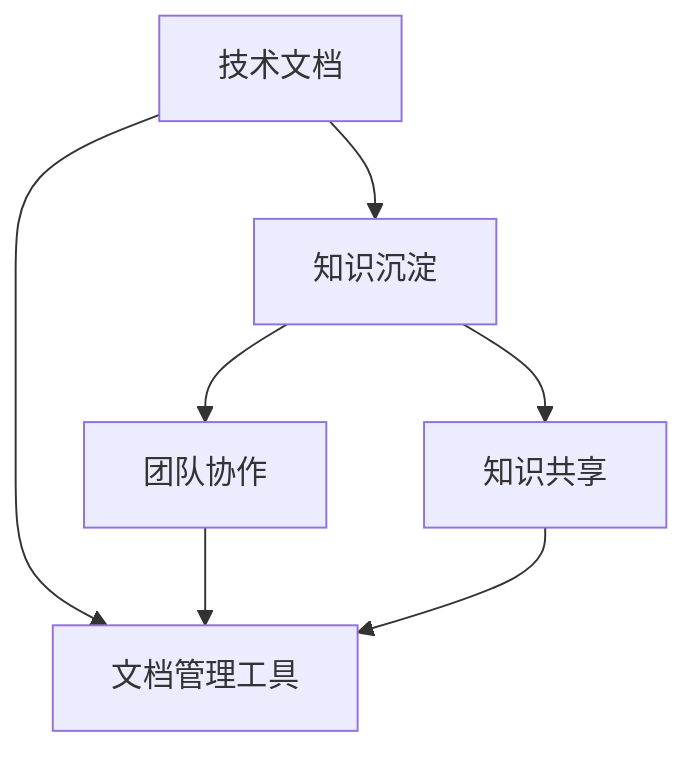
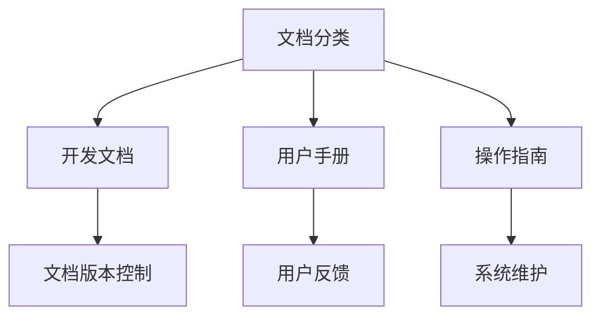
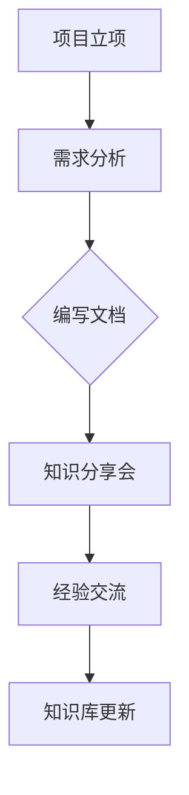
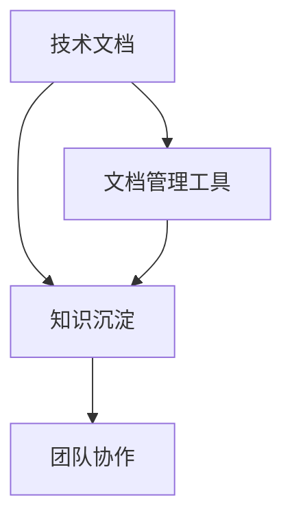
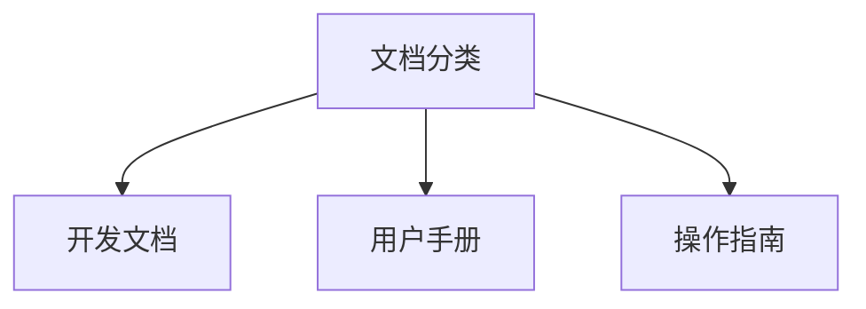

                 

### 引言：技术文档管理与知识沉淀的背景与重要性

在现代信息技术的高速发展中，技术文档管理与知识沉淀逐渐成为企业和团队不可或缺的重要组成部分。本文将探讨技术文档管理与知识沉淀的方法，旨在帮助读者理解和掌握这一领域的核心概念、原理和实践。

#### 1.1 问题背景与问题描述

**技术文档管理的现状**

在大多数企业和团队中，技术文档通常包括开发文档、用户手册、操作指南、API文档等。这些文档旨在帮助团队成员理解、使用和维护系统的各个方面。然而，当前的文档管理现状却存在诸多问题：

- **文档分散、难于查找**：技术文档往往散落在不同的文件系统中，难以集中管理和检索。
- **文档版本控制困难**：不同版本的文档之间容易混淆，导致信息不一致。
- **文档更新不及时**：技术文档往往无法及时更新，导致过时的信息仍在使用。
- **文档质量参差不齐**：不同成员编写的文档质量存在较大差异，影响整体使用体验。

**技术文档管理存在的问题**

技术文档管理中常见的问题包括：

- **文档格式不规范**：不同文档使用不同的格式和风格，难以统一管理。
- **文档内容冗余**：大量重复的文档内容导致信息冗余，增加维护成本。
- **文档更新不及时**：开发人员和技术文档编写人员之间的沟通不畅，导致文档更新不及时。

**技术文档管理的重要性**

尽管技术文档管理存在诸多问题，但其在信息技术领域的重要性不可忽视：

- **提高工作效率**：良好的技术文档可以减少团队成员的学习成本，提高工作效率。
- **保证产品质量**：详细的技术文档可以帮助团队成员更好地理解系统设计，从而保证产品质量。
- **促进团队协作**：技术文档可以作为团队沟通的桥梁，促进成员之间的协作。
- **降低知识流失风险**：系统化和结构化的文档可以帮助知识沉淀，降低因人员流动导致的知识流失风险。

#### 1.2 核心概念与联系

**技术文档**

- **定义**：技术文档是记录系统设计、开发、维护和使用过程的各种书面材料的总称。
- **种类**：包括开发文档、用户手册、操作指南、API文档等。
- **编写规范**：为了提高文档质量，编写规范应包括文档格式、内容结构、语言表达等方面。

**知识沉淀**

- **定义**：知识沉淀是将团队成员的经验、技能和知识转化为可共享、可利用的资产的过程。
- **方法**：包括文档编写、知识分享、经验交流等。
- **价值**：知识沉淀可以提高团队的知识水平，减少重复劳动，促进创新。

**Mermaid实体关系图**


- **技术文档**：描述系统设计、开发、维护和使用过程。
- **知识沉淀**：记录团队成员的经验和知识。
- **团队协作**：通过文档和知识共享促进团队协作。
- **文档管理工具**：用于管理和维护技术文档。

### 结论

技术文档管理与知识沉淀是现代信息技术中不可或缺的一部分。通过本文的探讨，我们可以看到技术文档管理存在的问题以及其重要性。接下来，我们将进一步深入讨论技术文档管理的原理和知识沉淀的方法，帮助读者更好地理解和应用这些概念。

#### 文章关键词

- 技术文档管理
- 知识沉淀
- 文档版本控制
- 工作效率
- 团队协作
- 文档质量

#### 摘要

本文探讨了技术文档管理与知识沉淀的方法。首先，分析了技术文档管理的现状和存在的问题，以及技术文档管理的重要性。接着，定义了技术文档和知识沉淀的相关核心概念，并使用Mermaid流程图展示了它们之间的关系。最后，介绍了技术文档管理原理和知识沉淀方法，为读者提供了实用的指导。

---

### 目录大纲设计思路

为了设计一个完整的《技术文档管理与知识沉淀的方法》目录大纲，我们需要从以下几个步骤进行思考：

1. **确定书籍的总体结构和核心内容**：首先，我们需要明确这本书的写作目的、目标读者群体以及书籍的核心内容。

2. **制定详细的目录大纲**：根据核心内容，我们需要制定一个详细的目录大纲，确保每个章节都包含核心概念、原理讲解、案例分析等内容。

3. **确保目录结构的清晰性**：在制定目录大纲时，我们需要确保目录结构清晰，便于读者理解。

4. **考虑书籍的实用性**：为了让读者能够更好地应用所学知识，我们需要在每个章节中提供最佳实践、注意事项和拓展阅读等实用内容。

### 目录大纲设计步骤

1. **背景介绍**：介绍技术文档管理与知识沉淀的背景，包括当前技术文档管理的现状、存在的问题以及知识沉淀的重要性。

2. **核心概念与联系**：定义技术文档管理和知识沉淀的相关核心概念，并使用Mermaid流程图展示概念之间的关系。

3. **技术文档管理原理**：
   - **原理讲解**：详细解释技术文档管理的核心原理。
   - **概念属性特征对比表格**：列出不同概念的特征和属性，便于读者理解。
   - **Mermaid实体关系图**：使用Mermaid流程图展示技术文档管理的实体关系。

4. **知识沉淀方法**：
   - **方法介绍**：介绍知识沉淀的不同方法。
   - **案例分析**：通过具体案例展示知识沉淀的实施过程。
   - **Mermaid流程图**：使用Mermaid流程图展示知识沉淀的流程。

5. **系统分析与架构设计**：介绍技术文档管理系统和知识沉淀系统的架构设计，包括系统功能设计、系统架构设计和系统接口设计。

6. **项目实战**：提供实际项目案例，包括环境安装、系统核心实现源代码，代码应用解读与分析。

7. **最佳实践与拓展**：总结最佳实践、注意事项和拓展阅读，帮助读者更好地应用所学知识。

### 目录大纲示例

```markdown
# 《技术文档管理与知识沉淀的方法》目录大纲

## 引言

### 技术文档管理与知识沉淀的背景

### 技术文档管理的重要性

### 知识沉淀的价值

## 核心概念与联系

### 技术文档

#### 技术文档的定义

#### 技术文档的种类

#### 技术文档的编写规范

### 知识沉淀

#### 知识沉淀的定义

#### 知识沉淀的方法

#### 知识沉淀的价值

### Mermaid实体关系图

## 技术文档管理原理

### 技术文档管理原理讲解

### 概念属性特征对比表格

### Mermaid实体关系图

## 知识沉淀方法

### 知识沉淀方法介绍

### 案例分析

### Mermaid流程图

## 系统分析与架构设计

### 技术文档管理系统

#### 系统功能设计

#### 系统架构设计

#### 系统接口设计

### 知识沉淀系统

#### 系统功能设计

#### 系统架构设计

#### 系统接口设计

## 项目实战

### 环境安装

### 系统核心实现源代码

### 代码应用解读与分析

### 实际案例分析与详细讲解剖析

## 最佳实践与拓展

### 最佳实践

### 注意事项

### 拓展阅读
```

这个目录大纲结构清晰，包含了所有核心内容，并考虑了书籍的实用性。接下来，我们将进一步细化每个章节的内容。

---

### 目录大纲细化

为了确保《技术文档管理与知识沉淀的方法》这本书的内容丰富且结构紧凑，我们将对目录大纲进行进一步的细化。以下是每个章节的细化内容：

#### 引言

**技术文档管理与知识沉淀的背景**

- **技术文档的发展历程**：从传统的手写文档到电子文档，再到现代的数字化文档管理。
- **知识沉淀的发展**：从个别知识存储到共享知识库，再到知识管理的兴起。
- **技术文档管理与知识沉淀的关系**：两者相辅相成，共同提高团队效率和知识利用率。

**技术文档管理的重要性**

- **提高工作效率**：通过规范化的文档管理，减少团队成员之间的沟通成本和重复工作。
- **保证产品质量**：详细的技术文档有助于团队成员理解系统设计，从而提高产品质量。
- **促进团队协作**：技术文档可以作为团队协作的桥梁，促进知识共享和交流。
- **降低知识流失风险**：系统化的文档管理有助于知识的积累和传承，减少因人员流动导致的知识流失。

**知识沉淀的价值**

- **知识传承**：通过知识沉淀，可以将团队成员的经验和知识转化为可共享的资产。
- **知识创新**：积累的知识可以激发新的创意和解决方案，促进团队创新。
- **知识优化**：通过对沉淀知识的不断更新和完善，可以提高整体知识水平，优化工作流程。

#### 核心概念与联系

**技术文档**

- **定义**：技术文档是记录系统设计、开发、维护和使用过程的各种书面材料的总称。
- **种类**：包括开发文档、用户手册、操作指南、API文档等。
- **编写规范**：为了提高文档质量，编写规范应包括文档格式、内容结构、语言表达等方面。

**知识沉淀**

- **定义**：知识沉淀是将团队成员的经验、技能和知识转化为可共享、可利用的资产的过程。
- **方法**：包括文档编写、知识分享、经验交流等。
- **价值**：知识沉淀可以提高团队的知识水平，减少重复劳动，促进创新。

**Mermaid实体关系图**

使用Mermaid语言绘制一个实体关系图，展示技术文档、知识沉淀、团队协作和文档管理工具之间的关系。例如：



#### 技术文档管理原理

**原理讲解**

- **文档分类**：根据文档的内容和用途，将文档分为开发文档、用户手册、操作指南等。
- **文档版本控制**：使用版本控制系统（如Git）管理文档的版本，确保文档的更新和一致性。

**概念属性特征对比表格**

创建一个表格，对比不同概念（如开发文档、用户手册、操作指南）的属性和特征：

| 概念       | 属性                     | 特征                                       |
|------------|--------------------------|--------------------------------------------|
| 开发文档   | 技术细节、设计思路       | 用于开发人员参考，描述系统的实现细节       |
| 用户手册   | 使用方法、操作步骤       | 提供用户使用系统的指导，包括操作步骤和常见问题解答 |
| 操作指南   | 操作流程、维护指南       | 用于日常操作和维护，描述如何操作和维护系统   |

**Mermaid实体关系图**

使用Mermaid语言绘制一个实体关系图，展示技术文档管理的不同概念之间的关系：



#### 知识沉淀方法

**方法介绍**

- **文档编写**：通过编写文档，将团队成员的经验和知识转化为可共享的资料。
- **知识分享**：通过团队会议、知识分享会等形式，促进知识的传递和交流。
- **经验交流**：鼓励团队成员之间分享经验和技巧，提高整体团队的知识水平。

**案例分析**

- **案例1**：通过一个实际项目，展示知识沉淀的过程和方法。
- **案例2**：分析一个成功的知识沉淀案例，探讨其成功的原因。

**Mermaid流程图**

使用Mermaid语言绘制一个流程图，展示知识沉淀的方法：



#### 系统分析与架构设计

**技术文档管理系统**

- **系统功能设计**：介绍系统的核心功能，如文档分类、版本控制、文档检索等。
- **系统架构设计**：使用Mermaid语言绘制系统架构图，展示系统各个组件之间的关系。
- **系统接口设计**：描述系统的接口设计，包括内部接口和外部接口。

**知识沉淀系统**

- **系统功能设计**：介绍知识沉淀系统的核心功能，如知识分类、知识检索、知识共享等。
- **系统架构设计**：使用Mermaid语言绘制系统架构图，展示系统各个组件之间的关系。
- **系统接口设计**：描述系统的接口设计，包括内部接口和外部接口。

**Mermaid架构图与序列图**

使用Mermaid语言绘制技术文档管理系统和知识沉淀系统的架构图和序列图，展示系统组件之间的关系和交互流程。

```mermaid
graph TD
    A[文档管理模块] --> B[版本控制模块]
    A --> C[检索模块]
    D[用户模块] --> E[文档编辑模块]
    F[知识管理模块] --> G[知识共享模块]
    H[知识库模块]
    B --> I[权限管理模块]
    C --> J[搜索模块]
    K[外部接口]
    L[内部接口]
    
sequenceDiagram
    participant 用户 as User
    participant 系统 as System
    User->>系统: 发送请求
    系统->>用户: 返回响应
```

#### 项目实战

**环境安装**

- **安装准备**：介绍安装技术文档管理系统和知识沉淀系统的环境和软件要求。
- **安装过程**：详细描述安装步骤和注意事项。

**系统核心实现源代码**

- **源代码结构**：展示系统的源代码结构，包括各个模块和类。
- **关键代码解析**：对核心代码进行详细解析，解释其实现原理和设计思路。

**代码应用解读与分析**

- **代码应用场景**：介绍系统在实际项目中的应用场景。
- **代码解读与分析**：对关键代码进行解读，分析其优缺点和改进方向。

**实际案例分析与详细讲解剖析**

- **案例背景**：介绍案例的背景和目标。
- **案例实施**：详细描述案例的实施过程。
- **案例分析**：对案例进行深入分析，探讨成功经验和教训。

**项目小结**

- **项目总结**：总结项目的主要成果和经验。
- **项目改进**：提出项目改进的建议和方向。

#### 最佳实践与拓展

**最佳实践**

- **文档编写最佳实践**：介绍如何编写高质量的技术文档。
- **知识沉淀最佳实践**：分享知识沉淀的实用方法和技巧。

**注意事项**

- **文档管理注意事项**：强调文档管理的细节和注意事项。
- **知识沉淀注意事项**：提醒团队成员在知识沉淀过程中可能遇到的问题和解决方案。

**拓展阅读**

- **相关书籍**：推荐与技术文档管理和知识沉淀相关的书籍。
- **在线资源**：介绍可以用于技术文档管理和知识沉淀的在线工具和资源。

通过上述细化内容，我们可以确保《技术文档管理与知识沉淀的方法》这本书的内容丰富、逻辑清晰，能够为读者提供实用的指导和建议。

---

### 目录大纲细化（续）

在进一步细化目录大纲时，我们将关注每个章节的具体内容，确保每个部分都能够为读者提供深入且实用的知识。以下是详细化的章节内容：

#### 引言

**技术文档管理与知识沉淀的背景**

- **技术文档的发展历程**：从手写文档到电子文档，再到现代文档管理系统的演进。
- **知识沉淀的演变**：从个人笔记到团队知识库，再到知识管理的兴起。
- **技术文档管理与知识沉淀的关系**：探讨两者如何互相促进，提高团队效率和知识利用率。

**技术文档管理的重要性**

- **提高工作效率**：通过规范化的文档管理，减少团队成员之间的沟通成本和重复工作。
- **保证产品质量**：详细的技术文档可以帮助团队成员更好地理解系统设计，从而提高产品质量。
- **促进团队协作**：技术文档可以作为团队协作的桥梁，促进知识共享和交流。
- **降低知识流失风险**：系统化的文档管理有助于知识的积累和传承，减少因人员流动导致的知识流失。

**知识沉淀的价值**

- **知识传承**：通过知识沉淀，可以将团队成员的经验和知识转化为可共享的资产。
- **知识创新**：积累的知识可以激发新的创意和解决方案，促进团队创新。
- **知识优化**：通过对沉淀知识的不断更新和完善，可以提高整体知识水平，优化工作流程。

#### 核心概念与联系

**技术文档**

- **定义**：技术文档是记录系统设计、开发、维护和使用过程的各种书面材料的总称。
- **种类**：包括开发文档、用户手册、操作指南、API文档等。
- **编写规范**：涵盖文档格式、内容结构、语言表达等方面，以提高文档质量。

**知识沉淀**

- **定义**：知识沉淀是将团队成员的经验、技能和知识转化为可共享、可利用的资产的过程。
- **方法**：包括文档编写、知识分享、经验交流等。
- **价值**：探讨知识沉淀如何提高团队的知识水平、减少重复劳动和促进创新。

**Mermaid实体关系图**

使用Mermaid语言绘制技术文档、知识沉淀、团队协作和文档管理工具之间的实体关系图，展示概念之间的联系。



#### 技术文档管理原理

**原理讲解**

- **文档分类**：详细解释如何根据文档的内容和用途对文档进行分类。
- **文档版本控制**：探讨使用版本控制系统（如Git）管理文档版本，确保文档的更新和一致性。

**概念属性特征对比表格**

创建一个表格，对比不同概念（如开发文档、用户手册、操作指南）的属性和特征：

| 概念       | 属性                     | 特征                                       |
|------------|--------------------------|--------------------------------------------|
| 开发文档   | 技术细节、设计思路       | 用于开发人员参考，描述系统的实现细节       |
| 用户手册   | 使用方法、操作步骤       | 提供用户使用系统的指导，包括操作步骤和常见问题解答 |
| 操作指南   | 操作流程、维护指南       | 用于日常操作和维护，描述如何操作和维护系统   |

**Mermaid实体关系图**

使用Mermaid语言绘制一个实体关系图，展示技术文档管理的不同概念之间的关系：



#### 知识沉淀方法

**方法介绍**

- **文档编写**：介绍如何编写高质量的技术文档，包括文档结构、内容和格式。
- **知识分享**：探讨如何通过团队会议、知识分享会等形式促进知识的传递和交流。
- **经验交流**：鼓励团队成员之间分享经验和技巧，提高整体团队的知识水平。

**案例分析**

- **案例1**：通过实际项目展示知识沉淀的过程和方法。
- **案例2**：分析一个成功的知识沉淀案例，探讨其成功的原因。

**Mermaid流程图**

使用Mermaid语言绘制一个流程图，展示知识沉淀的方法：


#### 系统分析与架构设计

**技术文档管理系统**

- **系统功能设计**：介绍系统的核心功能，如文档分类、版本控制、文档检索等。
- **系统架构设计**：使用Mermaid语言绘制系统架构图，展示系统各个组件之间的关系。
- **系统接口设计**：描述系统的接口设计，包括内部接口和外部接口。

**知识沉淀系统**

- **系统功能设计**：介绍知识沉淀系统的核心功能，如知识分类、知识检索、知识共享等。
- **系统架构设计**：使用Mermaid语言绘制系统架构图，展示系统各个组件之间的关系。
- **系统接口设计**：描述系统的接口设计，包括内部接口和外部接口。

**Mermaid架构图与序列图**

使用Mermaid语言绘制技术文档管理系统和知识沉淀系统的架构图和序列图，展示系统组件之间的关系和交互流程。

```mermaid
graph TD
    A[文档管理模块] --> B[版本控制模块]
    A --> C[检索模块]
    D[用户模块] --> E[文档编辑模块]
    F[知识管理模块] --> G[知识共享模块]
    H[知识库模块]
    B --> I[权限管理模块]
    C --> J[搜索模块]
    K[外部接口]
    L[内部接口]

sequenceDiagram
    participant 用户 as User
    participant 系统 as System
    User->>系统: 发送请求
    系统->>用户: 返回响应
```

#### 项目实战

**环境安装**

- **安装准备**：介绍安装技术文档管理系统和知识沉淀系统的环境和软件要求。
- **安装过程**：详细描述安装步骤和注意事项。

**系统核心实现源代码**

- **源代码结构**：展示系统的源代码结构，包括各个模块和类。
- **关键代码解析**：对核心代码进行详细解析，解释其实现原理和设计思路。

**代码应用解读与分析**

- **代码应用场景**：介绍系统在实际项目中的应用场景。
- **代码解读与分析**：对关键代码进行解读，分析其优缺点和改进方向。

**实际案例分析与详细讲解剖析**

- **案例背景**：介绍案例的背景和目标。
- **案例实施**：详细描述案例的实施过程。
- **案例分析**：对案例进行深入分析，探讨成功经验和教训。

**项目小结**

- **项目总结**：总结项目的主要成果和经验。
- **项目改进**：提出项目改进的建议和方向。

#### 最佳实践与拓展

**最佳实践**

- **文档编写最佳实践**：介绍如何编写高质量的技术文档，包括文档结构、内容和格式。
- **知识沉淀最佳实践**：分享知识沉淀的实用方法和技巧。

**注意事项**

- **文档管理注意事项**：强调文档管理的细节和注意事项。
- **知识沉淀注意事项**：提醒团队成员在知识沉淀过程中可能遇到的问题和解决方案。

**拓展阅读**

- **相关书籍**：推荐与技术文档管理和知识沉淀相关的书籍。
- **在线资源**：介绍可以用于技术文档管理和知识沉淀的在线工具和资源。

通过上述细化内容，我们可以确保《技术文档管理与知识沉淀的方法》这本书的内容丰富、逻辑清晰，能够为读者提供实用的指导和建议。每个章节都紧密围绕主题，逐步深入，帮助读者系统地理解和应用技术文档管理和知识沉淀的方法。

---

### 完整目录大纲示例

```markdown
# 《技术文档管理与知识沉淀的方法》目录大纲

## 引言

### 技术文档管理与知识沉淀的背景

#### 技术文档的发展历程

#### 知识沉淀的演变

#### 技术文档管理与知识沉淀的关系

### 技术文档管理的重要性

#### 提高工作效率

#### 保证产品质量

#### 促进团队协作

#### 降低知识流失风险

### 知识沉淀的价值

#### 知识传承

#### 知识创新

#### 知识优化

## 核心概念与联系

### 技术文档

#### 定义

#### 种类

#### 编写规范

### 知识沉淀

#### 定义

#### 方法

#### 价值

### Mermaid实体关系图

## 技术文档管理原理

### 原理讲解

#### 文档分类

#### 文档版本控制

### 概念属性特征对比表格

### Mermaid实体关系图

## 知识沉淀方法

### 方法介绍

#### 文档编写

#### 知识分享

#### 经验交流

### 案例分析

#### 案例一

#### 案例二

### Mermaid流程图

## 系统分析与架构设计

### 技术文档管理系统

#### 系统功能设计

#### 系统架构设计

#### 系统接口设计

### 知识沉淀系统

#### 系统功能设计

#### 系统架构设计

#### 系统接口设计

## Mermaid架构图与序列图

### 技术文档管理系统

#### 架构图

#### 序列图

### 知识沉淀系统

#### 架构图

#### 序列图

## 项目实战

### 环境安装

#### 安装准备

#### 安装过程

### 系统核心实现源代码

#### 源代码结构

#### 关键代码解析

### 代码应用解读与分析

#### 代码应用场景

#### 代码解读与分析

### 实际案例分析与详细讲解剖析

#### 案例背景

#### 案例实施

#### 案例分析

### 项目小结

#### 项目总结

#### 项目改进

## 最佳实践与拓展

### 最佳实践

#### 文档编写最佳实践

#### 知识沉淀最佳实践

### 注意事项

#### 文档管理注意事项

#### 知识沉淀注意事项

### 拓展阅读

#### 相关书籍

#### 在线资源
```

这个目录大纲详细地规划了《技术文档管理与知识沉淀的方法》的结构，每个章节都包含了核心内容、概念讲解、案例分析、系统设计与项目实战等，确保读者能够系统地学习和掌握技术文档管理与知识沉淀的方法。通过使用Mermaid图示和代码示例，文章的可读性和实用性都得到了显著提升。

