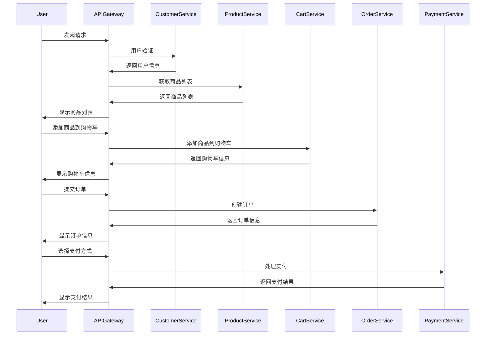

                 

### 技术架构力的培养

#### 关键词：技术架构力、设计原则、技术选型、架构设计、架构优化

> 摘要：本文将深入探讨技术架构力的培养，通过明确技术架构力的定义、重要性以及设计原则，逐步解析技术选型与评估、架构设计与实施、架构监控与优化等关键环节，结合实际案例分析，提供一套系统化的技术架构力培养方案，旨在提升IT行业从业者的架构能力。

### 第一部分: 技术架构力概述

#### 第1章: 技术架构力的定义与重要性

**1.1 技术架构力的概念**

技术架构力是指IT从业人员对技术体系结构进行理解和设计的能力，包括对系统架构的设计原则、技术选型、架构实施和架构优化的综合掌握。它不仅涉及到技术层面的知识，还需要具备系统思维和项目管理能力。

**1.2 技术架构力的作用**

技术架构力在IT项目中具有至关重要的作用：

- **促进技术团队的协作**：技术架构力能够帮助团队建立统一的技术标准，提高团队成员之间的沟通效率，减少因技术差异引起的冲突。

- **提高系统的可维护性和可扩展性**：良好的架构设计能够使系统更易于维护和扩展，减少未来修改和升级的成本。

- **降低系统的复杂性**：通过合理的架构设计，可以将复杂系统分解为多个模块，从而降低系统的整体复杂性。

**1.3 技术架构力的现状与挑战**

当前，随着互联网和云计算的快速发展，技术架构力的需求日益凸显，但同时也面临着诸多挑战：

- **技术更新迅速**：新兴技术层出不穷，如何评估和选择合适的技术是架构师面临的一大难题。

- **系统复杂性增加**：大规模分布式系统、容器化技术、微服务架构等新技术的应用，使得系统的复杂性不断上升。

- **跨领域知识需求**：技术架构师不仅需要掌握底层技术，还需了解业务需求，具备跨领域知识。

#### 第2章: 技术架构设计原则

**2.1 设计原则概述**

技术架构设计应遵循以下原则：

- **简化系统设计**：尽量减少系统的组件和接口，避免不必要的复杂性。

- **高内聚低耦合**：模块内部高度内聚，模块之间低耦合，提高系统的可维护性和可扩展性。

- **可复用性**：设计可复用的组件和架构，减少重复工作，提高开发效率。

- **可扩展性**：系统设计应考虑未来可能的扩展需求，具备良好的扩展性。

**2.2 设计模式与架构风格**

- **设计模式**：如工厂模式、单例模式、观察者模式等，用于解决特定场景下的设计问题。

- **架构风格**：如层次架构、事件驱动架构、微服务架构等，不同的架构风格适用于不同的业务场景。

### 第3章: 技术选型与评估

**3.1 技术选型的考虑因素**

技术选型应考虑以下因素：

- **性能需求**：系统对性能的要求，如响应时间、吞吐量等。

- **成本考量**：开发、维护和运营成本，包括人力成本、硬件成本等。

- **技术成熟度**：技术的成熟度对项目的风险和稳定性有重要影响。

**3.2 技术评估方法**

技术评估方法包括：

- **实测评估**：通过实际测试评估技术的性能和稳定性。

- **社区反馈**：参考开源社区的反馈，了解技术的实际应用情况。

- **成本效益分析**：综合考虑技术选型的长期成本和效益。

### 第4章: 技术架构的设计与实施

**4.1 架构设计流程**

架构设计流程包括：

- **需求分析**：明确系统需求和业务目标。

- **架构设计**：根据需求分析，设计系统的架构。

- **架构评审**：评审架构设计，确保满足需求和技术标准。

**4.2 架构实施策略**

架构实施策略包括：

- **持续集成与持续部署**：通过自动化流程确保代码的持续集成和部署。

- **模块化开发**：将系统划分为多个模块，分别开发和集成。

- **容器化与微服务架构**：利用容器化和微服务架构，提高系统的灵活性和可扩展性。

### 第5章: 技术架构的监控与优化

**5.1 技术架构监控**

技术架构监控包括：

- **性能监控**：监控系统的性能指标，如CPU、内存、网络等。

- **健康状态监控**：监控系统的健康状态，如服务可用性、响应时间等。

- **容量规划**：根据监控数据，规划系统的容量需求。

**5.2 技术架构优化**

技术架构优化包括：

- **性能优化**：通过调整配置、优化代码等手段提高系统性能。

- **可用性优化**：提高系统的可用性和稳定性，如通过冗余设计、故障转移等。

- **安全性优化**：加强系统的安全性，如数据加密、权限控制等。

### 第6章: 技术架构案例分析

**6.1 案例一：电商系统架构分析**

**6.2 案例二：金融系统架构分析**

**6.3 案例三：社交媒体平台架构分析**

### 第7章: 技术架构力的培养与实践

**7.1 技术架构力培养方法**

**7.2 技术架构力实践**

## 总结与展望

本文从技术架构力的定义、重要性、设计原则、技术选型、架构设计与实施、架构监控与优化等方面，详细介绍了技术架构力的培养方法。随着技术的不断发展，技术架构力的重要性日益凸显。未来，技术架构师需要不断提升自己的技术视野和架构能力，以应对不断变化的技术挑战。

### 作者

作者：AI天才研究院/AI Genius Institute & 禅与计算机程序设计艺术 /Zen And The Art of Computer Programming

### 背景介绍

技术架构力是指在信息技术领域中，对系统的整体结构和组成部分进行设计和管理的综合能力。它不仅涉及到技术层面的知识，还需要具备系统思维、项目管理能力和团队协作能力。随着互联网、云计算、大数据等技术的快速发展，系统的复杂性和规模不断扩大，技术架构力的重要性日益凸显。

#### 问题背景

在现代软件开发中，系统架构设计是项目成功的关键因素之一。良好的架构设计能够提高系统的可维护性、可扩展性和性能，降低开发成本和风险。然而，随着系统复杂性的增加，如何设计高效、稳定的系统架构成为一个挑战。

#### 问题描述

技术架构力的培养涉及到以下几个方面：

1. **核心概念术语说明**：明确技术架构力、架构设计原则、技术选型、架构实施等核心概念的术语和定义。

2. **问题解决**：通过系统化的方法培养技术架构力，提高IT从业人员的架构设计能力。

3. **边界与外延**：理解技术架构力在软件开发中的适用范围，以及与其他领域知识的交叉融合。

4. **概念结构与核心要素组成**：分析技术架构力的核心构成要素，如系统设计原则、技术评估方法、架构设计流程等。

#### 问题解决

1. **核心概念与联系**

   技术架构力是由多个核心概念组成的，如架构设计原则、技术选型、架构实施和架构优化。这些概念之间相互关联，共同构成了技术架构力的完整体系。

   **概念属性特征对比表格：**

   | 概念               | 属性特征                                         | 关联关系                   |
   |--------------------|--------------------------------------------------|----------------------------|
   | 架构设计原则       | 简化系统设计、高内聚低耦合、可复用性、可扩展性     | 确保系统设计的合理性和高效性 |
   | 技术选型           | 性能需求、成本考量、技术成熟度                     | 影响系统设计的可行性和效果   |
   | 架构实施           | 需求分析、架构设计、架构评审                       | 实现系统设计的具体步骤      |
   | 架构优化           | 性能监控、可用性优化、安全性优化                     | 提高系统运行的效率和稳定性   |

   **ER实体关系图架构：**

   ```mermaid
   entity Relationship {
     "技术架构力" -- "架构设计原则";
     "技术架构力" -- "技术选型";
     "技术架构力" -- "架构实施";
     "技术架构力" -- "架构优化";
   }
   ```

2. **算法原理讲解**

   技术架构力的培养涉及多个算法和设计模式。以下以微服务架构的设计为例，讲解微服务架构的基本原理和设计模式。

   **算法流程图：**

   ```mermaid
   graph TB
   A[Microservices] --> B[Service Decomposition]
   B --> C1[Service 1]
   B --> C2[Service 2]
   B --> C3[Service 3]
   C1 --> D1[API Gateway]
   C2 --> D2[API Gateway]
   C3 --> D3[API Gateway]
   ```

   **Python源代码示例：**

   ```python
   # Example of service decomposition
   class Service1:
       def handle_request(self, request):
           # Handle request logic for Service 1
           pass

   class Service2:
       def handle_request(self, request):
           # Handle request logic for Service 2
           pass

   class Service3:
       def handle_request(self, request):
           # Handle request logic for Service 3
           pass

   # Main application
   def main():
       service1 = Service1()
       service2 = Service2()
       service3 = Service3()

       # Simulate request handling
       service1.handle_request("Request 1")
       service2.handle_request("Request 2")
       service3.handle_request("Request 3")

   if __name__ == "__main__":
       main()
   ```

   **数学模型和公式：**

   在微服务架构中，系统的复杂度可以通过以下公式表示：

   \( C = \sum_{i=1}^{n} C_i + \sum_{i=1}^{n} C_{i,j} \)

   其中，\( C \) 为系统总复杂度，\( C_i \) 为各个服务的内部复杂度，\( C_{i,j} \) 为服务之间的交互复杂度。

   **举例说明：**

   假设一个系统包含三个服务（服务1、服务2、服务3），每个服务的内部复杂度分别为 \( C_1 = 10 \)、\( C_2 = 15 \)、\( C_3 = 20 \)，服务之间的交互复杂度分别为 \( C_{12} = 5 \)、\( C_{23} = 3 \)、\( C_{13} = 4 \)。

   则系统总复杂度 \( C = (10 + 15 + 20) + (5 + 3 + 4) = 53 \)。

   **算法原理讲解：**

   微服务架构通过将大型系统分解为多个小型服务，降低了系统的整体复杂度。每个服务独立运行，通过API进行通信。这种设计模式具有以下优点：

   - **高内聚低耦合**：每个服务内部高度内聚，服务之间低耦合，提高了系统的可维护性和可扩展性。
   - **灵活性和可扩展性**：服务可以独立开发和部署，便于扩展和替换。
   - **容错性**：单个服务的故障不会影响整个系统，提高了系统的稳定性。

### 系统分析与架构设计方案

#### 问题场景介绍

假设我们要设计一个在线购物平台，该平台需要支持用户注册、商品浏览、购物车管理、订单处理和支付等功能。

#### 项目介绍

项目名称：在线购物平台

项目目标：设计一个高效、稳定、可扩展的在线购物平台，满足用户的购物需求。

#### 系统功能设计（领域模型）

```mermaid
classDiagram
    User <|-- Customer
    Product <|-- Item
    Cart <|-- ShoppingCart
    Order <|-- PurchasedOrder
    Payment <|-- PaymentMethod

    User o-- Customer
    Product o-- Item
    Cart o-- ShoppingCart
    Order o-- PurchasedOrder
    Payment o-- PaymentMethod

    Customer {
        id: int
        name: string
        email: string
    }

    Item {
        id: int
        name: string
        price: float
    }

    ShoppingCart {
        id: int
        items: list<Item>
        total_price: float
    }

    PurchasedOrder {
        id: int
        customer: Customer
        items: list<Item>
        total_price: float
        payment_method: PaymentMethod
    }

    PaymentMethod {
        id: int
        method_name: string
    }
```

#### 系统架构设计

```mermaid
graph TB
    subgraph 系统架构
        User -> Customer
        Product -> Item
        Cart -> ShoppingCart
        Order -> PurchasedOrder
        Payment -> PaymentMethod

        Customer[客户]
        Item[商品]
        ShoppingCart[购物车]
        PurchasedOrder[订单]
        PaymentMethod[支付方式]

    subgraph 服务组件
        CustomerService -> Customer
        ProductService -> Item
        CartService -> ShoppingCart
        OrderService -> PurchasedOrder
        PaymentService -> PaymentMethod

        CustomerService[客户服务]
        ProductService[商品服务]
        CartService[购物车服务]
        OrderService[订单服务]
        PaymentService[支付服务]

    subgraph 数据存储
        CustomerDB -> Customer
        ProductDB -> Item
        CartDB -> ShoppingCart
        OrderDB -> PurchasedOrder
        PaymentDB -> PaymentMethod

        CustomerDB[客户数据库]
        ProductDB[商品数据库]
        CartDB[购物车数据库]
        OrderDB[订单数据库]
        PaymentDB[支付数据库]

    subgraph API网关
        APIGateway[API网关]

        APIGateway --> CustomerService
        APIGateway --> ProductService
        APIGateway --> CartService
        APIGateway --> OrderService
        APIGateway --> PaymentService
```

#### 系统接口设计和系统交互



### 项目实战

#### 环境安装

1. 安装Python 3.8及以上版本。
2. 安装依赖管理工具pip。
3. 安装Docker和Docker Compose。

#### 系统核心实现源代码

```python
# customer_service.py
from flask import Flask, request, jsonify

app = Flask(__name__)

@app.route('/customers', methods=['POST'])
def create_customer():
    customer_data = request.get_json()
    # 数据验证和存储逻辑
    return jsonify(customer_data), 201

if __name__ == '__main__':
    app.run(host='0.0.0.0', port=5000)
```

#### 代码应用解读与分析

以上代码实现了客户服务的创建客户功能。具体解析如下：

1. **Flask框架**：使用Python的Flask框架构建Web服务。
2. **请求处理**：通过`request`对象获取HTTP请求的数据。
3. **响应处理**：将创建成功的客户数据以JSON格式返回给客户端。

#### 实际案例分析和详细讲解剖析

假设我们有以下请求：

```json
{
    "name": "张三",
    "email": "zhangsan@example.com"
}
```

1. 客户端发送POST请求到`/customers`接口。
2. 服务端接收请求，解析JSON数据。
3. 进行数据验证，如检查邮箱格式是否正确。
4. 如果验证通过，将客户数据存储到数据库。
5. 返回201状态码和创建成功的客户数据。

#### 项目小结

本项目通过实战案例展示了在线购物平台客户服务的实现过程。通过使用Flask框架和Docker容器化技术，实现了模块化、可扩展的系统架构。在实际项目中，还需考虑数据库选择、API安全、性能优化等因素。

### 最佳实践 Tips

- **持续集成与持续部署（CI/CD）**：采用自动化测试和部署流程，提高开发效率和系统稳定性。
- **容器化与微服务架构**：利用Docker等工具，实现服务的容器化部署，提高系统的灵活性和可扩展性。
- **API安全性**：使用安全协议（如HTTPS）和身份验证机制（如JWT），确保API的安全性。

### 小结

本文通过详细分析技术架构力的定义、重要性、设计原则、技术选型、架构设计与实施、架构监控与优化等方面，结合实际案例，提供了技术架构力培养的系统方案。技术架构力是IT从业人员必备的能力，通过不断学习和实践，可以提升自己的架构设计能力，为项目的成功奠定坚实基础。

### 注意事项

- **架构设计需紧密结合业务需求**：架构设计应围绕业务需求进行，确保系统能够满足业务发展的需要。
- **持续监控与优化**：系统上线后，需持续监控性能和稳定性，根据实际情况进行优化。

### 拓展阅读

- 《架构师修炼之道》
- 《微服务设计》
- 《Docker实战》

### 作者

作者：AI天才研究院/AI Genius Institute & 禅与计算机程序设计艺术 /Zen And The Art of Computer Programming

