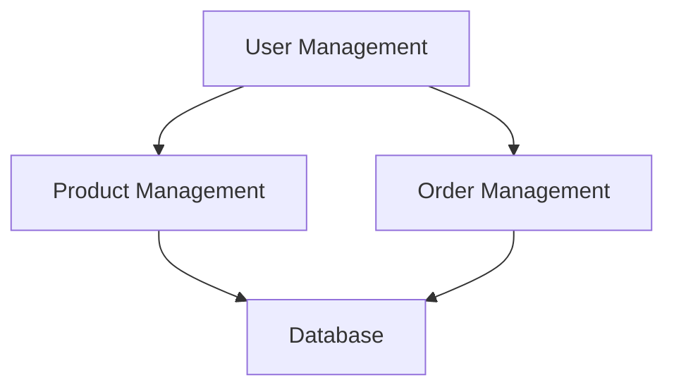

                 

### 引言与背景

在现代企业的快速成长中，技术架构的演变已成为一个不可或缺的部分。随着互联网、大数据、云计算和物联网等新兴技术的蓬勃发展，企业业务模型也在不断地演进。这种业务模型的快速变化，对技术架构提出了更高的要求。如何有效地构建、演进和维护技术架构，以应对业务快速增长的挑战，成为了众多企业所面临的核心问题。

**核心概念术语说明：**

- **技术架构**：技术架构是指一个系统或产品在技术层面上的结构设计，包括软件架构、硬件架构、数据架构和通信架构等。
- **业务增长**：业务增长是指企业在一定时间内，通过市场拓展、产品创新或运营优化等手段，实现的收入、客户数量或市场份额的增长。
- **架构演进**：架构演进是指技术架构根据业务需求的变化，逐步改进和优化的过程。

**问题背景：**

随着企业的不断发展，其业务需求和规模会迅速扩大。在这个过程中，技术架构需要不断地适应和优化，以支持业务的快速迭代和发展。然而，传统的技术架构往往在应对快速变化的需求时显得力不从心，可能导致系统性能下降、扩展性不足、维护难度增加等问题。

**问题描述：**

技术架构在业务快速增长的挑战中，主要面临以下几个问题：

1. **扩展性问题**：业务增长导致系统访问量激增，需要技术架构具备良好的扩展性，以应对大量用户同时访问的情况。
2. **稳定性问题**：随着业务规模的增长，系统的稳定性和可靠性要求越来越高，任何故障都可能对业务造成严重影响。
3. **维护性问题**：技术架构的复杂性不断增加，维护和升级的难度也随之上升，这对团队的技术能力和运维管理提出了更高的要求。
4. **安全性问题**：随着业务场景的复杂化，系统的安全性也需要不断加强，以防范各种潜在的安全威胁。

**问题解决：**

为了解决上述问题，企业需要采取一系列措施，包括：

1. **架构设计原则的遵循**：在设计技术架构时，遵循模块化、解耦、高内聚等原则，以提高系统的灵活性和可扩展性。
2. **持续架构演进**：通过持续集成、持续交付等敏捷开发方法，不断优化和改进技术架构，以适应业务需求的变化。
3. **引入微服务架构**：微服务架构可以将大型系统拆分为多个独立的服务，提高系统的可扩展性和维护性。
4. **技术选型的多样性**：根据不同的业务需求，选择合适的技术栈和工具，以实现最佳的技术方案。

**边界与外延：**

本文将探讨技术架构在应对业务快速增长的挑战中的具体实践和方法，重点关注以下几个方面：

- 技术架构的演进过程
- 业务增长对技术架构的影响
- 架构设计原则与最佳实践
- 项目案例研究

通过上述内容的讨论，本文旨在为企业提供一套完整的技术架构演进方法论，以帮助其在业务快速增长的背景下，构建稳定、高效、可扩展的技术架构。

**概念结构与核心要素组成：**

1. **技术架构的演进过程**：包括初期架构设计、中期架构演进和后期架构优化等阶段。
2. **业务增长对技术架构的影响**：分析业务需求变化对技术架构带来的挑战和机遇。
3. **架构设计原则**：如模块化、解耦、高内聚等，以及具体的设计方法和实践。
4. **最佳实践**：包括微服务架构、技术选型多样性、持续架构演进等。

通过以上分析，我们可以看到技术架构在业务快速增长的背景下，扮演着至关重要的角色。本文接下来将深入探讨技术架构演进的各个阶段，以及如何有效地应对业务增长带来的挑战。

### 核心概念与联系

在探讨技术架构演进的过程中，我们需要理解几个核心概念，包括其原理、属性特征，并比较它们之间的异同。以下是关于技术架构的一些关键概念及其关系：

**1. 架构设计与业务模型的关系**

**原理**：架构设计是确保系统能够有效支持业务模型的关键。业务模型描述企业的业务流程、业务规则和业务目标，而架构设计则通过技术手段实现这些业务模型。

**属性特征对比表格**：

| 特征        | 业务模型 | 架构设计 |
|-------------|----------|----------|
| 目标        | 实现商业目标 | 提高系统性能、稳定性和扩展性 |
| 描述        | 业务流程和业务规则 | 技术组件、模块和接口设计 |
| 可变性与稳定性 | 易变，需持续更新 | 相对稳定，需适度调整以适应业务变化 |

**ER实体关系图架构**：

```mermaid
erDiagram
  Customer ||--o{ Order }|
  Product ||--o{ Order }|
  Order ||--|{ OrderDetail }|
  Customer ||--|{ CustomerAddress }|
```

在这个ER图中，客户（Customer）与订单（Order）和产品（Product）之间存在关联关系，订单又包含订单详情（OrderDetail），客户还与客户地址（CustomerAddress）关联。

**2. 技术选型与架构设计的关系**

**原理**：技术选型是架构设计中的一个重要环节，不同的技术选型会对架构的设计和实现带来不同的影响。技术选型需要根据业务需求、性能要求、维护成本等因素进行综合考虑。

**属性特征对比表格**：

| 特征        | 技术选型 | 架构设计 |
|-------------|----------|----------|
| 目标        | 满足特定技术需求 | 确保系统整体性能和稳定性 |
| 影响因素    | 业务需求、性能要求、成本 | 技术栈、框架、工具 |
| 可选范围    | 语言、数据库、中间件、云计算服务 | 模块化、解耦、高内聚 |

**3. 持续集成与架构设计的关系**

**原理**：持续集成是一种软件开发实践，通过自动化构建、测试和部署，确保代码库中的每个提交都是可集成和可运行的。持续集成与架构设计紧密相关，它能够帮助快速发现和解决问题，确保架构的稳定性和一致性。

**属性特征对比表格**：

| 特征        | 持续集成 | 架构设计 |
|-------------|----------|----------|
| 目标        | 提高开发效率和代码质量 | 提高系统性能和稳定性 |
| 实践方法    | 自动化构建、测试、部署 | 模块化、解耦、高内聚 |
| 影响因素    | 代码质量、团队协作、架构设计 | 技术栈、框架、工具 |

**4. 微服务架构与单体架构的关系**

**原理**：微服务架构是一种将大型应用程序拆分为多个小型、独立服务的架构风格，每个服务都有自己的业务逻辑、数据库和API。与单体架构相比，微服务架构具有更好的灵活性和可扩展性。

**属性特征对比表格**：

| 特征        | 微服务架构 | 单体架构 |
|-------------|------------|----------|
| 系统结构    | 小型、独立服务 | 单一、大型系统 |
| 扩展性      | 高         | 低       |
| 可维护性    | 高         | 低       |
| 负载均衡    | 易实现       | 难实现    |

**5. 持续演进与架构设计的关系**

**原理**：持续演进是一种不断优化技术架构的方法，通过定期评估和改进架构，确保其能够持续适应业务需求的变化。持续演进与架构设计密不可分，是确保架构长期有效的重要手段。

**属性特征对比表格**：

| 特征        | 持续演进 | 架构设计 |
|-------------|----------|----------|
| 目标        | 提高系统性能和稳定性 | 设计高效、灵活的架构 |
| 实践方法    | 定期评估、改进 | 设计原则、最佳实践 |
| 影响因素    | 业务需求变化、技术进步 | 团队协作、技术选型 |

通过以上核心概念及其联系的探讨，我们可以更好地理解技术架构在应对业务快速增长的挑战中的重要作用。这些核心概念不仅是架构设计的基础，也是实现技术架构持续演进的基石。接下来，我们将进一步深入探讨技术架构的演进过程，以及业务增长如何影响技术架构的设计和实现。

### 技术架构演进过程

技术架构的演进是一个动态的过程，它随着业务需求的变化和技术发展的演进而不断调整和优化。一般来说，技术架构的演进可以分为初期架构设计、中期架构演进和后期架构优化三个主要阶段。每个阶段都有其特定的目标和挑战，下面我们详细分析这些阶段。

#### 初期架构设计

**目标**：初期架构设计的主要目标是构建一个能够支持业务需求的基础架构，确保系统能够顺利启动并满足基本功能。

**设计原则**：

1. **模块化**：将系统拆分为多个模块，每个模块负责独立的功能，提高系统的可维护性和扩展性。
2. **解耦**：模块之间采用松耦合设计，减少模块间的直接依赖，提高系统的灵活性和可扩展性。
3. **高内聚**：确保每个模块内部的功能高度相关，提高模块的独立性和可靠性。

**实际案例**：

以一个电商平台为例，初期架构设计可能包括用户管理模块、商品管理模块、订单管理模块等。每个模块都有自己的数据库和API接口，通过RESTful API进行通信。

**架构图**：



#### 中期架构演进

**目标**：中期架构演进的目标是提升系统的性能和扩展性，以应对业务需求的快速增长。

**演进策略与方法**：

1. **引入微服务架构**：将单体架构拆分为多个微服务，每个微服务负责特定的业务功能，以提高系统的灵活性和可扩展性。
2. **分布式架构**：采用分布式架构，通过分布式数据库、缓存和消息队列等技术，提高系统的并发处理能力和数据存储能力。
3. **负载均衡**：通过负载均衡技术，将用户请求分发到多个节点，提高系统的响应速度和处理能力。

**实际案例**：

在电商平台的中期架构演进中，用户管理模块可能拆分为用户服务、认证服务、用户统计服务等，每个服务都是独立的微服务，通过API网关进行统一管理。

**架构图**：

```mermaid
graph TB
    API Gateway --> User Service
    API Gateway --> Auth Service
    API Gateway --> Stats Service
    User Service --> Database
    Auth Service --> Database
    Stats Service --> Database
```

#### 后期架构优化

**目标**：后期架构优化的目标是进一步提高系统的稳定性和可维护性，同时减少运维成本。

**优化措施**：

1. **自动化运维**：通过自动化工具进行部署、监控和故障恢复，提高运维效率。
2. **服务网格**：引入服务网格技术，如Istio或Linkerd，对微服务进行流量管理和安全控制。
3. **云原生架构**：采用容器化和Kubernetes等云原生技术，提高系统的弹性和可扩展性。

**实际案例**：

在电商平台的后期架构优化中，可能引入Kubernetes进行容器化部署，使用Istio进行服务网格管理，提高系统的稳定性和可扩展性。

**架构图**：

```mermaid
graph TB
    Kubernetes Cluster --> Deployment
    Kubernetes Cluster --> Service Mesh
    Deployment --> Pods
    Service Mesh --> Traffic Management
```

通过这三个阶段的演进，技术架构能够逐步适应业务快速增长的挑战，保持系统的稳定性和高效性。接下来，我们将进一步探讨业务增长对技术架构的具体影响，以及如何通过架构设计来应对这些挑战。

### 业务增长对技术架构的影响

业务增长对技术架构的影响是多层次且深远的。随着业务需求的不断增加，系统的复杂性也在逐步提升，这对技术架构的设计、实施和维护提出了新的挑战。以下是业务增长对技术架构的主要影响：

#### 扩展性

**影响**：随着用户数量的增加，系统需要处理更多的并发请求。扩展性不足可能导致系统性能下降，响应时间延长，用户体验变差。

**解决方案**：

1. **水平扩展**：通过增加服务器节点来提高系统的并发处理能力，这种方法能够线性提升系统的处理能力。
2. **分布式存储**：采用分布式数据库和缓存，如Redis、MongoDB等，以支持海量数据存储和快速访问。
3. **负载均衡**：使用负载均衡器将请求分发到多个服务器节点，确保系统负载均衡。

#### 稳定性

**影响**：业务增长可能导致系统负载急剧增加，容易引发系统故障，影响业务的正常运行。

**解决方案**：

1. **高可用性设计**：通过主从备份、双机热备份等机制，确保系统在出现故障时能够快速恢复。
2. **监控与预警**：使用监控系统实时监控系统的各项性能指标，如CPU、内存、磁盘使用率等，及时发现潜在问题。
3. **弹性伸缩**：根据业务负载自动调整服务器资源，确保系统在任何时候都能提供稳定的性能。

#### 维护性

**影响**：随着系统的复杂度增加，维护和升级的难度也会显著提升，这会对开发和运维团队提出更高的要求。

**解决方案**：

1. **模块化设计**：将系统拆分为多个独立的模块，每个模块负责独立的功能，降低系统的整体复杂性。
2. **文档化和标准化**：建立完善的文档和标准，确保团队成员能够快速理解和操作系统。
3. **自动化运维**：通过自动化工具进行部署、监控和故障恢复，减少手动操作，提高运维效率。

#### 安全性

**影响**：业务增长可能导致系统面临更多的安全威胁，如DDoS攻击、数据泄露等。

**解决方案**：

1. **网络安全**：部署防火墙、入侵检测系统等网络安全设备，防止外部攻击。
2. **数据加密**：对敏感数据进行加密存储和传输，确保数据安全。
3. **访问控制**：通过身份验证、权限管理等方式，严格控制对系统资源的访问。

#### 弹性

**影响**：业务需求的变化可能导致系统负载在短时间内出现剧烈波动，系统需要具备快速适应这些变化的能力。

**解决方案**：

1. **云原生架构**：采用容器化和Kubernetes等云原生技术，实现快速部署、扩展和恢复。
2. **动态资源分配**：根据实际负载动态调整服务器资源，确保系统在任何时候都能提供最佳性能。
3. **弹性缓存**：使用弹性缓存技术，如Redis或Memcached，根据负载变化自动调整缓存容量。

#### 集成性

**影响**：业务增长可能导致系统与外部系统、第三方服务的交互变得更加复杂，需要确保这些交互的高效和稳定。

**解决方案**：

1. **API网关**：使用API网关作为系统与外部系统的交互入口，实现统一管理和路由。
2. **微服务架构**：通过微服务架构将系统拆分为多个独立服务，每个服务独立开发、部署和扩展，提高系统的集成性和灵活性。
3. **消息队列**：使用消息队列技术，如RabbitMQ或Kafka，实现系统与外部系统的异步通信，提高系统的可靠性和稳定性。

通过以上措施，技术架构能够更好地应对业务增长带来的各种挑战，保持系统的稳定性和高效性。接下来，我们将进一步探讨架构设计原则和最佳实践，为技术架构的演进提供具体的指导。

### 架构设计原则与最佳实践

在构建和演进技术架构时，遵循一系列原则和最佳实践是至关重要的。这些原则和最佳实践不仅能够提高系统的性能和稳定性，还能确保架构具有良好的扩展性和可维护性。以下是几个核心的架构设计原则与最佳实践：

#### 模块化

**定义**：模块化是指将系统拆分为多个功能独立、界面独立的模块，每个模块负责特定的业务功能。

**优势**：模块化设计能够提高系统的可维护性和可扩展性，使得每个模块都可以独立开发、测试和部署。

**最佳实践**：

- **定义清晰的功能模块**：确保每个模块都有明确的功能边界，减少模块间的耦合。
- **模块间的接口设计**：通过定义清晰的接口，确保模块间的通信简单、高效。
- **模块独立部署**：允许各个模块独立部署，以实现系统的弹性扩展。

#### 解耦

**定义**：解耦是指减少系统各组件之间的直接依赖，使其能够独立运行和扩展。

**优势**：解耦能够提高系统的灵活性和可扩展性，使得系统在应对需求变化时能够更加敏捷。

**最佳实践**：

- **使用API进行通信**：通过API进行模块间的通信，减少直接调用。
- **服务注册与发现**：使用服务注册与发现机制，动态查找和调用服务。
- **使用消息队列**：通过消息队列实现异步通信，减少系统间的直接依赖。

#### 高内聚

**定义**：高内聚是指模块内部的功能紧密相关，而模块之间的功能相互独立。

**优势**：高内聚能够提高模块的独立性和可靠性，降低系统复杂性。

**最佳实践**：

- **定义明确的功能职责**：确保每个模块的功能职责明确，避免功能重叠。
- **减少模块间的调用**：通过减少模块间的调用，降低模块间的耦合。
- **内部功能紧密集成**：确保模块内部的功能紧密集成，提高模块的内部质量。

#### 分布式

**定义**：分布式架构是指将系统拆分为多个独立的服务，每个服务运行在独立的物理或虚拟机上。

**优势**：分布式架构能够提高系统的性能、可用性和可扩展性。

**最佳实践**：

- **服务拆分**：根据业务需求将系统拆分为多个独立服务，每个服务负责特定的业务功能。
- **负载均衡**：使用负载均衡器将请求分发到多个服务实例，提高系统的并发处理能力。
- **数据分片**：通过数据分片技术，将数据分散存储在多个节点上，提高数据的访问速度和处理能力。

#### 微服务

**定义**：微服务架构是一种将大型应用程序拆分为多个小型、独立服务的架构风格，每个服务都有自己的业务逻辑、数据库和API。

**优势**：微服务架构能够提高系统的灵活性、可扩展性和可维护性。

**最佳实践**：

- **服务自治**：确保每个微服务具备独立的部署、监控和运维能力。
- **服务间通信**：使用轻量级的通信协议，如HTTP/REST或gRPC，进行服务间的通信。
- **容器化**：使用容器技术，如Docker，实现微服务的快速部署和隔离。

#### 持续集成和持续交付

**定义**：持续集成和持续交付是一种软件开发实践，通过自动化构建、测试和部署，确保代码库中的每个提交都是可集成和可运行的。

**优势**：持续集成和持续交付能够提高开发效率和代码质量，减少集成和部署过程中的风险。

**最佳实践**：

- **自动化构建**：使用自动化工具进行代码构建，确保每次提交都能快速构建成功。
- **自动化测试**：通过自动化测试，确保每次提交都不会引入新的缺陷。
- **持续交付**：通过自动化部署，确保代码库中的每个提交都能快速、安全地部署到生产环境。

#### 安全性

**定义**：安全性是指确保系统在设计和实现过程中能够抵御各种安全威胁。

**优势**：安全性能够保护系统的数据、资源和用户隐私，确保业务的稳定运行。

**最佳实践**：

- **数据加密**：对敏感数据进行加密存储和传输，确保数据安全。
- **访问控制**：通过身份验证、权限管理等方式，严格控制对系统资源的访问。
- **安全审计**：定期进行安全审计，发现和修复潜在的安全漏洞。

#### 云原生

**定义**：云原生是指利用云计算环境进行软件开发、部署和运维的一种方式。

**优势**：云原生能够提高系统的弹性、可扩展性和可维护性。

**最佳实践**：

- **容器化**：使用容器技术，如Docker，实现应用程序的轻量级部署和隔离。
- **服务网格**：使用服务网格技术，如Istio，进行服务管理和流量控制。
- **自动化运维**：使用自动化工具进行部署、监控和故障恢复，提高运维效率。

通过遵循上述架构设计原则和最佳实践，企业能够构建和演进出高效、稳定且具有良好扩展性的技术架构，以应对业务快速增长的挑战。接下来，我们将通过具体的案例研究，进一步探讨这些原则和最佳实践在实际项目中的应用。

### 项目案例研究

为了更直观地理解技术架构在应对业务快速增长中的实际应用，我们将通过三个具体的项目案例进行深入剖析。这些案例分别来自电商、金融服务和物联网平台领域，涵盖了不同类型业务和技术架构的演进过程。

#### 案例一：电商平台的架构演进

**项目背景**：

某大型电商平台在成立初期，采用了一个传统的单体架构。随着用户数量的急剧增加，系统面临了严重的扩展性和稳定性问题。

**系统功能设计**：

在系统功能设计阶段，项目团队首先明确了核心功能模块，包括用户管理、商品管理、订单管理和支付系统。每个模块负责独立的功能，并通过RESTful API进行通信。

**架构设计**：

1. **初期架构**：
   - 单体架构：所有功能模块在一个独立的系统内运行。
   - 数据库：使用关系型数据库存储所有数据。
   - 服务器：集中式服务器，处理所有用户请求。

2. **中期架构**：
   - 微服务架构：将单体架构拆分为多个微服务，如用户服务、商品服务、订单服务和支付服务。
   - 分布式数据库：采用分布式数据库，如MySQL集群，提高数据存储和访问的效率。
   - 负载均衡：使用Nginx作为负载均衡器，将请求分发到多个微服务实例。

3. **后期架构**：
   - 云原生架构：采用Docker和Kubernetes进行容器化部署，实现服务的自动化部署和扩展。
   - 服务网格：使用Istio进行服务管理和流量控制，提高系统的可观测性和可控性。
   - 自动化运维：使用Ansible进行自动化部署和配置管理，提高运维效率。

**架构图**：

```mermaid
graph TB
    User Service --> Database
    Product Service --> Database
    Order Service --> Database
    Payment Service --> Database
    API Gateway --> User Service
    API Gateway --> Product Service
    API Gateway --> Order Service
    API Gateway --> Payment Service
```

**项目小结**：

通过上述架构演进，电商平台显著提高了系统的扩展性和稳定性，同时降低了运维成本。在用户数量和交易量急剧增长的情况下，系统依然能够保持高效运行。

#### 案例二：金融服务的架构优化

**项目背景**：

某金融服务公司在其业务快速扩展过程中，遇到了系统性能瓶颈和高并发处理的挑战。

**系统功能设计**：

项目团队在系统功能设计阶段，明确了核心模块，包括用户账户管理、交易管理、风险管理等。每个模块需要支持高并发处理和严格的交易一致性。

**架构设计**：

1. **初期架构**：
   - 单体架构：所有交易逻辑和数据处理在一个独立的系统内进行。
   - 数据库：使用关系型数据库，如Oracle，进行数据存储和管理。

2. **中期架构**：
   - 分布式数据库：采用分布式数据库，如MongoDB，提高数据存储和访问的效率。
   - 缓存层：引入Redis等缓存系统，提高数据读取速度。
   - 负载均衡：使用LVS进行负载均衡，将请求分发到多个处理节点。

3. **后期架构**：
   - 云原生架构：采用Kubernetes进行容器化部署，实现服务的自动化管理和扩展。
   - 分布式缓存：使用Redis集群，提高系统缓存性能和可用性。
   - 服务网格：使用Consul进行服务注册和发现，实现服务的动态管理和路由。

**架构图**：

```mermaid
graph TB
    User Account Service --> Database
    Trade Service --> Database
    Risk Management Service --> Database
    Cache Service --> Trade Service
    API Gateway --> User Account Service
    API Gateway --> Trade Service
    API Gateway --> Risk Management Service
    API Gateway --> Cache Service
```

**项目小结**：

通过架构优化，金融服务公司提高了系统的并发处理能力和性能，确保了交易的稳定性和安全性。同时，云原生架构和分布式缓存的应用，进一步降低了运维成本。

#### 案例三：物联网平台的架构设计

**项目背景**：

某物联网平台项目旨在连接海量设备，提供实时数据采集和分析服务。

**系统功能设计**：

系统功能设计阶段，项目团队明确了核心功能模块，包括设备管理、数据采集、数据处理和分析等。

**架构设计**：

1. **初期架构**：
   - 单体架构：所有功能模块在一个独立的系统内运行。
   - 数据库：使用关系型数据库，如MySQL，进行数据存储。

2. **中期架构**：
   - 微服务架构：将系统拆分为多个微服务，如设备管理服务、数据采集服务、数据处理服务和分析服务。
   - 数据流处理：使用Apache Kafka进行数据流处理，实现海量数据的实时处理和传输。
   - 负载均衡：使用Nginx进行负载均衡，确保服务的高可用性。

3. **后期架构**：
   - 分布式架构：采用分布式数据库和缓存，提高系统的扩展性和性能。
   - 容器化部署：使用Docker和Kubernetes进行服务的容器化部署和管理。
   - 服务网格：使用Istio进行服务管理和流量控制。

**架构图**：

```mermaid
graph TB
    Device Management Service --> Database
    Data Collection Service --> Database
    Data Processing Service --> Database
    Analytics Service --> Database
    API Gateway --> Device Management Service
    API Gateway --> Data Collection Service
    API Gateway --> Data Processing Service
    API Gateway --> Analytics Service
```

**项目小结**：

通过架构设计，物联网平台实现了海量设备的连接和管理，提供了高效的数据采集和处理能力。容器化部署和服务网格的应用，进一步提高了系统的可靠性和可维护性。

通过以上三个案例的研究，我们可以看到，技术架构的演进和优化在应对业务快速增长中的关键作用。从单体架构到微服务架构，再到分布式和云原生架构，不同的架构设计方法在应对不同的业务需求和挑战时展现了其独特的优势。这些实践为其他企业提供了宝贵的参考和启示。

### 拓展与未来趋势

在快速变化的科技环境中，技术架构需要不断适应新的发展趋势和挑战。以下是几个可能影响未来技术架构发展的关键趋势：

#### 云原生技术的广泛应用

云原生技术，如容器化（Containerization）和自动化运维（Automated Operations），正在迅速成为主流。容器化通过Docker等工具，实现了应用程序的轻量级、可移植和自动化的部署，而自动化运维则通过工具如Ansible、Kubernetes等，简化了系统的管理和扩展。这些技术为技术架构的敏捷性和弹性提供了强大支持。

#### 微服务架构的普及

微服务架构（Microservices Architecture）由于其高灵活性和可扩展性，正在被越来越多的大型企业所采用。微服务架构通过将大型单体系统拆分为多个小型、独立的服务，使得每个服务都可以独立开发、部署和扩展。这种架构风格有助于快速响应业务需求的变化，并提高系统的稳定性和可维护性。

#### 服务网格的兴起

服务网格（Service Mesh）作为一种新型的架构模式，正逐渐得到关注。服务网格通过独立于应用程序的通信基础设施，提供了服务间通信的可靠性和安全性。使用如Istio、Linkerd等工具，服务网格可以实现负载均衡、流量管理、安全控制等功能，进一步提升了系统的灵活性和可扩展性。

#### 数据驱动架构

随着大数据和人工智能技术的普及，数据驱动架构（Data-Driven Architecture）正成为趋势。这种架构强调通过数据分析和机器学习来驱动业务决策和系统优化。数据驱动架构要求技术架构能够高效地处理和分析海量数据，并提供实时响应能力。

#### 安全性提升

随着网络攻击手段的不断升级，安全性在技术架构中的重要性日益增加。未来，安全性将不再是架构设计的附加属性，而是核心组成部分。零信任架构（Zero Trust Architecture）和安全即代码（Security-First Development）等理念正在逐渐被接受和应用。

#### 模块化与自动化

模块化设计（Modular Design）和自动化（Automation）将继续是技术架构演进的重要方向。模块化设计通过将系统拆分为功能独立的模块，提高了系统的灵活性和可维护性。自动化则通过工具和流程的自动化，简化了系统的部署、运维和监控。

#### 量子计算的应用

量子计算作为一种新兴的计算技术，其计算能力远超传统计算机。未来，量子计算可能会在特定领域，如优化算法、大规模数据处理等，发挥重要作用。量子计算的应用将对技术架构的设计和实现带来新的挑战和机遇。

### 未来挑战与机遇

未来，技术架构将面临以下挑战和机遇：

- **复杂性管理**：随着技术的不断发展，系统的复杂性将不断增加。如何有效地管理复杂性，确保系统的稳定性和可维护性，将成为一个重要课题。
- **安全性**：网络攻击手段日益多样化，安全性将成为技术架构设计中的核心考虑因素。如何在保持高效性的同时，确保系统的安全性，是一个重要的挑战。
- **人才短缺**：随着技术的快速发展，对专业人才的需求也在不断增加。然而，目前市场上的技术人才供不应求，如何培养和留住人才，将成为一个关键问题。
- **持续迭代**：在快速变化的商业环境中，技术架构需要能够快速迭代和适应。如何实现持续迭代，并保持系统的稳定性和性能，是一个重要的挑战。

综上所述，未来的技术架构将需要更加灵活、可扩展和自动化。通过引入新的架构模式和工具，企业可以更好地应对业务快速增长的挑战，实现技术架构的持续演进和优化。

### 结论

在本文中，我们深入探讨了技术架构在应对业务快速增长的挑战中的重要性。通过分析技术架构的演进过程、业务增长对架构的影响，以及架构设计原则和最佳实践，我们明确了技术架构在构建高效、稳定、可扩展系统中的关键作用。以下是对本文内容的总结和展望：

**总结**：

1. **技术架构的演进过程**：技术架构的演进分为初期架构设计、中期架构演进和后期架构优化三个阶段，每个阶段都有其特定的目标和挑战。
2. **业务增长的影响**：业务增长对技术架构提出了扩展性、稳定性、维护性、安全性和弹性等方面的要求，需要通过设计原则和最佳实践来应对。
3. **架构设计原则与最佳实践**：模块化、解耦、高内聚、分布式、微服务、持续集成和持续交付等原则和实践，有助于构建高效的技术架构。
4. **项目案例研究**：通过电商、金融服务和物联网平台的案例，展示了技术架构在不同领域的实际应用和演进过程。

**展望**：

未来，技术架构的发展将面临新的挑战和机遇，如云原生技术的广泛应用、微服务架构的普及、服务网格的兴起、数据驱动架构的兴起、量子计算的应用等。为了保持技术架构的领先性，企业需要：

1. **持续学习和适应**：紧跟技术发展趋势，不断学习和引入新的技术和工具。
2. **重视架构设计与安全**：在架构设计过程中，重视安全性、可靠性和可维护性，确保系统的长期稳定运行。
3. **培养专业人才**：加强技术人才的培养和引进，为技术架构的演进提供坚实的人力支持。
4. **实现持续迭代**：通过敏捷开发和持续集成，实现技术架构的持续迭代和优化，以适应快速变化的业务需求。

通过以上努力，企业可以构建出高效、稳定且具有良好扩展性的技术架构，为业务的持续增长提供坚实的支持。

### 对读者的建议

对于正在构建或优化技术架构的读者，以下是一些建议：

1. **理解业务需求**：深入了解业务需求，确保技术架构能够真正支持业务的发展。
2. **持续学习和实践**：不断学习和尝试新的技术和方法，实践是检验真理的唯一标准。
3. **遵循最佳实践**：在架构设计过程中，遵循模块化、解耦、高内聚等最佳实践，以提高系统的可维护性和扩展性。
4. **重视安全性**：在架构设计时，将安全性视为核心要素，确保系统在面临安全威胁时能够有效抵御。
5. **文档化和标准化**：建立完善的文档和标准，便于团队成员的理解和操作。
6. **持续优化**：通过持续集成和持续交付，实现技术架构的持续优化，以应对不断变化的业务需求。

通过遵循这些建议，读者可以构建出更加高效、稳定且具有良好扩展性的技术架构。希望本文能为读者提供有价值的参考和启示。作者：AI天才研究院/AI Genius Institute & 禅与计算机程序设计艺术 /Zen And The Art of Computer Programming

---

**完整文章结束。** 感谢您的阅读。如果您有任何疑问或建议，欢迎在评论区留言，我们将竭诚为您解答。希望本文能够帮助您在技术架构的探索和实践中取得更大的成功。作者：AI天才研究院/AI Genius Institute & 禅与计算机程序设计艺术 /Zen And The Art of Computer Programming。再次感谢您的关注和支持！

