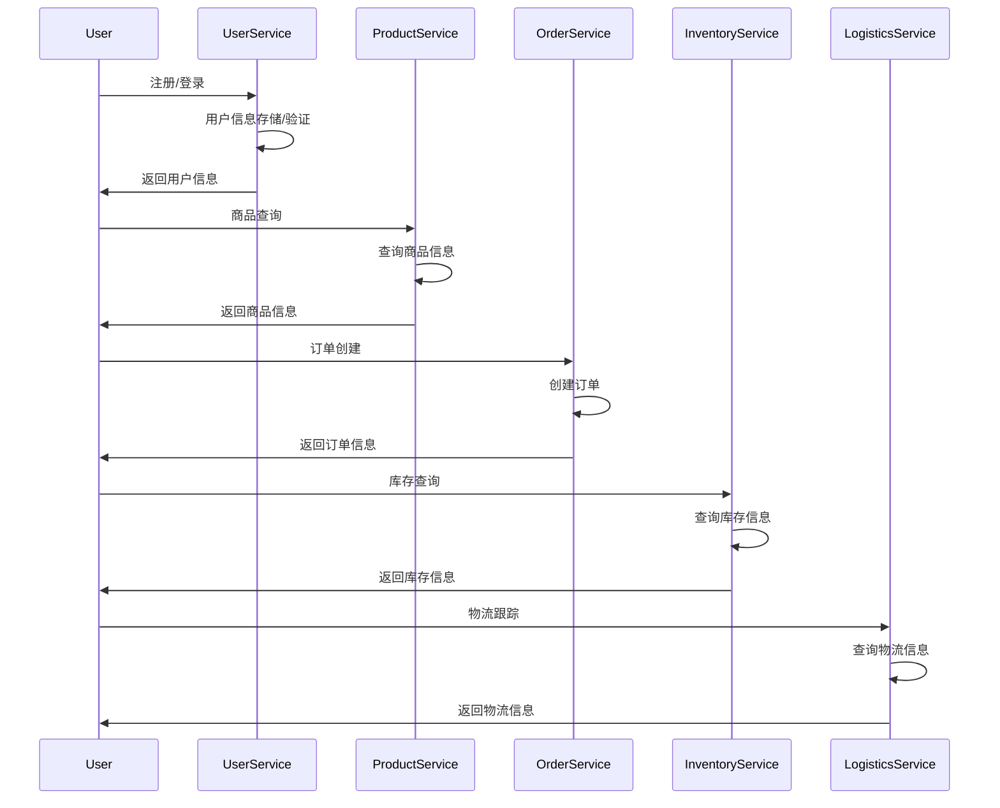

                 

### 文章标题

# 技术架构的演进与重构

> 关键词：技术架构，演进，重构，设计原则，案例分析

> 摘要：本文将从技术架构的演进背景、核心概念、设计原则、重构必要性以及重构实践等多个方面，深入探讨技术架构的演进与重构。通过对技术架构的深刻理解和实际案例的分析，帮助读者理解技术架构的重要性，掌握架构设计的方法，并了解如何进行有效的技术架构重构。

----------------------------------------------------------------

### 目录大纲

```markdown
----------------------------------------------------------------
# 第一部分: 技术架构的演进背景

## 第1章: 技术架构的演进概述
### 1.1 问题背景与需求
### 1.2 技术架构的演变历程
### 1.3 架构演进的驱动力

## 第2章: 技术架构的核心概念与要素
### 2.1 技ech架构的定义
### 2.2 核心概念与联系
### 2.3 技术架构的组成要素

## 第3章: 技术架构的设计原则与方法
### 3.1 设计原则
### 3.2 设计方法
### 3.3 架构设计工具与技术

## 第4章: 技术架构重构的必要性
### 4.1 重构的定义与目的
### 4.2 重构的挑战与机遇
### 4.3 重构的关键步骤

----------------------------------------------------------------

# 第二部分: 技术架构的重构实践

## 第5章: 技术架构重构的案例分析
### 5.1 案例一：大型电商平台架构重构
### 5.2 案例二：金融行业的架构优化
### 5.3 案例三：物联网平台的架构升级

## 第6章: 技术选型与优化
### 6.1 技术选型策略
### 6.2 技术优化方法
### 6.3 技术趋势分析

## 第7章: 架构重构的实战指导
### 7.1 实战环境搭建
### 7.2 架构重构的核心实现
### 7.3 架构重构的应用与效果评估

## 第8章: 技术架构的重构最佳实践
### 8.1 最佳实践总结
### 8.2 小结与注意事项
### 8.3 拓展阅读推荐

----------------------------------------------------------------
```

---

### 第一部分：技术架构的演进背景

#### 第1章：技术架构的演进概述

**1.1 问题背景与需求**

在当今快速发展的信息技术时代，技术架构的演进成为企业和组织的关键问题。随着业务需求的不断增加和技术的不断更新，企业需要不断调整其技术架构以适应新的挑战和需求。这不仅是技术发展的必然趋势，也是企业保持竞争力的重要手段。

**1.2 技术架构的演变历程**

技术架构的演变历程可以分为几个主要阶段：

- **单体架构**：早期的系统采用单体架构，所有功能都集中在一个应用程序中，虽然简单但扩展性和维护性较差。
- **分布式架构**：随着业务规模的扩大，分布式架构应运而生，通过将系统功能分解为多个独立的模块，提高了系统的可扩展性和容错性。
- **微服务架构**：分布式架构进一步发展，演变为微服务架构。微服务将系统功能进一步分解，每个服务都是独立部署和运行的，具有更高的灵活性和可扩展性。
- **云原生架构**：随着云计算和容器技术的普及，云原生架构成为新的趋势。云原生架构充分利用云计算和容器技术，实现了高效、灵活、自动化的部署和管理。

**1.3 架构演进的驱动力**

技术架构的演进受到多种驱动力的推动：

- **业务需求**：随着业务的发展，企业需要新的架构来支持复杂的业务流程和功能。
- **技术进步**：新技术的不断涌现，如云计算、大数据、人工智能等，推动架构的演进。
- **用户体验**：用户对快速响应和高质量服务的需求，促使企业不断优化技术架构。
- **成本控制**：企业需要通过技术架构的优化来降低运营成本。

**1.4 架构演进的影响**

技术架构的演进对企业有着深远的影响：

- **业务灵活性**：灵活的架构能够快速响应市场变化，满足业务需求。
- **系统稳定性**：良好的架构设计可以提高系统的稳定性，降低故障风险。
- **开发效率**：分布式和微服务架构使得开发团队可以独立开发和部署服务，提高开发效率。
- **成本效益**：优化后的架构可以提高资源的利用率，降低运营成本。

通过以上分析，我们可以看到技术架构的演进是一个必然趋势，它不仅能够满足业务需求，还能够提高系统的稳定性、开发效率和成本效益。在接下来的章节中，我们将进一步探讨技术架构的核心概念、设计原则以及重构的必要性。

---

### 第一部分：技术架构的演进背景

#### 第2章：技术架构的核心概念与要素

**2.1 技术架构的定义**

技术架构是指软件系统或IT基础设施的结构和组织方式，它定义了系统的组成部分、组件之间的关系以及如何实现特定的功能。技术架构不仅仅是代码和框架的选择，它涉及到系统的整体设计，包括数据、计算、存储、网络等多个方面。

**2.2 核心概念与联系**

为了更好地理解技术架构，我们需要了解一些核心概念：

- **模块化**：将系统划分为多个模块，每个模块负责特定的功能，模块之间通过接口进行通信。
- **分层**：将系统按照功能划分为多个层次，如表示层、业务逻辑层和数据访问层，层次之间通过定义明确的接口进行交互。
- **服务导向架构（SOA）**：将系统功能划分为多个服务，服务之间通过标准化的接口进行通信，实现系统的松耦合和高度可复用性。
- **微服务架构**：将系统功能进一步分解为小型、自治的服务，每个服务都是独立部署和运行的，可以单独扩展和升级。

这些核心概念之间有着密切的联系：

- 模块化和分层是实现技术架构的基础，它们使得系统具有更好的可维护性和可扩展性。
- SOA和微服务架构都是基于模块化和分层的理念，但SOA更多地强调服务的重用和标准化接口，而微服务架构则更加灵活和自治。

**2.3 技术架构的组成要素**

技术架构的组成要素包括：

- **组件**：系统中的各个功能模块，如数据库、Web服务器、应用服务器等。
- **接口**：组件之间的交互方式，定义了组件如何通信和数据交换的方式。
- **数据模型**：系统中的数据结构，定义了数据的存储方式、数据关系以及数据操作方法。
- **网络拓扑**：系统中的网络结构，定义了组件之间的连接方式和通信路径。
- **部署环境**：系统的运行环境，包括硬件设备、操作系统、数据库等。

这些要素共同构成了技术架构的基本框架，它们之间的相互作用决定了系统的性能、稳定性和可扩展性。

**2.4 技术架构的重要性**

技术架构的重要性体现在以下几个方面：

- **业务适应性**：良好的技术架构能够快速响应业务变化，支持新的业务需求。
- **开发效率**：清晰的架构设计可以提高开发效率，减少重复工作和代码冗余。
- **系统稳定性**：合理的架构设计可以提高系统的稳定性，降低故障风险。
- **维护性**：良好的架构设计使得系统易于维护和升级，降低维护成本。

通过以上分析，我们可以看到技术架构在IT系统中的重要性。在接下来的章节中，我们将进一步探讨技术架构的设计原则与方法，为实际架构设计提供指导。

---

### 第一部分：技术架构的演进背景

#### 第3章：技术架构的设计原则与方法

**3.1 设计原则**

技术架构的设计需要遵循一系列原则，以确保系统的质量、可维护性和可扩展性。以下是一些关键设计原则：

- **模块化**：将系统划分为多个模块，每个模块负责特定的功能，模块之间通过清晰的接口进行通信。
- **分层**：将系统按照功能划分为多个层次，每个层次都有明确的职责和接口。
- **解耦**：尽量减少组件之间的直接依赖，提高系统的灵活性和可维护性。
- **标准化**：采用标准化的接口和数据格式，确保不同组件之间的兼容性和互操作性。
- **高内聚、低耦合**：高内聚意味着模块内部的功能紧密相关，低耦合意味着模块之间的依赖性较低。
- **可复用性**：设计可复用的组件和模块，降低开发成本，提高开发效率。

**3.2 设计方法**

技术架构的设计方法包括以下几个步骤：

1. **需求分析**：明确系统的功能和性能需求，分析业务场景和用户需求。
2. **系统划分**：根据需求分析结果，将系统划分为多个模块和层次，确定模块之间的关系和接口。
3. **架构评估**：评估不同架构方案的优缺点，选择最佳方案。
4. **详细设计**：对选定架构的各个模块和层次进行详细设计，包括组件、接口和数据模型等。
5. **实施与部署**：根据详细设计文档进行系统实施和部署，包括硬件设备、软件安装和配置等。

**3.3 架构设计工具与技术**

在架构设计过程中，可以使用多种工具和技术来辅助设计和评估：

- **UML（统一建模语言）**：UML是一种图形化建模语言，用于描述系统的结构、行为和关系。常见的UML图包括类图、序列图、组件图等。
- **架构评估工具**：如SonarQube、CodeSonar等，用于评估代码质量、架构健康度和安全性。
- **架构风格与模式**：如MVC（模型-视图-控制器）、微服务架构、RESTful API等，这些风格和模式提供了一种通用的架构设计方案，有助于快速搭建和优化系统。
- **原型设计工具**：如Axure、Sketch等，用于创建系统的原型图和交互设计，帮助团队更好地理解和沟通系统的功能。

**3.4 设计原则与方法的结合**

在设计过程中，设计原则与方法需要紧密结合：

- **从需求出发**：始终以需求为导向，确保架构设计满足业务需求。
- **持续迭代**：架构设计是一个持续迭代的过程，需要根据实际情况进行调整和优化。
- **平衡各方利益**：在架构设计过程中，需要平衡业务需求、技术实现、性能和可维护性等各方面的利益。
- **遵循最佳实践**：参考业界最佳实践和经验，确保架构设计的高质量和可行性。

通过以上分析，我们可以看到技术架构设计原则与方法的重要性。良好的架构设计不仅能够满足业务需求，还能够提高系统的可维护性和可扩展性。在接下来的章节中，我们将探讨技术架构重构的必要性，为后续的实战案例分析奠定基础。

---

### 第一部分：技术架构的演进背景

#### 第4章：技术架构重构的必要性

**4.1 重构的定义与目的**

技术架构重构是指对现有的技术架构进行全面的评估、分析和改进，以提高系统的性能、可维护性、可扩展性和适应性。重构的目的在于解决现有架构中存在的问题，使其更好地适应新的业务需求和技术环境。

**4.2 重构的挑战与机遇**

**挑战：**

- **复杂性**：技术架构的重构通常涉及多个模块和层次，具有很高的复杂性，需要仔细分析和规划。
- **风险**：重构过程中可能会引入新的问题，如性能下降、功能缺失等，需要谨慎处理。
- **资源**：重构需要投入大量的人力、时间和资源，需要充分准备。
- **业务影响**：重构可能会对现有业务造成一定影响，需要确保业务连续性和稳定性。

**机遇：**

- **性能提升**：通过重构，可以优化系统性能，提高系统的响应速度和吞吐量。
- **可维护性**：重构后的架构更加清晰、模块化，易于维护和扩展。
- **可扩展性**：重构使得系统具有更高的灵活性，可以快速适应新的业务需求和技术变化。
- **成本效益**：重构可以降低长期维护成本，提高系统的整体效益。

**4.3 重构的关键步骤**

技术架构重构的过程可以分为以下几个关键步骤：

1. **需求分析**：明确业务需求和目标，分析现有架构存在的问题和不足，为重构提供依据。
2. **架构评估**：评估现有架构的优缺点，分析重构的必要性和可行性，确定重构方案。
3. **设计规划**：根据重构方案，设计新的架构，包括组件、接口、数据模型等，确保新架构满足业务需求。
4. **实施与部署**：根据设计规划，实施新架构，进行系统部署和配置。
5. **测试与优化**：对新架构进行全面的测试和优化，确保系统性能和稳定性。
6. **持续改进**：在重构过程中，持续收集反馈和改进意见，不断优化和调整架构。

**4.4 重构的策略**

为了确保重构的成功，可以采用以下策略：

- **分阶段实施**：将重构过程分为多个阶段，逐步实施，降低风险。
- **并行开发**：在重构过程中，保持原有系统和重构系统的并行运行，确保业务连续性。
- **迭代优化**：在重构过程中，不断收集反馈，进行迭代优化，提高重构效果。
- **团队协作**：组建跨部门、跨领域的团队，共同参与重构过程，确保各方面的利益得到平衡。

通过以上分析，我们可以看到技术架构重构的必要性和重要性。在接下来的章节中，我们将通过实际案例，深入探讨技术架构重构的过程和方法。

---

### 第二部分：技术架构的重构实践

#### 第5章：技术架构重构的案例分析

**5.1 案例一：大型电商平台架构重构**

**背景介绍：**

某大型电商平台在经历多年的快速发展后，其技术架构逐渐暴露出一系列问题，如系统性能瓶颈、扩展性差、维护困难等。这些问题严重影响了平台的用户体验和业务发展，迫切需要进行技术架构的重构。

**项目介绍：**

该平台的技术架构重构项目主要包括以下几个目标：

- 提高性能：优化系统性能，提高响应速度和吞吐量。
- 提高可扩展性：构建可灵活扩展的架构，支持业务快速发展。
- 提高可维护性：重构代码结构，提高系统的可维护性和可扩展性。
- 降低成本：通过技术优化，降低系统的运营和维护成本。

**系统功能设计：**

在重构过程中，项目团队对现有系统进行了全面的梳理和分析，确定了以下关键功能模块：

- 用户管理模块：负责用户的注册、登录、权限管理等。
- 商品管理模块：负责商品的信息管理、分类、推荐等。
- 订单管理模块：负责订单的创建、处理、支付、发货等。
- 库存管理模块：负责库存的监控、预警、调拨等。
- 物流管理模块：负责物流的跟踪、配送、异常处理等。

**系统架构设计：**

重构后的系统采用了微服务架构，各个功能模块被独立划分为多个微服务，实现了松耦合和高度可复用性。以下是系统架构设计的关键组成部分：

- **用户服务**：处理用户的注册、登录、权限管理等功能。
- **商品服务**：提供商品的信息管理、分类、推荐等服务。
- **订单服务**：处理订单的创建、处理、支付、发货等功能。
- **库存服务**：监控库存情况，提供库存预警、调拨等服务。
- **物流服务**：提供物流跟踪、配送、异常处理等服务。
- **API网关**：作为外部访问的统一入口，负责路由和认证等。
- **数据存储**：包括关系数据库、NoSQL数据库、缓存等。

**系统接口设计：**

系统采用了RESTful API设计，各个微服务之间通过HTTP/HTTPS协议进行通信。以下是关键接口的设计：

- 用户接口：包括用户注册、登录、修改密码等。
- 商品接口：包括商品信息查询、分类查询、推荐商品查询等。
- 订单接口：包括订单创建、订单查询、支付接口等。
- 库存接口：包括库存查询、库存预警、库存调拨等。
- 物流接口：包括物流跟踪、配送状态查询、异常处理等。

**系统交互：**

以下是系统交互的mermaid序列图：



**核心实现与代码分析：**

以下是用户服务模块的核心实现，包括用户注册和登录功能：

```python
# 用户注册
def register(username, password):
    # 检查用户名是否已存在
    if User.exists(username):
        return "用户名已存在"
    # 创建用户
    user = User(username, password)
    user.save()
    return "注册成功"

# 用户登录
def login(username, password):
    # 验证用户名和密码
    user = User.get(username, password)
    if not user:
        return "用户名或密码错误"
    return "登录成功"
```

**实际案例分析：**

通过技术架构的重构，该电商平台在性能、可扩展性、可维护性等方面取得了显著提升。具体表现为：

- **性能提升**：通过微服务架构和优化数据库查询，系统的响应速度和吞吐量显著提高，用户体验得到大幅改善。
- **可扩展性增强**：微服务架构使得系统具有更高的灵活性，可以快速适应业务需求变化，支持业务的快速发展。
- **可维护性提高**：重构后的代码结构更加清晰、模块化，便于维护和扩展，降低了维护成本。
- **成本降低**：通过优化技术和减少重复开发，平台的运营和维护成本显著降低，实现了更高的成本效益。

**小结：**

通过以上案例，我们可以看到技术架构重构的重要性和实际效果。在面临性能瓶颈、扩展性差、维护困难等问题时，及时进行技术架构的重构是提高系统质量和业务竞争力的重要手段。在接下来的章节中，我们将进一步探讨技术选型与优化，为技术架构的重构提供更多实战指导。

---

### 第二部分：技术架构的重构实践

#### 第6章：技术选型与优化

**6.1 技术选型策略**

在技术架构重构过程中，技术选型是至关重要的一环。正确的技术选型能够提高系统的性能、可维护性和可扩展性，而错误的选择则可能导致系统问题加剧。以下是一些关键的技术选型策略：

- **需求导向**：技术选型应紧密围绕业务需求进行，确保所选技术能够满足业务需求。
- **性能优先**：在满足业务需求的前提下，优先考虑技术的性能，如响应速度、吞吐量等。
- **可维护性**：选择易于维护和扩展的技术，降低长期维护成本。
- **兼容性**：考虑所选技术与其他现有系统的兼容性，避免技术孤岛。
- **社区支持**：选择具有良好社区支持的技术，便于问题解决和知识分享。
- **成本效益**：综合考虑技术成本和长期效益，选择性价比高的技术。

**6.2 技术优化方法**

在技术选型确定后，优化方法对于提升系统性能和稳定性至关重要。以下是一些常见的技术优化方法：

- **缓存机制**：通过缓存机制减少数据库查询次数，提高系统响应速度。常用的缓存技术包括Redis、Memcached等。
- **数据库优化**：通过索引优化、查询优化、存储过程优化等方法，提高数据库性能。例如，使用适当的数据类型、创建合适的索引、优化查询语句等。
- **负载均衡**：通过负载均衡技术，将请求分配到多个服务器上，提高系统的吞吐量和可用性。常用的负载均衡技术包括Nginx、HAProxy等。
- **垂直和水平扩展**：通过垂直扩展（增加硬件资源）和水平扩展（增加服务器数量）提高系统性能和可扩展性。例如，增加CPU、内存、存储资源，或者增加服务器节点。
- **异步处理**：通过异步处理技术，提高系统的并发处理能力，减少响应时间。例如，使用消息队列、异步任务调度等。
- **代码优化**：通过优化代码，提高系统的执行效率和资源利用率。例如，减少不必要的循环、使用高效的算法和数据结构等。

**6.3 技术趋势分析**

了解当前和未来的技术趋势对于技术选型和优化具有重要意义。以下是一些当前和未来的技术趋势：

- **云计算**：云计算技术的普及和成熟，使得企业可以更加灵活地管理和扩展IT资源。云计算平台如AWS、Azure、Google Cloud等，提供了丰富的服务和技术支持。
- **容器化和微服务**：容器技术如Docker和Kubernetes的广泛应用，使得微服务架构的实施和运维更加简便和高效。微服务架构已成为现代应用架构的主流选择。
- **人工智能和大数据**：人工智能和大数据技术的快速发展，为数据处理和分析提供了强大的工具和方法。机器学习、深度学习、数据挖掘等技术正在被广泛应用于各个行业。
- **区块链**：区块链技术的应用逐渐扩大，特别是在金融、供应链管理等领域。区块链技术提供了去中心化、安全、透明的数据存储和传输方式。
- **边缘计算**：随着物联网和5G技术的发展，边缘计算成为趋势。边缘计算将数据处理和计算能力推向网络边缘，提高系统的实时性和响应速度。

**6.4 技术选型与优化的结合**

在技术选型和优化过程中，需要将两者紧密结合：

- **需求驱动**：技术选型和优化应始终以业务需求为导向，确保技术方案能够满足实际需求。
- **持续优化**：技术选型确定后，应持续进行优化，根据系统运行情况和技术发展趋势进行调整。
- **风险评估**：在技术选型和优化过程中，需要评估技术风险，包括技术成熟度、社区支持、安全性等方面。
- **团队协作**：技术选型和优化是一个跨部门的协作过程，需要团队共同努力，确保方案的有效实施。

通过以上分析，我们可以看到技术选型和优化在技术架构重构中的重要性。在接下来的章节中，我们将通过实战指导，深入探讨技术架构重构的具体实施过程。

---

### 第二部分：技术架构的重构实践

#### 第7章：架构重构的实战指导

**7.1 实战环境搭建**

在进行架构重构的实战之前，我们需要搭建一个合适的环境，以便进行实际操作和验证。以下是一个基本的实战环境搭建步骤：

1. **选择合适的技术栈**：根据项目的需求和目标，选择合适的技术栈，包括开发语言、框架、数据库、中间件等。
2. **安装开发工具**：安装开发环境，如代码编辑器、版本控制工具、调试工具等。
3. **配置数据库**：配置数据库环境，包括关系数据库（如MySQL、PostgreSQL）和NoSQL数据库（如MongoDB、Cassandra）。
4. **搭建中间件**：搭建必要的中间件环境，如消息队列（如RabbitMQ、Kafka）、缓存（如Redis、Memcached）等。
5. **搭建测试环境**：配置测试环境，包括测试服务器、测试数据等。

**7.2 架构重构的核心实现**

架构重构的核心实现包括以下几个方面：

1. **模块划分**：根据需求分析，将现有系统划分为多个模块，每个模块负责特定的功能。
2. **接口设计**：设计模块之间的接口，确保模块之间的高内聚和低耦合。
3. **服务实现**：实现各个微服务，确保每个服务都是独立部署和运行的。
4. **数据迁移**：将现有数据迁移到新的架构中，确保数据的完整性和一致性。
5. **集成与测试**：将重构后的系统与现有系统集成，进行全面的测试和验证。

以下是架构重构的核心实现示例：

```python
# 用户服务模块实现
class UserService:
    def register(self, username, password):
        # 注册用户
        pass

    def login(self, username, password):
        # 登录用户
        pass

# 商品服务模块实现
class ProductService:
    def search_products(self, query):
        # 搜索商品
        pass

    def get_product_details(self, product_id):
        # 获取商品详情
        pass

# 订单服务模块实现
class OrderService:
    def create_order(self, user_id, product_ids):
        # 创建订单
        pass

    def get_order_details(self, order_id):
        # 获取订单详情
        pass
```

**7.3 架构重构的应用与效果评估**

在架构重构完成后，我们需要对重构后的系统进行应用和效果评估：

1. **性能测试**：对系统进行性能测试，包括响应时间、吞吐量、并发处理能力等，评估系统性能是否达到预期。
2. **稳定性测试**：对系统进行稳定性测试，包括长时间运行、压力测试等，评估系统的稳定性和可靠性。
3. **兼容性测试**：确保重构后的系统能够与现有系统和其他第三方服务进行正常交互。
4. **用户反馈**：收集用户的反馈，评估系统的用户体验和满意度。
5. **成本效益分析**：对比重构前后的运营成本和效益，评估重构的长期效益。

以下是效果评估示例：

```python
# 性能测试
def test_performance():
    start_time = time.time()
    UserService().login("user1", "password1")
    end_time = time.time()
    print(f"Login response time: {end_time - start_time} seconds")

# 稳定性测试
def test_stability():
    # 长时间运行测试
    pass

# 兼容性测试
def test_compatibility():
    # 测试与第三方服务的交互
    pass

# 用户反馈
def collect_user_feedback():
    # 收集用户反馈
    pass

# 成本效益分析
def analyze_cost_benefit():
    # 对比重构前后的成本效益
    pass
```

**7.4 持续改进与优化**

架构重构不是一次性的工作，而是一个持续改进和优化的过程。在重构后的系统中，我们需要：

1. **定期进行性能监控**：监控系统的运行状态，及时发现和解决性能问题。
2. **持续优化代码**：根据系统的运行情况和用户反馈，不断优化代码，提高系统的可维护性和可扩展性。
3. **引入新的技术**：随着技术的发展，不断引入新的技术和工具，提升系统的技术水平和竞争力。
4. **迭代更新**：定期对系统进行迭代更新，添加新的功能和改进，以满足不断变化的业务需求。

通过以上实战指导，我们可以看到架构重构的具体实施过程和关键步骤。在实际操作中，需要根据具体项目和业务需求，灵活调整和优化重构方案。在接下来的章节中，我们将总结最佳实践，为技术架构的重构提供全面的指导。

---

### 第二部分：技术架构的重构实践

#### 第8章：技术架构的重构最佳实践

**8.1 最佳实践总结**

在技术架构重构过程中，总结最佳实践对于确保项目的成功至关重要。以下是一些关键的最佳实践：

1. **需求驱动**：始终以业务需求为导向，确保架构重构能够满足实际业务需求。
2. **分阶段实施**：将重构过程分为多个阶段，逐步实施，降低风险。
3. **团队协作**：组建跨部门、跨领域的团队，共同参与重构过程，确保各方面的利益得到平衡。
4. **持续集成与测试**：采用持续集成和持续测试的方法，确保重构后的系统能够稳定运行。
5. **代码质量**：保持良好的代码质量，包括代码规范、注释、单元测试等，提高代码的可维护性和可复用性。
6. **文档与培训**：编写详细的文档，对重构过程进行记录，并进行必要的培训，确保团队成员能够理解和掌握重构后的系统。
7. **风险评估与监控**：在重构过程中，进行持续的风险评估和监控，及时发现和解决潜在问题。
8. **性能优化**：对重构后的系统进行性能优化，确保系统能够高效、稳定地运行。

**8.2 小结与注意事项**

在技术架构重构过程中，需要注意以下几点：

- **全面需求分析**：在重构之前，进行全面的需求分析，确保重构方案能够满足业务需求。
- **风险评估**：在重构过程中，进行持续的风险评估，确保重构方案的安全性和稳定性。
- **迭代优化**：重构不是一次性的工作，需要根据实际情况进行迭代优化。
- **培训与文档**：对团队成员进行培训，编写详细的文档，确保团队成员能够顺利过渡到重构后的系统。
- **监控与反馈**：在重构后的系统运行过程中，进行持续的性能监控和用户反馈收集，及时发现和解决潜在问题。

**8.3 拓展阅读推荐**

为了更好地理解技术架构的重构，以下是几本推荐的书籍和资料：

1. **《设计模式：可复用面向对象软件的基础》**（作者：Gamma et al.）- 探讨了软件设计中的经典模式，有助于理解架构设计原则。
2. **《微服务设计》**（作者：Chris Richardson）- 详细介绍了微服务架构的设计原则和实践，适用于实际项目中的架构重构。
3. **《架构实践：从设计到部署》**（作者：Mark Richards）- 提供了全面的架构设计指导，包括架构原则、设计模式、架构评估等。
4. **《重构：改善既有代码的设计》**（作者：Martin Fowler）- 探讨了代码重构的方法和最佳实践，有助于提高代码质量。
5. **《持续交付：发布可靠软件的系统化方法》**（作者：Jez Humble and David Farley）- 介绍了持续交付的实践和方法，有助于实现快速、可靠的软件发布。

通过以上分析和推荐，我们可以看到技术架构重构的重要性和实际应用价值。在技术快速发展的时代，持续进行技术架构的重构，是确保系统质量和业务竞争力的关键。希望本文能够为读者提供有益的参考和指导。

---

### 附录：作者信息

**作者：AI天才研究院/AI Genius Institute & 禅与计算机程序设计艺术 /Zen And The Art of Computer Programming**

AI天才研究院致力于推动人工智能和计算机科学领域的发展，通过深入研究和技术创新，为行业提供前沿的理论和实践指导。同时，禅与计算机程序设计艺术这本书以独特的视角和深入的分析，探讨了程序设计中的哲学和艺术，对软件工程师和架构师有着深远的影响。希望本文能为读者带来启发和思考，共同推动技术架构的不断进步。

