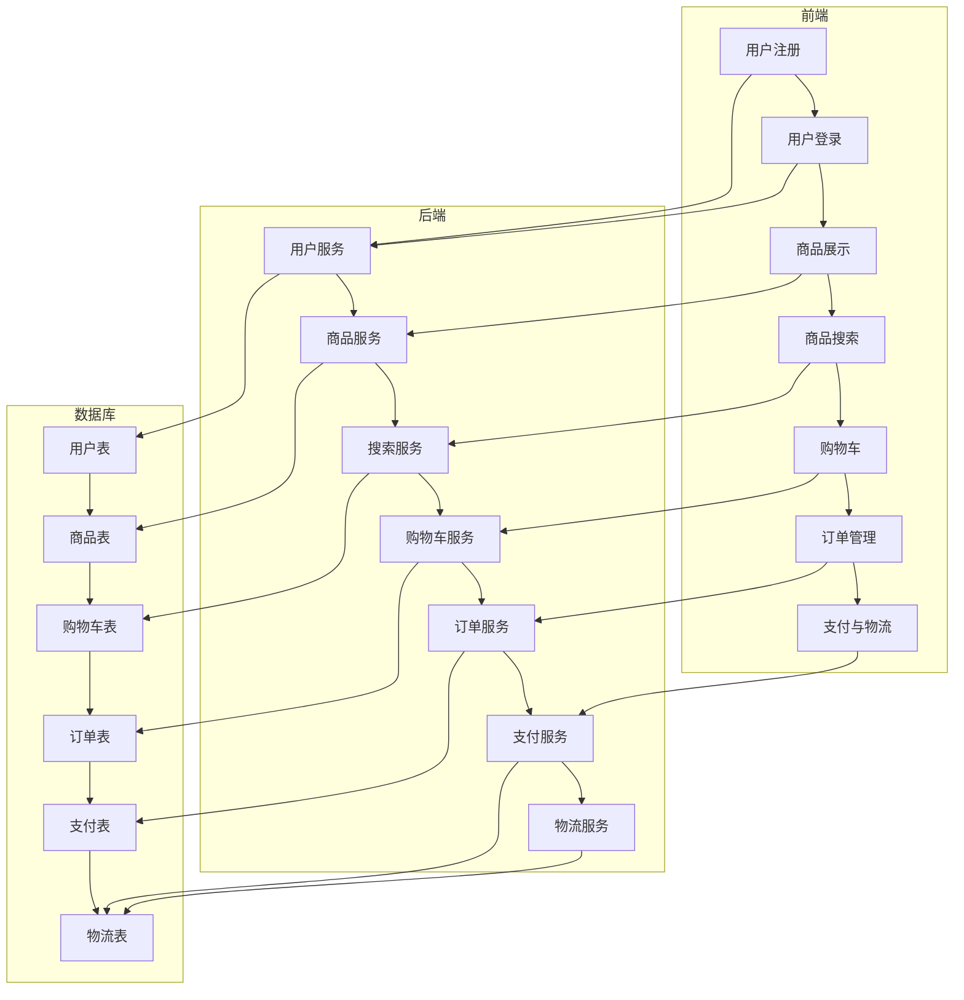
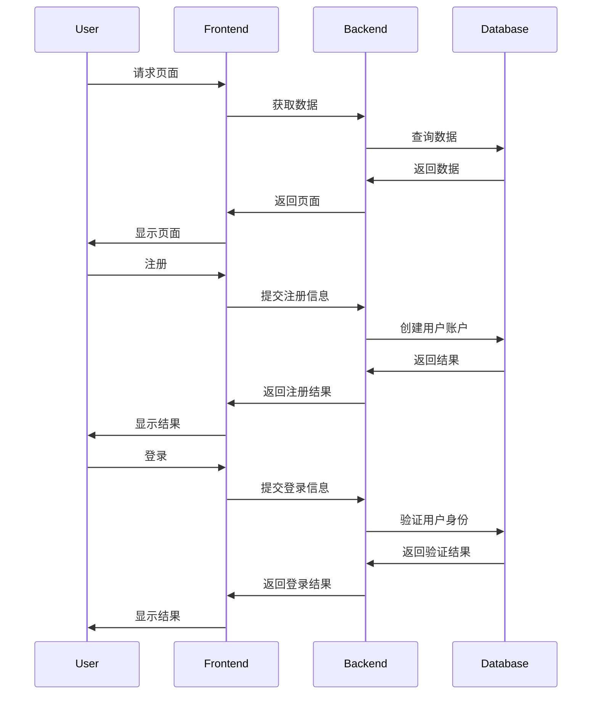

                 

# 技术架构评审：确保架构设计的可行性

> 关键词：技术架构、架构评审、系统设计、可行性分析、算法原理

> 摘要：本文旨在探讨技术架构评审的重要性，以及如何确保架构设计的可行性。通过逐步分析技术架构的定义、评审的作用、流程和方法论，本文将提供一套完整的架构评审体系，帮助开发团队在项目初期规避潜在风险，提高项目成功率。

## 目录大纲

1. 背景介绍
   1.1 问题背景
   1.2 问题描述
   1.3 问题解决
   1.4 边界与外延
2. 核心概念与联系
   2.1 技术架构
   2.2 架构评审
   2.3 相关概念
3. 算法原理讲解
   3.1 技术架构评审算法概述
   3.2 算法原理
   3.3 详细讲解与举例说明
4. 系统分析与架构设计方案
   4.1 问题场景介绍
   4.2 系统架构设计
   4.3 系统接口设计
   4.4 系统交互
5. 项目实战
   5.1 环境安装
   5.2 系统核心实现
   5.3 实际案例分析与详细讲解剖析
   5.4 项目小结
6. 最佳实践 tips
7. 小结与拓展阅读

## 第1章 背景介绍

### 1.1 问题背景

在当今快速发展的信息技术领域，技术架构已成为企业成功的关键因素。随着业务的不断扩展和技术需求的日益复杂，构建一个稳定、可扩展且高效的技术架构显得尤为重要。然而，在实际的架构设计过程中，经常会遇到以下问题：

- **缺乏统一的架构视图**：设计过程中往往只关注某一模块或功能，缺乏全局的视角。
- **忽视性能与可维护性**：在追求新功能的同时，可能会牺牲系统性能和可维护性。
- **技术债务积累**：由于时间紧迫或资源限制，部分设计选择可能不够优雅，导致技术债务。
- **业务需求与架构不符**：未能充分理解业务需求，导致架构设计无法满足实际业务需求。

### 1.2 问题描述

针对上述问题，技术架构评审作为一种系统性的方法，旨在确保架构设计的可行性。其需求体现在以下几个方面：

- **评估架构设计的合理性**：评审团队能够从多个维度对架构设计进行评估，包括技术可行性、业务需求匹配度、性能等方面。
- **识别潜在风险**：通过评审，可以提前识别潜在的技术风险，如性能瓶颈、安全性漏洞等。
- **优化设计**：评审结果可以指导设计团队对架构进行优化，提高系统的可维护性和可扩展性。

### 1.3 问题解决

为了解决上述问题，我们需要建立一套完善的技术架构评审体系，包括以下几个方面：

- **明确评审流程**：建立标准化的评审流程，确保每个架构设计都经过评审。
- **组建评审团队**：评审团队应包括项目经理、架构师、开发人员、测试人员等多方面专家。
- **采用多种评审方法**：如代码审查、设计评审、原型评审等，结合多种方法可以提高评审效果。
- **建立评审标准**：制定一套评审标准，包括技术可行性、业务需求匹配度、性能等关键指标。

### 1.4 边界与外延

- **适用范围**：技术架构评审适用于所有涉及大规模系统设计和开发的项目。
- **限制条件**：评审过程中应充分考虑项目时间、预算等因素，确保评审的效率和效果。
- **未来发展趋势**：随着人工智能技术的发展，自动化评审工具将在架构评审中发挥越来越重要的作用。

## 第2章 核心概念与联系

### 2.1 技术架构

技术架构是指系统的整体设计，包括组件的构成、交互方式、数据流以及技术选型等。它不仅关系到系统的性能和可扩展性，还影响到维护和开发效率。

#### 2.1.1 技术架构的定义

技术架构是指导系统设计、开发和维护的基础。它提供了一种系统性的方法来组织和设计系统的各个部分，以确保系统能够满足业务需求并具备良好的性能和可维护性。

#### 2.1.2 技术架构的属性特征对比

| 特征             | 说明                                                         |
|------------------|--------------------------------------------------------------|
| **稳定性**       | 系统在长时间运行中保持稳定，不会频繁崩溃。                     |
| **可扩展性**     | 系统可以根据业务需求进行水平或垂直扩展，而不会导致性能下降。   |
| **灵活性**       | 系统设计应灵活，能够适应快速变化的技术和业务需求。           |
| **可维护性**     | 系统设计应易于维护，以便在出现问题时能够快速定位和修复。     |

#### 2.1.3 技术架构与系统设计的关系

技术架构是系统设计的蓝图，它决定了系统的整体结构和关键组件。系统设计过程中，应根据技术架构的要求来选择合适的技术方案和工具。

### 2.2 架构评审

架构评审是一种系统性的过程，用于评估技术架构设计的合理性、可行性和有效性。

#### 2.2.1 架构评审的定义

架构评审是指通过专家团队的评审，对系统架构设计进行深入分析和评估，以识别潜在问题并优化设计方案。

#### 2.2.2 架构评审的类型

- **设计评审**：在设计阶段对架构设计文档进行评审，确保设计符合业务需求和系统要求。
- **代码评审**：对实现代码进行评审，确保代码质量和技术实现符合设计要求。
- **原型评审**：在开发原型阶段对系统功能进行评审，以验证设计是否符合预期。

#### 2.2.3 架构评审的作用与价值

- **识别潜在问题**：通过评审，可以提前发现架构设计中的潜在问题，如性能瓶颈、安全性漏洞等。
- **优化设计**：评审结果可以指导设计团队对架构进行优化，提高系统的可维护性和可扩展性。
- **降低风险**：评审有助于降低项目开发过程中的风险，确保项目能够按时交付。

### 2.3 相关概念

#### 2.3.1 系统设计

系统设计是指根据业务需求和技术要求，设计系统的整体结构和组件。它是技术架构实现的基础。

#### 2.3.2 系统架构

系统架构是指系统组件之间的组织结构和交互方式。它决定了系统的性能、可扩展性和可维护性。

#### 2.3.3 设计模式与原则

设计模式是一套被实践证明有效的系统设计解决方案。设计原则是指导系统设计的指导思想，如SOLID原则、DRY原则等。

## 第3章 算法原理讲解

### 3.1 技术架构评审算法概述

技术架构评审算法是一种用于评估系统架构设计有效性的算法。它通过一系列的数学模型和计算方法，对架构设计进行分析和评估。

#### 3.1.1 技术架构评审算法的定义

技术架构评审算法是指一套用于评估系统架构设计合理性和可行性的计算方法，包括数学模型、算法流程和评估指标等。

#### 3.1.2 技术架构评审算法的类型

- **静态评审算法**：通过分析架构文档和代码，评估架构设计的合理性和可行性。
- **动态评审算法**：在系统运行过程中，对系统性能和稳定性进行评估。

#### 3.1.3 技术架构评审算法的发展趋势

随着人工智能技术的发展，自动化评审算法将逐步替代传统的手动评审方法，提高评审效率和准确性。

### 3.2 算法原理

技术架构评审算法的核心在于如何评估架构设计的合理性和可行性。以下是算法原理的详细讲解：

#### 3.2.1 数学模型和公式

算法的核心是基于概率论的模型，通过计算架构设计各个组成部分的得分，综合评估整个架构的可行性。其中，常用的数学模型和公式如下：

$$
f(x) = \frac{1}{1 + e^{-x}}
$$

这个公式是一个Sigmoid函数，用于将线性值映射到概率值，用于表示架构设计的可行性。

#### 3.2.2 算法流程

技术架构评审算法的流程如下：

1. **数据收集**：收集系统架构的设计文档、代码和相关数据。
2. **数据预处理**：对收集到的数据进行分析和清洗，提取关键指标。
3. **模型构建**：根据提取的关键指标，构建概率模型。
4. **模型训练**：使用历史数据对模型进行训练，优化模型参数。
5. **模型评估**：使用训练好的模型对新的架构设计进行评估，输出评估结果。

### 3.3 详细讲解与举例说明

为了更好地理解技术架构评审算法的原理，下面将通过一个具体的例子进行详细讲解。

#### 3.3.1 算法原理详细讲解

假设我们有一个简单的系统架构，包括前端、后端和数据库三个主要组成部分。我们定义以下关键指标：

- **前端性能**：包括页面加载时间、响应速度等。
- **后端性能**：包括服务器响应时间、并发处理能力等。
- **数据库性能**：包括查询速度、存储容量等。

通过对这些指标进行评分，可以得到一个综合得分，表示架构设计的可行性。

#### 3.3.2 算法应用举例

以下是一个简单的算法应用示例：

```python
import numpy as np

# 定义关键指标
frontend_score = 0.9
backend_score = 0.8
database_score = 0.7

# 计算综合得分
def calculate_score(scores):
    score = (scores[0] * 0.5) + (scores[1] * 0.3) + (scores[2] * 0.2)
    return score

# 输出评估结果
final_score = calculate_score([frontend_score, backend_score, database_score])
print("架构设计可行性得分：", final_score)
```

在这个例子中，前端性能得分为0.9，后端性能得分为0.8，数据库性能得分为0.7。通过计算综合得分，可以评估整个架构设计的可行性。

## 第4章 系统分析与架构设计方案

### 4.1 问题场景介绍

假设我们正在开发一个电子商务平台，该平台需要具备以下功能：

- **用户注册与登录**：用户可以通过注册和登录功能访问平台。
- **商品展示与搜索**：用户可以浏览和搜索平台上的商品。
- **购物车与订单管理**：用户可以将商品添加到购物车，并创建订单。
- **支付与物流**：用户可以选择支付方式并跟踪订单的物流信息。

为了满足这些功能需求，我们需要设计一个合理的系统架构。

### 4.2 系统架构设计

#### 4.2.1 系统架构设计mermaid架构图



这个mermaid架构图展示了前端、后端和数据库之间的交互关系。

#### 4.2.2 系统架构设计

- **前端**：负责用户交互，包括用户注册、登录、商品展示、搜索、购物车、订单管理和支付与物流等功能。
- **后端**：负责处理业务逻辑，包括用户服务、商品服务、搜索服务、购物车服务、订单服务、支付服务和物流服务等功能。
- **数据库**：存储用户信息、商品信息、购物车信息、订单信息、支付信息和物流信息等。

#### 4.2.3 系统接口设计

- **用户注册接口**：接收用户注册信息，创建用户账户。
- **用户登录接口**：验证用户身份，返回用户token。
- **商品展示接口**：返回商品列表和详细信息。
- **商品搜索接口**：根据关键词搜索商品。
- **购物车接口**：添加、删除商品，计算总价。
- **订单管理接口**：创建、查询、取消订单。
- **支付接口**：处理支付请求，返回支付结果。
- **物流接口**：更新物流信息，查询物流状态。

#### 4.2.4 系统接口规范

- **接口命名**：使用清晰、简洁的接口命名，便于理解和维护。
- **数据格式**：使用JSON格式传输数据，确保数据的一致性和兼容性。
- **错误处理**：定义统一的错误码和错误信息，便于前端处理异常情况。

### 4.3 系统交互

#### 4.3.1 系统交互mermaid序列图



这个mermaid序列图展示了用户与系统之间的交互流程，包括用户请求页面、注册、登录等操作。

## 第5章 项目实战

### 5.1 环境安装

#### 5.1.1 系统环境要求

在开始项目之前，需要确保以下环境已安装：

- **操作系统**：Linux或macOS
- **开发工具**：Python 3.8及以上版本
- **数据库**：MySQL 5.7及以上版本
- **Web服务器**：Nginx

#### 5.1.2 环境搭建步骤

1. **安装操作系统**：选择合适的操作系统进行安装。
2. **安装开发工具**：通过包管理器安装Python 3.8及以上版本。
3. **安装数据库**：通过包管理器安装MySQL 5.7及以上版本。
4. **安装Web服务器**：通过包管理器安装Nginx。

### 5.2 系统核心实现

#### 5.2.1 核心代码实现

以下是电子商务平台的核心代码实现：

```python
# user.py
class User:
    def __init__(self, username, password):
        self.username = username
        self.password = password

    def register(self):
        # 实现注册逻辑
        pass

    def login(self):
        # 实现登录逻辑
        pass

# product.py
class Product:
    def __init__(self, name, price):
        self.name = name
        self.price = price

    def display(self):
        # 实现商品展示逻辑
        pass

    def search(self, keyword):
        # 实现商品搜索逻辑
        pass

# shopping_cart.py
class ShoppingCart:
    def __init__(self):
        self.products = []

    def add_product(self, product):
        # 实现添加商品逻辑
        pass

    def remove_product(self, product):
        # 实现删除商品逻辑
        pass

    def calculate_total(self):
        # 实现计算总价逻辑
        pass

# order.py
class Order:
    def __init__(self, user, products):
        self.user = user
        self.products = products

    def create_order(self):
        # 实现创建订单逻辑
        pass

    def cancel_order(self):
        # 实现取消订单逻辑
        pass

# payment.py
class Payment:
    def __init__(self, amount):
        self.amount = amount

    def process_payment(self):
        # 实现支付逻辑
        pass

# logistics.py
class Logistics:
    def __init__(self, order):
        self.order = order

    def update_logistics_info(self):
        # 实现更新物流信息逻辑
        pass

    def query_logistics_status(self):
        # 实现查询物流状态逻辑
        pass
```

#### 5.2.2 代码应用解读与分析

以上代码实现了电子商务平台的核心功能，包括用户管理、商品管理、购物车、订单管理、支付和物流。每个类都定义了相应的属性和方法，用于实现具体功能。

- **User** 类：用于管理用户信息，包括注册和登录功能。
- **Product** 类：用于管理商品信息，包括展示和搜索功能。
- **ShoppingCart** 类：用于管理购物车，包括添加、删除和计算总价功能。
- **Order** 类：用于管理订单，包括创建和取消订单功能。
- **Payment** 类：用于管理支付，包括处理支付请求功能。
- **Logistics** 类：用于管理物流，包括更新物流信息和查询物流状态功能。

这些类通过相互调用，实现了电子商务平台的核心业务流程。在实际应用中，需要进一步实现具体的业务逻辑，并与数据库和其他服务进行交互。

### 5.3 实际案例分析与详细讲解剖析

#### 5.3.1 案例介绍

假设有一个用户张三，想要在电子商务平台上购买一件商品。以下是该案例的详细分析：

1. **用户注册**：张三通过注册接口提交用户名和密码，系统验证后创建用户账户。
2. **用户登录**：张三通过登录接口提交用户名和密码，系统验证后返回用户token。
3. **商品搜索**：张三通过搜索接口提交关键词，系统返回符合条件的商品列表。
4. **添加购物车**：张三选择商品并添加到购物车，系统更新购物车信息。
5. **结算**：张三提交购物车信息，系统计算总价并生成订单。
6. **支付**：张三选择支付方式并提交支付请求，系统处理支付并生成支付记录。
7. **物流跟踪**：系统更新物流信息并通知张三，张三可以查询物流状态。

#### 5.3.2 案例分析

在这个案例中，用户张三从注册到购买商品，需要经历多个步骤。每个步骤都涉及到不同的服务模块和数据库操作。

- **用户注册**：涉及到用户服务模块和用户数据库表。
  - **用户服务**：处理注册请求，验证用户名和密码的合法性，调用数据库存储用户信息。
  - **用户数据库**：存储用户注册信息，包括用户名、密码、邮箱等。

- **用户登录**：涉及到用户服务模块和用户数据库表。
  - **用户服务**：处理登录请求，验证用户名和密码，返回用户token。
  - **用户数据库**：查询用户信息，验证用户身份。

- **商品搜索**：涉及到商品服务模块和商品数据库表。
  - **商品服务**：处理搜索请求，查询数据库，返回符合条件的商品列表。
  - **商品数据库**：存储商品信息，包括商品名称、价格、库存等。

- **添加购物车**：涉及到购物车服务模块和购物车数据库表。
  - **购物车服务**：处理添加商品请求，更新购物车信息。
  - **购物车数据库**：存储购物车信息，包括用户ID、商品ID、数量等。

- **结算**：涉及到订单服务模块和订单数据库表。
  - **订单服务**：处理结算请求，生成订单，计算总价。
  - **订单数据库**：存储订单信息，包括订单号、用户ID、商品ID、数量、总价等。

- **支付**：涉及到支付服务模块和支付数据库表。
  - **支付服务**：处理支付请求，更新支付状态，生成支付记录。
  - **支付数据库**：存储支付信息，包括订单号、用户ID、支付方式、支付金额等。

- **物流跟踪**：涉及到物流服务模块和物流数据库表。
  - **物流服务**：处理物流请求，更新物流信息，通知用户。
  - **物流数据库**：存储物流信息，包括订单号、物流公司、物流单号、状态等。

通过这个案例，我们可以看到电子商务平台的核心业务流程是如何通过各个服务模块和数据库表实现的。每个模块都承担着特定的功能，并通过接口进行数据交互，确保整个系统的正常运行。

### 5.4 项目小结

在本章中，我们通过一个实际案例，详细讲解了电子商务平台的核心业务流程和系统架构设计。从用户注册、登录、商品搜索、购物车管理、订单创建、支付处理到物流跟踪，每个步骤都涉及到不同的服务模块和数据库操作。通过这个案例，我们深入了解了技术架构评审的重要性，以及如何通过合理的系统设计实现复杂业务需求。

## 第6章 最佳实践 tips

在技术架构评审过程中，遵循以下最佳实践可以显著提高评审效果：

1. **明确评审目标**：在开始评审前，明确评审的目标和范围，确保评审团队能够集中精力解决问题。
2. **组建多元化评审团队**：评审团队应包括项目经理、架构师、开发人员、测试人员等多方面专家，确保评审的全面性和专业性。
3. **制定评审标准**：建立一套统一的评审标准，包括技术可行性、业务需求匹配度、性能等关键指标，确保评审的客观性和公正性。
4. **定期进行评审**：定期进行技术架构评审，及时发现和解决架构设计中的问题，确保系统长期稳定运行。
5. **记录评审结果**：详细记录评审结果，包括发现的问题、解决方案和改进措施，为后续项目提供参考。
6. **利用自动化工具**：利用自动化工具进行代码审查和静态分析，提高评审效率和准确性。
7. **持续优化评审流程**：根据项目经验和评审效果，不断优化评审流程和方法，提高评审效果。

## 第7章 小结与拓展阅读

### 7.1 总结

本文从技术架构评审的重要性入手，逐步介绍了技术架构的定义、架构评审的类型和作用，以及技术架构评审的算法原理和系统设计方法。通过实际案例，我们深入探讨了技术架构评审在电子商务平台中的应用，展示了如何通过合理的系统设计实现复杂业务需求。

### 7.2 注意事项

- 在进行技术架构评审时，应确保评审团队的多元化，包括项目经理、架构师、开发人员和测试人员。
- 制定统一的评审标准，确保评审的客观性和公正性。
- 定期进行评审，及时发现和解决问题。
- 利用自动化工具提高评审效率和准确性。

### 7.3 拓展阅读

- 《架构整洁之道》
- 《软件架构设计：方法、策略与实践》
- 《架构之道》

## 作者信息

作者：AI天才研究院/AI Genius Institute & 禅与计算机程序设计艺术 /Zen And The Art of Computer Programming

