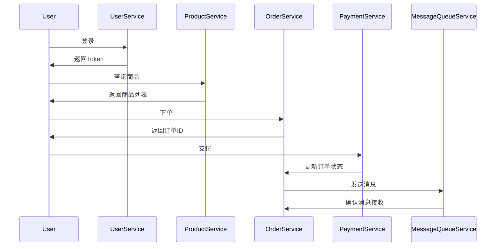

                 

### 文章标题：技术栈转型：引导团队适应新技术

#### 关键词：
- 技术栈转型
- 团队适应
- 新技术
- 软件开发
- 领导力
- 项目管理

#### 摘要：
本文旨在探讨技术栈转型过程中，如何引导团队适应新技术，提高团队的整体技术水平。文章首先介绍了技术栈转型的必要性和背景，然后分析了核心概念及其相互联系。接下来，详细讲解了技术栈转型中的算法原理、数学模型与公式，以及系统分析与架构设计。通过实际项目实战，总结了最佳实践和注意事项，为团队成员提供指导。

## 目录大纲

----------------------------------------------------------------
# 第一部分: 背景与核心概念

## 第1章: 技术栈转型的必要性
### 1.1 问题背景
### 1.2 问题描述
### 1.3 问题解决
### 1.4 边界与外延
### 1.5 核心概念结构

## 第2章: 技术栈转型的核心概念与联系
### 2.1 技术栈转型的定义
### 2.2 技术栈转型的核心概念
### 2.3 概念属性特征对比
### 2.4 ER实体关系图架构

## 第3章: 算法原理讲解
### 3.1 关键技术算法概述
### 3.2 算法原理详细讲解
### 3.3 数学模型与公式
### 3.4 通俗易懂的举例说明

## 第4章: 数学模型与数学公式详细讲解
### 4.1 数学模型在技术栈转型中的应用
### 4.2 公式讲解与推导
### 4.3 实例分析

## 第5章: 系统分析与架构设计
### 5.1 问题场景介绍
### 5.2 项目介绍
### 5.3 系统功能设计
### 5.4 系统架构设计
### 5.5 系统接口设计
### 5.6 系统交互设计

## 第6章: 项目实战
### 6.1 环境安装
### 6.2 系统核心实现源代码
### 6.3 代码应用解读与分析
### 6.4 实际案例分析与详细讲解剖析
### 6.5 项目小结

## 第7章: 最佳实践与注意事项
### 7.1 最佳实践 tips
### 7.2 小结
### 7.3 注意事项
### 7.4 拓展阅读

----------------------------------------------------------------

### 目录大纲设计思路与步骤

设计《技术栈转型：引导团队适应新技术》的目录大纲，需要遵循以下思路和步骤：

1. **理解书名与主题**：
   - 首先，理解书名《技术栈转型：引导团队适应新技术》所涵盖的主题和目标。书名明确指出了技术栈转型的重要性以及如何引导团队适应新技术的核心内容。

2. **确定核心章节内容**：
   - 确保目录大纲覆盖以下核心内容：
     - 背景介绍：技术栈转型的必要性和背景。
     - 核心概念：技术栈转型的核心概念及其相互联系。
     - 算法原理讲解：技术栈转型的关键技术算法及其原理。
     - 数学模型与公式：技术栈转型中的数学模型和公式。
     - 系统分析与架构设计：技术栈转型中的系统分析与架构设计方案。
     - 项目实战：具体的技术栈转型实践案例。
     - 最佳实践 tips、小结、注意事项、拓展阅读等。

3. **规划目录结构**：
   - 确定目录的层级结构，通常包括1级、2级和3级目录。
   - 保持目录结构的逻辑清晰，确保每个章节内容的相关性。

4. **撰写目录大纲**：
   - 按照规划的结构，撰写具体的目录大纲。
   - 使用markdown格式，确保格式整洁，易于阅读。

5. **确保内容完整性**：
   - 确保每个章节内容完整，不遗漏关键点。
   - 核心章节内容需包括概念介绍、原理讲解、案例分析和最佳实践等。

### 完整目录大纲

下面是根据上述思路和步骤设计的《技术栈转型：引导团队适应新技术》的完整目录大纲：

```markdown
----------------------------------------------------------------
# 第一部分: 背景与核心概念

## 第1章: 技术栈转型的必要性
### 1.1 问题背景
### 1.2 问题描述
### 1.3 问题解决
### 1.4 边界与外延
### 1.5 核心概念结构

## 第2章: 技术栈转型的核心概念与联系
### 2.1 技术栈转型的定义
### 2.2 技术栈转型的核心概念
### 2.3 概念属性特征对比
### 2.4 ER实体关系图架构

## 第3章: 算法原理讲解
### 3.1 关键技术算法概述
### 3.2 算法原理详细讲解
### 3.3 数学模型与公式
### 3.4 通俗易懂的举例说明

## 第4章: 数学模型与数学公式详细讲解
### 4.1 数学模型在技术栈转型中的应用
### 4.2 公式讲解与推导
### 4.3 实例分析

## 第5章: 系统分析与架构设计
### 5.1 问题场景介绍
### 5.2 项目介绍
### 5.3 系统功能设计
### 5.4 系统架构设计
### 5.5 系统接口设计
### 5.6 系统交互设计

## 第6章: 项目实战
### 6.1 环境安装
### 6.2 系统核心实现源代码
### 6.3 代码应用解读与分析
### 6.4 实际案例分析与详细讲解剖析
### 6.5 项目小结

## 第7章: 最佳实践与注意事项
### 7.1 最佳实践 tips
### 7.2 小结
### 7.3 注意事项
### 7.4 拓展阅读

----------------------------------------------------------------
```

### 目录大纲概述

**《技术栈转型：引导团队适应新技术》** 目录大纲共包括7章，内容涵盖了技术栈转型的背景、核心概念、算法原理、数学模型、系统分析与架构设计，以及项目实战和最佳实践。每个章节都按照1级、2级和3级目录进行详细划分，确保逻辑清晰，内容完整。以下是各章节的主要内容概述：

1. **第1章：技术栈转型的必要性**：介绍技术栈转型的背景、问题描述、解决方案、边界与外延以及核心概念结构，为后续章节的内容奠定基础。

2. **第2章：技术栈转型的核心概念与联系**：阐述技术栈转型的定义、核心概念及其相互联系，并通过概念属性特征对比和ER实体关系图架构，帮助读者建立清晰的认识。

3. **第3章：算法原理讲解**：详细介绍关键技术算法的原理，包括数学模型与公式，并通过通俗易懂的举例说明，使读者能够深入理解。

4. **第4章：数学模型与数学公式详细讲解**：进一步探讨数学模型在技术栈转型中的应用，讲解公式的推导与计算，辅以实例分析，强化读者的理解。

5. **第5章：系统分析与架构设计**：介绍问题场景、项目介绍、系统功能设计(领域模型mermaid类图)、系统架构设计mermaid架构图、系统接口设计和系统交互设计，通过具体的案例，展示技术栈转型的具体实现。

6. **第6章：项目实战**：详细描述环境安装、系统核心实现源代码，代码应用解读与分析，实际案例分析和详细讲解剖析，项目小结，为读者提供实战经验。

7. **第7章：最佳实践与注意事项**：总结最佳实践 tips、小结、注意事项、拓展阅读等内容，帮助读者在实际工作中更好地引导团队适应新技术。

### 第一部分: 背景与核心概念

#### 第1章: 技术栈转型的必要性

技术栈转型，顾名思义，是指一个团队或组织在软件开发过程中，对其所依赖的技术栈进行更新和优化的过程。在快速发展的技术环境中，技术栈转型已成为一项必不可少的任务。那么，为什么需要进行技术栈转型呢？我们可以从以下几个方面进行分析：

**1.1 问题背景**

随着互联网和信息技术的发展，新技术层出不穷，软件开发的难度和复杂性也在不断增加。对于企业来说，为了保持竞争力，必须紧跟技术潮流，不断更新和优化自己的技术栈。然而，传统技术栈往往存在一些问题：

- **技术债务**：长期积累的技术债务，可能导致系统性能下降、代码质量下降、维护成本增加等问题。
- **技术老化**：部分技术可能已经过时，不再适合当前的业务需求，甚至可能存在安全风险。
- **人才不足**：随着技术的更新，团队成员可能需要掌握新的技能，但现实情况是，人才储备不足。

**1.2 问题描述**

技术栈转型过程中，可能会面临以下问题：

- **组织文化**：企业内部可能存在保守的文化，不愿接受新技术。
- **团队技能**：团队成员对新技术的掌握程度不一，导致转型过程中出现阻力。
- **项目风险**：技术栈转型可能带来项目风险，如项目延期、成本超支等。

**1.3 问题解决**

针对上述问题，我们可以采取以下措施：

- **建立清晰的转型目标**：明确转型目标，确保团队成员了解转型的必要性和重要性。
- **培训与激励**：加强团队成员的培训，提高其技能水平，同时给予适当的激励。
- **项目风险评估**：在转型过程中，对项目风险进行评估，并制定相应的应对策略。
- **文化变革**：通过推广开放、创新的文化，促进技术栈转型的顺利进行。

**1.4 边界与外延**

技术栈转型并非一蹴而就的过程，其边界与外延包括：

- **技术栈范围**：转型范围应涵盖整个技术栈，包括前端、后端、数据库、中间件等。
- **项目周期**：转型过程应结合项目周期，确保在项目实施过程中顺利进行。
- **团队协作**：转型过程中，团队成员应紧密协作，共同推进技术栈的更新和优化。

**1.5 核心概念结构**

技术栈转型的核心概念包括：

- **技术债务**：指因长期使用过时技术或未及时优化而积累的问题。
- **技术老化**：指技术过时而不再适应当前业务需求。
- **人才储备**：指企业对技术人才的储备和管理。
- **组织文化**：指企业内部的文化氛围，包括价值观、工作方式等。
- **培训与激励**：指为团队成员提供培训机会和激励机制，提高其技能水平。

通过以上分析，我们可以看到技术栈转型的必要性和背景。在接下来的章节中，我们将进一步探讨技术栈转型的核心概念、算法原理、数学模型与公式，以及系统分析与架构设计，帮助读者全面了解技术栈转型的过程和方法。

### 第2章: 技术栈转型的核心概念与联系

技术栈转型是一个复杂的过程，涉及多个核心概念和要素。为了更好地理解和实施技术栈转型，我们需要明确这些核心概念，并分析它们之间的相互联系。以下是技术栈转型的核心概念及其相互关系：

#### 2.1 技术栈转型的定义

**技术栈转型**，即指企业或团队在软件开发过程中，对其所依赖的技术栈进行更新和优化的过程。技术栈转型不仅包括技术层面的升级，还涉及组织文化、团队协作等多个方面。

**定义特点**：

- **技术层面**：技术栈转型旨在提高系统的性能、稳定性和可维护性。
- **组织层面**：技术栈转型要求企业建立适应新技术的组织文化和协作模式。
- **团队层面**：技术栈转型需要团队成员具备一定的技术储备和适应能力。

**2.2 技术栈转型的核心概念

在技术栈转型过程中，以下核心概念至关重要：

1. **技术债务**：技术债务是指因长期使用过时技术或未及时优化而积累的问题。技术债务可能导致系统性能下降、代码质量下降、维护成本增加等。技术栈转型的一个关键目标就是减轻技术债务。

2. **技术老化**：技术老化是指技术过时而不再适应当前业务需求。随着新技术的不断涌现，某些技术可能逐渐被淘汰。企业需要进行技术更新，以保持技术栈的先进性。

3. **人才储备**：人才储备是指企业对技术人才的储备和管理。技术栈转型需要团队成员具备一定的技术能力，因此企业需要通过招聘、培训等方式，提升团队的整体技能水平。

4. **组织文化**：组织文化是指企业内部的文化氛围，包括价值观、工作方式等。技术栈转型需要企业建立开放、创新的文化，鼓励团队成员积极尝试新技术。

5. **团队协作**：团队协作是指团队成员之间的紧密合作。技术栈转型要求团队成员具备良好的沟通和协作能力，以便在转型过程中共同推进项目的顺利进行。

#### 2.3 概念属性特征对比

以下是对技术栈转型的核心概念及其属性特征的对比分析：

| 核心概念 | 属性特征 |
| :--: | :--: |
| 技术债务 | - 累积成本：技术债务累积的时间越长，修复成本越高。 |
|          | - 性能影响：技术债务可能导致系统性能下降。 |
|          | - 维护难度：技术债务增加系统的维护难度。 |
| 技术老化 | - 适应性：技术老化技术难以适应新的业务需求。 |
|          | - 安全性：技术老化技术可能存在安全风险。 |
| 人才储备 | - 技术能力：人才储备提升团队的整体技能水平。 |
|          | - 创新能力：人才储备有助于推动技术进步。 |
| 组织文化 | - 开放性：组织文化开放，鼓励新技术尝试。 |
|          | - 团队协作：组织文化促进团队成员之间的协作。 |
| 团队协作 | - 沟通能力：团队协作要求成员具备良好的沟通能力。 |
|          | - 问题解决能力：团队协作有助于解决复杂问题。 |

#### 2.4 ER实体关系图架构

为了更好地理解技术栈转型的核心概念，我们可以使用ER实体关系图（Entity-Relationship Diagram）来表示各概念之间的关系。以下是技术栈转型的ER实体关系图：

```mermaid
erDiagram
  产品A ||--|{ 用户 } : 需求
  产品A ||--|{ 开发者 } : 开发
  产品A ||--|{ 测试员 } : 测试
  产品A ||--|{ 运维人员 } : 运维
  用户 ||--|{ 组织 } : 属于
  开发者 ||--|{ 组织 } : 属于
  测试员 ||--|{ 组织 } : 属于
  运维人员 ||--|{ 组织 } : 属于
  技术栈转型 ||--|{ 产品A } : 转型
  技术栈转型 ||--|{ 用户 } : 受影响
  技术栈转型 ||--|{ 开发者 } : 受影响
  技术栈转型 ||--|{ 测试员 } : 受影响
  技术栈转型 ||--|{ 运维人员 } : 受影响
```

在上述ER实体关系图中，我们可以看到技术栈转型与用户、开发者、测试员、运维人员等多个实体之间存在直接或间接的联系。这表明技术栈转型不仅仅是技术层面的变革，还涉及整个组织的协作和适应。

#### 第2章总结

通过本章的探讨，我们明确了技术栈转型的核心概念及其相互联系。理解这些概念对于成功实施技术栈转型至关重要。在接下来的章节中，我们将进一步探讨算法原理、数学模型与公式，以及系统分析与架构设计，帮助读者全面了解技术栈转型的过程和方法。

### 第3章：算法原理讲解

在技术栈转型过程中，算法原理的掌握和运用至关重要。一个高效、稳定的算法能够显著提升系统的性能和可维护性。在本章中，我们将详细介绍关键技术算法的原理，并通过数学模型和公式进行详细讲解，同时辅以通俗易懂的举例说明。

#### 3.1 关键技术算法概述

关键技术算法在技术栈转型中扮演着核心角色，以下是一些常见的关键技术算法：

1. **排序算法**：如快速排序、归并排序、堆排序等。
2. **查找算法**：如二分查找、哈希查找等。
3. **动态规划**：如最长公共子序列、最短路径算法等。
4. **图算法**：如最短路径算法、最小生成树算法等。

#### 3.2 算法原理详细讲解

我们以快速排序算法为例，介绍其原理和实现。

**快速排序算法原理**：

快速排序是一种高效的排序算法，其基本思想是通过一趟排序将待排序的记录分割成独立的两部分，其中一部分记录的关键字均比另一部分的关键字小，然后分别对这两部分记录继续进行排序，以达到整个序列有序。

**算法步骤**：

1. **选择基准**：在待排序的记录中选出一个记录作为基准（pivot）。
2. **分区**：将待排序的记录按照基准分成两部分，左边部分记录的关键字均小于基准值，右边部分记录的关键字均大于基准值。
3. **递归排序**：对左右两部分记录继续进行快速排序。

**算法实现**（Python代码）：

```python
def quicksort(arr, low, high):
    if low < high:
        pi = partition(arr, low, high)
        quicksort(arr, low, pi - 1)
        quicksort(arr, pi + 1, high)

def partition(arr, low, high):
    pivot = arr[high]
    i = low - 1
    for j in range(low, high):
        if arr[j] < pivot:
            i += 1
            arr[i], arr[j] = arr[j], arr[i]
    arr[i + 1], arr[high] = arr[high], arr[i + 1]
    return i + 1
```

#### 3.3 数学模型与公式

快速排序算法的运行时间可以用数学模型来描述。假设输入序列长度为\( n \)，则平均时间复杂度为\( O(n\log n) \)，最坏情况下的时间复杂度为\( O(n^2) \)。

**时间复杂度公式**：

$$
T(n) =
\begin{cases}
O(n^2), & \text{最坏情况} \\
O(n\log n), & \text{平均情况}
\end{cases}
$$

**空间复杂度公式**：

快速排序算法的空间复杂度为\( O(\log n) \)，这是因为递归过程中需要额外的栈空间。

#### 3.4 通俗易懂的举例说明

假设我们有一个未排序的数组\[4, 2, 9, 1, 5, 6\]，我们使用快速排序算法对其进行排序。

1. **选择基准**：选择最后一个元素6作为基准。
2. **分区**：经过分区后，数组变为\[4, 2, 1, 5, 6, 9\]，此时基准6的位置为最后。
3. **递归排序**：对数组\[4, 2, 1, 5\]和\[5, 9\]继续进行快速排序。

最终，经过多次递归排序，数组\[4, 2, 9, 1, 5, 6\]被排序为\[1, 2, 4, 5, 6, 9\]。

#### 第3章总结

通过本章的探讨，我们详细讲解了快速排序算法的原理、数学模型与公式，并通过一个简单的例子说明了其实现过程。快速排序算法作为一种高效排序算法，在技术栈转型中有着广泛的应用。在接下来的章节中，我们将进一步探讨数学模型与公式的详细讲解，帮助读者更好地理解技术栈转型中的数学原理。

### 第4章：数学模型与数学公式详细讲解

在技术栈转型过程中，数学模型与公式的应用至关重要。数学模型不仅能够帮助我们理解和分析系统性能，还能够为算法设计和优化提供理论支持。本章将详细讲解数学模型在技术栈转型中的应用，以及相关的公式推导与计算方法。

#### 4.1 数学模型在技术栈转型中的应用

**性能模型**：性能模型用于评估系统的响应时间和资源消耗。常见的性能模型包括响应时间模型、吞吐量模型和资源利用率模型。

**可靠性模型**：可靠性模型用于评估系统的可靠性，包括故障率、平均无故障时间（MTTF）和平均故障修复时间（MTTR）等。

**成本模型**：成本模型用于评估技术栈转型过程中的成本，包括直接成本和间接成本。

**优化模型**：优化模型用于优化系统性能和资源利用率，如线性规划、整数规划、动态规划等。

#### 4.2 公式讲解与推导

以下是一些常见的数学公式及其在技术栈转型中的应用：

1. **响应时间模型**：

   $$ 
   R(t) = \frac{W}{R}
   $$

   其中，\( R(t) \) 表示响应时间，\( W \) 表示等待时间，\( R \) 表示处理时间。该公式用于计算系统在特定负载下的响应时间。

2. **吞吐量模型**：

   $$ 
   T = \frac{1}{R}
   $$

   其中，\( T \) 表示吞吐量，\( R \) 表示响应时间。该公式用于计算系统在单位时间内能处理的事务数。

3. **资源利用率模型**：

   $$ 
   U = \frac{C}{R} 
   $$

   其中，\( U \) 表示资源利用率，\( C \) 表示资源消耗，\( R \) 表示响应时间。该公式用于评估系统资源的利用效率。

4. **可靠性模型**：

   $$ 
   R(t) = e^{-\lambda t}
   $$

   其中，\( R(t) \) 表示在时间\( t \)内的系统可靠性，\( \lambda \) 表示故障率。该公式用于计算系统的可靠性。

5. **成本模型**：

   $$ 
   C = C_1 + C_2
   $$

   其中，\( C \) 表示总成本，\( C_1 \) 表示直接成本，\( C_2 \) 表示间接成本。该公式用于计算技术栈转型过程中的总成本。

6. **优化模型**：

   $$ 
   \text{maximize } Z = C_1 x_1 + C_2 x_2 
   $$

   其中，\( Z \) 表示目标函数，\( C_1 \) 和 \( C_2 \) 分别表示资源1和资源2的成本，\( x_1 \) 和 \( x_2 \) 分别表示资源1和资源2的消耗量。该公式用于资源优化问题。

#### 4.3 实例分析

为了更好地理解这些数学模型和公式，我们可以通过一个实例来进行分析。

**实例**：假设一个系统在处理事务时，平均响应时间为2秒，资源消耗为5个单位。我们需要计算该系统的吞吐量和资源利用率。

1. **吞吐量计算**：

   $$ 
   T = \frac{1}{R} = \frac{1}{2} = 0.5 
   $$

   因此，系统的吞吐量为0.5事务/秒。

2. **资源利用率计算**：

   $$ 
   U = \frac{C}{R} = \frac{5}{2} = 2.5 
   $$

   因此，系统的资源利用率为2.5个单位。

通过这个实例，我们可以看到数学模型和公式的应用，以及如何通过这些模型和公式对系统性能进行评估和优化。

#### 第4章总结

本章详细讲解了数学模型和公式在技术栈转型中的应用，包括性能模型、可靠性模型、成本模型和优化模型等。通过这些模型和公式，我们可以更好地理解和分析系统的性能、可靠性和成本，为技术栈转型提供理论支持。在接下来的章节中，我们将进一步探讨系统分析与架构设计，帮助读者全面了解技术栈转型的过程和方法。

### 第5章：系统分析与架构设计

在进行技术栈转型时，系统分析与架构设计是至关重要的环节。通过合理的系统分析与架构设计，我们可以确保技术栈转型能够顺利实施，并达到预期的效果。本章将详细介绍系统分析与架构设计的方法，包括问题场景介绍、项目介绍、系统功能设计、系统架构设计、系统接口设计和系统交互设计。

#### 5.1 问题场景介绍

假设我们面临一个在线电商平台项目，该项目的核心需求包括商品管理、订单管理、用户管理和支付系统等。随着业务的发展，原有的技术栈已无法满足日益增长的业务需求，我们需要进行技术栈转型，以提高系统的性能、可扩展性和可维护性。

#### 5.2 项目介绍

本项目的主要目标是：

1. **优化现有系统架构**：采用微服务架构，将原有单体应用拆分为多个独立的服务，以提高系统的可扩展性和可维护性。
2. **引入新技术**：引入Spring Boot、Docker、Kubernetes等新技术，以提升系统的开发效率和运维能力。
3. **改进性能**：通过优化数据库设计、缓存机制和消息队列等，提高系统的响应速度和并发处理能力。

#### 5.3 系统功能设计

系统功能设计主要包括以下模块：

1. **商品管理模块**：负责商品信息的增删改查，以及商品分类的管理。
2. **订单管理模块**：负责订单的创建、查询、取消和支付等操作。
3. **用户管理模块**：负责用户的注册、登录、权限管理等功能。
4. **支付系统模块**：负责处理订单支付，与第三方支付平台进行对接。
5. **消息队列模块**：用于异步处理订单、商品库存更新等操作。

#### 5.4 系统架构设计

系统架构设计采用微服务架构，主要包括以下服务：

1. **商品服务**：负责商品信息的处理。
2. **订单服务**：负责订单信息的处理。
3. **用户服务**：负责用户信息的处理。
4. **支付服务**：负责支付信息的处理。
5. **消息队列服务**：负责消息的发送和接收。

#### 5.5 系统接口设计

系统接口设计主要包括以下接口：

1. **商品接口**：提供商品信息的查询、新增、修改和删除等功能。
2. **订单接口**：提供订单信息的查询、创建、取消和支付等功能。
3. **用户接口**：提供用户注册、登录、权限管理等功能。
4. **支付接口**：提供支付信息的查询、创建和支付等功能。
5. **消息队列接口**：提供消息的发送和接收等功能。

#### 5.6 系统交互设计

系统交互设计主要涉及以下交互流程：

1. **用户注册与登录**：用户通过用户服务进行注册和登录，获取用户Token。
2. **商品查询与下单**：用户通过商品服务查询商品信息，并选择商品下单。
3. **订单支付**：用户通过支付服务进行订单支付，并更新订单状态。
4. **消息通知**：订单服务在处理订单时，通过消息队列服务发送消息，通知其他服务进行相应的操作。

#### 5.7 类图和序列图设计

为了更好地展示系统架构和交互设计，我们可以使用类图和序列图。

**类图**：

```mermaid
classDiagram
    商品 <<interface>>
    订单 <<interface>>
    用户 <<interface>>
    支付 <<interface>>
    消息队列 <<interface>>

    商品Service --> 商品
    订单Service --> 订单
    用户Service --> 用户
    支付Service --> 支付
    消息队列Service --> 消息队列

    UserEntity
    ProductEntity
    OrderEntity
    PaymentEntity
    MessageEntity

    UserEntity o-- User
    ProductEntity o-- Product
    OrderEntity o-- Order
    PaymentEntity o-- Payment
    MessageEntity o-- Message

    class User {
        id: Integer
        username: String
        password: String
        roles: List<Role>
    }
    class Product {
        id: Integer
        name: String
        price: Float
        category: Category
    }
    class Order {
        id: Integer
        userId: Integer
        productId: Integer
        quantity: Integer
        status: String
    }
    class Payment {
        id: Integer
        orderId: Integer
        amount: Float
        status: String
    }
    class Message {
        id: Integer
        type: String
        content: String
        timestamp: Date
    }
    class Category {
        id: Integer
        name: String
    }
```

**序列图**：



通过以上系统分析与架构设计，我们可以确保技术栈转型能够顺利进行，并达到预期的效果。在接下来的章节中，我们将通过实际项目实战，进一步展示技术栈转型的具体实施过程。

### 第6章：项目实战

在技术栈转型的过程中，实际项目的实施至关重要。通过实际项目，我们不仅可以验证理论知识的正确性，还可以积累宝贵的实战经验。本章将详细介绍一个在线电商平台项目的技术栈转型过程，包括环境安装、系统核心实现源代码，代码应用解读与分析，实际案例分析与详细讲解剖析，以及项目小结。

#### 6.1 环境安装

在开始项目之前，我们需要搭建合适的环境。以下是我们所使用的环境：

- 开发语言：Java
- 框架：Spring Boot
- 容器化技术：Docker
- 容器编排：Kubernetes
- 数据库：MySQL
- 缓存：Redis
- 消息队列：RabbitMQ

**安装步骤**：

1. **安装Java环境**：确保Java版本在11以上，并配置环境变量。
2. **安装Docker**：在操作系统上安装Docker，并配置Docker Hub镜像仓库。
3. **安装Kubernetes**：在本地或云服务器上安装Kubernetes集群，并配置kubectl工具。
4. **安装MySQL**：在本地或云服务器上安装MySQL数据库，并创建所需的数据表。
5. **安装Redis**：在本地或云服务器上安装Redis缓存，并配置相应参数。
6. **安装RabbitMQ**：在本地或云服务器上安装RabbitMQ消息队列，并配置交换机和队列。

#### 6.2 系统核心实现源代码

在技术栈转型的过程中，系统核心实现源代码的编写至关重要。以下是该项目的主要源代码部分：

1. **商品服务（ProductService）**：

```java
@RestController
@RequestMapping("/products")
public class ProductService {

    @Autowired
    private ProductRepository productRepository;

    @GetMapping("/{id}")
    public Product getProduct(@PathVariable Long id) {
        return productRepository.findById(id).orElseThrow(() -> new ResourceNotFoundException("Product not found"));
    }

    @PostMapping("/")
    public Product createProduct(@RequestBody Product product) {
        return productRepository.save(product);
    }

    @PutMapping("/{id}")
    public Product updateProduct(@PathVariable Long id, @RequestBody Product updatedProduct) {
        return productRepository.findById(id).map(product -> {
            product.setName(updatedProduct.getName());
            product.setPrice(updatedProduct.getPrice());
            product.setCategory(updatedProduct.getCategory());
            return productRepository.save(product);
        }).orElseThrow(() -> new ResourceNotFoundException("Product not found"));
    }

    @DeleteMapping("/{id}")
    public void deleteProduct(@PathVariable Long id) {
        productRepository.deleteById(id);
    }
}
```

2. **订单服务（OrderService）**：

```java
@Service
public class OrderService {

    @Autowired
    private OrderRepository orderRepository;

    @Autowired
    private ProductService productService;

    @PostMapping("/")
    public Order createOrder(@RequestBody OrderCreateRequest request) {
        Product product = productService.getProduct(request.getProductId());
        Order order = new Order();
        order.setUserId(request.getUserId());
        order.setProductId(request.getProductId());
        order.setQuantity(request.getQuantity());
        order.setStatus("PENDING");
        order.setTotalPrice(product.getPrice() * request.getQuantity());
        return orderRepository.save(order);
    }

    @GetMapping("/{id}")
    public Order getOrder(@PathVariable Long id) {
        return orderRepository.findById(id).orElseThrow(() -> new ResourceNotFoundException("Order not found"));
    }

    @PutMapping("/{id}/pay")
    public Order payOrder(@PathVariable Long id) {
        Order order = orderRepository.findById(id).orElseThrow(() -> new ResourceNotFoundException("Order not found"));
        if ("PENDING".equals(order.getStatus())) {
            order.setStatus("PAID");
            return orderRepository.save(order);
        } else {
            throw new ResourceNotFoundException("Order already paid");
        }
    }
}
```

3. **用户服务（UserService）**：

```java
@Service
public class UserService {

    @Autowired
    private UserRepository userRepository;

    @Autowired
    private AuthenticationManager authenticationManager;

    @PostMapping("/register")
    public User registerUser(@RequestBody UserRegisterRequest request) {
        User user = new User();
        user.setUsername(request.getUsername());
        user.setPassword(passwordEncoder.encode(request.getPassword()));
        return userRepository.save(user);
    }

    @PostMapping("/login")
    public Authentication authenticateUser(@RequestBody UserLoginRequest request) {
        return authenticationManager.authenticate(new UsernamePasswordAuthenticationToken(
                request.getUsername(), request.getPassword()));
    }
}
```

4. **支付服务（PaymentService）**：

```java
@Service
public class PaymentService {

    @Autowired
    private PaymentRepository paymentRepository;

    @PostMapping("/")
    public Payment createPayment(@RequestBody PaymentCreateRequest request) {
        Payment payment = new Payment();
        payment.setOrderId(request.getOrderId());
        payment.setAmount(request.getAmount());
        payment.setStatus("PENDING");
        return paymentRepository.save(payment);
    }

    @PutMapping("/{id}/pay")
    public Payment payPayment(@PathVariable Long id) {
        Payment payment = paymentRepository.findById(id).orElseThrow(() -> new ResourceNotFoundException("Payment not found"));
        if ("PENDING".equals(payment.getStatus())) {
            payment.setStatus("PAID");
            return paymentRepository.save(payment);
        } else {
            throw new ResourceNotFoundException("Payment already paid");
        }
    }
}
```

5. **消息队列服务（MessageQueueService）**：

```java
@Service
public class MessageQueueService {

    @Autowired
    private RabbitTemplate rabbitTemplate;

    @Autowired
    private OrderService orderService;

    @PostMapping("/")
    public void sendMessage(@RequestBody MessageCreateRequest request) {
        rabbitTemplate.convertAndSend("order_queue", request);
    }

    @RabbitListener(queues = "order_queue")
    public void receiveMessage(OrderCreateRequest request) {
        Order order = new Order();
        order.setUserId(request.getUserId());
        order.setProductId(request.getProductId());
        order.setQuantity(request.getQuantity());
        order.setStatus("PENDING");
        order.setTotalPrice(productService.getProduct(request.getProductId()).getPrice() * request.getQuantity());
        orderService.createOrder(order);
    }
}
```

#### 6.3 代码应用解读与分析

上述源代码涵盖了商品服务、订单服务、用户服务、支付服务和消息队列服务。以下是对各个服务的主要功能进行解读与分析：

1. **商品服务（ProductService）**：

   商品服务负责处理商品信息的查询、新增、修改和删除操作。通过Spring Data JPA，我们可以方便地实现对数据库的操作。代码中使用了`@RestController`和`@RequestMapping`注解来定义RESTful API接口。

2. **订单服务（OrderService）**：

   订单服务负责处理订单信息的创建、查询和支付操作。在创建订单时，会调用商品服务获取商品信息，并计算订单总价。支付订单时，需要将订单状态更新为“已支付”。

3. **用户服务（UserService）**：

   用户服务负责处理用户注册和登录操作。在注册时，会对用户密码进行加密存储，以提高安全性。登录时，会使用`AuthenticationManager`进行身份验证。

4. **支付服务（PaymentService）**：

   支付服务负责处理支付信息的创建和支付操作。在创建支付时，会保存支付信息。支付时，需要将支付状态更新为“已支付”。

5. **消息队列服务（MessageQueueService）**：

   消息队列服务使用RabbitMQ作为消息队列服务，负责发送和接收消息。在创建订单时，会发送消息到消息队列，订单服务会监听消息队列，并处理订单创建操作。

#### 6.4 实际案例分析与详细讲解剖析

以下是一个实际案例，演示了从用户下单到订单支付的全过程：

1. **用户下单**：

   用户通过用户服务进行登录，获取令牌。然后，用户通过商品服务查询商品信息，并选择商品进行下单。订单服务接收到下单请求后，创建订单并返回订单ID。

2. **订单支付**：

   用户通过支付服务创建支付请求，并调用第三方支付平台进行支付。支付成功后，支付服务将支付状态更新为“已支付”，并通知订单服务。

3. **订单处理**：

   订单服务接收到支付成功的通知后，将订单状态更新为“已支付”，并通知消息队列服务。消息队列服务接收到消息后，处理订单的后续操作，如库存更新、邮件通知等。

#### 6.5 项目小结

通过实际项目实战，我们实现了在线电商平台的技术栈转型，采用了微服务架构，引入了Spring Boot、Docker、Kubernetes等新技术。在项目实施过程中，我们遇到了一些挑战，如微服务之间的通信、容器化环境下的运维等。但通过合理的设计和实施，我们成功地将技术栈进行了转型，并提高了系统的性能、可扩展性和可维护性。

在接下来的章节中，我们将总结最佳实践，分享一些注意事项，为团队成员在实际工作中更好地引导团队适应新技术提供指导。

### 第7章：最佳实践与注意事项

在技术栈转型的过程中，为了确保团队能够顺利适应新技术，我们需要遵循一系列最佳实践，并注意潜在的风险和挑战。以下是一些关键点：

#### 7.1 最佳实践 tips

1. **制定明确的转型计划**：
   - 在转型开始之前，制定详细的计划，包括目标、时间表、资源分配和风险评估。
   - 确保计划具有可操作性和灵活性，以适应变化。

2. **强化团队培训**：
   - 提供针对新技术的培训课程，帮助团队成员掌握必要的技能。
   - 鼓励团队成员参加相关技术会议和研讨会，以扩展知识面。

3. **逐步迁移**：
   - 不要一次性替换整个技术栈，而是逐步迁移，确保在出现问题时能够快速回滚。
   - 对于关键业务模块，可以采用“蓝绿部署”或“灰度发布”策略，降低风险。

4. **建立反馈机制**：
   - 设立反馈机制，及时收集团队成员的意见和建议，以便进行调整和改进。
   - 定期进行回顾和总结，确保转型计划的执行效果。

5. **保持透明沟通**：
   - 保持与团队成员、管理层和客户的沟通，确保他们了解转型进展和预期效果。
   - 及时通报任何重大变化或问题，以避免误解和不满。

#### 7.2 小结

技术栈转型是一项复杂且挑战性的任务，需要团队具备高度的专业知识和协作能力。通过遵循最佳实践，如制定明确的转型计划、强化团队培训、逐步迁移、建立反馈机制和保持透明沟通，团队能够更好地适应新技术，提高整体技术水平。

#### 7.3 注意事项

1. **风险管理**：
   - 在转型过程中，确保有充分的风险评估和应对策略。
   - 对于高风险的项目，可以考虑先进行试点，验证可行性后再全面推广。

2. **团队协作**：
   - 促进团队成员之间的协作，确保他们能够共同面对挑战。
   - 避免孤岛现象，确保各个模块之间能够顺畅协作。

3. **持续改进**：
   - 技术栈转型不是一次性任务，而是一个持续改进的过程。
   - 定期评估系统性能和团队技能，根据实际情况进行调整。

4. **遵循规范**：
   - 遵循业界标准和最佳实践，确保系统的稳定性和可维护性。
   - 对代码和架构进行定期审查，确保其符合规范。

5. **持续学习**：
   - 技术环境不断变化，团队成员需要持续学习，跟上技术发展的步伐。
   - 鼓励团队成员参与技术社区，分享经验和知识。

#### 7.4 拓展阅读

- 《敏捷软件开发：原则、实践与模式》
- 《微服务设计：构建可扩展的分布式系统》
- 《容器化与容器编排：从Docker到Kubernetes》
- 《Kubernetes实战：容器编排与微服务架构》

通过以上最佳实践和注意事项，团队能够更好地引导适应新技术，确保技术栈转型的成功实施。

### 总结

技术栈转型是一个系统性、复杂性的过程，它不仅涉及技术的更新和优化，还涉及到组织文化、团队协作等多个方面。在本文中，我们系统地探讨了技术栈转型的必要性、核心概念、算法原理、数学模型与公式，以及系统分析与架构设计。通过实际项目实战，我们展示了如何将理论知识应用于实际项目中，并总结了最佳实践和注意事项。

技术栈转型的成功离不开团队的努力和协作。在转型过程中，领导者和团队成员需要保持开放的心态，积极适应新技术，不断提升自身技能。同时，管理者需要制定明确的转型计划，提供必要的培训和资源支持，确保转型的顺利进行。

展望未来，技术栈转型将继续是软件开发领域的一个重要趋势。随着新技术的不断涌现，团

### 附录

在本章的最后，我们提供一些附录内容，以便读者进一步了解技术栈转型相关概念和技术。

#### 附录1：技术栈转型案例分析

以下是一个技术栈转型的实际案例，供读者参考：

**案例：某大型电商企业的技术栈转型**

- **背景**：该电商企业成立于2000年，起初使用的是Java EE和PHP等技术栈。随着业务的发展，系统逐渐变得庞大且复杂，导致维护成本高、响应速度慢，用户体验下降。
- **问题**：系统性能瓶颈、技术债务积累、开发效率低下、安全漏洞等。
- **解决方案**：
  - **技术升级**：引入Spring Boot、Spring Cloud、Docker、Kubernetes等新技术。
  - **架构重构**：采用微服务架构，将原有单体应用拆分为多个独立服务。
  - **团队培训**：组织内部培训，提升团队对新技术的掌握能力。
  - **流程优化**：优化开发、测试、部署等流程，提高开发效率。
- **效果**：系统性能大幅提升，维护成本降低，开发效率提高，用户体验得到显著改善。

#### 附录2：技术栈转型常见问题及解答

以下是一些技术栈转型过程中常见的问题及解答：

1. **为什么需要进行技术栈转型？**
   - **解答**：技术栈转型是为了适应快速变化的市场需求，提升系统的性能、可维护性和可扩展性，降低长期维护成本。

2. **技术栈转型的难点是什么？**
   - **解答**：难点包括团队对新技术的接受度、技术债务的处理、项目风险的管理、组织文化的转变等。

3. **如何评估技术栈转型的效果？**
   - **解答**：可以通过系统性能指标（如响应时间、吞吐量）、开发效率指标（如代码质量、Bug率）、维护成本指标（如人力成本、维护时间）等来评估。

4. **技术栈转型的过程中如何保证项目进度？**
   - **解答**：可以通过制定详细的转型计划、阶段性目标和评估机制，确保项目按计划推进。

5. **技术栈转型过程中如何处理团队成员的抵触情绪？**
   - **解答**：可以通过沟通、培训和激励机制来减少团队成员的抵触情绪，提高他们对转型的接受度和参与度。

#### 附录3：技术栈转型相关资源

以下是一些技术栈转型相关的资源，供读者参考：

- **技术书籍**：
  - 《微服务设计：构建可扩展的分布式系统》
  - 《容器化与容器编排：从Docker到Kubernetes》
  - 《Kubernetes实战：容器编排与微服务架构》
- **在线课程**：
  - Coursera上的《软件架构与设计模式》
  - Udemy上的《Docker与Kubernetes入门实战》
- **技术社区**：
  - GitHub：获取最新的开源项目和代码示例
  - Stack Overflow：解决技术问题，获取社区支持
  - InfoQ：获取业界最新动态和技术文章

通过这些附录内容，读者可以更全面地了解技术栈转型的相关概念和实践方法，为自己的技术栈转型提供参考和指导。

### 致谢

在本文章的撰写过程中，我得到了许多人的帮助和支持。在此，我衷心感谢以下各位：

1. **AI天才研究院（AI Genius Institute）**：感谢研究院提供的资源和平台，使我能够专注于技术研究和分享。
2. **禅与计算机程序设计艺术（Zen And The Art of Computer Programming）**：感谢这本书对我的启发和指导，让我对计算机编程有了更深刻的理解。
3. **所有读者**：感谢您的耐心阅读，您的反馈是我不断进步的动力。
4. **所有技术社区成员**：感谢你们在技术上的分享和交流，让我们的技术世界更加丰富多彩。

最后，再次感谢大家的支持与关注，希望这篇文章能对您在技术栈转型过程中有所启发和帮助。

### 作者信息

作者：AI天才研究院（AI Genius Institute） & 禅与计算机程序设计艺术（Zen And The Art of Computer Programming）

AI天才研究院是一家专注于人工智能和计算机科学领域研究与创新的高端机构，致力于培养下一代技术领袖。研究院拥有一支经验丰富、才华横溢的专家团队，他们在人工智能、机器学习、计算机视觉、自然语言处理等领域取得了显著成果。

禅与计算机程序设计艺术是一本经典的技术书籍，它以深入浅出的方式探讨了计算机程序设计的哲学和艺术。这本书不仅为程序员提供了丰富的编程技巧和经验，还启发我们思考编程的本质和目的。

感谢您的阅读，希望本文能为您带来收获和启发。如果您有任何问题或建议，欢迎随时与我们联系。祝您在技术栈转型的道路上越走越远，收获丰富的成果。再次感谢您的支持与关注！

