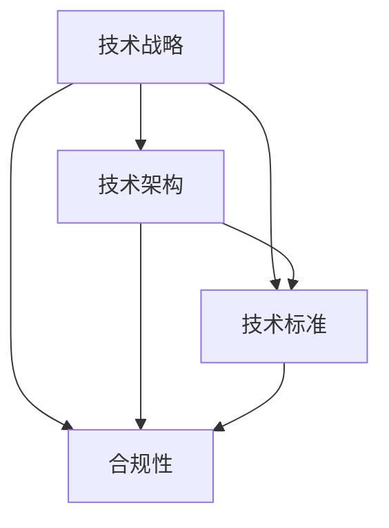
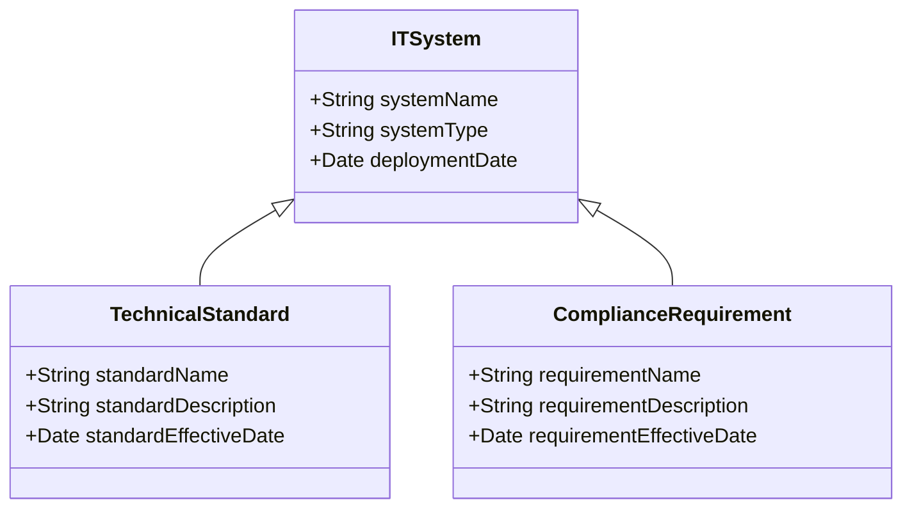
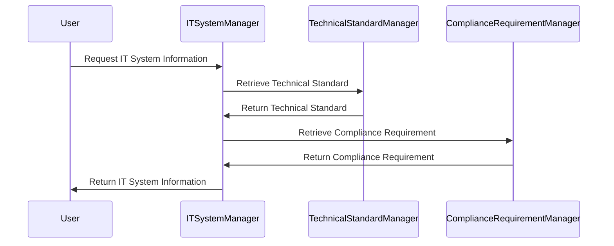
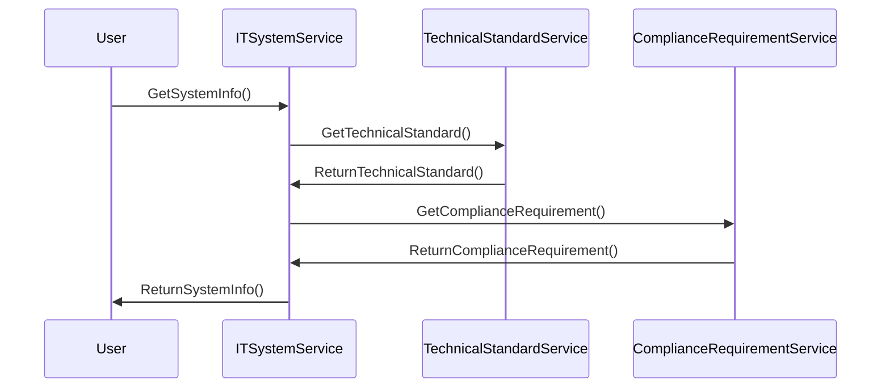

                 

### 技术治理框架：建立长效的技术管理机制

关键词：技术治理，长效管理，技术管理机制，企业IT管理，软件开发管理

摘要：本文将探讨技术治理在现代社会中的重要性，并详细阐述构建技术治理框架的方法和步骤。通过逐步分析技术治理的核心概念、策略、方法以及其实施和评估，帮助企业和组织建立长效的技术管理机制，实现技术资源的高效利用和持续发展。

----------------------------------------------------------------

## 第一部分：引言与背景

### 第1章：技术治理的必要性

1.1 问题背景

在当今数字化时代，技术已经成为企业运营和发展的核心驱动力。然而，随着技术的快速发展和复杂性的增加，企业面临的技术治理挑战也越来越大。一方面，技术治理不足可能导致资源浪费、安全漏洞和合规风险；另一方面，有效的技术治理能够提高企业的创新能力和竞争力，确保技术资源得到合理利用。

1.2 问题描述

技术治理涉及多个方面，包括技术战略、技术架构、技术标准和合规性等。然而，许多企业在技术治理方面存在以下问题：

- 技术战略不明确，缺乏统一的技术方向和目标。
- 技术架构复杂，难以维护和升级。
- 技术标准不统一，导致跨部门协作困难。
- 合规性不足，面临法律和行业标准的要求。

1.3 问题解决

为了解决上述问题，企业需要建立一套完整的技术治理框架，包括核心概念、策略、方法和实施评估。技术治理框架有助于明确技术方向、优化技术架构、统一技术标准和确保合规性，从而实现长效的技术管理。

1.4 边界与外延

技术治理的边界涉及企业内部的技术管理，包括IT部门、研发部门和其他相关业务部门。外延则包括与外部合作伙伴、供应商和客户的技术治理协作。技术治理框架需要考虑企业内外部因素，确保技术治理的全面性和有效性。

1.5 核心概念结构与要素组成

技术治理框架的核心概念包括技术战略、技术架构、技术标准和合规性。每个概念都有其特定的属性和特征，相互之间紧密联系。以下是技术治理框架的核心概念与要素组成：

- 技术战略：确定企业技术发展的长期目标和方向。
- 技术架构：设计企业技术的整体结构和层次，确保技术架构的稳定性和灵活性。
- 技术标准：制定统一的技术规范和标准，提高跨部门协作效率。
- 合规性：确保企业的技术活动符合法律和行业标准，降低合规风险。

## 第二部分：技术治理框架构建

### 第2章：技术治理的基本概念

2.1 技术治理的定义

技术治理是指企业通过制定和实施技术战略、技术架构、技术标准和合规性政策，确保技术资源得到合理利用，支持企业业务发展和创新的过程。

2.2 技术治理与企业管理

技术治理是企业管理的重要组成部分，它与企业战略、业务运营、组织架构和风险管理等紧密相关。技术治理的有效实施有助于提升企业的管理水平和竞争力。

2.3 技术治理的目标和原则

技术治理的目标包括：

- 提高技术资源利用效率，降低成本。
- 保证技术安全性和合规性。
- 促进技术创新和业务发展。

技术治理的原则包括：

- 目标导向：技术治理应以支持企业战略目标为出发点。
- 客户需求：技术治理应满足客户需求和业务需求。
- 统一标准：技术治理应制定统一的技术标准和规范。
- 持续改进：技术治理应不断优化和改进，以适应技术发展和业务变化。

### 第3章：技术治理框架的核心构成

3.1 技术治理框架概述

技术治理框架是一个系统化的方法，用于指导企业技术治理的规划和实施。它包括核心概念、策略、方法和实施评估等多个方面。

3.2 核心概念与联系

技术治理框架的核心概念包括技术战略、技术架构、技术标准和合规性。以下是这些概念之间的联系：

- 技术战略：为技术治理提供方向和目标，指导技术架构和技术标准的制定。
- 技术架构：实现技术战略的具体方案，为技术标准提供技术基础。
- 技术标准：规范技术架构的实施，确保技术架构的稳定性和可扩展性。
- 合规性：确保技术治理符合法律和行业标准，降低合规风险。

以下是技术治理框架的核心概念属性特征对比表格：

| 核心概念 | 属性特征 |
|----------|----------|
| 技术战略 | 长期目标、方向、资源配置 |
| 技术架构 | 结构、层次、模块化 |
| 技术标准 | 规范、统一、可扩展 |
| 合规性 | 法律、标准、风险管理 |

以下是技术治理框架的ER实体关系图架构的Mermaid流程图：

## 第三部分：技术治理框架的实施与评估

### 第4章：技术治理框架的实施与评估

4.1 技术治理实施流程

技术治理的实施包括以下步骤：

1. 确定技术治理目标：根据企业战略和业务需求，明确技术治理的目标。
2. 制定技术治理策略：制定实现技术治理目标的策略和方法。
3. 建立技术治理组织：建立技术治理的组织结构，明确职责和权限。
4. 制定技术标准和规范：制定统一的技术标准和规范，确保技术治理的实施。
5. 实施技术治理计划：按照技术治理策略和标准，实施技术治理计划。
6. 监控和评估：定期监控技术治理的实施效果，评估技术治理的效能。

4.2 技术治理效果评估

技术治理效果评估包括以下方面：

1. 技术资源利用效率：评估技术资源的利用情况，包括成本、性能和安全性等。
2. 技术架构稳定性：评估技术架构的稳定性和可扩展性。
3. 技术标准和合规性：评估技术标准和合规性的执行情况。
4. 业务支持能力：评估技术治理对业务发展的支持能力。

4.3 持续改进机制

技术治理是一个持续改进的过程，企业应建立持续改进机制，包括以下方面：

1. 定期回顾和总结：定期回顾技术治理的实施效果，总结经验教训。
2. 持续优化和改进：根据评估结果，持续优化技术治理框架和策略。
3. 培训和能力建设：加强对技术治理相关人员的培训和能力建设，提高技术治理能力。

## 第四部分：技术治理在特定领域的应用

### 第5章：技术治理在企业IT管理中的应用

5.1 企业IT管理的挑战

企业IT管理面临以下挑战：

1. 技术复杂性：随着信息技术的发展，企业IT系统的复杂性不断增加。
2. 资源分配：如何在有限的资源下实现最优的技术资源分配。
3. 安全性：确保企业IT系统的安全性和数据保护。
4. 合规性：遵守相关法律法规和行业标准，降低合规风险。

5.2 技术治理框架在IT管理中的应用

技术治理框架在IT管理中的应用包括：

1. 技术战略规划：明确企业IT发展的长期目标和方向。
2. 技术架构设计：设计企业IT系统的整体结构和层次。
3. 技术标准制定：制定统一的技术标准和规范，提高IT系统的稳定性。
4. 合规性管理：确保企业IT活动符合法律和行业标准。

5.3 IT管理中的最佳实践

IT管理中的最佳实践包括：

1. 明确技术发展方向：制定明确的技术发展战略，确保技术资源的有效利用。
2. 优化技术架构：定期评估和优化技术架构，提高系统的稳定性和可扩展性。
3. 强化安全意识：加强安全培训，提高员工的安全意识，降低安全风险。
4. 遵守合规要求：制定合规性管理策略，确保企业IT活动符合相关法律法规和行业标准。

### 第6章：技术治理在软件开发管理中的应用

6.1 软件开发管理的挑战

软件开发管理面临以下挑战：

1. 项目管理：如何有效管理和控制软件开发项目。
2. 技术选型：如何选择适合的编程语言和技术框架。
3. 代码质量：如何保证代码的质量和可维护性。
4. 跨部门协作：如何协调不同部门和团队之间的协作。

6.2 技术治理框架在软件开发管理中的应用

技术治理框架在软件开发管理中的应用包括：

1. 软件开发战略：明确企业软件开发的目标和方向。
2. 技术选型和管理：制定统一的技术选型和标准，提高软件开发的效率和一致性。
3. 代码质量管理：制定代码质量标准和规范，提高代码的可读性和可维护性。
4. 跨部门协作：建立跨部门协作机制，提高项目开发效率。

6.3 软件开发管理的最佳实践

软件开发管理的最佳实践包括：

1. 制定明确的软件开发计划：制定详细的软件开发计划和进度安排。
2. 采用敏捷开发方法：采用敏捷开发方法，提高软件开发的灵活性和适应性。
3. 加强代码审查和测试：加强代码审查和测试，提高代码质量和软件可靠性。
4. 建立良好的团队沟通机制：建立良好的团队沟通机制，提高项目开发的协作效率。

## 第五部分：结论与展望

### 第7章：技术治理的未来发展趋势

7.1 技术治理面临的挑战

随着技术的快速发展，技术治理面临以下挑战：

1. 新技术的快速更新：如何适应新技术的发展，确保技术治理的持续有效性。
2. 数据隐私和安全：如何保护企业数据的安全性和隐私性。
3. 跨界融合：如何应对不同行业和技术领域的跨界融合。

7.2 未来发展趋势

技术治理的未来发展趋势包括：

1. 人工智能与自动化：人工智能和自动化技术将应用于技术治理，提高治理效率和准确性。
2. 数据驱动的治理：通过大数据分析和数据可视化，实现数据驱动的技术治理。
3. 跨界融合的治理：建立跨界融合的技术治理体系，适应多元化的发展需求。

7.3 对企业的影响与建议

技术治理对企业的影响主要体现在以下几个方面：

1. 提高企业创新能力：有效的技术治理能够促进企业技术创新和业务发展。
2. 降低合规风险：规范的技术治理能够降低企业合规风险。
3. 提高运营效率：统一的技术标准和流程能够提高企业运营效率。

针对上述影响，企业应采取以下措施：

1. 加强技术治理能力建设：培养专业的人才，提高技术治理能力。
2. 完善技术治理体系：建立完善的技术治理体系，确保技术治理的持续性和有效性。
3. 强化技术创新：鼓励技术创新，支持新技术的研究和应用。

## 附录：技术治理框架应用案例详解

### 附录1：企业技术治理框架应用案例

#### 案例介绍

某大型企业为了提升IT管理效率，降低合规风险，决定引入技术治理框架。该企业拥有多个业务部门和庞大的IT系统，技术治理框架的引入将有助于统一技术标准和流程，提高IT系统的稳定性和安全性。

#### 系统功能设计（领域模型Mermaid类图）

#### 系统架构设计（Mermaid架构图）

#### 系统接口设计和系统交互（Mermaid序列图）

### 附录2：技术治理实践工具与资源指南

#### 工具介绍

1. **Apache Kafka**：分布式流处理平台，用于处理大规模数据流，适用于实时数据处理和系统集成。
2. **Docker**：容器化技术，用于部署和管理应用，提高开发效率和系统可移植性。
3. **Kubernetes**：容器编排平台，用于自动化部署、扩展和管理容器化应用。
4. **Jenkins**：自动化持续集成和持续部署工具，用于自动化构建、测试和部署软件。

#### 资源推荐

1. **技术治理框架教程**：GitHub上的开源教程，介绍技术治理的基本概念和实践方法。
2. **企业IT治理白皮书**：IT治理专业机构发布的白皮书，提供企业IT治理的最佳实践和案例分析。
3. **技术治理论坛和社区**：技术治理领域的论坛和社区，分享经验和资源，讨论技术治理相关问题。

#### 实践建议

1. **加强培训**：为员工提供技术治理培训，提高技术治理意识和能力。
2. **建立技术评审机制**：定期进行技术评审，确保技术标准和流程得到有效执行。
3. **持续改进**：定期评估技术治理效果，持续优化技术治理框架和流程。

## 总结

技术治理是现代企业不可或缺的一部分，它有助于提升企业创新能力、降低合规风险和提高运营效率。通过构建和实施技术治理框架，企业可以建立长效的技术管理机制，实现技术资源的高效利用和持续发展。未来，随着新技术的不断涌现，技术治理将面临更多挑战和机遇，企业需要持续关注技术治理的发展趋势，不断完善技术治理体系。

### 作者

**作者：AI天才研究院/AI Genius Institute & 禅与计算机程序设计艺术 /Zen And The Art of Computer Programming**

----------------------------------------------------------------

## 文章正文

### 技术治理的必要性

在当今数字化时代，技术已经成为企业运营和发展的核心驱动力。然而，随着技术的快速发展和复杂性的增加，企业面临的技术治理挑战也越来越大。一方面，技术治理不足可能导致资源浪费、安全漏洞和合规风险；另一方面，有效的技术治理能够提高企业的创新能力和竞争力，确保技术资源得到合理利用。

#### 问题背景

随着互联网、云计算、大数据、人工智能等新技术的不断涌现，企业面临的技术环境日益复杂。一方面，新技术为企业提供了无限的创新机会，但同时也带来了诸多挑战。如何选择合适的技术方向，如何管理复杂的技术架构，如何确保数据安全和合规性，成为企业面临的主要问题。另一方面，随着企业规模的扩大和业务的发展，IT系统变得更加复杂，传统的管理方法已经难以应对新的挑战。

#### 问题描述

技术治理涉及多个方面，包括技术战略、技术架构、技术标准和合规性等。然而，许多企业在技术治理方面存在以下问题：

- **技术战略不明确**：缺乏明确的技术发展方向和目标，导致技术资源分散和浪费。
- **技术架构复杂**：技术架构缺乏统一规划，导致系统难以维护和升级。
- **技术标准不统一**：技术标准不统一，导致跨部门协作困难，影响工作效率。
- **合规性不足**：技术活动不符合法律和行业标准，面临合规风险。

#### 问题解决

为了解决上述问题，企业需要建立一套完整的技术治理框架，包括核心概念、策略、方法和实施评估。技术治理框架有助于明确技术方向、优化技术架构、统一技术标准和确保合规性，从而实现长效的技术管理。

#### 边界与外延

技术治理的边界涉及企业内部的技术管理，包括IT部门、研发部门和其他相关业务部门。外延则包括与外部合作伙伴、供应商和客户的技术治理协作。技术治理框架需要考虑企业内外部因素，确保技术治理的全面性和有效性。

#### 核心概念结构与要素组成

技术治理框架的核心概念包括技术战略、技术架构、技术标准和合规性。每个概念都有其特定的属性和特征，相互之间紧密联系。以下是技术治理框架的核心概念与要素组成：

- **技术战略**：确定企业技术发展的长期目标和方向，包括技术愿景、使命和目标。
- **技术架构**：设计企业技术的整体结构和层次，确保技术架构的稳定性和灵活性。
- **技术标准**：制定统一的技术规范和标准，提高跨部门协作效率。
- **合规性**：确保企业的技术活动符合法律和行业标准，降低合规风险。

### 技术治理的基本概念

#### 技术治理的定义

技术治理是指企业通过制定和实施技术战略、技术架构、技术标准和合规性政策，确保技术资源得到合理利用，支持企业业务发展和创新的过程。技术治理不仅关注技术本身，还涉及技术管理、技术战略、技术架构和技术标准等多个方面。

#### 技术治理与企业管理

技术治理是企业管理的重要组成部分，它与企业战略、业务运营、组织架构和风险管理等紧密相关。技术治理的有效实施有助于提升企业的管理水平和竞争力，确保技术资源得到合理利用。

1. **与企业战略的关系**：技术治理是企业战略的重要组成部分，技术战略的制定和实施需要与企业的整体战略相一致，确保技术资源支持企业战略目标的实现。
2. **与业务运营的关系**：技术治理对企业的业务运营具有重要影响，良好的技术治理能够提高业务运营效率，降低运营成本。
3. **与组织架构的关系**：技术治理需要与企业的组织架构相适应，确保技术治理体系的有效运作。
4. **与风险管理的关系**：技术治理有助于降低企业的技术风险，确保企业的技术活动符合法律和行业标准。

#### 技术治理的目标和原则

技术治理的目标包括：

1. **提高技术资源利用效率**：通过合理分配和使用技术资源，降低成本，提高企业效益。
2. **保证技术安全性和合规性**：确保企业的技术活动符合法律和行业标准，降低合规风险。
3. **促进技术创新和业务发展**：通过技术创新，推动企业业务的发展，提升企业竞争力。

技术治理的原则包括：

1. **目标导向**：技术治理应以支持企业战略目标为出发点，确保技术资源与业务需求的匹配。
2. **客户需求**：技术治理应满足客户需求和业务需求，以提高客户满意度和市场竞争力。
3. **统一标准**：技术治理应制定统一的技术标准和规范，提高跨部门协作效率。
4. **持续改进**：技术治理应不断优化和改进，以适应技术发展和业务变化。

### 技术治理框架的核心构成

#### 技术治理框架概述

技术治理框架是一个系统化的方法，用于指导企业技术治理的规划和实施。它包括核心概念、策略、方法和实施评估等多个方面。技术治理框架旨在通过系统化的管理方法，确保技术资源得到合理利用，支持企业业务发展和创新。

#### 核心概念与联系

技术治理框架的核心概念包括技术战略、技术架构、技术标准和合规性。这些概念相互之间紧密联系，共同构成了技术治理的体系结构。

1. **技术战略**：技术战略是技术治理的基石，它定义了企业技术发展的长期目标和方向。技术战略的制定需要考虑企业的整体战略、市场环境、技术发展趋势等因素。技术战略包括技术愿景、使命和目标，是企业技术治理的指南。

2. **技术架构**：技术架构是企业技术系统的总体设计和布局，它规定了企业技术的结构、层次和模块化。技术架构的设计需要考虑系统的稳定性、灵活性、可扩展性和可维护性。技术架构是实现技术战略的重要手段，它为技术治理提供了技术基础。

3. **技术标准**：技术标准是技术治理的重要工具，它规定了企业技术活动的规范和规则。技术标准包括编码规范、接口规范、数据标准等，旨在提高技术活动的规范性和一致性。技术标准有助于提高跨部门协作效率，确保技术资源的合理利用。

4. **合规性**：合规性是技术治理的关键要素，它确保企业的技术活动符合法律和行业标准。合规性管理包括合规性审查、合规性培训和合规性监控等。合规性管理有助于降低企业的法律风险和合规风险，确保企业的技术活动合法、合规。

以下是技术治理框架的核心概念属性特征对比表格：

| 核心概念 | 属性特征 |
|----------|----------|
| 技术战略 | 长期目标、方向、资源配置 |
| 技术架构 | 结构、层次、模块化 |
| 技术标准 | 规范、统一、可扩展 |
| 合规性 | 法律、标准、风险管理 |

以下是技术治理框架的ER实体关系图架构的Mermaid流程图：

### 技术治理框架的实施与评估

#### 技术治理实施流程

技术治理的实施是一个系统化的过程，包括以下几个关键步骤：

1. **确定技术治理目标**：根据企业战略和业务需求，明确技术治理的目标。技术治理目标应与企业的整体战略保持一致，确保技术资源支持企业目标的实现。

2. **制定技术治理策略**：制定实现技术治理目标的策略和方法。技术治理策略应包括技术发展方向、技术架构设计、技术标准制定和合规性管理等方面。

3. **建立技术治理组织**：建立技术治理的组织结构，明确各部门的职责和权限。技术治理组织应包括技术战略委员会、技术架构委员会、技术标准委员会和合规性管理部等。

4. **制定技术标准和规范**：制定统一的技术标准和规范，确保技术活动的规范性和一致性。技术标准和规范应涵盖编码规范、接口规范、数据标准、安全标准和合规标准等。

5. **实施技术治理计划**：按照技术治理策略和标准，实施技术治理计划。技术治理计划的实施应包括技术培训、技术评审、技术审计和技术改进等方面。

6. **监控和评估**：定期监控技术治理的实施效果，评估技术治理的效能。技术治理监控和评估应包括技术资源利用效率、技术架构稳定性、技术标准和合规性等方面。

#### 技术治理效果评估

技术治理效果评估是确保技术治理有效性的重要环节，包括以下几个方面：

1. **技术资源利用效率**：评估技术资源的利用情况，包括成本、性能和安全性等。技术资源利用效率的评估可以通过数据分析和关键指标来衡量。

2. **技术架构稳定性**：评估技术架构的稳定性和可扩展性。技术架构稳定性的评估可以通过系统故障率、系统性能和系统升级难度等指标来衡量。

3. **技术标准和合规性**：评估技术标准和合规性的执行情况。技术标准和合规性的评估可以通过审计、合规审查和员工满意度等指标来衡量。

4. **业务支持能力**：评估技术治理对业务发展的支持能力。业务支持能力的评估可以通过业务满意度、业务创新和业务绩效等指标来衡量。

#### 持续改进机制

技术治理是一个持续改进的过程，企业应建立持续改进机制，包括以下几个方面：

1. **定期回顾和总结**：定期回顾技术治理的实施效果，总结经验教训，发现问题并制定改进措施。

2. **持续优化和改进**：根据评估结果，持续优化技术治理框架和策略，提高技术治理的效能。

3. **培训和能力建设**：加强对技术治理相关人员的培训和能力建设，提高技术治理能力，确保技术治理的持续性和有效性。

### 技术治理在企业IT管理中的应用

#### 企业IT管理的挑战

企业IT管理面临以下挑战：

1. **技术复杂性**：随着信息技术的发展，企业IT系统的复杂性不断增加，包括网络、服务器、存储、数据库、应用等多个方面。

2. **资源分配**：如何在有限的资源下实现最优的技术资源分配，包括硬件资源、软件资源和人力资源等。

3. **安全性**：确保企业IT系统的安全性和数据保护，防范网络攻击、数据泄露和系统故障等风险。

4. **合规性**：遵守相关法律法规和行业标准，降低合规风险，包括数据保护法、网络安全法、行业合规要求等。

#### 技术治理框架在IT管理中的应用

技术治理框架在IT管理中的应用包括以下几个方面：

1. **技术战略规划**：明确企业IT发展的长期目标和方向，制定技术战略规划，确保技术资源支持企业战略目标的实现。

2. **技术架构设计**：设计企业IT系统的整体结构和层次，确保技术架构的稳定性和灵活性，包括网络架构、服务器架构、存储架构和数据库架构等。

3. **技术标准制定**：制定统一的技术标准和规范，提高跨部门协作效率，确保技术活动的规范性和一致性，包括编码规范、接口规范、数据标准和安全标准等。

4. **合规性管理**：确保企业IT活动符合法律和行业标准，降低合规风险，包括合规审查、合规培训和合规监控等。

#### IT管理中的最佳实践

1. **明确技术发展方向**：制定明确的技术发展战略，确保技术资源与业务需求的匹配，支持企业长期发展。

2. **优化技术架构**：定期评估和优化技术架构，提高系统的稳定性和可扩展性，确保技术架构能够适应业务发展。

3. **强化安全意识**：加强安全培训，提高员工的安全意识，建立完善的安全防护体系，确保企业IT系统的安全性和数据保护。

4. **遵守合规要求**：制定合规性管理策略，确保企业IT活动符合相关法律法规和行业标准，降低合规风险。

### 技术治理在软件开发管理中的应用

#### 软件开发管理的挑战

软件开发管理面临以下挑战：

1. **项目管理**：如何有效管理和控制软件开发项目，确保项目按时按质完成。

2. **技术选型**：如何选择适合的编程语言和技术框架，提高软件开发效率和质量。

3. **代码质量**：如何保证代码的质量和可维护性，降低技术债务。

4. **跨部门协作**：如何协调不同部门和团队之间的协作，提高项目开发效率。

#### 技术治理框架在软件开发管理中的应用

技术治理框架在软件开发管理中的应用包括以下几个方面：

1. **软件开发战略**：明确企业软件开发的目标和方向，制定长期的技术发展战略。

2. **技术选型和管理**：制定统一的技术选型和标准，提高软件开发的效率和一致性。

3. **代码质量管理**：制定代码质量标准和规范，提高代码的可读性和可维护性。

4. **跨部门协作**：建立跨部门协作机制，提高项目开发的协作效率。

#### 软件开发管理的最佳实践

1. **制定明确的软件开发计划**：制定详细的软件开发计划和进度安排，确保项目按时按质完成。

2. **采用敏捷开发方法**：采用敏捷开发方法，提高软件开发的灵活性和适应性。

3. **加强代码审查和测试**：加强代码审查和测试，提高代码质量和软件可靠性。

4. **建立良好的团队沟通机制**：建立良好的团队沟通机制，提高项目开发的协作效率。

### 技术治理的未来发展趋势

#### 技术治理面临的挑战

随着技术的快速发展，技术治理面临以下挑战：

1. **新技术的快速更新**：新技术的快速更新对技术治理提出了新的要求，企业需要不断调整和优化技术治理策略和方法。

2. **数据隐私和安全**：随着数据规模的扩大和数据价值的提升，数据隐私和安全成为技术治理的重要挑战。

3. **跨界融合的治理**：不同行业和技术领域的跨界融合对技术治理提出了新的挑战，企业需要建立跨界融合的技术治理体系。

#### 未来发展趋势

技术治理的未来发展趋势包括：

1. **人工智能与自动化**：人工智能和自动化技术将应用于技术治理，提高治理效率和准确性。

2. **数据驱动的治理**：通过大数据分析和数据可视化，实现数据驱动的技术治理。

3. **跨界融合的治理**：建立跨界融合的技术治理体系，适应多元化的发展需求。

#### 对企业的影响与建议

技术治理对企业的影响主要体现在以下几个方面：

1. **提高企业创新能力**：有效的技术治理能够促进企业技术创新和业务发展。

2. **降低合规风险**：规范的技术治理能够降低企业合规风险。

3. **提高运营效率**：统一的技术标准和流程能够提高企业运营效率。

针对上述影响，企业应采取以下措施：

1. **加强技术治理能力建设**：培养专业的人才，提高技术治理能力。

2. **完善技术治理体系**：建立完善的技术治理体系，确保技术治理的持续性和有效性。

3. **强化技术创新**：鼓励技术创新，支持新技术的研究和应用。

### 附录

#### 附录1：企业技术治理框架应用案例

#### 案例介绍

某大型企业为了提升IT管理效率，降低合规风险，决定引入技术治理框架。该企业拥有多个业务部门和庞大的IT系统，技术治理框架的引入将有助于统一技术标准和流程，提高IT系统的稳定性和安全性。

#### 系统功能设计（领域模型Mermaid类图）

#### 系统架构设计（Mermaid架构图）

#### 系统接口设计和系统交互（Mermaid序列图）

#### 附录2：技术治理实践工具与资源指南

#### 工具介绍

1. **Apache Kafka**：分布式流处理平台，用于处理大规模数据流，适用于实时数据处理和系统集成。

2. **Docker**：容器化技术，用于部署和管理应用，提高开发效率和系统可移植性。

3. **Kubernetes**：容器编排平台，用于自动化部署、扩展和管理容器化应用。

4. **Jenkins**：自动化持续集成和持续部署工具，用于自动化构建、测试和部署软件。

#### 资源推荐

1. **技术治理框架教程**：GitHub上的开源教程，介绍技术治理的基本概念和实践方法。

2. **企业IT治理白皮书**：IT治理专业机构发布的白皮书，提供企业IT治理的最佳实践和案例分析。

3. **技术治理论坛和社区**：技术治理领域的论坛和社区，分享经验和资源，讨论技术治理相关问题。

#### 实践建议

1. **加强培训**：为员工提供技术治理培训，提高技术治理意识和能力。

2. **建立技术评审机制**：定期进行技术评审，确保技术标准和流程得到有效执行。

3. **持续改进**：定期评估技术治理效果，持续优化技术治理框架和流程。

### 总结

技术治理是现代企业不可或缺的一部分，它有助于提升企业创新能力、降低合规风险和提高运营效率。通过构建和实施技术治理框架，企业可以建立长效的技术管理机制，实现技术资源的高效利用和持续发展。未来，随着新技术的不断涌现，技术治理将面临更多挑战和机遇，企业需要持续关注技术治理的发展趋势，不断完善技术治理体系。

### 作者

**作者：AI天才研究院/AI Genius Institute & 禅与计算机程序设计艺术 /Zen And The Art of Computer Programming**

----------------------------------------------------------------

## 文章正文（续）

### 技术治理框架的实施与评估

#### 技术治理的实施步骤

技术治理的实施是一个逐步推进的过程，需要从以下几个方面进行：

1. **制定技术治理规划**：首先，企业需要制定一个清晰的技术治理规划，明确技术治理的目标、范围、时间表和责任分工。技术治理规划应该与企业的整体战略和业务目标紧密相连，确保技术治理的实施能够支撑企业的长期发展。

2. **建立技术治理组织**：为了确保技术治理的有效实施，企业需要建立一个专门的技术治理组织。这个组织通常包括技术治理委员会、技术架构委员会、技术标准委员会等，负责制定技术政策、监督技术标准的执行以及评估技术治理的效果。

3. **制定技术标准**：技术标准是技术治理的核心组成部分，它包括编码标准、数据标准、接口标准、安全标准等。企业需要根据行业最佳实践和自身业务特点，制定一套完整的技术标准体系，并通过培训等方式确保这些标准的执行。

4. **实施技术审计**：技术审计是确保技术治理执行的重要手段。通过技术审计，企业可以及时发现和纠正技术治理过程中出现的问题，确保技术活动的合规性和效率。

5. **持续改进**：技术治理不是一次性的工作，而是一个持续改进的过程。企业需要定期评估技术治理的效果，根据评估结果不断优化技术治理框架和流程，以适应技术和业务环境的变化。

#### 技术治理效果的评估

技术治理效果的评估是确保技术治理活动持续有效的重要环节。评估可以从以下几个方面进行：

1. **技术资源利用效率**：通过对比实际技术资源利用情况与预期目标，评估技术资源的利用效率。这包括计算资源的利用、存储资源的利用、人力资源的利用等。

2. **技术架构的稳定性**：评估技术架构的稳定性，包括系统的可靠性、性能、可扩展性等。这可以通过系统故障率、系统响应时间、系统升级频率等指标来衡量。

3. **技术标准的执行情况**：评估技术标准的执行情况，包括编码标准、数据标准、安全标准的执行情况。这可以通过代码审查、安全测试、数据审计等方式来验证。

4. **合规性**：评估企业的技术活动是否符合相关法律法规和行业标准。这可以通过合规审查、外部审计等方式来确保。

5. **业务支持能力**：评估技术治理对业务的支持能力，包括技术对业务创新的支持、对业务流程优化的支持等。这可以通过业务满意度、业务效率提升等指标来衡量。

### 技术治理在企业IT管理中的应用

#### 企业IT管理的挑战

企业IT管理面临以下挑战：

1. **技术复杂性**：随着企业业务的不断扩展，IT系统的复杂性也随之增加，包括多平台、多系统、多协议等。

2. **成本控制**：在预算有限的情况下，如何有效控制IT运营成本，提高资源利用效率。

3. **安全风险**：随着网络攻击和数据泄露事件的增加，企业需要确保IT系统的安全性和数据保护。

4. **合规要求**：企业需要遵守各种行业法规和标准，如GDPR、HIPAA等，以确保合规性。

#### 技术治理框架在IT管理中的应用

技术治理框架在IT管理中的应用可以具体体现在以下几个方面：

1. **技术战略规划**：通过制定技术战略规划，明确企业IT发展的方向和目标，确保IT系统能够支持企业长期发展。

2. **技术架构设计**：设计稳定、灵活、可扩展的技术架构，确保IT系统能够适应未来业务变化。

3. **技术标准制定**：制定统一的IT技术标准，提高IT系统的标准化程度，降低跨部门协作的成本。

4. **安全治理**：建立完善的安全管理体系，包括安全策略、安全监控、安全响应等，确保IT系统的安全性。

5. **合规性管理**：建立合规性管理体系，确保IT活动符合相关法律法规和行业标准。

#### IT管理中的最佳实践

1. **技术资产管理**：通过技术资产管理，对企业IT资源进行全面的监控和管理，提高资源利用效率。

2. **服务管理**：通过服务管理，确保IT服务的高质量交付，提高客户满意度。

3. **安全培训**：定期进行安全培训，提高员工的安全意识和安全技能。

4. **合规审查**：定期进行合规审查，确保企业IT活动符合相关法律法规和行业标准。

### 技术治理在软件开发管理中的应用

#### 软件开发管理的挑战

软件开发管理面临以下挑战：

1. **项目管理**：如何有效管理软件开发项目，确保项目按时按质完成。

2. **技术选型**：如何选择适合的编程语言和技术框架，提高开发效率。

3. **团队协作**：如何协调不同团队之间的协作，提高开发效率。

4. **代码质量**：如何保证代码的质量和可维护性，降低技术债务。

#### 技术治理框架在软件开发管理中的应用

技术治理框架在软件开发管理中的应用包括以下几个方面：

1. **软件开发战略**：制定明确的软件开发战略，明确技术方向和目标。

2. **技术标准制定**：制定统一的软件开发标准，包括编码规范、测试规范等。

3. **代码审查**：通过代码审查，确保代码的质量和可维护性。

4. **持续集成和持续部署**：通过持续集成和持续部署，提高开发效率和软件质量。

5. **敏捷管理**：采用敏捷开发方法，提高开发团队的反应速度和协作效率。

#### 软件开发管理的最佳实践

1. **项目计划**：制定详细的项目计划，明确项目目标、时间表和资源需求。

2. **需求管理**：确保需求明确、稳定，减少需求变更对项目的影响。

3. **团队协作**：建立良好的团队沟通机制，提高团队协作效率。

4. **代码质量**：通过代码审查、测试和持续集成，确保代码的质量和可维护性。

5. **持续改进**：定期回顾和总结项目经验，持续改进开发流程和方法。

### 技术治理的未来发展趋势

#### 技术治理面临的挑战

随着技术的快速发展，技术治理面临以下挑战：

1. **数字化转型**：企业数字化转型加速，对技术治理提出了新的要求。

2. **人工智能和自动化**：人工智能和自动化技术的广泛应用，对技术治理体系提出了新的挑战。

3. **云计算和边缘计算**：云计算和边缘计算的兴起，对技术架构和治理策略带来了新的挑战。

4. **数据隐私和安全**：随着数据规模的扩大和数据价值的提升，数据隐私和安全成为技术治理的重要挑战。

#### 未来发展趋势

技术治理的未来发展趋势包括：

1. **数据驱动的治理**：通过大数据分析和数据可视化，实现数据驱动的技术治理。

2. **智能化治理**：引入人工智能和自动化技术，提高技术治理的效率和准确性。

3. **跨界融合的治理**：建立跨界融合的技术治理体系，适应多元化的发展需求。

4. **可持续发展**：在技术治理中融入可持续发展的理念，确保技术治理对环境的友好性。

#### 对企业的影响与建议

技术治理对企业的影响主要体现在以下几个方面：

1. **提高企业创新能力**：通过技术治理，企业可以更好地管理技术创新，提高创新效率。

2. **降低合规风险**：规范的技术治理能够降低企业合规风险，确保企业的合法运营。

3. **提高运营效率**：通过优化技术治理流程，企业可以提高运营效率，降低运营成本。

针对上述影响，企业应采取以下措施：

1. **加强技术治理能力建设**：培养专业的人才，提高技术治理能力。

2. **完善技术治理体系**：建立完善的技术治理体系，确保技术治理的持续性和有效性。

3. **强化技术创新**：鼓励技术创新，支持新技术的研究和应用。

### 技术治理框架的应用案例

#### 案例一：某金融企业的技术治理实践

某金融企业为了提升其IT系统的稳定性和安全性，引入了技术治理框架。以下是其技术治理实践的具体步骤：

1. **制定技术战略**：企业首先明确了其技术战略，包括长期的技术愿景、使命和目标，确保技术治理与业务战略保持一致。

2. **建立技术治理组织**：企业建立了技术治理委员会，负责制定技术政策、监督技术标准的执行以及评估技术治理的效果。

3. **制定技术标准**：企业根据行业最佳实践和自身业务特点，制定了一套完整的技术标准体系，包括编码标准、数据标准、安全标准等。

4. **实施技术审计**：企业定期进行技术审计，确保技术标准的执行情况，并及时纠正发现的问题。

5. **持续改进**：企业通过定期评估技术治理效果，持续优化技术治理框架和流程，以适应技术和业务环境的变化。

#### 案例二：某制造企业的技术治理实践

某制造企业为了提高其软件开发效率和质量，引入了技术治理框架。以下是其技术治理实践的具体步骤：

1. **制定软件开发战略**：企业明确了其软件开发的目标和方向，包括提高开发效率、保证代码质量和提高客户满意度等。

2. **建立技术标准**：企业制定了一套统一的软件开发标准，包括编码规范、测试规范、代码审查标准等。

3. **实施持续集成和持续部署**：企业采用了持续集成和持续部署工具，确保代码的质量和部署的效率。

4. **代码审查**：企业定期进行代码审查，确保代码的质量和可维护性。

5. **敏捷管理**：企业采用了敏捷开发方法，提高开发团队的反应速度和协作效率。

### 最佳实践 Tips

1. **明确技术治理目标**：确保技术治理目标与企业的整体战略和业务目标保持一致。

2. **建立跨部门协作机制**：建立有效的跨部门协作机制，提高技术治理的执行效率。

3. **加强技术培训**：为员工提供技术培训，提高技术治理意识和能力。

4. **定期评估和优化**：定期评估技术治理效果，持续优化技术治理框架和流程。

### 小结

技术治理是现代企业不可或缺的一部分，它有助于提升企业创新能力、降低合规风险和提高运营效率。通过构建和实施技术治理框架，企业可以建立长效的技术管理机制，实现技术资源的高效利用和持续发展。未来，随着新技术的不断涌现，技术治理将面临更多挑战和机遇，企业需要持续关注技术治理的发展趋势，不断完善技术治理体系。

### 注意事项

1. **技术治理需与业务战略紧密结合**：技术治理应与企业的整体战略保持一致，确保技术治理活动能够支撑业务目标。

2. **技术标准需持续更新和优化**：随着技术环境和业务需求的变化，技术标准需要定期更新和优化，以确保其适用性和有效性。

3. **合规性管理需高度重视**：企业应高度重视合规性管理，确保技术活动符合相关法律法规和行业标准，降低合规风险。

### 拓展阅读

1. **《企业技术治理实战手册》**：该书详细介绍了企业技术治理的实践方法和步骤，适合技术治理初学者和从业者。

2. **《技术治理：构建可持续的技术管理框架》**：该书深入探讨了技术治理的理论和实践，提供了丰富的案例和经验。

3. **《敏捷技术治理：在快速变化的环境中实现技术管理》**：该书介绍了敏捷技术治理的理念和方法，适合在快速变化的环境中实施技术治理。

### 作者

**作者：AI天才研究院/AI Genius Institute & 禅与计算机程序设计艺术 /Zen And The Art of Computer Programming**

----------------------------------------------------------------

### 常见问题解答

**Q1：技术治理与企业战略的关系是什么？**

技术治理与企业战略密切相关。技术治理旨在确保企业的技术活动与业务战略保持一致，以支持企业实现长期目标。技术治理框架中的技术战略部分定义了企业技术发展的方向和目标，确保技术投资能够为企业带来战略性的竞争优势。

**Q2：技术治理框架的实施难度如何？**

技术治理框架的实施难度取决于企业的规模、复杂性和现有技术管理水平。对于小型企业来说，可能相对容易实施，而对于大型企业，尤其是那些技术架构复杂、业务流程繁琐的企业，实施技术治理框架可能需要更多的时间和资源。因此，实施技术治理框架时应逐步推进，从简单的问题入手，逐步完善。

**Q3：技术治理框架如何适应快速变化的市场环境？**

技术治理框架的设计应具有一定的灵活性和可扩展性，以适应快速变化的市场环境。企业可以通过以下方式实现：

- **持续改进**：定期评估和优化技术治理框架，确保其能够适应新的技术和业务需求。
- **敏捷管理**：采用敏捷管理方法，快速响应市场变化，调整技术治理策略和流程。
- **数据驱动**：利用大数据分析和数据可视化工具，实时监控技术治理效果，为决策提供数据支持。

**Q4：技术治理框架与IT项目管理的关系是什么？**

技术治理框架为IT项目管理提供了战略指导和支持。在IT项目管理中，技术治理框架可以帮助项目团队明确技术方向、制定技术标准和确保合规性。同时，IT项目管理的结果可以为技术治理提供反馈，帮助技术治理框架不断优化和改进。

**Q5：如何评估技术治理的效果？**

评估技术治理的效果可以从以下几个方面进行：

- **技术资源利用效率**：通过对比实际技术资源利用情况与预期目标，评估资源利用效率。
- **技术架构的稳定性**：评估技术架构的稳定性，包括系统的可靠性、性能、可扩展性等。
- **技术标准的执行情况**：评估技术标准的执行情况，包括编码标准、数据标准、安全标准的执行情况。
- **合规性**：评估企业的技术活动是否符合相关法律法规和行业标准。
- **业务支持能力**：评估技术治理对业务的支持能力，包括技术对业务创新的支持、对业务流程优化的支持等。

### 结论

通过上述解答，我们可以看到技术治理在企业战略中的重要性，实施技术治理框架的难度和策略，以及如何适应快速变化的市场环境，以及技术治理框架与IT项目管理的关系。评估技术治理的效果对于持续改进和优化技术治理框架至关重要。企业应根据实际情况，结合最佳实践，不断完善技术治理体系，以实现技术资源的高效利用和企业的可持续发展。

### 作者

**作者：AI天才研究院/AI Genius Institute & 禅与计算机程序设计艺术 /Zen And The Art of Computer Programming**

