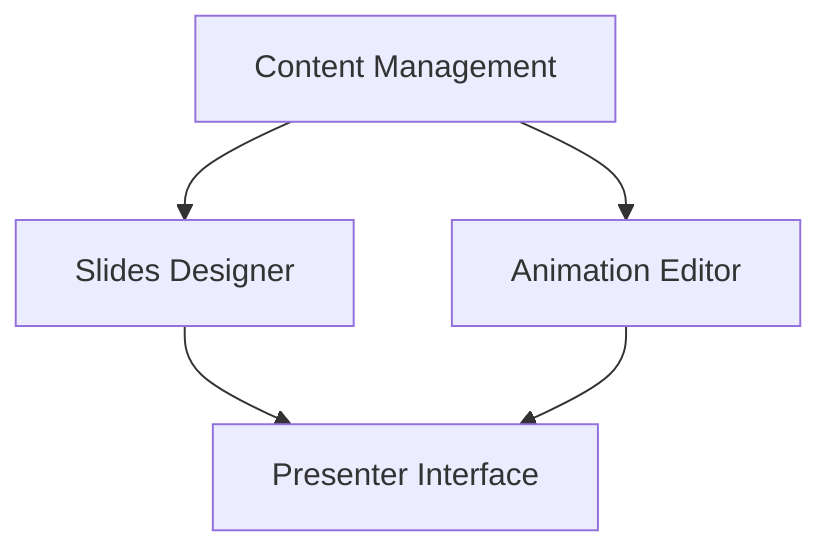
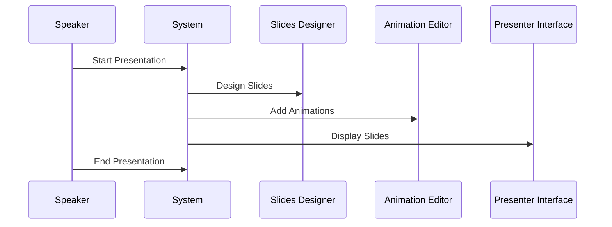

                 

## 第一部分：背景介绍

### 第一部分：背景介绍

技术演讲在现代社会中扮演着至关重要的角色，无论是在企业内部的培训、项目的提案，还是在国际会议上的研究成果展示，技术演讲都是传递信息、交流思想、建立影响力的重要手段。因此，掌握有效的技术演讲技巧，不仅能够提升个人在职业发展中的竞争力，也能促进团队之间的协作与创新。

#### 1.1 问题背景

技术演讲的核心挑战在于如何将复杂的技术概念和专业知识，以简洁明了、生动有趣的方式呈现给听众。在技术领域中，演讲者需要具备深厚的专业知识，同时还需要具备良好的演讲技巧，以确保演讲内容能够被听众理解和接受。然而，许多技术从业者在面对演讲时，常常因为紧张、缺乏准备或不知道如何吸引听众的注意力而感到无所适从。

#### 1.2 问题描述

技术演讲的挑战主要体现在以下几个方面：

1. **内容复杂性**：技术演讲往往涉及复杂的主题和概念，如何将这些复杂的内容简化并清晰地传达给听众，是演讲者需要解决的首要问题。
2. **听众多样性**：技术演讲的听众背景各异，包括不同领域的专家、学者、技术爱好者等。演讲者需要了解听众的需求和兴趣点，以便调整演讲内容和风格。
3. **时间限制**：许多技术演讲都有时间限制，如何在有限的时间内传达关键信息，是演讲者需要考虑的另一个重要问题。
4. **互动性**：技术演讲往往需要与听众进行互动，如回答问题、引导讨论等。如何保持互动的流畅性和有效性，是演讲成功的关键。

#### 1.3 问题解决

为了解决上述挑战，演讲者需要掌握一系列的技巧和方法。以下是一些关键步骤：

1. **明确演讲目标**：在准备演讲之前，首先要明确演讲的目标，即你希望听众从演讲中得到什么信息或启发。
2. **了解听众**：通过调查、访谈等方式了解听众的背景、需求和兴趣点，以便调整演讲内容和风格。
3. **结构化内容**：将演讲内容结构化，确保演讲内容逻辑清晰、层次分明。
4. **使用视觉辅助**：利用幻灯片、图表、视频等视觉元素，帮助听众更好地理解和记忆演讲内容。
5. **练习演讲**：通过多次练习，熟悉演讲内容，提高演讲的流畅性和自信心。
6. **处理紧张情绪**：学会放松，采用深呼吸、正面思考等技巧来应对紧张情绪。
7. **鼓励互动**：在演讲过程中，积极与听众互动，如提问、讨论等，提高听众的参与度和兴趣。

### 1.4 边界与外延

在本文中，我们将主要关注技术领域的演讲技巧。虽然很多演讲原则适用于各种场合，但本文中的案例和练习将以技术背景为主。此外，本文将不会深入探讨演讲之外的沟通技巧，如书面报告和一对一交流。

### 1.5 概念结构与核心要素组成

为了更好地理解和掌握技术演讲的技巧，我们可以从以下几个核心要素入手：

1. **演讲目的**：明确演讲的目标，是教育、说服、激励还是娱乐？
2. **听众分析**：了解听众的背景、需求和期望，以便定制演讲内容。
3. **内容结构**：逻辑清晰、层次分明的演讲内容能够帮助听众更好地理解信息。
4. **视觉辅助**：包括幻灯片、图表和其他视觉元素，用以加强信息传递。
5. **演讲技巧**：如语言表达、语调、语速、肢体语言等，影响演讲的吸引力。
6. **互动技巧**：与听众互动，提高参与度和记忆效果。
7. **反馈与改进**：演讲后的反思和改进，不断优化演讲效果。

### 图表：技术演讲核心概念属性特征对比表格

| 核心概念 | 特征 | 对比 |
| --- | --- | --- |
| 演讲目的 | 教育性、说服性、激励性、娱乐性 | 根据不同演讲目的，调整内容重点和策略 |
| 听众分析 | 背景、需求、期望 | 精准定位，提升演讲的针对性和效果 |
| 内容结构 | 逻辑性、层次性、连贯性 | 明确结构，帮助听众跟随思路 |
| 视觉辅助 | 图表、图片、动画 | 提升视觉效果，增强信息传递效果 |
| 演讲技巧 | 语言表达、语调、语速、肢体语言 | 形成个人风格，吸引听众注意力 |
| 互动技巧 | 提问、回答、讨论 | 提高参与度，增强记忆效果 |
| 反馈与改进 | 反思、改进、持续优化 | 提升演讲效果，不断完善 |

### ER实体关系图架构

```mermaid
erDiagram
    Speaker ||--|{ Presentation } : "gives"
    Audience ||--|{ Presentation } : "attends"
    Content ||--|{ Presentation } : "includes"
    VisualAid ||--|{ Presentation } : "uses"
```

### 数学模型和数学公式

在技术演讲中，有时需要使用数学模型和公式来解释复杂的概念或算法。以下是一个简单的例子：

$$
X(t) = f(Y(t), Z(t))
$$

其中，$X(t)$ 表示时间 $t$ 时的系统状态，$Y(t)$ 和 $Z(t)$ 分别是系统在时间 $t$ 的输入变量。函数 $f$ 定义了输入变量如何影响系统状态。

### 系统分析与架构设计方案

#### 问题场景介绍

在一个技术会议中，演讲者需要向听众展示一个复杂的软件系统。为了确保演讲的顺利进行，我们需要设计一个有效的系统架构，涵盖系统功能、架构设计和接口设计。

#### 项目介绍

项目名称：技术演讲支持系统

项目目标：为演讲者提供一个全方位的技术支持平台，包括内容准备、演示效果优化、互动环节管理等。

#### 系统功能设计

1. **内容管理**：提供文本、图片、视频等多媒体内容的编辑和管理功能。
2. **演示效果优化**：包括幻灯片设计、动画效果添加等。
3. **互动环节管理**：支持现场提问、投票、讨论等功能。
4. **演讲进度跟踪**：实时显示演讲进度，便于演讲者调整节奏。

#### 系统架构设计



#### 系统接口设计



## 第二部分：准备工作

在准备一场技术演讲时，充分的准备工作是成功的关键。以下是一些关键步骤，帮助您确保演讲内容丰富、结构清晰、易于听众理解。

### 2.1 确定演讲目标

首先，明确您的演讲目标是非常重要的。您希望听众从演讲中获得什么？是教育他们了解某个技术概念，说服他们接受某个方案，还是激励他们参与到某个项目中？明确目标可以帮助您确定演讲的重点，确保内容更加针对性和高效。

**例子**：假设您即将进行一场关于“人工智能在医疗领域的应用”的演讲，您的目标可能是教育听众了解人工智能的基本原理，并展示其在医疗领域的具体应用案例，最后激励他们探讨如何将这一技术应用到自己的工作中。

### 2.2 分析听众

了解您的听众是准备工作中的另一个关键步骤。不同类型的听众可能对演讲内容有不同的需求和兴趣点。您可以通过调查问卷、访谈等方式收集听众的背景信息、技术水平和兴趣领域。

**例子**：如果您的听众主要由医疗行业的专业人士组成，他们可能更关心人工智能在临床诊断和治疗方案制定中的应用，而对算法的实现细节不太感兴趣。相应地，您的演讲内容应更加聚焦于实际应用案例和临床价值。

### 2.3 确定内容结构

一个清晰、结构化的内容结构有助于听众更好地理解您的演讲。通常，一个有效的演讲结构包括以下几个部分：

1. **引言**：吸引听众的注意力，明确演讲的主题和目标。
2. **主体内容**：详细阐述您的观点，可以按照逻辑顺序或时间顺序组织。
3. **结论**：总结演讲的主要观点，强调重要信息，并提出未来展望或行动建议。

**例子**：在介绍“人工智能在医疗领域的应用”的演讲中，您可以使用以下结构：

- 引言：介绍人工智能的基本概念，并引用一些医疗领域的应用案例。
- 主体内容：
  - 第一部分：介绍人工智能的核心技术，如机器学习、深度学习等。
  - 第二部分：展示人工智能在医疗领域的具体应用，如疾病预测、个性化治疗等。
  - 第三部分：分析人工智能在医疗领域面临的挑战和解决方案。
- 结论：总结演讲的主要观点，强调人工智能在医疗领域的巨大潜力，并鼓励听众积极参与相关研究和实践。

### 2.4 准备视觉辅助材料

视觉辅助材料（如幻灯片、图表、图片等）可以帮助您更有效地传达信息，增强演讲的吸引力。以下是一些技巧：

- **简洁明了**：避免过多文字，每个幻灯片尽量只包含一个主要观点。
- **视觉吸引力**：使用清晰的图表、图片和色彩，使幻灯片更具吸引力。
- **互动性**：可以考虑在幻灯片中加入动画、视频等元素，提高观众的兴趣。

**例子**：在“人工智能在医疗领域的应用”的演讲中，您可以添加以下视觉辅助材料：

- **图表**：展示人工智能在不同医疗领域的应用比例。
- **图片**：展示医疗设备或人工智能系统的实际应用场景。
- **视频**：播放一些关于人工智能在医疗领域成功案例的短片。

### 2.5 实际练习

即使准备工作再充分，实际的演讲练习也是必不可少的。通过多次练习，您可以：

- **熟悉内容**：确保对演讲内容的熟悉，减少紧张情绪。
- **改进表达**：通过模拟演讲，发现并改进自己的表达方式和演讲技巧。
- **适应环境**：提前适应演讲场地和设备，确保演讲顺利进行。

**例子**：在准备“人工智能在医疗领域的应用”演讲时，您可以：

- **在家模拟**：在熟悉的环境中进行多次练习，熟悉演讲流程。
- **邀请同事反馈**：邀请同事或朋友观看练习，收集他们的反馈和建议。

通过以上步骤，您可以确保您的技术演讲准备工作充分、有条不紊，为演讲的成功奠定基础。

### 第二部分：演讲内容创建

在技术演讲中，内容的质量直接影响听众的理解和兴趣。创建引人入胜的演讲内容需要精心规划，以下是一些关键步骤和策略：

#### 3.1 精选主题

选择一个具有吸引力和实用性的主题是成功演讲的第一步。以下是一些建议：

- **热点话题**：选择当前技术领域中的热点话题，如人工智能、区块链、物联网等。
- **实用价值**：选择具有实际应用价值的主题，如新技术在特定行业中的应用案例。
- **个人兴趣**：选择您熟悉的主题，这样可以确保您对内容有深刻的理解。

#### 3.2 确定关键信息

在确定主题后，明确您希望传达的关键信息。这些信息应该具有逻辑性和连贯性，以便听众能够跟随您的思路。以下是一些建议：

- **核心观点**：确定演讲的核心观点，并确保所有内容围绕这一核心展开。
- **支持论据**：收集和整理支持核心观点的论据和实例，确保内容的可信度和说服力。
- **互动环节**：设计一些互动环节，如提问、讨论或现场实验，以增强听众的参与感。

#### 3.3 创建逻辑结构

一个清晰、逻辑严密的演讲结构能够帮助听众更好地理解和记忆内容。以下是一个基本的演讲结构：

1. **引言**：用引人入胜的开场白吸引听众的注意力，明确演讲的主题和目的。
2. **主体内容**：分几个部分详细阐述您的观点，每个部分都有明确的主题和论据。
3. **结论**：总结演讲的主要观点，强调重要信息，并提出未来展望或行动建议。

#### 3.4 使用故事讲述

故事讲述是一种非常有效的沟通技巧，可以增强演讲的吸引力。以下是一些建议：

- **个人经历**：分享您的个人经历或故事，以展示您对主题的深入理解。
- **成功案例**：引用成功案例，说明新技术在实际应用中的效果和影响。
- **幽默元素**：适当的幽默可以缓解紧张的气氛，增加演讲的趣味性。

#### 3.5 结合数据和事实

使用数据和事实可以增强演讲的说服力。以下是一些建议：

- **统计数据**：引用相关的统计数据，展示技术发展的趋势和影响。
- **实验结果**：分享实验结果，说明新技术的有效性。
- **权威引用**：引用权威专家或研究报告，增强演讲的可信度。

#### 3.6 互动和提问

在演讲中引入互动和提问环节，可以提高听众的参与度，使演讲更加生动。以下是一些建议：

- **现场提问**：邀请听众提问，回答他们的问题，展示您的专业知识和亲和力。
- **讨论环节**：设置讨论环节，引导听众就演讲内容进行深入探讨。
- **投票和调查**：使用在线工具进行投票或调查，收集听众的意见和反馈。

#### 3.7 练习和调整

在演讲前，多次练习和调整是必不可少的。以下是一些建议：

- **模拟环境**：在模拟的环境中练习演讲，熟悉演讲流程和节奏。
- **反馈和改进**：邀请同事或朋友观看练习，收集他们的反馈，并根据反馈进行改进。
- **时间控制**：确保演讲时间适中，不要过长或过短。

通过以上步骤和策略，您可以创建一个内容丰富、逻辑清晰、富有吸引力的技术演讲，有效地传达您的观点和知识。

### 第三部分：视觉辅助工具的使用

在技术演讲中，视觉辅助工具是增强演讲效果的关键因素之一。通过巧妙地使用幻灯片、图表和其他视觉元素，您可以更加有效地传达复杂的概念，吸引听众的注意力，并提高演讲的记忆效果。以下是一些关键技巧和策略：

#### 4.1 选择合适的视觉元素

**幻灯片**：幻灯片是技术演讲中最常用的视觉辅助工具。以下是一些选择和使用幻灯片的技巧：

- **简洁明了**：每个幻灯片应只包含一个主要观点，避免文字过多，确保信息清晰。
- **视觉吸引力**：使用清晰的图片、图表和色彩，增加幻灯片的吸引力。避免使用过于花哨的设计，以免分散听众的注意力。
- **排版整齐**：确保幻灯片的布局整齐，文字和图像的对齐方式一致，使幻灯片看起来更加专业。

**图表**：图表是一种非常有效的视觉元素，可以帮助您展示数据、比较结果或解释复杂的过程。以下是一些使用图表的技巧：

- **简单直观**：选择简单、直观的图表类型，如条形图、折线图、饼图等，避免使用过于复杂的图表。
- **数据准确性**：确保图表中的数据准确无误，避免误导听众。
- **注释说明**：在图表旁边添加注释或说明，帮助听众更好地理解图表内容。

**图片**：图片可以直观地展示事物，增强演讲的吸引力。以下是一些使用图片的技巧：

- **相关性强**：选择与演讲内容紧密相关的图片，避免使用无关或模糊的图片。
- **质量高**：使用高质量的图片，确保图片清晰、美观。

**动画**：动画可以增强演讲的趣味性和互动性。以下是一些使用动画的技巧：

- **简洁有效**：动画应简洁、有效，避免过度使用，以免分散听众的注意力。
- **适时使用**：在关键信息或复杂概念出现时使用动画，帮助听众更好地理解。

#### 4.2 使用视觉元素的原则

**一致性**：视觉元素应与演讲的整体风格和主题保持一致。确保所有视觉元素的样式、色彩和字体等都与演讲的视觉设计相符。

**辅助性**：视觉元素应作为演讲内容的辅助，帮助传达信息，而不是取代演讲内容。确保视觉元素能够增强演讲的效果，而不是分散听众的注意力。

**有效性**：视觉元素应具有明显的效果，能够吸引听众的注意力，并帮助他们更好地理解和记忆演讲内容。

#### 4.3 视觉元素的实践应用

**案例1**：在介绍“人工智能在医疗领域的应用”的演讲中，您可以：

- **幻灯片**：展示人工智能在不同医疗领域的应用案例，使用简洁的图表和图片说明每个案例的效果。
- **图表**：展示人工智能在医疗诊断、治疗方案制定等方面的数据，使用条形图和折线图展示数据的变化趋势。
- **图片**：展示医疗设备和人工智能系统的实际应用场景，使听众直观地了解人工智能在医疗领域的作用。

**案例2**：在介绍“区块链技术及其应用”的演讲中，您可以：

- **幻灯片**：使用清晰的图片和图表展示区块链的基本原理和技术架构。
- **图表**：使用流程图和结构图展示区块链的工作流程和应用场景。
- **动画**：使用动画展示区块链的共识算法和工作原理，帮助听众更好地理解。

通过巧妙地使用视觉辅助工具，您可以提高技术演讲的吸引力、记忆效果和传达效率，使演讲更加生动和有力。

### 第四部分：演讲技巧

在技术演讲中，语言表达、语调、语速和肢体语言等演讲技巧对于演讲的成功至关重要。这些技巧不仅影响听众对演讲内容的理解和记忆，还能增强演讲的吸引力和说服力。以下是一些关键技巧和策略：

#### 5.1 语言表达

**简洁明了**：在演讲中，使用简单、清晰的语言，避免使用过于复杂或冗长的句子。简洁的语言有助于听众更好地理解演讲内容。

**逻辑清晰**：确保演讲内容逻辑严密、条理清晰。使用逻辑连接词（如“因此”、“然而”等）帮助听众跟随您的思路。

**准确清晰**：在讲解复杂概念或技术术语时，确保使用准确、专业的语言。避免使用模糊或误导性的表述，以免听众产生混淆。

**例子**：在介绍“深度学习在图像识别中的应用”时，您可以这样表达：“深度学习是一种人工智能技术，通过多层神经网络对图像进行自动识别，准确率远超传统方法。”

#### 5.2 语调

**抑扬顿挫**：通过语调的变化，使演讲更加生动和引人入胜。适当的停顿、强调和语气变化有助于突出关键信息，增强演讲的吸引力。

**情感共鸣**：在适当的时候，通过语调表达情感，与听众建立共鸣。例如，在分享成功案例时，可以适当提高语调，表达兴奋和自豪。

**例子**：在介绍“人工智能在医疗诊断中的挑战”时，您可以这样表达：“尽管人工智能在医疗诊断中展现出巨大的潜力，但我们也面临着许多挑战，如数据隐私、算法透明度等。”

#### 5.3 语速

**适中**：保持适中的语速，避免过快或过慢。过快的语速可能导致听众跟不上您的思路，而过慢的语速则可能使听众感到无聊。

**节奏变化**：在演讲中适当调整语速，通过快慢交替的方式增强演讲的节奏感和吸引力。

**例子**：在讲解复杂的技术概念时，您可以适当放慢语速，详细解释每一个细节，使听众更容易理解。

#### 5.4 肢体语言

**自然大方**：肢体语言应自然、大方，与演讲内容相协调。避免过于夸张或僵硬的肢体动作，以免分散听众的注意力。

**强调重点**：通过适当的肢体语言强调关键信息或论点，帮助听众更好地理解和记忆。

**例子**：在讲解“机器学习算法的优化方法”时，您可以用手势强调每一个优化步骤，使演讲内容更加直观和清晰。

#### 5.5 练习和反馈

**多次练习**：通过多次练习，熟悉演讲内容，提高语言表达的流畅性和自信。练习时，可以录音或录像，以便观察自己的肢体语言和语调，进行改进。

**收集反馈**：在练习过程中，向同事、朋友或专业人士寻求反馈，了解他们的意见和建议。根据反馈调整演讲内容和技巧，使演讲更加完善。

通过掌握以上演讲技巧，您能够更好地传达演讲内容，吸引听众的注意力，增强演讲的吸引力和说服力，从而提高技术演讲的效果。

### 第五部分：互动技巧

在技术演讲中，互动技巧是提升听众参与度和记忆效果的重要手段。通过与听众的互动，您可以增强演讲的吸引力，使听众更加专注于演讲内容，并提高他们对信息的理解和记忆。以下是一些关键技巧：

#### 6.1 提问与回答

**开放性问题**：在演讲中，适时提出开放性问题，鼓励听众思考和回答。这些问题应该具有引导性，帮助听众深入思考演讲主题。

**鼓励发言**：当听众回答问题时，给予积极的反馈，如“非常好，谢谢你的回答！”或“你的观点很有见地，可以详细说说吗？”这样可以鼓励更多听众参与互动。

**回答问题**：对于听众提出的问题，无论是否与演讲主题相关，都应给予认真的回答。如果无法立即回答，可以承诺在会后提供更多信息。

**例子**：在讲解“人工智能在医疗诊断中的应用”时，您可以提出问题：“大家认为人工智能在医疗诊断中的最大挑战是什么？”

#### 6.2 讨论与投票

**讨论环节**：在演讲中设置讨论环节，引导听众就演讲主题进行深入探讨。讨论可以以小组形式进行，或者邀请听众在演讲台上发表观点。

**投票与调查**：使用在线投票或调查工具，收集听众的意见和反馈。这种方法不仅增加了互动性，还能使听众感受到自己的参与和重要性。

**例子**：在介绍“区块链技术在金融领域的应用”时，您可以进行投票：“目前，你认为区块链技术最具有潜力的应用领域是什么？”

#### 6.3 现场实验

**动手操作**：在适当的时候，进行一些现场实验，使听众亲身体验技术原理。这种方法不仅增加了演讲的趣味性，还能加深听众对演讲内容的理解和记忆。

**实时反馈**：在进行实验时，鼓励听众提供实时反馈，讨论实验结果和观察到的现象。

**例子**：在讲解“深度学习在图像识别中的应用”时，您可以进行一个简单的图像识别实验，邀请听众参与并观察结果。

#### 6.4 故事分享

**个人经历**：分享您的个人经历或故事，特别是那些与演讲主题相关的故事。这种方法可以增强演讲的吸引力，使听众更容易与演讲内容产生共鸣。

**情景再现**：通过再现一些具体的场景，使听众能够更直观地理解演讲内容。

**例子**：在介绍“物联网技术在智能家居中的应用”时，您可以分享一个关于自己家庭的物联网故事：“在我家里，智能灯泡、智能插座和智能冰箱等设备通过物联网技术实现自动化控制，大大提升了生活质量。”

#### 6.5 反馈与总结

**总结要点**：在演讲结束后，对演讲内容进行简要总结，强调关键信息和要点。这有助于听众巩固记忆，加深对演讲内容的理解。

**收集反馈**：在演讲结束后，鼓励听众提供反馈，了解他们对演讲内容的看法和建议。根据反馈，不断改进演讲技巧和内容。

**例子**：在结束关于“大数据在市场营销中的应用”的演讲时，您可以这样说：“感谢大家的参与，今天我们讨论了大数据在市场营销中的重要作用。如果你有任何问题或意见，请随时与我联系。”

通过运用以上互动技巧，您可以有效地提升技术演讲的参与度和记忆效果，使演讲更加生动、有趣和有说服力。

### 第六部分：演讲后的反馈与改进

在技术演讲结束后，及时获取听众的反馈并进行反思和改进是提升演讲效果的关键。以下是一些关键步骤和策略：

#### 7.1 收集反馈

**现场反馈**：演讲结束后，可以邀请听众填写反馈问卷，或进行简短的口头反馈。这些反馈可以帮助您了解听众对演讲内容的理解程度和满意度。

**社交媒体**：利用社交媒体平台（如LinkedIn、Twitter等）收集听众的反馈和评论。这种方法不仅可以获得更多的反馈，还能扩大演讲的影响力。

**同事和朋友**：向同事或朋友征求他们对演讲的意见和建议。他们可能会提供一些您未曾注意到的细节和改进空间。

#### 7.2 反思与改进

**内容调整**：根据听众的反馈，对演讲内容进行适当的调整。例如，如果听众反映某些部分过于复杂或难以理解，可以考虑简化或重新组织内容。

**结构优化**：反思演讲的结构和逻辑，确保内容条理清晰、层次分明。如果听众在理解某些部分时遇到困难，可以考虑增加示例或图表来辅助说明。

**技巧提升**：分析自己在演讲中的表现，特别是在语言表达、语调、语速和肢体语言等方面。根据听众的反馈，不断改进这些技巧，使演讲更加生动和有力。

**技术改进**：如果演讲中使用了视觉辅助工具，根据反馈评估其效果。如果需要，可以优化幻灯片设计、图表展示或动画效果，以提高视觉传达效果。

#### 7.3 持续优化

**定期反思**：定期回顾过去的演讲，分析成功和失败的原因，总结经验教训。这有助于您在未来的演讲中不断进步。

**持续学习**：参加相关的培训和研讨会，学习最新的演讲技巧和策略。同时，阅读相关书籍和资料，不断提升自己的演讲能力。

**实践应用**：将学到的技巧和策略应用到实际演讲中，不断实践和改进。通过多次练习，您可以更加熟练地掌握演讲技巧，提高演讲效果。

通过以上步骤和策略，您可以不断优化演讲，提高其在内容、结构和技巧方面的质量，从而更好地传达信息，增强听众的理解和参与度。

### 第七部分：总结与展望

在本文中，我们详细探讨了提升技术演讲影响力的一系列关键技巧和策略。从准备工作、内容创建、视觉辅助工具的使用，到演讲技巧和互动技巧，再到演讲后的反馈与改进，每一个环节都至关重要。以下是对这些技巧的总结和未来展望：

#### 总结

1. **准备工作**：明确演讲目标、分析听众、确定内容结构和准备视觉辅助材料是演讲成功的基础。通过细致的准备，您可以确保演讲内容丰富、结构清晰、易于听众理解。
   
2. **内容创建**：精选主题、确定关键信息、创建逻辑结构和结合故事讲述，可以帮助您构建一个引人入胜的演讲内容。这些策略不仅增强了演讲的吸引力，还提高了听众的记忆效果。

3. **视觉辅助工具的使用**：巧妙地使用幻灯片、图表、图片和动画等视觉元素，可以有效地增强演讲的吸引力、记忆效果和传达效率。视觉辅助工具是技术演讲的重要组成部分，不容忽视。

4. **演讲技巧**：掌握语言表达、语调、语速和肢体语言等演讲技巧，可以提高演讲的吸引力和说服力。通过练习和反馈，不断提升这些技巧，可以使您的演讲更加生动和有力。

5. **互动技巧**：通过提问、讨论、投票和故事分享等互动技巧，可以增强听众的参与度和记忆效果。互动是演讲的重要组成部分，可以有效提升演讲的影响力。

6. **演讲后的反馈与改进**：及时获取听众的反馈并进行反思和改进，是提升演讲效果的关键。通过持续优化，您可以不断改进演讲，提高其在内容、结构和技巧方面的质量。

#### 未来展望

1. **技术进步**：随着技术的不断进步，我们可以期待更多创新的视觉辅助工具和互动方式的出现。例如，虚拟现实（VR）和增强现实（AR）技术可以为演讲带来全新的体验。

2. **个性化演讲**：通过数据分析和技术，我们可以更加精准地了解听众的需求和兴趣点，从而提供更加个性化的演讲内容。这有助于提高演讲的针对性和效果。

3. **跨学科融合**：随着技术领域的不断发展，我们可以期待更多跨学科的研究和实践。这将为技术演讲提供更多的灵感和素材，使演讲内容更加丰富和有深度。

4. **持续学习**：技术演讲是一项不断发展的技能，需要演讲者持续学习和实践。通过参加培训、阅读相关书籍和资料，我们可以不断提升自己的演讲能力，为未来的演讲做好准备。

通过本文的探讨，我们希望读者能够掌握提升技术演讲影响力的关键技巧，并将其应用于实际工作中。不断实践和改进，您将能够成为一名更加优秀的技术演讲者，为自己的职业发展和技术传播贡献更多力量。

### 最佳实践 Tips

1. **提前规划**：提前制定演讲计划，包括时间安排、内容结构、视觉辅助材料等。这有助于减少演讲当天的紧张感，确保演讲顺利进行。
   
2. **准备多个版本**：为演讲准备多个版本，包括详细版和简洁版。根据演讲时间的不同，灵活调整演讲内容的深度和广度。

3. **练习演讲**：多次练习演讲，熟悉演讲内容和流程。可以录音或录像，以便观察自己的表现并进行改进。

4. **了解听众**：在演讲前了解听众的背景、需求和兴趣点。这有助于您定制演讲内容，提高演讲的针对性和效果。

5. **视觉辅助**：使用高质量的视觉辅助材料，如清晰的图表、图片和动画。这些元素可以增强演讲的吸引力，帮助听众更好地理解内容。

6. **互动与反馈**：在演讲中积极与听众互动，如提问、讨论和投票。及时获取反馈，并根据反馈进行调整。

7. **情绪管理**：学会情绪管理，如深呼吸、正面思考等。这些技巧可以帮助您在演讲时保持冷静和自信。

### 注意事项

1. **避免过度依赖幻灯片**：幻灯片是演讲的辅助工具，不应取代演讲内容。确保演讲内容丰富、逻辑清晰，幻灯片仅作为补充。

2. **控制演讲时间**：确保演讲时间适中，不要过长或过短。合理安排演讲内容，确保每个部分都有足够的时间进行讲解。

3. **关注听众反应**：在演讲过程中，关注听众的反应。如果听众表现出困惑或不理解，及时调整演讲内容和节奏。

4. **避免重复和冗余**：确保演讲内容简洁、明了，避免重复和冗余。这有助于提高演讲的效率和效果。

### 拓展阅读

1. **《有效演讲技巧》**：作者：凯文·达顿（Kevin Dutton）
2. **《演讲的力量》**：作者：克里斯·安德森（Chris Anderson）
3. **《技术演讲：打造引人入胜的演示》**：作者：汤姆·霍特林（Tom Hodges）
4. **《领导者的语言》**：作者：杰克·尼克尔（Jack Nicholson）

作者：AI天才研究院/AI Genius Institute & 禅与计算机程序设计艺术 /Zen And The Art of Computer Programming

