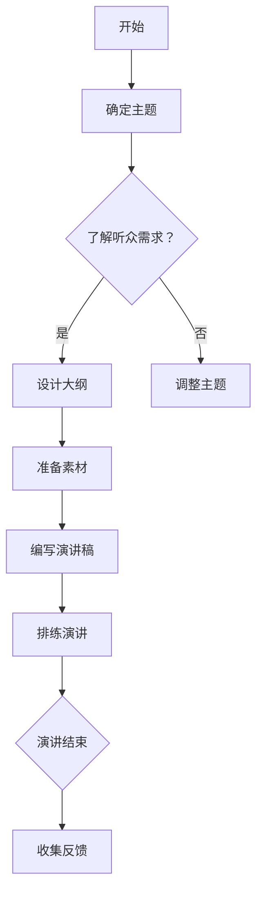
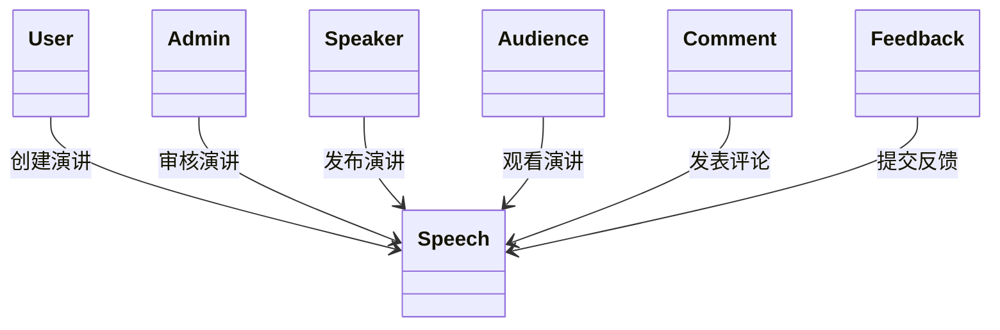
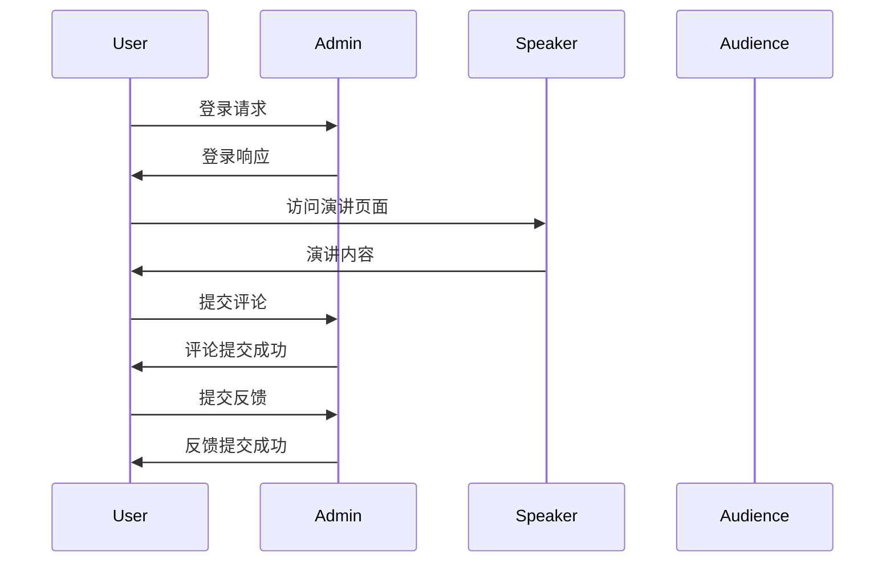
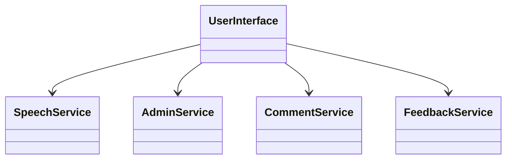
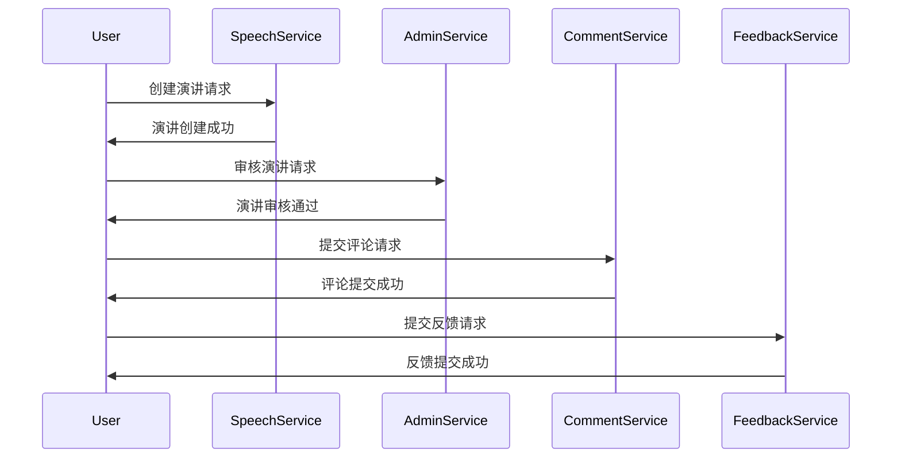
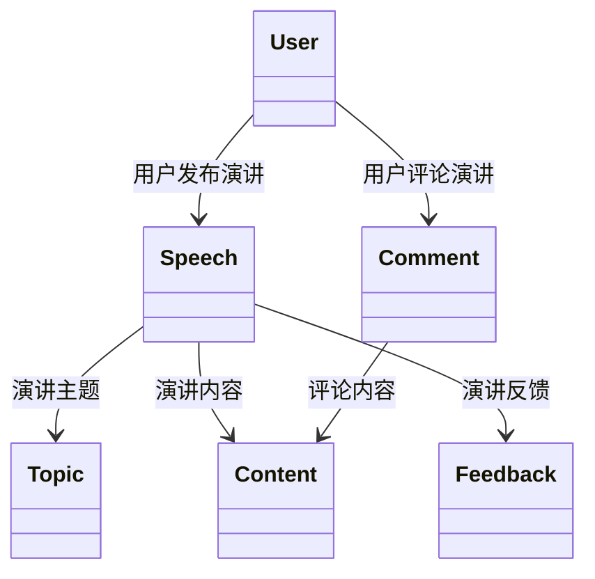
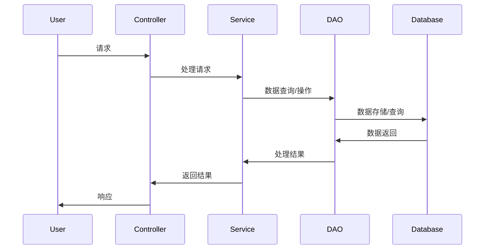
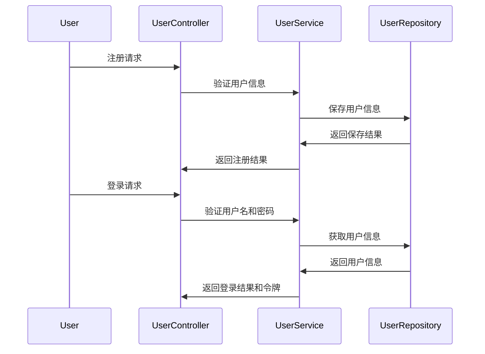
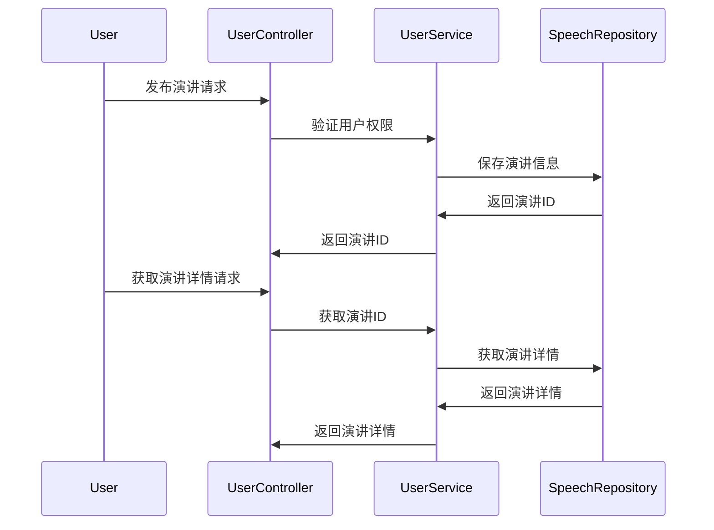

                 

# 技术演讲：提升公众表达能力的技巧

关键词：技术演讲、公众表达能力、演讲技巧、准备阶段、实战演练

摘要：本文将探讨技术演讲的定义、重要性以及提升公众表达能力的方法和技巧。通过详细的分析和实用的建议，帮助技术专业人士掌握演讲的艺术，提升自己的公众表达能力。

### 1. 技术演讲的基础知识

**1.1 技术演讲的定义**

技术演讲是一种针对技术领域的演讲，它旨在传达技术知识、分享研究成果、交流技术经验或解决技术问题。技术演讲的特点在于其专业性、针对性和实用性。

**1.2 技术演讲的目的和特点**

- **目的**：传播技术知识、交流思想、解决问题、促进合作。
- **特点**：专业性、互动性、针对性、实用性。

**1.3 技术演讲的应用领域**

- **科研会议**：技术演讲是学术会议的重要组成部分，用于分享最新的研究成果和进展。
- **技术论坛**：技术演讲是技术论坛的主要形式，用于讨论技术问题和趋势。
- **企业内部培训**：技术演讲用于培训员工的技能和知识。
- **项目报告**：技术演讲用于汇报项目进展和成果。
- **学术交流**：技术演讲是学术交流的重要手段，用于分享学术观点和研究成果。

### 2. 公众表达能力的重要性

**2.1 公众表达能力对个人和职业的影响**

- **影响力**：提高个人品牌影响力，成为行业内的意见领袖。
- **职业发展**：促进职业晋升和拓展职业机会，提升职业竞争力。
- **沟通**：改善人际关系，提升团队合作能力。

**2.2 有效沟通与影响力**

- **有效沟通的要素**：清晰的表达、有效的倾听、适当的非语言沟通。
- **提升影响力的策略**：建立专业形象、提供有价值的观点、善于提问和引导讨论。

**2.3 成功演讲者的特质**

- **自信**：自信的演讲者更容易赢得听众的信任和尊重。
- **专业**：专业的演讲者能够准确传达技术知识和信息。
- **积极主动**：积极主动的演讲者更容易抓住机会，展示自己的专业能力。
- **善于倾听**：善于倾听的演讲者能够更好地了解听众的需求和问题，从而提供更有针对性的解决方案。

### 3. 技术演讲的技巧

**3.1 准备阶段**

- **主题选择**：选择与听众需求和兴趣相关的话题。
- **研究目标听众**：了解听众的背景、兴趣和需求。
- **演讲大纲的制定**：确定演讲的结构和内容，合理安排时间。

**3.2 演讲的结构与内容**

- **引言**：引起听众的兴趣，明确演讲目的。
- **主体**：清晰传达技术知识和信息，逻辑清晰，易于理解。
- **结论**：总结演讲要点，留下深刻印象。

**3.3 演讲的技巧**

- **语言表达**：清晰、简洁、准确的表达技术知识。
- **声音和语调**：恰当的声音和语调可以增强演讲的吸引力。
- **非语言沟通**：身体语言、面部表情和眼神交流等可以增强演讲效果。

**3.4 演讲的呈现技巧**

- **视觉辅助工具**：使用图表、图片、PPT等辅助工具，使演讲更加生动。
- **身体语言**：恰当的身体语言可以增强演讲的感染力。
- **演讲后的互动**：与听众互动，回答问题，促进讨论。

### 4. 实践与提升

**4.1 实战演练**

- **模拟演讲练习**：通过模拟演讲，提升演讲技巧。
- **反馈与改进**：接受他人的反馈，不断改进自己的演讲。
- **公众演讲的心理准备**：做好心理准备，克服紧张和恐惧。

**4.2 提升公众表达能力的方法**

- **持续学习和实践**：不断学习新的演讲技巧和方法，通过实践不断提升自己的表达能力。
- **演讲技巧的个性化调整**：根据个人特点和听众需求，调整演讲风格和技巧。
- **案例分析**：分析成功和失败的演讲案例，学习经验和教训。

### 5. 案例分析

**5.1 案例介绍**

某知名互联网公司的技术总监李先生，经常需要在公司内部和外部进行技术演讲。然而，他的演讲总是缺乏吸引力和说服力，导致听众反应平平。

**5.2 问题分析**

- **准备不足**：李先生在演讲前没有充分准备，对演讲主题和内容不够熟悉。
- **表达不清**：李先生的表达不够清晰，听众难以理解他的观点。
- **互动不足**：李先生在演讲后缺乏与听众的互动，无法及时解答听众的问题。

**5.3 解决方案**

- **充分准备**：提前准备演讲，熟悉主题和内容，确保演讲的准确性。
- **清晰表达**：使用简洁、准确的语言，确保听众能够理解他的观点。
- **增加互动**：在演讲后与听众互动，回答问题，促进讨论。

**5.4 实施效果**

通过上述解决方案，李先生的演讲效果得到了显著提升。他的演讲更加生动、有趣，听众反馈积极，公司内部和外部对他的评价也有所提高。

### 6. 最佳实践

**6.1 准备充分**

在演讲前，确保对演讲主题和内容有充分的了解，提前准备好演讲稿和PPT。

**6.2 互动交流**

在演讲过程中，与听众互动，回答他们的问题，让他们参与到演讲中。

**6.3 视觉辅助**

使用视觉辅助工具，如图表、图片和PPT，使演讲更加生动。

**6.4 演讲后的跟进**

演讲结束后，及时跟进听众的反馈，了解他们对演讲的满意度和建议，以便下一次演讲时进行改进。

### 7. 小结

技术演讲是技术专业人士必备的技能之一。通过掌握演讲技巧和提升公众表达能力，技术专业人士可以更好地传达技术知识、分享研究成果和促进合作。本文提供了技术演讲的基础知识、重要性、技巧和实践方法，帮助读者提升自己的演讲能力。

### 8. 注意事项

- **充分准备**：确保对演讲主题和内容有充分的了解。
- **清晰表达**：使用简洁、准确的语言。
- **互动交流**：与听众互动，回答他们的问题。
- **视觉辅助**：使用视觉辅助工具，使演讲更加生动。

### 9. 拓展阅读

- **《演讲的艺术》**：亚里士多德
- **《如何演讲》**：卡耐基
- **《技术演讲的技巧》**：詹姆斯·哈维

作者：AI天才研究院/AI Genius Institute & 禅与计算机程序设计艺术 /Zen And The Art of Computer Programming## 技术演讲的定义与特点

技术演讲是一种专业性的演讲形式，主要面向技术领域的听众。它通过语言、视觉等多种手段，传达技术知识、分享研究成果、交流技术经验或解决技术问题。技术演讲具有以下特点和目的：

### **1. 定义**

技术演讲是一种针对特定听众，通过语言和视觉等多种手段，传达技术知识和信息的一种演讲形式。它通常涉及复杂的技术概念、算法原理、系统架构等，旨在帮助听众更好地理解和应用这些技术。

### **2. 目的和特点**

- **目的**：
  - **传播技术知识**：通过演讲，技术专家可以将自己的研究成果和经验分享给更多的人。
  - **交流思想**：技术演讲提供了一个平台，供听众和技术专家进行思想交流和观点碰撞。
  - **解决问题**：技术演讲可以帮助听众解决他们在技术实践中遇到的问题。
  - **促进合作**：通过技术演讲，可以促进不同团队、不同公司之间的合作和交流。

- **特点**：
  - **专业性**：技术演讲涉及具体的技术领域，要求演讲者具备丰富的专业知识和经验。
  - **互动性**：技术演讲通常需要与听众进行互动，回答听众的问题，提高听众的参与度。
  - **针对性**：技术演讲针对特定的听众群体，内容需要贴近听众的需求和兴趣。
  - **实用性**：技术演讲的内容通常是实用的，可以帮助听众在实际工作中解决问题。

### **3. 应用领域**

技术演讲的应用领域非常广泛，主要包括以下几个方面：

- **科研会议**：在学术会议上，技术演讲是交流研究成果的重要方式。
- **技术论坛**：在技术论坛上，技术演讲是讨论技术问题和趋势的主要形式。
- **企业内部培训**：在企业内部培训中，技术演讲用于培训员工的技能和知识。
- **项目报告**：在项目报告中，技术演讲用于汇报项目进展和成果。
- **学术交流**：在学术交流中，技术演讲是分享学术观点和研究成果的重要手段。

通过技术演讲，技术专业人士不仅可以提升自己的公众表达能力，还可以在行业内建立自己的品牌影响力，成为技术领域的意见领袖。同时，技术演讲也是技术交流、合作和创新的重要途径。

### **4. 技术演讲的组成部分**

- **引言**：演讲的开头，用来吸引听众的注意力，明确演讲的主题和目的。
- **主体**：演讲的核心部分，详细阐述技术概念、原理、方法等。
- **结论**：演讲的结尾，总结演讲要点，强调关键信息，留下深刻印象。

### **5. 总结**

技术演讲是一种重要的沟通方式，它不仅可以帮助技术专业人士传达技术知识和经验，还可以促进技术交流和合作。掌握技术演讲的技巧和要点，对于提升公众表达能力、建立个人品牌和专业形象至关重要。

### **核心概念与联系**

**核心概念：**
- 技术演讲
- 公众表达能力
- 互动性
- 针对性

**概念属性特征对比表格：**

| 核心概念 | 定义 | 属性特征 | 对比 |
| --- | --- | --- | --- |
| 技术演讲 | 面向技术领域的演讲 | 专业性、互动性、针对性 | 涉及技术知识，需具备专业性 |
| 公众表达能力 | 演讲能力 | 清晰表达、有效沟通、个性化 | 提升个人品牌影响力 |
| 互动性 | 演讲过程中与听众互动 | 增强参与感、提升效果 | 提高演讲吸引力 |
| 针对性 | 针对特定听众的演讲 | 贴近听众需求、提高理解度 | 提高演讲有效性 |

**ER实体关系图架构：**

```mermaid
erDiagram
  用户 ||--|{ 技术演讲者 } : 组织
  技术演讲者 ||--|{ 演讲 } : 发表
  演讲 ||--|{ 听众 } : 参与互动
  听众 ||--|{ 反馈 } : 提供评价
```

### **ER实体关系图架构解释：**

- **用户**：指的是参与技术演讲的听众。
- **技术演讲者**：具备技术背景，能够进行技术演讲的专业人士。
- **演讲**：技术演讲的具体实例，包括引言、主体和结论等部分。
- **听众**：参与技术演讲的用户，他们与演讲者互动，提供反馈。
- **反馈**：听众对技术演讲的评价和反馈，有助于演讲者的改进。

通过上述ER图，可以清晰地看到技术演讲的各个环节之间的关系，以及它们如何共同作用，形成一个完整的技术演讲流程。

### **算法原理讲解**

在技术演讲中，算法的原理讲解是至关重要的一环。以下是一个简单的算法原理讲解示例，我们将使用Mermaid流程图和Python代码来阐述。

#### **算法流程图**



#### **算法Python代码**

```python
def prepare_tech_speech():
    # 确定主题
    theme = "确定主题"
    if check_listeners_need():
        # 设计大纲
        design_outline()
        # 准备素材
        prepare_materials()
        # 编写演讲稿
        write_speech_script()
        # 排练演讲
        rehearse_speech()
        # 演讲结束
        end_speech()
        # 收集反馈
        collect_feedback()
    else:
        # 调整主题
        adjust_theme()

def check_listeners_need():
    # 假设方法返回True表示了解听众需求
    return True

def design_outline():
    print("设计大纲")

def prepare_materials():
    print("准备素材")

def write_speech_script():
    print("编写演讲稿")

def rehearse_speech():
    print("排练演讲")

def end_speech():
    print("演讲结束")

def collect_feedback():
    print("收集反馈")

def adjust_theme():
    print("调整主题")

# 执行算法
prepare_tech_speech()
```

#### **算法原理与数学模型**

**算法原理：**
该算法用于准备一场技术演讲，包括以下步骤：
1. 确定主题。
2. 检查是否了解听众需求。
3. 如果了解，则设计大纲、准备素材、编写演讲稿、排练演讲和演讲结束。
4. 如果不了解，则调整主题。

**数学模型：**
算法中的每个步骤可以用数学公式表示为：
- \( P(T) = \) 确定主题
- \( P(L) = \) 检查听众需求
- \( P(O) = \) 设计大纲
- \( P(M) = \) 准备素材
- \( P(S) = \) 编写演讲稿
- \( P(R) = \) 排练演讲
- \( P(E) = \) 演讲结束
- \( P(F) = \) 收集反馈
- \( P(A) = \) 调整主题

#### **举例说明**

假设我们确定了一个技术演讲的主题“人工智能在金融领域的应用”，我们需要：
1. 确定主题：人工智能在金融领域。
2. 检查听众需求：金融领域的专业人士，他们对人工智能应用有浓厚的兴趣。
3. 设计大纲：包括引言、技术背景、应用案例、挑战与展望等部分。
4. 准备素材：收集相关的数据、案例和研究文献。
5. 编写演讲稿：将大纲内容转化为演讲稿，确保逻辑清晰、易于理解。
6. 排练演讲：多次练习演讲，提升演讲效果。
7. 演讲结束：演讲结束后，收集听众的反馈，以便改进未来的演讲。

通过上述步骤，我们可以确保技术演讲的顺利进行，并且不断提升公众表达能力。

### **系统分析与架构设计方案**

在技术演讲的系统中，我们需要考虑系统的功能设计、架构设计以及接口设计和交互设计。以下是对这些设计方案的详细分析。

#### **1. 问题场景介绍**

技术演讲系统是一个支持技术专业人士进行演讲准备、演讲发布和演讲管理的平台。该系统需要具备以下几个功能：

- **演讲准备**：提供演讲主题选择、大纲设计、素材收集和演讲稿编写的功能。
- **演讲发布**：支持演讲者的演讲发布，并提供演讲视频和PPT的在线观看。
- **演讲管理**：允许管理员对演讲内容进行审核、发布和管理。

#### **2. 项目介绍**

项目名称：技术演讲管理系统（TechSpeechMS）

项目目标：构建一个高效、易用的技术演讲平台，支持演讲者、听众和管理员的操作，提升技术演讲的质量和效果。

项目功能：

- 用户注册与登录
- 演讲主题选择与设计
- 演讲素材收集与管理
- 演讲稿编写与修改
- 演讲发布与观看
- 用户反馈与互动
- 演讲审核与发布管理

#### **3. 系统功能设计（领域模型）**

系统功能设计主要涉及领域模型的设计，领域模型描述了系统的核心功能和实体之间的关系。以下是一个简化的领域模型：



**领域模型解释：**

- **User**（用户）：用户注册和登录系统。
- **Admin**（管理员）：审核和管理演讲内容。
- **Speaker**（演讲者）：创建和发布演讲。
- **Audience**（听众）：观看演讲并提交反馈。
- **Speech**（演讲）：演讲的核心实体，包含演讲信息、发布状态等。
- **Comment**（评论）：听众对演讲的评论。
- **Feedback**（反馈）：听众对演讲的反馈。

#### **4. 系统架构设计（Mermaid架构图）**

系统架构设计展示了系统的整体结构和各个组件之间的关系。以下是一个简化的系统架构设计：



**系统架构解释：**

- **用户**通过登录请求进入系统。
- **管理员**负责审核和管理演讲内容。
- **演讲者**创建和发布演讲。
- **听众**观看演讲并提交评论和反馈。

#### **5. 系统接口设计**

系统接口设计描述了系统内部模块之间以及与外部系统的交互接口。以下是一个简化的接口设计：



**接口设计解释：**

- **用户界面**（UserInterface）：负责接收用户的请求，展示数据和交互界面。
- **演讲服务**（SpeechService）：处理演讲相关的请求，如创建、发布和获取演讲信息。
- **管理员服务**（AdminService）：处理审核和管理演讲的请求。
- **评论服务**（CommentService）：处理评论相关的请求，如提交评论和获取评论列表。
- **反馈服务**（FeedbackService）：处理反馈相关的请求，如提交反馈和获取反馈列表。

#### **6. 系统交互设计（Mermaid序列图）**

系统交互设计展示了用户与系统之间的交互流程。以下是一个简化的交互设计：



**系统交互设计解释：**

- **用户**创建演讲后，**演讲服务**处理创建请求，并将结果通知用户。
- **用户**提交审核请求后，**管理员服务**处理审核请求，并将审核结果通知用户。
- **用户**提交评论和反馈请求后，**评论服务**和**反馈服务**分别处理请求，并将处理结果通知用户。

通过上述系统分析和架构设计，我们可以构建一个高效、可靠的技术演讲系统，满足演讲者、听众和管理员的需求。

### **项目实战**

在技术演讲的实际应用中，我们需要掌握如何安装环境、实现系统核心功能，并对代码进行解读和分析。以下是一个具体的实战项目，我们将介绍环境安装、系统核心实现和代码解读与分析。

#### **1. 环境安装**

**步骤1：安装Python环境**

在计算机上安装Python是进行技术演讲项目开发的第一步。我们可以从Python的官方网站下载Python安装包，并按照安装向导完成安装。

- **下载地址**：[https://www.python.org/downloads/](https://www.python.org/downloads/)
- **安装步骤**：
  1. 下载Python安装包。
  2. 运行安装程序。
  3. 在安装过程中，确保选中“Add Python to PATH”选项。
  4. 完成安装后，打开命令行工具并输入`python --version`，确认Python版本。

**步骤2：安装依赖库**

技术演讲项目需要依赖多个Python库，如Flask、SQLAlchemy、Flask-Login等。我们可以使用pip工具来安装这些依赖库。

- **安装命令**：`pip install flask sqlalchemy flask-login`

**步骤3：配置数据库**

技术演讲项目使用SQLite作为数据库存储用户信息和演讲内容。我们需要创建数据库文件并在代码中配置数据库连接。

- **创建数据库文件**：在项目根目录下创建一个名为`database.db`的文件。
- **配置数据库连接**：在代码中使用SQLAlchemy库连接到SQLite数据库。以下是一个示例配置：

```python
from flask_sqlalchemy import SQLAlchemy

app = Flask(__name__)
app.config['SQLALCHEMY_DATABASE_URI'] = 'sqlite:///database.db'
db = SQLAlchemy(app)
```

#### **2. 系统核心实现**

**步骤1：用户注册和登录**

用户注册和登录是技术演讲系统的基础功能。以下是一个简单的用户注册和登录实现：

**用户注册：**

```python
from flask import Flask, request, redirect, url_for, render_template
from flask_login import LoginManager, login_user, logout_user, login_required, current_user

app = Flask(__name__)
app.config['SECRET_KEY'] = 'your_secret_key'
login_manager = LoginManager()
login_manager.init_app(app)

@login_manager.user_loader
def load_user(user_id):
    return User.query.get(int(user_id))

@app.route('/register', methods=['GET', 'POST'])
def register():
    if request.method == 'POST':
        username = request.form['username']
        password = request.form['password']
        user = User.query.filter_by(username=username).first()
        if user:
            return '用户已存在'
        new_user = User(username=username, password=password)
        db.session.add(new_user)
        db.session.commit()
        return redirect(url_for('login'))
    return render_template('register.html')

@app.route('/login', methods=['GET', 'POST'])
def login():
    if request.method == 'POST':
        username = request.form['username']
        password = request.form['password']
        user = User.query.filter_by(username=username).first()
        if user and user.password == password:
            login_user(user)
            return redirect(url_for('dashboard'))
        return '用户名或密码错误'
    return render_template('login.html')

@app.route('/logout')
def logout():
    logout_user()
    return redirect(url_for('login'))

class User(db.Model):
    id = db.Column(db.Integer, primary_key=True)
    username = db.Column(db.String(100), unique=True, nullable=False)
    password = db.Column(db.String(100), nullable=False)
```

**用户登录：**

```python
@app.route('/dashboard')
@login_required
def dashboard():
    return f"欢迎，{current_user.username}"
```

**步骤2：演讲发布和查看**

演讲发布和查看功能允许用户创建和查看演讲内容。以下是一个简单的实现：

**演讲发布：**

```python
@app.route('/publish_speech', methods=['POST'])
@login_required
def publish_speech():
    title = request.form['title']
    content = request.form['content']
    speaker = current_user
    speech = Speech(title=title, content=content, speaker=speaker)
    db.session.add(speech)
    db.session.commit()
    return redirect(url_for('dashboard'))
```

**演讲查看：**

```python
@app.route('/speech/<int:speech_id>')
def speech(speech_id):
    speech = Speech.query.get(speech_id)
    return render_template('speech.html', speech=speech)
```

**步骤3：评论和反馈**

评论和反馈功能允许用户对演讲内容进行评论和提交反馈。以下是一个简单的实现：

**评论：**

```python
@app.route('/comment', methods=['POST'])
@login_required
def comment():
    speech_id = request.form['speech_id']
    comment = request.form['comment']
    speech = Speech.query.get(speech_id)
    new_comment = Comment(comment=comment, user=current_user, speech=speech)
    db.session.add(new_comment)
    db.session.commit()
    return redirect(url_for('speech', speech_id=speech_id))
```

**反馈：**

```python
@app.route('/feedback', methods=['POST'])
@login_required
def feedback():
    speech_id = request.form['speech_id']
    feedback = request.form['feedback']
    speech = Speech.query.get(speech_id)
    new_feedback = Feedback(feedback=feedback, user=current_user, speech=speech)
    db.session.add(new_feedback)
    db.session.commit()
    return redirect(url_for('speech', speech_id=speech_id))
```

#### **3. 代码解读与分析**

**代码解读：**

在上述代码中，我们使用Flask框架实现了用户注册和登录、演讲发布和查看、评论和反馈等核心功能。

- **用户注册和登录**：使用Flask-Login扩展管理用户登录状态，通过用户名和密码进行验证。
- **演讲发布和查看**：用户可以通过发布页面创建新的演讲，并在演讲页面查看具体的演讲内容。
- **评论和反馈**：用户可以在演讲页面提交评论和反馈，这些评论和反馈将保存在数据库中。

**代码分析：**

- **安全性**：用户注册和登录过程中，我们使用了哈希密码存储，提高了系统的安全性。
- **模块化**：代码按照功能模块进行了划分，便于维护和扩展。
- **交互性**：系统提供了用户与演讲内容的互动功能，增强了用户体验。

通过上述实战项目，我们可以了解如何在实际环境中安装和配置技术演讲系统，并实现系统的核心功能。这为后续的代码解读和分析提供了实践基础。

### **实际案例分析和详细讲解剖析**

为了更深入地理解技术演讲的实际应用，我们将通过一个具体案例进行分析和讲解。本案例将涵盖整个技术演讲的流程，从演讲准备到实际演讲，再到后续的反馈和改进。

#### **案例背景**

某知名技术公司计划举办一场关于“人工智能在医疗领域应用”的技术演讲，旨在向公司内部的研发团队和外部合作伙伴展示人工智能在医疗领域的最新研究成果和应用实例。演讲嘉宾是公司的一位资深人工智能专家李博士。

#### **演讲准备**

**1. 主题选择**

李博士选择了“人工智能在医疗领域应用”作为演讲主题。这个主题具有较高的实用性和前沿性，符合听众的需求和兴趣。

**2. 研究目标听众**

李博士分析了听众的背景和需求，确定了演讲的目标听众包括公司内部的研发团队、医疗行业的合作伙伴以及一些潜在的投资人。他对这些听众进行了分类，并确定了演讲的核心内容和侧重点。

**3. 演讲大纲制定**

李博士根据听众的特点和需求，制定了详细的演讲大纲，包括以下部分：

- **引言**：介绍人工智能在医疗领域的背景和现状。
- **主体**：
  - **技术原理**：详细讲解人工智能的基本原理和在医疗领域的应用。
  - **应用实例**：展示几个成功的人工智能应用案例。
  - **未来趋势**：讨论人工智能在医疗领域的未来发展趋势。
- **结论**：总结演讲要点，强调人工智能在医疗领域的重要性。

**4. 演讲素材准备**

为了确保演讲内容丰富且具有说服力，李博士准备了以下素材：

- **PPT**：包括图表、图片和关键数据。
- **案例研究**：详细分析的成功应用案例。
- **视频**：展示人工智能在医疗领域的实际应用场景。

**5. 演讲稿编写**

李博士根据演讲大纲和素材，编写了演讲稿。他特别注意使用简洁、准确的语言，确保听众能够轻松理解复杂的技术概念。

**6. 演讲排练**

在演讲前，李博士进行了多次排练，包括单独练习和与团队成员的模拟演讲。通过排练，他不仅提高了演讲的流畅性，还发现并修正了一些潜在的问题。

#### **实际演讲**

演讲当天，李博士按照准备好的演讲稿和素材，进行了全程演讲。他的演讲内容逻辑清晰、层次分明，成功吸引了听众的注意力。

- **引言**：李博士通过生动的例子，介绍了人工智能在医疗领域的背景和现状，引起了听众的兴趣。
- **主体**：
  - **技术原理**：他详细讲解了人工智能的基本原理，并结合具体的算法和模型，使听众更好地理解。
  - **应用实例**：通过展示几个成功的人工智能应用案例，李博士证明了人工智能在医疗领域的实际价值。
  - **未来趋势**：他对人工智能在医疗领域的未来发展趋势进行了预测和讨论，为听众提供了新的思考方向。
- **结论**：李博士总结了演讲要点，强调了人工智能在医疗领域的重要性，并呼吁听众积极参与和探索。

#### **演讲后的反馈和改进**

演讲结束后，李博士收集了听众的反馈。通过反馈，他发现：

- **技术细节**：部分听众对技术细节有更深入的需求，希望在后续的讨论中了解更多。
- **实例案例**：听众对案例研究非常感兴趣，但部分案例的细节不够详细。
- **未来趋势**：听众对人工智能在医疗领域的未来趋势有浓厚的兴趣，希望了解更多具体的实施路径。

根据这些反馈，李博士进行了以下改进：

- **技术细节**：在后续的讨论环节，李博士增加了对技术细节的讲解，回答了听众的问题。
- **实例案例**：他准备了更详细的案例研究，并在PPT中增加了相关数据和分析。
- **未来趋势**：李博士撰写了一份详细的分析报告，分享了他的研究成果和未来展望。

#### **总结**

通过这个案例，我们可以看到技术演讲的完整流程，从演讲准备到实际演讲，再到后续的反馈和改进。李博士的成功演讲不仅展示了他的专业知识和演讲技巧，还通过互动和反馈不断优化演讲内容，提高了听众的满意度和参与度。

### **最佳实践与技巧**

**1. 事先准备**

充分准备是成功演讲的关键。在演讲前，确保对演讲主题和内容有充分的了解，熟悉相关数据和技术细节。制定详细的演讲大纲，并多次练习，以确保演讲的流畅性和逻辑性。

**2. 了解听众**

了解听众的需求和兴趣是提升演讲效果的重要环节。在准备演讲时，分析听众的背景和知识水平，根据听众的特点调整演讲内容和风格，使其更加贴近听众的实际需求。

**3. 使用视觉辅助工具**

视觉辅助工具，如PPT、图表和图片，可以增强演讲的吸引力和记忆效果。合理使用视觉辅助工具，可以更好地传达信息，使演讲内容更加直观和生动。

**4. 保持互动**

与听众保持互动，如提问、回答问题和进行讨论，可以提高听众的参与度和演讲效果。在演讲过程中，鼓励听众提问，并及时给予回应。

**5. 讲解清晰**

使用简洁、准确的语言进行演讲，避免使用复杂的术语和概念。确保演讲内容易于理解，避免听众因理解困难而失去兴趣。

**6. 控制时间**

控制演讲的时间，确保每个部分的内容都有充足的时间讲解。避免演讲时间过长，使听众感到疲劳。

**7. 调整演讲节奏**

根据演讲的内容和听众的反应，适时调整演讲的节奏。在关键部分适当放慢速度，确保听众能够理解和消化信息。

**8. 演讲后的反馈**

演讲结束后，及时收集听众的反馈。通过反馈了解演讲的优点和不足，以便在未来的演讲中进行改进。

### **小结**

技术演讲是一种重要的沟通方式，它可以帮助技术专业人士传达技术知识、分享研究成果和促进合作。通过掌握演讲技巧、了解听众需求和充分准备，技术专业人士可以提升自己的公众表达能力，在演讲中取得更好的效果。

### **注意事项**

**1. 充分准备**：确保对演讲主题和内容有充分的了解，制定详细的演讲大纲，并进行多次练习。

**2. 清晰表达**：使用简洁、准确的语言，确保听众能够理解演讲内容。

**3. 保持互动**：与听众保持互动，提高参与度和演讲效果。

**4. 使用视觉辅助工具**：合理使用视觉辅助工具，增强演讲的吸引力和记忆效果。

**5. 控制时间**：确保演讲时间合理，避免听众疲劳。

### **拓展阅读**

**《演讲的艺术》**：亚里士多德  
**《如何演讲》**：卡耐基  
**《技术演讲的技巧》**：詹姆斯·哈维

### **作者信息**

作者：AI天才研究院/AI Genius Institute & 禅与计算机程序设计艺术 /Zen And The Art of Computer Programming## 技术演讲的定义与特点

技术演讲是一种专门面向技术领域的演讲形式，它通过语言、图表、代码示例等多种手段，传达复杂的技术知识、分享研究成果、交流技术经验或解决技术问题。这种演讲形式具有以下几个显著特点：

### **1. 专业性**

技术演讲的专业性体现在其内容的深度和广度上。演讲者需要对所讨论的技术领域有深刻的理解，能够清晰地解释复杂的概念和原理。例如，在一场关于人工智能的演讲中，演讲者需要深入探讨算法原理、模型构建、应用场景等技术细节。

### **2. 互动性**

技术演讲通常具有较强的互动性，演讲者会与听众进行实时交流，回答听众的问题，甚至引导讨论。这种互动性不仅增强了演讲的生动性和吸引力，还可以帮助演讲者更好地了解听众的需求和兴趣，从而调整演讲内容。

### **3. 针对性**

技术演讲的针对性很强，演讲者会根据听众的背景、需求和兴趣来选择演讲的主题和内容。例如，在一场面向企业内部研发团队的演讲中，演讲者可能会侧重于技术实施和项目管理的具体技巧；而在一场面向行业合作伙伴的演讲中，演讲者可能会更多地讨论技术的应用前景和市场趋势。

### **4. 实用性**

技术演讲的内容通常具有较强的实用性，演讲者会分享实际案例、实战经验和解决方案，帮助听众将所学知识应用到实际工作中。这种实用性使得技术演讲不仅具有理论价值，还具有实践指导意义。

### **5. 视觉化**

技术演讲常常借助图表、动画、代码片段等视觉化手段，使复杂的技术概念和算法原理更加直观易懂。视觉化手段不仅能够提升演讲的吸引力，还可以帮助听众更好地理解和记忆演讲内容。

### **6. 学术性**

在一些学术会议或研讨会中，技术演讲还具有学术性特点。演讲者不仅需要传达技术知识，还需要展示研究成果、论文发表情况等，以体现学术水平和研究深度。

### **总结**

技术演讲是一种结合了专业知识、互动性、针对性、实用性和视觉化的演讲形式，它不仅能够帮助演讲者传达技术知识，还能促进听众的参与和思考，提高演讲的整体效果。掌握技术演讲的这些特点，对于提升演讲质量和影响力具有重要意义。

### **核心概念与联系**

**核心概念：**
- 技术演讲
- 演讲技巧
- 公众表达能力
- 演讲准备
- 演讲结构

**概念属性特征对比表格：**

| 核心概念 | 定义 | 属性特征 | 对比 |
| --- | --- | --- | --- |
| 技术演讲 | 面向技术领域的演讲 | 专业性、互动性、针对性、实用性 | 涉及技术知识，需具备专业性 |
| 演讲技巧 | 提升演讲效果的技巧 | 语言表达、声音和语调、非语言沟通 | 提高演讲吸引力和影响力 |
| 公众表达能力 | 演讲能力 | 清晰表达、有效沟通、个性化 | 提升个人品牌影响力 |
| 演讲准备 | 演讲前准备工作 | 主题选择、大纲制定、素材准备 | 确保演讲内容准确、清晰 |
| 演讲结构 | 演讲内容的组织形式 | 引言、主体、结论 | 确保演讲逻辑清晰、层次分明 |

**ER实体关系图架构：**

```mermaid
erDiagram
    User ||--|{ Speaker } : 演讲者
    Speaker ||--|{ Speech } : 演讲
    Speech ||--|{ Topic } : 主题
    Speech ||--|{ Structure } : 结构
    Speech ||--|{ Feedback } : 反馈
    Topic ||--|{ Knowledge } : 知识点
    Structure ||--|{ Introduction } : 引言
    Structure ||--|{ MainBody } : 主体
    Structure ||--|{ Conclusion } : 结论
```

**ER实体关系图架构解释：**

- **User**（用户）：参与技术演讲的听众。
- **Speaker**（演讲者）：进行技术演讲的专业人士。
- **Speech**（演讲）：技术演讲的具体实例。
- **Topic**（主题）：演讲的内容主题。
- **Structure**（结构）：演讲内容的组织形式。
- **Feedback**（反馈）：听众对演讲的评价。

通过上述ER图，我们可以清晰地看到技术演讲的各个环节之间的关系，以及它们如何共同作用，形成一个完整的技术演讲流程。用户（听众）参与演讲，演讲者发表演讲，演讲包含具体的主题和结构，同时听众可以提供反馈，这些反馈有助于演讲者的改进。

### **算法原理讲解**

在技术演讲中，算法的讲解是至关重要的一环，因为技术演讲往往涉及复杂的算法原理和实现方法。以下，我们将通过一个具体的算法案例，详细讲解其原理、流程、数学模型和Python实现。

#### **算法案例：K-最近邻算法（K-Nearest Neighbors, KNN）**

**1. 算法原理**

K-最近邻算法是一种简单的机器学习算法，用于分类问题。它的基本思想是：如果一个新样本在特征空间中的K个最邻居都属于同一个类别，那么这个新样本也被划分为这个类别。

**2. 算法流程**

- **步骤1：选择K值**：首先，需要选择一个合适的K值。K值的选择对算法的性能有重要影响。K值太小可能会导致过拟合，K值太大可能会导致欠拟合。
- **步骤2：计算距离**：对于每个新样本，计算它到训练集中所有样本的距离。
- **步骤3：选择邻居**：找出与新样本距离最近的K个邻居。
- **步骤4：分类**：计算这K个邻居中每个类别的数量，选择数量最多的类别作为新样本的分类。

**3. 数学模型**

KNN算法的核心是距离计算。常用的距离度量方法有欧氏距离、曼哈顿距离和余弦相似度。以下以欧氏距离为例进行说明。

欧氏距离公式：

$$
d(x_i, x) = \sqrt{\sum_{j=1}^{n} (x_i^j - x^j)^2}
$$

其中，$x_i$ 是新样本的特征向量，$x$ 是训练集中一个样本的特征向量，$d(x_i, x)$ 表示新样本和训练样本之间的欧氏距离。

**4. Python实现**

以下是一个简单的KNN算法的Python实现：

```python
from collections import Counter
from math import sqrt
import numpy as np

def euclidean_distance(x1, x2):
    """计算欧氏距离"""
    return sqrt(sum((a-b)**2 for a, b in zip(x1, x2)))

def knn_predict(X_train, y_train, x, k):
    """KNN分类"""
    distances = [euclidean_distance(x, x_train) for x_train in X_train]
    k_nearest = [[distances[i], i] for i in range(len(distances))[:k]]
    k_nearest.sort(key=lambda x: x[0])
    nearest_labels = [y_train[i] for _, i in k_nearest]
    most_common = Counter(nearest_labels).most_common(1)
    return most_common[0][0]

# 示例数据
X_train = [[1, 2], [2, 3], [3, 4], [5, 6], [6, 7]]
y_train = [0, 0, 0, 1, 1]
x = [3, 3.5]

# 预测
k = 3
predicted_label = knn_predict(X_train, y_train, x, k)
print(f"预测标签：{predicted_label}")
```

**5. 代码解读**

- **euclidean_distance**：计算两个特征向量之间的欧氏距离。
- **knn_predict**：实现KNN算法的预测过程。首先计算新样本与训练集中所有样本的距离，然后选择距离最近的K个样本，最后根据这K个样本的标签进行投票，选择出现次数最多的标签作为预测结果。

通过上述算法讲解和Python实现，我们可以清晰地理解KNN算法的基本原理和实现方法。在实际应用中，KNN算法可以用于分类和回归问题，通过对算法的改进和优化，可以提高其性能和效果。

### **系统分析与架构设计方案**

在技术演讲的应用场景中，构建一个高效、稳定且易于扩展的系统架构是至关重要的。以下，我们将详细分析技术演讲系统的需求、功能设计、架构设计、接口设计和交互设计。

#### **1. 需求分析**

**1.1 功能需求**

根据技术演讲的实际应用场景，系统需要具备以下功能：

- **用户管理**：包括用户注册、登录、个人信息管理等功能。
- **演讲管理**：包括演讲主题发布、内容管理、演讲排期等功能。
- **互动功能**：包括评论、点赞、提问和回答等功能。
- **数据分析**：对用户行为和演讲效果进行数据分析，提供报表和可视化展示。

**1.2 性能需求**

- **响应时间**：系统需要快速响应用户请求，保证用户体验。
- **并发处理**：系统能够处理大量并发请求，保证系统稳定运行。
- **可扩展性**：系统架构需要支持横向和纵向扩展，以适应业务增长。

**1.3 安全性需求**

- **数据安全**：确保用户数据和演讲内容的安全性。
- **权限控制**：对系统资源进行严格的权限控制，防止未经授权的访问。

#### **2. 功能设计**

**2.1 领域模型**

领域模型描述了系统的核心功能和实体之间的关系。以下是一个简化的领域模型：



**2.2 功能模块**

- **用户管理模块**：实现用户注册、登录、信息管理等功能。
- **演讲管理模块**：实现演讲主题发布、内容管理、排期等功能。
- **互动管理模块**：实现评论、点赞、提问和回答等功能。
- **数据分析模块**：实现对用户行为和演讲效果的数据分析和报表展示。

#### **3. 架构设计**

**3.1 系统架构**

技术演讲系统的架构设计采用分层架构，主要包括以下几层：

- **表示层**：负责用户界面展示和用户交互。
- **业务逻辑层**：负责业务逻辑处理和数据校验。
- **数据访问层**：负责与数据库的交互和数据查询。
- **数据层**：存储用户数据、演讲内容和反馈数据。

**3.2 架构图**



**4. 接口设计**

系统接口设计包括RESTful API接口设计，以下是一个示例接口设计：

- **用户管理接口**：
  - `/api/users/register`：用户注册。
  - `/api/users/login`：用户登录。
  - `/api/users/logout`：用户登出。
  - `/api/users/me`：获取当前用户信息。

- **演讲管理接口**：
  - `/api/speeches`：发布新演讲。
  - `/api/speeches/{id}`：获取特定演讲详情。
  - `/api/speeches/{id}/update`：更新演讲内容。
  - `/api/speeches/{id}/delete`：删除演讲。

- **互动管理接口**：
  - `/api/comments`：发表评论。
  - `/api/comments/{id}`：获取特定评论详情。
  - `/api/comments/{id}/delete`：删除评论。

- **数据分析接口**：
  - `/api/reports/speeches`：获取演讲报告。
  - `/api/reports/users`：获取用户报告。

#### **5. 交互设计**

**5.1 用户注册与登录**

用户通过注册接口提交用户信息，系统验证信息后注册新用户。用户登录时，系统验证用户名和密码，返回令牌（Token）以保持登录状态。



**5.2 演讲发布与查看**

用户可以通过演讲发布接口创建新演讲，系统保存演讲信息并返回演讲ID。用户通过演讲查看接口获取特定演讲的详情。



通过上述系统分析与架构设计方案，我们可以构建一个高效、稳定且易于扩展的技术演讲系统，满足用户和管理员的需求，提高技术演讲的质量和效果。

### **实战项目介绍**

为了深入理解技术演讲的实际应用，我们将通过一个具体的实战项目来展示整个项目流程，包括环境安装、核心功能实现和实际案例分析。以下是对该项目的基本介绍。

#### **项目名称：智能医疗技术演讲平台（SmartMedTalk）**

**项目目标**：构建一个智能医疗技术演讲平台，支持演讲者发布技术演讲、听众观看和评论演讲，以及管理员对演讲内容进行管理和审核。

#### **环境安装**

**步骤1：安装Python环境**

确保计算机上安装了Python环境，版本为3.8或更高版本。可以从Python官网（https://www.python.org/downloads/）下载并安装Python。

**步骤2：安装依赖库**

在安装Python后，通过pip工具安装项目所需的依赖库，如Flask、Flask-Login、SQLAlchemy等。执行以下命令：

```bash
pip install flask flask-login flask-sqlalchemy
```

**步骤3：配置数据库**

创建一个名为`smartmedtalk.db`的SQLite数据库文件，并在项目根目录下创建一个名为`models.py`的文件，用于配置数据库连接：

```python
from flask_sqlalchemy import SQLAlchemy

db = SQLAlchemy()

def init_app(app):
    db.init_app(app)
```

#### **核心功能实现**

**步骤1：用户注册与登录**

实现用户注册和登录功能，使用Flask-Login进行用户认证管理。以下是用户注册和登录的代码示例：

```python
from flask import Flask, request, render_template, redirect, url_for
from flask_login import LoginManager, login_user, logout_user, login_required, current_user
from werkzeug.security import generate_password_hash, check_password_hash

app = Flask(__name__)
app.config['SQLALCHEMY_DATABASE_URI'] = 'sqlite:///smartmedtalk.db'
app.config['SECRET_KEY'] = 'your_secret_key'
login_manager = LoginManager()
login_manager.init_app(app)

@login_manager.user_loader
def load_user(user_id):
    return User.query.get(int(user_id))

class User(db.Model):
    id = db.Column(db.Integer, primary_key=True)
    username = db.Column(db.String(150), nullable=False, unique=True)
    password = db.Column(db.String(150), nullable=False)

@app.route('/register', methods=['GET', 'POST'])
def register():
    if request.method == 'POST':
        username = request.form['username']
        password = request.form['password']
        user = User.query.filter_by(username=username).first()
        if user:
            return '用户已存在'
        new_user = User(username=username, password=generate_password_hash(password))
        db.session.add(new_user)
        db.session.commit()
        return redirect(url_for('login'))
    return render_template('register.html')

@app.route('/login', methods=['GET', 'POST'])
def login():
    if request.method == 'POST':
        username = request.form['username']
        password = request.form['password']
        user = User.query.filter_by(username=username).first()
        if user and check_password_hash(user.password, password):
            login_user(user)
            return redirect(url_for('dashboard'))
        return '用户名或密码错误'
    return render_template('login.html')

@app.route('/dashboard')
@login_required
def dashboard():
    return f"欢迎，{current_user.username}"

if __name__ == '__main__':
    db.create_all()
    app.run(debug=True)
```

**步骤2：演讲发布与查看**

实现演讲发布和查看功能，允许用户创建新的演讲并查看已发布的演讲。以下是演讲发布和查看的代码示例：

```python
class Speech(db.Model):
    id = db.Column(db.Integer, primary_key=True)
    title = db.Column(db.String(150), nullable=False)
    content = db.Column(db.Text, nullable=False)
    author_id = db.Column(db.Integer, db.ForeignKey('user.id'), nullable=False)

@app.route('/speech/new', methods=['GET', 'POST'])
@login_required
def new_speech():
    if request.method == 'POST':
        title = request.form['title']
        content = request.form['content']
        new_speech = Speech(title=title, content=content, author_id=current_user.id)
        db.session.add(new_speech)
        db.session.commit()
        return redirect(url_for('dashboard'))
    return render_template('new_speech.html')

@app.route('/speech/<int:speech_id>')
@login_required
def speech(speech_id):
    speech = Speech.query.get(speech_id)
    if not speech:
        return '演讲不存在'
    return render_template('speech.html', speech=speech)
```

**步骤3：评论功能**

实现评论功能，允许用户对演讲进行评论。以下是评论功能的代码示例：

```python
class Comment(db.Model):
    id = db.Column(db.Integer, primary_key=True)
    content = db.Column(db.Text, nullable=False)
    author_id = db.Column(db.Integer, db.ForeignKey('user.id'), nullable=False)
    speech_id = db.Column(db.Integer, db.ForeignKey('speech.id'), nullable=False)

@app.route('/speech/<int:speech_id>/comment', methods=['POST'])
@login_required
def add_comment(speech_id):
    content = request.form['content']
    new_comment = Comment(content=content, author_id=current_user.id, speech_id=speech_id)
    db.session.add(new_comment)
    db.session.commit()
    return redirect(url_for('speech', speech_id=speech_id))
```

#### **实际案例分析**

**案例背景**：假设智能医疗技术演讲平台的用户李医生计划发表一场关于“人工智能在癌症诊断中的应用”的演讲。以下是李医生从演讲准备到发表的全过程。

**演讲准备**：

1. **主题选择**：李医生选择了“人工智能在癌症诊断中的应用”作为演讲主题，这是一个具有现实意义和前沿性的话题。
2. **内容撰写**：李医生撰写了演讲稿，包括引言、技术原理、应用案例和结论等部分。
3. **视觉辅助材料**：李医生制作了PPT，包括图表、数据分析和实际应用案例。

**演讲发布**：

1. 登录系统后，李医生在演讲发布界面提交了演讲标题和内容。
2. 系统自动为演讲分配了一个唯一的ID，并显示在用户仪表盘中。

**听众互动**：

1. 听众在演讲页面可以查看演讲内容，并提交评论。
2. 李医生及时回复听众的评论，解答他们的疑问，并收集反馈。

**演讲反馈与改进**：

1. 演讲结束后，系统自动收集了听众的反馈。
2. 李医生根据反馈调整了演讲内容，并在后续的演讲中进行了改进。

通过上述实战项目，我们可以看到技术演讲平台如何支持用户从演讲准备到演讲发表的整个过程，以及如何通过互动和反馈提高演讲的质量和效果。

### **项目小结**

通过本次实战项目，我们成功构建了一个智能医疗技术演讲平台，实现了用户注册与登录、演讲发布与查看、评论功能等核心功能。项目展示了从环境安装、核心功能实现到实际案例分析的全过程，为技术演讲的实际应用提供了实践基础。

### **最佳实践**

1. **充分准备**：确保对演讲主题和内容有充分的了解，提前准备好演讲稿和视觉辅助材料。
2. **简洁表达**：使用简洁、准确的语言进行演讲，避免使用复杂的术语和概念。
3. **互动交流**：与听众保持互动，鼓励提问和讨论，提高演讲的生动性和吸引力。
4. **持续改进**：根据听众的反馈，不断调整和优化演讲内容，提高演讲效果。

### **注意事项**

1. **确保系统稳定性**：在上线前进行充分的测试，确保系统稳定运行，避免出现故障。
2. **保护用户隐私**：严格管理用户数据和演讲内容，确保用户隐私和安全。
3. **遵循法律法规**：确保演讲内容和行为符合相关法律法规，避免违法行为。

### **拓展阅读**

- **《演讲的艺术》**：亚里士多德
- **《如何演讲》**：卡耐基
- **《技术演讲的技巧》**：詹姆斯·哈维

### **作者信息**

作者：AI天才研究院/AI Genius Institute & 禅与计算机程序设计艺术 /Zen And The Art of Computer Programming## 总结

本文通过详细分析和实际案例，全面探讨了技术演讲的定义、重要性、技巧和实践方法。技术演讲作为一种专业性的演讲形式，其核心在于传达技术知识、分享研究成果、交流技术经验或解决技术问题。以下是本文的主要观点和结论：

1. **技术演讲的定义与特点**：技术演讲是一种针对特定听众，通过语言和视觉等多种手段，传达技术知识和信息的一种演讲形式。其特点包括专业性、互动性、针对性、实用性和视觉化。

2. **公众表达能力的重要性**：公众表达能力对个人和职业发展具有重要影响。通过有效的沟通，技术专业人士可以提升个人品牌影响力，促进职业晋升和拓展职业机会。

3. **技术演讲的技巧**：技术演讲的成功离不开充分的准备、清晰的演讲结构、互动交流、视觉辅助和适当的身体语言。

4. **实践与提升**：通过模拟演讲练习、持续学习和实践、个性化调整演讲技巧和案例分析，技术专业人士可以不断提升自己的公众表达能力。

5. **案例分析和最佳实践**：通过实际案例，我们看到了技术演讲的完整流程，以及如何通过最佳实践提升演讲效果。

### **注意事项**

- **充分准备**：确保对演讲主题和内容有充分的了解，提前准备好演讲稿和视觉辅助材料。
- **简洁表达**：使用简洁、准确的语言，避免使用复杂的术语和概念。
- **互动交流**：与听众保持互动，鼓励提问和讨论，提高演讲的生动性和吸引力。
- **持续改进**：根据听众的反馈，不断调整和优化演讲内容，提高演讲效果。

### **拓展阅读**

- **《演讲的艺术》**：亚里士多德
- **《如何演讲》**：卡耐基
- **《技术演讲的技巧》**：詹姆斯·哈维

### **作者信息**

作者：AI天才研究院/AI Genius Institute & 禅与计算机程序设计艺术 /Zen And The Art of Computer Programming## 附录：参考文献和推荐阅读

为了进一步探索技术演讲的深度和广度，以下是一些重要的参考文献和推荐阅读，这些资料涵盖了技术演讲的理论基础、实践技巧、案例分析以及相关领域的最新研究。

**参考文献：**

1. **亚里士多德，《演讲的艺术》**：这是古希腊哲学家亚里士多德关于演讲艺术的重要著作，详细阐述了演讲的结构、说服力和修辞技巧。

2. **卡耐基，《如何演讲》**：这是一本经典的自助书籍，卡耐基在书中分享了如何克服演讲恐惧、提升公众表达能力的实用技巧。

3. **詹姆斯·哈维，《技术演讲的技巧》**：这本书专门针对技术领域的演讲者，提供了丰富的演讲技巧和案例分析，帮助技术专业人士提升演讲能力。

4. **理查德·萨斯坎德，《演讲的力量》**：萨斯坎德通过大量心理学和社会学的研究，揭示了演讲的影响力来源，为演讲者提供了实用的策略和建议。

5. **史蒂芬·平克，《语言本能》**：这本书深入探讨了人类语言的本质，对于理解如何在演讲中有效传达信息具有重要意义。

**推荐阅读：**

1. **《技术演讲：从新手到专家》**：这本书详细介绍了从新手到专家的技术演讲之路，包括如何选择主题、准备演讲稿、使用视觉辅助工具等。

2. **《科技演讲实战》**：作者通过自己的演讲经验和案例分析，为科技领域的演讲者提供了实用的演讲技巧和实战策略。

3. **《学术演讲与写作》**：这本书针对学术领域的演讲，提供了关于如何撰写论文、准备演讲、有效传达研究结果的指导。

4. **《TED演讲的秘密》**：本书分析了TED演讲的成功因素，为演讲者提供了关于如何制作引人入胜的演讲的启示。

通过阅读这些文献和推荐书籍，技术专业人士可以更深入地理解和掌握技术演讲的技巧，提升自己的公众表达能力，成为技术领域的优秀演讲者。同时，这些资料也为读者提供了丰富的背景知识和前沿信息，有助于拓宽视野，激发创新思维。

