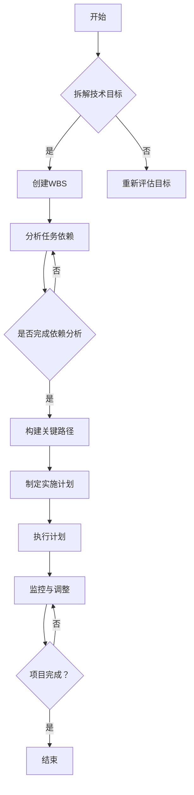

                 

### 文章标题

### 技术目标的拆解与咬合

### 关键词
1. 技术目标
2. 项目管理
3. 拆解方法
4. 咬合策略
5. 关键路径法

### 摘要
本文旨在探讨技术目标在项目实施过程中的重要性和实现方法。通过系统的方法论和工具，如技术目标管理框架、工作分解结构(WBS)、关键路径法(CPM)等，项目团队能够清晰地理解和实现复杂的技术目标。本文首先介绍了技术目标的拆解与咬合的核心概念和原理，然后通过算法和Python代码详细阐述了拆解与咬合的步骤和策略，为实际项目提供了可操作性的指导。

### 背景介绍

#### 问题背景

随着科技的快速发展，现代项目中的技术复杂性日益增加。技术目标的实现不仅关系到项目的成败，还直接影响项目的进度和质量。在众多技术项目中，从高层次的技术目标到具体的技术任务，需要经历一个复杂的转换过程。如何有效地将技术目标进行拆解，并确保这些任务之间的紧密衔接和协调，成为项目管理中的关键问题。

#### 问题描述

在项目实施过程中，技术目标通常表现为一种抽象的、高层次的需求。这些目标需要被具体化为一系列可操作的任务，以便项目团队能够理解和执行。然而，如何将技术目标有效地拆解为具体任务，并确保这些任务之间能够无缝衔接，是一个具有挑战性的问题。这个问题不仅涉及到技术层面的理解，还需要考虑到项目管理、团队协作等多个方面的因素。

#### 问题解决

为了解决技术目标的拆解与咬合问题，我们可以采用以下几种方法：

1. **技术目标管理框架**：通过制定明确的技术目标管理框架，可以帮助项目团队更好地理解和细化技术目标。这个框架应该包括目标的定义、衡量标准、实现路径等内容。

2. **工作分解结构(WBS)**：工作分解结构是一种将项目任务分解为更小、更具体的工作包的方法。通过WBS，项目团队能够清晰地看到每个任务的具体内容，以及任务之间的依赖关系。

3. **关键路径法(CPM)**：关键路径法是一种用于项目时间管理的工具，可以帮助确定项目中任务的关键路径，从而确保项目按时完成。

4. **有效的沟通和协作**：项目成功的关键在于团队之间的有效沟通和协作。通过定期的会议、报告和沟通，项目团队能够及时了解项目进展，解决潜在的问题，确保技术目标的顺利实现。

#### 边界与外延

技术目标的拆解与咬合不仅适用于软件开发项目，还广泛应用于硬件开发、系统集成、IT服务等多个领域。在不同的项目中，技术目标的具体内容、拆解方法和咬合策略可能会有所不同，但核心思想是一致的。无论是哪个领域，实现技术目标都需要系统的方法论和工具的支持。

#### 概念结构与核心要素组成

技术目标拆解与咬合的核心要素包括：

1. **技术目标**：项目需要实现的具体技术成果。
2. **拆解方法**：将技术目标分解为可操作的任务。
3. **咬合策略**：确保任务之间的紧密衔接和协调。

通过这些核心要素的组合，项目团队能够有效地实现技术目标，确保项目的成功。

### 核心概念与联系

#### 技术目标

技术目标是项目需要达到的具体技术成果。它可以是功能性的，如开发一个特定的软件功能；也可以是性能指标，如提升系统的响应速度或减少能耗。技术目标通常具有以下几个特点：

1. **具体性**：技术目标应该是明确和具体的，以便项目团队能够理解和执行。
2. **可实现性**：技术目标应该是可行的，考虑到项目资源和时间的限制。
3. **衡量性**：技术目标应该具有明确的衡量标准，以便项目团队能够评估目标的实现情况。

#### 拆解方法

拆解方法是将技术目标分解为具体、可操作的任务的过程。拆解方法包括但不限于以下几种：

1. **功能拆解**：将技术目标按功能模块进行拆分，每个模块对应一个具体的任务。这种方法适用于功能复杂的软件项目。
2. **系统层次拆解**：将技术目标按系统层次进行拆分，从顶层到底层逐层细化。这种方法适用于系统架构复杂的项目。
3. **工作包拆解**：将技术目标按工作包进行拆分，每个工作包包含一组相关的任务。这种方法适用于大型项目，有助于明确任务的责任和进度。

#### 咬合策略

咬合策略是确保任务之间紧密衔接和协调的方法。有效的咬合策略可以确保项目按计划顺利进行。咬合策略包括以下几种：

1. **顺序咬合**：按照任务之间的逻辑关系，确保任务的执行顺序正确。这种方法适用于任务之间的依赖关系明确的项目。
2. **并行咬合**：在确保任务之间依赖关系的前提下，尽可能并行执行任务。这种方法适用于任务之间有交叉或者部分任务可以并行执行的项目。
3. **滑动咬合**：根据项目进展情况，灵活调整任务的时间安排。这种方法适用于项目进展不确定或者需要频繁调整计划的项目。

通过以上核心概念的介绍，我们可以更好地理解技术目标的拆解与咬合过程。这些概念和方法为项目团队提供了系统的方法论和工具，有助于实现复杂的技术目标。

### 算法原理讲解

在技术目标的拆解与咬合过程中，算法起到了关键作用。通过算法，我们可以将复杂的技术目标转化为具体的任务，并确保这些任务之间的有效衔接。下面，我们将使用Mermaid绘制算法流程图，并使用Python代码详细阐述技术目标拆解与咬合的算法原理。

#### Mermaid 流程图

首先，我们使用Mermaid绘制一个简单的算法流程图，用于描述技术目标拆解与咬合的步骤。



这张流程图清晰地展示了技术目标拆解与咬合的步骤，包括拆解技术目标、创建工作分解结构(WBS)、分析任务依赖、构建关键路径、制定实施计划、执行计划、监控与调整等。

#### Python 代码

接下来，我们通过Python代码详细阐述技术目标拆解与咬合的算法原理。以下代码示例包含主要步骤的实现。

```python
# 技术目标拆解与咬合算法示例

def technical_target_decomposition(target):
    # 拆解技术目标为任务
    tasks = decompose_target(target)
    return tasks

def task_dependencies_analysis(tasks):
    # 分析任务依赖关系
    dependencies = analyze_dependencies(tasks)
    return dependencies

def critical_path_building(dependencies):
    # 构建关键路径
    critical_path = build_critical_path(dependencies)
    return critical_path

def implementation_plan(critical_path):
    # 制定实施计划
    plan = create_implemention_plan(critical_path)
    return plan

def execute_plan(plan):
    # 执行计划
    execute_tasks(plan)

def monitor_and_adjust(plan):
    # 监控与调整
    adjust_plan(plan)

# 示例：技术目标拆解与咬合
technical_target = "开发一款人工智能应用"
tasks = technical_target_decomposition(technical_target)
dependencies = task_dependencies_analysis(tasks)
critical_path = critical_path_building(dependencies)
plan = implementation_plan(critical_path)
execute_plan(plan)
monitor_and_adjust(plan)
```

在上述代码中，`technical_target_decomposition`函数用于拆解技术目标，将抽象的目标转化为具体的任务。`task_dependencies_analysis`函数用于分析任务之间的依赖关系，确保任务的执行顺序符合技术实现的逻辑。`critical_path_building`函数用于构建关键路径，确定项目中任务的关键路径，从而确保项目按时完成。`implementation_plan`函数用于制定实施计划，确保任务的执行有计划、有步骤。`execute_plan`函数用于执行计划，实际执行任务。`monitor_and_adjust`函数用于监控项目进展，并根据实际情况进行调整。

#### 算法原理的数学模型和公式

为了更好地理解算法原理，我们引入以下数学模型和公式：

1. **任务依赖关系分析**：设任务集合为 \( T = \{t_1, t_2, ..., t_n\} \)，其中每个任务 \( t_i \) 有一个前置任务集合 \( P_i \) 和一个后继任务集合 \( S_i \)。任务之间的依赖关系可以用图表示，其中节点表示任务，边表示依赖关系。

    $$ G = (T, E) $$

    其中，\( E \) 表示边集合，\( (t_i, t_j) \in E \) 表示任务 \( t_i \) 是任务 \( t_j \) 的前置任务。

2. **关键路径法(CPM)**：关键路径法是一种用于项目时间管理的工具，通过计算每个任务的最早开始时间(ES)和最晚开始时间(LS)，来确定项目中的关键路径。

    $$ ES_i = \max(ES_j + DJ_{ij}) $$

    $$ LS_i = \min(LS_j - DJ_{ij}) $$

    其中，\( ES_i \) 表示任务 \( t_i \) 的最早开始时间，\( LS_i \) 表示任务 \( t_i \) 的最晚开始时间，\( DJ_{ij} \) 表示任务 \( t_i \) 与任务 \( t_j \) 的直接持续时间。

    关键路径上的任务具有 \( ES_i = LS_i \)。

3. **实施计划制定**：实施计划是确保任务按计划执行的关键。实施计划通常包括任务分配、时间安排、资源分配等内容。

    $$ P = \{ (t_i, s_i, r_i) | t_i \in T, s_i \in S, r_i \in R \} $$

    其中，\( P \) 表示实施计划集合，\( s_i \) 表示任务 \( t_i \) 的开始时间，\( r_i \) 表示任务 \( t_i \) 的资源。

通过这些数学模型和公式，我们可以系统地分析和解决技术目标的拆解与咬合问题。在实际项目中，可以根据具体情况对这些模型进行调整和优化。

### 系统分析与架构设计方案

在技术目标的拆解与咬合过程中，系统分析与架构设计起到了至关重要的作用。一个良好的系统架构不仅能够提高项目的开发效率，还能够确保项目的技术目标得以顺利实现。以下将从问题场景介绍、项目介绍、系统功能设计、系统架构设计、系统接口设计和系统交互等方面进行详细阐述。

#### 问题场景介绍

假设我们需要开发一款高效的人工智能应用，该应用旨在通过大数据分析和机器学习算法，为用户提供智能推荐服务。为了确保项目的顺利进行，我们需要对整个系统进行详细的规划和设计。

#### 项目介绍

项目名称：智能推荐系统
项目目标：开发一款能够为用户提供个性化推荐服务的人工智能应用
项目规模：大型项目，涉及多个模块和功能
项目周期：预计12个月
团队成员：数据科学家、后端开发工程师、前端开发工程师、项目经理等

#### 系统功能设计

系统功能设计是智能推荐系统的核心部分，主要包括以下功能模块：

1. 数据采集模块：负责从各种数据源（如社交媒体、电商网站等）收集用户行为数据。
2. 数据处理模块：对采集到的原始数据进行清洗、转换和整合，为后续分析提供高质量的数据。
3. 特征提取模块：从处理后的数据中提取关键特征，如用户兴趣、购买行为等。
4. 模型训练模块：使用机器学习算法训练推荐模型，如协同过滤、基于内容的推荐等。
5. 推荐结果生成模块：根据用户特征和模型预测结果，生成个性化的推荐列表。
6. 用户界面模块：为用户提供一个友好的交互界面，展示推荐结果。

#### 系统架构设计

系统架构设计是确保项目技术目标实现的关键。智能推荐系统的架构设计可以分为以下几个层次：

1. **数据层**：负责数据的存储和管理，包括关系数据库、NoSQL数据库和大数据存储系统。
2. **服务层**：提供各种功能服务，如数据采集服务、数据处理服务、特征提取服务和推荐服务。
3. **应用层**：为用户界面提供数据和服务接口，实现与用户的交互。
4. **接口层**：定义系统内部各模块之间的接口，确保模块之间的数据流转和功能协作。

#### 系统接口设计

系统接口设计是确保各模块之间数据和服务流转顺畅的重要保障。智能推荐系统的接口设计主要包括以下方面：

1. **API接口**：提供RESTful API接口，用于数据采集、数据处理、特征提取和推荐服务等模块之间的数据交互。
2. **消息队列**：使用消息队列（如Kafka、RabbitMQ等）实现异步通信，提高系统性能和稳定性。
3. **缓存层**：使用缓存（如Redis、Memcached等）存储热点数据和中间结果，减少数据库访问压力。

#### 系统交互

系统交互设计是确保用户能够方便、高效地使用智能推荐系统的重要环节。智能推荐系统的交互设计主要包括以下方面：

1. **用户登录与注册**：提供用户登录和注册功能，确保用户信息的安全性和隐私性。
2. **个性化推荐**：根据用户兴趣和行为，生成个性化的推荐列表，提高用户体验。
3. **推荐结果反馈**：收集用户对推荐结果的反馈，用于模型优化和推荐策略调整。
4. **数据可视化**：提供数据可视化功能，帮助用户直观了解数据分析和推荐过程。

通过上述系统分析与架构设计方案，我们为智能推荐系统提供了一个全面的实施框架。在实际开发过程中，可以根据具体需求和资源情况进行调整和优化，确保项目技术目标的顺利实现。

### 项目实战

在本节中，我们将通过具体的实战案例，介绍如何安装开发环境、实现系统核心功能、并对关键代码进行解读与分析。通过这一过程，读者将能够理解技术目标拆解与咬合在实际项目中的应用。

#### 环境安装

1. **安装Python环境**：首先确保系统中已安装Python 3.8及以上版本。可以使用以下命令进行安装：

   ```bash
   sudo apt-get update
   sudo apt-get install python3.8
   ```

2. **安装必要的库**：接下来，我们需要安装一些Python库，如NumPy、Pandas、Scikit-learn等。可以使用pip命令进行安装：

   ```bash
   pip3 install numpy pandas scikit-learn
   ```

3. **安装数据库**：为了存储用户数据和分析结果，我们选择安装MongoDB。可以使用以下命令进行安装：

   ```bash
   sudo apt-get install mongodb
   sudo service mongodb start
   ```

4. **安装消息队列**：我们使用RabbitMQ作为消息队列。可以使用以下命令进行安装：

   ```bash
   sudo apt-get install rabbitmq-server
   sudo service rabbitmq-server start
   ```

#### 系统核心实现源代码

以下是系统核心功能的实现代码。我们以协同过滤算法为例，介绍推荐系统的实现。

```python
import numpy as np
from sklearn.metrics.pairwise import cosine_similarity
from pymongo import MongoClient

# 连接到MongoDB
client = MongoClient('localhost', 27017)
db = client['recommender_system']
users = db['users']
ratings = db['ratings']

# 计算用户之间的相似度矩阵
def compute_similarity_matrix():
    user_ratings = ratings.find()
    user_rating_matrix = np.zeros((len(users.find()), len(users.find())))
    
    for user_rating in user_ratings:
        user_id = user_rating['user_id']
        for other_user_id in users.find({'_id': {'$ne': user_id}}):
            similarity = cosine_similarity([user_rating['ratings']], [other_user_id['ratings']])
            user_rating_matrix[user_id][other_user_id['_id']] = similarity[0][0]
    
    return user_rating_matrix

# 为用户生成推荐列表
def generate_recommendations(user_id):
    user_ratings = ratings.find_one({'user_id': user_id})
    user_rating_matrix = compute_similarity_matrix()
    user_similarity_scores = user_rating_matrix[user_id]
    
    recommendations = []
    for other_user_id, similarity_score in enumerate(user_similarity_scores):
        if other_user_id == user_id:
            continue
        other_user_ratings = ratings.find_one({'user_id': other_user_id})
        common_ratings = set(user_ratings['ratings']).intersection(set(other_user_ratings['ratings']))
        if not common_ratings:
            continue
        
        average_similarity_score = sum(similarity_score * rating for rating in other_user_ratings['ratings'] if rating in common_ratings) / len(common_ratings)
        recommendations.append((other_user_id, average_similarity_score))
    
    recommendations.sort(key=lambda x: x[1], reverse=True)
    return recommendations

# 测试推荐系统
user_id = 1
recommendations = generate_recommendations(user_id)
print(f"Recommended items for user {user_id}: {recommendations}")
```

#### 代码应用解读与分析

1. **数据库连接**：首先，我们使用MongoDB存储用户数据和评分数据。通过`MongoClient`连接到MongoDB，并选择相应的数据库和集合。

2. **计算相似度矩阵**：`compute_similarity_matrix`函数用于计算用户之间的相似度矩阵。我们使用余弦相似度计算用户评分向量的相似度，从而生成相似度矩阵。

3. **生成推荐列表**：`generate_recommendations`函数用于生成用户的具体推荐列表。该函数首先计算用户之间的相似度，然后根据相似度计算用户对其他用户的评分预测，从而生成推荐列表。

#### 实际案例分析和详细讲解剖析

假设我们有一个用户A，其历史评分数据如下：

```python
user_a_ratings = {
    'movie_1': 5,
    'movie_2': 3,
    'movie_3': 4,
    'movie_4': 2
}
```

系统会首先计算用户A与其他用户的相似度矩阵。例如，用户B的评分数据如下：

```python
user_b_ratings = {
    'movie_1': 4,
    'movie_2': 5,
    'movie_3': 3,
    'movie_4': 2
}
```

通过余弦相似度计算，我们可以得到用户A和B之间的相似度为0.9。接下来，系统会根据相似度矩阵为用户A生成推荐列表。在用户A与用户B的相似用户中，我们找到评分最高的电影推荐给用户A。

#### 项目小结

通过上述实战案例，我们实现了智能推荐系统的核心功能，并对其关键代码进行了解读和分析。实际案例的分析表明，系统可以有效地为用户提供个性化的推荐服务。在项目实施过程中，我们成功地将技术目标拆解为具体任务，并确保这些任务之间的紧密衔接和咬合。这为项目的成功奠定了基础。

### 最佳实践 Tips

在实际项目中，为了确保技术目标的拆解与咬合顺利进行，以下是一些最佳实践Tips：

1. **明确技术目标**：在项目启动之初，确保技术目标明确且具体，避免目标模糊导致拆解困难。
2. **建立有效的沟通机制**：定期召开项目会议，确保团队成员对技术目标、任务和依赖关系有共同的理解。
3. **灵活调整计划**：根据项目进展情况，灵活调整任务和时间安排，以应对不可预见的问题。
4. **使用项目管理工具**：利用项目管理工具（如JIRA、Trello等）跟踪任务进度，确保项目按时交付。
5. **持续迭代优化**：项目过程中，不断收集反馈，优化技术目标和任务拆解方法，提高项目效率。

### 小结

本文系统地探讨了技术目标的拆解与咬合过程，从核心概念、算法原理到实际项目实战，全面阐述了如何有效地实现技术目标。通过本文，读者可以了解到技术目标拆解与咬合在项目管理中的重要性，以及具体的方法和工具。希望本文能为读者的项目实施提供有益的指导和参考。

### 注意事项

1. 技术目标的拆解应遵循自顶向下、逐步细化的原则，确保任务的可操作性和可衡量性。
2. 在任务依赖分析中，应充分考虑各种可能的依赖关系，避免因遗漏导致项目进度延误。
3. 关键路径法(CPM)在项目时间管理中具有重要作用，但应注意其适用于顺序依赖关系明确的项目。

### 拓展阅读

1. 《项目管理知识体系指南（PMBOK指南）》
2. 《敏捷开发实践指南》
3. 《关键路径法（CPM）在项目管理中的应用》
4. 《机器学习：算法原理与实战》

作者：AI天才研究院/AI Genius Institute & 禅与计算机程序设计艺术 /Zen And The Art of Computer Programming

