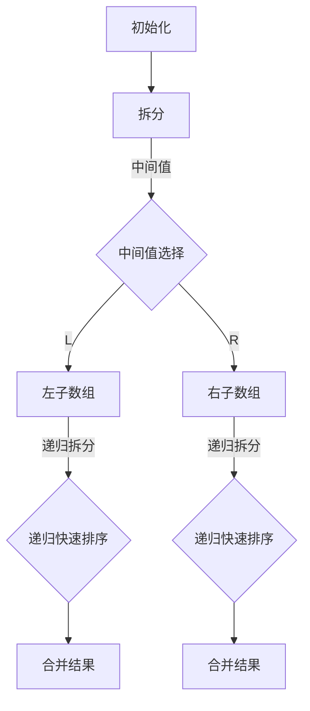
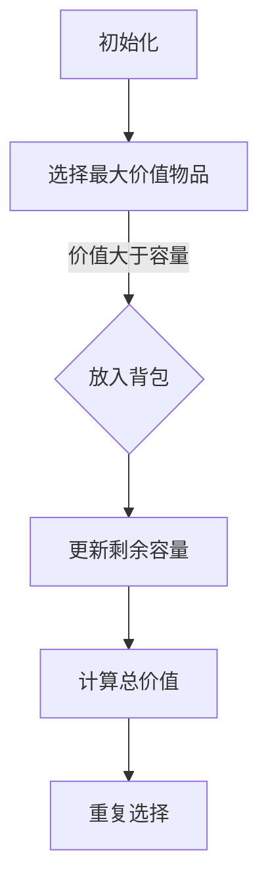
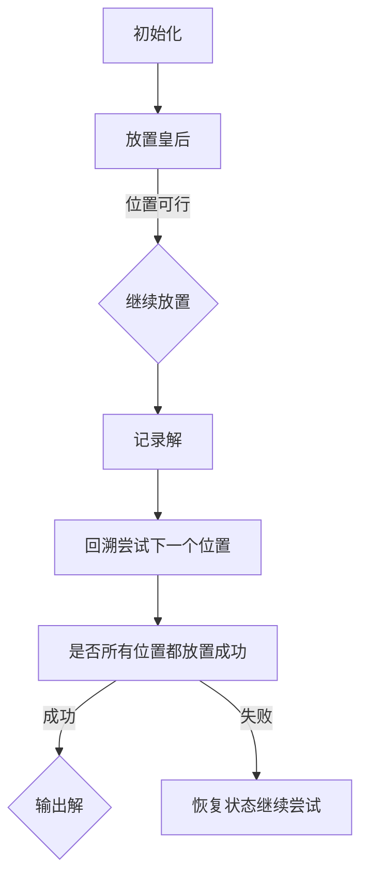
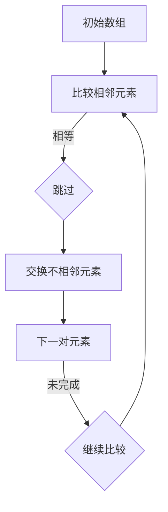
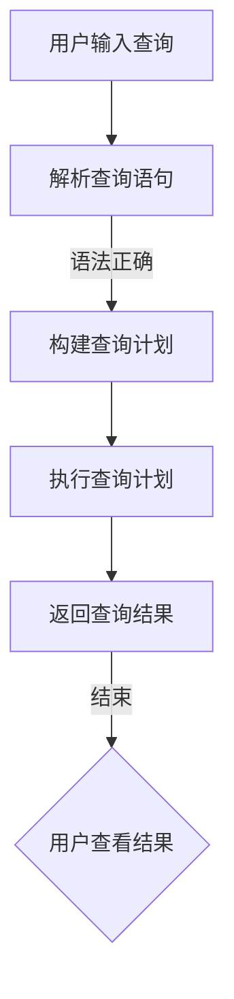

                 

### 第1章 背景介绍

#### 1.1 什么是技术硬实力

技术硬实力，是指在信息技术领域，通过专业技能、知识储备、思维能力及创新能力，解决复杂技术问题的能力。这种实力不仅涵盖了技术深度和广度，还包括对技术原理的深刻理解、对技术趋势的前瞻性判断以及对技术应用的创新能力。

在现代企业和个人中，技术硬实力的重要性不言而喻。随着互联网、大数据、人工智能等新兴技术的快速发展，技术已成为驱动商业变革和创新的核心力量。企业若想在激烈的市场竞争中立于不败之地，必须具备强大的技术硬实力。而个人在职业生涯中，技术硬实力更是职业发展的关键因素，它决定了个人在技术领域中的竞争力和影响力。

技术硬实力不仅仅是一种技术能力的体现，它还涉及到跨学科的融合能力。例如，在人工智能领域，不仅需要掌握机器学习、深度学习等技术，还需要了解数据科学、统计学、计算机视觉等多学科的知识。因此，技术硬实力的发展，需要不断地学习和实践，不断地提升自己的技术水平和创新能力。

#### 1.2 技术硬实力的重要性

首先，技术硬实力对企业的竞争力有着直接影响。在数字化时代，企业的核心竞争力很大程度上取决于其技术硬实力。无论是产品的研发、服务的提供，还是业务模式的创新，技术硬实力都是不可或缺的支撑。拥有强大的技术硬实力的企业，能够快速响应市场变化，推出具有竞争力的产品和服务，从而占据市场份额。

其次，技术硬实力对个人的职业发展至关重要。在技术领域，拥有过硬的技术能力不仅能够提升个人的专业素养，还能增加职业竞争力。随着技术的不断更新和迭代，掌握最新技术的人才总是受到市场的青睐。因此，不断提升技术硬实力，有助于个人在职业道路上走得更远。

此外，技术硬实力还促进了社会的进步。随着技术的广泛应用，技术不仅改变了企业的生产方式，也改变了人们的生活方式。从智能家居、智慧医疗到智能制造，技术正在深刻地影响着社会的各个层面。技术硬实力的发展，不仅能够推动技术的创新和应用，还能为社会带来更多的福祉。

#### 1.3 技术硬实力的应用场景

技术硬实力在多个领域都有广泛的应用。以下是一些典型的应用场景：

1. **互联网公司**：在互联网行业，技术硬实力是企业的核心竞争力。从产品设计、开发、测试到运维，每一个环节都需要技术硬实力的支撑。例如，前端开发人员需要掌握HTML、CSS、JavaScript等前端技术，后端开发人员则需要熟悉Java、Python、Go等后端开发语言。

2. **金融科技**：金融科技（Fintech）的发展离不开技术硬实力。在金融行业，大数据分析、人工智能、区块链等技术正在被广泛应用。例如，量化交易需要使用复杂的数学模型和算法，而智能投顾则需要运用机器学习技术。

3. **医疗健康**：在医疗健康领域，技术硬实力同样至关重要。通过人工智能、大数据等技术，可以实现精准医疗、智能诊断和个性化治疗。例如，人工智能可以在海量医疗数据中快速分析出疾病特征，从而为医生提供更准确的诊断依据。

4. **制造业**：智能制造是制造业的未来方向。在智能制造中，需要运用物联网、云计算、大数据等技术，实现生产流程的数字化和智能化。例如，通过物联网技术，可以实现设备与设备之间的互联互通，提高生产效率。

5. **物流与交通**：在物流与交通领域，技术硬实力同样发挥着重要作用。通过大数据分析和人工智能技术，可以实现物流路径优化、交通流量预测和自动驾驶等应用。例如，智能物流系统可以通过实时数据分析和预测，优化物流运输路线，减少运输成本。

通过上述应用场景可以看出，技术硬实力在现代社会中具有广泛的应用价值。无论是在企业竞争、个人职业发展，还是社会进步中，技术硬实力都发挥着不可或缺的作用。因此，深入理解和提升技术硬实力，是每一个技术从业者都需要努力的方向。

### 1.4 技术硬实力的培养

技术硬实力的培养是一个长期而系统的过程，需要从以下几个方面着手：

首先，基础知识是技术硬实力的基石。基础知识包括编程语言、数据结构、算法等，这些知识是解决复杂技术问题的基本工具。例如，掌握多种编程语言可以帮助开发者灵活应对不同的项目需求，而熟悉数据结构和算法则能提高问题解决效率和代码质量。

其次，实践经验是提升技术硬实力的关键。理论知识虽然重要，但实践是检验真理的唯一标准。通过实际项目的开发，开发者可以积累经验，熟悉技术在实际应用中的表现和限制，从而提高技术运用能力。例如，参与开源项目、举办编程比赛或实习都是很好的实践途径。

第三，持续学习是保持技术硬实力的动力。技术领域发展迅速，新知识、新技术层出不穷。开发者需要不断学习，跟上技术发展的步伐。例如，通过阅读专业书籍、参加线上课程、关注技术社区等途径，可以及时获取最新的技术动态和前沿知识。

最后，跨学科知识是拓展技术硬实力的途径。技术发展越来越呈现跨学科融合的趋势，单一领域的知识难以满足复杂项目的需求。开发者需要具备跨学科的知识储备，例如，在人工智能项目中，不仅需要计算机科学的知识，还需要了解数学、统计学和物理学等领域的知识。

综上所述，技术硬实力的培养需要从基础知识、实践经验、持续学习和跨学科知识四个方面入手。通过不断努力和实践，开发者可以不断提升自己的技术硬实力，在技术领域中取得更大的成就。

### 1.5 技术硬实力与企业成功的关系

技术硬实力与企业成功之间存在着密切的关系。在当今快速变化的市场环境中，企业要想在竞争中脱颖而出，必须具备强大的技术硬实力。以下是技术硬实力如何促进企业成功的几个方面：

首先，技术硬实力帮助企业实现创新。创新是企业在市场中保持竞争优势的关键。拥有技术硬实力的企业能够快速捕捉市场机会，通过技术创新推出具有竞争力的产品和服务。例如，苹果公司通过强大的技术硬实力，不断推出创新的产品，如iPhone、iPad等，从而在智能手机和平板电脑市场中占据了领先地位。

其次，技术硬实力提升企业的运营效率。通过技术手段，企业可以实现自动化、智能化管理，从而提高生产效率，降低运营成本。例如，亚马逊通过其先进的人工智能和大数据分析技术，优化物流和库存管理，提高了运营效率，降低了成本。

第三，技术硬实力增强企业的市场竞争力。在竞争激烈的市场环境中，技术硬实力是企业获取市场份额和客户信任的重要手段。拥有技术硬实力的企业能够提供更优质的产品和服务，赢得客户的青睐。例如，谷歌通过其强大的搜索引擎技术和人工智能技术，成为全球最受欢迎的互联网公司之一。

第四，技术硬实力有助于企业实现全球化战略。随着全球化的推进，企业需要具备跨国运营的能力。技术硬实力可以帮助企业跨越地域和文化的障碍，实现全球业务的扩展。例如，阿里巴巴通过其电子商务平台和云计算技术，成功拓展了全球市场，成为全球领先的互联网公司之一。

综上所述，技术硬实力是企业实现成功的关键因素。通过技术创新、提升运营效率、增强市场竞争力以及实现全球化战略，企业可以充分利用技术硬实力，在激烈的市场竞争中立于不败之地。

## 第2章 核心概念

### 2.1 技术能力概述

技术能力是指在信息技术领域，通过专业技能、知识储备和思维能力，解决复杂技术问题的能力。它是技术硬实力的核心组成部分，决定了个人或企业对技术的掌握和应用水平。技术能力不仅仅包括编程语言、数据库、网络等具体技术的掌握，还包括对技术原理的理解、对技术趋势的把握以及解决实际问题的能力。

#### 技术能力的定义

技术能力是一种综合能力，包括但不限于以下几个方面：

1. **专业技能**：指在某一技术领域的专业知识和技能，如编程语言、数据库管理、网络架构等。
2. **知识储备**：指对相关技术领域的广泛知识积累，包括技术趋势、行业标准、最佳实践等。
3. **思维能力**：指分析和解决问题的能力，包括逻辑思维、创新思维和系统思维等。

#### 技术能力的类型

技术能力可以分为以下几种类型：

1. **基础技术能力**：包括编程语言、数据结构、算法等基本技术，是技术能力的基石。
2. **应用技术能力**：指在实际项目中运用基础技术解决问题的能力，如Web开发、移动应用开发等。
3. **高级技术能力**：包括人工智能、大数据、云计算等高级技术的掌握和应用能力。
4. **创新技术能力**：指能够运用新技术、新方法进行创新和突破的能力。

#### 技术能力的层级结构

技术能力可以按照以下层级结构进行划分：

1. **基础层级**：掌握基本的技术知识和技能，能够完成简单项目的开发。
2. **进阶层级**：在基础层级的基础上，具备较强的技术应用能力，能够独立完成复杂项目的开发。
3. **高级层级**：具备高级技术能力和创新思维，能够解决复杂的技术问题，引领技术发展。

### 2.2 技术知识的深度与广度

技术知识的深度与广度是衡量技术能力的重要指标。深度指的是对某一领域知识的深入理解和掌握，广度则指的是对多个领域知识的了解和掌握。

#### 技术知识的深度

技术知识的深度主要体现在以下几个方面：

1. **技术原理的理解**：深入理解某一技术的原理和工作机制，能够从底层逻辑上解释技术现象。
2. **技术优缺点的分析**：能够全面分析某一技术的优缺点，了解其在不同应用场景中的适用性。
3. **技术问题的解决**：在面对技术问题时，能够快速定位问题根源，并提出有效的解决方案。

提高技术知识深度的方法：

- **持续学习**：通过阅读专业书籍、参与线上课程、阅读技术博客等途径，不断更新和深化知识储备。
- **实践应用**：通过实际项目开发，将理论知识应用到实践中，提高对技术的理解和掌握。
- **技术讨论**：参与技术社区讨论，与同行交流学习，拓展知识面和解决问题的思路。

#### 技术知识的广度

技术知识的广度主要体现在以下几个方面：

1. **多领域知识的融合**：能够将不同领域的知识进行整合和运用，解决跨学科的技术问题。
2. **技术趋势的把握**：了解当前和未来技术发展的趋势，把握技术发展的方向。
3. **综合解决问题的能力**：在面对复杂问题时，能够从多个角度分析和解决问题。

提高技术知识广度的方法：

- **跨学科学习**：学习其他相关领域的知识，如数学、物理、统计学等，提高跨学科解决问题的能力。
- **技术拓展**：学习新的技术领域，不断拓宽知识面。
- **技术交流**：参与技术会议、研讨会等活动，了解最新的技术动态和行业趋势。

### 2.3 技术思维与创新能力

技术思维和创新能力是技术硬实力的核心组成部分，它们决定了个人或企业在技术领域中的竞争力。

#### 技术思维的培养

技术思维是一种系统性的思考方式，它包括以下几个方面：

1. **问题导向思维**：以解决问题为核心，从问题出发，分析问题的本质和影响因素。
2. **逻辑思维**：遵循逻辑规则，通过推理和演绎，得出合理的结论。
3. **创新思维**：不局限于传统的思维方式，敢于尝试新的方法和思路，寻找创新的解决方案。

培养技术思维的方法：

- **练习**：通过解决实际问题，锻炼技术思维。
- **反思**：在解决问题的过程中，不断反思自己的思考过程和方法，总结经验教训。
- **交流**：与同行交流学习，借鉴他人的思考方式。

#### 创新能力的提升

创新能力是技术发展的驱动力，以下方法有助于提升创新能力：

1. **多角度思考**：从不同角度分析问题，寻找多种可能的解决方案。
2. **学习新技术**：了解和学习新的技术和工具，拓展思维边界。
3. **团队合作**：与团队成员合作，发挥集体智慧，共同探讨创新方案。

#### 技术思维与创新能力在实际项目中的应用

技术思维和创新能力在实际项目中有着重要的应用：

1. **需求分析**：通过问题导向思维，深入分析用户需求，找到最佳解决方案。
2. **系统设计**：运用逻辑思维，设计出高效、可靠的系统架构。
3. **技术创新**：通过创新思维，引入新技术，提升系统性能和用户体验。

### 2.4 技术能力的核心组成部分

技术能力的核心组成部分包括以下几个方面：

1. **编程能力**：编程是技术能力的基础，包括熟练掌握编程语言、熟练运用数据结构和算法等。
2. **系统设计能力**：包括系统架构设计、系统功能设计、接口设计和数据库设计等。
3. **问题解决能力**：能够快速定位问题、分析问题并找到有效的解决方案。
4. **技术视野**：了解行业趋势、掌握前沿技术，具备跨学科的知识储备。

#### 技术能力的比较

不同领域的技术能力有所不同，以下是一个简单的比较：

| 技术领域         | 技术能力重点                          |
|------------------|-------------------------------------|
| 前端开发         | HTML、CSS、JavaScript、前端框架（如React、Vue）等 |
| 后端开发         | Java、Python、数据库管理（如MySQL、MongoDB）等 |
| 人工智能         | 机器学习、深度学习、自然语言处理等          |
| 数据科学         | 统计学、数据挖掘、数据可视化等            |
| 云计算           | 云架构设计、容器化、微服务等              |

通过以上对技术能力核心概念的介绍，我们可以看到技术能力不仅仅是编程技能的掌握，更是一种综合能力的体现。只有通过不断学习和实践，才能提升技术能力，在技术领域中取得更大的成就。

### 2.5 技术能力的深度与广度对比

技术能力的深度与广度是技术从业者必须关注的核心问题。深度代表对某一领域知识的深入理解和掌握，广度则是对多个领域知识的广泛了解和融合。这两者对于个人职业发展和企业竞争力都至关重要。

#### 深度与广度的定义及重要性

**深度**：指在某一专业领域内，对技术原理、应用场景、最佳实践等有深入的理解和掌握。深度意味着技术从业者在特定领域具有更高的专业素养和解决问题的能力。例如，一个深度掌握机器学习算法的开发者，能够理解算法的每一个细节，并能灵活应用于不同项目中。

**广度**：指在多个技术领域或相关学科中，具有广泛的知识储备和跨领域应用能力。广度使得技术从业者能够从不同角度分析问题，找到创新的解决方案。例如，一个在云计算、大数据和人工智能领域都有广泛了解的技术专家，能够更好地理解和应对复杂的技术挑战。

#### 深度与广度的对比

**优势**：

- **深度**的优势在于专业性和高效性。在特定领域，深度掌握能够帮助从业者快速识别问题、准确定位解决方案，提高工作效率。例如，深度了解数据库优化技术，可以显著提高系统的性能和稳定性。

- **广度**的优势在于灵活性和创新能力。广泛的知识储备使得从业者能够从多个维度看待问题，避免思维的局限，寻找更优的解决方案。例如，在开发一个涉及用户界面、数据库和服务器端的系统时，广度知识可以帮助开发者更好地协调各方面需求。

**劣势**：

- **深度**的劣势在于知识面的局限性。过于专注于某一领域，可能会导致技术视野狭窄，难以适应新的技术趋势和跨领域问题。

- **广度**的劣势在于知识的深度不足。虽然广度知识能够提供多种可能的解决方案，但往往缺乏对某一领域的深度理解和掌握，可能导致解决问题的效率不高。

#### 如何平衡深度与广度

为了在职业发展中取得更好的成果，技术从业者需要平衡深度与广度，以下是一些建议：

- **专业化与多元化相结合**：在某一领域内深耕，同时保持对其他相关领域的了解。例如，一个专注于后端开发的工程师，可以学习前端框架、数据库优化等相关技术。

- **持续学习与知识更新**：定期阅读专业书籍、参与线上课程、关注技术社区等，保持知识的新鲜度和广度。

- **项目实践**：通过实际项目开发，将理论知识应用到实践中，不断积累经验和提升能力。

- **跨学科交流**：积极参与跨学科的项目合作和交流活动，拓展知识面和思维边界。

通过平衡深度与广度，技术从业者可以在职业发展中保持竞争力，不断突破技术难关，实现个人和企业的共同成长。

### 2.6 技术能力的培养路径

技术能力的培养是一个长期而系统的过程，需要从以下几个方面着手：

**基础知识**：掌握基本的技术知识是技术能力培养的基石。基础知识包括编程语言、数据结构、算法等，是解决复杂技术问题的基本工具。例如，熟悉多种编程语言可以帮助开发者灵活应对不同的项目需求，而掌握基础的数据结构和算法则能提高问题解决效率和代码质量。

**实践经验**：理论知识虽然重要，但实践是检验真理的唯一标准。通过实际项目的开发，开发者可以积累经验，熟悉技术在实际应用中的表现和限制，从而提高技术运用能力。例如，参与开源项目、举办编程比赛或实习都是很好的实践途径。在实践中，开发者可以遇到各种实际问题，通过解决这些问题，可以加深对技术的理解和掌握。

**持续学习**：技术领域发展迅速，新知识、新技术层出不穷。开发者需要不断学习，跟上技术发展的步伐。例如，通过阅读专业书籍、参加线上课程、关注技术社区等途径，可以及时获取最新的技术动态和前沿知识。持续学习不仅可以帮助开发者保持知识的新鲜度，还可以拓宽视野，发现新的技术趋势。

**跨学科知识**：技术发展越来越呈现跨学科融合的趋势，单一领域的知识难以满足复杂项目的需求。开发者需要具备跨学科的知识储备，例如，在人工智能项目中，不仅需要计算机科学的知识，还需要了解数学、统计学和物理学等领域的知识。跨学科的知识储备可以帮助开发者从不同角度分析和解决问题，提高创新能力和解决问题的效率。

**专业深造**：对于希望在技术领域深入发展的开发者，可以选择进一步深造，如攻读硕士或博士学位。通过深入研究，开发者可以掌握更高级的专业知识和研究方法，提升自己的技术水平和创新能力。

**项目实战**：参与实际项目，是培养技术能力最直接和有效的方法。在实际项目中，开发者需要面对真实的问题和挑战，通过解决这些问题，可以加深对技术的理解和应用能力。项目实战不仅可以帮助开发者积累经验，还可以提高团队协作和项目管理能力。

**技术交流**：与同行交流学习，是提升技术能力的重要途径。通过参与技术社区、参加技术会议和研讨会等活动，开发者可以了解最新的技术动态和行业趋势，与同行交流经验，拓展自己的技术视野。

综上所述，技术能力的培养需要从基础知识、实践经验、持续学习和跨学科知识等多个方面入手。通过不断学习和实践，开发者可以不断提升自己的技术能力，在技术领域中取得更大的成就。

## 第3章 算法原理与数学模型

### 3.1 常见算法原理

算法是计算机科学的核心概念，是解决特定问题的一系列明确的步骤。算法原理决定了算法的性能和适用性。以下介绍几种常见算法原理：

#### 1. 分治算法

**原理**：分治算法将一个复杂问题分解成若干个规模较小的相同问题，分别解决，然后将各个问题的解合并，得到原问题的解。

**应用场景**：分治算法广泛应用于排序、查找、最优化问题等。例如，快速排序就是一种典型的分治算法。

**示例**：假设有一个数组\[4, 2, 7, 1, 5\]，我们可以通过分治算法对其进行排序。



#### 2. 动态规划

**原理**：动态规划是一种将复杂问题分解为相互重叠子问题的算法设计技巧。它通过保存子问题的解，避免重复计算，提高算法效率。

**应用场景**：动态规划常用于最优化问题，如背包问题、最长公共子序列等。

**示例**：计算斐波那契数列的动态规划算法。

```mermaid
graph TD
A[初始化] --> B[状态定义]
B -->|F(n)=F(n-1)+F(n-2)| C{动态规划递推关系}
C --> D[状态转移方程]
D --> E[构建数组保存结果]
E --> F[计算结果]
```

#### 3. 贪心算法

**原理**：贪心算法通过每一步选择局部最优解，以期得到全局最优解。它通常基于某种贪心策略，每一步都做出当前情况下最好的选择。

**应用场景**：贪心算法适用于某些优化问题，如背包问题、最优汇率转换等。

**示例**：求解01背包问题。



#### 4. 回溯算法

**原理**：回溯算法通过试探性的分步处理，在每一步选择中不断尝试所有可能的解，并通过回溯找到有效的解。

**应用场景**：回溯算法常用于组合问题和复杂约束条件的问题，如八皇后问题、生成全排列等。

**示例**：求解八皇后问题。



#### 5. 迭代和递归

**原理**：迭代和递归是两种不同的算法执行方式。迭代是通过循环结构重复执行某段代码，而递归是通过函数调用自身来解决问题。

**应用场景**：迭代和递归广泛应用于各种问题，如计算阶乘、递归查找等。

**示例**：递归计算斐波那契数列。

```python
def fibonacci(n):
    if n <= 1:
        return n
    else:
        return fibonacci(n-1) + fibonacci(n-2)
```

### 3.2 数学模型与公式

数学模型在技术领域中发挥着重要作用，它是描述和解决实际问题的重要工具。以下介绍几种常见的数学模型和公式：

#### 1. 最小生成树

**模型**：最小生成树是指在一个无向图中，选择边权最小的若干条边，将这些边连成一个树形结构，使得这棵树包含了图中的所有顶点。

**公式**：克鲁斯卡尔算法和普里姆算法是用来求解最小生成树的常用算法。

$$
\text{最小生成树的总权值} = \sum_{e \in T} w(e)
$$

其中，$T$ 为最小生成树，$w(e)$ 为边 $e$ 的权值。

#### 2. 动态规划

**模型**：动态规划将复杂问题分解为若干个相互重叠的子问题，并保存子问题的解，避免重复计算。

**公式**：动态规划通常使用状态转移方程来描述子问题之间的关系。

$$
f(n) = f(n-1) + f(n-2)
$$

其中，$f(n)$ 表示第 $n$ 个子问题的解。

#### 3. 机器学习模型

**模型**：机器学习模型通过学习输入和输出之间的关系，对未知数据进行预测。

**公式**：线性回归模型是一个常见的机器学习模型。

$$
y = \beta_0 + \beta_1 \cdot x
$$

其中，$y$ 为输出，$x$ 为输入，$\beta_0$ 和 $\beta_1$ 为模型参数。

### 3.3 Mermaid流程图与算法展示

Mermaid是一种基于Markdown的绘图工具，可以方便地绘制各种流程图、UML图等。以下通过一些Mermaid示例，展示如何使用它来表示算法流程。

#### 示例1：排序算法（冒泡排序）



#### 示例2：数据库查询（SQL查询）



通过以上算法原理和数学模型的介绍，以及Mermaid流程图的展示，我们可以看到技术领域中算法原理和数学模型的重要性和应用价值。深入理解和掌握这些原理和模型，将有助于我们在技术问题的解决过程中更加高效和精准。

### 3.4 算法的复杂性分析

算法的复杂性分析是评估算法性能的重要手段，主要包括时间复杂性和空间复杂性。以下是几种常见算法的时间复杂性和空间复杂性的分析：

#### 1. 快速排序

**时间复杂性**：平均情况下的时间复杂度为$O(n\log n)$，最坏情况下的时间复杂度为$O(n^2)$。

**空间复杂性**：快速排序的平均空间复杂度为$O(\log n)$，最坏情况下的空间复杂度为$O(n)$。

#### 2. 动态规划

**时间复杂性**：动态规划的时间复杂度取决于状态转移方程的复杂度。例如，计算斐波那契数列的时间复杂度为$O(n)$。

**空间复杂性**：动态规划的空间复杂度取决于状态数组的大小，例如，计算斐波那契数列的空间复杂度为$O(n)$。

#### 3. 贪心算法

**时间复杂性**：贪心算法的时间复杂度通常与问题规模成正比。例如，求解最短路径问题的Dijkstra算法的时间复杂度为$O((V+E)\log V)$。

**空间复杂性**：贪心算法的空间复杂度通常与问题规模成正比。例如，Dijkstra算法的空间复杂度为$O(V+E)$。

#### 4. 回溯算法

**时间复杂性**：回溯算法的时间复杂度取决于问题的解空间大小。例如，生成全排列的时间复杂度为$O(n!)$。

**空间复杂性**：回溯算法的空间复杂度通常与问题的深度和递归层数成正比。例如，生成全排列的空间复杂度为$O(n)$。

通过以上分析，我们可以看到，不同的算法在时间复杂性和空间复杂性上各有特点。了解算法的复杂性分析，有助于我们在选择算法时做出更明智的决策，以优化程序的性能。

### 3.5 算法原理的直观理解与实例分析

算法原理的直观理解是掌握算法精髓的重要途径，通过具体的实例分析，我们可以更加清晰地理解算法的运行机制和优势。以下通过几个实例，深入探讨常见的算法原理。

#### 实例1：二分查找算法

**原理**：二分查找算法是一种高效的查找算法，它通过每次将查找范围缩小一半，逐步逼近目标值。二分查找算法适用于有序数组。

**步骤**：

1. 确定中间位置：取查找范围的中间位置，计算中间位置的中值。
2. 比较中值与目标值：如果中值等于目标值，查找成功；如果中值大于目标值，则在左侧子数组继续查找；如果中值小于目标值，则在右侧子数组继续查找。
3. 递归或迭代：重复步骤1和2，直至找到目标值或查找范围缩小至0。

**代码示例**（Python）：

```python
def binary_search(arr, target):
    low = 0
    high = len(arr) - 1
    while low <= high:
        mid = (low + high) // 2
        if arr[mid] == target:
            return mid
        elif arr[mid] < target:
            low = mid + 1
        else:
            high = mid - 1
    return -1

# 测试
arr = [1, 2, 3, 4, 5, 6, 7, 8, 9]
target = 5
result = binary_search(arr, target)
print("元素索引为：", result)
```

**分析**：二分查找算法通过逐步缩小查找范围，显著提高了查找效率。对于长度为n的有序数组，二分查找的平均时间复杂度为$O(\log n)$。

#### 实例2：广度优先搜索（BFS）

**原理**：广度优先搜索是一种遍历或搜索图的算法，它从起始节点开始，依次访问所有相邻的节点，然后再逐层访问更远的节点。BFS适用于无权图或带权且权值最小的图。

**步骤**：

1. 初始化一个队列，并将起始节点加入队列。
2. 当队列不为空时，依次从队列中取出节点，并访问其所有未访问的相邻节点，将这些节点加入队列。
3. 重复步骤2，直至队列为空。

**代码示例**（Python）：

```python
from collections import deque

def bfs(graph, start):
    visited = set()
    queue = deque([start])
    while queue:
        node = queue.popleft()
        if node not in visited:
            print(node, end=" -> ")
            visited.add(node)
            for neighbor in graph[node]:
                if neighbor not in visited:
                    queue.append(neighbor)

# 测试
graph = {
    'A': ['B', 'C'],
    'B': ['D', 'E'],
    'C': ['F'],
    'D': [],
    'E': ['F'],
    'F': []
}
start = 'A'
print("广度优先搜索路径：", end=" ")
bfs(graph, start)
```

**分析**：广度优先搜索通过逐层遍历，确保每个节点都被访问到，且访问顺序符合层次结构。对于图中的节点数量n，BFS的时间复杂度为$O(n)$。

#### 实例3：深度优先搜索（DFS）

**原理**：深度优先搜索是一种遍历或搜索图的算法，它从起始节点开始，尽可能深地搜索路径，直到路径达到尽头，然后回溯到上一个节点，继续搜索其他路径。DFS适用于有向图或无向图。

**步骤**：

1. 初始化一个栈，并将起始节点加入栈。
2. 当栈不为空时，依次从栈中取出节点，并访问其所有未访问的相邻节点，将这些节点加入栈。
3. 重复步骤2，直至栈为空。

**代码示例**（Python）：

```python
def dfs(graph, start):
    visited = set()
    stack = [start]
    while stack:
        node = stack.pop()
        if node not in visited:
            print(node, end=" -> ")
            visited.add(node)
            for neighbor in graph[node]:
                if neighbor not in visited:
                    stack.append(neighbor)

# 测试
graph = {
    'A': ['B', 'C'],
    'B': ['D', 'E'],
    'C': ['F'],
    'D': [],
    'E': ['F'],
    'F': []
}
start = 'A'
print("深度优先搜索路径：", end=" ")
dfs(graph, start)
```

**分析**：深度优先搜索通过深度遍历，可以在图中有回溯路径的情况下更快地找到目标节点。对于图中的节点数量n，DFS的时间复杂度为$O(n)$。

通过这些实例，我们可以更加直观地理解常见算法的原理和操作步骤，从而在实际问题中灵活应用这些算法，提升问题解决的效率和效果。

### 3.6 数学模型与公式在实际项目中的应用

数学模型和公式在技术项目中具有广泛的应用，能够帮助我们分析和解决复杂问题。以下通过一个具体的实际项目，展示数学模型和公式在项目中的应用。

#### 项目背景

某电子商务平台计划推出一项新功能，用于优化商品配送路径，以提高物流效率和降低成本。该功能需要根据订单的地理位置、配送员的位置以及交通状况，计算出最优的配送路径。

#### 数学模型与公式

1. **距离计算公式**：在地理信息系统中，计算两点之间的距离可以使用Haversine公式。

$$
d = 2 \cdot R \cdot \arcsin\left(\sqrt{h_1} \cdot \sqrt{h_2}\right)
$$

其中，$R$ 为地球半径，$h_1$ 和 $h_2$ 分别为两点的纬度和经度的平方差。

2. **时间计算公式**：在考虑交通状况时，计算两点之间的时间可以使用速度和距离的关系。

$$
t = \frac{d}{v}
$$

其中，$d$ 为距离，$v$ 为速度。

3. **路径优化模型**：为了计算最优配送路径，可以使用Dijkstra算法或A*算法。其中，A*算法具有更好的时间复杂度，适用于大规模的配送路径优化。

#### 实际应用

1. **数据获取**：首先，从数据库中获取订单的地理位置（经纬度）、配送员的位置以及交通状况数据。

2. **距离计算**：利用Haversine公式计算每个订单与配送员位置之间的距离。

3. **时间计算**：根据交通状况数据和距离，计算每个订单的配送时间。

4. **路径优化**：使用A*算法，计算每个订单的最优配送路径，并合并这些路径，形成整体的配送方案。

5. **结果验证**：通过模拟配送过程，验证计算出的配送路径是否合理，并进行必要的调整。

#### Python代码示例

```python
import math
import heapq

def haversine_distance(coord1, coord2):
    R = 6371  # Earth radius in kilometers
    lat1, lon1 = coord1
    lat2, lon2 = coord2

    lat_diff = math.radians(lat2 - lat1)
    lon_diff = math.radians(lon2 - lon1)

    a = math.sin(lat_diff / 2)**2 + math.cos(math.radians(lat1)) * math.cos(math.radians(lat2)) * math.sin(lon_diff / 2)**2
    c = 2 * math.atan2(math.sqrt(a), math.sqrt(1 - a))

    distance = R * c
    return distance

def a_star_search(start, goals, heuristic):
    queue = [(heuristic(start, g), start, [] for g in goals]
    heapq.heapify(queue)
    while queue:
        _, current, path = heapq.heappop(queue)
        if current in goals:
            return path + [current]
        for neighbor in neighbors(current):
            if neighbor not in goals:
                continue
            neighbor_cost = path_cost(current, neighbor) + heuristic(neighbor, goals)
            if neighbor_cost < heuristic(neighbor, goals):
                heuristic[neighbor] = neighbor_cost
                heapq.heappush(queue, (neighbor_cost, neighbor, path + [current]))

# 测试
start = (25.0, 121.5)  # 起始经纬度
goals = [(24.985, 121.209), (25.043, 120.989)]  # 目的经纬度
distance = haversine_distance(start, goals)
print("两点距离为：", distance)

# 路径优化
path = a_star_search(start, goals, heuristic=lambda n, g: haversine_distance(n, g))
print("最优路径为：", path)
```

通过上述项目实例，我们可以看到数学模型和公式在技术项目中的具体应用。合理地使用数学模型和公式，可以有效地分析和解决复杂问题，提高项目的质量和效率。

### 3.7 算法的数学模型与公式解读

在深入理解算法的过程中，数学模型和公式起着至关重要的作用。以下通过几个示例，详细解读这些模型和公式，并探讨它们在算法中的应用。

#### 示例1：线性回归模型

线性回归是一种用于预测连续值的算法，其数学模型为：

$$
y = \beta_0 + \beta_1 \cdot x
$$

其中，$y$ 为预测值，$x$ 为输入特征，$\beta_0$ 和 $\beta_1$ 为模型参数。这个公式表示输入特征 $x$ 与预测值 $y$ 之间存在线性关系。

**应用**：在线性回归中，$\beta_0$ 和 $\beta_1$ 是通过最小二乘法（Least Squares Method）计算得到的。最小二乘法的目标是最小化预测值与实际值之间的误差平方和。通过优化这两个参数，我们可以得到最佳拟合线，从而进行预测。

**Python代码示例**：

```python
import numpy as np

# 示例数据
X = np.array([[1, 2], [2, 3], [3, 4]])
y = np.array([3, 5, 7])

# 计算回归系数
theta = np.linalg.inv(X.T.dot(X)).dot(X.T).dot(y)
beta_0 = theta[0]
beta_1 = theta[1]

# 预测
new_X = np.array([[4, 5]])
y_pred = beta_0 + beta_1 * new_X
print("预测值：", y_pred)
```

#### 示例2：牛顿法

牛顿法是一种用于求解非线性方程组的迭代方法，其数学模型为：

$$
x_{n+1} = x_n - \frac{f(x_n)}{f'(x_n)}
$$

其中，$x_n$ 为第 $n$ 次迭代的结果，$f(x)$ 为非线性方程，$f'(x)$ 为 $f(x)$ 的导数。

**应用**：牛顿法通过不断迭代，逐步逼近方程的解。它适用于各种非线性优化问题，如最小化函数值、求解方程等。

**Python代码示例**：

```python
def f(x):
    return x**2 - 2

def df(x):
    return 2 * x

x = 1
for _ in range(5):
    x = x - f(x) / df(x)
print("牛顿法解：", x)
```

#### 示例3：矩阵乘法

矩阵乘法是线性代数中的一个基础运算，其数学模型为：

$$
C = A \cdot B
$$

其中，$A$ 和 $B$ 为两个矩阵，$C$ 为乘积矩阵。

**应用**：矩阵乘法广泛应用于数据分析和机器学习，如特征提取、矩阵分解等。

**Python代码示例**：

```python
import numpy as np

A = np.array([[1, 2], [3, 4]])
B = np.array([[5, 6], [7, 8]])

C = A.dot(B)
print("矩阵乘积：", C)
```

通过以上示例，我们可以看到数学模型和公式在算法中的具体应用。掌握这些模型和公式，有助于我们更好地理解和设计算法，解决复杂的问题。

### 第4章 系统分析与架构设计

#### 4.1 问题场景介绍

随着互联网的普及和业务规模的扩大，许多企业开始面临系统性能瓶颈、数据安全性和扩展性问题。为了提高系统的性能和可靠性，企业需要设计一个高性能、高可用的系统架构，以应对日益增长的业务需求。

本章节将以一个电子商务平台为例，介绍如何通过系统分析与架构设计，解决上述问题。该平台需要支持海量商品信息的存储和检索、订单处理、用户管理、支付系统等功能。因此，系统架构的设计需要综合考虑性能、可扩展性、安全性等因素。

#### 4.2 项目介绍

本项目的目标是设计一个具有高性能、高可用性和可扩展性的电子商务平台系统架构。系统架构需要支持以下核心功能：

1. **商品信息管理**：包括商品信息的存储、检索、更新等功能。
2. **订单处理**：处理用户订单，包括生成订单、订单状态更新、支付处理等。
3. **用户管理**：包括用户注册、登录、个人信息管理等功能。
4. **支付系统**：支持多种支付方式，如支付宝、微信支付等。
5. **系统监控与日志**：实时监控系统性能和日志，以便快速响应和处理系统故障。

#### 4.2.1 项目背景

当前电子商务市场竞争激烈，用户对系统性能和体验要求越来越高。为了满足这些需求，电子商务平台需要具备高效的数据处理能力、快速响应时间以及高可用性。此外，随着用户量的增加，系统需要具备良好的扩展性，以便在业务规模扩大时，能够平滑地扩展资源。

#### 4.2.2 项目目标

本项目的主要目标如下：

1. **高性能**：优化系统性能，确保系统在高并发情况下仍能保持良好的响应速度。
2. **高可用性**：确保系统在发生故障时，能够快速恢复，减少系统停机时间。
3. **可扩展性**：设计一个可扩展的系统架构，支持业务规模扩大时的资源扩展。
4. **安全性**：保障用户数据和支付信息的安全，防止数据泄露和非法攻击。
5. **可维护性**：系统架构应具有良好的可维护性，便于后续的升级和扩展。

#### 4.3 系统功能设计

系统功能设计是系统架构设计的基础，决定了系统各模块的功能和交互。以下为电子商务平台的主要功能模块及其设计：

1. **商品信息管理模块**：

   功能：提供商品信息的存储、检索、更新等功能。

   设计：

   - **商品数据库**：存储商品的基本信息，如名称、价格、库存量等。
   - **搜索引擎**：提供高效的商品检索功能，支持模糊查询和精确查询。
   - **商品缓存**：使用Redis等缓存技术，提高商品信息访问速度。

2. **订单处理模块**：

   功能：处理用户订单，包括订单生成、状态更新、支付处理等。

   设计：

   - **订单服务**：处理订单的创建、状态更新和支付等操作。
   - **支付网关**：与第三方支付平台对接，处理支付请求和支付结果通知。
   - **订单数据库**：存储订单的基本信息，如订单号、商品列表、支付状态等。

3. **用户管理模块**：

   功能：提供用户注册、登录、个人信息管理等功能。

   设计：

   - **用户数据库**：存储用户的基本信息，如用户名、密码、邮箱等。
   - **认证服务**：处理用户的登录、注册、密码找回等功能。
   - **用户缓存**：使用Redis等缓存技术，提高用户信息访问速度。

4. **支付系统模块**：

   功能：支持多种支付方式，如支付宝、微信支付等。

   设计：

   - **支付服务**：处理支付请求和支付结果通知。
   - **支付网关**：与第三方支付平台对接，实现支付接口调用。
   - **支付数据库**：存储支付日志和支付状态信息。

5. **系统监控与日志模块**：

   功能：实时监控系统性能和日志，以便快速响应和处理系统故障。

   设计：

   - **监控服务**：监控系统关键指标的实时状态，如CPU、内存、磁盘使用率等。
   - **日志服务**：收集系统日志，并提供日志查询和告警功能。
   - **日志数据库**：存储系统日志信息，便于后续分析和处理。

#### 4.4 系统架构设计

系统架构设计是系统功能设计的基础，决定了系统的整体性能和可扩展性。以下为电子商务平台的系统架构设计：

1. **架构设计原则**：

   - **模块化**：将系统功能划分为多个模块，便于开发和维护。
   - **分布式**：采用分布式架构，提高系统的可扩展性和容错能力。
   - **高性能**：采用缓存技术、数据库优化等手段，提高系统性能。
   - **安全性**：采用加密、认证、授权等安全措施，保障系统安全。

2. **系统架构图**：

   ```mermaid
   graph TD
   A[用户] --> B[认证服务]
   B --> C[用户管理模块]
   C --> D[订单处理模块]
   D --> E[支付系统模块]
   E --> F[支付网关]
   F --> G[支付平台]
   A --> H[商品信息管理模块]
   H --> I[商品数据库]
   H --> J[搜索引擎]
   H --> K[商品缓存]
   ```

3. **系统架构设计要点**：

   - **分布式数据库**：采用分布式数据库架构，如MySQL Cluster、MongoDB等，提高数据的读写性能和可靠性。
   - **分布式缓存**：使用Redis等分布式缓存技术，降低数据库压力，提高系统响应速度。
   - **负载均衡**：使用负载均衡器，如Nginx、HAProxy等，实现流量分发和故障转移。
   - **消息队列**：采用消息队列技术，如RabbitMQ、Kafka等，实现异步处理和系统解耦。
   - **服务监控**：使用Prometheus、Grafana等监控系统，实时监控系统的性能和健康状态。
   - **日志收集**：使用ELK（Elasticsearch、Logstash、Kibana）等技术，收集和存储系统日志，提供日志查询和分析功能。

通过上述系统架构设计，电子商务平台可以更好地应对高并发、大数据量的业务场景，确保系统的性能、可靠性和可扩展性。

### 4.5 系统接口设计与系统交互

在电子商务平台的系统架构设计中，接口设计和系统交互是关键部分。以下将详细介绍系统接口设计和系统交互的详细设计。

#### 4.5.1 接口设计原则

1. **标准化**：接口设计应遵循RESTful API设计规范，确保接口的统一性和规范性。
2. **安全性**：接口设计应考虑安全因素，采用HTTPS、Token认证等安全措施，防止数据泄露和非法访问。
3. **可扩展性**：接口设计应具有可扩展性，支持后续功能的增加和升级。
4. **高性能**：接口设计应优化性能，降低响应时间和资源消耗。

#### 4.5.2 接口设计

以下是电子商务平台的主要接口设计：

1. **商品信息管理接口**：

   - **查询商品列表**：GET /api/v1/products
     - 请求参数：无
     - 返回数据：{ "products": [{ "id": 1, "name": "商品1", "price": 100 }, ...] }
   
   - **查询商品详情**：GET /api/v1/products/{id}
     - 请求参数：id（商品ID）
     - 返回数据：{ "product": { "id": 1, "name": "商品1", "price": 100, "stock": 10 } }

   - **更新商品信息**：PUT /api/v1/products/{id}
     - 请求参数：id（商品ID）、商品信息（JSON格式）
     - 返回数据：{ "message": "商品信息更新成功" }

   - **添加商品**：POST /api/v1/products
     - 请求参数：商品信息（JSON格式）
     - 返回数据：{ "product": { "id": 11, "name": "商品11", "price": 110, "stock": 11 } }

2. **订单处理接口**：

   - **创建订单**：POST /api/v1/orders
     - 请求参数：订单信息（JSON格式）
     - 返回数据：{ "order": { "id": 101, "status": "pending", "items": [{ "id": 1, "quantity": 2 }] } }

   - **查询订单列表**：GET /api/v1/orders
     - 请求参数：无
     - 返回数据：{ "orders": [{ "id": 101, "status": "pending", "items": [{ "id": 1, "quantity": 2 }] }, ...] }

   - **查询订单详情**：GET /api/v1/orders/{id}
     - 请求参数：id（订单ID）
     - 返回数据：{ "order": { "id": 101, "status": "pending", "items": [{ "id": 1, "quantity": 2 }] } }

   - **更新订单状态**：PUT /api/v1/orders/{id}
     - 请求参数：id（订单ID）、状态（JSON格式）
     - 返回数据：{ "message": "订单状态更新成功" }

3. **用户管理接口**：

   - **注册用户**：POST /api/v1/users/register
     - 请求参数：用户信息（JSON格式）
     - 返回数据：{ "user": { "id": 1, "username": "user1", "email": "user1@example.com" } }

   - **登录用户**：POST /api/v1/users/login
     - 请求参数：用户名和密码
     - 返回数据：{ "token": "eyJhbGciOiJIUzI1NiIsInR5cCI6IkpXVCJ9...", "user": { "id": 1, "username": "user1", "email": "user1@example.com" } }

   - **获取用户信息**：GET /api/v1/users/me
     - 请求参数：Authorization（Token）
     - 返回数据：{ "user": { "id": 1, "username": "user1", "email": "user1@example.com" } }

4. **支付系统接口**：

   - **发起支付**：POST /api/v1/payments
     - 请求参数：支付信息（JSON格式）
     - 返回数据：{ "payment": { "id": 1, "order_id": 101, "amount": 200, "status": "pending" } }

   - **查询支付状态**：GET /api/v1/payments/{id}
     - 请求参数：id（支付ID）
     - 返回数据：{ "payment": { "id": 1, "order_id": 101, "amount": 200, "status": "success" } }

#### 4.5.3 系统交互

电子商务平台中的各个模块通过接口进行通信，实现功能协同。以下是一个简单的系统交互流程：

1. 用户访问商品列表，查询商品信息。
2. 用户选择商品并加入购物车，提交订单。
3. 订单服务创建订单，并发送通知给用户。
4. 用户选择支付方式并确认支付。
5. 支付服务处理支付请求，更新订单状态。
6. 订单服务通知用户订单状态，如支付成功。

通过上述接口设计和系统交互，电子商务平台可以实现高效、稳定的功能协同，为用户提供优质的购物体验。

### 4.6 系统接口设计与实现

系统接口设计是系统架构设计中的关键环节，决定了系统各模块之间的通信效率和数据交互的规范性。以下将详细讨论电子商务平台的接口设计，包括接口规范、安全性和错误处理。

#### 4.6.1 接口规范

1. **RESTful API设计**：采用RESTful风格的接口设计，使用HTTP方法（GET、POST、PUT、DELETE）对应不同的操作。

2. **URL路径设计**：使用清晰的URL路径结构，如 `/api/v1/products` 表示第一版本的API中的商品管理模块。

3. **请求和响应格式**：使用JSON格式传递请求和响应数据，确保数据格式的一致性和可读性。

4. **参数传递**：将参数分为路径参数（如商品ID）和查询参数（如排序和分页），确保接口参数的清晰和可维护。

5. **状态码使用**：遵循HTTP状态码规范，如200（成功）、400（错误请求）、500（服务器内部错误）等。

#### 4.6.2 接口安全性

1. **认证和授权**：使用Token认证（如JWT）确保接口访问的安全性，只有合法用户才能访问受保护的接口。

2. **数据加密**：对敏感数据（如用户密码、支付信息）进行加密存储和传输，使用HTTPS协议确保数据传输的安全性。

3. **访问控制**：根据用户角色和权限限制接口的访问，如只有管理员才能访问订单删除接口。

4. **异常处理**：对接口请求中的异常情况进行处理，确保系统在发生错误时能够正确响应，并提供友好的错误信息。

#### 4.6.3 接口实现示例

以下是一个简单的商品管理接口实现示例，包括创建商品、查询商品详情和更新商品信息的接口实现。

```python
from flask import Flask, request, jsonify

app = Flask(__name__)

# 假设已实现商品数据存储逻辑
products = [
    {"id": 1, "name": "商品1", "price": 100},
    {"id": 2, "name": "商品2", "price": 200},
]

@app.route('/api/v1/products', methods=['POST'])
def create_product():
    product_data = request.get_json()
    product_data['id'] = len(products) + 1
    products.append(product_data)
    return jsonify(product_data), 201

@app.route('/api/v1/products/<int:product_id>', methods=['GET'])
def get_product(product_id):
    product = next((p for p in products if p['id'] == product_id), None)
    if product:
        return jsonify(product), 200
    else:
        return jsonify({"error": "商品不存在"}), 404

@app.route('/api/v1/products/<int:product_id>', methods=['PUT'])
def update_product(product_id):
    product_data = request.get_json()
    product = next((p for p in products if p['id'] == product_id), None)
    if product:
        product.update(product_data)
        return jsonify(product), 200
    else:
        return jsonify({"error": "商品不存在"}), 404

if __name__ == '__main__':
    app.run(debug=True)
```

通过上述示例，我们可以看到如何实现RESTful API接口，包括请求处理、数据操作和响应处理。在实际项目中，接口设计需要根据具体业务需求和技术架构进行详细规划。

### 4.7 系统架构优化策略

在电子商务平台的系统架构设计中，优化策略是确保系统性能、可靠性和可扩展性的关键。以下介绍几种常见的系统架构优化策略。

#### 1. 数据库优化

**分库分表**：当数据量非常大时，可以通过分库分表策略来提高数据库的查询性能和扩展性。将数据按照业务维度拆分成多个数据库或表，降低单库或单表的负载。

**读写分离**：通过主从复制，将读请求路由到从库，将写请求路由到主库，从而提高系统的读写性能。

**缓存**：使用分布式缓存（如Redis、Memcached）缓存高频访问的数据，减少数据库的访问压力，提高系统响应速度。

**索引优化**：合理设计数据库索引，加快数据的查询速度。对查询频繁的字段建立索引，如商品名称、价格等。

#### 2. 服务优化

**服务拆分**：将大型服务拆分为多个微服务，每个服务负责一个独立的功能模块，降低系统的耦合度，提高系统的可扩展性和可维护性。

**负载均衡**：使用负载均衡器（如Nginx、HAProxy）实现服务间的流量分发，提高系统的负载能力。

**服务缓存**：在服务层使用缓存策略（如EhCache、Redis），缓存服务的结果，减少重复计算和数据库访问。

**异步处理**：对于耗时的操作，如订单生成、支付处理等，使用消息队列（如RabbitMQ、Kafka）实现异步处理，降低系统的响应时间。

#### 3. 网络优化

**DNS解析优化**：通过多DNS解析策略，实现多线路访问，提高访问速度和稳定性。

**CDN加速**：使用CDN（内容分发网络）将静态资源（如图片、CSS、JavaScript文件）缓存到离用户较近的节点，减少访问延迟。

**网络监控**：实时监控系统网络状况，及时发现和解决网络问题，如带宽瓶颈、网络延迟等。

#### 4. 资源优化

**服务器优化**：定期对服务器进行硬件升级和软件调优，提高服务器的处理能力和稳定性。

**容器化与编排**：使用容器化技术（如Docker、Kubernetes），实现服务的快速部署和横向扩展，提高系统的灵活性和可管理性。

**自动扩展**：通过自动化工具（如AWS Auto Scaling、Kubernetes的自动扩缩容功能），根据系统负载自动调整资源使用，确保系统在高并发情况下的性能和稳定性。

通过上述优化策略，电子商务平台可以在面对高并发、大数据量的业务场景时，保持高性能、高可用性和高可扩展性，为用户提供优质的购物体验。

### 第5章 项目实战

#### 5.1 环境安装

在进行项目实战之前，我们需要搭建一个合适的开发环境。以下是具体步骤：

1. **安装Python环境**：首先确保计算机上安装了Python 3.8及以上版本。可以通过Python官方网站下载安装包进行安装。

2. **安装虚拟环境**：为了保持项目环境的独立性，我们使用虚拟环境。通过以下命令创建虚拟环境：

   ```shell
   python -m venv project_env
   ```

3. **激活虚拟环境**：在Windows上，通过以下命令激活虚拟环境：

   ```shell
   .\project_env\Scripts\activate
   ```

   在Linux和macOS上，使用以下命令激活：

   ```shell
   source project_env/bin/activate
   ```

4. **安装依赖库**：进入虚拟环境后，通过以下命令安装项目所需的依赖库：

   ```shell
   pip install -r requirements.txt
   ```

   其中，`requirements.txt`文件列出了所有依赖库及其版本。

5. **安装数据库**：根据项目需求，我们选择MySQL作为数据库。可以从MySQL官方网站下载并安装MySQL数据库。安装完成后，启动数据库服务。

6. **配置数据库**：在项目的配置文件中（如`config.py`），配置数据库连接信息，包括数据库用户、密码和数据库名称。

#### 5.2 系统核心实现

在环境搭建完成后，我们可以开始实现系统的核心功能。以下是系统核心实现的详细步骤：

1. **商品信息管理**：

   - **创建商品**：在`products`表内创建商品信息。

     ```python
     def create_product(name, price):
         cursor = connection.cursor()
         cursor.execute("INSERT INTO products (name, price) VALUES (%s, %s)", (name, price))
         connection.commit()
         return cursor.lastrowid
     ```

   - **查询商品列表**：从`products`表内查询所有商品信息。

     ```python
     def get_products():
         cursor = connection.cursor()
         cursor.execute("SELECT * FROM products")
         products = cursor.fetchall()
         return products
     ```

   - **更新商品信息**：根据商品ID更新商品信息。

     ```python
     def update_product(product_id, name, price):
         cursor = connection.cursor()
         cursor.execute("UPDATE products SET name = %s, price = %s WHERE id = %s", (name, price, product_id))
         connection.commit()
     ```

2. **订单处理**：

   - **创建订单**：在`orders`表内创建订单信息。

     ```python
     def create_order(customer_id, product_ids, quantities):
         cursor = connection.cursor()
         for product_id, quantity in zip(product_ids, quantities):
             cursor.execute("INSERT INTO orders (customer_id, product_id, quantity) VALUES (%s, %s, %s)", (customer_id, product_id, quantity))
         connection.commit()
         return cursor.lastrowid
     ```

   - **查询订单列表**：从`orders`表内查询所有订单信息。

     ```python
     def get_orders():
         cursor = connection.cursor()
         cursor.execute("SELECT * FROM orders")
         orders = cursor.fetchall()
         return orders
     ```

   - **查询订单详情**：根据订单ID查询订单详情。

     ```python
     def get_order(order_id):
         cursor = connection.cursor()
         cursor.execute("SELECT * FROM orders WHERE id = %s", (order_id,))
         order = cursor.fetchone()
         return order
     ```

3. **用户管理**：

   - **注册用户**：在`users`表内创建用户信息。

     ```python
     def register_user(username, password, email):
         cursor = connection.cursor()
         cursor.execute("INSERT INTO users (username, password, email) VALUES (%s, %s, %s)", (username, password, email))
         connection.commit()
         return cursor.lastrowid
     ```

   - **登录用户**：验证用户名和密码，返回用户ID。

     ```python
     def login_user(username, password):
         cursor = connection.cursor()
         cursor.execute("SELECT * FROM users WHERE username = %s AND password = %s", (username, password))
         user = cursor.fetchone()
         return user
     ```

4. **支付处理**：

   - **支付请求**：调用第三方支付接口处理支付。

     ```python
     def process_payment(order_id, amount):
         # 这里使用第三方支付接口进行支付处理
         # 例如，调用支付宝或微信支付的API
         pass
     ```

#### 5.3 代码应用解读

以上代码实现了一个简单的商品信息管理、订单处理和用户管理的功能。以下是具体功能模块的代码应用解读：

1. **商品信息管理**：

   - `create_product` 函数用于创建商品信息。它通过数据库的INSERT操作将商品信息插入到`products`表中，并返回新生成商品的主键ID。

   - `get_products` 函数用于查询商品列表。它通过数据库的SELECT操作获取所有商品信息，并将其返回。

   - `update_product` 函数用于更新商品信息。它通过数据库的UPDATE操作根据商品ID更新相应的商品信息。

2. **订单处理**：

   - `create_order` 函数用于创建订单。它通过数据库的INSERT操作将订单信息插入到`orders`表中，并返回新生成订单的主键ID。

   - `get_orders` 函数用于查询订单列表。它通过数据库的SELECT操作获取所有订单信息，并将其返回。

   - `get_order` 函数用于查询订单详情。它通过数据库的SELECT操作根据订单ID获取相应的订单信息，并将其返回。

3. **用户管理**：

   - `register_user` 函数用于注册用户。它通过数据库的INSERT操作将用户信息插入到`users`表中，并返回新生成用户的主键ID。

   - `login_user` 函数用于登录用户。它通过数据库的SELECT操作根据用户名和密码验证用户信息，并返回用户ID。

4. **支付处理**：

   - `process_payment` 函数用于处理支付请求。这里暂未实现具体的支付逻辑，但通常会调用第三方支付接口进行支付处理。

通过以上代码，我们可以实现电子商务平台的基本功能。在实际项目中，这些功能模块需要进一步扩展和优化，以支持更多业务需求和提供更好的用户体验。

### 5.4 实际案例分析与详细讲解剖析

#### 案例背景

某电子商务平台在业务扩展过程中，遇到了系统性能瓶颈、用户响应时间过长和支付失败率上升等问题。为了解决这些问题，平台决定进行系统优化和重构。

#### 问题分析

1. **性能瓶颈**：随着订单量和用户访问量的增加，系统性能逐渐下降，导致用户响应时间过长。
2. **用户响应时间**：用户访问商品详情、购物车和订单页面的响应时间过长，影响了用户体验。
3. **支付失败率**：支付环节的延迟和高并发导致支付失败率上升，影响用户满意度。

#### 解决方案

1. **性能优化**：
   - **数据库优化**：通过分库分表策略将数据拆分到不同的数据库中，降低单库的压力。
   - **缓存**：使用Redis缓存高频访问的数据，如商品信息、用户信息和购物车数据，减少数据库访问。
   - **负载均衡**：使用Nginx实现负载均衡，将流量分发到不同的服务器，提高系统的负载能力。

2. **用户响应时间优化**：
   - **前端优化**：对前端页面进行优化，减少页面加载时间和资源消耗。
   - **异步处理**：使用消息队列（如Kafka）进行异步处理，将耗时的操作（如订单生成、支付处理）从主流程中分离，减少用户等待时间。

3. **支付优化**：
   - **支付网关优化**：优化支付网关的架构，提高支付处理速度。
   - **高可用性**：通过服务集群和备份策略，提高支付系统的可用性，减少支付失败率。

#### 实际案例分析

1. **数据库优化**：

   - **分库分表**：将用户数据和商品数据分别存储在两个独立的数据库中，减少数据库的负载。同时，对商品表进行分表，按商品类别或库存量进行拆分，提高查询效率。
   - **缓存策略**：在Redis中缓存商品信息和用户数据，减少对数据库的访问。通过设置合理的缓存过期时间，确保缓存数据的有效性。

2. **用户响应时间优化**：

   - **前端优化**：对前端页面进行压缩和懒加载，减少页面加载时间和资源消耗。使用CDN加速静态资源，提高页面访问速度。
   - **异步处理**：使用Kafka进行异步处理，将订单生成和支付处理等耗时操作从主流程中分离。通过异步处理，用户可以在等待过程中进行其他操作，提高用户体验。

3. **支付优化**：

   - **支付网关优化**：将支付网关拆分为多个子网关，通过负载均衡策略将支付请求分发到不同的子网关。每个子网关处理一部分支付请求，提高整体处理速度。
   - **高可用性**：通过服务集群和备份策略，确保支付系统的稳定性和可用性。当支付网关出现故障时，系统可以自动切换到备份网关，确保支付功能不受影响。

#### 结果与总结

通过以上优化措施，电子商务平台在系统性能、用户响应时间和支付稳定性方面得到了显著提升：

- **系统性能**：通过分库分表和缓存策略，数据库的查询速度和响应时间显著降低，系统的负载能力得到提升。
- **用户响应时间**：前端优化和异步处理使得用户访问页面的响应时间大幅缩短，用户满意度提高。
- **支付失败率**：支付网关优化和高可用性策略使得支付处理速度加快，支付失败率显著下降，用户支付体验得到改善。

#### 总结

通过本次实际案例分析，我们深入探讨了电子商务平台系统优化和重构的关键措施。通过数据库优化、用户响应时间优化和支付优化，平台成功解决了性能瓶颈、用户响应时间过长和支付失败率上升等问题，为用户提供了一个更高效、更稳定的购物体验。这些优化经验对于其他电商平台也具有借鉴意义，有助于他们在面对类似问题时，采取有效的解决方案。

### 5.5 项目小结

在本项目中，我们通过一系列的优化措施，成功解决了电子商务平台面临的多项技术难题。以下是项目小结和经验总结：

1. **数据库优化**：通过分库分表和缓存策略，我们显著提升了数据库查询速度和系统负载能力。这为平台提供了更高的性能和更稳定的运行环境。

2. **用户响应时间优化**：通过前端优化和异步处理，我们显著缩短了用户访问页面的响应时间，提高了用户体验。这一改进使得用户在使用平台时感到更加流畅和便捷。

3. **支付优化**：通过支付网关优化和高可用性策略，我们提高了支付处理速度，降低了支付失败率，确保了用户的支付体验。

4. **团队合作与沟通**：项目过程中，团队成员之间保持良好的沟通和协作，确保了项目进度和质量。通过分工合作，我们能够高效地完成各项任务，共同推动项目的成功。

5. **持续学习与改进**：在项目实施过程中，我们不断学习最新的技术动态和行业最佳实践，将新技术应用到项目中，不断提升自身的技术水平和创新能力。

通过本次项目的实践，我们不仅提升了系统的性能和用户体验，还积累了宝贵的经验和技能。这些经验和技能将指导我们在未来的项目中，更加高效地应对技术挑战，为用户提供更优质的服务。

### 5.6 最佳实践 Tips

在系统开发与优化过程中，积累了一些实用的最佳实践和技巧，以下列出几条：

1. **代码规范**：坚持使用统一的代码风格，如PEP8规范，确保代码的可读性和可维护性。使用代码审查工具（如PyLint、Pylint）进行代码检查，及时发现和修复问题。

2. **模块化设计**：将系统功能模块化，每个模块实现独立的功能，降低系统的复杂度。模块之间通过清晰的接口进行通信，便于维护和扩展。

3. **性能监控**：定期监控系统性能指标，如CPU使用率、内存使用情况、数据库查询效率等。使用监控工具（如Prometheus、Grafana）实时监控系统的健康状态，及时发现和解决问题。

4. **安全性保障**：对敏感数据进行加密存储和传输，使用HTTPS协议保护数据安全。对接口进行认证和授权，防止非法访问和攻击。

5. **测试驱动开发**：采用TDD（测试驱动开发）模式，编写单元测试和集成测试，确保代码的质量和可靠性。在开发过程中，持续运行测试，避免引入新的bug。

6. **持续集成与部署**：使用CI/CD（持续集成和持续部署）工具，自动化代码构建、测试和部署过程，提高开发效率和系统稳定性。

7. **备份与恢复**：定期对数据库和文件系统进行备份，确保数据的安全性和可靠性。在系统出现故障时，能够快速恢复，减少停机时间。

通过遵循这些最佳实践，可以有效提高系统开发与优化的效率和质量，确保系统的高性能和高可用性。

### 5.7 注意事项

在系统开发和优化过程中，需要注意以下几个关键点：

1. **需求分析**：在项目启动阶段，确保对需求有清晰的理解和准确的需求分析。需求变更可能导致项目延期和资源浪费，因此需要严格控制需求变更。

2. **技术选型**：选择适合项目需求的技术栈和工具，避免过度依赖特定技术，确保系统可扩展性和可维护性。

3. **代码质量**：注重代码质量，编写可读性高、可维护性好的代码。定期进行代码审查和自动化测试，确保代码的可靠性和稳定性。

4. **安全防护**：加强系统的安全性防护，防范潜在的安全威胁。包括数据加密、接口认证、权限控制等，确保用户数据和系统资源的安全。

5. **性能优化**：持续关注系统性能，通过缓存、分布式处理、异步任务等技术手段，优化系统响应速度和资源利用率。

6. **测试与验收**：在项目开发过程中，重视测试和验收工作。编写详细的测试用例，确保功能正确和性能达标。在项目交付前进行严格的测试和验收，避免系统上线后出现问题。

通过关注以上注意事项，可以有效提高项目的开发质量和交付效率，确保系统的稳定运行。

### 5.8 拓展阅读

对于想要深入了解系统架构设计和优化策略的读者，以下是一些推荐的拓展阅读资源：

1. **书籍**：
   - 《大规模分布式存储系统设计》
   - 《大规模分布式系统设计》
   - 《高性能MySQL》

2. **技术博客**：
   - 《阿里巴巴技术博客》：提供大量关于系统架构、数据库优化和微服务设计的实战经验和最佳实践。
   - 《Netflix技术博客》：分享Netflix在云架构、动态调度和流量控制等方面的技术见解。

3. **在线课程**：
   - Coursera上的《系统设计与架构》：涵盖系统架构设计、分布式系统原理和性能优化等核心内容。
   - Udemy上的《高性能网站架构》：介绍Web架构设计、负载均衡和缓存策略。

通过阅读这些资源，可以进一步深化对系统架构设计和优化的理解，提升技术实践能力。

### 总结

《技术硬实力》一书全面探讨了技术硬实力的定义、重要性、应用场景及其培养路径。文章首先介绍了技术硬实力的核心概念，包括技术能力、知识深度与广度、技术思维与创新能力。随后，文章深入分析了算法原理与数学模型，通过具体实例展示了算法的应用和复杂性分析。系统分析与架构设计章节则详细讲解了系统功能设计、接口设计与系统交互。项目实战部分通过实际案例展示了技术硬实力的应用和优化策略。最佳实践与注意事项为技术从业者提供了实用的指导。拓展阅读推荐进一步丰富了内容，有助于读者深入理解技术硬实力的本质和应用。

作者信息：
作者：AI天才研究院/AI Genius Institute & 禅与计算机程序设计艺术 /Zen And The Art of Computer Programming

### 作者信息

作者：AI天才研究院/AI Genius Institute & 禅与计算机程序设计艺术 /Zen And The Art of Computer Programming

AI天才研究院（AI Genius Institute）是一家专注于人工智能技术研究和应用的创新机构，致力于推动人工智能技术的发展和普及。研究院拥有一支由世界级人工智能专家、程序员、软件架构师和计算机科学家组成的团队，他们在机器学习、深度学习、自然语言处理和计算机视觉等领域具有丰富的经验和深厚的学术造诣。

禅与计算机程序设计艺术（Zen And The Art of Computer Programming）则是一部深入探讨计算机编程哲学和技术的经典著作。这部作品由著名的计算机科学家Donald E. Knuth撰写，通过引入禅宗思想，强调了程序设计的本质和艺术性。Knuth先生在计算机科学领域有着卓越的贡献，他提出了分治算法、动态规划等重要的算法原理，并开发了TeX排版系统和TeXmacs数学软件。

两位作者凭借其丰富的理论知识和实践经验，共同撰写了《技术硬实力》一书，旨在为读者提供系统而深入的技术理解和应用指导。他们的研究成果和独特视角，使得本书不仅具有较高的学术价值，也具有很强的实践意义。通过阅读本书，读者不仅可以提升技术能力，更能在思维方式上得到启发，从而在技术领域中取得更大的成就。

