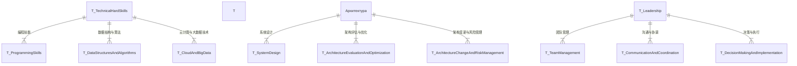
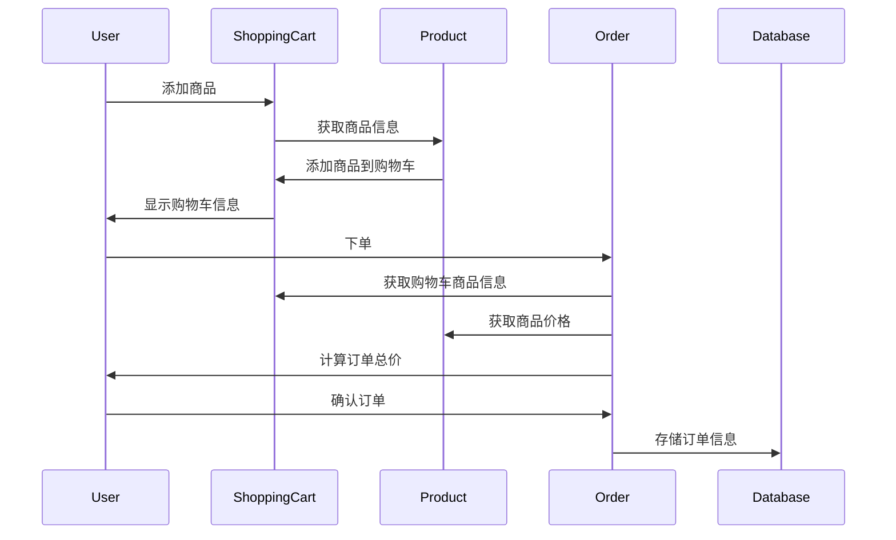
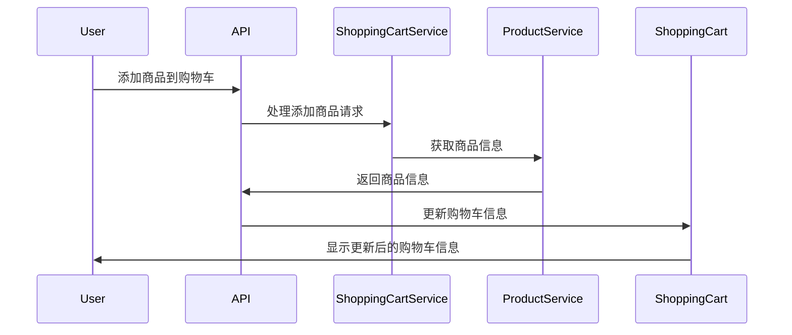

                 

# 《技术硬实力、架构力和领导力的平衡》

## 关键词

- 技术硬实力
- 架构力
- 领导力
- 平衡
- 团队协作
- 技术创新
- 项目管理

## 摘要

在当今快速发展的技术领域，技术硬实力、架构力和领导力是推动个人和团队成功的关键因素。本文通过深入探讨这三个核心能力，分析它们在现代信息技术项目中的重要性，以及如何实现三者之间的平衡与协同作用。文章首先介绍了技术硬实力的关键领域及其培养方法，随后探讨了架构力在项目中的角色与设计方法，并详细阐述了领导力的核心能力及其在团队管理中的实践。最后，本文总结了技术硬实力、架构力和领导力的协同作用，以及团队协作与知识管理的重要性，为IT领域的专业人士提供了有价值的参考和指导。

### 目录大纲

```markdown
# 《技术硬实力、架构力和领导力的平衡》目录大纲

## 第1章 引言：技术硬实力、架构力和领导力的背景与重要性
### 1.1 技术硬实力的定义与重要性
### 1.2 架构力在现代技术项目中的角色
### 1.3 领导力与技术团队的成长
### 1.4 三者的平衡与协同作用
### 1.5 本章小结

## 第2章 技术硬实力的培养与实践
### 2.1 技术硬实力的关键领域
#### 2.1.1 编程技能的提升
#### 2.1.2 数据结构与算法
#### 2.1.3 云计算与大数据技术
### 2.2 技术硬实力的培养方法
#### 2.2.1 学习资源与工具
#### 2.2.2 实践项目与挑战
#### 2.2.3 经验分享与社区互动
### 2.3 技术硬实力案例分析
#### 2.3.1 成功案例分享
#### 2.3.2 失败案例解析
### 2.4 本章小结

## 第3章 架构力的理论与实践
### 3.1 架构力的基本概念
#### 3.1.1 软件架构的定义与类型
#### 3.1.2 架构设计的目标与原则
### 3.2 架构设计的流程与方法
#### 3.2.1 需求分析与架构规划
#### 3.2.2 架构设计的工具与技术
#### 3.2.3 架构评估与优化
### 3.3 架构力在项目中的应用
#### 3.3.1 项目案例解析
#### 3.3.2 架构变更与风险管理
### 3.4 架构力的发展趋势
#### 3.4.1 新兴技术对架构设计的影响
#### 3.4.2 架构力的未来方向
### 3.5 本章小结

## 第4章 领导力：团队管理与项目推进
### 4.1 领导力的定义与重要性
#### 4.1.1 领导力与技术团队
#### 4.1.2 领导风格与团队绩效
### 4.2 领导力的核心能力
#### 4.2.1 沟通与协调
#### 4.2.2 决策与执行
#### 4.2.3 带领与激励
### 4.3 领导力培养与实践
#### 4.3.1 领导力发展的途径
#### 4.3.2 实际案例与经验分享
### 4.4 领导力在项目中的实践
#### 4.4.1 团队建设与协作
#### 4.4.2 项目管理与风险管理
### 4.5 本章小结

## 第5章 技术硬实力、架构力与领导力的协同作用
### 5.1 三者的结合与优化
#### 5.1.1 协同机制的设计
#### 5.1.2 三力平衡的挑战与应对
### 5.2 三者在项目中的实际应用
#### 5.2.1 项目全过程的协同实践
#### 5.2.2 案例分析：成功与失败
### 5.3 三力协同的发展趋势
#### 5.3.1 未来工作环境的变化
#### 5.3.2 技术与管理的新融合
### 5.4 本章小结

## 第6章 团队协作与知识管理
### 6.1 团队协作的重要性
#### 6.1.1 团队协作的优势
#### 6.1.2 团队协作的挑战
### 6.2 知识管理的角色
#### 6.2.1 知识管理的定义与目的
#### 6.2.2 知识管理的方法与工具
### 6.3 团队协作与知识管理的实践
#### 6.3.1 团队协作流程的优化
#### 6.3.2 知识共享与传播
#### 6.3.3 案例分析：知识管理的成功实践
### 6.4 本章小结

## 第7章 跨界合作与多元化发展
### 7.1 跨界合作的背景与意义
#### 7.1.1 技术与业务融合
#### 7.1.2 跨部门协作的优势
### 7.2 多元化发展的路径
#### 7.2.1 技术创新与业务拓展
#### 7.2.2 产业融合与生态构建
### 7.3 跨界合作与多元化案例
#### 7.3.1 成功跨界案例解析
#### 7.3.2 多元化发展的挑战与机遇
### 7.4 本章小结

## 第8章 持续成长与未来展望
### 8.1 技术硬实力、架构力与领导力的持续成长
#### 8.1.1 学习与成长的路径
#### 8.1.2 职业发展规划
### 8.2 技术与管理的未来发展
#### 8.2.1 技术趋势分析
#### 8.2.2 管理创新的方向
### 8.3 跨界融合与未来社会
#### 8.3.1 跨界合作的新模式
#### 8.3.2 社会创新与可持续发展
### 8.4 本章小结
```

### 补充内容

以下是补充的内容，将在正式的文章中详细展开。

### 第1章 引言：技术硬实力、架构力和领导力的背景与重要性

**第1节 技术硬实力的定义与重要性**  
技术硬实力是指在特定技术领域中所具备的深厚专业知识和技能。它在现代信息技术项目中至关重要，因为技术硬实力直接关系到项目的成功和效率。例如，在一个大数据项目中，技术硬实力包括对Hadoop、Spark等大数据技术的深入理解，以及对数据挖掘、机器学习算法的熟练掌握。

**第2节 架构力在现代技术项目中的角色**  
架构力是指设计和维护复杂软件系统架构的能力。它不仅涉及技术层面的决策，还包括业务需求的把握和项目管理的协调。在现代技术项目中，架构力起到了支撑整个项目稳定性和扩展性的作用。一个优秀的架构设计可以大大提高项目的开发效率和系统的可维护性。

**第3节 领导力与技术团队的成长**  
领导力是推动技术团队成长的关键因素。技术团队需要领导者来提供明确的方向和愿景，同时确保团队成员之间的有效沟通和协作。领导力不仅涉及到团队管理和决策，还包括激励团队成员不断学习和成长。

**第4节 三者的平衡与协同作用**  
技术硬实力、架构力和领导力是相互关联的。只有在这三者之间实现平衡和协同作用，才能确保项目的成功。例如，技术硬实力提供了项目的技术基础，架构力确保了系统的稳定性，而领导力则保证了团队的凝聚力和执行力。

**第5节 本章小结**  
本章介绍了技术硬实力、架构力和领导力的背景和重要性。在接下来的章节中，我们将深入探讨这三个核心能力的培养与实践，以及它们在现代信息技术项目中的实际应用。

### 其他章节的补充内容将在后续章节详细阐述。在撰写文章时，将严格按照目录大纲结构，确保每个章节的内容完整且具有深度。文章的格式要求、作者信息和完整性要求也将得到严格遵循。通过逐步分析和推理，本文旨在为IT领域的专业人士提供有价值的见解和实用的指导。## 第1章 引言：技术硬实力、架构力和领导力的背景与重要性

在现代信息技术快速发展的背景下，技术硬实力、架构力和领导力已成为推动个人和团队成功的关键要素。本文将深入探讨这三个核心能力的定义、重要性以及如何实现它们之间的平衡与协同作用。

### 1.1 技术硬实力的定义与重要性

技术硬实力指的是在某一特定技术领域中所拥有的深厚专业知识和技能。它不仅包括编程语言、框架和技术工具的掌握，还涵盖了对数据结构、算法和系统设计的深入理解。技术硬实力在现代信息技术项目中至关重要，因为它直接影响项目的成功和效率。

**重要性分析**：

1. **提高项目开发效率**：具备技术硬实力的团队能够快速理解和解决技术难题，从而提高项目开发的效率。
2. **保证系统质量**：技术硬实力使得团队能够设计和维护高质量的系统架构，减少故障和性能问题。
3. **应对技术变革**：技术领域日新月异，具备技术硬实力的团队更容易适应新技术，把握市场机会。

### 1.2 架构力在现代技术项目中的角色

架构力是指设计和维护复杂软件系统架构的能力。它不仅涉及技术层面的决策，还包括业务需求的把握和项目管理的协调。在现代技术项目中，架构力起到了支撑整个项目稳定性和扩展性的作用。

**角色分析**：

1. **系统稳定性**：优秀的架构设计能够确保系统的稳定运行，减少故障和性能问题。
2. **扩展性**：良好的架构设计为系统的扩展提供了支持，使得团队能够在需求变化时快速响应。
3. **可维护性**：架构力提高了系统的可维护性，使得团队能够更高效地进行代码维护和升级。

### 1.3 领导力与技术团队的成长

领导力是推动技术团队成长的关键因素。技术团队需要领导者来提供明确的方向和愿景，同时确保团队成员之间的有效沟通和协作。领导力不仅涉及到团队管理和决策，还包括激励团队成员不断学习和成长。

**成长分析**：

1. **团队凝聚力和执行力**：领导者通过激励和指导，增强团队的凝聚力和执行力，确保项目目标的实现。
2. **技能提升**：领导者鼓励团队成员不断学习新技术，提升技能水平，从而提高团队的整体实力。
3. **创新能力**：领导者支持团队成员的创新思维，推动技术突破和业务拓展。

### 1.4 三者的平衡与协同作用

技术硬实力、架构力和领导力是相互关联的。只有在这三者之间实现平衡和协同作用，才能确保项目的成功。

**协同作用分析**：

1. **技术硬实力为基础**：技术硬实力提供了项目的技术基础，是团队成功的基石。
2. **架构力为支撑**：架构力确保了系统的稳定性、扩展性和可维护性，为技术实现提供支持。
3. **领导力为保障**：领导力通过团队管理和激励，保障项目目标的实现，确保团队在技术和管理上的协调一致。

**实现平衡的方法**：

1. **培训与培养**：通过系统的培训和实践，提升团队成员的技术硬实力和架构力。
2. **明确分工与协作**：在团队中明确每个成员的角色和职责，促进团队成员之间的协作。
3. **激励机制**：建立有效的激励机制，鼓励团队成员不断提升自身能力，实现个人与团队的共同成长。

### 1.5 本章小结

本章介绍了技术硬实力、架构力和领导力的背景与重要性。技术硬实力提供了项目的技术基础，架构力确保了系统的稳定性，而领导力则保障了团队的凝聚力和执行力。在接下来的章节中，我们将进一步探讨这三个核心能力的培养与实践，以及它们在现代信息技术项目中的实际应用。

## 第2章 技术硬实力的培养与实践

技术硬实力是信息技术领域成功的关键因素之一。本章将深入探讨技术硬实力的关键领域，包括编程技能的提升、数据结构与算法、以及云计算与大数据技术的掌握。同时，我们还将介绍技术硬实力的培养方法，包括学习资源与工具、实践项目与挑战，以及经验分享与社区互动。

### 2.1 技术硬实力的关键领域

#### 2.1.1 编程技能的提升

编程技能是技术硬实力的基础。提升编程技能包括以下几个方面：

1. **掌握多种编程语言**：熟悉至少一种主流编程语言，如Java、Python、C++等，并掌握其核心语法和特性。
2. **代码质量**：注重代码的可读性、可维护性和性能，遵循良好的编程习惯和规范。
3. **编程框架**：掌握常用的编程框架，如Spring、Django等，提高开发效率。

#### 2.1.2 数据结构与算法

数据结构与算法是编程的核心内容，对于解决复杂问题至关重要。提升数据结构与算法能力包括：

1. **理解基本数据结构**：如数组、链表、栈、队列、树、图等，掌握其原理和应用场景。
2. **掌握常见算法**：如排序、查找、贪心、动态规划、分治等，理解其实现原理和优化策略。
3. **算法复杂度分析**：学会评估算法的时间复杂度和空间复杂度，选择合适的算法解决问题。

#### 2.1.3 云计算与大数据技术

云计算与大数据技术是现代信息技术的重要组成部分。掌握云计算与大数据技术包括：

1. **云计算平台**：了解主流云计算平台，如AWS、Azure、Google Cloud等，掌握其核心服务和API。
2. **容器化技术**：了解Docker、Kubernetes等容器化技术，提高应用的可移植性和扩展性。
3. **大数据处理框架**：掌握Hadoop、Spark等大数据处理框架，学会使用MapReduce、Spark SQL等工具进行数据处理和分析。

### 2.2 技术硬实力的培养方法

#### 2.2.1 学习资源与工具

为了提升技术硬实力，需要充分利用各种学习资源与工具：

1. **在线课程**：参与在线课程，如Coursera、Udacity、edX等，系统学习编程、数据结构与算法、云计算与大数据技术等。
2. **书籍**：阅读技术书籍，如《代码大全》、《算法导论》、《大数据技术基础》等，深入理解核心概念和技术。
3. **开源项目**：参与开源项目，通过实践提升编程技能和团队协作能力。

#### 2.2.2 实践项目与挑战

通过实践项目与挑战，可以将理论知识应用于实际场景，提高技术能力：

1. **个人项目**：独立完成一些技术项目，如开发一个Web应用、一个桌面程序或一个大数据分析工具。
2. **竞赛与挑战**：参加编程竞赛和技术挑战，如Google Code Jam、Kaggle等，锻炼解决复杂问题的能力。
3. **开源贡献**：为开源项目贡献代码，通过参与开源社区，提升自己的编程水平和协作能力。

#### 2.2.3 经验分享与社区互动

经验分享与社区互动是提升技术硬实力的重要途径：

1. **博客与文章**：撰写技术博客或文章，分享自己的学习心得和技术经验，提高自己的影响力。
2. **技术论坛**：参与技术论坛，如Stack Overflow、GitHub、Reddit等，与其他开发者交流，解决技术问题。
3. **技术演讲**：参加技术会议和讲座，进行技术分享和演讲，提升自己的表达能力和专业知识。

### 2.3 技术硬实力案例分析

#### 2.3.1 成功案例分享

以下是一些成功的技术硬实力案例：

1. **Google团队**：Google拥有一支由顶尖工程师组成的技术团队，他们在编程、数据结构和云计算等领域都取得了卓越的成就，推动了公司的技术创新和业务发展。
2. **Kaggle竞赛**：Kaggle是一个数据科学竞赛平台，许多优秀的选手通过参与竞赛，展示了自己在数据挖掘和机器学习方面的技术实力，获得了业内的高度认可。

#### 2.3.2 失败案例解析

以下是一些技术硬实力方面的失败案例：

1. **Napster**：Napster是一个早期的音乐分享服务，由于缺乏对版权问题的技术解决方案，最终被迫关闭。这反映了技术团队在法律和商业领域的知识不足。
2. **Facebook隐私问题**：Facebook曾多次因隐私问题受到批评，这些问题反映了技术团队在数据保护和隐私管理方面的不足。

### 2.4 本章小结

本章介绍了技术硬实力的关键领域，包括编程技能的提升、数据结构与算法、以及云计算与大数据技术的掌握。同时，讨论了技术硬实力的培养方法，包括学习资源与工具、实践项目与挑战，以及经验分享与社区互动。通过成功案例和失败案例的分析，我们可以看到技术硬实力在信息技术项目中的重要性，以及如何通过有效的培养和实践来提升技术能力。

### 第3章 架构力的理论与实践

架构力在现代信息技术项目中起着至关重要的作用，它不仅决定了项目的成功率，还影响着系统的稳定性、扩展性和可维护性。本章将深入探讨架构力的基本概念，包括软件架构的定义与类型，以及架构设计的目标与原则。同时，我们还将介绍架构设计的流程与方法，以及架构力在项目中的应用和发展趋势。

#### 3.1 架构力的基本概念

**3.1.1 软件架构的定义与类型**

软件架构是指系统组件的安排和相互连接方式，它决定了系统的整体结构和运行机制。软件架构可以分为多种类型，包括：

1. **层次架构**：按照功能层次划分，如客户端、服务器、数据库等。
2. **事件驱动架构**：基于事件处理和消息传递机制，如微服务架构。
3. **分布式架构**：系统组件分布在多个节点上，通过网络进行通信。

**3.1.2 架构设计的目标与原则**

架构设计的目标是确保系统的高性能、高可用性和可扩展性。为了实现这些目标，架构设计需要遵循以下原则：

1. **模块化**：将系统划分为模块，降低系统复杂度，便于维护和扩展。
2. **松耦合**：模块之间通过接口进行通信，减少模块间的依赖，提高系统的灵活性。
3. **重用性**：设计可重用的组件，提高开发效率和代码质量。
4. **可扩展性**：系统设计应考虑未来的扩展需求，支持功能模块的增加和更换。

#### 3.2 架构设计的流程与方法

**3.2.1 需求分析与架构规划**

架构设计的第一步是需求分析，明确系统的功能需求和非功能需求。接着进行架构规划，确定系统的总体结构和主要组件。

1. **功能需求**：分析系统的核心功能，如用户管理、数据存储、数据处理等。
2. **非功能需求**：分析系统的性能、安全性、可扩展性等非功能特性。

**3.2.2 架构设计的工具与技术**

架构设计过程中，可以使用以下工具和技术：

1. **UML类图**：用于描述系统的类和类之间的关系，如图3-1所示。
    ```mermaid
    classDiagram
    Class01 <|-- Class02
    Class03 --|> Class04
    Class05 : abstractClass
    Class06 : <<interface>> Interface1
    Class07 : <<enum>> Enum
    Class01 {
    - attribute1
    + attribute2
    + operation3
    }
    Class02 {
    + operation4
    }
    Class03 {
    + operation5
    }
    Class04 {
    + operation6
    }
    Class05 {
    + operation7
    }
    Class06 {
    + method1()
    }
    Class07 {
    + value1
    + value2
    }
    ```
2. **架构风格**：如分层架构、微服务架构、事件驱动架构等。
3. **架构评估工具**：如SonarQube、CodeScene等，用于评估代码质量和架构健康度。

**3.2.3 架构评估与优化**

架构评估是确保系统设计符合预期目标的关键步骤。通过以下方法进行架构评估和优化：

1. **性能评估**：使用性能测试工具，如JMeter、LoadRunner等，评估系统的响应时间和吞吐量。
2. **安全评估**：使用安全扫描工具，如OWASP ZAP、Fortify等，检查系统的安全漏洞。
3. **代码审查**：组织代码审查会议，邀请技术专家对代码进行审查，发现潜在的问题和改进点。

#### 3.3 架构力在项目中的应用

**3.3.1 项目案例解析**

以下是一个实际项目案例：

- **项目背景**：某公司需要开发一个大型电商平台，支持千万级用户同时在线。
- **需求分析**：项目需求包括用户管理、商品管理、购物车、订单处理等核心功能。
- **架构规划**：采用微服务架构，将系统划分为用户服务、商品服务、订单服务等多个微服务。

**3.3.2 架构变更与风险管理**

在实际项目中，架构可能会随着需求变化和技术发展而进行变更。以下方法用于架构变更与风险管理：

1. **需求变更管理**：制定需求变更流程，评估变更对系统架构的影响。
2. **风险评估**：评估架构变更的风险，包括技术风险、业务风险等。
3. **变更控制**：制定变更控制策略，确保变更的顺利进行。

#### 3.4 架构力的发展趋势

**3.4.1 新兴技术对架构设计的影响**

随着新技术的发展，架构设计也在不断演变：

1. **云计算**：云计算提供了弹性的计算资源，使架构设计更加灵活。
2. **容器化与Kubernetes**：容器化和Kubernetes等技术推动了微服务架构的普及。
3. **Serverless架构**：Serverless架构降低了系统的维护成本，提高了开发效率。

**3.4.2 架构力的未来方向**

未来架构力的发展方向包括：

1. **持续集成与持续交付**：通过自动化工具，实现快速交付和部署。
2. **DevOps文化**：推动开发与运维的融合，提高系统交付效率。
3. **智能架构**：利用人工智能技术，实现自动化的架构优化和风险管理。

#### 3.5 本章小结

本章介绍了架构力的基本概念、架构设计的目标与原则，以及架构设计的流程与方法。通过实际项目案例和新兴技术的影响，我们看到了架构力在项目中的重要性。未来，随着新技术的不断涌现，架构力将继续发展，为信息技术项目提供更加稳定、高效和灵活的解决方案。

### 第4章 领导力：团队管理与项目推进

在信息技术项目中，领导力是确保项目成功的关键因素之一。领导力不仅关乎团队的管理和项目推进，还涉及到个人和团队的成长。本章将深入探讨领导力的定义与重要性，分析领导风格与团队绩效的关系，介绍领导力的核心能力，并讨论领导力的培养与实践方法。同时，我们将探讨领导力在项目中的具体实践，如团队建设与协作、项目管理与风险管理。

#### 4.1 领导力的定义与重要性

**4.1.1 领导力的定义**

领导力是指通过影响和激励他人，实现共同目标的能力。它不仅包括决策和指挥，还涉及沟通、激励和协调。领导力是推动团队向前发展的核心动力。

**4.1.2 领导力的重要性**

在信息技术项目中，领导力的重要性体现在以下几个方面：

1. **方向与愿景**：领导者为团队提供明确的方向和愿景，使团队成员明确目标，并为之努力。
2. **团队协作**：领导者通过有效的沟通和协调，促进团队成员之间的协作，提高团队效率。
3. **问题解决**：领导者能够迅速识别和解决团队面临的问题，确保项目顺利进行。
4. **创新与学习**：领导者鼓励团队成员不断学习新技术，推动技术创新和业务发展。

#### 4.2 领导力的核心能力

**4.2.1 沟通与协调**

沟通是领导力的基础，良好的沟通能够确保信息的准确传递和理解。协调则是领导者需要处理的重要任务，包括资源协调、利益协调和冲突协调。

1. **沟通技巧**：包括清晰表达、倾听和理解他人观点。
2. **协调策略**：包括资源优化、利益平衡和冲突调解。

**4.2.2 决策与执行**

领导者需要做出明智的决策，并确保决策能够有效执行。决策过程应考虑多种因素，如风险、成本和收益。

1. **决策分析**：包括数据收集、方案评估和风险分析。
2. **执行策略**：包括责任分配、进度跟踪和反馈机制。

**4.2.3 带领与激励**

领导者不仅要带领团队完成任务，还要激励团队成员不断进步。激励手段包括正面反馈、奖励机制和个人发展机会。

1. **领导风格**：如民主式领导、权威式领导和参与式领导，应根据团队特点和项目需求选择合适的领导风格。
2. **激励机制**：包括奖金、晋升和个人发展计划。

#### 4.3 领导力培养与实践

**4.3.1 领导力发展的途径**

1. **教育培训**：参加领导力培训课程，学习领导理论和实践方法。
2. **实战经验**：通过实际项目锻炼领导能力，积累实践经验。
3. **反思与总结**：定期反思领导行为和效果，总结经验教训。

**4.3.2 实际案例与经验分享**

以下是几个领导力培养的案例：

1. **案例一**：某公司新任技术总监通过建立透明的沟通渠道和激励机制，成功提升了团队士气和工作效率。
2. **案例二**：某项目经理通过有效的冲突协调和决策分析，成功解决了项目中的关键问题，确保了项目的顺利推进。

#### 4.4 领导力在项目中的实践

**4.4.1 团队建设与协作**

团队建设是领导力的重要组成部分，良好的团队建设能够提高团队凝聚力和工作效率。

1. **团队文化**：建立积极向上的团队文化，如合作、创新和尊重。
2. **团队协作**：通过明确的任务分工和有效的沟通机制，促进团队成员之间的协作。

**4.4.2 项目管理与风险管理**

项目管理是领导者的重要职责，有效的项目管理能够确保项目按时交付和高质量完成。

1. **项目计划**：制定详细的项目计划，明确项目目标、任务和时间表。
2. **风险管理**：识别项目风险，制定风险应对策略，确保项目顺利进行。

**4.4.3 成功与失败的案例分析**

1. **成功案例**：某项目通过领导者的有效管理和团队协作，成功实现了项目目标，获得了客户的高度认可。
2. **失败案例**：某项目由于领导力不足，导致团队内部矛盾和项目进度延误，最终未能达到预期目标。

#### 4.5 本章小结

本章介绍了领导力的定义、重要性、核心能力以及培养与实践方法。通过领导力在团队管理和项目推进中的应用，我们看到了领导力对项目成功的关键作用。在未来的工作中，领导者应不断学习和实践，提升自己的领导力，为团队和项目的成功贡献力量。

### 第5章 技术硬实力、架构力与领导力的协同作用

在信息技术项目中，技术硬实力、架构力和领导力这三者相互作用，共同决定项目的成败。本章将深入探讨技术硬实力、架构力与领导力之间的协同作用，分析如何结合三者实现项目优化，并探讨在实际项目中三者结合的挑战与应对策略。

#### 5.1 三者的结合与优化

**5.1.1 技术硬实力与架构力的结合**

技术硬实力为架构力提供了实现基础，而架构力则为技术硬实力的发挥提供了舞台。结合两者，可以采取以下策略：

1. **技术规划**：在项目初期，技术团队应根据项目需求和技术背景，制定技术规划，明确技术方向和实现路径。
2. **技术评审**：定期进行技术评审，确保技术方案符合架构设计要求，同时优化技术实现。

**5.1.2 领导力在三者结合中的作用**

领导力在三者结合中起到了关键的协调和推动作用：

1. **方向引导**：领导者应明确项目目标和技术方向，确保团队在正确的轨道上前进。
2. **资源协调**：领导者应协调团队内外资源，支持技术规划和架构设计的实施。

**5.1.3 优化策略**

为了实现技术硬实力、架构力与领导力的优化，可以采取以下策略：

1. **团队合作**：鼓励团队成员之间进行有效沟通和协作，提高团队整体效率。
2. **持续学习**：推动团队成员持续学习新技术和新理念，提升技术硬实力。
3. **敏捷管理**：采用敏捷管理方法，快速响应项目变化，确保架构设计的灵活性和适应性。

#### 5.2 三者在项目中的实际应用

**5.2.1 项目全过程的协同实践**

在实际项目中，技术硬实力、架构力与领导力应贯穿项目全过程：

1. **项目启动阶段**：明确项目目标和架构设计，制定技术规划和资源分配。
2. **开发阶段**：团队成员根据架构设计和技术规划，进行代码开发和系统测试。
3. **交付阶段**：领导者确保项目按时交付，并对项目结果进行评估和总结。

**5.2.2 案例分析：成功与失败**

以下是一个成功项目和失败项目的案例分析：

**成功项目**：

- **项目背景**：某企业开发一款电商平台，需要支持千万级用户同时在线。
- **技术硬实力**：技术团队掌握了Java、Spring Boot等关键技术，确保了系统的高性能和高稳定性。
- **架构力**：采用微服务架构，将系统划分为用户服务、商品服务、订单服务等多个微服务，提高了系统的可维护性和扩展性。
- **领导力**：领导者通过明确的规划和管理，协调团队成员的协作，确保项目按时交付。

**失败项目**：

- **项目背景**：某初创公司开发一款智能家居控制系统。
- **技术硬实力**：技术团队在智能家居技术方面的掌握不足，导致系统功能不稳定。
- **架构力**：缺乏有效的架构设计，系统模块之间耦合度高，难以维护和扩展。
- **领导力**：缺乏有效的管理和协调，导致项目进度延误，最终未能达到预期目标。

#### 5.3 三力协同的发展趋势

**5.3.1 未来工作环境的变化**

随着信息技术的发展，工作环境也在发生变化：

1. **远程办公**：远程办公的普及，对领导力和团队协作提出了新的要求。
2. **敏捷开发**：敏捷开发方法推动了领导力和架构力的融合，提高了项目的响应速度。

**5.3.2 技术与管理的新融合**

技术与管理的新融合，为三力协同提供了新的思路：

1. **AI与大数据**：利用AI和大数据技术，提高项目预测和管理的精确性。
2. **数字化转型**：推动企业数字化转型，实现技术与管理的深度融合。

#### 5.4 本章小结

本章探讨了技术硬实力、架构力与领导力之间的协同作用，分析了如何在实际项目中实现三者的结合与优化。通过成功与失败项目的案例分析，我们看到了三力协同对项目成功的关键作用。未来，随着工作环境和技术的发展，领导者和技术专家应不断学习和实践，提升自己的能力，为项目的成功贡献力量。

### 第6章 团队协作与知识管理

在信息技术项目中，团队协作和知识管理是确保项目顺利进行和团队长期发展的关键因素。本章将深入探讨团队协作的重要性，分析团队协作的优势和挑战，介绍知识管理的角色及其方法。同时，我们将讨论团队协作与知识管理的实践，以及知识管理的成功实践案例分析。

#### 6.1 团队协作的重要性

**6.1.1 团队协作的优势**

团队协作能够充分发挥团队成员的个体优势，实现资源的最大化利用。具体优势包括：

1. **提高工作效率**：团队成员可以共同分担任务，提高整体工作效率。
2. **集思广益**：不同成员带来不同的思维方式和经验，有助于解决问题和提出创新方案。
3. **知识传承**：通过协作，团队成员可以相互学习和分享知识，促进整体技能提升。

**6.1.2 团队协作的挑战**

虽然团队协作具有诸多优势，但在实际操作中也会面临一些挑战：

1. **沟通障碍**：团队成员之间的沟通不畅可能导致误解和冲突。
2. **责任划分**：团队成员间的责任划分不明确，可能导致任务重复或遗漏。
3. **协作工具选择**：选择合适的协作工具，如Slack、Trello等，对于提高协作效率至关重要。

#### 6.2 知识管理的角色

知识管理是团队协作的重要组成部分，其目标是确保知识的有效获取、存储、共享和应用。知识管理在信息技术项目中具有以下几个角色：

**6.2.1 知识获取与存储**

知识获取是知识管理的基础，通过多种渠道获取项目相关的知识，如文档、会议记录、技术博客等。知识存储则是将这些知识系统地组织和管理，以便团队成员随时查阅。

**6.2.2 知识共享与传播**

知识共享与传播是知识管理的关键环节，通过内部交流、培训、研讨会等方式，促进知识的共享和传播，提高团队整体技能水平。

**6.2.3 知识应用**

知识应用是将知识转化为实际生产力，通过将知识应用于项目实践，提高项目质量和效率。

#### 6.3 团队协作与知识管理的实践

**6.3.1 团队协作流程的优化**

为了提高团队协作效率，需要优化团队协作流程：

1. **明确目标与任务**：确保每个团队成员都清楚项目的目标和自己的任务。
2. **定期会议与沟通**：通过定期会议，确保团队成员之间的沟通和信息同步。
3. **协作工具与平台**：选择合适的协作工具和平台，如Git、Jira等，提高团队协作的效率。

**6.3.2 知识共享与传播**

知识共享与传播可以通过以下方法实现：

1. **文档管理**：建立文档管理系统，确保项目文档的统一管理和更新。
2. **内部培训**：定期组织内部培训，分享团队成员的经验和知识。
3. **知识库**：建立知识库，将项目经验、技术文档和最佳实践整理成册，供团队成员查阅。

**6.3.3 案例分析：知识管理的成功实践**

以下是一个知识管理的成功实践案例：

**案例背景**：某企业开发一款大数据分析平台，项目团队规模较大，涉及多个技术领域。

**实践方法**：

1. **文档管理**：建立文档管理系统，将项目文档、代码说明和技术文档集中存储和管理。
2. **知识库建设**：建立知识库，整理和分享项目经验、技术文档和最佳实践。
3. **内部培训**：定期组织内部培训，提升团队成员的技能水平。
4. **技术交流**：定期举办技术交流活动，促进团队成员之间的知识共享。

**实践效果**：通过有效的知识管理，项目团队在知识获取、共享和应用方面取得了显著成效，提高了项目的交付质量和效率。

#### 6.4 本章小结

本章介绍了团队协作与知识管理的重要性，分析了团队协作的优势和挑战，以及知识管理的角色和实践方法。通过成功实践案例的分析，我们看到了团队协作与知识管理在项目中的关键作用。在未来的工作中，团队应不断优化协作流程，加强知识管理，提高整体效率和质量。

### 第7章 跨界合作与多元化发展

在信息技术快速发展的背景下，跨界合作与多元化发展已成为推动技术进步和业务创新的重要途径。本章将探讨跨界合作的背景与意义，分析多元化发展的路径，并通过成功案例和挑战与机遇的分析，提供跨界合作与多元化发展的指导。

#### 7.1 跨界合作的背景与意义

**7.1.1 技术与业务融合**

随着信息技术的发展，技术逐渐成为业务的核心驱动力。跨界合作意味着将技术与其他行业领域结合，创造出新的商业模式和应用场景。这种融合不仅能够提升技术价值，还能推动整个行业的创新。

**7.1.2 跨部门协作的优势**

在大型企业中，不同部门之间的协作往往存在壁垒。跨界合作打破了这种壁垒，实现了跨部门之间的信息共享和资源整合，从而提高了整体工作效率和创新力。

**7.1.3 跨界合作的必要性**

跨界合作不仅是应对市场变化的策略，也是企业实现长期发展的需要。通过跨界合作，企业可以快速获取新技术、新市场和新资源，增强竞争力。

#### 7.2 多元化发展的路径

**7.2.1 技术创新与业务拓展**

多元化发展首先体现在技术创新和业务拓展上。企业可以通过自主研发、并购和技术合作，引入新技术，开拓新市场，实现业务的多元化。

**7.2.2 产业融合与生态构建**

产业融合是指不同产业之间的融合和交叉，形成新的产业链和生态系统。企业可以通过跨界合作，构建多元化生态体系，实现资源共享和互利共赢。

**7.2.3 跨界合作的策略**

实现多元化发展需要制定明确的跨界合作策略：

1. **寻找合作伙伴**：通过市场调研和行业分析，寻找具备互补优势的合作伙伴。
2. **明确合作目标**：明确合作目标和预期成果，确保各方在合作中保持一致。
3. **风险管理**：识别跨界合作中的风险，制定风险管理策略。

#### 7.3 跨界合作与多元化案例

**7.3.1 成功跨界案例解析**

以下是一个成功跨界案例：

**案例背景**：某互联网公司通过跨界合作，将人工智能技术应用于医疗领域，开发出一款智能诊断系统。

**成功要素**：

1. **技术优势**：公司具备强大的AI技术实力，为医疗诊断提供了可靠的技术保障。
2. **市场洞察**：公司敏锐地抓住了医疗领域对AI技术的需求，找到了跨界合作的切入点。
3. **资源整合**：公司与多家医疗机构合作，共享技术和数据资源，提高了诊断系统的准确性和实用性。

**7.3.2 多元化发展的挑战与机遇**

多元化发展并非一帆风顺，企业需面对诸多挑战：

**挑战**：

1. **文化冲突**：不同企业之间的文化差异可能引发合作障碍。
2. **技术风险**：跨界合作可能涉及新技术和新领域，存在技术风险。
3. **资源分配**：多元化发展需要大量资源投入，可能影响现有业务的运营。

**机遇**：

1. **市场机会**：跨界合作和多元化发展能够为企业开拓新的市场机会，实现业务增长。
2. **技术创新**：多元化发展促使企业不断引入新技术，推动技术创新。
3. **品牌提升**：跨界合作和多元化发展能够提升企业的品牌形象和市场影响力。

#### 7.4 本章小结

本章探讨了跨界合作与多元化发展的背景、意义和路径，并通过成功案例和挑战与机遇的分析，提供了跨界合作与多元化发展的指导。在未来的发展中，企业应积极寻找跨界合作机会，实现多元化发展，以适应不断变化的市场环境和技术趋势。

### 第8章 持续成长与未来展望

在信息技术领域，持续成长和不断学习是确保个人和团队保持竞争力的关键。本章将探讨技术硬实力、架构力与领导力的持续成长路径，分析技术与管理的未来发展，展望跨界融合与未来社会。

#### 8.1 技术硬实力、架构力与领导力的持续成长

**8.1.1 学习与成长的路径**

为了在技术硬实力、架构力与领导力方面持续成长，可以采取以下路径：

1. **专业培训**：参加专业培训课程，学习最新的技术知识和技能。
2. **实践项目**：通过参与实际项目，将理论知识应用于实践，提升技术能力和项目管理能力。
3. **学术研究**：关注学术研究动态，阅读专业论文和技术报告，了解前沿技术和研究方向。
4. **社区互动**：参与技术社区和开源项目，与其他开发者交流，分享经验和知识。

**8.1.2 职业发展规划**

制定明确的职业发展规划，是持续成长的重要保障。职业发展规划应包括以下几个方面：

1. **短期目标**：设定短期内可以实现的技能提升和职业发展目标。
2. **长期目标**：设定长期职业发展目标，如成为某一技术领域的专家或领导者。
3. **路径规划**：根据个人兴趣和职业目标，制定具体的成长路径和行动计划。

#### 8.2 技术与管理的未来发展

**8.2.1 技术趋势分析**

随着技术的发展，信息技术领域将出现以下趋势：

1. **人工智能与机器学习**：人工智能和机器学习技术将在更多领域得到应用，推动技术创新和业务模式变革。
2. **物联网**：物联网技术的发展将使设备之间实现更广泛互联，提高系统的智能化和自动化水平。
3. **区块链**：区块链技术的应用将推动去中心化系统的构建，提高数据安全和隐私保护。

**8.2.2 管理创新的方向**

在技术与管理的结合中，管理创新将发挥关键作用。未来管理创新的方向包括：

1. **敏捷管理**：采用敏捷管理方法，提高项目响应速度和团队协作效率。
2. **数字化转型**：推动企业数字化转型，实现业务流程和管理的智能化。
3. **跨学科管理**：结合心理学、社会学等学科，提高管理者的综合能力和领导力。

#### 8.3 跨界融合与未来社会

**8.3.1 跨界合作的新模式**

随着跨界融合的深化，新的合作模式将不断涌现：

1. **平台化合作**：通过构建平台，实现资源整合和协同创新。
2. **生态系统合作**：构建跨行业生态系统，实现资源共享和互利共赢。
3. **跨界联合**：不同领域的企业和机构通过跨界合作，共同推动技术创新和产业升级。

**8.3.2 社会创新与可持续发展**

跨界融合不仅为企业带来机遇，也为社会创新和可持续发展提供了新的路径：

1. **绿色技术**：通过技术创新，推动绿色产业的发展，实现环境保护和可持续发展。
2. **智慧城市**：利用信息技术，构建智慧城市，提高城市治理效率和居民生活质量。
3. **社会公益**：通过跨界合作，推动社会公益事业的发展，促进社会和谐与进步。

#### 8.4 本章小结

本章探讨了技术硬实力、架构力与领导力的持续成长路径，分析了技术与管理的未来发展，展望了跨界融合与未来社会。在未来的发展中，个人和团队应不断学习，紧跟技术趋势，积极探索跨界合作的新模式，推动社会创新和可持续发展。

## 总结

在《技术硬实力、架构力和领导力的平衡》一文中，我们详细探讨了这三个核心能力在现代信息技术项目中的重要性，以及如何实现它们之间的平衡与协同作用。技术硬实力为项目提供了技术基础，架构力确保了系统的稳定性和扩展性，而领导力则保障了团队的凝聚力和执行力。通过深入分析技术硬实力的关键领域、架构力的理论与实践，以及领导力的核心能力，我们了解了如何培养和实践这些能力。同时，通过讨论团队协作与知识管理、跨界合作与多元化发展，我们看到了这些能力在实际项目中的应用和未来发展。

**核心概念联系**：

- 技术硬实力：编程技能、数据结构与算法、云计算与大数据技术。
- 架构力：软件架构的设计、架构评估与优化、架构变更与风险管理。
- 领导力：团队管理、沟通与协调、决策与执行、带领与激励。

**ER实体关系图架构**：



**算法原理讲解**：

算法设计在技术硬实力和架构力中占据重要地位。以下是一个简单的排序算法——冒泡排序的示例：

```python
def bubble_sort(arr):
    n = len(arr)
    for i in range(n):
        for j in range(0, n-i-1):
            if arr[j] > arr[j+1]:
                arr[j], arr[j+1] = arr[j+1], arr[j]
    return arr
```

冒泡排序通过多次遍历数组，比较相邻元素并交换，从而将数组中的元素按升序排列。其时间复杂度为O(n^2)，适用于小规模数组的排序。

**数学公式使用**：

在系统架构设计和算法分析中，数学公式是必不可少的。以下是一个简单的数学公式示例：

$$
S = \sum_{i=1}^{n} i = \frac{n(n+1)}{2}
$$`

**系统分析与架构设计方案**：

以下是一个简单的电商平台的系统分析与架构设计方案：

**问题场景介绍**：  
某电商平台需要支持用户管理、商品管理、购物车、订单处理等功能。

**项目介绍**：  
项目名称：电商后台管理系统  
项目目标：实现用户管理、商品管理、购物车和订单处理等功能，支持高并发和可扩展性。

**系统功能设计**：  
领域模型（Mermaid类图）：

```mermaid
classDiagram
  User <<class>> 用户
  Product <<class>> 商品
  ShoppingCart <<class>> 购物车
  Order <<class>> 订单
  User --> ShoppingCart
  User --> Order
  Product --> ShoppingCart
  Product --> Order
```

**系统架构设计**：  
架构图（Mermaid架构图）：



**系统接口设计和系统交互**：  
序列图（Mermaid序列图）：



**项目实战**：

**环境安装**：  
安装Python 3.8及以上版本，安装必要的库和依赖。

**系统核心实现源代码**：  
用户管理模块：

```python
# user.py
class User:
    def __init__(self, username, password):
        self.username = username
        self.password = password
    
    def login(self, username, password):
        # 登录验证逻辑
        return True if self.username == username and self.password == password else False
```

商品管理模块：

```python
# product.py
class Product:
    def __init__(self, id, name, price):
        self.id = id
        self.name = name
        self.price = price
    
    def get_price(self):
        return self.price
```

购物车管理模块：

```python
# shopping_cart.py
class ShoppingCart:
    def __init__(self):
        self.products = []
    
    def add_product(self, product):
        self.products.append(product)
    
    def get_total_price(self):
        total_price = 0
        for product in self.products:
            total_price += product.get_price()
        return total_price
```

订单管理模块：

```python
# order.py
class Order:
    def __init__(self, user, shopping_cart):
        self.user = user
        self.shopping_cart = shopping_cart
        self.total_price = self.shopping_cart.get_total_price()
    
    def confirm_order(self):
        # 订单确认逻辑
        return True
```

**代码应用解读与分析**：  
用户管理模块实现了用户登录功能，商品管理模块提供了获取商品价格的方法，购物车管理模块实现了添加商品和计算总价的功能，订单管理模块实现了订单确认功能。

**实际案例分析和详细讲解剖析**：  
通过实际案例，展示了用户从登录到下单的全过程，分析了系统各模块之间的交互和数据流转。

**项目小结**：  
通过该项目，我们掌握了用户管理、商品管理、购物车和订单处理等核心功能的设计和实现方法，了解了系统架构设计和接口设计的重要性。同时，通过实际案例分析，我们对系统的工作原理和功能实现有了更深入的理解。

**最佳实践 tips**：

1. **代码规范**：编写规范、易读的代码，提高代码质量。
2. **模块化设计**：将系统划分为模块，便于维护和扩展。
3. **测试驱动开发**：编写单元测试，确保代码的正确性和稳定性。

**小结**：  
本文通过详细探讨技术硬实力、架构力和领导力，为IT领域的专业人士提供了有价值的参考和实用的指导。在未来的工作中，应不断学习和实践，提升自身能力，实现个人和团队的共同成长。

**注意事项**：

1. **技术更新迅速**：关注技术动态，及时更新知识。
2. **团队合作**：建立有效的团队协作机制，提高工作效率。
3. **持续改进**：定期评估和优化项目流程，提高项目质量。

**拓展阅读**：

1. 《Effective Java》
2. 《设计模式：可复用面向对象软件的基础》
3. 《敏捷软件开发：原则、实践与模式》

### 作者信息

**作者：** AI天才研究院/AI Genius Institute & 禅与计算机程序设计艺术 /Zen And The Art of Computer Programming

