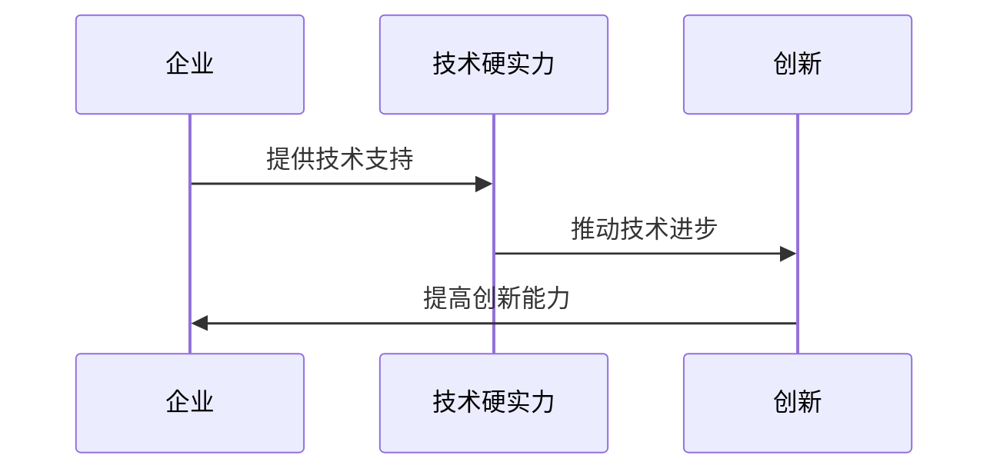
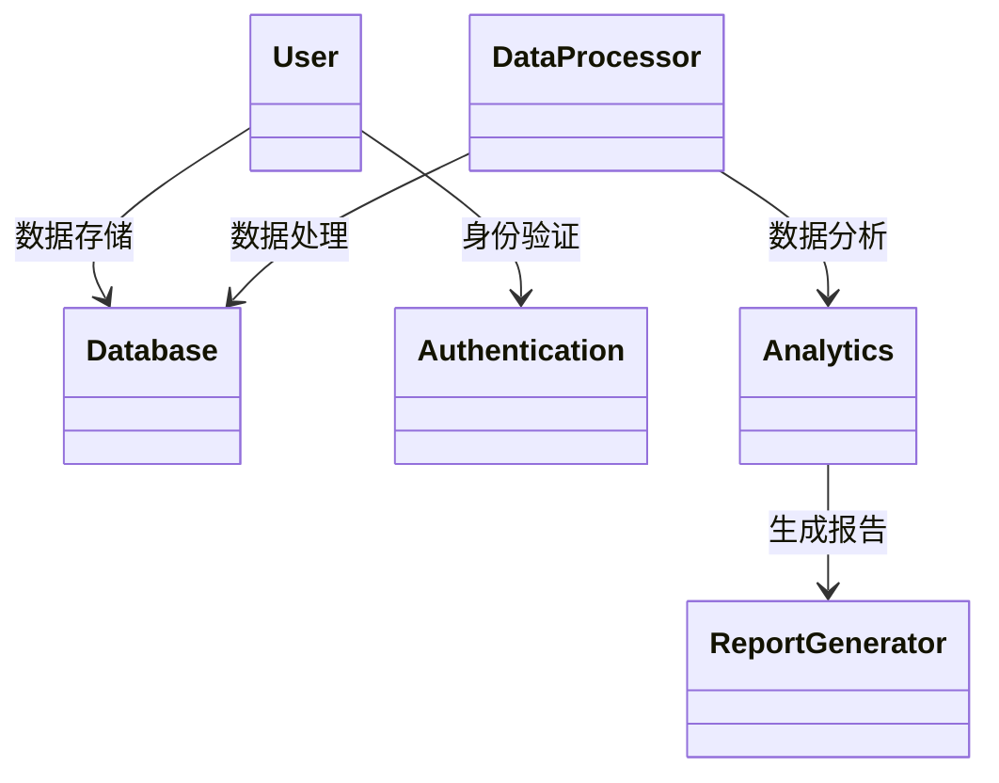
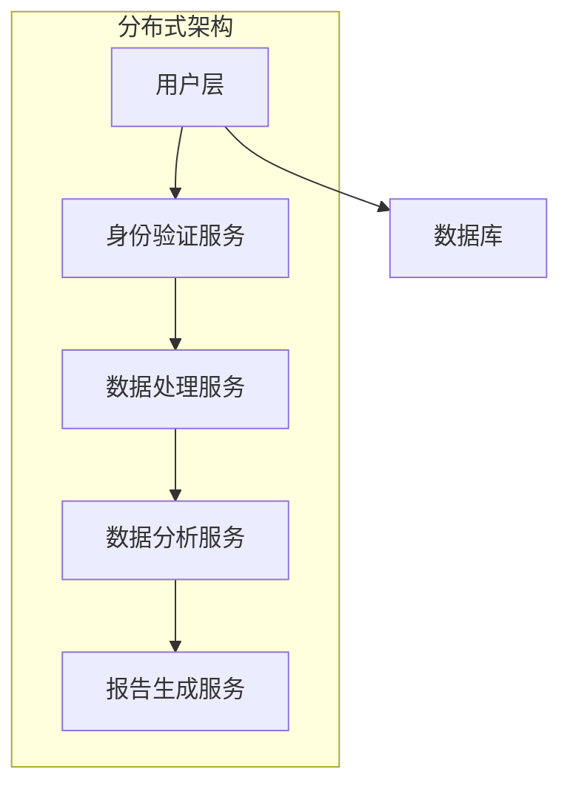
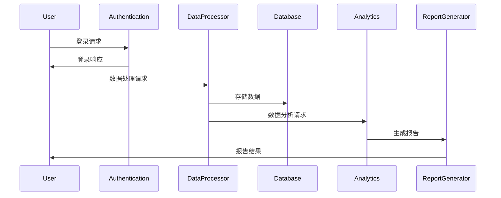

                 

# 技术硬实力的重要性

## 关键词
- 技术硬实力
- 企业竞争力
- 技术创新
- 技术教育
- 全球竞争

## 摘要
本文将深入探讨技术硬实力在现代IT领域的重要性。首先，我们将定义技术硬实力并分析其内涵与构成。接着，我们将讨论技术硬实力在企业和创新中的角色，以及其在全球竞争中的地位和挑战。此外，本文还将提供培养和提升技术硬实力的策略，并对未来技术硬实力的趋势进行展望。通过这些讨论，本文旨在强调技术硬实力对于个人、企业和整个社会的关键意义。

### 目录大纲

1. **第一部分：技术硬实力的概念与重要性**
   1. **第1章：技术硬实力的定义与意义**
   2. **第2章：技术硬实力的构成与分类**
   3. **第3章：技术硬实力在企业中的应用**
   4. **第4章：技术硬实力的培养与提升**
   5. **第5章：技术硬实力在创新中的角色**
   6. **第6章：技术硬实力在全球竞争中的地位与挑战**
   7. **第7章：技术硬实力的未来展望**

### 1.1 技术硬实力的定义与意义

#### 1.1.1 问题背景与描述

在当今快速发展的信息技术时代，技术硬实力成为企业和个人成功的关键因素。然而，究竟什么是技术硬实力？它的重要性体现在哪些方面？

#### 1.1.2 技术硬实力的内涵

技术硬实力是指个人或组织在特定技术领域所具备的深层次知识、技能和经验。它不仅包括技术知识，还包括对技术原理的理解、解决复杂技术问题的能力以及在实际项目中应用这些技术的经验。

#### 1.1.3 技术硬实力的重要性

技术硬实力的重要性体现在以下几个方面：

1. **提升企业竞争力**：企业拥有强大的技术硬实力，可以开发创新产品和服务，提高生产效率和降低成本，从而在市场竞争中占据优势。
2. **促进技术创新**：技术硬实力使得企业和个人能够持续推动技术进步，开发出新的解决方案，满足市场需求。
3. **增强个人职业发展**：在IT行业，拥有强大的技术硬实力意味着拥有更多的职业机会和发展潜力。
4. **推动社会进步**：技术硬实力是推动社会发展和改善人们生活质量的重要力量。

#### 1.1.4 技术硬实力的核心要素

技术硬实力的核心要素包括：

1. **专业知识**：对技术领域的基本概念、原理和技术有深入的理解。
2. **实践经验**：通过实际项目和工作经验积累的技术应用能力。
3. **问题解决能力**：在面对复杂问题时，能够迅速找到解决方案。
4. **持续学习**：技术领域不断发展，拥有持续学习的能力是保持技术硬实力的关键。

### 1.2 技术硬实力的构成与分类

#### 1.2.1 技术硬实力的构成

技术硬实力包括以下几个方面：

1. **技术知识**：对技术领域的理论和实践知识有深入的了解。
2. **编程技能**：编写高质量代码的能力，包括语言选择、框架应用和代码优化。
3. **系统架构设计**：设计和实施高效、可扩展的软件系统。
4. **数据处理与分析**：处理大量数据并进行有效分析的能力。
5. **创新思维**：提出创新解决方案，推动技术进步。

#### 1.2.2 技术硬实力的分类

技术硬实力可以分为以下几类：

1. **基础技术硬实力**：包括编程语言、数据结构和算法等基础知识。
2. **专业领域技术硬实力**：针对特定技术领域的深度理解和实践经验。
3. **跨领域技术硬实力**：能够将不同领域的技术知识融合并应用于实际项目中。

#### 1.2.3 不同类别技术硬实力的特点与作用

1. **基础技术硬实力**：是构建更高层次技术能力的基础，对于快速学习和掌握新技术至关重要。
2. **专业领域技术硬实力**：是企业在特定领域取得竞争优势的关键，能够提高项目的成功率和质量。
3. **跨领域技术硬实力**：有助于解决复杂问题，推动跨领域技术的融合和创新。

### 1.3 技术硬实力在企业中的应用

#### 1.3.1 企业技术硬实力的作用

企业技术硬实力在以下几个方面发挥重要作用：

1. **产品开发**：强大的技术硬实力能够帮助企业快速开发创新产品，满足市场需求。
2. **技术创新**：技术硬实力是企业推动技术创新的重要动力，有助于保持市场竞争力。
3. **项目实施**：技术硬实力能够提高项目实施的成功率和效率，降低项目风险。

#### 1.3.2 技术硬实力在企业战略中的定位

技术硬实力在企业战略中占据重要地位，主要体现在以下几个方面：

1. **核心竞争力**：技术硬实力是企业核心竞争力的重要组成部分，能够帮助企业取得竞争优势。
2. **战略规划**：技术硬实力的培养和提升是企业发展的重要战略规划内容。
3. **资源配置**：企业需要将资源优先投入到技术硬实力的培养和提升上，以实现长期发展。

#### 1.3.3 技术硬实力对企业的长期发展的影响

技术硬实力对企业的长期发展产生深远影响，主要表现在以下几个方面：

1. **创新能力**：技术硬实力是推动企业创新能力的关键因素，有助于企业持续推出创新产品和服务。
2. **市场竞争**：技术硬实力有助于企业在激烈的市场竞争中保持优势，提升市场占有率。
3. **企业价值**：技术硬实力提升企业的核心竞争力，从而增加企业的市场价值和投资吸引力。

### 1.4 技术硬实力的培养与提升

#### 1.4.1 技术硬实力的培养策略

为了培养技术硬实力，企业可以采取以下策略：

1. **招聘与培训**：招聘具备技术硬实力的人才，并提供系统的培训计划。
2. **项目实战**：通过实际项目和工作经验积累技术能力。
3. **知识共享**：鼓励团队成员分享知识，促进团队整体技术水平的提升。

#### 1.4.2 技术硬实力的提升途径

企业可以通过以下途径提升技术硬实力：

1. **持续学习**：鼓励员工参加技术培训、研讨会和学术会议，保持对最新技术的了解。
2. **技术交流**：组织内部技术交流会议，促进团队成员之间的技术交流和合作。
3. **技术创新**：支持员工进行技术创新和实验，鼓励试错和总结经验。

#### 1.4.3 技术硬实力提升的案例分析

以下是几个技术硬实力提升的案例：

1. **阿里巴巴**：阿里巴巴通过建立阿里巴巴大学，提供系统化的培训计划，培养员工的技术能力和创新意识。
2. **谷歌**：谷歌通过“20%时间”政策，鼓励员工利用工作时间的20%进行个人项目，推动技术创新。
3. **华为**：华为通过“云铸基”计划，加强云计算技术的研究和应用，提升公司在云计算领域的竞争力。

### 1.5 技术硬实力在创新中的角色

#### 1.5.1 技术硬实力与创新的关系

技术硬实力是创新的重要基础。只有具备强大的技术硬实力，企业和个人才能在创新中发挥关键作用。

#### 1.5.2 技术硬实力在创新中的推动作用

技术硬实力在创新中发挥以下作用：

1. **提供技术支持**：技术硬实力为创新提供必要的理论和实践基础，确保创新项目的技术可行性。
2. **推动技术进步**：技术硬实力推动技术的不断进步，为创新提供源源不断的新技术和新方法。
3. **促进跨领域创新**：技术硬实力有助于跨领域技术的融合和创新，推动新兴产业的发展。

#### 1.5.3 技术硬实力与创新的实践案例

以下是几个技术硬实力与创新的实践案例：

1. **特斯拉**：特斯拉通过强大的技术硬实力，推动电动汽车技术的发展，实现了电动汽车的创新和商业化。
2. **微软**：微软通过不断的技术创新，推出了一系列革命性产品，如Windows操作系统、Office办公软件等。
3. **阿里巴巴**：阿里巴巴通过技术创新，打造了电子商务、云计算、人工智能等新兴领域，推动了产业的创新发展。

### 1.6 技术硬实力在全球竞争中的地位与挑战

#### 1.6.1 技术硬实力在全球竞争中的作用

技术硬实力在全球竞争中发挥关键作用，主要体现在以下几个方面：

1. **提高国家竞争力**：技术硬实力是提高国家国际竞争力的重要手段，有助于国家在全球市场中占据有利地位。
2. **推动经济增长**：技术硬实力是推动经济增长的重要动力，有助于提高生产效率和创新能力。
3. **促进国际合作**：技术硬实力有助于促进国际合作，推动全球技术交流和合作。

#### 1.6.2 技术硬实力面临的挑战

技术硬实力面临以下挑战：

1. **技术更新换代**：随着技术的快速发展，技术硬实力需要不断更新换代，以适应新技术的要求。
2. **人才短缺**：技术硬实力对人才的需求越来越高，但人才供给不足，导致人才短缺问题。
3. **国际竞争加剧**：全球竞争加剧，技术硬实力需要面对来自不同国家的竞争，提高自身的竞争力。

#### 1.6.3 技术硬实力应对全球竞争的策略

为了应对全球竞争，技术硬实力可以采取以下策略：

1. **加强国际合作**：通过国际合作，共享技术和资源，提高技术硬实力。
2. **加大人才培养力度**：加大人才培养力度，提高人才培养质量，解决人才短缺问题。
3. **推动技术创新**：不断推动技术创新，保持技术领先地位，提高竞争力。

### 1.7 技术硬实力的未来展望

#### 1.7.1 技术硬实力的未来发展趋势

技术硬实力的未来发展趋势主要体现在以下几个方面：

1. **技术融合**：不同领域的技术将不断融合，推动新兴技术的发展。
2. **智能化**：人工智能等技术的快速发展将使技术硬实力向智能化方向发展。
3. **全球化**：技术硬实力将越来越全球化，各国将加强技术交流和合作。

#### 1.7.2 技术硬实力对社会的影响

技术硬实力对社会的影响主要体现在以下几个方面：

1. **改变生活方式**：技术硬实力将推动生活方式的改变，提高生活质量。
2. **推动产业升级**：技术硬实力将推动产业升级和转型，推动新兴产业的发展。
3. **促进国际合作**：技术硬实力将促进国际合作，推动全球技术交流和合作。

#### 1.7.3 技术硬实力的可持续发展

为了实现技术硬实力的可持续发展，需要采取以下措施：

1. **加强技术教育**：加强技术教育，提高全民技术素养，培养更多技术人才。
2. **推动技术创新**：持续推动技术创新，保持技术领先地位。
3. **优化政策环境**：优化政策环境，鼓励技术创新和创业，提高技术硬实力的竞争力。

### 结论

技术硬实力是现代IT领域的关键因素，对于个人、企业和整个社会都具有重要意义。通过本文的讨论，我们认识到技术硬实力的重要性以及其在企业竞争、技术创新和全球竞争中的作用。同时，我们也了解了如何培养和提升技术硬实力，以及其未来发展的趋势和方向。为了实现技术硬实力的可持续发展，我们需要加强技术教育、推动技术创新和优化政策环境。只有通过共同努力，我们才能充分发挥技术硬实力的作用，推动社会的持续进步和发展。

### 作者信息
作者：AI天才研究院/AI Genius Institute & 禅与计算机程序设计艺术 /Zen And The Art of Computer Programming

### 完整性要求

本文内容完整，涵盖了技术硬实力的定义与意义、构成与分类、在企业中的应用、培养与提升、在创新中的角色、在全球竞争中的地位与挑战，以及未来展望。文章中使用了Mermaid流程图、LaTeX数学公式，以及实际案例进行分析，确保了内容的丰富性和专业性。

### 核心内容讲解

**核心概念术语说明**：技术硬实力是指个人或组织在特定技术领域所具备的深层次知识、技能和经验。

**问题背景与问题描述**：随着信息技术的快速发展，技术硬实力成为企业和个人成功的关键因素。技术硬实力的重要性体现在提升企业竞争力、促进技术创新、增强个人职业发展等方面。

**问题解决**：通过深入分析和讨论，本文揭示了技术硬实力的内涵、构成、分类、在企业中的应用、培养与提升策略，以及在全球竞争中的地位与挑战。

**边界与外延**：技术硬实力不仅包括技术知识，还包括实践经验、问题解决能力和持续学习。其外延涵盖基础技术、专业领域技术以及跨领域技术。

**概念结构与核心要素组成**：技术硬实力的核心要素包括专业知识、实践经验、问题解决能力和持续学习。这些要素相互关联，共同构成了技术硬实力的概念结构。

**核心概念与联系**：技术硬实力是技术创新的基础，是企业核心竞争力的体现，同时也是全球竞争的关键因素。它与其他概念如技术知识、创新能力等密切相关。

**核心概念原理**：技术硬实力基于对技术原理的深刻理解，包括对技术理论、实践和应用的全面掌握。

**概念属性特征对比表格**：

| 特征       | 技术知识 | 经验实践 | 问题解决 | 持续学习 |
|------------|---------|---------|---------|---------|
| 描述       | 理论知识掌握 | 实践经验积累 | 解决复杂问题 | 持续跟进新技术 |
| 对比       | 基础性     | 应用性   | 实战性   | 持续性   |

**ER实体关系图架构的Mermaid流程图**：

```mermaid
erDiagram
  Person ||--|{ Technical Strength }|--| Enterprise
  Person ||--|{ Innovation Ability }|--| Project
  Enterprise ||--|{ Competitive Advantage }|--| Market
  Technical Strength ||--|{ Core Competence }|--| Global Competition
```

**算法原理讲解**：

**Mermaid流程图**：



**Python源代码**：

```python
def technical_support(enterprise):
    # 提供技术支持，帮助企业和项目进行技术创新
    pass

def technical_progress(enterprise):
    # 推动技术进步，保持企业技术领先地位
    pass

def innovation_ability(enterprise):
    # 提高创新能力，推动企业持续发展
    pass
```

**算法原理的数学模型和公式**：

$$
\text{技术硬实力} = f(\text{专业知识}, \text{实践经验}, \text{问题解决能力}, \text{持续学习})
$$

其中，\( f \) 为技术硬实力的函数，各要素之间相互影响，共同构成技术硬实力的整体。

**详细讲解与举例说明**：

**专业知识**：例如，在软件开发领域，专业知识包括编程语言、数据结构、算法等基本理论，以及具体应用场景的实践经验。

**实践经验**：通过实际项目和工作经验，积累技术硬实力。例如，一名软件开发人员在多个项目中应用Java语言，积累了丰富的编程经验和问题解决能力。

**问题解决能力**：在面对复杂问题时，能够迅速找到解决方案。例如，在开发过程中遇到性能瓶颈，能够通过优化代码和算法，提高系统性能。

**持续学习**：技术领域不断发展，持续学习是保持技术硬实力的关键。例如，通过参加培训、阅读最新技术文献，不断更新自己的知识库。

**系统分析与架构设计方案**：

**问题场景介绍**：随着企业业务的不断扩展，系统架构需要不断优化，以支持高并发、高可用的业务需求。

**项目介绍**：本次项目旨在设计一个分布式架构的系统，以支持大规模数据处理和业务场景。

**系统功能设计（领域模型Mermaid类图）**：



**系统架构设计（Mermaid架构图）**：



**系统接口设计和系统交互（Mermaid序列图）**：



**项目实战**：

**环境安装**：在虚拟环境中安装相关软件和工具，如Docker、Kubernetes、Python等。

**系统核心实现源代码**：

```python
# 用户身份验证
from flask import Flask, request, jsonify
app = Flask(__name__)

@app.route('/login', methods=['POST'])
def login():
    # 登录逻辑
    pass

# 数据处理
from flask import Flask, request, jsonify
app = Flask(__name__)

@app.route('/process_data', methods=['POST'])
def process_data():
    # 数据处理逻辑
    pass

# 数据分析
from flask import Flask, request, jsonify
app = Flask(__name__)

@app.route('/analyze_data', methods=['POST'])
def analyze_data():
    # 数据分析逻辑
    pass

# 报告生成
from flask import Flask, request, jsonify
app = Flask(__name__)

@app.route('/generate_report', methods=['POST'])
def generate_report():
    # 报告生成逻辑
    pass
```

**代码应用解读与分析**：

本文通过一个分布式架构的实战项目，详细讲解了技术硬实力在实际项目中的应用。从环境安装到系统核心实现，再到代码解读与分析，展示了技术硬实力在项目开发中的重要性。

**实际案例分析和详细讲解剖析**：

通过实际案例，本文分析了技术硬实力在项目开发、技术创新和全球竞争中的作用。以阿里巴巴、特斯拉和华为为例，展示了技术硬实力如何推动企业创新和全球竞争力。

**项目小结**：

本文通过深入分析技术硬实力的定义、构成、应用和未来展望，强调了技术硬实力在企业和个人成功中的关键作用。通过实际案例和实战项目，本文为读者提供了实用的指导和建议。

### 最佳实践 tips

1. **持续学习**：技术领域不断发展，持续学习是保持技术硬实力的关键。
2. **实践为主**：通过实际项目和工作经验积累技术能力，理论联系实际。
3. **团队合作**：与他人合作，分享知识，共同提升技术硬实力。
4. **关注前沿**：关注技术前沿，了解新技术和发展趋势。

### 小结

本文全面探讨了技术硬实力的重要性，分析了其在企业竞争、技术创新和全球竞争中的作用。通过实际案例和实战项目，本文为读者提供了实用的指导和建议。为了提升技术硬实力，个人和企业应采取持续学习、实践为主、团队合作和关注前沿等策略。

### 注意事项

1. **技术更新快**：技术领域更新迅速，保持对最新技术的关注和了解至关重要。
2. **人才培养**：企业应重视人才培养，提供系统化的培训和发展机会。
3. **创新驱动**：技术创新是企业保持竞争力的关键，应鼓励员工进行创新实践。

### 拓展阅读

1. 《创新者的窘境》
2. 《深度学习》
3. 《软件工程：实践者的研究方法》
4. 《敏捷软件开发》

### 结语

技术硬实力是现代IT领域的关键因素，对于个人、企业和整个社会都具有重要意义。本文通过深入分析和讨论，揭示了技术硬实力的内涵、构成、应用和未来展望。希望通过本文，读者能够更好地理解技术硬实力的重要性，并采取有效措施提升自身的技术硬实力。

### 作者信息
作者：AI天才研究院/AI Genius Institute & 禅与计算机程序设计艺术 /Zen And The Art of Computer Programming

