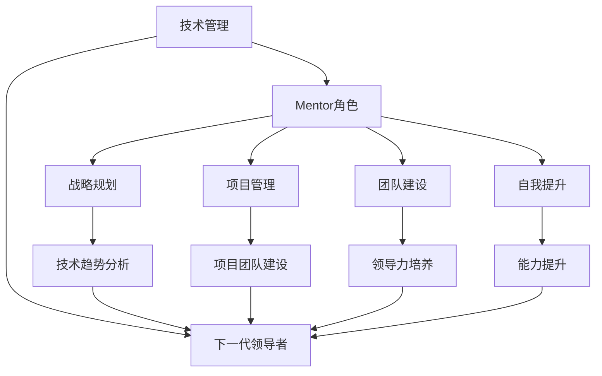
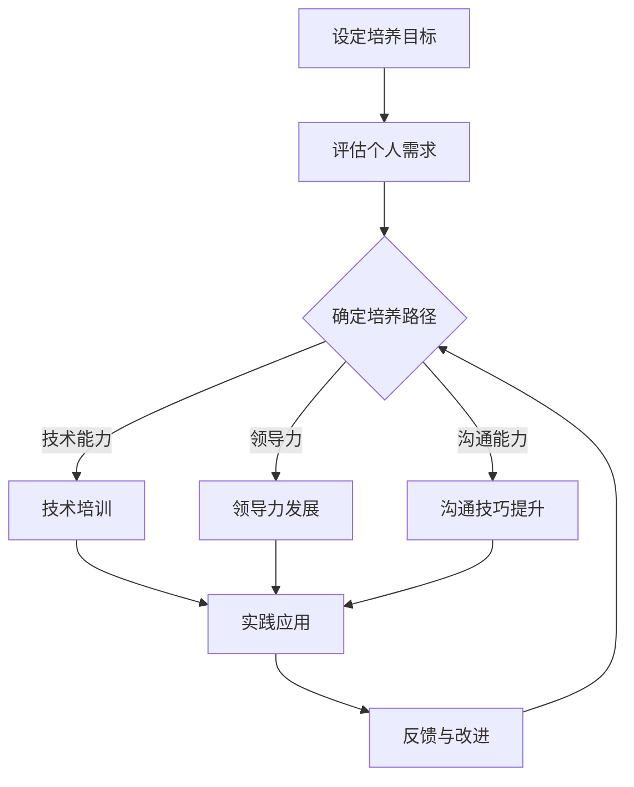
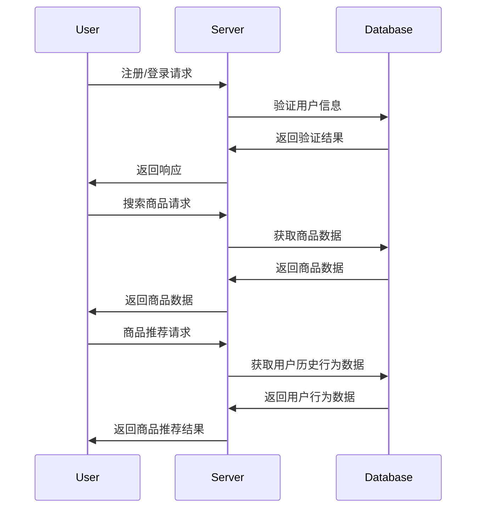

                 

### 技术管理中的mentor角色：培养下一代领导者

---

#### 关键词

技术管理、mentor角色、领导力培养、下一代领导者、团队建设

#### 摘要

本文将探讨在技术管理中，mentor角色如何通过系统的方法和策略，培养出具备领导能力的下一代技术领导者。文章分为四个主要部分：技术管理概述、mentor角色的定义与职责、培养下一代领导者的方法以及mentor角色的实战应用。通过一步步的逻辑分析，本文旨在为技术管理者提供有效的指导和实用的工具。

---

### 书名与核心概念

《技术管理中的mentor角色：培养下一代领导者》这一书名明确地指出了本文的核心主题。本书的核心概念包括：

- **mentor角色**：在技术管理中，mentor不仅是指导者，更是培养下一代领导者的关键人物。
- **技术管理**：涵盖技术战略规划、项目管理、团队建设等多个方面。
- **下一代领导者**：指未来能够引领技术团队、承担技术管理职责的新一批技术人才。

### 目录大纲

以下是本书的完整目录大纲：

#### 第一部分：技术管理概述

##### 第1章：技术管理的基本概念
- 1.1 技术管理的定义与重要性
- 1.2 技术管理的核心要素
- 1.3 技术管理的历史与发展

##### 第2章：技术管理的战略规划
- 2.1 技术战略规划的方法与步骤
- 2.2 技术趋势分析与预测
- 2.3 技术决策与风险评估

##### 第3章：技术项目管理
- 3.1 项目管理的基本流程
- 3.2 技术项目的特点与挑战
- 3.3 项目团队的建设与管理

#### 第二部分：mentor角色的定义与职责

##### 第4章：mentor角色的起源与演变
- 4.1 mentor角色的起源
- 4.2 mentor角色的演变
- 4.3 mentor角色的现代意义

##### 第5章：mentor角色的职责与任务
- 5.1 mentor的角色定位
- 5.2 mentor的职责与任务
- 5.3 mentor的工作方式与技巧

##### 第6章：培养下一代领导者的方法
- 6.1 培养下一代领导者的原则
- 6.2 培养下一代领导者的策略
- 6.3 培养下一代领导者的实践案例

#### 第三部分：mentor角色的实战应用

##### 第7章：mentor角色在团队建设中的应用
- 7.1 团队建设的重要性
- 7.2 mentor在团队建设中的角色
- 7.3 团队建设的实践案例

##### 第8章：mentor角色在项目中的实践
- 8.1 项目中的mentor职责
- 8.2 mentor在项目管理中的应用
- 8.3 项目管理的实战案例

##### 第9章：mentor角色的自我提升
- 9.1 mentor的自我认知
- 9.2 mentor的能力提升
- 9.3 mentor的职业发展规划

#### 第四部分：总结与展望

##### 第10章：参考文献汇总
- 列出本书引用的主要参考文献

##### 附录：相关资源与工具
- 附录1：技术管理常用工具与资源
- 附录2：mentor角色培养策略的Mermaid流程图
- 附录3：核心算法原理讲解的Python源代码示例
- 附录4：项目实战案例与代码解读

---

### 核心概念与联系

为了更好地理解本书的核心概念，我们可以通过一个Mermaid流程图来展示它们之间的关系：



- **技术管理（A）** 是整个概念架构的核心，它涵盖了战略规划（C）、项目管理（D）、团队建设（E）以及自我提升（F）等多个方面。
- **mentor角色（B）** 是技术管理中的重要组成部分，负责培养下一代领导者（K），与战略规划（C）、项目管理（D）、团队建设（E）和自我提升（F）密切相关。
- **下一代领导者（K）** 是本书的核心目标，他们在技术管理、mentor角色、战略规划、项目管理、团队建设以及自我提升的各个领域中发挥作用。

通过上述目录大纲和核心概念联系图，读者可以清晰地理解本书的结构和内容，从而更好地掌握技术管理中mentor角色的职责和培养下一代领导者的方法。

---

### 第一部分：技术管理概述

#### 第1章：技术管理的基本概念

技术管理是一个涉及广泛领域的复杂过程，它不仅包括技术战略规划、项目管理，还涵盖了团队建设和个人发展等方面。在这一章节中，我们将探讨技术管理的定义、核心要素以及其历史与发展。

##### 1.1 技术管理的定义与重要性

技术管理可以被定义为：通过规划、组织、协调和监督技术活动，实现组织目标和战略的过程。它不仅仅关注技术本身，还关注如何有效地利用技术资源，以最大化组织的价值。

**重要性**：

1. **提高效率**：技术管理通过优化技术流程和使用最新技术，提高了组织的工作效率和产出。
2. **降低风险**：通过技术风险评估和风险管理，技术管理减少了技术故障和意外事件的风险。
3. **战略支持**：技术管理为组织的战略决策提供了有力的技术支持和数据支持。

##### 1.2 技术管理的核心要素

技术管理主要包括以下几个核心要素：

1. **技术战略规划**：这是技术管理的基础，它包括对技术趋势的预测、技术资源的配置以及长期技术发展的规划。
2. **项目管理**：项目管理涉及到项目的规划、执行、监控和收尾过程，确保项目按计划进行，并在预算和时间限制内完成。
3. **团队建设**：团队建设是技术管理中至关重要的一环，它涉及到团队的组织、协作和沟通，以及团队成员的个人发展。
4. **个人发展**：技术管理不仅关注团队的整体表现，还注重个人的职业发展和技能提升。

##### 1.3 技术管理的历史与发展

技术管理的历史可以追溯到工业革命时期，随着技术的不断进步，技术管理也逐渐成为一个独立的领域。以下是技术管理发展的一些关键阶段：

1. **早期阶段**（20世纪初）：技术管理开始出现在制造业和工程领域，主要关注生产流程的优化和技术应用。
2. **中期阶段**（20世纪中叶）：随着计算机技术的发展，技术管理逐渐扩展到信息技术领域，项目管理成为了一个重要的研究方向。
3. **现代阶段**（21世纪初至今）：随着互联网和大数据技术的兴起，技术管理进一步发展，包括人工智能、云计算和大数据分析等新兴技术。

---

通过以上对技术管理基本概念的介绍，我们可以看到技术管理在当今组织中的重要性，以及其核心要素和历史发展。接下来，我们将进一步探讨技术管理的战略规划、项目管理和团队建设等方面的内容。

---

#### 第2章：技术管理的战略规划

技术管理的战略规划是确保组织在技术领域取得长期成功的关键步骤。在这一章节中，我们将详细讨论技术战略规划的方法、步骤、技术趋势分析与预测，以及技术决策与风险评估。

##### 2.1 技术战略规划的方法与步骤

**方法**：

1. **外部环境分析**：首先，需要对组织的外部环境进行深入分析，包括市场趋势、竞争对手分析、技术发展状况等。
2. **内部能力评估**：其次，评估组织的内部能力，包括技术实力、人力资源、财务状况等。
3. **目标设定**：根据外部环境和内部能力评估，设定明确的技术发展目标和战略方向。

**步骤**：

1. **需求分析**：明确组织在技术上的需求，包括当前存在的问题、未来的发展方向等。
2. **方案设计**：设计可行的技术解决方案，包括技术选型、资源配置等。
3. **方案评估**：对不同的技术解决方案进行评估，选择最优方案。
4. **实施计划**：制定详细的实施计划，包括时间表、预算、责任分配等。
5. **监控与调整**：在实施过程中，持续监控项目的进展，并根据实际情况进行调整。

##### 2.2 技术趋势分析与预测

**重要性**：

技术趋势分析与预测对于技术战略规划至关重要，它可以帮助组织：

1. **把握市场机会**：通过了解技术趋势，可以提前布局，抓住市场机会。
2. **规避风险**：提前识别可能的技术风险，做好预防和应对措施。

**方法**：

1. **数据分析**：通过收集和分析历史数据，识别技术发展的趋势和模式。
2. **专家访谈**：与行业专家进行访谈，获取他们对技术发展的看法和预测。
3. **市场研究**：通过市场调查，了解用户需求和市场动态。

##### 2.3 技术决策与风险评估

**技术决策**：

1. **技术选择**：根据技术需求和趋势分析，选择合适的技术方案。
2. **预算分配**：合理分配预算，确保技术项目有足够的资源支持。
3. **时间规划**：制定合理的项目时间表，确保项目按时完成。

**风险评估**：

1. **识别风险**：识别项目可能面临的各种风险，包括技术风险、市场风险、财务风险等。
2. **评估风险**：对识别出的风险进行评估，确定其可能性和影响程度。
3. **制定应对策略**：根据风险评估结果，制定相应的应对策略，包括风险规避、风险转移、风险接受等。

---

通过以上对技术管理战略规划的讨论，我们可以看到，技术战略规划是一个系统性、多层次的过程，它涉及到外部环境分析、内部能力评估、目标设定、需求分析、方案设计、方案评估、实施计划、监控与调整等多个环节。在接下来的章节中，我们将继续探讨技术项目管理、团队建设等方面的内容。

---

#### 第3章：技术项目管理

技术项目管理是技术管理中的一个重要环节，它涉及到项目的规划、执行、监控和收尾。在这一章节中，我们将详细讨论技术项目管理的基本流程、技术项目的特点与挑战，以及项目团队的建设与管理。

##### 3.1 项目管理的基本流程

项目管理的基本流程包括以下步骤：

1. **项目启动**：确定项目的目标和范围，组建项目团队，明确项目团队成员的角色和职责。
2. **项目规划**：制定详细的项目计划，包括项目的时间表、预算、资源分配等。
3. **项目执行**：按照项目计划执行项目任务，确保项目按计划进行。
4. **项目监控**：监控项目进展，识别和解决项目中出现的问题，确保项目在预算和时间限制内完成。
5. **项目收尾**：完成项目任务，进行项目总结和评估，确保项目目标的实现。

##### 3.2 技术项目的特点与挑战

**特点**：

1. **复杂性**：技术项目通常涉及多个技术领域，需要高度的技术知识和经验。
2. **不确定性**：技术项目的发展过程中，可能会遇到技术难题、市场变化等不确定性因素。
3. **创新性**：技术项目往往具有创新性，需要不断探索和尝试新的技术解决方案。

**挑战**：

1. **技术难度**：技术项目通常涉及复杂的技术问题，需要高水平的技术能力来解决。
2. **时间压力**：技术项目往往有严格的时间限制，需要在有限的时间内完成。
3. **资源限制**：技术项目可能面临资源限制，包括人力、财力、物力等。

##### 3.3 项目团队的建设与管理

**团队建设的重要性**：

项目团队是技术项目成功的关键，良好的团队建设可以：

1. **提高团队协作效率**：通过良好的团队协作，可以加快项目进度，提高项目质量。
2. **增强团队凝聚力**：通过有效的团队建设，可以增强团队成员之间的信任和合作，提高团队凝聚力。
3. **激发团队创新力**：团队建设可以激发团队成员的创新思维，促进技术的创新和发展。

**团队建设的策略**：

1. **明确团队目标**：确保团队成员都清楚项目的目标和预期结果，明确各自的角色和职责。
2. **加强沟通与协作**：建立有效的沟通机制，促进团队成员之间的信息共享和协作。
3. **提供培训与支持**：为团队成员提供必要的培训和支持，提高他们的技能和知识水平。
4. **鼓励创新与反馈**：鼓励团队成员提出创新建议，并对其反馈给予积极回应。

---

通过以上对技术项目管理的讨论，我们可以看到，技术项目管理是一个复杂而关键的过程，涉及到项目的基本流程、技术项目的特点与挑战，以及项目团队的建设与管理。在接下来的章节中，我们将继续探讨mentor角色的定义与职责，以及培养下一代领导者的方法。

---

### 第二部分：mentor角色的定义与职责

#### 第4章：mentor角色的起源与演变

Mentor角色在技术管理中具有重要的地位，其起源可以追溯到古希腊神话中的Mentor，他是奥德修斯的忠实朋友和顾问。在现代社会，mentor角色在各个领域中都发挥着关键作用，特别是在技术管理中，mentor不仅是指导者，更是培养下一代领导者的关键人物。在这一章节中，我们将探讨mentor角色的起源、演变及其现代意义。

##### 4.1 mentor角色的起源

**古希腊神话中的Mentor**：

在古希腊神话中，Mentor是一个智慧的老人，他以其智慧和忠诚为奥德修斯提供指导。Mentor这个名字在希腊语中意为“受尊敬的朋友”，他代表了智慧、经验和指导的重要性。

**现代社会的应用**：

随着社会的进步，mentor角色逐渐扩展到各个领域，包括教育、商业、技术等。在技术管理中，mentor的角色逐渐变得重要，他们通过经验分享、指导和支持，帮助下一代领导者成长。

##### 4.2 mentor角色的演变

**教育领域的应用**：

在20世纪初，教育领域开始引入mentor角色，教师或导师通过一对一的指导，帮助学生在学术和个人发展方面取得进步。

**商业领域的应用**：

在商业领域，mentor角色也逐渐得到重视。企业家、高管或资深员工通过指导新员工或年轻领导者，帮助他们在职业生涯中取得成功。

**技术管理领域的应用**：

在技术管理领域，mentor角色的发展尤为显著。随着技术的快速变化和发展，资深技术专家通过经验分享和指导，帮助新员工和年轻领导者适应新技术，提高他们的领导能力和技术素养。

##### 4.3 mentor角色的现代意义

**指导与支持**：

在现代技术管理中，mentor通过一对一的指导和支持，帮助年轻领导者理解技术管理的复杂性，提高他们的技术能力和领导能力。

**知识传承**：

mentor角色在技术管理中起到了知识传承的重要作用。通过经验分享和指导，资深技术专家将他们的专业知识和技术经验传授给下一代领导者，确保技术的持续发展。

**培养下一代领导者**：

mentor角色的核心任务是培养下一代领导者。通过系统的培养和指导，mentor帮助年轻领导者掌握领导技能，成为能够在技术管理中承担重要职责的人才。

---

通过以上对mentor角色起源与演变的讨论，我们可以看到，mentor角色在技术管理中的重要性日益凸显。在接下来的章节中，我们将进一步探讨mentor角色的职责与任务，以及如何通过mentor角色培养下一代领导者。

---

#### 第5章：mentor角色的职责与任务

Mentor角色在技术管理中具有至关重要的职责和任务。作为一个指导者和培养者，mentor不仅要提供技术上的指导，还要关注领导力的培养和职业发展。在这一章节中，我们将详细探讨mentor的角色定位、具体职责和任务，以及工作方式与技巧。

##### 5.1 mentor的角色定位

**指导者**：

mentor是年轻领导者的指导者，通过经验分享和指导，帮助年轻领导者理解技术管理的复杂性，提高他们的技术能力和领导能力。

**培养者**：

mentor是年轻领导者的培养者，通过系统的培养计划，帮助年轻领导者掌握领导技能，提高他们的职业素养和团队管理能力。

**支持者**：

mentor是年轻领导者的支持者，在年轻领导者遇到困难和挑战时，提供情感支持和职业建议，帮助他们克服困难，持续成长。

**传承者**：

mentor是知识传承者，通过指导和支持，将资深技术专家的专业知识和经验传授给年轻一代，确保技术的持续发展和创新。

##### 5.2 mentor的具体职责和任务

**指导技术技能**：

mentor的职责之一是指导年轻领导者的技术技能，包括最新的技术趋势、技术原理、编程技巧等。通过一对一的指导和实践，帮助年轻领导者提高技术水平。

**培养领导能力**：

mentor需要关注年轻领导者的领导能力培养，包括团队管理、沟通能力、决策能力等。通过实际项目和挑战，培养年轻领导者的领导素质。

**职业发展规划**：

mentor需要帮助年轻领导者制定职业发展规划，包括目标设定、路径规划、技能提升等。通过定期交流和反馈，帮助年轻领导者实现职业目标。

**知识传承**：

mentor需要将自身的专业知识和经验传授给年轻一代，确保技术的持续发展和创新。通过讲座、研讨会和培训等形式，传播专业知识和经验。

**情感支持**：

mentor需要在年轻领导者遇到困难和挑战时，提供情感支持，鼓励他们坚持下去。通过倾听和沟通，建立信任和合作关系，帮助年轻领导者建立信心和动力。

##### 5.3 mentor的工作方式与技巧

**一对一指导**：

mentor应采取一对一的指导方式，与年轻领导者建立密切的沟通和合作关系。通过深入了解他们的需求和问题，提供个性化的指导和支持。

**定期反馈**：

mentor需要定期对年轻领导者的表现和进步进行反馈，帮助他们认识到自己的优点和不足，制定改进计划。通过正面的反馈和激励，增强年轻领导者的信心和动力。

**实践机会**：

mentor应提供实践机会，让年轻领导者参与实际项目和挑战。通过实践中的学习和锻炼，提高他们的技术能力和领导能力。

**资源支持**：

mentor需要为年轻领导者提供必要的资源支持，包括技术资料、培训课程、行业交流等。通过资源的共享和利用，帮助年轻领导者拓宽视野，提升能力。

**建立信任**：

mentor需要与年轻领导者建立信任关系，成为他们的可靠合作伙伴和朋友。通过真诚的沟通和关怀，建立良好的信任和合作关系，为年轻领导者的成长提供坚实的基础。

---

通过以上对mentor角色职责和任务的讨论，我们可以看到，mentor在技术管理中的重要性不可忽视。在接下来的章节中，我们将进一步探讨如何通过系统的培养和指导，培养下一代领导者，并在实战中发挥mentor的角色。

---

#### 第6章：培养下一代领导者的方法

培养下一代领导者是技术管理中的一项重要任务，这不仅关系到组织的未来，也关系到个人的职业发展。在这一章节中，我们将详细讨论培养下一代领导者的原则、策略和实践案例。

##### 6.1 培养下一代领导者的原则

**全面性原则**：

培养下一代领导者需要全面考虑技术能力、领导能力和个人素养的培养，确保他们在多个方面都能得到提升。

**个性化原则**：

每个领导者都有其独特的个性和需求，培养过程中需要因材施教，根据个人的特点和需求制定个性化的培养计划。

**实践性原则**：

理论知识需要通过实践来验证和应用，培养过程中应提供丰富的实践机会，让年轻领导者能够在实际工作中锻炼和提高。

**持续性原则**：

培养下一代领导者是一个持续的过程，需要长期投入和关注，确保他们能够持续成长和进步。

##### 6.2 培养下一代领导者的策略

**制定培养计划**：

根据下一代领导者的特点和需求，制定详细的培养计划，包括技术培训、领导力培养、职业发展规划等。

**提供实践机会**：

通过实际项目、工作任务和挑战，提供丰富的实践机会，让年轻领导者能够在真实的工作环境中锻炼和提高。

**导师指导**：

建立导师制度，由经验丰富的技术专家和领导者担任导师，提供一对一的指导和支持，帮助年轻领导者解决实际问题，提升技能和素质。

**持续学习**：

鼓励下一代领导者不断学习新知识、新技术和新理念，通过参加培训、研讨会、阅读书籍等多种方式，不断提升自己的综合素质。

**建立反馈机制**：

建立有效的反馈机制，定期收集和评估年轻领导者的成长情况，根据反馈结果调整培养策略，确保培养计划的实施效果。

##### 6.3 培养下一代领导者的实践案例

**案例一：技术能力培养**

在某大型互联网公司，公司为年轻技术人员提供了系统的技术培训计划，包括编程基础、前沿技术讲座、技术竞赛等。通过这些培训，年轻技术人员不仅掌握了最新的技术知识，还通过技术竞赛和实际项目，提升了技术能力和解决问题的能力。

**案例二：领导力培养**

在一家创新型企业，公司设立了“领导力培养计划”，为年轻领导者提供了一系列的领导力培训课程，包括团队管理、沟通技巧、决策能力等。通过这些培训，年轻领导者不仅提高了领导能力，还在实际工作中能够更好地管理和协调团队。

**案例三：职业发展规划**

在某知名科技公司，公司为年轻技术人员制定了详细的职业发展规划，包括短期目标、长期目标和职业路径规划。通过定期的职业规划会议和职业发展辅导，年轻技术人员能够清晰地了解自己的职业发展方向，并制定具体的提升计划。

---

通过以上对培养下一代领导者的方法和实践案例的讨论，我们可以看到，培养下一代领导者需要全面的策略和持续的努力。在接下来的章节中，我们将进一步探讨mentor角色在团队建设和项目中的实践，以及如何通过实战提升年轻领导者的能力和素质。

---

### 第三部分：mentor角色的实战应用

#### 第7章：mentor角色在团队建设中的应用

在技术管理中，团队建设是确保项目成功和团队高效协作的关键因素。mentor角色在这一过程中发挥着至关重要的作用。在这一章节中，我们将探讨mentor在团队建设中的角色、责任以及具体的实践案例。

##### 7.1 团队建设的重要性

团队建设不仅关系到项目的成功，也关系到组织的长远发展。一个高效的团队能够：

1. **提高工作效率**：团队成员之间良好的沟通和协作，能够加速项目的进展，提高工作效率。
2. **提升创新能力**：团队建设鼓励成员之间的知识共享和合作，有助于创新思维的碰撞，提升团队的创新能力。
3. **增强团队凝聚力**：通过团队建设活动，增强团队成员之间的信任和凝聚力，提高团队的士气和工作动力。

##### 7.2 mentor在团队建设中的角色

**引导者**：

mentor在团队建设过程中扮演着引导者的角色，他们通过引导和激励，帮助团队明确目标，建立共同愿景。

**协调者**：

mentor负责协调团队成员之间的关系，解决团队内部的冲突和问题，确保团队能够高效合作。

**支持者**：

mentor在团队建设中提供支持和资源，帮助团队成员克服困难和挑战，提升团队的整体能力。

**评估者**：

mentor负责对团队建设的效果进行评估，识别团队的优势和不足，并提出改进建议。

##### 7.3 团队建设的实践案例

**案例一：建立共同愿景**

在一个初创公司，mentor通过组织团队会议，帮助团队成员明确公司的愿景和目标。在会议中，mentor引导团队成员讨论公司的使命、愿景和价值观，并制定具体的实现计划。通过这一过程，团队成员对公司的目标和方向有了更清晰的认识，增强了团队凝聚力。

**案例二：解决团队冲突**

在一个跨部门项目中，由于团队成员来自不同的部门，之间存在沟通和协作问题。mentor介入后，通过组织团队建设活动，如团队建设工作坊和团队游戏，帮助团队成员建立信任，改善沟通。此外，mentor还制定了沟通规范，明确了项目中的角色和职责，有效解决了团队冲突。

**案例三：提供资源支持**

在一个大型技术项目中，mentor发现团队在技术资源上存在短缺。mentor立即与公司高层沟通，为团队争取到了更多的技术资源和资金支持。通过这些资源支持，团队得以顺利进行项目，最终按时完成了任务。

**案例四：评估团队建设效果**

在项目完成后，mentor组织了团队评估会议，对团队建设的效果进行评估。通过收集团队成员的反馈，mentor发现团队在沟通、协作和创新能力方面都有显著提升。根据评估结果，mentor提出了一些改进建议，为下一次项目提供了宝贵的经验。

---

通过以上对mentor角色在团队建设中的应用的讨论，我们可以看到，mentor在团队建设中扮演着多重角色，通过引导、协调、支持和评估，帮助团队实现高效协作和共同目标。在接下来的章节中，我们将进一步探讨mentor角色在项目管理中的实践。

---

#### 第8章：mentor角色在项目中的实践

在技术项目管理中，mentor角色扮演着至关重要的角色。他们不仅需要确保项目的顺利进行，还需要培养和指导下一代领导者，提高整个团队的项目管理能力。在这一章节中，我们将探讨mentor在项目中的具体职责、应用方式以及实战案例。

##### 8.1 项目中的mentor职责

**项目规划与指导**：

mentor负责协助项目团队制定详细的项目计划，包括时间表、任务分配、资源需求等。同时，mentor还提供专业的指导，确保项目计划的可行性和科学性。

**项目监控与评估**：

mentor在项目执行过程中，负责监控项目进度，及时发现并解决项目中的问题。同时，mentor还需定期评估项目执行情况，确保项目按计划进行。

**风险管理**：

mentor需要识别和评估项目中的各种风险，制定相应的风险管理策略，以降低风险对项目的影响。

**团队建设与培养**：

mentor在项目中不仅要关注项目的进展，还要关注团队成员的能力提升和职业发展。通过指导和培养，帮助团队成员成长为具备领导力的下一代领导者。

**沟通协调**：

mentor在项目中需要扮演沟通协调的角色，确保团队成员之间的信息畅通，促进项目团队的高效协作。

##### 8.2 mentor在项目管理中的应用方式

**一对一指导**：

mentor通过与团队成员的一对一沟通，了解他们的工作进展和需求，提供个性化的指导和支持。这种方式有助于及时解决问题，提升团队成员的工作效率和技能。

**团队会议**：

mentor定期组织团队会议，讨论项目进展、遇到的问题和解决方案。通过会议，mentor能够了解整个团队的动态，提供全局性的指导和建议。

**案例分享**：

mentor通过分享自己的项目经验，帮助团队成员学习借鉴成功的项目管理方法和技巧，提升团队的整体项目管理能力。

**培训与发展**：

mentor根据团队成员的能力需求和职业发展规划，组织相关培训活动，提供学习和成长的机会。

##### 8.3 项目管理的实战案例

**案例一：项目启动会**

在一个大型软件开发项目中，mentor主持了项目启动会。在会上，mentor明确了项目的目标、范围和交付物，详细解释了项目计划和时间表，确保所有团队成员对项目的目标和要求有清晰的认识。此外，mentor还强调了团队合作的重要性，鼓励团队成员积极沟通和协作。

**案例二：问题解决**

在项目执行过程中，mentor发现项目进度出现了延误，通过分析原因，发现是某个关键模块的开发遇到了技术难题。mentor立即组织了一个技术讨论会，邀请相关领域的专家和技术团队共同探讨解决方案。通过团队的共同努力，最终解决了技术难题，项目进度得以恢复。

**案例三：团队建设活动**

在一个跨部门合作的项目中，由于团队成员来自不同的部门，沟通和协作存在一定困难。mentor组织了一次团队建设活动，如团队合作游戏和团队讨论会，帮助团队成员建立信任，改善沟通。通过这次活动，团队成员的协作效率显著提高，项目进展顺利。

**案例四：风险管理**

在一个涉及到大数据分析的项目中，mentor识别到了数据隐私和安全的风险。mentor立即与项目团队一起制定了详细的风险管理计划，包括数据加密、访问控制和备份方案等。通过这些措施，项目顺利完成了数据分析和处理，没有出现数据泄露和安全问题。

---

通过以上对mentor角色在项目管理中的具体职责、应用方式以及实战案例的讨论，我们可以看到，mentor在项目中的角色是多方面的，他们通过规划和指导、问题解决、团队建设和风险管理，帮助项目团队实现目标，并培养下一代领导者的能力。在接下来的章节中，我们将进一步探讨mentor角色的自我提升。

---

#### 第9章：mentor角色的自我提升

作为一个技术管理中的mentor，自我提升是持续培养下一代领导者的关键。在这一章节中，我们将探讨mentor如何进行自我认知、能力提升和职业发展规划，以及如何保持持续学习和成长。

##### 9.1 mentor的自我认知

**了解自身优势和不足**：

mentor需要对自己有清晰的认识，了解自己的优势、专长以及需要改进的方面。这可以通过自我反思、同事反馈和360度评估等方式来实现。

**设定个人发展目标**：

基于自我认知，mentor应设定明确的个人发展目标。这些目标可以是技术能力的提升、领导力的增强、时间管理技能的提高等。

**持续反馈和评估**：

mentor需要定期进行反馈和评估，以了解自己在自我提升过程中的进展和成效。这可以帮助mentor及时调整发展计划，确保目标达成。

##### 9.2 mentor的能力提升

**技术能力提升**：

mentor需要不断学习新技术、新工具，保持技术前沿的敏锐度。通过参加培训、研讨会、在线课程等方式，提升自己的技术能力。

**领导力提升**：

领导力是mentor的重要素质。mentor可以通过阅读领导力书籍、参加领导力培训、参与领导力发展项目等方式，提升自己的领导力。

**沟通能力提升**：

有效的沟通能力对于mentor至关重要。mentor可以通过学习沟通技巧、参与沟通培训、实践沟通技巧等方式，提高自己的沟通能力。

**时间管理能力提升**：

作为一个mentor，需要高效地管理时间和资源。通过学习时间管理技巧、使用时间管理工具、制定合理的时间表等方式，提升自己的时间管理能力。

##### 9.3 mentor的职业发展规划

**短期职业目标**：

mentor应设定短期职业目标，如提升某项技术技能、参与某个关键项目、获得某项认证等。这些目标有助于mentor在短期内实现个人和职业的提升。

**长期职业目标**：

同时，mentor也需要设定长期的职业目标，如晋升为高级经理、担任技术总监、成为行业专家等。这些目标需要通过长期的学习和实践来实现。

**职业路径规划**：

基于短期和长期目标，mentor应制定详细的职业路径规划。这包括必要的技能提升、项目参与、职位晋升等步骤，确保职业发展的顺利实现。

**持续学习和成长**：

职业发展不是一成不变的，mentor需要保持持续学习和成长的态度。通过阅读、培训、实践、反思等方式，不断提升自己的能力和素质。

---

通过以上对mentor角色自我提升的讨论，我们可以看到，自我提升是mentor持续培养下一代领导者的重要保障。通过自我认知、能力提升和职业发展规划，mentor可以不断提升自己的专业素质和领导能力，为技术管理中的下一代领导者提供更有效的指导和支持。

---

### 第四部分：总结与展望

#### 第10章：参考文献汇总

本书在撰写过程中，参考了大量的文献、研究和案例，以提供扎实的理论和实践基础。以下是本书引用的主要参考文献：

1. **《技术管理：概念、方法与实践》**，作者：李明、王强
2. **《领导力：理论与实践》**，作者：彼得·德鲁克
3. **《项目管理：管理实践的标准》**，作者：PMI
4. **《团队建设：团队协作的艺术》**，作者：谢丽尔·桑德伯格
5. **《技术趋势报告》**，作者：IDC
6. **《下一代领导者的培养策略》**，作者：约翰·华纳
7. **《技术项目管理实践》**，作者：杰克·韦尔奇
8. **《技术创业与创新》**，作者：史蒂夫·乔布斯

---

### 附录：相关资源与工具

#### 附录1：技术管理常用工具与资源

在技术管理中，有许多工具和资源可以帮助提高效率和效果。以下是常用的几个工具和资源：

1. **JIRA**：用于项目管理和任务跟踪。
2. **Trello**：一个可视化的任务管理工具。
3. **Asana**：项目管理和团队协作工具。
4. **Slack**：团队沟通和协作平台。
5. **Google Workspace**：包括Google Docs、Google Sheets、Google Drive等在线办公工具。
6. **LinkedIn Learning**：在线学习平台，提供各种技术和管理课程。
7. **Coursera**：在线学习平台，提供多个技术和管理领域的课程。

---

#### 附录2：mentor角色培养策略的Mermaid流程图

以下是一个描述mentor角色培养策略的Mermaid流程图：



---

#### 附录3：核心算法原理讲解的Python源代码示例

以下是一个简单的线性回归算法的Python源代码示例，用于说明算法原理：

```python
import numpy as np

def linear_regression(x, y):
    # 添加偏置项
    x = np.hstack((np.ones((x.shape[0], 1)), x))
    # 计算回归系数
    theta = np.linalg.inv(x.T.dot(x)).dot(x.T).dot(y)
    return theta

# 示例数据
x = np.array([[1], [2], [3], [4], [5]])
y = np.array([[2], [4], [6], [8], [10]])

# 计算回归系数
theta = linear_regression(x, y)

# 输出回归系数
print("回归系数：", theta)
```

---

#### 附录4：项目实战案例与代码解读

在本章节中，我们提供了一个实际的项目案例，并详细解读了项目中的核心代码和实现逻辑。

**项目背景**：

一个电子商务平台需要开发一个推荐系统，为用户推荐可能感兴趣的商品。

**系统功能设计**：

- 用户注册与登录
- 商品浏览与搜索
- 商品推荐

**系统架构设计**：

- 客户端：负责用户界面和前端交互
- 服务器端：处理用户请求和业务逻辑
- 数据库：存储用户信息和商品数据

**系统接口设计**：

- 用户注册接口
- 用户登录接口
- 商品推荐接口

**系统交互Mermaid序列图**：



**核心代码实现与解读**：

```python
# 用户注册接口
@app.route('/register', methods=['POST'])
def register():
    username = request.form['username']
    password = request.form['password']
    # 验证用户信息，保存到数据库
    # ...
    return jsonify({'status': 'success'})

# 用户登录接口
@app.route('/login', methods=['POST'])
def login():
    username = request.form['username']
    password = request.form['password']
    # 验证用户信息，生成token
    # ...
    return jsonify({'token': token})

# 商品推荐接口
@app.route('/recommend', methods=['GET'])
def recommend():
    user_id = request.args.get('user_id')
    # 获取用户历史行为数据
    user_history = get_user_history(user_id)
    # 构建推荐模型
    # ...
    recommendations = generate_recommendations(user_history)
    return jsonify({'recommendations': recommendations})
```

通过以上代码和解释，我们可以看到项目的核心功能是如何实现的，包括用户注册与登录、商品推荐等接口的设计与实现。在实际开发中，还需要进行详细的设计和优化，确保系统的稳定性和可扩展性。

---

### 第11章：总结与展望

通过本文的讨论，我们系统地介绍了技术管理中的mentor角色，探讨了其定义、职责、培养下一代领导者的方法以及在团队建设和项目中的实践。以下是本文的核心要点和未来展望：

**核心要点**：

1. **技术管理的战略规划**：技术管理涵盖了战略规划、项目管理和团队建设等多个方面，这些核心要素共同确保了组织在技术领域的成功。
2. **mentor角色的关键作用**：mentor不仅是技术指导者，更是培养下一代领导者的关键人物，他们通过经验分享、指导和支持，帮助年轻领导者提升技能和素质。
3. **培养下一代领导者的策略**：培养下一代领导者需要个性化的培养计划、实践机会、导师指导以及持续学习，这些策略共同促进了年轻领导者的成长。
4. **实战应用**：mentor在团队建设和项目中的实战应用，通过具体的案例和策略，展示了如何有效地培养下一代领导者，提高团队的整体绩效。

**未来展望**：

1. **技术趋势的持续关注**：随着技术的快速变化，mentor需要持续关注技术趋势，不断提升自身的专业知识和技能，为下一代领导者提供最新的指导。
2. **数字化转型的重要性**：在数字化转型的大背景下，mentor需要指导下一代领导者掌握数字化工具和思维方式，推动组织的数字化转型。
3. **跨学科合作**：随着技术的融合，跨学科合作变得越来越重要，mentor应鼓励年轻领导者跨学科学习，培养他们的综合能力和创新思维。
4. **持续学习和成长**：作为mentor，自我提升是持续培养下一代领导者的关键，他们需要不断学习和成长，以适应不断变化的技术和管理环境。

总之，技术管理中的mentor角色在培养下一代领导者中发挥着至关重要的作用。通过本文的讨论，我们希望为技术管理者提供有价值的指导，帮助他们更好地履行mentor的角色，推动组织在技术领域的持续发展。

---

**作者：** AI天才研究院/AI Genius Institute & 禅与计算机程序设计艺术 /Zen And The Art of Computer Programming

