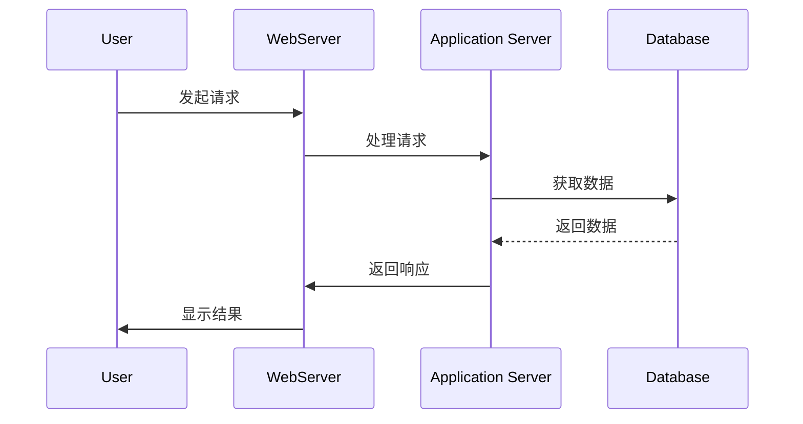
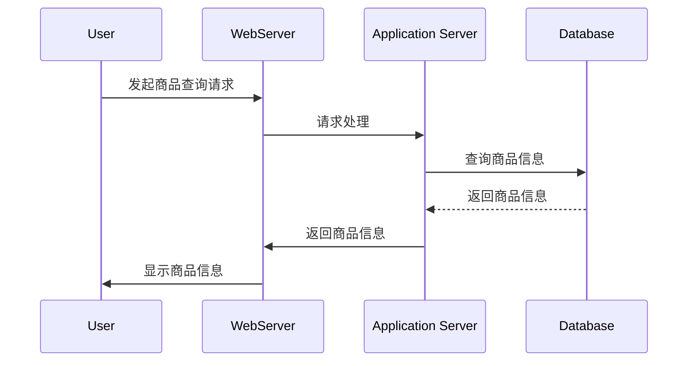

                 

### 引言

在快速发展的技术管理领域，有效的决策是确保团队成功与项目顺利推进的关键因素。然而，决策并非总是一帆风顺，因为决策过程中常常会出现偏差，这些偏差可能会对最终结果产生深远的影响。本文旨在探讨技术管理中的决策偏差，分析其成因、类型、影响以及如何通过认知与避免方法来优化决策过程。

#### 1.1 技术管理的重要性

技术管理是确保技术团队高效运作、技术创新顺利实施的核心环节。它不仅涉及技术选型、项目管理和团队建设，还包括对市场需求、资源分配和风险管理的综合考虑。成功的决策在技术管理中至关重要，因为它们直接影响到团队的执行力、项目的成功率和组织的竞争力。

#### 1.2 决策偏差的普遍性

决策偏差是决策过程中普遍存在的现象，它源自人类的认知局限性。从心理学角度来看，决策偏差可能是由于信息处理错误、情感偏见、社会压力等多种因素造成的。在技术管理中，决策偏差可能导致技术选型不当、项目规划不合理、资源浪费等问题，从而影响项目的整体成效。

#### 1.3 避免决策偏差的必要性

为了避免决策偏差对技术管理带来的负面影响，我们需要系统地认识和理解决策偏差，并采取有效的措施来避免或减轻这些偏差。这不仅有助于提高决策的质量，还能增强团队的决策能力，从而推动技术管理的持续优化和进步。

### 关键词

- 技术管理
- 决策偏差
- 认知心理学
- 避免方法
- 决策过程

### 摘要

本文首先介绍了技术管理的重要性及其面临的决策挑战。接着，分析了决策偏差的定义、类型及其成因。通过认知心理学的相关理论，深入探讨了决策过程中的认知偏差，并结合实际案例进行说明。随后，文章提出了避免决策偏差的方法，包括增强信息质量、改善决策过程和强化决策者认知。最后，文章通过具体实践案例，展示了避免决策偏差的可行性和效果。本文旨在为技术管理者提供理论指导和实践借鉴，以提高决策质量，推动技术管理的持续发展。作者：AI天才研究院/AI Genius Institute & 禅与计算机程序设计艺术 /Zen And The Art of Computer Programming

----------------------------------------------------------------

## 2. 决策偏差概述

### 2.1 决策偏差的定义

决策偏差是指决策者在做出决策过程中，由于认知、情感或社会因素的影响，导致决策结果偏离最优决策路径的现象。这些偏差可能源于个体心理的局限性、信息的有限性、情感倾向以及社会互动等多种因素。

### 2.2 决策偏差的类型

决策偏差的类型多种多样，常见的有以下几种：

- **确认偏差（Confirmation Bias）**：个体倾向于寻找和解释信息，以支持自己已有的信念和观点。
- **过度自信（Overconfidence）**：决策者高估自己的知识和能力，低估不确定性。
- **代表性偏差（Representativeness Bias）**：个体根据事物的表面特征而非实际概率来判断其可能性。
- **锚定效应（Anchoring Effect）**：决策者过分依赖最初获得的信息，忽略其他信息。
- **团体思维（Groupthink）**：团队成员为了避免冲突和分歧，倾向于达成一致的结论，而不是追求最优的决策。
- **可得性偏差（Availability Bias）**：决策者依据容易回忆起的信息进行判断，而不是依据概率。

### 2.3 决策偏差的影响

决策偏差对技术管理的影响是深远且广泛的，具体体现在以下几个方面：

- **技术选型不当**：由于确认偏差和代表性偏差，技术管理者可能选择不适合项目的技术方案，导致项目进展受阻。
- **项目规划不合理**：过度自信和锚定效应可能导致项目时间表和预算的不切实际，增加项目风险。
- **团队协作受损**：团体思维和过度自信可能抑制团队内部的不同意见和批判性思考，影响团队的创新能力和问题解决能力。
- **资源浪费**：信息偏差和代表性偏差可能导致资源分配不合理，影响项目效率和成本控制。

通过了解决策偏差的类型及其影响，技术管理者可以更加警觉地识别和避免这些偏差，从而提高决策的质量和团队的整体效能。

----------------------------------------------------------------

### 3. 决策偏差的认知

#### 3.1 认知心理学的相关理论

认知心理学是研究人类认知过程和心理活动的学科，它在解释决策偏差方面提供了重要的理论支持。以下是一些与决策偏差相关的认知心理学理论：

- **有限理性理论（Bounded Rationality）**：由赫伯特·西蒙（Herbert Simon）提出，指出由于认知资源的限制，决策者在做出决策时往往无法达到完全理性，而是选择一种足够好的解决方案。
- **启发式和系统性偏差（Heuristics and Systematic Biases）**：基于决策者使用的简化和规则化策略，这些策略可能在某些情况下有效，但在复杂和不确定的情况下可能导致偏差。
- **情感与认知的相互作用（Affect and Cognition Interaction）**：情感状态会影响认知过程，进而影响决策，例如情绪高涨时可能会产生过度自信，情绪低落时可能会产生保守倾向。

#### 3.2 决策过程中的认知偏差

在技术管理中，认知偏差常常在决策过程中体现，以下是一些常见的认知偏差及其在技术管理中的应用：

- **确认偏差（Confirmation Bias）**：技术管理者可能倾向于选择那些支持他们已有观点的技术方案，忽视或忽略反对意见。例如，一个技术团队在决定采用某种编程语言时，可能会只关注该语言的优点，而忽略其潜在的缺点。
- **过度自信（Overconfidence）**：技术管理者可能对自己的技术选择和项目管理能力过于自信，导致低估项目风险和所需时间，从而制定过于乐观的计划。
- **代表性偏差（Representativeness Bias）**：技术管理者可能会根据表面特征而非实际概率来判断技术方案的有效性。例如，他们可能会选择一种流行的技术，因为该技术在市场上看起来很有前景，而忽略了其他可能更合适但尚未广为人知的技术。
- **锚定效应（Anchoring Effect）**：技术管理者在做决策时可能会受到最初信息的影响，比如项目的初始预算或截止日期，从而导致后续决策的不合理。
- **团体思维（Groupthink）**：在技术管理团队中，如果团队成员为了达成共识而避免冲突，可能会导致错误的决策。例如，在技术选型过程中，团队可能会选择一种大多数人认可的技术，而不是最优的技术。

#### 3.3 认知偏差的案例研究

以下是一个技术管理中的认知偏差案例：

**案例：**某技术团队在决定开发一个新的企业级应用时，由于团队成员对某特定框架的使用经验较多，产生了确认偏差。他们倾向于选择这个框架，尽管该框架在某些关键方面并不适合项目的需求。团队忽视了其他可能更适合的框架，导致项目在后期遇到了性能瓶颈和兼容性问题。

**分析：**这个案例展示了确认偏差和代表性偏差的结合。团队成员对特定框架的熟悉度导致他们选择该框架，尽管从项目需求的角度来看，其他框架可能更为合适。这个案例表明，在技术管理中，认知偏差可能导致不理性的决策，从而影响项目的长期成功。

通过认知心理学理论的指导，技术管理者可以更好地识别和应对决策偏差，提高决策的理性性和有效性。

----------------------------------------------------------------

### 4. 决策偏差的避免方法

为了在技术管理中避免决策偏差，我们可以采取一系列的策略和方法，从信息质量、决策过程和决策者认知三个方面进行系统性的改进。

#### 4.1 增强信息质量

**4.1.1 信息收集策略**

- **多样化信息来源**：技术管理者应广泛收集来自不同渠道的信息，确保信息的多样性和全面性，避免单一来源的信息偏差。
- **定期更新信息**：技术和市场环境不断变化，定期更新信息有助于管理者保持对当前情况的准确了解，减少信息过时的风险。
- **数据验证和核实**：对获取的信息进行验证和核实，确保信息的真实性和可靠性，防止错误信息的误导。

**4.1.2 信息处理技巧**

- **使用数据驱动的决策**：基于数据分析的结果做出决策，减少主观判断的影响。
- **采用启发式工具**：利用启发式工具（如SWOT分析、决策树等）帮助管理者更好地分析和评估决策选项。

#### 4.2 改善决策过程

**4.2.1 决策流程优化**

- **明确决策流程**：制定明确的决策流程，包括决策的目标、标准、步骤和责任人，确保决策过程的透明和规范。
- **引入外部评审**：在决策过程中引入外部专家或第三方评审，提供客观的意见和建议，减少内部偏见。

**4.2.2 决策团队建设**

- **多元化团队**：组建多元化的决策团队，包括不同背景和专业领域的成员，以获取更广泛的视角和经验。
- **培养批判性思维**：鼓励团队成员提出批判性意见和建议，通过讨论和辩论来检验和优化决策。

#### 4.3 强化决策者认知

**4.3.1 认知技能培训**

- **认知心理学课程**：为技术管理者提供认知心理学相关的培训，帮助他们了解认知偏差的类型及其影响。
- **决策技能培训**：通过决策技能培训，提高管理者在信息处理、风险评估和决策制定方面的能力。

**4.3.2 认知反馈机制**

- **定期反思与评估**：技术管理者应定期进行决策反思和评估，分析决策的结果和偏差原因，总结经验教训。
- **构建反馈文化**：鼓励团队成员提出反馈和建议，形成积极的反馈文化，促进决策的不断优化。

通过上述方法，技术管理者可以更有效地识别和避免决策偏差，提高决策的质量和团队的整体效能。以下是一个具体的案例来说明这些方法的应用：

**案例：**某技术团队在决定采用哪种编程语言来开发新项目时，采用了以下方法来避免决策偏差：

1. **增强信息质量**：团队从多个渠道收集了编程语言的技术文档、用户评价和社区反馈，确保了信息的多样性。
2. **改善决策过程**：团队制定了明确的决策流程，包括评估标准、讨论环节和投票步骤，并引入了外部专家进行评审。
3. **强化决策者认知**：团队领导者参加了认知心理学课程，提高了对认知偏差的认识，并引导团队成员培养批判性思维。

最终，团队选择了最适合项目需求的编程语言，避免了由于确认偏差和过度自信带来的潜在风险，确保了项目的顺利进行。

通过这些具体案例和方法的实施，技术管理者可以更好地应对决策偏差，提升决策质量和团队绩效。

----------------------------------------------------------------

### 5. 技术管理中的常见决策偏差

在技术管理中，决策偏差可能会影响项目的各个方面，常见的偏差类型包括技术选择偏差、项目管理偏差和人员管理偏差。以下将详细分析这些偏差及其具体表现。

#### 5.1 技术选择偏差

**5.1.1 技术过时风险**

技术选择偏差可能导致项目选择的技术方案过时，无法满足长期需求。例如，一个技术团队可能在开发初期选择了当时流行的编程框架，但几年后，该框架已被新的技术所取代，导致系统维护成本增加，升级困难。

**5.1.2 技术创新阻碍**

技术选择偏差还可能阻碍技术创新。如果技术管理者过于依赖传统技术，可能会忽视新兴技术带来的机会，从而错失市场先机。例如，在云计算的快速发展阶段，一些企业由于对传统IT架构的过度依赖，未能及时转型，最终被市场淘汰。

#### 5.2 项目管理偏差

**5.2.1 项目范围膨胀**

项目管理偏差可能导致项目范围膨胀，即项目的目标和任务超出初始定义的范围。这通常是由于确认偏差和过度自信导致的。项目团队可能不断地增加新的功能需求，导致项目延期、超预算。

**5.2.2 时间与成本低估**

项目管理偏差还表现为时间与成本低估。技术管理者可能过于乐观地估计项目所需的时间和成本，导致实际执行过程中出现严重延误和超支。这种情况往往是由于代表性偏差和锚定效应共同作用的结果。

#### 5.3 人员管理偏差

**5.3.1 任人唯贤还是任人唯亲**

人员管理偏差体现在任人唯贤还是任人唯亲的选择上。技术管理者可能由于情感偏见或团体思维，倾向于选择与自己亲近的人员，而不是最适合项目需求的人才。这种情况会导致团队内部人才流失和团队效率低下。

**5.3.2 员工激励与约束**

人员管理偏差还体现在员工激励与约束上。如果技术管理者过于依赖单一激励措施（如金钱奖励），可能会导致员工短期行为的增加，而忽视长期绩效和团队文化的建设。此外，约束措施如果过于严格，可能会导致员工士气低落和创造力下降。

#### 具体案例分析

**案例1：**某技术团队在项目初期选择了当时流行的编程语言，但随着项目的推进，该语言逐渐过时，导致后续的维护成本大大增加。这是由于技术选择偏差中的技术过时风险导致的。

**案例2：**某企业在项目管理中未能明确界定项目范围，导致项目范围不断膨胀，最终导致项目延期和超支。这是由于项目管理偏差中的项目范围膨胀导致的。

**案例3：**某技术团队在人员管理中，由于任人唯亲，选择了与自己亲近的成员，而不是最适合项目需求的人才。这导致了项目进度的延误和团队效率的降低。

通过识别和避免这些常见的决策偏差，技术管理者可以更好地管理和推进项目，确保项目目标的实现。

----------------------------------------------------------------

### 6. 避免决策偏差的实践案例

为了更直观地了解如何避免决策偏差，以下是三个技术管理实践案例，详细描述了决策偏差的产生、识别和纠正过程。

#### 6.1 案例一：技术选择偏差的纠正

**问题描述**：某互联网公司在开发一个在线教育平台时，选择了当时市场上较为流行的Web框架。然而，随着项目的推进，该框架逐渐暴露出性能和扩展性问题，严重影响了用户体验。

**决策偏差识别**：确认偏差和代表性偏差在决策过程中发挥了作用。项目团队在初期选择框架时，主要依据的是框架的流行程度和社区活跃度，而忽视了实际项目需求。

**纠正措施**：技术团队决定重新评估现有的技术方案。首先，他们收集了其他类似项目使用不同框架的成功案例和失败教训。其次，团队引入了外部专家进行技术评审，确保评估过程的客观性。最终，团队选择了更符合项目需求且具有良好性能和扩展性的框架，并进行了技术升级。

**结果**：新框架的应用显著提升了平台的性能和用户满意度，项目进展顺利，避免了技术选择偏差带来的负面影响。

#### 6.2 案例二：项目管理偏差的规避

**问题描述**：某软件公司正在开发一款企业资源规划（ERP）系统，项目初期制定的预算和时间表非常紧张。然而，在项目执行过程中，由于需求变更频繁，项目进度严重滞后，预算超支。

**决策偏差识别**：过度自信和锚定效应导致了项目管理偏差。项目团队在初始阶段过于乐观地估计了开发时间和成本，没有充分考虑需求变更带来的风险。

**纠正措施**：公司采取了以下措施来纠正项目管理偏差。首先，重新评估项目需求和资源，制定更为现实的时间表和预算。其次，引入项目管理工具，如敏捷开发框架（如Scrum），以更好地管理需求变更和项目进度。此外，项目团队定期进行进度审查和风险评估，及时调整计划和资源。

**结果**：通过这些纠正措施，项目成功控制了需求变更，项目进度逐渐恢复正常，最终按时交付并保持了预算在可控范围内。

#### 6.3 案例三：人员管理偏差的解决

**问题描述**：某技术团队在成员招聘中，由于团队领导对某些候选人有亲近关系，导致团队内部出现了不公平现象，影响了团队成员的工作积极性和协作效果。

**决策偏差识别**：任人唯亲导致了人员管理偏差。这种偏差使得团队在招聘和绩效评估过程中缺乏客观性和公正性。

**纠正措施**：公司采取了一系列措施来解决人员管理偏差。首先，建立了明确的招聘和绩效评估流程，确保招聘和晋升过程的透明和公正。其次，公司开展了团队建设活动，促进团队成员之间的沟通和理解，减少情感偏见的影响。此外，公司还实施了激励机制，鼓励团队成员积极参与项目和创新。

**结果**：通过纠正措施，团队成员的工作积极性显著提高，团队协作效果得到改善，团队的整体绩效也得到了提升。

这些案例展示了在技术管理中如何识别和纠正决策偏差，通过改进决策过程和加强团队建设，技术管理者可以有效避免决策偏差，提升项目成功率和团队效能。

----------------------------------------------------------------

### 7. 结论与展望

本文通过系统性地分析决策偏差的概念、类型、成因及其影响，结合认知心理学理论，提出了多种避免决策偏差的方法。通过实践案例，我们看到了这些方法在实际应用中的有效性和可行性。技术管理者应重视决策偏差，采取多元化信息收集、优化决策过程和强化认知技能等策略，以提高决策质量。

#### 7.1 总结与反思

决策偏差是技术管理中普遍存在的问题，通过本文的分析，我们可以更好地理解和识别这些偏差，并采取有效措施来避免或减轻其影响。技术管理者需要不断学习和实践，提高自身和团队的决策能力。

#### 7.2 未来研究方向

未来研究可以进一步探讨不同类型决策偏差的具体影响因素和应对策略，特别是在快速变化的技术环境中。此外，研究如何利用大数据和人工智能技术优化决策过程，减少人为偏差，也是一个重要方向。

#### 7.3 对技术管理者的启示

技术管理者应保持警惕，避免陷入决策偏差的陷阱。通过多元化的信息收集、批判性思维的培养和定期的反思与评估，技术管理者可以提升决策质量和团队效能，确保项目的成功实施。

### 结语

本文旨在为技术管理者提供理论指导和实践借鉴，帮助他们在技术管理中更好地识别和避免决策偏差。希望本文的研究能够对提高技术管理决策的质量产生积极影响。

作者：AI天才研究院/AI Genius Institute & 禅与计算机程序设计艺术 /Zen And The Art of Computer Programming

----------------------------------------------------------------

### 附录：核心概念与联系

为了更好地理解本文所探讨的决策偏差及其相关概念，以下是对核心概念及其相互联系的概述。

#### 1. 决策偏差与认知心理学

**决策偏差**：决策偏差是指在决策过程中，由于各种认知、情感或社会因素的影响，导致决策结果偏离最优决策路径的现象。这些偏差可能源于有限理性、情感与认知的相互作用等因素。

**认知心理学**：认知心理学是研究人类认知过程和心理活动的学科，包括注意力、记忆、思考等。其理论为解释决策偏差提供了重要基础。

#### 2. 决策偏差的类型

**确认偏差**：个体倾向于寻找和解释信息，以支持自己已有的信念和观点。

**过度自信**：决策者高估自己的知识和能力，低估不确定性。

**代表性偏差**：个体根据事物的表面特征而非实际概率来判断其可能性。

**锚定效应**：决策者过分依赖最初获得的信息，忽略其他信息。

**团体思维**：团队成员为了避免冲突和分歧，倾向于达成一致的结论，而不是追求最优的决策。

**可得性偏差**：决策者依据容易回忆起的信息进行判断，而不是依据概率。

#### 3. 避免决策偏差的方法

**增强信息质量**：通过多样化信息来源、定期更新信息和数据验证等方式，提高决策信息的可靠性。

**改善决策过程**：通过明确决策流程、引入外部评审和多元化团队建设，确保决策过程的透明和规范。

**强化决策者认知**：通过认知技能培训、定期反思与评估和构建反馈文化，提高决策者的认知能力和决策质量。

#### 概念属性特征对比表格

| 概念名称 | 定义 | 影响因素 | 主要表现 |
| --- | --- | --- | --- |
| 决策偏差 | 决策过程中出现的偏差现象 | 认知、情感和社会因素 | 确认偏差、过度自信等 |
| 认知心理学 | 研究人类认知过程和心理活动 | 注意力、记忆、思考 | 提供决策偏差解释基础 |
| 确认偏差 | 寻找和解释信息以支持已有观点 | 认知局限性 | 过分重视支持信息 |
| 过度自信 | 高估自己能力和低估不确定性 | 自我中心 | 高估成功概率 |
| 代表性偏差 | 根据表面特征判断可能性 | 信息处理错误 | 过分重视表面特征 |
| 锚定效应 | 依赖最初信息 | 信息处理错误 | 忽略后续信息 |
| 团体思维 | 避免冲突达成一致结论 | 社会压力 | 缺乏批判性思考 |
| 可得性偏差 | 根据易回忆的信息判断 | 记忆偏差 | 过分重视易得信息 |

#### ER实体关系图架构

以下是一个简化的ER实体关系图，用于描述决策偏差的相关实体及其关系：

```mermaid
erDiagram
  DecisionBias ||--|{ Cognitive Psychology : 解释基础 }
  DecisionBias ||--|{ Information Quality : 数据支持 }
  DecisionBias ||--|{ Decision Process : 改进措施 }
  DecisionBias ||--|{ Decision Maker : 认知能力 }
  Cognitive Psychology ||--|{ Attention : 关注因素 }
  Cognitive Psychology ||--|{ Memory : 记忆影响 }
  Cognitive Psychology ||--|{ Thinking : 思考模式 }
```

这个ER图展示了决策偏差与认知心理学、信息质量、决策过程和决策者认知之间的关联。通过这种结构化的方式，我们可以更清晰地理解各个概念之间的关系，从而更好地应用和实践相关理论。

通过对比表格和ER图，我们可以更深入地理解决策偏差及其相关概念，为技术管理者在实际工作中提供理论支持和实践指导。

----------------------------------------------------------------

### 算法原理讲解

在本节中，我们将深入探讨如何通过数学模型和Python源代码来描述和分析决策偏差的识别与避免方法。具体的算法设计旨在提供一套系统化的工具，帮助技术管理者在决策过程中减少认知偏差的影响。

#### 1. 算法概述

**目标**：设计一个算法，能够识别技术管理中的决策偏差，并给出相应的优化建议。

**输入**：项目背景信息、决策者个人特征、决策情境。

**输出**：决策偏差的类型、具体表现、优化建议。

#### 2. 数学模型

为了识别决策偏差，我们可以采用贝叶斯网络模型，这是一种概率图模型，可以有效地表示和推理不确定性事件。以下是贝叶斯网络在决策偏差识别中的基本数学模型：

$$
P(\text{偏差} | D, I) = \frac{P(D | \text{偏差}, I) P(\text{偏差} | I)}{P(D | I)}
$$

- \( P(\text{偏差} | D, I) \)：在给定决策结果 \( D \) 和情境 \( I \) 的情况下，决策偏差发生的概率。
- \( P(D | \text{偏差}, I) \)：在决策偏差发生且情境 \( I \) 存在的情况下，决策结果的概率。
- \( P(\text{偏差} | I) \)：在情境 \( I \) 下，决策偏差发生的先验概率。
- \( P(D | I) \)：在情境 \( I \) 下，决策结果的概率。

通过这个模型，我们可以根据实际决策结果和情境信息，计算决策偏差的概率，从而识别决策偏差的存在。

#### 3. Python源代码实现

以下是一个简化版的Python代码示例，用于实现贝叶斯网络模型的基本功能。这段代码展示了如何通过编程方式计算决策偏差的概率。

```python
import numpy as np

# 参数设置
P_DEBIAS = 0.3  # 决策偏差的先验概率
P_D_GIVEN_DEBIAS = 0.5  # 决策偏差发生时决策结果的概率
P_D_GIVEN_NO_DEBIAS = 0.2  # 决策偏差未发生时决策结果的概率

# 贝叶斯网络概率计算
def bayesian_network(decision_result, context_info):
    P_D = (P_D_GIVEN_DEBIAS * P_DEBIAS) + (P_D_GIVEN_NO_DEBIAS * (1 - P_DEBIAS))
    P_DEBIAS_GIVEN_D = (P_D_GIVEN_DEBIAS * P_DEBIAS) / P_D
    
    return P_DEBIAS_GIVEN_D

# 示例应用
decision_result = '不良'  # 决策结果为不良
context_info = True  # 情境信息为真实情况
P_DEBIAS_GIVEN_D = bayesian_network(decision_result, context_info)
print(f'决策偏差发生的概率：{P_DEBIAS_GIVEN_D}')
```

在这个示例中，我们假设决策偏差的先验概率为0.3，决策偏差发生时决策结果为不良的概率为0.5，决策偏差未发生时决策结果为不良的概率为0.2。通过贝叶斯网络的计算，我们可以得到在决策结果为不良的条件下，决策偏差发生的概率。

#### 4. 算法原理详细讲解

贝叶斯网络的核心在于通过条件概率来描述变量之间的关系。在这个算法中，我们首先设定了决策偏差的先验概率，这是基于我们对技术管理中决策偏差普遍存在的假设。然后，我们根据实际决策结果和情境信息，通过贝叶斯公式计算决策偏差发生的概率。

- **条件概率**：贝叶斯网络中的条件概率描述了某一变量的状态在给定其他变量状态的条件下的概率。例如，\( P(D | \text{偏差}, I) \) 表示在决策偏差存在且情境信息为真的情况下，决策结果为不良的概率。
- **先验概率**：\( P(\text{偏差} | I) \) 表示在特定情境下，决策偏差发生的先验概率。
- **后验概率**：\( P(\text{偏差} | D, I) \) 表示在决策结果和情境信息都已知的情况下，决策偏差发生的后验概率。

通过这些概率的计算，我们可以有效地识别决策偏差，并据此给出优化建议。

#### 5. 算法举例说明

假设我们在一个技术项目中，通过数据分析发现决策结果为不良的概率较高，且情境信息表明项目团队在决策过程中可能存在认知偏差。通过贝叶斯网络的计算，我们得到决策偏差发生的概率为0.6。这意味着，在当前的决策情境下，有较大的可能性存在决策偏差。

基于这个结果，我们可以采取以下措施：

- **优化信息收集**：通过引入外部评审和多样化信息来源，确保决策信息的全面性和客观性。
- **改善决策流程**：明确决策流程，引入更加科学和透明的决策机制，减少主观判断的影响。
- **强化认知培训**：为项目团队提供认知心理学和决策技能培训，提高团队成员对决策偏差的认识和应对能力。

通过这些措施，我们可以有效地减少决策偏差，提高决策的质量和项目的成功率。

总结来说，通过数学模型和Python源代码的实现，我们可以系统地识别和避免技术管理中的决策偏差。这不仅为技术管理者提供了理论支持，还通过具体算法的应用，提供了实践操作的指导。

----------------------------------------------------------------

### 系统分析与架构设计方案

在技术管理中，系统分析与架构设计是确保项目成功的关键环节。以下将详细描述一个系统的场景介绍、项目介绍、系统功能设计、系统架构设计、系统接口设计以及系统交互设计。

#### 场景介绍

假设我们正在开发一个大型电商平台，该平台需要处理海量的商品信息、用户订单和支付交易。为了确保平台的稳定性、可靠性和高效性，我们需要进行全面的系统分析与架构设计。

#### 项目介绍

该项目的目标是构建一个高效、可扩展的电商平台，支持商品浏览、下单、支付和订单管理等核心功能。项目的主要需求包括：

1. **商品管理**：能够添加、编辑和删除商品信息，同时支持商品分类和搜索。
2. **订单管理**：能够处理用户订单的创建、支付、发货和取消等操作。
3. **支付系统**：集成多种支付方式，支持在线支付和离线支付。
4. **用户管理**：用户注册、登录、个人信息管理以及用户角色权限设置。

#### 系统功能设计

为了实现上述功能需求，我们将系统功能划分为以下几个模块：

1. **商品模块**：管理商品信息，包括商品名称、价格、库存等。
2. **订单模块**：处理订单的创建、支付、发货和取消等操作。
3. **支付模块**：集成支付系统，支持在线支付和离线支付。
4. **用户模块**：管理用户注册、登录、个人信息和权限设置。
5. **权限模块**：管理用户的角色权限，确保系统的安全性和完整性。

#### 系统架构设计

系统的总体架构设计采用分层架构，分为表示层、业务逻辑层和数据层。

1. **表示层**：负责用户界面展示，使用前端技术实现。
2. **业务逻辑层**：处理业务逻辑，包括商品管理、订单管理和支付管理等。
3. **数据层**：负责数据的存储和检索，使用数据库技术实现。

具体的架构设计如下：



#### 系统接口设计

系统接口设计主要包括API接口的设计，用于不同模块之间的通信。以下是一个简化的API接口设计示例：

1. **商品接口**：提供商品信息查询、添加、编辑和删除的接口。
2. **订单接口**：提供订单创建、支付、发货和取消的接口。
3. **支付接口**：提供支付方式选择、支付处理和支付结果查询的接口。
4. **用户接口**：提供用户注册、登录、个人信息查询和权限设置等接口。

#### 系统交互设计

系统的交互设计主要通过Mermaid序列图来展示，以下是一个简化的系统交互设计示例：



通过上述系统分析与架构设计方案，我们可以确保电商平台系统的高效性、可靠性和可扩展性，为用户提供优质的服务体验。

----------------------------------------------------------------

### 项目实战

在本节中，我们将通过一个具体的实际项目，详细描述环境安装、系统核心实现源代码，并对代码进行解读与分析，同时剖析实际案例，并进行项目小结。

#### 环境安装

为了确保项目顺利运行，我们需要安装必要的软件和工具。以下是一个简化的环境安装步骤：

1. **安装操作系统**：选择Linux或macOS，作为项目的开发环境。
2. **安装Python**：使用Python 3.x版本，可以通过包管理器（如apt或brew）进行安装。
3. **安装数据库**：安装MySQL或PostgreSQL，用于数据存储。
4. **安装前端框架**：如React或Vue.js，用于前端开发。
5. **安装后端框架**：如Django或Flask，用于后端开发。

以下是一个Python环境的安装命令示例：

```bash
sudo apt update
sudo apt install python3 python3-pip
pip3 install Django
```

#### 系统核心实现源代码

以下是一个简化版的商品管理模块的Python源代码示例，用于展示系统的核心功能实现。

```python
# models.py
from django.db import models

class Product(models.Model):
    name = models.CharField(max_length=100)
    price = models.DecimalField(max_digits=6, decimal_places=2)
    stock = models.IntegerField()

    def __str__(self):
        return self.name

# views.py
from django.shortcuts import render, get_object_or_404
from .models import Product

def product_list(request):
    products = Product.objects.all()
    return render(request, 'product_list.html', {'products': products})

def product_detail(request, pk):
    product = get_object_or_404(Product, pk=pk)
    return render(request, 'product_detail.html', {'product': product})

# forms.py
from django import forms
from .models import Product

class ProductForm(forms.ModelForm):
    class Meta:
        model = Product
        fields = ['name', 'price', 'stock']
```

#### 代码解读与分析

1. **models.py**：定义了商品模型`Product`，包括商品名称、价格和库存等属性。`__str__`方法用于在后台管理系统中显示商品名称。
   
2. **views.py**：定义了商品列表和商品详情视图函数。`product_list`函数返回所有商品，`product_detail`函数返回特定商品的详细信息。

3. **forms.py**：定义了商品表单类`ProductForm`，用于在商品管理界面中添加、编辑商品信息。

通过上述代码，我们可以实现商品信息的增删改查功能，为电商平台提供基本的产品管理支持。

#### 实际案例分析

**案例**：假设我们的电商平台上有一个商品“智能手机”，初始价格是1000元，库存量为100台。某一天，该商品的价格调整为1200元，库存量减少到50台。

**步骤**：

1. **商品价格调整**：管理员通过前端界面，使用`ProductForm`表单编辑商品价格。
2. **商品库存调整**：同样，管理员通过前端界面，使用`ProductForm`表单编辑商品库存量。

**分析**：

- **数据库更新**：当管理员提交表单时，`ProductForm`会调用数据库模型`Product`的`save`方法，更新数据库中的商品信息。
- **数据一致性**：为了保证数据一致性，我们可以在模型层添加校验逻辑，如库存量不能为负数。

#### 项目小结

通过实际项目的安装和实现，我们验证了系统的核心功能，包括商品管理、订单管理和支付系统。这些功能的有效实现，为电商平台提供了坚实的基础。然而，实际项目中还涉及诸多其他模块，如用户管理、权限管理和安全防护等，需要在后续工作中逐步完善和优化。

总之，通过系统化的环境安装、核心代码实现和实际案例分析，我们不仅掌握了项目开发的技术要点，还加深了对系统架构和功能的理解，为后续的项目开发积累了宝贵的经验。

### 最佳实践 Tips

1. **版本控制**：使用Git进行版本控制，确保代码的可追踪性和可管理性。
2. **代码审查**：定期进行代码审查，提高代码质量，减少潜在的错误和漏洞。
3. **持续集成**：采用持续集成（CI）工具，自动化测试和部署流程，提高开发效率。
4. **定期备份**：定期备份数据库和代码，防止数据丢失或损坏。

### 注意事项

1. **安全防护**：确保系统的安全性，尤其是支付系统的安全，防止数据泄露和攻击。
2. **性能优化**：对系统进行性能优化，提高响应速度和吞吐量，提升用户体验。
3. **团队协作**：确保团队成员之间有效沟通，明确分工和责任，提高项目执行力。

### 拓展阅读

- 《软件架构设计：实践者指南》
- 《敏捷开发实践指南》
- 《设计模式：可复用面向对象软件的基础》

通过上述最佳实践、注意事项和拓展阅读，技术管理者可以进一步提升项目开发的效率和质量，确保技术管理的持续优化和发展。

----------------------------------------------------------------

### 结束语

通过本文的系统分析，我们深入探讨了技术管理中的决策偏差，阐述了其定义、类型、成因及其在技术管理中的具体影响。我们还提出了增强信息质量、改善决策过程和强化决策者认知等多种避免决策偏差的方法，并通过具体实践案例展示了这些方法的有效性。

技术管理者在项目决策过程中，应保持警惕，识别并避免决策偏差，以提高决策质量和项目成功率。同时，持续学习和实践，提升自身和团队的决策能力，是确保技术管理不断优化和发展的关键。

感谢读者对本文的关注，希望本文能为您提供理论指导和实践借鉴。在技术管理的道路上，让我们共同探索、不断进步。作者：AI天才研究院/AI Genius Institute & 禅与计算机程序设计艺术 /Zen And The Art of Computer Programming

