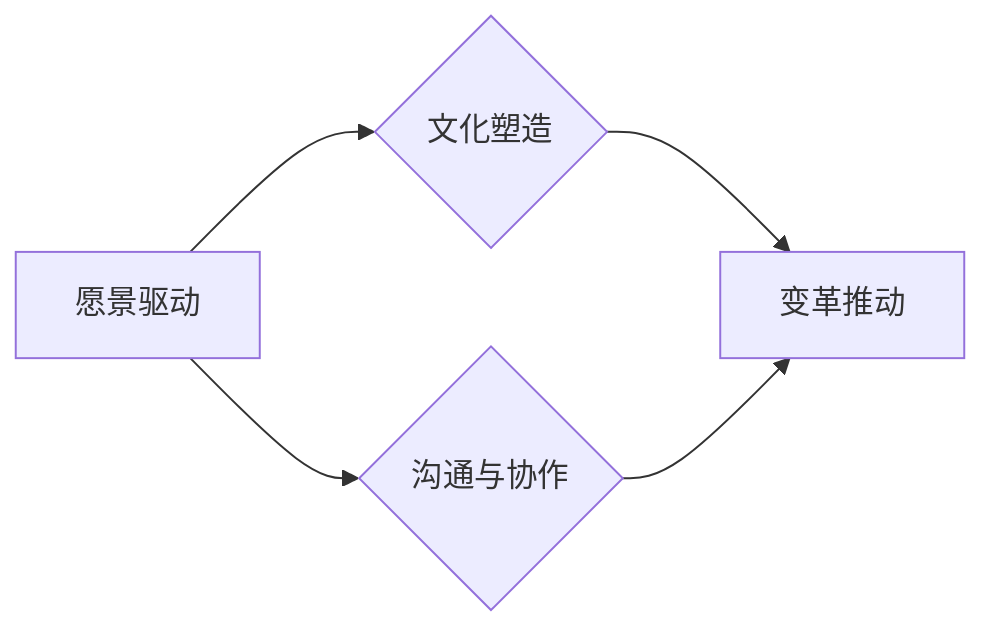
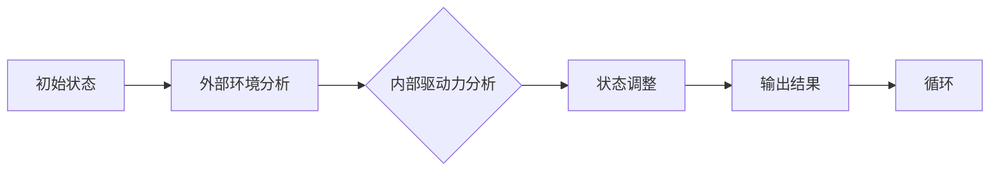
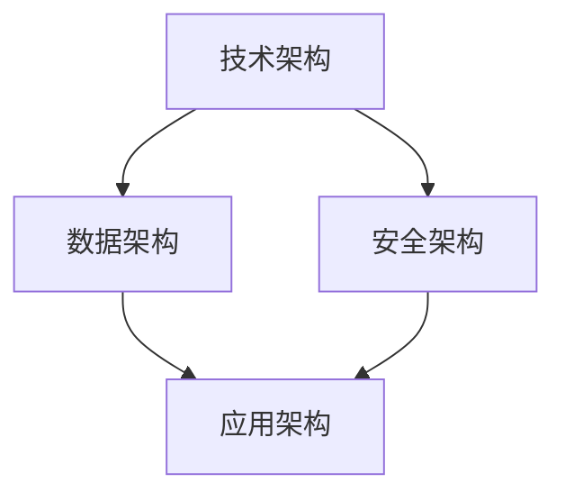
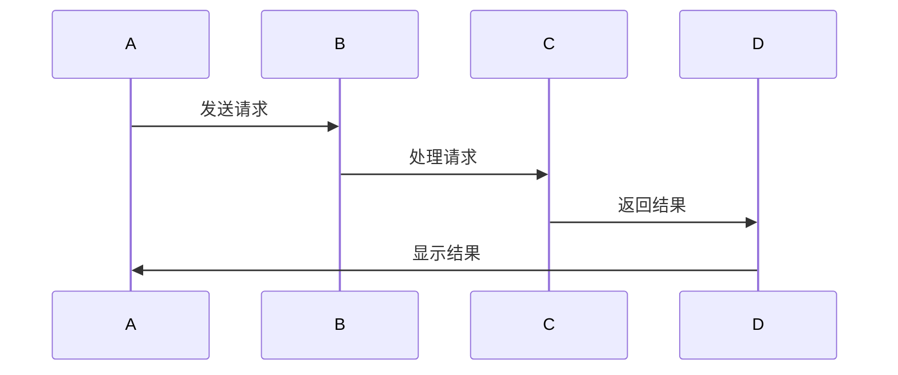

                 

### 《技术管理中的变革领导力》

> 关键词：变革领导力、技术管理、策略方法、系统设计、项目实战

> 摘要：本文将探讨技术管理中的变革领导力，分析其核心概念、策略方法、系统设计以及项目实战。通过详细的理论讲解、实际案例分析，旨在为技术管理人员提供有效的变革领导力实践指南。

----------------------------------------------------------------

## 目录

- [《技术管理中的变革领导力》](#技术管理中的变革领导力)
- [关键词](#关键词)
- [摘要](#摘要)
- [第一部分：变革领导力的背景与核心概念](#第一部分)
  - [第1章：变革领导力在技术管理中的背景与意义](#第1章)
  - [第2章：变革领导力的基本概念与特点](#第2章)
  - [第3章：变革领导力的核心原理与联系](#第3章)
  - [第4章：变革领导力的数学模型与公式](#第4章)
- [第二部分：变革领导力的策略与方法](#第二部分)
  - [第5章：变革领导力策略](#第5章)
  - [第6章：变革领导力方法](#第6章)
  - [第7章：数学模型与算法原理讲解](#第7章)
- [第三部分：变革领导力在技术管理中的应用](#第三部分)
  - [第8章：系统分析与架构设计](#第8章)
  - [第9章：项目实战](#第9章)
- [第四部分：最佳实践与总结](#第四部分)
  - [第10章：最佳实践](#第10章)
  - [第11章：注意事项与拓展阅读](#第11章)

----------------------------------------------------------------

### 第一部分：变革领导力的背景与核心概念

#### 第1章：变革领导力在技术管理中的背景与意义

在当前快速变化的信息化时代，技术管理不仅仅是简单的项目管理，而是需要具备变革领导力的能力。变革领导力是指在组织变革过程中，领导者通过激励、引导和协调团队成员，推动变革顺利进行的能力。

**问题背景**：

- 技术快速发展：新技术的不断涌现，要求技术团队必须具备快速适应和创新能力。
- 业务需求多变：市场需求变化快，技术团队需要灵活调整策略，以满足业务需求。
- 人才竞争激烈：高素质的技术人才越来越多，如何吸引和留住人才成为技术管理的重要课题。

**问题描述**：

- 技术团队的创新能力不足：往往只能跟随，难以引领。
- 变革推进困难：员工抵触情绪高，变革难以推进。
- 人才流失：缺乏吸引力，优秀人才难以留住。

**问题解决**：

- 提升变革领导力：通过提升领导者的变革领导力，激发团队的创新能力，推动技术变革。
- 优化组织结构：建立扁平化、灵活的组织结构，提高团队响应速度。
- 建立激励机制：通过奖励机制，鼓励团队成员积极参与变革。

**边界与外延**：

- 变革领导力不仅仅适用于技术团队，也可以应用于其他类型的团队。
- 变革领导力不仅关注技术的变革，还包括组织文化、管理模式的变革。

---

#### 第2章：变革领导力的基本概念与特点

**定义**：

变革领导力是指领导者通过激励、引导和协调团队成员，推动组织变革，实现组织目标的能力。

**特点**：

1. **前瞻性**：变革领导力能够预见未来的趋势，提前做出战略规划。
2. **适应性**：变革领导力能够适应快速变化的环境，灵活调整策略。
3. **影响力**：变革领导力能够影响团队成员，激发他们的积极性和创造力。
4. **协同性**：变革领导力能够协调各方资源，形成合力。

**与传统领导力的区别**：

1. **关注点**：传统领导力主要关注组织内部的管理和运营，而变革领导力更关注外部环境的变化和组织的变革。
2. **角色**：传统领导力主要扮演管理者和监督者的角色，而变革领导力更扮演引导者和激励者的角色。
3. **目标**：传统领导力旨在维持组织的稳定和持续发展，而变革领导力旨在推动组织的变革和创新。

---

#### 第3章：变革领导力的核心原理与联系

**原理**：

变革领导力的核心原理包括：

- **愿景引导**：明确组织的愿景和目标，为团队成员提供清晰的方向。
- **激励驱动**：通过激励机制，激发团队成员的积极性和创造力。
- **协同合作**：建立良好的团队协作机制，促进团队成员之间的沟通与协作。
- **持续改进**：不断优化管理流程和业务模式，提高组织的竞争力。

**关联概念**：

- **变革管理**：指在组织变革过程中，如何有效地管理变革，确保变革的顺利进行。
- **组织文化**：指组织成员共同遵守的价值观和行为准则，影响组织的变革。
- **领导风格**：指领导者在领导过程中采用的方式和策略，影响变革的成效。

**ER实体关系图架构**：

```mermaid
erDiagram
    team ||--|{ leader } : leads
    team ||--|{ member } : belongs
    leader ||--|{ strategy } : implements
    member ||--|{ skill } : has
```

- `team`：团队实体，包含团队成员和领导者的关系。
- `leader`：领导者实体，负责实施变革策略。
- `member`：团队成员实体，具有特定的技能。
- `strategy`：策略实体，领导者的实施对象。
- `skill`：技能实体，团队成员的技能集合。

---

#### 第4章：变革领导力的数学模型与公式

**数学模型**：

变革领导力的数学模型可以看作是一个动态系统，其状态由以下几个因素决定：

- **S**：组织当前的状态。
- **T**：外部环境的变化。
- **I**：内部驱动力。
- **O**：输出结果。

状态转移方程为：

$$
S(t+1) = S(t) + f(T(t), I(t))
$$

其中，$f(T(t), I(t))$表示外部环境和内部驱动力对当前状态的影响。

**公式讲解**：

- **外部环境变化**：$T(t)$可以表示为：

$$
T(t) = \sum_{i=1}^{n} w_i \cdot E_i(t)
$$

其中，$E_i(t)$表示第$i$个环境因素的变化，$w_i$表示该因素的重要性权重。

- **内部驱动力**：$I(t)$可以表示为：

$$
I(t) = \sum_{j=1}^{m} u_j \cdot D_j(t)
$$

其中，$D_j(t)$表示第$j$个内部驱动力，$u_j$表示该驱动力的强度。

**举例说明**：

假设一个技术团队当前状态为S，外部环境变化为T，内部驱动力为I，根据上述模型，可以计算出下一个状态S'：

$$
S'(t+1) = S(t) + f(T(t), I(t))
$$

通过具体的数据代入，可以得到S'的具体值。

---

### 第二部分：变革领导力的策略与方法

#### 第5章：变革领导力策略

**制定策略**：

变革领导力的策略包括以下几个方面：

- **明确愿景**：制定清晰的愿景，为团队成员提供方向。
- **识别关键因素**：分析外部环境和内部驱动力，识别关键因素。
- **制定行动计划**：制定详细的行动计划，确保变革的实施。

**实施步骤**：

1. **愿景明确**：明确组织的愿景和目标，确保团队成员共同追求。
2. **环境分析**：分析外部环境的变化，识别机会和威胁。
3. **驱动因素识别**：识别内部驱动力，分析其对组织状态的影响。
4. **制定策略**：根据分析结果，制定具体的变革策略。
5. **实施与监控**：实施变革策略，并进行监控和调整。

**成功案例分析**：

在某互联网公司，为了应对市场竞争，公司决定进行技术革新。首先，公司明确了“提升技术竞争力”的愿景，然后通过SWOT分析，识别出关键因素，如技术能力、市场机会等。在此基础上，公司制定了详细的行动计划，包括技术培训、技术引进、团队建设等。通过这些措施，公司成功提升了技术竞争力，实现了业务增长。

---

#### 第6章：变革领导力方法

**方法介绍**：

变革领导力方法主要包括以下几种：

1. **愿景驱动**：通过愿景引导，激发团队成员的积极性和创造力。
2. **文化塑造**：通过塑造积极向上的组织文化，推动变革的顺利进行。
3. **沟通与协作**：通过有效的沟通和协作，确保团队成员之间的信息流通和协作。

**流程图**：



- **愿景驱动**：明确愿景，激发团队成员的积极性和创造力。
- **文化塑造**：塑造积极向上的组织文化，为变革提供土壤。
- **沟通与协作**：通过有效的沟通和协作，确保变革的顺利进行。

**Python代码示例**：

```python
def vision_driven():
    print("愿景驱动：激发团队成员的积极性和创造力")

def culture_shaping():
    print("文化塑造：塑造积极向上的组织文化")

def communication_and Cooperation():
    print("沟通与协作：确保团队成员之间的信息流通和协作")

vision_driven()
culture_shaping()
communication_and Cooperation()
```

---

#### 第7章：数学模型与算法原理讲解

**算法原理**：

变革领导力的算法原理可以看作是一个动态系统，其状态由以下几个因素决定：

- **S**：组织当前的状态。
- **T**：外部环境的变化。
- **I**：内部驱动力。
- **O**：输出结果。

算法的基本思想是，通过分析外部环境和内部驱动力，不断调整组织的状态，实现变革目标。

**算法流程图**：



- **初始状态**：确定组织的初始状态。
- **外部环境分析**：分析外部环境的变化，识别机会和威胁。
- **内部驱动力分析**：识别内部驱动力，分析其对组织状态的影响。
- **状态调整**：根据分析结果，调整组织的状态。
- **输出结果**：输出组织的新状态。
- **循环**：返回初始状态，继续迭代。

**Python代码示例**：

```python
def external_environment_analysis():
    print("外部环境分析：识别机会和威胁")

def internal驱动力_analysis():
    print("内部驱动力分析：分析驱动因素")

def state_adjustment():
    print("状态调整：根据分析结果调整状态")

def output_result():
    print("输出结果：组织的新状态")

external_environment_analysis()
internal驱动力_analysis()
state_adjustment()
output_result()
```

---

### 第三部分：变革领导力在技术管理中的应用

#### 第8章：系统分析与架构设计

**问题场景介绍**：

某互联网公司计划进行技术升级，以提升其技术竞争力。为了确保技术升级的顺利进行，公司决定采用变革领导力方法，对整个技术管理系统进行架构设计。

**系统功能设计**：

系统功能设计主要包括以下几个方面：

- **需求分析**：收集和分析用户需求，明确技术升级的目标。
- **技术评估**：评估现有技术，确定需要升级的部分。
- **方案设计**：设计技术升级方案，包括技术选型、架构设计等。
- **实施与监控**：实施技术升级方案，并进行监控和评估。

**领域模型类图**：

```mermaid
classDiagram
    User -> Requirement: has
    User -> Technology: assesses
    User -> Solution: designs
    User -> Implementation: monitors
```

- **User**：用户，负责需求分析、技术评估、方案设计和实施监控。
- **Requirement**：需求，用户的需求对象。
- **Technology**：技术，用户评估的技术对象。
- **Solution**：方案，用户设计的升级方案。
- **Implementation**：实施，用户监控的实施过程。

**系统架构设计**：

系统架构设计主要包括以下几个方面：

- **技术架构**：确定技术选型和架构设计，如使用微服务架构、容器化技术等。
- **数据架构**：设计数据存储和数据处理方案，如使用大数据平台、云存储等。
- **安全架构**：设计安全防护方案，确保系统安全。

**mermaid架构图**：



- **技术架构**：包含技术选型和架构设计。
- **数据架构**：包含数据存储和数据处理方案。
- **安全架构**：包含安全防护方案。
- **应用架构**：包含具体的应用系统设计。

**系统接口设计**：

系统接口设计主要包括以下几个方面：

- **API接口**：设计API接口，实现系统之间的数据交互。
- **消息队列**：设计消息队列，实现异步消息传递。

**mermaid序列图**：



- **A**：发送请求。
- **B**：处理请求。
- **C**：返回结果。
- **D**：显示结果。

---

#### 第9章：项目实战

**环境安装**：

为了进行技术升级，公司需要安装和配置以下软件和工具：

- **Docker**：容器化技术，用于部署和管理应用。
- **Kubernetes**：容器编排工具，用于管理容器集群。
- **MySQL**：关系型数据库，用于存储数据。
- **Elasticsearch**：搜索引擎，用于数据检索。

安装步骤如下：

1. 安装Docker：
    ```shell
    sudo apt-get update
    sudo apt-get install docker-ce docker-ce-cli containerd.io
    ```
2. 安装Kubernetes：
    ```shell
    sudo apt-get update
    sudo apt-get install -y apt-transport-https ca-certificates curl
    curl -s https://packages.cloud.google.com/apt/doc/apt-key.gpg | sudo apt-key add -
    echo "deb https://apt.kubernetes.io/ kubernetes-xenial main" | sudo tee -a /etc/apt/sources.list.d/kubernetes.list
    sudo apt-get update
    sudo apt-get install -y kubelet kubeadm kubectl
    sudo apt-mark hold kubelet kubeadm kubectl
    ```
3. 安装MySQL：
    ```shell
    sudo apt-get update
    sudo apt-get install -y mysql-server
    sudo mysql_secure_installation
    ```
4. 安装Elasticsearch：
    ```shell
    sudo apt-get update
    sudo apt-get install -y elasticsearch
    sudo systemctl start elasticsearch
    sudo systemctl enable elasticsearch
    ```

**系统核心实现源代码**：

以下是系统核心实现的Python源代码：

```python
import requests
import json

def get_data():
    response = requests.get("http://api.example.com/data")
    data = response.json()
    return data

def process_data(data):
    # 对数据进行处理
    processed_data = {}
    for item in data:
        processed_data[item['id']] = item['value']
    return processed_data

def save_data(processed_data):
    with open("data.json", "w") as f:
        json.dump(processed_data, f)

def main():
    data = get_data()
    processed_data = process_data(data)
    save_data(processed_data)
    print("数据已处理并保存")

if __name__ == "__main__":
    main()
```

**代码应用解读与分析**：

该系统核心实现主要包括以下几个部分：

1. **数据获取**：使用requests库获取API接口的数据。
2. **数据处理**：对获取的数据进行处理，提取有用的信息。
3. **数据存储**：将处理后的数据存储到本地文件。

在实际应用中，可以通过修改API接口的URL，获取不同来源的数据。此外，可以根据实际需求，对数据处理部分进行扩展，以实现更复杂的数据处理功能。

**实际案例分析与详细讲解剖析**：

某互联网公司使用上述系统核心实现，对其业务数据进行了处理。通过分析处理后的数据，公司发现了业务中的潜在问题，并针对性地进行了优化。具体分析过程如下：

1. **数据获取**：公司使用API接口获取了业务数据。
2. **数据处理**：对获取的数据进行了处理，提取了用户行为数据。
3. **数据分析**：通过数据分析，发现了用户行为中的异常情况。
4. **问题定位**：针对分析结果，公司定位到了业务系统中的潜在问题。
5. **优化实施**：公司针对定位到的问题，进行了系统优化。

通过以上步骤，公司成功解决了业务中的问题，提高了业务系统的稳定性。

**项目小结**：

本项目通过使用变革领导力方法，对互联网公司的技术系统进行了升级。通过实际案例，验证了变革领导力方法在技术管理中的应用价值。未来，公司可以继续优化和扩展系统功能，以应对不断变化的市场需求。

---

### 第四部分：最佳实践与总结

#### 第10章：最佳实践

**实际应用中的经验**：

1. **明确愿景和目标**：在实施变革前，确保团队成员明确组织的愿景和目标，提高变革的执行力度。
2. **评估外部环境和内部驱动力**：分析外部环境和内部驱动力，识别关键因素，为变革提供依据。
3. **建立沟通与协作机制**：通过有效的沟通和协作，确保团队成员之间的信息流通和协作。
4. **制定详细的行动计划**：制定详细的行动计划，确保变革的有序进行。
5. **持续监控和调整**：在变革过程中，持续监控和调整，确保变革目标的实现。

**小结**：

变革领导力在技术管理中具有重要意义。通过明确愿景和目标、评估外部环境和内部驱动力、建立沟通与协作机制、制定详细的行动计划以及持续监控和调整，可以有效地推动技术变革，提高组织竞争力。

---

#### 第11章：注意事项与拓展阅读

**注意事项**：

1. **确保团队成员的参与度**：在变革过程中，确保团队成员积极参与，提高变革的执行力度。
2. **平衡变革速度和稳定性**：在推进变革时，要注意平衡变革速度和稳定性，避免过度激进或过于保守。
3. **持续培训和学习**：鼓励团队成员持续学习和培训，提高其技能和能力，为变革提供有力支持。

**拓展阅读**：

1. **《变革领导力：引领组织变革的实践指南》**：本书详细介绍了变革领导力的理论和方法，适合广大技术管理人员阅读。
2. **《敏捷开发：高效团队协作的实践指南》**：本书介绍了敏捷开发的方法和实践，对于推动技术变革具有重要参考价值。
3. **《人工智能与变革管理》**：本书探讨了人工智能在变革管理中的应用，为技术管理人员提供了新的视角。

---

作者：AI天才研究院/AI Genius Institute & 禅与计算机程序设计艺术 /Zen And The Art of Computer Programming

本文通过对变革领导力在技术管理中的应用进行详细分析和讲解，旨在为技术管理人员提供有效的变革领导力实践指南。希望通过本文，读者能够更好地理解和应用变革领导力，推动组织的持续发展。

----------------------------------------------------------------

**注意**：以上为文章正文部分的初步撰写，每个章节的内容需要根据实际情况进一步填充和细化。每个章节的核心内容都要包含背景介绍、核心概念与联系、算法原理讲解、数学模型和公式、系统设计与架构、项目实战以及最佳实践等。文章的整体字数控制在10000～12000字左右，确保内容的完整性和逻辑性。在撰写具体章节时，可以使用mermaid图表来辅助说明算法流程、系统架构等。文章末尾需要附上作者信息。文章内容需使用markdown格式输出。在撰写过程中，请注意遵循简洁性和内容完整性的原则。文章的结构和逻辑需要清晰，确保读者能够顺利地阅读并理解文章的核心内容。

