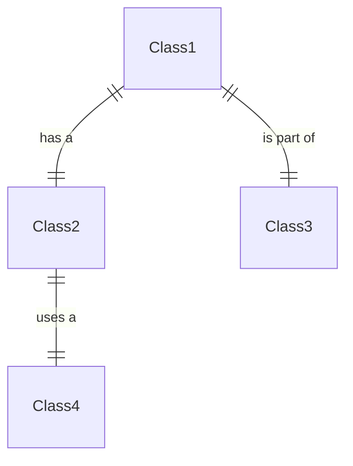

                 

# 技术管理中的常见陷阱及规避方法

## 关键词

技术管理，陷阱，规避，团队管理，风险管理

## 摘要

本文旨在探讨技术管理中常见的陷阱及其规避方法。通过深入分析技术管理中的核心问题，如对技术趋势的过度追逐、忽视团队成员技能发展、缺乏有效的技术风险管理以及过度依赖外部技术支持等，本文提出了一系列有效的解决方案，旨在提高技术管理效率、保障项目成功和提升团队士气。

## 第一部分：背景介绍

### 1.1 问题背景

#### 1.1.1 技术管理中的常见陷阱

在技术管理中，常见陷阱主要包括以下几个方面：

1. **对技术趋势的过度追逐**：企业往往容易在技术趋势的驱动下盲目跟风，导致资源浪费和项目延误。
2. **忽视团队成员的技能发展**：技术管理中，团队技能的提升常常被忽视，这会影响团队的效率和创新能力。
3. **缺乏有效的技术风险管理**：技术风险管理是确保项目顺利实施的关键，但往往被忽略，导致项目失败的风险增加。
4. **过度依赖外部技术支持**：企业过度依赖外部技术支持，可能会失去自主研发的能力。

#### 1.1.2 问题描述

技术管理中的这些常见陷阱对企业的研发效率、产品质量、项目进度和团队士气产生了负面影响。为了解决这些问题，需要采取有效的措施，规避这些陷阱。

#### 1.1.3 问题解决

为了规避技术管理中的常见陷阱，我们可以采取以下措施：

1. **制定科学合理的技术战略**：避免盲目跟风，确保技术发展的方向与企业战略一致。
2. **加强团队建设**：关注团队成员的技能发展，提升团队协作效率。
3. **构建完善的技术风险管理机制**：提前识别和应对潜在风险，确保项目顺利实施。
4. **培养内部技术能力**：减少对外部资源的依赖，提升企业的自主研发能力。

#### 1.1.4 边界与外延

技术管理中的常见陷阱不仅存在于软件开发领域，还广泛应用于硬件工程、系统集成、运维管理等各个方面。

### 1.2 核心概念

#### 1.2.1 技术管理

技术管理是指通过规划、组织、协调、控制等活动，有效利用技术资源，实现企业战略目标的过程。它包括技术战略、团队管理和技术风险管理等多个方面。

#### 1.2.2 陷阱

陷阱是指可能导致失败或错误决策的潜在风险。在技术管理中，陷阱通常表现为对技术趋势的过度追逐、忽视团队技能发展、缺乏风险管理等。

#### 1.2.3 规避方法

规避方法是指采取有效措施，防止陷入陷阱的策略。这包括制定科学合理的技术战略、加强团队建设、完善风险管理机制和培养内部技术能力等。

### 1.3 概念属性特征对比表格

| 概念    | 定义                                                         | 属性特征对比                       |
| ------- | ------------------------------------------------------------ | ---------------------------------- |
| 技术管理 | 通过规划、组织、协调、控制等活动，有效利用技术资源，实现企业战略目标的过程 | 目标导向、资源优化、风险控制等     |
| 陷阱    | 可能导致失败或错误决策的潜在风险                             | 潜在性、危害性、预防性等           |
| 规避方法 | 采取有效措施，防止陷入陷阱的策略                             | 预防措施、应对策略、改进措施等     |

### 1.4 ER实体关系图架构

## 第二部分：核心概念与联系

### 2.1 技术管理的核心概念

#### 2.1.1 技术战略

技术战略是企业为应对市场变化和技术发展趋势而制定的长期规划。其核心内容包括：

- **技术愿景**：明确企业未来技术发展的方向和目标。
- **技术路线**：制定实现技术愿景的具体路径和步骤。
- **技术布局**：根据技术路线，合理分配资源，构建技术生态系统。

#### 2.1.2 技术团队管理

技术团队管理是指通过合理配置资源、优化团队结构、提升团队协作效率，从而实现企业技术目标的过程。其核心内容包括：

- **团队组织结构**：根据企业规模和业务需求，设计合适的团队组织结构。
- **技能提升**：关注团队成员的技能发展，提供培训和学习机会。
- **团队协作**：建立有效的沟通和协作机制，提高团队整体效率。

#### 2.1.3 技术风险管理

技术风险管理是指通过识别、评估、监控和应对技术风险，确保项目顺利实施的过程。其核心内容包括：

- **风险识别**：识别项目实施过程中可能面临的技术风险。
- **风险评估**：评估技术风险的严重程度和发生概率。
- **风险应对**：制定和实施风险应对策略，降低风险发生概率和影响。

### 2.2 陷阱的属性特征对比表格

| 属性特征 | 定义                                                         | 对比                    |
| -------- | ------------------------------------------------------------ | ----------------------
| 潜在性   | 陷阱具有潜在的负面影响，可能影响项目的成功                   | 风险性质、不确定性等     |
| 危害性   | 陷阱可能对项目造成严重损害，包括时间延误、资源浪费等         | 影响范围、严重程度等     |
| 预防性   | 规避方法旨在预防陷阱的发生，包括制定策略、改进流程等         | 预防措施、应对策略等     |
| 敏感性   | 技术管理的不同环节可能对陷阱的敏感性不同，需要针对性应对     | 环境适应性、灵活性等     |

## 第三部分：常见陷阱分析及规避方法

### 3.1 对技术趋势的过度追逐

#### 3.1.1 陷阱分析

对技术趋势的过度追逐可能导致以下问题：

- **资源浪费**：盲目跟风新技术，可能导致大量资源被浪费在未经验证的技术上。
- **项目延误**：新技术的引入可能需要额外的时间和资源进行适应和调整，导致项目进度延误。
- **团队士气下降**：频繁的技术变更可能导致团队失去方向感和信心。

#### 3.1.2 规避方法

为了避免对技术趋势的过度追逐，可以采取以下措施：

- **评估技术成熟度**：在引入新技术前，评估其成熟度和适用性，确保其能够满足项目需求。
- **制定技术路线图**：明确企业技术发展的方向和阶段，避免盲目跟风。
- **建立技术评估委员会**：成立专门的技术评估委员会，对新技术进行深入研究和评估。

### 3.2 忽视团队成员的技能发展

#### 3.2.1 陷阱分析

忽视团队成员的技能发展可能导致以下问题：

- **团队效率低下**：团队成员技能水平不均，可能导致团队整体效率低下。
- **创新能力不足**：缺乏技能提升，团队成员可能无法提出创新的解决方案。
- **团队士气下降**：长期忽视技能发展，可能导致团队成员士气下降，影响团队合作。

#### 3.2.2 规避方法

为了规避忽视团队成员技能发展的问题，可以采取以下措施：

- **定期技能评估**：定期对团队成员进行技能评估，发现技能短板，制定提升计划。
- **提供培训和学习机会**：为团队成员提供专业的培训和学习机会，提升其技能水平。
- **建立知识共享机制**：鼓励团队成员分享知识和经验，促进技能的传递和提升。

### 3.3 缺乏有效的技术风险管理

#### 3.3.1 陷阱分析

缺乏有效的技术风险管理可能导致以下问题：

- **项目失败风险增加**：未能提前识别和应对技术风险，可能导致项目在实施过程中遇到严重问题。
- **成本超支**：技术风险可能导致项目延期和成本增加，影响企业的财务状况。
- **资源浪费**：未能有效管理技术风险，可能导致大量资源被浪费在应对突发问题上。

#### 3.3.2 规避方法

为了规避缺乏有效的技术风险管理的问题，可以采取以下措施：

- **建立风险识别机制**：通过定期评估和监控，及时发现项目中的技术风险。
- **制定风险管理计划**：针对识别出的技术风险，制定相应的风险管理计划，包括风险预防、风险应对和风险监控。
- **加强风险沟通**：确保团队成员了解项目中的技术风险，提高整体风险意识。

### 3.4 过度依赖外部技术支持

#### 3.4.1 陷阱分析

过度依赖外部技术支持可能导致以下问题：

- **失去自主创新能力**：过度依赖外部技术，可能导致企业失去自主创新能力，难以在市场竞争中立足。
- **成本增加**：外部技术支持通常需要支付费用，可能导致企业成本增加。
- **技术适应性下降**：外部技术可能无法完全满足企业需求，导致企业技术适应性下降。

#### 3.4.2 规避方法

为了规避过度依赖外部技术支持的问题，可以采取以下措施：

- **培养内部技术能力**：通过内部培训和引进人才，提升企业的技术能力，减少对外部技术的依赖。
- **建立技术合作机制**：与外部技术团队合作，共同研发和探索新技术。
- **优化技术引进流程**：在引进外部技术时，充分考虑其适用性和可持续性，确保其能够为企业带来实际价值。

## 第四部分：最佳实践与总结

### 4.1 最佳实践

在技术管理中，以下是一些最佳实践：

- **制定明确的技术战略**：确保技术发展方向与企业战略一致，避免盲目跟风。
- **关注团队技能提升**：定期评估团队成员技能，提供培训和学习机会，提升团队整体效率。
- **建立风险管理机制**：提前识别和应对技术风险，确保项目顺利实施。
- **培养内部技术能力**：通过内部培训和合作，提升企业的自主创新能力。

### 4.2 总结

技术管理中的常见陷阱会严重影响企业的研发效率、项目成功率和团队士气。通过深入分析这些陷阱，并采取相应的规避方法，企业可以有效提高技术管理水平，确保项目的顺利进行。同时，关注团队技能提升和技术风险管理，也是提高企业竞争力的重要手段。

### 4.3 小结

本文通过分析技术管理中的常见陷阱，如对技术趋势的过度追逐、忽视团队成员技能发展、缺乏有效的技术风险管理以及过度依赖外部技术支持等，提出了一系列有效的规避方法。这些方法包括制定科学合理的技术战略、加强团队建设、构建完善的技术风险管理机制和培养内部技术能力等。通过实施这些最佳实践，企业可以避免陷入技术管理的陷阱，提高技术管理水平，确保项目的顺利进行。

### 4.4 注意事项

在技术管理过程中，需要注意以下几点：

- **避免盲目跟风**：在引入新技术时，要充分考虑其适用性和成熟度。
- **关注团队技能提升**：定期评估团队成员技能，确保团队整体技能水平。
- **加强风险管理**：建立有效的风险识别、评估和应对机制，确保项目顺利实施。
- **培养内部技术能力**：通过内部培训和合作，提升企业的技术能力和自主创新能力。

### 4.5 拓展阅读

对于希望深入了解技术管理的读者，以下是一些推荐的拓展阅读：

- 《技术管理实践》
- 《敏捷软件开发》
- 《项目管理知识体系指南（PMBOK）》
- 《团队协作的艺术》

作者：AI天才研究院/AI Genius Institute & 禅与计算机程序设计艺术 /Zen And The Art of Computer Programming

