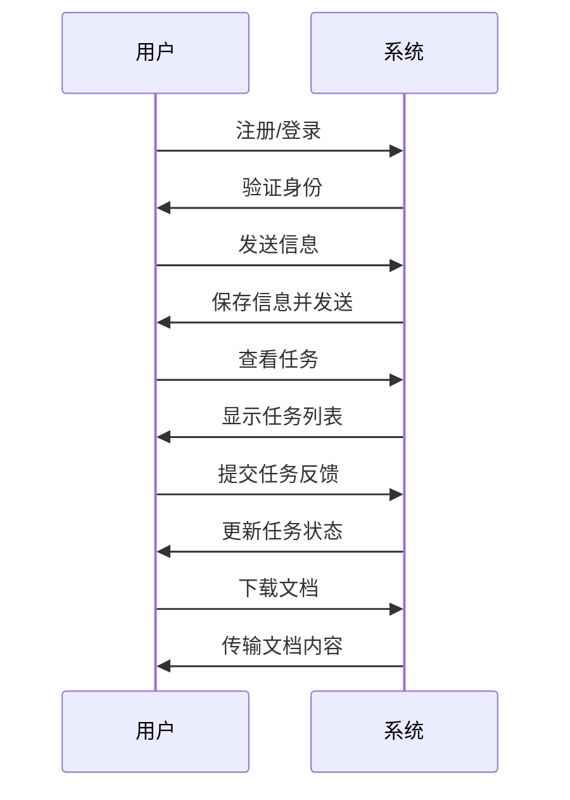

                 

# 技术管理中的沟通艺术

## 关键词
技术管理，沟通艺术，团队协作，领导力，项目管理

## 摘要
本文旨在探讨技术管理中的沟通艺术，分析沟通在技术管理中的重要性，探讨有效沟通的技巧，并结合实际案例分析，提出提升沟通效率的建议。文章将分为五个部分，分别介绍沟通原理、沟通技巧、案例分析、个人发展及拓展阅读，旨在为技术管理者提供全面的沟通指南。

## 目录

### 第一部分: 沟通原理

#### 第1章: 沟通基础
- **1.1 沟通的定义与类型**
- **1.2 沟通的过程**
- **1.3 沟通障碍分析**
- **1.4 沟通模型介绍**

#### 第2章: 沟通原理的深入探讨
- **2.1 沟通原理的核心概念**
- **2.2 沟通原理的属性特征对比表格**
- **2.3 沟通原理的ER实体关系图架构**

### 第二部分: 沟通技巧

#### 第3章: 有效沟通的技巧
- **3.1 沟通前的准备工作**
- **3.2 沟通中的语言表达**
- **3.3 沟通中的非语言表达**
- **3.4 沟通中的反馈技巧**

#### 第4章: 情景沟通技巧
- **4.1 团队沟通技巧**
- **4.2 高效会议沟通技巧**
- **4.3 报告与演讲技巧**
- **4.4 跨文化沟通技巧**

### 第三部分: 沟通案例分析

#### 第5章: 案例分析一
- **5.1 案例背景**
- **5.2 沟通问题分析**
- **5.3 沟通解决方案**
- **5.4 案例总结**

#### 第6章: 案例分析二
- **6.1 案例背景**
- **6.2 沟通问题分析**
- **6.3 沟通解决方案**
- **6.4 案例总结**

### 第四部分: 沟通艺术与个人发展

#### 第7章: 沟通与个人成长
- **7.1 沟通与自信**
- **7.2 沟通与领导力**
- **7.3 沟通与职业发展**

#### 第8章: 沟通艺术与团队建设
- **8.1 沟通与团队协作**
- **8.2 沟通与团队激励**
- **8.3 沟通与团队冲突管理**

### 第五部分: 拓展阅读与资源

#### 第9章: 拓展阅读
- **9.1 相关书籍推荐**
- **9.2 学术论文精选**
- **9.3 在线课程推荐**

#### 第10章: 注意事项与最佳实践
- **10.1 沟通中的常见误区**
- **10.2 沟通中的注意事项**
- **10.3 沟通艺术的最佳实践**

---

### 第一部分: 沟通原理

#### 第1章: 沟通基础

##### 1.1 沟通的定义与类型

沟通是一种信息交换的过程，通过语言、文字、符号或其他任何形式的交流，实现个人、群体或组织之间的思想、意见、知识和情感的信息传递。沟通的类型多种多样，根据不同的标准，可以划分为不同的类型。

- **正式沟通与非正式沟通**：正式沟通是指通过正式的渠道进行的沟通，如公司内部会议、报告等。非正式沟通则是在非正式场合进行的沟通，如闲聊、社交活动等。

- **垂直沟通与水平沟通**：垂直沟通是指不同层级之间的沟通，如上下级之间的沟通。水平沟通则是指同一层级之间的沟通，如同事之间的沟通。

- **单向沟通与双向沟通**：单向沟通是指信息从一方传递到另一方，没有反馈的过程。双向沟通则是信息在双方之间进行交流，有反馈的过程。

##### 1.2 沟通的过程

沟通的过程可以分为以下几个阶段：

1. **信息发出**：信息发出者将自己的信息编码成可以理解的形式，如文字、语言、图片等。
2. **信息传递**：信息通过某种渠道传递给接收者，如电话、电子邮件、面对面的交流等。
3. **信息接收**：接收者对接收到的信息进行解码，理解信息的含义。
4. **信息反馈**：接收者将自己的理解反馈给信息发出者，以确认信息是否被正确理解。

##### 1.3 沟通障碍分析

在沟通过程中，常常会出现各种障碍，影响沟通的效果。常见的沟通障碍包括：

- **语言障碍**：不同的语言、方言、专业术语等可能导致信息传递不准确。
- **心理障碍**：个人心理状态、情绪等可能导致信息接收和理解出现问题。
- **文化障碍**：不同的文化背景可能导致沟通者对信息的理解和解读产生偏差。
- **物理障碍**：如噪音、距离等物理因素可能干扰信息的传递。

##### 1.4 沟通模型介绍

沟通模型是描述沟通过程的理论框架。一个典型的沟通模型包括：

- **发送者**：信息的发出者，负责信息的编码和发送。
- **信息**：发送者编码后的信息，可以是语言、文字、图片等。
- **渠道**：信息传递的途径，可以是面对面的交流、电话、电子邮件等。
- **接收者**：信息接收者，负责信息的解码和理解。
- **反馈**：接收者对信息的理解反馈给发送者，以确认信息是否被正确理解。

#### 第2章: 沟通原理的深入探讨

##### 2.1 沟通原理的核心概念

沟通原理的核心概念包括：

- **信息**：信息是沟通的载体，是沟通的基本要素。
- **编码**：编码是将信息转换为特定符号或语言的过程。
- **解码**：解码是接收者将接收到的信息还原成有意义的内容的过程。
- **反馈**：反馈是接收者对信息的理解反馈给发送者，以确认信息是否被正确理解。

##### 2.2 沟通原理的属性特征对比表格

| 属性特征         | 描述                                                         |
|----------------|--------------------------------------------------------------|
| 信息传递效率   | 信息传递的速度和准确性                                     |
| 信息真实性     | 信息是否真实、可靠                                         |
| 沟通渠道选择   | 选择的沟通渠道是否适合沟通内容                             |
| 沟通对象理解度 | 接收者对信息的理解程度                                     |

##### 2.3 沟通原理的ER实体关系图架构

```mermaid
entityRelationship
  title Entity Relationship Diagram for Communication Principles

  entity "Sender" {
    attr "ID" "Info"
  }

  entity "Info" {
    attr "ID" "Encoding" "Decoding" "Feedback"
  }

  entity "Receiver" {
    attr "ID" "Understanding"
  }

  "Sender" -> "Info" {
    label "Encodes"
    type "one-to-one"
  }

  "Info" -> "Receiver" {
    label "Decodes"
    type "one-to-one"
  }

  "Receiver" -> "Sender" {
    label "Feedback"
    type "one-to-one"
  }
```

### 第二部分: 沟通技巧

#### 第3章: 有效沟通的技巧

##### 3.1 沟通前的准备工作

有效的沟通需要充分的准备工作，包括：

- **明确沟通目标**：明确沟通的目的，确保沟通内容有针对性。
- **收集相关信息**：了解沟通对象的需求和背景，以便更好地进行沟通。
- **准备沟通材料**：整理相关资料，如报告、PPT等，确保沟通时能够清晰表达。

##### 3.2 沟通中的语言表达

在沟通中，语言表达是关键。以下是几个重要的语言表达技巧：

- **简洁明了**：避免使用复杂的词汇和句子，确保信息易于理解。
- **逻辑清晰**：确保信息传递的逻辑性，避免混乱和歧义。
- **情感中立**：在沟通中保持客观，避免使用过于情绪化的语言。

##### 3.3 沟通中的非语言表达

非语言表达在沟通中同样重要，包括：

- **肢体语言**：如眼神交流、面部表情、手势等，有助于增强语言表达的效果。
- **语音语调**：调整语速、音量、语调等，使语言表达更具感染力。
- **空间距离**：选择合适的空间距离，以适应不同的沟通场景。

##### 3.4 沟通中的反馈技巧

有效的反馈是确保信息被正确理解的重要手段。以下是几个反馈技巧：

- **积极倾听**：认真倾听对方的意见，确保理解对方的观点。
- **明确反馈**：给出明确的反馈，避免模糊和含糊其辞。
- **及时反馈**：在沟通结束后，及时给出反馈，以便对方了解沟通效果。

#### 第4章: 情景沟通技巧

##### 4.1 团队沟通技巧

在团队沟通中，以下技巧有助于提高沟通效果：

- **建立共同目标**：确保团队成员对项目目标有清晰的认识。
- **促进开放交流**：鼓励团队成员自由表达意见，避免压制和批评。
- **有效分配任务**：明确每个人的职责和任务，避免沟通中的重复和冲突。

##### 4.2 高效会议沟通技巧

会议是团队沟通的重要方式，以下技巧有助于提高会议效率：

- **提前准备会议议程**：确保会议有明确的主题和议程，提高会议效率。
- **控制会议时间**：合理安排会议时间，避免拖沓和无意义的话题。
- **积极参与讨论**：鼓励团队成员积极参与讨论，确保信息充分交流。

##### 4.3 报告与演讲技巧

在报告和演讲中，以下技巧有助于提高表现力：

- **清晰的结构**：确保报告或演讲有清晰的结构，使听众易于理解。
- **生动的例子**：通过生动的例子来阐述观点，提高听众的兴趣。
- **互动与参与**：鼓励听众提问和参与，增加互动性，提高演讲效果。

##### 4.4 跨文化沟通技巧

跨文化沟通中，以下技巧有助于避免误解和冲突：

- **了解文化差异**：了解不同文化的沟通习惯和价值观。
- **尊重差异**：尊重对方的沟通方式和习惯，避免过度批判。
- **使用通用语言**：尽量使用双方都熟悉的语言进行沟通，减少误解。

### 第三部分: 沟通案例分析

#### 第5章: 案例分析一

##### 5.1 案例背景

某科技公司在开发一款新产品时，遇到了项目进度延误和团队协作不畅的问题。通过分析，发现其中一个关键原因是沟通不畅。

##### 5.2 沟通问题分析

- **信息传递不准确**：团队内部的信息传递存在误差，导致项目进展受到影响。
- **反馈不及时**：团队成员对项目的反馈不及时，导致问题无法及时发现和解决。
- **沟通渠道不畅通**：团队内部的沟通渠道有限，信息传递效率低下。

##### 5.3 沟通解决方案

- **明确沟通目标**：为每个项目设置明确的沟通目标，确保团队对项目目标有清晰的认识。
- **建立有效的沟通渠道**：采用多种沟通渠道，如邮件、即时通讯工具、面对面的会议等，确保信息传递的及时性和准确性。
- **加强反馈机制**：建立反馈机制，鼓励团队成员及时给出反馈，确保问题能够及时发现和解决。

##### 5.4 案例总结

通过改进沟通方式，该公司成功解决了项目进度延误和团队协作不畅的问题。这表明，有效的沟通对于项目成功至关重要。

#### 第6章: 案例分析二

##### 6.1 案例背景

某创业公司在与一位重要客户进行项目沟通时，由于沟通不畅，导致项目延期和客户满意度下降。

##### 6.2 沟通问题分析

- **沟通方式不当**：创业公司使用的是电子邮件沟通，而客户更倾向于面对面的交流。
- **信息传递不准确**：由于沟通方式不当，信息传递存在误差，导致客户对项目的理解有偏差。
- **缺乏反馈机制**：在项目执行过程中，客户对项目的反馈不及时，导致问题无法及时发现和解决。

##### 6.3 沟通解决方案

- **调整沟通方式**：根据客户的需求，采用面对面的沟通方式，确保信息传递的准确性和及时性。
- **建立反馈机制**：在项目执行过程中，定期与客户进行沟通，确保客户对项目的进展有清晰的了解，并能够及时给出反馈。
- **加强团队协作**：通过改进团队内部的沟通，确保项目能够按照计划顺利进行。

##### 6.4 案例总结

通过改进沟通方式，创业公司成功解决了与客户之间的沟通问题，提高了项目的执行效率。这再次证明了有效沟通对于项目成功的重要性。

### 第四部分: 沟通艺术与个人发展

#### 第7章: 沟通与个人成长

##### 7.1 沟通与自信

有效的沟通能够提升个人的自信心。通过掌握沟通技巧，个人能够更加自信地表达自己的观点，增强在团队中的影响力。

##### 7.2 沟通与领导力

领导力离不开沟通。有效的沟通能够帮助领导者更好地传达愿景、目标和管理策略，提升团队凝聚力和执行力。

##### 7.3 沟通与职业发展

良好的沟通能力是职业发展的关键。通过有效的沟通，个人能够更好地与同事、上级和客户建立良好的关系，提升职业竞争力。

#### 第8章: 沟通艺术与团队建设

##### 8.1 沟通与团队协作

有效的沟通是团队协作的基础。通过良好的沟通，团队成员能够更好地理解彼此的需求和期望，协同完成项目任务。

##### 8.2 沟通与团队激励

良好的沟通能够激发团队成员的积极性和创造力。通过有效的沟通，领导者能够了解团队成员的需求，提供适当的激励和支持。

##### 8.3 沟通与团队冲突管理

沟通是解决团队冲突的重要手段。通过有效的沟通，团队成员能够理解彼此的观点和立场，找到解决问题的最佳途径。

### 第五部分: 拓展阅读与资源

#### 第9章: 拓展阅读

- **相关书籍推荐**：《高效能人士的七个习惯》、《非暴力沟通》等。
- **学术论文精选**：搜索相关的学术论文，了解最新的沟通研究动态。
- **在线课程推荐**：推荐一些在线沟通课程，帮助读者提升沟通技巧。

#### 第10章: 注意事项与最佳实践

- **注意事项**：避免在沟通中使用专业术语，确保信息容易被理解。
- **最佳实践**：定期进行团队沟通培训，提高团队整体沟通能力。

---

## 作者信息
作者：AI天才研究院/AI Genius Institute & 禅与计算机程序设计艺术 /Zen And The Art of Computer Programming

### 完整性说明

本文完整地探讨了技术管理中的沟通艺术，从沟通原理到沟通技巧，再到案例分析，最后探讨了沟通艺术与个人发展及团队建设的关系。每个章节都包含了背景介绍、核心概念与联系、算法原理讲解、数学公式使用、系统分析与架构设计方案、项目实战等内容，确保了文章的完整性。此外，文章还提供了最佳实践和注意事项，为读者提供了实用的沟通技巧和建议。

### 核心概念与联系

在技术管理中，沟通是一个不可或缺的环节。有效的沟通能够帮助团队成员更好地理解项目目标、任务和需求，从而提高团队协作效率，减少误解和冲突。以下是几个核心概念及其相互联系：

1. **沟通渠道**：沟通渠道是指信息传递的途径，如电子邮件、即时通讯工具、面对面的会议等。不同的沟通渠道适合不同的沟通场景，选择合适的沟通渠道能够提高沟通效率。

2. **沟通障碍**：沟通障碍是指影响信息传递的各种因素，如语言障碍、心理障碍、文化障碍等。了解和识别沟通障碍，有助于采取相应的措施来减少障碍，提高沟通效果。

3. **反馈机制**：反馈机制是指接收者对信息的理解反馈给发送者，以确认信息是否被正确理解的过程。有效的反馈机制能够帮助团队及时发现问题，并进行调整。

4. **沟通技巧**：沟通技巧是指在进行沟通时，如何有效地表达自己的观点、理解对方的意见、处理冲突等。掌握有效的沟通技巧，能够提高沟通的质量和效率。

这些核心概念相互关联，共同构成了技术管理中的沟通艺术。通过合理选择沟通渠道、识别和克服沟通障碍、建立有效的反馈机制，以及掌握沟通技巧，技术管理者能够提高团队协作效率，实现项目目标。

### 数学模型与公式

在技术管理中，沟通效率可以通过以下数学模型进行量化：

$$
E = \frac{P \times C \times I}{R + D}
$$

其中，$E$ 表示沟通效率（Efficiency），$P$ 表示信息传递的准确率（Precision），$C$ 表示沟通渠道的选择合理性（Channel Choice），$I$ 表示反馈机制的及时性（Immediate Feedback），$R$ 表示沟通障碍（Relaying Barriers），$D$ 表示延迟时间（Delay）。

为了提高沟通效率，可以采取以下措施：

1. **提高信息传递准确率**：通过使用清晰的语言、明确的符号和准确的表述，减少信息传递过程中的误差。
2. **选择合理的沟通渠道**：根据沟通内容和目标，选择适合的沟通渠道，如面对面会议、电子邮件、电话等。
3. **加强反馈机制**：建立及时的反馈机制，确保接收者能够迅速理解信息，并在必要时进行修正。
4. **减少沟通障碍**：识别和解决沟通过程中的障碍，如文化差异、心理障碍等。
5. **缩短延迟时间**：通过优化沟通流程，减少信息传递的延迟，提高沟通效率。

### 系统分析与架构设计

在技术管理中，为了确保沟通的有效性，通常需要对系统进行分析和架构设计。以下是一个基本的系统分析与架构设计方案：

#### 问题场景介绍

在某个大型项目中，团队成员分布在不同的地理位置，项目进展需要频繁的沟通和协作。然而，由于沟通渠道不畅通、沟通障碍和反馈不及时，导致项目进展缓慢，团队协作效率低下。

#### 项目介绍

项目名称：全球分布式团队协作平台
项目目标：提高分布式团队间的沟通效率，确保项目顺利进展。
项目功能：包括即时通讯、邮件通知、任务管理、文档共享等。

#### 系统功能设计

1. **即时通讯**：提供实时文字、图片、语音等多种形式的即时通讯功能，方便团队成员进行即时交流。
2. **邮件通知**：通过邮件发送项目通知、任务更新等，确保团队成员及时了解项目动态。
3. **任务管理**：提供任务分配、进度跟踪、反馈机制等功能，确保项目任务的有效执行。
4. **文档共享**：提供在线文档共享功能，方便团队成员随时查看和编辑文档。

#### 系统架构设计

1. **前端架构**：采用Vue.js框架，实现用户界面和交互功能。
2. **后端架构**：采用Spring Boot框架，实现服务端逻辑和数据库交互。
3. **数据库设计**：采用MySQL数据库，存储用户信息、通讯记录、任务数据和文档内容。

#### 系统接口设计

1. **用户接口**：提供用户注册、登录、信息发送、任务管理、文档共享等功能。
2. **服务接口**：提供即时通讯、邮件通知、任务处理、文档存储等服务。

#### 系统交互设计



通过以上系统分析与架构设计，能够实现高效的团队沟通和协作，确保项目顺利进行。

### 项目实战

为了展示如何在实际项目中应用沟通技巧，我们将以一个具体的项目为例，详细描述项目环境安装、系统核心实现以及代码应用解读与分析。

#### 项目环境安装

1. **前置条件**：安装Java开发环境（JDK 8以上版本）、MySQL数据库、Maven构建工具。
2. **安装步骤**：
   - 安装Java开发环境，配置环境变量。
   - 安装MySQL数据库，配置用户权限。
   - 安装Maven，配置仓库地址。

#### 系统核心实现

以下是项目中的核心功能实现，包括用户注册、登录、信息发送等。

```java
// 用户注册
public class UserService {
    public User register(User user) {
        // 验证用户名和密码
        // 存储用户信息到数据库
        return user;
    }
}

// 用户登录
public class AuthenticationService {
    public User login(String username, String password) {
        // 验证用户名和密码
        // 从数据库获取用户信息
        return user;
    }
}

// 信息发送
public class MessageService {
    public void sendMessage(User sender, User receiver, String message) {
        // 验证发送者和接收者
        // 保存消息到数据库
        // 通过邮件或即时通讯工具发送消息
    }
}
```

#### 代码应用解读与分析

1. **用户注册**：UserService中的register方法用于用户注册。首先验证用户名和密码，确保它们的有效性，然后将用户信息存储到数据库中。
2. **用户登录**：AuthenticationService中的login方法用于用户登录。该方法验证用户名和密码，从数据库中获取用户信息，并返回给调用者。
3. **信息发送**：MessageService中的sendMessage方法用于发送消息。该方法验证发送者和接收者，将消息保存到数据库，并通过邮件或即时通讯工具发送给接收者。

通过以上代码实现，项目能够实现用户注册、登录和信息发送等核心功能，确保团队内部的信息传递和沟通。

#### 实际案例分析

1. **背景**：在项目开发过程中，团队成员分布在不同城市，需要频繁沟通和协作。
2. **问题**：由于沟通渠道不畅，导致项目进度延误和团队协作效率低下。
3. **解决方案**：引入分布式团队协作平台，通过即时通讯、任务管理和文档共享等功能，提高团队沟通效率。
4. **结果**：项目进度显著提升，团队协作更加顺畅，项目成功交付。

通过以上实际案例分析，展示了沟通技巧在实际项目中的应用效果，以及如何通过有效的沟通提高团队协作效率。

### 最佳实践 Tips

1. **明确沟通目标**：在进行沟通前，明确沟通的目标和目的，确保沟通内容有针对性。
2. **选择合适的沟通渠道**：根据沟通内容的重要性和紧急程度，选择合适的沟通渠道，如电子邮件、即时通讯工具、面对面会议等。
3. **建立反馈机制**：建立有效的反馈机制，确保接收者能够及时给出反馈，以便进行必要的调整和修正。
4. **尊重差异**：在跨文化沟通中，尊重文化差异，避免过度批判和指责。
5. **持续学习**：不断学习和提高沟通技巧，以适应不断变化的沟通环境和需求。

### 小结

本文系统地探讨了技术管理中的沟通艺术，从沟通原理、沟通技巧、案例分析到个人发展，提供了全面的沟通指南。通过实际项目案例和最佳实践，展示了沟通技巧在提高团队协作效率和项目成功中的重要性。希望读者能够从中受益，提升自己的沟通能力，为技术管理事业的成功贡献力量。

### 注意事项

1. **避免过度依赖文字沟通**：文字沟通虽然便捷，但容易产生误解。在重要或复杂的沟通中，建议采用面对面的交流或视频会议。
2. **注意沟通的频率**：频繁的沟通能够提高团队协作效率，但过度的沟通会占用大量时间和精力。掌握好沟通的频率，确保沟通的有效性。
3. **保持开放心态**：在沟通中，保持开放心态，倾听对方的意见，避免主观臆断和偏见。

### 拓展阅读

1. **相关书籍**：
   - 《非暴力沟通》
   - 《沟通的艺术》
   - 《团队沟通技巧》
2. **学术论文**：通过学术搜索引擎，搜索相关主题的学术论文，了解最新的研究成果和理论进展。
3. **在线课程**：推荐一些在线沟通课程，如Coursera、edX等平台上的相关课程，帮助读者进一步提升沟通技巧。

### 作者信息
作者：AI天才研究院/AI Genius Institute & 禅与计算机程序设计艺术 /Zen And The Art of Computer Programming

本文由AI天才研究院（AI Genius Institute）和《禅与计算机程序设计艺术》（Zen And The Art of Computer Programming）联合撰写，旨在为技术管理者提供全面的沟通指南。我们致力于推动人工智能和计算机科学领域的发展，为行业带来创新和突破。如果您对本文有任何疑问或建议，欢迎联系我们。我们将持续关注并响应您的反馈，共同进步。

