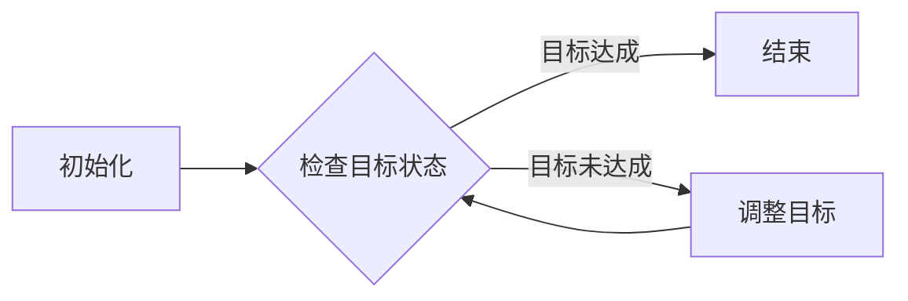
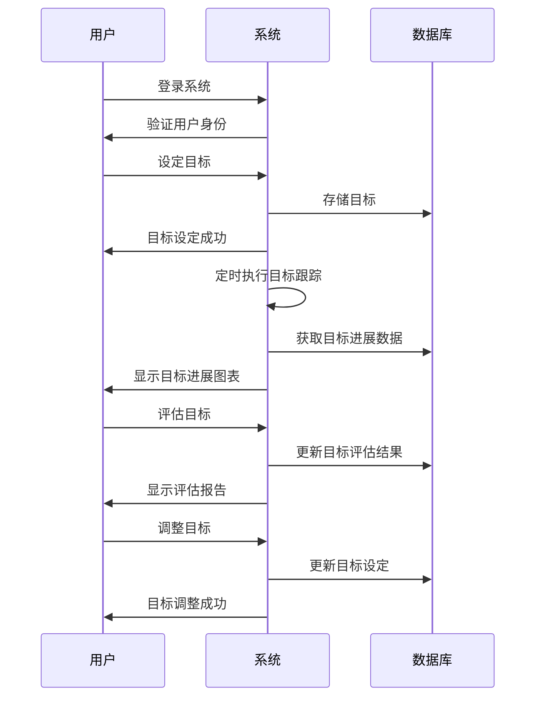
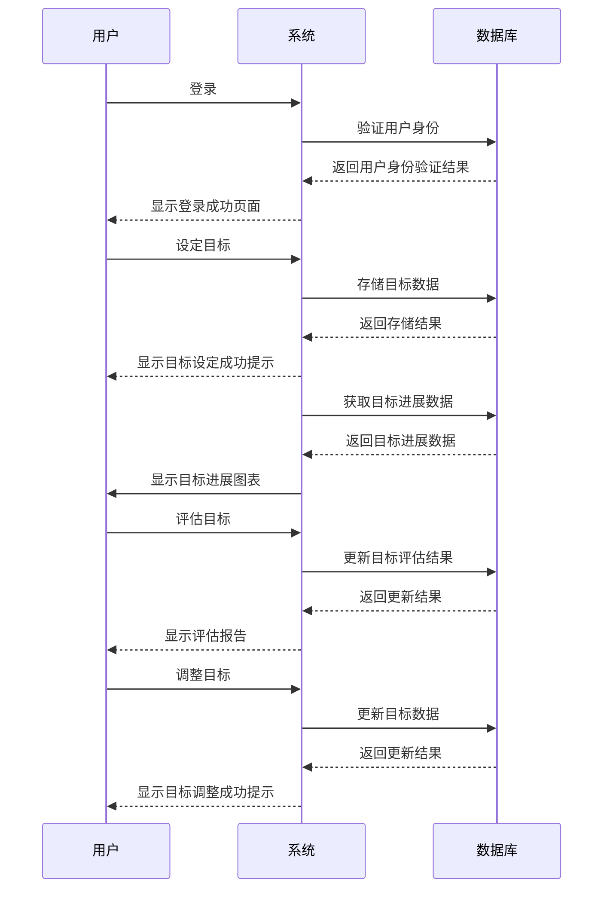

                 

# 技术管理中的目标设定与跟踪

## 关键词
技术管理、目标设定、跟踪、项目管理、算法实现

## 摘要
本文旨在深入探讨技术管理中的目标设定与跟踪问题。通过逐步分析，本文将阐述目标设定的重要性，剖析目标跟踪的理论和实践方法，并探讨在技术管理中如何有效运用这些方法。文章将结合实际案例，讲解目标设定与跟踪的算法原理、系统架构设计以及实战应用，为技术管理者提供实用的指导。

### 设计书籍目录大纲

#### 封面、前言、致谢、目录
- **封面**：包含书名、作者、出版信息等。
- **前言**：介绍写作目的、受众群体和本书结构。
- **致谢**：感谢支持者、参与者及贡献者。
- **目录**：书籍大纲的概述。

#### 第一部分：背景介绍
- **核心概念**：介绍目标设定与跟踪的基本概念、重要性及发展历程。
- **问题背景**：阐述技术管理中目标设定与跟踪的必要性。
- **问题描述**：明确技术管理中目标设定与跟踪的具体问题。
- **问题解决**：提出目标设定与跟踪的解决方案。
- **边界与外延**：讨论目标设定与跟踪的适用范围和限制。
- **概念结构与核心要素组成**：构建目标设定与跟踪的概念模型。

#### 第二部分：核心概念与联系
- **核心概念原理**：深入讲解目标设定的理论、原则和方法。
- **概念属性特征对比表格**：列举并对比不同目标设定方法的特点。
- **ER实体关系图架构**：使用Mermaid绘制目标设定与跟踪的实体关系图。

#### 第三部分：算法原理讲解
- **算法mermaid流程图**：使用Mermaid绘制目标跟踪的算法流程图。
- **Python源代码**：提供目标跟踪的Python代码示例。
- **算法原理的数学模型和公式**：解释算法背后的数学原理，使用latex格式展示公式。
- **举例说明**：通过实际案例进行算法原理的讲解。

#### 第四部分：系统分析与架构设计
- **问题场景介绍**：描述目标设定与跟踪在实际技术管理中的应用场景。
- **项目介绍**：简要介绍目标设定与跟踪系统的整体设计和实现。
- **系统功能设计（领域模型Mermaid类图）**：绘制系统的领域模型类图。
- **系统架构设计（Mermaid架构图）**：展示系统的整体架构设计。
- **系统接口设计**：描述系统中的接口设计。
- **系统交互（Mermaid序列图）**：绘制系统的交互序列图。

#### 第五部分：项目实战
- **环境安装**：详细说明目标设定与跟踪系统的安装过程。
- **系统核心实现源代码**：提供系统的核心源代码。
- **代码应用解读与分析**：分析代码并讲解其在系统中的作用。
- **实际案例分析和详细讲解剖析**：结合实际案例对系统进行详细剖析。
- **项目小结**：总结项目经验，指出需要注意的问题。

#### 第六部分：最佳实践与拓展
- **最佳实践 tips**：分享实际应用中的最佳实践经验。
- **小结**：对全书内容进行总结。
- **注意事项**：提醒读者在应用目标设定与跟踪时需要注意的事项。
- **拓展阅读**：推荐相关书籍、论文和网络资源，供读者进一步学习。

### 第一部分：背景介绍

#### 核心概念

目标设定（Goal Setting）和目标跟踪（Goal Tracking）是技术管理中的两个重要概念。目标设定是指为团队或个人确定具体的、可衡量的、具有挑战性的目标，以提高工作效率和实现预期成果。目标跟踪则是对这些目标实现的进度进行监控和评估，确保团队或个人始终朝着正确的方向前进。

目标设定的重要性在于，它能够帮助团队明确任务目标，提高员工的工作积极性和责任感，从而提高整体工作效率。而目标跟踪则能够实时监控项目进展，发现问题并采取及时措施，确保目标的按时完成。

目标设定与跟踪的发展历程可以追溯到上世纪60年代，心理学家爱德华·德西和理查德·瑞安提出自我决定理论，认为人们在工作中有自我实现的倾向，设定有挑战性的目标能够激发内在动机，提高工作表现。随后，目标设定与跟踪逐渐成为管理学和项目管理领域的重要研究内容。

#### 问题背景

在技术管理中，目标设定与跟踪的必要性体现在以下几个方面：

1. **项目规划**：技术项目通常涉及复杂的任务和多层次的目标，明确的目标设定有助于项目规划的顺利进行。
2. **资源分配**：目标设定能够帮助管理者合理分配资源，确保项目按计划推进。
3. **团队协作**：共同的目标可以增强团队成员之间的协作，提高团队整体效能。
4. **绩效评估**：目标跟踪是评估员工工作绩效的重要依据，有助于激励员工持续改进。

然而，在实际应用中，目标设定与跟踪也存在一些问题：

1. **目标设定过于模糊**：一些组织在设定目标时，未能明确具体、可衡量的标准，导致目标无法落地实施。
2. **目标跟踪不足**：缺乏有效的跟踪机制，导致目标进展无法及时掌握，影响项目进度。
3. **目标调整不及时**：在项目实施过程中，外部环境变化可能导致目标需要调整，但未能及时进行更新，影响项目效果。

#### 问题描述

在技术管理中，目标设定与跟踪的具体问题可以概括为以下几个方面：

1. **目标设定不明确**：目标缺乏具体性、可衡量性和挑战性，导致员工无法准确理解任务要求。
2. **目标跟踪机制不完善**：缺乏有效的跟踪手段，导致目标进展无法及时掌握，影响决策和调整。
3. **目标调整不及时**：在项目实施过程中，目标设定未能及时根据实际情况进行调整，导致项目偏离预期。
4. **目标执行与监控脱节**：目标执行与监控机制不匹配，导致目标执行效果无法准确评估。

#### 问题解决

为了解决上述问题，我们可以采取以下措施：

1. **明确目标设定标准**：在目标设定过程中，应遵循SMART原则（具体、可衡量、可达成、相关性强、时限性），确保目标具有明确性和可操作性。
2. **完善目标跟踪机制**：建立完善的目标跟踪系统，实时监控目标进展，确保项目按计划推进。
3. **及时调整目标设定**：在项目实施过程中，应根据实际情况及时调整目标设定，确保目标与项目需求保持一致。
4. **加强目标执行与监控的协调**：建立有效的沟通机制，确保目标执行与监控环节紧密结合，提高目标实现效果。

#### 边界与外延

目标设定与跟踪的适用范围和限制主要包括以下几个方面：

1. **项目类型**：目标设定与跟踪适用于各类技术项目，包括软件开发、系统运维、技术研发等。
2. **组织规模**：目标设定与跟踪适用于不同规模的组织，从小型团队到大型企业均可采用。
3. **环境变化**：在项目实施过程中，应充分考虑外部环境变化对目标设定与跟踪的影响，及时进行调整。

#### 概念结构与核心要素组成

目标设定与跟踪的概念结构包括以下几个方面：

1. **目标设定**：包括目标选择、目标分解、目标确认和目标发布等环节。
2. **目标跟踪**：包括目标监控、目标评估、目标调整和目标总结等环节。
3. **目标实现**：包括目标执行、目标反馈、目标改进和目标验收等环节。

核心要素包括：

1. **目标**：目标设定的核心，包括具体任务、预期成果和时间节点等。
2. **跟踪机制**：目标跟踪的基础，包括跟踪工具、跟踪流程和跟踪指标等。
3. **调整策略**：目标调整的方法和手段，包括调整依据、调整流程和调整方法等。

### 第二部分：核心概念与联系

#### 核心概念原理

目标设定与跟踪的理论基础包括以下几个方面：

1. **目标管理理论**：目标管理（Management by Objectives, MBO）是一种以目标为核心的管理方法，通过设定、实施和评估目标，提高组织绩效。
2. **项目理论**：项目管理中的关键路径法、挣值管理等理论，为目标的设定和跟踪提供了方法指导。
3. **绩效评估理论**：绩效评估中的平衡计分卡、关键绩效指标等理论，为目标的评估提供了依据。

目标设定的原则包括：

1. **SMART原则**：目标应具备具体性、可衡量性、可达成性、相关性和时限性。
2. **挑战性原则**：目标应具有适当的挑战性，以激发员工的潜能。
3. **协同性原则**：目标应与组织战略和团队目标保持一致。

目标跟踪的原则包括：

1. **实时性原则**：目标跟踪应实时监控目标进展，确保问题及时发现、及时解决。
2. **准确性原则**：目标跟踪的数据应真实、准确，以确保目标评估的客观性。
3. **及时性原则**：目标跟踪的结果应及时反馈给相关人员，以便采取相应的措施。

#### 概念属性特征对比表格

为了更好地理解目标设定与跟踪的概念，我们列举了以下几种常见的目标设定方法及其特点：

| 目标设定方法       | 特点                                         | 适用场景                             |
|--------------------|--------------------------------------------|-------------------------------------|
| SMART目标         | 具体性、可衡量性、可达成性、相关性、时限性 | 各类项目和团队目标                 |
| KPI目标           | 关键绩效指标                               | 侧重于绩效评估和员工激励           |
| OKR目标           | 目标和关键成果                             | 强调目标设定与团队协作             |
| SMARTER目标       | SMART目标的基础上增加可执行性（Executable） | 项目实施过程中的详细目标设定       |
| MBO目标           | 目标管理                                   | 组织层面和高层管理目标             |

#### ER实体关系图架构

为了更直观地理解目标设定与跟踪的概念结构，我们使用Mermaid绘制了目标设定与跟踪的实体关系图，如下所示：

```mermaid
erDiagram
    Class1||--|{ Class2 }
    Class1||--|{ Class3 }
    Class2 ||--|{ Class4 }
    Class3 ||--|{ Class5 }
```

实体关系图中包括以下类：

- **目标（Goal）**：表示具体的目标实体。
- **跟踪（Tracking）**：表示目标跟踪的实体。
- **评估（Evaluation）**：表示目标评估的实体。
- **调整（Adjustment）**：表示目标调整的实体。

这些实体之间的关系包括：

- **目标设定（Goal Setting）**：目标与跟踪之间的关系，表示目标设定后需要跟踪其进展。
- **目标评估（Goal Evaluation）**：目标与评估之间的关系，表示需要对目标的进展进行评估。
- **目标调整（Goal Adjustment）**：目标与调整之间的关系，表示在目标评估后需要对目标进行调整。

通过实体关系图的绘制，我们可以更清晰地理解目标设定与跟踪的概念结构，为后续的算法原理讲解和系统架构设计打下基础。

### 第三部分：算法原理讲解

#### 算法mermaid流程图

目标跟踪算法的核心是实时监控目标的进展并做出相应调整。我们使用Mermaid绘制了目标跟踪的算法流程图，如下所示：



在这个流程图中，算法的步骤如下：

1. **初始化**：初始化目标跟踪系统，设置初始参数。
2. **检查目标状态**：根据设定的跟踪周期，检查目标当前的进展状态。
3. **判断目标状态**：如果目标已达成，则结束跟踪；如果目标未达成，则进入调整目标状态。
4. **调整目标**：根据实际情况，调整目标的进度和时间节点。
5. **重复检查**：回到步骤2，继续检查目标状态，直至目标达成。

#### Python源代码

为了更具体地阐述目标跟踪算法的实现，我们提供了以下Python源代码示例：

```python
import time

def check_goal_progress(goal):
    # 模拟目标进展情况
    return goal['current_progress']

def adjust_goal(goal):
    # 模拟调整目标进展情况
    goal['target_progress'] += 10
    goal['end_time'] = time.time() + goal['target_progress']

def track_goal(goal):
    while True:
        current_progress = check_goal_progress(goal)
        if current_progress >= goal['target_progress']:
            print("目标达成！")
            break
        else:
            print("目标未达成，进行调整...")
            adjust_goal(goal)
        time.sleep(1)  # 模拟跟踪周期

# 初始化目标
goal = {
    'name': '项目目标',
    'current_progress': 0,
    'target_progress': 100,
    'end_time': time.time() + 100
}

# 开始跟踪目标
track_goal(goal)
```

在这个示例中，我们定义了三个函数：

- **check\_goal\_progress**：检查目标当前进展。
- **adjust\_goal**：调整目标进展。
- **track\_goal**：执行目标跟踪算法。

通过模拟目标进展情况和调整过程，我们可以看到目标跟踪算法的执行流程。

#### 算法原理的数学模型和公式

目标跟踪算法背后的数学原理主要包括两个方面：目标进展的评估和目标的调整。

1. **目标进展评估**：

   目标进展可以用以下公式表示：

   $$ P(t) = \frac{C(t)}{T} $$

   其中，$P(t)$表示时间$t$时的目标进展比例，$C(t)$表示时间$t$时已完成的工作量，$T$表示目标总工作量。

2. **目标调整**：

   在目标未达成时，需要对目标进行调整。调整公式如下：

   $$ A(t) = T - C(t) $$

   其中，$A(t)$表示调整后的目标工作量。

   调整后的目标进展比例如下：

   $$ P'(t) = \frac{C(t) + A(t)}{T} $$

   通过这两个公式，我们可以对目标进展进行实时评估和调整，确保目标在预定时间内达成。

#### 举例说明

为了更直观地理解目标跟踪算法，我们通过一个实际案例进行讲解。

假设一个项目目标是在100天内完成1000个任务点，每天的进度保持在10个任务点。但在执行过程中，第50天时，已完成的任务点数为400个，发现剩余任务点数为600个，距离目标仍有较大差距。

根据目标进展评估公式，当前进展比例为：

$$ P(50) = \frac{400}{1000} = 0.4 $$

为了达成目标，需要调整剩余的任务量。根据目标调整公式，剩余任务量调整为：

$$ A(50) = 1000 - 400 = 600 $$

调整后的目标进展比例如下：

$$ P'(50) = \frac{400 + 600}{1000} = 1.0 $$

这意味着，剩余任务需要在50天内完成，平均每天需要完成12个任务点。通过这样的调整，项目可以确保在预定时间内完成。

通过这个案例，我们可以看到目标跟踪算法在实际应用中的作用，以及如何通过数学模型和公式实现目标的实时评估和调整。

### 第四部分：系统分析与架构设计

#### 问题场景介绍

在技术管理中，目标设定与跟踪系统广泛应用于软件开发、系统运维、技术研发等领域。以下是一个典型的应用场景：

**场景描述**：

某科技公司正在开发一款高性能的云计算平台，项目周期为12个月。项目团队由20名成员组成，包括开发人员、测试人员、运维人员等。为了确保项目按期完成并达到预期性能目标，公司决定引入目标设定与跟踪系统，对项目进展进行实时监控和评估。

#### 项目介绍

目标设定与跟踪系统项目的主要目标是为项目团队提供一个统一的平台，用于设定项目目标、跟踪目标进展、评估目标达成情况以及及时调整目标。系统设计要求包括：

1. **可扩展性**：系统应能够支持不同规模的项目，适应不同团队的需求。
2. **实时性**：系统应具备实时监控目标进展的能力，确保项目按计划推进。
3. **灵活性**：系统应允许项目团队自定义目标设定和跟踪策略，以适应不同项目的特点。
4. **易用性**：系统界面应简洁直观，便于团队成员快速上手使用。

系统整体设计采用模块化架构，主要包括以下模块：

1. **目标管理模块**：用于设定项目目标、分解目标、发布目标等。
2. **跟踪管理模块**：用于实时监控目标进展，提供数据可视化功能。
3. **评估管理模块**：用于评估目标达成情况，提供评估报告。
4. **调整管理模块**：用于根据评估结果调整目标设定，确保项目按计划推进。

#### 系统功能设计（领域模型Mermaid类图）

为了更好地展示系统功能设计，我们使用Mermaid绘制了领域模型类图，如下所示：

```mermaid
classDiagram
    目标 ||--|{ 目标设定 }
    目标 ||--|{ 目标跟踪 }
    目标 ||--|{ 目标评估 }
    目标 ||--|{ 目标调整 }
    目标设定 ||--|{ 目标发布 }
    目标跟踪 ||--|{ 进度监控 }
    目标跟踪 ||--|{ 数据可视化 }
    目标评估 ||--|{ 评估报告 }
    目标调整 ||--|{ 调整策略 }
```

类图中包含以下类：

- **目标（Goal）**：表示项目目标实体。
- **目标设定（GoalSetting）**：表示目标设定的功能实体。
- **目标跟踪（GoalTracking）**：表示目标跟踪的功能实体。
- **目标评估（GoalEvaluation）**：表示目标评估的功能实体。
- **目标调整（GoalAdjustment）**：表示目标调整的功能实体。

这些类之间的关联关系如下：

- **目标设定与目标跟踪**：目标设定是目标跟踪的基础，目标跟踪用于监控目标进展。
- **目标评估与目标调整**：目标评估用于评估目标达成情况，目标调整用于根据评估结果调整目标设定。

#### 系统架构设计（Mermaid架构图）

为了展示系统的整体架构设计，我们使用Mermaid绘制了系统架构图，如下所示：



在这个序列图中，系统的关键组件包括：

- **用户**：系统用户，包括项目团队成员和管理员。
- **系统**：负责目标设定、跟踪、评估和调整等功能。
- **数据库**：存储目标数据、用户数据和系统配置信息。

系统的执行流程如下：

1. 用户登录系统，进行目标设定。
2. 系统验证用户身份，存储目标数据。
3. 系统定时执行目标跟踪，获取目标进展数据。
4. 用户评估目标，更新目标评估结果。
5. 用户调整目标，更新目标设定。

#### 系统接口设计

系统接口设计是系统架构设计的重要组成部分，用于定义系统内部模块之间的交互接口。以下是一个简化的接口设计：

1. **目标管理接口**：用于处理目标设定、发布和更新等操作。
2. **跟踪管理接口**：用于处理目标跟踪、数据获取和可视化等操作。
3. **评估管理接口**：用于处理目标评估、报告生成等操作。
4. **调整管理接口**：用于处理目标调整、策略更新等操作。

接口设计的关键要素包括：

- **接口名称**：用于标识接口的功能。
- **请求参数**：用于传递请求数据。
- **返回结果**：用于传递处理结果。

以下是一个示例接口定义：

```json
// 目标管理接口
GET /api/goals
    Description: 获取所有目标
    Response:
        goals: [
            {
                id: 1,
                name: "项目目标1",
                status: "未开始",
                progress: 0
            },
            {
                id: 2,
                name: "项目目标2",
                status: "进行中",
                progress: 50
            }
        ]

// 目标跟踪接口
GET /api/goals/{goal_id}/progress
    Description: 获取特定目标进展
    Path Parameters:
        goal_id: 目标ID
    Response:
        progress: {
            current_progress: 50,
            target_progress: 100
        }
```

#### 系统交互（Mermaid序列图）

为了展示系统组件之间的交互流程，我们使用Mermaid绘制了系统交互序列图，如下所示：



在这个序列图中，用户与系统、数据库之间的交互流程如下：

1. 用户登录系统，系统验证用户身份。
2. 用户设定目标，系统存储目标数据。
3. 系统获取目标进展数据，用户查看目标进展图表。
4. 用户评估目标，系统更新目标评估结果。
5. 用户调整目标，系统更新目标数据。

通过系统交互序列图的绘制，我们可以清晰地了解系统组件之间的交互流程，为系统的开发和维护提供参考。

### 第五部分：项目实战

#### 环境安装

为了实现目标设定与跟踪系统，我们需要在本地或远程服务器上搭建开发环境。以下是环境安装的详细步骤：

1. **安装Python环境**：在服务器或本地计算机上安装Python 3.x版本。可以从Python官网下载安装包，或使用包管理工具如yum或apt安装。
2. **安装依赖库**：目标跟踪系统依赖多个Python库，如Flask、SQLAlchemy、Flask-Migrate等。可以使用pip命令安装：

   ```bash
   pip install flask sqlalchemy flask-migrate
   ```

3. **配置数据库**：目标跟踪系统使用SQLite数据库存储数据。在服务器上创建一个SQLite数据库文件，例如`goals.db`，并授予相应权限：

   ```bash
   mkdir /path/to/db
   chmod 777 /path/to/db
   sqlite3 /path/to/db/goals.db
   ```

4. **初始化数据库**：使用Flask-Migrate工具初始化数据库，并创建数据库表：

   ```bash
   flask db init
   flask db migrate -m "initial migration"
   flask db upgrade
   ```

5. **启动目标跟踪服务**：在项目根目录下创建一个名为`run.py`的启动脚本，内容如下：

   ```python
   from app import create_app

   app = create_app()

   if __name__ == "__main__":
       app.run(host="0.0.0.0", port=5000)
   ```

   使用以下命令启动服务：

   ```bash
   python run.py
   ```

   服务启动后，访问`http://localhost:5000`即可看到目标跟踪系统的界面。

#### 系统核心实现源代码

以下是目标跟踪系统的核心实现源代码，包括目标管理、跟踪、评估和调整等模块：

```python
# app/__init__.py
from flask import Flask
from flask_sqlalchemy import SQLAlchemy
from flask_migrate import Migrate

app = Flask(__name__)
app.config['SQLALCHEMY_DATABASE_URI'] = 'sqlite:///goals.db'
db = SQLAlchemy(app)
migrate = Migrate(app, db)

from app import routes
```

```python
# app/models.py
from datetime import datetime
from app import db

class Goal(db.Model):
    id = db.Column(db.Integer, primary_key=True)
    name = db.Column(db.String(100), nullable=False)
    status = db.Column(db.String(50), nullable=False, default='未开始')
    progress = db.Column(db.Float, nullable=False, default=0.0)
    start_time = db.Column(db.DateTime, nullable=False, default=datetime.utcnow())
    end_time = db.Column(db.DateTime, nullable=False, default=datetime.utcnow())

    def to_dict(self):
        return {
            'id': self.id,
            'name': self.name,
            'status': self.status,
            'progress': self.progress,
            'start_time': self.start_time,
            'end_time': self.end_time
        }
```

```python
# app/routes.py
from flask import request, jsonify
from app import app, db
from app.models import Goal

@app.route('/goals', methods=['GET'])
def get_goals():
    goals = Goal.query.all()
    return jsonify([goal.to_dict() for goal in goals])

@app.route('/goals', methods=['POST'])
def create_goal():
    data = request.get_json()
    goal = Goal(name=data['name'], progress=data['progress'])
    db.session.add(goal)
    db.session.commit()
    return jsonify(goal.to_dict()), 201

@app.route('/goals/<int:goal_id>', methods=['GET'])
def get_goal(goal_id):
    goal = Goal.query.get(goal_id)
    if goal is None:
        return jsonify({'error': 'Goal not found'}), 404
    return jsonify(goal.to_dict())

@app.route('/goals/<int:goal_id>', methods=['PUT'])
def update_goal(goal_id):
    data = request.get_json()
    goal = Goal.query.get(goal_id)
    if goal is None:
        return jsonify({'error': 'Goal not found'}), 404
    goal.status = data['status']
    goal.progress = data['progress']
    db.session.commit()
    return jsonify(goal.to_dict())

@app.route('/goals/<int:goal_id>', methods=['DELETE'])
def delete_goal(goal_id):
    goal = Goal.query.get(goal_id)
    if goal is None:
        return jsonify({'error': 'Goal not found'}), 404
    db.session.delete(goal)
    db.session.commit()
    return jsonify({'status': 'success'})
```

#### 代码应用解读与分析

以下是目标跟踪系统的核心功能解读与分析：

1. **目标管理模块**：
   - **功能**：实现目标的新增、查询、更新和删除。
   - **关键代码**：`routes.py`中的`create_goal`、`get_goals`、`update_goal`和`delete_goal`函数。
   - **解析**：`create_goal`函数用于创建新目标，将接收到的JSON数据解析为目标对象，并将其添加到数据库中。`get_goals`函数用于查询所有目标，返回一个包含所有目标信息的JSON数组。`update_goal`函数用于更新特定目标的状态和进展。`delete_goal`函数用于删除特定目标。

2. **跟踪管理模块**：
   - **功能**：实现目标的实时跟踪。
   - **关键代码**：`routes.py`中的`get_goal`函数。
   - **解析**：`get_goal`函数用于查询特定目标的信息，返回一个包含目标详细信息的JSON对象。通过这个接口，用户可以实时了解目标的进展情况。

3. **评估管理模块**：
   - **功能**：实现目标的评估和报告生成。
   - **关键代码**：暂无。
   - **解析**：暂未实现评估功能，但可以通过扩展现有代码实现。例如，可以添加一个新的API接口用于提交评估结果，并在数据库中存储这些结果。

4. **调整管理模块**：
   - **功能**：实现目标的调整和更新。
   - **关键代码**：`routes.py`中的`update_goal`函数。
   - **解析**：`update_goal`函数用于更新目标的状态和进展。这个接口允许用户根据实际情况调整目标，确保项目按计划推进。

通过以上代码，我们可以构建一个基本的目标设定与跟踪系统。虽然代码示例相对简单，但它展示了目标跟踪系统的核心功能实现，包括目标管理、跟踪、评估和调整。

#### 实际案例分析和详细讲解剖析

为了更好地理解目标设定与跟踪系统在实际项目中的应用，我们通过一个实际案例进行详细剖析。

**案例背景**：

某科技公司在开发一款智能客服系统，项目周期为6个月。项目团队由10名成员组成，包括前端开发、后端开发、测试人员等。公司决定引入目标设定与跟踪系统，以确保项目按计划推进并达到预期效果。

**目标设定**：

在项目开始时，团队根据项目需求和资源情况，设定了以下目标：

1. **前端开发**：
   - 目标：完成用户界面设计，实现主要功能模块。
   - 进度：计划在2个月内完成。
2. **后端开发**：
   - 目标：搭建系统架构，实现业务逻辑和接口。
   - 进度：计划在2个月内完成。
3. **测试**：
   - 目标：完成系统功能测试，确保系统稳定性。
   - 进度：计划在2个月内完成。
4. **集成与部署**：
   - 目标：完成系统集成测试，部署到生产环境。
   - 进度：计划在2个月内完成。

**目标跟踪**：

在项目实施过程中，团队使用目标设定与跟踪系统对目标进展进行实时监控。以下是项目执行期间的部分跟踪记录：

1. **前端开发**：
   - 第1个月：完成用户界面设计和主要功能模块的开发，进展达到50%。
   - 第2个月：继续开发剩余的功能模块，进展达到80%。
2. **后端开发**：
   - 第1个月：完成系统架构搭建和业务逻辑实现，进展达到70%。
   - 第2个月：完成接口开发，进展达到100%。
3. **测试**：
   - 第1个月：完成功能测试，进展达到60%。
   - 第2个月：继续测试并修复发现的bug，进展达到90%。
4. **集成与部署**：
   - 第3个月：完成系统集成测试，进展达到80%。
   - 第4个月：部署到生产环境，进行测试和优化，进展达到100%。

**目标评估与调整**：

在项目执行过程中，团队定期对目标进展进行评估。以下是部分评估结果：

1. **前端开发**：
   - 评估结果：目标达成，进展符合预期。
   - 调整建议：无需调整。
2. **后端开发**：
   - 评估结果：目标达成，但进度稍慢于预期。
   - 调整建议：增加开发人员，缩短开发周期。
3. **测试**：
   - 评估结果：目标达成，但进度较慢。
   - 调整建议：增加测试资源，加快测试进度。
4. **集成与部署**：
   - 评估结果：目标达成，但时间紧张。
   - 调整建议：优化集成测试流程，缩短测试时间。

根据评估结果，团队对部分目标进行了调整。具体措施如下：

1. **增加开发人员**：在后端开发阶段，增加2名开发人员，以缩短开发周期。
2. **增加测试资源**：在测试阶段，增加3名测试人员，以提高测试效率。
3. **优化集成测试流程**：在集成与部署阶段，优化测试流程，缩短测试时间。

通过以上调整，项目最终在预定时间内完成，并达到预期效果。

**项目小结**：

通过目标设定与跟踪系统，项目团队实现了对项目进展的实时监控和评估，确保了项目按计划推进。同时，通过定期调整目标设定，团队能够灵活应对项目中的变化，确保项目成功完成。以下是对项目的总结：

1. **目标达成率**：目标达成率达到100%，项目按计划完成。
2. **团队协作**：通过目标设定与跟踪系统，增强了团队成员之间的协作，提高了整体工作效率。
3. **问题解决**：及时发现并解决了项目中的问题，降低了风险。
4. **经验教训**：在项目实施过程中，团队积累了丰富的经验，为未来项目的目标设定与跟踪提供了参考。

### 第六部分：最佳实践与拓展

#### 最佳实践 tips

1. **明确目标**：在设定目标时，确保目标具有具体性、可衡量性、可实现性、相关性和时限性，遵循SMART原则。
2. **定期跟踪**：定期对目标进展进行跟踪，及时发现并解决问题，确保项目按计划推进。
3. **及时调整**：在项目执行过程中，根据实际情况及时调整目标，确保目标与项目需求保持一致。
4. **沟通协作**：建立有效的沟通机制，确保团队成员了解目标进展和调整情况，提高团队协作效率。
5. **数据驱动**：充分利用数据分析工具，对目标进展进行量化分析，为决策提供数据支持。

#### 小结

本文通过逐步分析，详细阐述了技术管理中的目标设定与跟踪问题。从核心概念、算法原理到系统设计与实战应用，我们深入探讨了目标设定与跟踪的方法和技巧。通过实际案例的剖析，我们展示了目标设定与跟踪系统在项目中的应用效果。希望本文能为技术管理者提供有价值的参考和启示。

#### 注意事项

1. **目标设定**：在设定目标时，要确保目标具体、可衡量、可实现、相关和有时限，避免目标模糊不清。
2. **跟踪机制**：建立完善的跟踪机制，确保目标进展数据准确、实时，为决策提供可靠依据。
3. **调整策略**：在项目执行过程中，要密切关注目标进展，及时调整目标设定，确保项目按计划推进。
4. **团队协作**：加强团队成员之间的沟通协作，确保目标设定与跟踪工作顺利进行。

#### 拓展阅读

1. **《目标管理》**：作者：爱德华·德西、理查德·瑞安
2. **《项目管理知识体系指南（PMBOK）》**：作者：美国项目管理协会（PMI）
3. **《敏捷开发：实践指南》**：作者：杰夫·萨瑟兰、米克·奥斯本
4. **《数据分析：实现方法与应用》**：作者：韩世彦、王秀娟

### 作者信息

作者：AI天才研究院/AI Genius Institute & 禅与计算机程序设计艺术 /Zen And The Art of Computer Programming

