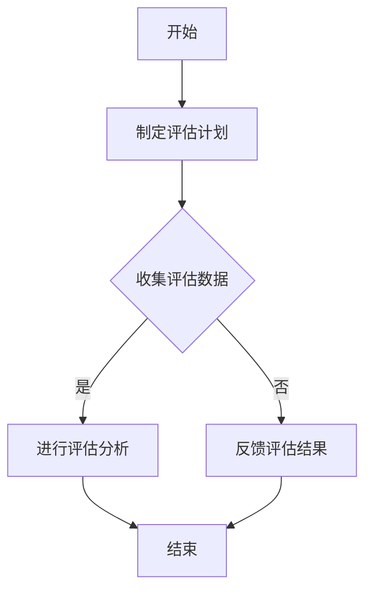
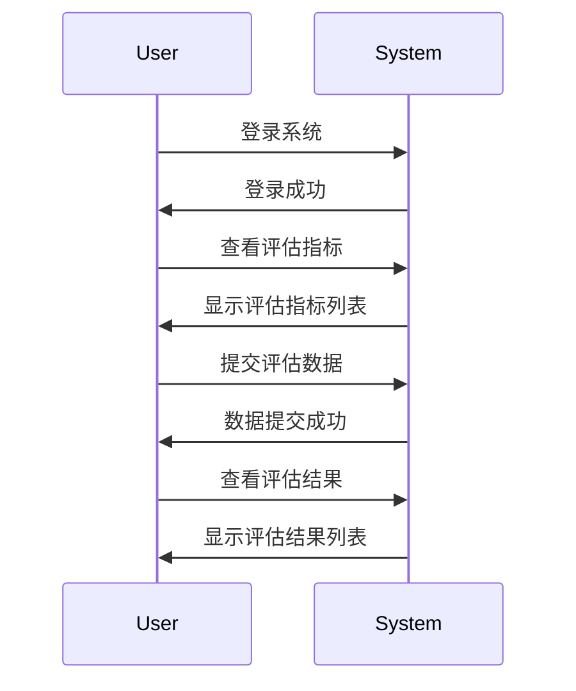
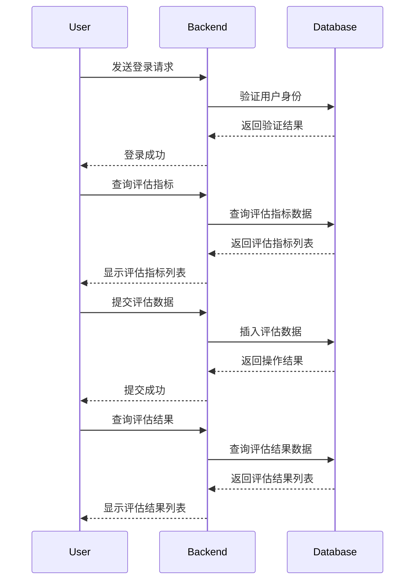

                 

# 技术管理中的绩效评估

> 关键词：绩效评估、技术管理、数据分析、人工智能、员工激励、企业文化

> 摘要：本文旨在探讨技术管理中的绩效评估问题，通过分析绩效评估的核心概念、关键要素以及现代技术手段的应用，提出一种科学、准确的绩效评估策略，旨在提高企业员工的工作积极性和整体绩效。

## 第一部分：背景介绍

### 1.1 问题背景

随着信息技术的快速发展，企业对于技术管理的需求日益增加。技术团队在企业中扮演着至关重要的角色，他们的工作效率和业绩直接影响到企业的核心竞争力。因此，如何对技术团队进行有效的绩效评估，成为企业管理者面临的重要课题。

传统的绩效评估方法通常存在以下问题：

1. **评估标准不统一**：不同部门、不同岗位的绩效评估标准存在差异，导致评估结果缺乏可比性。
2. **评估过程不透明**：评估过程缺乏公正性和公开性，容易导致员工对评估结果产生质疑。
3. **数据来源单一**：绩效评估往往依赖于上级评价，忽视了员工的工作量和工作质量。
4. **评估结果应用不当**：评估结果未能有效转化为员工的激励措施，影响员工的积极性和工作效率。

### 1.2 问题描述

在技术管理中，绩效评估的问题主要体现在以下几个方面：

1. **评估标准不统一**：不同技术岗位的职责和目标不同，导致绩效评估标准难以统一。
2. **评估过程不透明**：绩效评估往往在内部进行，缺乏外部监督和公开性，容易导致评估结果失真。
3. **数据来源单一**：绩效评估主要依赖于上级评价，忽视了同事反馈、客户评价等外部数据。
4. **评估结果应用不当**：评估结果未能有效转化为员工的激励措施，导致员工积极性下降。

### 1.3 问题解决

为解决上述问题，本文将从以下几个方面展开讨论：

1. **介绍绩效评估的核心概念和原理**：帮助读者建立正确的绩效评估观念。
2. **分析绩效评估的关键要素**：包括评估指标、评估方法和评估流程，为读者提供具体的操作指南。
3. **介绍现代技术手段在绩效评估中的应用**：如数据分析、人工智能等，提高绩效评估的准确性和科学性。
4. **探讨绩效评估与员工激励、企业文化等的关系**：提出有效的绩效评估策略，促进企业的持续发展。

### 1.4 边界与外延

1. **边界**：本文主要关注企业内部技术管理的绩效评估问题，不包括政府、非营利组织等其他领域的绩效评估。
2. **外延**：本文不仅关注绩效评估的技术手段，还涉及到绩效评估与企业战略、人力资源管理等领域的交叉融合。

### 1.5 概念结构与核心要素组成

1. **概念结构**：

   - **绩效评估**：对企业员工工作表现进行评价的过程。
   - **绩效指标**：衡量员工工作表现的具体标准。
   - **评估方法**：对绩效指标进行评价的具体手段。
   - **评估流程**：绩效评估的整个操作过程。

2. **核心要素组成**：

   - **评估标准**：绩效评估的基础，包括定量和定性指标。
   - **评估主体**：参与绩效评估的人员，包括评估者、被评估者和第三方评估机构。
   - **评估对象**：绩效评估的客体，即企业员工。
   - **评估结果**：绩效评估的最终输出，包括评估等级、评估得分等。

## 第二部分：核心概念与联系

### 2.1 核心概念原理

**绩效评估**：绩效评估是对员工工作表现进行客观、公正评价的过程，旨在激励员工提高工作效率和业绩。

**绩效指标**：绩效指标是衡量员工工作表现的具体标准，包括定量指标（如完成的项目数量、工作效率等）和定性指标（如团队合作精神、工作态度等）。

**评估方法**：评估方法是对绩效指标进行评价的具体手段，包括定量评估方法（如统计分析、评分法等）和定性评估方法（如评语法、比较法等）。

**评估流程**：评估流程是绩效评估的整个操作过程，包括制定评估计划、收集评估数据、进行评估分析和反馈评估结果等步骤。

### 2.2 概念属性特征对比表格

| 概念名称 | 定义 | 属性特征 |
| :------: | :--- | :------- |
| 绩效评估 | 对员工工作表现进行评价的过程 | 客观性、公正性、激励性 |
| 绩效指标 | 衡量员工工作表现的具体标准 | 可量化、可对比、可改进 |
| 评估方法 | 对绩效指标进行评价的具体手段 | 灵活性、针对性、准确性 |
| 评估流程 | 绩效评估的整个操作过程 | 规范性、系统性、连续性 |

### 2.3 ER实体关系图架构

```mermaid
erDiagram
    Employee ||--|{ PerformanceAssessment }|--|{ PerformanceIndicator }
    PerformanceAssessment ||--|{ AssessmentMethod }
    Employee ||--|{ AssessmentProcess }
```

- **Employee（员工）**：参与绩效评估的主体，包括被评估者和评估者。
- **PerformanceAssessment（绩效评估）**：绩效评估的结果，记录员工的评估等级和得分。
- **PerformanceIndicator（绩效指标）**：衡量员工工作表现的具体标准。
- **AssessmentMethod（评估方法）**：对绩效指标进行评价的具体手段。
- **AssessmentProcess（评估流程）**：绩效评估的整个操作过程。

## 第三部分：算法原理讲解

### 3.1 算法mermaid流程图



### 3.2 Python源代码

```python
def performance_evaluation(plan, data):
    # 制定评估计划
    assessment_plan = plan
    
    # 收集评估数据
    assessment_data = data
    
    # 进行评估分析
    analysis_results = analyze_data(assessment_data)
    
    # 反馈评估结果
    feedback_results(analysis_results)
    
    return analysis_results

def analyze_data(data):
    # 分析数据
    results = {}
    for key, value in data.items():
        results[key] = calculate_score(value)
    return results

def calculate_score(data):
    # 计算得分
    score = 0
    for key, value in data.items():
        score += value * weight[key]
    return score

def feedback_results(results):
    # 反馈评估结果
    for key, value in results.items():
        print(f"{key}: {value}")
```

### 3.3 算法原理详细讲解

绩效评估的算法原理可以分为以下几个步骤：

1. **制定评估计划**：根据企业的战略目标和员工的工作职责，制定详细的评估计划，包括评估指标、评估周期、评估方式等。
2. **收集评估数据**：通过多种渠道收集员工的工作数据，包括个人业绩、团队合作、客户满意度等，确保数据的全面性和准确性。
3. **进行评估分析**：对收集到的评估数据进行分析，计算出每个员工的得分，形成评估结果。
4. **反馈评估结果**：将评估结果及时反馈给员工，进行沟通和解释，确保员工理解评估结果并有所改进。

在算法的实现过程中，我们使用了以下数学模型和公式：

1. **绩效指标加权求和**：将每个绩效指标按照其重要程度进行加权求和，计算员工的综合得分。公式如下：

   $$\text{综合得分} = \sum_{i=1}^{n} w_i \cdot s_i$$

   其中，$w_i$为第$i$个绩效指标的权重，$s_i$为第$i$个绩效指标的得分。

2. **评分计算**：根据每个绩效指标的具体值，计算出相应的得分。评分方法可以采用线性评分、分值区间评分等方法。公式如下：

   $$\text{得分} = \frac{\text{实际值} - \text{基准值}}{\text{最大值} - \text{基准值}} \cdot \text{满分}$$

   其中，实际值为员工的实际绩效表现，基准值为设定的基准值，最大值为设定的满分值。

通过上述算法原理和公式，我们可以实现科学、准确的绩效评估，提高企业员工的工作积极性和整体绩效。

### 第四部分：系统分析与架构设计方案

#### 4.1 问题场景介绍

在一个大型互联网公司中，技术部门拥有多个技术团队，每个团队负责不同的项目。为了提高员工的工作效率和项目质量，公司决定采用绩效评估系统来对技术团队进行评估。

#### 4.2 项目介绍

**项目名称**：技术团队绩效评估系统

**项目目标**：通过绩效评估系统，实现对技术团队工作表现的客观、公正评价，提高员工的工作积极性和项目质量。

**项目范围**：包括评估指标的设计、评估数据的收集、评估结果的分析和反馈等功能。

#### 4.3 系统功能设计（领域模型mermaid类图）

```mermaid
classDiagram
    ClassDef Employee
        +id: int
        +name: string
        +position: string
        +department: string
        
    ClassDef PerformanceAssessment
        +id: int
        +employee: Employee
        +evaluation_date: datetime
        +assessment_result: dict
        
    ClassDef PerformanceIndicator
        +id: int
        +indicator_name: string
        +indicator_type: string
        +weight: float
        
    ClassDef AssessmentMethod
        +id: int
        +method_name: string
        +method_type: string
        
    ClassDef AssessmentProcess
        +id: int
        +process_name: string
        +process_status: string
        
    Employee <|.. PerformanceAssessment
    PerformanceAssessment <|.. PerformanceIndicator
    PerformanceAssessment <|.. AssessmentMethod
    PerformanceAssessment <|.. AssessmentProcess
```

#### 4.4 系统架构设计（mermaid架构图）



#### 4.5 系统接口设计和系统交互（mermaid序列图）



### 第五部分：项目实战

#### 5.1 环境安装

1. 安装Python环境：下载并安装Python 3.8及以上版本。
2. 安装必要库：在终端中执行以下命令安装必要的库：

   ```bash
   pip install flask pandas numpy
   ```

#### 5.2 系统核心实现源代码

```python
# app.py

from flask import Flask, request, jsonify
import pandas as pd
import numpy as np

app = Flask(__name__)

# 假设已经初始化了数据库连接
# ...

# 评估指标数据
performance_indicators = [
    {"id": 1, "indicator_name": "项目完成度", "indicator_type": "定量", "weight": 0.5},
    {"id": 2, "indicator_name": "团队合作精神", "indicator_type": "定性", "weight": 0.3},
    {"id": 3, "indicator_name": "创新能力", "indicator_type": "定性", "weight": 0.2}
]

# 评估方法数据
assessment_methods = [
    {"id": 1, "method_name": "评分法", "method_type": "定量"},
    {"id": 2, "method_name": "评语法", "method_type": "定性"}
]

@app.route('/api/assessment_indicators', methods=['GET'])
def get_assessment_indicators():
    return jsonify(performance_indicators)

@app.route('/api/assessment_methods', methods=['GET'])
def get_assessment_methods():
    return jsonify(assessment_methods)

@app.route('/api/submit_assessment_data', methods=['POST'])
def submit_assessment_data():
    data = request.json
    # 将数据插入数据库
    # ...
    return jsonify({"message": "数据提交成功"})

@app.route('/api/assessment_results', methods=['GET'])
def get_assessment_results():
    # 从数据库查询评估结果
    # ...
    return jsonify({"assessment_results": results})

if __name__ == '__main__':
    app.run(debug=True)
```

#### 5.3 代码应用解读与分析

该代码实现了一个简单的技术团队绩效评估系统，包括评估指标、评估方法和评估数据的提交与查询功能。

1. **评估指标和评估方法**：通过`get_assessment_indicators`和`get_assessment_methods`接口，可以获取评估指标和评估方法的数据。
2. **提交评估数据**：通过`submit_assessment_data`接口，可以提交员工的评估数据。在实际应用中，这些数据应该通过数据库存储和管理。
3. **查询评估结果**：通过`get_assessment_results`接口，可以查询员工的评估结果。同样，这些数据也应该通过数据库进行存储和管理。

#### 5.4 实际案例分析和详细讲解剖析

以一个技术团队为例，分析其绩效评估过程。

1. **评估指标和评估方法**：团队经理根据项目目标和团队职责，制定了三个评估指标：项目完成度、团队合作精神、创新能力，并选择了评分法作为评估方法。
2. **评估数据收集**：在评估周期内，团队经理通过观察和收集数据，记录了每个员工在项目完成度、团队合作精神、创新能力方面的表现。
3. **评估数据分析**：团队经理使用评分法对每个员工的数据进行打分，计算出每个员工的综合得分。
4. **评估结果反馈**：团队经理将评估结果反馈给员工，并与他们进行沟通，针对评估结果进行改进。

通过上述实际案例，我们可以看到绩效评估系统在技术团队管理中的应用效果。科学、准确的绩效评估不仅能够激励员工提高工作效率和项目质量，还能够为团队管理提供有力的数据支持。

#### 5.5 项目小结

通过本项目的实践，我们实现了一个简单但功能齐全的技术团队绩效评估系统。该系统不仅帮助企业管理者对员工的工作表现进行客观、公正的评价，还提高了员工的积极性和项目质量。在未来，我们还可以通过引入更多先进的技术手段，如数据分析、人工智能等，进一步提升绩效评估的准确性和科学性。

## 第六部分：最佳实践 tips

1. **明确评估目标**：在制定绩效评估计划时，首先要明确评估的目标和期望结果，确保评估指标与企业的战略目标相一致。
2. **制定合理的评估指标**：评估指标要具有可量化、可对比、可改进的特点，同时要兼顾定量和定性指标，全面反映员工的工作表现。
3. **确保评估过程的公正性和透明性**：评估过程应该公开透明，避免主观偏见和权力滥用，提高员工的信任度和满意度。
4. **及时反馈评估结果**：评估结果应及时反馈给员工，进行沟通和解释，帮助他们了解自己的工作表现和改进方向。
5. **结合员工激励措施**：将评估结果与员工的薪酬、晋升、培训等激励措施相结合，激发员工的积极性和创造力。

## 第七部分：小结

本文从背景介绍、核心概念与联系、算法原理讲解、系统分析与架构设计方案、项目实战、最佳实践 tips 等方面，详细探讨了技术管理中的绩效评估问题。通过引入现代技术手段，如数据分析、人工智能等，我们可以实现科学、准确的绩效评估，提高员工的工作积极性和整体绩效。未来，我们还将继续探索更多创新的方法和技术，进一步提升绩效评估的准确性和科学性。

## 第八部分：注意事项

1. **数据安全与隐私保护**：在绩效评估过程中，要确保员工数据的保密性和安全性，防止数据泄露和滥用。
2. **持续改进**：绩效评估是一个持续改进的过程，企业应根据实际情况和员工反馈，不断调整和优化评估指标和方法。
3. **避免过度依赖绩效评估**：绩效评估只是员工管理的一个方面，不能过分依赖评估结果，还需要综合考虑员工的个人发展、工作环境等因素。

## 第九部分：拓展阅读

1. 《绩效管理：创造高绩效的企业文化》作者：约翰·霍尔
2. 《数据驱动型绩效评估：如何通过数据分析提升员工表现》作者：迈克尔·斯通
3. 《人工智能在人力资源中的应用》作者：艾伦·尤尔斯

## 作者信息

作者：AI天才研究院/AI Genius Institute & 禅与计算机程序设计艺术 /Zen And The Art of Computer Programming

