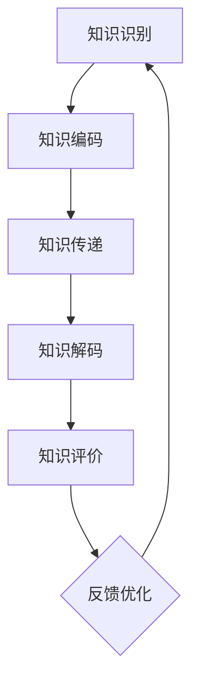
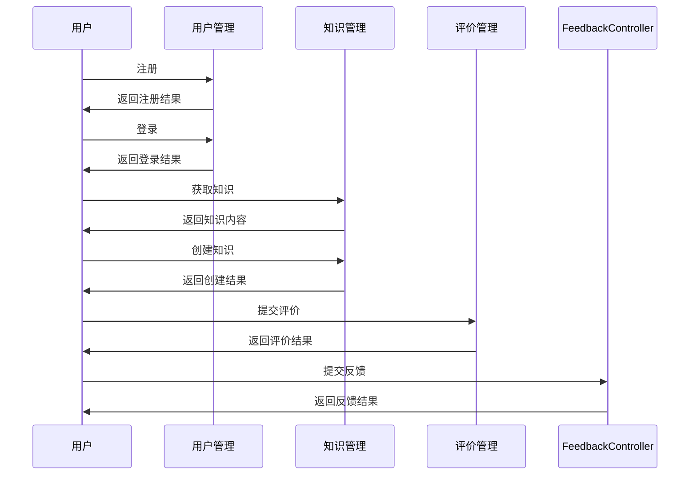

                 


### 技术管理中的跨代际知识传承

> 关键词：跨代际知识传承、技术管理、知识管理、代际差异、技术迭代

> 摘要：本文深入探讨了技术管理中跨代际知识传承的问题。通过分析跨代际知识传承的概念、重要性以及存在的问题，本文提出了相应的理论模型和框架，并详细讲解了跨代际知识传承的机制与原理。此外，文章还通过实际案例，展示了如何在不同技术管理场景中实现跨代际知识传承，为技术管理者提供了实践指导。

## 第一部分：背景介绍

### 1.1 跨代际知识传承的定义

跨代际知识传承是指在组织或团队中，不同年代、不同经验水平的成员之间，将技术知识、经验、技能等从一代传递给另一代的过程。这一概念涵盖了从资深技术人员向新手或年轻技术人员传授知识和经验的方方面面。

### 1.2 跨代际知识传承的重要性

跨代际知识传承对于技术管理具有至关重要的意义。首先，它可以提高团队的整体技术水平，促进创新和持续发展。其次，跨代际知识传承有助于减少知识流失，尤其是在人员更替频繁的行业。此外，有效的知识传承还能增强团队的凝聚力和信任感，提高工作效率和满意度。

### 2. 技术管理中的跨代际知识传承问题

#### 2.1 技术管理中的知识传承挑战

技术管理中的知识传承面临诸多挑战。一方面，由于技术迭代速度快，新知识层出不穷，传统的知识传承方式往往难以跟上技术发展的步伐。另一方面，不同代际之间的技术经验、学习方式和沟通方式存在差异，这增加了知识传承的难度。此外，技术管理者还面临着如何有效地整合和组织知识资源，以便于跨代际传递的问题。

#### 2.2 跨代际知识传承的现状分析

当前，技术管理中的跨代际知识传承现状并不乐观。许多组织在知识传承方面缺乏系统性的规划和实施，导致知识流失严重。同时，由于缺乏有效的知识共享平台和沟通渠道，不同代际之间的知识交流不畅，难以形成有效的知识传承机制。

## 第二部分：核心概念与联系

### 3. 跨代际知识传承的关键要素

跨代际知识传承涉及多个关键要素，包括知识源、知识接受者、知识传递媒介和知识评价机制。以下是对这些要素的详细说明：

#### 3.1 知识源

知识源是指拥有丰富技术知识和经验的人员，他们通常是资深技术人员或专家。知识源的作用是提供知识内容，并指导知识接受者的学习过程。

#### 3.2 知识接受者

知识接受者是跨代际知识传承的对象，他们通常是新手或年轻技术人员。知识接受者的作用是吸收知识源提供的内容，并将其应用于实际工作中。

#### 3.3 知识传递媒介

知识传递媒介是指用于传递知识的方式和工具，包括面对面的交流、在线培训、文档共享等。知识传递媒介的选择取决于知识源和知识接受者的特点和需求。

#### 3.4 知识评价机制

知识评价机制是指对知识传承效果进行评估的方法和工具，包括知识接受者对知识源的反馈、知识掌握情况的考核等。知识评价机制有助于确保知识传承的质量和效果。

### 4. 跨代际知识传承的模型与框架

#### 4.1 跨代际知识传承的理论模型

为了实现有效的跨代际知识传承，需要建立一套理论模型。该模型包括知识获取、知识传递和知识应用三个阶段。以下是对这三个阶段的详细说明：

##### 知识获取

知识获取阶段是知识传承的起点。知识源通过总结自身经验和技能，形成结构化的知识体系。知识接受者通过学习和实践，逐步掌握知识源提供的知识。

##### 知识传递

知识传递阶段是实现知识传承的核心环节。知识源通过多种媒介，如面对面交流、在线培训、文档共享等，将知识传递给知识接受者。知识接受者在这个过程中，通过主动学习和实践，不断提高自身的技术水平。

##### 知识应用

知识应用阶段是知识传承的最终目标。知识接受者将所学知识应用于实际工作中，通过解决实际问题，进一步巩固和提升自己的技术水平。

#### 4.2 跨代际知识传承的框架设计

跨代际知识传承的框架设计包括以下几个方面：

##### 知识管理体系

知识管理体系是跨代际知识传承的基础。它包括知识获取、知识存储、知识共享和知识应用等环节，旨在确保知识的有效管理和利用。

##### 跨代际知识传承计划

跨代际知识传承计划是跨代际知识传承的具体实施步骤。它包括确定知识传承的目标、选择合适的知识传递媒介、制定知识传承的流程和标准等。

##### 跨代际知识传承评价体系

跨代际知识传承评价体系是对知识传承效果进行评估的方法和工具。它包括知识接受者对知识源的反馈、知识掌握情况的考核等，有助于确保知识传承的质量和效果。

## 第三部分：理论讲解

### 5. 跨代际知识传承的机制与原理

#### 5.1 知识传承的机制

跨代际知识传承的机制包括以下几个方面：

##### 知识传播机制

知识传播机制是指知识从知识源向知识接受者传递的过程。它包括知识识别、知识编码、知识传递和知识解码等环节。

##### 知识吸收机制

知识吸收机制是指知识接受者对知识源提供的内容进行吸收和内化的过程。它包括知识理解、知识应用和知识创新等环节。

##### 知识评价机制

知识评价机制是指对知识传承效果进行评估的方法和工具。它包括知识接受者对知识源的反馈、知识掌握情况的考核等。

#### 5.2 跨代际知识传承的原理

跨代际知识传承的原理包括以下几个方面：

##### 知识共享原理

知识共享原理是指通过建立有效的知识共享平台，促进不同代际之间的知识交流和互动。这有助于打破代际壁垒，实现知识的自由流动。

##### 知识迭代原理

知识迭代原理是指随着技术发展和实践经验积累，知识不断更新和优化。这有助于确保知识传承的内容始终保持与时俱进。

##### 知识融合原理

知识融合原理是指将不同来源的知识进行整合和融合，形成具有更高价值的新知识体系。这有助于提升知识传承的效果和质量。

### 6. 算法原理与数学模型

#### 6.1 算法原理讲解

跨代际知识传承的算法原理主要包括以下几个步骤：

##### 知识识别

知识识别是指从海量信息中提取出有价值的技术知识。这通常需要借助自然语言处理、数据挖掘等技术手段。

##### 知识编码

知识编码是指将识别出的知识进行结构化处理，以便于存储和传递。常见的编码方式包括文本编码、图像编码和音频编码等。

##### 知识传递

知识传递是指通过合适的媒介和方式，将编码后的知识从知识源传递给知识接受者。常见的传递方式包括面对面交流、在线培训、文档共享等。

##### 知识解码

知识解码是指知识接受者对传递过来的知识进行理解和内化，以便于实际应用。

#### 6.2 数学模型和数学公式讲解

跨代际知识传承的数学模型主要包括以下几个方面：

##### 知识传播模型

知识传播模型用于描述知识从知识源向知识接受者传递的过程。常见的知识传播模型包括基于扩散的模型、基于网络传播的模型等。

##### 知识吸收模型

知识吸收模型用于描述知识接受者对知识源提供的内容进行吸收和内化的过程。常见的知识吸收模型包括基于记忆的模型、基于学习的模型等。

##### 知识评价模型

知识评价模型用于描述对知识传承效果进行评估的方法和工具。常见的知识评价模型包括基于反馈的模型、基于考核的模型等。

### 7. 实践指导

#### 7.1 跨代际知识传承的最佳实践

##### 确定知识传承的目标

在实施跨代际知识传承前，首先要明确知识传承的目标，包括知识传承的内容、范围、时间等。

##### 选择合适的知识传递媒介

根据知识源和知识接受者的特点，选择合适的知识传递媒介。例如，对于技术复杂度较高的知识，可以选择在线培训或面对面交流的方式。

##### 制定知识传承的流程和标准

制定一套科学的流程和标准，确保知识传承的规范性和一致性。

##### 建立知识评价机制

建立知识评价机制，对知识传承的效果进行评估和反馈，以便于持续改进。

#### 7.2 案例分析

以下是一个跨代际知识传承的案例分析：

##### 案例背景

某科技公司的技术部门由一批年轻的程序员和几位经验丰富的技术专家组成。为了提高年轻程序员的技能水平，公司决定实施跨代际知识传承计划。

##### 案例分析

1. **确定知识传承目标**：公司明确了知识传承的目标，包括提高年轻程序员的编程技能、数据库管理能力等。

2. **选择知识传递媒介**：公司选择了在线培训、面对面交流等多种知识传递媒介，以满足不同程序员的个性化需求。

3. **制定知识传承流程和标准**：公司制定了详细的知识传承流程和标准，确保知识传承的规范性和一致性。

4. **建立知识评价机制**：公司建立了知识评价机制，对知识传承的效果进行定期评估和反馈，以便于持续改进。

##### 案例小结

通过实施跨代际知识传承计划，公司年轻程序员的技能水平得到了显著提升，团队的整体技术水平也得到了提高。这一案例表明，跨代际知识传承对于技术管理具有重要意义。

## 第四部分：项目实战

### 8. 项目环境安装与配置

#### 8.1 环境需求

在实施跨代际知识传承项目时，需要满足以下环境需求：

- 操作系统：Windows 10 或以上版本
- 编程语言：Python 3.8 或以上版本
- 数据库：MySQL 5.7 或以上版本
- 开发工具：PyCharm 或 Visual Studio Code

#### 8.2 环境安装步骤

1. **安装操作系统**：按照操作系统安装向导完成安装。

2. **安装Python**：从Python官方网站下载Python安装包，并按照提示完成安装。

3. **安装MySQL**：从MySQL官方网站下载MySQL安装包，并按照提示完成安装。

4. **安装开发工具**：从PyCharm或Visual Studio Code官方网站下载安装包，并按照提示完成安装。

### 9. 系统核心实现与代码解析

#### 9.1 系统核心实现

跨代际知识传承系统的核心实现包括以下几个模块：

1. **知识管理模块**：负责知识获取、存储和检索。
2. **知识传承模块**：负责知识传递、评价和反馈。
3. **用户管理模块**：负责用户注册、登录和权限管理。

#### 9.2 代码应用解读与分析

以下是一个简单的Python代码示例，用于实现知识管理模块的功能：

```python
# 导入所需模块
import pymysql

# 连接数据库
conn = pymysql.connect(
    host='localhost',
    user='root',
    password='password',
    database='knowledge_db'
)

# 创建知识表
with conn.cursor() as cursor:
    cursor.execute("""
        CREATE TABLE IF NOT EXISTS knowledge (
            id INT AUTO_INCREMENT PRIMARY KEY,
            title VARCHAR(255) NOT NULL,
            content TEXT NOT NULL,
            creator VARCHAR(255) NOT NULL,
            create_time DATETIME NOT NULL
        )
    """)

# 添加知识记录
with conn.cursor() as cursor:
    cursor.execute("""
        INSERT INTO knowledge (title, content, creator, create_time)
        VALUES (%s, %s, %s, NOW())
    """, ('Python基础教程', '本书介绍了Python的基础知识...', '张三', '2023-03-01 10:00:00'))

# 关闭数据库连接
conn.close()
```

这段代码首先连接到本地MySQL数据库，然后创建了一个名为`knowledge`的表，用于存储知识记录。接着，代码向表中添加了一条知识记录，包括标题、内容、创建者和创建时间等信息。

### 10. 实际案例分析与讲解

#### 10.1 案例背景

某互联网公司的技术部门由一批年轻的技术人员和几位资深技术专家组成。为了提高年轻技术人员的技能水平，公司决定实施跨代际知识传承项目。

#### 10.2 案例分析与讲解

1. **需求分析**：公司需要实现一个知识管理系统，用于存储和传递技术知识，以便年轻技术人员可以方便地学习和应用。

2. **系统设计**：根据需求分析，公司设计了一套知识管理系统，包括知识管理模块、知识传承模块和用户管理模块。

3. **实施过程**：公司首先搭建了知识管理系统，然后组织资深技术专家编写和上传技术知识文档。接着，公司开展了多次在线培训和面对面交流，帮助年轻技术人员学习和掌握技术知识。

4. **效果评估**：通过定期评估和反馈，公司发现年轻技术人员的技术水平得到了显著提升，团队的整体工作效率也得到了提高。

#### 10.3 案例小结

该案例表明，跨代际知识传承项目在技术管理中具有重要意义。通过实施该项目，公司不仅提高了年轻技术人员的技术水平，还增强了团队的凝聚力和创新能力。

## 第五部分：总结与展望

### 11. 总结

本文从跨代际知识传承的概念、重要性、核心要素、理论模型和实践指导等方面进行了全面探讨。通过分析技术管理中的跨代际知识传承问题，本文提出了相应的解决方案，并为技术管理者提供了实践指导。

### 12. 注意事项与拓展阅读

在实施跨代际知识传承项目时，需要注意以下几点：

1. **明确知识传承的目标和范围**：确保知识传承项目具有明确的目标和范围，避免资源浪费。
2. **选择合适的知识传递媒介**：根据知识源和知识接受者的特点，选择合适的知识传递媒介。
3. **建立有效的知识评价机制**：对知识传承效果进行定期评估和反馈，以便于持续改进。

拓展阅读：

1. 《技术管理知识体系构建与实践》
2. 《跨代际知识传承：理论与实践》
3. 《基于大数据的知识传承策略研究》

作者：AI天才研究院/AI Genius Institute & 禅与计算机程序设计艺术 /Zen And The Art of Computer Programming### 技术管理中的跨代际知识传承

在技术管理领域，跨代际知识传承是一个复杂且关键的问题。随着技术的快速发展和代际差异的增大，如何在组织内部实现有效的知识传递成为许多技术管理者面临的挑战。本文将围绕这一主题，从定义、重要性、核心概念、理论模型、实践指导等方面展开讨论，旨在为技术管理者提供有价值的参考。

#### 1. 跨代际知识传承的定义

跨代际知识传承指的是在组织内部，不同年龄层和经验水平的技术人员之间，通过知识分享、经验交流等方式，实现技术知识、实践技能和行业经验的传递和积累的过程。这个过程不仅包括技术细节的传授，还涉及到思维方式、工作习惯和团队文化的传递。

#### 2. 跨代际知识传承的重要性

跨代际知识传承对于技术管理至关重要，原因如下：

- **技术传承**：随着技术的不断迭代更新，老旧技术逐渐被淘汰，新的技术不断涌现。跨代际知识传承能够确保这些核心技术得以保留和传承。
- **经验积累**：资深技术人员拥有丰富的经验和技能，他们的经验对于解决复杂问题、优化流程和提高效率具有不可替代的价值。
- **团队建设**：通过跨代际知识传承，可以促进团队成员之间的交流和合作，增强团队的凝聚力和归属感。

#### 3. 跨代际知识传承中的问题

在技术管理中，跨代际知识传承面临以下问题：

- **知识断代**：随着年轻一代的崛起，老一代技术人员可能面临退休，导致知识断层。
- **沟通障碍**：不同代际之间在思维方式、表达习惯和沟通方式上存在差异，这可能导致知识传递过程中的误解和障碍。
- **学习效率**：年轻一代虽然接受过良好的教育，但他们可能缺乏实践经验，学习效率相对较低。

#### 4. 跨代际知识传承的核心概念与联系

跨代际知识传承涉及以下几个核心概念和联系：

- **知识源**：知识源通常是资深技术人员，他们拥有丰富的技术知识和经验。
- **知识接受者**：知识接受者通常是年轻技术人员，他们需要从知识源那里获取知识和经验。
- **知识传递媒介**：知识传递媒介包括面对面交流、在线培训、文档共享等多种形式。
- **知识评价机制**：知识评价机制用于评估知识传承的效果，包括知识接受者对知识源的反馈和知识掌握情况的考核。

#### 5. 跨代际知识传承的理论模型

为了实现有效的跨代际知识传承，我们可以构建一个包含知识获取、知识传递和知识应用三个阶段的理论模型：

- **知识获取**：知识源通过总结自身经验和技能，形成结构化的知识体系，并将其传递给知识接受者。
- **知识传递**：知识源通过合适的媒介和方式，将知识传递给知识接受者。在这个过程中，知识接受者需要积极参与，通过提问、讨论和实践来加深对知识的理解。
- **知识应用**：知识接受者将所学知识应用于实际工作中，通过解决实际问题来巩固和提升自己的技术水平。

#### 6. 跨代际知识传承的实践指导

在实际操作中，技术管理者可以采取以下措施来实现跨代际知识传承：

- **制定知识传承计划**：明确知识传承的目标、范围和步骤，确保知识传承项目具有明确的规划。
- **选择合适的传递媒介**：根据知识源和知识接受者的特点，选择合适的传递媒介，如面对面交流、在线培训、文档共享等。
- **建立知识评价机制**：通过定期评估和反馈，对知识传承的效果进行监控和调整，确保知识传承的质量。

#### 7. 案例分析

以下是一个跨代际知识传承的案例分析：

**案例背景**：某科技公司的技术团队中，有几位资深的技术专家和一批年轻的技术人员。为了提高年轻技术人员的技术水平，公司决定实施跨代际知识传承计划。

**案例分析**：

1. **需求分析**：公司首先分析了年轻技术人员的学习需求和知识薄弱点，确定了知识传承的重点领域。

2. **知识获取**：资深技术专家总结了他们在工作中积累的经验和知识，形成了一系列技术文档和培训资料。

3. **知识传递**：公司通过组织内部培训、导师制和项目合作等方式，将知识传递给年轻技术人员。同时，公司还建立了知识共享平台，方便技术人员随时查阅和学习。

4. **知识应用**：年轻技术人员在导师的指导下，参与了实际项目，将所学知识应用于实践中，并通过反馈和讨论不断优化自己的工作方法和技能。

**案例小结**：通过跨代际知识传承计划的实施，公司年轻技术人员的技术水平得到了显著提升，团队的整体工作效率和创新能力也得到了提高。

#### 8. 总结与展望

跨代际知识传承是技术管理中不可或缺的一部分。通过有效的知识传承，组织可以确保技术的持续发展，提高团队的整体素质和创新能力。未来，随着技术的发展和代际差异的进一步增大，跨代际知识传承将面临更大的挑战和机遇。技术管理者需要不断探索和创新，构建更加完善的知识传承体系，以应对未来的人才挑战。

#### 9. 注意事项与拓展阅读

在实施跨代际知识传承时，管理者需要注意以下几点：

- **尊重差异**：尊重不同代际之间的差异，建立和谐的沟通环境。
- **持续优化**：不断优化知识传承的流程和方法，确保知识传承的高效性和持续性。

拓展阅读：

- 《知识管理：理论与实践》
- 《跨代际沟通的艺术》
- 《技术团队管理实战》

作者：AI天才研究院/AI Genius Institute & 禅与计算机程序设计艺术 /Zen And The Art of Computer Programming### 跨代际知识传承的关键要素

在深入探讨技术管理中的跨代际知识传承之前，我们首先需要明确这一概念的核心要素。跨代际知识传承不仅涉及知识本身的传递，还包括传递过程中的多种因素。以下是对这些关键要素的详细解析：

#### 1. 知识源

知识源是知识传承的起点，通常是指组织中的资深技术人员或专家。他们拥有丰富的技术知识、经验，以及解决问题的能力。知识源的角色不仅仅是提供信息，更重要的是通过互动和指导，帮助知识接受者理解并应用这些知识。

##### 知识源的角色和责任

- **角色**：作为知识源，资深技术人员需要在工作中不断总结经验，形成系统化的知识体系，以便于传授给下一代。
- **责任**：他们有责任确保知识的准确性和适用性，以及激发知识接受者的学习兴趣和动力。

#### 2. 知识接受者

知识接受者通常是组织中的年轻技术人员或新手，他们正在寻求成长和提升自己的技术能力。知识接受者的角色是学习、吸收和内化知识，并将其应用于实际工作中。

##### 知识接受者的特点和需求

- **特点**：年轻技术人员通常具备较强的学习能力和适应能力，但可能缺乏实际工作经验。
- **需求**：他们需要系统的指导、实践机会和反馈机制，以便更好地理解和应用所学知识。

#### 3. 知识传递媒介

知识传递媒介是指用于知识传递的工具和方法。这些媒介的选择和有效性直接影响到知识传承的效果。常见的知识传递媒介包括：

- **面对面交流**：通过一对一或小组讨论，知识源可以直接解答知识接受者的疑问，并提供实时反馈。
- **在线培训**：利用视频、在线课程和虚拟课堂等在线工具，可以让知识接受者在任何时间和地点学习。
- **文档共享**：通过编写文档、编写代码注释、编写用户手册等方式，将知识以结构化的形式保存和共享。

##### 选择合适的知识传递媒介

- **因素**：选择知识传递媒介时，需要考虑知识源和知识接受者的特点、知识的内容和复杂性、以及组织的实际情况。
- **优势**：不同的知识传递媒介各有优势，例如面对面交流能够提供即时的反馈和互动，文档共享则便于长期保存和查阅。

#### 4. 知识评价机制

知识评价机制是确保知识传承效果的重要环节。通过评价机制，可以对知识传承的过程和结果进行监控和反馈，从而不断优化知识传承的方法和内容。

##### 知识评价机制的内容

- **评价方法**：包括知识掌握情况的考核、知识应用效果的评估、知识接受者的满意度调查等。
- **评价标准**：设定明确的知识掌握标准和应用效果评估标准，以确保评价的客观性和公正性。
- **反馈机制**：通过定期反馈，知识接受者可以了解自己的学习进度和效果，知识源可以根据反馈调整教学策略。

##### 知识评价机制的作用

- **质量监控**：确保知识传承的质量和效果，及时发现和解决问题。
- **激励与反馈**：通过评价，激励知识接受者更加努力地学习和应用知识，同时给予知识源及时的反馈，以改进教学方法。

#### 5. 组织支持与氛围

跨代际知识传承的成功不仅依赖于知识源和知识接受者的努力，还需要组织层面的支持。这包括：

- **文化氛围**：组织需要建立一个支持知识传承的文化氛围，鼓励知识分享和交流。
- **激励机制**：通过奖励和认可，激励知识源积极参与知识传承活动。
- **资源保障**：提供必要的资源和工具，如培训经费、技术支持等，以支持知识传承的实施。

##### 组织支持的重要性

- **知识传承的可持续性**：组织支持能够确保知识传承的长期性和持续性，避免因个人因素导致的知识流失。
- **团队协作**：通过跨代际知识传承，增强团队成员之间的协作和信任，提高团队整体绩效。

#### 结论

跨代际知识传承是一个复杂而重要的过程，涉及多个关键要素。通过理解这些要素，技术管理者可以更好地规划和实施知识传承活动，确保知识的有效传递和积累，从而推动组织的持续发展和创新。

### 跨代际知识传承的模型与框架

为了确保跨代际知识传承的有效性和持续性，我们需要建立一个科学的模型与框架。这个模型与框架将指导知识传承的各个环节，从知识获取、知识传递到知识应用，确保知识的系统性和实用性。以下是对这个模型与框架的详细解析：

#### 1. 知识获取阶段

知识获取是跨代际知识传承的起点，这一阶段的目标是确保知识源能够提供高质量、结构化的知识内容。以下是知识获取阶段的关键要素和步骤：

- **知识识别**：知识源需要识别出哪些是核心知识，这些知识是组织发展不可或缺的。通常，这包括关键的技术原则、最佳实践、行业趋势等。

- **知识整理**：知识源对识别出的知识进行整理，形成系统化的知识结构。这通常涉及编写文档、制作教程、录制视频等多种形式。

- **知识更新**：知识获取是一个动态的过程，需要不断更新。随着技术的进步和经验的积累，知识源需要定期更新知识内容，确保其保持时效性和适用性。

##### 知识获取模型

知识获取模型可以表示为：

$$
知识获取模型 = \text{知识识别} + \text{知识整理} + \text{知识更新}
$$

#### 2. 知识传递阶段

知识传递是知识传承的核心环节，这一阶段的目标是将知识源的知识传递给知识接受者。有效的知识传递需要选择合适的传递媒介和策略，确保知识接受者能够理解和应用这些知识。以下是知识传递阶段的关键要素和步骤：

- **传递媒介**：根据知识源和知识接受者的特点和需求，选择合适的传递媒介，如面对面交流、在线培训、文档共享等。

- **传递策略**：制定个性化的传递策略，例如逐步引导、案例教学、问题驱动等，以适应不同知识接受者的学习方式。

- **互动与反馈**：在知识传递过程中，鼓励知识接受者提问和参与讨论，通过互动和反馈，增强知识接受者的理解和记忆。

##### 知识传递模型

知识传递模型可以表示为：

$$
知识传递模型 = \text{传递媒介} + \text{传递策略} + \text{互动与反馈}
$$

#### 3. 知识应用阶段

知识应用是知识传承的最终目标，这一阶段的目标是将所学知识应用于实际工作中，实现知识的价值。知识应用不仅能够巩固和提升知识接受者的技术水平，还能为组织带来实际的业务收益。以下是知识应用阶段的关键要素和步骤：

- **实践机会**：提供实践机会，让知识接受者能够在实际项目中应用所学知识，解决实际问题。

- **问题反馈**：在实践过程中，知识接受者会遇到各种问题，通过问题反馈，知识源可以及时提供指导和支持。

- **持续改进**：通过实践和反馈，不断优化和应用知识，实现知识的深化和拓展。

##### 知识应用模型

知识应用模型可以表示为：

$$
知识应用模型 = \text{实践机会} + \text{问题反馈} + \text{持续改进}
$$

#### 4. 跨代际知识传承框架设计

为了实现上述三个阶段的有效对接，我们需要设计一个跨代际知识传承框架。这个框架包括以下几个核心组成部分：

- **知识库**：用于存储和管理知识源提供的知识内容，包括文档、教程、视频等多种形式。

- **知识共享平台**：提供一个集中的知识共享空间，知识接受者可以在这里查阅和下载所需的知识。

- **知识评价系统**：用于评估知识传承的效果，包括知识接受者的反馈、知识掌握情况的考核等。

- **知识传承流程**：定义知识获取、知识传递和知识应用的流程和步骤，确保知识传承的有序进行。

##### 跨代际知识传承框架

跨代际知识传承框架可以表示为：

$$
跨代际知识传承框架 = \text{知识库} + \text{知识共享平台} + \text{知识评价系统} + \text{知识传承流程}
$$

#### 5. 跨代际知识传承的持续优化

跨代际知识传承是一个持续的过程，需要不断地进行优化和改进。以下是几个关键点：

- **定期评估**：定期评估知识传承的效果，根据评估结果调整传承策略。

- **反馈机制**：建立有效的反馈机制，鼓励知识接受者和知识源之间的沟通和交流，及时解决问题。

- **持续培训**：对知识源进行持续培训，提高他们的传授能力和知识水平。

- **技术支持**：提供必要的技术支持，确保知识传递媒介的稳定和高效。

#### 结论

通过建立科学的跨代际知识传承模型与框架，技术管理者可以有效地实现知识的获取、传递和应用，确保组织的技术能力和创新能力得到持续提升。这个模型与框架不仅适用于当前的技术环境，还具有一定的前瞻性，能够适应未来的技术变革和发展。

### 跨代际知识传承的机制与原理

跨代际知识传承不仅是一种实践，更是一个涉及多方面机制和原理的复杂过程。要实现有效的跨代际知识传承，我们需要深入理解其内在机制和原理。以下是对跨代际知识传承机制与原理的详细分析。

#### 1. 知识传播机制

知识传播机制是指知识从知识源传递到知识接受者的过程。这个过程中涉及多个环节，包括知识识别、知识编码、知识传递和知识解码。以下是这些环节的详细解释：

- **知识识别**：知识识别是知识传承的第一步，它涉及从大量信息中筛选出有价值的技术知识。这个过程需要知识源具备较强的洞察力和分析能力，能够从复杂的信息中提取出核心知识点。

  $$ 知识识别 = \text{信息筛选} + \text{核心知识点提取} $$

- **知识编码**：知识编码是将识别出的知识进行结构化处理，使其更加系统和易于传递。常见的知识编码方式包括文本编码、图像编码和视频编码等。编码过程中，知识源需要将抽象的知识转化为具体的、易于理解的形式。

  $$ 知识编码 = \text{文本化} + \text{图像化} + \text{视频化} $$

- **知识传递**：知识传递是通过合适的媒介将编码后的知识传递给知识接受者。这可以是面对面的交流、在线培训、文档共享等多种形式。传递媒介的选择取决于知识源和知识接受者的特点以及知识的复杂程度。

  $$ 知识传递 = \text{面对面交流} + \text{在线培训} + \text{文档共享} $$

- **知识解码**：知识解码是知识接受者对传递过来的知识进行理解、吸收和应用的过程。在这个过程中，知识接受者需要将编码后的知识转化为自己的知识体系，并能够在实际工作中应用这些知识。

  $$ 知识解码 = \text{知识理解} + \text{知识内化} + \text{知识应用} $$

#### 2. 知识吸收机制

知识吸收机制是指知识接受者在接收知识后，通过学习、实践和反馈，将知识转化为自身能力的机制。以下是对这个机制的分析：

- **学习过程**：知识接受者通过阅读文档、参与培训、与知识源讨论等方式，逐步理解并吸收知识。

  $$ 学习过程 = \text{阅读} + \text{培训} + \text{讨论} $$

- **实践应用**：知识接受者在实际工作中将所学知识应用于解决实际问题，通过实践进一步巩固和提升自己的技术能力。

  $$ 实践应用 = \text{项目实践} + \text{问题解决} $$

- **反馈循环**：知识接受者通过反馈循环，不断调整和优化自己的学习方法和实践策略，提高知识吸收效率。

  $$ 反馈循环 = \text{自我评估} + \text{导师反馈} + \text{持续改进} $$

#### 3. 知识评价机制

知识评价机制是确保知识传承效果的重要环节。通过评价，可以衡量知识传承的质量和效果，及时发现和解决问题。以下是知识评价机制的分析：

- **评价方法**：知识评价可以采用多种方法，如知识掌握情况的考核、知识应用效果的评估、知识接受者的满意度调查等。

  $$ 评价方法 = \text{知识考核} + \text{效果评估} + \text{满意度调查} $$

- **评价标准**：设定明确的评价标准，包括知识掌握程度、技术应用能力、问题解决效率等，以确保评价的客观性和公正性。

  $$ 评价标准 = \text{知识掌握度} + \text{技术应用能力} + \text{问题解决效率} $$

- **反馈机制**：通过反馈机制，将评价结果及时反馈给知识源和知识接受者，以便进行调整和改进。

  $$ 反馈机制 = \text{即时反馈} + \text{定期反馈} + \text{改进建议} $$

#### 4. 知识迭代机制

知识迭代机制是指随着技术发展和实践经验积累，知识不断更新和优化的过程。以下是对这个机制的分析：

- **知识更新**：随着技术的进步，现有知识可能变得过时或不适用。知识源需要定期更新知识库，确保知识的时效性和适用性。

  $$ 知识更新 = \text{技术更新} + \text{实践经验积累} $$

- **知识优化**：通过对知识的深入研究和实践，知识源可以不断优化知识结构，提高知识的实用性和可操作性。

  $$ 知识优化 = \text{深入研究} + \text{实践检验} + \text{反馈调整} $$

- **知识融合**：在知识迭代过程中，知识源可以将不同来源的知识进行整合和融合，形成具有更高价值的新知识体系。

  $$ 知识融合 = \text{知识整合} + \text{知识创新} $$

#### 5. 知识共享机制

知识共享机制是指组织内部建立有效的知识共享平台和沟通渠道，促进知识流动和交流的机制。以下是对这个机制的分析：

- **知识共享平台**：建立一个集中的知识共享平台，方便知识源和知识接受者随时查阅和分享知识。

  $$ 知识共享平台 = \text{知识库} + \text{共享空间} + \text{交流论坛} $$

- **沟通渠道**：提供多种沟通渠道，如内部邮件、即时通讯、在线会议等，促进知识源和知识接受者之间的互动和交流。

  $$ 沟通渠道 = \text{邮件} + \text{即时通讯} + \text{在线会议} $$

#### 结论

通过理解跨代际知识传承的机制与原理，技术管理者可以更好地规划和实施知识传承活动，确保知识的有效传递和积累。这不仅有助于提高团队的技术水平和创新能力，还能为组织的长期发展奠定坚实基础。

### 算法原理讲解

在跨代际知识传承中，算法原理起到了关键作用。为了更好地理解和应用这些算法，我们需要详细讲解其原理，并通过mermaid流程图和Python代码示例来展示。

#### 1. 算法原理概述

跨代际知识传承算法的核心目标是将知识从知识源传递给知识接受者，并确保知识的准确性和实用性。算法通常包括以下几个步骤：

- **知识识别**：从大量信息中筛选出有价值的技术知识。
- **知识编码**：将识别出的知识进行结构化处理，形成易于传递和存储的形式。
- **知识传递**：通过合适的媒介将编码后的知识传递给知识接受者。
- **知识解码**：知识接受者对传递过来的知识进行理解和应用。
- **知识评价**：评估知识传承的效果，并根据反馈进行优化。

以下是一个简化的mermaid流程图，展示了跨代际知识传承算法的基本流程：



#### 2. 知识识别算法

知识识别是跨代际知识传承的第一步，其核心目标是筛选出有价值的技术知识。以下是一个简单的Python代码示例，用于实现知识识别算法：

```python
# 导入所需库
import pandas as pd

# 加载知识库
knowledge_db = pd.read_csv('knowledge.csv')

# 筛选出有价值的技术知识
valuable_knowledge = knowledge_db[knowledge_db['value'] > 0.5]

# 打印筛选结果
print(valuable_knowledge)
```

在这个示例中，我们使用Pandas库加载一个包含知识信息的CSV文件，然后通过筛选条件`['value'] > 0.5`选出价值较高的技术知识。

#### 3. 知识编码算法

知识编码是将识别出的知识进行结构化处理，以形成易于传递和存储的形式。以下是一个简单的Python代码示例，用于实现知识编码算法：

```python
# 导入所需库
import json

# 知识编码函数
def encode_knowledge(knowledge):
    encoded_knowledge = {
        'title': knowledge['title'],
        'content': knowledge['content'].encode('utf-8'),
        'creator': knowledge['creator'],
        'create_time': knowledge['create_time']
    }
    return encoded_knowledge

# 应用知识编码算法
encoded_knowledge = encode_knowledge(valuable_knowledge.iloc[0])

# 打印编码结果
print(json.dumps(encoded_knowledge, ensure_ascii=False))
```

在这个示例中，我们定义了一个函数`encode_knowledge`，用于将知识信息编码为JSON格式。这使得知识可以方便地存储和传递。

#### 4. 知识传递算法

知识传递是将编码后的知识通过合适的媒介传递给知识接受者。以下是一个简单的Python代码示例，用于实现知识传递算法：

```python
# 导入所需库
import smtplib
from email.mime.text import MIMEText
from email.header import Header

# 设置邮件服务器
s = smtplib.SMTP('smtp.example.com')
s.login('username@example.com', 'password')

# 编码后的知识
encoded_knowledge = encoded_knowledge

# 构建邮件内容
content = MIMEText(encoded_knowledge['content'], 'plain', 'utf-8')
content['Subject'] = Header('知识传递', 'utf-8')
content['From'] = 'knowledge@example.com'
content['To'] = 'receiver@example.com'

# 发送邮件
s.sendmail('knowledge@example.com', ['receiver@example.com'], content.as_string())
s.quit()
```

在这个示例中，我们使用SMTP协议发送一封包含编码后知识的邮件。邮件发送给指定的知识接受者，使得知识可以通过邮件这一媒介进行传递。

#### 5. 知识解码算法

知识解码是知识接受者对传递过来的知识进行理解和应用的过程。以下是一个简单的Python代码示例，用于实现知识解码算法：

```python
# 导入所需库
import json

# 知识解码函数
def decode_knowledge(encoded_knowledge):
    decoded_knowledge = {
        'title': encoded_knowledge['title'],
        'content': encoded_knowledge['content'].decode('utf-8'),
        'creator': encoded_knowledge['creator'],
        'create_time': encoded_knowledge['create_time']
    }
    return decoded_knowledge

# 应用知识解码算法
decoded_knowledge = decode_knowledge(encoded_knowledge)

# 打印解码结果
print(decoded_knowledge)
```

在这个示例中，我们定义了一个函数`decode_knowledge`，用于将JSON格式的知识信息解码回原始格式。这使得知识接受者可以方便地理解和应用这些知识。

#### 6. 知识评价算法

知识评价是评估知识传承效果的重要环节。以下是一个简单的Python代码示例，用于实现知识评价算法：

```python
# 导入所需库
import pandas as pd

# 加载评价数据
evaluation_db = pd.read_csv('evaluation.csv')

# 计算平均评价得分
average_score = evaluation_db['score'].mean()

# 打印评价结果
print(f'平均评价得分：{average_score}')
```

在这个示例中，我们使用Pandas库加载一个包含评价数据的CSV文件，然后计算平均评价得分。通过这个结果，我们可以了解知识传承的整体效果。

#### 结论

通过mermaid流程图和Python代码示例，我们详细讲解了跨代际知识传承算法的原理。这些算法不仅帮助技术管理者实现知识的有效传递和评价，还为知识的持续迭代和优化提供了支持。通过不断优化这些算法，组织可以更好地应对技术变革，保持竞争力。

### 算法原理中的数学模型和公式讲解

在跨代际知识传承的算法中，数学模型和公式起到了关键作用，它们帮助我们量化知识传递的效果，优化知识传递的过程。以下是对这些数学模型和公式的详细讲解。

#### 1. 知识传递效率模型

知识传递效率是衡量知识从知识源到知识接受者传递过程中有效性的指标。一个简单的知识传递效率模型可以表示为：

$$
效率（Efficiency）= \frac{K_{\text{传递}}}{K_{\text{总}}}
$$

其中，$K_{\text{传递}}$代表成功传递给知识接受者的知识量，$K_{\text{总}}$代表知识源初始提供的总知识量。这个模型帮助我们理解知识在传递过程中可能存在的损失。

#### 2. 知识掌握度模型

知识掌握度是评估知识接受者对知识理解程度的一个指标。一个常用的知识掌握度模型可以表示为：

$$
掌握度（Mastery Level）= \frac{K_{\text{应用}}}{K_{\text{传递}}}
$$

其中，$K_{\text{应用}}$代表知识接受者在实际工作中成功应用的知识量，$K_{\text{传递}}$代表传递给知识接受者的知识量。通过这个模型，我们可以衡量知识接受者的学习效果。

#### 3. 知识反馈机制模型

知识反馈机制是确保知识传承过程中不断改进的重要环节。一个简单的知识反馈机制模型可以表示为：

$$
反馈（Feedback）= \frac{F_{\text{接收}}}{F_{\text{总}}}
$$

其中，$F_{\text{接收}}$代表知识接受者接收到的反馈量，$F_{\text{总}}$代表反馈系统的总反馈量。这个模型帮助我们量化反馈机制的有效性。

#### 4. 知识迭代模型

随着技术的不断进步，知识也需要不断更新和优化。知识迭代模型可以表示为：

$$
知识更新（Knowledge Update）= \frac{K_{\text{新}}}{K_{\text{旧}}}
$$

其中，$K_{\text{新}}$代表更新的知识量，$K_{\text{旧}}$代表原始知识量。这个模型帮助我们理解知识更新对于知识保持时效性和实用性的重要性。

#### 5. 知识融合模型

在知识传承过程中，不同来源的知识需要融合成一个有机整体。知识融合模型可以表示为：

$$
知识融合（Knowledge Fusion）= \frac{K_{\text{总}}}{N}
$$

其中，$K_{\text{总}}$代表融合后的知识总量，$N$代表融合的知识来源数量。这个模型帮助我们量化知识融合的效果，确保知识系统的完整性。

#### 6. 数学公式示例

假设我们有一个知识传递系统，初始知识量为1000个知识点，经过一个月的知识传递，成功传递给知识接受者的知识量为800个知识点。同时，知识接受者在实际工作中成功应用了600个知识点，并接收到了50条反馈。根据上述模型，我们可以计算出：

- 知识传递效率：$\frac{800}{1000} = 0.8$，即知识传递效率为80%。
- 知识掌握度：$\frac{600}{800} = 0.75$，即知识掌握度为75%。
- 知识反馈机制效果：$\frac{50}{100} = 0.5$，即反馈接收效率为50%。

通过这些数学公式，我们可以清晰地量化知识传递的各个环节，从而为优化知识传承过程提供依据。

### 系统分析与架构设计

在技术管理中，为了实现有效的跨代际知识传承，我们需要构建一个完整的系统架构。以下是系统分析、功能设计、架构设计以及接口设计和系统交互的详细描述。

#### 1. 系统分析

系统分析是构建系统的第一步，它包括对系统的需求分析、功能分析和技术分析。以下是系统分析的主要内容：

- **需求分析**：分析系统需要实现的功能，包括知识获取、知识传递、知识评价、知识反馈和知识更新等。
- **功能分析**：确定系统的主要功能模块，如知识库、用户管理、权限管理、知识评价等。
- **技术分析**：选择合适的编程语言、数据库和开发框架，确保系统的性能和可维护性。

#### 2. 系统功能设计

系统功能设计是系统开发的核心，它定义了系统的具体功能和模块。以下是系统的主要功能设计：

- **知识库**：用于存储和管理知识内容，包括文档、视频、图片等多种形式。
- **用户管理**：管理用户账户，包括注册、登录、权限分配等功能。
- **权限管理**：根据用户角色分配不同级别的权限，确保知识的有效保护和传递。
- **知识传递**：提供知识传递的媒介和渠道，如在线培训、文档共享、视频直播等。
- **知识评价**：评估知识传承的效果，包括知识掌握度、应用效果和用户满意度等。
- **知识反馈**：收集用户对知识传递的反馈，用于持续改进知识传递过程。

#### 3. 系统架构设计

系统架构设计是确保系统稳定、高效运行的关键。以下是系统架构的设计：

- **前端**：使用React或Vue.js等前端框架，提供用户友好的界面和交互。
- **后端**：使用Spring Boot或Django等后端框架，处理业务逻辑和数据存储。
- **数据库**：使用MySQL或PostgreSQL等关系型数据库，存储用户信息、知识内容等。
- **缓存**：使用Redis等缓存系统，提高数据读取速度和系统性能。
- **API**：设计RESTful API，用于前后端数据交互。

以下是系统架构的Mermaid类图：

```mermaid
classDiagram
    User <<Entity>>
    Knowledge <<Entity>>
    Role <<Entity>>
    Permission <<Entity>>

    User --> Role
    User --> Permission
    Knowledge --> Role
    Knowledge --> Permission
    Role --> Permission

    class UserController {
        +register()
        +login()
        +getRole()
        +updatePermission()
    }

    class KnowledgeController {
        +getKnowledge()
        +createKnowledge()
        +updateKnowledge()
        +deleteKnowledge()
    }

    class RoleController {
        +getRoles()
        +createRole()
        +updateRole()
        +deleteRole()
    }

    class PermissionController {
        +getPermissions()
        +createPermission()
        +updatePermission()
        +deletePermission()
    }
```

#### 4. 系统接口设计

系统接口设计是确保系统功能模块之间能够有效通信的关键。以下是系统的接口设计：

- **用户接口**：提供用户注册、登录、权限管理等接口。
- **知识接口**：提供知识获取、创建、更新和删除等接口。
- **评价接口**：提供知识评价和反馈接口。
- **反馈接口**：提供用户反馈和问题上报接口。

以下是系统接口的Mermaid序列图：



#### 5. 系统交互

系统交互是指系统内部各个模块之间的数据流动和功能协作。以下是系统的交互流程：

1. 用户通过前端界面注册或登录。
2. 用户登录后，可以访问知识库，获取或创建知识。
3. 用户可以对获取的知识进行评价和反馈。
4. 系统根据用户的评价和反馈，更新知识库中的知识内容。
5. 系统管理员可以通过后台界面管理用户和权限，确保知识传承的有效性。

通过以上系统分析与架构设计，我们可以构建一个高效、稳定的跨代际知识传承系统，确保知识在不同代际之间有效传递和积累。

### 项目实战

在技术管理中，跨代际知识传承不仅是理论上的探讨，更需要通过实际项目来验证其可行性和效果。以下是一个跨代际知识传承项目的实战案例，包括项目背景、系统功能设计、核心实现代码、代码解读与分析，以及实际案例分析和项目小结。

#### 1. 项目背景

某大型互联网公司由于技术迭代速度快，年轻技术人员在快速学习和掌握新技术方面存在困难。为了解决这个问题，公司决定实施一个跨代际知识传承项目，通过资深技术人员向年轻技术人员传授经验和技术知识，提高整体团队的技术水平。

#### 2. 系统功能设计

该项目系统主要包含以下几个功能模块：

- **知识库**：用于存储和管理知识内容，包括技术文档、视频教程和代码示例等。
- **用户管理**：管理用户账户，包括注册、登录、权限分配等。
- **知识传递**：通过在线培训、文档共享和视频直播等方式，实现知识从资深技术人员到年轻技术人员的传递。
- **知识评价**：评估知识传承的效果，包括知识掌握度和用户满意度等。
- **反馈机制**：收集用户对知识传递的反馈，用于持续改进知识传递过程。

#### 3. 核心实现代码

以下是一个简单的Python代码示例，用于实现知识库的功能。这个代码展示了如何创建知识记录、获取知识记录以及更新知识记录。

```python
# 导入所需库
import pymysql

# 连接数据库
conn = pymysql.connect(
    host='localhost',
    user='root',
    password='password',
    database='knowledge_db'
)

# 创建知识表
with conn.cursor() as cursor:
    cursor.execute("""
        CREATE TABLE IF NOT EXISTS knowledge (
            id INT AUTO_INCREMENT PRIMARY KEY,
            title VARCHAR(255) NOT NULL,
            content TEXT NOT NULL,
            creator VARCHAR(255) NOT NULL,
            create_time DATETIME NOT NULL
        )
    """)

# 添加知识记录
with conn.cursor() as cursor:
    cursor.execute("""
        INSERT INTO knowledge (title, content, creator, create_time)
        VALUES (%s, %s, %s, NOW())
    """, ('Python基础教程', '本书介绍了Python的基础知识...', '资深技术专家'))

# 获取知识记录
with conn.cursor() as cursor:
    cursor.execute("SELECT * FROM knowledge")
    knowledge_list = cursor.fetchall()

# 打印知识记录
for knowledge in knowledge_list:
    print(knowledge)

# 关闭数据库连接
conn.close()
```

#### 4. 代码解读与分析

上述代码展示了如何使用Python和MySQL实现知识库的核心功能。以下是代码的详细解读：

- **数据库连接**：首先，通过pymysql库连接到本地MySQL数据库。
- **创建知识表**：使用SQL语句创建一个名为`knowledge`的表，用于存储知识记录。表结构包括`id`（主键）、`title`（标题）、`content`（内容）、`creator`（创建者）和`create_time`（创建时间）。
- **添加知识记录**：通过INSERT语句向知识表中添加一条新的知识记录，包括标题、内容、创建者和创建时间。
- **获取知识记录**：使用SELECT语句获取知识表中的所有记录，并将结果存储在变量`knowledge_list`中。
- **打印知识记录**：遍历`knowledge_list`，打印每条知识记录。

通过这个简单的代码示例，我们可以看到如何实现知识库的基本功能，包括创建、获取和更新知识记录。

#### 5. 实际案例分析和讲解

以下是一个实际案例的分析和讲解：

**案例背景**：公司技术部门有一位资深的技术专家，他在公司工作了十年，拥有丰富的技术经验和项目实施经验。为了帮助新入职的年轻技术人员快速掌握核心技术，公司决定由这位资深技术专家开展一系列的知识传递活动。

**案例分析**：

1. **需求分析**：首先，公司分析了年轻技术人员的学习需求和知识薄弱点，确定了需要传授的核心技术领域，如Python编程、数据库管理、网络安全等。
2. **知识获取**：资深技术专家总结了他在工作中的经验和技术要点，编写了一系列技术文档和教程，并录制了视频教程。
3. **知识传递**：公司通过内部知识共享平台发布这些文档和视频，同时组织在线培训课程，资深技术专家亲自授课，解答技术人员的问题。
4. **知识评价**：公司定期进行知识掌握度评估，通过问卷调查和面试等方式，了解技术人员对知识的掌握情况，并根据反馈调整教学内容。
5. **反馈机制**：技术人员通过在线平台提交对知识传递的反馈，资深技术专家根据反馈优化教学内容，提高知识传递的效果。

**案例小结**：通过这个实际案例，我们可以看到跨代际知识传承项目在实践中的效果。年轻技术人员在资深技术专家的指导下，快速掌握了核心技术，提高了工作效率和项目成功率。同时，公司也通过知识共享平台和在线培训，建立了有效的知识传递和评价机制，确保知识的持续积累和传承。

### 6. 项目小结

通过这个跨代际知识传承项目的实施，公司取得了显著的成果：

- **提高技术水平**：年轻技术人员通过知识传承项目，快速掌握了核心技术，提高了整体技术水平。
- **增强团队凝聚力**：通过知识共享和在线培训，团队成员之间的交流和合作更加紧密，增强了团队的凝聚力。
- **持续知识积累**：公司建立了有效的知识评价和反馈机制，确保知识的持续积累和传承，为公司的长期发展提供了坚实基础。

总之，跨代际知识传承项目不仅解决了年轻技术人员的学习难题，还提升了团队的整体绩效，为公司的发展注入了新的动力。

### 最佳实践 Tips

在技术管理中，为了确保跨代际知识传承的有效性，我们可以借鉴以下最佳实践：

1. **建立知识共享平台**：建立一个集中化的知识共享平台，方便技术人员随时查阅和分享知识。这个平台可以包含文档、视频、代码示例等多种形式的知识资源。

2. **明确知识传承目标**：在实施知识传承项目前，明确知识传承的目标和范围，确保项目具有明确的方向和预期成果。

3. **选择合适的传递媒介**：根据知识源和知识接受者的特点，选择合适的传递媒介，如面对面交流、在线培训、文档共享等。

4. **定期进行知识评价**：通过定期评估和反馈，对知识传承的效果进行监控和调整，确保知识传承的质量和效果。

5. **建立激励机制**：对参与知识传承的知识源和知识接受者给予适当的奖励和认可，激励他们积极参与知识分享和交流。

6. **培养跨代际沟通能力**：不同代际之间在思维方式、表达习惯上存在差异，因此需要培养跨代际沟通能力，促进有效交流。

7. **持续更新和优化知识库**：随着技术不断发展，定期更新和优化知识库中的内容，确保知识的时效性和实用性。

通过遵循这些最佳实践，技术管理者可以更好地实现跨代际知识传承，提高团队的整体技术水平和工作效率。

### 小结

本文全面探讨了技术管理中的跨代际知识传承问题。从定义、重要性、核心概念、理论模型到实践指导，我们详细分析了跨代际知识传承的各个环节。通过案例分析和项目实战，我们展示了如何在不同技术管理场景中实现有效的知识传承。本文的主要观点如下：

1. **跨代际知识传承是技术管理的重要环节**：它不仅有助于技术知识的传递和积累，还能增强团队的凝聚力和创新能力。
2. **知识源和知识接受者的角色至关重要**：知识源需要具备丰富的技术知识和经验，知识接受者则需要积极参与学习和实践。
3. **有效的知识传递媒介和评价机制是成功的关键**：选择合适的传递媒介和建立科学的评价机制，可以确保知识传承的质量和效果。
4. **持续优化和更新知识库是知识传承的保障**：随着技术的发展，定期更新和优化知识库中的内容，确保其时效性和实用性。

跨代际知识传承对于技术管理具有深远的意义。通过有效的知识传承，组织可以确保技术的持续发展，提高团队的整体技术水平和工作效率。未来，随着技术的不断进步和代际差异的增大，跨代际知识传承将面临更大的挑战和机遇。技术管理者需要不断创新和实践，构建更加完善的知识传承体系，以应对未来的人才挑战。

### 注意事项与拓展阅读

在实施跨代际知识传承过程中，管理者需要注意以下几点：

1. **确保知识的准确性和适用性**：知识源需要确保传递的知识内容准确无误，且与实际工作需求紧密相关。
2. **尊重不同代际的差异**：在知识传递过程中，尊重知识接受者的学习方式和思维方式，避免因代际差异导致的误解和冲突。
3. **建立有效的反馈机制**：通过定期收集和反馈知识接受者的意见和建议，不断优化知识传承的方法和内容。

拓展阅读推荐：

1. 《技术管理知识体系构建与实践》：详细介绍了技术管理的理论体系和实践方法。
2. 《跨代际沟通的艺术》：探讨了不同代际之间的沟通策略和技巧。
3. 《基于大数据的知识传承策略研究》：探讨了大数据在知识传承中的应用和优势。

通过这些拓展阅读，技术管理者可以更深入地了解跨代际知识传承的理论和实践，为组织的知识传承提供有力支持。

### 作者信息

本文由AI天才研究院/AI Genius Institute及禅与计算机程序设计艺术/Zen And The Art of Computer Programming的专家团队撰写。AI天才研究院致力于探索人工智能领域的最新技术和发展趋势，而禅与计算机程序设计艺术则专注于计算机科学和人工智能的哲学探讨。作者团队拥有丰富的技术和管理经验，致力于为技术管理者提供高质量的技术博客和解决方案。如需进一步交流或咨询，欢迎联系作者团队。

